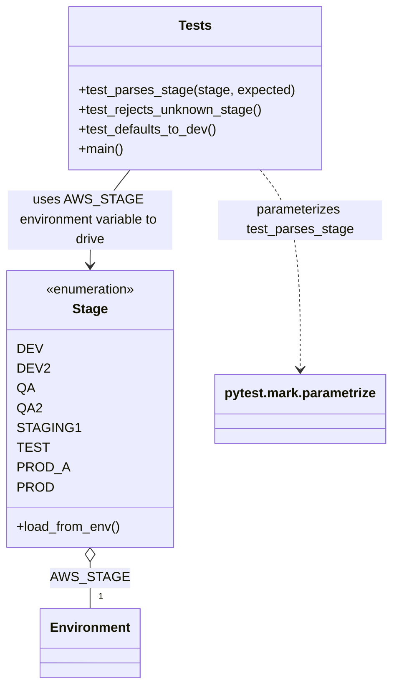

# Diagram: common/fv/python/tests/aws/test_stage.py

> Auto-generated by Obscura crawlers

## Mermaid

### SVG

<svg id="container" width="476.0390625" xmlns="http://www.w3.org/2000/svg" class="classDiagram" height="830" viewBox="0 0 476.0390625 830" role="graphics-document document" aria-roledescription="class"><g><defs><marker id="container_class-aggregationStart" class="marker aggregation class" refX="18" refY="7" markerWidth="190" markerHeight="240" orient="auto"><path d="M 18,7 L9,13 L1,7 L9,1 Z"></path></marker></defs><defs><marker id="container_class-aggregationEnd" class="marker aggregation class" refX="1" refY="7" markerWidth="20" markerHeight="28" orient="auto"><path d="M 18,7 L9,13 L1,7 L9,1 Z"></path></marker></defs><defs><marker id="container_class-extensionStart" class="marker extension class" refX="18" refY="7" markerWidth="190" markerHeight="240" orient="auto"><path d="M 1,7 L18,13 V 1 Z"></path></marker></defs><defs><marker id="container_class-extensionEnd" class="marker extension class" refX="1" refY="7" markerWidth="20" markerHeight="28" orient="auto"><path d="M 1,1 V 13 L18,7 Z"></path></marker></defs><defs><marker id="container_class-compositionStart" class="marker composition class" refX="18" refY="7" markerWidth="190" markerHeight="240" orient="auto"><path d="M 18,7 L9,13 L1,7 L9,1 Z"></path></marker></defs><defs><marker id="container_class-compositionEnd" class="marker composition class" refX="1" refY="7" markerWidth="20" markerHeight="28" orient="auto"><path d="M 18,7 L9,13 L1,7 L9,1 Z"></path></marker></defs><defs><marker id="container_class-dependencyStart" class="marker dependency class" refX="6" refY="7" markerWidth="190" markerHeight="240" orient="auto"><path d="M 5,7 L9,13 L1,7 L9,1 Z"></path></marker></defs><defs><marker id="container_class-dependencyEnd" class="marker dependency class" refX="13" refY="7" markerWidth="20" markerHeight="28" orient="auto"><path d="M 18,7 L9,13 L14,7 L9,1 Z"></path></marker></defs><defs><marker id="container_class-lollipopStart" class="marker lollipop class" refX="13" refY="7" markerWidth="190" markerHeight="240" orient="auto"><circle stroke="black" fill="transparent" cx="7" cy="7" r="6"></circle></marker></defs><defs><marker id="container_class-lollipopEnd" class="marker lollipop class" refX="1" refY="7" markerWidth="190" markerHeight="240" orient="auto"><circle stroke="black" fill="transparent" cx="7" cy="7" r="6"></circle></marker></defs><g class="root"><g class="clusters"></g><g class="edgePaths"><path d="M159.586,206L151.484,216.167C143.381,226.333,127.177,246.667,119.075,266C110.973,285.333,110.973,303.667,110.973,312.833L110.973,322" id="id_Tests_Stage_1" class="edge-thickness-normal edge-pattern-solid relation" style=";;;" data-edge="true" data-et="edge" data-id="id_Tests_Stage_1" data-points="W3sieCI6MTU5LjU4NTc1NDM5NDUzMTI1LCJ5IjoyMDZ9LHsieCI6MTEwLjk3MjY1NjI1LCJ5IjoyNjd9LHsieCI6MTEwLjk3MjY1NjI1LCJ5IjozMjh9XQ==" marker-end="url(#container_class-dependencyEnd)"></path><path d="M317.379,206L325.481,216.167C333.583,226.333,349.788,246.667,357.89,287C365.992,327.333,365.992,387.667,365.992,417.833L365.992,448" id="id_Tests_pytest.mark.parametrize_2" class="edge-thickness-normal edge-pattern-dashed relation" style=";;;" data-edge="true" data-et="edge" data-id="id_Tests_pytest.mark.parametrize_2" data-points="W3sieCI6MzE3LjM3OTA4OTM1NTQ2ODc1LCJ5IjoyMDZ9LHsieCI6MzY1Ljk5MjE4NzUsInkiOjI2N30seyJ4IjozNjUuOTkyMTg3NSwieSI6NDU0fV0=" marker-end="url(#container_class-dependencyEnd)"></path><path d="M110.973,681.25L110.973,684.542C110.973,687.833,110.973,694.417,110.973,703.875C110.973,713.333,110.973,725.667,110.973,731.833L110.973,738" id="id_Stage_Environment_3" class="edge-thickness-normal edge-pattern-solid relation" style=";;;" data-edge="true" data-et="edge" data-id="id_Stage_Environment_3" data-points="W3sieCI6MTEwLjk3MjY1NjI1LCJ5Ijo2NjR9LHsieCI6MTEwLjk3MjY1NjI1LCJ5Ijo3MDF9LHsieCI6MTEwLjk3MjY1NjI1LCJ5Ijo3Mzh9XQ==" marker-start="url(#container_class-aggregationStart)"></path></g><g class="edgeLabels"><g class="edgeLabel" transform="translate(110.97265625, 267)"><g class="label" data-id="id_Tests_Stage_1" transform="translate(-100, -36)"><foreignObject width="200" height="72">

uses AWS_STAGE environment variable to drive

</foreignObject></g></g><g class="edgeLabel" transform="translate(365.9921875, 267)"><g class="label" data-id="id_Tests_pytest.mark.parametrize_2" transform="translate(-100, -24)"><foreignObject width="200" height="48">

parameterizes test_parses_stage

</foreignObject></g></g><g class="edgeLabel" transform="translate(110.97265625, 701)"><g class="label" data-id="id_Stage_Environment_3" transform="translate(-40.984375, -12)"><foreignObject width="81.96875" height="24">

AWS_STAGE

</foreignObject></g></g><g class="edgeTerminals" transform="translate(120.97265812499992, 715.5000016071428)"><g class="inner" transform="translate(0, 0)"></g><foreignObject style="width: 9px; height: 12px;">
1
</foreignObject></g></g><g class="nodes"><g class="node default" id="classId-Stage-0" transform="translate(110.97265625, 496)"><g class="basic label-container"><path d="M-102.97265625 -168 L102.97265625 -168 L102.97265625 168 L-102.97265625 168" stroke="none" stroke-width="0" fill="#ECECFF" style=""></path><path d="M-102.97265625 -168 C-42.93985774040408 -168, 17.09294076919184 -168, 102.97265625 -168 M-102.97265625 -168 C-57.26417782259234 -168, -11.555699395184675 -168, 102.97265625 -168 M102.97265625 -168 C102.97265625 -99.99891443995034, 102.97265625 -31.99782887990068, 102.97265625 168 M102.97265625 -168 C102.97265625 -33.77914490792787, 102.97265625 100.44171018414426, 102.97265625 168 M102.97265625 168 C39.919801069239405 168, -23.13305411152119 168, -102.97265625 168 M102.97265625 168 C21.853909878946496 168, -59.26483649210701 168, -102.97265625 168 M-102.97265625 168 C-102.97265625 68.51940118556422, -102.97265625 -30.96119762887156, -102.97265625 -168 M-102.97265625 168 C-102.97265625 58.715448673889014, -102.97265625 -50.56910265222197, -102.97265625 -168" stroke="#9370DB" stroke-width="1.3" fill="none" stroke-dasharray="0 0" style=""></path></g><g class="annotation-group text" transform="translate(-55.5546875, -144)"><g class="label" style="" transform="translate(0,-12)"><foreignObject width="111.109375" height="24">

«enumeration»

</foreignObject></g></g><g class="label-group text" transform="translate(-20.5234375, -120)"><g class="label" style="font-weight: bolder" transform="translate(0,-12)"><foreignObject width="41.046875" height="24">

Stage

</foreignObject></g></g><g class="members-group text" transform="translate(-90.97265625, -72)"><g class="label" style="" transform="translate(0,-12)"><foreignObject width="27.765625" height="24">

DEV

</foreignObject></g><g class="label" style="" transform="translate(0,12)"><foreignObject width="35.6875" height="24">

DEV2

</foreignObject></g><g class="label" style="" transform="translate(0,36)"><foreignObject width="20.078125" height="24">

QA

</foreignObject></g><g class="label" style="" transform="translate(0,60)"><foreignObject width="28.15625" height="24">

QA2

</foreignObject></g><g class="label" style="" transform="translate(0,84)"><foreignObject width="67.15625" height="24">

STAGING1

</foreignObject></g><g class="label" style="" transform="translate(0,108)"><foreignObject width="33.3125" height="24">

TEST

</foreignObject></g><g class="label" style="" transform="translate(0,132)"><foreignObject width="57.0625" height="24">

PROD_A

</foreignObject></g><g class="label" style="" transform="translate(0,156)"><foreignObject width="40.21875" height="24">

PROD

</foreignObject></g></g><g class="methods-group text" transform="translate(-90.97265625, 144)"><g class="label" style="" transform="translate(0,-12)"><foreignObject width="126.390625" height="24">

+load_from_env()

</foreignObject></g></g><g class="divider" style=""><path d="M-102.97265625 -96 C-47.777136675281845 -96, 7.41838289943631 -96, 102.97265625 -96 M-102.97265625 -96 C-38.09574369339728 -96, 26.781168863205437 -96, 102.97265625 -96" stroke="#9370DB" stroke-width="1.3" fill="none" stroke-dasharray="0 0" style=""></path></g><g class="divider" style=""><path d="M-102.97265625 120 C-52.11144696290504 120, -1.2502376758100837 120, 102.97265625 120 M-102.97265625 120 C-43.99245277603215 120, 14.987750697935695 120, 102.97265625 120" stroke="#9370DB" stroke-width="1.3" fill="none" stroke-dasharray="0 0" style=""></path></g></g><g class="node default" id="classId-Tests-1" transform="translate(238.482421875, 107)"><g class="basic label-container"><path d="M-151.87109375 -99 L151.87109375 -99 L151.87109375 99 L-151.87109375 99" stroke="none" stroke-width="0" fill="#ECECFF" style=""></path><path d="M-151.87109375 -99 C-71.46555864364502 -99, 8.93997646270995 -99, 151.87109375 -99 M-151.87109375 -99 C-66.21185743017159 -99, 19.447378889656818 -99, 151.87109375 -99 M151.87109375 -99 C151.87109375 -35.71620204615973, 151.87109375 27.56759590768054, 151.87109375 99 M151.87109375 -99 C151.87109375 -49.99206487300851, 151.87109375 -0.9841297460170182, 151.87109375 99 M151.87109375 99 C79.09075614115697 99, 6.310418532313946 99, -151.87109375 99 M151.87109375 99 C74.1981173365989 99, -3.474859076802204 99, -151.87109375 99 M-151.87109375 99 C-151.87109375 23.22194803506649, -151.87109375 -52.55610392986702, -151.87109375 -99 M-151.87109375 99 C-151.87109375 30.731772728687645, -151.87109375 -37.53645454262471, -151.87109375 -99" stroke="#9370DB" stroke-width="1.3" fill="none" stroke-dasharray="0 0" style=""></path></g><g class="annotation-group text" transform="translate(0, -75)"></g><g class="label-group text" transform="translate(-19.1171875, -75)"><g class="label" style="font-weight: bolder" transform="translate(0,-12)"><foreignObject width="38.234375" height="24">

Tests

</foreignObject></g></g><g class="members-group text" transform="translate(-139.87109375, -27)"></g><g class="methods-group text" transform="translate(-139.87109375, 3)"><g class="label" style="" transform="translate(0,-12)"><foreignObject width="260.625" height="24">

+test_parses_stage(stage, expected)

</foreignObject></g><g class="label" style="" transform="translate(0,12)"><foreignObject width="223.53125" height="24">

+test_rejects_unknown_stage()

</foreignObject></g><g class="label" style="" transform="translate(0,36)"><foreignObject width="169.375" height="24">

+test_defaults_to_dev()

</foreignObject></g><g class="label" style="" transform="translate(0,60)"><foreignObject width="54.65625" height="24">

+main()

</foreignObject></g></g><g class="divider" style=""><path d="M-151.87109375 -51 C-50.34266672360569 -51, 51.18576030278862 -51, 151.87109375 -51 M-151.87109375 -51 C-83.36272535363878 -51, -14.85435695727756 -51, 151.87109375 -51" stroke="#9370DB" stroke-width="1.3" fill="none" stroke-dasharray="0 0" style=""></path></g><g class="divider" style=""><path d="M-151.87109375 -27 C-68.28010306630843 -27, 15.310887617383145 -27, 151.87109375 -27 M-151.87109375 -27 C-48.907747893992024 -27, 54.05559796201595 -27, 151.87109375 -27" stroke="#9370DB" stroke-width="1.3" fill="none" stroke-dasharray="0 0" style=""></path></g></g><g class="node default" id="classId-pytest.mark.parametrize-2" transform="translate(365.9921875, 496)"><g class="basic label-container"><path d="M-102.046875 -42 L102.046875 -42 L102.046875 42 L-102.046875 42" stroke="none" stroke-width="0" fill="#ECECFF" style=""></path><path d="M-102.046875 -42 C-32.10427235166526 -42, 37.83833029666948 -42, 102.046875 -42 M-102.046875 -42 C-21.45285499651871 -42, 59.14116500696258 -42, 102.046875 -42 M102.046875 -42 C102.046875 -10.761187365446528, 102.046875 20.477625269106944, 102.046875 42 M102.046875 -42 C102.046875 -15.788199810844297, 102.046875 10.423600378311406, 102.046875 42 M102.046875 42 C36.46290792424436 42, -29.121059151511275 42, -102.046875 42 M102.046875 42 C21.01321497344368 42, -60.02044505311264 42, -102.046875 42 M-102.046875 42 C-102.046875 25.121588659405568, -102.046875 8.243177318811135, -102.046875 -42 M-102.046875 42 C-102.046875 18.591191910219706, -102.046875 -4.817616179560588, -102.046875 -42" stroke="#9370DB" stroke-width="1.3" fill="none" stroke-dasharray="0 0" style=""></path></g><g class="annotation-group text" transform="translate(0, -18)"></g><g class="label-group text" transform="translate(-90.046875, -18)"><g class="label" style="font-weight: bolder" transform="translate(0,-12)"><foreignObject width="180.09375" height="24">

pytest.mark.parametrize

</foreignObject></g></g><g class="members-group text" transform="translate(-90.046875, 30)"></g><g class="methods-group text" transform="translate(-90.046875, 60)"></g><g class="divider" style=""><path d="M-102.046875 6 C-22.163357542030298 6, 57.720159915939405 6, 102.046875 6 M-102.046875 6 C-36.42663085588758 6, 29.19361328822484 6, 102.046875 6" stroke="#9370DB" stroke-width="1.3" fill="none" stroke-dasharray="0 0" style=""></path></g><g class="divider" style=""><path d="M-102.046875 24 C-35.64506714337824 24, 30.756740713243516 24, 102.046875 24 M-102.046875 24 C-48.49776315703648 24, 5.051348685927039 24, 102.046875 24" stroke="#9370DB" stroke-width="1.3" fill="none" stroke-dasharray="0 0" style=""></path></g></g><g class="node default" id="classId-Environment-3" transform="translate(110.97265625, 780)"><g class="basic label-container"><path d="M-58.1953125 -42 L58.1953125 -42 L58.1953125 42 L-58.1953125 42" stroke="none" stroke-width="0" fill="#ECECFF" style=""></path><path d="M-58.1953125 -42 C-21.236827536233157 -42, 15.721657427533685 -42, 58.1953125 -42 M-58.1953125 -42 C-23.610188397167477 -42, 10.974935705665047 -42, 58.1953125 -42 M58.1953125 -42 C58.1953125 -19.823113218456477, 58.1953125 2.3537735630870458, 58.1953125 42 M58.1953125 -42 C58.1953125 -23.258326992812275, 58.1953125 -4.516653985624551, 58.1953125 42 M58.1953125 42 C25.630172782954524 42, -6.934966934090951 42, -58.1953125 42 M58.1953125 42 C28.78762959378942 42, -0.6200533124211631 42, -58.1953125 42 M-58.1953125 42 C-58.1953125 24.136076873515194, -58.1953125 6.272153747030387, -58.1953125 -42 M-58.1953125 42 C-58.1953125 15.25875161727608, -58.1953125 -11.482496765447841, -58.1953125 -42" stroke="#9370DB" stroke-width="1.3" fill="none" stroke-dasharray="0 0" style=""></path></g><g class="annotation-group text" transform="translate(0, -18)"></g><g class="label-group text" transform="translate(-46.1953125, -18)"><g class="label" style="font-weight: bolder" transform="translate(0,-12)"><foreignObject width="92.390625" height="24">

Environment

</foreignObject></g></g><g class="members-group text" transform="translate(-46.1953125, 30)"></g><g class="methods-group text" transform="translate(-46.1953125, 60)"></g><g class="divider" style=""><path d="M-58.1953125 6 C-20.820658918160177 6, 16.553994663679646 6, 58.1953125 6 M-58.1953125 6 C-18.590895804875203 6, 21.013520890249595 6, 58.1953125 6" stroke="#9370DB" stroke-width="1.3" fill="none" stroke-dasharray="0 0" style=""></path></g><g class="divider" style=""><path d="M-58.1953125 24 C-14.346320631897825 24, 29.50267123620435 24, 58.1953125 24 M-58.1953125 24 C-16.951240912391327 24, 24.292830675217346 24, 58.1953125 24" stroke="#9370DB" stroke-width="1.3" fill="none" stroke-dasharray="0 0" style=""></path></g></g></g></g></g></svg>
