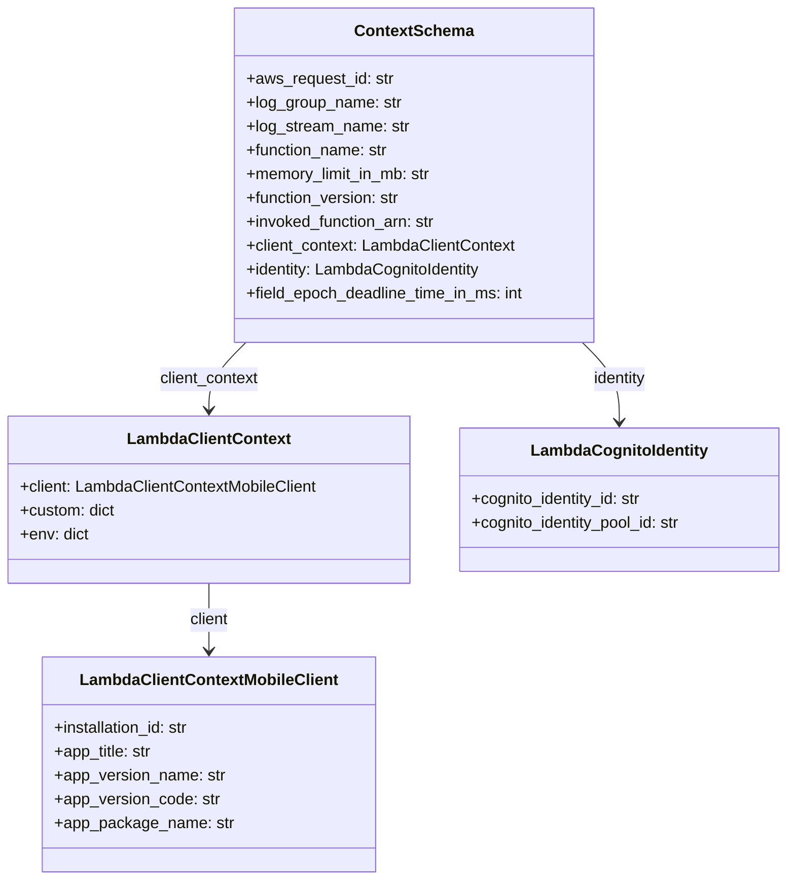

# Diagram: common/fv/python/tests/model/lambdas/test_context.py

> Auto-generated by Obscura crawlers

## Mermaid

### SVG

<svg id="container" width="797.578125" xmlns="http://www.w3.org/2000/svg" class="classDiagram" height="884" viewBox="0 0 797.578125 884" role="graphics-document document" aria-roledescription="class"><g><defs><marker id="container_class-aggregationStart" class="marker aggregation class" refX="18" refY="7" markerWidth="190" markerHeight="240" orient="auto"><path d="M 18,7 L9,13 L1,7 L9,1 Z"></path></marker></defs><defs><marker id="container_class-aggregationEnd" class="marker aggregation class" refX="1" refY="7" markerWidth="20" markerHeight="28" orient="auto"><path d="M 18,7 L9,13 L1,7 L9,1 Z"></path></marker></defs><defs><marker id="container_class-extensionStart" class="marker extension class" refX="18" refY="7" markerWidth="190" markerHeight="240" orient="auto"><path d="M 1,7 L18,13 V 1 Z"></path></marker></defs><defs><marker id="container_class-extensionEnd" class="marker extension class" refX="1" refY="7" markerWidth="20" markerHeight="28" orient="auto"><path d="M 1,1 V 13 L18,7 Z"></path></marker></defs><defs><marker id="container_class-compositionStart" class="marker composition class" refX="18" refY="7" markerWidth="190" markerHeight="240" orient="auto"><path d="M 18,7 L9,13 L1,7 L9,1 Z"></path></marker></defs><defs><marker id="container_class-compositionEnd" class="marker composition class" refX="1" refY="7" markerWidth="20" markerHeight="28" orient="auto"><path d="M 18,7 L9,13 L1,7 L9,1 Z"></path></marker></defs><defs><marker id="container_class-dependencyStart" class="marker dependency class" refX="6" refY="7" markerWidth="190" markerHeight="240" orient="auto"><path d="M 5,7 L9,13 L1,7 L9,1 Z"></path></marker></defs><defs><marker id="container_class-dependencyEnd" class="marker dependency class" refX="13" refY="7" markerWidth="20" markerHeight="28" orient="auto"><path d="M 18,7 L9,13 L14,7 L9,1 Z"></path></marker></defs><defs><marker id="container_class-lollipopStart" class="marker lollipop class" refX="13" refY="7" markerWidth="190" markerHeight="240" orient="auto"><circle stroke="black" fill="transparent" cx="7" cy="7" r="6"></circle></marker></defs><defs><marker id="container_class-lollipopEnd" class="marker lollipop class" refX="1" refY="7" markerWidth="190" markerHeight="240" orient="auto"><circle stroke="black" fill="transparent" cx="7" cy="7" r="6"></circle></marker></defs><g class="root"><g class="clusters"></g><g class="edgePaths"><path d="M248.183,344L241.929,350.167C235.675,356.333,223.168,368.667,216.914,380C210.66,391.333,210.66,401.667,210.66,406.833L210.66,412" id="id_ContextSchema_LambdaClientContext_1" class="edge-thickness-normal edge-pattern-solid relation" style=";;;" data-edge="true" data-et="edge" data-id="id_ContextSchema_LambdaClientContext_1" data-points="W3sieCI6MjQ4LjE4MjU4Mzg0MTQ2MzQsInkiOjM0NH0seyJ4IjoyMTAuNjYwMTU2MjUsInkiOjM4MX0seyJ4IjoyMTAuNjYwMTU2MjUsInkiOjQxOH1d" marker-end="url(#container_class-dependencyEnd)"></path><path d="M588.927,344L595.181,350.167C601.434,356.333,613.942,368.667,620.195,382C626.449,395.333,626.449,409.667,626.449,416.833L626.449,424" id="id_ContextSchema_LambdaCognitoIdentity_2" class="edge-thickness-normal edge-pattern-solid relation" style=";;;" data-edge="true" data-et="edge" data-id="id_ContextSchema_LambdaCognitoIdentity_2" data-points="W3sieCI6NTg4LjkyNjc5MTE1ODUzNjYsInkiOjM0NH0seyJ4Ijo2MjYuNDQ5MjE4NzUsInkiOjM4MX0seyJ4Ijo2MjYuNDQ5MjE4NzUsInkiOjQzMH1d" marker-end="url(#container_class-dependencyEnd)"></path><path d="M210.66,586L210.66,592.167C210.66,598.333,210.66,610.667,210.66,622C210.66,633.333,210.66,643.667,210.66,648.833L210.66,654" id="id_LambdaClientContext_LambdaClientContextMobileClient_3" class="edge-thickness-normal edge-pattern-solid relation" style=";;;" data-edge="true" data-et="edge" data-id="id_LambdaClientContext_LambdaClientContextMobileClient_3" data-points="W3sieCI6MjEwLjY2MDE1NjI1LCJ5Ijo1ODZ9LHsieCI6MjEwLjY2MDE1NjI1LCJ5Ijo2MjN9LHsieCI6MjEwLjY2MDE1NjI1LCJ5Ijo2NjB9XQ==" marker-end="url(#container_class-dependencyEnd)"></path></g><g class="edgeLabels"><g class="edgeLabel" transform="translate(210.66015625, 381)"><g class="label" data-id="id_ContextSchema_LambdaClientContext_1" transform="translate(-51.2109375, -12)"><foreignObject width="102.421875" height="24">

client_context

</foreignObject></g></g><g class="edgeLabel" transform="translate(626.44921875, 381)"><g class="label" data-id="id_ContextSchema_LambdaCognitoIdentity_2" transform="translate(-28.0234375, -12)"><foreignObject width="56.046875" height="24">

identity

</foreignObject></g></g><g class="edgeLabel" transform="translate(210.66015625, 623)"><g class="label" data-id="id_LambdaClientContext_LambdaClientContextMobileClient_3" transform="translate(-20.3671875, -12)"><foreignObject width="40.734375" height="24">

client

</foreignObject></g></g></g><g class="nodes"><g class="node default" id="classId-LambdaClientContextMobileClient-0" transform="translate(210.66015625, 768)"><g class="basic label-container"><path d="M-163.51953125 -108 L163.51953125 -108 L163.51953125 108 L-163.51953125 108" stroke="none" stroke-width="0" fill="#ECECFF" style=""></path><path d="M-163.51953125 -108 C-34.81923933123798 -108, 93.88105258752404 -108, 163.51953125 -108 M-163.51953125 -108 C-85.33968133711696 -108, -7.159831424233914 -108, 163.51953125 -108 M163.51953125 -108 C163.51953125 -35.796136570381464, 163.51953125 36.40772685923707, 163.51953125 108 M163.51953125 -108 C163.51953125 -32.86460502296147, 163.51953125 42.27078995407706, 163.51953125 108 M163.51953125 108 C53.472069006193735 108, -56.57539323761253 108, -163.51953125 108 M163.51953125 108 C39.78862142886918 108, -83.94228839226164 108, -163.51953125 108 M-163.51953125 108 C-163.51953125 47.24297868892182, -163.51953125 -13.514042622156353, -163.51953125 -108 M-163.51953125 108 C-163.51953125 22.04779705139444, -163.51953125 -63.90440589721112, -163.51953125 -108" stroke="#9370DB" stroke-width="1.3" fill="none" stroke-dasharray="0 0" style=""></path></g><g class="annotation-group text" transform="translate(0, -84)"></g><g class="label-group text" transform="translate(-124.5859375, -84)"><g class="label" style="font-weight: bolder" transform="translate(0,-12)"><foreignObject width="249.171875" height="24">

LambdaClientContextMobileClient

</foreignObject></g></g><g class="members-group text" transform="translate(-151.51953125, -36)"><g class="label" style="" transform="translate(0,-12)"><foreignObject width="140.46875" height="24">

+installation_id: str

</foreignObject></g><g class="label" style="" transform="translate(0,12)"><foreignObject width="99.875" height="24">

+app_title: str

</foreignObject></g><g class="label" style="" transform="translate(0,36)"><foreignObject width="172.484375" height="24">

+app_version_name: str

</foreignObject></g><g class="label" style="" transform="translate(0,60)"><foreignObject width="166.609375" height="24">

+app_version_code: str

</foreignObject></g><g class="label" style="" transform="translate(0,84)"><foreignObject width="178.453125" height="24">

+app_package_name: str

</foreignObject></g></g><g class="methods-group text" transform="translate(-151.51953125, 108)"></g><g class="divider" style=""><path d="M-163.51953125 -60 C-72.61955085345885 -60, 18.280429543082306 -60, 163.51953125 -60 M-163.51953125 -60 C-42.863798069429464 -60, 77.79193511114107 -60, 163.51953125 -60" stroke="#9370DB" stroke-width="1.3" fill="none" stroke-dasharray="0 0" style=""></path></g><g class="divider" style=""><path d="M-163.51953125 84 C-75.58052796184145 84, 12.358475326317091 84, 163.51953125 84 M-163.51953125 84 C-58.862723030032825 84, 45.79408518993435 84, 163.51953125 84" stroke="#9370DB" stroke-width="1.3" fill="none" stroke-dasharray="0 0" style=""></path></g></g><g class="node default" id="classId-LambdaClientContext-1" transform="translate(210.66015625, 502)"><g class="basic label-container"><path d="M-202.66015625 -84 L202.66015625 -84 L202.66015625 84 L-202.66015625 84" stroke="none" stroke-width="0" fill="#ECECFF" style=""></path><path d="M-202.66015625 -84 C-93.81846350252572 -84, 15.023229244948567 -84, 202.66015625 -84 M-202.66015625 -84 C-76.33776336814658 -84, 49.984629513706835 -84, 202.66015625 -84 M202.66015625 -84 C202.66015625 -40.90812962678953, 202.66015625 2.1837407464209377, 202.66015625 84 M202.66015625 -84 C202.66015625 -27.363144784475615, 202.66015625 29.27371043104877, 202.66015625 84 M202.66015625 84 C104.05148469236619 84, 5.442813134732376 84, -202.66015625 84 M202.66015625 84 C115.31678585294571 84, 27.973415455891427 84, -202.66015625 84 M-202.66015625 84 C-202.66015625 34.018160614744865, -202.66015625 -15.96367877051027, -202.66015625 -84 M-202.66015625 84 C-202.66015625 30.695978484143545, -202.66015625 -22.60804303171291, -202.66015625 -84" stroke="#9370DB" stroke-width="1.3" fill="none" stroke-dasharray="0 0" style=""></path></g><g class="annotation-group text" transform="translate(0, -60)"></g><g class="label-group text" transform="translate(-78.5703125, -60)"><g class="label" style="font-weight: bolder" transform="translate(0,-12)"><foreignObject width="157.140625" height="24">

LambdaClientContext

</foreignObject></g></g><g class="members-group text" transform="translate(-190.66015625, -12)"><g class="label" style="" transform="translate(0,-12)"><foreignObject width="302.75" height="24">

+client: LambdaClientContextMobileClient

</foreignObject></g><g class="label" style="" transform="translate(0,12)"><foreignObject width="96.4375" height="24">

+custom: dict

</foreignObject></g><g class="label" style="" transform="translate(0,36)"><foreignObject width="69.5" height="24">

+env: dict

</foreignObject></g></g><g class="methods-group text" transform="translate(-190.66015625, 84)"></g><g class="divider" style=""><path d="M-202.66015625 -36 C-89.44555574896893 -36, 23.769044752062143 -36, 202.66015625 -36 M-202.66015625 -36 C-77.62117057695066 -36, 47.41781509609868 -36, 202.66015625 -36" stroke="#9370DB" stroke-width="1.3" fill="none" stroke-dasharray="0 0" style=""></path></g><g class="divider" style=""><path d="M-202.66015625 60 C-105.64978494302422 60, -8.639413636048431 60, 202.66015625 60 M-202.66015625 60 C-52.42707402975029 60, 97.80600819049943 60, 202.66015625 60" stroke="#9370DB" stroke-width="1.3" fill="none" stroke-dasharray="0 0" style=""></path></g></g><g class="node default" id="classId-LambdaCognitoIdentity-2" transform="translate(626.44921875, 502)"><g class="basic label-container"><path d="M-163.12890625 -72 L163.12890625 -72 L163.12890625 72 L-163.12890625 72" stroke="none" stroke-width="0" fill="#ECECFF" style=""></path><path d="M-163.12890625 -72 C-58.237852935725726 -72, 46.65320037854855 -72, 163.12890625 -72 M-163.12890625 -72 C-43.85205542149771 -72, 75.42479540700458 -72, 163.12890625 -72 M163.12890625 -72 C163.12890625 -30.34359877289144, 163.12890625 11.31280245421712, 163.12890625 72 M163.12890625 -72 C163.12890625 -38.424655745745696, 163.12890625 -4.849311491491392, 163.12890625 72 M163.12890625 72 C49.76920677956625 72, -63.59049269086751 72, -163.12890625 72 M163.12890625 72 C35.184311592578794 72, -92.76028306484241 72, -163.12890625 72 M-163.12890625 72 C-163.12890625 42.0912752712008, -163.12890625 12.182550542401593, -163.12890625 -72 M-163.12890625 72 C-163.12890625 40.17953638648822, -163.12890625 8.359072772976447, -163.12890625 -72" stroke="#9370DB" stroke-width="1.3" fill="none" stroke-dasharray="0 0" style=""></path></g><g class="annotation-group text" transform="translate(0, -48)"></g><g class="label-group text" transform="translate(-85.8515625, -48)"><g class="label" style="font-weight: bolder" transform="translate(0,-12)"><foreignObject width="171.703125" height="24">

LambdaCognitoIdentity

</foreignObject></g></g><g class="members-group text" transform="translate(-151.12890625, 0)"><g class="label" style="" transform="translate(0,-12)"><foreignObject width="175.203125" height="24">

+cognito_identity_id: str

</foreignObject></g><g class="label" style="" transform="translate(0,12)"><foreignObject width="216.40625" height="24">

+cognito_identity_pool_id: str

</foreignObject></g></g><g class="methods-group text" transform="translate(-151.12890625, 72)"></g><g class="divider" style=""><path d="M-163.12890625 -24 C-95.45209672563969 -24, -27.775287201279383 -24, 163.12890625 -24 M-163.12890625 -24 C-53.48776169149991 -24, 56.153382867000175 -24, 163.12890625 -24" stroke="#9370DB" stroke-width="1.3" fill="none" stroke-dasharray="0 0" style=""></path></g><g class="divider" style=""><path d="M-163.12890625 48 C-79.3407398288827 48, 4.447426592234592 48, 163.12890625 48 M-163.12890625 48 C-56.90571182148362 48, 49.31748260703276 48, 163.12890625 48" stroke="#9370DB" stroke-width="1.3" fill="none" stroke-dasharray="0 0" style=""></path></g></g><g class="node default" id="classId-ContextSchema-3" transform="translate(418.5546875, 176)"><g class="basic label-container"><path d="M-182.21484375 -168 L182.21484375 -168 L182.21484375 168 L-182.21484375 168" stroke="none" stroke-width="0" fill="#ECECFF" style=""></path><path d="M-182.21484375 -168 C-38.78300971876635 -168, 104.6488243124673 -168, 182.21484375 -168 M-182.21484375 -168 C-72.52133775715537 -168, 37.17216823568927 -168, 182.21484375 -168 M182.21484375 -168 C182.21484375 -71.86218696181525, 182.21484375 24.27562607636949, 182.21484375 168 M182.21484375 -168 C182.21484375 -79.31563901160325, 182.21484375 9.368721976793495, 182.21484375 168 M182.21484375 168 C82.50331668001715 168, -17.2082103899657 168, -182.21484375 168 M182.21484375 168 C55.87046120977587 168, -70.47392133044826 168, -182.21484375 168 M-182.21484375 168 C-182.21484375 52.833084187362786, -182.21484375 -62.33383162527443, -182.21484375 -168 M-182.21484375 168 C-182.21484375 61.399321150610476, -182.21484375 -45.20135769877905, -182.21484375 -168" stroke="#9370DB" stroke-width="1.3" fill="none" stroke-dasharray="0 0" style=""></path></g><g class="annotation-group text" transform="translate(0, -144)"></g><g class="label-group text" transform="translate(-56.7578125, -144)"><g class="label" style="font-weight: bolder" transform="translate(0,-12)"><foreignObject width="113.515625" height="24">

ContextSchema

</foreignObject></g></g><g class="members-group text" transform="translate(-170.21484375, -96)"><g class="label" style="" transform="translate(0,-12)"><foreignObject width="148.484375" height="24">

+aws_request_id: str

</foreignObject></g><g class="label" style="" transform="translate(0,12)"><foreignObject width="156.984375" height="24">

+log_group_name: str

</foreignObject></g><g class="label" style="" transform="translate(0,36)"><foreignObject width="164.90625" height="24">

+log_stream_name: str

</foreignObject></g><g class="label" style="" transform="translate(0,60)"><foreignObject width="144.796875" height="24">

+function_name: str

</foreignObject></g><g class="label" style="" transform="translate(0,84)"><foreignObject width="189.65625" height="24">

+memory_limit_in_mb: str

</foreignObject></g><g class="label" style="" transform="translate(0,108)"><foreignObject width="156.96875" height="24">

+function_version: str

</foreignObject></g><g class="label" style="" transform="translate(0,132)"><foreignObject width="193.71875" height="24">

+invoked_function_arn: str

</foreignObject></g><g class="label" style="" transform="translate(0,156)"><foreignObject width="273.4375" height="24">

+client_context: LambdaClientContext

</foreignObject></g><g class="label" style="" transform="translate(0,180)"><foreignObject width="241.484375" height="24">

+identity: LambdaCognitoIdentity

</foreignObject></g><g class="label" style="" transform="translate(0,204)"><foreignObject width="283.671875" height="24">

+field_epoch_deadline_time_in_ms: int

</foreignObject></g></g><g class="methods-group text" transform="translate(-170.21484375, 168)"></g><g class="divider" style=""><path d="M-182.21484375 -120 C-98.42033627616475 -120, -14.625828802329494 -120, 182.21484375 -120 M-182.21484375 -120 C-94.46485663282063 -120, -6.714869515641254 -120, 182.21484375 -120" stroke="#9370DB" stroke-width="1.3" fill="none" stroke-dasharray="0 0" style=""></path></g><g class="divider" style=""><path d="M-182.21484375 144 C-44.398001744674815 144, 93.41884026065037 144, 182.21484375 144 M-182.21484375 144 C-36.75679400145583 144, 108.70125574708834 144, 182.21484375 144" stroke="#9370DB" stroke-width="1.3" fill="none" stroke-dasharray="0 0" style=""></path></g></g></g></g></g></svg>
