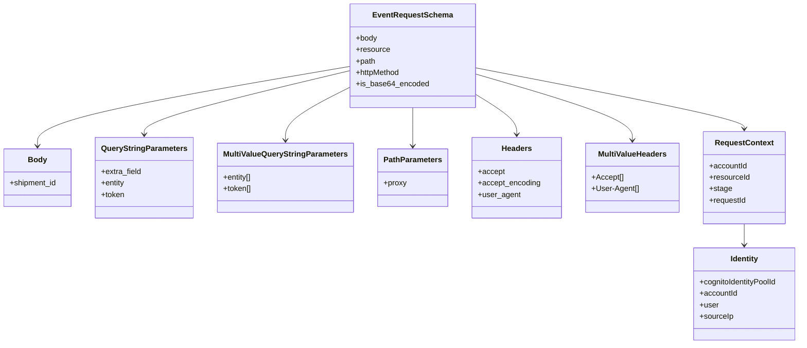

# Diagram: common/fv/python/tests/model/lambdas/test_event_request.py


> Auto-generated by Obscura crawlers

## Diagram 1



### SVG

<svg id="container" width="1631.61328125" xmlns="http://www.w3.org/2000/svg" class="classDiagram" height="716" viewBox="0 0 1631.61328125 716" role="graphics-document document" aria-roledescription="class"><style>#container{font-family:"trebuchet ms",verdana,arial,sans-serif;font-size:16px;fill:#333;}@keyframes edge-animation-frame{from{stroke-dashoffset:0;}}@keyframes dash{to{stroke-dashoffset:0;}}#container .edge-animation-slow{stroke-dasharray:9,5!important;stroke-dashoffset:900;animation:dash 50s linear infinite;stroke-linecap:round;}#container .edge-animation-fast{stroke-dasharray:9,5!important;stroke-dashoffset:900;animation:dash 20s linear infinite;stroke-linecap:round;}#container .error-icon{fill:#552222;}#container .error-text{fill:#552222;stroke:#552222;}#container .edge-thickness-normal{stroke-width:1px;}#container .edge-thickness-thick{stroke-width:3.5px;}#container .edge-pattern-solid{stroke-dasharray:0;}#container .edge-thickness-invisible{stroke-width:0;fill:none;}#container .edge-pattern-dashed{stroke-dasharray:3;}#container .edge-pattern-dotted{stroke-dasharray:2;}#container .marker{fill:#333333;stroke:#333333;}#container .marker.cross{stroke:#333333;}#container svg{font-family:"trebuchet ms",verdana,arial,sans-serif;font-size:16px;}#container p{margin:0;}#container g.classGroup text{fill:#9370DB;stroke:none;font-family:"trebuchet ms",verdana,arial,sans-serif;font-size:10px;}#container g.classGroup text .title{font-weight:bolder;}#container .nodeLabel,#container .edgeLabel{color:#131300;}#container .edgeLabel .label rect{fill:#ECECFF;}#container .label text{fill:#131300;}#container .labelBkg{background:#ECECFF;}#container .edgeLabel .label span{background:#ECECFF;}#container .classTitle{font-weight:bolder;}#container .node rect,#container .node circle,#container .node ellipse,#container .node polygon,#container .node path{fill:#ECECFF;stroke:#9370DB;stroke-width:1px;}#container .divider{stroke:#9370DB;stroke-width:1;}#container g.clickable{cursor:pointer;}#container g.classGroup rect{fill:#ECECFF;stroke:#9370DB;}#container g.classGroup line{stroke:#9370DB;stroke-width:1;}#container .classLabel .box{stroke:none;stroke-width:0;fill:#ECECFF;opacity:0.5;}#container .classLabel .label{fill:#9370DB;font-size:10px;}#container .relation{stroke:#333333;stroke-width:1;fill:none;}#container .dashed-line{stroke-dasharray:3;}#container .dotted-line{stroke-dasharray:1 2;}#container #compositionStart,#container .composition{fill:#333333!important;stroke:#333333!important;stroke-width:1;}#container #compositionEnd,#container .composition{fill:#333333!important;stroke:#333333!important;stroke-width:1;}#container #dependencyStart,#container .dependency{fill:#333333!important;stroke:#333333!important;stroke-width:1;}#container #dependencyStart,#container .dependency{fill:#333333!important;stroke:#333333!important;stroke-width:1;}#container #extensionStart,#container .extension{fill:transparent!important;stroke:#333333!important;stroke-width:1;}#container #extensionEnd,#container .extension{fill:transparent!important;stroke:#333333!important;stroke-width:1;}#container #aggregationStart,#container .aggregation{fill:transparent!important;stroke:#333333!important;stroke-width:1;}#container #aggregationEnd,#container .aggregation{fill:transparent!important;stroke:#333333!important;stroke-width:1;}#container #lollipopStart,#container .lollipop{fill:#ECECFF!important;stroke:#333333!important;stroke-width:1;}#container #lollipopEnd,#container .lollipop{fill:#ECECFF!important;stroke:#333333!important;stroke-width:1;}#container .edgeTerminals{font-size:11px;line-height:initial;}#container .classTitleText{text-anchor:middle;font-size:18px;fill:#333;}#container .label-icon{display:inline-block;height:1em;overflow:visible;vertical-align:-0.125em;}#container .node .label-icon path{fill:currentColor;stroke:revert;stroke-width:revert;}#container :root{--mermaid-font-family:"trebuchet ms",verdana,arial,sans-serif;}</style><g><defs><marker id="container_class-aggregationStart" class="marker aggregation class" refX="18" refY="7" markerWidth="190" markerHeight="240" orient="auto"><path d="M 18,7 L9,13 L1,7 L9,1 Z"></path></marker></defs><defs><marker id="container_class-aggregationEnd" class="marker aggregation class" refX="1" refY="7" markerWidth="20" markerHeight="28" orient="auto"><path d="M 18,7 L9,13 L1,7 L9,1 Z"></path></marker></defs><defs><marker id="container_class-extensionStart" class="marker extension class" refX="18" refY="7" markerWidth="190" markerHeight="240" orient="auto"><path d="M 1,7 L18,13 V 1 Z"></path></marker></defs><defs><marker id="container_class-extensionEnd" class="marker extension class" refX="1" refY="7" markerWidth="20" markerHeight="28" orient="auto"><path d="M 1,1 V 13 L18,7 Z"></path></marker></defs><defs><marker id="container_class-compositionStart" class="marker composition class" refX="18" refY="7" markerWidth="190" markerHeight="240" orient="auto"><path d="M 18,7 L9,13 L1,7 L9,1 Z"></path></marker></defs><defs><marker id="container_class-compositionEnd" class="marker composition class" refX="1" refY="7" markerWidth="20" markerHeight="28" orient="auto"><path d="M 18,7 L9,13 L1,7 L9,1 Z"></path></marker></defs><defs><marker id="container_class-dependencyStart" class="marker dependency class" refX="6" refY="7" markerWidth="190" markerHeight="240" orient="auto"><path d="M 5,7 L9,13 L1,7 L9,1 Z"></path></marker></defs><defs><marker id="container_class-dependencyEnd" class="marker dependency class" refX="13" refY="7" markerWidth="20" markerHeight="28" orient="auto"><path d="M 18,7 L9,13 L14,7 L9,1 Z"></path></marker></defs><defs><marker id="container_class-lollipopStart" class="marker lollipop class" refX="13" refY="7" markerWidth="190" markerHeight="240" orient="auto"><circle stroke="black" fill="transparent" cx="7" cy="7" r="6"></circle></marker></defs><defs><marker id="container_class-lollipopEnd" class="marker lollipop class" refX="1" refY="7" markerWidth="190" markerHeight="240" orient="auto"><circle stroke="black" fill="transparent" cx="7" cy="7" r="6"></circle></marker></defs><g class="root"><g class="clusters"></g><g class="edgePaths"><path d="M710.66,138.145L605.333,156.621C500.007,175.097,289.353,212.048,184.026,239.691C78.699,267.333,78.699,285.667,78.699,294.833L78.699,304" id="id_EventRequestSchema_Body_1" class="edge-thickness-normal edge-pattern-solid relation" style=";;;" data-edge="true" data-et="edge" data-id="id_EventRequestSchema_Body_1" data-points="W3sieCI6NzEwLjY2MDE1NjI1LCJ5IjoxMzguMTQ1MzEwOTQ2MzYyOTd9LHsieCI6NzguNjk5MjE4NzUsInkiOjI0OX0seyJ4Ijo3OC42OTkyMTg3NSwieSI6MzEwfV0=" marker-end="url(#container_class-dependencyEnd)"></path><path d="M710.66,147.1L641.718,164.083C572.776,181.067,434.892,215.033,365.95,237.183C297.008,259.333,297.008,269.667,297.008,274.833L297.008,280" id="id_EventRequestSchema_QueryStringParameters_2" class="edge-thickness-normal edge-pattern-solid relation" style=";;;" data-edge="true" data-et="edge" data-id="id_EventRequestSchema_QueryStringParameters_2" data-points="W3sieCI6NzEwLjY2MDE1NjI1LCJ5IjoxNDcuMDk5Nzk0NTIxNTM5MDV9LHsieCI6Mjk3LjAwNzgxMjUsInkiOjI0OX0seyJ4IjoyOTcuMDA3ODEyNSwieSI6Mjg2fV0=" marker-end="url(#container_class-dependencyEnd)"></path><path d="M710.66,181.543L689.005,192.786C667.349,204.029,624.038,226.514,602.382,244.924C580.727,263.333,580.727,277.667,580.727,284.833L580.727,292" id="id_EventRequestSchema_MultiValueQueryStringParameters_3" class="edge-thickness-normal edge-pattern-solid relation" style=";;;" data-edge="true" data-et="edge" data-id="id_EventRequestSchema_MultiValueQueryStringParameters_3" data-points="W3sieCI6NzEwLjY2MDE1NjI1LCJ5IjoxODEuNTQyNzg2MTMwMzQwNjN9LHsieCI6NTgwLjcyNjU2MjUsInkiOjI0OX0seyJ4Ijo1ODAuNzI2NTYyNSwieSI6Mjk4fV0=" marker-end="url(#container_class-dependencyEnd)"></path><path d="M836.906,224L836.906,228.167C836.906,232.333,836.906,240.667,836.906,254C836.906,267.333,836.906,285.667,836.906,294.833L836.906,304" id="id_EventRequestSchema_PathParameters_4" class="edge-thickness-normal edge-pattern-solid relation" style=";;;" data-edge="true" data-et="edge" data-id="id_EventRequestSchema_PathParameters_4" data-points="W3sieCI6ODM2LjkwNjI1LCJ5IjoyMjR9LHsieCI6ODM2LjkwNjI1LCJ5IjoyNDl9LHsieCI6ODM2LjkwNjI1LCJ5IjozMTB9XQ==" marker-end="url(#container_class-dependencyEnd)"></path><path d="M963.152,195.194L977.448,204.162C991.743,213.13,1020.335,231.065,1034.63,245.199C1048.926,259.333,1048.926,269.667,1048.926,274.833L1048.926,280" id="id_EventRequestSchema_Headers_5" class="edge-thickness-normal edge-pattern-solid relation" style=";;;" data-edge="true" data-et="edge" data-id="id_EventRequestSchema_Headers_5" data-points="W3sieCI6OTYzLjE1MjM0Mzc1LCJ5IjoxOTUuMTk0MjYyNzYzMjMzMDR9LHsieCI6MTA0OC45MjU3ODEyNSwieSI6MjQ5fSx7IngiOjEwNDguOTI1NzgxMjUsInkiOjI4Nn1d" marker-end="url(#container_class-dependencyEnd)"></path><path d="M963.152,153.366L1017.005,169.305C1070.858,185.244,1178.564,217.122,1232.417,240.228C1286.27,263.333,1286.27,277.667,1286.27,284.833L1286.27,292" id="id_EventRequestSchema_MultiValueHeaders_6" class="edge-thickness-normal edge-pattern-solid relation" style=";;;" data-edge="true" data-et="edge" data-id="id_EventRequestSchema_MultiValueHeaders_6" data-points="W3sieCI6OTYzLjE1MjM0Mzc1LCJ5IjoxNTMuMzY1NjA0MTA5OTgyfSx7IngiOjEyODYuMjY5NTMxMjUsInkiOjI0OX0seyJ4IjoxMjg2LjI2OTUzMTI1LCJ5IjoyOTh9XQ==" marker-end="url(#container_class-dependencyEnd)"></path><path d="M963.152,140.761L1055.13,158.801C1147.108,176.841,1331.064,212.92,1423.042,234.127C1515.02,255.333,1515.02,261.667,1515.02,264.833L1515.02,268" id="id_EventRequestSchema_RequestContext_7" class="edge-thickness-normal edge-pattern-solid relation" style=";;;" data-edge="true" data-et="edge" data-id="id_EventRequestSchema_RequestContext_7" data-points="W3sieCI6OTYzLjE1MjM0Mzc1LCJ5IjoxNDAuNzYwOTUyMDkwMTg1OX0seyJ4IjoxNTE1LjAxOTUzMTI1LCJ5IjoyNDl9LHsieCI6MTUxNS4wMTk1MzEyNSwieSI6Mjc0fV0=" marker-end="url(#container_class-dependencyEnd)"></path><path d="M1515.02,466L1515.02,470.167C1515.02,474.333,1515.02,482.667,1515.02,490C1515.02,497.333,1515.02,503.667,1515.02,506.833L1515.02,510" id="id_RequestContext_Identity_8" class="edge-thickness-normal edge-pattern-solid relation" style=";;;" data-edge="true" data-et="edge" data-id="id_RequestContext_Identity_8" data-points="W3sieCI6MTUxNS4wMTk1MzEyNSwieSI6NDY2fSx7IngiOjE1MTUuMDE5NTMxMjUsInkiOjQ5MX0seyJ4IjoxNTE1LjAxOTUzMTI1LCJ5Ijo1MTZ9XQ==" marker-end="url(#container_class-dependencyEnd)"></path></g><g class="edgeLabels"><g class="edgeLabel"><g class="label" data-id="id_EventRequestSchema_Body_1" transform="translate(0, 0)"><foreignObject width="0" height="0"><div xmlns="http://www.w3.org/1999/xhtml" class="labelBkg" style="display: table-cell; white-space: nowrap; line-height: 1.5; max-width: 200px; text-align: center;"><span class="edgeLabel"></span></div></foreignObject></g></g><g class="edgeLabel"><g class="label" data-id="id_EventRequestSchema_QueryStringParameters_2" transform="translate(0, 0)"><foreignObject width="0" height="0"><div xmlns="http://www.w3.org/1999/xhtml" class="labelBkg" style="display: table-cell; white-space: nowrap; line-height: 1.5; max-width: 200px; text-align: center;"><span class="edgeLabel"></span></div></foreignObject></g></g><g class="edgeLabel"><g class="label" data-id="id_EventRequestSchema_MultiValueQueryStringParameters_3" transform="translate(0, 0)"><foreignObject width="0" height="0"><div xmlns="http://www.w3.org/1999/xhtml" class="labelBkg" style="display: table-cell; white-space: nowrap; line-height: 1.5; max-width: 200px; text-align: center;"><span class="edgeLabel"></span></div></foreignObject></g></g><g class="edgeLabel"><g class="label" data-id="id_EventRequestSchema_PathParameters_4" transform="translate(0, 0)"><foreignObject width="0" height="0"><div xmlns="http://www.w3.org/1999/xhtml" class="labelBkg" style="display: table-cell; white-space: nowrap; line-height: 1.5; max-width: 200px; text-align: center;"><span class="edgeLabel"></span></div></foreignObject></g></g><g class="edgeLabel"><g class="label" data-id="id_EventRequestSchema_Headers_5" transform="translate(0, 0)"><foreignObject width="0" height="0"><div xmlns="http://www.w3.org/1999/xhtml" class="labelBkg" style="display: table-cell; white-space: nowrap; line-height: 1.5; max-width: 200px; text-align: center;"><span class="edgeLabel"></span></div></foreignObject></g></g><g class="edgeLabel"><g class="label" data-id="id_EventRequestSchema_MultiValueHeaders_6" transform="translate(0, 0)"><foreignObject width="0" height="0"><div xmlns="http://www.w3.org/1999/xhtml" class="labelBkg" style="display: table-cell; white-space: nowrap; line-height: 1.5; max-width: 200px; text-align: center;"><span class="edgeLabel"></span></div></foreignObject></g></g><g class="edgeLabel"><g class="label" data-id="id_EventRequestSchema_RequestContext_7" transform="translate(0, 0)"><foreignObject width="0" height="0"><div xmlns="http://www.w3.org/1999/xhtml" class="labelBkg" style="display: table-cell; white-space: nowrap; line-height: 1.5; max-width: 200px; text-align: center;"><span class="edgeLabel"></span></div></foreignObject></g></g><g class="edgeLabel"><g class="label" data-id="id_RequestContext_Identity_8" transform="translate(0, 0)"><foreignObject width="0" height="0"><div xmlns="http://www.w3.org/1999/xhtml" class="labelBkg" style="display: table-cell; white-space: nowrap; line-height: 1.5; max-width: 200px; text-align: center;"><span class="edgeLabel"></span></div></foreignObject></g></g></g><g class="nodes"><g class="node default" id="classId-EventRequestSchema-0" transform="translate(836.90625, 116)"><g class="basic label-container"><path d="M-126.24609375 -108 L126.24609375 -108 L126.24609375 108 L-126.24609375 108" stroke="none" stroke-width="0" fill="#ECECFF" style=""></path><path d="M-126.24609375 -108 C-29.217246778358486 -108, 67.81160019328303 -108, 126.24609375 -108 M-126.24609375 -108 C-30.123253478674528 -108, 65.99958679265094 -108, 126.24609375 -108 M126.24609375 -108 C126.24609375 -62.73450839139643, 126.24609375 -17.469016782792863, 126.24609375 108 M126.24609375 -108 C126.24609375 -34.75889399345988, 126.24609375 38.48221201308024, 126.24609375 108 M126.24609375 108 C28.872565834858378 108, -68.50096208028324 108, -126.24609375 108 M126.24609375 108 C50.62732643033594 108, -24.991440889328118 108, -126.24609375 108 M-126.24609375 108 C-126.24609375 26.93820491490885, -126.24609375 -54.1235901701823, -126.24609375 -108 M-126.24609375 108 C-126.24609375 35.81777476141498, -126.24609375 -36.36445047717004, -126.24609375 -108" stroke="#9370DB" stroke-width="1.3" fill="none" stroke-dasharray="0 0" style=""></path></g><g class="annotation-group text" transform="translate(0, -84)"></g><g class="label-group text" transform="translate(-78.7734375, -84)"><g class="label" style="font-weight: bolder" transform="translate(0,-12)"><foreignObject width="157.546875" height="24"><div xmlns="http://www.w3.org/1999/xhtml" style="display: table-cell; white-space: nowrap; line-height: 1.5; max-width: 206px; text-align: center;"><span class="nodeLabel markdown-node-label" style=""><p>EventRequestSchema</p></span></div></foreignObject></g></g><g class="members-group text" transform="translate(-114.24609375, -36)"><g class="label" style="" transform="translate(0,-12)"><foreignObject width="44.28125" height="24"><div xmlns="http://www.w3.org/1999/xhtml" style="display: table-cell; white-space: nowrap; line-height: 1.5; max-width: 102px; text-align: center;"><span class="nodeLabel markdown-node-label" style=""><p>+body</p></span></div></foreignObject></g><g class="label" style="" transform="translate(0,12)"><foreignObject width="70.28125" height="24"><div xmlns="http://www.w3.org/1999/xhtml" style="display: table-cell; white-space: nowrap; line-height: 1.5; max-width: 128px; text-align: center;"><span class="nodeLabel markdown-node-label" style=""><p>+resource</p></span></div></foreignObject></g><g class="label" style="" transform="translate(0,36)"><foreignObject width="41.1875" height="24"><div xmlns="http://www.w3.org/1999/xhtml" style="display: table-cell; white-space: nowrap; line-height: 1.5; max-width: 99px; text-align: center;"><span class="nodeLabel markdown-node-label" style=""><p>+path</p></span></div></foreignObject></g><g class="label" style="" transform="translate(0,60)"><foreignObject width="93.65625" height="24"><div xmlns="http://www.w3.org/1999/xhtml" style="display: table-cell; white-space: nowrap; line-height: 1.5; max-width: 151px; text-align: center;"><span class="nodeLabel markdown-node-label" style=""><p>+httpMethod</p></span></div></foreignObject></g><g class="label" style="" transform="translate(0,84)"><foreignObject width="149.71875" height="24"><div xmlns="http://www.w3.org/1999/xhtml" style="display: table-cell; white-space: nowrap; line-height: 1.5; max-width: 207px; text-align: center;"><span class="nodeLabel markdown-node-label" style=""><p>+is_base64_encoded</p></span></div></foreignObject></g></g><g class="methods-group text" transform="translate(-114.24609375, 108)"></g><g class="divider" style=""><path d="M-126.24609375 -60 C-41.300170687829095 -60, 43.64575237434181 -60, 126.24609375 -60 M-126.24609375 -60 C-31.85096638219956 -60, 62.54416098560088 -60, 126.24609375 -60" stroke="#9370DB" stroke-width="1.3" fill="none" stroke-dasharray="0 0" style=""></path></g><g class="divider" style=""><path d="M-126.24609375 84 C-75.05157081301073 84, -23.85704787602147 84, 126.24609375 84 M-126.24609375 84 C-56.28420530292415 84, 13.6776831441517 84, 126.24609375 84" stroke="#9370DB" stroke-width="1.3" fill="none" stroke-dasharray="0 0" style=""></path></g></g><g class="node default" id="classId-Body-1" transform="translate(78.69921875, 370)"><g class="basic label-container"><path d="M-70.69921875 -60 L70.69921875 -60 L70.69921875 60 L-70.69921875 60" stroke="none" stroke-width="0" fill="#ECECFF" style=""></path><path d="M-70.69921875 -60 C-21.06584891969529 -60, 28.567520910609417 -60, 70.69921875 -60 M-70.69921875 -60 C-19.012413530182428 -60, 32.674391689635144 -60, 70.69921875 -60 M70.69921875 -60 C70.69921875 -29.90643715143301, 70.69921875 0.18712569713397897, 70.69921875 60 M70.69921875 -60 C70.69921875 -35.89562926405, 70.69921875 -11.791258528099995, 70.69921875 60 M70.69921875 60 C36.28680612424847 60, 1.8743934984969428 60, -70.69921875 60 M70.69921875 60 C38.62145987158852 60, 6.5437009931770405 60, -70.69921875 60 M-70.69921875 60 C-70.69921875 14.443178232458664, -70.69921875 -31.113643535082673, -70.69921875 -60 M-70.69921875 60 C-70.69921875 13.641247924411594, -70.69921875 -32.71750415117681, -70.69921875 -60" stroke="#9370DB" stroke-width="1.3" fill="none" stroke-dasharray="0 0" style=""></path></g><g class="annotation-group text" transform="translate(0, -36)"></g><g class="label-group text" transform="translate(-18.5546875, -36)"><g class="label" style="font-weight: bolder" transform="translate(0,-12)"><foreignObject width="37.109375" height="24"><div xmlns="http://www.w3.org/1999/xhtml" style="display: table-cell; white-space: nowrap; line-height: 1.5; max-width: 87px; text-align: center;"><span class="nodeLabel markdown-node-label" style=""><p>Body</p></span></div></foreignObject></g></g><g class="members-group text" transform="translate(-58.69921875, 12)"><g class="label" style="" transform="translate(0,-12)"><foreignObject width="98.84375" height="24"><div xmlns="http://www.w3.org/1999/xhtml" style="display: table-cell; white-space: nowrap; line-height: 1.5; max-width: 156px; text-align: center;"><span class="nodeLabel markdown-node-label" style=""><p>+shipment_id</p></span></div></foreignObject></g></g><g class="methods-group text" transform="translate(-58.69921875, 60)"></g><g class="divider" style=""><path d="M-70.69921875 -12 C-15.773638709288797 -12, 39.15194133142241 -12, 70.69921875 -12 M-70.69921875 -12 C-19.908196496544754 -12, 30.882825756910492 -12, 70.69921875 -12" stroke="#9370DB" stroke-width="1.3" fill="none" stroke-dasharray="0 0" style=""></path></g><g class="divider" style=""><path d="M-70.69921875 36 C-14.33583830868735 36, 42.0275421326253 36, 70.69921875 36 M-70.69921875 36 C-23.93556092651926 36, 22.828096896961483 36, 70.69921875 36" stroke="#9370DB" stroke-width="1.3" fill="none" stroke-dasharray="0 0" style=""></path></g></g><g class="node default" id="classId-QueryStringParameters-2" transform="translate(297.0078125, 370)"><g class="basic label-container"><path d="M-97.609375 -84 L97.609375 -84 L97.609375 84 L-97.609375 84" stroke="none" stroke-width="0" fill="#ECECFF" style=""></path><path d="M-97.609375 -84 C-25.763042513254376 -84, 46.08328997349125 -84, 97.609375 -84 M-97.609375 -84 C-57.38202603914209 -84, -17.15467707828418 -84, 97.609375 -84 M97.609375 -84 C97.609375 -39.820431245751294, 97.609375 4.359137508497412, 97.609375 84 M97.609375 -84 C97.609375 -42.79566439021484, 97.609375 -1.5913287804296772, 97.609375 84 M97.609375 84 C45.93638972420506 84, -5.736595551589886 84, -97.609375 84 M97.609375 84 C24.69913657885303 84, -48.21110184229394 84, -97.609375 84 M-97.609375 84 C-97.609375 30.30670164229671, -97.609375 -23.386596715406583, -97.609375 -84 M-97.609375 84 C-97.609375 22.609713674781865, -97.609375 -38.78057265043627, -97.609375 -84" stroke="#9370DB" stroke-width="1.3" fill="none" stroke-dasharray="0 0" style=""></path></g><g class="annotation-group text" transform="translate(0, -60)"></g><g class="label-group text" transform="translate(-85.609375, -60)"><g class="label" style="font-weight: bolder" transform="translate(0,-12)"><foreignObject width="171.21875" height="24"><div xmlns="http://www.w3.org/1999/xhtml" style="display: table-cell; white-space: nowrap; line-height: 1.5; max-width: 218px; text-align: center;"><span class="nodeLabel markdown-node-label" style=""><p>QueryStringParameters</p></span></div></foreignObject></g></g><g class="members-group text" transform="translate(-85.609375, -12)"><g class="label" style="" transform="translate(0,-12)"><foreignObject width="84.515625" height="24"><div xmlns="http://www.w3.org/1999/xhtml" style="display: table-cell; white-space: nowrap; line-height: 1.5; max-width: 142px; text-align: center;"><span class="nodeLabel markdown-node-label" style=""><p>+extra_field</p></span></div></foreignObject></g><g class="label" style="" transform="translate(0,12)"><foreignObject width="49.9375" height="24"><div xmlns="http://www.w3.org/1999/xhtml" style="display: table-cell; white-space: nowrap; line-height: 1.5; max-width: 107px; text-align: center;"><span class="nodeLabel markdown-node-label" style=""><p>+entity</p></span></div></foreignObject></g><g class="label" style="" transform="translate(0,36)"><foreignObject width="48.9375" height="24"><div xmlns="http://www.w3.org/1999/xhtml" style="display: table-cell; white-space: nowrap; line-height: 1.5; max-width: 106px; text-align: center;"><span class="nodeLabel markdown-node-label" style=""><p>+token</p></span></div></foreignObject></g></g><g class="methods-group text" transform="translate(-85.609375, 84)"></g><g class="divider" style=""><path d="M-97.609375 -36 C-57.033291790471274 -36, -16.45720858094255 -36, 97.609375 -36 M-97.609375 -36 C-44.031778394086956 -36, 9.545818211826088 -36, 97.609375 -36" stroke="#9370DB" stroke-width="1.3" fill="none" stroke-dasharray="0 0" style=""></path></g><g class="divider" style=""><path d="M-97.609375 60 C-42.160542311116835 60, 13.28829037776633 60, 97.609375 60 M-97.609375 60 C-57.94721232732279 60, -18.285049654645576 60, 97.609375 60" stroke="#9370DB" stroke-width="1.3" fill="none" stroke-dasharray="0 0" style=""></path></g></g><g class="node default" id="classId-MultiValueQueryStringParameters-3" transform="translate(580.7265625, 370)"><g class="basic label-container"><path d="M-136.109375 -72 L136.109375 -72 L136.109375 72 L-136.109375 72" stroke="none" stroke-width="0" fill="#ECECFF" style=""></path><path d="M-136.109375 -72 C-63.67196928531885 -72, 8.765436429362296 -72, 136.109375 -72 M-136.109375 -72 C-65.99551051736351 -72, 4.1183539652729735 -72, 136.109375 -72 M136.109375 -72 C136.109375 -38.04267013054903, 136.109375 -4.085340261098054, 136.109375 72 M136.109375 -72 C136.109375 -34.32365582694214, 136.109375 3.352688346115727, 136.109375 72 M136.109375 72 C59.75728435437925 72, -16.594806291241497 72, -136.109375 72 M136.109375 72 C48.70655689963931 72, -38.69626120072138 72, -136.109375 72 M-136.109375 72 C-136.109375 20.81354320474371, -136.109375 -30.37291359051258, -136.109375 -72 M-136.109375 72 C-136.109375 20.819024665686094, -136.109375 -30.361950668627813, -136.109375 -72" stroke="#9370DB" stroke-width="1.3" fill="none" stroke-dasharray="0 0" style=""></path></g><g class="annotation-group text" transform="translate(0, -48)"></g><g class="label-group text" transform="translate(-124.109375, -48)"><g class="label" style="font-weight: bolder" transform="translate(0,-12)"><foreignObject width="248.21875" height="24"><div xmlns="http://www.w3.org/1999/xhtml" style="display: table-cell; white-space: nowrap; line-height: 1.5; max-width: 294px; text-align: center;"><span class="nodeLabel markdown-node-label" style=""><p>MultiValueQueryStringParameters</p></span></div></foreignObject></g></g><g class="members-group text" transform="translate(-124.109375, 0)"><g class="label" style="" transform="translate(0,-12)"><foreignObject width="60.25" height="24"><div xmlns="http://www.w3.org/1999/xhtml" style="display: table-cell; white-space: nowrap; line-height: 1.5; max-width: 118px; text-align: center;"><span class="nodeLabel markdown-node-label" style=""><p>+entity[]</p></span></div></foreignObject></g><g class="label" style="" transform="translate(0,12)"><foreignObject width="59.234375" height="24"><div xmlns="http://www.w3.org/1999/xhtml" style="display: table-cell; white-space: nowrap; line-height: 1.5; max-width: 117px; text-align: center;"><span class="nodeLabel markdown-node-label" style=""><p>+token[]</p></span></div></foreignObject></g></g><g class="methods-group text" transform="translate(-124.109375, 72)"></g><g class="divider" style=""><path d="M-136.109375 -24 C-46.27612828316673 -24, 43.557118433666545 -24, 136.109375 -24 M-136.109375 -24 C-35.942405977296715 -24, 64.22456304540657 -24, 136.109375 -24" stroke="#9370DB" stroke-width="1.3" fill="none" stroke-dasharray="0 0" style=""></path></g><g class="divider" style=""><path d="M-136.109375 48 C-62.35291839031228 48, 11.403538219375434 48, 136.109375 48 M-136.109375 48 C-47.29863145854034 48, 41.512112082919316 48, 136.109375 48" stroke="#9370DB" stroke-width="1.3" fill="none" stroke-dasharray="0 0" style=""></path></g></g><g class="node default" id="classId-PathParameters-4" transform="translate(836.90625, 370)"><g class="basic label-container"><path d="M-70.0703125 -60 L70.0703125 -60 L70.0703125 60 L-70.0703125 60" stroke="none" stroke-width="0" fill="#ECECFF" style=""></path><path d="M-70.0703125 -60 C-21.757833392364958 -60, 26.554645715270084 -60, 70.0703125 -60 M-70.0703125 -60 C-14.152361740747473 -60, 41.765589018505054 -60, 70.0703125 -60 M70.0703125 -60 C70.0703125 -29.926752285877466, 70.0703125 0.14649542824506767, 70.0703125 60 M70.0703125 -60 C70.0703125 -19.966398299345308, 70.0703125 20.067203401309385, 70.0703125 60 M70.0703125 60 C19.525924376076354 60, -31.018463747847292 60, -70.0703125 60 M70.0703125 60 C30.288562164135577 60, -9.493188171728846 60, -70.0703125 60 M-70.0703125 60 C-70.0703125 17.78892359071437, -70.0703125 -24.422152818571263, -70.0703125 -60 M-70.0703125 60 C-70.0703125 18.18604488845496, -70.0703125 -23.627910223090083, -70.0703125 -60" stroke="#9370DB" stroke-width="1.3" fill="none" stroke-dasharray="0 0" style=""></path></g><g class="annotation-group text" transform="translate(0, -36)"></g><g class="label-group text" transform="translate(-58.0703125, -36)"><g class="label" style="font-weight: bolder" transform="translate(0,-12)"><foreignObject width="116.140625" height="24"><div xmlns="http://www.w3.org/1999/xhtml" style="display: table-cell; white-space: nowrap; line-height: 1.5; max-width: 164px; text-align: center;"><span class="nodeLabel markdown-node-label" style=""><p>PathParameters</p></span></div></foreignObject></g></g><g class="members-group text" transform="translate(-58.0703125, 12)"><g class="label" style="" transform="translate(0,-12)"><foreignObject width="48.03125" height="24"><div xmlns="http://www.w3.org/1999/xhtml" style="display: table-cell; white-space: nowrap; line-height: 1.5; max-width: 106px; text-align: center;"><span class="nodeLabel markdown-node-label" style=""><p>+proxy</p></span></div></foreignObject></g></g><g class="methods-group text" transform="translate(-58.0703125, 60)"></g><g class="divider" style=""><path d="M-70.0703125 -12 C-30.728674891078924 -12, 8.612962717842152 -12, 70.0703125 -12 M-70.0703125 -12 C-16.585354109588906 -12, 36.89960428082219 -12, 70.0703125 -12" stroke="#9370DB" stroke-width="1.3" fill="none" stroke-dasharray="0 0" style=""></path></g><g class="divider" style=""><path d="M-70.0703125 36 C-37.61130674038327 36, -5.15230098076654 36, 70.0703125 36 M-70.0703125 36 C-22.527636361061333 36, 25.015039777877334 36, 70.0703125 36" stroke="#9370DB" stroke-width="1.3" fill="none" stroke-dasharray="0 0" style=""></path></g></g><g class="node default" id="classId-Headers-5" transform="translate(1048.92578125, 370)"><g class="basic label-container"><path d="M-91.94921875 -84 L91.94921875 -84 L91.94921875 84 L-91.94921875 84" stroke="none" stroke-width="0" fill="#ECECFF" style=""></path><path d="M-91.94921875 -84 C-49.100151242060704 -84, -6.2510837341214085 -84, 91.94921875 -84 M-91.94921875 -84 C-30.96691876843282 -84, 30.01538121313436 -84, 91.94921875 -84 M91.94921875 -84 C91.94921875 -21.538656156326113, 91.94921875 40.922687687347775, 91.94921875 84 M91.94921875 -84 C91.94921875 -45.49963439241969, 91.94921875 -6.999268784839387, 91.94921875 84 M91.94921875 84 C50.020549285068356 84, 8.091879820136711 84, -91.94921875 84 M91.94921875 84 C40.073727612433196 84, -11.801763525133609 84, -91.94921875 84 M-91.94921875 84 C-91.94921875 46.810822308359825, -91.94921875 9.62164461671965, -91.94921875 -84 M-91.94921875 84 C-91.94921875 41.27739013410165, -91.94921875 -1.4452197317966977, -91.94921875 -84" stroke="#9370DB" stroke-width="1.3" fill="none" stroke-dasharray="0 0" style=""></path></g><g class="annotation-group text" transform="translate(0, -60)"></g><g class="label-group text" transform="translate(-30.2421875, -60)"><g class="label" style="font-weight: bolder" transform="translate(0,-12)"><foreignObject width="60.484375" height="24"><div xmlns="http://www.w3.org/1999/xhtml" style="display: table-cell; white-space: nowrap; line-height: 1.5; max-width: 110px; text-align: center;"><span class="nodeLabel markdown-node-label" style=""><p>Headers</p></span></div></foreignObject></g></g><g class="members-group text" transform="translate(-79.94921875, -12)"><g class="label" style="" transform="translate(0,-12)"><foreignObject width="55.109375" height="24"><div xmlns="http://www.w3.org/1999/xhtml" style="display: table-cell; white-space: nowrap; line-height: 1.5; max-width: 113px; text-align: center;"><span class="nodeLabel markdown-node-label" style=""><p>+accept</p></span></div></foreignObject></g><g class="label" style="" transform="translate(0,12)"><foreignObject width="129.65625" height="24"><div xmlns="http://www.w3.org/1999/xhtml" style="display: table-cell; white-space: nowrap; line-height: 1.5; max-width: 188px; text-align: center;"><span class="nodeLabel markdown-node-label" style=""><p>+accept_encoding</p></span></div></foreignObject></g><g class="label" style="" transform="translate(0,36)"><foreignObject width="86.875" height="24"><div xmlns="http://www.w3.org/1999/xhtml" style="display: table-cell; white-space: nowrap; line-height: 1.5; max-width: 144px; text-align: center;"><span class="nodeLabel markdown-node-label" style=""><p>+user_agent</p></span></div></foreignObject></g></g><g class="methods-group text" transform="translate(-79.94921875, 84)"></g><g class="divider" style=""><path d="M-91.94921875 -36 C-38.04567354695021 -36, 15.857871656099576 -36, 91.94921875 -36 M-91.94921875 -36 C-50.510906983778824 -36, -9.072595217557648 -36, 91.94921875 -36" stroke="#9370DB" stroke-width="1.3" fill="none" stroke-dasharray="0 0" style=""></path></g><g class="divider" style=""><path d="M-91.94921875 60 C-43.33210826992829 60, 5.285002210143418 60, 91.94921875 60 M-91.94921875 60 C-36.12998584790657 60, 19.689247054186865 60, 91.94921875 60" stroke="#9370DB" stroke-width="1.3" fill="none" stroke-dasharray="0 0" style=""></path></g></g><g class="node default" id="classId-MultiValueHeaders-6" transform="translate(1286.26953125, 370)"><g class="basic label-container"><path d="M-95.39453125 -72 L95.39453125 -72 L95.39453125 72 L-95.39453125 72" stroke="none" stroke-width="0" fill="#ECECFF" style=""></path><path d="M-95.39453125 -72 C-30.860045359707684 -72, 33.67444053058463 -72, 95.39453125 -72 M-95.39453125 -72 C-45.00106638986486 -72, 5.39239847027028 -72, 95.39453125 -72 M95.39453125 -72 C95.39453125 -20.399136426021663, 95.39453125 31.201727147956674, 95.39453125 72 M95.39453125 -72 C95.39453125 -38.9939002645476, 95.39453125 -5.987800529095196, 95.39453125 72 M95.39453125 72 C50.48225705873764 72, 5.569982867475275 72, -95.39453125 72 M95.39453125 72 C24.27515051769575 72, -46.8442302146085 72, -95.39453125 72 M-95.39453125 72 C-95.39453125 37.540210579198366, -95.39453125 3.0804211583967316, -95.39453125 -72 M-95.39453125 72 C-95.39453125 18.334090323693047, -95.39453125 -35.331819352613905, -95.39453125 -72" stroke="#9370DB" stroke-width="1.3" fill="none" stroke-dasharray="0 0" style=""></path></g><g class="annotation-group text" transform="translate(0, -48)"></g><g class="label-group text" transform="translate(-68.7421875, -48)"><g class="label" style="font-weight: bolder" transform="translate(0,-12)"><foreignObject width="137.484375" height="24"><div xmlns="http://www.w3.org/1999/xhtml" style="display: table-cell; white-space: nowrap; line-height: 1.5; max-width: 186px; text-align: center;"><span class="nodeLabel markdown-node-label" style=""><p>MultiValueHeaders</p></span></div></foreignObject></g></g><g class="members-group text" transform="translate(-83.39453125, 0)"><g class="label" style="" transform="translate(0,-12)"><foreignObject width="65.953125" height="24"><div xmlns="http://www.w3.org/1999/xhtml" style="display: table-cell; white-space: nowrap; line-height: 1.5; max-width: 123px; text-align: center;"><span class="nodeLabel markdown-node-label" style=""><p>+Accept[]</p></span></div></foreignObject></g><g class="label" style="" transform="translate(0,12)"><foreignObject width="98.046875" height="24"><div xmlns="http://www.w3.org/1999/xhtml" style="display: table-cell; white-space: nowrap; line-height: 1.5; max-width: 155px; text-align: center;"><span class="nodeLabel markdown-node-label" style=""><p>+User-Agent[]</p></span></div></foreignObject></g></g><g class="methods-group text" transform="translate(-83.39453125, 72)"></g><g class="divider" style=""><path d="M-95.39453125 -24 C-42.476423108222285 -24, 10.44168503355543 -24, 95.39453125 -24 M-95.39453125 -24 C-40.612978603043985 -24, 14.168574043912031 -24, 95.39453125 -24" stroke="#9370DB" stroke-width="1.3" fill="none" stroke-dasharray="0 0" style=""></path></g><g class="divider" style=""><path d="M-95.39453125 48 C-52.40901645032768 48, -9.423501650655354 48, 95.39453125 48 M-95.39453125 48 C-26.782443841273718 48, 41.829643567452564 48, 95.39453125 48" stroke="#9370DB" stroke-width="1.3" fill="none" stroke-dasharray="0 0" style=""></path></g></g><g class="node default" id="classId-Identity-7" transform="translate(1515.01953125, 612)"><g class="basic label-container"><path d="M-108.59375 -96 L108.59375 -96 L108.59375 96 L-108.59375 96" stroke="none" stroke-width="0" fill="#ECECFF" style=""></path><path d="M-108.59375 -96 C-27.811689917359104 -96, 52.97037016528179 -96, 108.59375 -96 M-108.59375 -96 C-40.125942850449476 -96, 28.341864299101047 -96, 108.59375 -96 M108.59375 -96 C108.59375 -33.71379311195055, 108.59375 28.572413776098898, 108.59375 96 M108.59375 -96 C108.59375 -24.799371796685534, 108.59375 46.40125640662893, 108.59375 96 M108.59375 96 C64.175130253328 96, 19.756510506656014 96, -108.59375 96 M108.59375 96 C61.81001256342825 96, 15.026275126856504 96, -108.59375 96 M-108.59375 96 C-108.59375 56.77131901979739, -108.59375 17.542638039594777, -108.59375 -96 M-108.59375 96 C-108.59375 24.061207645353605, -108.59375 -47.87758470929279, -108.59375 -96" stroke="#9370DB" stroke-width="1.3" fill="none" stroke-dasharray="0 0" style=""></path></g><g class="annotation-group text" transform="translate(0, -72)"></g><g class="label-group text" transform="translate(-28.71875, -72)"><g class="label" style="font-weight: bolder" transform="translate(0,-12)"><foreignObject width="57.4375" height="24"><div xmlns="http://www.w3.org/1999/xhtml" style="display: table-cell; white-space: nowrap; line-height: 1.5; max-width: 106px; text-align: center;"><span class="nodeLabel markdown-node-label" style=""><p>Identity</p></span></div></foreignObject></g></g><g class="members-group text" transform="translate(-96.59375, -24)"><g class="label" style="" transform="translate(0,-12)"><foreignObject width="164.46875" height="24"><div xmlns="http://www.w3.org/1999/xhtml" style="display: table-cell; white-space: nowrap; line-height: 1.5; max-width: 222px; text-align: center;"><span class="nodeLabel markdown-node-label" style=""><p>+cognitoIdentityPoolId</p></span></div></foreignObject></g><g class="label" style="" transform="translate(0,12)"><foreignObject width="79.203125" height="24"><div xmlns="http://www.w3.org/1999/xhtml" style="display: table-cell; white-space: nowrap; line-height: 1.5; max-width: 137px; text-align: center;"><span class="nodeLabel markdown-node-label" style=""><p>+accountId</p></span></div></foreignObject></g><g class="label" style="" transform="translate(0,36)"><foreignObject width="39.671875" height="24"><div xmlns="http://www.w3.org/1999/xhtml" style="display: table-cell; white-space: nowrap; line-height: 1.5; max-width: 98px; text-align: center;"><span class="nodeLabel markdown-node-label" style=""><p>+user</p></span></div></foreignObject></g><g class="label" style="" transform="translate(0,60)"><foreignObject width="70.09375" height="24"><div xmlns="http://www.w3.org/1999/xhtml" style="display: table-cell; white-space: nowrap; line-height: 1.5; max-width: 127px; text-align: center;"><span class="nodeLabel markdown-node-label" style=""><p>+sourceIp</p></span></div></foreignObject></g></g><g class="methods-group text" transform="translate(-96.59375, 96)"></g><g class="divider" style=""><path d="M-108.59375 -48 C-35.24387878555099 -48, 38.10599242889802 -48, 108.59375 -48 M-108.59375 -48 C-46.27222929752995 -48, 16.049291404940107 -48, 108.59375 -48" stroke="#9370DB" stroke-width="1.3" fill="none" stroke-dasharray="0 0" style=""></path></g><g class="divider" style=""><path d="M-108.59375 72 C-25.21504601405566 72, 58.16365797188868 72, 108.59375 72 M-108.59375 72 C-57.09613540936556 72, -5.598520818731117 72, 108.59375 72" stroke="#9370DB" stroke-width="1.3" fill="none" stroke-dasharray="0 0" style=""></path></g></g><g class="node default" id="classId-RequestContext-8" transform="translate(1515.01953125, 370)"><g class="basic label-container"><path d="M-83.35546875 -96 L83.35546875 -96 L83.35546875 96 L-83.35546875 96" stroke="none" stroke-width="0" fill="#ECECFF" style=""></path><path d="M-83.35546875 -96 C-45.19340400065737 -96, -7.0313392513147335 -96, 83.35546875 -96 M-83.35546875 -96 C-26.599252493217627 -96, 30.156963763564747 -96, 83.35546875 -96 M83.35546875 -96 C83.35546875 -57.35537932248515, 83.35546875 -18.710758644970298, 83.35546875 96 M83.35546875 -96 C83.35546875 -51.31550736456842, 83.35546875 -6.631014729136837, 83.35546875 96 M83.35546875 96 C35.83189157811532 96, -11.691685593769364 96, -83.35546875 96 M83.35546875 96 C30.940686215416335 96, -21.47409631916733 96, -83.35546875 96 M-83.35546875 96 C-83.35546875 21.03994763095963, -83.35546875 -53.92010473808074, -83.35546875 -96 M-83.35546875 96 C-83.35546875 50.88472647794811, -83.35546875 5.769452955896213, -83.35546875 -96" stroke="#9370DB" stroke-width="1.3" fill="none" stroke-dasharray="0 0" style=""></path></g><g class="annotation-group text" transform="translate(0, -72)"></g><g class="label-group text" transform="translate(-58.1484375, -72)"><g class="label" style="font-weight: bolder" transform="translate(0,-12)"><foreignObject width="116.296875" height="24"><div xmlns="http://www.w3.org/1999/xhtml" style="display: table-cell; white-space: nowrap; line-height: 1.5; max-width: 164px; text-align: center;"><span class="nodeLabel markdown-node-label" style=""><p>RequestContext</p></span></div></foreignObject></g></g><g class="members-group text" transform="translate(-71.35546875, -24)"><g class="label" style="" transform="translate(0,-12)"><foreignObject width="79.203125" height="24"><div xmlns="http://www.w3.org/1999/xhtml" style="display: table-cell; white-space: nowrap; line-height: 1.5; max-width: 137px; text-align: center;"><span class="nodeLabel markdown-node-label" style=""><p>+accountId</p></span></div></foreignObject></g><g class="label" style="" transform="translate(0,12)"><foreignObject width="84.5625" height="24"><div xmlns="http://www.w3.org/1999/xhtml" style="display: table-cell; white-space: nowrap; line-height: 1.5; max-width: 142px; text-align: center;"><span class="nodeLabel markdown-node-label" style=""><p>+resourceId</p></span></div></foreignObject></g><g class="label" style="" transform="translate(0,36)"><foreignObject width="46.453125" height="24"><div xmlns="http://www.w3.org/1999/xhtml" style="display: table-cell; white-space: nowrap; line-height: 1.5; max-width: 104px; text-align: center;"><span class="nodeLabel markdown-node-label" style=""><p>+stage</p></span></div></foreignObject></g><g class="label" style="" transform="translate(0,60)"><foreignObject width="77.546875" height="24"><div xmlns="http://www.w3.org/1999/xhtml" style="display: table-cell; white-space: nowrap; line-height: 1.5; max-width: 135px; text-align: center;"><span class="nodeLabel markdown-node-label" style=""><p>+requestId</p></span></div></foreignObject></g></g><g class="methods-group text" transform="translate(-71.35546875, 96)"></g><g class="divider" style=""><path d="M-83.35546875 -48 C-40.87194051002162 -48, 1.611587729956753 -48, 83.35546875 -48 M-83.35546875 -48 C-47.55147354829913 -48, -11.747478346598257 -48, 83.35546875 -48" stroke="#9370DB" stroke-width="1.3" fill="none" stroke-dasharray="0 0" style=""></path></g><g class="divider" style=""><path d="M-83.35546875 72 C-27.963498460015046 72, 27.428471829969908 72, 83.35546875 72 M-83.35546875 72 C-37.083593898336936 72, 9.188280953326128 72, 83.35546875 72" stroke="#9370DB" stroke-width="1.3" fill="none" stroke-dasharray="0 0" style=""></path></g></g></g></g></g></svg>

## Diagram 2

```mermaid
flowchart TD
    HTTP_Request[Incoming HTTP Request / Lambda Event] --> Parse[Parse JSON / construct models]
    Parse --> EventSchema[EventRequestSchema instance]
    EventSchema -->|contains| BodyNode[Body(shipment_id)]
    EventSchema -->|contains| QSP[QueryStringParameters]
    EventSchema -->|contains| MVQSP[MultiValueQueryStringParameters]
    EventSchema -->|contains| PathParams[PathParameters]
    EventSchema -->|contains| HeadersNode[Headers / MultiValueHeaders]
    EventSchema -->|contains| ReqCtx[RequestContext]
    ReqCtx -->|includes| IdentityNode[Identity]
    EventSchema --> Validate[Validate fields & types]
    Validate --> Success[Processed / handed to business logic]
```

> SVG rendering failed for this diagram.
