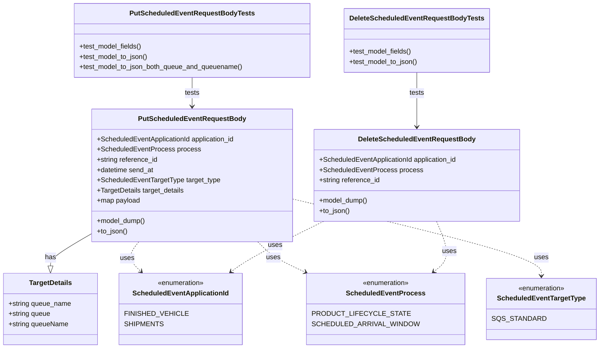

# Diagram: common/fv/python/tests/model/scheduled_event/test_scheduled_event_models.py

> Auto-generated by Obscura crawlers

## Mermaid

### SVG

<svg id="container" width="1334.001953125" xmlns="http://www.w3.org/2000/svg" class="classDiagram" height="818" viewBox="0 0 1334.001953125 818" role="graphics-document document" aria-roledescription="class"><g><defs><marker id="container_class-aggregationStart" class="marker aggregation class" refX="18" refY="7" markerWidth="190" markerHeight="240" orient="auto"><path d="M 18,7 L9,13 L1,7 L9,1 Z"></path></marker></defs><defs><marker id="container_class-aggregationEnd" class="marker aggregation class" refX="1" refY="7" markerWidth="20" markerHeight="28" orient="auto"><path d="M 18,7 L9,13 L1,7 L9,1 Z"></path></marker></defs><defs><marker id="container_class-extensionStart" class="marker extension class" refX="18" refY="7" markerWidth="190" markerHeight="240" orient="auto"><path d="M 1,7 L18,13 V 1 Z"></path></marker></defs><defs><marker id="container_class-extensionEnd" class="marker extension class" refX="1" refY="7" markerWidth="20" markerHeight="28" orient="auto"><path d="M 1,1 V 13 L18,7 Z"></path></marker></defs><defs><marker id="container_class-compositionStart" class="marker composition class" refX="18" refY="7" markerWidth="190" markerHeight="240" orient="auto"><path d="M 18,7 L9,13 L1,7 L9,1 Z"></path></marker></defs><defs><marker id="container_class-compositionEnd" class="marker composition class" refX="1" refY="7" markerWidth="20" markerHeight="28" orient="auto"><path d="M 18,7 L9,13 L1,7 L9,1 Z"></path></marker></defs><defs><marker id="container_class-dependencyStart" class="marker dependency class" refX="6" refY="7" markerWidth="190" markerHeight="240" orient="auto"><path d="M 5,7 L9,13 L1,7 L9,1 Z"></path></marker></defs><defs><marker id="container_class-dependencyEnd" class="marker dependency class" refX="13" refY="7" markerWidth="20" markerHeight="28" orient="auto"><path d="M 18,7 L9,13 L14,7 L9,1 Z"></path></marker></defs><defs><marker id="container_class-lollipopStart" class="marker lollipop class" refX="13" refY="7" markerWidth="190" markerHeight="240" orient="auto"><circle stroke="black" fill="transparent" cx="7" cy="7" r="6"></circle></marker></defs><defs><marker id="container_class-lollipopEnd" class="marker lollipop class" refX="1" refY="7" markerWidth="190" markerHeight="240" orient="auto"><circle stroke="black" fill="transparent" cx="7" cy="7" r="6"></circle></marker></defs><g class="root"><g class="clusters"></g><g class="edgePaths"><path d="M200.672,555.118L186.949,563.432C173.225,571.746,145.779,588.373,132.055,599.978C118.332,611.583,118.332,618.167,118.332,621.458L118.332,624.75" id="id_PutScheduledEventRequestBody_TargetDetails_1" class="edge-thickness-normal edge-pattern-solid relation" style=";;;" data-edge="true" data-et="edge" data-id="id_PutScheduledEventRequestBody_TargetDetails_1" data-points="W3sieCI6MjAwLjY3MTg3NSwieSI6NTU1LjExODM1NzQ4NzkyMjd9LHsieCI6MTE4LjMzMjAzMTI1LCJ5Ijo2MDV9LHsieCI6MTE4LjMzMjAzMTI1LCJ5Ijo2NDJ9XQ==" marker-end="url(#container_class-extensionEnd)"></path><path d="M317.338,568L312.611,574.167C307.884,580.333,298.431,592.667,299.185,604.294C299.939,615.922,310.901,626.843,316.382,632.304L321.863,637.765" id="id_PutScheduledEventRequestBody_ScheduledEventApplicationId_2" class="edge-thickness-normal edge-pattern-dashed relation" style=";;;" data-edge="true" data-et="edge" data-id="id_PutScheduledEventRequestBody_ScheduledEventApplicationId_2" data-points="W3sieCI6MzE3LjMzODM4NjQ5NjExMzk3LCJ5Ijo1Njh9LHsieCI6Mjg4Ljk3NjU2MjUsInkiOjYwNX0seyJ4IjozMjYuMTEzOTI2OTExMTU3LCJ5Ijo2NDJ9XQ==" marker-end="url(#container_class-dependencyEnd)"></path><path d="M577.671,568L583.235,574.167C588.799,580.333,599.927,592.667,620.849,605.869C641.771,619.072,672.487,633.144,687.845,640.18L703.203,647.216" id="id_PutScheduledEventRequestBody_ScheduledEventProcess_3" class="edge-thickness-normal edge-pattern-dashed relation" style=";;;" data-edge="true" data-et="edge" data-id="id_PutScheduledEventRequestBody_ScheduledEventProcess_3" data-points="W3sieCI6NTc3LjY3MDk2NDIxNjMyMTIsInkiOjU2OH0seyJ4Ijo2MTEuMDU0Njg3NSwieSI6NjA1fSx7IngiOjcwOC42NTgyMDMxMjUsInkiOjY0OS43MTU0MjY2NTI5NjE0fV0=" marker-end="url(#container_class-dependencyEnd)"></path><path d="M673.164,471.067L762.444,493.389C851.723,515.712,1030.283,560.356,1119.562,589.845C1208.842,619.333,1208.842,633.667,1208.842,640.833L1208.842,648" id="id_PutScheduledEventRequestBody_ScheduledEventTargetType_4" class="edge-thickness-normal edge-pattern-dashed relation" style=";;;" data-edge="true" data-et="edge" data-id="id_PutScheduledEventRequestBody_ScheduledEventTargetType_4" data-points="W3sieCI6NjczLjE2NDA2MjUsInkiOjQ3MS4wNjczNTE1MDg2MzQzfSx7IngiOjEyMDguODQxNzk2ODc1LCJ5Ijo2MDV9LHsieCI6MTIwOC44NDE3OTY4NzUsInkiOjY1NH1d" marker-end="url(#container_class-dependencyEnd)"></path><path d="M737.353,520L707.473,534.167C677.592,548.333,617.831,576.667,581.2,596.366C544.568,616.066,531.066,627.131,524.315,632.664L517.563,638.197" id="id_DeleteScheduledEventRequestBody_ScheduledEventApplicationId_5" class="edge-thickness-normal edge-pattern-dashed relation" style=";;;" data-edge="true" data-et="edge" data-id="id_DeleteScheduledEventRequestBody_ScheduledEventApplicationId_5" data-points="W3sieCI6NzM3LjM1MzQyNDU0NjYzMjEsInkiOjUyMH0seyJ4Ijo1NTguMDcwMzEyNSwieSI6NjA1fSx7IngiOjUxMi45MjI4MTEyMDg2Nzc3LCJ5Ijo2NDJ9XQ==" marker-end="url(#container_class-dependencyEnd)"></path><path d="M993.332,520L997.029,534.167C1000.726,548.333,1008.12,576.667,1005.422,596.347C1002.723,616.027,989.933,627.055,983.538,632.568L977.143,638.082" id="id_DeleteScheduledEventRequestBody_ScheduledEventProcess_6" class="edge-thickness-normal edge-pattern-dashed relation" style=";;;" data-edge="true" data-et="edge" data-id="id_DeleteScheduledEventRequestBody_ScheduledEventProcess_6" data-points="W3sieCI6OTkzLjMzMjA5MTk2ODkxMTksInkiOjUyMH0seyJ4IjoxMDE1LjUxMzY3MTg3NSwieSI6NjA1fSx7IngiOjk3Mi41OTg2NDA4ODMyNjQ1LCJ5Ijo2NDJ9XQ==" marker-end="url(#container_class-dependencyEnd)"></path><path d="M436.918,182L436.918,188.167C436.918,194.333,436.918,206.667,436.918,218C436.918,229.333,436.918,239.667,436.918,244.833L436.918,250" id="id_PutScheduledEventRequestBodyTests_PutScheduledEventRequestBody_7" class="edge-thickness-normal edge-pattern-solid relation" style=";;;" data-edge="true" data-et="edge" data-id="id_PutScheduledEventRequestBodyTests_PutScheduledEventRequestBody_7" data-points="W3sieCI6NDM2LjkxNzk2ODc1LCJ5IjoxODJ9LHsieCI6NDM2LjkxNzk2ODc1LCJ5IjoyMTl9LHsieCI6NDM2LjkxNzk2ODc1LCJ5IjoyNTZ9XQ==" marker-end="url(#container_class-dependencyEnd)"></path><path d="M965.148,170L965.148,178.167C965.148,186.333,965.148,202.667,965.148,224C965.148,245.333,965.148,271.667,965.148,284.833L965.148,298" id="id_DeleteScheduledEventRequestBodyTests_DeleteScheduledEventRequestBody_8" class="edge-thickness-normal edge-pattern-solid relation" style=";;;" data-edge="true" data-et="edge" data-id="id_DeleteScheduledEventRequestBodyTests_DeleteScheduledEventRequestBody_8" data-points="W3sieCI6OTY1LjE0ODQzNzUsInkiOjE3MH0seyJ4Ijo5NjUuMTQ4NDM3NSwieSI6MjE5fSx7IngiOjk2NS4xNDg0Mzc1LCJ5IjozMDR9XQ==" marker-end="url(#container_class-dependencyEnd)"></path></g><g class="edgeLabels"><g class="edgeLabel" transform="translate(118.33203125, 605)"><g class="label" data-id="id_PutScheduledEventRequestBody_TargetDetails_1" transform="translate(-12.703125, -12)"><foreignObject width="25.40625" height="24">

has

</foreignObject></g></g><g class="edgeLabel" transform="translate(291.03219, 607.04803)"><g class="label" data-id="id_PutScheduledEventRequestBody_ScheduledEventApplicationId_2" transform="translate(-16.4921875, -12)"><foreignObject width="32.984375" height="24">

uses

</foreignObject></g></g><g class="edgeLabel" transform="translate(637.20335, 616.97958)"><g class="label" data-id="id_PutScheduledEventRequestBody_ScheduledEventProcess_3" transform="translate(-16.4921875, -12)"><foreignObject width="32.984375" height="24">

uses

</foreignObject></g></g><g class="edgeLabel" transform="translate(1208.841796875, 605)"><g class="label" data-id="id_PutScheduledEventRequestBody_ScheduledEventTargetType_4" transform="translate(-16.4921875, -12)"><foreignObject width="32.984375" height="24">

uses

</foreignObject></g></g><g class="edgeLabel" transform="translate(621.3397, 575.00332)"><g class="label" data-id="id_DeleteScheduledEventRequestBody_ScheduledEventApplicationId_5" transform="translate(-16.4921875, -12)"><foreignObject width="32.984375" height="24">

uses

</foreignObject></g></g><g class="edgeLabel" transform="translate(1011.57669, 589.91346)"><g class="label" data-id="id_DeleteScheduledEventRequestBody_ScheduledEventProcess_6" transform="translate(-16.4921875, -12)"><foreignObject width="32.984375" height="24">

uses

</foreignObject></g></g><g class="edgeLabel" transform="translate(436.91796875, 219)"><g class="label" data-id="id_PutScheduledEventRequestBodyTests_PutScheduledEventRequestBody_7" transform="translate(-17.4921875, -12)"><foreignObject width="34.984375" height="24">

tests

</foreignObject></g></g><g class="edgeLabel" transform="translate(965.1484375, 219)"><g class="label" data-id="id_DeleteScheduledEventRequestBodyTests_DeleteScheduledEventRequestBody_8" transform="translate(-17.4921875, -12)"><foreignObject width="34.984375" height="24">

tests

</foreignObject></g></g></g><g class="nodes"><g class="node default" id="classId-ScheduledEventApplicationId-0" transform="translate(410.42578125, 726)"><g class="basic label-container"><path d="M-131.76171875 -84 L131.76171875 -84 L131.76171875 84 L-131.76171875 84" stroke="none" stroke-width="0" fill="#ECECFF" style=""></path><path d="M-131.76171875 -84 C-57.63355107577726 -84, 16.494616598445475 -84, 131.76171875 -84 M-131.76171875 -84 C-63.43030641100691 -84, 4.90110592798618 -84, 131.76171875 -84 M131.76171875 -84 C131.76171875 -47.07917464503227, 131.76171875 -10.158349290064535, 131.76171875 84 M131.76171875 -84 C131.76171875 -29.780905877518357, 131.76171875 24.438188244963285, 131.76171875 84 M131.76171875 84 C41.90920827869931 84, -47.94330219260138 84, -131.76171875 84 M131.76171875 84 C32.56091592827737 84, -66.63988689344527 84, -131.76171875 84 M-131.76171875 84 C-131.76171875 38.41386245279423, -131.76171875 -7.172275094411546, -131.76171875 -84 M-131.76171875 84 C-131.76171875 45.30953871565569, -131.76171875 6.619077431311382, -131.76171875 -84" stroke="#9370DB" stroke-width="1.3" fill="none" stroke-dasharray="0 0" style=""></path></g><g class="annotation-group text" transform="translate(-55.5546875, -60)"><g class="label" style="" transform="translate(0,-12)"><foreignObject width="111.109375" height="24">

«enumeration»

</foreignObject></g></g><g class="label-group text" transform="translate(-107.3984375, -36)"><g class="label" style="font-weight: bolder" transform="translate(0,-12)"><foreignObject width="214.796875" height="24">

ScheduledEventApplicationId

</foreignObject></g></g><g class="members-group text" transform="translate(-119.76171875, 12)"><g class="label" style="" transform="translate(0,-12)"><foreignObject width="132.125" height="24">

FINISHED_VEHICLE

</foreignObject></g><g class="label" style="" transform="translate(0,12)"><foreignObject width="81.75" height="24">

SHIPMENTS

</foreignObject></g></g><g class="methods-group text" transform="translate(-119.76171875, 84)"></g><g class="divider" style=""><path d="M-131.76171875 -12 C-47.90828192987942 -12, 35.945154890241156 -12, 131.76171875 -12 M-131.76171875 -12 C-52.014335990438994 -12, 27.733046769122012 -12, 131.76171875 -12" stroke="#9370DB" stroke-width="1.3" fill="none" stroke-dasharray="0 0" style=""></path></g><g class="divider" style=""><path d="M-131.76171875 60 C-52.04673614823473 60, 27.668246453530543 60, 131.76171875 60 M-131.76171875 60 C-44.522899834107605 60, 42.71591908178479 60, 131.76171875 60" stroke="#9370DB" stroke-width="1.3" fill="none" stroke-dasharray="0 0" style=""></path></g></g><g class="node default" id="classId-ScheduledEventProcess-1" transform="translate(875.169921875, 726)"><g class="basic label-container"><path d="M-166.51171875 -84 L166.51171875 -84 L166.51171875 84 L-166.51171875 84" stroke="none" stroke-width="0" fill="#ECECFF" style=""></path><path d="M-166.51171875 -84 C-74.29698767922291 -84, 17.917743391554183 -84, 166.51171875 -84 M-166.51171875 -84 C-60.107114050928686 -84, 46.29749064814263 -84, 166.51171875 -84 M166.51171875 -84 C166.51171875 -17.70301478367324, 166.51171875 48.59397043265352, 166.51171875 84 M166.51171875 -84 C166.51171875 -25.700235244490862, 166.51171875 32.599529511018275, 166.51171875 84 M166.51171875 84 C99.19336098302719 84, 31.87500321605438 84, -166.51171875 84 M166.51171875 84 C96.10472450585003 84, 25.69773026170006 84, -166.51171875 84 M-166.51171875 84 C-166.51171875 42.029919256486735, -166.51171875 0.05983851297347087, -166.51171875 -84 M-166.51171875 84 C-166.51171875 40.984610661758055, -166.51171875 -2.030778676483891, -166.51171875 -84" stroke="#9370DB" stroke-width="1.3" fill="none" stroke-dasharray="0 0" style=""></path></g><g class="annotation-group text" transform="translate(-55.5546875, -60)"><g class="label" style="" transform="translate(0,-12)"><foreignObject width="111.109375" height="24">

«enumeration»

</foreignObject></g></g><g class="label-group text" transform="translate(-86.6171875, -36)"><g class="label" style="font-weight: bolder" transform="translate(0,-12)"><foreignObject width="173.234375" height="24">

ScheduledEventProcess

</foreignObject></g></g><g class="members-group text" transform="translate(-154.51171875, 12)"><g class="label" style="" transform="translate(0,-12)"><foreignObject width="195.828125" height="24">

PRODUCT_LIFECYCLE_STATE

</foreignObject></g><g class="label" style="" transform="translate(0,12)"><foreignObject width="222.40625" height="24">

SCHEDULED_ARRIVAL_WINDOW

</foreignObject></g></g><g class="methods-group text" transform="translate(-154.51171875, 84)"></g><g class="divider" style=""><path d="M-166.51171875 -12 C-72.57055095412316 -12, 21.370616841753673 -12, 166.51171875 -12 M-166.51171875 -12 C-77.2934919034577 -12, 11.924734943084587 -12, 166.51171875 -12" stroke="#9370DB" stroke-width="1.3" fill="none" stroke-dasharray="0 0" style=""></path></g><g class="divider" style=""><path d="M-166.51171875 60 C-45.760898022766355 60, 74.98992270446729 60, 166.51171875 60 M-166.51171875 60 C-74.73695018037854 60, 17.037818389242915 60, 166.51171875 60" stroke="#9370DB" stroke-width="1.3" fill="none" stroke-dasharray="0 0" style=""></path></g></g><g class="node default" id="classId-ScheduledEventTargetType-2" transform="translate(1208.841796875, 726)"><g class="basic label-container"><path d="M-117.16015625 -72 L117.16015625 -72 L117.16015625 72 L-117.16015625 72" stroke="none" stroke-width="0" fill="#ECECFF" style=""></path><path d="M-117.16015625 -72 C-69.21947877982257 -72, -21.278801309645118 -72, 117.16015625 -72 M-117.16015625 -72 C-59.81570617271891 -72, -2.4712560954378233 -72, 117.16015625 -72 M117.16015625 -72 C117.16015625 -19.86067919458693, 117.16015625 32.27864161082614, 117.16015625 72 M117.16015625 -72 C117.16015625 -32.39412468332448, 117.16015625 7.211750633351045, 117.16015625 72 M117.16015625 72 C52.98565217877929 72, -11.18885189244142 72, -117.16015625 72 M117.16015625 72 C44.22695679125299 72, -28.706242667494024 72, -117.16015625 72 M-117.16015625 72 C-117.16015625 19.60905735066416, -117.16015625 -32.78188529867168, -117.16015625 -72 M-117.16015625 72 C-117.16015625 26.047118600048357, -117.16015625 -19.905762799903286, -117.16015625 -72" stroke="#9370DB" stroke-width="1.3" fill="none" stroke-dasharray="0 0" style=""></path></g><g class="annotation-group text" transform="translate(-55.5546875, -48)"><g class="label" style="" transform="translate(0,-12)"><foreignObject width="111.109375" height="24">

«enumeration»

</foreignObject></g></g><g class="label-group text" transform="translate(-99.0703125, -24)"><g class="label" style="font-weight: bolder" transform="translate(0,-12)"><foreignObject width="198.140625" height="24">

ScheduledEventTargetType

</foreignObject></g></g><g class="members-group text" transform="translate(-105.16015625, 24)"><g class="label" style="" transform="translate(0,-12)"><foreignObject width="111.25" height="24">

SQS_STANDARD

</foreignObject></g></g><g class="methods-group text" transform="translate(-105.16015625, 72)"></g><g class="divider" style=""><path d="M-117.16015625 0 C-68.76836241251749 0, -20.376568575034995 0, 117.16015625 0 M-117.16015625 0 C-45.23407805008489 0, 26.69200014983022 0, 117.16015625 0" stroke="#9370DB" stroke-width="1.3" fill="none" stroke-dasharray="0 0" style=""></path></g><g class="divider" style=""><path d="M-117.16015625 48 C-61.44293464748503 48, -5.725713044970064 48, 117.16015625 48 M-117.16015625 48 C-30.21125456267228 48, 56.73764712465544 48, 117.16015625 48" stroke="#9370DB" stroke-width="1.3" fill="none" stroke-dasharray="0 0" style=""></path></g></g><g class="node default" id="classId-PutScheduledEventRequestBody-3" transform="translate(436.91796875, 412)"><g class="basic label-container"><path d="M-236.24609375 -156 L236.24609375 -156 L236.24609375 156 L-236.24609375 156" stroke="none" stroke-width="0" fill="#ECECFF" style=""></path><path d="M-236.24609375 -156 C-135.33261428822703 -156, -34.4191348264541 -156, 236.24609375 -156 M-236.24609375 -156 C-136.9592146473559 -156, -37.67233554471184 -156, 236.24609375 -156 M236.24609375 -156 C236.24609375 -48.20896322729908, 236.24609375 59.58207354540184, 236.24609375 156 M236.24609375 -156 C236.24609375 -73.5148014900387, 236.24609375 8.970397019922586, 236.24609375 156 M236.24609375 156 C69.6371604275769 156, -96.9717728948462 156, -236.24609375 156 M236.24609375 156 C110.07596498743106 156, -16.094163775137872 156, -236.24609375 156 M-236.24609375 156 C-236.24609375 44.11269211285247, -236.24609375 -67.77461577429506, -236.24609375 -156 M-236.24609375 156 C-236.24609375 84.62510340973948, -236.24609375 13.250206819478962, -236.24609375 -156" stroke="#9370DB" stroke-width="1.3" fill="none" stroke-dasharray="0 0" style=""></path></g><g class="annotation-group text" transform="translate(0, -132)"></g><g class="label-group text" transform="translate(-119.3671875, -132)"><g class="label" style="font-weight: bolder" transform="translate(0,-12)"><foreignObject width="238.734375" height="24">

PutScheduledEventRequestBody

</foreignObject></g></g><g class="members-group text" transform="translate(-224.24609375, -84)"><g class="label" style="" transform="translate(0,-12)"><foreignObject width="329.125" height="24">

+ScheduledEventApplicationId application_id

</foreignObject></g><g class="label" style="" transform="translate(0,12)"><foreignObject width="237.96875" height="24">

+ScheduledEventProcess process

</foreignObject></g><g class="label" style="" transform="translate(0,36)"><foreignObject width="144.125" height="24">

+string reference_id

</foreignObject></g><g class="label" style="" transform="translate(0,60)"><foreignObject width="135.09375" height="24">

+datetime send_at

</foreignObject></g><g class="label" style="" transform="translate(0,84)"><foreignObject width="288.8125" height="24">

+ScheduledEventTargetType target_type

</foreignObject></g><g class="label" style="" transform="translate(0,108)"><foreignObject width="206.359375" height="24">

+TargetDetails target_details

</foreignObject></g><g class="label" style="" transform="translate(0,132)"><foreignObject width="101.890625" height="24">

+map payload

</foreignObject></g></g><g class="methods-group text" transform="translate(-224.24609375, 108)"><g class="label" style="" transform="translate(0,-12)"><foreignObject width="114.484375" height="24">

+model_dump()

</foreignObject></g><g class="label" style="" transform="translate(0,12)"><foreignObject width="72.40625" height="24">

+to_json()

</foreignObject></g></g><g class="divider" style=""><path d="M-236.24609375 -108 C-91.56569292010278 -108, 53.11470790979445 -108, 236.24609375 -108 M-236.24609375 -108 C-63.587509926224726 -108, 109.07107389755055 -108, 236.24609375 -108" stroke="#9370DB" stroke-width="1.3" fill="none" stroke-dasharray="0 0" style=""></path></g><g class="divider" style=""><path d="M-236.24609375 84 C-105.59512085028618 84, 25.055852049427642 84, 236.24609375 84 M-236.24609375 84 C-90.34440795480751 84, 55.557277840384984 84, 236.24609375 84" stroke="#9370DB" stroke-width="1.3" fill="none" stroke-dasharray="0 0" style=""></path></g></g><g class="node default" id="classId-DeleteScheduledEventRequestBody-4" transform="translate(965.1484375, 412)"><g class="basic label-container"><path d="M-241.984375 -108 L241.984375 -108 L241.984375 108 L-241.984375 108" stroke="none" stroke-width="0" fill="#ECECFF" style=""></path><path d="M-241.984375 -108 C-81.70521211797598 -108, 78.57395076404805 -108, 241.984375 -108 M-241.984375 -108 C-68.4941162885473 -108, 104.9961424229054 -108, 241.984375 -108 M241.984375 -108 C241.984375 -56.442168850716655, 241.984375 -4.88433770143331, 241.984375 108 M241.984375 -108 C241.984375 -36.51291097746288, 241.984375 34.97417804507424, 241.984375 108 M241.984375 108 C115.89468270061636 108, -10.195009598767285 108, -241.984375 108 M241.984375 108 C80.92297072557858 108, -80.13843354884284 108, -241.984375 108 M-241.984375 108 C-241.984375 25.711218322068376, -241.984375 -56.57756335586325, -241.984375 -108 M-241.984375 108 C-241.984375 35.665527654874026, -241.984375 -36.66894469025195, -241.984375 -108" stroke="#9370DB" stroke-width="1.3" fill="none" stroke-dasharray="0 0" style=""></path></g><g class="annotation-group text" transform="translate(0, -84)"></g><g class="label-group text" transform="translate(-130.84375, -84)"><g class="label" style="font-weight: bolder" transform="translate(0,-12)"><foreignObject width="261.6875" height="24">

DeleteScheduledEventRequestBody

</foreignObject></g></g><g class="members-group text" transform="translate(-229.984375, -36)"><g class="label" style="" transform="translate(0,-12)"><foreignObject width="329.125" height="24">

+ScheduledEventApplicationId application_id

</foreignObject></g><g class="label" style="" transform="translate(0,12)"><foreignObject width="237.96875" height="24">

+ScheduledEventProcess process

</foreignObject></g><g class="label" style="" transform="translate(0,36)"><foreignObject width="144.125" height="24">

+string reference_id

</foreignObject></g></g><g class="methods-group text" transform="translate(-229.984375, 60)"><g class="label" style="" transform="translate(0,-12)"><foreignObject width="114.484375" height="24">

+model_dump()

</foreignObject></g><g class="label" style="" transform="translate(0,12)"><foreignObject width="72.40625" height="24">

+to_json()

</foreignObject></g></g><g class="divider" style=""><path d="M-241.984375 -60 C-60.22820648825183 -60, 121.52796202349634 -60, 241.984375 -60 M-241.984375 -60 C-113.08749946994908 -60, 15.80937606010184 -60, 241.984375 -60" stroke="#9370DB" stroke-width="1.3" fill="none" stroke-dasharray="0 0" style=""></path></g><g class="divider" style=""><path d="M-241.984375 36 C-130.99005755028543 36, -19.995740100570856 36, 241.984375 36 M-241.984375 36 C-74.9319376306427 36, 92.12049973871461 36, 241.984375 36" stroke="#9370DB" stroke-width="1.3" fill="none" stroke-dasharray="0 0" style=""></path></g></g><g class="node default" id="classId-TargetDetails-5" transform="translate(118.33203125, 726)"><g class="basic label-container"><path d="M-110.33203125 -84 L110.33203125 -84 L110.33203125 84 L-110.33203125 84" stroke="none" stroke-width="0" fill="#ECECFF" style=""></path><path d="M-110.33203125 -84 C-52.59152868064119 -84, 5.14897388871762 -84, 110.33203125 -84 M-110.33203125 -84 C-47.38539527644118 -84, 15.56124069711764 -84, 110.33203125 -84 M110.33203125 -84 C110.33203125 -43.538527258755465, 110.33203125 -3.0770545175109305, 110.33203125 84 M110.33203125 -84 C110.33203125 -19.516052288955578, 110.33203125 44.967895422088844, 110.33203125 84 M110.33203125 84 C22.45141409925202 84, -65.42920305149596 84, -110.33203125 84 M110.33203125 84 C66.15283779593574 84, 21.973644341871477 84, -110.33203125 84 M-110.33203125 84 C-110.33203125 31.935463526214626, -110.33203125 -20.129072947570748, -110.33203125 -84 M-110.33203125 84 C-110.33203125 45.870877676961626, -110.33203125 7.741755353923253, -110.33203125 -84" stroke="#9370DB" stroke-width="1.3" fill="none" stroke-dasharray="0 0" style=""></path></g><g class="annotation-group text" transform="translate(0, -60)"></g><g class="label-group text" transform="translate(-48.6484375, -60)"><g class="label" style="font-weight: bolder" transform="translate(0,-12)"><foreignObject width="97.296875" height="24">

TargetDetails

</foreignObject></g></g><g class="members-group text" transform="translate(-98.33203125, -12)"><g class="label" style="" transform="translate(0,-12)"><foreignObject width="148.015625" height="24">

+string queue_name

</foreignObject></g><g class="label" style="" transform="translate(0,12)"><foreignObject width="99.5" height="24">

+string queue

</foreignObject></g><g class="label" style="" transform="translate(0,36)"><foreignObject width="141.5625" height="24">

+string queueName

</foreignObject></g></g><g class="methods-group text" transform="translate(-98.33203125, 84)"></g><g class="divider" style=""><path d="M-110.33203125 -36 C-57.54246423528247 -36, -4.752897220564947 -36, 110.33203125 -36 M-110.33203125 -36 C-65.42008406193224 -36, -20.5081368738645 -36, 110.33203125 -36" stroke="#9370DB" stroke-width="1.3" fill="none" stroke-dasharray="0 0" style=""></path></g><g class="divider" style=""><path d="M-110.33203125 60 C-63.235968287373346 60, -16.139905324746692 60, 110.33203125 60 M-110.33203125 60 C-51.971722241692596 60, 6.388586766614807 60, 110.33203125 60" stroke="#9370DB" stroke-width="1.3" fill="none" stroke-dasharray="0 0" style=""></path></g></g><g class="node default" id="classId-PutScheduledEventRequestBodyTests-6" transform="translate(436.91796875, 95)"><g class="basic label-container"><path d="M-275.08203125 -87 L275.08203125 -87 L275.08203125 87 L-275.08203125 87" stroke="none" stroke-width="0" fill="#ECECFF" style=""></path><path d="M-275.08203125 -87 C-143.72850408850763 -87, -12.374976927015268 -87, 275.08203125 -87 M-275.08203125 -87 C-134.13855015413702 -87, 6.8049309417259565 -87, 275.08203125 -87 M275.08203125 -87 C275.08203125 -38.726134116744824, 275.08203125 9.547731766510353, 275.08203125 87 M275.08203125 -87 C275.08203125 -33.54421269048363, 275.08203125 19.911574619032734, 275.08203125 87 M275.08203125 87 C143.83688837665287 87, 12.59174550330573 87, -275.08203125 87 M275.08203125 87 C148.55636539796848 87, 22.030699545936955 87, -275.08203125 87 M-275.08203125 87 C-275.08203125 22.278231923697717, -275.08203125 -42.443536152604565, -275.08203125 -87 M-275.08203125 87 C-275.08203125 51.17866883842037, -275.08203125 15.357337676840743, -275.08203125 -87" stroke="#9370DB" stroke-width="1.3" fill="none" stroke-dasharray="0 0" style=""></path></g><g class="annotation-group text" transform="translate(0, -63)"></g><g class="label-group text" transform="translate(-138.4765625, -63)"><g class="label" style="font-weight: bolder" transform="translate(0,-12)"><foreignObject width="276.953125" height="24">

PutScheduledEventRequestBodyTests

</foreignObject></g></g><g class="members-group text" transform="translate(-263.08203125, -15)"></g><g class="methods-group text" transform="translate(-263.08203125, 15)"><g class="label" style="" transform="translate(0,-12)"><foreignObject width="147.703125" height="24">

+test_model_fields()

</foreignObject></g><g class="label" style="" transform="translate(0,12)"><foreignObject width="162.265625" height="24">

+test_model_to_json()

</foreignObject></g><g class="label" style="" transform="translate(0,36)"><foreignObject width="387.6875" height="24">

+test_model_to_json_both_queue_and_queuename()

</foreignObject></g></g><g class="divider" style=""><path d="M-275.08203125 -39 C-66.15209535523277 -39, 142.77784053953445 -39, 275.08203125 -39 M-275.08203125 -39 C-121.88363325544276 -39, 31.31476473911448 -39, 275.08203125 -39" stroke="#9370DB" stroke-width="1.3" fill="none" stroke-dasharray="0 0" style=""></path></g><g class="divider" style=""><path d="M-275.08203125 -15 C-138.10951687060663 -15, -1.1370024912132521 -15, 275.08203125 -15 M-275.08203125 -15 C-119.24095381861497 -15, 36.60012361277006 -15, 275.08203125 -15" stroke="#9370DB" stroke-width="1.3" fill="none" stroke-dasharray="0 0" style=""></path></g></g><g class="node default" id="classId-DeleteScheduledEventRequestBodyTests-7" transform="translate(965.1484375, 95)"><g class="basic label-container"><path d="M-168.109375 -75 L168.109375 -75 L168.109375 75 L-168.109375 75" stroke="none" stroke-width="0" fill="#ECECFF" style=""></path><path d="M-168.109375 -75 C-90.17063577489866 -75, -12.231896549797312 -75, 168.109375 -75 M-168.109375 -75 C-89.2654561002359 -75, -10.42153720047179 -75, 168.109375 -75 M168.109375 -75 C168.109375 -28.757584838193296, 168.109375 17.48483032361341, 168.109375 75 M168.109375 -75 C168.109375 -29.123826079070298, 168.109375 16.752347841859404, 168.109375 75 M168.109375 75 C43.79703909265089 75, -80.51529681469822 75, -168.109375 75 M168.109375 75 C64.60023342765032 75, -38.90890814469935 75, -168.109375 75 M-168.109375 75 C-168.109375 22.264978516609396, -168.109375 -30.470042966781207, -168.109375 -75 M-168.109375 75 C-168.109375 25.771941077482637, -168.109375 -23.456117845034726, -168.109375 -75" stroke="#9370DB" stroke-width="1.3" fill="none" stroke-dasharray="0 0" style=""></path></g><g class="annotation-group text" transform="translate(0, -51)"></g><g class="label-group text" transform="translate(-149.953125, -51)"><g class="label" style="font-weight: bolder" transform="translate(0,-12)"><foreignObject width="299.90625" height="24">

DeleteScheduledEventRequestBodyTests

</foreignObject></g></g><g class="members-group text" transform="translate(-156.109375, -3)"></g><g class="methods-group text" transform="translate(-156.109375, 27)"><g class="label" style="" transform="translate(0,-12)"><foreignObject width="147.703125" height="24">

+test_model_fields()

</foreignObject></g><g class="label" style="" transform="translate(0,12)"><foreignObject width="162.265625" height="24">

+test_model_to_json()

</foreignObject></g></g><g class="divider" style=""><path d="M-168.109375 -27 C-84.35689703128733 -27, -0.6044190625746637 -27, 168.109375 -27 M-168.109375 -27 C-74.4800496744998 -27, 19.14927565100041 -27, 168.109375 -27" stroke="#9370DB" stroke-width="1.3" fill="none" stroke-dasharray="0 0" style=""></path></g><g class="divider" style=""><path d="M-168.109375 -3 C-78.59202104445887 -3, 10.92533291108225 -3, 168.109375 -3 M-168.109375 -3 C-83.10486835116102 -3, 1.899638297677967 -3, 168.109375 -3" stroke="#9370DB" stroke-width="1.3" fill="none" stroke-dasharray="0 0" style=""></path></g></g></g></g></g></svg>
