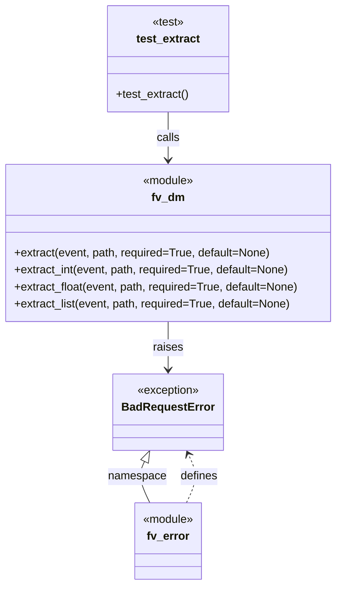

# Diagram: common/fv/python/tests/test_dm.py

> Auto-generated by Obscura crawlers

## Mermaid

### SVG

<svg id="container" width="483.4921875" xmlns="http://www.w3.org/2000/svg" class="classDiagram" height="826" viewBox="0 0 483.4921875 826" role="graphics-document document" aria-roledescription="class"><g><defs><marker id="container_class-aggregationStart" class="marker aggregation class" refX="18" refY="7" markerWidth="190" markerHeight="240" orient="auto"><path d="M 18,7 L9,13 L1,7 L9,1 Z"></path></marker></defs><defs><marker id="container_class-aggregationEnd" class="marker aggregation class" refX="1" refY="7" markerWidth="20" markerHeight="28" orient="auto"><path d="M 18,7 L9,13 L1,7 L9,1 Z"></path></marker></defs><defs><marker id="container_class-extensionStart" class="marker extension class" refX="18" refY="7" markerWidth="190" markerHeight="240" orient="auto"><path d="M 1,7 L18,13 V 1 Z"></path></marker></defs><defs><marker id="container_class-extensionEnd" class="marker extension class" refX="1" refY="7" markerWidth="20" markerHeight="28" orient="auto"><path d="M 1,1 V 13 L18,7 Z"></path></marker></defs><defs><marker id="container_class-compositionStart" class="marker composition class" refX="18" refY="7" markerWidth="190" markerHeight="240" orient="auto"><path d="M 18,7 L9,13 L1,7 L9,1 Z"></path></marker></defs><defs><marker id="container_class-compositionEnd" class="marker composition class" refX="1" refY="7" markerWidth="20" markerHeight="28" orient="auto"><path d="M 18,7 L9,13 L1,7 L9,1 Z"></path></marker></defs><defs><marker id="container_class-dependencyStart" class="marker dependency class" refX="6" refY="7" markerWidth="190" markerHeight="240" orient="auto"><path d="M 5,7 L9,13 L1,7 L9,1 Z"></path></marker></defs><defs><marker id="container_class-dependencyEnd" class="marker dependency class" refX="13" refY="7" markerWidth="20" markerHeight="28" orient="auto"><path d="M 18,7 L9,13 L14,7 L9,1 Z"></path></marker></defs><defs><marker id="container_class-lollipopStart" class="marker lollipop class" refX="13" refY="7" markerWidth="190" markerHeight="240" orient="auto"><circle stroke="black" fill="transparent" cx="7" cy="7" r="6"></circle></marker></defs><defs><marker id="container_class-lollipopEnd" class="marker lollipop class" refX="1" refY="7" markerWidth="190" markerHeight="240" orient="auto"><circle stroke="black" fill="transparent" cx="7" cy="7" r="6"></circle></marker></defs><g class="root"><g class="clusters"></g><g class="edgePaths"><path d="M241.746,158L241.746,164.167C241.746,170.333,241.746,182.667,241.746,194C241.746,205.333,241.746,215.667,241.746,220.833L241.746,226" id="id_test_extract_fv_dm_1" class="edge-thickness-normal edge-pattern-solid relation" style=";;;" data-edge="true" data-et="edge" data-id="id_test_extract_fv_dm_1" data-points="W3sieCI6MjQxLjc0NjA5Mzc1LCJ5IjoxNTh9LHsieCI6MjQxLjc0NjA5Mzc1LCJ5IjoxOTV9LHsieCI6MjQxLjc0NjA5Mzc1LCJ5IjoyMzJ9XQ==" marker-end="url(#container_class-dependencyEnd)"></path><path d="M241.746,454L241.746,460.167C241.746,466.333,241.746,478.667,241.746,490C241.746,501.333,241.746,511.667,241.746,516.833L241.746,522" id="id_fv_dm_BadRequestError_2" class="edge-thickness-normal edge-pattern-solid relation" style=";;;" data-edge="true" data-et="edge" data-id="id_fv_dm_BadRequestError_2" data-points="W3sieCI6MjQxLjc0NjA5Mzc1LCJ5Ijo0NTR9LHsieCI6MjQxLjc0NjA5Mzc1LCJ5Ijo0OTF9LHsieCI6MjQxLjc0NjA5Mzc1LCJ5Ijo1Mjh9XQ==" marker-end="url(#container_class-dependencyEnd)"></path><path d="M267.731,710L270.698,703.833C273.666,697.667,279.6,685.333,280.034,673.901C280.468,662.469,275.4,651.938,272.866,646.672L270.332,641.407" id="id_fv_error_BadRequestError_3" class="edge-thickness-normal edge-pattern-dashed relation" style=";;;" data-edge="true" data-et="edge" data-id="id_fv_error_BadRequestError_3" data-points="W3sieCI6MjY3LjczMDgxMjE1NjU5MzQsInkiOjcxMH0seyJ4IjoyODUuNTM1MTU2MjUsInkiOjY3M30seyJ4IjoyNjcuNzMwODEyMTU2NTkzNCwieSI6NjM2fV0=" marker-end="url(#container_class-dependencyEnd)"></path><path d="M208.282,651.544L206.561,655.12C204.84,658.696,201.399,665.848,202.645,675.591C203.892,685.333,209.827,697.667,212.794,703.833L215.761,710" id="id_BadRequestError_fv_error_4" class="edge-thickness-normal edge-pattern-solid relation" style=";;;" data-edge="true" data-et="edge" data-id="id_BadRequestError_fv_error_4" data-points="W3sieCI6MjE1Ljc2MTM3NTM0MzQwNjYsInkiOjYzNn0seyJ4IjoxOTcuOTU3MDMxMjUsInkiOjY3M30seyJ4IjoyMTUuNzYxMzc1MzQzNDA2NiwieSI6NzEwfV0=" marker-start="url(#container_class-extensionStart)"></path></g><g class="edgeLabels"><g class="edgeLabel" transform="translate(241.74609375, 195)"><g class="label" data-id="id_test_extract_fv_dm_1" transform="translate(-16.4453125, -12)"><foreignObject width="32.890625" height="24">

calls

</foreignObject></g></g><g class="edgeLabel" transform="translate(241.74609375, 491)"><g class="label" data-id="id_fv_dm_BadRequestError_2" transform="translate(-21.25, -12)"><foreignObject width="42.5" height="24">

raises

</foreignObject></g></g><g class="edgeLabel" transform="translate(285.53515625, 673)"><g class="label" data-id="id_fv_error_BadRequestError_3" transform="translate(-26.53125, -12)"><foreignObject width="53.0625" height="24">

defines

</foreignObject></g></g><g class="edgeLabel" transform="translate(197.95703125, 673)"><g class="label" data-id="id_BadRequestError_fv_error_4" transform="translate(-41.046875, -12)"><foreignObject width="82.09375" height="24">

namespace

</foreignObject></g></g></g><g class="nodes"><g class="node default" id="classId-fv_dm-0" transform="translate(241.74609375, 343)"><g class="basic label-container"><path d="M-233.74609375 -111 L233.74609375 -111 L233.74609375 111 L-233.74609375 111" stroke="none" stroke-width="0" fill="#ECECFF" style=""></path><path d="M-233.74609375 -111 C-63.42231998692182 -111, 106.90145377615636 -111, 233.74609375 -111 M-233.74609375 -111 C-97.90025898132726 -111, 37.94557578734549 -111, 233.74609375 -111 M233.74609375 -111 C233.74609375 -32.05867392614111, 233.74609375 46.88265214771778, 233.74609375 111 M233.74609375 -111 C233.74609375 -55.42085392414727, 233.74609375 0.15829215170545297, 233.74609375 111 M233.74609375 111 C49.189438444447205 111, -135.3672168611056 111, -233.74609375 111 M233.74609375 111 C63.335508603595116 111, -107.07507654280977 111, -233.74609375 111 M-233.74609375 111 C-233.74609375 65.76932961805824, -233.74609375 20.53865923611646, -233.74609375 -111 M-233.74609375 111 C-233.74609375 39.867379352387005, -233.74609375 -31.26524129522599, -233.74609375 -111" stroke="#9370DB" stroke-width="1.3" fill="none" stroke-dasharray="0 0" style=""></path></g><g class="annotation-group text" transform="translate(-36.6015625, -87)"><g class="label" style="" transform="translate(0,-12)"><foreignObject width="73.203125" height="24">

«module»

</foreignObject></g></g><g class="label-group text" transform="translate(-22.2734375, -63)"><g class="label" style="font-weight: bolder" transform="translate(0,-12)"><foreignObject width="44.546875" height="24">

fv_dm

</foreignObject></g></g><g class="members-group text" transform="translate(-221.74609375, -15)"></g><g class="methods-group text" transform="translate(-221.74609375, 15)"><g class="label" style="" transform="translate(0,-12)"><foreignObject width="365.828125" height="24">

+extract(event, path, required=True, default=None)

</foreignObject></g><g class="label" style="" transform="translate(0,12)"><foreignObject width="393.8125" height="24">

+extract_int(event, path, required=True, default=None)

</foreignObject></g><g class="label" style="" transform="translate(0,36)"><foreignObject width="406.890625" height="24">

+extract_float(event, path, required=True, default=None)

</foreignObject></g><g class="label" style="" transform="translate(0,60)"><foreignObject width="396.4375" height="24">

+extract_list(event, path, required=True, default=None)

</foreignObject></g></g><g class="divider" style=""><path d="M-233.74609375 -39 C-113.65302976063627 -39, 6.4400342287274555 -39, 233.74609375 -39 M-233.74609375 -39 C-107.42557656583352 -39, 18.894940618332953 -39, 233.74609375 -39" stroke="#9370DB" stroke-width="1.3" fill="none" stroke-dasharray="0 0" style=""></path></g><g class="divider" style=""><path d="M-233.74609375 -15 C-139.6225903793493 -15, -45.49908700869861 -15, 233.74609375 -15 M-233.74609375 -15 C-126.14736464364279 -15, -18.548635537285577 -15, 233.74609375 -15" stroke="#9370DB" stroke-width="1.3" fill="none" stroke-dasharray="0 0" style=""></path></g></g><g class="node default" id="classId-fv_error-1" transform="translate(241.74609375, 764)"><g class="basic label-container"><path d="M-48.6015625 -54 L48.6015625 -54 L48.6015625 54 L-48.6015625 54" stroke="none" stroke-width="0" fill="#ECECFF" style=""></path><path d="M-48.6015625 -54 C-11.601913309389097 -54, 25.397735881221806 -54, 48.6015625 -54 M-48.6015625 -54 C-13.9116775240416 -54, 20.7782074519168 -54, 48.6015625 -54 M48.6015625 -54 C48.6015625 -28.283140333222615, 48.6015625 -2.5662806664452305, 48.6015625 54 M48.6015625 -54 C48.6015625 -27.10114233364752, 48.6015625 -0.20228466729503936, 48.6015625 54 M48.6015625 54 C18.05652066328761 54, -12.488521173424779 54, -48.6015625 54 M48.6015625 54 C10.337594591111845 54, -27.92637331777631 54, -48.6015625 54 M-48.6015625 54 C-48.6015625 24.791093761784325, -48.6015625 -4.417812476431351, -48.6015625 -54 M-48.6015625 54 C-48.6015625 21.813816810298285, -48.6015625 -10.37236637940343, -48.6015625 -54" stroke="#9370DB" stroke-width="1.3" fill="none" stroke-dasharray="0 0" style=""></path></g><g class="annotation-group text" transform="translate(-36.6015625, -30)"><g class="label" style="" transform="translate(0,-12)"><foreignObject width="73.203125" height="24">

«module»

</foreignObject></g></g><g class="label-group text" transform="translate(-29.1875, -6)"><g class="label" style="font-weight: bolder" transform="translate(0,-12)"><foreignObject width="58.375" height="24">

fv_error

</foreignObject></g></g><g class="members-group text" transform="translate(-36.6015625, 42)"></g><g class="methods-group text" transform="translate(-36.6015625, 72)"></g><g class="divider" style=""><path d="M-48.6015625 18 C-25.498279666715817 18, -2.394996833431634 18, 48.6015625 18 M-48.6015625 18 C-21.383470033964812 18, 5.8346224320703755 18, 48.6015625 18" stroke="#9370DB" stroke-width="1.3" fill="none" stroke-dasharray="0 0" style=""></path></g><g class="divider" style=""><path d="M-48.6015625 36 C-22.237245006925452 36, 4.127072486149096 36, 48.6015625 36 M-48.6015625 36 C-26.56296928282596 36, -4.524376065651921 36, 48.6015625 36" stroke="#9370DB" stroke-width="1.3" fill="none" stroke-dasharray="0 0" style=""></path></g></g><g class="node default" id="classId-BadRequestError-2" transform="translate(241.74609375, 582)"><g class="basic label-container"><path d="M-74.28125 -54 L74.28125 -54 L74.28125 54 L-74.28125 54" stroke="none" stroke-width="0" fill="#ECECFF" style=""></path><path d="M-74.28125 -54 C-20.682455111130174 -54, 32.91633977773965 -54, 74.28125 -54 M-74.28125 -54 C-21.32489834443743 -54, 31.631453311125142 -54, 74.28125 -54 M74.28125 -54 C74.28125 -19.07438500280427, 74.28125 15.85122999439146, 74.28125 54 M74.28125 -54 C74.28125 -14.380651978489041, 74.28125 25.238696043021918, 74.28125 54 M74.28125 54 C39.343072108682854 54, 4.404894217365708 54, -74.28125 54 M74.28125 54 C35.8612390338566 54, -2.5587719322868026 54, -74.28125 54 M-74.28125 54 C-74.28125 10.835386971030196, -74.28125 -32.32922605793961, -74.28125 -54 M-74.28125 54 C-74.28125 13.153456044552861, -74.28125 -27.693087910894278, -74.28125 -54" stroke="#9370DB" stroke-width="1.3" fill="none" stroke-dasharray="0 0" style=""></path></g><g class="annotation-group text" transform="translate(-44.3515625, -30)"><g class="label" style="" transform="translate(0,-12)"><foreignObject width="88.703125" height="24">

«exception»

</foreignObject></g></g><g class="label-group text" transform="translate(-62.28125, -6)"><g class="label" style="font-weight: bolder" transform="translate(0,-12)"><foreignObject width="124.5625" height="24">

BadRequestError

</foreignObject></g></g><g class="members-group text" transform="translate(-62.28125, 42)"></g><g class="methods-group text" transform="translate(-62.28125, 72)"></g><g class="divider" style=""><path d="M-74.28125 18 C-34.79875348015951 18, 4.6837430396809765 18, 74.28125 18 M-74.28125 18 C-27.970856814843174 18, 18.339536370313652 18, 74.28125 18" stroke="#9370DB" stroke-width="1.3" fill="none" stroke-dasharray="0 0" style=""></path></g><g class="divider" style=""><path d="M-74.28125 36 C-39.10062557881686 36, -3.9200011576337204 36, 74.28125 36 M-74.28125 36 C-29.301971421117322 36, 15.677307157765355 36, 74.28125 36" stroke="#9370DB" stroke-width="1.3" fill="none" stroke-dasharray="0 0" style=""></path></g></g><g class="node default" id="classId-test_extract-3" transform="translate(241.74609375, 83)"><g class="basic label-container"><path d="M-85.84375 -75 L85.84375 -75 L85.84375 75 L-85.84375 75" stroke="none" stroke-width="0" fill="#ECECFF" style=""></path><path d="M-85.84375 -75 C-43.429905955720486 -75, -1.0160619114409712 -75, 85.84375 -75 M-85.84375 -75 C-31.640362295277882 -75, 22.563025409444236 -75, 85.84375 -75 M85.84375 -75 C85.84375 -27.31088112225755, 85.84375 20.378237755484903, 85.84375 75 M85.84375 -75 C85.84375 -22.853189977788716, 85.84375 29.293620044422568, 85.84375 75 M85.84375 75 C36.84473564111827 75, -12.15427871776346 75, -85.84375 75 M85.84375 75 C44.837966714887365 75, 3.83218342977473 75, -85.84375 75 M-85.84375 75 C-85.84375 36.96382985896062, -85.84375 -1.0723402820787555, -85.84375 -75 M-85.84375 75 C-85.84375 43.509525174856705, -85.84375 12.01905034971341, -85.84375 -75" stroke="#9370DB" stroke-width="1.3" fill="none" stroke-dasharray="0 0" style=""></path></g><g class="annotation-group text" transform="translate(-22.8828125, -51)"><g class="label" style="" transform="translate(0,-12)"><foreignObject width="45.765625" height="24">

«test»

</foreignObject></g></g><g class="label-group text" transform="translate(-44.046875, -27)"><g class="label" style="font-weight: bolder" transform="translate(0,-12)"><foreignObject width="88.09375" height="24">

test_extract

</foreignObject></g></g><g class="members-group text" transform="translate(-73.84375, 21)"></g><g class="methods-group text" transform="translate(-73.84375, 51)"><g class="label" style="" transform="translate(0,-12)"><foreignObject width="103.640625" height="24">

+test_extract()

</foreignObject></g></g><g class="divider" style=""><path d="M-85.84375 -3 C-22.057018949821803 -3, 41.729712100356394 -3, 85.84375 -3 M-85.84375 -3 C-37.74042594417278 -3, 10.362898111654445 -3, 85.84375 -3" stroke="#9370DB" stroke-width="1.3" fill="none" stroke-dasharray="0 0" style=""></path></g><g class="divider" style=""><path d="M-85.84375 21 C-36.363965615294546 21, 13.115818769410907 21, 85.84375 21 M-85.84375 21 C-31.6705569589421 21, 22.5026360821158 21, 85.84375 21" stroke="#9370DB" stroke-width="1.3" fill="none" stroke-dasharray="0 0" style=""></path></g></g></g></g></g></svg>
