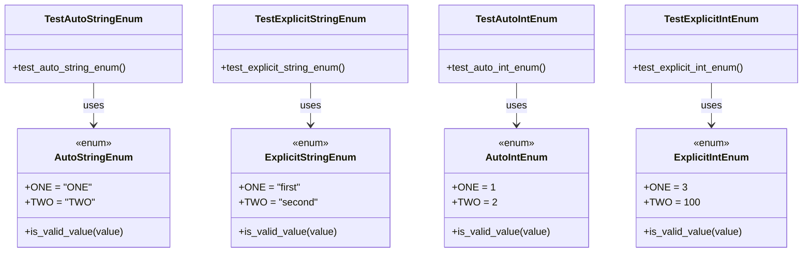

# Diagram: common/fv/python/tests/test_enum.py

> Auto-generated by Obscura crawlers

## Mermaid

### SVG

<svg id="container" width="1294.046875" xmlns="http://www.w3.org/2000/svg" class="classDiagram" height="408" viewBox="0 0 1294.046875 408" role="graphics-document document" aria-roledescription="class"><g><defs><marker id="container_class-aggregationStart" class="marker aggregation class" refX="18" refY="7" markerWidth="190" markerHeight="240" orient="auto"><path d="M 18,7 L9,13 L1,7 L9,1 Z"></path></marker></defs><defs><marker id="container_class-aggregationEnd" class="marker aggregation class" refX="1" refY="7" markerWidth="20" markerHeight="28" orient="auto"><path d="M 18,7 L9,13 L1,7 L9,1 Z"></path></marker></defs><defs><marker id="container_class-extensionStart" class="marker extension class" refX="18" refY="7" markerWidth="190" markerHeight="240" orient="auto"><path d="M 1,7 L18,13 V 1 Z"></path></marker></defs><defs><marker id="container_class-extensionEnd" class="marker extension class" refX="1" refY="7" markerWidth="20" markerHeight="28" orient="auto"><path d="M 1,1 V 13 L18,7 Z"></path></marker></defs><defs><marker id="container_class-compositionStart" class="marker composition class" refX="18" refY="7" markerWidth="190" markerHeight="240" orient="auto"><path d="M 18,7 L9,13 L1,7 L9,1 Z"></path></marker></defs><defs><marker id="container_class-compositionEnd" class="marker composition class" refX="1" refY="7" markerWidth="20" markerHeight="28" orient="auto"><path d="M 18,7 L9,13 L1,7 L9,1 Z"></path></marker></defs><defs><marker id="container_class-dependencyStart" class="marker dependency class" refX="6" refY="7" markerWidth="190" markerHeight="240" orient="auto"><path d="M 5,7 L9,13 L1,7 L9,1 Z"></path></marker></defs><defs><marker id="container_class-dependencyEnd" class="marker dependency class" refX="13" refY="7" markerWidth="20" markerHeight="28" orient="auto"><path d="M 18,7 L9,13 L14,7 L9,1 Z"></path></marker></defs><defs><marker id="container_class-lollipopStart" class="marker lollipop class" refX="13" refY="7" markerWidth="190" markerHeight="240" orient="auto"><circle stroke="black" fill="transparent" cx="7" cy="7" r="6"></circle></marker></defs><defs><marker id="container_class-lollipopEnd" class="marker lollipop class" refX="1" refY="7" markerWidth="190" markerHeight="240" orient="auto"><circle stroke="black" fill="transparent" cx="7" cy="7" r="6"></circle></marker></defs><g class="root"><g class="clusters"></g><g class="edgePaths"><path d="M149.949,134L149.949,140.167C149.949,146.333,149.949,158.667,149.949,170C149.949,181.333,149.949,191.667,149.949,196.833L149.949,202" id="id_TestAutoStringEnum_AutoStringEnum_1" class="edge-thickness-normal edge-pattern-solid relation" style=";;;" data-edge="true" data-et="edge" data-id="id_TestAutoStringEnum_AutoStringEnum_1" data-points="W3sieCI6MTQ5Ljk0OTIxODc1LCJ5IjoxMzR9LHsieCI6MTQ5Ljk0OTIxODc1LCJ5IjoxNzF9LHsieCI6MTQ5Ljk0OTIxODc1LCJ5IjoyMDh9XQ==" marker-end="url(#container_class-dependencyEnd)"></path><path d="M499.031,134L499.031,140.167C499.031,146.333,499.031,158.667,499.031,170C499.031,181.333,499.031,191.667,499.031,196.833L499.031,202" id="id_TestExplicitStringEnum_ExplicitStringEnum_2" class="edge-thickness-normal edge-pattern-solid relation" style=";;;" data-edge="true" data-et="edge" data-id="id_TestExplicitStringEnum_ExplicitStringEnum_2" data-points="W3sieCI6NDk5LjAzMTI1LCJ5IjoxMzR9LHsieCI6NDk5LjAzMTI1LCJ5IjoxNzF9LHsieCI6NDk5LjAzMTI1LCJ5IjoyMDh9XQ==" marker-end="url(#container_class-dependencyEnd)"></path><path d="M831.043,134L831.043,140.167C831.043,146.333,831.043,158.667,831.043,170C831.043,181.333,831.043,191.667,831.043,196.833L831.043,202" id="id_TestAutoIntEnum_AutoIntEnum_3" class="edge-thickness-normal edge-pattern-solid relation" style=";;;" data-edge="true" data-et="edge" data-id="id_TestAutoIntEnum_AutoIntEnum_3" data-points="W3sieCI6ODMxLjA0Mjk2ODc1LCJ5IjoxMzR9LHsieCI6ODMxLjA0Mjk2ODc1LCJ5IjoxNzF9LHsieCI6ODMxLjA0Mjk2ODc1LCJ5IjoyMDh9XQ==" marker-end="url(#container_class-dependencyEnd)"></path><path d="M1145.984,134L1145.984,140.167C1145.984,146.333,1145.984,158.667,1145.984,170C1145.984,181.333,1145.984,191.667,1145.984,196.833L1145.984,202" id="id_TestExplicitIntEnum_ExplicitIntEnum_4" class="edge-thickness-normal edge-pattern-solid relation" style=";;;" data-edge="true" data-et="edge" data-id="id_TestExplicitIntEnum_ExplicitIntEnum_4" data-points="W3sieCI6MTE0NS45ODQzNzUsInkiOjEzNH0seyJ4IjoxMTQ1Ljk4NDM3NSwieSI6MTcxfSx7IngiOjExNDUuOTg0Mzc1LCJ5IjoyMDh9XQ==" marker-end="url(#container_class-dependencyEnd)"></path></g><g class="edgeLabels"><g class="edgeLabel" transform="translate(149.94921875, 171)"><g class="label" data-id="id_TestAutoStringEnum_AutoStringEnum_1" transform="translate(-16.4921875, -12)"><foreignObject width="32.984375" height="24">

uses

</foreignObject></g></g><g class="edgeLabel" transform="translate(499.03125, 171)"><g class="label" data-id="id_TestExplicitStringEnum_ExplicitStringEnum_2" transform="translate(-16.4921875, -12)"><foreignObject width="32.984375" height="24">

uses

</foreignObject></g></g><g class="edgeLabel" transform="translate(831.04296875, 171)"><g class="label" data-id="id_TestAutoIntEnum_AutoIntEnum_3" transform="translate(-16.4921875, -12)"><foreignObject width="32.984375" height="24">

uses

</foreignObject></g></g><g class="edgeLabel" transform="translate(1145.984375, 171)"><g class="label" data-id="id_TestExplicitIntEnum_ExplicitIntEnum_4" transform="translate(-16.4921875, -12)"><foreignObject width="32.984375" height="24">

uses

</foreignObject></g></g></g><g class="nodes"><g class="node default" id="classId-AutoStringEnum-0" transform="translate(149.94921875, 304)"><g class="basic label-container"><path d="M-120.76953125 -96 L120.76953125 -96 L120.76953125 96 L-120.76953125 96" stroke="none" stroke-width="0" fill="#ECECFF" style=""></path><path d="M-120.76953125 -96 C-31.72470450417549 -96, 57.32012224164902 -96, 120.76953125 -96 M-120.76953125 -96 C-48.43113256479373 -96, 23.907266120412544 -96, 120.76953125 -96 M120.76953125 -96 C120.76953125 -33.11212398770246, 120.76953125 29.77575202459508, 120.76953125 96 M120.76953125 -96 C120.76953125 -31.419636625461436, 120.76953125 33.16072674907713, 120.76953125 96 M120.76953125 96 C32.7773652402377 96, -55.2148007695246 96, -120.76953125 96 M120.76953125 96 C44.94366688217214 96, -30.882197485655723 96, -120.76953125 96 M-120.76953125 96 C-120.76953125 49.81697440528424, -120.76953125 3.6339488105684836, -120.76953125 -96 M-120.76953125 96 C-120.76953125 31.330574356603577, -120.76953125 -33.338851286792845, -120.76953125 -96" stroke="#9370DB" stroke-width="1.3" fill="none" stroke-dasharray="0 0" style=""></path></g><g class="annotation-group text" transform="translate(-29.53125, -72)"><g class="label" style="" transform="translate(0,-12)"><foreignObject width="59.0625" height="24">

«enum»

</foreignObject></g></g><g class="label-group text" transform="translate(-59.1484375, -48)"><g class="label" style="font-weight: bolder" transform="translate(0,-12)"><foreignObject width="118.296875" height="24">

AutoStringEnum

</foreignObject></g></g><g class="members-group text" transform="translate(-108.76953125, 0)"><g class="label" style="" transform="translate(0,-12)"><foreignObject width="98.359375" height="24">

+ONE = "ONE"

</foreignObject></g><g class="label" style="" transform="translate(0,12)"><foreignObject width="101.71875" height="24">

+TWO = "TWO"

</foreignObject></g></g><g class="methods-group text" transform="translate(-108.76953125, 72)"><g class="label" style="" transform="translate(0,-12)"><foreignObject width="158.390625" height="24">

+is_valid_value(value)

</foreignObject></g></g><g class="divider" style=""><path d="M-120.76953125 -24 C-40.94239787392554 -24, 38.884735502148914 -24, 120.76953125 -24 M-120.76953125 -24 C-62.87059770378847 -24, -4.971664157576939 -24, 120.76953125 -24" stroke="#9370DB" stroke-width="1.3" fill="none" stroke-dasharray="0 0" style=""></path></g><g class="divider" style=""><path d="M-120.76953125 48 C-51.06164028331651 48, 18.646250683366986 48, 120.76953125 48 M-120.76953125 48 C-47.86757284671984 48, 25.034385556560323 48, 120.76953125 48" stroke="#9370DB" stroke-width="1.3" fill="none" stroke-dasharray="0 0" style=""></path></g></g><g class="node default" id="classId-ExplicitStringEnum-1" transform="translate(499.03125, 304)"><g class="basic label-container"><path d="M-125.7578125 -96 L125.7578125 -96 L125.7578125 96 L-125.7578125 96" stroke="none" stroke-width="0" fill="#ECECFF" style=""></path><path d="M-125.7578125 -96 C-67.8551502833576 -96, -9.952488066715205 -96, 125.7578125 -96 M-125.7578125 -96 C-37.000156465005176 -96, 51.75749956998965 -96, 125.7578125 -96 M125.7578125 -96 C125.7578125 -30.990557620129294, 125.7578125 34.01888475974141, 125.7578125 96 M125.7578125 -96 C125.7578125 -40.460038582516376, 125.7578125 15.079922834967249, 125.7578125 96 M125.7578125 96 C35.1813315813137 96, -55.3951493373726 96, -125.7578125 96 M125.7578125 96 C25.321959621029535 96, -75.11389325794093 96, -125.7578125 96 M-125.7578125 96 C-125.7578125 25.561223806323426, -125.7578125 -44.87755238735315, -125.7578125 -96 M-125.7578125 96 C-125.7578125 37.92244222365133, -125.7578125 -20.15511555269734, -125.7578125 -96" stroke="#9370DB" stroke-width="1.3" fill="none" stroke-dasharray="0 0" style=""></path></g><g class="annotation-group text" transform="translate(-29.53125, -72)"><g class="label" style="" transform="translate(0,-12)"><foreignObject width="59.0625" height="24">

«enum»

</foreignObject></g></g><g class="label-group text" transform="translate(-69.125, -48)"><g class="label" style="font-weight: bolder" transform="translate(0,-12)"><foreignObject width="138.25" height="24">

ExplicitStringEnum

</foreignObject></g></g><g class="members-group text" transform="translate(-113.7578125, 0)"><g class="label" style="" transform="translate(0,-12)"><foreignObject width="95.9375" height="24">

+ONE = "first"

</foreignObject></g><g class="label" style="" transform="translate(0,12)"><foreignObject width="120.640625" height="24">

+TWO = "second"

</foreignObject></g></g><g class="methods-group text" transform="translate(-113.7578125, 72)"><g class="label" style="" transform="translate(0,-12)"><foreignObject width="158.390625" height="24">

+is_valid_value(value)

</foreignObject></g></g><g class="divider" style=""><path d="M-125.7578125 -24 C-68.10296413631593 -24, -10.448115772631866 -24, 125.7578125 -24 M-125.7578125 -24 C-49.213660115012885 -24, 27.33049226997423 -24, 125.7578125 -24" stroke="#9370DB" stroke-width="1.3" fill="none" stroke-dasharray="0 0" style=""></path></g><g class="divider" style=""><path d="M-125.7578125 48 C-42.74745423400746 48, 40.26290403198507 48, 125.7578125 48 M-125.7578125 48 C-44.82303351536616 48, 36.111745469267674 48, 125.7578125 48" stroke="#9370DB" stroke-width="1.3" fill="none" stroke-dasharray="0 0" style=""></path></g></g><g class="node default" id="classId-AutoIntEnum-2" transform="translate(831.04296875, 304)"><g class="basic label-container"><path d="M-114.71875 -96 L114.71875 -96 L114.71875 96 L-114.71875 96" stroke="none" stroke-width="0" fill="#ECECFF" style=""></path><path d="M-114.71875 -96 C-39.9722867274436 -96, 34.774176545112795 -96, 114.71875 -96 M-114.71875 -96 C-48.28183618804316 -96, 18.155077623913684 -96, 114.71875 -96 M114.71875 -96 C114.71875 -48.40596606814976, 114.71875 -0.811932136299518, 114.71875 96 M114.71875 -96 C114.71875 -54.90348514407868, 114.71875 -13.806970288157359, 114.71875 96 M114.71875 96 C41.05733091647079 96, -32.60408816705842 96, -114.71875 96 M114.71875 96 C28.574346118279436 96, -57.57005776344113 96, -114.71875 96 M-114.71875 96 C-114.71875 21.08000399334675, -114.71875 -53.8399920133065, -114.71875 -96 M-114.71875 96 C-114.71875 48.16419162387403, -114.71875 0.3283832477480644, -114.71875 -96" stroke="#9370DB" stroke-width="1.3" fill="none" stroke-dasharray="0 0" style=""></path></g><g class="annotation-group text" transform="translate(-29.53125, -72)"><g class="label" style="" transform="translate(0,-12)"><foreignObject width="59.0625" height="24">

«enum»

</foreignObject></g></g><g class="label-group text" transform="translate(-47.046875, -48)"><g class="label" style="font-weight: bolder" transform="translate(0,-12)"><foreignObject width="94.09375" height="24">

AutoIntEnum

</foreignObject></g></g><g class="members-group text" transform="translate(-102.71875, 0)"><g class="label" style="" transform="translate(0,-12)"><foreignObject width="61.953125" height="24">

+ONE = 1

</foreignObject></g><g class="label" style="" transform="translate(0,12)"><foreignObject width="64.15625" height="24">

+TWO = 2

</foreignObject></g></g><g class="methods-group text" transform="translate(-102.71875, 72)"><g class="label" style="" transform="translate(0,-12)"><foreignObject width="158.390625" height="24">

+is_valid_value(value)

</foreignObject></g></g><g class="divider" style=""><path d="M-114.71875 -24 C-28.338245381915215 -24, 58.04225923616957 -24, 114.71875 -24 M-114.71875 -24 C-35.71630545692601 -24, 43.28613908614798 -24, 114.71875 -24" stroke="#9370DB" stroke-width="1.3" fill="none" stroke-dasharray="0 0" style=""></path></g><g class="divider" style=""><path d="M-114.71875 48 C-27.73375054148714 48, 59.25124891702572 48, 114.71875 48 M-114.71875 48 C-47.36673978936945 48, 19.985270421261106 48, 114.71875 48" stroke="#9370DB" stroke-width="1.3" fill="none" stroke-dasharray="0 0" style=""></path></g></g><g class="node default" id="classId-ExplicitIntEnum-3" transform="translate(1145.984375, 304)"><g class="basic label-container"><path d="M-119.70703125 -96 L119.70703125 -96 L119.70703125 96 L-119.70703125 96" stroke="none" stroke-width="0" fill="#ECECFF" style=""></path><path d="M-119.70703125 -96 C-56.76834129782388 -96, 6.170348654352239 -96, 119.70703125 -96 M-119.70703125 -96 C-46.57061605069495 -96, 26.565799148610097 -96, 119.70703125 -96 M119.70703125 -96 C119.70703125 -22.78055647697552, 119.70703125 50.43888704604896, 119.70703125 96 M119.70703125 -96 C119.70703125 -32.94118653630326, 119.70703125 30.117626927393474, 119.70703125 96 M119.70703125 96 C67.20461760676963 96, 14.702203963539262 96, -119.70703125 96 M119.70703125 96 C26.45356155382902 96, -66.79990814234196 96, -119.70703125 96 M-119.70703125 96 C-119.70703125 21.495951132719796, -119.70703125 -53.00809773456041, -119.70703125 -96 M-119.70703125 96 C-119.70703125 45.94683075584829, -119.70703125 -4.106338488303422, -119.70703125 -96" stroke="#9370DB" stroke-width="1.3" fill="none" stroke-dasharray="0 0" style=""></path></g><g class="annotation-group text" transform="translate(-29.53125, -72)"><g class="label" style="" transform="translate(0,-12)"><foreignObject width="59.0625" height="24">

«enum»

</foreignObject></g></g><g class="label-group text" transform="translate(-57.0234375, -48)"><g class="label" style="font-weight: bolder" transform="translate(0,-12)"><foreignObject width="114.046875" height="24">

ExplicitIntEnum

</foreignObject></g></g><g class="members-group text" transform="translate(-107.70703125, 0)"><g class="label" style="" transform="translate(0,-12)"><foreignObject width="63.015625" height="24">

+ONE = 3

</foreignObject></g><g class="label" style="" transform="translate(0,12)"><foreignObject width="81.015625" height="24">

+TWO = 100

</foreignObject></g></g><g class="methods-group text" transform="translate(-107.70703125, 72)"><g class="label" style="" transform="translate(0,-12)"><foreignObject width="158.390625" height="24">

+is_valid_value(value)

</foreignObject></g></g><g class="divider" style=""><path d="M-119.70703125 -24 C-45.52724485104126 -24, 28.65254154791748 -24, 119.70703125 -24 M-119.70703125 -24 C-49.71231531208805 -24, 20.282400625823897 -24, 119.70703125 -24" stroke="#9370DB" stroke-width="1.3" fill="none" stroke-dasharray="0 0" style=""></path></g><g class="divider" style=""><path d="M-119.70703125 48 C-59.52806298214139 48, 0.6509052857172151 48, 119.70703125 48 M-119.70703125 48 C-26.580644618244207 48, 66.54574201351159 48, 119.70703125 48" stroke="#9370DB" stroke-width="1.3" fill="none" stroke-dasharray="0 0" style=""></path></g></g><g class="node default" id="classId-TestAutoStringEnum-4" transform="translate(149.94921875, 71)"><g class="basic label-container"><path d="M-141.94921875 -63 L141.94921875 -63 L141.94921875 63 L-141.94921875 63" stroke="none" stroke-width="0" fill="#ECECFF" style=""></path><path d="M-141.94921875 -63 C-48.948262511173766 -63, 44.05269372765247 -63, 141.94921875 -63 M-141.94921875 -63 C-39.146402637524375 -63, 63.65641347495125 -63, 141.94921875 -63 M141.94921875 -63 C141.94921875 -14.69987686836501, 141.94921875 33.60024626326998, 141.94921875 63 M141.94921875 -63 C141.94921875 -17.854518978908672, 141.94921875 27.290962042182656, 141.94921875 63 M141.94921875 63 C66.79939394843696 63, -8.350430853126085 63, -141.94921875 63 M141.94921875 63 C80.67718217029676 63, 19.405145590593534 63, -141.94921875 63 M-141.94921875 63 C-141.94921875 21.429162434097464, -141.94921875 -20.141675131805073, -141.94921875 -63 M-141.94921875 63 C-141.94921875 32.018369057839315, -141.94921875 1.0367381156786308, -141.94921875 -63" stroke="#9370DB" stroke-width="1.3" fill="none" stroke-dasharray="0 0" style=""></path></g><g class="annotation-group text" transform="translate(0, -39)"></g><g class="label-group text" transform="translate(-74.3984375, -39)"><g class="label" style="font-weight: bolder" transform="translate(0,-12)"><foreignObject width="148.796875" height="24">

TestAutoStringEnum

</foreignObject></g></g><g class="members-group text" transform="translate(-129.94921875, 9)"></g><g class="methods-group text" transform="translate(-129.94921875, 39)"><g class="label" style="" transform="translate(0,-12)"><foreignObject width="185.5" height="24">

+test_auto_string_enum()

</foreignObject></g></g><g class="divider" style=""><path d="M-141.94921875 -15 C-46.242935643936036 -15, 49.46334746212793 -15, 141.94921875 -15 M-141.94921875 -15 C-58.16803160746177 -15, 25.61315553507646 -15, 141.94921875 -15" stroke="#9370DB" stroke-width="1.3" fill="none" stroke-dasharray="0 0" style=""></path></g><g class="divider" style=""><path d="M-141.94921875 9 C-55.809376151091186 9, 30.330466447817628 9, 141.94921875 9 M-141.94921875 9 C-61.33928154681735 9, 19.270655656365307 9, 141.94921875 9" stroke="#9370DB" stroke-width="1.3" fill="none" stroke-dasharray="0 0" style=""></path></g></g><g class="node default" id="classId-TestExplicitStringEnum-5" transform="translate(499.03125, 71)"><g class="basic label-container"><path d="M-157.1328125 -63 L157.1328125 -63 L157.1328125 63 L-157.1328125 63" stroke="none" stroke-width="0" fill="#ECECFF" style=""></path><path d="M-157.1328125 -63 C-52.018598696847434 -63, 53.09561510630513 -63, 157.1328125 -63 M-157.1328125 -63 C-73.14621486636155 -63, 10.840382767276907 -63, 157.1328125 -63 M157.1328125 -63 C157.1328125 -18.1878140683652, 157.1328125 26.6243718632696, 157.1328125 63 M157.1328125 -63 C157.1328125 -20.429802271228247, 157.1328125 22.140395457543505, 157.1328125 63 M157.1328125 63 C61.60161876362929 63, -33.92957497274142 63, -157.1328125 63 M157.1328125 63 C37.153350534641746 63, -82.82611143071651 63, -157.1328125 63 M-157.1328125 63 C-157.1328125 20.37413602409243, -157.1328125 -22.25172795181514, -157.1328125 -63 M-157.1328125 63 C-157.1328125 23.24101271977139, -157.1328125 -16.51797456045722, -157.1328125 -63" stroke="#9370DB" stroke-width="1.3" fill="none" stroke-dasharray="0 0" style=""></path></g><g class="annotation-group text" transform="translate(0, -39)"></g><g class="label-group text" transform="translate(-84.375, -39)"><g class="label" style="font-weight: bolder" transform="translate(0,-12)"><foreignObject width="168.75" height="24">

TestExplicitStringEnum

</foreignObject></g></g><g class="members-group text" transform="translate(-145.1328125, 9)"></g><g class="methods-group text" transform="translate(-145.1328125, 39)"><g class="label" style="" transform="translate(0,-12)"><foreignObject width="205.890625" height="24">

+test_explicit_string_enum()

</foreignObject></g></g><g class="divider" style=""><path d="M-157.1328125 -15 C-88.4571107957699 -15, -19.781409091539814 -15, 157.1328125 -15 M-157.1328125 -15 C-74.16328027815034 -15, 8.806251943699323 -15, 157.1328125 -15" stroke="#9370DB" stroke-width="1.3" fill="none" stroke-dasharray="0 0" style=""></path></g><g class="divider" style=""><path d="M-157.1328125 9 C-58.64026759669021 9, 39.852277306619584 9, 157.1328125 9 M-157.1328125 9 C-50.16195693340771 9, 56.80889863318458 9, 157.1328125 9" stroke="#9370DB" stroke-width="1.3" fill="none" stroke-dasharray="0 0" style=""></path></g></g><g class="node default" id="classId-TestAutoIntEnum-6" transform="translate(831.04296875, 71)"><g class="basic label-container"><path d="M-124.87890625 -63 L124.87890625 -63 L124.87890625 63 L-124.87890625 63" stroke="none" stroke-width="0" fill="#ECECFF" style=""></path><path d="M-124.87890625 -63 C-64.9204483924968 -63, -4.961990534993589 -63, 124.87890625 -63 M-124.87890625 -63 C-54.18527921757385 -63, 16.5083478148523 -63, 124.87890625 -63 M124.87890625 -63 C124.87890625 -33.36625141467712, 124.87890625 -3.732502829354246, 124.87890625 63 M124.87890625 -63 C124.87890625 -16.217466693464303, 124.87890625 30.565066613071394, 124.87890625 63 M124.87890625 63 C31.73553573487773 63, -61.40783478024454 63, -124.87890625 63 M124.87890625 63 C56.630180755133566 63, -11.618544739732869 63, -124.87890625 63 M-124.87890625 63 C-124.87890625 31.834214124983717, -124.87890625 0.6684282499674339, -124.87890625 -63 M-124.87890625 63 C-124.87890625 35.5254237273698, -124.87890625 8.05084745473959, -124.87890625 -63" stroke="#9370DB" stroke-width="1.3" fill="none" stroke-dasharray="0 0" style=""></path></g><g class="annotation-group text" transform="translate(0, -39)"></g><g class="label-group text" transform="translate(-62.2890625, -39)"><g class="label" style="font-weight: bolder" transform="translate(0,-12)"><foreignObject width="124.578125" height="24">

TestAutoIntEnum

</foreignObject></g></g><g class="members-group text" transform="translate(-112.87890625, 9)"></g><g class="methods-group text" transform="translate(-112.87890625, 39)"><g class="label" style="" transform="translate(0,-12)"><foreignObject width="163.46875" height="24">

+test_auto_int_enum()

</foreignObject></g></g><g class="divider" style=""><path d="M-124.87890625 -15 C-45.224192511840414 -15, 34.43052122631917 -15, 124.87890625 -15 M-124.87890625 -15 C-32.39515041522951 -15, 60.08860541954098 -15, 124.87890625 -15" stroke="#9370DB" stroke-width="1.3" fill="none" stroke-dasharray="0 0" style=""></path></g><g class="divider" style=""><path d="M-124.87890625 9 C-68.74120428980248 9, -12.60350232960495 9, 124.87890625 9 M-124.87890625 9 C-65.00492178964137 9, -5.1309373292827445 9, 124.87890625 9" stroke="#9370DB" stroke-width="1.3" fill="none" stroke-dasharray="0 0" style=""></path></g></g><g class="node default" id="classId-TestExplicitIntEnum-7" transform="translate(1145.984375, 71)"><g class="basic label-container"><path d="M-140.0625 -63 L140.0625 -63 L140.0625 63 L-140.0625 63" stroke="none" stroke-width="0" fill="#ECECFF" style=""></path><path d="M-140.0625 -63 C-29.991809423341508 -63, 80.07888115331698 -63, 140.0625 -63 M-140.0625 -63 C-48.42158971269164 -63, 43.21932057461672 -63, 140.0625 -63 M140.0625 -63 C140.0625 -25.441851708560954, 140.0625 12.116296582878093, 140.0625 63 M140.0625 -63 C140.0625 -24.516670733320765, 140.0625 13.96665853335847, 140.0625 63 M140.0625 63 C46.19310221417258 63, -47.67629557165483 63, -140.0625 63 M140.0625 63 C58.52974381455273 63, -23.003012370894538 63, -140.0625 63 M-140.0625 63 C-140.0625 16.50798676532316, -140.0625 -29.98402646935368, -140.0625 -63 M-140.0625 63 C-140.0625 19.183707344202112, -140.0625 -24.632585311595776, -140.0625 -63" stroke="#9370DB" stroke-width="1.3" fill="none" stroke-dasharray="0 0" style=""></path></g><g class="annotation-group text" transform="translate(0, -39)"></g><g class="label-group text" transform="translate(-72.265625, -39)"><g class="label" style="font-weight: bolder" transform="translate(0,-12)"><foreignObject width="144.53125" height="24">

TestExplicitIntEnum

</foreignObject></g></g><g class="members-group text" transform="translate(-128.0625, 9)"></g><g class="methods-group text" transform="translate(-128.0625, 39)"><g class="label" style="" transform="translate(0,-12)"><foreignObject width="183.859375" height="24">

+test_explicit_int_enum()

</foreignObject></g></g><g class="divider" style=""><path d="M-140.0625 -15 C-62.01722995496327 -15, 16.02804009007346 -15, 140.0625 -15 M-140.0625 -15 C-46.62018254547384 -15, 46.82213490905232 -15, 140.0625 -15" stroke="#9370DB" stroke-width="1.3" fill="none" stroke-dasharray="0 0" style=""></path></g><g class="divider" style=""><path d="M-140.0625 9 C-34.22088319053631 9, 71.62073361892737 9, 140.0625 9 M-140.0625 9 C-65.42244391542435 9, 9.217612169151295 9, 140.0625 9" stroke="#9370DB" stroke-width="1.3" fill="none" stroke-dasharray="0 0" style=""></path></g></g></g></g></g></svg>
