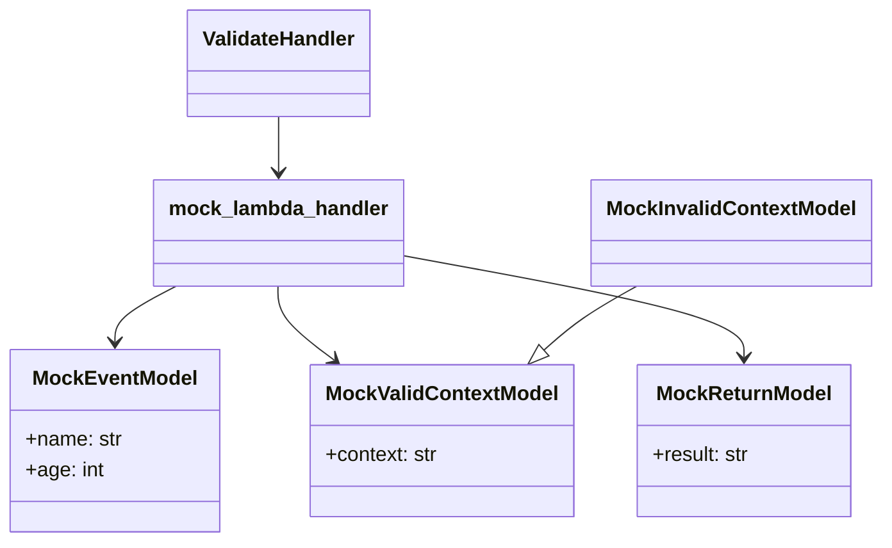

# Diagram: common/fv/python/tests/test_validator.py


> Auto-generated by Obscura crawlers

## Diagram 1



### SVG

<svg id="container" width="679.83984375" xmlns="http://www.w3.org/2000/svg" class="classDiagram" height="428" viewBox="0 0 679.83984375 428" role="graphics-document document" aria-roledescription="class"><style>#container{font-family:"trebuchet ms",verdana,arial,sans-serif;font-size:16px;fill:#333;}@keyframes edge-animation-frame{from{stroke-dashoffset:0;}}@keyframes dash{to{stroke-dashoffset:0;}}#container .edge-animation-slow{stroke-dasharray:9,5!important;stroke-dashoffset:900;animation:dash 50s linear infinite;stroke-linecap:round;}#container .edge-animation-fast{stroke-dasharray:9,5!important;stroke-dashoffset:900;animation:dash 20s linear infinite;stroke-linecap:round;}#container .error-icon{fill:#552222;}#container .error-text{fill:#552222;stroke:#552222;}#container .edge-thickness-normal{stroke-width:1px;}#container .edge-thickness-thick{stroke-width:3.5px;}#container .edge-pattern-solid{stroke-dasharray:0;}#container .edge-thickness-invisible{stroke-width:0;fill:none;}#container .edge-pattern-dashed{stroke-dasharray:3;}#container .edge-pattern-dotted{stroke-dasharray:2;}#container .marker{fill:#333333;stroke:#333333;}#container .marker.cross{stroke:#333333;}#container svg{font-family:"trebuchet ms",verdana,arial,sans-serif;font-size:16px;}#container p{margin:0;}#container g.classGroup text{fill:#9370DB;stroke:none;font-family:"trebuchet ms",verdana,arial,sans-serif;font-size:10px;}#container g.classGroup text .title{font-weight:bolder;}#container .nodeLabel,#container .edgeLabel{color:#131300;}#container .edgeLabel .label rect{fill:#ECECFF;}#container .label text{fill:#131300;}#container .labelBkg{background:#ECECFF;}#container .edgeLabel .label span{background:#ECECFF;}#container .classTitle{font-weight:bolder;}#container .node rect,#container .node circle,#container .node ellipse,#container .node polygon,#container .node path{fill:#ECECFF;stroke:#9370DB;stroke-width:1px;}#container .divider{stroke:#9370DB;stroke-width:1;}#container g.clickable{cursor:pointer;}#container g.classGroup rect{fill:#ECECFF;stroke:#9370DB;}#container g.classGroup line{stroke:#9370DB;stroke-width:1;}#container .classLabel .box{stroke:none;stroke-width:0;fill:#ECECFF;opacity:0.5;}#container .classLabel .label{fill:#9370DB;font-size:10px;}#container .relation{stroke:#333333;stroke-width:1;fill:none;}#container .dashed-line{stroke-dasharray:3;}#container .dotted-line{stroke-dasharray:1 2;}#container #compositionStart,#container .composition{fill:#333333!important;stroke:#333333!important;stroke-width:1;}#container #compositionEnd,#container .composition{fill:#333333!important;stroke:#333333!important;stroke-width:1;}#container #dependencyStart,#container .dependency{fill:#333333!important;stroke:#333333!important;stroke-width:1;}#container #dependencyStart,#container .dependency{fill:#333333!important;stroke:#333333!important;stroke-width:1;}#container #extensionStart,#container .extension{fill:transparent!important;stroke:#333333!important;stroke-width:1;}#container #extensionEnd,#container .extension{fill:transparent!important;stroke:#333333!important;stroke-width:1;}#container #aggregationStart,#container .aggregation{fill:transparent!important;stroke:#333333!important;stroke-width:1;}#container #aggregationEnd,#container .aggregation{fill:transparent!important;stroke:#333333!important;stroke-width:1;}#container #lollipopStart,#container .lollipop{fill:#ECECFF!important;stroke:#333333!important;stroke-width:1;}#container #lollipopEnd,#container .lollipop{fill:#ECECFF!important;stroke:#333333!important;stroke-width:1;}#container .edgeTerminals{font-size:11px;line-height:initial;}#container .classTitleText{text-anchor:middle;font-size:18px;fill:#333;}#container .label-icon{display:inline-block;height:1em;overflow:visible;vertical-align:-0.125em;}#container .node .label-icon path{fill:currentColor;stroke:revert;stroke-width:revert;}#container :root{--mermaid-font-family:"trebuchet ms",verdana,arial,sans-serif;}</style><g><defs><marker id="container_class-aggregationStart" class="marker aggregation class" refX="18" refY="7" markerWidth="190" markerHeight="240" orient="auto"><path d="M 18,7 L9,13 L1,7 L9,1 Z"></path></marker></defs><defs><marker id="container_class-aggregationEnd" class="marker aggregation class" refX="1" refY="7" markerWidth="20" markerHeight="28" orient="auto"><path d="M 18,7 L9,13 L1,7 L9,1 Z"></path></marker></defs><defs><marker id="container_class-extensionStart" class="marker extension class" refX="18" refY="7" markerWidth="190" markerHeight="240" orient="auto"><path d="M 1,7 L18,13 V 1 Z"></path></marker></defs><defs><marker id="container_class-extensionEnd" class="marker extension class" refX="1" refY="7" markerWidth="20" markerHeight="28" orient="auto"><path d="M 1,1 V 13 L18,7 Z"></path></marker></defs><defs><marker id="container_class-compositionStart" class="marker composition class" refX="18" refY="7" markerWidth="190" markerHeight="240" orient="auto"><path d="M 18,7 L9,13 L1,7 L9,1 Z"></path></marker></defs><defs><marker id="container_class-compositionEnd" class="marker composition class" refX="1" refY="7" markerWidth="20" markerHeight="28" orient="auto"><path d="M 18,7 L9,13 L1,7 L9,1 Z"></path></marker></defs><defs><marker id="container_class-dependencyStart" class="marker dependency class" refX="6" refY="7" markerWidth="190" markerHeight="240" orient="auto"><path d="M 5,7 L9,13 L1,7 L9,1 Z"></path></marker></defs><defs><marker id="container_class-dependencyEnd" class="marker dependency class" refX="13" refY="7" markerWidth="20" markerHeight="28" orient="auto"><path d="M 18,7 L9,13 L14,7 L9,1 Z"></path></marker></defs><defs><marker id="container_class-lollipopStart" class="marker lollipop class" refX="13" refY="7" markerWidth="190" markerHeight="240" orient="auto"><circle stroke="black" fill="transparent" cx="7" cy="7" r="6"></circle></marker></defs><defs><marker id="container_class-lollipopEnd" class="marker lollipop class" refX="1" refY="7" markerWidth="190" markerHeight="240" orient="auto"><circle stroke="black" fill="transparent" cx="7" cy="7" r="6"></circle></marker></defs><g class="root"><g class="clusters"></g><g class="edgePaths"><path d="M216.207,92L216.207,96.167C216.207,100.333,216.207,108.667,216.207,116C216.207,123.333,216.207,129.667,216.207,132.833L216.207,136" id="id_ValidateHandler_mock_lambda_handler_1" class="edge-thickness-normal edge-pattern-solid relation" style=";;;" data-edge="true" data-et="edge" data-id="id_ValidateHandler_mock_lambda_handler_1" data-points="W3sieCI6MjE2LjIwNzAzMTI1LCJ5Ijo5Mn0seyJ4IjoyMTYuMjA3MDMxMjUsInkiOjExN30seyJ4IjoyMTYuMjA3MDMxMjUsInkiOjE0Mn1d" marker-end="url(#container_class-dependencyEnd)"></path><path d="M136.46,226L128.549,230.167C120.638,234.333,104.815,242.667,96.904,250C88.992,257.333,88.992,263.667,88.992,266.833L88.992,270" id="id_mock_lambda_handler_MockEventModel_2" class="edge-thickness-normal edge-pattern-solid relation" style=";;;" data-edge="true" data-et="edge" data-id="id_mock_lambda_handler_MockEventModel_2" data-points="W3sieCI6MTM2LjQ2MDQxMjc3OTg1MDc0LCJ5IjoyMjZ9LHsieCI6ODguOTkyMTg3NSwieSI6MjUxfSx7IngiOjg4Ljk5MjE4NzUsInkiOjI3Nn1d" marker-end="url(#container_class-dependencyEnd)"></path><path d="M215.311,226L215.222,230.167C215.133,234.333,214.955,242.667,222.092,252.39C229.228,262.114,243.68,273.228,250.905,278.785L258.131,284.342" id="id_mock_lambda_handler_MockValidContextModel_3" class="edge-thickness-normal edge-pattern-solid relation" style=";;;" data-edge="true" data-et="edge" data-id="id_mock_lambda_handler_MockValidContextModel_3" data-points="W3sieCI6MjE1LjMxMDgwOTIzNTA3NDYzLCJ5IjoyMjZ9LHsieCI6MjE0Ljc3NzM0Mzc1LCJ5IjoyNTF9LHsieCI6MjYyLjg4Njg3OTgzMjQ3NDIsInkiOjI4OH1d" marker-end="url(#container_class-dependencyEnd)"></path><path d="M311.949,201.862L355.846,210.052C399.743,218.241,487.538,234.621,531.435,247.977C575.332,261.333,575.332,271.667,575.332,276.833L575.332,282" id="id_mock_lambda_handler_MockReturnModel_4" class="edge-thickness-normal edge-pattern-solid relation" style=";;;" data-edge="true" data-et="edge" data-id="id_mock_lambda_handler_MockReturnModel_4" data-points="W3sieCI6MzExLjk0OTIxODc1LCJ5IjoyMDEuODYyMDk5NzIxNTQ1NDN9LHsieCI6NTc1LjMzMjAzMTI1LCJ5IjoyNTF9LHsieCI6NTc1LjMzMjAzMTI1LCJ5IjoyODh9XQ==" marker-end="url(#container_class-dependencyEnd)"></path><path d="M491.854,226L484.565,230.167C477.275,234.333,462.696,242.667,450.723,251.071C438.749,259.476,429.381,267.951,424.697,272.189L420.013,276.427" id="id_MockInvalidContextModel_MockValidContextModel_5" class="edge-thickness-normal edge-pattern-solid relation" style=";;;" data-edge="true" data-et="edge" data-id="id_MockInvalidContextModel_MockValidContextModel_5" data-points="W3sieCI6NDkxLjg1NDA2OTQ5NjI2ODY2LCJ5IjoyMjZ9LHsieCI6NDQ4LjExNzE4NzUsInkiOjI1MX0seyJ4Ijo0MDcuMjIwODAzODAxNTQ2MzcsInkiOjI4OH1d" marker-end="url(#container_class-extensionEnd)"></path></g><g class="edgeLabels"><g class="edgeLabel"><g class="label" data-id="id_ValidateHandler_mock_lambda_handler_1" transform="translate(0, 0)"><foreignObject width="0" height="0"><div xmlns="http://www.w3.org/1999/xhtml" class="labelBkg" style="display: table-cell; white-space: nowrap; line-height: 1.5; max-width: 200px; text-align: center;"><span class="edgeLabel"></span></div></foreignObject></g></g><g class="edgeLabel"><g class="label" data-id="id_mock_lambda_handler_MockEventModel_2" transform="translate(0, 0)"><foreignObject width="0" height="0"><div xmlns="http://www.w3.org/1999/xhtml" class="labelBkg" style="display: table-cell; white-space: nowrap; line-height: 1.5; max-width: 200px; text-align: center;"><span class="edgeLabel"></span></div></foreignObject></g></g><g class="edgeLabel"><g class="label" data-id="id_mock_lambda_handler_MockValidContextModel_3" transform="translate(0, 0)"><foreignObject width="0" height="0"><div xmlns="http://www.w3.org/1999/xhtml" class="labelBkg" style="display: table-cell; white-space: nowrap; line-height: 1.5; max-width: 200px; text-align: center;"><span class="edgeLabel"></span></div></foreignObject></g></g><g class="edgeLabel"><g class="label" data-id="id_mock_lambda_handler_MockReturnModel_4" transform="translate(0, 0)"><foreignObject width="0" height="0"><div xmlns="http://www.w3.org/1999/xhtml" class="labelBkg" style="display: table-cell; white-space: nowrap; line-height: 1.5; max-width: 200px; text-align: center;"><span class="edgeLabel"></span></div></foreignObject></g></g><g class="edgeLabel"><g class="label" data-id="id_MockInvalidContextModel_MockValidContextModel_5" transform="translate(0, 0)"><foreignObject width="0" height="0"><div xmlns="http://www.w3.org/1999/xhtml" class="labelBkg" style="display: table-cell; white-space: nowrap; line-height: 1.5; max-width: 200px; text-align: center;"><span class="edgeLabel"></span></div></foreignObject></g></g></g><g class="nodes"><g class="node default" id="classId-MockEventModel-0" transform="translate(88.9921875, 348)"><g class="basic label-container"><path d="M-80.9921875 -72 L80.9921875 -72 L80.9921875 72 L-80.9921875 72" stroke="none" stroke-width="0" fill="#ECECFF" style=""></path><path d="M-80.9921875 -72 C-34.06876122529829 -72, 12.854665049403422 -72, 80.9921875 -72 M-80.9921875 -72 C-21.281088707090625 -72, 38.43001008581875 -72, 80.9921875 -72 M80.9921875 -72 C80.9921875 -42.368905308250596, 80.9921875 -12.737810616501193, 80.9921875 72 M80.9921875 -72 C80.9921875 -25.484303098741407, 80.9921875 21.031393802517186, 80.9921875 72 M80.9921875 72 C18.0179516859549 72, -44.9562841280902 72, -80.9921875 72 M80.9921875 72 C18.448130657797755 72, -44.09592618440449 72, -80.9921875 72 M-80.9921875 72 C-80.9921875 41.89873990872002, -80.9921875 11.797479817440035, -80.9921875 -72 M-80.9921875 72 C-80.9921875 36.517557095144284, -80.9921875 1.0351141902885672, -80.9921875 -72" stroke="#9370DB" stroke-width="1.3" fill="none" stroke-dasharray="0 0" style=""></path></g><g class="annotation-group text" transform="translate(0, -48)"></g><g class="label-group text" transform="translate(-61.96875, -48)"><g class="label" style="font-weight: bolder" transform="translate(0,-12)"><foreignObject width="123.9375" height="24"><div xmlns="http://www.w3.org/1999/xhtml" style="display: table-cell; white-space: nowrap; line-height: 1.5; max-width: 173px; text-align: center;"><span class="nodeLabel markdown-node-label" style=""><p>MockEventModel</p></span></div></foreignObject></g></g><g class="members-group text" transform="translate(-68.9921875, 0)"><g class="label" style="" transform="translate(0,-12)"><foreignObject width="76.015625" height="24"><div xmlns="http://www.w3.org/1999/xhtml" style="display: table-cell; white-space: nowrap; line-height: 1.5; max-width: 134px; text-align: center;"><span class="nodeLabel markdown-node-label" style=""><p>+name: str</p></span></div></foreignObject></g><g class="label" style="" transform="translate(0,12)"><foreignObject width="60.828125" height="24"><div xmlns="http://www.w3.org/1999/xhtml" style="display: table-cell; white-space: nowrap; line-height: 1.5; max-width: 118px; text-align: center;"><span class="nodeLabel markdown-node-label" style=""><p>+age: int</p></span></div></foreignObject></g></g><g class="methods-group text" transform="translate(-68.9921875, 72)"></g><g class="divider" style=""><path d="M-80.9921875 -24 C-18.208826465842158 -24, 44.574534568315684 -24, 80.9921875 -24 M-80.9921875 -24 C-20.192365960985363 -24, 40.607455578029274 -24, 80.9921875 -24" stroke="#9370DB" stroke-width="1.3" fill="none" stroke-dasharray="0 0" style=""></path></g><g class="divider" style=""><path d="M-80.9921875 48 C-32.21333120249602 48, 16.565525095007956 48, 80.9921875 48 M-80.9921875 48 C-33.33198373515409 48, 14.32822002969182 48, 80.9921875 48" stroke="#9370DB" stroke-width="1.3" fill="none" stroke-dasharray="0 0" style=""></path></g></g><g class="node default" id="classId-MockReturnModel-1" transform="translate(575.33203125, 348)"><g class="basic label-container"><path d="M-83.8515625 -60 L83.8515625 -60 L83.8515625 60 L-83.8515625 60" stroke="none" stroke-width="0" fill="#ECECFF" style=""></path><path d="M-83.8515625 -60 C-49.36037426605641 -60, -14.869186032112822 -60, 83.8515625 -60 M-83.8515625 -60 C-19.213056213638836 -60, 45.42545007272233 -60, 83.8515625 -60 M83.8515625 -60 C83.8515625 -14.105800597468118, 83.8515625 31.788398805063764, 83.8515625 60 M83.8515625 -60 C83.8515625 -25.94574797067054, 83.8515625 8.108504058658923, 83.8515625 60 M83.8515625 60 C33.364436684384316 60, -17.12268913123137 60, -83.8515625 60 M83.8515625 60 C41.65406740551879 60, -0.5434276889624243 60, -83.8515625 60 M-83.8515625 60 C-83.8515625 29.136305392604335, -83.8515625 -1.7273892147913301, -83.8515625 -60 M-83.8515625 60 C-83.8515625 19.49514866871582, -83.8515625 -21.00970266256836, -83.8515625 -60" stroke="#9370DB" stroke-width="1.3" fill="none" stroke-dasharray="0 0" style=""></path></g><g class="annotation-group text" transform="translate(0, -36)"></g><g class="label-group text" transform="translate(-66.484375, -36)"><g class="label" style="font-weight: bolder" transform="translate(0,-12)"><foreignObject width="132.96875" height="24"><div xmlns="http://www.w3.org/1999/xhtml" style="display: table-cell; white-space: nowrap; line-height: 1.5; max-width: 182px; text-align: center;"><span class="nodeLabel markdown-node-label" style=""><p>MockReturnModel</p></span></div></foreignObject></g></g><g class="members-group text" transform="translate(-71.8515625, 12)"><g class="label" style="" transform="translate(0,-12)"><foreignObject width="77.21875" height="24"><div xmlns="http://www.w3.org/1999/xhtml" style="display: table-cell; white-space: nowrap; line-height: 1.5; max-width: 135px; text-align: center;"><span class="nodeLabel markdown-node-label" style=""><p>+result: str</p></span></div></foreignObject></g></g><g class="methods-group text" transform="translate(-71.8515625, 60)"></g><g class="divider" style=""><path d="M-83.8515625 -12 C-38.18182523006777 -12, 7.4879120398644545 -12, 83.8515625 -12 M-83.8515625 -12 C-27.971698901279318 -12, 27.908164697441364 -12, 83.8515625 -12" stroke="#9370DB" stroke-width="1.3" fill="none" stroke-dasharray="0 0" style=""></path></g><g class="divider" style=""><path d="M-83.8515625 36 C-24.374447297148983 36, 35.102667905702035 36, 83.8515625 36 M-83.8515625 36 C-22.53114983838028 36, 38.78926282323944 36, 83.8515625 36" stroke="#9370DB" stroke-width="1.3" fill="none" stroke-dasharray="0 0" style=""></path></g></g><g class="node default" id="classId-MockValidContextModel-2" transform="translate(340.90234375, 348)"><g class="basic label-container"><path d="M-100.578125 -60 L100.578125 -60 L100.578125 60 L-100.578125 60" stroke="none" stroke-width="0" fill="#ECECFF" style=""></path><path d="M-100.578125 -60 C-45.87479213134598 -60, 8.828540737308046 -60, 100.578125 -60 M-100.578125 -60 C-49.94668986030367 -60, 0.6847452793926578 -60, 100.578125 -60 M100.578125 -60 C100.578125 -15.72634173162384, 100.578125 28.54731653675232, 100.578125 60 M100.578125 -60 C100.578125 -24.67084817195382, 100.578125 10.658303656092357, 100.578125 60 M100.578125 60 C28.302266766581184 60, -43.97359146683763 60, -100.578125 60 M100.578125 60 C31.99102644866953 60, -36.59607210266094 60, -100.578125 60 M-100.578125 60 C-100.578125 15.886255743312496, -100.578125 -28.227488513375008, -100.578125 -60 M-100.578125 60 C-100.578125 19.209057341242953, -100.578125 -21.581885317514093, -100.578125 -60" stroke="#9370DB" stroke-width="1.3" fill="none" stroke-dasharray="0 0" style=""></path></g><g class="annotation-group text" transform="translate(0, -36)"></g><g class="label-group text" transform="translate(-87.90625, -36)"><g class="label" style="font-weight: bolder" transform="translate(0,-12)"><foreignObject width="175.8125" height="24"><div xmlns="http://www.w3.org/1999/xhtml" style="display: table-cell; white-space: nowrap; line-height: 1.5; max-width: 223px; text-align: center;"><span class="nodeLabel markdown-node-label" style=""><p>MockValidContextModel</p></span></div></foreignObject></g></g><g class="members-group text" transform="translate(-88.578125, 12)"><g class="label" style="" transform="translate(0,-12)"><foreignObject width="89.25" height="24"><div xmlns="http://www.w3.org/1999/xhtml" style="display: table-cell; white-space: nowrap; line-height: 1.5; max-width: 147px; text-align: center;"><span class="nodeLabel markdown-node-label" style=""><p>+context: str</p></span></div></foreignObject></g></g><g class="methods-group text" transform="translate(-88.578125, 60)"></g><g class="divider" style=""><path d="M-100.578125 -12 C-27.78822729642853 -12, 45.00167040714294 -12, 100.578125 -12 M-100.578125 -12 C-53.21743623980877 -12, -5.856747479617539 -12, 100.578125 -12" stroke="#9370DB" stroke-width="1.3" fill="none" stroke-dasharray="0 0" style=""></path></g><g class="divider" style=""><path d="M-100.578125 36 C-33.897917395311495 36, 32.78229020937701 36, 100.578125 36 M-100.578125 36 C-59.636384475437 36, -18.694643950873996 36, 100.578125 36" stroke="#9370DB" stroke-width="1.3" fill="none" stroke-dasharray="0 0" style=""></path></g></g><g class="node default" id="classId-MockInvalidContextModel-3" transform="translate(565.33203125, 184)"><g class="basic label-container"><path d="M-106.5078125 -42 L106.5078125 -42 L106.5078125 42 L-106.5078125 42" stroke="none" stroke-width="0" fill="#ECECFF" style=""></path><path d="M-106.5078125 -42 C-50.510300867519355 -42, 5.48721076496129 -42, 106.5078125 -42 M-106.5078125 -42 C-41.7179408813512 -42, 23.071930737297606 -42, 106.5078125 -42 M106.5078125 -42 C106.5078125 -18.52082759635884, 106.5078125 4.958344807282323, 106.5078125 42 M106.5078125 -42 C106.5078125 -11.44963926352052, 106.5078125 19.10072147295896, 106.5078125 42 M106.5078125 42 C26.212274054377872 42, -54.083264391244256 42, -106.5078125 42 M106.5078125 42 C41.40020507503863 42, -23.707402349922745 42, -106.5078125 42 M-106.5078125 42 C-106.5078125 18.193749656911308, -106.5078125 -5.612500686177384, -106.5078125 -42 M-106.5078125 42 C-106.5078125 15.802814735668225, -106.5078125 -10.39437052866355, -106.5078125 -42" stroke="#9370DB" stroke-width="1.3" fill="none" stroke-dasharray="0 0" style=""></path></g><g class="annotation-group text" transform="translate(0, -18)"></g><g class="label-group text" transform="translate(-94.5078125, -18)"><g class="label" style="font-weight: bolder" transform="translate(0,-12)"><foreignObject width="189.015625" height="24"><div xmlns="http://www.w3.org/1999/xhtml" style="display: table-cell; white-space: nowrap; line-height: 1.5; max-width: 237px; text-align: center;"><span class="nodeLabel markdown-node-label" style=""><p>MockInvalidContextModel</p></span></div></foreignObject></g></g><g class="members-group text" transform="translate(-94.5078125, 30)"></g><g class="methods-group text" transform="translate(-94.5078125, 60)"></g><g class="divider" style=""><path d="M-106.5078125 6 C-52.17758229564175 6, 2.152647908716503 6, 106.5078125 6 M-106.5078125 6 C-44.33414883733476 6, 17.839514825330482 6, 106.5078125 6" stroke="#9370DB" stroke-width="1.3" fill="none" stroke-dasharray="0 0" style=""></path></g><g class="divider" style=""><path d="M-106.5078125 24 C-25.111333270009055 24, 56.28514595998189 24, 106.5078125 24 M-106.5078125 24 C-57.96767324966224 24, -9.427533999324481 24, 106.5078125 24" stroke="#9370DB" stroke-width="1.3" fill="none" stroke-dasharray="0 0" style=""></path></g></g><g class="node default" id="classId-ValidateHandler-4" transform="translate(216.20703125, 50)"><g class="basic label-container"><path d="M-70.8125 -42 L70.8125 -42 L70.8125 42 L-70.8125 42" stroke="none" stroke-width="0" fill="#ECECFF" style=""></path><path d="M-70.8125 -42 C-23.67623790148989 -42, 23.460024197020218 -42, 70.8125 -42 M-70.8125 -42 C-41.16483103823849 -42, -11.517162076476986 -42, 70.8125 -42 M70.8125 -42 C70.8125 -12.050394264895452, 70.8125 17.899211470209096, 70.8125 42 M70.8125 -42 C70.8125 -11.556933098827574, 70.8125 18.88613380234485, 70.8125 42 M70.8125 42 C26.113588143456795 42, -18.58532371308641 42, -70.8125 42 M70.8125 42 C17.726452964316636 42, -35.35959407136673 42, -70.8125 42 M-70.8125 42 C-70.8125 16.68790591548701, -70.8125 -8.624188169025977, -70.8125 -42 M-70.8125 42 C-70.8125 12.26758913489343, -70.8125 -17.46482173021314, -70.8125 -42" stroke="#9370DB" stroke-width="1.3" fill="none" stroke-dasharray="0 0" style=""></path></g><g class="annotation-group text" transform="translate(0, -18)"></g><g class="label-group text" transform="translate(-58.8125, -18)"><g class="label" style="font-weight: bolder" transform="translate(0,-12)"><foreignObject width="117.625" height="24"><div xmlns="http://www.w3.org/1999/xhtml" style="display: table-cell; white-space: nowrap; line-height: 1.5; max-width: 167px; text-align: center;"><span class="nodeLabel markdown-node-label" style=""><p>ValidateHandler</p></span></div></foreignObject></g></g><g class="members-group text" transform="translate(-58.8125, 30)"></g><g class="methods-group text" transform="translate(-58.8125, 60)"></g><g class="divider" style=""><path d="M-70.8125 6 C-40.51068899331658 6, -10.208877986633155 6, 70.8125 6 M-70.8125 6 C-34.819480322347 6, 1.173539355306005 6, 70.8125 6" stroke="#9370DB" stroke-width="1.3" fill="none" stroke-dasharray="0 0" style=""></path></g><g class="divider" style=""><path d="M-70.8125 24 C-25.50536433211027 24, 19.801771335779463 24, 70.8125 24 M-70.8125 24 C-30.245759875866582 24, 10.320980248266835 24, 70.8125 24" stroke="#9370DB" stroke-width="1.3" fill="none" stroke-dasharray="0 0" style=""></path></g></g><g class="node default" id="classId-mock_lambda_handler-5" transform="translate(216.20703125, 184)"><g class="basic label-container"><path d="M-95.7421875 -42 L95.7421875 -42 L95.7421875 42 L-95.7421875 42" stroke="none" stroke-width="0" fill="#ECECFF" style=""></path><path d="M-95.7421875 -42 C-54.35962636054906 -42, -12.977065221098115 -42, 95.7421875 -42 M-95.7421875 -42 C-32.952286613516996 -42, 29.837614272966007 -42, 95.7421875 -42 M95.7421875 -42 C95.7421875 -10.649874397927036, 95.7421875 20.70025120414593, 95.7421875 42 M95.7421875 -42 C95.7421875 -16.462702689022553, 95.7421875 9.074594621954894, 95.7421875 42 M95.7421875 42 C37.99142583005095 42, -19.7593358398981 42, -95.7421875 42 M95.7421875 42 C36.53848191985124 42, -22.665223660297514 42, -95.7421875 42 M-95.7421875 42 C-95.7421875 11.096120724562919, -95.7421875 -19.807758550874162, -95.7421875 -42 M-95.7421875 42 C-95.7421875 15.75929372252185, -95.7421875 -10.4814125549563, -95.7421875 -42" stroke="#9370DB" stroke-width="1.3" fill="none" stroke-dasharray="0 0" style=""></path></g><g class="annotation-group text" transform="translate(0, -18)"></g><g class="label-group text" transform="translate(-83.7421875, -18)"><g class="label" style="font-weight: bolder" transform="translate(0,-12)"><foreignObject width="167.484375" height="24"><div xmlns="http://www.w3.org/1999/xhtml" style="display: table-cell; white-space: nowrap; line-height: 1.5; max-width: 218px; text-align: center;"><span class="nodeLabel markdown-node-label" style=""><p>mock_lambda_handler</p></span></div></foreignObject></g></g><g class="members-group text" transform="translate(-83.7421875, 30)"></g><g class="methods-group text" transform="translate(-83.7421875, 60)"></g><g class="divider" style=""><path d="M-95.7421875 6 C-27.743829220690927 6, 40.25452905861815 6, 95.7421875 6 M-95.7421875 6 C-57.11174736707834 6, -18.481307234156674 6, 95.7421875 6" stroke="#9370DB" stroke-width="1.3" fill="none" stroke-dasharray="0 0" style=""></path></g><g class="divider" style=""><path d="M-95.7421875 24 C-47.25224092567276 24, 1.237705648654483 24, 95.7421875 24 M-95.7421875 24 C-41.633515491287326 24, 12.475156517425347 24, 95.7421875 24" stroke="#9370DB" stroke-width="1.3" fill="none" stroke-dasharray="0 0" style=""></path></g></g></g></g></g></svg>

## Diagram 2

```mermaid
flowchart TD
    Req[Incoming Request] --> Parse[Parse input JSON]
    Parse --> Validate{Validate Event & Context}
    Validate -- valid --> Handler[Invoke mock_lambda_handler]
    Validate -- invalid event --> BadReq1[Raise fv.error.BadRequestError]
    Validate -- invalid context --> BadReq2[Raise fv.error.BadRequestError]
    Handler --> ReturnModel[Produce MockReturnModel]
    Handler -- invalid return type --> Response400[Return 400 response]
    Handler -- raises fv.error.NotFoundError --> ErrorResp[Return error body & 400 status]
    ReturnModel --> Response200[Wrap into HTTP response (200, JSON)]
    Response200 --> Out[Client]
```

> SVG rendering failed for this diagram.
