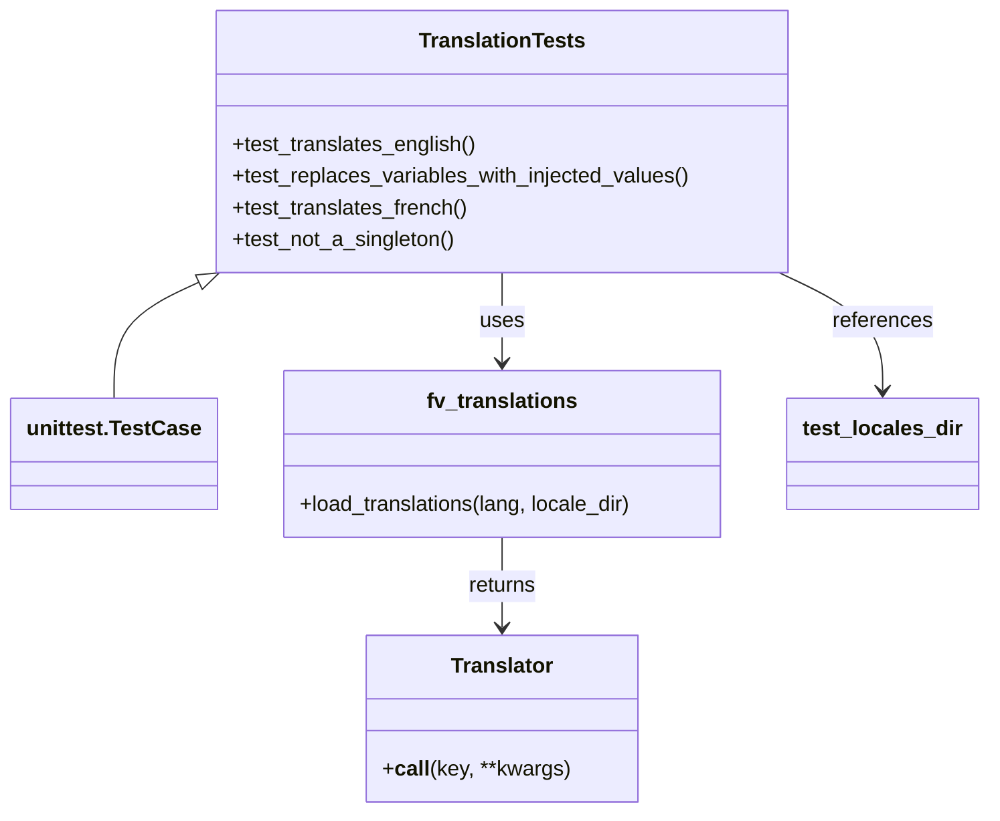
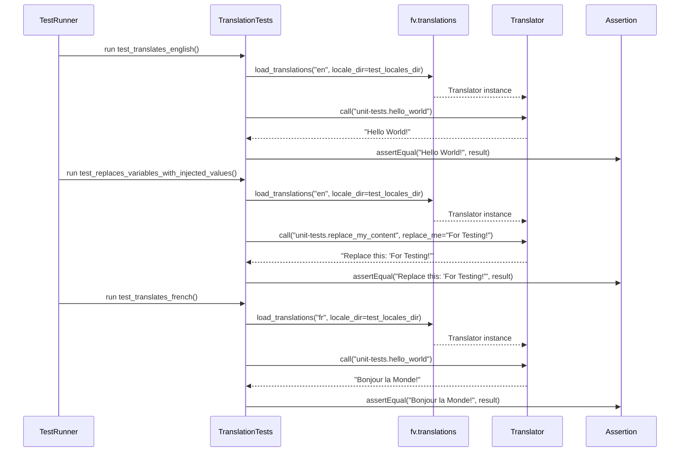

# Diagram: common/fv/python/tests/translations/test_translations.py

> Auto-generated by Obscura crawlers

## Diagram 1

### SVG

<svg id="container" width="740.09375" xmlns="http://www.w3.org/2000/svg" class="classDiagram" height="614" viewBox="0 0 740.09375 614" role="graphics-document document" aria-roledescription="class"><g><defs><marker id="container_class-aggregationStart" class="marker aggregation class" refX="18" refY="7" markerWidth="190" markerHeight="240" orient="auto"><path d="M 18,7 L9,13 L1,7 L9,1 Z"></path></marker></defs><defs><marker id="container_class-aggregationEnd" class="marker aggregation class" refX="1" refY="7" markerWidth="20" markerHeight="28" orient="auto"><path d="M 18,7 L9,13 L1,7 L9,1 Z"></path></marker></defs><defs><marker id="container_class-extensionStart" class="marker extension class" refX="18" refY="7" markerWidth="190" markerHeight="240" orient="auto"><path d="M 1,7 L18,13 V 1 Z"></path></marker></defs><defs><marker id="container_class-extensionEnd" class="marker extension class" refX="1" refY="7" markerWidth="20" markerHeight="28" orient="auto"><path d="M 1,1 V 13 L18,7 Z"></path></marker></defs><defs><marker id="container_class-compositionStart" class="marker composition class" refX="18" refY="7" markerWidth="190" markerHeight="240" orient="auto"><path d="M 18,7 L9,13 L1,7 L9,1 Z"></path></marker></defs><defs><marker id="container_class-compositionEnd" class="marker composition class" refX="1" refY="7" markerWidth="20" markerHeight="28" orient="auto"><path d="M 18,7 L9,13 L1,7 L9,1 Z"></path></marker></defs><defs><marker id="container_class-dependencyStart" class="marker dependency class" refX="6" refY="7" markerWidth="190" markerHeight="240" orient="auto"><path d="M 5,7 L9,13 L1,7 L9,1 Z"></path></marker></defs><defs><marker id="container_class-dependencyEnd" class="marker dependency class" refX="13" refY="7" markerWidth="20" markerHeight="28" orient="auto"><path d="M 18,7 L9,13 L14,7 L9,1 Z"></path></marker></defs><defs><marker id="container_class-lollipopStart" class="marker lollipop class" refX="13" refY="7" markerWidth="190" markerHeight="240" orient="auto"><circle stroke="black" fill="transparent" cx="7" cy="7" r="6"></circle></marker></defs><defs><marker id="container_class-lollipopEnd" class="marker lollipop class" refX="1" refY="7" markerWidth="190" markerHeight="240" orient="auto"><circle stroke="black" fill="transparent" cx="7" cy="7" r="6"></circle></marker></defs><g class="root"><g class="clusters"></g><g class="edgePaths"><path d="M146.48,213.286L135.852,218.238C125.224,223.191,103.967,233.095,93.339,247.714C82.711,262.333,82.711,281.667,82.711,291.333L82.711,301" id="id_TranslationTests_unittest.TestCase_1" class="edge-thickness-normal edge-pattern-solid relation" style=";;;" data-edge="true" data-et="edge" data-id="id_TranslationTests_unittest.TestCase_1" data-points="W3sieCI6MTYyLjExNTk4MTE1ODA4ODIzLCJ5IjoyMDZ9LHsieCI6ODIuNzEwOTM3NSwieSI6MjQzfSx7IngiOjgyLjcxMDkzNzUsInkiOjMwMX1d" marker-start="url(#container_class-extensionStart)"></path><path d="M374.578,206L374.578,212.167C374.578,218.333,374.578,230.667,374.578,242C374.578,253.333,374.578,263.667,374.578,268.833L374.578,274" id="id_TranslationTests_fv_translations_2" class="edge-thickness-normal edge-pattern-solid relation" style=";;;" data-edge="true" data-et="edge" data-id="id_TranslationTests_fv_translations_2" data-points="W3sieCI6Mzc0LjU3ODEyNSwieSI6MjA2fSx7IngiOjM3NC41NzgxMjUsInkiOjI0M30seyJ4IjozNzQuNTc4MTI1LCJ5IjoyODB9XQ==" marker-end="url(#container_class-dependencyEnd)"></path><path d="M374.578,406L374.578,412.167C374.578,418.333,374.578,430.667,374.578,442C374.578,453.333,374.578,463.667,374.578,468.833L374.578,474" id="id_fv_translations_Translator_3" class="edge-thickness-normal edge-pattern-solid relation" style=";;;" data-edge="true" data-et="edge" data-id="id_fv_translations_Translator_3" data-points="W3sieCI6Mzc0LjU3ODEyNSwieSI6NDA2fSx7IngiOjM3NC41NzgxMjUsInkiOjQ0M30seyJ4IjozNzQuNTc4MTI1LCJ5Ijo0ODB9XQ==" marker-end="url(#container_class-dependencyEnd)"></path><path d="M583.742,206L596.77,212.167C609.799,218.333,635.857,230.667,648.885,245.5C661.914,260.333,661.914,277.667,661.914,286.333L661.914,295" id="id_TranslationTests_test_locales_dir_4" class="edge-thickness-normal edge-pattern-solid relation" style=";;;" data-edge="true" data-et="edge" data-id="id_TranslationTests_test_locales_dir_4" data-points="W3sieCI6NTgzLjc0MTc4NTM4NjAyOTQsInkiOjIwNn0seyJ4Ijo2NjEuOTE0MDYyNSwieSI6MjQzfSx7IngiOjY2MS45MTQwNjI1LCJ5IjozMDF9XQ==" marker-end="url(#container_class-dependencyEnd)"></path></g><g class="edgeLabels"><g class="edgeLabel"><g class="label" data-id="id_TranslationTests_unittest.TestCase_1" transform="translate(0, 0)"><foreignObject width="0" height="0">

</foreignObject></g></g><g class="edgeLabel" transform="translate(374.578125, 243)"><g class="label" data-id="id_TranslationTests_fv_translations_2" transform="translate(-16.4921875, -12)"><foreignObject width="32.984375" height="24">

uses

</foreignObject></g></g><g class="edgeLabel" transform="translate(374.578125, 443)"><g class="label" data-id="id_fv_translations_Translator_3" transform="translate(-26.265625, -12)"><foreignObject width="52.53125" height="24">

returns

</foreignObject></g></g><g class="edgeLabel" transform="translate(661.9140625, 243)"><g class="label" data-id="id_TranslationTests_test_locales_dir_4" transform="translate(-37.828125, -12)"><foreignObject width="75.65625" height="24">

references

</foreignObject></g></g></g><g class="nodes"><g class="node default" id="classId-TranslationTests-0" transform="translate(374.578125, 107)"><g class="basic label-container"><path d="M-216.3125 -99 L216.3125 -99 L216.3125 99 L-216.3125 99" stroke="none" stroke-width="0" fill="#ECECFF" style=""></path><path d="M-216.3125 -99 C-103.10352236005521 -99, 10.105455279889583 -99, 216.3125 -99 M-216.3125 -99 C-116.4170087624894 -99, -16.521517524978805 -99, 216.3125 -99 M216.3125 -99 C216.3125 -36.88806929704219, 216.3125 25.223861405915613, 216.3125 99 M216.3125 -99 C216.3125 -51.85967261000706, 216.3125 -4.7193452200141195, 216.3125 99 M216.3125 99 C125.28873296938174 99, 34.26496593876348 99, -216.3125 99 M216.3125 99 C99.80137903858632 99, -16.709741922827362 99, -216.3125 99 M-216.3125 99 C-216.3125 48.12632220631144, -216.3125 -2.7473555873771147, -216.3125 -99 M-216.3125 99 C-216.3125 42.91869842653529, -216.3125 -13.162603146929413, -216.3125 -99" stroke="#9370DB" stroke-width="1.3" fill="none" stroke-dasharray="0 0" style=""></path></g><g class="annotation-group text" transform="translate(0, -75)"></g><g class="label-group text" transform="translate(-60.34375, -75)"><g class="label" style="font-weight: bolder" transform="translate(0,-12)"><foreignObject width="120.6875" height="24">

TranslationTests

</foreignObject></g></g><g class="members-group text" transform="translate(-204.3125, -27)"></g><g class="methods-group text" transform="translate(-204.3125, 3)"><g class="label" style="" transform="translate(0,-12)"><foreignObject width="185.90625" height="24">

+test_translates_english()

</foreignObject></g><g class="label" style="" transform="translate(0,12)"><foreignObject width="348.28125" height="24">

+test_replaces_variables_with_injected_values()

</foreignObject></g><g class="label" style="" transform="translate(0,36)"><foreignObject width="179.625" height="24">

+test_translates_french()

</foreignObject></g><g class="label" style="" transform="translate(0,60)"><foreignObject width="170.890625" height="24">

+test_not_a_singleton()

</foreignObject></g></g><g class="divider" style=""><path d="M-216.3125 -51 C-110.31505552298003 -51, -4.317611045960064 -51, 216.3125 -51 M-216.3125 -51 C-82.98070610053023 -51, 50.351087798939545 -51, 216.3125 -51" stroke="#9370DB" stroke-width="1.3" fill="none" stroke-dasharray="0 0" style=""></path></g><g class="divider" style=""><path d="M-216.3125 -27 C-80.86305785800963 -27, 54.58638428398075 -27, 216.3125 -27 M-216.3125 -27 C-104.92854681078528 -27, 6.455406378429444 -27, 216.3125 -27" stroke="#9370DB" stroke-width="1.3" fill="none" stroke-dasharray="0 0" style=""></path></g></g><g class="node default" id="classId-unittest.TestCase-1" transform="translate(82.7109375, 343)"><g class="basic label-container"><path d="M-74.7109375 -42 L74.7109375 -42 L74.7109375 42 L-74.7109375 42" stroke="none" stroke-width="0" fill="#ECECFF" style=""></path><path d="M-74.7109375 -42 C-29.607999846343297 -42, 15.494937807313406 -42, 74.7109375 -42 M-74.7109375 -42 C-29.083550186766097 -42, 16.543837126467807 -42, 74.7109375 -42 M74.7109375 -42 C74.7109375 -23.956020706148028, 74.7109375 -5.912041412296055, 74.7109375 42 M74.7109375 -42 C74.7109375 -9.093639370559046, 74.7109375 23.812721258881908, 74.7109375 42 M74.7109375 42 C31.780955749216517 42, -11.149026001566966 42, -74.7109375 42 M74.7109375 42 C23.369509271987482 42, -27.971918956025036 42, -74.7109375 42 M-74.7109375 42 C-74.7109375 11.80419728044459, -74.7109375 -18.39160543911082, -74.7109375 -42 M-74.7109375 42 C-74.7109375 19.335096263883937, -74.7109375 -3.329807472232126, -74.7109375 -42" stroke="#9370DB" stroke-width="1.3" fill="none" stroke-dasharray="0 0" style=""></path></g><g class="annotation-group text" transform="translate(0, -18)"></g><g class="label-group text" transform="translate(-62.7109375, -18)"><g class="label" style="font-weight: bolder" transform="translate(0,-12)"><foreignObject width="125.421875" height="24">

unittest.TestCase

</foreignObject></g></g><g class="members-group text" transform="translate(-62.7109375, 30)"></g><g class="methods-group text" transform="translate(-62.7109375, 60)"></g><g class="divider" style=""><path d="M-74.7109375 6 C-39.32894475012969 6, -3.9469520002593868 6, 74.7109375 6 M-74.7109375 6 C-39.805907732879376 6, -4.9008779657587525 6, 74.7109375 6" stroke="#9370DB" stroke-width="1.3" fill="none" stroke-dasharray="0 0" style=""></path></g><g class="divider" style=""><path d="M-74.7109375 24 C-42.93259349697642 24, -11.154249493952847 24, 74.7109375 24 M-74.7109375 24 C-34.66079007603446 24, 5.389357347931082 24, 74.7109375 24" stroke="#9370DB" stroke-width="1.3" fill="none" stroke-dasharray="0 0" style=""></path></g></g><g class="node default" id="classId-fv_translations-2" transform="translate(374.578125, 343)"><g class="basic label-container"><path d="M-167.15625 -63 L167.15625 -63 L167.15625 63 L-167.15625 63" stroke="none" stroke-width="0" fill="#ECECFF" style=""></path><path d="M-167.15625 -63 C-84.50697633430418 -63, -1.8577026686083684 -63, 167.15625 -63 M-167.15625 -63 C-35.510871687638655 -63, 96.13450662472269 -63, 167.15625 -63 M167.15625 -63 C167.15625 -24.21492346196863, 167.15625 14.570153076062738, 167.15625 63 M167.15625 -63 C167.15625 -20.79854779466303, 167.15625 21.40290441067394, 167.15625 63 M167.15625 63 C99.00900523133937 63, 30.861760462678745 63, -167.15625 63 M167.15625 63 C92.74358654665967 63, 18.330923093319342 63, -167.15625 63 M-167.15625 63 C-167.15625 14.876362072237718, -167.15625 -33.24727585552456, -167.15625 -63 M-167.15625 63 C-167.15625 25.10700116589878, -167.15625 -12.785997668202441, -167.15625 -63" stroke="#9370DB" stroke-width="1.3" fill="none" stroke-dasharray="0 0" style=""></path></g><g class="annotation-group text" transform="translate(0, -39)"></g><g class="label-group text" transform="translate(-54.8125, -39)"><g class="label" style="font-weight: bolder" transform="translate(0,-12)"><foreignObject width="109.625" height="24">

fv_translations

</foreignObject></g></g><g class="members-group text" transform="translate(-155.15625, 9)"></g><g class="methods-group text" transform="translate(-155.15625, 39)"><g class="label" style="" transform="translate(0,-12)"><foreignObject width="255.5" height="24">

+load_translations(lang, locale_dir)

</foreignObject></g></g><g class="divider" style=""><path d="M-167.15625 -15 C-93.83584340026911 -15, -20.515436800538225 -15, 167.15625 -15 M-167.15625 -15 C-46.755642393854686 -15, 73.64496521229063 -15, 167.15625 -15" stroke="#9370DB" stroke-width="1.3" fill="none" stroke-dasharray="0 0" style=""></path></g><g class="divider" style=""><path d="M-167.15625 9 C-90.33908876684632 9, -13.521927533692633 9, 167.15625 9 M-167.15625 9 C-74.49130941717387 9, 18.173631165652267 9, 167.15625 9" stroke="#9370DB" stroke-width="1.3" fill="none" stroke-dasharray="0 0" style=""></path></g></g><g class="node default" id="classId-Translator-3" transform="translate(374.578125, 543)"><g class="basic label-container"><path d="M-100.6640625 -63 L100.6640625 -63 L100.6640625 63 L-100.6640625 63" stroke="none" stroke-width="0" fill="#ECECFF" style=""></path><path d="M-100.6640625 -63 C-36.25982297351939 -63, 28.144416552961218 -63, 100.6640625 -63 M-100.6640625 -63 C-43.573733158296314 -63, 13.516596183407373 -63, 100.6640625 -63 M100.6640625 -63 C100.6640625 -17.066029299158984, 100.6640625 28.86794140168203, 100.6640625 63 M100.6640625 -63 C100.6640625 -15.339493534689197, 100.6640625 32.321012930621606, 100.6640625 63 M100.6640625 63 C35.83085764960249 63, -29.002347200795015 63, -100.6640625 63 M100.6640625 63 C27.375272196894684 63, -45.91351810621063 63, -100.6640625 63 M-100.6640625 63 C-100.6640625 29.85830468155055, -100.6640625 -3.2833906368989005, -100.6640625 -63 M-100.6640625 63 C-100.6640625 29.108749290508662, -100.6640625 -4.782501418982676, -100.6640625 -63" stroke="#9370DB" stroke-width="1.3" fill="none" stroke-dasharray="0 0" style=""></path></g><g class="annotation-group text" transform="translate(0, -39)"></g><g class="label-group text" transform="translate(-37.421875, -39)"><g class="label" style="font-weight: bolder" transform="translate(0,-12)"><foreignObject width="74.84375" height="24">

Translator

</foreignObject></g></g><g class="members-group text" transform="translate(-88.6640625, 9)"></g><g class="methods-group text" transform="translate(-88.6640625, 39)"><g class="label" style="" transform="translate(0,-12)"><foreignObject width="139.90625" height="24">

+<strong>call</strong>(key, **kwargs)

</foreignObject></g></g><g class="divider" style=""><path d="M-100.6640625 -15 C-43.589616627999426 -15, 13.484829244001148 -15, 100.6640625 -15 M-100.6640625 -15 C-58.53926978900641 -15, -16.414477078012823 -15, 100.6640625 -15" stroke="#9370DB" stroke-width="1.3" fill="none" stroke-dasharray="0 0" style=""></path></g><g class="divider" style=""><path d="M-100.6640625 9 C-39.30874388430614 9, 22.04657473138772 9, 100.6640625 9 M-100.6640625 9 C-31.20139070143523 9, 38.26128109712954 9, 100.6640625 9" stroke="#9370DB" stroke-width="1.3" fill="none" stroke-dasharray="0 0" style=""></path></g></g><g class="node default" id="classId-test_locales_dir-4" transform="translate(661.9140625, 343)"><g class="basic label-container"><path d="M-70.1796875 -42 L70.1796875 -42 L70.1796875 42 L-70.1796875 42" stroke="none" stroke-width="0" fill="#ECECFF" style=""></path><path d="M-70.1796875 -42 C-22.06134693514084 -42, 26.05699362971832 -42, 70.1796875 -42 M-70.1796875 -42 C-39.29688939399033 -42, -8.414091287980654 -42, 70.1796875 -42 M70.1796875 -42 C70.1796875 -15.248319915912518, 70.1796875 11.503360168174964, 70.1796875 42 M70.1796875 -42 C70.1796875 -19.549574044271665, 70.1796875 2.9008519114566695, 70.1796875 42 M70.1796875 42 C20.23243383204094 42, -29.71481983591812 42, -70.1796875 42 M70.1796875 42 C32.13940354940018 42, -5.900880401199643 42, -70.1796875 42 M-70.1796875 42 C-70.1796875 8.480364071052485, -70.1796875 -25.03927185789503, -70.1796875 -42 M-70.1796875 42 C-70.1796875 13.89618150490552, -70.1796875 -14.20763699018896, -70.1796875 -42" stroke="#9370DB" stroke-width="1.3" fill="none" stroke-dasharray="0 0" style=""></path></g><g class="annotation-group text" transform="translate(0, -18)"></g><g class="label-group text" transform="translate(-58.1796875, -18)"><g class="label" style="font-weight: bolder" transform="translate(0,-12)"><foreignObject width="116.359375" height="24">

test_locales_dir

</foreignObject></g></g><g class="members-group text" transform="translate(-58.1796875, 30)"></g><g class="methods-group text" transform="translate(-58.1796875, 60)"></g><g class="divider" style=""><path d="M-70.1796875 6 C-20.33449034186426 6, 29.51070681627148 6, 70.1796875 6 M-70.1796875 6 C-14.234990307958533 6, 41.709706884082934 6, 70.1796875 6" stroke="#9370DB" stroke-width="1.3" fill="none" stroke-dasharray="0 0" style=""></path></g><g class="divider" style=""><path d="M-70.1796875 24 C-18.105647501619693 24, 33.968392496760615 24, 70.1796875 24 M-70.1796875 24 C-37.81900724552418 24, -5.4583269910483665 24, 70.1796875 24" stroke="#9370DB" stroke-width="1.3" fill="none" stroke-dasharray="0 0" style=""></path></g></g></g></g></g></svg>

## Diagram 2

### SVG

<svg id="container" width="1536" xmlns="http://www.w3.org/2000/svg" height="1035" viewBox="-50 -10 1536 1035" role="graphics-document document" aria-roledescription="sequence"><g><rect x="1286" y="949" fill="#eaeaea" stroke="#666" width="150" height="65" name="Assertion" rx="3" ry="3" class="actor actor-bottom"></rect><text x="1361" y="981.5" dominant-baseline="central" alignment-baseline="central" class="actor actor-box" style="text-anchor: middle; font-size: 16px; font-weight: 400;"><tspan x="1361" dy="0">Assertion</tspan></text></g><g><rect x="1086" y="949" fill="#eaeaea" stroke="#666" width="150" height="65" name="Translator" rx="3" ry="3" class="actor actor-bottom"></rect><text x="1161" y="981.5" dominant-baseline="central" alignment-baseline="central" class="actor actor-box" style="text-anchor: middle; font-size: 16px; font-weight: 400;"><tspan x="1161" dy="0">Translator</tspan></text></g><g><rect x="877" y="949" fill="#eaeaea" stroke="#666" width="150" height="65" name="fv_translations" rx="3" ry="3" class="actor actor-bottom"></rect><text x="952" y="981.5" dominant-baseline="central" alignment-baseline="central" class="actor actor-box" style="text-anchor: middle; font-size: 16px; font-weight: 400;"><tspan x="952" dy="0">fv.translations</tspan></text></g><g><rect x="439" y="949" fill="#eaeaea" stroke="#666" width="150" height="65" name="TranslationTests" rx="3" ry="3" class="actor actor-bottom"></rect><text x="514" y="981.5" dominant-baseline="central" alignment-baseline="central" class="actor actor-box" style="text-anchor: middle; font-size: 16px; font-weight: 400;"><tspan x="514" dy="0">TranslationTests</tspan></text></g><g><rect x="0" y="949" fill="#eaeaea" stroke="#666" width="150" height="65" name="TestRunner" rx="3" ry="3" class="actor actor-bottom"></rect><text x="75" y="981.5" dominant-baseline="central" alignment-baseline="central" class="actor actor-box" style="text-anchor: middle; font-size: 16px; font-weight: 400;"><tspan x="75" dy="0">TestRunner</tspan></text></g><g><line id="actor4" x1="1361" y1="65" x2="1361" y2="949" class="actor-line 200" stroke-width="0.5px" stroke="#999" name="Assertion"></line><g id="root-4"><rect x="1286" y="0" fill="#eaeaea" stroke="#666" width="150" height="65" name="Assertion" rx="3" ry="3" class="actor actor-top"></rect><text x="1361" y="32.5" dominant-baseline="central" alignment-baseline="central" class="actor actor-box" style="text-anchor: middle; font-size: 16px; font-weight: 400;"><tspan x="1361" dy="0">Assertion</tspan></text></g></g><g><line id="actor3" x1="1161" y1="65" x2="1161" y2="949" class="actor-line 200" stroke-width="0.5px" stroke="#999" name="Translator"></line><g id="root-3"><rect x="1086" y="0" fill="#eaeaea" stroke="#666" width="150" height="65" name="Translator" rx="3" ry="3" class="actor actor-top"></rect><text x="1161" y="32.5" dominant-baseline="central" alignment-baseline="central" class="actor actor-box" style="text-anchor: middle; font-size: 16px; font-weight: 400;"><tspan x="1161" dy="0">Translator</tspan></text></g></g><g><line id="actor2" x1="952" y1="65" x2="952" y2="949" class="actor-line 200" stroke-width="0.5px" stroke="#999" name="fv_translations"></line><g id="root-2"><rect x="877" y="0" fill="#eaeaea" stroke="#666" width="150" height="65" name="fv_translations" rx="3" ry="3" class="actor actor-top"></rect><text x="952" y="32.5" dominant-baseline="central" alignment-baseline="central" class="actor actor-box" style="text-anchor: middle; font-size: 16px; font-weight: 400;"><tspan x="952" dy="0">fv.translations</tspan></text></g></g><g><line id="actor1" x1="514" y1="65" x2="514" y2="949" class="actor-line 200" stroke-width="0.5px" stroke="#999" name="TranslationTests"></line><g id="root-1"><rect x="439" y="0" fill="#eaeaea" stroke="#666" width="150" height="65" name="TranslationTests" rx="3" ry="3" class="actor actor-top"></rect><text x="514" y="32.5" dominant-baseline="central" alignment-baseline="central" class="actor actor-box" style="text-anchor: middle; font-size: 16px; font-weight: 400;"><tspan x="514" dy="0">TranslationTests</tspan></text></g></g><g><line id="actor0" x1="75" y1="65" x2="75" y2="949" class="actor-line 200" stroke-width="0.5px" stroke="#999" name="TestRunner"></line><g id="root-0"><rect x="0" y="0" fill="#eaeaea" stroke="#666" width="150" height="65" name="TestRunner" rx="3" ry="3" class="actor actor-top"></rect><text x="75" y="32.5" dominant-baseline="central" alignment-baseline="central" class="actor actor-box" style="text-anchor: middle; font-size: 16px; font-weight: 400;"><tspan x="75" dy="0">TestRunner</tspan></text></g></g><g></g><defs><symbol id="computer" width="24" height="24"><path transform="scale(.5)" d="M2 2v13h20v-13h-20zm18 11h-16v-9h16v9zm-10.228 6l.466-1h3.524l.467 1h-4.457zm14.228 3h-24l2-6h2.104l-1.33 4h18.45l-1.297-4h2.073l2 6zm-5-10h-14v-7h14v7z"></path></symbol></defs><defs><symbol id="database" fill-rule="evenodd" clip-rule="evenodd"><path transform="scale(.5)" d="M12.258.001l.256.004.255.005.253.008.251.01.249.012.247.015.246.016.242.019.241.02.239.023.236.024.233.027.231.028.229.031.225.032.223.034.22.036.217.038.214.04.211.041.208.043.205.045.201.046.198.048.194.05.191.051.187.053.183.054.18.056.175.057.172.059.168.06.163.061.16.063.155.064.15.066.074.033.073.033.071.034.07.034.069.035.068.035.067.035.066.035.064.036.064.036.062.036.06.036.06.037.058.037.058.037.055.038.055.038.053.038.052.038.051.039.05.039.048.039.047.039.045.04.044.04.043.04.041.04.04.041.039.041.037.041.036.041.034.041.033.042.032.042.03.042.029.042.027.042.026.043.024.043.023.043.021.043.02.043.018.044.017.043.015.044.013.044.012.044.011.045.009.044.007.045.006.045.004.045.002.045.001.045v17l-.001.045-.002.045-.004.045-.006.045-.007.045-.009.044-.011.045-.012.044-.013.044-.015.044-.017.043-.018.044-.02.043-.021.043-.023.043-.024.043-.026.043-.027.042-.029.042-.03.042-.032.042-.033.042-.034.041-.036.041-.037.041-.039.041-.04.041-.041.04-.043.04-.044.04-.045.04-.047.039-.048.039-.05.039-.051.039-.052.038-.053.038-.055.038-.055.038-.058.037-.058.037-.06.037-.06.036-.062.036-.064.036-.064.036-.066.035-.067.035-.068.035-.069.035-.07.034-.071.034-.073.033-.074.033-.15.066-.155.064-.16.063-.163.061-.168.06-.172.059-.175.057-.18.056-.183.054-.187.053-.191.051-.194.05-.198.048-.201.046-.205.045-.208.043-.211.041-.214.04-.217.038-.22.036-.223.034-.225.032-.229.031-.231.028-.233.027-.236.024-.239.023-.241.02-.242.019-.246.016-.247.015-.249.012-.251.01-.253.008-.255.005-.256.004-.258.001-.258-.001-.256-.004-.255-.005-.253-.008-.251-.01-.249-.012-.247-.015-.245-.016-.243-.019-.241-.02-.238-.023-.236-.024-.234-.027-.231-.028-.228-.031-.226-.032-.223-.034-.22-.036-.217-.038-.214-.04-.211-.041-.208-.043-.204-.045-.201-.046-.198-.048-.195-.05-.19-.051-.187-.053-.184-.054-.179-.056-.176-.057-.172-.059-.167-.06-.164-.061-.159-.063-.155-.064-.151-.066-.074-.033-.072-.033-.072-.034-.07-.034-.069-.035-.068-.035-.067-.035-.066-.035-.064-.036-.063-.036-.062-.036-.061-.036-.06-.037-.058-.037-.057-.037-.056-.038-.055-.038-.053-.038-.052-.038-.051-.039-.049-.039-.049-.039-.046-.039-.046-.04-.044-.04-.043-.04-.041-.04-.04-.041-.039-.041-.037-.041-.036-.041-.034-.041-.033-.042-.032-.042-.03-.042-.029-.042-.027-.042-.026-.043-.024-.043-.023-.043-.021-.043-.02-.043-.018-.044-.017-.043-.015-.044-.013-.044-.012-.044-.011-.045-.009-.044-.007-.045-.006-.045-.004-.045-.002-.045-.001-.045v-17l.001-.045.002-.045.004-.045.006-.045.007-.045.009-.044.011-.045.012-.044.013-.044.015-.044.017-.043.018-.044.02-.043.021-.043.023-.043.024-.043.026-.043.027-.042.029-.042.03-.042.032-.042.033-.042.034-.041.036-.041.037-.041.039-.041.04-.041.041-.04.043-.04.044-.04.046-.04.046-.039.049-.039.049-.039.051-.039.052-.038.053-.038.055-.038.056-.038.057-.037.058-.037.06-.037.061-.036.062-.036.063-.036.064-.036.066-.035.067-.035.068-.035.069-.035.07-.034.072-.034.072-.033.074-.033.151-.066.155-.064.159-.063.164-.061.167-.06.172-.059.176-.057.179-.056.184-.054.187-.053.19-.051.195-.05.198-.048.201-.046.204-.045.208-.043.211-.041.214-.04.217-.038.22-.036.223-.034.226-.032.228-.031.231-.028.234-.027.236-.024.238-.023.241-.02.243-.019.245-.016.247-.015.249-.012.251-.01.253-.008.255-.005.256-.004.258-.001.258.001zm-9.258 20.499v.01l.001.021.003.021.004.022.005.021.006.022.007.022.009.023.01.022.011.023.012.023.013.023.015.023.016.024.017.023.018.024.019.024.021.024.022.025.023.024.024.025.052.049.056.05.061.051.066.051.07.051.075.051.079.052.084.052.088.052.092.052.097.052.102.051.105.052.11.052.114.051.119.051.123.051.127.05.131.05.135.05.139.048.144.049.147.047.152.047.155.047.16.045.163.045.167.043.171.043.176.041.178.041.183.039.187.039.19.037.194.035.197.035.202.033.204.031.209.03.212.029.216.027.219.025.222.024.226.021.23.02.233.018.236.016.24.015.243.012.246.01.249.008.253.005.256.004.259.001.26-.001.257-.004.254-.005.25-.008.247-.011.244-.012.241-.014.237-.016.233-.018.231-.021.226-.021.224-.024.22-.026.216-.027.212-.028.21-.031.205-.031.202-.034.198-.034.194-.036.191-.037.187-.039.183-.04.179-.04.175-.042.172-.043.168-.044.163-.045.16-.046.155-.046.152-.047.148-.048.143-.049.139-.049.136-.05.131-.05.126-.05.123-.051.118-.052.114-.051.11-.052.106-.052.101-.052.096-.052.092-.052.088-.053.083-.051.079-.052.074-.052.07-.051.065-.051.06-.051.056-.05.051-.05.023-.024.023-.025.021-.024.02-.024.019-.024.018-.024.017-.024.015-.023.014-.024.013-.023.012-.023.01-.023.01-.022.008-.022.006-.022.006-.022.004-.022.004-.021.001-.021.001-.021v-4.127l-.077.055-.08.053-.083.054-.085.053-.087.052-.09.052-.093.051-.095.05-.097.05-.1.049-.102.049-.105.048-.106.047-.109.047-.111.046-.114.045-.115.045-.118.044-.12.043-.122.042-.124.042-.126.041-.128.04-.13.04-.132.038-.134.038-.135.037-.138.037-.139.035-.142.035-.143.034-.144.033-.147.032-.148.031-.15.03-.151.03-.153.029-.154.027-.156.027-.158.026-.159.025-.161.024-.162.023-.163.022-.165.021-.166.02-.167.019-.169.018-.169.017-.171.016-.173.015-.173.014-.175.013-.175.012-.177.011-.178.01-.179.008-.179.008-.181.006-.182.005-.182.004-.184.003-.184.002h-.37l-.184-.002-.184-.003-.182-.004-.182-.005-.181-.006-.179-.008-.179-.008-.178-.01-.176-.011-.176-.012-.175-.013-.173-.014-.172-.015-.171-.016-.17-.017-.169-.018-.167-.019-.166-.02-.165-.021-.163-.022-.162-.023-.161-.024-.159-.025-.157-.026-.156-.027-.155-.027-.153-.029-.151-.03-.15-.03-.148-.031-.146-.032-.145-.033-.143-.034-.141-.035-.14-.035-.137-.037-.136-.037-.134-.038-.132-.038-.13-.04-.128-.04-.126-.041-.124-.042-.122-.042-.12-.044-.117-.043-.116-.045-.113-.045-.112-.046-.109-.047-.106-.047-.105-.048-.102-.049-.1-.049-.097-.05-.095-.05-.093-.052-.09-.051-.087-.052-.085-.053-.083-.054-.08-.054-.077-.054v4.127zm0-5.654v.011l.001.021.003.021.004.021.005.022.006.022.007.022.009.022.01.022.011.023.012.023.013.023.015.024.016.023.017.024.018.024.019.024.021.024.022.024.023.025.024.024.052.05.056.05.061.05.066.051.07.051.075.052.079.051.084.052.088.052.092.052.097.052.102.052.105.052.11.051.114.051.119.052.123.05.127.051.131.05.135.049.139.049.144.048.147.048.152.047.155.046.16.045.163.045.167.044.171.042.176.042.178.04.183.04.187.038.19.037.194.036.197.034.202.033.204.032.209.03.212.028.216.027.219.025.222.024.226.022.23.02.233.018.236.016.24.014.243.012.246.01.249.008.253.006.256.003.259.001.26-.001.257-.003.254-.006.25-.008.247-.01.244-.012.241-.015.237-.016.233-.018.231-.02.226-.022.224-.024.22-.025.216-.027.212-.029.21-.03.205-.032.202-.033.198-.035.194-.036.191-.037.187-.039.183-.039.179-.041.175-.042.172-.043.168-.044.163-.045.16-.045.155-.047.152-.047.148-.048.143-.048.139-.05.136-.049.131-.05.126-.051.123-.051.118-.051.114-.052.11-.052.106-.052.101-.052.096-.052.092-.052.088-.052.083-.052.079-.052.074-.051.07-.052.065-.051.06-.05.056-.051.051-.049.023-.025.023-.024.021-.025.02-.024.019-.024.018-.024.017-.024.015-.023.014-.023.013-.024.012-.022.01-.023.01-.023.008-.022.006-.022.006-.022.004-.021.004-.022.001-.021.001-.021v-4.139l-.077.054-.08.054-.083.054-.085.052-.087.053-.09.051-.093.051-.095.051-.097.05-.1.049-.102.049-.105.048-.106.047-.109.047-.111.046-.114.045-.115.044-.118.044-.12.044-.122.042-.124.042-.126.041-.128.04-.13.039-.132.039-.134.038-.135.037-.138.036-.139.036-.142.035-.143.033-.144.033-.147.033-.148.031-.15.03-.151.03-.153.028-.154.028-.156.027-.158.026-.159.025-.161.024-.162.023-.163.022-.165.021-.166.02-.167.019-.169.018-.169.017-.171.016-.173.015-.173.014-.175.013-.175.012-.177.011-.178.009-.179.009-.179.007-.181.007-.182.005-.182.004-.184.003-.184.002h-.37l-.184-.002-.184-.003-.182-.004-.182-.005-.181-.007-.179-.007-.179-.009-.178-.009-.176-.011-.176-.012-.175-.013-.173-.014-.172-.015-.171-.016-.17-.017-.169-.018-.167-.019-.166-.02-.165-.021-.163-.022-.162-.023-.161-.024-.159-.025-.157-.026-.156-.027-.155-.028-.153-.028-.151-.03-.15-.03-.148-.031-.146-.033-.145-.033-.143-.033-.141-.035-.14-.036-.137-.036-.136-.037-.134-.038-.132-.039-.13-.039-.128-.04-.126-.041-.124-.042-.122-.043-.12-.043-.117-.044-.116-.044-.113-.046-.112-.046-.109-.046-.106-.047-.105-.048-.102-.049-.1-.049-.097-.05-.095-.051-.093-.051-.09-.051-.087-.053-.085-.052-.083-.054-.08-.054-.077-.054v4.139zm0-5.666v.011l.001.02.003.022.004.021.005.022.006.021.007.022.009.023.01.022.011.023.012.023.013.023.015.023.016.024.017.024.018.023.019.024.021.025.022.024.023.024.024.025.052.05.056.05.061.05.066.051.07.051.075.052.079.051.084.052.088.052.092.052.097.052.102.052.105.051.11.052.114.051.119.051.123.051.127.05.131.05.135.05.139.049.144.048.147.048.152.047.155.046.16.045.163.045.167.043.171.043.176.042.178.04.183.04.187.038.19.037.194.036.197.034.202.033.204.032.209.03.212.028.216.027.219.025.222.024.226.021.23.02.233.018.236.017.24.014.243.012.246.01.249.008.253.006.256.003.259.001.26-.001.257-.003.254-.006.25-.008.247-.01.244-.013.241-.014.237-.016.233-.018.231-.02.226-.022.224-.024.22-.025.216-.027.212-.029.21-.03.205-.032.202-.033.198-.035.194-.036.191-.037.187-.039.183-.039.179-.041.175-.042.172-.043.168-.044.163-.045.16-.045.155-.047.152-.047.148-.048.143-.049.139-.049.136-.049.131-.051.126-.05.123-.051.118-.052.114-.051.11-.052.106-.052.101-.052.096-.052.092-.052.088-.052.083-.052.079-.052.074-.052.07-.051.065-.051.06-.051.056-.05.051-.049.023-.025.023-.025.021-.024.02-.024.019-.024.018-.024.017-.024.015-.023.014-.024.013-.023.012-.023.01-.022.01-.023.008-.022.006-.022.006-.022.004-.022.004-.021.001-.021.001-.021v-4.153l-.077.054-.08.054-.083.053-.085.053-.087.053-.09.051-.093.051-.095.051-.097.05-.1.049-.102.048-.105.048-.106.048-.109.046-.111.046-.114.046-.115.044-.118.044-.12.043-.122.043-.124.042-.126.041-.128.04-.13.039-.132.039-.134.038-.135.037-.138.036-.139.036-.142.034-.143.034-.144.033-.147.032-.148.032-.15.03-.151.03-.153.028-.154.028-.156.027-.158.026-.159.024-.161.024-.162.023-.163.023-.165.021-.166.02-.167.019-.169.018-.169.017-.171.016-.173.015-.173.014-.175.013-.175.012-.177.01-.178.01-.179.009-.179.007-.181.006-.182.006-.182.004-.184.003-.184.001-.185.001-.185-.001-.184-.001-.184-.003-.182-.004-.182-.006-.181-.006-.179-.007-.179-.009-.178-.01-.176-.01-.176-.012-.175-.013-.173-.014-.172-.015-.171-.016-.17-.017-.169-.018-.167-.019-.166-.02-.165-.021-.163-.023-.162-.023-.161-.024-.159-.024-.157-.026-.156-.027-.155-.028-.153-.028-.151-.03-.15-.03-.148-.032-.146-.032-.145-.033-.143-.034-.141-.034-.14-.036-.137-.036-.136-.037-.134-.038-.132-.039-.13-.039-.128-.041-.126-.041-.124-.041-.122-.043-.12-.043-.117-.044-.116-.044-.113-.046-.112-.046-.109-.046-.106-.048-.105-.048-.102-.048-.1-.05-.097-.049-.095-.051-.093-.051-.09-.052-.087-.052-.085-.053-.083-.053-.08-.054-.077-.054v4.153zm8.74-8.179l-.257.004-.254.005-.25.008-.247.011-.244.012-.241.014-.237.016-.233.018-.231.021-.226.022-.224.023-.22.026-.216.027-.212.028-.21.031-.205.032-.202.033-.198.034-.194.036-.191.038-.187.038-.183.04-.179.041-.175.042-.172.043-.168.043-.163.045-.16.046-.155.046-.152.048-.148.048-.143.048-.139.049-.136.05-.131.05-.126.051-.123.051-.118.051-.114.052-.11.052-.106.052-.101.052-.096.052-.092.052-.088.052-.083.052-.079.052-.074.051-.07.052-.065.051-.06.05-.056.05-.051.05-.023.025-.023.024-.021.024-.02.025-.019.024-.018.024-.017.023-.015.024-.014.023-.013.023-.012.023-.01.023-.01.022-.008.022-.006.023-.006.021-.004.022-.004.021-.001.021-.001.021.001.021.001.021.004.021.004.022.006.021.006.023.008.022.01.022.01.023.012.023.013.023.014.023.015.024.017.023.018.024.019.024.02.025.021.024.023.024.023.025.051.05.056.05.06.05.065.051.07.052.074.051.079.052.083.052.088.052.092.052.096.052.101.052.106.052.11.052.114.052.118.051.123.051.126.051.131.05.136.05.139.049.143.048.148.048.152.048.155.046.16.046.163.045.168.043.172.043.175.042.179.041.183.04.187.038.191.038.194.036.198.034.202.033.205.032.21.031.212.028.216.027.22.026.224.023.226.022.231.021.233.018.237.016.241.014.244.012.247.011.25.008.254.005.257.004.26.001.26-.001.257-.004.254-.005.25-.008.247-.011.244-.012.241-.014.237-.016.233-.018.231-.021.226-.022.224-.023.22-.026.216-.027.212-.028.21-.031.205-.032.202-.033.198-.034.194-.036.191-.038.187-.038.183-.04.179-.041.175-.042.172-.043.168-.043.163-.045.16-.046.155-.046.152-.048.148-.048.143-.048.139-.049.136-.05.131-.05.126-.051.123-.051.118-.051.114-.052.11-.052.106-.052.101-.052.096-.052.092-.052.088-.052.083-.052.079-.052.074-.051.07-.052.065-.051.06-.05.056-.05.051-.05.023-.025.023-.024.021-.024.02-.025.019-.024.018-.024.017-.023.015-.024.014-.023.013-.023.012-.023.01-.023.01-.022.008-.022.006-.023.006-.021.004-.022.004-.021.001-.021.001-.021-.001-.021-.001-.021-.004-.021-.004-.022-.006-.021-.006-.023-.008-.022-.01-.022-.01-.023-.012-.023-.013-.023-.014-.023-.015-.024-.017-.023-.018-.024-.019-.024-.02-.025-.021-.024-.023-.024-.023-.025-.051-.05-.056-.05-.06-.05-.065-.051-.07-.052-.074-.051-.079-.052-.083-.052-.088-.052-.092-.052-.096-.052-.101-.052-.106-.052-.11-.052-.114-.052-.118-.051-.123-.051-.126-.051-.131-.05-.136-.05-.139-.049-.143-.048-.148-.048-.152-.048-.155-.046-.16-.046-.163-.045-.168-.043-.172-.043-.175-.042-.179-.041-.183-.04-.187-.038-.191-.038-.194-.036-.198-.034-.202-.033-.205-.032-.21-.031-.212-.028-.216-.027-.22-.026-.224-.023-.226-.022-.231-.021-.233-.018-.237-.016-.241-.014-.244-.012-.247-.011-.25-.008-.254-.005-.257-.004-.26-.001-.26.001z"></path></symbol></defs><defs><symbol id="clock" width="24" height="24"><path transform="scale(.5)" d="M12 2c5.514 0 10 4.486 10 10s-4.486 10-10 10-10-4.486-10-10 4.486-10 10-10zm0-2c-6.627 0-12 5.373-12 12s5.373 12 12 12 12-5.373 12-12-5.373-12-12-12zm5.848 12.459c.202.038.202.333.001.372-1.907.361-6.045 1.111-6.547 1.111-.719 0-1.301-.582-1.301-1.301 0-.512.77-5.447 1.125-7.445.034-.192.312-.181.343.014l.985 6.238 5.394 1.011z"></path></symbol></defs><defs><marker id="arrowhead" refX="7.9" refY="5" markerUnits="userSpaceOnUse" markerWidth="12" markerHeight="12" orient="auto-start-reverse"><path d="M -1 0 L 10 5 L 0 10 z"></path></marker></defs><defs><marker id="crosshead" markerWidth="15" markerHeight="8" orient="auto" refX="4" refY="4.5"><path fill="none" stroke="#000000" stroke-width="1pt" d="M 1,2 L 6,7 M 6,2 L 1,7" style="stroke-dasharray: 0, 0;"></path></marker></defs><defs><marker id="filled-head" refX="15.5" refY="7" markerWidth="20" markerHeight="28" orient="auto"><path d="M 18,7 L9,13 L14,7 L9,1 Z"></path></marker></defs><defs><marker id="sequencenumber" refX="15" refY="15" markerWidth="60" markerHeight="40" orient="auto"><circle cx="15" cy="15" r="6"></circle></marker></defs><text x="293" y="80" text-anchor="middle" dominant-baseline="middle" alignment-baseline="middle" class="messageText" dy="1em" style="font-size: 16px; font-weight: 400;">run test_translates_english()</text><line x1="76" y1="113" x2="510" y2="113" class="messageLine0" stroke-width="2" stroke="none" marker-end="url(#arrowhead)" style="fill: none;"></line><text x="732" y="128" text-anchor="middle" dominant-baseline="middle" alignment-baseline="middle" class="messageText" dy="1em" style="font-size: 16px; font-weight: 400;">load_translations("en", locale_dir=test_locales_dir)</text><line x1="515" y1="161" x2="948" y2="161" class="messageLine0" stroke-width="2" stroke="none" marker-end="url(#arrowhead)" style="fill: none;"></line><text x="1055" y="176" text-anchor="middle" dominant-baseline="middle" alignment-baseline="middle" class="messageText" dy="1em" style="font-size: 16px; font-weight: 400;">Translator instance</text><line x1="953" y1="209" x2="1157" y2="209" class="messageLine1" stroke-width="2" stroke="none" marker-end="url(#arrowhead)" style="stroke-dasharray: 3, 3; fill: none;"></line><text x="836" y="224" text-anchor="middle" dominant-baseline="middle" alignment-baseline="middle" class="messageText" dy="1em" style="font-size: 16px; font-weight: 400;">call("unit-tests.hello_world")</text><line x1="515" y1="257" x2="1157" y2="257" class="messageLine0" stroke-width="2" stroke="none" marker-end="url(#arrowhead)" style="fill: none;"></line><text x="839" y="272" text-anchor="middle" dominant-baseline="middle" alignment-baseline="middle" class="messageText" dy="1em" style="font-size: 16px; font-weight: 400;">"Hello World!"</text><line x1="1160" y1="305" x2="518" y2="305" class="messageLine1" stroke-width="2" stroke="none" marker-end="url(#arrowhead)" style="stroke-dasharray: 3, 3; fill: none;"></line><text x="936" y="320" text-anchor="middle" dominant-baseline="middle" alignment-baseline="middle" class="messageText" dy="1em" style="font-size: 16px; font-weight: 400;">assertEqual("Hello World!", result)</text><line x1="515" y1="353" x2="1357" y2="353" class="messageLine0" stroke-width="2" stroke="none" marker-end="url(#arrowhead)" style="fill: none;"></line><text x="293" y="368" text-anchor="middle" dominant-baseline="middle" alignment-baseline="middle" class="messageText" dy="1em" style="font-size: 16px; font-weight: 400;">run test_replaces_variables_with_injected_values()</text><line x1="76" y1="401" x2="510" y2="401" class="messageLine0" stroke-width="2" stroke="none" marker-end="url(#arrowhead)" style="fill: none;"></line><text x="732" y="416" text-anchor="middle" dominant-baseline="middle" alignment-baseline="middle" class="messageText" dy="1em" style="font-size: 16px; font-weight: 400;">load_translations("en", locale_dir=test_locales_dir)</text><line x1="515" y1="449" x2="948" y2="449" class="messageLine0" stroke-width="2" stroke="none" marker-end="url(#arrowhead)" style="fill: none;"></line><text x="1055" y="464" text-anchor="middle" dominant-baseline="middle" alignment-baseline="middle" class="messageText" dy="1em" style="font-size: 16px; font-weight: 400;">Translator instance</text><line x1="953" y1="497" x2="1157" y2="497" class="messageLine1" stroke-width="2" stroke="none" marker-end="url(#arrowhead)" style="stroke-dasharray: 3, 3; fill: none;"></line><text x="836" y="512" text-anchor="middle" dominant-baseline="middle" alignment-baseline="middle" class="messageText" dy="1em" style="font-size: 16px; font-weight: 400;">call("unit-tests.replace_my_content", replace_me="For Testing!")</text><line x1="515" y1="545" x2="1157" y2="545" class="messageLine0" stroke-width="2" stroke="none" marker-end="url(#arrowhead)" style="fill: none;"></line><text x="839" y="560" text-anchor="middle" dominant-baseline="middle" alignment-baseline="middle" class="messageText" dy="1em" style="font-size: 16px; font-weight: 400;">"Replace this: 'For Testing!'"</text><line x1="1160" y1="593" x2="518" y2="593" class="messageLine1" stroke-width="2" stroke="none" marker-end="url(#arrowhead)" style="stroke-dasharray: 3, 3; fill: none;"></line><text x="936" y="608" text-anchor="middle" dominant-baseline="middle" alignment-baseline="middle" class="messageText" dy="1em" style="font-size: 16px; font-weight: 400;">assertEqual("Replace this: 'For Testing!'", result)</text><line x1="515" y1="641" x2="1357" y2="641" class="messageLine0" stroke-width="2" stroke="none" marker-end="url(#arrowhead)" style="fill: none;"></line><text x="293" y="656" text-anchor="middle" dominant-baseline="middle" alignment-baseline="middle" class="messageText" dy="1em" style="font-size: 16px; font-weight: 400;">run test_translates_french()</text><line x1="76" y1="689" x2="510" y2="689" class="messageLine0" stroke-width="2" stroke="none" marker-end="url(#arrowhead)" style="fill: none;"></line><text x="732" y="704" text-anchor="middle" dominant-baseline="middle" alignment-baseline="middle" class="messageText" dy="1em" style="font-size: 16px; font-weight: 400;">load_translations("fr", locale_dir=test_locales_dir)</text><line x1="515" y1="737" x2="948" y2="737" class="messageLine0" stroke-width="2" stroke="none" marker-end="url(#arrowhead)" style="fill: none;"></line><text x="1055" y="752" text-anchor="middle" dominant-baseline="middle" alignment-baseline="middle" class="messageText" dy="1em" style="font-size: 16px; font-weight: 400;">Translator instance</text><line x1="953" y1="785" x2="1157" y2="785" class="messageLine1" stroke-width="2" stroke="none" marker-end="url(#arrowhead)" style="stroke-dasharray: 3, 3; fill: none;"></line><text x="836" y="800" text-anchor="middle" dominant-baseline="middle" alignment-baseline="middle" class="messageText" dy="1em" style="font-size: 16px; font-weight: 400;">call("unit-tests.hello_world")</text><line x1="515" y1="833" x2="1157" y2="833" class="messageLine0" stroke-width="2" stroke="none" marker-end="url(#arrowhead)" style="fill: none;"></line><text x="839" y="848" text-anchor="middle" dominant-baseline="middle" alignment-baseline="middle" class="messageText" dy="1em" style="font-size: 16px; font-weight: 400;">"Bonjour la Monde!"</text><line x1="1160" y1="881" x2="518" y2="881" class="messageLine1" stroke-width="2" stroke="none" marker-end="url(#arrowhead)" style="stroke-dasharray: 3, 3; fill: none;"></line><text x="936" y="896" text-anchor="middle" dominant-baseline="middle" alignment-baseline="middle" class="messageText" dy="1em" style="font-size: 16px; font-weight: 400;">assertEqual("Bonjour la Monde!", result)</text><line x1="515" y1="929" x2="1357" y2="929" class="messageLine0" stroke-width="2" stroke="none" marker-end="url(#arrowhead)" style="fill: none;"></line></svg>
