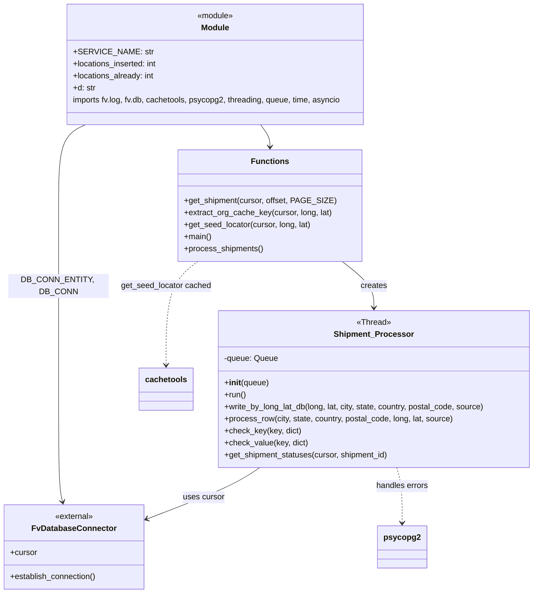

# Diagram: common/fv/scripts/seed_here_locator_par.py


> Auto-generated by Obscura crawlers

## Diagram 1



### SVG

<svg id="container" width="1059.865234375" xmlns="http://www.w3.org/2000/svg" class="classDiagram" height="1180" viewBox="0 0 1059.865234375 1180" role="graphics-document document" aria-roledescription="class"><style>#container{font-family:"trebuchet ms",verdana,arial,sans-serif;font-size:16px;fill:#333;}@keyframes edge-animation-frame{from{stroke-dashoffset:0;}}@keyframes dash{to{stroke-dashoffset:0;}}#container .edge-animation-slow{stroke-dasharray:9,5!important;stroke-dashoffset:900;animation:dash 50s linear infinite;stroke-linecap:round;}#container .edge-animation-fast{stroke-dasharray:9,5!important;stroke-dashoffset:900;animation:dash 20s linear infinite;stroke-linecap:round;}#container .error-icon{fill:#552222;}#container .error-text{fill:#552222;stroke:#552222;}#container .edge-thickness-normal{stroke-width:1px;}#container .edge-thickness-thick{stroke-width:3.5px;}#container .edge-pattern-solid{stroke-dasharray:0;}#container .edge-thickness-invisible{stroke-width:0;fill:none;}#container .edge-pattern-dashed{stroke-dasharray:3;}#container .edge-pattern-dotted{stroke-dasharray:2;}#container .marker{fill:#333333;stroke:#333333;}#container .marker.cross{stroke:#333333;}#container svg{font-family:"trebuchet ms",verdana,arial,sans-serif;font-size:16px;}#container p{margin:0;}#container g.classGroup text{fill:#9370DB;stroke:none;font-family:"trebuchet ms",verdana,arial,sans-serif;font-size:10px;}#container g.classGroup text .title{font-weight:bolder;}#container .nodeLabel,#container .edgeLabel{color:#131300;}#container .edgeLabel .label rect{fill:#ECECFF;}#container .label text{fill:#131300;}#container .labelBkg{background:#ECECFF;}#container .edgeLabel .label span{background:#ECECFF;}#container .classTitle{font-weight:bolder;}#container .node rect,#container .node circle,#container .node ellipse,#container .node polygon,#container .node path{fill:#ECECFF;stroke:#9370DB;stroke-width:1px;}#container .divider{stroke:#9370DB;stroke-width:1;}#container g.clickable{cursor:pointer;}#container g.classGroup rect{fill:#ECECFF;stroke:#9370DB;}#container g.classGroup line{stroke:#9370DB;stroke-width:1;}#container .classLabel .box{stroke:none;stroke-width:0;fill:#ECECFF;opacity:0.5;}#container .classLabel .label{fill:#9370DB;font-size:10px;}#container .relation{stroke:#333333;stroke-width:1;fill:none;}#container .dashed-line{stroke-dasharray:3;}#container .dotted-line{stroke-dasharray:1 2;}#container #compositionStart,#container .composition{fill:#333333!important;stroke:#333333!important;stroke-width:1;}#container #compositionEnd,#container .composition{fill:#333333!important;stroke:#333333!important;stroke-width:1;}#container #dependencyStart,#container .dependency{fill:#333333!important;stroke:#333333!important;stroke-width:1;}#container #dependencyStart,#container .dependency{fill:#333333!important;stroke:#333333!important;stroke-width:1;}#container #extensionStart,#container .extension{fill:transparent!important;stroke:#333333!important;stroke-width:1;}#container #extensionEnd,#container .extension{fill:transparent!important;stroke:#333333!important;stroke-width:1;}#container #aggregationStart,#container .aggregation{fill:transparent!important;stroke:#333333!important;stroke-width:1;}#container #aggregationEnd,#container .aggregation{fill:transparent!important;stroke:#333333!important;stroke-width:1;}#container #lollipopStart,#container .lollipop{fill:#ECECFF!important;stroke:#333333!important;stroke-width:1;}#container #lollipopEnd,#container .lollipop{fill:#ECECFF!important;stroke:#333333!important;stroke-width:1;}#container .edgeTerminals{font-size:11px;line-height:initial;}#container .classTitleText{text-anchor:middle;font-size:18px;fill:#333;}#container .label-icon{display:inline-block;height:1em;overflow:visible;vertical-align:-0.125em;}#container .node .label-icon path{fill:currentColor;stroke:revert;stroke-width:revert;}#container :root{--mermaid-font-family:"trebuchet ms",verdana,arial,sans-serif;}</style><g><defs><marker id="container_class-aggregationStart" class="marker aggregation class" refX="18" refY="7" markerWidth="190" markerHeight="240" orient="auto"><path d="M 18,7 L9,13 L1,7 L9,1 Z"></path></marker></defs><defs><marker id="container_class-aggregationEnd" class="marker aggregation class" refX="1" refY="7" markerWidth="20" markerHeight="28" orient="auto"><path d="M 18,7 L9,13 L1,7 L9,1 Z"></path></marker></defs><defs><marker id="container_class-extensionStart" class="marker extension class" refX="18" refY="7" markerWidth="190" markerHeight="240" orient="auto"><path d="M 1,7 L18,13 V 1 Z"></path></marker></defs><defs><marker id="container_class-extensionEnd" class="marker extension class" refX="1" refY="7" markerWidth="20" markerHeight="28" orient="auto"><path d="M 1,1 V 13 L18,7 Z"></path></marker></defs><defs><marker id="container_class-compositionStart" class="marker composition class" refX="18" refY="7" markerWidth="190" markerHeight="240" orient="auto"><path d="M 18,7 L9,13 L1,7 L9,1 Z"></path></marker></defs><defs><marker id="container_class-compositionEnd" class="marker composition class" refX="1" refY="7" markerWidth="20" markerHeight="28" orient="auto"><path d="M 18,7 L9,13 L1,7 L9,1 Z"></path></marker></defs><defs><marker id="container_class-dependencyStart" class="marker dependency class" refX="6" refY="7" markerWidth="190" markerHeight="240" orient="auto"><path d="M 5,7 L9,13 L1,7 L9,1 Z"></path></marker></defs><defs><marker id="container_class-dependencyEnd" class="marker dependency class" refX="13" refY="7" markerWidth="20" markerHeight="28" orient="auto"><path d="M 18,7 L9,13 L14,7 L9,1 Z"></path></marker></defs><defs><marker id="container_class-lollipopStart" class="marker lollipop class" refX="13" refY="7" markerWidth="190" markerHeight="240" orient="auto"><circle stroke="black" fill="transparent" cx="7" cy="7" r="6"></circle></marker></defs><defs><marker id="container_class-lollipopEnd" class="marker lollipop class" refX="1" refY="7" markerWidth="190" markerHeight="240" orient="auto"><circle stroke="black" fill="transparent" cx="7" cy="7" r="6"></circle></marker></defs><g class="root"><g class="clusters"></g><g class="edgePaths"><path d="M169.308,248L160.348,252.167C151.387,256.333,133.467,264.667,124.507,291.5C115.547,318.333,115.547,363.667,115.547,413C115.547,462.333,115.547,515.667,115.547,576.5C115.547,637.333,115.547,705.667,115.547,772C115.547,838.333,115.547,902.667,116.867,940.031C118.188,977.395,120.828,987.79,122.149,992.987L123.469,998.185" id="id_Module_FvDatabaseConnector_1" class="edge-thickness-normal edge-pattern-solid relation" style=";;;" data-edge="true" data-et="edge" data-id="id_Module_FvDatabaseConnector_1" data-points="W3sieCI6MTY5LjMwNzY1MDg2MjA2ODk1LCJ5IjoyNDh9LHsieCI6MTE1LjU0Njg3NSwieSI6MjczfSx7IngiOjExNS41NDY4NzUsInkiOjQwOX0seyJ4IjoxMTUuNTQ2ODc1LCJ5Ijo1Njl9LHsieCI6MTE1LjU0Njg3NSwieSI6Nzc0fSx7IngiOjExNS41NDY4NzUsInkiOjk2N30seyJ4IjoxMjQuOTQ2MTg0MTQyNTYxOTgsInkiOjEwMDR9XQ==" marker-end="url(#container_class-dependencyEnd)"></path><path d="M515.043,248L518.088,252.167C521.132,256.333,527.221,264.667,530.266,272C533.311,279.333,533.311,285.667,533.311,288.833L533.311,292" id="id_Module_Functions_2" class="edge-thickness-normal edge-pattern-solid relation" style=";;;" data-edge="true" data-et="edge" data-id="id_Module_Functions_2" data-points="W3sieCI6NTE1LjA0MzEwMzQ0ODI3NTgsInkiOjI0OH0seyJ4Ijo1MzMuMzEwNTQ2ODc1LCJ5IjoyNzN9LHsieCI6NTMzLjMxMDU0Njg3NSwieSI6Mjk4fV0=" marker-end="url(#container_class-dependencyEnd)"></path><path d="M676.705,520L687.255,528.167C697.806,536.333,718.906,552.667,729.456,568C740.006,583.333,740.006,597.667,740.006,604.833L740.006,612" id="id_Functions_Shipment_Processor_3" class="edge-thickness-normal edge-pattern-solid relation" style=";;;" data-edge="true" data-et="edge" data-id="id_Functions_Shipment_Processor_3" data-points="W3sieCI6Njc2LjcwNTQxOTkyMTg3NSwieSI6NTIwfSx7IngiOjc0MC4wMDU4NTkzNzUsInkiOjU2OX0seyJ4Ijo3NDAuMDA1ODU5Mzc1LCJ5Ijo2MTh9XQ==" marker-end="url(#container_class-dependencyEnd)"></path><path d="M512.816,930L503.836,936.167C494.855,942.333,476.893,954.667,439.785,971.719C402.676,988.772,346.421,1010.544,318.293,1021.43L290.166,1032.315" id="id_Shipment_Processor_FvDatabaseConnector_4" class="edge-thickness-normal edge-pattern-solid relation" style=";;;" data-edge="true" data-et="edge" data-id="id_Shipment_Processor_FvDatabaseConnector_4" data-points="W3sieCI6NTEyLjgxNjMzNTQxMTI2OTQsInkiOjkzMH0seyJ4Ijo0NTguOTMxNjQwNjI1LCJ5Ijo5Njd9LHsieCI6Mjg0LjU3MDMxMjUsInkiOjEwMzQuNDgxMDc0NDk2MzN9XQ==" marker-end="url(#container_class-dependencyEnd)"></path><path d="M786.154,930L787.978,936.167C789.803,942.333,793.451,954.667,795.275,973C797.1,991.333,797.1,1015.667,797.1,1027.833L797.1,1040" id="id_Shipment_Processor_psycopg2_5" class="edge-thickness-normal edge-pattern-dashed relation" style=";;;" data-edge="true" data-et="edge" data-id="id_Shipment_Processor_psycopg2_5" data-points="W3sieCI6Nzg2LjE1NDE3NTQzNzE3NjEsInkiOjkzMH0seyJ4Ijo3OTcuMDk5NjA5Mzc1LCJ5Ijo5Njd9LHsieCI6Nzk3LjA5OTYwOTM3NSwieSI6MTA0Nn1d" marker-end="url(#container_class-dependencyEnd)"></path><path d="M389.916,520L379.366,528.167C368.816,536.333,347.715,552.667,337.165,587C326.615,621.333,326.615,673.667,326.615,699.833L326.615,726" id="id_Functions_cachetools_6" class="edge-thickness-normal edge-pattern-dashed relation" style=";;;" data-edge="true" data-et="edge" data-id="id_Functions_cachetools_6" data-points="W3sieCI6Mzg5LjkxNTY3MzgyODEyNSwieSI6NTIwfSx7IngiOjMyNi42MTUyMzQzNzUsInkiOjU2OX0seyJ4IjozMjYuNjE1MjM0Mzc1LCJ5Ijo3MzJ9XQ==" marker-end="url(#container_class-dependencyEnd)"></path></g><g class="edgeLabels"><g class="edgeLabel" transform="translate(115.546875, 569)"><g class="label" data-id="id_Module_FvDatabaseConnector_1" transform="translate(-100, -24)"><foreignObject width="200" height="48"><div xmlns="http://www.w3.org/1999/xhtml" class="labelBkg" style="display: table; white-space: break-spaces; line-height: 1.5; max-width: 200px; text-align: center; width: 200px;"><span class="edgeLabel"><p>DB_CONN_ENTITY, DB_CONN</p></span></div></foreignObject></g></g><g class="edgeLabel"><g class="label" data-id="id_Module_Functions_2" transform="translate(0, 0)"><foreignObject width="0" height="0"><div xmlns="http://www.w3.org/1999/xhtml" class="labelBkg" style="display: table-cell; white-space: nowrap; line-height: 1.5; max-width: 200px; text-align: center;"><span class="edgeLabel"></span></div></foreignObject></g></g><g class="edgeLabel" transform="translate(740.005859375, 569)"><g class="label" data-id="id_Functions_Shipment_Processor_3" transform="translate(-26.171875, -12)"><foreignObject width="52.34375" height="24"><div xmlns="http://www.w3.org/1999/xhtml" class="labelBkg" style="display: table-cell; white-space: nowrap; line-height: 1.5; max-width: 200px; text-align: center;"><span class="edgeLabel"><p>creates</p></span></div></foreignObject></g></g><g class="edgeLabel" transform="translate(402.23035, 988.94445)"><g class="label" data-id="id_Shipment_Processor_FvDatabaseConnector_4" transform="translate(-41.4765625, -12)"><foreignObject width="82.953125" height="24"><div xmlns="http://www.w3.org/1999/xhtml" class="labelBkg" style="display: table-cell; white-space: nowrap; line-height: 1.5; max-width: 200px; text-align: center;"><span class="edgeLabel"><p>uses cursor</p></span></div></foreignObject></g></g><g class="edgeLabel" transform="translate(797.099609375, 967)"><g class="label" data-id="id_Shipment_Processor_psycopg2_5" transform="translate(-52.7109375, -12)"><foreignObject width="105.421875" height="24"><div xmlns="http://www.w3.org/1999/xhtml" class="labelBkg" style="display: table-cell; white-space: nowrap; line-height: 1.5; max-width: 200px; text-align: center;"><span class="edgeLabel"><p>handles errors</p></span></div></foreignObject></g></g><g class="edgeLabel" transform="translate(326.615234375, 569)"><g class="label" data-id="id_Functions_cachetools_6" transform="translate(-90.234375, -12)"><foreignObject width="180.46875" height="24"><div xmlns="http://www.w3.org/1999/xhtml" class="labelBkg" style="display: table-cell; white-space: nowrap; line-height: 1.5; max-width: 200px; text-align: center;"><span class="edgeLabel"><p>get_seed_locator cached</p></span></div></foreignObject></g></g></g><g class="nodes"><g class="node default" id="classId-Module-0" transform="translate(427.359375, 128)"><g class="basic label-container"><path d="M-299.73046875 -120 L299.73046875 -120 L299.73046875 120 L-299.73046875 120" stroke="none" stroke-width="0" fill="#ECECFF" style=""></path><path d="M-299.73046875 -120 C-115.20674047457513 -120, 69.31698780084974 -120, 299.73046875 -120 M-299.73046875 -120 C-169.47401058708675 -120, -39.217552424173505 -120, 299.73046875 -120 M299.73046875 -120 C299.73046875 -36.51591917800218, 299.73046875 46.96816164399564, 299.73046875 120 M299.73046875 -120 C299.73046875 -71.40398765473134, 299.73046875 -22.80797530946269, 299.73046875 120 M299.73046875 120 C90.1415234391414 120, -119.44742187171721 120, -299.73046875 120 M299.73046875 120 C153.98443536903932 120, 8.238401988078635 120, -299.73046875 120 M-299.73046875 120 C-299.73046875 28.283439533743376, -299.73046875 -63.43312093251325, -299.73046875 -120 M-299.73046875 120 C-299.73046875 38.61756812476693, -299.73046875 -42.764863750466134, -299.73046875 -120" stroke="#9370DB" stroke-width="1.3" fill="none" stroke-dasharray="0 0" style=""></path></g><g class="annotation-group text" transform="translate(-36.6015625, -96)"><g class="label" style="" transform="translate(0,-12)"><foreignObject width="73.203125" height="24"><div xmlns="http://www.w3.org/1999/xhtml" style="display: table-cell; white-space: nowrap; line-height: 1.5; max-width: 123px; text-align: center;"><span class="nodeLabel markdown-node-label" style=""><p>«module»</p></span></div></foreignObject></g></g><g class="label-group text" transform="translate(-27.09375, -72)"><g class="label" style="font-weight: bolder" transform="translate(0,-12)"><foreignObject width="54.1875" height="24"><div xmlns="http://www.w3.org/1999/xhtml" style="display: table-cell; white-space: nowrap; line-height: 1.5; max-width: 104px; text-align: center;"><span class="nodeLabel markdown-node-label" style=""><p>Module</p></span></div></foreignObject></g></g><g class="members-group text" transform="translate(-287.73046875, -24)"><g class="label" style="" transform="translate(0,-12)"><foreignObject width="142.265625" height="24"><div xmlns="http://www.w3.org/1999/xhtml" style="display: table-cell; white-space: nowrap; line-height: 1.5; max-width: 200px; text-align: center;"><span class="nodeLabel markdown-node-label" style=""><p>+SERVICE_NAME: str</p></span></div></foreignObject></g><g class="label" style="" transform="translate(0,12)"><foreignObject width="170.4375" height="24"><div xmlns="http://www.w3.org/1999/xhtml" style="display: table-cell; white-space: nowrap; line-height: 1.5; max-width: 228px; text-align: center;"><span class="nodeLabel markdown-node-label" style=""><p>+locations_inserted: int</p></span></div></foreignObject></g><g class="label" style="" transform="translate(0,36)"><foreignObject width="163.734375" height="24"><div xmlns="http://www.w3.org/1999/xhtml" style="display: table-cell; white-space: nowrap; line-height: 1.5; max-width: 221px; text-align: center;"><span class="nodeLabel markdown-node-label" style=""><p>+locations_already: int</p></span></div></foreignObject></g><g class="label" style="" transform="translate(0,60)"><foreignObject width="45.0625" height="24"><div xmlns="http://www.w3.org/1999/xhtml" style="display: table-cell; white-space: nowrap; line-height: 1.5; max-width: 103px; text-align: center;"><span class="nodeLabel markdown-node-label" style=""><p>+d: str</p></span></div></foreignObject></g><g class="label" style="" transform="translate(0,84)"><foreignObject width="538.859375" height="24"><div xmlns="http://www.w3.org/1999/xhtml" style="display: table-cell; white-space: nowrap; line-height: 1.5; max-width: 589px; text-align: center;"><span class="nodeLabel markdown-node-label" style=""><p>imports fv.log, fv.db, cachetools, psycopg2, threading, queue, time, asyncio</p></span></div></foreignObject></g></g><g class="methods-group text" transform="translate(-287.73046875, 120)"></g><g class="divider" style=""><path d="M-299.73046875 -48 C-120.75105085057717 -48, 58.228367048845655 -48, 299.73046875 -48 M-299.73046875 -48 C-179.8359927055969 -48, -59.941516661193816 -48, 299.73046875 -48" stroke="#9370DB" stroke-width="1.3" fill="none" stroke-dasharray="0 0" style=""></path></g><g class="divider" style=""><path d="M-299.73046875 96 C-97.36700364486964 96, 104.99646146026072 96, 299.73046875 96 M-299.73046875 96 C-115.44943158952623 96, 68.83160557094754 96, 299.73046875 96" stroke="#9370DB" stroke-width="1.3" fill="none" stroke-dasharray="0 0" style=""></path></g></g><g class="node default" id="classId-FvDatabaseConnector-1" transform="translate(146.28515625, 1088)"><g class="basic label-container"><path d="M-138.28515625 -84 L138.28515625 -84 L138.28515625 84 L-138.28515625 84" stroke="none" stroke-width="0" fill="#ECECFF" style=""></path><path d="M-138.28515625 -84 C-48.25975262493236 -84, 41.76565100013528 -84, 138.28515625 -84 M-138.28515625 -84 C-37.984234870123956 -84, 62.31668650975209 -84, 138.28515625 -84 M138.28515625 -84 C138.28515625 -31.92017946649682, 138.28515625 20.159641067006362, 138.28515625 84 M138.28515625 -84 C138.28515625 -49.572666727871365, 138.28515625 -15.14533345574273, 138.28515625 84 M138.28515625 84 C36.648429076375734 84, -64.98829809724853 84, -138.28515625 84 M138.28515625 84 C52.12355066995275 84, -34.0380549100945 84, -138.28515625 84 M-138.28515625 84 C-138.28515625 20.96642262367648, -138.28515625 -42.06715475264704, -138.28515625 -84 M-138.28515625 84 C-138.28515625 26.981780912799238, -138.28515625 -30.036438174401525, -138.28515625 -84" stroke="#9370DB" stroke-width="1.3" fill="none" stroke-dasharray="0 0" style=""></path></g><g class="annotation-group text" transform="translate(-38.65625, -60)"><g class="label" style="" transform="translate(0,-12)"><foreignObject width="77.3125" height="24"><div xmlns="http://www.w3.org/1999/xhtml" style="display: table-cell; white-space: nowrap; line-height: 1.5; max-width: 127px; text-align: center;"><span class="nodeLabel markdown-node-label" style=""><p>«external»</p></span></div></foreignObject></g></g><g class="label-group text" transform="translate(-79.3046875, -36)"><g class="label" style="font-weight: bolder" transform="translate(0,-12)"><foreignObject width="158.609375" height="24"><div xmlns="http://www.w3.org/1999/xhtml" style="display: table-cell; white-space: nowrap; line-height: 1.5; max-width: 207px; text-align: center;"><span class="nodeLabel markdown-node-label" style=""><p>FvDatabaseConnector</p></span></div></foreignObject></g></g><g class="members-group text" transform="translate(-126.28515625, 12)"><g class="label" style="" transform="translate(0,-12)"><foreignObject width="53.71875" height="24"><div xmlns="http://www.w3.org/1999/xhtml" style="display: table-cell; white-space: nowrap; line-height: 1.5; max-width: 112px; text-align: center;"><span class="nodeLabel markdown-node-label" style=""><p>+cursor</p></span></div></foreignObject></g></g><g class="methods-group text" transform="translate(-126.28515625, 60)"><g class="label" style="" transform="translate(0,-12)"><foreignObject width="173.265625" height="24"><div xmlns="http://www.w3.org/1999/xhtml" style="display: table-cell; white-space: nowrap; line-height: 1.5; max-width: 231px; text-align: center;"><span class="nodeLabel markdown-node-label" style=""><p>+establish_connection()</p></span></div></foreignObject></g></g><g class="divider" style=""><path d="M-138.28515625 -12 C-29.801953307202737 -12, 78.68124963559453 -12, 138.28515625 -12 M-138.28515625 -12 C-54.2072298201506 -12, 29.870696609698797 -12, 138.28515625 -12" stroke="#9370DB" stroke-width="1.3" fill="none" stroke-dasharray="0 0" style=""></path></g><g class="divider" style=""><path d="M-138.28515625 36 C-65.32201715222985 36, 7.641121945540306 36, 138.28515625 36 M-138.28515625 36 C-57.37161298459566 36, 23.541930280808685 36, 138.28515625 36" stroke="#9370DB" stroke-width="1.3" fill="none" stroke-dasharray="0 0" style=""></path></g></g><g class="node default" id="classId-Functions-2" transform="translate(533.310546875, 409)"><g class="basic label-container"><path d="M-176.90234375 -111 L176.90234375 -111 L176.90234375 111 L-176.90234375 111" stroke="none" stroke-width="0" fill="#ECECFF" style=""></path><path d="M-176.90234375 -111 C-36.883559005038734 -111, 103.13522573992253 -111, 176.90234375 -111 M-176.90234375 -111 C-73.99765720481751 -111, 28.90702934036497 -111, 176.90234375 -111 M176.90234375 -111 C176.90234375 -60.12524504242946, 176.90234375 -9.250490084858924, 176.90234375 111 M176.90234375 -111 C176.90234375 -64.21190852935345, 176.90234375 -17.423817058706902, 176.90234375 111 M176.90234375 111 C37.30422126562422 111, -102.29390121875156 111, -176.90234375 111 M176.90234375 111 C38.23199869055108 111, -100.43834636889784 111, -176.90234375 111 M-176.90234375 111 C-176.90234375 32.511407266877626, -176.90234375 -45.97718546624475, -176.90234375 -111 M-176.90234375 111 C-176.90234375 57.27052271634984, -176.90234375 3.5410454326996756, -176.90234375 -111" stroke="#9370DB" stroke-width="1.3" fill="none" stroke-dasharray="0 0" style=""></path></g><g class="annotation-group text" transform="translate(0, -87)"></g><g class="label-group text" transform="translate(-35.1328125, -87)"><g class="label" style="font-weight: bolder" transform="translate(0,-12)"><foreignObject width="70.265625" height="24"><div xmlns="http://www.w3.org/1999/xhtml" style="display: table-cell; white-space: nowrap; line-height: 1.5; max-width: 120px; text-align: center;"><span class="nodeLabel markdown-node-label" style=""><p>Functions</p></span></div></foreignObject></g></g><g class="members-group text" transform="translate(-164.90234375, -39)"></g><g class="methods-group text" transform="translate(-164.90234375, -9)"><g class="label" style="" transform="translate(0,-12)"><foreignObject width="294.671875" height="24"><div xmlns="http://www.w3.org/1999/xhtml" style="display: table-cell; white-space: nowrap; line-height: 1.5; max-width: 352px; text-align: center;"><span class="nodeLabel markdown-node-label" style=""><p>+get_shipment(cursor, offset, PAGE_SIZE)</p></span></div></foreignObject></g><g class="label" style="" transform="translate(0,12)"><foreignObject width="293.734375" height="24"><div xmlns="http://www.w3.org/1999/xhtml" style="display: table-cell; white-space: nowrap; line-height: 1.5; max-width: 351px; text-align: center;"><span class="nodeLabel markdown-node-label" style=""><p>+extract_org_cache_key(cursor, long, lat)</p></span></div></foreignObject></g><g class="label" style="" transform="translate(0,36)"><foreignObject width="254.421875" height="24"><div xmlns="http://www.w3.org/1999/xhtml" style="display: table-cell; white-space: nowrap; line-height: 1.5; max-width: 312px; text-align: center;"><span class="nodeLabel markdown-node-label" style=""><p>+get_seed_locator(cursor, long, lat)</p></span></div></foreignObject></g><g class="label" style="" transform="translate(0,60)"><foreignObject width="54.65625" height="24"><div xmlns="http://www.w3.org/1999/xhtml" style="display: table-cell; white-space: nowrap; line-height: 1.5; max-width: 112px; text-align: center;"><span class="nodeLabel markdown-node-label" style=""><p>+main()</p></span></div></foreignObject></g><g class="label" style="" transform="translate(0,84)"><foreignObject width="157.65625" height="24"><div xmlns="http://www.w3.org/1999/xhtml" style="display: table-cell; white-space: nowrap; line-height: 1.5; max-width: 215px; text-align: center;"><span class="nodeLabel markdown-node-label" style=""><p>+process_shipments()</p></span></div></foreignObject></g></g><g class="divider" style=""><path d="M-176.90234375 -63 C-93.49136333223586 -63, -10.080382914471727 -63, 176.90234375 -63 M-176.90234375 -63 C-43.715260543098196 -63, 89.47182266380361 -63, 176.90234375 -63" stroke="#9370DB" stroke-width="1.3" fill="none" stroke-dasharray="0 0" style=""></path></g><g class="divider" style=""><path d="M-176.90234375 -39 C-53.70438729429604 -39, 69.49356916140792 -39, 176.90234375 -39 M-176.90234375 -39 C-81.52748886181824 -39, 13.847366026363517 -39, 176.90234375 -39" stroke="#9370DB" stroke-width="1.3" fill="none" stroke-dasharray="0 0" style=""></path></g></g><g class="node default" id="classId-Shipment_Processor-3" transform="translate(740.005859375, 774)"><g class="basic label-container"><path d="M-311.859375 -156 L311.859375 -156 L311.859375 156 L-311.859375 156" stroke="none" stroke-width="0" fill="#ECECFF" style=""></path><path d="M-311.859375 -156 C-118.49251926917833 -156, 74.87433646164334 -156, 311.859375 -156 M-311.859375 -156 C-162.76051940522228 -156, -13.661663810444566 -156, 311.859375 -156 M311.859375 -156 C311.859375 -42.660250885390994, 311.859375 70.67949822921801, 311.859375 156 M311.859375 -156 C311.859375 -60.80847395202517, 311.859375 34.383052095949665, 311.859375 156 M311.859375 156 C133.90566743923785 156, -44.04804012152431 156, -311.859375 156 M311.859375 156 C65.4683127007261 156, -180.9227495985478 156, -311.859375 156 M-311.859375 156 C-311.859375 53.56844878062141, -311.859375 -48.86310243875718, -311.859375 -156 M-311.859375 156 C-311.859375 41.084458594087224, -311.859375 -73.83108281182555, -311.859375 -156" stroke="#9370DB" stroke-width="1.3" fill="none" stroke-dasharray="0 0" style=""></path></g><g class="annotation-group text" transform="translate(-34.0625, -132)"><g class="label" style="" transform="translate(0,-12)"><foreignObject width="68.125" height="24"><div xmlns="http://www.w3.org/1999/xhtml" style="display: table-cell; white-space: nowrap; line-height: 1.5; max-width: 118px; text-align: center;"><span class="nodeLabel markdown-node-label" style=""><p>«Thread»</p></span></div></foreignObject></g></g><g class="label-group text" transform="translate(-75.1875, -108)"><g class="label" style="font-weight: bolder" transform="translate(0,-12)"><foreignObject width="150.375" height="24"><div xmlns="http://www.w3.org/1999/xhtml" style="display: table-cell; white-space: nowrap; line-height: 1.5; max-width: 199px; text-align: center;"><span class="nodeLabel markdown-node-label" style=""><p>Shipment_Processor</p></span></div></foreignObject></g></g><g class="members-group text" transform="translate(-299.859375, -60)"><g class="label" style="" transform="translate(0,-12)"><foreignObject width="107.28125" height="24"><div xmlns="http://www.w3.org/1999/xhtml" style="display: table-cell; white-space: nowrap; line-height: 1.5; max-width: 165px; text-align: center;"><span class="nodeLabel markdown-node-label" style=""><p>-queue: Queue</p></span></div></foreignObject></g></g><g class="methods-group text" transform="translate(-299.859375, -12)"><g class="label" style="" transform="translate(0,-12)"><foreignObject width="88.4375" height="24"><div xmlns="http://www.w3.org/1999/xhtml" style="display: table-cell; white-space: nowrap; line-height: 1.5; max-width: 177px; text-align: center;"><span class="nodeLabel markdown-node-label" style=""><p>+<strong>init</strong>(queue)</p></span></div></foreignObject></g><g class="label" style="" transform="translate(0,12)"><foreignObject width="43.21875" height="24"><div xmlns="http://www.w3.org/1999/xhtml" style="display: table-cell; white-space: nowrap; line-height: 1.5; max-width: 101px; text-align: center;"><span class="nodeLabel markdown-node-label" style=""><p>+run()</p></span></div></foreignObject></g><g class="label" style="" transform="translate(0,36)"><foreignObject width="524.53125" height="24"><div xmlns="http://www.w3.org/1999/xhtml" style="display: table-cell; white-space: nowrap; line-height: 1.5; max-width: 582px; text-align: center;"><span class="nodeLabel markdown-node-label" style=""><p>+write_by_long_lat_db(long, lat, city, state, country, postal_code, source)</p></span></div></foreignObject></g><g class="label" style="" transform="translate(0,60)"><foreignObject width="458.984375" height="24"><div xmlns="http://www.w3.org/1999/xhtml" style="display: table-cell; white-space: nowrap; line-height: 1.5; max-width: 516px; text-align: center;"><span class="nodeLabel markdown-node-label" style=""><p>+process_row(city, state, country, postal_code, long, lat, source)</p></span></div></foreignObject></g><g class="label" style="" transform="translate(0,84)"><foreignObject width="152.359375" height="24"><div xmlns="http://www.w3.org/1999/xhtml" style="display: table-cell; white-space: nowrap; line-height: 1.5; max-width: 210px; text-align: center;"><span class="nodeLabel markdown-node-label" style=""><p>+check_key(key, dict)</p></span></div></foreignObject></g><g class="label" style="" transform="translate(0,108)"><foreignObject width="166.1875" height="24"><div xmlns="http://www.w3.org/1999/xhtml" style="display: table-cell; white-space: nowrap; line-height: 1.5; max-width: 224px; text-align: center;"><span class="nodeLabel markdown-node-label" style=""><p>+check_value(key, dict)</p></span></div></foreignObject></g><g class="label" style="" transform="translate(0,132)"><foreignObject width="329.96875" height="24"><div xmlns="http://www.w3.org/1999/xhtml" style="display: table-cell; white-space: nowrap; line-height: 1.5; max-width: 387px; text-align: center;"><span class="nodeLabel markdown-node-label" style=""><p>+get_shipment_statuses(cursor, shipment_id)</p></span></div></foreignObject></g></g><g class="divider" style=""><path d="M-311.859375 -84 C-84.53547494251936 -84, 142.78842511496129 -84, 311.859375 -84 M-311.859375 -84 C-174.97262043419826 -84, -38.085865868396525 -84, 311.859375 -84" stroke="#9370DB" stroke-width="1.3" fill="none" stroke-dasharray="0 0" style=""></path></g><g class="divider" style=""><path d="M-311.859375 -36 C-103.10590342937533 -36, 105.64756814124934 -36, 311.859375 -36 M-311.859375 -36 C-103.94757572802772 -36, 103.96422354394457 -36, 311.859375 -36" stroke="#9370DB" stroke-width="1.3" fill="none" stroke-dasharray="0 0" style=""></path></g></g><g class="node default" id="classId-psycopg2-4" transform="translate(797.099609375, 1088)"><g class="basic label-container"><path d="M-46.234375 -42 L46.234375 -42 L46.234375 42 L-46.234375 42" stroke="none" stroke-width="0" fill="#ECECFF" style=""></path><path d="M-46.234375 -42 C-11.498211647615804 -42, 23.237951704768392 -42, 46.234375 -42 M-46.234375 -42 C-12.966186409455197 -42, 20.302002181089605 -42, 46.234375 -42 M46.234375 -42 C46.234375 -10.678308173944263, 46.234375 20.643383652111474, 46.234375 42 M46.234375 -42 C46.234375 -17.078088829774522, 46.234375 7.843822340450956, 46.234375 42 M46.234375 42 C12.682453047113093 42, -20.869468905773815 42, -46.234375 42 M46.234375 42 C10.04005042197852 42, -26.15427415604296 42, -46.234375 42 M-46.234375 42 C-46.234375 15.719983953445585, -46.234375 -10.56003209310883, -46.234375 -42 M-46.234375 42 C-46.234375 17.159774535476345, -46.234375 -7.680450929047311, -46.234375 -42" stroke="#9370DB" stroke-width="1.3" fill="none" stroke-dasharray="0 0" style=""></path></g><g class="annotation-group text" transform="translate(0, -18)"></g><g class="label-group text" transform="translate(-34.234375, -18)"><g class="label" style="font-weight: bolder" transform="translate(0,-12)"><foreignObject width="68.46875" height="24"><div xmlns="http://www.w3.org/1999/xhtml" style="display: table-cell; white-space: nowrap; line-height: 1.5; max-width: 117px; text-align: center;"><span class="nodeLabel markdown-node-label" style=""><p>psycopg2</p></span></div></foreignObject></g></g><g class="members-group text" transform="translate(-34.234375, 30)"></g><g class="methods-group text" transform="translate(-34.234375, 60)"></g><g class="divider" style=""><path d="M-46.234375 6 C-25.390629739959074 6, -4.546884479918148 6, 46.234375 6 M-46.234375 6 C-18.322315093845358 6, 9.589744812309284 6, 46.234375 6" stroke="#9370DB" stroke-width="1.3" fill="none" stroke-dasharray="0 0" style=""></path></g><g class="divider" style=""><path d="M-46.234375 24 C-23.895636485586245 24, -1.5568979711724893 24, 46.234375 24 M-46.234375 24 C-21.745248118688938 24, 2.743878762622124 24, 46.234375 24" stroke="#9370DB" stroke-width="1.3" fill="none" stroke-dasharray="0 0" style=""></path></g></g><g class="node default" id="classId-cachetools-5" transform="translate(326.615234375, 774)"><g class="basic label-container"><path d="M-51.53125 -42 L51.53125 -42 L51.53125 42 L-51.53125 42" stroke="none" stroke-width="0" fill="#ECECFF" style=""></path><path d="M-51.53125 -42 C-23.86174587437245 -42, 3.807758251255102 -42, 51.53125 -42 M-51.53125 -42 C-12.862780227458295 -42, 25.80568954508341 -42, 51.53125 -42 M51.53125 -42 C51.53125 -23.31405070638625, 51.53125 -4.6281014127725015, 51.53125 42 M51.53125 -42 C51.53125 -13.563043641287166, 51.53125 14.873912717425668, 51.53125 42 M51.53125 42 C16.225074717711784 42, -19.08110056457643 42, -51.53125 42 M51.53125 42 C10.58785734813376 42, -30.35553530373248 42, -51.53125 42 M-51.53125 42 C-51.53125 10.775061003215832, -51.53125 -20.449877993568336, -51.53125 -42 M-51.53125 42 C-51.53125 13.931852237117727, -51.53125 -14.136295525764545, -51.53125 -42" stroke="#9370DB" stroke-width="1.3" fill="none" stroke-dasharray="0 0" style=""></path></g><g class="annotation-group text" transform="translate(0, -18)"></g><g class="label-group text" transform="translate(-39.53125, -18)"><g class="label" style="font-weight: bolder" transform="translate(0,-12)"><foreignObject width="79.0625" height="24"><div xmlns="http://www.w3.org/1999/xhtml" style="display: table-cell; white-space: nowrap; line-height: 1.5; max-width: 128px; text-align: center;"><span class="nodeLabel markdown-node-label" style=""><p>cachetools</p></span></div></foreignObject></g></g><g class="members-group text" transform="translate(-39.53125, 30)"></g><g class="methods-group text" transform="translate(-39.53125, 60)"></g><g class="divider" style=""><path d="M-51.53125 6 C-19.78912832735368 6, 11.95299334529264 6, 51.53125 6 M-51.53125 6 C-11.153954111688364 6, 29.223341776623272 6, 51.53125 6" stroke="#9370DB" stroke-width="1.3" fill="none" stroke-dasharray="0 0" style=""></path></g><g class="divider" style=""><path d="M-51.53125 24 C-26.431520777481875 24, -1.3317915549637505 24, 51.53125 24 M-51.53125 24 C-11.21176623963727 24, 29.10771752072546 24, 51.53125 24" stroke="#9370DB" stroke-width="1.3" fill="none" stroke-dasharray="0 0" style=""></path></g></g></g></g></g></svg>

## Diagram 2

```mermaid
flowchart LR
    A[process_shipments] --> B[DB_CONN.establish_connection]
    B --> C[DB_CONN.cursor]
    C --> D[get_shipment(cursor, offset, PAGE_SIZE)]
    D --> E[Iterate shipments -> collect shipment_ids]
    E --> F{shipment_ids == queue_size?}
    F -- yes --> G[Enqueue ids to Queue]
    G --> H[Queue.join() wait]
    F -- no --> I[append id to shipment_ids]
    H --> J[Shipment_Processor threads (workers)]
    J --> K[run(): get shipment_id from queue]
    K --> L[get_shipment_statuses(cursor, shipment_id)]
    L --> M[for each status_entity -> validate coords]
    M --> N{valid lat/long?}
    N -- no --> O[raise BadRequestError -> log]
    N -- yes --> P[process_row(...)]
    P --> Q[write_by_long_lat_db(...) -> SQL INSERT]
    Q --> R[DB returns id]
    R --> S[queue.task_done()]
    D --> T[Loop: offset paging until complete]
    T --> U[print total records read]
```

> SVG rendering failed for this diagram.
