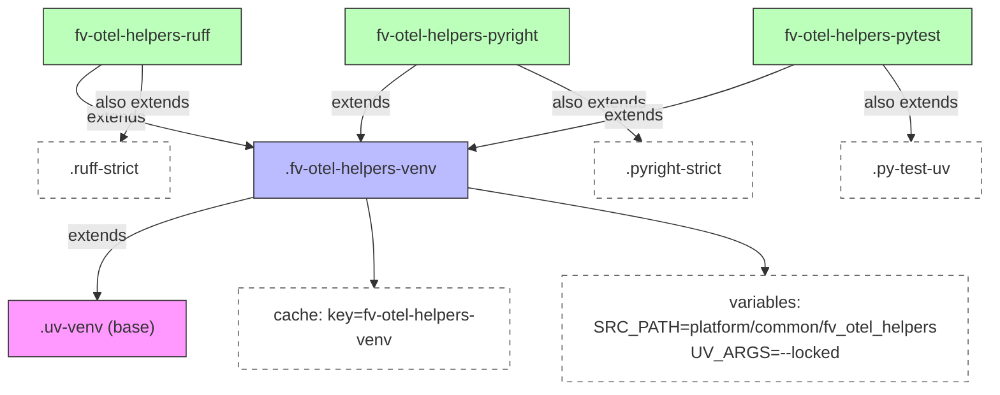

# Diagram: common/fv_otel_helpers/.gitlab-ci.yml

> Auto-generated by Obscura crawlers

## Mermaid

### SVG

<svg id="container" width="1120.515625" xmlns="http://www.w3.org/2000/svg" class="flowchart" height="350" viewBox="0 0 1120.515625 350" role="graphics-document document" aria-roledescription="flowchart-v2"><g><marker id="container_flowchart-v2-pointEnd" class="marker flowchart-v2" viewBox="0 0 10 10" refX="5" refY="5" markerUnits="userSpaceOnUse" markerWidth="8" markerHeight="8" orient="auto"><path d="M 0 0 L 10 5 L 0 10 z" class="arrowMarkerPath" style="stroke-width: 1; stroke-dasharray: 1, 0;"></path></marker><marker id="container_flowchart-v2-pointStart" class="marker flowchart-v2" viewBox="0 0 10 10" refX="4.5" refY="5" markerUnits="userSpaceOnUse" markerWidth="8" markerHeight="8" orient="auto"><path d="M 0 5 L 10 10 L 10 0 z" class="arrowMarkerPath" style="stroke-width: 1; stroke-dasharray: 1, 0;"></path></marker><marker id="container_flowchart-v2-circleEnd" class="marker flowchart-v2" viewBox="0 0 10 10" refX="11" refY="5" markerUnits="userSpaceOnUse" markerWidth="11" markerHeight="11" orient="auto"><circle cx="5" cy="5" r="5" class="arrowMarkerPath" style="stroke-width: 1; stroke-dasharray: 1, 0;"></circle></marker><marker id="container_flowchart-v2-circleStart" class="marker flowchart-v2" viewBox="0 0 10 10" refX="-1" refY="5" markerUnits="userSpaceOnUse" markerWidth="11" markerHeight="11" orient="auto"><circle cx="5" cy="5" r="5" class="arrowMarkerPath" style="stroke-width: 1; stroke-dasharray: 1, 0;"></circle></marker><marker id="container_flowchart-v2-crossEnd" class="marker cross flowchart-v2" viewBox="0 0 11 11" refX="12" refY="5.2" markerUnits="userSpaceOnUse" markerWidth="11" markerHeight="11" orient="auto"><path d="M 1,1 l 9,9 M 10,1 l -9,9" class="arrowMarkerPath" style="stroke-width: 2; stroke-dasharray: 1, 0;"></path></marker><marker id="container_flowchart-v2-crossStart" class="marker cross flowchart-v2" viewBox="0 0 11 11" refX="-1" refY="5.2" markerUnits="userSpaceOnUse" markerWidth="11" markerHeight="11" orient="auto"><path d="M 1,1 l 9,9 M 10,1 l -9,9" class="arrowMarkerPath" style="stroke-width: 2; stroke-dasharray: 1, 0;"></path></marker><g class="root"><g class="clusters"></g><g class="edgePaths"><path d="M257.215,188.071L229.792,194.559C202.37,201.047,147.525,214.024,120.102,228.012C92.68,242,92.68,257,92.68,264.5L92.68,272" id="L_FV_VENV_UVVENV_0" class="edge-thickness-normal edge-pattern-solid edge-thickness-normal edge-pattern-solid flowchart-link" style=";" data-edge="true" data-et="edge" data-id="L_FV_VENV_UVVENV_0" data-points="W3sieCI6MjU3LjIxNDg0Mzc1LCJ5IjoxODguMDcwNjAyMzM2NTYzMzN9LHsieCI6OTIuNjc5Njg3NSwieSI6MjI3fSx7IngiOjkyLjY3OTY4NzUsInkiOjI3Nn1d" marker-end="url(#container_flowchart-v2-pointEnd)"></path><path d="M360.722,190L360.162,196.167C359.601,202.333,358.48,214.667,357.92,226.333C357.359,238,357.359,249,357.359,254.5L357.359,260" id="L_FV_VENV_CACHE_0" class="edge-thickness-normal edge-pattern-solid edge-thickness-normal edge-pattern-solid flowchart-link" style=";" data-edge="true" data-et="edge" data-id="L_FV_VENV_CACHE_0" data-points="W3sieCI6MzYwLjcyMTk4NDg2MzI4MTI1LCJ5IjoxOTB9LHsieCI6MzU3LjM1OTM3NSwieSI6MjI3fSx7IngiOjM1Ny4zNTkzNzUsInkiOjI2NH1d" marker-end="url(#container_flowchart-v2-pointEnd)"></path><path d="M469.137,177.686L528.437,185.905C587.737,194.124,706.337,210.562,765.637,224.281C824.938,238,824.938,249,824.938,254.5L824.938,260" id="L_FV_VENV_VARS_0" class="edge-thickness-normal edge-pattern-solid edge-thickness-normal edge-pattern-solid flowchart-link" style=";" data-edge="true" data-et="edge" data-id="L_FV_VENV_VARS_0" data-points="W3sieCI6NDY5LjEzNjcxODc1LCJ5IjoxNzcuNjg2MTQ1OTU5MzQzOX0seyJ4Ijo4MjQuOTM3NSwieSI6MjI3fSx7IngiOjgyNC45Mzc1LCJ5IjoyNjR9XQ==" marker-end="url(#container_flowchart-v2-pointEnd)"></path><path d="M93.752,62L85.841,68.167C77.93,74.333,62.108,86.667,88.698,99.801C115.288,112.936,184.291,126.872,218.793,133.84L253.294,140.808" id="L_RUFF_FV_VENV_0" class="edge-thickness-normal edge-pattern-solid edge-thickness-normal edge-pattern-solid flowchart-link" style=";" data-edge="true" data-et="edge" data-id="L_RUFF_FV_VENV_0" data-points="W3sieCI6OTMuNzUyMzgwMzcxMDkzNzUsInkiOjYyfSx7IngiOjQ2LjI4NTE1NjI1LCJ5Ijo5OX0seyJ4IjoyNTcuMjE0ODQzNzUsInkiOjE0MS41OTk4NzE4MDExOTMyNX1d" marker-end="url(#container_flowchart-v2-pointEnd)"></path><path d="M133.475,62L134.636,68.167C135.797,74.333,138.119,86.667,135.124,98.464C132.129,110.261,123.816,121.521,119.659,127.152L115.503,132.782" id="L_RUFF_RUFF_STRICT_0" class="edge-thickness-normal edge-pattern-solid edge-thickness-normal edge-pattern-solid flowchart-link" style=";" data-edge="true" data-et="edge" data-id="L_RUFF_RUFF_STRICT_0" data-points="W3sieCI6MTMzLjQ3NDU0ODMzOTg0Mzc1LCJ5Ijo2Mn0seyJ4IjoxNDAuNDQxNDA2MjUsInkiOjk5fSx7IngiOjExMy4xMjcyNTgzMDA3ODEyNSwieSI6MTM2fV0=" marker-end="url(#container_flowchart-v2-pointEnd)"></path><path d="M408.807,62L401.202,68.167C393.597,74.333,378.386,86.667,370.781,98.333C363.176,110,363.176,121,363.176,126.5L363.176,132" id="L_PYRIGHT_FV_VENV_0" class="edge-thickness-normal edge-pattern-solid edge-thickness-normal edge-pattern-solid flowchart-link" style=";" data-edge="true" data-et="edge" data-id="L_PYRIGHT_FV_VENV_0" data-points="W3sieCI6NDA4LjgwNzAwNjgzNTkzNzUsInkiOjYyfSx7IngiOjM2My4xNzU3ODEyNSwieSI6OTl9LHsieCI6MzYzLjE3NTc4MTI1LCJ5IjoxMzZ9XQ==" marker-end="url(#container_flowchart-v2-pointEnd)"></path><path d="M508.033,62L523.091,68.167C538.149,74.333,568.264,86.667,588.231,98.496C608.198,110.326,618.017,121.652,622.926,127.315L627.836,132.978" id="L_PYRIGHT_PYRIGHT_STRICT_0" class="edge-thickness-normal edge-pattern-solid edge-thickness-normal edge-pattern-solid flowchart-link" style=";" data-edge="true" data-et="edge" data-id="L_PYRIGHT_PYRIGHT_STRICT_0" data-points="W3sieCI6NTA4LjAzMzMyNTE5NTMxMjUsInkiOjYyfSx7IngiOjU5OC4zNzg5MDYyNSwieSI6OTl9LHsieCI6NjMwLjQ1NTgxMDU0Njg3NSwieSI6MTM2fV0=" marker-end="url(#container_flowchart-v2-pointEnd)"></path><path d="M781.225,62L767.265,68.167C753.305,74.333,725.385,86.667,674.025,99.994C622.665,113.321,547.865,127.641,510.465,134.801L473.065,141.962" id="L_PYTEST_FV_VENV_0" class="edge-thickness-normal edge-pattern-solid edge-thickness-normal edge-pattern-solid flowchart-link" style=";" data-edge="true" data-et="edge" data-id="L_PYTEST_FV_VENV_0" data-points="W3sieCI6NzgxLjIyNTIxOTcyNjU2MjUsInkiOjYyfSx7IngiOjY5Ny40NjQ4NDM3NSwieSI6OTl9LHsieCI6NDY5LjEzNjcxODc1LCJ5IjoxNDIuNzEzNjY0NzI2OTE1OH1d" marker-end="url(#container_flowchart-v2-pointEnd)"></path><path d="M862.209,62L866.745,68.167C871.281,74.333,880.353,86.667,884.89,98.333C889.426,110,889.426,121,889.426,126.5L889.426,132" id="L_PYTEST_PY_TEST_UV_0" class="edge-thickness-normal edge-pattern-solid edge-thickness-normal edge-pattern-solid flowchart-link" style=";" data-edge="true" data-et="edge" data-id="L_PYTEST_PY_TEST_UV_0" data-points="W3sieCI6ODYyLjIwODc0MDIzNDM3NSwieSI6NjJ9LHsieCI6ODg5LjQyNTc4MTI1LCJ5Ijo5OX0seyJ4Ijo4ODkuNDI1NzgxMjUsInkiOjEzNn1d" marker-end="url(#container_flowchart-v2-pointEnd)"></path></g><g class="edgeLabels"><g class="edgeLabel" transform="translate(92.6796875, 227)"><g class="label" data-id="L_FV_VENV_UVVENV_0" transform="translate(-28.5078125, -12)"><foreignObject width="57.015625" height="24">

extends

</foreignObject></g></g><g class="edgeLabel"><g class="label" data-id="L_FV_VENV_CACHE_0" transform="translate(0, 0)"><foreignObject width="0" height="0">

</foreignObject></g></g><g class="edgeLabel"><g class="label" data-id="L_FV_VENV_VARS_0" transform="translate(0, 0)"><foreignObject width="0" height="0">

</foreignObject></g></g><g class="edgeLabel" transform="translate(122.25345, 114.34274)"><g class="label" data-id="L_RUFF_FV_VENV_0" transform="translate(-28.5078125, -12)"><foreignObject width="57.015625" height="24">

extends

</foreignObject></g></g><g class="edgeLabel" transform="translate(137.96488, 102.35472)"><g class="label" data-id="L_RUFF_RUFF_STRICT_0" transform="translate(-45.6484375, -12)"><foreignObject width="91.296875" height="24">

also extends

</foreignObject></g></g><g class="edgeLabel" transform="translate(363.17578125, 99)"><g class="label" data-id="L_PYRIGHT_FV_VENV_0" transform="translate(-28.5078125, -12)"><foreignObject width="57.015625" height="24">

extends

</foreignObject></g></g><g class="edgeLabel" transform="translate(575.86395, 89.77926)"><g class="label" data-id="L_PYRIGHT_PYRIGHT_STRICT_0" transform="translate(-45.6484375, -12)"><foreignObject width="91.296875" height="24">

also extends

</foreignObject></g></g><g class="edgeLabel" transform="translate(628.26837, 112.24774)"><g class="label" data-id="L_PYTEST_FV_VENV_0" transform="translate(-28.5078125, -12)"><foreignObject width="57.015625" height="24">

extends

</foreignObject></g></g><g class="edgeLabel" transform="translate(889.42578125, 99)"><g class="label" data-id="L_PYTEST_PY_TEST_UV_0" transform="translate(-45.6484375, -12)"><foreignObject width="91.296875" height="24">

also extends

</foreignObject></g></g></g><g class="nodes"><g class="node default" id="flowchart-UVVENV-0" transform="translate(92.6796875, 303)"><rect class="basic label-container" style="fill:#f9f !important;stroke:#333 !important;stroke-width:1px !important" x="-84.6796875" y="-27" width="169.359375" height="54"></rect><g class="label" style="" transform="translate(-54.6796875, -12)"><rect></rect><foreignObject width="109.359375" height="24">

.uv-venv (base)

</foreignObject></g></g><g class="node default" id="flowchart-FV_VENV-1" transform="translate(363.17578125, 163)"><rect class="basic label-container" style="fill:#bbf !important;stroke:#333 !important;stroke-width:1px !important" x="-105.9609375" y="-27" width="211.921875" height="54"></rect><g class="label" style="" transform="translate(-75.9609375, -12)"><rect></rect><foreignObject width="151.921875" height="24">

.fv-otel-helpers-venv

</foreignObject></g></g><g class="node default" id="flowchart-RUFF-2" transform="translate(128.390625, 35)"><rect class="basic label-container" style="fill:#bfb !important;stroke:#333 !important;stroke-width:1px !important" x="-100.5078125" y="-27" width="201.015625" height="54"></rect><g class="label" style="" transform="translate(-70.5078125, -12)"><rect></rect><foreignObject width="141.015625" height="24">

fv-otel-helpers-ruff

</foreignObject></g></g><g class="node default" id="flowchart-PYRIGHT-3" transform="translate(442.10546875, 35)"><rect class="basic label-container" style="fill:#bfb !important;stroke:#333 !important;stroke-width:1px !important" x="-113.140625" y="-27" width="226.28125" height="54"></rect><g class="label" style="" transform="translate(-83.140625, -12)"><rect></rect><foreignObject width="166.28125" height="24">

fv-otel-helpers-pyright

</foreignObject></g></g><g class="node default" id="flowchart-PYTEST-4" transform="translate(842.34765625, 35)"><rect class="basic label-container" style="fill:#bfb !important;stroke:#333 !important;stroke-width:1px !important" x="-109.8125" y="-27" width="219.625" height="54"></rect><g class="label" style="" transform="translate(-79.8125, -12)"><rect></rect><foreignObject width="159.625" height="24">

fv-otel-helpers-pytest

</foreignObject></g></g><g class="node default" id="flowchart-CACHE-8" transform="translate(357.359375, 303)"><rect class="basic label-container" style="fill:#fff !important;stroke:#666 !important;stroke-dasharray:5 5 !important" x="-130" y="-39" width="260" height="78"></rect><g class="label" style="" transform="translate(-100, -24)"><rect></rect><foreignObject width="200" height="48">

cache: key=fv-otel-helpers-venv

</foreignObject></g></g><g class="node default" id="flowchart-VARS-10" transform="translate(824.9375, 303)"><rect class="basic label-container" style="fill:#fff !important;stroke:#666 !important;stroke-dasharray:5 5 !important" x="-287.578125" y="-39" width="575.15625" height="78"></rect><g class="label" style="" transform="translate(-257.578125, -24)"><rect></rect><foreignObject width="515.15625" height="48">

variables:\nSRC_PATH=platform/common/fv_otel_helpers\nUV_ARGS=--locked

</foreignObject></g></g><g class="node default" id="flowchart-RUFF_STRICT-14" transform="translate(93.1953125, 163)"><rect class="basic label-container" style="fill:#fff !important;stroke:#666 !important;stroke-dasharray:5 5 !important" x="-66.7734375" y="-27" width="133.546875" height="54"></rect><g class="label" style="" transform="translate(-36.7734375, -12)"><rect></rect><foreignObject width="73.546875" height="24">

.ruff-strict

</foreignObject></g></g><g class="node default" id="flowchart-PYRIGHT_STRICT-18" transform="translate(653.86328125, 163)"><rect class="basic label-container" style="fill:#fff !important;stroke:#666 !important;stroke-dasharray:5 5 !important" x="-79.2421875" y="-27" width="158.484375" height="54"></rect><g class="label" style="" transform="translate(-49.2421875, -12)"><rect></rect><foreignObject width="98.484375" height="24">

.pyright-strict

</foreignObject></g></g><g class="node default" id="flowchart-PY_TEST_UV-22" transform="translate(889.42578125, 163)"><rect class="basic label-container" style="fill:#fff !important;stroke:#666 !important;stroke-dasharray:5 5 !important" x="-68.9296875" y="-27" width="137.859375" height="54"></rect><g class="label" style="" transform="translate(-38.9296875, -12)"><rect></rect><foreignObject width="77.859375" height="24">

.py-test-uv

</foreignObject></g></g></g></g></g></svg>
