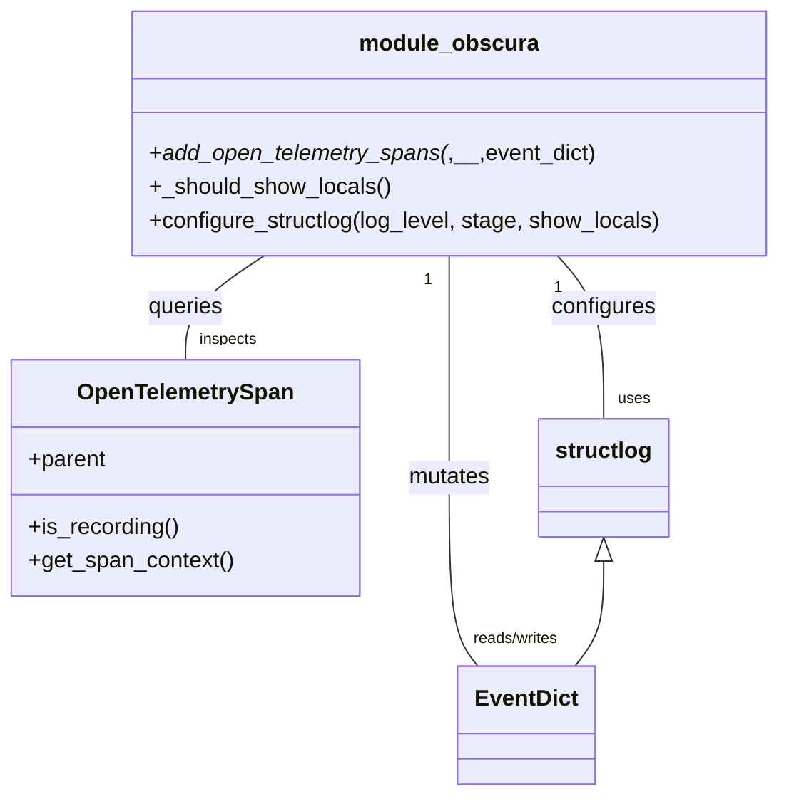

# Diagram: common/fv_otel_helpers/fv_otel_helpers/structlog_setup.py


> Auto-generated by Obscura crawlers

## Diagram 1



### SVG

<svg id="container" width="549.3046875" xmlns="http://www.w3.org/2000/svg" class="classDiagram" height="566" viewBox="0 0 549.3046875 566" role="graphics-document document" aria-roledescription="class"><style>#container{font-family:"trebuchet ms",verdana,arial,sans-serif;font-size:16px;fill:#333;}@keyframes edge-animation-frame{from{stroke-dashoffset:0;}}@keyframes dash{to{stroke-dashoffset:0;}}#container .edge-animation-slow{stroke-dasharray:9,5!important;stroke-dashoffset:900;animation:dash 50s linear infinite;stroke-linecap:round;}#container .edge-animation-fast{stroke-dasharray:9,5!important;stroke-dashoffset:900;animation:dash 20s linear infinite;stroke-linecap:round;}#container .error-icon{fill:#552222;}#container .error-text{fill:#552222;stroke:#552222;}#container .edge-thickness-normal{stroke-width:1px;}#container .edge-thickness-thick{stroke-width:3.5px;}#container .edge-pattern-solid{stroke-dasharray:0;}#container .edge-thickness-invisible{stroke-width:0;fill:none;}#container .edge-pattern-dashed{stroke-dasharray:3;}#container .edge-pattern-dotted{stroke-dasharray:2;}#container .marker{fill:#333333;stroke:#333333;}#container .marker.cross{stroke:#333333;}#container svg{font-family:"trebuchet ms",verdana,arial,sans-serif;font-size:16px;}#container p{margin:0;}#container g.classGroup text{fill:#9370DB;stroke:none;font-family:"trebuchet ms",verdana,arial,sans-serif;font-size:10px;}#container g.classGroup text .title{font-weight:bolder;}#container .nodeLabel,#container .edgeLabel{color:#131300;}#container .edgeLabel .label rect{fill:#ECECFF;}#container .label text{fill:#131300;}#container .labelBkg{background:#ECECFF;}#container .edgeLabel .label span{background:#ECECFF;}#container .classTitle{font-weight:bolder;}#container .node rect,#container .node circle,#container .node ellipse,#container .node polygon,#container .node path{fill:#ECECFF;stroke:#9370DB;stroke-width:1px;}#container .divider{stroke:#9370DB;stroke-width:1;}#container g.clickable{cursor:pointer;}#container g.classGroup rect{fill:#ECECFF;stroke:#9370DB;}#container g.classGroup line{stroke:#9370DB;stroke-width:1;}#container .classLabel .box{stroke:none;stroke-width:0;fill:#ECECFF;opacity:0.5;}#container .classLabel .label{fill:#9370DB;font-size:10px;}#container .relation{stroke:#333333;stroke-width:1;fill:none;}#container .dashed-line{stroke-dasharray:3;}#container .dotted-line{stroke-dasharray:1 2;}#container #compositionStart,#container .composition{fill:#333333!important;stroke:#333333!important;stroke-width:1;}#container #compositionEnd,#container .composition{fill:#333333!important;stroke:#333333!important;stroke-width:1;}#container #dependencyStart,#container .dependency{fill:#333333!important;stroke:#333333!important;stroke-width:1;}#container #dependencyStart,#container .dependency{fill:#333333!important;stroke:#333333!important;stroke-width:1;}#container #extensionStart,#container .extension{fill:transparent!important;stroke:#333333!important;stroke-width:1;}#container #extensionEnd,#container .extension{fill:transparent!important;stroke:#333333!important;stroke-width:1;}#container #aggregationStart,#container .aggregation{fill:transparent!important;stroke:#333333!important;stroke-width:1;}#container #aggregationEnd,#container .aggregation{fill:transparent!important;stroke:#333333!important;stroke-width:1;}#container #lollipopStart,#container .lollipop{fill:#ECECFF!important;stroke:#333333!important;stroke-width:1;}#container #lollipopEnd,#container .lollipop{fill:#ECECFF!important;stroke:#333333!important;stroke-width:1;}#container .edgeTerminals{font-size:11px;line-height:initial;}#container .classTitleText{text-anchor:middle;font-size:18px;fill:#333;}#container .label-icon{display:inline-block;height:1em;overflow:visible;vertical-align:-0.125em;}#container .node .label-icon path{fill:currentColor;stroke:revert;stroke-width:revert;}#container :root{--mermaid-font-family:"trebuchet ms",verdana,arial,sans-serif;}</style><g><defs><marker id="container_class-aggregationStart" class="marker aggregation class" refX="18" refY="7" markerWidth="190" markerHeight="240" orient="auto"><path d="M 18,7 L9,13 L1,7 L9,1 Z"></path></marker></defs><defs><marker id="container_class-aggregationEnd" class="marker aggregation class" refX="1" refY="7" markerWidth="20" markerHeight="28" orient="auto"><path d="M 18,7 L9,13 L1,7 L9,1 Z"></path></marker></defs><defs><marker id="container_class-extensionStart" class="marker extension class" refX="18" refY="7" markerWidth="190" markerHeight="240" orient="auto"><path d="M 1,7 L18,13 V 1 Z"></path></marker></defs><defs><marker id="container_class-extensionEnd" class="marker extension class" refX="1" refY="7" markerWidth="20" markerHeight="28" orient="auto"><path d="M 1,1 V 13 L18,7 Z"></path></marker></defs><defs><marker id="container_class-compositionStart" class="marker composition class" refX="18" refY="7" markerWidth="190" markerHeight="240" orient="auto"><path d="M 18,7 L9,13 L1,7 L9,1 Z"></path></marker></defs><defs><marker id="container_class-compositionEnd" class="marker composition class" refX="1" refY="7" markerWidth="20" markerHeight="28" orient="auto"><path d="M 18,7 L9,13 L1,7 L9,1 Z"></path></marker></defs><defs><marker id="container_class-dependencyStart" class="marker dependency class" refX="6" refY="7" markerWidth="190" markerHeight="240" orient="auto"><path d="M 5,7 L9,13 L1,7 L9,1 Z"></path></marker></defs><defs><marker id="container_class-dependencyEnd" class="marker dependency class" refX="13" refY="7" markerWidth="20" markerHeight="28" orient="auto"><path d="M 18,7 L9,13 L14,7 L9,1 Z"></path></marker></defs><defs><marker id="container_class-lollipopStart" class="marker lollipop class" refX="13" refY="7" markerWidth="190" markerHeight="240" orient="auto"><circle stroke="black" fill="transparent" cx="7" cy="7" r="6"></circle></marker></defs><defs><marker id="container_class-lollipopEnd" class="marker lollipop class" refX="1" refY="7" markerWidth="190" markerHeight="240" orient="auto"><circle stroke="black" fill="transparent" cx="7" cy="7" r="6"></circle></marker></defs><g class="root"><g class="clusters"></g><g class="edgePaths"><path d="M393.529,182L398.977,188.167C404.426,194.333,415.322,206.667,420.77,226C426.219,245.333,426.219,271.667,426.219,284.833L426.219,298" id="id_module_obscura_structlog_1" class="edge-thickness-normal edge-pattern-solid relation" style=";;;" data-edge="true" data-et="edge" data-id="id_module_obscura_structlog_1" data-points="W3sieCI6MzkzLjUyOTA0NDg1ODg3MSwieSI6MTgyfSx7IngiOjQyNi4yMTg3NSwieSI6MjE5fSx7IngiOjQyNi4yMTg3NSwieSI6Mjk4fV0="></path><path d="M316.664,182L316.664,188.167C316.664,194.333,316.664,206.667,316.664,233C316.664,259.333,316.664,299.667,316.664,338C316.664,376.333,316.664,412.667,320.071,435C323.477,457.333,330.29,465.667,333.697,469.833L337.103,474" id="id_module_obscura_EventDict_2" class="edge-thickness-normal edge-pattern-solid relation" style=";;;" data-edge="true" data-et="edge" data-id="id_module_obscura_EventDict_2" data-points="W3sieCI6MzE2LjY2NDA2MjUsInkiOjE4Mn0seyJ4IjozMTYuNjY0MDYyNSwieSI6MjE5fSx7IngiOjMxNi42NjQwNjI1LCJ5IjozNDB9LHsieCI6MzE2LjY2NDA2MjUsInkiOjQ0OX0seyJ4IjozMzcuMTAzMzY5ODY5NDAyOTcsInkiOjQ3NH1d"></path><path d="M185.734,182L176.453,188.167C167.173,194.333,148.612,206.667,139.331,219C130.051,231.333,130.051,243.667,130.051,249.833L130.051,256" id="id_module_obscura_OpenTelemetrySpan_3" class="edge-thickness-normal edge-pattern-solid relation" style=";;;" data-edge="true" data-et="edge" data-id="id_module_obscura_OpenTelemetrySpan_3" data-points="W3sieCI6MTg1LjczMzc3NjQ2MTY5MzU0LCJ5IjoxODJ9LHsieCI6MTMwLjA1MDc4MTI1LCJ5IjoyMTl9LHsieCI6MTMwLjA1MDc4MTI1LCJ5IjoyNTZ9XQ=="></path><path d="M426.219,399.25L426.219,407.542C426.219,415.833,426.219,432.417,422.812,444.875C419.406,457.333,412.593,465.667,409.186,469.833L405.779,474" id="id_structlog_EventDict_4" class="edge-thickness-normal edge-pattern-solid relation" style=";;;" data-edge="true" data-et="edge" data-id="id_structlog_EventDict_4" data-points="W3sieCI6NDI2LjIxODc1LCJ5IjozODJ9LHsieCI6NDI2LjIxODc1LCJ5Ijo0NDl9LHsieCI6NDA1Ljc3OTQ0MjYzMDU5NzAzLCJ5Ijo0NzR9XQ==" marker-start="url(#container_class-extensionStart)"></path></g><g class="edgeLabels"><g class="edgeLabel" transform="translate(426.21875, 219)"><g class="label" data-id="id_module_obscura_structlog_1" transform="translate(-37.3046875, -12)"><foreignObject width="74.609375" height="24"><div xmlns="http://www.w3.org/1999/xhtml" class="labelBkg" style="display: table-cell; white-space: nowrap; line-height: 1.5; max-width: 200px; text-align: center;"><span class="edgeLabel"><p>configures</p></span></div></foreignObject></g></g><g class="edgeLabel" transform="translate(316.6640625, 340)"><g class="label" data-id="id_module_obscura_EventDict_2" transform="translate(-29.5625, -12)"><foreignObject width="59.125" height="24"><div xmlns="http://www.w3.org/1999/xhtml" class="labelBkg" style="display: table-cell; white-space: nowrap; line-height: 1.5; max-width: 200px; text-align: center;"><span class="edgeLabel"><p>mutates</p></span></div></foreignObject></g></g><g class="edgeLabel" transform="translate(130.05078125, 219)"><g class="label" data-id="id_module_obscura_OpenTelemetrySpan_3" transform="translate(-27.2421875, -12)"><foreignObject width="54.484375" height="24"><div xmlns="http://www.w3.org/1999/xhtml" class="labelBkg" style="display: table-cell; white-space: nowrap; line-height: 1.5; max-width: 200px; text-align: center;"><span class="edgeLabel"><p>queries</p></span></div></foreignObject></g></g><g class="edgeLabel"><g class="label" data-id="id_structlog_EventDict_4" transform="translate(0, 0)"><foreignObject width="0" height="0"><div xmlns="http://www.w3.org/1999/xhtml" class="labelBkg" style="display: table-cell; white-space: nowrap; line-height: 1.5; max-width: 200px; text-align: center;"><span class="edgeLabel"></span></div></foreignObject></g></g><g class="edgeTerminals" transform="translate(393.8747859977679, 205.04626871785814)"><g class="inner" transform="translate(0, 0)"><foreignObject style="width: 9px; height: 12px;"><div xmlns="http://www.w3.org/1999/xhtml" style="display: inline-block; padding-right: 1px; white-space: nowrap;"><span class="edgeLabel">1</span></div></foreignObject></g></g><g class="edgeTerminals" transform="translate(301.6640612500001, 199.49999892857144)"><g class="inner" transform="translate(0, 0)"><foreignObject style="width: 9px; height: 12px;"><div xmlns="http://www.w3.org/1999/xhtml" style="display: inline-block; padding-right: 1px; white-space: nowrap;"><span class="edgeLabel">1</span></div></foreignObject></g></g><g class="edgeTerminals" transform="translate(162.85662961618584, 179.19176181203022)"><g class="inner" transform="translate(0, 0)"><foreignObject style="width: 9px; height: 12px;"><div xmlns="http://www.w3.org/1999/xhtml" style="display: inline-block; padding-right: 1px; white-space: nowrap;"><span class="edgeLabel">1</span></div></foreignObject></g></g><g class="edgeTerminals" transform="translate(436.21875, 275.5)"><g class="inner" transform="translate(0, 0)"></g><foreignObject style="width: 36px; height: 12px;"><div xmlns="http://www.w3.org/1999/xhtml" style="display: inline-block; padding-right: 1px; white-space: nowrap;"><span class="edgeLabel">uses</span></div></foreignObject></g><g class="edgeTerminals" transform="translate(333.95480717599173, 446.24151794675794)"><g class="inner" transform="translate(0, 0)"></g><foreignObject style="width: 108px; height: 12px;"><div xmlns="http://www.w3.org/1999/xhtml" style="display: inline-block; padding-right: 1px; white-space: nowrap;"><span class="edgeLabel">reads/writes</span></div></foreignObject></g><g class="edgeTerminals" transform="translate(140.05078062500002, 233.4999994642857)"><g class="inner" transform="translate(0, 0)"></g><foreignObject style="width: 72px; height: 12px;"><div xmlns="http://www.w3.org/1999/xhtml" style="display: inline-block; padding-right: 1px; white-space: nowrap;"><span class="edgeLabel">inspects</span></div></foreignObject></g></g><g class="nodes"><g class="node default" id="classId-module_obscura-0" transform="translate(316.6640625, 95)"><g class="basic label-container"><path d="M-224.640625 -87 L224.640625 -87 L224.640625 87 L-224.640625 87" stroke="none" stroke-width="0" fill="#ECECFF" style=""></path><path d="M-224.640625 -87 C-87.78928255807006 -87, 49.06205988385989 -87, 224.640625 -87 M-224.640625 -87 C-68.70805201533224 -87, 87.22452096933552 -87, 224.640625 -87 M224.640625 -87 C224.640625 -26.81930535287583, 224.640625 33.36138929424834, 224.640625 87 M224.640625 -87 C224.640625 -30.519412933931996, 224.640625 25.96117413213601, 224.640625 87 M224.640625 87 C126.73894636012042 87, 28.837267720240845 87, -224.640625 87 M224.640625 87 C74.10043874127143 87, -76.43974751745714 87, -224.640625 87 M-224.640625 87 C-224.640625 25.030035434639807, -224.640625 -36.93992913072039, -224.640625 -87 M-224.640625 87 C-224.640625 31.43385472153298, -224.640625 -24.132290556934038, -224.640625 -87" stroke="#9370DB" stroke-width="1.3" fill="none" stroke-dasharray="0 0" style=""></path></g><g class="annotation-group text" transform="translate(0, -63)"></g><g class="label-group text" transform="translate(-60.359375, -63)"><g class="label" style="font-weight: bolder" transform="translate(0,-12)"><foreignObject width="120.71875" height="24"><div xmlns="http://www.w3.org/1999/xhtml" style="display: table-cell; white-space: nowrap; line-height: 1.5; max-width: 170px; text-align: center;"><span class="nodeLabel markdown-node-label" style=""><p>module_obscura</p></span></div></foreignObject></g></g><g class="members-group text" transform="translate(-212.640625, -15)"></g><g class="methods-group text" transform="translate(-212.640625, 15)"><g class="label" style="" transform="translate(0,-12)"><foreignObject width="315.84375" height="24"><div xmlns="http://www.w3.org/1999/xhtml" style="display: table-cell; white-space: nowrap; line-height: 1.5; max-width: 392px; text-align: center;"><span class="nodeLabel markdown-node-label" style=""><p>+<em>add_open_telemetry_spans(</em>,__,event_dict)</p></span></div></foreignObject></g><g class="label" style="" transform="translate(0,12)"><foreignObject width="171.046875" height="24"><div xmlns="http://www.w3.org/1999/xhtml" style="display: table-cell; white-space: nowrap; line-height: 1.5; max-width: 228px; text-align: center;"><span class="nodeLabel markdown-node-label" style=""><p>+_should_show_locals()</p></span></div></foreignObject></g><g class="label" style="" transform="translate(0,36)"><foreignObject width="364.921875" height="24"><div xmlns="http://www.w3.org/1999/xhtml" style="display: table-cell; white-space: nowrap; line-height: 1.5; max-width: 422px; text-align: center;"><span class="nodeLabel markdown-node-label" style=""><p>+configure_structlog(log_level, stage, show_locals)</p></span></div></foreignObject></g></g><g class="divider" style=""><path d="M-224.640625 -39 C-82.91386250841487 -39, 58.81289998317027 -39, 224.640625 -39 M-224.640625 -39 C-93.81268943277612 -39, 37.01524613444775 -39, 224.640625 -39" stroke="#9370DB" stroke-width="1.3" fill="none" stroke-dasharray="0 0" style=""></path></g><g class="divider" style=""><path d="M-224.640625 -15 C-103.48138884774995 -15, 17.67784730450009 -15, 224.640625 -15 M-224.640625 -15 C-114.55921800983045 -15, -4.477811019660891 -15, 224.640625 -15" stroke="#9370DB" stroke-width="1.3" fill="none" stroke-dasharray="0 0" style=""></path></g></g><g class="node default" id="classId-OpenTelemetrySpan-1" transform="translate(130.05078125, 340)"><g class="basic label-container"><path d="M-122.05078125 -84 L122.05078125 -84 L122.05078125 84 L-122.05078125 84" stroke="none" stroke-width="0" fill="#ECECFF" style=""></path><path d="M-122.05078125 -84 C-57.24614469862637 -84, 7.558491852747267 -84, 122.05078125 -84 M-122.05078125 -84 C-64.09356321220784 -84, -6.136345174415666 -84, 122.05078125 -84 M122.05078125 -84 C122.05078125 -32.363446646867196, 122.05078125 19.273106706265608, 122.05078125 84 M122.05078125 -84 C122.05078125 -35.29763277994377, 122.05078125 13.404734440112463, 122.05078125 84 M122.05078125 84 C55.300358525448246 84, -11.450064199103508 84, -122.05078125 84 M122.05078125 84 C55.697893794128404 84, -10.654993661743191 84, -122.05078125 84 M-122.05078125 84 C-122.05078125 49.76944790608117, -122.05078125 15.538895812162338, -122.05078125 -84 M-122.05078125 84 C-122.05078125 27.993916181211723, -122.05078125 -28.012167637576553, -122.05078125 -84" stroke="#9370DB" stroke-width="1.3" fill="none" stroke-dasharray="0 0" style=""></path></g><g class="annotation-group text" transform="translate(0, -60)"></g><g class="label-group text" transform="translate(-74.2734375, -60)"><g class="label" style="font-weight: bolder" transform="translate(0,-12)"><foreignObject width="148.546875" height="24"><div xmlns="http://www.w3.org/1999/xhtml" style="display: table-cell; white-space: nowrap; line-height: 1.5; max-width: 197px; text-align: center;"><span class="nodeLabel markdown-node-label" style=""><p>OpenTelemetrySpan</p></span></div></foreignObject></g></g><g class="members-group text" transform="translate(-110.05078125, -12)"><g class="label" style="" transform="translate(0,-12)"><foreignObject width="55.609375" height="24"><div xmlns="http://www.w3.org/1999/xhtml" style="display: table-cell; white-space: nowrap; line-height: 1.5; max-width: 113px; text-align: center;"><span class="nodeLabel markdown-node-label" style=""><p>+parent</p></span></div></foreignObject></g></g><g class="methods-group text" transform="translate(-110.05078125, 36)"><g class="label" style="" transform="translate(0,-12)"><foreignObject width="106.90625" height="24"><div xmlns="http://www.w3.org/1999/xhtml" style="display: table-cell; white-space: nowrap; line-height: 1.5; max-width: 164px; text-align: center;"><span class="nodeLabel markdown-node-label" style=""><p>+is_recording()</p></span></div></foreignObject></g><g class="label" style="" transform="translate(0,12)"><foreignObject width="145.828125" height="24"><div xmlns="http://www.w3.org/1999/xhtml" style="display: table-cell; white-space: nowrap; line-height: 1.5; max-width: 203px; text-align: center;"><span class="nodeLabel markdown-node-label" style=""><p>+get_span_context()</p></span></div></foreignObject></g></g><g class="divider" style=""><path d="M-122.05078125 -36 C-67.4072274138455 -36, -12.763673577691009 -36, 122.05078125 -36 M-122.05078125 -36 C-24.942328208379635 -36, 72.16612483324073 -36, 122.05078125 -36" stroke="#9370DB" stroke-width="1.3" fill="none" stroke-dasharray="0 0" style=""></path></g><g class="divider" style=""><path d="M-122.05078125 12 C-54.050077676112394 12, 13.950625897775211 12, 122.05078125 12 M-122.05078125 12 C-66.03676015572788 12, -10.022739061455738 12, 122.05078125 12" stroke="#9370DB" stroke-width="1.3" fill="none" stroke-dasharray="0 0" style=""></path></g></g><g class="node default" id="classId-EventDict-2" transform="translate(371.44140625, 516)"><g class="basic label-container"><path d="M-46.59375 -42 L46.59375 -42 L46.59375 42 L-46.59375 42" stroke="none" stroke-width="0" fill="#ECECFF" style=""></path><path d="M-46.59375 -42 C-24.167565936557814 -42, -1.7413818731156283 -42, 46.59375 -42 M-46.59375 -42 C-19.08575460764145 -42, 8.422240784717097 -42, 46.59375 -42 M46.59375 -42 C46.59375 -18.172727096549814, 46.59375 5.654545806900373, 46.59375 42 M46.59375 -42 C46.59375 -11.724353604232707, 46.59375 18.551292791534586, 46.59375 42 M46.59375 42 C26.855107562267737 42, 7.116465124535473 42, -46.59375 42 M46.59375 42 C9.494378986800527 42, -27.604992026398946 42, -46.59375 42 M-46.59375 42 C-46.59375 23.28179195771269, -46.59375 4.563583915425383, -46.59375 -42 M-46.59375 42 C-46.59375 13.073920198870944, -46.59375 -15.852159602258112, -46.59375 -42" stroke="#9370DB" stroke-width="1.3" fill="none" stroke-dasharray="0 0" style=""></path></g><g class="annotation-group text" transform="translate(0, -18)"></g><g class="label-group text" transform="translate(-34.59375, -18)"><g class="label" style="font-weight: bolder" transform="translate(0,-12)"><foreignObject width="69.1875" height="24"><div xmlns="http://www.w3.org/1999/xhtml" style="display: table-cell; white-space: nowrap; line-height: 1.5; max-width: 118px; text-align: center;"><span class="nodeLabel markdown-node-label" style=""><p>EventDict</p></span></div></foreignObject></g></g><g class="members-group text" transform="translate(-34.59375, 30)"></g><g class="methods-group text" transform="translate(-34.59375, 60)"></g><g class="divider" style=""><path d="M-46.59375 6 C-10.85245552170936 6, 24.88883895658128 6, 46.59375 6 M-46.59375 6 C-26.867934632681933 6, -7.142119265363867 6, 46.59375 6" stroke="#9370DB" stroke-width="1.3" fill="none" stroke-dasharray="0 0" style=""></path></g><g class="divider" style=""><path d="M-46.59375 24 C-27.200626632097354 24, -7.8075032641947075 24, 46.59375 24 M-46.59375 24 C-20.16508219261261 24, 6.263585614774783 24, 46.59375 24" stroke="#9370DB" stroke-width="1.3" fill="none" stroke-dasharray="0 0" style=""></path></g></g><g class="node default" id="classId-structlog-3" transform="translate(426.21875, 340)"><g class="basic label-container"><path d="M-44.9921875 -42 L44.9921875 -42 L44.9921875 42 L-44.9921875 42" stroke="none" stroke-width="0" fill="#ECECFF" style=""></path><path d="M-44.9921875 -42 C-13.037125597476805 -42, 18.91793630504639 -42, 44.9921875 -42 M-44.9921875 -42 C-19.75480990906772 -42, 5.482567681864559 -42, 44.9921875 -42 M44.9921875 -42 C44.9921875 -11.292728730581668, 44.9921875 19.414542538836663, 44.9921875 42 M44.9921875 -42 C44.9921875 -14.69785666099871, 44.9921875 12.60428667800258, 44.9921875 42 M44.9921875 42 C21.258173885479334 42, -2.4758397290413328 42, -44.9921875 42 M44.9921875 42 C24.66982836752516 42, 4.347469235050319 42, -44.9921875 42 M-44.9921875 42 C-44.9921875 15.559560417101004, -44.9921875 -10.880879165797992, -44.9921875 -42 M-44.9921875 42 C-44.9921875 20.298754901415254, -44.9921875 -1.4024901971694916, -44.9921875 -42" stroke="#9370DB" stroke-width="1.3" fill="none" stroke-dasharray="0 0" style=""></path></g><g class="annotation-group text" transform="translate(0, -18)"></g><g class="label-group text" transform="translate(-32.9921875, -18)"><g class="label" style="font-weight: bolder" transform="translate(0,-12)"><foreignObject width="65.984375" height="24"><div xmlns="http://www.w3.org/1999/xhtml" style="display: table-cell; white-space: nowrap; line-height: 1.5; max-width: 115px; text-align: center;"><span class="nodeLabel markdown-node-label" style=""><p>structlog</p></span></div></foreignObject></g></g><g class="members-group text" transform="translate(-32.9921875, 30)"></g><g class="methods-group text" transform="translate(-32.9921875, 60)"></g><g class="divider" style=""><path d="M-44.9921875 6 C-10.516685960870717 6, 23.958815578258566 6, 44.9921875 6 M-44.9921875 6 C-9.002607129668256 6, 26.986973240663488 6, 44.9921875 6" stroke="#9370DB" stroke-width="1.3" fill="none" stroke-dasharray="0 0" style=""></path></g><g class="divider" style=""><path d="M-44.9921875 24 C-18.248087061742 24, 8.496013376515997 24, 44.9921875 24 M-44.9921875 24 C-9.355791562152433 24, 26.280604375695134 24, 44.9921875 24" stroke="#9370DB" stroke-width="1.3" fill="none" stroke-dasharray="0 0" style=""></path></g></g></g></g></g></svg>

## Diagram 2

```mermaid
flowchart TD
    A[Start logging setup] --> B{Env: SHOW_LOCALS set?}
    B -- yes --> C[show_locals = bool(SHOW_LOCALS)]
    B -- no --> D{AWS_STAGE == "prod-b"?}
    D -- yes --> E[show_locals = False]
    D -- no --> F[show_locals = True]
    C --> G[Call configure_structlog(log_level, stage, show_locals)]
    E --> G
    F --> G
    G --> H[Build processors list]
    H --> I[ExceptionRenderer(ExceptionDictTransformer(show_locals))]
    I --> J[TimeStamper(fmt="iso")]
    J --> K[add_log_level]
    K --> L[CallsiteParameterAdder(MODULE, LINENO)]
    L --> M[_add_stage -> add env key]
    M --> N[_add_open_telemetry_spans -> attach span info]
    N --> O[EventRenamer("msg")]
    O --> P[JSONRenderer()]
    P --> Q[structlog.make_filtering_bound_logger(level)]
    Q --> R[Logging configured]
    R --> S[End]
```

> SVG rendering failed for this diagram.

## Diagram 3

```mermaid
flowchart LR
    subgraph span_check [OpenTelemetry span handling]
        S1[trace.get_current_span()] --> S2{span.is_recording()?}
        S2 -- no --> S3[set event_dict["span"] = None]
        S2 -- yes --> S4[get ctx = span.get_span_context()]
        S4 --> S5[populate span_id, trace_id, parent_span_id]
        S5 --> S6[return event_dict]
    end
```

> SVG rendering failed for this diagram.
