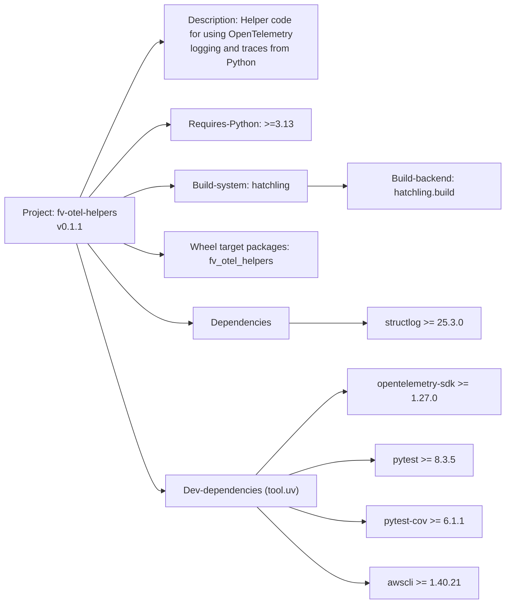

# Diagram: common/fv_otel_helpers/pyproject.toml

> Auto-generated by Obscura crawlers

## Mermaid

### SVG

<svg id="container" width="896" xmlns="http://www.w3.org/2000/svg" class="flowchart" height="998" viewBox="0 0 896 998" role="graphics-document document" aria-roledescription="flowchart-v2"><g><marker id="container_flowchart-v2-pointEnd" class="marker flowchart-v2" viewBox="0 0 10 10" refX="5" refY="5" markerUnits="userSpaceOnUse" markerWidth="8" markerHeight="8" orient="auto"><path d="M 0 0 L 10 5 L 0 10 z" class="arrowMarkerPath" style="stroke-width: 1; stroke-dasharray: 1, 0;"></path></marker><marker id="container_flowchart-v2-pointStart" class="marker flowchart-v2" viewBox="0 0 10 10" refX="4.5" refY="5" markerUnits="userSpaceOnUse" markerWidth="8" markerHeight="8" orient="auto"><path d="M 0 5 L 10 10 L 10 0 z" class="arrowMarkerPath" style="stroke-width: 1; stroke-dasharray: 1, 0;"></path></marker><marker id="container_flowchart-v2-circleEnd" class="marker flowchart-v2" viewBox="0 0 10 10" refX="11" refY="5" markerUnits="userSpaceOnUse" markerWidth="11" markerHeight="11" orient="auto"><circle cx="5" cy="5" r="5" class="arrowMarkerPath" style="stroke-width: 1; stroke-dasharray: 1, 0;"></circle></marker><marker id="container_flowchart-v2-circleStart" class="marker flowchart-v2" viewBox="0 0 10 10" refX="-1" refY="5" markerUnits="userSpaceOnUse" markerWidth="11" markerHeight="11" orient="auto"><circle cx="5" cy="5" r="5" class="arrowMarkerPath" style="stroke-width: 1; stroke-dasharray: 1, 0;"></circle></marker><marker id="container_flowchart-v2-crossEnd" class="marker cross flowchart-v2" viewBox="0 0 11 11" refX="12" refY="5.2" markerUnits="userSpaceOnUse" markerWidth="11" markerHeight="11" orient="auto"><path d="M 1,1 l 9,9 M 10,1 l -9,9" class="arrowMarkerPath" style="stroke-width: 2; stroke-dasharray: 1, 0;"></path></marker><marker id="container_flowchart-v2-crossStart" class="marker cross flowchart-v2" viewBox="0 0 11 11" refX="-1" refY="5.2" markerUnits="userSpaceOnUse" markerWidth="11" markerHeight="11" orient="auto"><path d="M 1,1 l 9,9 M 10,1 l -9,9" class="arrowMarkerPath" style="stroke-width: 2; stroke-dasharray: 1, 0;"></path></marker><g class="root"><g class="clusters"></g><g class="edgePaths"><path d="M158.017,334L180.514,290.167C203.011,246.333,248.006,158.667,274.003,114.833C300,71,307,71,310.5,71L314,71" id="L_Project_Description_0" class="edge-thickness-normal edge-pattern-solid edge-thickness-normal edge-pattern-solid flowchart-link" style=";" data-edge="true" data-et="edge" data-id="L_Project_Description_0" data-points="W3sieCI6MTU4LjAxNjU1NjI5MTM5MDcsInkiOjMzNH0seyJ4IjoyOTMsInkiOjcxfSx7IngiOjMxOCwieSI6NzF9XQ==" marker-end="url(#container_flowchart-v2-pointEnd)"></path><path d="M175.315,334L194.929,313.5C214.543,293,253.772,252,279.439,231.5C305.107,211,317.214,211,323.267,211L329.32,211" id="L_Project_PythonReq_0" class="edge-thickness-normal edge-pattern-solid edge-thickness-normal edge-pattern-solid flowchart-link" style=";" data-edge="true" data-et="edge" data-id="L_Project_PythonReq_0" data-points="W3sieCI6MTc1LjMxNDgxNDgxNDgxNDgsInkiOjMzNH0seyJ4IjoyOTMsInkiOjIxMX0seyJ4IjozMzMuMzIwMzEyNSwieSI6MjExfV0=" marker-end="url(#container_flowchart-v2-pointEnd)"></path><path d="M242.224,334L250.687,330.833C259.149,327.667,276.075,321.333,290.52,318.167C304.966,315,316.932,315,322.915,315L328.898,315" id="L_Project_BuildSystem_0" class="edge-thickness-normal edge-pattern-solid edge-thickness-normal edge-pattern-solid flowchart-link" style=";" data-edge="true" data-et="edge" data-id="L_Project_BuildSystem_0" data-points="W3sieCI6MjQyLjIyNDEzNzkzMTAzNDQ4LCJ5IjozMzR9LHsieCI6MjkzLCJ5IjozMTV9LHsieCI6MzMyLjg5ODQzNzUsInkiOjMxNX1d" marker-end="url(#container_flowchart-v2-pointEnd)"></path><path d="M563.102,315L569.751,315C576.401,315,589.701,315,599.85,315C610,315,617,315,620.5,315L624,315" id="L_BuildSystem_BuildBackend_0" class="edge-thickness-normal edge-pattern-solid edge-thickness-normal edge-pattern-solid flowchart-link" style=";" data-edge="true" data-et="edge" data-id="L_BuildSystem_BuildBackend_0" data-points="W3sieCI6NTYzLjEwMTU2MjUsInkiOjMxNX0seyJ4Ijo2MDMsInkiOjMxNX0seyJ4Ijo2MjgsInkiOjMxNX1d" marker-end="url(#container_flowchart-v2-pointEnd)"></path><path d="M242.224,412L250.687,415.167C259.149,418.333,276.075,424.667,288.037,427.833C300,431,307,431,310.5,431L314,431" id="L_Project_WheelTarget_0" class="edge-thickness-normal edge-pattern-solid edge-thickness-normal edge-pattern-solid flowchart-link" style=";" data-edge="true" data-et="edge" data-id="L_Project_WheelTarget_0" data-points="W3sieCI6MjQyLjIyNDEzNzkzMTAzNDQ4LCJ5Ijo0MTJ9LHsieCI6MjkzLCJ5Ijo0MzF9LHsieCI6MzE4LCJ5Ijo0MzF9XQ==" marker-end="url(#container_flowchart-v2-pointEnd)"></path><path d="M172.741,412L192.784,434.5C212.828,457,252.914,502,284.57,524.5C316.227,547,339.453,547,351.066,547L362.68,547" id="L_Project_Dependencies_0" class="edge-thickness-normal edge-pattern-solid edge-thickness-normal edge-pattern-solid flowchart-link" style=";" data-edge="true" data-et="edge" data-id="L_Project_Dependencies_0" data-points="W3sieCI6MTcyLjc0MTM3OTMxMDM0NDgzLCJ5Ijo0MTJ9LHsieCI6MjkzLCJ5Ijo1NDd9LHsieCI6MzY2LjY3OTY4NzUsInkiOjU0N31d" marker-end="url(#container_flowchart-v2-pointEnd)"></path><path d="M529.32,547L541.6,547C553.88,547,578.44,547,600.117,547C621.794,547,640.589,547,649.986,547L659.383,547" id="L_Dependencies_Structlog_0" class="edge-thickness-normal edge-pattern-solid edge-thickness-normal edge-pattern-solid flowchart-link" style=";" data-edge="true" data-et="edge" data-id="L_Dependencies_Structlog_0" data-points="W3sieCI6NTI5LjMyMDMxMjUsInkiOjU0N30seyJ4Ijo2MDMsInkiOjU0N30seyJ4Ijo2NjMuMzgyODEyNSwieSI6NTQ3fV0=" marker-end="url(#container_flowchart-v2-pointEnd)"></path><path d="M151.929,412L175.44,477.833C198.952,543.667,245.976,675.333,273.031,741.167C300.086,807,307.172,807,310.715,807L314.258,807" id="L_Project_DevDeps_0" class="edge-thickness-normal edge-pattern-solid edge-thickness-normal edge-pattern-solid flowchart-link" style=";" data-edge="true" data-et="edge" data-id="L_Project_DevDeps_0" data-points="W3sieCI6MTUxLjkyODU3MTQyODU3MTQyLCJ5Ijo0MTJ9LHsieCI6MjkzLCJ5Ijo4MDd9LHsieCI6MzE4LjI1NzgxMjUsInkiOjgwN31d" marker-end="url(#container_flowchart-v2-pointEnd)"></path><path d="M474.827,780L496.189,758.5C517.551,737,560.276,694,585.174,672.5C610.073,651,617.146,651,620.682,651L624.219,651" id="L_DevDeps_OTEL_0" class="edge-thickness-normal edge-pattern-solid edge-thickness-normal edge-pattern-solid flowchart-link" style=";" data-edge="true" data-et="edge" data-id="L_DevDeps_OTEL_0" data-points="W3sieCI6NDc0LjgyNjkyMzA3NjkyMzEsInkiOjc4MH0seyJ4Ijo2MDMsInkiOjY1MX0seyJ4Ijo2MjguMjE4NzUsInkiOjY1MX1d" marker-end="url(#container_flowchart-v2-pointEnd)"></path><path d="M528.481,780L540.901,775.833C553.321,771.667,578.16,763.333,602.238,759.167C626.315,755,649.63,755,661.288,755L672.945,755" id="L_DevDeps_Pytest_0" class="edge-thickness-normal edge-pattern-solid edge-thickness-normal edge-pattern-solid flowchart-link" style=";" data-edge="true" data-et="edge" data-id="L_DevDeps_Pytest_0" data-points="W3sieCI6NTI4LjQ4MDc2OTIzMDc2OTMsInkiOjc4MH0seyJ4Ijo2MDMsInkiOjc1NX0seyJ4Ijo2NzYuOTQ1MzEyNSwieSI6NzU1fV0=" marker-end="url(#container_flowchart-v2-pointEnd)"></path><path d="M528.481,834L540.901,838.167C553.321,842.333,578.16,850.667,600.216,854.833C622.271,859,641.542,859,651.177,859L660.813,859" id="L_DevDeps_PytestCov_0" class="edge-thickness-normal edge-pattern-solid edge-thickness-normal edge-pattern-solid flowchart-link" style=";" data-edge="true" data-et="edge" data-id="L_DevDeps_PytestCov_0" data-points="W3sieCI6NTI4LjQ4MDc2OTIzMDc2OTMsInkiOjgzNH0seyJ4Ijo2MDMsInkiOjg1OX0seyJ4Ijo2NjQuODEyNSwieSI6ODU5fV0=" marker-end="url(#container_flowchart-v2-pointEnd)"></path><path d="M474.827,834L496.189,855.5C517.551,877,560.276,920,592.247,941.5C624.219,963,645.438,963,656.047,963L666.656,963" id="L_DevDeps_AWSCLI_0" class="edge-thickness-normal edge-pattern-solid edge-thickness-normal edge-pattern-solid flowchart-link" style=";" data-edge="true" data-et="edge" data-id="L_DevDeps_AWSCLI_0" data-points="W3sieCI6NDc0LjgyNjkyMzA3NjkyMzEsInkiOjgzNH0seyJ4Ijo2MDMsInkiOjk2M30seyJ4Ijo2NzAuNjU2MjUsInkiOjk2M31d" marker-end="url(#container_flowchart-v2-pointEnd)"></path></g><g class="edgeLabels"><g class="edgeLabel"><g class="label" data-id="L_Project_Description_0" transform="translate(0, 0)"><foreignObject width="0" height="0">

</foreignObject></g></g><g class="edgeLabel"><g class="label" data-id="L_Project_PythonReq_0" transform="translate(0, 0)"><foreignObject width="0" height="0">

</foreignObject></g></g><g class="edgeLabel"><g class="label" data-id="L_Project_BuildSystem_0" transform="translate(0, 0)"><foreignObject width="0" height="0">

</foreignObject></g></g><g class="edgeLabel"><g class="label" data-id="L_BuildSystem_BuildBackend_0" transform="translate(0, 0)"><foreignObject width="0" height="0">

</foreignObject></g></g><g class="edgeLabel"><g class="label" data-id="L_Project_WheelTarget_0" transform="translate(0, 0)"><foreignObject width="0" height="0">

</foreignObject></g></g><g class="edgeLabel"><g class="label" data-id="L_Project_Dependencies_0" transform="translate(0, 0)"><foreignObject width="0" height="0">

</foreignObject></g></g><g class="edgeLabel"><g class="label" data-id="L_Dependencies_Structlog_0" transform="translate(0, 0)"><foreignObject width="0" height="0">

</foreignObject></g></g><g class="edgeLabel"><g class="label" data-id="L_Project_DevDeps_0" transform="translate(0, 0)"><foreignObject width="0" height="0">

</foreignObject></g></g><g class="edgeLabel"><g class="label" data-id="L_DevDeps_OTEL_0" transform="translate(0, 0)"><foreignObject width="0" height="0">

</foreignObject></g></g><g class="edgeLabel"><g class="label" data-id="L_DevDeps_Pytest_0" transform="translate(0, 0)"><foreignObject width="0" height="0">

</foreignObject></g></g><g class="edgeLabel"><g class="label" data-id="L_DevDeps_PytestCov_0" transform="translate(0, 0)"><foreignObject width="0" height="0">

</foreignObject></g></g><g class="edgeLabel"><g class="label" data-id="L_DevDeps_AWSCLI_0" transform="translate(0, 0)"><foreignObject width="0" height="0">

</foreignObject></g></g></g><g class="nodes"><g class="node default" id="flowchart-Project-0" transform="translate(138, 373)"><rect class="basic label-container" style="" x="-130" y="-39" width="260" height="78"></rect><g class="label" style="" transform="translate(-100, -24)"><rect></rect><foreignObject width="200" height="48">

Project: fv-otel-helpers\nv0.1.1

</foreignObject></g></g><g class="node default" id="flowchart-Description-1" transform="translate(448, 71)"><rect class="basic label-container" style="" x="-130" y="-63" width="260" height="126"></rect><g class="label" style="" transform="translate(-100, -48)"><rect></rect><foreignObject width="200" height="96">

Description: Helper code for using OpenTelemetry\nlogging and traces from Python

</foreignObject></g></g><g class="node default" id="flowchart-PythonReq-3" transform="translate(448, 211)"><rect class="basic label-container" style="" x="-114.6796875" y="-27" width="229.359375" height="54"></rect><g class="label" style="" transform="translate(-84.6796875, -12)"><rect></rect><foreignObject width="169.359375" height="24">

Requires-Python: &gt;=3.13

</foreignObject></g></g><g class="node default" id="flowchart-BuildSystem-5" transform="translate(448, 315)"><rect class="basic label-container" style="" x="-115.1015625" y="-27" width="230.203125" height="54"></rect><g class="label" style="" transform="translate(-85.1015625, -12)"><rect></rect><foreignObject width="170.203125" height="24">

Build-system: hatchling

</foreignObject></g></g><g class="node default" id="flowchart-BuildBackend-7" transform="translate(758, 315)"><rect class="basic label-container" style="" x="-130" y="-39" width="260" height="78"></rect><g class="label" style="" transform="translate(-100, -24)"><rect></rect><foreignObject width="200" height="48">

Build-backend: hatchling.build

</foreignObject></g></g><g class="node default" id="flowchart-WheelTarget-9" transform="translate(448, 431)"><rect class="basic label-container" style="" x="-130" y="-39" width="260" height="78"></rect><g class="label" style="" transform="translate(-100, -24)"><rect></rect><foreignObject width="200" height="48">

Wheel target packages: fv_otel_helpers

</foreignObject></g></g><g class="node default" id="flowchart-Dependencies-11" transform="translate(448, 547)"><rect class="basic label-container" style="" x="-81.3203125" y="-27" width="162.640625" height="54"></rect><g class="label" style="" transform="translate(-51.3203125, -12)"><rect></rect><foreignObject width="102.640625" height="24">

Dependencies

</foreignObject></g></g><g class="node default" id="flowchart-Structlog-13" transform="translate(758, 547)"><rect class="basic label-container" style="" x="-94.6171875" y="-27" width="189.234375" height="54"></rect><g class="label" style="" transform="translate(-64.6171875, -12)"><rect></rect><foreignObject width="129.234375" height="24">

structlog &gt;= 25.3.0

</foreignObject></g></g><g class="node default" id="flowchart-DevDeps-15" transform="translate(448, 807)"><rect class="basic label-container" style="" x="-129.7421875" y="-27" width="259.484375" height="54"></rect><g class="label" style="" transform="translate(-99.7421875, -12)"><rect></rect><foreignObject width="199.484375" height="24">

Dev-dependencies (tool.uv)

</foreignObject></g></g><g class="node default" id="flowchart-OTEL-17" transform="translate(758, 651)"><rect class="basic label-container" style="" x="-129.78125" y="-27" width="259.5625" height="54"></rect><g class="label" style="" transform="translate(-99.78125, -12)"><rect></rect><foreignObject width="199.5625" height="24">

opentelemetry-sdk &gt;= 1.27.0

</foreignObject></g></g><g class="node default" id="flowchart-Pytest-19" transform="translate(758, 755)"><rect class="basic label-container" style="" x="-81.0546875" y="-27" width="162.109375" height="54"></rect><g class="label" style="" transform="translate(-51.0546875, -12)"><rect></rect><foreignObject width="102.109375" height="24">

pytest &gt;= 8.3.5

</foreignObject></g></g><g class="node default" id="flowchart-PytestCov-21" transform="translate(758, 859)"><rect class="basic label-container" style="" x="-93.1875" y="-27" width="186.375" height="54"></rect><g class="label" style="" transform="translate(-63.1875, -12)"><rect></rect><foreignObject width="126.375" height="24">

pytest-cov &gt;= 6.1.1

</foreignObject></g></g><g class="node default" id="flowchart-AWSCLI-23" transform="translate(758, 963)"><rect class="basic label-container" style="" x="-87.34375" y="-27" width="174.6875" height="54"></rect><g class="label" style="" transform="translate(-57.34375, -12)"><rect></rect><foreignObject width="114.6875" height="24">

awscli &gt;= 1.40.21

</foreignObject></g></g></g></g></g></svg>
