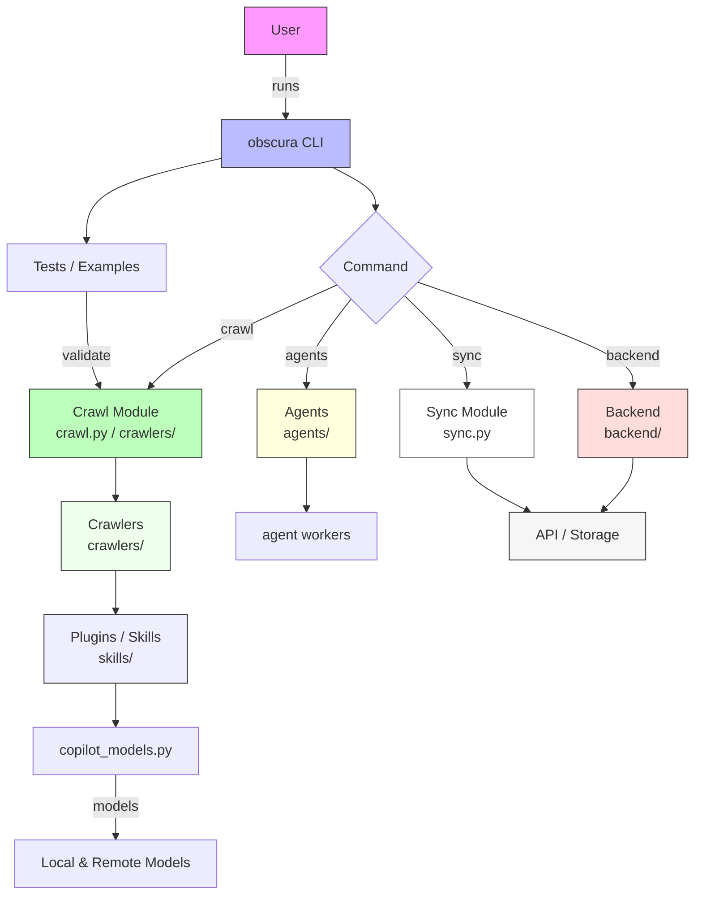

# Diagram: common/iam_service/config/config.alpha.yml

> Auto-generated by Obscura crawlers

## Mermaid

### SVG

<svg id="container" width="803.27734375" xmlns="http://www.w3.org/2000/svg" class="flowchart" height="1015.0625" viewBox="0 0 803.27734375 1015.0625" role="graphics-document document" aria-roledescription="flowchart-v2"><g><marker id="container_flowchart-v2-pointEnd" class="marker flowchart-v2" viewBox="0 0 10 10" refX="5" refY="5" markerUnits="userSpaceOnUse" markerWidth="8" markerHeight="8" orient="auto"><path d="M 0 0 L 10 5 L 0 10 z" class="arrowMarkerPath" style="stroke-width: 1; stroke-dasharray: 1, 0;"></path></marker><marker id="container_flowchart-v2-pointStart" class="marker flowchart-v2" viewBox="0 0 10 10" refX="4.5" refY="5" markerUnits="userSpaceOnUse" markerWidth="8" markerHeight="8" orient="auto"><path d="M 0 5 L 10 10 L 10 0 z" class="arrowMarkerPath" style="stroke-width: 1; stroke-dasharray: 1, 0;"></path></marker><marker id="container_flowchart-v2-circleEnd" class="marker flowchart-v2" viewBox="0 0 10 10" refX="11" refY="5" markerUnits="userSpaceOnUse" markerWidth="11" markerHeight="11" orient="auto"><circle cx="5" cy="5" r="5" class="arrowMarkerPath" style="stroke-width: 1; stroke-dasharray: 1, 0;"></circle></marker><marker id="container_flowchart-v2-circleStart" class="marker flowchart-v2" viewBox="0 0 10 10" refX="-1" refY="5" markerUnits="userSpaceOnUse" markerWidth="11" markerHeight="11" orient="auto"><circle cx="5" cy="5" r="5" class="arrowMarkerPath" style="stroke-width: 1; stroke-dasharray: 1, 0;"></circle></marker><marker id="container_flowchart-v2-crossEnd" class="marker cross flowchart-v2" viewBox="0 0 11 11" refX="12" refY="5.2" markerUnits="userSpaceOnUse" markerWidth="11" markerHeight="11" orient="auto"><path d="M 1,1 l 9,9 M 10,1 l -9,9" class="arrowMarkerPath" style="stroke-width: 2; stroke-dasharray: 1, 0;"></path></marker><marker id="container_flowchart-v2-crossStart" class="marker cross flowchart-v2" viewBox="0 0 11 11" refX="-1" refY="5.2" markerUnits="userSpaceOnUse" markerWidth="11" markerHeight="11" orient="auto"><path d="M 1,1 l 9,9 M 10,1 l -9,9" class="arrowMarkerPath" style="stroke-width: 2; stroke-dasharray: 1, 0;"></path></marker><g class="root"><g class="clusters"></g><g class="edgePaths"><path d="M330.395,62L330.395,68.167C330.395,74.333,330.395,86.667,330.395,98.333C330.395,110,330.395,121,330.395,126.5L330.395,132" id="L_A_B_0" class="edge-thickness-normal edge-pattern-solid edge-thickness-normal edge-pattern-solid flowchart-link" style=";" data-edge="true" data-et="edge" data-id="L_A_B_0" data-points="W3sieCI6MzMwLjM5NDUzMTI1LCJ5Ijo2Mn0seyJ4IjozMzAuMzk0NTMxMjUsInkiOjk5fSx7IngiOjMzMC4zOTQ1MzEyNSwieSI6MTM2fV0=" marker-end="url(#container_flowchart-v2-pointEnd)"></path><path d="M385.013,190L393.442,194.167C401.871,198.333,418.728,206.667,427.157,214.333C435.586,222,435.586,229,435.586,232.5L435.586,236" id="L_B_C_0" class="edge-thickness-normal edge-pattern-solid edge-thickness-normal edge-pattern-solid flowchart-link" style=";" data-edge="true" data-et="edge" data-id="L_B_C_0" data-points="W3sieCI6Mzg1LjAxMzE0NjAzMzY1Mzg3LCJ5IjoxOTB9LHsieCI6NDM1LjU4NTkzNzUsInkiOjIxNX0seyJ4Ijo0MzUuNTg1OTM3NSwieSI6MjQwfV0=" marker-end="url(#container_flowchart-v2-pointEnd)"></path><path d="M391.455,322.931L360.695,336.453C329.935,349.975,268.415,377.019,232.14,396.229C195.865,415.439,184.835,426.815,179.32,432.503L173.805,438.191" id="L_C_D_0" class="edge-thickness-normal edge-pattern-solid edge-thickness-normal edge-pattern-solid flowchart-link" style=";" data-edge="true" data-et="edge" data-id="L_C_D_0" data-points="W3sieCI6MzkxLjQ1NDU1NTIwNDQ2NDg0LCJ5IjozMjIuOTMxMTE3NzA0NDY0ODR9LHsieCI6MjA2Ljg5NDUzMTI1LCJ5Ijo0MDQuMDYyNX0seyJ4IjoxNzEuMDIwMzUzNjE4NDIxMDQsInkiOjQ0MS4wNjI1fV0=" marker-end="url(#container_flowchart-v2-pointEnd)"></path><path d="M467.906,334.742L479.871,346.295C491.835,357.849,515.763,380.956,527.727,398.009C539.691,415.063,539.691,426.063,539.691,431.563L539.691,437.063" id="L_C_E_0" class="edge-thickness-normal edge-pattern-solid edge-thickness-normal edge-pattern-solid flowchart-link" style=";" data-edge="true" data-et="edge" data-id="L_C_E_0" data-points="W3sieCI6NDY3LjkwNjM4NjE1NjE1NTIsInkiOjMzNC43NDIwNTEzNDM4NDQ4fSx7IngiOjUzOS42OTE0MDYyNSwieSI6NDA0LjA2MjV9LHsieCI6NTM5LjY5MTQwNjI1LCJ5Ijo0NDEuMDYyNX1d" marker-end="url(#container_flowchart-v2-pointEnd)"></path><path d="M407.455,338.932L398.829,349.787C390.203,360.642,372.951,382.352,364.325,398.707C355.699,415.063,355.699,426.063,355.699,431.563L355.699,437.063" id="L_C_F_0" class="edge-thickness-normal edge-pattern-solid edge-thickness-normal edge-pattern-solid flowchart-link" style=";" data-edge="true" data-et="edge" data-id="L_C_F_0" data-points="W3sieCI6NDA3LjQ1NTEzMDI2NTI4MDMsInkiOjMzOC45MzE2OTI3NjUyODAzfSx7IngiOjM1NS42OTkyMTg3NSwieSI6NDA0LjA2MjV9LHsieCI6MzU1LjY5OTIxODc1LCJ5Ijo0NDEuMDYyNX1d" marker-end="url(#container_flowchart-v2-pointEnd)"></path><path d="M482.962,319.686L524.204,333.749C565.445,347.812,647.928,375.937,689.169,395.5C730.41,415.063,730.41,426.063,730.41,431.563L730.41,437.063" id="L_C_G_0" class="edge-thickness-normal edge-pattern-solid edge-thickness-normal edge-pattern-solid flowchart-link" style=";" data-edge="true" data-et="edge" data-id="L_C_G_0" data-points="W3sieCI6NDgyLjk2MjQxOTI0MzU4NTIsInkiOjMxOS42ODYwMTgyNTY0MTQ4fSx7IngiOjczMC40MTAxNTYyNSwieSI6NDA0LjA2MjV9LHsieCI6NzMwLjQxMDE1NjI1LCJ5Ijo0NDEuMDYyNX1d" marker-end="url(#container_flowchart-v2-pointEnd)"></path><path d="M133.207,519.063L133.207,523.229C133.207,527.396,133.207,535.729,133.207,543.396C133.207,551.063,133.207,558.063,133.207,561.563L133.207,565.063" id="L_D_H_0" class="edge-thickness-normal edge-pattern-solid edge-thickness-normal edge-pattern-solid flowchart-link" style=";" data-edge="true" data-et="edge" data-id="L_D_H_0" data-points="W3sieCI6MTMzLjIwNzAzMTI1LCJ5Ijo1MTkuMDYyNX0seyJ4IjoxMzMuMjA3MDMxMjUsInkiOjU0NC4wNjI1fSx7IngiOjEzMy4yMDcwMzEyNSwieSI6NTY5LjA2MjV9XQ==" marker-end="url(#container_flowchart-v2-pointEnd)"></path><path d="M133.207,647.063L133.207,651.229C133.207,655.396,133.207,663.729,133.207,671.396C133.207,679.063,133.207,686.063,133.207,689.563L133.207,693.063" id="L_H_I_0" class="edge-thickness-normal edge-pattern-solid edge-thickness-normal edge-pattern-solid flowchart-link" style=";" data-edge="true" data-et="edge" data-id="L_H_I_0" data-points="W3sieCI6MTMzLjIwNzAzMTI1LCJ5Ijo2NDcuMDYyNX0seyJ4IjoxMzMuMjA3MDMxMjUsInkiOjY3Mi4wNjI1fSx7IngiOjEzMy4yMDcwMzEyNSwieSI6Njk3LjA2MjV9XQ==" marker-end="url(#container_flowchart-v2-pointEnd)"></path><path d="M133.207,775.063L133.207,779.229C133.207,783.396,133.207,791.729,133.207,799.396C133.207,807.063,133.207,814.063,133.207,817.563L133.207,821.063" id="L_I_J_0" class="edge-thickness-normal edge-pattern-solid edge-thickness-normal edge-pattern-solid flowchart-link" style=";" data-edge="true" data-et="edge" data-id="L_I_J_0" data-points="W3sieCI6MTMzLjIwNzAzMTI1LCJ5Ijo3NzUuMDYyNX0seyJ4IjoxMzMuMjA3MDMxMjUsInkiOjgwMC4wNjI1fSx7IngiOjEzMy4yMDcwMzEyNSwieSI6ODI1LjA2MjV9XQ==" marker-end="url(#container_flowchart-v2-pointEnd)"></path><path d="M355.699,519.063L355.699,523.229C355.699,527.396,355.699,535.729,355.699,545.396C355.699,555.063,355.699,566.063,355.699,571.563L355.699,577.063" id="L_F_K_0" class="edge-thickness-normal edge-pattern-solid edge-thickness-normal edge-pattern-solid flowchart-link" style=";" data-edge="true" data-et="edge" data-id="L_F_K_0" data-points="W3sieCI6MzU1LjY5OTIxODc1LCJ5Ijo1MTkuMDYyNX0seyJ4IjozNTUuNjk5MjE4NzUsInkiOjU0NC4wNjI1fSx7IngiOjM1NS42OTkyMTg3NSwieSI6NTgxLjA2MjV9XQ==" marker-end="url(#container_flowchart-v2-pointEnd)"></path><path d="M730.41,519.063L730.41,523.229C730.41,527.396,730.41,535.729,724.467,545.601C718.524,555.472,706.637,566.882,700.694,572.587L694.751,578.292" id="L_G_L_0" class="edge-thickness-normal edge-pattern-solid edge-thickness-normal edge-pattern-solid flowchart-link" style=";" data-edge="true" data-et="edge" data-id="L_G_L_0" data-points="W3sieCI6NzMwLjQxMDE1NjI1LCJ5Ijo1MTkuMDYyNX0seyJ4Ijo3MzAuNDEwMTU2MjUsInkiOjU0NC4wNjI1fSx7IngiOjY5MS44NjU0Nzg1MTU2MjUsInkiOjU4MS4wNjI1fV0=" marker-end="url(#container_flowchart-v2-pointEnd)"></path><path d="M539.691,519.063L539.691,523.229C539.691,527.396,539.691,535.729,551.051,545.757C562.411,555.784,585.131,567.506,596.491,573.367L607.851,579.228" id="L_E_L_0" class="edge-thickness-normal edge-pattern-solid edge-thickness-normal edge-pattern-solid flowchart-link" style=";" data-edge="true" data-et="edge" data-id="L_E_L_0" data-points="W3sieCI6NTM5LjY5MTQwNjI1LCJ5Ijo1MTkuMDYyNX0seyJ4Ijo1MzkuNjkxNDA2MjUsInkiOjU0NC4wNjI1fSx7IngiOjYxMS40MDYwMDU4NTkzNzUsInkiOjU4MS4wNjI1fV0=" marker-end="url(#container_flowchart-v2-pointEnd)"></path><path d="M133.207,879.063L133.207,885.229C133.207,891.396,133.207,903.729,133.207,915.396C133.207,927.063,133.207,938.063,133.207,943.563L133.207,949.063" id="L_J_M_0" class="edge-thickness-normal edge-pattern-solid edge-thickness-normal edge-pattern-solid flowchart-link" style=";" data-edge="true" data-et="edge" data-id="L_J_M_0" data-points="W3sieCI6MTMzLjIwNzAzMTI1LCJ5Ijo4NzkuMDYyNX0seyJ4IjoxMzMuMjA3MDMxMjUsInkiOjkxNi4wNjI1fSx7IngiOjEzMy4yMDcwMzEyNSwieSI6OTUzLjA2MjV9XQ==" marker-end="url(#container_flowchart-v2-pointEnd)"></path><path d="M258.723,179.122L232.139,185.101C205.555,191.081,152.387,203.041,125.803,218.609C99.219,234.177,99.219,253.354,99.219,262.943L99.219,272.531" id="L_B_N_0" class="edge-thickness-normal edge-pattern-solid edge-thickness-normal edge-pattern-solid flowchart-link" style=";" data-edge="true" data-et="edge" data-id="L_B_N_0" data-points="W3sieCI6MjU4LjcyMjY1NjI1LCJ5IjoxNzkuMTIxNjYwNjY4MTE5ODN9LHsieCI6OTkuMjE4NzUsInkiOjIxNX0seyJ4Ijo5OS4yMTg3NSwieSI6Mjc2LjUzMTI1fV0=" marker-end="url(#container_flowchart-v2-pointEnd)"></path><path d="M99.219,330.531L99.219,342.786C99.219,355.042,99.219,379.552,101.704,397.365C104.19,415.179,109.161,426.295,111.647,431.853L114.133,437.411" id="L_N_D_0" class="edge-thickness-normal edge-pattern-solid edge-thickness-normal edge-pattern-solid flowchart-link" style=";" data-edge="true" data-et="edge" data-id="L_N_D_0" data-points="W3sieCI6OTkuMjE4NzUsInkiOjMzMC41MzEyNX0seyJ4Ijo5OS4yMTg3NSwieSI6NDA0LjA2MjV9LHsieCI6MTE1Ljc2NTY3NjM5ODAyNjMyLCJ5Ijo0NDEuMDYyNX1d" marker-end="url(#container_flowchart-v2-pointEnd)"></path></g><g class="edgeLabels"><g class="edgeLabel" transform="translate(330.39453125, 99)"><g class="label" data-id="L_A_B_0" transform="translate(-16.171875, -12)"><foreignObject width="32.34375" height="24">

runs

</foreignObject></g></g><g class="edgeLabel"><g class="label" data-id="L_B_C_0" transform="translate(0, 0)"><foreignObject width="0" height="0">

</foreignObject></g></g><g class="edgeLabel" transform="translate(275.58518, 373.86654)"><g class="label" data-id="L_C_D_0" transform="translate(-19.03125, -12)"><foreignObject width="38.0625" height="24">

crawl

</foreignObject></g></g><g class="edgeLabel" transform="translate(539.69140625, 404.0625)"><g class="label" data-id="L_C_E_0" transform="translate(-16.0546875, -12)"><foreignObject width="32.109375" height="24">

sync

</foreignObject></g></g><g class="edgeLabel" transform="translate(355.69921875, 404.0625)"><g class="label" data-id="L_C_F_0" transform="translate(-23.9765625, -12)"><foreignObject width="47.953125" height="24">

agents

</foreignObject></g></g><g class="edgeLabel" transform="translate(730.41015625, 404.0625)"><g class="label" data-id="L_C_G_0" transform="translate(-30.7109375, -12)"><foreignObject width="61.421875" height="24">

backend

</foreignObject></g></g><g class="edgeLabel"><g class="label" data-id="L_D_H_0" transform="translate(0, 0)"><foreignObject width="0" height="0">

</foreignObject></g></g><g class="edgeLabel"><g class="label" data-id="L_H_I_0" transform="translate(0, 0)"><foreignObject width="0" height="0">

</foreignObject></g></g><g class="edgeLabel"><g class="label" data-id="L_I_J_0" transform="translate(0, 0)"><foreignObject width="0" height="0">

</foreignObject></g></g><g class="edgeLabel"><g class="label" data-id="L_F_K_0" transform="translate(0, 0)"><foreignObject width="0" height="0">

</foreignObject></g></g><g class="edgeLabel"><g class="label" data-id="L_G_L_0" transform="translate(0, 0)"><foreignObject width="0" height="0">

</foreignObject></g></g><g class="edgeLabel"><g class="label" data-id="L_E_L_0" transform="translate(0, 0)"><foreignObject width="0" height="0">

</foreignObject></g></g><g class="edgeLabel" transform="translate(133.20703125, 916.0625)"><g class="label" data-id="L_J_M_0" transform="translate(-26.7578125, -12)"><foreignObject width="53.515625" height="24">

models

</foreignObject></g></g><g class="edgeLabel"><g class="label" data-id="L_B_N_0" transform="translate(0, 0)"><foreignObject width="0" height="0">

</foreignObject></g></g><g class="edgeLabel" transform="translate(99.21875, 404.0625)"><g class="label" data-id="L_N_D_0" transform="translate(-28.9453125, -12)"><foreignObject width="57.890625" height="24">

validate

</foreignObject></g></g></g><g class="nodes"><g class="node default" id="flowchart-A-0" transform="translate(330.39453125, 35)"><rect class="basic label-container" style="fill:#f9f !important;stroke:#333 !important;stroke-width:1px !important" x="-46.4453125" y="-27" width="92.890625" height="54"></rect><g class="label" style="" transform="translate(-16.4453125, -12)"><rect></rect><foreignObject width="32.890625" height="24">

User

</foreignObject></g></g><g class="node default" id="flowchart-B-1" transform="translate(330.39453125, 163)"><rect class="basic label-container" style="fill:#bbf !important;stroke:#333 !important" x="-71.671875" y="-27" width="143.34375" height="54"></rect><g class="label" style="" transform="translate(-41.671875, -12)"><rect></rect><foreignObject width="83.34375" height="24">

obscura CLI

</foreignObject></g></g><g class="node default" id="flowchart-C-3" transform="translate(435.5859375, 303.53125)"><polygon points="63.53125,0 127.0625,-63.53125 63.53125,-127.0625 0,-63.53125" class="label-container" transform="translate(-63.03125, 63.53125)"></polygon><g class="label" style="" transform="translate(-36.53125, -12)"><rect></rect><foreignObject width="73.0625" height="24">

Command

</foreignObject></g></g><g class="node default module" id="flowchart-D-5" transform="translate(133.20703125, 480.0625)"><rect class="basic label-container" style="fill:#bfb !important;stroke:#333 !important;stroke-width:1px !important" x="-102.2421875" y="-39" width="204.484375" height="78"></rect><g class="label" style="" transform="translate(-72.2421875, -24)"><rect></rect><foreignObject width="144.484375" height="48">

Crawl Module crawl.py / crawlers/

</foreignObject></g></g><g class="node default module" id="flowchart-E-7" transform="translate(539.69140625, 480.0625)"><rect class="basic label-container" style="fill:#fff !important;stroke:#666 !important;stroke-width:1px !important" x="-75.8515625" y="-39" width="151.703125" height="78"></rect><g class="label" style="" transform="translate(-45.8515625, -24)"><rect></rect><foreignObject width="91.703125" height="48">

Sync Module sync.py

</foreignObject></g></g><g class="node default module" id="flowchart-F-9" transform="translate(355.69921875, 480.0625)"><rect class="basic label-container" style="fill:#ffd !important;stroke:#333 !important;stroke-width:1px !important" x="-58.140625" y="-39" width="116.28125" height="78"></rect><g class="label" style="" transform="translate(-28.140625, -24)"><rect></rect><foreignObject width="56.28125" height="48">

Agents agents/

</foreignObject></g></g><g class="node default module" id="flowchart-G-11" transform="translate(730.41015625, 480.0625)"><rect class="basic label-container" style="fill:#fdd !important;stroke:#333 !important;stroke-width:1px !important" x="-64.8671875" y="-39" width="129.734375" height="78"></rect><g class="label" style="" transform="translate(-34.8671875, -24)"><rect></rect><foreignObject width="69.734375" height="48">

Backend backend/

</foreignObject></g></g><g class="node default module" id="flowchart-H-13" transform="translate(133.20703125, 608.0625)"><rect class="basic label-container" style="fill:#efe !important;stroke:#333 !important;stroke-width:1px !important" x="-64.2109375" y="-39" width="128.421875" height="78"></rect><g class="label" style="" transform="translate(-34.2109375, -24)"><rect></rect><foreignObject width="68.421875" height="48">

Crawlers crawlers/

</foreignObject></g></g><g class="node default module" id="flowchart-I-15" transform="translate(133.20703125, 736.0625)"><rect class="basic label-container" style="fill:#eef !important;stroke:#333 !important;stroke-width:1px !important" x="-83.9453125" y="-39" width="167.890625" height="78"></rect><g class="label" style="" transform="translate(-53.9453125, -24)"><rect></rect><foreignObject width="107.890625" height="48">

Plugins / Skills skills/

</foreignObject></g></g><g class="node default" id="flowchart-J-17" transform="translate(133.20703125, 852.0625)"><rect class="basic label-container" style="" x="-96.703125" y="-27" width="193.40625" height="54"></rect><g class="label" style="" transform="translate(-66.703125, -12)"><rect></rect><foreignObject width="133.40625" height="24">

copilot_models.py

</foreignObject></g></g><g class="node default" id="flowchart-K-19" transform="translate(355.69921875, 608.0625)"><rect class="basic label-container" style="" x="-80.9453125" y="-27" width="161.890625" height="54"></rect><g class="label" style="" transform="translate(-50.9453125, -12)"><rect></rect><foreignObject width="101.890625" height="24">

agent workers

</foreignObject></g></g><g class="node default module" id="flowchart-L-21" transform="translate(663.73828125, 608.0625)"><rect class="basic label-container" style="fill:#f6f6f6 !important;stroke:#333 !important;stroke-width:1px !important" x="-77.265625" y="-27" width="154.53125" height="54"></rect><g class="label" style="" transform="translate(-47.265625, -12)"><rect></rect><foreignObject width="94.53125" height="24">

API / Storage

</foreignObject></g></g><g class="node default" id="flowchart-M-25" transform="translate(133.20703125, 980.0625)"><rect class="basic label-container" style="" x="-114.8671875" y="-27" width="229.734375" height="54"></rect><g class="label" style="" transform="translate(-84.8671875, -12)"><rect></rect><foreignObject width="169.734375" height="24">

Local &amp; Remote Models

</foreignObject></g></g><g class="node default" id="flowchart-N-27" transform="translate(99.21875, 303.53125)"><rect class="basic label-container" style="" x="-91.21875" y="-27" width="182.4375" height="54"></rect><g class="label" style="" transform="translate(-61.21875, -12)"><rect></rect><foreignObject width="122.4375" height="24">

Tests / Examples

</foreignObject></g></g></g></g></g></svg>
