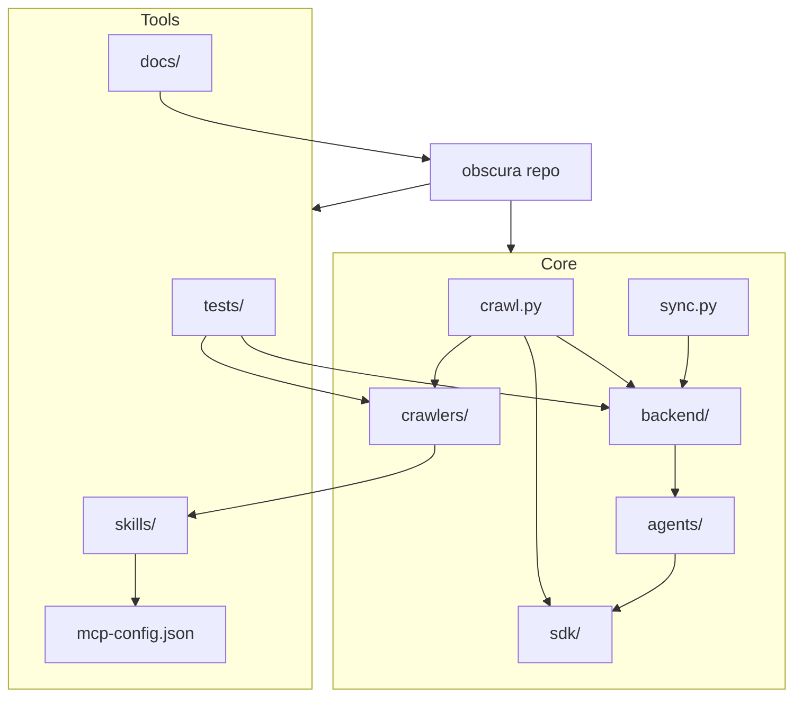

# Diagram: common/iam_service/config/config.dev.yml

> Auto-generated by Obscura crawlers

## Mermaid

### SVG

<svg id="container" width="769.31640625" xmlns="http://www.w3.org/2000/svg" class="flowchart" height="665" viewBox="0 0 769.31640625 665" role="graphics-document document" aria-roledescription="flowchart-v2"><g><marker id="container_flowchart-v2-pointEnd" class="marker flowchart-v2" viewBox="0 0 10 10" refX="5" refY="5" markerUnits="userSpaceOnUse" markerWidth="8" markerHeight="8" orient="auto"><path d="M 0 0 L 10 5 L 0 10 z" class="arrowMarkerPath" style="stroke-width: 1; stroke-dasharray: 1, 0;"></path></marker><marker id="container_flowchart-v2-pointStart" class="marker flowchart-v2" viewBox="0 0 10 10" refX="4.5" refY="5" markerUnits="userSpaceOnUse" markerWidth="8" markerHeight="8" orient="auto"><path d="M 0 5 L 10 10 L 10 0 z" class="arrowMarkerPath" style="stroke-width: 1; stroke-dasharray: 1, 0;"></path></marker><marker id="container_flowchart-v2-circleEnd" class="marker flowchart-v2" viewBox="0 0 10 10" refX="11" refY="5" markerUnits="userSpaceOnUse" markerWidth="11" markerHeight="11" orient="auto"><circle cx="5" cy="5" r="5" class="arrowMarkerPath" style="stroke-width: 1; stroke-dasharray: 1, 0;"></circle></marker><marker id="container_flowchart-v2-circleStart" class="marker flowchart-v2" viewBox="0 0 10 10" refX="-1" refY="5" markerUnits="userSpaceOnUse" markerWidth="11" markerHeight="11" orient="auto"><circle cx="5" cy="5" r="5" class="arrowMarkerPath" style="stroke-width: 1; stroke-dasharray: 1, 0;"></circle></marker><marker id="container_flowchart-v2-crossEnd" class="marker cross flowchart-v2" viewBox="0 0 11 11" refX="12" refY="5.2" markerUnits="userSpaceOnUse" markerWidth="11" markerHeight="11" orient="auto"><path d="M 1,1 l 9,9 M 10,1 l -9,9" class="arrowMarkerPath" style="stroke-width: 2; stroke-dasharray: 1, 0;"></path></marker><marker id="container_flowchart-v2-crossStart" class="marker cross flowchart-v2" viewBox="0 0 11 11" refX="-1" refY="5.2" markerUnits="userSpaceOnUse" markerWidth="11" markerHeight="11" orient="auto"><path d="M 1,1 l 9,9 M 10,1 l -9,9" class="arrowMarkerPath" style="stroke-width: 2; stroke-dasharray: 1, 0;"></path></marker><g class="root"><g class="clusters"><g class="cluster" id="Tools" data-look="classic"><rect style="" x="8" y="8" width="296" height="649"></rect><g class="cluster-label" transform="translate(136.875, 8)"><foreignObject width="38.25" height="24">

Tools

</foreignObject></g></g><g class="cluster" id="Core" data-look="classic"><rect style="" x="324" y="241" width="437.31640625" height="416"></rect><g class="cluster-label" transform="translate(526.455078125, 241)"><foreignObject width="32.40625" height="24">

Core

</foreignObject></g></g></g><g class="edgePaths"><path d="M459.736,320L453.649,324.167C447.561,328.333,435.386,336.667,429.298,344.333C423.211,352,423.211,359,423.211,362.5L423.211,366" id="L_Crawl_CrawlersDir_0" class="edge-thickness-normal edge-pattern-solid edge-thickness-normal edge-pattern-solid flowchart-link" style=";" data-edge="true" data-et="edge" data-id="L_Crawl_CrawlersDir_0" data-points="W3sieCI6NDU5LjczNjI1MzAwNDgwNzcsInkiOjMyMH0seyJ4Ijo0MjMuMjEwOTM3NSwieSI6MzQ1fSx7IngiOjQyMy4yMTA5Mzc1LCJ5IjozNzB9XQ==" marker-end="url(#container_flowchart-v2-pointEnd)"></path><path d="M542.369,320L549.033,324.167C555.698,328.333,569.027,336.667,581.011,344.614C592.995,352.561,603.634,360.122,608.954,363.902L614.274,367.683" id="L_Crawl_Backend_0" class="edge-thickness-normal edge-pattern-solid edge-thickness-normal edge-pattern-solid flowchart-link" style=";" data-edge="true" data-et="edge" data-id="L_Crawl_Backend_0" data-points="W3sieCI6NTQyLjM2ODk5MDM4NDYxNTQsInkiOjMyMH0seyJ4Ijo1ODIuMzU1NDY4NzUsInkiOjM0NX0seyJ4Ijo2MTcuNTM0MjU0ODA3NjkyMywieSI6MzcwfV0=" marker-end="url(#container_flowchart-v2-pointEnd)"></path><path d="M511.25,320L513.112,324.167C514.974,328.333,518.698,336.667,520.56,349.5C522.422,362.333,522.422,379.667,522.422,397C522.422,414.333,522.422,431.667,522.422,449C522.422,466.333,522.422,483.667,522.422,501C522.422,518.333,522.422,535.667,524.301,547.91C526.179,560.153,529.937,567.306,531.816,570.882L533.695,574.459" id="L_Crawl_SDK_0" class="edge-thickness-normal edge-pattern-solid edge-thickness-normal edge-pattern-solid flowchart-link" style=";" data-edge="true" data-et="edge" data-id="L_Crawl_SDK_0" data-points="W3sieCI6NTExLjI0OTYyNDM5OTAzODQ1LCJ5IjozMjB9LHsieCI6NTIyLjQyMTg3NSwieSI6MzQ1fSx7IngiOjUyMi40MjE4NzUsInkiOjM5N30seyJ4Ijo1MjIuNDIxODc1LCJ5Ijo0NDl9LHsieCI6NTIyLjQyMTg3NSwieSI6NTAxfSx7IngiOjUyMi40MjE4NzUsInkiOjU1M30seyJ4Ijo1MzUuNTU0NzYyNjIwMTkyMywieSI6NTc4fV0=" marker-end="url(#container_flowchart-v2-pointEnd)"></path><path d="M669.605,320L669.605,324.167C669.605,328.333,669.605,336.667,668.652,344.356C667.698,352.046,665.79,359.093,664.836,362.616L663.882,366.139" id="L_Sync_Backend_0" class="edge-thickness-normal edge-pattern-solid edge-thickness-normal edge-pattern-solid flowchart-link" style=";" data-edge="true" data-et="edge" data-id="L_Sync_Backend_0" data-points="W3sieCI6NjY5LjYwNTQ2ODc1LCJ5IjozMjB9LHsieCI6NjY5LjYwNTQ2ODc1LCJ5IjozNDV9LHsieCI6NjYyLjgzNzEzOTQyMzA3NjksInkiOjM3MH1d" marker-end="url(#container_flowchart-v2-pointEnd)"></path><path d="M655.527,424L655.527,428.167C655.527,432.333,655.527,440.667,655.527,448.333C655.527,456,655.527,463,655.527,466.5L655.527,470" id="L_Backend_Agents_0" class="edge-thickness-normal edge-pattern-solid edge-thickness-normal edge-pattern-solid flowchart-link" style=";" data-edge="true" data-et="edge" data-id="L_Backend_Agents_0" data-points="W3sieCI6NjU1LjUyNzM0Mzc1LCJ5Ijo0MjR9LHsieCI6NjU1LjUyNzM0Mzc1LCJ5Ijo0NDl9LHsieCI6NjU1LjUyNzM0Mzc1LCJ5Ijo0NzR9XQ==" marker-end="url(#container_flowchart-v2-pointEnd)"></path><path d="M655.527,528L655.527,532.167C655.527,536.333,655.527,544.667,646.291,553.373C637.055,562.08,618.582,571.16,609.346,575.7L600.109,580.24" id="L_Agents_SDK_0" class="edge-thickness-normal edge-pattern-solid edge-thickness-normal edge-pattern-solid flowchart-link" style=";" data-edge="true" data-et="edge" data-id="L_Agents_SDK_0" data-points="W3sieCI6NjU1LjUyNzM0Mzc1LCJ5Ijo1Mjh9LHsieCI6NjU1LjUyNzM0Mzc1LCJ5Ijo1NTN9LHsieCI6NTk2LjUxOTUzMTI1LCJ5Ijo1ODIuMDA0OTQ3OTM1ODk4NH1d" marker-end="url(#container_flowchart-v2-pointEnd)"></path><path d="M423.211,424L423.211,428.167C423.211,432.333,423.211,440.667,383.896,451.822C344.581,462.978,265.951,476.957,226.636,483.946L187.321,490.935" id="L_CrawlersDir_Skills_0" class="edge-thickness-normal edge-pattern-solid edge-thickness-normal edge-pattern-solid flowchart-link" style=";" data-edge="true" data-et="edge" data-id="L_CrawlersDir_Skills_0" data-points="W3sieCI6NDIzLjIxMDkzNzUsInkiOjQyNH0seyJ4Ijo0MjMuMjEwOTM3NSwieSI6NDQ5fSx7IngiOjE4My4zODI4MTI1LCJ5Ijo0OTEuNjM0OTcyMzU2NTA3NTV9XQ==" marker-end="url(#container_flowchart-v2-pointEnd)"></path><path d="M130.703,528L130.703,532.167C130.703,536.333,130.703,544.667,130.703,552.333C130.703,560,130.703,567,130.703,570.5L130.703,574" id="L_Skills_CopilotConfig_0" class="edge-thickness-normal edge-pattern-solid edge-thickness-normal edge-pattern-solid flowchart-link" style=";" data-edge="true" data-et="edge" data-id="L_Skills_CopilotConfig_0" data-points="W3sieCI6MTMwLjcwMzEyNSwieSI6NTI4fSx7IngiOjEzMC43MDMxMjUsInkiOjU1M30seyJ4IjoxMzAuNzAzMTI1LCJ5Ijo1Nzh9XQ==" marker-end="url(#container_flowchart-v2-pointEnd)"></path><path d="M234.655,320L237.325,324.167C239.995,328.333,245.335,336.667,304.008,348.026C362.681,359.386,474.687,373.772,530.69,380.966L586.693,388.159" id="L_Tests_Backend_0" class="edge-thickness-normal edge-pattern-solid edge-thickness-normal edge-pattern-solid flowchart-link" style=";" data-edge="true" data-et="edge" data-id="L_Tests_Backend_0" data-points="W3sieCI6MjM0LjY1NDUyMjIzNTU3NjkzLCJ5IjozMjB9LHsieCI6MjUwLjY3NTc4MTI1LCJ5IjozNDV9LHsieCI6NTkwLjY2MDE1NjI1LCJ5IjozODguNjY4MzE5NzkzMTM0MDZ9XQ==" marker-end="url(#container_flowchart-v2-pointEnd)"></path><path d="M200.049,320L197.378,324.167C194.708,328.333,189.368,336.667,215.208,347.032C241.049,357.397,298.07,369.794,326.581,375.992L355.091,382.19" id="L_Tests_CrawlersDir_0" class="edge-thickness-normal edge-pattern-solid edge-thickness-normal edge-pattern-solid flowchart-link" style=";" data-edge="true" data-et="edge" data-id="L_Tests_CrawlersDir_0" data-points="W3sieCI6MjAwLjA0ODYwMjc2NDQyMzA3LCJ5IjozMjB9LHsieCI6MTg0LjAyNzM0Mzc1LCJ5IjozNDV9LHsieCI6MzU5LCJ5IjozODMuMDQwMTQzMDY0Nzg3NDZ9XQ==" marker-end="url(#container_flowchart-v2-pointEnd)"></path><path d="M156,87L156,91.167C156,95.333,156,103.667,199.625,114.444C243.251,125.22,330.501,138.441,374.127,145.051L417.752,151.661" id="L_Docs_App_0" class="edge-thickness-normal edge-pattern-solid edge-thickness-normal edge-pattern-solid flowchart-link" style=";" data-edge="true" data-et="edge" data-id="L_Docs_App_0" data-points="W3sieCI6MTU2LCJ5Ijo4N30seyJ4IjoxNTYsInkiOjExMn0seyJ4Ijo0MjEuNzA3MDMxMjUsInkiOjE1Mi4yNjA1NjU3MDQ4NTQ2fV0=" marker-end="url(#container_flowchart-v2-pointEnd)"></path><path d="M499.184,191L499.184,195.167C499.184,199.333,499.184,207.667,499.184,215.333C499.184,223,499.184,230,499.184,233.5L499.184,237" id="L_App_Core_0" class="edge-thickness-normal edge-pattern-solid edge-thickness-normal edge-pattern-solid flowchart-link" style=";" data-edge="true" data-et="edge" data-id="L_App_Core_0" data-points="W3sieCI6NDk5LjE4MzU5Mzc1LCJ5IjoxOTF9LHsieCI6NDk5LjE4MzU5Mzc1LCJ5IjoyMTZ9LHsieCI6NDk5LjE4MzU5Mzc1LCJ5IjoyNDF9LHsieCI6NDk5LjE4MzU5Mzc1LCJ5IjoyNjZ9XQ==" marker-end="url(#container_flowchart-v2-pointEnd)"></path><path d="M421.707,174.934L307.916,198.575" id="L_App_Tools_0" class="edge-thickness-normal edge-pattern-solid edge-thickness-normal edge-pattern-solid flowchart-link" style=";" data-edge="true" data-et="edge" data-id="L_App_Tools_0" data-points="W3sieCI6NDIxLjcwNzAzMTI1LCJ5IjoxNzQuOTMzNTAwMTIxOTExMTV9LHsieCI6MTMwLjcwMzEyNSwieSI6MjE2fSx7IngiOjEzMC43MDMxMjUsInkiOjI0MX0seyJ4IjoxMzAuNzAzMTI1LCJ5IjoyOTN9LHsieCI6MTMwLjcwMzEyNSwieSI6MzQ1fSx7IngiOjEzMC43MDMxMjUsInkiOjM5N30seyJ4IjoxMzAuNzAzMTI1LCJ5Ijo0NDl9LHsieCI6MTMwLjcwMzEyNSwieSI6NDc0fV0=" marker-end="url(#container_flowchart-v2-pointEnd)"></path></g><g class="edgeLabels"><g class="edgeLabel"><g class="label" data-id="L_Crawl_CrawlersDir_0" transform="translate(0, 0)"><foreignObject width="0" height="0">

</foreignObject></g></g><g class="edgeLabel"><g class="label" data-id="L_Crawl_Backend_0" transform="translate(0, 0)"><foreignObject width="0" height="0">

</foreignObject></g></g><g class="edgeLabel"><g class="label" data-id="L_Crawl_SDK_0" transform="translate(0, 0)"><foreignObject width="0" height="0">

</foreignObject></g></g><g class="edgeLabel"><g class="label" data-id="L_Sync_Backend_0" transform="translate(0, 0)"><foreignObject width="0" height="0">

</foreignObject></g></g><g class="edgeLabel"><g class="label" data-id="L_Backend_Agents_0" transform="translate(0, 0)"><foreignObject width="0" height="0">

</foreignObject></g></g><g class="edgeLabel"><g class="label" data-id="L_Agents_SDK_0" transform="translate(0, 0)"><foreignObject width="0" height="0">

</foreignObject></g></g><g class="edgeLabel"><g class="label" data-id="L_CrawlersDir_Skills_0" transform="translate(0, 0)"><foreignObject width="0" height="0">

</foreignObject></g></g><g class="edgeLabel"><g class="label" data-id="L_Skills_CopilotConfig_0" transform="translate(0, 0)"><foreignObject width="0" height="0">

</foreignObject></g></g><g class="edgeLabel"><g class="label" data-id="L_Tests_Backend_0" transform="translate(0, 0)"><foreignObject width="0" height="0">

</foreignObject></g></g><g class="edgeLabel"><g class="label" data-id="L_Tests_CrawlersDir_0" transform="translate(0, 0)"><foreignObject width="0" height="0">

</foreignObject></g></g><g class="edgeLabel"><g class="label" data-id="L_Docs_App_0" transform="translate(0, 0)"><foreignObject width="0" height="0">

</foreignObject></g></g><g class="edgeLabel"><g class="label" data-id="L_App_Core_0" transform="translate(0, 0)"><foreignObject width="0" height="0">

</foreignObject></g></g><g class="edgeLabel"><g class="label" data-id="L_App_Tools_0" transform="translate(0, 0)"><foreignObject width="0" height="0">

</foreignObject></g></g></g><g class="nodes"><g class="node default" id="flowchart-App-0" transform="translate(499.18359375, 164)"><rect class="basic label-container" style="" x="-77.4765625" y="-27" width="154.953125" height="54"></rect><g class="label" style="" transform="translate(-47.4765625, -12)"><rect></rect><foreignObject width="94.953125" height="24">

obscura repo

</foreignObject></g></g><g class="node default" id="flowchart-Crawl-1" transform="translate(499.18359375, 293)"><rect class="basic label-container" style="" x="-59.6328125" y="-27" width="119.265625" height="54"></rect><g class="label" style="" transform="translate(-29.6328125, -12)"><rect></rect><foreignObject width="59.265625" height="24">

crawl.py

</foreignObject></g></g><g class="node default" id="flowchart-Sync-2" transform="translate(669.60546875, 293)"><rect class="basic label-container" style="" x="-56.7109375" y="-27" width="113.421875" height="54"></rect><g class="label" style="" transform="translate(-26.7109375, -12)"><rect></rect><foreignObject width="53.421875" height="24">

sync.py

</foreignObject></g></g><g class="node default" id="flowchart-Backend-3" transform="translate(655.52734375, 397)"><rect class="basic label-container" style="" x="-64.8671875" y="-27" width="129.734375" height="54"></rect><g class="label" style="" transform="translate(-34.8671875, -12)"><rect></rect><foreignObject width="69.734375" height="24">

backend/

</foreignObject></g></g><g class="node default" id="flowchart-Agents-4" transform="translate(655.52734375, 501)"><rect class="basic label-container" style="" x="-58.140625" y="-27" width="116.28125" height="54"></rect><g class="label" style="" transform="translate(-28.140625, -12)"><rect></rect><foreignObject width="56.28125" height="24">

agents/

</foreignObject></g></g><g class="node default" id="flowchart-CrawlersDir-5" transform="translate(423.2109375, 397)"><rect class="basic label-container" style="" x="-64.2109375" y="-27" width="128.421875" height="54"></rect><g class="label" style="" transform="translate(-34.2109375, -12)"><rect></rect><foreignObject width="68.421875" height="24">

crawlers/

</foreignObject></g></g><g class="node default" id="flowchart-SDK-6" transform="translate(549.73828125, 605)"><rect class="basic label-container" style="" x="-46.78125" y="-27" width="93.5625" height="54"></rect><g class="label" style="" transform="translate(-16.78125, -12)"><rect></rect><foreignObject width="33.5625" height="24">

sdk/

</foreignObject></g></g><g class="node default" id="flowchart-Skills-7" transform="translate(130.703125, 501)"><rect class="basic label-container" style="" x="-52.6796875" y="-27" width="105.359375" height="54"></rect><g class="label" style="" transform="translate(-22.6796875, -12)"><rect></rect><foreignObject width="45.359375" height="24">

skills/

</foreignObject></g></g><g class="node default" id="flowchart-CopilotConfig-8" transform="translate(130.703125, 605)"><rect class="basic label-container" style="" x="-87.703125" y="-27" width="175.40625" height="54"></rect><g class="label" style="" transform="translate(-57.703125, -12)"><rect></rect><foreignObject width="115.40625" height="24">

mcp-config.json

</foreignObject></g></g><g class="node default" id="flowchart-Tests-9" transform="translate(217.3515625, 293)"><rect class="basic label-container" style="" x="-51.6484375" y="-27" width="103.296875" height="54"></rect><g class="label" style="" transform="translate(-21.6484375, -12)"><rect></rect><foreignObject width="43.296875" height="24">

tests/

</foreignObject></g></g><g class="node default" id="flowchart-Docs-10" transform="translate(156, 60)"><rect class="basic label-container" style="" x="-51.1796875" y="-27" width="102.359375" height="54"></rect><g class="label" style="" transform="translate(-21.1796875, -12)"><rect></rect><foreignObject width="42.359375" height="24">

docs/

</foreignObject></g></g></g></g></g></svg>
