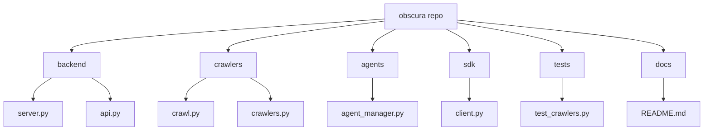

# Diagram: common/iam_service/config/config.prod-b.yml

> Auto-generated by Obscura crawlers

## Mermaid

### SVG

<svg id="container" width="1491.75" xmlns="http://www.w3.org/2000/svg" class="flowchart" height="278" viewBox="0 0 1491.75 278" role="graphics-document document" aria-roledescription="flowchart-v2"><g><marker id="container_flowchart-v2-pointEnd" class="marker flowchart-v2" viewBox="0 0 10 10" refX="5" refY="5" markerUnits="userSpaceOnUse" markerWidth="8" markerHeight="8" orient="auto"><path d="M 0 0 L 10 5 L 0 10 z" class="arrowMarkerPath" style="stroke-width: 1; stroke-dasharray: 1, 0;"></path></marker><marker id="container_flowchart-v2-pointStart" class="marker flowchart-v2" viewBox="0 0 10 10" refX="4.5" refY="5" markerUnits="userSpaceOnUse" markerWidth="8" markerHeight="8" orient="auto"><path d="M 0 5 L 10 10 L 10 0 z" class="arrowMarkerPath" style="stroke-width: 1; stroke-dasharray: 1, 0;"></path></marker><marker id="container_flowchart-v2-circleEnd" class="marker flowchart-v2" viewBox="0 0 10 10" refX="11" refY="5" markerUnits="userSpaceOnUse" markerWidth="11" markerHeight="11" orient="auto"><circle cx="5" cy="5" r="5" class="arrowMarkerPath" style="stroke-width: 1; stroke-dasharray: 1, 0;"></circle></marker><marker id="container_flowchart-v2-circleStart" class="marker flowchart-v2" viewBox="0 0 10 10" refX="-1" refY="5" markerUnits="userSpaceOnUse" markerWidth="11" markerHeight="11" orient="auto"><circle cx="5" cy="5" r="5" class="arrowMarkerPath" style="stroke-width: 1; stroke-dasharray: 1, 0;"></circle></marker><marker id="container_flowchart-v2-crossEnd" class="marker cross flowchart-v2" viewBox="0 0 11 11" refX="12" refY="5.2" markerUnits="userSpaceOnUse" markerWidth="11" markerHeight="11" orient="auto"><path d="M 1,1 l 9,9 M 10,1 l -9,9" class="arrowMarkerPath" style="stroke-width: 2; stroke-dasharray: 1, 0;"></path></marker><marker id="container_flowchart-v2-crossStart" class="marker cross flowchart-v2" viewBox="0 0 11 11" refX="-1" refY="5.2" markerUnits="userSpaceOnUse" markerWidth="11" markerHeight="11" orient="auto"><path d="M 1,1 l 9,9 M 10,1 l -9,9" class="arrowMarkerPath" style="stroke-width: 2; stroke-dasharray: 1, 0;"></path></marker><g class="root"><g class="clusters"></g><g class="edgePaths"><path d="M819.328,40.414L708.221,48.178C597.113,55.943,374.898,71.471,263.791,82.736C152.684,94,152.684,101,152.684,104.5L152.684,108" id="L_A_B_0" class="edge-thickness-normal edge-pattern-solid edge-thickness-normal edge-pattern-solid flowchart-link" style=";" data-edge="true" data-et="edge" data-id="L_A_B_0" data-points="W3sieCI6ODE5LjMyODEyNSwieSI6NDAuNDE0MTQ3MzUyOTQ4ODk1fSx7IngiOjE1Mi42ODM1OTM3NSwieSI6ODd9LHsieCI6MTUyLjY4MzU5Mzc1LCJ5IjoxMTJ9XQ==" marker-end="url(#container_flowchart-v2-pointEnd)"></path><path d="M819.328,44.821L763.872,51.851C708.415,58.881,597.503,72.94,542.046,83.47C486.59,94,486.59,101,486.59,104.5L486.59,108" id="L_A_C_0" class="edge-thickness-normal edge-pattern-solid edge-thickness-normal edge-pattern-solid flowchart-link" style=";" data-edge="true" data-et="edge" data-id="L_A_C_0" data-points="W3sieCI6ODE5LjMyODEyNSwieSI6NDQuODIxMTQ5MzU5NjE1Mjl9LHsieCI6NDg2LjU4OTg0Mzc1LCJ5Ijo4N30seyJ4Ijo0ODYuNTg5ODQzNzUsInkiOjExMn1d" marker-end="url(#container_flowchart-v2-pointEnd)"></path><path d="M843.076,62L834.785,66.167C826.494,70.333,809.911,78.667,801.62,86.333C793.328,94,793.328,101,793.328,104.5L793.328,108" id="L_A_D_0" class="edge-thickness-normal edge-pattern-solid edge-thickness-normal edge-pattern-solid flowchart-link" style=";" data-edge="true" data-et="edge" data-id="L_A_D_0" data-points="W3sieCI6ODQzLjA3NjQ3MjM1NTc2OTMsInkiOjYyfSx7IngiOjc5My4zMjgxMjUsInkiOjg3fSx7IngiOjc5My4zMjgxMjUsInkiOjExMn1d" marker-end="url(#container_flowchart-v2-pointEnd)"></path><path d="M950.533,62L958.824,66.167C967.116,70.333,983.698,78.667,991.99,86.333C1000.281,94,1000.281,101,1000.281,104.5L1000.281,108" id="L_A_E_0" class="edge-thickness-normal edge-pattern-solid edge-thickness-normal edge-pattern-solid flowchart-link" style=";" data-edge="true" data-et="edge" data-id="L_A_E_0" data-points="W3sieCI6OTUwLjUzMjkwMjY0NDIzMDcsInkiOjYyfSx7IngiOjEwMDAuMjgxMjUsInkiOjg3fSx7IngiOjEwMDAuMjgxMjUsInkiOjExMn1d" marker-end="url(#container_flowchart-v2-pointEnd)"></path><path d="M974.281,48.304L1011.84,54.753C1049.398,61.203,1124.516,74.101,1162.074,84.051C1199.633,94,1199.633,101,1199.633,104.5L1199.633,108" id="L_A_F_0" class="edge-thickness-normal edge-pattern-solid edge-thickness-normal edge-pattern-solid flowchart-link" style=";" data-edge="true" data-et="edge" data-id="L_A_F_0" data-points="W3sieCI6OTc0LjI4MTI1LCJ5Ijo0OC4zMDM4NTQyOTAyODQzfSx7IngiOjExOTkuNjMyODEyNSwieSI6ODd9LHsieCI6MTE5OS42MzI4MTI1LCJ5IjoxMTJ9XQ==" marker-end="url(#container_flowchart-v2-pointEnd)"></path><path d="M974.281,42.837L1047.048,50.197C1119.815,57.558,1265.349,72.279,1338.116,83.139C1410.883,94,1410.883,101,1410.883,104.5L1410.883,108" id="L_A_G_0" class="edge-thickness-normal edge-pattern-solid edge-thickness-normal edge-pattern-solid flowchart-link" style=";" data-edge="true" data-et="edge" data-id="L_A_G_0" data-points="W3sieCI6OTc0LjI4MTI1LCJ5Ijo0Mi44MzY5MDQ2NTMzNTQwMDR9LHsieCI6MTQxMC44ODI4MTI1LCJ5Ijo4N30seyJ4IjoxNDEwLjg4MjgxMjUsInkiOjExMn1d" marker-end="url(#container_flowchart-v2-pointEnd)"></path><path d="M109.999,166L103.412,170.167C96.825,174.333,83.651,182.667,77.064,190.333C70.477,198,70.477,205,70.477,208.5L70.477,212" id="L_B_B1_0" class="edge-thickness-normal edge-pattern-solid edge-thickness-normal edge-pattern-solid flowchart-link" style=";" data-edge="true" data-et="edge" data-id="L_B_B1_0" data-points="W3sieCI6MTA5Ljk5OTE3MzY3Nzg4NDYxLCJ5IjoxNjZ9LHsieCI6NzAuNDc2NTYyNSwieSI6MTkxfSx7IngiOjcwLjQ3NjU2MjUsInkiOjIxNn1d" marker-end="url(#container_flowchart-v2-pointEnd)"></path><path d="M195.368,166L201.955,170.167C208.542,174.333,221.716,182.667,228.304,190.333C234.891,198,234.891,205,234.891,208.5L234.891,212" id="L_B_B2_0" class="edge-thickness-normal edge-pattern-solid edge-thickness-normal edge-pattern-solid flowchart-link" style=";" data-edge="true" data-et="edge" data-id="L_B_B2_0" data-points="W3sieCI6MTk1LjM2ODAxMzgyMjExNTQsInkiOjE2Nn0seyJ4IjoyMzQuODkwNjI1LCJ5IjoxOTF9LHsieCI6MjM0Ljg5MDYyNSwieSI6MjE2fV0=" marker-end="url(#container_flowchart-v2-pointEnd)"></path><path d="M439.792,166L432.57,170.167C425.348,174.333,410.905,182.667,403.683,190.333C396.461,198,396.461,205,396.461,208.5L396.461,212" id="L_C_C1_0" class="edge-thickness-normal edge-pattern-solid edge-thickness-normal edge-pattern-solid flowchart-link" style=";" data-edge="true" data-et="edge" data-id="L_C_C1_0" data-points="W3sieCI6NDM5Ljc5MjE0MjQyNzg4NDY0LCJ5IjoxNjZ9LHsieCI6Mzk2LjQ2MDkzNzUsInkiOjE5MX0seyJ4IjozOTYuNDYwOTM3NSwieSI6MjE2fV0=" marker-end="url(#container_flowchart-v2-pointEnd)"></path><path d="M533.388,166L540.609,170.167C547.831,174.333,562.275,182.667,569.497,190.333C576.719,198,576.719,205,576.719,208.5L576.719,212" id="L_C_C2_0" class="edge-thickness-normal edge-pattern-solid edge-thickness-normal edge-pattern-solid flowchart-link" style=";" data-edge="true" data-et="edge" data-id="L_C_C2_0" data-points="W3sieCI6NTMzLjM4NzU0NTA3MjExNTQsInkiOjE2Nn0seyJ4Ijo1NzYuNzE4NzUsInkiOjE5MX0seyJ4Ijo1NzYuNzE4NzUsInkiOjIxNn1d" marker-end="url(#container_flowchart-v2-pointEnd)"></path><path d="M793.328,166L793.328,170.167C793.328,174.333,793.328,182.667,793.328,190.333C793.328,198,793.328,205,793.328,208.5L793.328,212" id="L_D_D1_0" class="edge-thickness-normal edge-pattern-solid edge-thickness-normal edge-pattern-solid flowchart-link" style=";" data-edge="true" data-et="edge" data-id="L_D_D1_0" data-points="W3sieCI6NzkzLjMyODEyNSwieSI6MTY2fSx7IngiOjc5My4zMjgxMjUsInkiOjE5MX0seyJ4Ijo3OTMuMzI4MTI1LCJ5IjoyMTZ9XQ==" marker-end="url(#container_flowchart-v2-pointEnd)"></path><path d="M1000.281,166L1000.281,170.167C1000.281,174.333,1000.281,182.667,1000.281,190.333C1000.281,198,1000.281,205,1000.281,208.5L1000.281,212" id="L_E_E1_0" class="edge-thickness-normal edge-pattern-solid edge-thickness-normal edge-pattern-solid flowchart-link" style=";" data-edge="true" data-et="edge" data-id="L_E_E1_0" data-points="W3sieCI6MTAwMC4yODEyNSwieSI6MTY2fSx7IngiOjEwMDAuMjgxMjUsInkiOjE5MX0seyJ4IjoxMDAwLjI4MTI1LCJ5IjoyMTZ9XQ==" marker-end="url(#container_flowchart-v2-pointEnd)"></path><path d="M1199.633,166L1199.633,170.167C1199.633,174.333,1199.633,182.667,1199.633,190.333C1199.633,198,1199.633,205,1199.633,208.5L1199.633,212" id="L_F_F1_0" class="edge-thickness-normal edge-pattern-solid edge-thickness-normal edge-pattern-solid flowchart-link" style=";" data-edge="true" data-et="edge" data-id="L_F_F1_0" data-points="W3sieCI6MTE5OS42MzI4MTI1LCJ5IjoxNjZ9LHsieCI6MTE5OS42MzI4MTI1LCJ5IjoxOTF9LHsieCI6MTE5OS42MzI4MTI1LCJ5IjoyMTZ9XQ==" marker-end="url(#container_flowchart-v2-pointEnd)"></path><path d="M1410.883,166L1410.883,170.167C1410.883,174.333,1410.883,182.667,1410.883,190.333C1410.883,198,1410.883,205,1410.883,208.5L1410.883,212" id="L_G_G1_0" class="edge-thickness-normal edge-pattern-solid edge-thickness-normal edge-pattern-solid flowchart-link" style=";" data-edge="true" data-et="edge" data-id="L_G_G1_0" data-points="W3sieCI6MTQxMC44ODI4MTI1LCJ5IjoxNjZ9LHsieCI6MTQxMC44ODI4MTI1LCJ5IjoxOTF9LHsieCI6MTQxMC44ODI4MTI1LCJ5IjoyMTZ9XQ==" marker-end="url(#container_flowchart-v2-pointEnd)"></path></g><g class="edgeLabels"><g class="edgeLabel"><g class="label" data-id="L_A_B_0" transform="translate(0, 0)"><foreignObject width="0" height="0">

</foreignObject></g></g><g class="edgeLabel"><g class="label" data-id="L_A_C_0" transform="translate(0, 0)"><foreignObject width="0" height="0">

</foreignObject></g></g><g class="edgeLabel"><g class="label" data-id="L_A_D_0" transform="translate(0, 0)"><foreignObject width="0" height="0">

</foreignObject></g></g><g class="edgeLabel"><g class="label" data-id="L_A_E_0" transform="translate(0, 0)"><foreignObject width="0" height="0">

</foreignObject></g></g><g class="edgeLabel"><g class="label" data-id="L_A_F_0" transform="translate(0, 0)"><foreignObject width="0" height="0">

</foreignObject></g></g><g class="edgeLabel"><g class="label" data-id="L_A_G_0" transform="translate(0, 0)"><foreignObject width="0" height="0">

</foreignObject></g></g><g class="edgeLabel"><g class="label" data-id="L_B_B1_0" transform="translate(0, 0)"><foreignObject width="0" height="0">

</foreignObject></g></g><g class="edgeLabel"><g class="label" data-id="L_B_B2_0" transform="translate(0, 0)"><foreignObject width="0" height="0">

</foreignObject></g></g><g class="edgeLabel"><g class="label" data-id="L_C_C1_0" transform="translate(0, 0)"><foreignObject width="0" height="0">

</foreignObject></g></g><g class="edgeLabel"><g class="label" data-id="L_C_C2_0" transform="translate(0, 0)"><foreignObject width="0" height="0">

</foreignObject></g></g><g class="edgeLabel"><g class="label" data-id="L_D_D1_0" transform="translate(0, 0)"><foreignObject width="0" height="0">

</foreignObject></g></g><g class="edgeLabel"><g class="label" data-id="L_E_E1_0" transform="translate(0, 0)"><foreignObject width="0" height="0">

</foreignObject></g></g><g class="edgeLabel"><g class="label" data-id="L_F_F1_0" transform="translate(0, 0)"><foreignObject width="0" height="0">

</foreignObject></g></g><g class="edgeLabel"><g class="label" data-id="L_G_G1_0" transform="translate(0, 0)"><foreignObject width="0" height="0">

</foreignObject></g></g></g><g class="nodes"><g class="node default" id="flowchart-A-0" transform="translate(896.8046875, 35)"><rect class="basic label-container" style="" x="-77.4765625" y="-27" width="154.953125" height="54"></rect><g class="label" style="" transform="translate(-47.4765625, -12)"><rect></rect><foreignObject width="94.953125" height="24">

obscura repo

</foreignObject></g></g><g class="node default" id="flowchart-B-1" transform="translate(152.68359375, 139)"><rect class="basic label-container" style="" x="-60.7109375" y="-27" width="121.421875" height="54"></rect><g class="label" style="" transform="translate(-30.7109375, -12)"><rect></rect><foreignObject width="61.421875" height="24">

backend

</foreignObject></g></g><g class="node default" id="flowchart-C-3" transform="translate(486.58984375, 139)"><rect class="basic label-container" style="" x="-60.0546875" y="-27" width="120.109375" height="54"></rect><g class="label" style="" transform="translate(-30.0546875, -12)"><rect></rect><foreignObject width="60.109375" height="24">

crawlers

</foreignObject></g></g><g class="node default" id="flowchart-D-5" transform="translate(793.328125, 139)"><rect class="basic label-container" style="" x="-53.9765625" y="-27" width="107.953125" height="54"></rect><g class="label" style="" transform="translate(-23.9765625, -12)"><rect></rect><foreignObject width="47.953125" height="24">

agents

</foreignObject></g></g><g class="node default" id="flowchart-E-7" transform="translate(1000.28125, 139)"><rect class="basic label-container" style="" x="-42.6171875" y="-27" width="85.234375" height="54"></rect><g class="label" style="" transform="translate(-12.6171875, -12)"><rect></rect><foreignObject width="25.234375" height="24">

sdk

</foreignObject></g></g><g class="node default" id="flowchart-F-9" transform="translate(1199.6328125, 139)"><rect class="basic label-container" style="" x="-47.4921875" y="-27" width="94.984375" height="54"></rect><g class="label" style="" transform="translate(-17.4921875, -12)"><rect></rect><foreignObject width="34.984375" height="24">

tests

</foreignObject></g></g><g class="node default" id="flowchart-G-11" transform="translate(1410.8828125, 139)"><rect class="basic label-container" style="" x="-47.0234375" y="-27" width="94.046875" height="54"></rect><g class="label" style="" transform="translate(-17.0234375, -12)"><rect></rect><foreignObject width="34.046875" height="24">

docs

</foreignObject></g></g><g class="node default" id="flowchart-B1-13" transform="translate(70.4765625, 243)"><rect class="basic label-container" style="" x="-62.4765625" y="-27" width="124.953125" height="54"></rect><g class="label" style="" transform="translate(-32.4765625, -12)"><rect></rect><foreignObject width="64.953125" height="24">

server.py

</foreignObject></g></g><g class="node default" id="flowchart-B2-15" transform="translate(234.890625, 243)"><rect class="basic label-container" style="" x="-51.9375" y="-27" width="103.875" height="54"></rect><g class="label" style="" transform="translate(-21.9375, -12)"><rect></rect><foreignObject width="43.875" height="24">

api.py

</foreignObject></g></g><g class="node default" id="flowchart-C1-17" transform="translate(396.4609375, 243)"><rect class="basic label-container" style="" x="-59.6328125" y="-27" width="119.265625" height="54"></rect><g class="label" style="" transform="translate(-29.6328125, -12)"><rect></rect><foreignObject width="59.265625" height="24">

crawl.py

</foreignObject></g></g><g class="node default" id="flowchart-C2-19" transform="translate(576.71875, 243)"><rect class="basic label-container" style="" x="-70.625" y="-27" width="141.25" height="54"></rect><g class="label" style="" transform="translate(-40.625, -12)"><rect></rect><foreignObject width="81.25" height="24">

crawlers.py

</foreignObject></g></g><g class="node default" id="flowchart-D1-21" transform="translate(793.328125, 243)"><rect class="basic label-container" style="" x="-95.984375" y="-27" width="191.96875" height="54"></rect><g class="label" style="" transform="translate(-65.984375, -12)"><rect></rect><foreignObject width="131.96875" height="24">

agent_manager.py

</foreignObject></g></g><g class="node default" id="flowchart-E1-23" transform="translate(1000.28125, 243)"><rect class="basic label-container" style="" x="-60.96875" y="-27" width="121.9375" height="54"></rect><g class="label" style="" transform="translate(-30.96875, -12)"><rect></rect><foreignObject width="61.9375" height="24">

client.py

</foreignObject></g></g><g class="node default" id="flowchart-F1-25" transform="translate(1199.6328125, 243)"><rect class="basic label-container" style="" x="-88.3828125" y="-27" width="176.765625" height="54"></rect><g class="label" style="" transform="translate(-58.3828125, -12)"><rect></rect><foreignObject width="116.765625" height="24">

test_crawlers.py

</foreignObject></g></g><g class="node default" id="flowchart-G1-27" transform="translate(1410.8828125, 243)"><rect class="basic label-container" style="" x="-72.8671875" y="-27" width="145.734375" height="54"></rect><g class="label" style="" transform="translate(-42.8671875, -12)"><rect></rect><foreignObject width="85.734375" height="24">

README.md

</foreignObject></g></g></g></g></g></svg>
