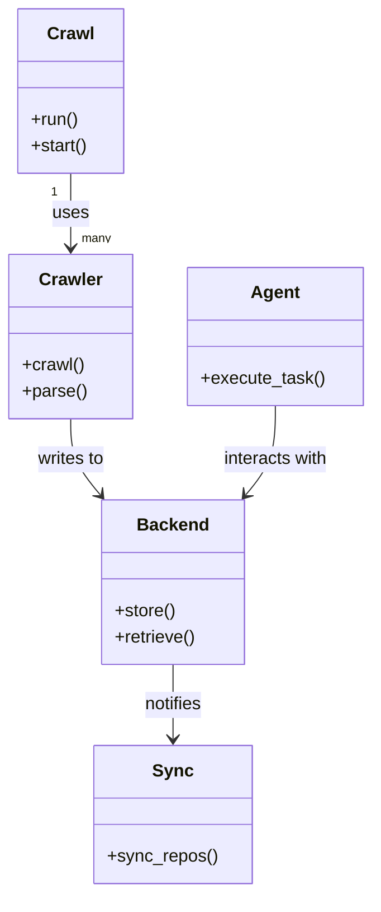
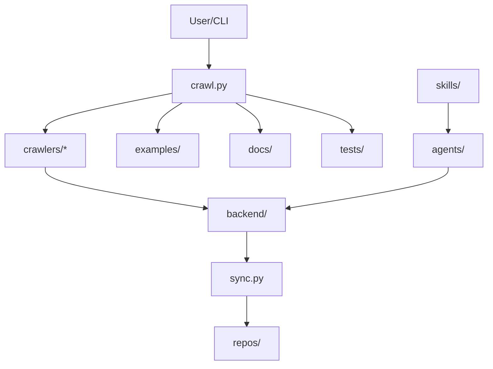

# Diagram: common/iam_service/config/config.qa.yml

> Auto-generated by Obscura crawlers

## Diagram 1

### SVG

<svg id="container" width="333.21875" xmlns="http://www.w3.org/2000/svg" class="classDiagram" height="814" viewBox="0 0 333.21875 814" role="graphics-document document" aria-roledescription="class"><g><defs><marker id="container_class-aggregationStart" class="marker aggregation class" refX="18" refY="7" markerWidth="190" markerHeight="240" orient="auto"><path d="M 18,7 L9,13 L1,7 L9,1 Z"></path></marker></defs><defs><marker id="container_class-aggregationEnd" class="marker aggregation class" refX="1" refY="7" markerWidth="20" markerHeight="28" orient="auto"><path d="M 18,7 L9,13 L1,7 L9,1 Z"></path></marker></defs><defs><marker id="container_class-extensionStart" class="marker extension class" refX="18" refY="7" markerWidth="190" markerHeight="240" orient="auto"><path d="M 1,7 L18,13 V 1 Z"></path></marker></defs><defs><marker id="container_class-extensionEnd" class="marker extension class" refX="1" refY="7" markerWidth="20" markerHeight="28" orient="auto"><path d="M 1,1 V 13 L18,7 Z"></path></marker></defs><defs><marker id="container_class-compositionStart" class="marker composition class" refX="18" refY="7" markerWidth="190" markerHeight="240" orient="auto"><path d="M 18,7 L9,13 L1,7 L9,1 Z"></path></marker></defs><defs><marker id="container_class-compositionEnd" class="marker composition class" refX="1" refY="7" markerWidth="20" markerHeight="28" orient="auto"><path d="M 18,7 L9,13 L1,7 L9,1 Z"></path></marker></defs><defs><marker id="container_class-dependencyStart" class="marker dependency class" refX="6" refY="7" markerWidth="190" markerHeight="240" orient="auto"><path d="M 5,7 L9,13 L1,7 L9,1 Z"></path></marker></defs><defs><marker id="container_class-dependencyEnd" class="marker dependency class" refX="13" refY="7" markerWidth="20" markerHeight="28" orient="auto"><path d="M 18,7 L9,13 L14,7 L9,1 Z"></path></marker></defs><defs><marker id="container_class-lollipopStart" class="marker lollipop class" refX="13" refY="7" markerWidth="190" markerHeight="240" orient="auto"><circle stroke="black" fill="transparent" cx="7" cy="7" r="6"></circle></marker></defs><defs><marker id="container_class-lollipopEnd" class="marker lollipop class" refX="1" refY="7" markerWidth="190" markerHeight="240" orient="auto"><circle stroke="black" fill="transparent" cx="7" cy="7" r="6"></circle></marker></defs><g class="root"><g class="clusters"></g><g class="edgePaths"><path d="M63.133,158L63.133,164.167C63.133,170.333,63.133,182.667,63.133,194C63.133,205.333,63.133,215.667,63.133,220.833L63.133,226" id="id_Crawl_Crawler_1" class="edge-thickness-normal edge-pattern-solid relation" style=";;;" data-edge="true" data-et="edge" data-id="id_Crawl_Crawler_1" data-points="W3sieCI6NjMuMTMyODEyNSwieSI6MTU4fSx7IngiOjYzLjEzMjgxMjUsInkiOjE5NX0seyJ4Ijo2My4xMzI4MTI1LCJ5IjoyMzJ9XQ==" marker-end="url(#container_class-dependencyEnd)"></path><path d="M63.133,382L63.133,388.167C63.133,394.333,63.133,406.667,67.554,418.227C71.974,429.787,80.816,440.573,85.237,445.966L89.658,451.36" id="id_Crawler_Backend_2" class="edge-thickness-normal edge-pattern-solid relation" style=";;;" data-edge="true" data-et="edge" data-id="id_Crawler_Backend_2" data-points="W3sieCI6NjMuMTMyODEyNSwieSI6MzgyfSx7IngiOjYzLjEzMjgxMjUsInkiOjQxOX0seyJ4Ijo5My40NjExNDY3NjMzOTI4NiwieSI6NDU2fV0=" marker-end="url(#container_class-dependencyEnd)"></path><path d="M154.938,606L154.938,612.167C154.938,618.333,154.938,630.667,154.938,642C154.938,653.333,154.938,663.667,154.938,668.833L154.938,674" id="id_Backend_Sync_3" class="edge-thickness-normal edge-pattern-solid relation" style=";;;" data-edge="true" data-et="edge" data-id="id_Backend_Sync_3" data-points="W3sieCI6MTU0LjkzNzUsInkiOjYwNn0seyJ4IjoxNTQuOTM3NSwieSI6NjQzfSx7IngiOjE1NC45Mzc1LCJ5Ijo2ODB9XQ==" marker-end="url(#container_class-dependencyEnd)"></path><path d="M246.742,370L246.742,378.167C246.742,386.333,246.742,402.667,242.321,416.227C237.901,429.787,229.059,440.573,224.638,445.966L220.217,451.36" id="id_Agent_Backend_4" class="edge-thickness-normal edge-pattern-solid relation" style=";;;" data-edge="true" data-et="edge" data-id="id_Agent_Backend_4" data-points="W3sieCI6MjQ2Ljc0MjE4NzUsInkiOjM3MH0seyJ4IjoyNDYuNzQyMTg3NSwieSI6NDE5fSx7IngiOjIxNi40MTM4NTMyMzY2MDcxNCwieSI6NDU2fV0=" marker-end="url(#container_class-dependencyEnd)"></path></g><g class="edgeLabels"><g class="edgeLabel" transform="translate(63.1328125, 195)"><g class="label" data-id="id_Crawl_Crawler_1" transform="translate(-16.4921875, -12)"><foreignObject width="32.984375" height="24">

uses

</foreignObject></g></g><g class="edgeLabel" transform="translate(63.1328125, 419)"><g class="label" data-id="id_Crawler_Backend_2" transform="translate(-31.5078125, -12)"><foreignObject width="63.015625" height="24">

writes to

</foreignObject></g></g><g class="edgeLabel" transform="translate(154.9375, 643)"><g class="label" data-id="id_Backend_Sync_3" transform="translate(-27.203125, -12)"><foreignObject width="54.40625" height="24">

notifies

</foreignObject></g></g><g class="edgeLabel" transform="translate(246.7421875, 419)"><g class="label" data-id="id_Agent_Backend_4" transform="translate(-49.375, -12)"><foreignObject width="98.75" height="24">

interacts with

</foreignObject></g></g><g class="edgeTerminals" transform="translate(48.132811250000046, 175.49999892857144)"><g class="inner" transform="translate(0, 0)"><foreignObject style="width: 9px; height: 12px;">
1
</foreignObject></g></g><g class="edgeTerminals" transform="translate(73.13281124999996, 209.49999892857144)"><g class="inner" transform="translate(0, 0)"></g><foreignObject style="width: 36px; height: 12px;">
many
</foreignObject></g></g><g class="nodes"><g class="node default" id="classId-Crawl-0" transform="translate(63.1328125, 83)"><g class="basic label-container"><path d="M-48.15234375 -75 L48.15234375 -75 L48.15234375 75 L-48.15234375 75" stroke="none" stroke-width="0" fill="#ECECFF" style=""></path><path d="M-48.15234375 -75 C-27.33218656490917 -75, -6.512029379818337 -75, 48.15234375 -75 M-48.15234375 -75 C-17.051194491782717 -75, 14.049954766434567 -75, 48.15234375 -75 M48.15234375 -75 C48.15234375 -33.150859886001726, 48.15234375 8.698280227996548, 48.15234375 75 M48.15234375 -75 C48.15234375 -21.32413556290281, 48.15234375 32.35172887419438, 48.15234375 75 M48.15234375 75 C22.929098468452313 75, -2.2941468130953737 75, -48.15234375 75 M48.15234375 75 C19.544686975466277 75, -9.062969799067446 75, -48.15234375 75 M-48.15234375 75 C-48.15234375 33.12675478589939, -48.15234375 -8.746490428201227, -48.15234375 -75 M-48.15234375 75 C-48.15234375 28.389517321568505, -48.15234375 -18.22096535686299, -48.15234375 -75" stroke="#9370DB" stroke-width="1.3" fill="none" stroke-dasharray="0 0" style=""></path></g><g class="annotation-group text" transform="translate(0, -51)"></g><g class="label-group text" transform="translate(-20.1484375, -51)"><g class="label" style="font-weight: bolder" transform="translate(0,-12)"><foreignObject width="40.296875" height="24">

Crawl

</foreignObject></g></g><g class="members-group text" transform="translate(-36.15234375, -3)"></g><g class="methods-group text" transform="translate(-36.15234375, 27)"><g class="label" style="" transform="translate(0,-12)"><foreignObject width="43.21875" height="24">

+run()

</foreignObject></g><g class="label" style="" transform="translate(0,12)"><foreignObject width="52.15625" height="24">

+start()

</foreignObject></g></g><g class="divider" style=""><path d="M-48.15234375 -27 C-24.87434675762651 -27, -1.5963497652530165 -27, 48.15234375 -27 M-48.15234375 -27 C-21.48712402832135 -27, 5.1780956933572995 -27, 48.15234375 -27" stroke="#9370DB" stroke-width="1.3" fill="none" stroke-dasharray="0 0" style=""></path></g><g class="divider" style=""><path d="M-48.15234375 -3 C-15.330435191277878 -3, 17.491473367444243 -3, 48.15234375 -3 M-48.15234375 -3 C-21.6423339891843 -3, 4.867675771631397 -3, 48.15234375 -3" stroke="#9370DB" stroke-width="1.3" fill="none" stroke-dasharray="0 0" style=""></path></g></g><g class="node default" id="classId-Crawler-1" transform="translate(63.1328125, 307)"><g class="basic label-container"><path d="M-55.1328125 -75 L55.1328125 -75 L55.1328125 75 L-55.1328125 75" stroke="none" stroke-width="0" fill="#ECECFF" style=""></path><path d="M-55.1328125 -75 C-18.694048770319107 -75, 17.744714959361787 -75, 55.1328125 -75 M-55.1328125 -75 C-20.990289779696226 -75, 13.152232940607547 -75, 55.1328125 -75 M55.1328125 -75 C55.1328125 -17.73127630632434, 55.1328125 39.53744738735132, 55.1328125 75 M55.1328125 -75 C55.1328125 -40.984776004251685, 55.1328125 -6.969552008503371, 55.1328125 75 M55.1328125 75 C28.230501099922662 75, 1.3281896998453249 75, -55.1328125 75 M55.1328125 75 C23.206615950211738 75, -8.719580599576524 75, -55.1328125 75 M-55.1328125 75 C-55.1328125 33.20971682083862, -55.1328125 -8.580566358322756, -55.1328125 -75 M-55.1328125 75 C-55.1328125 19.60809973711264, -55.1328125 -35.78380052577472, -55.1328125 -75" stroke="#9370DB" stroke-width="1.3" fill="none" stroke-dasharray="0 0" style=""></path></g><g class="annotation-group text" transform="translate(0, -51)"></g><g class="label-group text" transform="translate(-27.734375, -51)"><g class="label" style="font-weight: bolder" transform="translate(0,-12)"><foreignObject width="55.46875" height="24">

Crawler

</foreignObject></g></g><g class="members-group text" transform="translate(-43.1328125, -3)"></g><g class="methods-group text" transform="translate(-43.1328125, 27)"><g class="label" style="" transform="translate(0,-12)"><foreignObject width="56.40625" height="24">

+crawl()

</foreignObject></g><g class="label" style="" transform="translate(0,12)"><foreignObject width="58.53125" height="24">

+parse()

</foreignObject></g></g><g class="divider" style=""><path d="M-55.1328125 -27 C-29.413714060800892 -27, -3.694615621601784 -27, 55.1328125 -27 M-55.1328125 -27 C-26.420656564155408 -27, 2.2914993716891843 -27, 55.1328125 -27" stroke="#9370DB" stroke-width="1.3" fill="none" stroke-dasharray="0 0" style=""></path></g><g class="divider" style=""><path d="M-55.1328125 -3 C-19.199200033659544 -3, 16.734412432680912 -3, 55.1328125 -3 M-55.1328125 -3 C-12.053588453133571 -3, 31.025635593732858 -3, 55.1328125 -3" stroke="#9370DB" stroke-width="1.3" fill="none" stroke-dasharray="0 0" style=""></path></g></g><g class="node default" id="classId-Backend-2" transform="translate(154.9375, 531)"><g class="basic label-container"><path d="M-64.859375 -75 L64.859375 -75 L64.859375 75 L-64.859375 75" stroke="none" stroke-width="0" fill="#ECECFF" style=""></path><path d="M-64.859375 -75 C-19.739233620134165 -75, 25.38090775973167 -75, 64.859375 -75 M-64.859375 -75 C-33.706494590769594 -75, -2.5536141815391886 -75, 64.859375 -75 M64.859375 -75 C64.859375 -29.53033728872103, 64.859375 15.939325422557943, 64.859375 75 M64.859375 -75 C64.859375 -37.973572580875405, 64.859375 -0.9471451617508109, 64.859375 75 M64.859375 75 C19.164628435417065 75, -26.53011812916587 75, -64.859375 75 M64.859375 75 C35.78264513022282 75, 6.705915260445629 75, -64.859375 75 M-64.859375 75 C-64.859375 28.285598124117286, -64.859375 -18.42880375176543, -64.859375 -75 M-64.859375 75 C-64.859375 42.168617227321256, -64.859375 9.337234454642513, -64.859375 -75" stroke="#9370DB" stroke-width="1.3" fill="none" stroke-dasharray="0 0" style=""></path></g><g class="annotation-group text" transform="translate(0, -51)"></g><g class="label-group text" transform="translate(-31.296875, -51)"><g class="label" style="font-weight: bolder" transform="translate(0,-12)"><foreignObject width="62.59375" height="24">

Backend

</foreignObject></g></g><g class="members-group text" transform="translate(-52.859375, -3)"></g><g class="methods-group text" transform="translate(-52.859375, 27)"><g class="label" style="" transform="translate(0,-12)"><foreignObject width="55.125" height="24">

+store()

</foreignObject></g><g class="label" style="" transform="translate(0,12)"><foreignObject width="74.421875" height="24">

+retrieve()

</foreignObject></g></g><g class="divider" style=""><path d="M-64.859375 -27 C-21.383023951498863 -27, 22.093327097002273 -27, 64.859375 -27 M-64.859375 -27 C-26.069817939172488 -27, 12.719739121655024 -27, 64.859375 -27" stroke="#9370DB" stroke-width="1.3" fill="none" stroke-dasharray="0 0" style=""></path></g><g class="divider" style=""><path d="M-64.859375 -3 C-27.7615901745541 -3, 9.336194650891798 -3, 64.859375 -3 M-64.859375 -3 C-31.538133630424987 -3, 1.7831077391500258 -3, 64.859375 -3" stroke="#9370DB" stroke-width="1.3" fill="none" stroke-dasharray="0 0" style=""></path></g></g><g class="node default" id="classId-Sync-3" transform="translate(154.9375, 743)"><g class="basic label-container"><path d="M-70.3046875 -63 L70.3046875 -63 L70.3046875 63 L-70.3046875 63" stroke="none" stroke-width="0" fill="#ECECFF" style=""></path><path d="M-70.3046875 -63 C-31.094296266459303 -63, 8.116094967081395 -63, 70.3046875 -63 M-70.3046875 -63 C-19.264107829647834 -63, 31.776471840704332 -63, 70.3046875 -63 M70.3046875 -63 C70.3046875 -36.89389111938025, 70.3046875 -10.7877822387605, 70.3046875 63 M70.3046875 -63 C70.3046875 -28.320360688933725, 70.3046875 6.35927862213255, 70.3046875 63 M70.3046875 63 C38.58087820658776 63, 6.8570689131755245 63, -70.3046875 63 M70.3046875 63 C33.68942502170892 63, -2.9258374565821583 63, -70.3046875 63 M-70.3046875 63 C-70.3046875 12.977089472172743, -70.3046875 -37.045821055654514, -70.3046875 -63 M-70.3046875 63 C-70.3046875 32.2795990200631, -70.3046875 1.5591980401262049, -70.3046875 -63" stroke="#9370DB" stroke-width="1.3" fill="none" stroke-dasharray="0 0" style=""></path></g><g class="annotation-group text" transform="translate(0, -39)"></g><g class="label-group text" transform="translate(-17.09375, -39)"><g class="label" style="font-weight: bolder" transform="translate(0,-12)"><foreignObject width="34.1875" height="24">

Sync

</foreignObject></g></g><g class="members-group text" transform="translate(-58.3046875, 9)"></g><g class="methods-group text" transform="translate(-58.3046875, 39)"><g class="label" style="" transform="translate(0,-12)"><foreignObject width="99.515625" height="24">

+sync_repos()

</foreignObject></g></g><g class="divider" style=""><path d="M-70.3046875 -15 C-16.221599824414056 -15, 37.86148785117189 -15, 70.3046875 -15 M-70.3046875 -15 C-38.670067804846 -15, -7.035448109691998 -15, 70.3046875 -15" stroke="#9370DB" stroke-width="1.3" fill="none" stroke-dasharray="0 0" style=""></path></g><g class="divider" style=""><path d="M-70.3046875 9 C-28.899921093285606 9, 12.504845313428788 9, 70.3046875 9 M-70.3046875 9 C-27.312533981719675 9, 15.67961953656065 9, 70.3046875 9" stroke="#9370DB" stroke-width="1.3" fill="none" stroke-dasharray="0 0" style=""></path></g></g><g class="node default" id="classId-Agent-4" transform="translate(246.7421875, 307)"><g class="basic label-container"><path d="M-78.4765625 -63 L78.4765625 -63 L78.4765625 63 L-78.4765625 63" stroke="none" stroke-width="0" fill="#ECECFF" style=""></path><path d="M-78.4765625 -63 C-36.4760830430148 -63, 5.524396413970393 -63, 78.4765625 -63 M-78.4765625 -63 C-33.102954731982386 -63, 12.270653036035228 -63, 78.4765625 -63 M78.4765625 -63 C78.4765625 -29.756614117939577, 78.4765625 3.4867717641208458, 78.4765625 63 M78.4765625 -63 C78.4765625 -20.998886012194774, 78.4765625 21.002227975610452, 78.4765625 63 M78.4765625 63 C23.99779703637963 63, -30.48096842724074 63, -78.4765625 63 M78.4765625 63 C30.76644758525685 63, -16.943667329486303 63, -78.4765625 63 M-78.4765625 63 C-78.4765625 27.997997163113055, -78.4765625 -7.004005673773889, -78.4765625 -63 M-78.4765625 63 C-78.4765625 31.697157720300137, -78.4765625 0.39431544060027335, -78.4765625 -63" stroke="#9370DB" stroke-width="1.3" fill="none" stroke-dasharray="0 0" style=""></path></g><g class="annotation-group text" transform="translate(0, -39)"></g><g class="label-group text" transform="translate(-21.078125, -39)"><g class="label" style="font-weight: bolder" transform="translate(0,-12)"><foreignObject width="42.15625" height="24">

Agent

</foreignObject></g></g><g class="members-group text" transform="translate(-66.4765625, 9)"></g><g class="methods-group text" transform="translate(-66.4765625, 39)"><g class="label" style="" transform="translate(0,-12)"><foreignObject width="111.875" height="24">

+execute_task()

</foreignObject></g></g><g class="divider" style=""><path d="M-78.4765625 -15 C-45.5364063739643 -15, -12.596250247928594 -15, 78.4765625 -15 M-78.4765625 -15 C-42.87897839167431 -15, -7.281394283348618 -15, 78.4765625 -15" stroke="#9370DB" stroke-width="1.3" fill="none" stroke-dasharray="0 0" style=""></path></g><g class="divider" style=""><path d="M-78.4765625 9 C-29.109145479671326 9, 20.258271540657347 9, 78.4765625 9 M-78.4765625 9 C-24.583046696598856 9, 29.310469106802287 9, 78.4765625 9" stroke="#9370DB" stroke-width="1.3" fill="none" stroke-dasharray="0 0" style=""></path></g></g></g></g></g></svg>

## Diagram 2

### SVG

<svg id="container" width="810.53125" xmlns="http://www.w3.org/2000/svg" class="flowchart" height="590" viewBox="0 0 810.53125 590" role="graphics-document document" aria-roledescription="flowchart-v2"><g><marker id="container_flowchart-v2-pointEnd" class="marker flowchart-v2" viewBox="0 0 10 10" refX="5" refY="5" markerUnits="userSpaceOnUse" markerWidth="8" markerHeight="8" orient="auto"><path d="M 0 0 L 10 5 L 0 10 z" class="arrowMarkerPath" style="stroke-width: 1; stroke-dasharray: 1, 0;"></path></marker><marker id="container_flowchart-v2-pointStart" class="marker flowchart-v2" viewBox="0 0 10 10" refX="4.5" refY="5" markerUnits="userSpaceOnUse" markerWidth="8" markerHeight="8" orient="auto"><path d="M 0 5 L 10 10 L 10 0 z" class="arrowMarkerPath" style="stroke-width: 1; stroke-dasharray: 1, 0;"></path></marker><marker id="container_flowchart-v2-circleEnd" class="marker flowchart-v2" viewBox="0 0 10 10" refX="11" refY="5" markerUnits="userSpaceOnUse" markerWidth="11" markerHeight="11" orient="auto"><circle cx="5" cy="5" r="5" class="arrowMarkerPath" style="stroke-width: 1; stroke-dasharray: 1, 0;"></circle></marker><marker id="container_flowchart-v2-circleStart" class="marker flowchart-v2" viewBox="0 0 10 10" refX="-1" refY="5" markerUnits="userSpaceOnUse" markerWidth="11" markerHeight="11" orient="auto"><circle cx="5" cy="5" r="5" class="arrowMarkerPath" style="stroke-width: 1; stroke-dasharray: 1, 0;"></circle></marker><marker id="container_flowchart-v2-crossEnd" class="marker cross flowchart-v2" viewBox="0 0 11 11" refX="12" refY="5.2" markerUnits="userSpaceOnUse" markerWidth="11" markerHeight="11" orient="auto"><path d="M 1,1 l 9,9 M 10,1 l -9,9" class="arrowMarkerPath" style="stroke-width: 2; stroke-dasharray: 1, 0;"></path></marker><marker id="container_flowchart-v2-crossStart" class="marker cross flowchart-v2" viewBox="0 0 11 11" refX="-1" refY="5.2" markerUnits="userSpaceOnUse" markerWidth="11" markerHeight="11" orient="auto"><path d="M 1,1 l 9,9 M 10,1 l -9,9" class="arrowMarkerPath" style="stroke-width: 2; stroke-dasharray: 1, 0;"></path></marker><g class="root"><g class="clusters"></g><g class="edgePaths"><path d="M346.898,62L346.898,66.167C346.898,70.333,346.898,78.667,346.898,86.333C346.898,94,346.898,101,346.898,104.5L346.898,108" id="L_U_C_0" class="edge-thickness-normal edge-pattern-solid edge-thickness-normal edge-pattern-solid flowchart-link" style=";" data-edge="true" data-et="edge" data-id="L_U_C_0" data-points="W3sieCI6MzQ2Ljg5ODQzNzUsInkiOjYyfSx7IngiOjM0Ni44OTg0Mzc1LCJ5Ijo4N30seyJ4IjozNDYuODk4NDM3NSwieSI6MTEyfV0=" marker-end="url(#container_flowchart-v2-pointEnd)"></path><path d="M287.266,150.435L252.009,157.196C216.753,163.957,146.24,177.478,110.983,187.739C75.727,198,75.727,205,75.727,208.5L75.727,212" id="L_C_CR_0" class="edge-thickness-normal edge-pattern-solid edge-thickness-normal edge-pattern-solid flowchart-link" style=";" data-edge="true" data-et="edge" data-id="L_C_CR_0" data-points="W3sieCI6Mjg3LjI2NTYyNSwieSI6MTUwLjQzNTIwNTk5MjUwOTM3fSx7IngiOjc1LjcyNjU2MjUsInkiOjE5MX0seyJ4Ijo3NS43MjY1NjI1LCJ5IjoyMTZ9XQ==" marker-end="url(#container_flowchart-v2-pointEnd)"></path><path d="M75.727,270L75.727,274.167C75.727,278.333,75.727,286.667,119.979,297.716C164.231,308.765,252.735,322.531,296.987,329.414L341.239,336.296" id="L_CR_B_0" class="edge-thickness-normal edge-pattern-solid edge-thickness-normal edge-pattern-solid flowchart-link" style=";" data-edge="true" data-et="edge" data-id="L_CR_B_0" data-points="W3sieCI6NzUuNzI2NTYyNSwieSI6MjcwfSx7IngiOjc1LjcyNjU2MjUsInkiOjI5NX0seyJ4IjozNDUuMTkxNDA2MjUsInkiOjMzNi45MTA5NDY1MDAxMzQzNH1d" marker-end="url(#container_flowchart-v2-pointEnd)"></path><path d="M410.059,374L410.059,378.167C410.059,382.333,410.059,390.667,410.059,398.333C410.059,406,410.059,413,410.059,416.5L410.059,420" id="L_B_S_0" class="edge-thickness-normal edge-pattern-solid edge-thickness-normal edge-pattern-solid flowchart-link" style=";" data-edge="true" data-et="edge" data-id="L_B_S_0" data-points="W3sieCI6NDEwLjA1ODU5Mzc1LCJ5IjozNzR9LHsieCI6NDEwLjA1ODU5Mzc1LCJ5IjozOTl9LHsieCI6NDEwLjA1ODU5Mzc1LCJ5Ijo0MjR9XQ==" marker-end="url(#container_flowchart-v2-pointEnd)"></path><path d="M410.059,478L410.059,482.167C410.059,486.333,410.059,494.667,410.059,502.333C410.059,510,410.059,517,410.059,520.5L410.059,524" id="L_S_R_0" class="edge-thickness-normal edge-pattern-solid edge-thickness-normal edge-pattern-solid flowchart-link" style=";" data-edge="true" data-et="edge" data-id="L_S_R_0" data-points="W3sieCI6NDEwLjA1ODU5Mzc1LCJ5Ijo0Nzh9LHsieCI6NDEwLjA1ODU5Mzc1LCJ5Ijo1MDN9LHsieCI6NDEwLjA1ODU5Mzc1LCJ5Ijo1Mjh9XQ==" marker-end="url(#container_flowchart-v2-pointEnd)"></path><path d="M744.391,270L744.391,274.167C744.391,278.333,744.391,286.667,700.139,297.716C655.887,308.765,567.382,322.531,523.13,329.414L478.878,336.296" id="L_A_B_0" class="edge-thickness-normal edge-pattern-solid edge-thickness-normal edge-pattern-solid flowchart-link" style=";" data-edge="true" data-et="edge" data-id="L_A_B_0" data-points="W3sieCI6NzQ0LjM5MDYyNSwieSI6MjcwfSx7IngiOjc0NC4zOTA2MjUsInkiOjI5NX0seyJ4Ijo0NzQuOTI1NzgxMjUsInkiOjMzNi45MTA5NDY1MDAxMzQzNH1d" marker-end="url(#container_flowchart-v2-pointEnd)"></path><path d="M744.391,166L744.391,170.167C744.391,174.333,744.391,182.667,744.391,190.333C744.391,198,744.391,205,744.391,208.5L744.391,212" id="L_skills/_A_0" class="edge-thickness-normal edge-pattern-solid edge-thickness-normal edge-pattern-solid flowchart-link" style=";" data-edge="true" data-et="edge" data-id="L_skills/_A_0" data-points="W3sieCI6NzQ0LjM5MDYyNSwieSI6MTY2fSx7IngiOjc0NC4zOTA2MjUsInkiOjE5MX0seyJ4Ijo3NDQuMzkwNjI1LCJ5IjoyMTZ9XQ==" marker-end="url(#container_flowchart-v2-pointEnd)"></path><path d="M302.829,166L296.028,170.167C289.227,174.333,275.625,182.667,268.824,190.333C262.023,198,262.023,205,262.023,208.5L262.023,212" id="L_C_examples/_0" class="edge-thickness-normal edge-pattern-solid edge-thickness-normal edge-pattern-solid flowchart-link" style=";" data-edge="true" data-et="edge" data-id="L_C_examples/_0" data-points="W3sieCI6MzAyLjgyODcyNTk2MTUzODQ1LCJ5IjoxNjZ9LHsieCI6MjYyLjAyMzQzNzUsInkiOjE5MX0seyJ4IjoyNjIuMDIzNDM3NSwieSI6MjE2fV0=" marker-end="url(#container_flowchart-v2-pointEnd)"></path><path d="M390.968,166L397.769,170.167C404.57,174.333,418.172,182.667,424.973,190.333C431.773,198,431.773,205,431.773,208.5L431.773,212" id="L_C_docs/_0" class="edge-thickness-normal edge-pattern-solid edge-thickness-normal edge-pattern-solid flowchart-link" style=";" data-edge="true" data-et="edge" data-id="L_C_docs/_0" data-points="W3sieCI6MzkwLjk2ODE0OTAzODQ2MTU1LCJ5IjoxNjZ9LHsieCI6NDMxLjc3MzQzNzUsInkiOjE5MX0seyJ4Ijo0MzEuNzczNDM3NSwieSI6MjE2fV0=" marker-end="url(#container_flowchart-v2-pointEnd)"></path><path d="M406.531,152.045L436.21,158.538C465.888,165.03,525.245,178.015,554.923,188.008C584.602,198,584.602,205,584.602,208.5L584.602,212" id="L_C_tests/_0" class="edge-thickness-normal edge-pattern-solid edge-thickness-normal edge-pattern-solid flowchart-link" style=";" data-edge="true" data-et="edge" data-id="L_C_tests/_0" data-points="W3sieCI6NDA2LjUzMTI1LCJ5IjoxNTIuMDQ1MjkwMjEyMzE4NH0seyJ4Ijo1ODQuNjAxNTYyNSwieSI6MTkxfSx7IngiOjU4NC42MDE1NjI1LCJ5IjoyMTZ9XQ==" marker-end="url(#container_flowchart-v2-pointEnd)"></path></g><g class="edgeLabels"><g class="edgeLabel"><g class="label" data-id="L_U_C_0" transform="translate(0, 0)"><foreignObject width="0" height="0">

</foreignObject></g></g><g class="edgeLabel"><g class="label" data-id="L_C_CR_0" transform="translate(0, 0)"><foreignObject width="0" height="0">

</foreignObject></g></g><g class="edgeLabel"><g class="label" data-id="L_CR_B_0" transform="translate(0, 0)"><foreignObject width="0" height="0">

</foreignObject></g></g><g class="edgeLabel"><g class="label" data-id="L_B_S_0" transform="translate(0, 0)"><foreignObject width="0" height="0">

</foreignObject></g></g><g class="edgeLabel"><g class="label" data-id="L_S_R_0" transform="translate(0, 0)"><foreignObject width="0" height="0">

</foreignObject></g></g><g class="edgeLabel"><g class="label" data-id="L_A_B_0" transform="translate(0, 0)"><foreignObject width="0" height="0">

</foreignObject></g></g><g class="edgeLabel"><g class="label" data-id="L_skills/_A_0" transform="translate(0, 0)"><foreignObject width="0" height="0">

</foreignObject></g></g><g class="edgeLabel"><g class="label" data-id="L_C_examples/_0" transform="translate(0, 0)"><foreignObject width="0" height="0">

</foreignObject></g></g><g class="edgeLabel"><g class="label" data-id="L_C_docs/_0" transform="translate(0, 0)"><foreignObject width="0" height="0">

</foreignObject></g></g><g class="edgeLabel"><g class="label" data-id="L_C_tests/_0" transform="translate(0, 0)"><foreignObject width="0" height="0">

</foreignObject></g></g></g><g class="nodes"><g class="node default" id="flowchart-U-0" transform="translate(346.8984375, 35)"><rect class="basic label-container" style="" x="-60.7890625" y="-27" width="121.578125" height="54"></rect><g class="label" style="" transform="translate(-30.7890625, -12)"><rect></rect><foreignObject width="61.578125" height="24">

User/CLI

</foreignObject></g></g><g class="node default" id="flowchart-C-1" transform="translate(346.8984375, 139)"><rect class="basic label-container" style="" x="-59.6328125" y="-27" width="119.265625" height="54"></rect><g class="label" style="" transform="translate(-29.6328125, -12)"><rect></rect><foreignObject width="59.265625" height="24">

crawl.py

</foreignObject></g></g><g class="node default" id="flowchart-CR-3" transform="translate(75.7265625, 243)"><rect class="basic label-container" style="" x="-67.7265625" y="-27" width="135.453125" height="54"></rect><g class="label" style="" transform="translate(-37.7265625, -12)"><rect></rect><foreignObject width="75.453125" height="24">

crawlers/*

</foreignObject></g></g><g class="node default" id="flowchart-B-5" transform="translate(410.05859375, 347)"><rect class="basic label-container" style="" x="-64.8671875" y="-27" width="129.734375" height="54"></rect><g class="label" style="" transform="translate(-34.8671875, -12)"><rect></rect><foreignObject width="69.734375" height="24">

backend/

</foreignObject></g></g><g class="node default" id="flowchart-S-7" transform="translate(410.05859375, 451)"><rect class="basic label-container" style="" x="-56.7109375" y="-27" width="113.421875" height="54"></rect><g class="label" style="" transform="translate(-26.7109375, -12)"><rect></rect><foreignObject width="53.421875" height="24">

sync.py

</foreignObject></g></g><g class="node default" id="flowchart-R-9" transform="translate(410.05859375, 555)"><rect class="basic label-container" style="" x="-54.53125" y="-27" width="109.0625" height="54"></rect><g class="label" style="" transform="translate(-24.53125, -12)"><rect></rect><foreignObject width="49.0625" height="24">

repos/

</foreignObject></g></g><g class="node default" id="flowchart-A-10" transform="translate(744.390625, 243)"><rect class="basic label-container" style="" x="-58.140625" y="-27" width="116.28125" height="54"></rect><g class="label" style="" transform="translate(-28.140625, -12)"><rect></rect><foreignObject width="56.28125" height="24">

agents/

</foreignObject></g></g><g class="node default" id="flowchart-skills/-12" transform="translate(744.390625, 139)"><rect class="basic label-container" style="" x="-52.6796875" y="-27" width="105.359375" height="54"></rect><g class="label" style="" transform="translate(-22.6796875, -12)"><rect></rect><foreignObject width="45.359375" height="24">

skills/

</foreignObject></g></g><g class="node default" id="flowchart-examples/-15" transform="translate(262.0234375, 243)"><rect class="basic label-container" style="" x="-68.5703125" y="-27" width="137.140625" height="54"></rect><g class="label" style="" transform="translate(-38.5703125, -12)"><rect></rect><foreignObject width="77.140625" height="24">

examples/

</foreignObject></g></g><g class="node default" id="flowchart-docs/-16" transform="translate(431.7734375, 243)"><rect class="basic label-container" style="" x="-51.1796875" y="-27" width="102.359375" height="54"></rect><g class="label" style="" transform="translate(-21.1796875, -12)"><rect></rect><foreignObject width="42.359375" height="24">

docs/

</foreignObject></g></g><g class="node default" id="flowchart-tests/-17" transform="translate(584.6015625, 243)"><rect class="basic label-container" style="" x="-51.6484375" y="-27" width="103.296875" height="54"></rect><g class="label" style="" transform="translate(-21.6484375, -12)"><rect></rect><foreignObject width="43.296875" height="24">

tests/

</foreignObject></g></g></g></g></g></svg>
