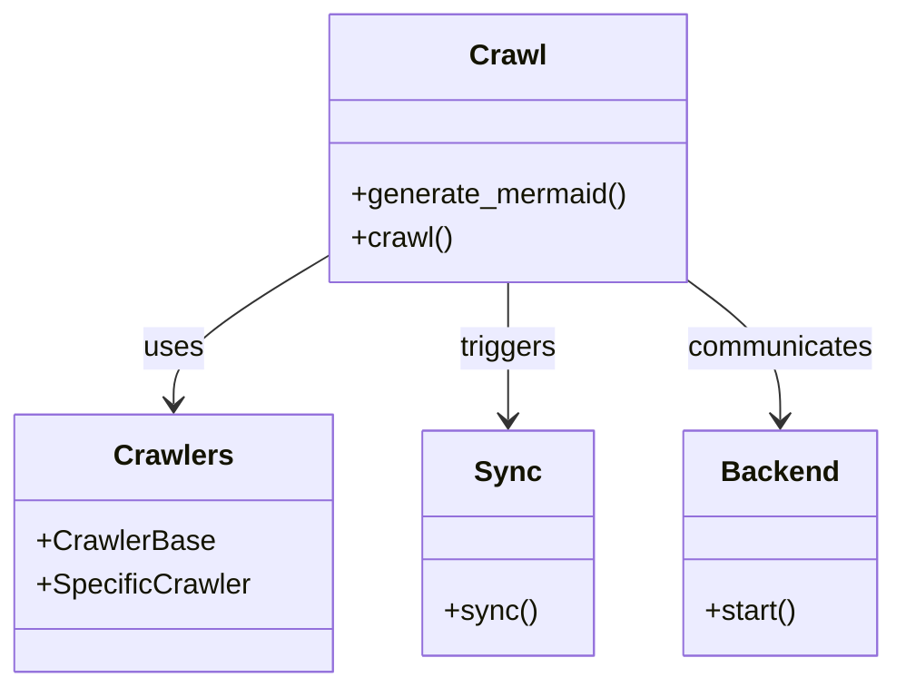

# Diagram: common/iam_service/config/config.qa2.yml

> Auto-generated by Obscura crawlers

## Mermaid

### SVG

<svg id="container" width="487.734375" xmlns="http://www.w3.org/2000/svg" class="classDiagram" height="384" viewBox="0 0 487.734375 384" role="graphics-document document" aria-roledescription="class"><g><defs><marker id="container_class-aggregationStart" class="marker aggregation class" refX="18" refY="7" markerWidth="190" markerHeight="240" orient="auto"><path d="M 18,7 L9,13 L1,7 L9,1 Z"></path></marker></defs><defs><marker id="container_class-aggregationEnd" class="marker aggregation class" refX="1" refY="7" markerWidth="20" markerHeight="28" orient="auto"><path d="M 18,7 L9,13 L1,7 L9,1 Z"></path></marker></defs><defs><marker id="container_class-extensionStart" class="marker extension class" refX="18" refY="7" markerWidth="190" markerHeight="240" orient="auto"><path d="M 1,7 L18,13 V 1 Z"></path></marker></defs><defs><marker id="container_class-extensionEnd" class="marker extension class" refX="1" refY="7" markerWidth="20" markerHeight="28" orient="auto"><path d="M 1,1 V 13 L18,7 Z"></path></marker></defs><defs><marker id="container_class-compositionStart" class="marker composition class" refX="18" refY="7" markerWidth="190" markerHeight="240" orient="auto"><path d="M 18,7 L9,13 L1,7 L9,1 Z"></path></marker></defs><defs><marker id="container_class-compositionEnd" class="marker composition class" refX="1" refY="7" markerWidth="20" markerHeight="28" orient="auto"><path d="M 18,7 L9,13 L1,7 L9,1 Z"></path></marker></defs><defs><marker id="container_class-dependencyStart" class="marker dependency class" refX="6" refY="7" markerWidth="190" markerHeight="240" orient="auto"><path d="M 5,7 L9,13 L1,7 L9,1 Z"></path></marker></defs><defs><marker id="container_class-dependencyEnd" class="marker dependency class" refX="13" refY="7" markerWidth="20" markerHeight="28" orient="auto"><path d="M 18,7 L9,13 L14,7 L9,1 Z"></path></marker></defs><defs><marker id="container_class-lollipopStart" class="marker lollipop class" refX="13" refY="7" markerWidth="190" markerHeight="240" orient="auto"><circle stroke="black" fill="transparent" cx="7" cy="7" r="6"></circle></marker></defs><defs><marker id="container_class-lollipopEnd" class="marker lollipop class" refX="1" refY="7" markerWidth="190" markerHeight="240" orient="auto"><circle stroke="black" fill="transparent" cx="7" cy="7" r="6"></circle></marker></defs><g class="root"><g class="clusters"></g><g class="edgePaths"><path d="M176.973,144.205L163.205,152.671C149.438,161.137,121.902,178.068,108.135,191.701C94.367,205.333,94.367,215.667,94.367,220.833L94.367,226" id="id_Crawl_Crawlers_1" class="edge-thickness-normal edge-pattern-solid relation" style=";;;" data-edge="true" data-et="edge" data-id="id_Crawl_Crawlers_1" data-points="W3sieCI6MTc2Ljk3MjY1NjI1LCJ5IjoxNDQuMjA1MTEyODA3NzU1fSx7IngiOjk0LjM2NzE4NzUsInkiOjE5NX0seyJ4Ijo5NC4zNjcxODc1LCJ5IjoyMzJ9XQ==" marker-end="url(#container_class-dependencyEnd)"></path><path d="M276.508,158L276.508,164.167C276.508,170.333,276.508,182.667,276.508,195.5C276.508,208.333,276.508,221.667,276.508,228.333L276.508,235" id="id_Crawl_Sync_2" class="edge-thickness-normal edge-pattern-solid relation" style=";;;" data-edge="true" data-et="edge" data-id="id_Crawl_Sync_2" data-points="W3sieCI6Mjc2LjUwNzgxMjUsInkiOjE1OH0seyJ4IjoyNzYuNTA3ODEyNSwieSI6MTk1fSx7IngiOjI3Ni41MDc4MTI1LCJ5IjoyNDF9XQ==" marker-end="url(#container_class-dependencyEnd)"></path><path d="M376.043,157.568L384.37,163.807C392.698,170.045,409.353,182.523,417.68,195.428C426.008,208.333,426.008,221.667,426.008,228.333L426.008,235" id="id_Crawl_Backend_3" class="edge-thickness-normal edge-pattern-solid relation" style=";;;" data-edge="true" data-et="edge" data-id="id_Crawl_Backend_3" data-points="W3sieCI6Mzc2LjA0Mjk2ODc1LCJ5IjoxNTcuNTY4MTQzODEyNzA5MDJ9LHsieCI6NDI2LjAwNzgxMjUsInkiOjE5NX0seyJ4Ijo0MjYuMDA3ODEyNSwieSI6MjQxfV0=" marker-end="url(#container_class-dependencyEnd)"></path></g><g class="edgeLabels"><g class="edgeLabel" transform="translate(94.3671875, 195)"><g class="label" data-id="id_Crawl_Crawlers_1" transform="translate(-16.4921875, -12)"><foreignObject width="32.984375" height="24">

uses

</foreignObject></g></g><g class="edgeLabel" transform="translate(276.5078125, 195)"><g class="label" data-id="id_Crawl_Sync_2" transform="translate(-27.4921875, -12)"><foreignObject width="54.984375" height="24">

triggers

</foreignObject></g></g><g class="edgeLabel" transform="translate(426.0078125, 195)"><g class="label" data-id="id_Crawl_Backend_3" transform="translate(-52.609375, -12)"><foreignObject width="105.21875" height="24">

communicates

</foreignObject></g></g></g><g class="nodes"><g class="node default" id="classId-Crawl-0" transform="translate(276.5078125, 83)"><g class="basic label-container"><path d="M-99.53515625 -75 L99.53515625 -75 L99.53515625 75 L-99.53515625 75" stroke="none" stroke-width="0" fill="#ECECFF" style=""></path><path d="M-99.53515625 -75 C-28.53611858310164 -75, 42.46291908379672 -75, 99.53515625 -75 M-99.53515625 -75 C-49.987162881032006 -75, -0.4391695120640122 -75, 99.53515625 -75 M99.53515625 -75 C99.53515625 -31.793374571610443, 99.53515625 11.413250856779115, 99.53515625 75 M99.53515625 -75 C99.53515625 -25.07349471332288, 99.53515625 24.85301057335424, 99.53515625 75 M99.53515625 75 C22.692320003077725 75, -54.15051624384455 75, -99.53515625 75 M99.53515625 75 C51.66869707667081 75, 3.80223790334162 75, -99.53515625 75 M-99.53515625 75 C-99.53515625 19.907189118972113, -99.53515625 -35.185621762055774, -99.53515625 -75 M-99.53515625 75 C-99.53515625 29.79462992256193, -99.53515625 -15.410740154876137, -99.53515625 -75" stroke="#9370DB" stroke-width="1.3" fill="none" stroke-dasharray="0 0" style=""></path></g><g class="annotation-group text" transform="translate(0, -51)"></g><g class="label-group text" transform="translate(-20.1484375, -51)"><g class="label" style="font-weight: bolder" transform="translate(0,-12)"><foreignObject width="40.296875" height="24">

Crawl

</foreignObject></g></g><g class="members-group text" transform="translate(-87.53515625, -3)"></g><g class="methods-group text" transform="translate(-87.53515625, 27)"><g class="label" style="" transform="translate(0,-12)"><foreignObject width="154.921875" height="24">

+generate_mermaid()

</foreignObject></g><g class="label" style="" transform="translate(0,12)"><foreignObject width="56.40625" height="24">

+crawl()

</foreignObject></g></g><g class="divider" style=""><path d="M-99.53515625 -27 C-27.011611169693566 -27, 45.51193391061287 -27, 99.53515625 -27 M-99.53515625 -27 C-32.05418182072357 -27, 35.42679260855286 -27, 99.53515625 -27" stroke="#9370DB" stroke-width="1.3" fill="none" stroke-dasharray="0 0" style=""></path></g><g class="divider" style=""><path d="M-99.53515625 -3 C-33.81050848827695 -3, 31.914139273446096 -3, 99.53515625 -3 M-99.53515625 -3 C-54.92416324744159 -3, -10.313170244883182 -3, 99.53515625 -3" stroke="#9370DB" stroke-width="1.3" fill="none" stroke-dasharray="0 0" style=""></path></g></g><g class="node default" id="classId-Crawlers-1" transform="translate(94.3671875, 304)"><g class="basic label-container"><path d="M-86.3671875 -72 L86.3671875 -72 L86.3671875 72 L-86.3671875 72" stroke="none" stroke-width="0" fill="#ECECFF" style=""></path><path d="M-86.3671875 -72 C-37.05612091290986 -72, 12.254945674180277 -72, 86.3671875 -72 M-86.3671875 -72 C-51.07694994139691 -72, -15.786712382793823 -72, 86.3671875 -72 M86.3671875 -72 C86.3671875 -21.283620354535834, 86.3671875 29.43275929092833, 86.3671875 72 M86.3671875 -72 C86.3671875 -32.946582838548004, 86.3671875 6.1068343229039925, 86.3671875 72 M86.3671875 72 C28.096989658983098 72, -30.173208182033804 72, -86.3671875 72 M86.3671875 72 C28.744494667958996 72, -28.878198164082008 72, -86.3671875 72 M-86.3671875 72 C-86.3671875 29.323951061819976, -86.3671875 -13.352097876360048, -86.3671875 -72 M-86.3671875 72 C-86.3671875 37.49122351756637, -86.3671875 2.9824470351327363, -86.3671875 -72" stroke="#9370DB" stroke-width="1.3" fill="none" stroke-dasharray="0 0" style=""></path></g><g class="annotation-group text" transform="translate(0, -48)"></g><g class="label-group text" transform="translate(-31.5, -48)"><g class="label" style="font-weight: bolder" transform="translate(0,-12)"><foreignObject width="63" height="24">

Crawlers

</foreignObject></g></g><g class="members-group text" transform="translate(-74.3671875, 0)"><g class="label" style="" transform="translate(0,-12)"><foreignObject width="96.390625" height="24">

+CrawlerBase

</foreignObject></g><g class="label" style="" transform="translate(0,12)"><foreignObject width="117.234375" height="24">

+SpecificCrawler

</foreignObject></g></g><g class="methods-group text" transform="translate(-74.3671875, 72)"></g><g class="divider" style=""><path d="M-86.3671875 -24 C-19.733411600005766 -24, 46.90036429998847 -24, 86.3671875 -24 M-86.3671875 -24 C-39.40351268499554 -24, 7.560162130008919 -24, 86.3671875 -24" stroke="#9370DB" stroke-width="1.3" fill="none" stroke-dasharray="0 0" style=""></path></g><g class="divider" style=""><path d="M-86.3671875 48 C-48.98219380693404 48, -11.597200113868084 48, 86.3671875 48 M-86.3671875 48 C-17.44624045876067 48, 51.47470658247866 48, 86.3671875 48" stroke="#9370DB" stroke-width="1.3" fill="none" stroke-dasharray="0 0" style=""></path></g></g><g class="node default" id="classId-Sync-2" transform="translate(276.5078125, 304)"><g class="basic label-container"><path d="M-45.7734375 -63 L45.7734375 -63 L45.7734375 63 L-45.7734375 63" stroke="none" stroke-width="0" fill="#ECECFF" style=""></path><path d="M-45.7734375 -63 C-11.127069936437294 -63, 23.51929762712541 -63, 45.7734375 -63 M-45.7734375 -63 C-9.52266990216328 -63, 26.72809769567344 -63, 45.7734375 -63 M45.7734375 -63 C45.7734375 -31.585354300834528, 45.7734375 -0.17070860166905533, 45.7734375 63 M45.7734375 -63 C45.7734375 -13.16941193771175, 45.7734375 36.6611761245765, 45.7734375 63 M45.7734375 63 C16.46776247114964 63, -12.837912557700719 63, -45.7734375 63 M45.7734375 63 C9.287453870723041 63, -27.198529758553917 63, -45.7734375 63 M-45.7734375 63 C-45.7734375 28.890857604419516, -45.7734375 -5.218284791160968, -45.7734375 -63 M-45.7734375 63 C-45.7734375 34.383879779438445, -45.7734375 5.767759558876882, -45.7734375 -63" stroke="#9370DB" stroke-width="1.3" fill="none" stroke-dasharray="0 0" style=""></path></g><g class="annotation-group text" transform="translate(0, -39)"></g><g class="label-group text" transform="translate(-17.09375, -39)"><g class="label" style="font-weight: bolder" transform="translate(0,-12)"><foreignObject width="34.1875" height="24">

Sync

</foreignObject></g></g><g class="members-group text" transform="translate(-33.7734375, 9)"></g><g class="methods-group text" transform="translate(-33.7734375, 39)"><g class="label" style="" transform="translate(0,-12)"><foreignObject width="50.453125" height="24">

+sync()

</foreignObject></g></g><g class="divider" style=""><path d="M-45.7734375 -15 C-18.66503356721028 -15, 8.44337036557944 -15, 45.7734375 -15 M-45.7734375 -15 C-12.301575225576975 -15, 21.17028704884605 -15, 45.7734375 -15" stroke="#9370DB" stroke-width="1.3" fill="none" stroke-dasharray="0 0" style=""></path></g><g class="divider" style=""><path d="M-45.7734375 9 C-15.821334955580639 9, 14.130767588838722 9, 45.7734375 9 M-45.7734375 9 C-17.867581661266147 9, 10.038274177467706 9, 45.7734375 9" stroke="#9370DB" stroke-width="1.3" fill="none" stroke-dasharray="0 0" style=""></path></g></g><g class="node default" id="classId-Backend-3" transform="translate(426.0078125, 304)"><g class="basic label-container"><path d="M-53.7265625 -63 L53.7265625 -63 L53.7265625 63 L-53.7265625 63" stroke="none" stroke-width="0" fill="#ECECFF" style=""></path><path d="M-53.7265625 -63 C-22.479701411309605 -63, 8.76715967738079 -63, 53.7265625 -63 M-53.7265625 -63 C-21.74190238990402 -63, 10.24275772019196 -63, 53.7265625 -63 M53.7265625 -63 C53.7265625 -33.0570708076377, 53.7265625 -3.1141416152754005, 53.7265625 63 M53.7265625 -63 C53.7265625 -27.08525003122503, 53.7265625 8.82949993754994, 53.7265625 63 M53.7265625 63 C18.575055050140357 63, -16.576452399719287 63, -53.7265625 63 M53.7265625 63 C17.097351299885318 63, -19.531859900229364 63, -53.7265625 63 M-53.7265625 63 C-53.7265625 28.179979230269502, -53.7265625 -6.640041539460995, -53.7265625 -63 M-53.7265625 63 C-53.7265625 17.25341654556791, -53.7265625 -28.493166908864183, -53.7265625 -63" stroke="#9370DB" stroke-width="1.3" fill="none" stroke-dasharray="0 0" style=""></path></g><g class="annotation-group text" transform="translate(0, -39)"></g><g class="label-group text" transform="translate(-31.296875, -39)"><g class="label" style="font-weight: bolder" transform="translate(0,-12)"><foreignObject width="62.59375" height="24">

Backend

</foreignObject></g></g><g class="members-group text" transform="translate(-41.7265625, 9)"></g><g class="methods-group text" transform="translate(-41.7265625, 39)"><g class="label" style="" transform="translate(0,-12)"><foreignObject width="52.15625" height="24">

+start()

</foreignObject></g></g><g class="divider" style=""><path d="M-53.7265625 -15 C-30.663906635708013 -15, -7.6012507714160265 -15, 53.7265625 -15 M-53.7265625 -15 C-25.75095455848504 -15, 2.224653383029917 -15, 53.7265625 -15" stroke="#9370DB" stroke-width="1.3" fill="none" stroke-dasharray="0 0" style=""></path></g><g class="divider" style=""><path d="M-53.7265625 9 C-14.967779372208796 9, 23.79100375558241 9, 53.7265625 9 M-53.7265625 9 C-17.171569447223646 9, 19.383423605552707 9, 53.7265625 9" stroke="#9370DB" stroke-width="1.3" fill="none" stroke-dasharray="0 0" style=""></path></g></g></g></g></g></svg>
