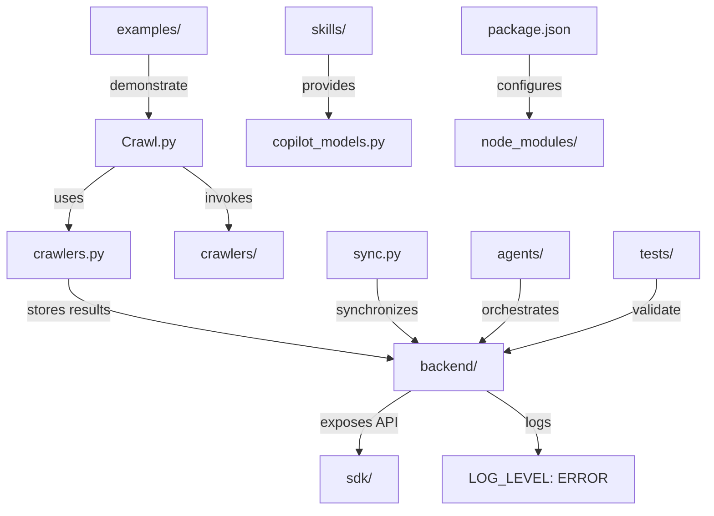

# Diagram: common/iam_service/config/config.test.yml

> Auto-generated by Obscura crawlers

## Mermaid

### SVG

<svg id="container" width="818.671875" xmlns="http://www.w3.org/2000/svg" class="flowchart" height="582" viewBox="0 0 818.671875 582" role="graphics-document document" aria-roledescription="flowchart-v2"><g><marker id="container_flowchart-v2-pointEnd" class="marker flowchart-v2" viewBox="0 0 10 10" refX="5" refY="5" markerUnits="userSpaceOnUse" markerWidth="8" markerHeight="8" orient="auto"><path d="M 0 0 L 10 5 L 0 10 z" class="arrowMarkerPath" style="stroke-width: 1; stroke-dasharray: 1, 0;"></path></marker><marker id="container_flowchart-v2-pointStart" class="marker flowchart-v2" viewBox="0 0 10 10" refX="4.5" refY="5" markerUnits="userSpaceOnUse" markerWidth="8" markerHeight="8" orient="auto"><path d="M 0 5 L 10 10 L 10 0 z" class="arrowMarkerPath" style="stroke-width: 1; stroke-dasharray: 1, 0;"></path></marker><marker id="container_flowchart-v2-circleEnd" class="marker flowchart-v2" viewBox="0 0 10 10" refX="11" refY="5" markerUnits="userSpaceOnUse" markerWidth="11" markerHeight="11" orient="auto"><circle cx="5" cy="5" r="5" class="arrowMarkerPath" style="stroke-width: 1; stroke-dasharray: 1, 0;"></circle></marker><marker id="container_flowchart-v2-circleStart" class="marker flowchart-v2" viewBox="0 0 10 10" refX="-1" refY="5" markerUnits="userSpaceOnUse" markerWidth="11" markerHeight="11" orient="auto"><circle cx="5" cy="5" r="5" class="arrowMarkerPath" style="stroke-width: 1; stroke-dasharray: 1, 0;"></circle></marker><marker id="container_flowchart-v2-crossEnd" class="marker cross flowchart-v2" viewBox="0 0 11 11" refX="12" refY="5.2" markerUnits="userSpaceOnUse" markerWidth="11" markerHeight="11" orient="auto"><path d="M 1,1 l 9,9 M 10,1 l -9,9" class="arrowMarkerPath" style="stroke-width: 2; stroke-dasharray: 1, 0;"></path></marker><marker id="container_flowchart-v2-crossStart" class="marker cross flowchart-v2" viewBox="0 0 11 11" refX="-1" refY="5.2" markerUnits="userSpaceOnUse" markerWidth="11" markerHeight="11" orient="auto"><path d="M 1,1 l 9,9 M 10,1 l -9,9" class="arrowMarkerPath" style="stroke-width: 2; stroke-dasharray: 1, 0;"></path></marker><g class="root"><g class="clusters"></g><g class="edgePaths"><path d="M132.054,190L123.149,196.167C114.244,202.333,96.435,214.667,87.53,226.333C78.625,238,78.625,249,78.625,254.5L78.625,260" id="L_CrawlPy_CrawlersPy_0" class="edge-thickness-normal edge-pattern-solid edge-thickness-normal edge-pattern-solid flowchart-link" style=";" data-edge="true" data-et="edge" data-id="L_CrawlPy_CrawlersPy_0" data-points="W3sieCI6MTMyLjA1NDEzODE4MzU5Mzc1LCJ5IjoxOTB9LHsieCI6NzguNjI1LCJ5IjoyMjd9LHsieCI6NzguNjI1LCJ5IjoyNjR9XQ==" marker-end="url(#container_flowchart-v2-pointEnd)"></path><path d="M210.032,190L218.937,196.167C227.842,202.333,245.651,214.667,254.556,226.333C263.461,238,263.461,249,263.461,254.5L263.461,260" id="L_CrawlPy_CrawlersDir_0" class="edge-thickness-normal edge-pattern-solid edge-thickness-normal edge-pattern-solid flowchart-link" style=";" data-edge="true" data-et="edge" data-id="L_CrawlPy_CrawlersDir_0" data-points="W3sieCI6MjEwLjAzMTc5OTMxNjQwNjI1LCJ5IjoxOTB9LHsieCI6MjYzLjQ2MDkzNzUsInkiOjIyN30seyJ4IjoyNjMuNDYwOTM3NSwieSI6MjY0fV0=" marker-end="url(#container_flowchart-v2-pointEnd)"></path><path d="M78.625,318L78.625,324.167C78.625,330.333,78.625,342.667,140.185,357.825C201.744,372.983,324.864,390.965,386.424,399.956L447.983,408.948" id="L_CrawlersPy_Backend_0" class="edge-thickness-normal edge-pattern-solid edge-thickness-normal edge-pattern-solid flowchart-link" style=";" data-edge="true" data-et="edge" data-id="L_CrawlersPy_Backend_0" data-points="W3sieCI6NzguNjI1LCJ5IjozMTh9LHsieCI6NzguNjI1LCJ5IjozNTV9LHsieCI6NDUxLjk0MTQwNjI1LCJ5Ijo0MDkuNTI1NjYwNzk3ODYwNX1d" marker-end="url(#container_flowchart-v2-pointEnd)"></path><path d="M475.796,446L466.429,452.167C457.062,458.333,438.328,470.667,428.961,482.333C419.594,494,419.594,505,419.594,510.5L419.594,516" id="L_Backend_SDK_0" class="edge-thickness-normal edge-pattern-solid edge-thickness-normal edge-pattern-solid flowchart-link" style=";" data-edge="true" data-et="edge" data-id="L_Backend_SDK_0" data-points="W3sieCI6NDc1Ljc5NjA4MTU0Mjk2ODc1LCJ5Ijo0NDZ9LHsieCI6NDE5LjU5Mzc1LCJ5Ijo0ODN9LHsieCI6NDE5LjU5Mzc1LCJ5Ijo1MjB9XQ==" marker-end="url(#container_flowchart-v2-pointEnd)"></path><path d="M434.383,318L434.383,324.167C434.383,330.333,434.383,342.667,441.798,354.591C449.214,366.516,464.045,378.031,471.46,383.789L478.876,389.547" id="L_SyncPy_Backend_0" class="edge-thickness-normal edge-pattern-solid edge-thickness-normal edge-pattern-solid flowchart-link" style=";" data-edge="true" data-et="edge" data-id="L_SyncPy_Backend_0" data-points="W3sieCI6NDM0LjM4MjgxMjUsInkiOjMxOH0seyJ4Ijo0MzQuMzgyODEyNSwieSI6MzU1fSx7IngiOjQ4Mi4wMzUyMTcyODUxNTYyNSwieSI6MzkyfV0=" marker-end="url(#container_flowchart-v2-pointEnd)"></path><path d="M599.234,318L599.234,324.167C599.234,330.333,599.234,342.667,591.819,354.591C584.403,366.516,569.572,378.031,562.157,383.789L554.741,389.547" id="L_Agents_Backend_0" class="edge-thickness-normal edge-pattern-solid edge-thickness-normal edge-pattern-solid flowchart-link" style=";" data-edge="true" data-et="edge" data-id="L_Agents_Backend_0" data-points="W3sieCI6NTk5LjIzNDM3NSwieSI6MzE4fSx7IngiOjU5OS4yMzQzNzUsInkiOjM1NX0seyJ4Ijo1NTEuNTgxOTcwMjE0ODQzOCwieSI6MzkyfV0=" marker-end="url(#container_flowchart-v2-pointEnd)"></path><path d="M377.918,62L377.918,68.167C377.918,74.333,377.918,86.667,377.918,98.333C377.918,110,377.918,121,377.918,126.5L377.918,132" id="L_Skills_CopilotModels_0" class="edge-thickness-normal edge-pattern-solid edge-thickness-normal edge-pattern-solid flowchart-link" style=";" data-edge="true" data-et="edge" data-id="L_Skills_CopilotModels_0" data-points="W3sieCI6Mzc3LjkxNzk2ODc1LCJ5Ijo2Mn0seyJ4IjozNzcuOTE3OTY4NzUsInkiOjk5fSx7IngiOjM3Ny45MTc5Njg3NSwieSI6MTM2fV0=" marker-end="url(#container_flowchart-v2-pointEnd)"></path><path d="M171.043,62L171.043,68.167C171.043,74.333,171.043,86.667,171.043,98.333C171.043,110,171.043,121,171.043,126.5L171.043,132" id="L_Examples_CrawlPy_0" class="edge-thickness-normal edge-pattern-solid edge-thickness-normal edge-pattern-solid flowchart-link" style=";" data-edge="true" data-et="edge" data-id="L_Examples_CrawlPy_0" data-points="W3sieCI6MTcxLjA0Mjk2ODc1LCJ5Ijo2Mn0seyJ4IjoxNzEuMDQyOTY4NzUsInkiOjk5fSx7IngiOjE3MS4wNDI5Njg3NSwieSI6MTM2fV0=" marker-end="url(#container_flowchart-v2-pointEnd)"></path><path d="M759.023,318L759.023,324.167C759.023,330.333,759.023,342.667,730.11,356.473C701.197,370.279,643.37,385.559,614.456,393.199L585.543,400.838" id="L_Tests_Backend_0" class="edge-thickness-normal edge-pattern-solid edge-thickness-normal edge-pattern-solid flowchart-link" style=";" data-edge="true" data-et="edge" data-id="L_Tests_Backend_0" data-points="W3sieCI6NzU5LjAyMzQzNzUsInkiOjMxOH0seyJ4Ijo3NTkuMDIzNDM3NSwieSI6MzU1fSx7IngiOjU4MS42NzU3ODEyNSwieSI6NDAxLjg2MDI1NzcxMjgzODg2fV0=" marker-end="url(#container_flowchart-v2-pointEnd)"></path><path d="M612.66,62L612.66,68.167C612.66,74.333,612.66,86.667,612.66,98.333C612.66,110,612.66,121,612.66,126.5L612.66,132" id="L_packageJson_NodeModules_0" class="edge-thickness-normal edge-pattern-solid edge-thickness-normal edge-pattern-solid flowchart-link" style=";" data-edge="true" data-et="edge" data-id="L_packageJson_NodeModules_0" data-points="W3sieCI6NjEyLjY2MDE1NjI1LCJ5Ijo2Mn0seyJ4Ijo2MTIuNjYwMTU2MjUsInkiOjk5fSx7IngiOjYxMi42NjAxNTYyNSwieSI6MTM2fV0=" marker-end="url(#container_flowchart-v2-pointEnd)"></path><path d="M557.821,446L567.188,452.167C576.555,458.333,595.289,470.667,604.656,482.333C614.023,494,614.023,505,614.023,510.5L614.023,516" id="L_Backend_Logs_0" class="edge-thickness-normal edge-pattern-solid edge-thickness-normal edge-pattern-solid flowchart-link" style=";" data-edge="true" data-et="edge" data-id="L_Backend_Logs_0" data-points="W3sieCI6NTU3LjgyMTEwNTk1NzAzMTIsInkiOjQ0Nn0seyJ4Ijo2MTQuMDIzNDM3NSwieSI6NDgzfSx7IngiOjYxNC4wMjM0Mzc1LCJ5Ijo1MjB9XQ==" marker-end="url(#container_flowchart-v2-pointEnd)"></path></g><g class="edgeLabels"><g class="edgeLabel" transform="translate(78.625, 227)"><g class="label" data-id="L_CrawlPy_CrawlersPy_0" transform="translate(-16.4921875, -12)"><foreignObject width="32.984375" height="24">

uses

</foreignObject></g></g><g class="edgeLabel" transform="translate(263.4609375, 227)"><g class="label" data-id="L_CrawlPy_CrawlersDir_0" transform="translate(-27.5859375, -12)"><foreignObject width="55.171875" height="24">

invokes

</foreignObject></g></g><g class="edgeLabel" transform="translate(78.625, 355)"><g class="label" data-id="L_CrawlersPy_Backend_0" transform="translate(-48.8125, -12)"><foreignObject width="97.625" height="24">

stores results

</foreignObject></g></g><g class="edgeLabel" transform="translate(419.59375, 483)"><g class="label" data-id="L_Backend_SDK_0" transform="translate(-43.140625, -12)"><foreignObject width="86.28125" height="24">

exposes API

</foreignObject></g></g><g class="edgeLabel" transform="translate(434.3828125, 355)"><g class="label" data-id="L_SyncPy_Backend_0" transform="translate(-46.7421875, -12)"><foreignObject width="93.484375" height="24">

synchronizes

</foreignObject></g></g><g class="edgeLabel" transform="translate(599.234375, 355)"><g class="label" data-id="L_Agents_Backend_0" transform="translate(-45.046875, -12)"><foreignObject width="90.09375" height="24">

orchestrates

</foreignObject></g></g><g class="edgeLabel" transform="translate(377.91796875, 99)"><g class="label" data-id="L_Skills_CopilotModels_0" transform="translate(-31.3125, -12)"><foreignObject width="62.625" height="24">

provides

</foreignObject></g></g><g class="edgeLabel" transform="translate(171.04296875, 99)"><g class="label" data-id="L_Examples_CrawlPy_0" transform="translate(-46.2734375, -12)"><foreignObject width="92.546875" height="24">

demonstrate

</foreignObject></g></g><g class="edgeLabel" transform="translate(759.0234375, 355)"><g class="label" data-id="L_Tests_Backend_0" transform="translate(-28.9453125, -12)"><foreignObject width="57.890625" height="24">

validate

</foreignObject></g></g><g class="edgeLabel" transform="translate(612.66015625, 99)"><g class="label" data-id="L_packageJson_NodeModules_0" transform="translate(-37.3046875, -12)"><foreignObject width="74.609375" height="24">

configures

</foreignObject></g></g><g class="edgeLabel" transform="translate(614.0234375, 483)"><g class="label" data-id="L_Backend_Logs_0" transform="translate(-14.8203125, -12)"><foreignObject width="29.640625" height="24">

logs

</foreignObject></g></g></g><g class="nodes"><g class="node default" id="flowchart-CrawlPy-0" transform="translate(171.04296875, 163)"><rect class="basic label-container" style="" x="-60.171875" y="-27" width="120.34375" height="54"></rect><g class="label" style="" transform="translate(-30.171875, -12)"><rect></rect><foreignObject width="60.34375" height="24">

Crawl.py

</foreignObject></g></g><g class="node default" id="flowchart-CrawlersPy-1" transform="translate(78.625, 291)"><rect class="basic label-container" style="" x="-70.625" y="-27" width="141.25" height="54"></rect><g class="label" style="" transform="translate(-40.625, -12)"><rect></rect><foreignObject width="81.25" height="24">

crawlers.py

</foreignObject></g></g><g class="node default" id="flowchart-CrawlersDir-3" transform="translate(263.4609375, 291)"><rect class="basic label-container" style="" x="-64.2109375" y="-27" width="128.421875" height="54"></rect><g class="label" style="" transform="translate(-34.2109375, -12)"><rect></rect><foreignObject width="68.421875" height="24">

crawlers/

</foreignObject></g></g><g class="node default" id="flowchart-Backend-5" transform="translate(516.80859375, 419)"><rect class="basic label-container" style="" x="-64.8671875" y="-27" width="129.734375" height="54"></rect><g class="label" style="" transform="translate(-34.8671875, -12)"><rect></rect><foreignObject width="69.734375" height="24">

backend/

</foreignObject></g></g><g class="node default" id="flowchart-SDK-7" transform="translate(419.59375, 547)"><rect class="basic label-container" style="" x="-46.78125" y="-27" width="93.5625" height="54"></rect><g class="label" style="" transform="translate(-16.78125, -12)"><rect></rect><foreignObject width="33.5625" height="24">

sdk/

</foreignObject></g></g><g class="node default" id="flowchart-SyncPy-8" transform="translate(434.3828125, 291)"><rect class="basic label-container" style="" x="-56.7109375" y="-27" width="113.421875" height="54"></rect><g class="label" style="" transform="translate(-26.7109375, -12)"><rect></rect><foreignObject width="53.421875" height="24">

sync.py

</foreignObject></g></g><g class="node default" id="flowchart-Agents-10" transform="translate(599.234375, 291)"><rect class="basic label-container" style="" x="-58.140625" y="-27" width="116.28125" height="54"></rect><g class="label" style="" transform="translate(-28.140625, -12)"><rect></rect><foreignObject width="56.28125" height="24">

agents/

</foreignObject></g></g><g class="node default" id="flowchart-Skills-12" transform="translate(377.91796875, 35)"><rect class="basic label-container" style="" x="-52.6796875" y="-27" width="105.359375" height="54"></rect><g class="label" style="" transform="translate(-22.6796875, -12)"><rect></rect><foreignObject width="45.359375" height="24">

skills/

</foreignObject></g></g><g class="node default" id="flowchart-CopilotModels-13" transform="translate(377.91796875, 163)"><rect class="basic label-container" style="" x="-96.703125" y="-27" width="193.40625" height="54"></rect><g class="label" style="" transform="translate(-66.703125, -12)"><rect></rect><foreignObject width="133.40625" height="24">

copilot_models.py

</foreignObject></g></g><g class="node default" id="flowchart-Examples-14" transform="translate(171.04296875, 35)"><rect class="basic label-container" style="" x="-68.5703125" y="-27" width="137.140625" height="54"></rect><g class="label" style="" transform="translate(-38.5703125, -12)"><rect></rect><foreignObject width="77.140625" height="24">

examples/

</foreignObject></g></g><g class="node default" id="flowchart-Tests-16" transform="translate(759.0234375, 291)"><rect class="basic label-container" style="" x="-51.6484375" y="-27" width="103.296875" height="54"></rect><g class="label" style="" transform="translate(-21.6484375, -12)"><rect></rect><foreignObject width="43.296875" height="24">

tests/

</foreignObject></g></g><g class="node default" id="flowchart-packageJson-18" transform="translate(612.66015625, 35)"><rect class="basic label-container" style="" x="-76.671875" y="-27" width="153.34375" height="54"></rect><g class="label" style="" transform="translate(-46.671875, -12)"><rect></rect><foreignObject width="93.34375" height="24">

package.json

</foreignObject></g></g><g class="node default" id="flowchart-NodeModules-19" transform="translate(612.66015625, 163)"><rect class="basic label-container" style="" x="-88.0390625" y="-27" width="176.078125" height="54"></rect><g class="label" style="" transform="translate(-58.0390625, -12)"><rect></rect><foreignObject width="116.078125" height="24">

node_modules/

</foreignObject></g></g><g class="node default" id="flowchart-Logs-21" transform="translate(614.0234375, 547)"><rect class="basic label-container" style="" x="-97.6484375" y="-27" width="195.296875" height="54"></rect><g class="label" style="" transform="translate(-67.6484375, -12)"><rect></rect><foreignObject width="135.296875" height="24">

LOG_LEVEL: ERROR

</foreignObject></g></g></g></g></g></svg>
