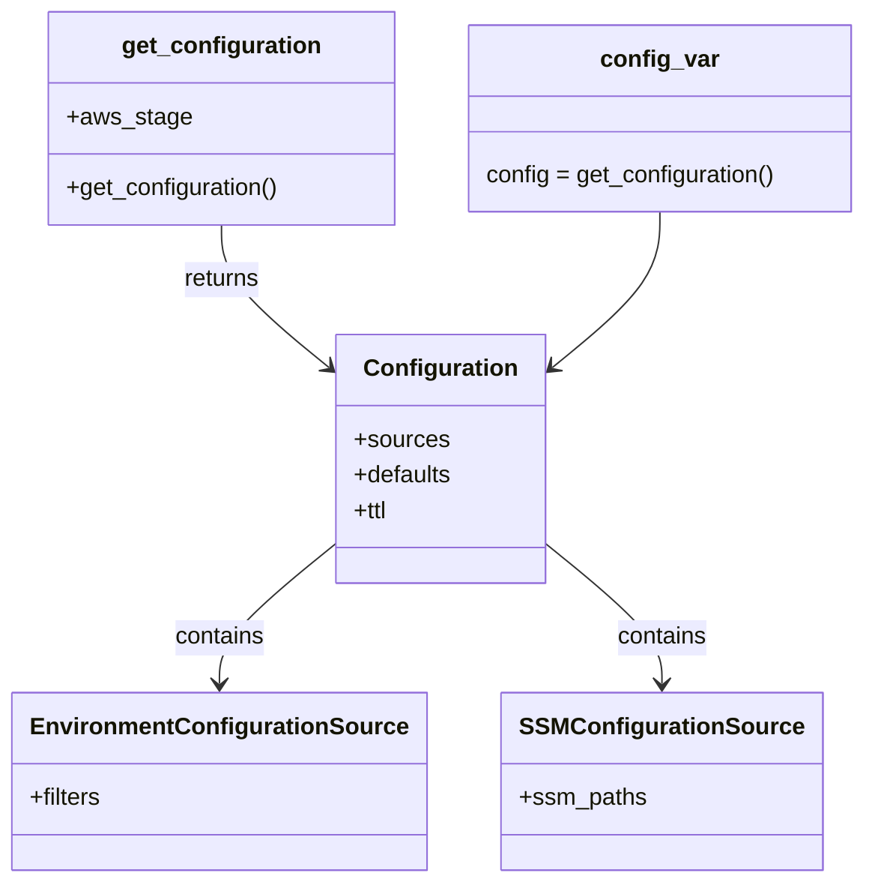

# Diagram: common/iam_service/iam_service/v1/config.py


> Auto-generated by Obscura crawlers

## Diagram 1



### SVG

<svg id="container" width="567.74609375" xmlns="http://www.w3.org/2000/svg" class="classDiagram" height="596" viewBox="0 0 567.74609375 596" role="graphics-document document" aria-roledescription="class"><style>#container{font-family:"trebuchet ms",verdana,arial,sans-serif;font-size:16px;fill:#333;}@keyframes edge-animation-frame{from{stroke-dashoffset:0;}}@keyframes dash{to{stroke-dashoffset:0;}}#container .edge-animation-slow{stroke-dasharray:9,5!important;stroke-dashoffset:900;animation:dash 50s linear infinite;stroke-linecap:round;}#container .edge-animation-fast{stroke-dasharray:9,5!important;stroke-dashoffset:900;animation:dash 20s linear infinite;stroke-linecap:round;}#container .error-icon{fill:#552222;}#container .error-text{fill:#552222;stroke:#552222;}#container .edge-thickness-normal{stroke-width:1px;}#container .edge-thickness-thick{stroke-width:3.5px;}#container .edge-pattern-solid{stroke-dasharray:0;}#container .edge-thickness-invisible{stroke-width:0;fill:none;}#container .edge-pattern-dashed{stroke-dasharray:3;}#container .edge-pattern-dotted{stroke-dasharray:2;}#container .marker{fill:#333333;stroke:#333333;}#container .marker.cross{stroke:#333333;}#container svg{font-family:"trebuchet ms",verdana,arial,sans-serif;font-size:16px;}#container p{margin:0;}#container g.classGroup text{fill:#9370DB;stroke:none;font-family:"trebuchet ms",verdana,arial,sans-serif;font-size:10px;}#container g.classGroup text .title{font-weight:bolder;}#container .nodeLabel,#container .edgeLabel{color:#131300;}#container .edgeLabel .label rect{fill:#ECECFF;}#container .label text{fill:#131300;}#container .labelBkg{background:#ECECFF;}#container .edgeLabel .label span{background:#ECECFF;}#container .classTitle{font-weight:bolder;}#container .node rect,#container .node circle,#container .node ellipse,#container .node polygon,#container .node path{fill:#ECECFF;stroke:#9370DB;stroke-width:1px;}#container .divider{stroke:#9370DB;stroke-width:1;}#container g.clickable{cursor:pointer;}#container g.classGroup rect{fill:#ECECFF;stroke:#9370DB;}#container g.classGroup line{stroke:#9370DB;stroke-width:1;}#container .classLabel .box{stroke:none;stroke-width:0;fill:#ECECFF;opacity:0.5;}#container .classLabel .label{fill:#9370DB;font-size:10px;}#container .relation{stroke:#333333;stroke-width:1;fill:none;}#container .dashed-line{stroke-dasharray:3;}#container .dotted-line{stroke-dasharray:1 2;}#container #compositionStart,#container .composition{fill:#333333!important;stroke:#333333!important;stroke-width:1;}#container #compositionEnd,#container .composition{fill:#333333!important;stroke:#333333!important;stroke-width:1;}#container #dependencyStart,#container .dependency{fill:#333333!important;stroke:#333333!important;stroke-width:1;}#container #dependencyStart,#container .dependency{fill:#333333!important;stroke:#333333!important;stroke-width:1;}#container #extensionStart,#container .extension{fill:transparent!important;stroke:#333333!important;stroke-width:1;}#container #extensionEnd,#container .extension{fill:transparent!important;stroke:#333333!important;stroke-width:1;}#container #aggregationStart,#container .aggregation{fill:transparent!important;stroke:#333333!important;stroke-width:1;}#container #aggregationEnd,#container .aggregation{fill:transparent!important;stroke:#333333!important;stroke-width:1;}#container #lollipopStart,#container .lollipop{fill:#ECECFF!important;stroke:#333333!important;stroke-width:1;}#container #lollipopEnd,#container .lollipop{fill:#ECECFF!important;stroke:#333333!important;stroke-width:1;}#container .edgeTerminals{font-size:11px;line-height:initial;}#container .classTitleText{text-anchor:middle;font-size:18px;fill:#333;}#container .label-icon{display:inline-block;height:1em;overflow:visible;vertical-align:-0.125em;}#container .node .label-icon path{fill:currentColor;stroke:revert;stroke-width:revert;}#container :root{--mermaid-font-family:"trebuchet ms",verdana,arial,sans-serif;}</style><g><defs><marker id="container_class-aggregationStart" class="marker aggregation class" refX="18" refY="7" markerWidth="190" markerHeight="240" orient="auto"><path d="M 18,7 L9,13 L1,7 L9,1 Z"></path></marker></defs><defs><marker id="container_class-aggregationEnd" class="marker aggregation class" refX="1" refY="7" markerWidth="20" markerHeight="28" orient="auto"><path d="M 18,7 L9,13 L1,7 L9,1 Z"></path></marker></defs><defs><marker id="container_class-extensionStart" class="marker extension class" refX="18" refY="7" markerWidth="190" markerHeight="240" orient="auto"><path d="M 1,7 L18,13 V 1 Z"></path></marker></defs><defs><marker id="container_class-extensionEnd" class="marker extension class" refX="1" refY="7" markerWidth="20" markerHeight="28" orient="auto"><path d="M 1,1 V 13 L18,7 Z"></path></marker></defs><defs><marker id="container_class-compositionStart" class="marker composition class" refX="18" refY="7" markerWidth="190" markerHeight="240" orient="auto"><path d="M 18,7 L9,13 L1,7 L9,1 Z"></path></marker></defs><defs><marker id="container_class-compositionEnd" class="marker composition class" refX="1" refY="7" markerWidth="20" markerHeight="28" orient="auto"><path d="M 18,7 L9,13 L1,7 L9,1 Z"></path></marker></defs><defs><marker id="container_class-dependencyStart" class="marker dependency class" refX="6" refY="7" markerWidth="190" markerHeight="240" orient="auto"><path d="M 5,7 L9,13 L1,7 L9,1 Z"></path></marker></defs><defs><marker id="container_class-dependencyEnd" class="marker dependency class" refX="13" refY="7" markerWidth="20" markerHeight="28" orient="auto"><path d="M 18,7 L9,13 L14,7 L9,1 Z"></path></marker></defs><defs><marker id="container_class-lollipopStart" class="marker lollipop class" refX="13" refY="7" markerWidth="190" markerHeight="240" orient="auto"><circle stroke="black" fill="transparent" cx="7" cy="7" r="6"></circle></marker></defs><defs><marker id="container_class-lollipopEnd" class="marker lollipop class" refX="1" refY="7" markerWidth="190" markerHeight="240" orient="auto"><circle stroke="black" fill="transparent" cx="7" cy="7" r="6"></circle></marker></defs><g class="root"><g class="clusters"></g><g class="edgePaths"><path d="M134.387,152L134.387,158.167C134.387,164.333,134.387,176.667,146.562,192.788C158.738,208.908,183.089,228.817,195.265,238.771L207.441,248.725" id="id_get_configuration_Configuration_1" class="edge-thickness-normal edge-pattern-solid relation" style=";;;" data-edge="true" data-et="edge" data-id="id_get_configuration_Configuration_1" data-points="W3sieCI6MTM0LjM4NjcxODc1LCJ5IjoxNTJ9LHsieCI6MTM0LjM4NjcxODc1LCJ5IjoxODl9LHsieCI6MjEyLjA4NTkzNzUsInkiOjI1Mi41MjI2ODQ2ODQyMDkxNH1d" marker-end="url(#container_class-dependencyEnd)"></path><path d="M212.086,369.931L200.146,380.109C188.206,390.287,164.326,410.644,152.385,425.988C140.445,441.333,140.445,451.667,140.445,456.833L140.445,462" id="id_Configuration_EnvironmentConfigurationSource_2" class="edge-thickness-normal edge-pattern-solid relation" style=";;;" data-edge="true" data-et="edge" data-id="id_Configuration_EnvironmentConfigurationSource_2" data-points="W3sieCI6MjEyLjA4NTkzNzUsInkiOjM2OS45MzA1OTYwNzAyMjk1fSx7IngiOjE0MC40NDUzMTI1LCJ5Ijo0MzF9LHsieCI6MTQwLjQ0NTMxMjUsInkiOjQ2OH1d" marker-end="url(#container_class-dependencyEnd)"></path><path d="M352.695,369.931L364.635,380.109C376.576,390.287,400.456,410.644,412.396,425.988C424.336,441.333,424.336,451.667,424.336,456.833L424.336,462" id="id_Configuration_SSMConfigurationSource_3" class="edge-thickness-normal edge-pattern-solid relation" style=";;;" data-edge="true" data-et="edge" data-id="id_Configuration_SSMConfigurationSource_3" data-points="W3sieCI6MzUyLjY5NTMxMjUsInkiOjM2OS45MzA1OTYwNzAyMjk1fSx7IngiOjQyNC4zMzU5Mzc1LCJ5Ijo0MzF9LHsieCI6NDI0LjMzNTkzNzUsInkiOjQ2OH1d" marker-end="url(#container_class-dependencyEnd)"></path><path d="M430.395,143L430.395,150.667C430.395,158.333,430.395,173.667,418.219,191.288C406.043,208.908,381.692,228.817,369.516,238.771L357.341,248.725" id="id_config_var_Configuration_4" class="edge-thickness-normal edge-pattern-solid relation" style=";;;" data-edge="true" data-et="edge" data-id="id_config_var_Configuration_4" data-points="W3sieCI6NDMwLjM5NDUzMTI1LCJ5IjoxNDN9LHsieCI6NDMwLjM5NDUzMTI1LCJ5IjoxODl9LHsieCI6MzUyLjY5NTMxMjUsInkiOjI1Mi41MjI2ODQ2ODQyMDkxNH1d" marker-end="url(#container_class-dependencyEnd)"></path></g><g class="edgeLabels"><g class="edgeLabel" transform="translate(134.38671875, 189)"><g class="label" data-id="id_get_configuration_Configuration_1" transform="translate(-26.265625, -12)"><foreignObject width="52.53125" height="24"><div xmlns="http://www.w3.org/1999/xhtml" class="labelBkg" style="display: table-cell; white-space: nowrap; line-height: 1.5; max-width: 200px; text-align: center;"><span class="edgeLabel"><p>returns</p></span></div></foreignObject></g></g><g class="edgeLabel" transform="translate(140.4453125, 431)"><g class="label" data-id="id_Configuration_EnvironmentConfigurationSource_2" transform="translate(-30.890625, -12)"><foreignObject width="61.78125" height="24"><div xmlns="http://www.w3.org/1999/xhtml" class="labelBkg" style="display: table-cell; white-space: nowrap; line-height: 1.5; max-width: 200px; text-align: center;"><span class="edgeLabel"><p>contains</p></span></div></foreignObject></g></g><g class="edgeLabel" transform="translate(424.3359375, 431)"><g class="label" data-id="id_Configuration_SSMConfigurationSource_3" transform="translate(-30.890625, -12)"><foreignObject width="61.78125" height="24"><div xmlns="http://www.w3.org/1999/xhtml" class="labelBkg" style="display: table-cell; white-space: nowrap; line-height: 1.5; max-width: 200px; text-align: center;"><span class="edgeLabel"><p>contains</p></span></div></foreignObject></g></g><g class="edgeLabel"><g class="label" data-id="id_config_var_Configuration_4" transform="translate(0, 0)"><foreignObject width="0" height="0"><div xmlns="http://www.w3.org/1999/xhtml" class="labelBkg" style="display: table-cell; white-space: nowrap; line-height: 1.5; max-width: 200px; text-align: center;"><span class="edgeLabel"></span></div></foreignObject></g></g></g><g class="nodes"><g class="node default" id="classId-get_configuration-0" transform="translate(134.38671875, 80)"><g class="basic label-container"><path d="M-116.65625 -72 L116.65625 -72 L116.65625 72 L-116.65625 72" stroke="none" stroke-width="0" fill="#ECECFF" style=""></path><path d="M-116.65625 -72 C-28.25674792596051 -72, 60.14275414807898 -72, 116.65625 -72 M-116.65625 -72 C-30.00416005568924 -72, 56.64792988862152 -72, 116.65625 -72 M116.65625 -72 C116.65625 -43.1904369539258, 116.65625 -14.380873907851594, 116.65625 72 M116.65625 -72 C116.65625 -31.260076883516447, 116.65625 9.479846232967105, 116.65625 72 M116.65625 72 C46.07065849271777 72, -24.514933014564463 72, -116.65625 72 M116.65625 72 C49.969171802705844 72, -16.71790639458831 72, -116.65625 72 M-116.65625 72 C-116.65625 20.6522604809239, -116.65625 -30.6954790381522, -116.65625 -72 M-116.65625 72 C-116.65625 22.228705202645166, -116.65625 -27.542589594709668, -116.65625 -72" stroke="#9370DB" stroke-width="1.3" fill="none" stroke-dasharray="0 0" style=""></path></g><g class="annotation-group text" transform="translate(0, -48)"></g><g class="label-group text" transform="translate(-64.34375, -48)"><g class="label" style="font-weight: bolder" transform="translate(0,-12)"><foreignObject width="128.6875" height="24"><div xmlns="http://www.w3.org/1999/xhtml" style="display: table-cell; white-space: nowrap; line-height: 1.5; max-width: 177px; text-align: center;"><span class="nodeLabel markdown-node-label" style=""><p>get_configuration</p></span></div></foreignObject></g></g><g class="members-group text" transform="translate(-104.65625, 0)"><g class="label" style="" transform="translate(0,-12)"><foreignObject width="81.78125" height="24"><div xmlns="http://www.w3.org/1999/xhtml" style="display: table-cell; white-space: nowrap; line-height: 1.5; max-width: 139px; text-align: center;"><span class="nodeLabel markdown-node-label" style=""><p>+aws_stage</p></span></div></foreignObject></g></g><g class="methods-group text" transform="translate(-104.65625, 48)"><g class="label" style="" transform="translate(0,-12)"><foreignObject width="144.96875" height="24"><div xmlns="http://www.w3.org/1999/xhtml" style="display: table-cell; white-space: nowrap; line-height: 1.5; max-width: 202px; text-align: center;"><span class="nodeLabel markdown-node-label" style=""><p>+get_configuration()</p></span></div></foreignObject></g></g><g class="divider" style=""><path d="M-116.65625 -24 C-43.827985611223454 -24, 29.000278777553092 -24, 116.65625 -24 M-116.65625 -24 C-68.82690208255121 -24, -20.99755416510243 -24, 116.65625 -24" stroke="#9370DB" stroke-width="1.3" fill="none" stroke-dasharray="0 0" style=""></path></g><g class="divider" style=""><path d="M-116.65625 24 C-69.51546833018224 24, -22.374686660364503 24, 116.65625 24 M-116.65625 24 C-46.29825693593318 24, 24.059736128133636 24, 116.65625 24" stroke="#9370DB" stroke-width="1.3" fill="none" stroke-dasharray="0 0" style=""></path></g></g><g class="node default" id="classId-Configuration-1" transform="translate(282.390625, 310)"><g class="basic label-container"><path d="M-70.3046875 -84 L70.3046875 -84 L70.3046875 84 L-70.3046875 84" stroke="none" stroke-width="0" fill="#ECECFF" style=""></path><path d="M-70.3046875 -84 C-33.908980673168124 -84, 2.486726153663753 -84, 70.3046875 -84 M-70.3046875 -84 C-14.92133873708783 -84, 40.46201002582434 -84, 70.3046875 -84 M70.3046875 -84 C70.3046875 -47.139650540136515, 70.3046875 -10.27930108027303, 70.3046875 84 M70.3046875 -84 C70.3046875 -35.51823829981879, 70.3046875 12.96352340036242, 70.3046875 84 M70.3046875 84 C38.56759132305524 84, 6.830495146110472 84, -70.3046875 84 M70.3046875 84 C16.56117025515227 84, -37.18234698969546 84, -70.3046875 84 M-70.3046875 84 C-70.3046875 33.22686030756874, -70.3046875 -17.546279384862515, -70.3046875 -84 M-70.3046875 84 C-70.3046875 36.90891262179277, -70.3046875 -10.182174756414454, -70.3046875 -84" stroke="#9370DB" stroke-width="1.3" fill="none" stroke-dasharray="0 0" style=""></path></g><g class="annotation-group text" transform="translate(0, -60)"></g><g class="label-group text" transform="translate(-49.375, -60)"><g class="label" style="font-weight: bolder" transform="translate(0,-12)"><foreignObject width="98.75" height="24"><div xmlns="http://www.w3.org/1999/xhtml" style="display: table-cell; white-space: nowrap; line-height: 1.5; max-width: 147px; text-align: center;"><span class="nodeLabel markdown-node-label" style=""><p>Configuration</p></span></div></foreignObject></g></g><g class="members-group text" transform="translate(-58.3046875, -12)"><g class="label" style="" transform="translate(0,-12)"><foreignObject width="63.328125" height="24"><div xmlns="http://www.w3.org/1999/xhtml" style="display: table-cell; white-space: nowrap; line-height: 1.5; max-width: 121px; text-align: center;"><span class="nodeLabel markdown-node-label" style=""><p>+sources</p></span></div></foreignObject></g><g class="label" style="" transform="translate(0,12)"><foreignObject width="67.234375" height="24"><div xmlns="http://www.w3.org/1999/xhtml" style="display: table-cell; white-space: nowrap; line-height: 1.5; max-width: 125px; text-align: center;"><span class="nodeLabel markdown-node-label" style=""><p>+defaults</p></span></div></foreignObject></g><g class="label" style="" transform="translate(0,36)"><foreignObject width="23.984375" height="24"><div xmlns="http://www.w3.org/1999/xhtml" style="display: table-cell; white-space: nowrap; line-height: 1.5; max-width: 82px; text-align: center;"><span class="nodeLabel markdown-node-label" style=""><p>+ttl</p></span></div></foreignObject></g></g><g class="methods-group text" transform="translate(-58.3046875, 84)"></g><g class="divider" style=""><path d="M-70.3046875 -36 C-19.5973570014825 -36, 31.109973497035 -36, 70.3046875 -36 M-70.3046875 -36 C-39.04982338245684 -36, -7.794959264913686 -36, 70.3046875 -36" stroke="#9370DB" stroke-width="1.3" fill="none" stroke-dasharray="0 0" style=""></path></g><g class="divider" style=""><path d="M-70.3046875 60 C-42.071991792639736 60, -13.839296085279472 60, 70.3046875 60 M-70.3046875 60 C-23.02299770213463 60, 24.258692095730737 60, 70.3046875 60" stroke="#9370DB" stroke-width="1.3" fill="none" stroke-dasharray="0 0" style=""></path></g></g><g class="node default" id="classId-EnvironmentConfigurationSource-2" transform="translate(140.4453125, 528)"><g class="basic label-container"><path d="M-132.4453125 -60 L132.4453125 -60 L132.4453125 60 L-132.4453125 60" stroke="none" stroke-width="0" fill="#ECECFF" style=""></path><path d="M-132.4453125 -60 C-48.15648181960712 -60, 36.132348860785754 -60, 132.4453125 -60 M-132.4453125 -60 C-50.32631652296804 -60, 31.792679454063915 -60, 132.4453125 -60 M132.4453125 -60 C132.4453125 -32.43128747114563, 132.4453125 -4.8625749422912605, 132.4453125 60 M132.4453125 -60 C132.4453125 -25.720619581041092, 132.4453125 8.558760837917816, 132.4453125 60 M132.4453125 60 C69.24674534129284 60, 6.048178182585687 60, -132.4453125 60 M132.4453125 60 C66.45192095766679 60, 0.4585294153335724 60, -132.4453125 60 M-132.4453125 60 C-132.4453125 22.602854076668052, -132.4453125 -14.794291846663896, -132.4453125 -60 M-132.4453125 60 C-132.4453125 22.762813182089268, -132.4453125 -14.474373635821465, -132.4453125 -60" stroke="#9370DB" stroke-width="1.3" fill="none" stroke-dasharray="0 0" style=""></path></g><g class="annotation-group text" transform="translate(0, -36)"></g><g class="label-group text" transform="translate(-120.4453125, -36)"><g class="label" style="font-weight: bolder" transform="translate(0,-12)"><foreignObject width="240.890625" height="24"><div xmlns="http://www.w3.org/1999/xhtml" style="display: table-cell; white-space: nowrap; line-height: 1.5; max-width: 289px; text-align: center;"><span class="nodeLabel markdown-node-label" style=""><p>EnvironmentConfigurationSource</p></span></div></foreignObject></g></g><g class="members-group text" transform="translate(-120.4453125, 12)"><g class="label" style="" transform="translate(0,-12)"><foreignObject width="49.296875" height="24"><div xmlns="http://www.w3.org/1999/xhtml" style="display: table-cell; white-space: nowrap; line-height: 1.5; max-width: 107px; text-align: center;"><span class="nodeLabel markdown-node-label" style=""><p>+filters</p></span></div></foreignObject></g></g><g class="methods-group text" transform="translate(-120.4453125, 60)"></g><g class="divider" style=""><path d="M-132.4453125 -12 C-53.558830628321644 -12, 25.327651243356712 -12, 132.4453125 -12 M-132.4453125 -12 C-34.88718000295994 -12, 62.670952494080126 -12, 132.4453125 -12" stroke="#9370DB" stroke-width="1.3" fill="none" stroke-dasharray="0 0" style=""></path></g><g class="divider" style=""><path d="M-132.4453125 36 C-71.58008856963505 36, -10.714864639270104 36, 132.4453125 36 M-132.4453125 36 C-66.78211269539509 36, -1.1189128907901704 36, 132.4453125 36" stroke="#9370DB" stroke-width="1.3" fill="none" stroke-dasharray="0 0" style=""></path></g></g><g class="node default" id="classId-SSMConfigurationSource-3" transform="translate(424.3359375, 528)"><g class="basic label-container"><path d="M-101.4453125 -60 L101.4453125 -60 L101.4453125 60 L-101.4453125 60" stroke="none" stroke-width="0" fill="#ECECFF" style=""></path><path d="M-101.4453125 -60 C-28.72966296801168 -60, 43.98598656397664 -60, 101.4453125 -60 M-101.4453125 -60 C-60.711323096781406 -60, -19.977333693562812 -60, 101.4453125 -60 M101.4453125 -60 C101.4453125 -16.677532796388526, 101.4453125 26.644934407222948, 101.4453125 60 M101.4453125 -60 C101.4453125 -32.79531458561624, 101.4453125 -5.590629171232479, 101.4453125 60 M101.4453125 60 C53.320407090172196 60, 5.1955016803443925 60, -101.4453125 60 M101.4453125 60 C53.83736562187334 60, 6.2294187437466775 60, -101.4453125 60 M-101.4453125 60 C-101.4453125 29.092808327747864, -101.4453125 -1.8143833445042716, -101.4453125 -60 M-101.4453125 60 C-101.4453125 30.60950966742465, -101.4453125 1.2190193348492997, -101.4453125 -60" stroke="#9370DB" stroke-width="1.3" fill="none" stroke-dasharray="0 0" style=""></path></g><g class="annotation-group text" transform="translate(0, -36)"></g><g class="label-group text" transform="translate(-89.4453125, -36)"><g class="label" style="font-weight: bolder" transform="translate(0,-12)"><foreignObject width="178.890625" height="24"><div xmlns="http://www.w3.org/1999/xhtml" style="display: table-cell; white-space: nowrap; line-height: 1.5; max-width: 226px; text-align: center;"><span class="nodeLabel markdown-node-label" style=""><p>SSMConfigurationSource</p></span></div></foreignObject></g></g><g class="members-group text" transform="translate(-89.4453125, 12)"><g class="label" style="" transform="translate(0,-12)"><foreignObject width="85.484375" height="24"><div xmlns="http://www.w3.org/1999/xhtml" style="display: table-cell; white-space: nowrap; line-height: 1.5; max-width: 143px; text-align: center;"><span class="nodeLabel markdown-node-label" style=""><p>+ssm_paths</p></span></div></foreignObject></g></g><g class="methods-group text" transform="translate(-89.4453125, 60)"></g><g class="divider" style=""><path d="M-101.4453125 -12 C-51.483350538663274 -12, -1.5213885773265474 -12, 101.4453125 -12 M-101.4453125 -12 C-34.191947017134055 -12, 33.06141846573189 -12, 101.4453125 -12" stroke="#9370DB" stroke-width="1.3" fill="none" stroke-dasharray="0 0" style=""></path></g><g class="divider" style=""><path d="M-101.4453125 36 C-47.73891471301413 36, 5.967483073971735 36, 101.4453125 36 M-101.4453125 36 C-45.60950603174279 36, 10.226300436514421 36, 101.4453125 36" stroke="#9370DB" stroke-width="1.3" fill="none" stroke-dasharray="0 0" style=""></path></g></g><g class="node default" id="classId-config_var-4" transform="translate(430.39453125, 80)"><g class="basic label-container"><path d="M-129.3515625 -63 L129.3515625 -63 L129.3515625 63 L-129.3515625 63" stroke="none" stroke-width="0" fill="#ECECFF" style=""></path><path d="M-129.3515625 -63 C-53.321114017226364 -63, 22.709334465547272 -63, 129.3515625 -63 M-129.3515625 -63 C-64.28453855804958 -63, 0.7824853839008483 -63, 129.3515625 -63 M129.3515625 -63 C129.3515625 -12.808520086827386, 129.3515625 37.38295982634523, 129.3515625 63 M129.3515625 -63 C129.3515625 -17.52879813863194, 129.3515625 27.942403722736117, 129.3515625 63 M129.3515625 63 C53.917967796413976 63, -21.51562690717205 63, -129.3515625 63 M129.3515625 63 C72.72587516309164 63, 16.100187826183287 63, -129.3515625 63 M-129.3515625 63 C-129.3515625 33.59423866347868, -129.3515625 4.188477326957347, -129.3515625 -63 M-129.3515625 63 C-129.3515625 18.452773513239407, -129.3515625 -26.094452973521186, -129.3515625 -63" stroke="#9370DB" stroke-width="1.3" fill="none" stroke-dasharray="0 0" style=""></path></g><g class="annotation-group text" transform="translate(0, -39)"></g><g class="label-group text" transform="translate(-37.671875, -39)"><g class="label" style="font-weight: bolder" transform="translate(0,-12)"><foreignObject width="75.34375" height="24"><div xmlns="http://www.w3.org/1999/xhtml" style="display: table-cell; white-space: nowrap; line-height: 1.5; max-width: 125px; text-align: center;"><span class="nodeLabel markdown-node-label" style=""><p>config_var</p></span></div></foreignObject></g></g><g class="members-group text" transform="translate(-117.3515625, 9)"></g><g class="methods-group text" transform="translate(-117.3515625, 39)"><g class="label" style="" transform="translate(0,-12)"><foreignObject width="197.03125" height="24"><div xmlns="http://www.w3.org/1999/xhtml" style="display: table-cell; white-space: nowrap; line-height: 1.5; max-width: 247px; text-align: center;"><span class="nodeLabel markdown-node-label" style=""><p>config = get_configuration()</p></span></div></foreignObject></g></g><g class="divider" style=""><path d="M-129.3515625 -15 C-38.6595692583346 -15, 52.0324239833308 -15, 129.3515625 -15 M-129.3515625 -15 C-42.77446475897449 -15, 43.80263298205102 -15, 129.3515625 -15" stroke="#9370DB" stroke-width="1.3" fill="none" stroke-dasharray="0 0" style=""></path></g><g class="divider" style=""><path d="M-129.3515625 9 C-64.90061161625485 9, -0.44966073250969885 9, 129.3515625 9 M-129.3515625 9 C-57.90570020906888 9, 13.540162081862235 9, 129.3515625 9" stroke="#9370DB" stroke-width="1.3" fill="none" stroke-dasharray="0 0" style=""></path></g></g></g></g></g></svg>

## Diagram 2

```mermaid
flowchart TD
    A[Start] --> B[Read AWS_STAGE env]
    B --> C{AWS_STAGE valid?}
    C -- yes --> D[set aws_stage to AWS_STAGE]
    C -- no --> E[set aws_stage = "staging"]
    D --> F{INT_TESTING set?}
    E --> F
    F -- yes --> G[append "-test" to aws_stage]
    F -- no --> H[keep aws_stage]
    G --> I{aws_stage present?}
    H --> I
    I -- no --> J[raise KeyError: missing AWS_STAGE]
    I -- yes --> K[Create Configuration object]
    K --> L[EnvironmentConfigurationSource(filters=["DB_.*"])]
    K --> M[SSMConfigurationSource(ssm_paths=["/fv/{aws_stage}/database"])]
    K --> N[SSMConfigurationSource(ssm_paths=["/fv/{aws_stage}/auth0/config"])]
    K --> O[SSMConfigurationSource(ssm_paths=["/fv/{aws_stage}/power_bi"])]
    K --> P[defaults & ttl set]
    P --> Q[return Configuration]
    Q --> R[config = get_configuration()]
```

> SVG rendering failed for this diagram.
