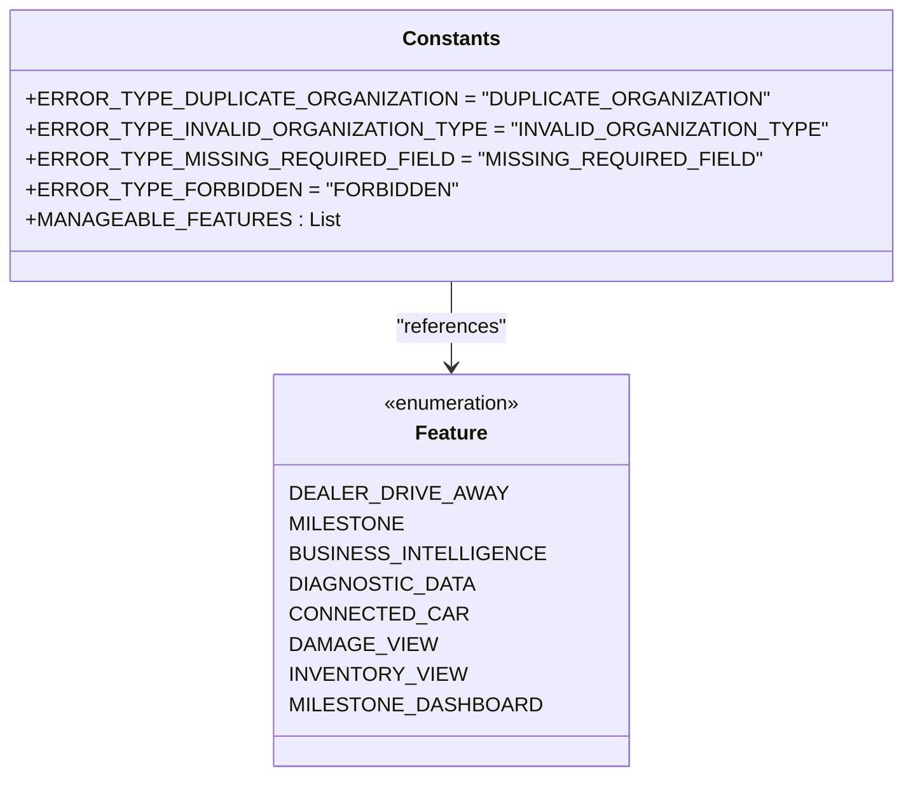

# Diagram: common/iam_service/iam_service/v1/constants.py

> Auto-generated by Obscura crawlers

## Mermaid

```mermaid
classDiagram
class Feature <<enumeration>> {
  DEALER_DRIVE_AWAY
  MILESTONE
  BUSINESS_INTELLIGENCE
  DIAGNOSTIC_DATA
  CONNECTED_CAR
  DAMAGE_VIEW
  INVENTORY_VIEW
  MILESTONE_DASHBOARD
}
class Constants {
  +ERROR_TYPE_DUPLICATE_ORGANIZATION = "DUPLICATE_ORGANIZATION"
  +ERROR_TYPE_INVALID_ORGANIZATION_TYPE = "INVALID_ORGANIZATION_TYPE"
  +ERROR_TYPE_MISSING_REQUIRED_FIELD = "MISSING_REQUIRED_FIELD"
  +ERROR_TYPE_FORBIDDEN = "FORBIDDEN"
  +MANAGEABLE_FEATURES : List<Feature>
}
Constants --> Feature : "references"
```

> SVG rendering failed for this diagram.
