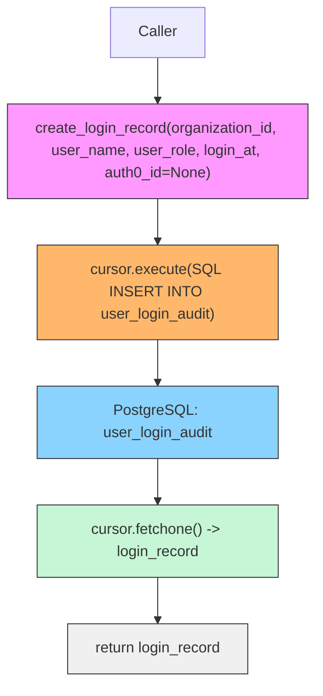

# Diagram: common/iam_service/iam_service/v1/db/logins.py

> Auto-generated by Obscura crawlers

## Mermaid

### SVG

<svg id="container" width="345.5625" xmlns="http://www.w3.org/2000/svg" class="flowchart" height="710" viewBox="0 0 345.5625 710" role="graphics-document document" aria-roledescription="flowchart-v2"><g><marker id="container_flowchart-v2-pointEnd" class="marker flowchart-v2" viewBox="0 0 10 10" refX="5" refY="5" markerUnits="userSpaceOnUse" markerWidth="8" markerHeight="8" orient="auto"><path d="M 0 0 L 10 5 L 0 10 z" class="arrowMarkerPath" style="stroke-width: 1; stroke-dasharray: 1, 0;"></path></marker><marker id="container_flowchart-v2-pointStart" class="marker flowchart-v2" viewBox="0 0 10 10" refX="4.5" refY="5" markerUnits="userSpaceOnUse" markerWidth="8" markerHeight="8" orient="auto"><path d="M 0 5 L 10 10 L 10 0 z" class="arrowMarkerPath" style="stroke-width: 1; stroke-dasharray: 1, 0;"></path></marker><marker id="container_flowchart-v2-circleEnd" class="marker flowchart-v2" viewBox="0 0 10 10" refX="11" refY="5" markerUnits="userSpaceOnUse" markerWidth="11" markerHeight="11" orient="auto"><circle cx="5" cy="5" r="5" class="arrowMarkerPath" style="stroke-width: 1; stroke-dasharray: 1, 0;"></circle></marker><marker id="container_flowchart-v2-circleStart" class="marker flowchart-v2" viewBox="0 0 10 10" refX="-1" refY="5" markerUnits="userSpaceOnUse" markerWidth="11" markerHeight="11" orient="auto"><circle cx="5" cy="5" r="5" class="arrowMarkerPath" style="stroke-width: 1; stroke-dasharray: 1, 0;"></circle></marker><marker id="container_flowchart-v2-crossEnd" class="marker cross flowchart-v2" viewBox="0 0 11 11" refX="12" refY="5.2" markerUnits="userSpaceOnUse" markerWidth="11" markerHeight="11" orient="auto"><path d="M 1,1 l 9,9 M 10,1 l -9,9" class="arrowMarkerPath" style="stroke-width: 2; stroke-dasharray: 1, 0;"></path></marker><marker id="container_flowchart-v2-crossStart" class="marker cross flowchart-v2" viewBox="0 0 11 11" refX="-1" refY="5.2" markerUnits="userSpaceOnUse" markerWidth="11" markerHeight="11" orient="auto"><path d="M 1,1 l 9,9 M 10,1 l -9,9" class="arrowMarkerPath" style="stroke-width: 2; stroke-dasharray: 1, 0;"></path></marker><g class="root"><g class="clusters"></g><g class="edgePaths"><path d="M172.781,62L172.781,66.167C172.781,70.333,172.781,78.667,172.781,86.333C172.781,94,172.781,101,172.781,104.5L172.781,108" id="L_Caller_CreateLogin_0" class="edge-thickness-normal edge-pattern-solid edge-thickness-normal edge-pattern-solid flowchart-link" style=";" data-edge="true" data-et="edge" data-id="L_Caller_CreateLogin_0" data-points="W3sieCI6MTcyLjc4MTI1LCJ5Ijo2Mn0seyJ4IjoxNzIuNzgxMjUsInkiOjg3fSx7IngiOjE3Mi43ODEyNSwieSI6MTEyfV0=" marker-end="url(#container_flowchart-v2-pointEnd)"></path><path d="M172.781,214L172.781,218.167C172.781,222.333,172.781,230.667,172.781,238.333C172.781,246,172.781,253,172.781,256.5L172.781,260" id="L_CreateLogin_Exec_0" class="edge-thickness-normal edge-pattern-solid edge-thickness-normal edge-pattern-solid flowchart-link" style=";" data-edge="true" data-et="edge" data-id="L_CreateLogin_Exec_0" data-points="W3sieCI6MTcyLjc4MTI1LCJ5IjoyMTR9LHsieCI6MTcyLjc4MTI1LCJ5IjoyMzl9LHsieCI6MTcyLjc4MTI1LCJ5IjoyNjR9XQ==" marker-end="url(#container_flowchart-v2-pointEnd)"></path><path d="M172.781,342L172.781,346.167C172.781,350.333,172.781,358.667,172.781,366.333C172.781,374,172.781,381,172.781,384.5L172.781,388" id="L_Exec_DB_0" class="edge-thickness-normal edge-pattern-solid edge-thickness-normal edge-pattern-solid flowchart-link" style=";" data-edge="true" data-et="edge" data-id="L_Exec_DB_0" data-points="W3sieCI6MTcyLjc4MTI1LCJ5IjozNDJ9LHsieCI6MTcyLjc4MTI1LCJ5IjozNjd9LHsieCI6MTcyLjc4MTI1LCJ5IjozOTJ9XQ==" marker-end="url(#container_flowchart-v2-pointEnd)"></path><path d="M172.781,470L172.781,474.167C172.781,478.333,172.781,486.667,172.781,494.333C172.781,502,172.781,509,172.781,512.5L172.781,516" id="L_DB_Fetch_0" class="edge-thickness-normal edge-pattern-solid edge-thickness-normal edge-pattern-solid flowchart-link" style=";" data-edge="true" data-et="edge" data-id="L_DB_Fetch_0" data-points="W3sieCI6MTcyLjc4MTI1LCJ5Ijo0NzB9LHsieCI6MTcyLjc4MTI1LCJ5Ijo0OTV9LHsieCI6MTcyLjc4MTI1LCJ5Ijo1MjB9XQ==" marker-end="url(#container_flowchart-v2-pointEnd)"></path><path d="M172.781,598L172.781,602.167C172.781,606.333,172.781,614.667,172.781,622.333C172.781,630,172.781,637,172.781,640.5L172.781,644" id="L_Fetch_Return_0" class="edge-thickness-normal edge-pattern-solid edge-thickness-normal edge-pattern-solid flowchart-link" style=";" data-edge="true" data-et="edge" data-id="L_Fetch_Return_0" data-points="W3sieCI6MTcyLjc4MTI1LCJ5Ijo1OTh9LHsieCI6MTcyLjc4MTI1LCJ5Ijo2MjN9LHsieCI6MTcyLjc4MTI1LCJ5Ijo2NDh9XQ==" marker-end="url(#container_flowchart-v2-pointEnd)"></path></g><g class="edgeLabels"><g class="edgeLabel"><g class="label" data-id="L_Caller_CreateLogin_0" transform="translate(0, 0)"><foreignObject width="0" height="0">

</foreignObject></g></g><g class="edgeLabel"><g class="label" data-id="L_CreateLogin_Exec_0" transform="translate(0, 0)"><foreignObject width="0" height="0">

</foreignObject></g></g><g class="edgeLabel"><g class="label" data-id="L_Exec_DB_0" transform="translate(0, 0)"><foreignObject width="0" height="0">

</foreignObject></g></g><g class="edgeLabel"><g class="label" data-id="L_DB_Fetch_0" transform="translate(0, 0)"><foreignObject width="0" height="0">

</foreignObject></g></g><g class="edgeLabel"><g class="label" data-id="L_Fetch_Return_0" transform="translate(0, 0)"><foreignObject width="0" height="0">

</foreignObject></g></g></g><g class="nodes"><g class="node default" id="flowchart-Caller-0" transform="translate(172.78125, 35)"><rect class="basic label-container" style="" x="-50.7734375" y="-27" width="101.546875" height="54"></rect><g class="label" style="" transform="translate(-20.7734375, -12)"><rect></rect><foreignObject width="41.546875" height="24">

Caller

</foreignObject></g></g><g class="node default" id="flowchart-CreateLogin-1" transform="translate(172.78125, 163)"><rect class="basic label-container" style="fill:#f9f !important;stroke:#333 !important;stroke-width:1px !important" x="-164.78125" y="-51" width="329.5625" height="102"></rect><g class="label" style="" transform="translate(-134.78125, -36)"><rect></rect><foreignObject width="269.5625" height="72">

create_login_record(organization_id, user_name, user_role, login_at, auth0_id=None)

</foreignObject></g></g><g class="node default" id="flowchart-Exec-3" transform="translate(172.78125, 303)"><rect class="basic label-container" style="fill:#ffb86b !important;stroke:#333 !important;stroke-width:1px !important" x="-130" y="-39" width="260" height="78"></rect><g class="label" style="" transform="translate(-100, -24)"><rect></rect><foreignObject width="200" height="48">

cursor.execute(SQL INSERT INTO user_login_audit)

</foreignObject></g></g><g class="node default" id="flowchart-DB-5" transform="translate(172.78125, 431)"><rect class="basic label-container" style="fill:#8bd3ff !important;stroke:#333 !important;stroke-width:1px !important" x="-130" y="-39" width="260" height="78"></rect><g class="label" style="" transform="translate(-100, -24)"><rect></rect><foreignObject width="200" height="48">

PostgreSQL: user_login_audit

</foreignObject></g></g><g class="node default" id="flowchart-Fetch-7" transform="translate(172.78125, 559)"><rect class="basic label-container" style="fill:#c6f6d5 !important;stroke:#333 !important;stroke-width:1px !important" x="-130" y="-39" width="260" height="78"></rect><g class="label" style="" transform="translate(-100, -24)"><rect></rect><foreignObject width="200" height="48">

cursor.fetchone() -&gt; login_record

</foreignObject></g></g><g class="node default" id="flowchart-Return-9" transform="translate(172.78125, 675)"><rect class="basic label-container" style="fill:#f0f0f0 !important;stroke:#333 !important;stroke-width:1px !important" x="-100.0703125" y="-27" width="200.140625" height="54"></rect><g class="label" style="" transform="translate(-70.0703125, -12)"><rect></rect><foreignObject width="140.140625" height="24">

return login_record

</foreignObject></g></g></g></g></g></svg>
