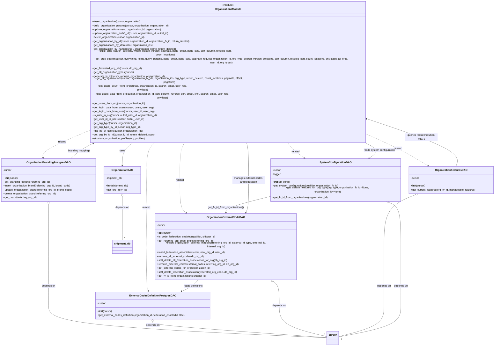

# Diagram: common/iam_service/iam_service/v1/db/organization.py

> Auto-generated by Obscura crawlers

## Mermaid

### SVG

<svg id="container" width="3042.421875" xmlns="http://www.w3.org/2000/svg" class="classDiagram" height="1986" viewBox="0 0 3042.421875 1986" role="graphics-document document" aria-roledescription="class"><g><defs><marker id="container_class-aggregationStart" class="marker aggregation class" refX="18" refY="7" markerWidth="190" markerHeight="240" orient="auto"><path d="M 18,7 L9,13 L1,7 L9,1 Z"></path></marker></defs><defs><marker id="container_class-aggregationEnd" class="marker aggregation class" refX="1" refY="7" markerWidth="20" markerHeight="28" orient="auto"><path d="M 18,7 L9,13 L1,7 L9,1 Z"></path></marker></defs><defs><marker id="container_class-extensionStart" class="marker extension class" refX="18" refY="7" markerWidth="190" markerHeight="240" orient="auto"><path d="M 1,7 L18,13 V 1 Z"></path></marker></defs><defs><marker id="container_class-extensionEnd" class="marker extension class" refX="1" refY="7" markerWidth="20" markerHeight="28" orient="auto"><path d="M 1,1 V 13 L18,7 Z"></path></marker></defs><defs><marker id="container_class-compositionStart" class="marker composition class" refX="18" refY="7" markerWidth="190" markerHeight="240" orient="auto"><path d="M 18,7 L9,13 L1,7 L9,1 Z"></path></marker></defs><defs><marker id="container_class-compositionEnd" class="marker composition class" refX="1" refY="7" markerWidth="20" markerHeight="28" orient="auto"><path d="M 18,7 L9,13 L1,7 L9,1 Z"></path></marker></defs><defs><marker id="container_class-dependencyStart" class="marker dependency class" refX="6" refY="7" markerWidth="190" markerHeight="240" orient="auto"><path d="M 5,7 L9,13 L1,7 L9,1 Z"></path></marker></defs><defs><marker id="container_class-dependencyEnd" class="marker dependency class" refX="13" refY="7" markerWidth="20" markerHeight="28" orient="auto"><path d="M 18,7 L9,13 L14,7 L9,1 Z"></path></marker></defs><defs><marker id="container_class-lollipopStart" class="marker lollipop class" refX="13" refY="7" markerWidth="190" markerHeight="240" orient="auto"><circle stroke="black" fill="transparent" cx="7" cy="7" r="6"></circle></marker></defs><defs><marker id="container_class-lollipopEnd" class="marker lollipop class" refX="1" refY="7" markerWidth="190" markerHeight="240" orient="auto"><circle stroke="black" fill="transparent" cx="7" cy="7" r="6"></circle></marker></defs><g class="root"><g class="clusters"></g><g class="edgePaths"><path d="M826.173,758L813.553,766.167C800.933,774.333,775.693,790.667,763.073,814C750.453,837.333,750.453,867.667,750.453,882.833L750.453,898" id="id_OrganizationsModule_OrganizationDAO_1" class="edge-thickness-normal edge-pattern-dashed relation" style=";;;" data-edge="true" data-et="edge" data-id="id_OrganizationsModule_OrganizationDAO_1" data-points="W3sieCI6ODI2LjE3MjgwNTQ5ODIzMTEsInkiOjc1OH0seyJ4Ijo3NTAuNDUzMTI1LCJ5Ijo4MDd9LHsieCI6NzUwLjQ1MzEyNSwieSI6OTA0fV0=" marker-end="url(#container_class-dependencyEnd)"></path><path d="M496.848,717.38L456.251,732.317C415.655,747.253,334.462,777.127,295.65,799.259C256.838,821.392,260.407,835.784,262.192,842.98L263.976,850.176" id="id_OrganizationsModule_OrganizationBrandingPostgresDAO_2" class="edge-thickness-normal edge-pattern-dashed relation" style=";;;" data-edge="true" data-et="edge" data-id="id_OrganizationsModule_OrganizationBrandingPostgresDAO_2" data-points="W3sieCI6NDk2Ljg0NzY1NjI1LCJ5Ijo3MTcuMzgwMTA2NTcxOTM2fSx7IngiOjI1My4yNjk1MzEyNSwieSI6ODA3fSx7IngiOjI2NS40MjAxMjY4OTkxNzEzLCJ5Ijo4NTZ9XQ==" marker-end="url(#container_class-dependencyEnd)"></path><path d="M956.316,758L946.53,766.167C936.744,774.333,917.173,790.667,907.387,829C897.602,867.333,897.602,927.667,897.602,986C897.602,1044.333,897.602,1100.667,897.602,1167C897.602,1233.333,897.602,1309.667,897.602,1386C897.602,1462.333,897.602,1538.667,899.349,1582.052C901.097,1625.437,904.593,1635.874,906.341,1641.092L908.089,1646.311" id="id_OrganizationsModule_ExternalCodesDefinitionPostgresDAO_3" class="edge-thickness-normal edge-pattern-dashed relation" style=";;;" data-edge="true" data-et="edge" data-id="id_OrganizationsModule_ExternalCodesDefinitionPostgresDAO_3" data-points="W3sieCI6OTU2LjMxNTg4MTExNzMzNDksInkiOjc1OH0seyJ4Ijo4OTcuNjAxNTYyNSwieSI6ODA3fSx7IngiOjg5Ny42MDE1NjI1LCJ5Ijo5ODh9LHsieCI6ODk3LjYwMTU2MjUsInkiOjExNTd9LHsieCI6ODk3LjYwMTU2MjUsInkiOjEzODZ9LHsieCI6ODk3LjYwMTU2MjUsInkiOjE2MTV9LHsieCI6OTA5Ljk5NDIyMTMzMjY0NDcsInkiOjE2NTJ9XQ==" marker-end="url(#container_class-dependencyEnd)"></path><path d="M1141.556,758L1135.805,766.167C1130.053,774.333,1118.55,790.667,1112.798,829C1107.047,867.333,1107.047,927.667,1107.047,986C1107.047,1044.333,1107.047,1100.667,1113.956,1134.374C1120.866,1168.082,1134.684,1179.164,1141.594,1184.705L1148.503,1190.246" id="id_OrganizationsModule_OrganizationExternalCodeDAO_4" class="edge-thickness-normal edge-pattern-dashed relation" style=";;;" data-edge="true" data-et="edge" data-id="id_OrganizationsModule_OrganizationExternalCodeDAO_4" data-points="W3sieCI6MTE0MS41NTY0Mjg3MjkzNjMyLCJ5Ijo3NTh9LHsieCI6MTEwNy4wNDY4NzUsInkiOjgwN30seyJ4IjoxMTA3LjA0Njg3NSwieSI6OTg4fSx7IngiOjExMDcuMDQ2ODc1LCJ5IjoxMTU3fSx7IngiOjExNTMuMTgzOTAwNzkxNDg0OCwieSI6MTE5NH1d" marker-end="url(#container_class-dependencyEnd)"></path><path d="M2314.473,739.824L2342.988,751.02C2371.504,762.216,2428.535,784.608,2482.152,811.442C2535.768,838.276,2585.969,869.552,2611.07,885.189L2636.171,900.827" id="id_OrganizationsModule_OrganizationFeaturesDAO_5" class="edge-thickness-normal edge-pattern-dashed relation" style=";;;" data-edge="true" data-et="edge" data-id="id_OrganizationsModule_OrganizationFeaturesDAO_5" data-points="W3sieCI6MjMxNC40NzI2NTYyNSwieSI6NzM5LjgyNDAyOTg2MzcwMzV9LHsieCI6MjQ4NS41NjY0MDYyNSwieSI6ODA3fSx7IngiOjI2NDEuMjYzMzgwNTI0ODYyLCJ5Ijo5MDR9XQ==" marker-end="url(#container_class-dependencyEnd)"></path><path d="M1767.746,758L1775.631,766.167C1783.517,774.333,1799.288,790.667,1820.549,808.418C1841.809,826.168,1868.56,845.337,1881.936,854.921L1895.311,864.505" id="id_OrganizationsModule_SystemConfigurationDAO_6" class="edge-thickness-normal edge-pattern-dashed relation" style=";;;" data-edge="true" data-et="edge" data-id="id_OrganizationsModule_SystemConfigurationDAO_6" data-points="W3sieCI6MTc2Ny43NDYwMzg0NzI4Nzc0LCJ5Ijo3NTh9LHsieCI6MTgxNS4wNTg1OTM3NSwieSI6ODA3fSx7IngiOjE5MDAuMTg4MTkwNjA3NzM1LCJ5Ijo4Njh9XQ==" marker-end="url(#container_class-dependencyEnd)"></path><path d="M750.453,1089.25L750.453,1100.542C750.453,1111.833,750.453,1134.417,750.453,1176.875C750.453,1219.333,750.453,1281.667,750.453,1312.833L750.453,1344" id="id_OrganizationDAO_shipment_db_7" class="edge-thickness-normal edge-pattern-solid relation" style=";;;" data-edge="true" data-et="edge" data-id="id_OrganizationDAO_shipment_db_7" data-points="W3sieCI6NzUwLjQ1MzEyNSwieSI6MTA3Mn0seyJ4Ijo3NTAuNDUzMTI1LCJ5IjoxMTU3fSx7IngiOjc1MC40NTMxMjUsInkiOjEzNDR9XQ==" marker-start="url(#container_class-aggregationStart)"></path><path d="M298.152,1137.25L298.152,1140.542C298.152,1143.833,298.152,1150.417,298.152,1191.875C298.152,1233.333,298.152,1309.667,298.152,1386C298.152,1462.333,298.152,1538.667,298.152,1597C298.152,1655.333,298.152,1695.667,298.152,1736C298.152,1776.333,298.152,1816.667,584.08,1849.735C870.008,1882.804,1441.863,1908.608,1727.791,1921.51L2013.719,1934.412" id="id_OrganizationBrandingPostgresDAO_cursor_8" class="edge-thickness-normal edge-pattern-solid relation" style=";;;" data-edge="true" data-et="edge" data-id="id_OrganizationBrandingPostgresDAO_cursor_8" data-points="W3sieCI6Mjk4LjE1MjM0Mzc1LCJ5IjoxMTIwfSx7IngiOjI5OC4xNTIzNDM3NSwieSI6MTE1N30seyJ4IjoyOTguMTUyMzQzNzUsInkiOjEzODZ9LHsieCI6Mjk4LjE1MjM0Mzc1LCJ5IjoxNjE1fSx7IngiOjI5OC4xNTIzNDM3NSwieSI6MTczNn0seyJ4IjoyOTguMTUyMzQzNzUsInkiOjE4NTd9LHsieCI6MjAxMy43MTg3NSwieSI6MTkzNC40MTIyMTk3MzU2OTQyfV0=" marker-start="url(#container_class-aggregationStart)"></path><path d="M938.129,1837.25L938.129,1840.542C938.129,1843.833,938.129,1850.417,1117.394,1866.458C1296.659,1882.499,1655.189,1907.998,1834.454,1920.748L2013.719,1933.497" id="id_ExternalCodesDefinitionPostgresDAO_cursor_9" class="edge-thickness-normal edge-pattern-solid relation" style=";;;" data-edge="true" data-et="edge" data-id="id_ExternalCodesDefinitionPostgresDAO_cursor_9" data-points="W3sieCI6OTM4LjEyODkwNjI1LCJ5IjoxODIwfSx7IngiOjkzOC4xMjg5MDYyNSwieSI6MTg1N30seyJ4IjoyMDEzLjcxODc1LCJ5IjoxOTMzLjQ5NzQxNjk5NzUyNzh9XQ==" marker-start="url(#container_class-aggregationStart)"></path><path d="M1681.929,1587.871L1688.41,1592.392C1694.89,1596.914,1707.851,1605.957,1714.332,1630.645C1720.813,1655.333,1720.813,1695.667,1720.813,1736C1720.813,1776.333,1720.813,1816.667,1769.63,1848.588C1818.448,1880.509,1916.083,1904.018,1964.901,1915.773L2013.719,1927.527" id="id_OrganizationExternalCodeDAO_cursor_10" class="edge-thickness-normal edge-pattern-solid relation" style=";;;" data-edge="true" data-et="edge" data-id="id_OrganizationExternalCodeDAO_cursor_10" data-points="W3sieCI6MTY2Ny43ODIxNTQwNjY1OTM5LCJ5IjoxNTc4fSx7IngiOjE3MjAuODEyNSwieSI6MTYxNX0seyJ4IjoxNzIwLjgxMjUsInkiOjE3MzZ9LHsieCI6MTcyMC44MTI1LCJ5IjoxODU3fSx7IngiOjIwMTMuNzE4NzUsInkiOjE5MjcuNTI3MzgzNTYwMzM5fV0=" marker-start="url(#container_class-aggregationStart)"></path><path d="M2556.374,1078.574L2524.666,1091.645C2492.958,1104.716,2429.541,1130.858,2397.833,1182.096C2366.125,1233.333,2366.125,1309.667,2366.125,1386C2366.125,1462.333,2366.125,1538.667,2366.125,1597C2366.125,1655.333,2366.125,1695.667,2366.125,1736C2366.125,1776.333,2366.125,1816.667,2319.12,1848.539C2272.115,1880.412,2178.104,1903.825,2131.099,1915.531L2084.094,1927.237" id="id_OrganizationFeaturesDAO_cursor_11" class="edge-thickness-normal edge-pattern-solid relation" style=";;;" data-edge="true" data-et="edge" data-id="id_OrganizationFeaturesDAO_cursor_11" data-points="W3sieCI6MjU3Mi4zMjIzMDAyOTU4NTgsInkiOjEwNzJ9LHsieCI6MjM2Ni4xMjUsInkiOjExNTd9LHsieCI6MjM2Ni4xMjUsInkiOjEzODZ9LHsieCI6MjM2Ni4xMjUsInkiOjE2MTV9LHsieCI6MjM2Ni4xMjUsInkiOjE3MzZ9LHsieCI6MjM2Ni4xMjUsInkiOjE4NTd9LHsieCI6MjA4NC4wOTM3NSwieSI6MTkyNy4yMzY5MjI0NzA2OTI0fV0=" marker-start="url(#container_class-aggregationStart)"></path><path d="M2370.691,1114.652L2387.579,1121.71C2404.466,1128.768,2438.241,1142.884,2455.128,1188.109C2472.016,1233.333,2472.016,1309.667,2472.016,1386C2472.016,1462.333,2472.016,1538.667,2472.016,1597C2472.016,1655.333,2472.016,1695.667,2472.016,1736C2472.016,1776.333,2472.016,1816.667,2407.362,1848.905C2342.708,1881.143,2213.401,1905.287,2148.747,1917.358L2084.094,1929.43" id="id_SystemConfigurationDAO_cursor_12" class="edge-thickness-normal edge-pattern-solid relation" style=";;;" data-edge="true" data-et="edge" data-id="id_SystemConfigurationDAO_cursor_12" data-points="W3sieCI6MjM1NC43NzUzMzI4NDAyMzcsInkiOjExMDh9LHsieCI6MjQ3Mi4wMTU2MjUsInkiOjExNTd9LHsieCI6MjQ3Mi4wMTU2MjUsInkiOjEzODZ9LHsieCI6MjQ3Mi4wMTU2MjUsInkiOjE2MTV9LHsieCI6MjQ3Mi4wMTU2MjUsInkiOjE3MzZ9LHsieCI6MjQ3Mi4wMTU2MjUsInkiOjE4NTd9LHsieCI6MjA4NC4wOTM3NSwieSI6MTkyOS40MzAwMzgwMzY4NTUyfV0=" marker-start="url(#container_class-aggregationStart)"></path><path d="M1223.314,1578L1217.877,1584.167C1212.44,1590.333,1201.566,1602.667,1184.159,1614.568C1166.752,1626.469,1142.812,1637.938,1130.842,1643.673L1118.873,1649.408" id="id_OrganizationExternalCodeDAO_ExternalCodesDefinitionPostgresDAO_13" class="edge-thickness-normal edge-pattern-solid relation" style=";;;" data-edge="true" data-et="edge" data-id="id_OrganizationExternalCodeDAO_ExternalCodesDefinitionPostgresDAO_13" data-points="W3sieCI6MTIyMy4zMTM4MTM0NTUyNCwieSI6MTU3OH0seyJ4IjoxMTkwLjY5MTQwNjI1LCJ5IjoxNjE1fSx7IngiOjExMTMuNDYxNTUwODc4MDk5MiwieSI6MTY1Mn1d" marker-end="url(#container_class-dependencyEnd)"></path><path d="M1667.547,1088.167L1621.722,1099.639C1575.897,1111.111,1484.247,1134.056,1438.423,1150.694C1392.598,1167.333,1392.598,1177.667,1392.598,1182.833L1392.598,1188" id="id_SystemConfigurationDAO_OrganizationExternalCodeDAO_14" class="edge-thickness-normal edge-pattern-solid relation" style=";;;" data-edge="true" data-et="edge" data-id="id_SystemConfigurationDAO_OrganizationExternalCodeDAO_14" data-points="W3sieCI6MTY2Ny41NDY4NzUsInkiOjEwODguMTY2ODM3MzY5NDQxM30seyJ4IjoxMzkyLjU5NzY1NjI1LCJ5IjoxMTU3fSx7IngiOjEzOTIuNTk3NjU2MjUsInkiOjExOTR9XQ==" marker-end="url(#container_class-dependencyEnd)"></path><path d="M2806.24,904L2812.041,887.833C2817.843,871.667,2829.447,839.333,2748.445,797.526C2667.443,755.718,2493.835,704.436,2407.031,678.795L2320.227,653.154" id="id_OrganizationFeaturesDAO_OrganizationsModule_15" class="edge-thickness-normal edge-pattern-solid relation" style=";;;" data-edge="true" data-et="edge" data-id="id_OrganizationFeaturesDAO_OrganizationsModule_15" data-points="W3sieCI6MjgwNi4yMzk1NTQ1NTgwMTEsInkiOjkwNH0seyJ4IjoyODQxLjA1MDc4MTI1LCJ5Ijo4MDd9LHsieCI6MjMxNC40NzI2NTYyNSwieSI6NjUxLjQ1NDEwMTEyNjY1MzN9XQ==" marker-end="url(#container_class-dependencyEnd)"></path><path d="M433.735,856L442.123,847.833C450.511,839.667,467.288,823.333,492.519,807.418C517.749,791.503,551.434,776.005,568.276,768.256L585.119,760.508" id="id_OrganizationBrandingPostgresDAO_OrganizationsModule_16" class="edge-thickness-normal edge-pattern-solid relation" style=";;;" data-edge="true" data-et="edge" data-id="id_OrganizationBrandingPostgresDAO_OrganizationsModule_16" data-points="W3sieCI6NDMzLjczNDY1NTU1OTM5MjI1LCJ5Ijo4NTZ9LHsieCI6NDg0LjA2NDQ1MzEyNSwieSI6ODA3fSx7IngiOjU5MC41Njk2MTY5Mjk1NDAxLCJ5Ijo3NTh9XQ==" marker-end="url(#container_class-dependencyEnd)"></path><path d="M2234.071,758L2252.112,766.167C2270.153,774.333,2306.235,790.667,2309.683,808.45C2313.131,826.233,2283.946,845.466,2269.354,855.082L2254.761,864.698" id="id_OrganizationsModule_SystemConfigurationDAO_17" class="edge-thickness-normal edge-pattern-solid relation" style=";;;" data-edge="true" data-et="edge" data-id="id_OrganizationsModule_SystemConfigurationDAO_17" data-points="W3sieCI6MjIzNC4wNzA3NTQ3MTY5ODE0LCJ5Ijo3NTh9LHsieCI6MjM0Mi4zMTY0MDYyNSwieSI6ODA3fSx7IngiOjIyNDkuNzUxMzgxMjE1NDcsInkiOjg2OH1d" marker-end="url(#container_class-dependencyEnd)"></path><path d="M1517.883,758L1520.327,766.167C1522.771,774.333,1527.659,790.667,1530.103,829C1532.547,867.333,1532.547,927.667,1532.547,986C1532.547,1044.333,1532.547,1100.667,1529.3,1134.147C1526.053,1167.627,1519.558,1178.254,1516.311,1183.567L1513.064,1188.88" id="id_OrganizationsModule_OrganizationExternalCodeDAO_18" class="edge-thickness-normal edge-pattern-solid relation" style=";;;" data-edge="true" data-et="edge" data-id="id_OrganizationsModule_OrganizationExternalCodeDAO_18" data-points="W3sieCI6MTUxNy44ODMwNzk2NzI3NTkzLCJ5Ijo3NTh9LHsieCI6MTUzMi41NDY4NzUsInkiOjgwN30seyJ4IjoxNTMyLjU0Njg3NSwieSI6OTg4fSx7IngiOjE1MzIuNTQ2ODc1LCJ5IjoxMTU3fSx7IngiOjE1MDkuOTM0OTkyNDk0NTQxNiwieSI6MTE5NH1d" marker-end="url(#container_class-dependencyEnd)"></path></g><g class="edgeLabels"><g class="edgeLabel" transform="translate(750.453125, 807)"><g class="label" data-id="id_OrganizationsModule_OrganizationDAO_1" transform="translate(-16.4921875, -12)"><foreignObject width="32.984375" height="24">

uses

</foreignObject></g></g><g class="edgeLabel" transform="translate(351.36916, 770.90613)"><g class="label" data-id="id_OrganizationsModule_OrganizationBrandingPostgresDAO_2" transform="translate(-25.78125, -12)"><foreignObject width="51.5625" height="24">

related

</foreignObject></g></g><g class="edgeLabel" transform="translate(897.6015625, 1157)"><g class="label" data-id="id_OrganizationsModule_ExternalCodesDefinitionPostgresDAO_3" transform="translate(-25.78125, -12)"><foreignObject width="51.5625" height="24">

related

</foreignObject></g></g><g class="edgeLabel" transform="translate(1107.046875, 988)"><g class="label" data-id="id_OrganizationsModule_OrganizationExternalCodeDAO_4" transform="translate(-25.78125, -12)"><foreignObject width="51.5625" height="24">

related

</foreignObject></g></g><g class="edgeLabel" transform="translate(2485.39515, 806.93276)"><g class="label" data-id="id_OrganizationsModule_OrganizationFeaturesDAO_5" transform="translate(-25.78125, -12)"><foreignObject width="51.5625" height="24">

related

</foreignObject></g></g><g class="edgeLabel" transform="translate(1829.93993, 817.66329)"><g class="label" data-id="id_OrganizationsModule_SystemConfigurationDAO_6" transform="translate(-25.78125, -12)"><foreignObject width="51.5625" height="24">

related

</foreignObject></g></g><g class="edgeLabel" transform="translate(750.453125, 1157)"><g class="label" data-id="id_OrganizationDAO_shipment_db_7" transform="translate(-42.9453125, -12)"><foreignObject width="85.890625" height="24">

depends on

</foreignObject></g></g><g class="edgeLabel" transform="translate(298.15234375, 1615)"><g class="label" data-id="id_OrganizationBrandingPostgresDAO_cursor_8" transform="translate(-42.9453125, -12)"><foreignObject width="85.890625" height="24">

depends on

</foreignObject></g></g><g class="edgeLabel" transform="translate(938.12890625, 1857)"><g class="label" data-id="id_ExternalCodesDefinitionPostgresDAO_cursor_9" transform="translate(-42.9453125, -12)"><foreignObject width="85.890625" height="24">

depends on

</foreignObject></g></g><g class="edgeLabel" transform="translate(1720.8125, 1736)"><g class="label" data-id="id_OrganizationExternalCodeDAO_cursor_10" transform="translate(-42.9453125, -12)"><foreignObject width="85.890625" height="24">

depends on

</foreignObject></g></g><g class="edgeLabel" transform="translate(2366.125, 1615)"><g class="label" data-id="id_OrganizationFeaturesDAO_cursor_11" transform="translate(-42.9453125, -12)"><foreignObject width="85.890625" height="24">

depends on

</foreignObject></g></g><g class="edgeLabel" transform="translate(2472.015625, 1615)"><g class="label" data-id="id_SystemConfigurationDAO_cursor_12" transform="translate(-42.9453125, -12)"><foreignObject width="85.890625" height="24">

depends on

</foreignObject></g></g><g class="edgeLabel" transform="translate(1190.69140625, 1615)"><g class="label" data-id="id_OrganizationExternalCodeDAO_ExternalCodesDefinitionPostgresDAO_13" transform="translate(-61.0546875, -12)"><foreignObject width="122.109375" height="24">

reads definitions

</foreignObject></g></g><g class="edgeLabel" transform="translate(1392.59765625, 1157)"><g class="label" data-id="id_SystemConfigurationDAO_OrganizationExternalCodeDAO_14" transform="translate(-112.015625, -12)"><foreignObject width="224.03125" height="24">

get_fv_id_from_organizations()

</foreignObject></g></g><g class="edgeLabel" transform="translate(2627.17951, 743.82457)"><g class="label" data-id="id_OrganizationFeaturesDAO_OrganizationsModule_15" transform="translate(-100, -24)"><foreignObject width="200" height="48">

queries feature/solution tables

</foreignObject></g></g><g class="edgeLabel" transform="translate(484.064453125, 807)"><g class="label" data-id="id_OrganizationBrandingPostgresDAO_OrganizationsModule_16" transform="translate(-70.109375, -12)"><foreignObject width="140.21875" height="24">

branding mappings

</foreignObject></g></g><g class="edgeLabel" transform="translate(2338.68939, 805.35814)"><g class="label" data-id="id_OrganizationsModule_SystemConfigurationDAO_17" transform="translate(-97.46875, -12)"><foreignObject width="194.9375" height="24">

reads system configuration

</foreignObject></g></g><g class="edgeLabel" transform="translate(1532.546875, 988)"><g class="label" data-id="id_OrganizationsModule_OrganizationExternalCodeDAO_18" transform="translate(-100, -24)"><foreignObject width="200" height="48">

manages external codes and federation

</foreignObject></g></g><g class="edgeTerminals" transform="translate(760.4531274999998, 1321.500002142857)"><g class="inner" transform="translate(0, 0)"></g><foreignObject style="width: 9px; height: 12px;">
1
</foreignObject></g><g class="edgeTerminals" transform="translate(1991.9127013611255, 1913.638612423655)"><g class="inner" transform="translate(0, 0)"></g><foreignObject style="width: 9px; height: 12px;">
1
</foreignObject></g><g class="edgeTerminals" transform="translate(1992.326972846712, 1912.2937220677406)"><g class="inner" transform="translate(0, 0)"></g><foreignObject style="width: 9px; height: 12px;">
1
</foreignObject></g><g class="edgeTerminals" transform="translate(1995.2164203831355, 1903.847523559511)"><g class="inner" transform="translate(0, 0)"></g><foreignObject style="width: 9px; height: 12px;">
1
</foreignObject></g><g class="edgeTerminals" transform="translate(2099.699950229979, 1932.5633222037375)"><g class="inner" transform="translate(0, 0)"></g><foreignObject style="width: 9px; height: 12px;">
1
</foreignObject></g><g class="edgeTerminals" transform="translate(2099.0495764079506, 1935.963249588508)"><g class="inner" transform="translate(0, 0)"></g><foreignObject style="width: 9px; height: 12px;">
1
</foreignObject></g></g><g class="nodes"><g class="node default" id="classId-OrganizationsModule-0" transform="translate(1405.66015625, 383)"><g class="basic label-container"><path d="M-908.8125 -375 L908.8125 -375 L908.8125 375 L-908.8125 375" stroke="none" stroke-width="0" fill="#ECECFF" style=""></path><path d="M-908.8125 -375 C-492.0264410124832 -375, -75.24038202496638 -375, 908.8125 -375 M-908.8125 -375 C-282.38636711561867 -375, 344.03976576876266 -375, 908.8125 -375 M908.8125 -375 C908.8125 -199.14121960179025, 908.8125 -23.28243920358051, 908.8125 375 M908.8125 -375 C908.8125 -136.39884808559268, 908.8125 102.20230382881465, 908.8125 375 M908.8125 375 C351.8736674572658 375, -205.06516508546838 375, -908.8125 375 M908.8125 375 C405.9306400994452 375, -96.95121980110957 375, -908.8125 375 M-908.8125 375 C-908.8125 133.70344613895776, -908.8125 -107.59310772208448, -908.8125 -375 M-908.8125 375 C-908.8125 209.40472783724434, -908.8125 43.809455674488675, -908.8125 -375" stroke="#9370DB" stroke-width="1.3" fill="none" stroke-dasharray="0 0" style=""></path></g><g class="annotation-group text" transform="translate(-36.6015625, -351)"><g class="label" style="" transform="translate(0,-12)"><foreignObject width="73.203125" height="24">

«module»

</foreignObject></g></g><g class="label-group text" transform="translate(-77.640625, -327)"><g class="label" style="font-weight: bolder" transform="translate(0,-12)"><foreignObject width="155.28125" height="24">

OrganizationsModule

</foreignObject></g></g><g class="members-group text" transform="translate(-896.8125, -279)"></g><g class="methods-group text" transform="translate(-896.8125, -249)"><g class="label" style="" transform="translate(0,-12)"><foreignObject width="301.625" height="24">

+insert_organization(cursor, organization)

</foreignObject></g><g class="label" style="" transform="translate(0,12)"><foreignObject width="479.796875" height="24">

+build_organization_params(cursor, organization, organization_id)

</foreignObject></g><g class="label" style="" transform="translate(0,36)"><foreignObject width="431.453125" height="24">

+update_organization(cursor, organization_id, organization)

</foreignObject></g><g class="label" style="" transform="translate(0,60)"><foreignObject width="477.125" height="24">

+update_organization_auth0_id(cursor, organization_id, auth0_id)

</foreignObject></g><g class="label" style="" transform="translate(0,84)"><foreignObject width="327.546875" height="24">

+delete_organization(cursor, organization_id)

</foreignObject></g><g class="label" style="" transform="translate(0,108)"><foreignObject width="610.265625" height="24">

+get_organization_by_id(cursor, organization_id, organization_fv_id, return_deleted)

</foreignObject></g><g class="label" style="" transform="translate(0,132)"><foreignObject width="374.203125" height="24">

+get_organizations_by_ids(cursor, organization_ids)

</foreignObject></g><g class="label" style="" transform="translate(0,156)"><foreignObject width="521.390625" height="24">

+get_organization_by_name(cursor, organization_name, return_deleted)

</foreignObject></g><g class="label" style="" transform="translate(0,180)"><foreignObject width="945.515625" height="24">

+build_orgs_search_sql(joins, where_clause, version, paginate, page_offset, page_size, sort_column, reverse_sort, count_locations)

</foreignObject></g><g class="label" style="" transform="translate(0,204)"><foreignObject width="1715.984375" height="24">

+get_orgs_search(cursor, everything, fields, query_params, page_offset, page_size, paginate, request_organization_id, org_type_search, version, solutions, sort_column, reverse_sort, count_locations, privilages, all_orgs, user_id, org_types)

</foreignObject></g><g class="label" style="" transform="translate(0,228)"><foreignObject width="306.15625" height="24">

+get_federated_org_ids(cursor, db_org_id)

</foreignObject></g><g class="label" style="" transform="translate(0,252)"><foreignObject width="258.1875" height="24">

+get_all_organization_types(cursor)

</foreignObject></g><g class="label" style="" transform="translate(0,276)"><foreignObject width="451.625" height="24">

+generate_fv_id(cursor, request_organization, organization_id)

</foreignObject></g><g class="label" style="" transform="translate(0,300)"><foreignObject width="999.078125" height="24">

+get_all_organizations(cursor, organization_fv_ids, organization_ids, org_type, return_deleted, count_locations, paginate, offset, pageSize)

</foreignObject></g><g class="label" style="" transform="translate(0,324)"><foreignObject width="625.359375" height="24">

+get_users_count_from_org(cursor, organization_id, search_email, user_role, privilege)

</foreignObject></g><g class="label" style="" transform="translate(0,348)"><foreignObject width="904.828125" height="24">

+get_users_data_from_org(cursor, organization_id, sort_column, reverse_sort, offset, limit, search_email, user_role, privilege)

</foreignObject></g><g class="label" style="" transform="translate(0,372)"><foreignObject width="326.5" height="24">

+get_users_from_org(cursor, organization_id)

</foreignObject></g><g class="label" style="" transform="translate(0,396)"><foreignObject width="376.421875" height="24">

+get_login_data_from_users(cursor, users, user_org)

</foreignObject></g><g class="label" style="" transform="translate(0,420)"><foreignObject width="383.078125" height="24">

+get_login_data_from_user(cursor, user_id, user_org)

</foreignObject></g><g class="label" style="" transform="translate(0,444)"><foreignObject width="398.015625" height="24">

+is_user_in_org(cursor, auth0_user_id, organization_id)

</foreignObject></g><g class="label" style="" transform="translate(0,468)"><foreignObject width="318.546875" height="24">

+get_user_id_in_user(cursor, auth0_user_id)

</foreignObject></g><g class="label" style="" transform="translate(0,492)"><foreignObject width="277.65625" height="24">

+get_org_type(cursor, organization_id)

</foreignObject></g><g class="label" style="" transform="translate(0,516)"><foreignObject width="297.671875" height="24">

+get_org_type_by_id(cursor, org_type_id)

</foreignObject></g><g class="label" style="" transform="translate(0,540)"><foreignObject width="314.875" height="24">

+find_no_of_users(cursor, organization_ids)

</foreignObject></g><g class="label" style="" transform="translate(0,564)"><foreignObject width="384.53125" height="24">

+get_org_by_fv_id(cursor, fv_id, return_deleted, scac)

</foreignObject></g><g class="label" style="" transform="translate(0,588)"><foreignObject width="331.671875" height="24">

+structure_organization_profiles(org_profiles)

</foreignObject></g></g><g class="divider" style=""><path d="M-908.8125 -303 C-378.7839810785532 -303, 151.24453784289358 -303, 908.8125 -303 M-908.8125 -303 C-393.95412761060936 -303, 120.90424477878128 -303, 908.8125 -303" stroke="#9370DB" stroke-width="1.3" fill="none" stroke-dasharray="0 0" style=""></path></g><g class="divider" style=""><path d="M-908.8125 -279 C-268.86841424498834 -279, 371.0756715100233 -279, 908.8125 -279 M-908.8125 -279 C-534.4918082969941 -279, -160.17111659398824 -279, 908.8125 -279" stroke="#9370DB" stroke-width="1.3" fill="none" stroke-dasharray="0 0" style=""></path></g></g><g class="node default" id="classId-OrganizationDAO-1" transform="translate(750.453125, 988)"><g class="basic label-container"><path d="M-112.1484375 -84 L112.1484375 -84 L112.1484375 84 L-112.1484375 84" stroke="none" stroke-width="0" fill="#ECECFF" style=""></path><path d="M-112.1484375 -84 C-64.18325903624282 -84, -16.21808057248562 -84, 112.1484375 -84 M-112.1484375 -84 C-66.56328935730542 -84, -20.978141214610858 -84, 112.1484375 -84 M112.1484375 -84 C112.1484375 -33.86151595713212, 112.1484375 16.27696808573576, 112.1484375 84 M112.1484375 -84 C112.1484375 -30.463522007303148, 112.1484375 23.072955985393705, 112.1484375 84 M112.1484375 84 C25.764154885324047 84, -60.62012772935191 84, -112.1484375 84 M112.1484375 84 C32.39103733949179 84, -47.36636282101642 84, -112.1484375 84 M-112.1484375 84 C-112.1484375 18.448910184724042, -112.1484375 -47.102179630551916, -112.1484375 -84 M-112.1484375 84 C-112.1484375 33.009358208468406, -112.1484375 -17.98128358306319, -112.1484375 -84" stroke="#9370DB" stroke-width="1.3" fill="none" stroke-dasharray="0 0" style=""></path></g><g class="annotation-group text" transform="translate(0, -60)"></g><g class="label-group text" transform="translate(-61.984375, -60)"><g class="label" style="font-weight: bolder" transform="translate(0,-12)"><foreignObject width="123.96875" height="24">

OrganizationDAO

</foreignObject></g></g><g class="members-group text" transform="translate(-100.1484375, -12)"><g class="label" style="" transform="translate(0,-12)"><foreignObject width="101.96875" height="24">

-shipment_db

</foreignObject></g></g><g class="methods-group text" transform="translate(-100.1484375, 36)"><g class="label" style="" transform="translate(0,-12)"><foreignObject width="138.3125" height="24">

+<strong>init</strong>(shipment_db)

</foreignObject></g><g class="label" style="" transform="translate(0,12)"><foreignObject width="130.140625" height="24">

+get_org_id(fv_id)

</foreignObject></g></g><g class="divider" style=""><path d="M-112.1484375 -36 C-39.45821781844481 -36, 33.23200186311038 -36, 112.1484375 -36 M-112.1484375 -36 C-49.11008027587455 -36, 13.928276948250897 -36, 112.1484375 -36" stroke="#9370DB" stroke-width="1.3" fill="none" stroke-dasharray="0 0" style=""></path></g><g class="divider" style=""><path d="M-112.1484375 12 C-27.518275368657086 12, 57.11188676268583 12, 112.1484375 12 M-112.1484375 12 C-36.030049387935065 12, 40.08833872412987 12, 112.1484375 12" stroke="#9370DB" stroke-width="1.3" fill="none" stroke-dasharray="0 0" style=""></path></g></g><g class="node default" id="classId-OrganizationBrandingPostgresDAO-2" transform="translate(298.15234375, 988)"><g class="basic label-container"><path d="M-290.15234375 -132 L290.15234375 -132 L290.15234375 132 L-290.15234375 132" stroke="none" stroke-width="0" fill="#ECECFF" style=""></path><path d="M-290.15234375 -132 C-64.08080390890458 -132, 161.99073593219083 -132, 290.15234375 -132 M-290.15234375 -132 C-99.58012909818126 -132, 90.99208555363748 -132, 290.15234375 -132 M290.15234375 -132 C290.15234375 -62.209793058055226, 290.15234375 7.580413883889548, 290.15234375 132 M290.15234375 -132 C290.15234375 -60.06271579508264, 290.15234375 11.874568409834723, 290.15234375 132 M290.15234375 132 C145.32870336948096 132, 0.5050629889619245 132, -290.15234375 132 M290.15234375 132 C148.69629406720472 132, 7.240244384409436 132, -290.15234375 132 M-290.15234375 132 C-290.15234375 43.025060783779054, -290.15234375 -45.94987843244189, -290.15234375 -132 M-290.15234375 132 C-290.15234375 36.40134845360184, -290.15234375 -59.19730309279632, -290.15234375 -132" stroke="#9370DB" stroke-width="1.3" fill="none" stroke-dasharray="0 0" style=""></path></g><g class="annotation-group text" transform="translate(0, -108)"></g><g class="label-group text" transform="translate(-126.6484375, -108)"><g class="label" style="font-weight: bolder" transform="translate(0,-12)"><foreignObject width="253.296875" height="24">

OrganizationBrandingPostgresDAO

</foreignObject></g></g><g class="members-group text" transform="translate(-278.15234375, -60)"><g class="label" style="" transform="translate(0,-12)"><foreignObject width="52.1875" height="24">

-cursor

</foreignObject></g></g><g class="methods-group text" transform="translate(-278.15234375, -12)"><g class="label" style="" transform="translate(0,-12)"><foreignObject width="88.53125" height="24">

+<strong>init</strong>(cursor)

</foreignObject></g><g class="label" style="" transform="translate(0,12)"><foreignObject width="294.625" height="24">

+get_branding_options(referring_org_id)

</foreignObject></g><g class="label" style="" transform="translate(0,36)"><foreignObject width="420.671875" height="24">

+insert_organization_brand(referring_org_id, brand_code)

</foreignObject></g><g class="label" style="" transform="translate(0,60)"><foreignObject width="429.65625" height="24">

+update_organization_brand(referring_org_id, brand_code)

</foreignObject></g><g class="label" style="" transform="translate(0,84)"><foreignObject width="330.375" height="24">

+delete_organization_brand(referring_org_id)

</foreignObject></g><g class="label" style="" transform="translate(0,108)"><foreignObject width="209.03125" height="24">

+get_brand(referring_org_id)

</foreignObject></g></g><g class="divider" style=""><path d="M-290.15234375 -84 C-136.4342403746517 -84, 17.283863000696613 -84, 290.15234375 -84 M-290.15234375 -84 C-142.56607120685726 -84, 5.020201336285481 -84, 290.15234375 -84" stroke="#9370DB" stroke-width="1.3" fill="none" stroke-dasharray="0 0" style=""></path></g><g class="divider" style=""><path d="M-290.15234375 -36 C-149.8632038359321 -36, -9.574063921864195 -36, 290.15234375 -36 M-290.15234375 -36 C-128.67777951756366 -36, 32.79678471487267 -36, 290.15234375 -36" stroke="#9370DB" stroke-width="1.3" fill="none" stroke-dasharray="0 0" style=""></path></g></g><g class="node default" id="classId-ExternalCodesDefinitionPostgresDAO-3" transform="translate(938.12890625, 1736)"><g class="basic label-container"><path d="M-351.9921875 -84 L351.9921875 -84 L351.9921875 84 L-351.9921875 84" stroke="none" stroke-width="0" fill="#ECECFF" style=""></path><path d="M-351.9921875 -84 C-159.29081330126343 -84, 33.41056089747315 -84, 351.9921875 -84 M-351.9921875 -84 C-197.05812657014658 -84, -42.12406564029317 -84, 351.9921875 -84 M351.9921875 -84 C351.9921875 -39.03913544056898, 351.9921875 5.9217291188620464, 351.9921875 84 M351.9921875 -84 C351.9921875 -48.334337553390206, 351.9921875 -12.668675106780412, 351.9921875 84 M351.9921875 84 C139.34659117205624 84, -73.29900515588753 84, -351.9921875 84 M351.9921875 84 C148.8790346341532 84, -54.23411823169363 84, -351.9921875 84 M-351.9921875 84 C-351.9921875 24.22269656154797, -351.9921875 -35.55460687690406, -351.9921875 -84 M-351.9921875 84 C-351.9921875 44.12075310257265, -351.9921875 4.241506205145299, -351.9921875 -84" stroke="#9370DB" stroke-width="1.3" fill="none" stroke-dasharray="0 0" style=""></path></g><g class="annotation-group text" transform="translate(0, -60)"></g><g class="label-group text" transform="translate(-135.296875, -60)"><g class="label" style="font-weight: bolder" transform="translate(0,-12)"><foreignObject width="270.59375" height="24">

ExternalCodesDefinitionPostgresDAO

</foreignObject></g></g><g class="members-group text" transform="translate(-339.9921875, -12)"><g class="label" style="" transform="translate(0,-12)"><foreignObject width="52.1875" height="24">

-cursor

</foreignObject></g></g><g class="methods-group text" transform="translate(-339.9921875, 36)"><g class="label" style="" transform="translate(0,-12)"><foreignObject width="88.53125" height="24">

+<strong>init</strong>(cursor)

</foreignObject></g><g class="label" style="" transform="translate(0,12)"><foreignObject width="544.6875" height="24">

+get_external_codes_definition(organization_id, federation_enabled=False)

</foreignObject></g></g><g class="divider" style=""><path d="M-351.9921875 -36 C-121.33750499112841 -36, 109.31717751774318 -36, 351.9921875 -36 M-351.9921875 -36 C-107.9841506314826 -36, 136.0238862370348 -36, 351.9921875 -36" stroke="#9370DB" stroke-width="1.3" fill="none" stroke-dasharray="0 0" style=""></path></g><g class="divider" style=""><path d="M-351.9921875 12 C-144.27894185477246 12, 63.43430379045509 12, 351.9921875 12 M-351.9921875 12 C-148.8504355793627 12, 54.29131634127458 12, 351.9921875 12" stroke="#9370DB" stroke-width="1.3" fill="none" stroke-dasharray="0 0" style=""></path></g></g><g class="node default" id="classId-OrganizationExternalCodeDAO-4" transform="translate(1392.59765625, 1386)"><g class="basic label-container"><path d="M-444 -192 L444 -192 L444 192 L-444 192" stroke="none" stroke-width="0" fill="#ECECFF" style=""></path><path d="M-444 -192 C-211.22124072325335 -192, 21.55751855349331 -192, 444 -192 M-444 -192 C-148.93480809270062 -192, 146.13038381459876 -192, 444 -192 M444 -192 C444 -47.859024003324976, 444 96.28195199335005, 444 192 M444 -192 C444 -97.09494724499461, 444 -2.1898944899892285, 444 192 M444 192 C186.25607464968328 192, -71.48785070063343 192, -444 192 M444 192 C171.2723732654688 192, -101.45525346906243 192, -444 192 M-444 192 C-444 84.89538283995404, -444 -22.209234320091923, -444 -192 M-444 192 C-444 92.88896183451001, -444 -6.222076330979974, -444 -192" stroke="#9370DB" stroke-width="1.3" fill="none" stroke-dasharray="0 0" style=""></path></g><g class="annotation-group text" transform="translate(0, -168)"></g><g class="label-group text" transform="translate(-110.484375, -168)"><g class="label" style="font-weight: bolder" transform="translate(0,-12)"><foreignObject width="220.96875" height="24">

OrganizationExternalCodeDAO

</foreignObject></g></g><g class="members-group text" transform="translate(-432, -120)"><g class="label" style="" transform="translate(0,-12)"><foreignObject width="52.1875" height="24">

-cursor

</foreignObject></g></g><g class="methods-group text" transform="translate(-432, -72)"><g class="label" style="" transform="translate(0,-12)"><foreignObject width="88.53125" height="24">

+<strong>init</strong>(cursor)

</foreignObject></g><g class="label" style="" transform="translate(0,12)"><foreignObject width="367.296875" height="24">

+is_code_federation_enabled(qualifier, shipper_id)

</foreignObject></g><g class="label" style="" transform="translate(0,36)"><foreignObject width="352.734375" height="24">

+get_referring_org_code_prefix(referring_org_id)

</foreignObject></g><g class="label" style="" transform="translate(0,60)"><foreignObject width="753.515625" height="24">

+insert_organization_external_mapping(referring_org_id, external_id_type, external_id, internal_org_id)

</foreignObject></g><g class="label" style="" transform="translate(0,84)"><foreignObject width="421.546875" height="24">

+insert_federation_association(code, new_org_id, user_id)

</foreignObject></g><g class="label" style="" transform="translate(0,108)"><foreignObject width="288.515625" height="24">

+remove_all_external_codes(db_org_id)

</foreignObject></g><g class="label" style="" transform="translate(0,132)"><foreignObject width="438.875" height="24">

+soft_delete_all_federation_associations_for_org(db_org_id)

</foreignObject></g><g class="label" style="" transform="translate(0,156)"><foreignObject width="505.59375" height="24">

+remove_external_codes(external_codes, referring_org_id, db_org_id)

</foreignObject></g><g class="label" style="" transform="translate(0,180)"><foreignObject width="330.203125" height="24">

+get_external_codes_for_org(organization_id)

</foreignObject></g><g class="label" style="" transform="translate(0,204)"><foreignObject width="499.65625" height="24">

+soft_delete_federation_association(federated_org_code, db_org_id)

</foreignObject></g><g class="label" style="" transform="translate(0,228)"><foreignObject width="308.390625" height="24">

+get_fv_id_from_organizations(shipper_id)

</foreignObject></g></g><g class="divider" style=""><path d="M-444 -144 C-213.40708601537958 -144, 17.185827969240847 -144, 444 -144 M-444 -144 C-224.02290366967745 -144, -4.045807339354894 -144, 444 -144" stroke="#9370DB" stroke-width="1.3" fill="none" stroke-dasharray="0 0" style=""></path></g><g class="divider" style=""><path d="M-444 -96 C-139.54831865116756 -96, 164.90336269766487 -96, 444 -96 M-444 -96 C-101.32465365736368 -96, 241.35069268527263 -96, 444 -96" stroke="#9370DB" stroke-width="1.3" fill="none" stroke-dasharray="0 0" style=""></path></g></g><g class="node default" id="classId-OrganizationFeaturesDAO-5" transform="translate(2776.09375, 988)"><g class="basic label-container"><path d="M-258.328125 -84 L258.328125 -84 L258.328125 84 L-258.328125 84" stroke="none" stroke-width="0" fill="#ECECFF" style=""></path><path d="M-258.328125 -84 C-130.86348178562022 -84, -3.3988385712404465 -84, 258.328125 -84 M-258.328125 -84 C-75.98271002572676 -84, 106.36270494854648 -84, 258.328125 -84 M258.328125 -84 C258.328125 -18.623963189880044, 258.328125 46.75207362023991, 258.328125 84 M258.328125 -84 C258.328125 -17.601994149688338, 258.328125 48.796011700623325, 258.328125 84 M258.328125 84 C119.65483560445904 84, -19.018453791081924 84, -258.328125 84 M258.328125 84 C75.07668067035732 84, -108.17476365928536 84, -258.328125 84 M-258.328125 84 C-258.328125 45.89821233680051, -258.328125 7.796424673601024, -258.328125 -84 M-258.328125 84 C-258.328125 23.758462165179566, -258.328125 -36.48307566964087, -258.328125 -84" stroke="#9370DB" stroke-width="1.3" fill="none" stroke-dasharray="0 0" style=""></path></g><g class="annotation-group text" transform="translate(0, -60)"></g><g class="label-group text" transform="translate(-93.234375, -60)"><g class="label" style="font-weight: bolder" transform="translate(0,-12)"><foreignObject width="186.46875" height="24">

OrganizationFeaturesDAO

</foreignObject></g></g><g class="members-group text" transform="translate(-246.328125, -12)"><g class="label" style="" transform="translate(0,-12)"><foreignObject width="52.1875" height="24">

-cursor

</foreignObject></g></g><g class="methods-group text" transform="translate(-246.328125, 36)"><g class="label" style="" transform="translate(0,-12)"><foreignObject width="88.53125" height="24">

+<strong>init</strong>(cursor)

</foreignObject></g><g class="label" style="" transform="translate(0,12)"><foreignObject width="399.421875" height="24">

+get_current_features(org_fv_id, manageable_features)

</foreignObject></g></g><g class="divider" style=""><path d="M-258.328125 -36 C-67.4165368711945 -36, 123.49505125761101 -36, 258.328125 -36 M-258.328125 -36 C-151.48415667214806 -36, -44.64018834429609 -36, 258.328125 -36" stroke="#9370DB" stroke-width="1.3" fill="none" stroke-dasharray="0 0" style=""></path></g><g class="divider" style=""><path d="M-258.328125 12 C-68.40736399867541 12, 121.51339700264919 12, 258.328125 12 M-258.328125 12 C-144.85503461194662 12, -31.381944223893214 12, 258.328125 12" stroke="#9370DB" stroke-width="1.3" fill="none" stroke-dasharray="0 0" style=""></path></g></g><g class="node default" id="classId-SystemConfigurationDAO-6" transform="translate(2067.65625, 988)"><g class="basic label-container"><path d="M-400.109375 -120 L400.109375 -120 L400.109375 120 L-400.109375 120" stroke="none" stroke-width="0" fill="#ECECFF" style=""></path><path d="M-400.109375 -120 C-223.1718852907899 -120, -46.234395581579804 -120, 400.109375 -120 M-400.109375 -120 C-143.19124784442226 -120, 113.72687931115547 -120, 400.109375 -120 M400.109375 -120 C400.109375 -66.27279490876309, 400.109375 -12.545589817526178, 400.109375 120 M400.109375 -120 C400.109375 -34.07877180986215, 400.109375 51.842456380275706, 400.109375 120 M400.109375 120 C119.94487412335303 120, -160.21962675329394 120, -400.109375 120 M400.109375 120 C115.62027941477129 120, -168.86881617045742 120, -400.109375 120 M-400.109375 120 C-400.109375 37.09067738439005, -400.109375 -45.818645231219904, -400.109375 -120 M-400.109375 120 C-400.109375 29.80001407171835, -400.109375 -60.3999718565633, -400.109375 -120" stroke="#9370DB" stroke-width="1.3" fill="none" stroke-dasharray="0 0" style=""></path></g><g class="annotation-group text" transform="translate(0, -96)"></g><g class="label-group text" transform="translate(-91.21875, -96)"><g class="label" style="font-weight: bolder" transform="translate(0,-12)"><foreignObject width="182.4375" height="24">

SystemConfigurationDAO

</foreignObject></g></g><g class="members-group text" transform="translate(-388.109375, -48)"><g class="label" style="" transform="translate(0,-12)"><foreignObject width="52.1875" height="24">

-cursor

</foreignObject></g><g class="label" style="" transform="translate(0,12)"><foreignObject width="51.6875" height="24">

-logger

</foreignObject></g></g><g class="methods-group text" transform="translate(-388.109375, 24)"><g class="label" style="" transform="translate(0,-12)"><foreignObject width="104.96875" height="24">

+<strong>init</strong>(db_conn)

</foreignObject></g><g class="label" style="" transform="translate(0,12)"><foreignObject width="412.1875" height="24">

+get_system_configurations(qualifier, organization_fv_id)

</foreignObject></g><g class="label" style="" transform="translate(0,36)"><foreignObject width="685" height="24">

+get_default_features_for_org_type(org_type, organization_fv_id=None, organization_id=None)

</foreignObject></g><g class="label" style="" transform="translate(0,60)"><foreignObject width="344.765625" height="24">

+get_fv_id_from_organizations(organization_id)

</foreignObject></g></g><g class="divider" style=""><path d="M-400.109375 -72 C-172.28111057732687 -72, 55.54715384534626 -72, 400.109375 -72 M-400.109375 -72 C-137.28087180670116 -72, 125.54763138659769 -72, 400.109375 -72" stroke="#9370DB" stroke-width="1.3" fill="none" stroke-dasharray="0 0" style=""></path></g><g class="divider" style=""><path d="M-400.109375 0 C-152.4181359693997 0, 95.27310306120057 0, 400.109375 0 M-400.109375 0 C-221.72963410300179 0, -43.34989320600357 0, 400.109375 0" stroke="#9370DB" stroke-width="1.3" fill="none" stroke-dasharray="0 0" style=""></path></g></g><g class="node default" id="classId-shipment_db-7" transform="translate(750.453125, 1386)"><g class="basic label-container"><path d="M-59.96875 -42 L59.96875 -42 L59.96875 42 L-59.96875 42" stroke="none" stroke-width="0" fill="#ECECFF" style=""></path><path d="M-59.96875 -42 C-15.93048179808094 -42, 28.10778640383812 -42, 59.96875 -42 M-59.96875 -42 C-26.74608815825445 -42, 6.476573683491097 -42, 59.96875 -42 M59.96875 -42 C59.96875 -20.16131267142603, 59.96875 1.6773746571479435, 59.96875 42 M59.96875 -42 C59.96875 -22.68453002611055, 59.96875 -3.3690600522211014, 59.96875 42 M59.96875 42 C17.816353636064022 42, -24.336042727871956 42, -59.96875 42 M59.96875 42 C13.287787659186385 42, -33.39317468162723 42, -59.96875 42 M-59.96875 42 C-59.96875 13.850494502842437, -59.96875 -14.299010994315125, -59.96875 -42 M-59.96875 42 C-59.96875 15.331836217099937, -59.96875 -11.336327565800126, -59.96875 -42" stroke="#9370DB" stroke-width="1.3" fill="none" stroke-dasharray="0 0" style=""></path></g><g class="annotation-group text" transform="translate(0, -18)"></g><g class="label-group text" transform="translate(-47.96875, -18)"><g class="label" style="font-weight: bolder" transform="translate(0,-12)"><foreignObject width="95.9375" height="24">

shipment_db

</foreignObject></g></g><g class="members-group text" transform="translate(-47.96875, 30)"></g><g class="methods-group text" transform="translate(-47.96875, 60)"></g><g class="divider" style=""><path d="M-59.96875 6 C-29.503121243205246 6, 0.9625075135895074 6, 59.96875 6 M-59.96875 6 C-35.327569086289344 6, -10.686388172578681 6, 59.96875 6" stroke="#9370DB" stroke-width="1.3" fill="none" stroke-dasharray="0 0" style=""></path></g><g class="divider" style=""><path d="M-59.96875 24 C-20.66222038273485 24, 18.644309234530297 24, 59.96875 24 M-59.96875 24 C-24.220128951732057 24, 11.528492096535885 24, 59.96875 24" stroke="#9370DB" stroke-width="1.3" fill="none" stroke-dasharray="0 0" style=""></path></g></g><g class="node default" id="classId-cursor-8" transform="translate(2048.90625, 1936)"><g class="basic label-container"><path d="M-35.1875 -42 L35.1875 -42 L35.1875 42 L-35.1875 42" stroke="none" stroke-width="0" fill="#ECECFF" style=""></path><path d="M-35.1875 -42 C-15.048730999025096 -42, 5.090038001949807 -42, 35.1875 -42 M-35.1875 -42 C-10.129477184148968 -42, 14.928545631702065 -42, 35.1875 -42 M35.1875 -42 C35.1875 -23.585498889580283, 35.1875 -5.170997779160565, 35.1875 42 M35.1875 -42 C35.1875 -12.455350458878936, 35.1875 17.08929908224213, 35.1875 42 M35.1875 42 C17.905652598702975 42, 0.6238051974059502 42, -35.1875 42 M35.1875 42 C20.4648290131566 42, 5.742158026313199 42, -35.1875 42 M-35.1875 42 C-35.1875 22.29706435943485, -35.1875 2.5941287188696975, -35.1875 -42 M-35.1875 42 C-35.1875 25.015535554642863, -35.1875 8.031071109285726, -35.1875 -42" stroke="#9370DB" stroke-width="1.3" fill="none" stroke-dasharray="0 0" style=""></path></g><g class="annotation-group text" transform="translate(0, -18)"></g><g class="label-group text" transform="translate(-23.1875, -18)"><g class="label" style="font-weight: bolder" transform="translate(0,-12)"><foreignObject width="46.375" height="24">

cursor

</foreignObject></g></g><g class="members-group text" transform="translate(-23.1875, 30)"></g><g class="methods-group text" transform="translate(-23.1875, 60)"></g><g class="divider" style=""><path d="M-35.1875 6 C-11.777483140899182 6, 11.632533718201636 6, 35.1875 6 M-35.1875 6 C-10.88691892110251 6, 13.413662157794981 6, 35.1875 6" stroke="#9370DB" stroke-width="1.3" fill="none" stroke-dasharray="0 0" style=""></path></g><g class="divider" style=""><path d="M-35.1875 24 C-7.700481217602988 24, 19.786537564794024 24, 35.1875 24 M-35.1875 24 C-9.666301603094173 24, 15.854896793811655 24, 35.1875 24" stroke="#9370DB" stroke-width="1.3" fill="none" stroke-dasharray="0 0" style=""></path></g></g></g></g></g></svg>
