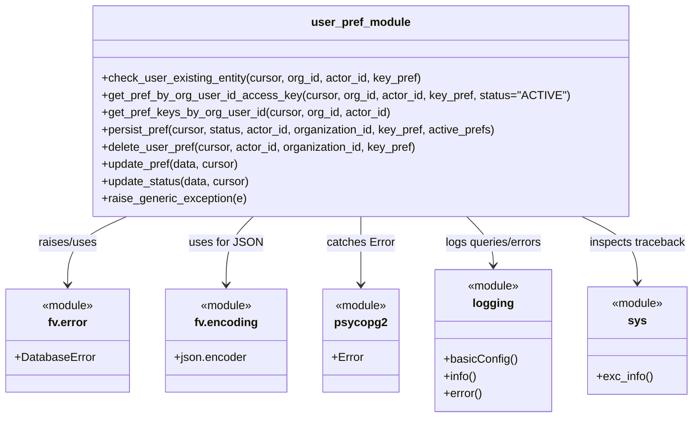

# Diagram: common/iam_service/iam_service/v1/db/prefs.py


> Auto-generated by Obscura crawlers

## Diagram 1

```mermaid
flowchart LR
    Start([start]) --> InitLogging[/"logging.basicConfig(...)"/]
    InitLogging --> CheckExists{check_user_existing_entity}
    CheckExists -->|queries user_preference| DB[(Postgres DB)]
    DB --> CheckExistsResult[/returns bool/]
    CheckExistsResult --> GetPref[get_pref_by_org_user_id_access_key]
    GetPref -->|logs query & fetchone| DB
    GetPref -->|returns active_prefs or {}| PrefResult[/active_prefs or {}/]
    PrefResult --> GetKeys[get_pref_keys_by_org_user_id]
    GetKeys -->|iterates cursor.fetchall| DB
    GetKeys -->|returns list of {key,status}| KeysResult[/list/]
    KeysResult --> Persist[persist_pref]
    Persist -->|if status == INACTIVE| UpdateStatusCall{update_status}
    Persist -->|else INSERT and RETURNING id| InsertOp[(INSERT user_preference)]
    InsertOp -->|on Exception| UpdatePrefCall{update_pref}
    UpdatePrefCall -->|on psycopg2.Error| RaiseGeneric[/raise_generic_exception/]
    UpdateStatusCall --> DB
    UpdatePrefCall --> DB
    RaiseGeneric --> ErrorHandler[/"raises fv.error.DatabaseError or ignores dup key"/]
    DeletePref[delete_user_pref] -->|executes DELETE| DB
    UpdatePref[update_pref] -->|executes UPDATE active_prefs/status| DB
    UpdateStatus[update_status] -->|executes UPDATE status| DB
    End([end])
    Persist --> End
    DeletePref --> End
    UpdatePref --> End
    UpdateStatus --> End
```

> SVG rendering failed for this diagram.

## Diagram 2



### SVG

<svg id="container" width="960.3359375" xmlns="http://www.w3.org/2000/svg" class="classDiagram" height="582" viewBox="0 0 960.3359375 582" role="graphics-document document" aria-roledescription="class"><style>#container{font-family:"trebuchet ms",verdana,arial,sans-serif;font-size:16px;fill:#333;}@keyframes edge-animation-frame{from{stroke-dashoffset:0;}}@keyframes dash{to{stroke-dashoffset:0;}}#container .edge-animation-slow{stroke-dasharray:9,5!important;stroke-dashoffset:900;animation:dash 50s linear infinite;stroke-linecap:round;}#container .edge-animation-fast{stroke-dasharray:9,5!important;stroke-dashoffset:900;animation:dash 20s linear infinite;stroke-linecap:round;}#container .error-icon{fill:#552222;}#container .error-text{fill:#552222;stroke:#552222;}#container .edge-thickness-normal{stroke-width:1px;}#container .edge-thickness-thick{stroke-width:3.5px;}#container .edge-pattern-solid{stroke-dasharray:0;}#container .edge-thickness-invisible{stroke-width:0;fill:none;}#container .edge-pattern-dashed{stroke-dasharray:3;}#container .edge-pattern-dotted{stroke-dasharray:2;}#container .marker{fill:#333333;stroke:#333333;}#container .marker.cross{stroke:#333333;}#container svg{font-family:"trebuchet ms",verdana,arial,sans-serif;font-size:16px;}#container p{margin:0;}#container g.classGroup text{fill:#9370DB;stroke:none;font-family:"trebuchet ms",verdana,arial,sans-serif;font-size:10px;}#container g.classGroup text .title{font-weight:bolder;}#container .nodeLabel,#container .edgeLabel{color:#131300;}#container .edgeLabel .label rect{fill:#ECECFF;}#container .label text{fill:#131300;}#container .labelBkg{background:#ECECFF;}#container .edgeLabel .label span{background:#ECECFF;}#container .classTitle{font-weight:bolder;}#container .node rect,#container .node circle,#container .node ellipse,#container .node polygon,#container .node path{fill:#ECECFF;stroke:#9370DB;stroke-width:1px;}#container .divider{stroke:#9370DB;stroke-width:1;}#container g.clickable{cursor:pointer;}#container g.classGroup rect{fill:#ECECFF;stroke:#9370DB;}#container g.classGroup line{stroke:#9370DB;stroke-width:1;}#container .classLabel .box{stroke:none;stroke-width:0;fill:#ECECFF;opacity:0.5;}#container .classLabel .label{fill:#9370DB;font-size:10px;}#container .relation{stroke:#333333;stroke-width:1;fill:none;}#container .dashed-line{stroke-dasharray:3;}#container .dotted-line{stroke-dasharray:1 2;}#container #compositionStart,#container .composition{fill:#333333!important;stroke:#333333!important;stroke-width:1;}#container #compositionEnd,#container .composition{fill:#333333!important;stroke:#333333!important;stroke-width:1;}#container #dependencyStart,#container .dependency{fill:#333333!important;stroke:#333333!important;stroke-width:1;}#container #dependencyStart,#container .dependency{fill:#333333!important;stroke:#333333!important;stroke-width:1;}#container #extensionStart,#container .extension{fill:transparent!important;stroke:#333333!important;stroke-width:1;}#container #extensionEnd,#container .extension{fill:transparent!important;stroke:#333333!important;stroke-width:1;}#container #aggregationStart,#container .aggregation{fill:transparent!important;stroke:#333333!important;stroke-width:1;}#container #aggregationEnd,#container .aggregation{fill:transparent!important;stroke:#333333!important;stroke-width:1;}#container #lollipopStart,#container .lollipop{fill:#ECECFF!important;stroke:#333333!important;stroke-width:1;}#container #lollipopEnd,#container .lollipop{fill:#ECECFF!important;stroke:#333333!important;stroke-width:1;}#container .edgeTerminals{font-size:11px;line-height:initial;}#container .classTitleText{text-anchor:middle;font-size:18px;fill:#333;}#container .label-icon{display:inline-block;height:1em;overflow:visible;vertical-align:-0.125em;}#container .node .label-icon path{fill:currentColor;stroke:revert;stroke-width:revert;}#container :root{--mermaid-font-family:"trebuchet ms",verdana,arial,sans-serif;}</style><g><defs><marker id="container_class-aggregationStart" class="marker aggregation class" refX="18" refY="7" markerWidth="190" markerHeight="240" orient="auto"><path d="M 18,7 L9,13 L1,7 L9,1 Z"></path></marker></defs><defs><marker id="container_class-aggregationEnd" class="marker aggregation class" refX="1" refY="7" markerWidth="20" markerHeight="28" orient="auto"><path d="M 18,7 L9,13 L1,7 L9,1 Z"></path></marker></defs><defs><marker id="container_class-extensionStart" class="marker extension class" refX="18" refY="7" markerWidth="190" markerHeight="240" orient="auto"><path d="M 1,7 L18,13 V 1 Z"></path></marker></defs><defs><marker id="container_class-extensionEnd" class="marker extension class" refX="1" refY="7" markerWidth="20" markerHeight="28" orient="auto"><path d="M 1,1 V 13 L18,7 Z"></path></marker></defs><defs><marker id="container_class-compositionStart" class="marker composition class" refX="18" refY="7" markerWidth="190" markerHeight="240" orient="auto"><path d="M 18,7 L9,13 L1,7 L9,1 Z"></path></marker></defs><defs><marker id="container_class-compositionEnd" class="marker composition class" refX="1" refY="7" markerWidth="20" markerHeight="28" orient="auto"><path d="M 18,7 L9,13 L1,7 L9,1 Z"></path></marker></defs><defs><marker id="container_class-dependencyStart" class="marker dependency class" refX="6" refY="7" markerWidth="190" markerHeight="240" orient="auto"><path d="M 5,7 L9,13 L1,7 L9,1 Z"></path></marker></defs><defs><marker id="container_class-dependencyEnd" class="marker dependency class" refX="13" refY="7" markerWidth="20" markerHeight="28" orient="auto"><path d="M 18,7 L9,13 L14,7 L9,1 Z"></path></marker></defs><defs><marker id="container_class-lollipopStart" class="marker lollipop class" refX="13" refY="7" markerWidth="190" markerHeight="240" orient="auto"><circle stroke="black" fill="transparent" cx="7" cy="7" r="6"></circle></marker></defs><defs><marker id="container_class-lollipopEnd" class="marker lollipop class" refX="1" refY="7" markerWidth="190" markerHeight="240" orient="auto"><circle stroke="black" fill="transparent" cx="7" cy="7" r="6"></circle></marker></defs><g class="root"><g class="clusters"></g><g class="edgePaths"><path d="M175.357,302L161.771,308.167C148.185,314.333,121.012,326.667,107.426,342.5C93.84,358.333,93.84,377.667,93.84,387.333L93.84,397" id="id_user_pref_module_fv.error_1" class="edge-thickness-normal edge-pattern-solid relation" style=";;;" data-edge="true" data-et="edge" data-id="id_user_pref_module_fv.error_1" data-points="W3sieCI6MTc1LjM1NzAzOTc0MTg0NzgsInkiOjMwMn0seyJ4Ijo5My44Mzk4NDM3NSwieSI6MzM5fSx7IngiOjkzLjgzOTg0Mzc1LCJ5Ijo0MDN9XQ==" marker-end="url(#container_class-dependencyEnd)"></path><path d="M350.731,302L344.502,308.167C338.272,314.333,325.814,326.667,319.585,342.5C313.355,358.333,313.355,377.667,313.355,387.333L313.355,397" id="id_user_pref_module_fv.encoding_2" class="edge-thickness-normal edge-pattern-solid relation" style=";;;" data-edge="true" data-et="edge" data-id="id_user_pref_module_fv.encoding_2" data-points="W3sieCI6MzUwLjczMDkzNTgwMTYzMDQ0LCJ5IjozMDJ9LHsieCI6MzEzLjM1NTQ2ODc1LCJ5IjozMzl9LHsieCI6MzEzLjM1NTQ2ODc1LCJ5Ijo0MDN9XQ==" marker-end="url(#container_class-dependencyEnd)"></path><path d="M499.223,302L499.223,308.167C499.223,314.333,499.223,326.667,499.223,342.5C499.223,358.333,499.223,377.667,499.223,387.333L499.223,397" id="id_user_pref_module_psycopg2_3" class="edge-thickness-normal edge-pattern-solid relation" style=";;;" data-edge="true" data-et="edge" data-id="id_user_pref_module_psycopg2_3" data-points="W3sieCI6NDk5LjIyMjY1NjI1LCJ5IjozMDJ9LHsieCI6NDk5LjIyMjY1NjI1LCJ5IjozMzl9LHsieCI6NDk5LjIyMjY1NjI1LCJ5Ijo0MDN9XQ==" marker-end="url(#container_class-dependencyEnd)"></path><path d="M645.324,302L651.453,308.167C657.582,314.333,669.84,326.667,675.969,338C682.098,349.333,682.098,359.667,682.098,364.833L682.098,370" id="id_user_pref_module_logging_4" class="edge-thickness-normal edge-pattern-solid relation" style=";;;" data-edge="true" data-et="edge" data-id="id_user_pref_module_logging_4" data-points="W3sieCI6NjQ1LjMyMzg3OTA3NjA4NywieSI6MzAyfSx7IngiOjY4Mi4wOTc2NTYyNSwieSI6MzM5fSx7IngiOjY4Mi4wOTc2NTYyNSwieSI6Mzc2fV0=" marker-end="url(#container_class-dependencyEnd)"></path><path d="M805.475,302L818.322,308.167C831.169,314.333,856.864,326.667,869.711,342C882.559,357.333,882.559,375.667,882.559,384.833L882.559,394" id="id_user_pref_module_sys_5" class="edge-thickness-normal edge-pattern-solid relation" style=";;;" data-edge="true" data-et="edge" data-id="id_user_pref_module_sys_5" data-points="W3sieCI6ODA1LjQ3NDczNjc1MjcxNzQsInkiOjMwMn0seyJ4Ijo4ODIuNTU4NTkzNzUsInkiOjMzOX0seyJ4Ijo4ODIuNTU4NTkzNzUsInkiOjQwMH1d" marker-end="url(#container_class-dependencyEnd)"></path></g><g class="edgeLabels"><g class="edgeLabel" transform="translate(93.83984375, 339)"><g class="label" data-id="id_user_pref_module_fv.error_1" transform="translate(-41.65625, -12)"><foreignObject width="83.3125" height="24"><div xmlns="http://www.w3.org/1999/xhtml" class="labelBkg" style="display: table-cell; white-space: nowrap; line-height: 1.5; max-width: 200px; text-align: center;"><span class="edgeLabel"><p>raises/uses</p></span></div></foreignObject></g></g><g class="edgeLabel" transform="translate(313.35546875, 339)"><g class="label" data-id="id_user_pref_module_fv.encoding_2" transform="translate(-48.890625, -12)"><foreignObject width="97.78125" height="24"><div xmlns="http://www.w3.org/1999/xhtml" class="labelBkg" style="display: table-cell; white-space: nowrap; line-height: 1.5; max-width: 200px; text-align: center;"><span class="edgeLabel"><p>uses for JSON</p></span></div></foreignObject></g></g><g class="edgeLabel" transform="translate(499.22265625, 339)"><g class="label" data-id="id_user_pref_module_psycopg2_3" transform="translate(-47.4921875, -12)"><foreignObject width="94.984375" height="24"><div xmlns="http://www.w3.org/1999/xhtml" class="labelBkg" style="display: table-cell; white-space: nowrap; line-height: 1.5; max-width: 200px; text-align: center;"><span class="edgeLabel"><p>catches Error</p></span></div></foreignObject></g></g><g class="edgeLabel" transform="translate(682.09765625, 339)"><g class="label" data-id="id_user_pref_module_logging_4" transform="translate(-69.609375, -12)"><foreignObject width="139.21875" height="24"><div xmlns="http://www.w3.org/1999/xhtml" class="labelBkg" style="display: table-cell; white-space: nowrap; line-height: 1.5; max-width: 200px; text-align: center;"><span class="edgeLabel"><p>logs queries/errors</p></span></div></foreignObject></g></g><g class="edgeLabel" transform="translate(882.55859375, 339)"><g class="label" data-id="id_user_pref_module_sys_5" transform="translate(-67.3828125, -12)"><foreignObject width="134.765625" height="24"><div xmlns="http://www.w3.org/1999/xhtml" class="labelBkg" style="display: table-cell; white-space: nowrap; line-height: 1.5; max-width: 200px; text-align: center;"><span class="edgeLabel"><p>inspects traceback</p></span></div></foreignObject></g></g></g><g class="nodes"><g class="node default" id="classId-user_pref_module-0" transform="translate(499.22265625, 155)"><g class="basic label-container"><path d="M-364.1875 -147 L364.1875 -147 L364.1875 147 L-364.1875 147" stroke="none" stroke-width="0" fill="#ECECFF" style=""></path><path d="M-364.1875 -147 C-128.63468650461039 -147, 106.91812699077923 -147, 364.1875 -147 M-364.1875 -147 C-81.16423441347303 -147, 201.85903117305395 -147, 364.1875 -147 M364.1875 -147 C364.1875 -75.90879127025829, 364.1875 -4.817582540516582, 364.1875 147 M364.1875 -147 C364.1875 -81.11135904098612, 364.1875 -15.222718081972232, 364.1875 147 M364.1875 147 C182.72875895525922 147, 1.2700179105184475 147, -364.1875 147 M364.1875 147 C192.47707027565758 147, 20.766640551315163 147, -364.1875 147 M-364.1875 147 C-364.1875 69.02747882208067, -364.1875 -8.945042355838666, -364.1875 -147 M-364.1875 147 C-364.1875 71.20974051790961, -364.1875 -4.580518964180783, -364.1875 -147" stroke="#9370DB" stroke-width="1.3" fill="none" stroke-dasharray="0 0" style=""></path></g><g class="annotation-group text" transform="translate(0, -123)"></g><g class="label-group text" transform="translate(-66.078125, -123)"><g class="label" style="font-weight: bolder" transform="translate(0,-12)"><foreignObject width="132.15625" height="24"><div xmlns="http://www.w3.org/1999/xhtml" style="display: table-cell; white-space: nowrap; line-height: 1.5; max-width: 181px; text-align: center;"><span class="nodeLabel markdown-node-label" style=""><p>user_pref_module</p></span></div></foreignObject></g></g><g class="members-group text" transform="translate(-352.1875, -75)"></g><g class="methods-group text" transform="translate(-352.1875, -45)"><g class="label" style="" transform="translate(0,-12)"><foreignObject width="448.921875" height="24"><div xmlns="http://www.w3.org/1999/xhtml" style="display: table-cell; white-space: nowrap; line-height: 1.5; max-width: 506px; text-align: center;"><span class="nodeLabel markdown-node-label" style=""><p>+check_user_existing_entity(cursor, org_id, actor_id, key_pref)</p></span></div></foreignObject></g><g class="label" style="" transform="translate(0,12)"><foreignObject width="638.296875" height="24"><div xmlns="http://www.w3.org/1999/xhtml" style="display: table-cell; white-space: nowrap; line-height: 1.5; max-width: 696px; text-align: center;"><span class="nodeLabel markdown-node-label" style=""><p>+get_pref_by_org_user_id_access_key(cursor, org_id, actor_id, key_pref, status="ACTIVE")</p></span></div></foreignObject></g><g class="label" style="" transform="translate(0,36)"><foreignObject width="400.796875" height="24"><div xmlns="http://www.w3.org/1999/xhtml" style="display: table-cell; white-space: nowrap; line-height: 1.5; max-width: 458px; text-align: center;"><span class="nodeLabel markdown-node-label" style=""><p>+get_pref_keys_by_org_user_id(cursor, org_id, actor_id)</p></span></div></foreignObject></g><g class="label" style="" transform="translate(0,60)"><foreignObject width="554.609375" height="24"><div xmlns="http://www.w3.org/1999/xhtml" style="display: table-cell; white-space: nowrap; line-height: 1.5; max-width: 612px; text-align: center;"><span class="nodeLabel markdown-node-label" style=""><p>+persist_pref(cursor, status, actor_id, organization_id, key_pref, active_prefs)</p></span></div></foreignObject></g><g class="label" style="" transform="translate(0,84)"><foreignObject width="442.859375" height="24"><div xmlns="http://www.w3.org/1999/xhtml" style="display: table-cell; white-space: nowrap; line-height: 1.5; max-width: 500px; text-align: center;"><span class="nodeLabel markdown-node-label" style=""><p>+delete_user_pref(cursor, actor_id, organization_id, key_pref)</p></span></div></foreignObject></g><g class="label" style="" transform="translate(0,108)"><foreignObject width="193.4375" height="24"><div xmlns="http://www.w3.org/1999/xhtml" style="display: table-cell; white-space: nowrap; line-height: 1.5; max-width: 251px; text-align: center;"><span class="nodeLabel markdown-node-label" style=""><p>+update_pref(data, cursor)</p></span></div></foreignObject></g><g class="label" style="" transform="translate(0,132)"><foreignObject width="208.546875" height="24"><div xmlns="http://www.w3.org/1999/xhtml" style="display: table-cell; white-space: nowrap; line-height: 1.5; max-width: 266px; text-align: center;"><span class="nodeLabel markdown-node-label" style=""><p>+update_status(data, cursor)</p></span></div></foreignObject></g><g class="label" style="" transform="translate(0,156)"><foreignObject width="202.21875" height="24"><div xmlns="http://www.w3.org/1999/xhtml" style="display: table-cell; white-space: nowrap; line-height: 1.5; max-width: 260px; text-align: center;"><span class="nodeLabel markdown-node-label" style=""><p>+raise_generic_exception(e)</p></span></div></foreignObject></g></g><g class="divider" style=""><path d="M-364.1875 -99 C-189.10652748917673 -99, -14.025554978353455 -99, 364.1875 -99 M-364.1875 -99 C-131.67874681513376 -99, 100.83000636973247 -99, 364.1875 -99" stroke="#9370DB" stroke-width="1.3" fill="none" stroke-dasharray="0 0" style=""></path></g><g class="divider" style=""><path d="M-364.1875 -75 C-189.35917585054116 -75, -14.530851701082327 -75, 364.1875 -75 M-364.1875 -75 C-194.03880276795294 -75, -23.89010553590589 -75, 364.1875 -75" stroke="#9370DB" stroke-width="1.3" fill="none" stroke-dasharray="0 0" style=""></path></g></g><g class="node default" id="classId-fv.error-1" transform="translate(93.83984375, 475)"><g class="basic label-container"><path d="M-85.83984375 -72 L85.83984375 -72 L85.83984375 72 L-85.83984375 72" stroke="none" stroke-width="0" fill="#ECECFF" style=""></path><path d="M-85.83984375 -72 C-28.171301439085013 -72, 29.497240871829973 -72, 85.83984375 -72 M-85.83984375 -72 C-18.01061456077875 -72, 49.8186146284425 -72, 85.83984375 -72 M85.83984375 -72 C85.83984375 -17.4581142306303, 85.83984375 37.0837715387394, 85.83984375 72 M85.83984375 -72 C85.83984375 -23.763143346818893, 85.83984375 24.473713306362214, 85.83984375 72 M85.83984375 72 C43.15669392847513 72, 0.47354410695025706 72, -85.83984375 72 M85.83984375 72 C39.03840600987242 72, -7.763031730255165 72, -85.83984375 72 M-85.83984375 72 C-85.83984375 14.719769906734015, -85.83984375 -42.56046018653197, -85.83984375 -72 M-85.83984375 72 C-85.83984375 40.85431415641282, -85.83984375 9.708628312825638, -85.83984375 -72" stroke="#9370DB" stroke-width="1.3" fill="none" stroke-dasharray="0 0" style=""></path></g><g class="annotation-group text" transform="translate(-36.6015625, -48)"><g class="label" style="" transform="translate(0,-12)"><foreignObject width="73.203125" height="24"><div xmlns="http://www.w3.org/1999/xhtml" style="display: table-cell; white-space: nowrap; line-height: 1.5; max-width: 123px; text-align: center;"><span class="nodeLabel markdown-node-label" style=""><p>«module»</p></span></div></foreignObject></g></g><g class="label-group text" transform="translate(-26.9453125, -24)"><g class="label" style="font-weight: bolder" transform="translate(0,-12)"><foreignObject width="53.890625" height="24"><div xmlns="http://www.w3.org/1999/xhtml" style="display: table-cell; white-space: nowrap; line-height: 1.5; max-width: 103px; text-align: center;"><span class="nodeLabel markdown-node-label" style=""><p>fv.error</p></span></div></foreignObject></g></g><g class="members-group text" transform="translate(-73.83984375, 24)"><g class="label" style="" transform="translate(0,-12)"><foreignObject width="111.078125" height="24"><div xmlns="http://www.w3.org/1999/xhtml" style="display: table-cell; white-space: nowrap; line-height: 1.5; max-width: 169px; text-align: center;"><span class="nodeLabel markdown-node-label" style=""><p>+DatabaseError</p></span></div></foreignObject></g></g><g class="methods-group text" transform="translate(-73.83984375, 72)"></g><g class="divider" style=""><path d="M-85.83984375 0 C-20.396911985711 0, 45.046019778578 0, 85.83984375 0 M-85.83984375 0 C-39.80605244290489 0, 6.227738864190215 0, 85.83984375 0" stroke="#9370DB" stroke-width="1.3" fill="none" stroke-dasharray="0 0" style=""></path></g><g class="divider" style=""><path d="M-85.83984375 48 C-27.399236496596956 48, 31.04137075680609 48, 85.83984375 48 M-85.83984375 48 C-48.59646985602168 48, -11.353095962043355 48, 85.83984375 48" stroke="#9370DB" stroke-width="1.3" fill="none" stroke-dasharray="0 0" style=""></path></g></g><g class="node default" id="classId-fv.encoding-2" transform="translate(313.35546875, 475)"><g class="basic label-container"><path d="M-83.67578125 -72 L83.67578125 -72 L83.67578125 72 L-83.67578125 72" stroke="none" stroke-width="0" fill="#ECECFF" style=""></path><path d="M-83.67578125 -72 C-30.57187107671826 -72, 22.53203909656348 -72, 83.67578125 -72 M-83.67578125 -72 C-33.271393033514784 -72, 17.132995182970433 -72, 83.67578125 -72 M83.67578125 -72 C83.67578125 -17.857586708442156, 83.67578125 36.28482658311569, 83.67578125 72 M83.67578125 -72 C83.67578125 -23.348409990506575, 83.67578125 25.30318001898685, 83.67578125 72 M83.67578125 72 C48.73004603068734 72, 13.78431081137468 72, -83.67578125 72 M83.67578125 72 C31.51483459935259 72, -20.64611205129482 72, -83.67578125 72 M-83.67578125 72 C-83.67578125 17.201930092949162, -83.67578125 -37.596139814101676, -83.67578125 -72 M-83.67578125 72 C-83.67578125 23.30027376941387, -83.67578125 -25.39945246117226, -83.67578125 -72" stroke="#9370DB" stroke-width="1.3" fill="none" stroke-dasharray="0 0" style=""></path></g><g class="annotation-group text" transform="translate(-36.6015625, -48)"><g class="label" style="" transform="translate(0,-12)"><foreignObject width="73.203125" height="24"><div xmlns="http://www.w3.org/1999/xhtml" style="display: table-cell; white-space: nowrap; line-height: 1.5; max-width: 123px; text-align: center;"><span class="nodeLabel markdown-node-label" style=""><p>«module»</p></span></div></foreignObject></g></g><g class="label-group text" transform="translate(-41.9296875, -24)"><g class="label" style="font-weight: bolder" transform="translate(0,-12)"><foreignObject width="83.859375" height="24"><div xmlns="http://www.w3.org/1999/xhtml" style="display: table-cell; white-space: nowrap; line-height: 1.5; max-width: 133px; text-align: center;"><span class="nodeLabel markdown-node-label" style=""><p>fv.encoding</p></span></div></foreignObject></g></g><g class="members-group text" transform="translate(-71.67578125, 24)"><g class="label" style="" transform="translate(0,-12)"><foreignObject width="101.421875" height="24"><div xmlns="http://www.w3.org/1999/xhtml" style="display: table-cell; white-space: nowrap; line-height: 1.5; max-width: 160px; text-align: center;"><span class="nodeLabel markdown-node-label" style=""><p>+json.encoder</p></span></div></foreignObject></g></g><g class="methods-group text" transform="translate(-71.67578125, 72)"></g><g class="divider" style=""><path d="M-83.67578125 0 C-33.31478781813943 0, 17.046205613721142 0, 83.67578125 0 M-83.67578125 0 C-42.81948148677181 0, -1.963181723543613 0, 83.67578125 0" stroke="#9370DB" stroke-width="1.3" fill="none" stroke-dasharray="0 0" style=""></path></g><g class="divider" style=""><path d="M-83.67578125 48 C-26.544975162829758 48, 30.585830924340485 48, 83.67578125 48 M-83.67578125 48 C-26.80541399868323 48, 30.064953252633543 48, 83.67578125 48" stroke="#9370DB" stroke-width="1.3" fill="none" stroke-dasharray="0 0" style=""></path></g></g><g class="node default" id="classId-psycopg2-3" transform="translate(499.22265625, 475)"><g class="basic label-container"><path d="M-52.19140625 -72 L52.19140625 -72 L52.19140625 72 L-52.19140625 72" stroke="none" stroke-width="0" fill="#ECECFF" style=""></path><path d="M-52.19140625 -72 C-13.551731981440646 -72, 25.087942287118707 -72, 52.19140625 -72 M-52.19140625 -72 C-26.300323936608365 -72, -0.4092416232167295 -72, 52.19140625 -72 M52.19140625 -72 C52.19140625 -16.396523278324935, 52.19140625 39.20695344335013, 52.19140625 72 M52.19140625 -72 C52.19140625 -42.287168755776555, 52.19140625 -12.57433751155311, 52.19140625 72 M52.19140625 72 C28.64417947152273 72, 5.096952693045459 72, -52.19140625 72 M52.19140625 72 C20.85105229722196 72, -10.489301655556083 72, -52.19140625 72 M-52.19140625 72 C-52.19140625 16.753813779901563, -52.19140625 -38.492372440196874, -52.19140625 -72 M-52.19140625 72 C-52.19140625 27.933103473754414, -52.19140625 -16.13379305249117, -52.19140625 -72" stroke="#9370DB" stroke-width="1.3" fill="none" stroke-dasharray="0 0" style=""></path></g><g class="annotation-group text" transform="translate(-36.6015625, -48)"><g class="label" style="" transform="translate(0,-12)"><foreignObject width="73.203125" height="24"><div xmlns="http://www.w3.org/1999/xhtml" style="display: table-cell; white-space: nowrap; line-height: 1.5; max-width: 123px; text-align: center;"><span class="nodeLabel markdown-node-label" style=""><p>«module»</p></span></div></foreignObject></g></g><g class="label-group text" transform="translate(-34.234375, -24)"><g class="label" style="font-weight: bolder" transform="translate(0,-12)"><foreignObject width="68.46875" height="24"><div xmlns="http://www.w3.org/1999/xhtml" style="display: table-cell; white-space: nowrap; line-height: 1.5; max-width: 117px; text-align: center;"><span class="nodeLabel markdown-node-label" style=""><p>psycopg2</p></span></div></foreignObject></g></g><g class="members-group text" transform="translate(-40.19140625, 24)"><g class="label" style="" transform="translate(0,-12)"><foreignObject width="43.78125" height="24"><div xmlns="http://www.w3.org/1999/xhtml" style="display: table-cell; white-space: nowrap; line-height: 1.5; max-width: 102px; text-align: center;"><span class="nodeLabel markdown-node-label" style=""><p>+Error</p></span></div></foreignObject></g></g><g class="methods-group text" transform="translate(-40.19140625, 72)"></g><g class="divider" style=""><path d="M-52.19140625 0 C-18.88844822486358 0, 14.414509800272839 0, 52.19140625 0 M-52.19140625 0 C-19.129975703156674 0, 13.931454843686652 0, 52.19140625 0" stroke="#9370DB" stroke-width="1.3" fill="none" stroke-dasharray="0 0" style=""></path></g><g class="divider" style=""><path d="M-52.19140625 48 C-29.47977557362879 48, -6.768144897257578 48, 52.19140625 48 M-52.19140625 48 C-11.923570261865677 48, 28.344265726268645 48, 52.19140625 48" stroke="#9370DB" stroke-width="1.3" fill="none" stroke-dasharray="0 0" style=""></path></g></g><g class="node default" id="classId-logging-4" transform="translate(682.09765625, 475)"><g class="basic label-container"><path d="M-80.68359375 -99 L80.68359375 -99 L80.68359375 99 L-80.68359375 99" stroke="none" stroke-width="0" fill="#ECECFF" style=""></path><path d="M-80.68359375 -99 C-32.283700648630855 -99, 16.11619245273829 -99, 80.68359375 -99 M-80.68359375 -99 C-45.40848973836421 -99, -10.13338572672842 -99, 80.68359375 -99 M80.68359375 -99 C80.68359375 -38.11028263961157, 80.68359375 22.779434720776862, 80.68359375 99 M80.68359375 -99 C80.68359375 -42.69514388041725, 80.68359375 13.609712239165503, 80.68359375 99 M80.68359375 99 C30.686427551520808 99, -19.310738646958384 99, -80.68359375 99 M80.68359375 99 C33.24900181668513 99, -14.18559011662974 99, -80.68359375 99 M-80.68359375 99 C-80.68359375 47.44353479914318, -80.68359375 -4.1129304017136405, -80.68359375 -99 M-80.68359375 99 C-80.68359375 30.819258898816855, -80.68359375 -37.36148220236629, -80.68359375 -99" stroke="#9370DB" stroke-width="1.3" fill="none" stroke-dasharray="0 0" style=""></path></g><g class="annotation-group text" transform="translate(-36.6015625, -75)"><g class="label" style="" transform="translate(0,-12)"><foreignObject width="73.203125" height="24"><div xmlns="http://www.w3.org/1999/xhtml" style="display: table-cell; white-space: nowrap; line-height: 1.5; max-width: 123px; text-align: center;"><span class="nodeLabel markdown-node-label" style=""><p>«module»</p></span></div></foreignObject></g></g><g class="label-group text" transform="translate(-27.109375, -51)"><g class="label" style="font-weight: bolder" transform="translate(0,-12)"><foreignObject width="54.21875" height="24"><div xmlns="http://www.w3.org/1999/xhtml" style="display: table-cell; white-space: nowrap; line-height: 1.5; max-width: 103px; text-align: center;"><span class="nodeLabel markdown-node-label" style=""><p>logging</p></span></div></foreignObject></g></g><g class="members-group text" transform="translate(-68.68359375, -3)"></g><g class="methods-group text" transform="translate(-68.68359375, 27)"><g class="label" style="" transform="translate(0,-12)"><foreignObject width="100.765625" height="24"><div xmlns="http://www.w3.org/1999/xhtml" style="display: table-cell; white-space: nowrap; line-height: 1.5; max-width: 158px; text-align: center;"><span class="nodeLabel markdown-node-label" style=""><p>+basicConfig()</p></span></div></foreignObject></g><g class="label" style="" transform="translate(0,12)"><foreignObject width="46.796875" height="24"><div xmlns="http://www.w3.org/1999/xhtml" style="display: table-cell; white-space: nowrap; line-height: 1.5; max-width: 104px; text-align: center;"><span class="nodeLabel markdown-node-label" style=""><p>+info()</p></span></div></foreignObject></g><g class="label" style="" transform="translate(0,36)"><foreignObject width="54.46875" height="24"><div xmlns="http://www.w3.org/1999/xhtml" style="display: table-cell; white-space: nowrap; line-height: 1.5; max-width: 112px; text-align: center;"><span class="nodeLabel markdown-node-label" style=""><p>+error()</p></span></div></foreignObject></g></g><g class="divider" style=""><path d="M-80.68359375 -27 C-31.658419441789178 -27, 17.366754866421644 -27, 80.68359375 -27 M-80.68359375 -27 C-36.706723508016545 -27, 7.270146733966911 -27, 80.68359375 -27" stroke="#9370DB" stroke-width="1.3" fill="none" stroke-dasharray="0 0" style=""></path></g><g class="divider" style=""><path d="M-80.68359375 -3 C-17.138563029901768 -3, 46.406467690196465 -3, 80.68359375 -3 M-80.68359375 -3 C-30.975186465653344 -3, 18.73322081869331 -3, 80.68359375 -3" stroke="#9370DB" stroke-width="1.3" fill="none" stroke-dasharray="0 0" style=""></path></g></g><g class="node default" id="classId-sys-5" transform="translate(882.55859375, 475)"><g class="basic label-container"><path d="M-69.77734375 -75 L69.77734375 -75 L69.77734375 75 L-69.77734375 75" stroke="none" stroke-width="0" fill="#ECECFF" style=""></path><path d="M-69.77734375 -75 C-29.615441949114178 -75, 10.546459851771644 -75, 69.77734375 -75 M-69.77734375 -75 C-32.363337042694766 -75, 5.050669664610467 -75, 69.77734375 -75 M69.77734375 -75 C69.77734375 -35.5287199817587, 69.77734375 3.942560036482604, 69.77734375 75 M69.77734375 -75 C69.77734375 -16.999140969144243, 69.77734375 41.001718061711514, 69.77734375 75 M69.77734375 75 C37.306993432451 75, 4.836643114902003 75, -69.77734375 75 M69.77734375 75 C19.880197728809314 75, -30.01694829238137 75, -69.77734375 75 M-69.77734375 75 C-69.77734375 22.261364564372727, -69.77734375 -30.477270871254547, -69.77734375 -75 M-69.77734375 75 C-69.77734375 31.85996199709814, -69.77734375 -11.280076005803721, -69.77734375 -75" stroke="#9370DB" stroke-width="1.3" fill="none" stroke-dasharray="0 0" style=""></path></g><g class="annotation-group text" transform="translate(-36.6015625, -51)"><g class="label" style="" transform="translate(0,-12)"><foreignObject width="73.203125" height="24"><div xmlns="http://www.w3.org/1999/xhtml" style="display: table-cell; white-space: nowrap; line-height: 1.5; max-width: 123px; text-align: center;"><span class="nodeLabel markdown-node-label" style=""><p>«module»</p></span></div></foreignObject></g></g><g class="label-group text" transform="translate(-11.6484375, -27)"><g class="label" style="font-weight: bolder" transform="translate(0,-12)"><foreignObject width="23.296875" height="24"><div xmlns="http://www.w3.org/1999/xhtml" style="display: table-cell; white-space: nowrap; line-height: 1.5; max-width: 72px; text-align: center;"><span class="nodeLabel markdown-node-label" style=""><p>sys</p></span></div></foreignObject></g></g><g class="members-group text" transform="translate(-57.77734375, 21)"></g><g class="methods-group text" transform="translate(-57.77734375, 51)"><g class="label" style="" transform="translate(0,-12)"><foreignObject width="78.953125" height="24"><div xmlns="http://www.w3.org/1999/xhtml" style="display: table-cell; white-space: nowrap; line-height: 1.5; max-width: 136px; text-align: center;"><span class="nodeLabel markdown-node-label" style=""><p>+exc_info()</p></span></div></foreignObject></g></g><g class="divider" style=""><path d="M-69.77734375 -3 C-38.99526903160243 -3, -8.213194313204866 -3, 69.77734375 -3 M-69.77734375 -3 C-25.436381302666035 -3, 18.90458114466793 -3, 69.77734375 -3" stroke="#9370DB" stroke-width="1.3" fill="none" stroke-dasharray="0 0" style=""></path></g><g class="divider" style=""><path d="M-69.77734375 21 C-28.88128589298558 21, 12.014771964028839 21, 69.77734375 21 M-69.77734375 21 C-29.335754250782713 21, 11.105835248434573 21, 69.77734375 21" stroke="#9370DB" stroke-width="1.3" fill="none" stroke-dasharray="0 0" style=""></path></g></g></g></g></g></svg>
