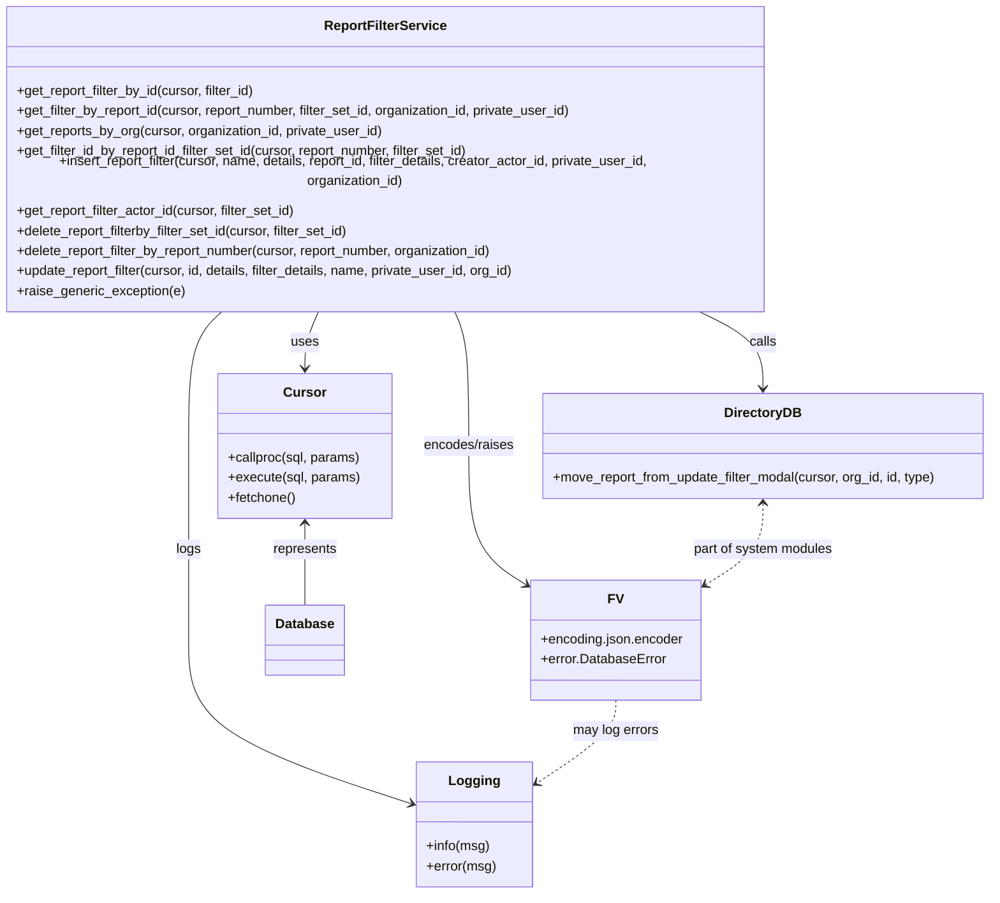

# Diagram: common/iam_service/iam_service/v1/db/report_filters.py

> Auto-generated by Obscura crawlers

## Mermaid

### SVG

<svg id="container" width="1211.662109375" xmlns="http://www.w3.org/2000/svg" class="classDiagram" height="1048" viewBox="0 0 1211.662109375 1048" role="graphics-document document" aria-roledescription="class"><g><defs><marker id="container_class-aggregationStart" class="marker aggregation class" refX="18" refY="7" markerWidth="190" markerHeight="240" orient="auto"><path d="M 18,7 L9,13 L1,7 L9,1 Z"></path></marker></defs><defs><marker id="container_class-aggregationEnd" class="marker aggregation class" refX="1" refY="7" markerWidth="20" markerHeight="28" orient="auto"><path d="M 18,7 L9,13 L1,7 L9,1 Z"></path></marker></defs><defs><marker id="container_class-extensionStart" class="marker extension class" refX="18" refY="7" markerWidth="190" markerHeight="240" orient="auto"><path d="M 1,7 L18,13 V 1 Z"></path></marker></defs><defs><marker id="container_class-extensionEnd" class="marker extension class" refX="1" refY="7" markerWidth="20" markerHeight="28" orient="auto"><path d="M 1,1 V 13 L18,7 Z"></path></marker></defs><defs><marker id="container_class-compositionStart" class="marker composition class" refX="18" refY="7" markerWidth="190" markerHeight="240" orient="auto"><path d="M 18,7 L9,13 L1,7 L9,1 Z"></path></marker></defs><defs><marker id="container_class-compositionEnd" class="marker composition class" refX="1" refY="7" markerWidth="20" markerHeight="28" orient="auto"><path d="M 18,7 L9,13 L1,7 L9,1 Z"></path></marker></defs><defs><marker id="container_class-dependencyStart" class="marker dependency class" refX="6" refY="7" markerWidth="190" markerHeight="240" orient="auto"><path d="M 5,7 L9,13 L1,7 L9,1 Z"></path></marker></defs><defs><marker id="container_class-dependencyEnd" class="marker dependency class" refX="13" refY="7" markerWidth="20" markerHeight="28" orient="auto"><path d="M 18,7 L9,13 L14,7 L9,1 Z"></path></marker></defs><defs><marker id="container_class-lollipopStart" class="marker lollipop class" refX="13" refY="7" markerWidth="190" markerHeight="240" orient="auto"><circle stroke="black" fill="transparent" cx="7" cy="7" r="6"></circle></marker></defs><defs><marker id="container_class-lollipopEnd" class="marker lollipop class" refX="1" refY="7" markerWidth="190" markerHeight="240" orient="auto"><circle stroke="black" fill="transparent" cx="7" cy="7" r="6"></circle></marker></defs><g class="root"><g class="clusters"></g><g class="edgePaths"><path d="M398.38,350L395.503,356.167C392.625,362.333,386.871,374.667,383.994,386C381.117,397.333,381.117,407.667,381.117,412.833L381.117,418" id="id_ReportFilterService_Cursor_1" class="edge-thickness-normal edge-pattern-solid relation" style=";;;" data-edge="true" data-et="edge" data-id="id_ReportFilterService_Cursor_1" data-points="W3sieCI6Mzk4LjM3OTYzODY3MTg3NSwieSI6MzUwfSx7IngiOjM4MS4xMTcxODc1LCJ5IjozODd9LHsieCI6MzgxLjExNzE4NzUsInkiOjQyNH1d" marker-end="url(#container_class-dependencyEnd)"></path><path d="M854.331,350L867.897,356.167C881.462,362.333,908.593,374.667,922.159,390C935.725,405.333,935.725,423.667,935.725,432.833L935.725,442" id="id_ReportFilterService_DirectoryDB_2" class="edge-thickness-normal edge-pattern-solid relation" style=";;;" data-edge="true" data-et="edge" data-id="id_ReportFilterService_DirectoryDB_2" data-points="W3sieCI6ODU0LjMzMDkzMjYxNzE4NzUsInkiOjM1MH0seyJ4Ijo5MzUuNzI0NjA5Mzc1LCJ5IjozODd9LHsieCI6OTM1LjcyNDYwOTM3NSwieSI6NDQ4fV0=" marker-end="url(#container_class-dependencyEnd)"></path><path d="M559.705,350L562.646,356.167C565.587,362.333,571.468,374.667,574.409,401.5C577.35,428.333,577.35,469.667,577.35,511C577.35,552.333,577.35,593.667,589.325,621.618C601.301,649.57,625.253,664.139,637.228,671.424L649.204,678.709" id="id_ReportFilterService_FV_3" class="edge-thickness-normal edge-pattern-solid relation" style=";;;" data-edge="true" data-et="edge" data-id="id_ReportFilterService_FV_3" data-points="W3sieCI6NTU5LjcwNTMzMTY1NTY0OSwieSI6MzUwfSx7IngiOjU3Ny4zNDk2MDkzNzUsInkiOjM4N30seyJ4Ijo1NzcuMzQ5NjA5Mzc1LCJ5Ijo1MTF9LHsieCI6NTc3LjM0OTYwOTM3NSwieSI6NjM1fSx7IngiOjY1NC4zMzAwNzgxMjUsInkiOjY4MS44MjczMjM4NTc2OTF9XQ==" marker-end="url(#container_class-dependencyEnd)"></path><path d="M284.395,350L277.407,356.167C270.419,362.333,256.444,374.667,249.456,401.5C242.469,428.333,242.469,469.667,242.469,511C242.469,552.333,242.469,593.667,242.469,632.5C242.469,671.333,242.469,707.667,242.469,744C242.469,780.333,242.469,816.667,287.723,849.501C332.976,882.335,423.484,911.67,468.738,926.338L513.992,941.005" id="id_ReportFilterService_Logging_4" class="edge-thickness-normal edge-pattern-solid relation" style=";;;" data-edge="true" data-et="edge" data-id="id_ReportFilterService_Logging_4" data-points="W3sieCI6Mjg0LjM5NDYyNTE1MDI0MDM2LCJ5IjozNTB9LHsieCI6MjQyLjQ2ODc1LCJ5IjozODd9LHsieCI6MjQyLjQ2ODc1LCJ5Ijo1MTF9LHsieCI6MjQyLjQ2ODc1LCJ5Ijo2MzV9LHsieCI6MjQyLjQ2ODc1LCJ5Ijo3NDR9LHsieCI6MjQyLjQ2ODc1LCJ5Ijo4NTN9LHsieCI6NTE5LjY5OTIxODc1LCJ5Ijo5NDIuODU0OTg4NTgyNjY4M31d" marker-end="url(#container_class-dependencyEnd)"></path><path d="M381.117,604L381.117,609.167C381.117,614.333,381.117,624.667,381.117,641C381.117,657.333,381.117,679.667,381.117,690.833L381.117,702" id="id_Cursor_Database_5" class="edge-thickness-normal edge-pattern-solid relation" style=";;;" data-edge="true" data-et="edge" data-id="id_Cursor_Database_5" data-points="W3sieCI6MzgxLjExNzE4NzUsInkiOjU5OH0seyJ4IjozODEuMTE3MTg3NSwieSI6NjM1fSx7IngiOjM4MS4xMTcxODc1LCJ5Ijo3MDJ9XQ==" marker-start="url(#container_class-dependencyStart)"></path><path d="M756.537,816L756.537,822.167C756.537,828.333,756.537,840.667,740.672,857.378C724.806,874.089,693.075,895.179,677.21,905.723L661.345,916.268" id="id_FV_Logging_6" class="edge-thickness-normal edge-pattern-dashed relation" style=";;;" data-edge="true" data-et="edge" data-id="id_FV_Logging_6" data-points="W3sieCI6NzU2LjUzNzEwOTM3NSwieSI6ODE2fSx7IngiOjc1Ni41MzcxMDkzNzUsInkiOjg1M30seyJ4Ijo2NTYuMzQ3NjU2MjUsInkiOjkxOS41ODkzNjcwNTMzOTY2fV0=" marker-end="url(#container_class-dependencyEnd)"></path><path d="M935.725,580L935.725,589.167C935.725,598.333,935.725,616.667,923.749,633.118C911.773,649.57,887.822,664.139,875.846,671.424L863.87,678.709" id="id_DirectoryDB_FV_7" class="edge-thickness-normal edge-pattern-dashed relation" style=";;;" data-edge="true" data-et="edge" data-id="id_DirectoryDB_FV_7" data-points="W3sieCI6OTM1LjcyNDYwOTM3NSwieSI6NTc0fSx7IngiOjkzNS43MjQ2MDkzNzUsInkiOjYzNX0seyJ4Ijo4NTguNzQ0MTQwNjI1LCJ5Ijo2ODEuODI3MzIzODU3NjkxfV0=" marker-start="url(#container_class-dependencyStart)" marker-end="url(#container_class-dependencyEnd)"></path></g><g class="edgeLabels"><g class="edgeLabel" transform="translate(381.1171875, 387)"><g class="label" data-id="id_ReportFilterService_Cursor_1" transform="translate(-16.4921875, -12)"><foreignObject width="32.984375" height="24">

uses

</foreignObject></g></g><g class="edgeLabel" transform="translate(935.724609375, 387)"><g class="label" data-id="id_ReportFilterService_DirectoryDB_2" transform="translate(-16.4453125, -12)"><foreignObject width="32.890625" height="24">

calls

</foreignObject></g></g><g class="edgeLabel" transform="translate(577.349609375, 511)"><g class="label" data-id="id_ReportFilterService_FV_3" transform="translate(-55.4375, -12)"><foreignObject width="110.875" height="24">

encodes/raises

</foreignObject></g></g><g class="edgeLabel" transform="translate(242.46875, 635)"><g class="label" data-id="id_ReportFilterService_Logging_4" transform="translate(-14.8203125, -12)"><foreignObject width="29.640625" height="24">

logs

</foreignObject></g></g><g class="edgeLabel" transform="translate(381.1171875, 635)"><g class="label" data-id="id_Cursor_Database_5" transform="translate(-38.578125, -12)"><foreignObject width="77.15625" height="24">

represents

</foreignObject></g></g><g class="edgeLabel" transform="translate(756.537109375, 853)"><g class="label" data-id="id_FV_Logging_6" transform="translate(-52.078125, -12)"><foreignObject width="104.15625" height="24">

may log errors

</foreignObject></g></g><g class="edgeLabel" transform="translate(935.724609375, 635)"><g class="label" data-id="id_DirectoryDB_FV_7" transform="translate(-85.28125, -12)"><foreignObject width="170.5625" height="24">

part of system modules

</foreignObject></g></g></g><g class="nodes"><g class="node default" id="classId-ReportFilterService-0" transform="translate(478.16015625, 179)"><g class="basic label-container"><path d="M-470.16015625 -171 L470.16015625 -171 L470.16015625 171 L-470.16015625 171" stroke="none" stroke-width="0" fill="#ECECFF" style=""></path><path d="M-470.16015625 -171 C-108.61868849236743 -171, 252.92277926526515 -171, 470.16015625 -171 M-470.16015625 -171 C-214.95436787515368 -171, 40.25142049969264 -171, 470.16015625 -171 M470.16015625 -171 C470.16015625 -69.11004066302145, 470.16015625 32.7799186739571, 470.16015625 171 M470.16015625 -171 C470.16015625 -57.296495813110226, 470.16015625 56.40700837377955, 470.16015625 171 M470.16015625 171 C221.32163430308512 171, -27.51688764382976 171, -470.16015625 171 M470.16015625 171 C100.75576668110432 171, -268.64862288779136 171, -470.16015625 171 M-470.16015625 171 C-470.16015625 85.00173109834937, -470.16015625 -0.9965378033012655, -470.16015625 -171 M-470.16015625 171 C-470.16015625 62.74165540272848, -470.16015625 -45.516689194543034, -470.16015625 -171" stroke="#9370DB" stroke-width="1.3" fill="none" stroke-dasharray="0 0" style=""></path></g><g class="annotation-group text" transform="translate(0, -147)"></g><g class="label-group text" transform="translate(-70.4921875, -147)"><g class="label" style="font-weight: bolder" transform="translate(0,-12)"><foreignObject width="140.984375" height="24">

ReportFilterService

</foreignObject></g></g><g class="members-group text" transform="translate(-458.16015625, -99)"></g><g class="methods-group text" transform="translate(-458.16015625, -69)"><g class="label" style="" transform="translate(0,-12)"><foreignObject width="291.015625" height="24">

+get_report_filter_by_id(cursor, filter_id)

</foreignObject></g><g class="label" style="" transform="translate(0,12)"><foreignObject width="678.59375" height="24">

+get_filter_by_report_id(cursor, report_number, filter_set_id, organization_id, private_user_id)

</foreignObject></g><g class="label" style="" transform="translate(0,36)"><foreignObject width="442.96875" height="24">

+get_reports_by_org(cursor, organization_id, private_user_id)

</foreignObject></g><g class="label" style="" transform="translate(0,60)"><foreignObject width="554.5625" height="24">

+get_filter_id_by_report_id_filter_set_id(cursor, report_number, filter_set_id)

</foreignObject></g><g class="label" style="" transform="translate(0,84)"><foreignObject width="845.828125" height="24">

+insert_report_filter(cursor, name, details, report_id, filter_details, creator_actor_id, private_user_id, organization_id)

</foreignObject></g><g class="label" style="" transform="translate(0,108)"><foreignObject width="340.28125" height="24">

+get_report_filter_actor_id(cursor, filter_set_id)

</foreignObject></g><g class="label" style="" transform="translate(0,132)"><foreignObject width="408.578125" height="24">

+delete_report_filterby_filter_set_id(cursor, filter_set_id)

</foreignObject></g><g class="label" style="" transform="translate(0,156)"><foreignObject width="584.71875" height="24">

+delete_report_filter_by_report_number(cursor, report_number, organization_id)

</foreignObject></g><g class="label" style="" transform="translate(0,180)"><foreignObject width="609.609375" height="24">

+update_report_filter(cursor, id, details, filter_details, name, private_user_id, org_id)

</foreignObject></g><g class="label" style="" transform="translate(0,204)"><foreignObject width="202.21875" height="24">

+raise_generic_exception(e)

</foreignObject></g></g><g class="divider" style=""><path d="M-470.16015625 -123 C-117.10608731150796 -123, 235.94798162698407 -123, 470.16015625 -123 M-470.16015625 -123 C-270.0614896403596 -123, -69.96282303071922 -123, 470.16015625 -123" stroke="#9370DB" stroke-width="1.3" fill="none" stroke-dasharray="0 0" style=""></path></g><g class="divider" style=""><path d="M-470.16015625 -99 C-263.0178371279668 -99, -55.8755180059336 -99, 470.16015625 -99 M-470.16015625 -99 C-203.4344951817584 -99, 63.29116588648321 -99, 470.16015625 -99" stroke="#9370DB" stroke-width="1.3" fill="none" stroke-dasharray="0 0" style=""></path></g></g><g class="node default" id="classId-Cursor-1" transform="translate(381.1171875, 511)"><g class="basic label-container"><path d="M-103.6484375 -87 L103.6484375 -87 L103.6484375 87 L-103.6484375 87" stroke="none" stroke-width="0" fill="#ECECFF" style=""></path><path d="M-103.6484375 -87 C-30.559967611403735 -87, 42.52850227719253 -87, 103.6484375 -87 M-103.6484375 -87 C-24.98829796996236 -87, 53.67184156007528 -87, 103.6484375 -87 M103.6484375 -87 C103.6484375 -29.275905269245683, 103.6484375 28.448189461508633, 103.6484375 87 M103.6484375 -87 C103.6484375 -47.3736550264588, 103.6484375 -7.747310052917598, 103.6484375 87 M103.6484375 87 C54.286037187776586 87, 4.923636875553171 87, -103.6484375 87 M103.6484375 87 C27.784915223832456 87, -48.07860705233509 87, -103.6484375 87 M-103.6484375 87 C-103.6484375 32.29029267639835, -103.6484375 -22.419414647203297, -103.6484375 -87 M-103.6484375 87 C-103.6484375 41.92732520867605, -103.6484375 -3.1453495826478957, -103.6484375 -87" stroke="#9370DB" stroke-width="1.3" fill="none" stroke-dasharray="0 0" style=""></path></g><g class="annotation-group text" transform="translate(0, -63)"></g><g class="label-group text" transform="translate(-23.90625, -63)"><g class="label" style="font-weight: bolder" transform="translate(0,-12)"><foreignObject width="47.8125" height="24">

Cursor

</foreignObject></g></g><g class="members-group text" transform="translate(-91.6484375, -15)"></g><g class="methods-group text" transform="translate(-91.6484375, 15)"><g class="label" style="" transform="translate(0,-12)"><foreignObject width="159.390625" height="24">

+callproc(sql, params)

</foreignObject></g><g class="label" style="" transform="translate(0,12)"><foreignObject width="157.75" height="24">

+execute(sql, params)

</foreignObject></g><g class="label" style="" transform="translate(0,36)"><foreignObject width="82.046875" height="24">

+fetchone()

</foreignObject></g></g><g class="divider" style=""><path d="M-103.6484375 -39 C-25.46147529653841 -39, 52.72548690692318 -39, 103.6484375 -39 M-103.6484375 -39 C-44.169218634523965 -39, 15.31000023095207 -39, 103.6484375 -39" stroke="#9370DB" stroke-width="1.3" fill="none" stroke-dasharray="0 0" style=""></path></g><g class="divider" style=""><path d="M-103.6484375 -15 C-33.04121996045956 -15, 37.565997579080886 -15, 103.6484375 -15 M-103.6484375 -15 C-39.66910027512786 -15, 24.31023694974428 -15, 103.6484375 -15" stroke="#9370DB" stroke-width="1.3" fill="none" stroke-dasharray="0 0" style=""></path></g></g><g class="node default" id="classId-DirectoryDB-2" transform="translate(935.724609375, 511)"><g class="basic label-container"><path d="M-267.9375 -63 L267.9375 -63 L267.9375 63 L-267.9375 63" stroke="none" stroke-width="0" fill="#ECECFF" style=""></path><path d="M-267.9375 -63 C-71.99312332872188 -63, 123.95125334255624 -63, 267.9375 -63 M-267.9375 -63 C-160.6368434176817 -63, -53.33618683536338 -63, 267.9375 -63 M267.9375 -63 C267.9375 -24.803954706573244, 267.9375 13.392090586853513, 267.9375 63 M267.9375 -63 C267.9375 -33.695152489878836, 267.9375 -4.39030497975768, 267.9375 63 M267.9375 63 C117.80907921241365 63, -32.3193415751727 63, -267.9375 63 M267.9375 63 C101.26843170731095 63, -65.4006365853781 63, -267.9375 63 M-267.9375 63 C-267.9375 31.631634001376163, -267.9375 0.2632680027523264, -267.9375 -63 M-267.9375 63 C-267.9375 37.26984128067035, -267.9375 11.539682561340705, -267.9375 -63" stroke="#9370DB" stroke-width="1.3" fill="none" stroke-dasharray="0 0" style=""></path></g><g class="annotation-group text" transform="translate(0, -39)"></g><g class="label-group text" transform="translate(-43.796875, -39)"><g class="label" style="font-weight: bolder" transform="translate(0,-12)"><foreignObject width="87.59375" height="24">

DirectoryDB

</foreignObject></g></g><g class="members-group text" transform="translate(-255.9375, 9)"></g><g class="methods-group text" transform="translate(-255.9375, 39)"><g class="label" style="" transform="translate(0,-12)"><foreignObject width="468.078125" height="24">

+move_report_from_update_filter_modal(cursor, org_id, id, type)

</foreignObject></g></g><g class="divider" style=""><path d="M-267.9375 -15 C-128.338427330522 -15, 11.26064533895601 -15, 267.9375 -15 M-267.9375 -15 C-139.9805230666639 -15, -12.023546133327784 -15, 267.9375 -15" stroke="#9370DB" stroke-width="1.3" fill="none" stroke-dasharray="0 0" style=""></path></g><g class="divider" style=""><path d="M-267.9375 9 C-79.91188001731928 9, 108.11373996536145 9, 267.9375 9 M-267.9375 9 C-101.31163403547504 9, 65.31423192904992 9, 267.9375 9" stroke="#9370DB" stroke-width="1.3" fill="none" stroke-dasharray="0 0" style=""></path></g></g><g class="node default" id="classId-FV-3" transform="translate(756.537109375, 744)"><g class="basic label-container"><path d="M-102.20703125 -72 L102.20703125 -72 L102.20703125 72 L-102.20703125 72" stroke="none" stroke-width="0" fill="#ECECFF" style=""></path><path d="M-102.20703125 -72 C-38.97648326593398 -72, 24.254064718132042 -72, 102.20703125 -72 M-102.20703125 -72 C-56.48562299692497 -72, -10.764214743849934 -72, 102.20703125 -72 M102.20703125 -72 C102.20703125 -16.906021613962047, 102.20703125 38.18795677207591, 102.20703125 72 M102.20703125 -72 C102.20703125 -29.457229900869955, 102.20703125 13.085540198260091, 102.20703125 72 M102.20703125 72 C25.626514434996807 72, -50.954002380006386 72, -102.20703125 72 M102.20703125 72 C27.52211402058225 72, -47.1628032088355 72, -102.20703125 72 M-102.20703125 72 C-102.20703125 26.287970548090243, -102.20703125 -19.424058903819514, -102.20703125 -72 M-102.20703125 72 C-102.20703125 17.351492763259344, -102.20703125 -37.29701447348131, -102.20703125 -72" stroke="#9370DB" stroke-width="1.3" fill="none" stroke-dasharray="0 0" style=""></path></g><g class="annotation-group text" transform="translate(0, -48)"></g><g class="label-group text" transform="translate(-8.4609375, -48)"><g class="label" style="font-weight: bolder" transform="translate(0,-12)"><foreignObject width="16.921875" height="24">

FV

</foreignObject></g></g><g class="members-group text" transform="translate(-90.20703125, 0)"><g class="label" style="" transform="translate(0,-12)"><foreignObject width="171.953125" height="24">

+encoding.json.encoder

</foreignObject></g><g class="label" style="" transform="translate(0,12)"><foreignObject width="149.75" height="24">

+error.DatabaseError

</foreignObject></g></g><g class="methods-group text" transform="translate(-90.20703125, 72)"></g><g class="divider" style=""><path d="M-102.20703125 -24 C-24.785552529574986 -24, 52.63592619085003 -24, 102.20703125 -24 M-102.20703125 -24 C-40.295547631468786 -24, 21.61593598706243 -24, 102.20703125 -24" stroke="#9370DB" stroke-width="1.3" fill="none" stroke-dasharray="0 0" style=""></path></g><g class="divider" style=""><path d="M-102.20703125 48 C-56.423561320914025 48, -10.64009139182805 48, 102.20703125 48 M-102.20703125 48 C-50.517459105948866 48, 1.1721130381022675 48, 102.20703125 48" stroke="#9370DB" stroke-width="1.3" fill="none" stroke-dasharray="0 0" style=""></path></g></g><g class="node default" id="classId-Logging-4" transform="translate(588.0234375, 965)"><g class="basic label-container"><path d="M-68.32421875 -75 L68.32421875 -75 L68.32421875 75 L-68.32421875 75" stroke="none" stroke-width="0" fill="#ECECFF" style=""></path><path d="M-68.32421875 -75 C-36.52262311110917 -75, -4.721027472218331 -75, 68.32421875 -75 M-68.32421875 -75 C-22.955271546723196 -75, 22.413675656553607 -75, 68.32421875 -75 M68.32421875 -75 C68.32421875 -26.492888045548384, 68.32421875 22.014223908903233, 68.32421875 75 M68.32421875 -75 C68.32421875 -25.499051573343763, 68.32421875 24.001896853312473, 68.32421875 75 M68.32421875 75 C28.948255858023245 75, -10.42770703395351 75, -68.32421875 75 M68.32421875 75 C34.916751290841304 75, 1.509283831682609 75, -68.32421875 75 M-68.32421875 75 C-68.32421875 35.81699864677735, -68.32421875 -3.3660027064453004, -68.32421875 -75 M-68.32421875 75 C-68.32421875 18.4874613767064, -68.32421875 -38.0250772465872, -68.32421875 -75" stroke="#9370DB" stroke-width="1.3" fill="none" stroke-dasharray="0 0" style=""></path></g><g class="annotation-group text" transform="translate(0, -51)"></g><g class="label-group text" transform="translate(-28.6796875, -51)"><g class="label" style="font-weight: bolder" transform="translate(0,-12)"><foreignObject width="57.359375" height="24">

Logging

</foreignObject></g></g><g class="members-group text" transform="translate(-56.32421875, -3)"></g><g class="methods-group text" transform="translate(-56.32421875, 27)"><g class="label" style="" transform="translate(0,-12)"><foreignObject width="76.296875" height="24">

+info(msg)

</foreignObject></g><g class="label" style="" transform="translate(0,12)"><foreignObject width="83.96875" height="24">

+error(msg)

</foreignObject></g></g><g class="divider" style=""><path d="M-68.32421875 -27 C-28.051498663619455 -27, 12.22122142276109 -27, 68.32421875 -27 M-68.32421875 -27 C-38.55317823440335 -27, -8.782137718806702 -27, 68.32421875 -27" stroke="#9370DB" stroke-width="1.3" fill="none" stroke-dasharray="0 0" style=""></path></g><g class="divider" style=""><path d="M-68.32421875 -3 C-17.441117294946082 -3, 33.441984160107836 -3, 68.32421875 -3 M-68.32421875 -3 C-20.707238903333838 -3, 26.909740943332324 -3, 68.32421875 -3" stroke="#9370DB" stroke-width="1.3" fill="none" stroke-dasharray="0 0" style=""></path></g></g><g class="node default" id="classId-Database-5" transform="translate(381.1171875, 744)"><g class="basic label-container"><path d="M-46.171875 -42 L46.171875 -42 L46.171875 42 L-46.171875 42" stroke="none" stroke-width="0" fill="#ECECFF" style=""></path><path d="M-46.171875 -42 C-13.348417634733579 -42, 19.475039730532842 -42, 46.171875 -42 M-46.171875 -42 C-19.20369640217147 -42, 7.7644821956570595 -42, 46.171875 -42 M46.171875 -42 C46.171875 -13.97060023479158, 46.171875 14.058799530416842, 46.171875 42 M46.171875 -42 C46.171875 -17.72716075082633, 46.171875 6.545678498347343, 46.171875 42 M46.171875 42 C20.099804079329214 42, -5.972266841341572 42, -46.171875 42 M46.171875 42 C9.574640913494868 42, -27.022593173010264 42, -46.171875 42 M-46.171875 42 C-46.171875 13.141857699935112, -46.171875 -15.716284600129775, -46.171875 -42 M-46.171875 42 C-46.171875 15.82862488757971, -46.171875 -10.342750224840579, -46.171875 -42" stroke="#9370DB" stroke-width="1.3" fill="none" stroke-dasharray="0 0" style=""></path></g><g class="annotation-group text" transform="translate(0, -18)"></g><g class="label-group text" transform="translate(-34.171875, -18)"><g class="label" style="font-weight: bolder" transform="translate(0,-12)"><foreignObject width="68.34375" height="24">

Database

</foreignObject></g></g><g class="members-group text" transform="translate(-34.171875, 30)"></g><g class="methods-group text" transform="translate(-34.171875, 60)"></g><g class="divider" style=""><path d="M-46.171875 6 C-14.069596742874978 6, 18.032681514250044 6, 46.171875 6 M-46.171875 6 C-11.927339995707342 6, 22.317195008585315 6, 46.171875 6" stroke="#9370DB" stroke-width="1.3" fill="none" stroke-dasharray="0 0" style=""></path></g><g class="divider" style=""><path d="M-46.171875 24 C-22.494116002196762 24, 1.1836429956064762 24, 46.171875 24 M-46.171875 24 C-16.620344357454616 24, 12.931186285090767 24, 46.171875 24" stroke="#9370DB" stroke-width="1.3" fill="none" stroke-dasharray="0 0" style=""></path></g></g></g></g></g></svg>
