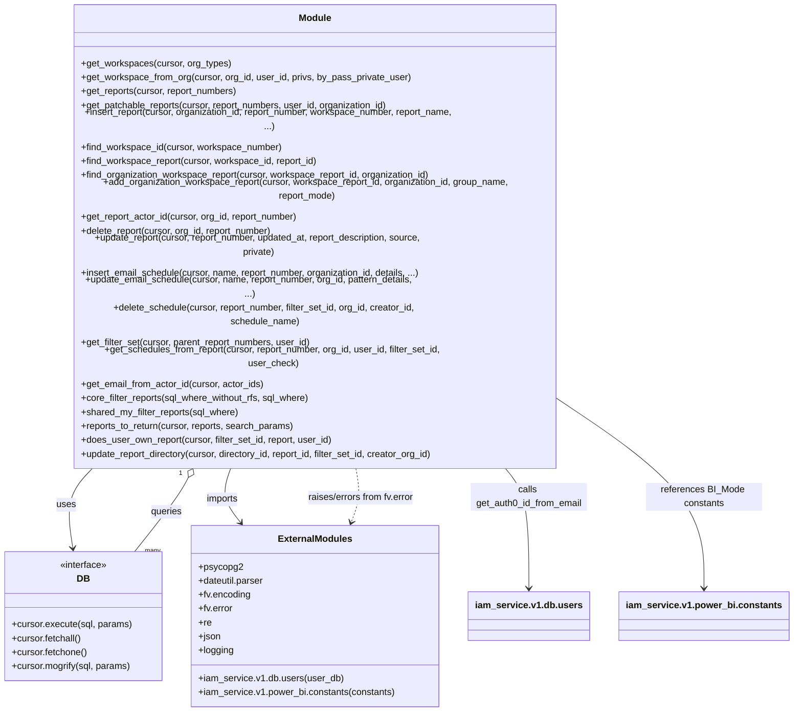

# Diagram: common/iam_service/iam_service/v1/db/reporting.py

> Auto-generated by Obscura crawlers

## Mermaid

### SVG

<svg id="container" width="1330.71875" xmlns="http://www.w3.org/2000/svg" class="classDiagram" height="1080" viewBox="0 0 1330.71875 1080" role="graphics-document document" aria-roledescription="class"><g><defs><marker id="container_class-aggregationStart" class="marker aggregation class" refX="18" refY="7" markerWidth="190" markerHeight="240" orient="auto"><path d="M 18,7 L9,13 L1,7 L9,1 Z"></path></marker></defs><defs><marker id="container_class-aggregationEnd" class="marker aggregation class" refX="1" refY="7" markerWidth="20" markerHeight="28" orient="auto"><path d="M 18,7 L9,13 L1,7 L9,1 Z"></path></marker></defs><defs><marker id="container_class-extensionStart" class="marker extension class" refX="18" refY="7" markerWidth="190" markerHeight="240" orient="auto"><path d="M 1,7 L18,13 V 1 Z"></path></marker></defs><defs><marker id="container_class-extensionEnd" class="marker extension class" refX="1" refY="7" markerWidth="20" markerHeight="28" orient="auto"><path d="M 1,1 V 13 L18,7 Z"></path></marker></defs><defs><marker id="container_class-compositionStart" class="marker composition class" refX="18" refY="7" markerWidth="190" markerHeight="240" orient="auto"><path d="M 18,7 L9,13 L1,7 L9,1 Z"></path></marker></defs><defs><marker id="container_class-compositionEnd" class="marker composition class" refX="1" refY="7" markerWidth="20" markerHeight="28" orient="auto"><path d="M 18,7 L9,13 L1,7 L9,1 Z"></path></marker></defs><defs><marker id="container_class-dependencyStart" class="marker dependency class" refX="6" refY="7" markerWidth="190" markerHeight="240" orient="auto"><path d="M 5,7 L9,13 L1,7 L9,1 Z"></path></marker></defs><defs><marker id="container_class-dependencyEnd" class="marker dependency class" refX="13" refY="7" markerWidth="20" markerHeight="28" orient="auto"><path d="M 18,7 L9,13 L14,7 L9,1 Z"></path></marker></defs><defs><marker id="container_class-lollipopStart" class="marker lollipop class" refX="13" refY="7" markerWidth="190" markerHeight="240" orient="auto"><circle stroke="black" fill="transparent" cx="7" cy="7" r="6"></circle></marker></defs><defs><marker id="container_class-lollipopEnd" class="marker lollipop class" refX="1" refY="7" markerWidth="190" markerHeight="240" orient="auto"><circle stroke="black" fill="transparent" cx="7" cy="7" r="6"></circle></marker></defs><g class="root"><g class="clusters"></g><g class="edgePaths"><path d="M167.408,662L158.103,670.167C148.798,678.333,130.188,694.667,123.165,717.512C116.142,740.357,120.705,769.714,122.987,784.393L125.269,799.071" id="id_Module_DB_1" class="edge-thickness-normal edge-pattern-solid relation" style=";;;" data-edge="true" data-et="edge" data-id="id_Module_DB_1" data-points="W3sieCI6MTY3LjQwNzY2Mjg5ODkzNjE3LCJ5Ijo2NjJ9LHsieCI6MTExLjU3ODEyNSwieSI6NzExfSx7IngiOjEyNi4xOTAzOTYzNDE0NjM0MSwieSI6ODA1fV0=" marker-end="url(#container_class-dependencyEnd)"></path><path d="M400.38,662L396.894,670.167C393.407,678.333,386.434,694.667,388.726,710.213C391.018,725.759,402.574,740.517,408.353,747.897L414.131,755.276" id="id_Module_ExternalModules_2" class="edge-thickness-normal edge-pattern-solid relation" style=";;;" data-edge="true" data-et="edge" data-id="id_Module_ExternalModules_2" data-points="W3sieCI6NDAwLjM4MDIxNTI1OTMwODUsInkiOjY2Mn0seyJ4IjozNzkuNDYwOTM3NSwieSI6NzExfSx7IngiOjQxNy44Mjk5NTQyNjgyOTI3LCJ5Ijo3NjB9XQ==" marker-end="url(#container_class-dependencyEnd)"></path><path d="M325.555,676.61L321.958,682.342C318.36,688.073,311.164,699.537,295.299,720.935C279.433,742.333,254.898,773.667,242.631,789.333L230.363,805" id="id_Module_DB_3" class="edge-thickness-normal edge-pattern-solid relation" style=";;;" data-edge="true" data-et="edge" data-id="id_Module_DB_3" data-points="W3sieCI6MzM0LjcyNjEwNTM4NTYzODMzLCJ5Ijo2NjJ9LHsieCI6MzAzLjk2ODc1LCJ5Ijo3MTF9LHsieCI6MjMwLjM2Mjg4MTA5NzU2MDk3LCJ5Ijo4MDV9XQ==" marker-start="url(#container_class-aggregationStart)"></path><path d="M602.934,662L604.506,670.167C606.079,678.333,609.223,694.667,608.244,710.057C607.266,725.447,602.165,739.895,599.614,747.119L597.064,754.342" id="id_Module_ExternalModules_4" class="edge-thickness-normal edge-pattern-dashed relation" style=";;;" data-edge="true" data-et="edge" data-id="id_Module_ExternalModules_4" data-points="W3sieCI6NjAyLjkzNDMyMDk3NzM5MzcsInkiOjY2Mn0seyJ4Ijo2MTIuMzY3MTg3NSwieSI6NzExfSx7IngiOjU5NS4wNjU5Mjk4NzgwNDg4LCJ5Ijo3NjB9XQ==" marker-end="url(#container_class-dependencyEnd)"></path><path d="M852.145,662L859.942,670.167C867.738,678.333,883.33,694.667,891.126,729C898.922,763.333,898.922,815.667,898.922,841.833L898.922,868" id="id_Module_iam_service.v1.db.users_5" class="edge-thickness-normal edge-pattern-solid relation" style=";;;" data-edge="true" data-et="edge" data-id="id_Module_iam_service.v1.db.users_5" data-points="W3sieCI6ODUyLjE0NTQ0NTQ3ODcyMzMsInkiOjY2Mn0seyJ4Ijo4OTguOTIxODc1LCJ5Ijo3MTF9LHsieCI6ODk4LjkyMTg3NSwieSI6ODc0fV0=" marker-end="url(#container_class-dependencyEnd)"></path><path d="M970.242,585.911L1005.992,606.759C1041.742,627.607,1113.242,669.304,1148.992,716.319C1184.742,763.333,1184.742,815.667,1184.742,841.833L1184.742,868" id="id_Module_iam_service.v1.power_bi.constants_6" class="edge-thickness-normal edge-pattern-solid relation" style=";;;" data-edge="true" data-et="edge" data-id="id_Module_iam_service.v1.power_bi.constants_6" data-points="W3sieCI6OTcwLjI0MjE4NzUsInkiOjU4NS45MTExNzA2MTg4MTI4fSx7IngiOjExODQuNzQyMTg3NSwieSI6NzExfSx7IngiOjExODQuNzQyMTg3NSwieSI6ODc0fV0=" marker-end="url(#container_class-dependencyEnd)"></path></g><g class="edgeLabels"><g class="edgeLabel" transform="translate(113.17916, 721.29937)"><g class="label" data-id="id_Module_DB_1" transform="translate(-16.4921875, -12)"><foreignObject width="32.984375" height="24">

uses

</foreignObject></g></g><g class="edgeLabel" transform="translate(382.22178, 714.5258)"><g class="label" data-id="id_Module_ExternalModules_2" transform="translate(-28.25, -12)"><foreignObject width="56.5" height="24">

imports

</foreignObject></g></g><g class="edgeLabel" transform="translate(284.99968, 735.22486)"><g class="label" data-id="id_Module_DB_3" transform="translate(-27.2421875, -12)"><foreignObject width="54.484375" height="24">

queries

</foreignObject></g></g><g class="edgeLabel" transform="translate(612.02342, 711.97361)"><g class="label" data-id="id_Module_ExternalModules_4" transform="translate(-94.171875, -12)"><foreignObject width="188.34375" height="24">

raises/errors from fv.error

</foreignObject></g></g><g class="edgeLabel" transform="translate(898.921875, 711)"><g class="label" data-id="id_Module_iam_service.v1.db.users_5" transform="translate(-100, -24)"><foreignObject width="200" height="48">

calls get_auth0_id_from_email

</foreignObject></g></g><g class="edgeLabel" transform="translate(1184.7421875, 711)"><g class="label" data-id="id_Module_iam_service.v1.power_bi.constants_6" transform="translate(-100, -24)"><foreignObject width="200" height="48">

references BI_Mode constants

</foreignObject></g></g><g class="edgeTerminals" transform="translate(312.71782445267576, 668.8473050426745)"><g class="inner" transform="translate(0, 0)"><foreignObject style="width: 9px; height: 12px;">
1
</foreignObject></g></g><g class="edgeTerminals" transform="translate(247.96206630540047, 795.4693459913377)"><g class="inner" transform="translate(0, 0)"></g><foreignObject style="width: 36px; height: 12px;">
many
</foreignObject></g></g><g class="nodes"><g class="node default" id="classId-Module-0" transform="translate(539.984375, 335)"><g class="basic label-container"><path d="M-430.2578125 -327 L430.2578125 -327 L430.2578125 327 L-430.2578125 327" stroke="none" stroke-width="0" fill="#ECECFF" style=""></path><path d="M-430.2578125 -327 C-155.50467369516662 -327, 119.24846510966677 -327, 430.2578125 -327 M-430.2578125 -327 C-101.13449633682427 -327, 227.98881982635146 -327, 430.2578125 -327 M430.2578125 -327 C430.2578125 -141.96517060371588, 430.2578125 43.06965879256825, 430.2578125 327 M430.2578125 -327 C430.2578125 -118.33901869633078, 430.2578125 90.32196260733843, 430.2578125 327 M430.2578125 327 C183.43793141414216 327, -63.38194967171569 327, -430.2578125 327 M430.2578125 327 C195.46272847128327 327, -39.33235555743346 327, -430.2578125 327 M-430.2578125 327 C-430.2578125 190.808579876615, -430.2578125 54.61715975323, -430.2578125 -327 M-430.2578125 327 C-430.2578125 176.2655039455665, -430.2578125 25.531007891133015, -430.2578125 -327" stroke="#9370DB" stroke-width="1.3" fill="none" stroke-dasharray="0 0" style=""></path></g><g class="annotation-group text" transform="translate(0, -303)"></g><g class="label-group text" transform="translate(-27.09375, -303)"><g class="label" style="font-weight: bolder" transform="translate(0,-12)"><foreignObject width="54.1875" height="24">

Module

</foreignObject></g></g><g class="members-group text" transform="translate(-418.2578125, -255)"></g><g class="methods-group text" transform="translate(-418.2578125, -225)"><g class="label" style="" transform="translate(0,-12)"><foreignObject width="256.515625" height="24">

+get_workspaces(cursor, org_types)

</foreignObject></g><g class="label" style="" transform="translate(0,12)"><foreignObject width="566" height="24">

+get_workspace_from_org(cursor, org_id, user_id, privs, by_pass_private_user)

</foreignObject></g><g class="label" style="" transform="translate(0,36)"><foreignObject width="272.03125" height="24">

+get_reports(cursor, report_numbers)

</foreignObject></g><g class="label" style="" transform="translate(0,60)"><foreignObject width="533.875" height="24">

+get_patchable_reports(cursor, report_numbers, user_id, organization_id)

</foreignObject></g><g class="label" style="" transform="translate(0,84)"><foreignObject width="666.1875" height="24">

+insert_report(cursor, organization_id, report_number, workspace_number, report_name, ...)

</foreignObject></g><g class="label" style="" transform="translate(0,108)"><foreignObject width="347.015625" height="24">

+find_workspace_id(cursor, workspace_number)

</foreignObject></g><g class="label" style="" transform="translate(0,132)"><foreignObject width="411.125" height="24">

+find_workspace_report(cursor, workspace_id, report_id)

</foreignObject></g><g class="label" style="" transform="translate(0,156)"><foreignObject width="608.15625" height="24">

+find_organization_workspace_report(cursor, workspace_report_id, organization_id)

</foreignObject></g><g class="label" style="" transform="translate(0,180)"><foreignObject width="809.421875" height="24">

+add_organization_workspace_report(cursor, workspace_report_id, organization_id, group_name, report_mode)

</foreignObject></g><g class="label" style="" transform="translate(0,204)"><foreignObject width="378" height="24">

+get_report_actor_id(cursor, org_id, report_number)

</foreignObject></g><g class="label" style="" transform="translate(0,228)"><foreignObject width="334.453125" height="24">

+delete_report(cursor, org_id, report_number)

</foreignObject></g><g class="label" style="" transform="translate(0,252)"><foreignObject width="634.578125" height="24">

+update_report(cursor, report_number, updated_at, report_description, source, private)

</foreignObject></g><g class="label" style="" transform="translate(0,276)"><foreignObject width="590.328125" height="24">

+insert_email_schedule(cursor, name, report_number, organization_id, details, ...)

</foreignObject></g><g class="label" style="" transform="translate(0,300)"><foreignObject width="594.265625" height="24">

+update_email_schedule(cursor, name, report_number, org_id, pattern_details, ...)

</foreignObject></g><g class="label" style="" transform="translate(0,324)"><foreignObject width="650.078125" height="24">

+delete_schedule(cursor, report_number, filter_set_id, org_id, creator_id, schedule_name)

</foreignObject></g><g class="label" style="" transform="translate(0,348)"><foreignObject width="399.15625" height="24">

+get_filter_set(cursor, parent_report_numbers, user_id)

</foreignObject></g><g class="label" style="" transform="translate(0,372)"><foreignObject width="675.9375" height="24">

+get_schedules_from_report(cursor, report_number, org_id, user_id, filter_set_id, user_check)

</foreignObject></g><g class="label" style="" transform="translate(0,396)"><foreignObject width="316.421875" height="24">

+get_email_from_actor_id(cursor, actor_ids)

</foreignObject></g><g class="label" style="" transform="translate(0,420)"><foreignObject width="397.171875" height="24">

+core_filter_reports(sql_where_without_rfs, sql_where)

</foreignObject></g><g class="label" style="" transform="translate(0,444)"><foreignObject width="272.96875" height="24">

+shared_my_filter_reports(sql_where)

</foreignObject></g><g class="label" style="" transform="translate(0,468)"><foreignObject width="369.28125" height="24">

+reports_to_return(cursor, reports, search_params)

</foreignObject></g><g class="label" style="" transform="translate(0,492)"><foreignObject width="435.765625" height="24">

+does_user_own_report(cursor, filter_set_id, report, user_id)

</foreignObject></g><g class="label" style="" transform="translate(0,516)"><foreignObject width="617.546875" height="24">

+update_report_directory(cursor, directory_id, report_id, filter_set_id, creator_org_id)

</foreignObject></g></g><g class="divider" style=""><path d="M-430.2578125 -279 C-133.8942892913929 -279, 162.46923391721418 -279, 430.2578125 -279 M-430.2578125 -279 C-176.11592222230183 -279, 78.02596805539633 -279, 430.2578125 -279" stroke="#9370DB" stroke-width="1.3" fill="none" stroke-dasharray="0 0" style=""></path></g><g class="divider" style=""><path d="M-430.2578125 -255 C-153.97726268636768 -255, 122.30328712726464 -255, 430.2578125 -255 M-430.2578125 -255 C-208.0680124226944 -255, 14.121787654611182 -255, 430.2578125 -255" stroke="#9370DB" stroke-width="1.3" fill="none" stroke-dasharray="0 0" style=""></path></g></g><g class="node default" id="classId-DB-1" transform="translate(143.4453125, 916)"><g class="basic label-container"><path d="M-135.4453125 -111 L135.4453125 -111 L135.4453125 111 L-135.4453125 111" stroke="none" stroke-width="0" fill="#ECECFF" style=""></path><path d="M-135.4453125 -111 C-80.43457429844318 -111, -25.423836096886376 -111, 135.4453125 -111 M-135.4453125 -111 C-77.24888038409273 -111, -19.052448268185444 -111, 135.4453125 -111 M135.4453125 -111 C135.4453125 -66.57119056554828, 135.4453125 -22.14238113109657, 135.4453125 111 M135.4453125 -111 C135.4453125 -64.39524552242972, 135.4453125 -17.79049104485945, 135.4453125 111 M135.4453125 111 C52.00490631942263 111, -31.43549986115474 111, -135.4453125 111 M135.4453125 111 C54.72840190765318 111, -25.98850868469364 111, -135.4453125 111 M-135.4453125 111 C-135.4453125 45.11664221589298, -135.4453125 -20.76671556821404, -135.4453125 -111 M-135.4453125 111 C-135.4453125 46.92003552939448, -135.4453125 -17.159928941211035, -135.4453125 -111" stroke="#9370DB" stroke-width="1.3" fill="none" stroke-dasharray="0 0" style=""></path></g><g class="annotation-group text" transform="translate(-41.015625, -87)"><g class="label" style="" transform="translate(0,-12)"><foreignObject width="82.03125" height="24">

«interface»

</foreignObject></g></g><g class="label-group text" transform="translate(-10.1484375, -63)"><g class="label" style="font-weight: bolder" transform="translate(0,-12)"><foreignObject width="20.296875" height="24">

DB

</foreignObject></g></g><g class="members-group text" transform="translate(-123.4453125, -15)"></g><g class="methods-group text" transform="translate(-123.4453125, 15)"><g class="label" style="" transform="translate(0,-12)"><foreignObject width="205.875" height="24">

+cursor.execute(sql, params)

</foreignObject></g><g class="label" style="" transform="translate(0,12)"><foreignObject width="120.828125" height="24">

+cursor.fetchall()

</foreignObject></g><g class="label" style="" transform="translate(0,36)"><foreignObject width="130.34375" height="24">

+cursor.fetchone()

</foreignObject></g><g class="label" style="" transform="translate(0,60)"><foreignObject width="205.375" height="24">

+cursor.mogrify(sql, params)

</foreignObject></g></g><g class="divider" style=""><path d="M-135.4453125 -39 C-50.361083119437765 -39, 34.72314626112447 -39, 135.4453125 -39 M-135.4453125 -39 C-57.586198656672835 -39, 20.27291518665433 -39, 135.4453125 -39" stroke="#9370DB" stroke-width="1.3" fill="none" stroke-dasharray="0 0" style=""></path></g><g class="divider" style=""><path d="M-135.4453125 -15 C-59.49132644257422 -15, 16.46265961485156 -15, 135.4453125 -15 M-135.4453125 -15 C-48.32769246884567 -15, 38.78992756230866 -15, 135.4453125 -15" stroke="#9370DB" stroke-width="1.3" fill="none" stroke-dasharray="0 0" style=""></path></g></g><g class="node default" id="classId-ExternalModules-2" transform="translate(539.984375, 916)"><g class="basic label-container"><path d="M-211.09375 -156 L211.09375 -156 L211.09375 156 L-211.09375 156" stroke="none" stroke-width="0" fill="#ECECFF" style=""></path><path d="M-211.09375 -156 C-117.10476314842148 -156, -23.115776296842967 -156, 211.09375 -156 M-211.09375 -156 C-98.52935979050035 -156, 14.035030418999298 -156, 211.09375 -156 M211.09375 -156 C211.09375 -84.22579784324591, 211.09375 -12.451595686491828, 211.09375 156 M211.09375 -156 C211.09375 -87.58538331723162, 211.09375 -19.170766634463234, 211.09375 156 M211.09375 156 C52.12582500098847 156, -106.84209999802306 156, -211.09375 156 M211.09375 156 C87.08629683151568 156, -36.921156336968636 156, -211.09375 156 M-211.09375 156 C-211.09375 36.4976313651412, -211.09375 -83.0047372697176, -211.09375 -156 M-211.09375 156 C-211.09375 90.77490161339432, -211.09375 25.54980322678864, -211.09375 -156" stroke="#9370DB" stroke-width="1.3" fill="none" stroke-dasharray="0 0" style=""></path></g><g class="annotation-group text" transform="translate(0, -132)"></g><g class="label-group text" transform="translate(-61.125, -132)"><g class="label" style="font-weight: bolder" transform="translate(0,-12)"><foreignObject width="122.25" height="24">

ExternalModules

</foreignObject></g></g><g class="members-group text" transform="translate(-199.09375, -84)"><g class="label" style="" transform="translate(0,-12)"><foreignObject width="74.921875" height="24">

+psycopg2

</foreignObject></g><g class="label" style="" transform="translate(0,12)"><foreignObject width="115.0625" height="24">

+dateutil.parser

</foreignObject></g><g class="label" style="" transform="translate(0,36)"><foreignObject width="90.5625" height="24">

+fv.encoding

</foreignObject></g><g class="label" style="" transform="translate(0,60)"><foreignObject width="60.140625" height="24">

+fv.error

</foreignObject></g><g class="label" style="" transform="translate(0,84)"><foreignObject width="22.40625" height="24">

+re

</foreignObject></g><g class="label" style="" transform="translate(0,108)"><foreignObject width="38.5" height="24">

+json

</foreignObject></g><g class="label" style="" transform="translate(0,132)"><foreignObject width="60.796875" height="24">

+logging

</foreignObject></g></g><g class="methods-group text" transform="translate(-199.09375, 108)"><g class="label" style="" transform="translate(0,-12)"><foreignObject width="244.90625" height="24">

+iam_service.v1.db.users(user_db)

</foreignObject></g><g class="label" style="" transform="translate(0,12)"><foreignObject width="337.0625" height="24">

+iam_service.v1.power_bi.constants(constants)

</foreignObject></g></g><g class="divider" style=""><path d="M-211.09375 -108 C-49.7968218516599 -108, 111.5001062966802 -108, 211.09375 -108 M-211.09375 -108 C-115.70873104355887 -108, -20.32371208711774 -108, 211.09375 -108" stroke="#9370DB" stroke-width="1.3" fill="none" stroke-dasharray="0 0" style=""></path></g><g class="divider" style=""><path d="M-211.09375 84 C-71.84220261375594 84, 67.40934477248811 84, 211.09375 84 M-211.09375 84 C-125.63843918977214 84, -40.183128379544286 84, 211.09375 84" stroke="#9370DB" stroke-width="1.3" fill="none" stroke-dasharray="0 0" style=""></path></g></g><g class="node default" id="classId-iam_service.v1.db.users-3" transform="translate(898.921875, 916)"><g class="basic label-container"><path d="M-97.84375 -42 L97.84375 -42 L97.84375 42 L-97.84375 42" stroke="none" stroke-width="0" fill="#ECECFF" style=""></path><path d="M-97.84375 -42 C-45.06244195421835 -42, 7.718866091563299 -42, 97.84375 -42 M-97.84375 -42 C-40.98946166978693 -42, 15.864826660426147 -42, 97.84375 -42 M97.84375 -42 C97.84375 -11.020780402083549, 97.84375 19.958439195832902, 97.84375 42 M97.84375 -42 C97.84375 -20.098352758457075, 97.84375 1.8032944830858497, 97.84375 42 M97.84375 42 C26.512461502624816 42, -44.81882699475037 42, -97.84375 42 M97.84375 42 C49.02593015742179 42, 0.2081103148435801 42, -97.84375 42 M-97.84375 42 C-97.84375 10.539490249888953, -97.84375 -20.921019500222094, -97.84375 -42 M-97.84375 42 C-97.84375 21.733059590505157, -97.84375 1.4661191810103134, -97.84375 -42" stroke="#9370DB" stroke-width="1.3" fill="none" stroke-dasharray="0 0" style=""></path></g><g class="annotation-group text" transform="translate(0, -18)"></g><g class="label-group text" transform="translate(-85.84375, -18)"><g class="label" style="font-weight: bolder" transform="translate(0,-12)"><foreignObject width="171.6875" height="24">

iam_service.v1.db.users

</foreignObject></g></g><g class="members-group text" transform="translate(-85.84375, 30)"></g><g class="methods-group text" transform="translate(-85.84375, 60)"></g><g class="divider" style=""><path d="M-97.84375 6 C-34.31109068641808 6, 29.221568627163833 6, 97.84375 6 M-97.84375 6 C-57.17754893574286 6, -16.511347871485725 6, 97.84375 6" stroke="#9370DB" stroke-width="1.3" fill="none" stroke-dasharray="0 0" style=""></path></g><g class="divider" style=""><path d="M-97.84375 24 C-32.24233161184878 24, 33.35908677630243 24, 97.84375 24 M-97.84375 24 C-33.84963753076455 24, 30.144474938470907 24, 97.84375 24" stroke="#9370DB" stroke-width="1.3" fill="none" stroke-dasharray="0 0" style=""></path></g></g><g class="node default" id="classId-iam_service.v1.power_bi.constants-4" transform="translate(1184.7421875, 916)"><g class="basic label-container"><path d="M-137.9765625 -42 L137.9765625 -42 L137.9765625 42 L-137.9765625 42" stroke="none" stroke-width="0" fill="#ECECFF" style=""></path><path d="M-137.9765625 -42 C-70.08893744623735 -42, -2.201312392474705 -42, 137.9765625 -42 M-137.9765625 -42 C-28.272892489485784 -42, 81.43077752102843 -42, 137.9765625 -42 M137.9765625 -42 C137.9765625 -10.729490816831238, 137.9765625 20.541018366337525, 137.9765625 42 M137.9765625 -42 C137.9765625 -13.144380026909463, 137.9765625 15.711239946181074, 137.9765625 42 M137.9765625 42 C76.56940308749657 42, 15.162243674993135 42, -137.9765625 42 M137.9765625 42 C57.984121841904 42, -22.008318816192002 42, -137.9765625 42 M-137.9765625 42 C-137.9765625 10.936748073469428, -137.9765625 -20.126503853061145, -137.9765625 -42 M-137.9765625 42 C-137.9765625 21.719296830765312, -137.9765625 1.438593661530625, -137.9765625 -42" stroke="#9370DB" stroke-width="1.3" fill="none" stroke-dasharray="0 0" style=""></path></g><g class="annotation-group text" transform="translate(0, -18)"></g><g class="label-group text" transform="translate(-125.9765625, -18)"><g class="label" style="font-weight: bolder" transform="translate(0,-12)"><foreignObject width="251.953125" height="24">

iam_service.v1.power_bi.constants

</foreignObject></g></g><g class="members-group text" transform="translate(-125.9765625, 30)"></g><g class="methods-group text" transform="translate(-125.9765625, 60)"></g><g class="divider" style=""><path d="M-137.9765625 6 C-50.67059695292852 6, 36.63536859414296 6, 137.9765625 6 M-137.9765625 6 C-65.18299511399869 6, 7.610572272002628 6, 137.9765625 6" stroke="#9370DB" stroke-width="1.3" fill="none" stroke-dasharray="0 0" style=""></path></g><g class="divider" style=""><path d="M-137.9765625 24 C-65.80278796087427 24, 6.370986578251461 24, 137.9765625 24 M-137.9765625 24 C-58.07959531832108 24, 21.817371863357835 24, 137.9765625 24" stroke="#9370DB" stroke-width="1.3" fill="none" stroke-dasharray="0 0" style=""></path></g></g></g></g></g></svg>
