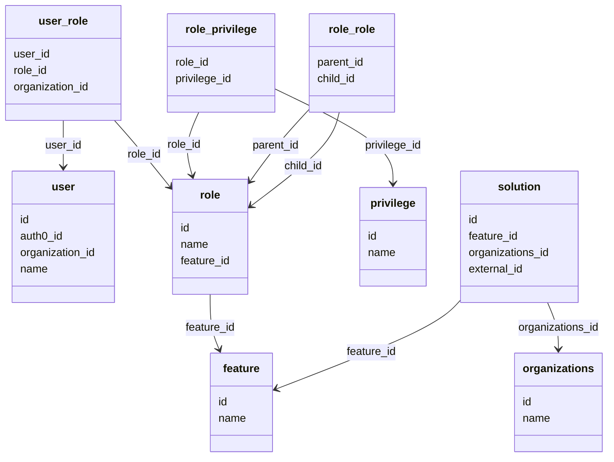

# Diagram: common/iam_service/iam_service/v1/db/roles.py


> Auto-generated by Obscura crawlers

## Diagram 1



### SVG

<svg id="container" width="901.380859375" xmlns="http://www.w3.org/2000/svg" class="classDiagram" height="668" viewBox="0 0 901.380859375 668" role="graphics-document document" aria-roledescription="class"><style>#container{font-family:"trebuchet ms",verdana,arial,sans-serif;font-size:16px;fill:#333;}@keyframes edge-animation-frame{from{stroke-dashoffset:0;}}@keyframes dash{to{stroke-dashoffset:0;}}#container .edge-animation-slow{stroke-dasharray:9,5!important;stroke-dashoffset:900;animation:dash 50s linear infinite;stroke-linecap:round;}#container .edge-animation-fast{stroke-dasharray:9,5!important;stroke-dashoffset:900;animation:dash 20s linear infinite;stroke-linecap:round;}#container .error-icon{fill:#552222;}#container .error-text{fill:#552222;stroke:#552222;}#container .edge-thickness-normal{stroke-width:1px;}#container .edge-thickness-thick{stroke-width:3.5px;}#container .edge-pattern-solid{stroke-dasharray:0;}#container .edge-thickness-invisible{stroke-width:0;fill:none;}#container .edge-pattern-dashed{stroke-dasharray:3;}#container .edge-pattern-dotted{stroke-dasharray:2;}#container .marker{fill:#333333;stroke:#333333;}#container .marker.cross{stroke:#333333;}#container svg{font-family:"trebuchet ms",verdana,arial,sans-serif;font-size:16px;}#container p{margin:0;}#container g.classGroup text{fill:#9370DB;stroke:none;font-family:"trebuchet ms",verdana,arial,sans-serif;font-size:10px;}#container g.classGroup text .title{font-weight:bolder;}#container .nodeLabel,#container .edgeLabel{color:#131300;}#container .edgeLabel .label rect{fill:#ECECFF;}#container .label text{fill:#131300;}#container .labelBkg{background:#ECECFF;}#container .edgeLabel .label span{background:#ECECFF;}#container .classTitle{font-weight:bolder;}#container .node rect,#container .node circle,#container .node ellipse,#container .node polygon,#container .node path{fill:#ECECFF;stroke:#9370DB;stroke-width:1px;}#container .divider{stroke:#9370DB;stroke-width:1;}#container g.clickable{cursor:pointer;}#container g.classGroup rect{fill:#ECECFF;stroke:#9370DB;}#container g.classGroup line{stroke:#9370DB;stroke-width:1;}#container .classLabel .box{stroke:none;stroke-width:0;fill:#ECECFF;opacity:0.5;}#container .classLabel .label{fill:#9370DB;font-size:10px;}#container .relation{stroke:#333333;stroke-width:1;fill:none;}#container .dashed-line{stroke-dasharray:3;}#container .dotted-line{stroke-dasharray:1 2;}#container #compositionStart,#container .composition{fill:#333333!important;stroke:#333333!important;stroke-width:1;}#container #compositionEnd,#container .composition{fill:#333333!important;stroke:#333333!important;stroke-width:1;}#container #dependencyStart,#container .dependency{fill:#333333!important;stroke:#333333!important;stroke-width:1;}#container #dependencyStart,#container .dependency{fill:#333333!important;stroke:#333333!important;stroke-width:1;}#container #extensionStart,#container .extension{fill:transparent!important;stroke:#333333!important;stroke-width:1;}#container #extensionEnd,#container .extension{fill:transparent!important;stroke:#333333!important;stroke-width:1;}#container #aggregationStart,#container .aggregation{fill:transparent!important;stroke:#333333!important;stroke-width:1;}#container #aggregationEnd,#container .aggregation{fill:transparent!important;stroke:#333333!important;stroke-width:1;}#container #lollipopStart,#container .lollipop{fill:#ECECFF!important;stroke:#333333!important;stroke-width:1;}#container #lollipopEnd,#container .lollipop{fill:#ECECFF!important;stroke:#333333!important;stroke-width:1;}#container .edgeTerminals{font-size:11px;line-height:initial;}#container .classTitleText{text-anchor:middle;font-size:18px;fill:#333;}#container .label-icon{display:inline-block;height:1em;overflow:visible;vertical-align:-0.125em;}#container .node .label-icon path{fill:currentColor;stroke:revert;stroke-width:revert;}#container :root{--mermaid-font-family:"trebuchet ms",verdana,arial,sans-serif;}</style><g><defs><marker id="container_class-aggregationStart" class="marker aggregation class" refX="18" refY="7" markerWidth="190" markerHeight="240" orient="auto"><path d="M 18,7 L9,13 L1,7 L9,1 Z"></path></marker></defs><defs><marker id="container_class-aggregationEnd" class="marker aggregation class" refX="1" refY="7" markerWidth="20" markerHeight="28" orient="auto"><path d="M 18,7 L9,13 L1,7 L9,1 Z"></path></marker></defs><defs><marker id="container_class-extensionStart" class="marker extension class" refX="18" refY="7" markerWidth="190" markerHeight="240" orient="auto"><path d="M 1,7 L18,13 V 1 Z"></path></marker></defs><defs><marker id="container_class-extensionEnd" class="marker extension class" refX="1" refY="7" markerWidth="20" markerHeight="28" orient="auto"><path d="M 1,1 V 13 L18,7 Z"></path></marker></defs><defs><marker id="container_class-compositionStart" class="marker composition class" refX="18" refY="7" markerWidth="190" markerHeight="240" orient="auto"><path d="M 18,7 L9,13 L1,7 L9,1 Z"></path></marker></defs><defs><marker id="container_class-compositionEnd" class="marker composition class" refX="1" refY="7" markerWidth="20" markerHeight="28" orient="auto"><path d="M 18,7 L9,13 L1,7 L9,1 Z"></path></marker></defs><defs><marker id="container_class-dependencyStart" class="marker dependency class" refX="6" refY="7" markerWidth="190" markerHeight="240" orient="auto"><path d="M 5,7 L9,13 L1,7 L9,1 Z"></path></marker></defs><defs><marker id="container_class-dependencyEnd" class="marker dependency class" refX="13" refY="7" markerWidth="20" markerHeight="28" orient="auto"><path d="M 18,7 L9,13 L14,7 L9,1 Z"></path></marker></defs><defs><marker id="container_class-lollipopStart" class="marker lollipop class" refX="13" refY="7" markerWidth="190" markerHeight="240" orient="auto"><circle stroke="black" fill="transparent" cx="7" cy="7" r="6"></circle></marker></defs><defs><marker id="container_class-lollipopEnd" class="marker lollipop class" refX="1" refY="7" markerWidth="190" markerHeight="240" orient="auto"><circle stroke="black" fill="transparent" cx="7" cy="7" r="6"></circle></marker></defs><g class="root"><g class="clusters"></g><g class="edgePaths"><path d="M93.371,176L93.371,182.167C93.371,188.333,93.371,200.667,93.371,212C93.371,223.333,93.371,233.667,93.371,238.833L93.371,244" id="id_user_role_user_1" class="edge-thickness-normal edge-pattern-solid relation" style=";;;" data-edge="true" data-et="edge" data-id="id_user_role_user_1" data-points="W3sieCI6OTMuMzcxMDkzNzUsInkiOjE3Nn0seyJ4Ijo5My4zNzEwOTM3NSwieSI6MjEzfSx7IngiOjkzLjM3MTA5Mzc1LCJ5IjoyNTB9XQ==" marker-end="url(#container_class-dependencyEnd)"></path><path d="M168.395,176L173.903,182.167C179.411,188.333,190.426,200.667,204.352,216.959C218.277,233.251,235.113,253.501,243.531,263.626L251.949,273.752" id="id_user_role_role_2" class="edge-thickness-normal edge-pattern-solid relation" style=";;;" data-edge="true" data-et="edge" data-id="id_user_role_role_2" data-points="W3sieCI6MTY4LjM5NTExMjM0NTA0MTMzLCJ5IjoxNzZ9LHsieCI6MjAxLjQ0MTQwNjI1LCJ5IjoyMTN9LHsieCI6MjU1Ljc4NTE1NjI1LCJ5IjoyNzguMzY1MzE1OTk5NTc2MDd9XQ==" marker-end="url(#container_class-dependencyEnd)"></path><path d="M294.373,164L290.627,172.167C286.88,180.333,279.387,196.667,277.816,212.043C276.244,227.419,280.594,241.837,282.768,249.046L284.943,256.256" id="id_role_privilege_role_3" class="edge-thickness-normal edge-pattern-solid relation" style=";;;" data-edge="true" data-et="edge" data-id="id_role_privilege_role_3" data-points="W3sieCI6Mjk0LjM3MjkwMTYwMTIzOTcsInkiOjE2NH0seyJ4IjoyNzEuODk0NTMxMjUsInkiOjIxM30seyJ4IjoyODYuNjc1OTg2ODQyMTA1MjYsInkiOjI2Mn1d" marker-end="url(#container_class-dependencyEnd)"></path><path d="M406.992,128.968L437.145,142.973C467.298,156.979,527.603,184.989,557.756,208.161C587.908,231.333,587.908,249.667,587.908,258.833L587.908,268" id="id_role_privilege_privilege_4" class="edge-thickness-normal edge-pattern-solid relation" style=";;;" data-edge="true" data-et="edge" data-id="id_role_privilege_privilege_4" data-points="W3sieCI6NDA2Ljk5MjE4NzUsInkiOjEyOC45Njc5NjM0NzI1MTA2Nn0seyJ4Ijo1ODcuOTA4MjAzMTI1LCJ5IjoyMTN9LHsieCI6NTg3LjkwODIwMzEyNSwieSI6Mjc0fV0=" marker-end="url(#container_class-dependencyEnd)"></path><path d="M456.992,160.575L448.913,169.312C440.833,178.05,424.674,195.525,410.471,212.703C396.267,229.882,384.018,246.763,377.894,255.204L371.77,263.645" id="id_role_role_role_5" class="edge-thickness-normal edge-pattern-solid relation" style=";;;" data-edge="true" data-et="edge" data-id="id_role_role_role_5" data-points="W3sieCI6NDU2Ljk5MjE4NzUsInkiOjE2MC41NzQ5NzQ2ODg0MDU1NX0seyJ4Ijo0MDguNTE1NjI1LCJ5IjoyMTN9LHsieCI6MzY4LjI0NjA5Mzc1LCJ5IjoyNjguNTAxMDExOTgxODY1M31d" marker-end="url(#container_class-dependencyEnd)"></path><path d="M503.855,164L501.978,172.167C500.101,180.333,496.348,196.667,474.551,219.504C452.755,242.342,412.916,271.685,392.997,286.356L373.077,301.027" id="id_role_role_role_6" class="edge-thickness-normal edge-pattern-solid relation" style=";;;" data-edge="true" data-et="edge" data-id="id_role_role_role_6" data-points="W3sieCI6NTAzLjg1NTA4MTM1MzMwNTc2LCJ5IjoxNjR9LHsieCI6NDkyLjU5Mzc1LCJ5IjoyMTN9LHsieCI6MzY4LjI0NjA5Mzc1LCJ5IjozMDQuNTg0OTQ4NTE2MDUwOX1d" marker-end="url(#container_class-dependencyEnd)"></path><path d="M312.016,430L312.016,438.167C312.016,446.333,312.016,462.667,314.28,476.082C316.545,489.497,321.074,499.994,323.339,505.242L325.603,510.491" id="id_role_feature_7" class="edge-thickness-normal edge-pattern-solid relation" style=";;;" data-edge="true" data-et="edge" data-id="id_role_feature_7" data-points="W3sieCI6MzEyLjAxNTYyNSwieSI6NDMwfSx7IngiOjMxMi4wMTU2MjUsInkiOjQ3OX0seyJ4IjozMjcuOTgwMzYxMjM4NTMyMSwieSI6NTE2fV0=" marker-end="url(#container_class-dependencyEnd)"></path><path d="M686.17,440.202L680.197,446.669C674.224,453.135,662.278,466.067,616.282,487.51C570.286,508.954,490.24,538.907,450.217,553.884L410.194,568.861" id="id_solution_feature_8" class="edge-thickness-normal edge-pattern-solid relation" style=";;;" data-edge="true" data-et="edge" data-id="id_solution_feature_8" data-points="W3sieCI6Njg2LjE2OTkyMTg3NSwieSI6NDQwLjIwMjI1NDMzNjE3OTA3fSx7IngiOjY1MC4zMzIwMzEyNSwieSI6NDc5fSx7IngiOjQwNC41NzQyMTg3NSwieSI6NTcwLjk2MzQ5Njg5NTQ5Mjh9XQ==" marker-end="url(#container_class-dependencyEnd)"></path><path d="M815.405,442L818.118,448.167C820.83,454.333,826.254,466.667,828.966,478C831.678,489.333,831.678,499.667,831.678,504.833L831.678,510" id="id_solution_organizations_9" class="edge-thickness-normal edge-pattern-solid relation" style=";;;" data-edge="true" data-et="edge" data-id="id_solution_organizations_9" data-points="W3sieCI6ODE1LjQwNTQ3MTY4NzAzMDEsInkiOjQ0Mn0seyJ4Ijo4MzEuNjc3NzM0Mzc1LCJ5Ijo0Nzl9LHsieCI6ODMxLjY3NzczNDM3NSwieSI6NTE2fV0=" marker-end="url(#container_class-dependencyEnd)"></path></g><g class="edgeLabels"><g class="edgeLabel" transform="translate(93.37109375, 213)"><g class="label" data-id="id_user_role_user_1" transform="translate(-26.40625, -12)"><foreignObject width="52.8125" height="24"><div xmlns="http://www.w3.org/1999/xhtml" class="labelBkg" style="display: table-cell; white-space: nowrap; line-height: 1.5; max-width: 200px; text-align: center;"><span class="edgeLabel"><p>user_id</p></span></div></foreignObject></g></g><g class="edgeLabel" transform="translate(201.44140625, 213)"><g class="label" data-id="id_user_role_role_2" transform="translate(-25.2265625, -12)"><foreignObject width="50.453125" height="24"><div xmlns="http://www.w3.org/1999/xhtml" class="labelBkg" style="display: table-cell; white-space: nowrap; line-height: 1.5; max-width: 200px; text-align: center;"><span class="edgeLabel"><p>role_id</p></span></div></foreignObject></g></g><g class="edgeLabel" transform="translate(272.46346, 211.7598)"><g class="label" data-id="id_role_privilege_role_3" transform="translate(-25.2265625, -12)"><foreignObject width="50.453125" height="24"><div xmlns="http://www.w3.org/1999/xhtml" class="labelBkg" style="display: table-cell; white-space: nowrap; line-height: 1.5; max-width: 200px; text-align: center;"><span class="edgeLabel"><p>role_id</p></span></div></foreignObject></g></g><g class="edgeLabel" transform="translate(587.908203125, 213)"><g class="label" data-id="id_role_privilege_privilege_4" transform="translate(-42.390625, -12)"><foreignObject width="84.78125" height="24"><div xmlns="http://www.w3.org/1999/xhtml" class="labelBkg" style="display: table-cell; white-space: nowrap; line-height: 1.5; max-width: 200px; text-align: center;"><span class="edgeLabel"><p>privilege_id</p></span></div></foreignObject></g></g><g class="edgeLabel" transform="translate(408.515625, 213)"><g class="label" data-id="id_role_role_role_5" transform="translate(-35.015625, -12)"><foreignObject width="70.03125" height="24"><div xmlns="http://www.w3.org/1999/xhtml" class="labelBkg" style="display: table-cell; white-space: nowrap; line-height: 1.5; max-width: 200px; text-align: center;"><span class="edgeLabel"><p>parent_id</p></span></div></foreignObject></g></g><g class="edgeLabel" transform="translate(450.66106, 243.8844)"><g class="label" data-id="id_role_role_role_6" transform="translate(-29.0625, -12)"><foreignObject width="58.125" height="24"><div xmlns="http://www.w3.org/1999/xhtml" class="labelBkg" style="display: table-cell; white-space: nowrap; line-height: 1.5; max-width: 200px; text-align: center;"><span class="edgeLabel"><p>child_id</p></span></div></foreignObject></g></g><g class="edgeLabel" transform="translate(312.015625, 479)"><g class="label" data-id="id_role_feature_7" transform="translate(-37.03125, -12)"><foreignObject width="74.0625" height="24"><div xmlns="http://www.w3.org/1999/xhtml" class="labelBkg" style="display: table-cell; white-space: nowrap; line-height: 1.5; max-width: 200px; text-align: center;"><span class="edgeLabel"><p>feature_id</p></span></div></foreignObject></g></g><g class="edgeLabel" transform="translate(552.18657, 515.7264)"><g class="label" data-id="id_solution_feature_8" transform="translate(-37.03125, -12)"><foreignObject width="74.0625" height="24"><div xmlns="http://www.w3.org/1999/xhtml" class="labelBkg" style="display: table-cell; white-space: nowrap; line-height: 1.5; max-width: 200px; text-align: center;"><span class="edgeLabel"><p>feature_id</p></span></div></foreignObject></g></g><g class="edgeLabel" transform="translate(831.677734375, 479)"><g class="label" data-id="id_solution_organizations_9" transform="translate(-59.953125, -12)"><foreignObject width="119.90625" height="24"><div xmlns="http://www.w3.org/1999/xhtml" class="labelBkg" style="display: table-cell; white-space: nowrap; line-height: 1.5; max-width: 200px; text-align: center;"><span class="edgeLabel"><p>organizations_id</p></span></div></foreignObject></g></g></g><g class="nodes"><g class="node default" id="classId-user-0" transform="translate(93.37109375, 346)"><g class="basic label-container"><path d="M-76.41796875 -96 L76.41796875 -96 L76.41796875 96 L-76.41796875 96" stroke="none" stroke-width="0" fill="#ECECFF" style=""></path><path d="M-76.41796875 -96 C-33.356500367172046 -96, 9.704968015655908 -96, 76.41796875 -96 M-76.41796875 -96 C-15.304778004406202 -96, 45.808412741187595 -96, 76.41796875 -96 M76.41796875 -96 C76.41796875 -51.72107470243709, 76.41796875 -7.442149404874186, 76.41796875 96 M76.41796875 -96 C76.41796875 -55.25309076187319, 76.41796875 -14.506181523746378, 76.41796875 96 M76.41796875 96 C34.421205665896764 96, -7.575557418206472 96, -76.41796875 96 M76.41796875 96 C32.74134291752079 96, -10.935282914958421 96, -76.41796875 96 M-76.41796875 96 C-76.41796875 25.52942882275829, -76.41796875 -44.94114235448342, -76.41796875 -96 M-76.41796875 96 C-76.41796875 31.135688430544633, -76.41796875 -33.728623138910734, -76.41796875 -96" stroke="#9370DB" stroke-width="1.3" fill="none" stroke-dasharray="0 0" style=""></path></g><g class="annotation-group text" transform="translate(0, -72)"></g><g class="label-group text" transform="translate(-16.0703125, -72)"><g class="label" style="font-weight: bolder" transform="translate(0,-12)"><foreignObject width="32.140625" height="24"><div xmlns="http://www.w3.org/1999/xhtml" style="display: table-cell; white-space: nowrap; line-height: 1.5; max-width: 83px; text-align: center;"><span class="nodeLabel markdown-node-label" style=""><p>user</p></span></div></foreignObject></g></g><g class="members-group text" transform="translate(-64.41796875, -24)"><g class="label" style="" transform="translate(0,-12)"><foreignObject width="14.09375" height="24"><div xmlns="http://www.w3.org/1999/xhtml" style="display: table-cell; white-space: nowrap; line-height: 1.5; max-width: 64px; text-align: center;"><span class="nodeLabel markdown-node-label" style=""><p>id</p></span></div></foreignObject></g><g class="label" style="" transform="translate(0,12)"><foreignObject width="64.03125" height="24"><div xmlns="http://www.w3.org/1999/xhtml" style="display: table-cell; white-space: nowrap; line-height: 1.5; max-width: 114px; text-align: center;"><span class="nodeLabel markdown-node-label" style=""><p>auth0_id</p></span></div></foreignObject></g><g class="label" style="" transform="translate(0,36)"><foreignObject width="112.765625" height="24"><div xmlns="http://www.w3.org/1999/xhtml" style="display: table-cell; white-space: nowrap; line-height: 1.5; max-width: 163px; text-align: center;"><span class="nodeLabel markdown-node-label" style=""><p>organization_id</p></span></div></foreignObject></g><g class="label" style="" transform="translate(0,60)"><foreignObject width="40.515625" height="24"><div xmlns="http://www.w3.org/1999/xhtml" style="display: table-cell; white-space: nowrap; line-height: 1.5; max-width: 91px; text-align: center;"><span class="nodeLabel markdown-node-label" style=""><p>name</p></span></div></foreignObject></g></g><g class="methods-group text" transform="translate(-64.41796875, 96)"></g><g class="divider" style=""><path d="M-76.41796875 -48 C-29.512273469005322 -48, 17.393421811989356 -48, 76.41796875 -48 M-76.41796875 -48 C-22.415428638426995 -48, 31.58711147314601 -48, 76.41796875 -48" stroke="#9370DB" stroke-width="1.3" fill="none" stroke-dasharray="0 0" style=""></path></g><g class="divider" style=""><path d="M-76.41796875 72 C-34.2781797974931 72, 7.861609155013795 72, 76.41796875 72 M-76.41796875 72 C-35.55982781158035 72, 5.298313126839304 72, 76.41796875 72" stroke="#9370DB" stroke-width="1.3" fill="none" stroke-dasharray="0 0" style=""></path></g></g><g class="node default" id="classId-role-1" transform="translate(312.015625, 346)"><g class="basic label-container"><path d="M-56.23046875 -84 L56.23046875 -84 L56.23046875 84 L-56.23046875 84" stroke="none" stroke-width="0" fill="#ECECFF" style=""></path><path d="M-56.23046875 -84 C-13.931501767103512 -84, 28.367465215792976 -84, 56.23046875 -84 M-56.23046875 -84 C-21.56685738363609 -84, 13.096753982727819 -84, 56.23046875 -84 M56.23046875 -84 C56.23046875 -41.93101445003767, 56.23046875 0.1379710999246555, 56.23046875 84 M56.23046875 -84 C56.23046875 -44.65563337119892, 56.23046875 -5.311266742397834, 56.23046875 84 M56.23046875 84 C23.301741462538075 84, -9.62698582492385 84, -56.23046875 84 M56.23046875 84 C26.96819834679009 84, -2.2940720564198216 84, -56.23046875 84 M-56.23046875 84 C-56.23046875 47.01338655427073, -56.23046875 10.026773108541462, -56.23046875 -84 M-56.23046875 84 C-56.23046875 21.41825921011545, -56.23046875 -41.1634815797691, -56.23046875 -84" stroke="#9370DB" stroke-width="1.3" fill="none" stroke-dasharray="0 0" style=""></path></g><g class="annotation-group text" transform="translate(0, -60)"></g><g class="label-group text" transform="translate(-14.3984375, -60)"><g class="label" style="font-weight: bolder" transform="translate(0,-12)"><foreignObject width="28.796875" height="24"><div xmlns="http://www.w3.org/1999/xhtml" style="display: table-cell; white-space: nowrap; line-height: 1.5; max-width: 78px; text-align: center;"><span class="nodeLabel markdown-node-label" style=""><p>role</p></span></div></foreignObject></g></g><g class="members-group text" transform="translate(-44.23046875, -12)"><g class="label" style="" transform="translate(0,-12)"><foreignObject width="14.09375" height="24"><div xmlns="http://www.w3.org/1999/xhtml" style="display: table-cell; white-space: nowrap; line-height: 1.5; max-width: 64px; text-align: center;"><span class="nodeLabel markdown-node-label" style=""><p>id</p></span></div></foreignObject></g><g class="label" style="" transform="translate(0,12)"><foreignObject width="40.515625" height="24"><div xmlns="http://www.w3.org/1999/xhtml" style="display: table-cell; white-space: nowrap; line-height: 1.5; max-width: 91px; text-align: center;"><span class="nodeLabel markdown-node-label" style=""><p>name</p></span></div></foreignObject></g><g class="label" style="" transform="translate(0,36)"><foreignObject width="74.0625" height="24"><div xmlns="http://www.w3.org/1999/xhtml" style="display: table-cell; white-space: nowrap; line-height: 1.5; max-width: 124px; text-align: center;"><span class="nodeLabel markdown-node-label" style=""><p>feature_id</p></span></div></foreignObject></g></g><g class="methods-group text" transform="translate(-44.23046875, 84)"></g><g class="divider" style=""><path d="M-56.23046875 -36 C-18.75403289247207 -36, 18.722402965055863 -36, 56.23046875 -36 M-56.23046875 -36 C-25.80213575565272 -36, 4.626197238694559 -36, 56.23046875 -36" stroke="#9370DB" stroke-width="1.3" fill="none" stroke-dasharray="0 0" style=""></path></g><g class="divider" style=""><path d="M-56.23046875 60 C-26.49566031900094 60, 3.2391481119981194 60, 56.23046875 60 M-56.23046875 60 C-14.497317165153511 60, 27.235834419692978 60, 56.23046875 60" stroke="#9370DB" stroke-width="1.3" fill="none" stroke-dasharray="0 0" style=""></path></g></g><g class="node default" id="classId-privilege-2" transform="translate(587.908203125, 346)"><g class="basic label-container"><path d="M-48.26171875 -72 L48.26171875 -72 L48.26171875 72 L-48.26171875 72" stroke="none" stroke-width="0" fill="#ECECFF" style=""></path><path d="M-48.26171875 -72 C-20.756655008380793 -72, 6.7484087332384135 -72, 48.26171875 -72 M-48.26171875 -72 C-27.411530987425838 -72, -6.561343224851676 -72, 48.26171875 -72 M48.26171875 -72 C48.26171875 -41.45051218576158, 48.26171875 -10.901024371523164, 48.26171875 72 M48.26171875 -72 C48.26171875 -16.73217791686892, 48.26171875 38.53564416626216, 48.26171875 72 M48.26171875 72 C27.445686887490954 72, 6.629655024981908 72, -48.26171875 72 M48.26171875 72 C15.626491419273584 72, -17.00873591145283 72, -48.26171875 72 M-48.26171875 72 C-48.26171875 36.35033472257571, -48.26171875 0.7006694451514193, -48.26171875 -72 M-48.26171875 72 C-48.26171875 28.753384700033877, -48.26171875 -14.493230599932247, -48.26171875 -72" stroke="#9370DB" stroke-width="1.3" fill="none" stroke-dasharray="0 0" style=""></path></g><g class="annotation-group text" transform="translate(0, -48)"></g><g class="label-group text" transform="translate(-32.0078125, -48)"><g class="label" style="font-weight: bolder" transform="translate(0,-12)"><foreignObject width="64.015625" height="24"><div xmlns="http://www.w3.org/1999/xhtml" style="display: table-cell; white-space: nowrap; line-height: 1.5; max-width: 113px; text-align: center;"><span class="nodeLabel markdown-node-label" style=""><p>privilege</p></span></div></foreignObject></g></g><g class="members-group text" transform="translate(-36.26171875, 0)"><g class="label" style="" transform="translate(0,-12)"><foreignObject width="14.09375" height="24"><div xmlns="http://www.w3.org/1999/xhtml" style="display: table-cell; white-space: nowrap; line-height: 1.5; max-width: 64px; text-align: center;"><span class="nodeLabel markdown-node-label" style=""><p>id</p></span></div></foreignObject></g><g class="label" style="" transform="translate(0,12)"><foreignObject width="40.515625" height="24"><div xmlns="http://www.w3.org/1999/xhtml" style="display: table-cell; white-space: nowrap; line-height: 1.5; max-width: 91px; text-align: center;"><span class="nodeLabel markdown-node-label" style=""><p>name</p></span></div></foreignObject></g></g><g class="methods-group text" transform="translate(-36.26171875, 72)"></g><g class="divider" style=""><path d="M-48.26171875 -24 C-19.020312124042942 -24, 10.221094501914116 -24, 48.26171875 -24 M-48.26171875 -24 C-24.441275428058212 -24, -0.6208321061164241 -24, 48.26171875 -24" stroke="#9370DB" stroke-width="1.3" fill="none" stroke-dasharray="0 0" style=""></path></g><g class="divider" style=""><path d="M-48.26171875 48 C-24.956258016101057 48, -1.650797282202113 48, 48.26171875 48 M-48.26171875 48 C-24.30838277498545 48, -0.35504679997089994 48, 48.26171875 48" stroke="#9370DB" stroke-width="1.3" fill="none" stroke-dasharray="0 0" style=""></path></g></g><g class="node default" id="classId-role_privilege-3" transform="translate(327.40234375, 92)"><g class="basic label-container"><path d="M-79.58984375 -72 L79.58984375 -72 L79.58984375 72 L-79.58984375 72" stroke="none" stroke-width="0" fill="#ECECFF" style=""></path><path d="M-79.58984375 -72 C-34.40922551813367 -72, 10.771392713732666 -72, 79.58984375 -72 M-79.58984375 -72 C-18.856848612619196 -72, 41.87614652476161 -72, 79.58984375 -72 M79.58984375 -72 C79.58984375 -28.715796620115412, 79.58984375 14.568406759769175, 79.58984375 72 M79.58984375 -72 C79.58984375 -37.05754881659565, 79.58984375 -2.115097633191297, 79.58984375 72 M79.58984375 72 C35.991674524106706 72, -7.606494701786588 72, -79.58984375 72 M79.58984375 72 C25.965306911592933 72, -27.659229926814135 72, -79.58984375 72 M-79.58984375 72 C-79.58984375 25.66164131959556, -79.58984375 -20.67671736080888, -79.58984375 -72 M-79.58984375 72 C-79.58984375 24.84048050198777, -79.58984375 -22.31903899602446, -79.58984375 -72" stroke="#9370DB" stroke-width="1.3" fill="none" stroke-dasharray="0 0" style=""></path></g><g class="annotation-group text" transform="translate(0, -48)"></g><g class="label-group text" transform="translate(-50.3984375, -48)"><g class="label" style="font-weight: bolder" transform="translate(0,-12)"><foreignObject width="100.796875" height="24"><div xmlns="http://www.w3.org/1999/xhtml" style="display: table-cell; white-space: nowrap; line-height: 1.5; max-width: 149px; text-align: center;"><span class="nodeLabel markdown-node-label" style=""><p>role_privilege</p></span></div></foreignObject></g></g><g class="members-group text" transform="translate(-67.58984375, 0)"><g class="label" style="" transform="translate(0,-12)"><foreignObject width="50.453125" height="24"><div xmlns="http://www.w3.org/1999/xhtml" style="display: table-cell; white-space: nowrap; line-height: 1.5; max-width: 100px; text-align: center;"><span class="nodeLabel markdown-node-label" style=""><p>role_id</p></span></div></foreignObject></g><g class="label" style="" transform="translate(0,12)"><foreignObject width="84.78125" height="24"><div xmlns="http://www.w3.org/1999/xhtml" style="display: table-cell; white-space: nowrap; line-height: 1.5; max-width: 135px; text-align: center;"><span class="nodeLabel markdown-node-label" style=""><p>privilege_id</p></span></div></foreignObject></g></g><g class="methods-group text" transform="translate(-67.58984375, 72)"></g><g class="divider" style=""><path d="M-79.58984375 -24 C-23.92957646461401 -24, 31.730690820771983 -24, 79.58984375 -24 M-79.58984375 -24 C-42.54898414007319 -24, -5.508124530146375 -24, 79.58984375 -24" stroke="#9370DB" stroke-width="1.3" fill="none" stroke-dasharray="0 0" style=""></path></g><g class="divider" style=""><path d="M-79.58984375 48 C-19.439197622758833 48, 40.711448504482334 48, 79.58984375 48 M-79.58984375 48 C-31.42627086237251 48, 16.737302025254976 48, 79.58984375 48" stroke="#9370DB" stroke-width="1.3" fill="none" stroke-dasharray="0 0" style=""></path></g></g><g class="node default" id="classId-user_role-4" transform="translate(93.37109375, 92)"><g class="basic label-container"><path d="M-85.37109375 -84 L85.37109375 -84 L85.37109375 84 L-85.37109375 84" stroke="none" stroke-width="0" fill="#ECECFF" style=""></path><path d="M-85.37109375 -84 C-44.65145738728709 -84, -3.9318210245741767 -84, 85.37109375 -84 M-85.37109375 -84 C-37.830791769461584 -84, 9.709510211076832 -84, 85.37109375 -84 M85.37109375 -84 C85.37109375 -29.04109341770429, 85.37109375 25.917813164591422, 85.37109375 84 M85.37109375 -84 C85.37109375 -48.28133948991338, 85.37109375 -12.562678979826757, 85.37109375 84 M85.37109375 84 C40.37980517984891 84, -4.611483390302183 84, -85.37109375 84 M85.37109375 84 C30.571640881342226 84, -24.227811987315548 84, -85.37109375 84 M-85.37109375 84 C-85.37109375 25.832367430248965, -85.37109375 -32.33526513950207, -85.37109375 -84 M-85.37109375 84 C-85.37109375 48.38523129044537, -85.37109375 12.770462580890737, -85.37109375 -84" stroke="#9370DB" stroke-width="1.3" fill="none" stroke-dasharray="0 0" style=""></path></g><g class="annotation-group text" transform="translate(0, -60)"></g><g class="label-group text" transform="translate(-33.9765625, -60)"><g class="label" style="font-weight: bolder" transform="translate(0,-12)"><foreignObject width="67.953125" height="24"><div xmlns="http://www.w3.org/1999/xhtml" style="display: table-cell; white-space: nowrap; line-height: 1.5; max-width: 117px; text-align: center;"><span class="nodeLabel markdown-node-label" style=""><p>user_role</p></span></div></foreignObject></g></g><g class="members-group text" transform="translate(-73.37109375, -12)"><g class="label" style="" transform="translate(0,-12)"><foreignObject width="52.8125" height="24"><div xmlns="http://www.w3.org/1999/xhtml" style="display: table-cell; white-space: nowrap; line-height: 1.5; max-width: 103px; text-align: center;"><span class="nodeLabel markdown-node-label" style=""><p>user_id</p></span></div></foreignObject></g><g class="label" style="" transform="translate(0,12)"><foreignObject width="50.453125" height="24"><div xmlns="http://www.w3.org/1999/xhtml" style="display: table-cell; white-space: nowrap; line-height: 1.5; max-width: 100px; text-align: center;"><span class="nodeLabel markdown-node-label" style=""><p>role_id</p></span></div></foreignObject></g><g class="label" style="" transform="translate(0,36)"><foreignObject width="112.765625" height="24"><div xmlns="http://www.w3.org/1999/xhtml" style="display: table-cell; white-space: nowrap; line-height: 1.5; max-width: 163px; text-align: center;"><span class="nodeLabel markdown-node-label" style=""><p>organization_id</p></span></div></foreignObject></g></g><g class="methods-group text" transform="translate(-73.37109375, 84)"></g><g class="divider" style=""><path d="M-85.37109375 -36 C-38.020973350124024 -36, 9.329147049751953 -36, 85.37109375 -36 M-85.37109375 -36 C-25.77453171130528 -36, 33.82203032738944 -36, 85.37109375 -36" stroke="#9370DB" stroke-width="1.3" fill="none" stroke-dasharray="0 0" style=""></path></g><g class="divider" style=""><path d="M-85.37109375 60 C-35.17301065443643 60, 15.025072441127136 60, 85.37109375 60 M-85.37109375 60 C-47.42058465186964 60, -9.470075553739278 60, 85.37109375 60" stroke="#9370DB" stroke-width="1.3" fill="none" stroke-dasharray="0 0" style=""></path></g></g><g class="node default" id="classId-role_role-5" transform="translate(520.40234375, 92)"><g class="basic label-container"><path d="M-63.41015625 -72 L63.41015625 -72 L63.41015625 72 L-63.41015625 72" stroke="none" stroke-width="0" fill="#ECECFF" style=""></path><path d="M-63.41015625 -72 C-13.578652073450073 -72, 36.252852103099855 -72, 63.41015625 -72 M-63.41015625 -72 C-33.92795969498049 -72, -4.445763139960967 -72, 63.41015625 -72 M63.41015625 -72 C63.41015625 -34.710013419536274, 63.41015625 2.5799731609274517, 63.41015625 72 M63.41015625 -72 C63.41015625 -37.08139832090114, 63.41015625 -2.1627966418022737, 63.41015625 72 M63.41015625 72 C27.812081301738736 72, -7.7859936465225275 72, -63.41015625 72 M63.41015625 72 C17.57137298933654 72, -28.267410271326924 72, -63.41015625 72 M-63.41015625 72 C-63.41015625 38.64474458879324, -63.41015625 5.289489177586475, -63.41015625 -72 M-63.41015625 72 C-63.41015625 42.89610011342015, -63.41015625 13.7922002268403, -63.41015625 -72" stroke="#9370DB" stroke-width="1.3" fill="none" stroke-dasharray="0 0" style=""></path></g><g class="annotation-group text" transform="translate(0, -48)"></g><g class="label-group text" transform="translate(-32.7890625, -48)"><g class="label" style="font-weight: bolder" transform="translate(0,-12)"><foreignObject width="65.578125" height="24"><div xmlns="http://www.w3.org/1999/xhtml" style="display: table-cell; white-space: nowrap; line-height: 1.5; max-width: 115px; text-align: center;"><span class="nodeLabel markdown-node-label" style=""><p>role_role</p></span></div></foreignObject></g></g><g class="members-group text" transform="translate(-51.41015625, 0)"><g class="label" style="" transform="translate(0,-12)"><foreignObject width="70.03125" height="24"><div xmlns="http://www.w3.org/1999/xhtml" style="display: table-cell; white-space: nowrap; line-height: 1.5; max-width: 120px; text-align: center;"><span class="nodeLabel markdown-node-label" style=""><p>parent_id</p></span></div></foreignObject></g><g class="label" style="" transform="translate(0,12)"><foreignObject width="58.125" height="24"><div xmlns="http://www.w3.org/1999/xhtml" style="display: table-cell; white-space: nowrap; line-height: 1.5; max-width: 108px; text-align: center;"><span class="nodeLabel markdown-node-label" style=""><p>child_id</p></span></div></foreignObject></g></g><g class="methods-group text" transform="translate(-51.41015625, 72)"></g><g class="divider" style=""><path d="M-63.41015625 -24 C-35.67817297830251 -24, -7.9461897066050255 -24, 63.41015625 -24 M-63.41015625 -24 C-25.561265552740558 -24, 12.287625144518884 -24, 63.41015625 -24" stroke="#9370DB" stroke-width="1.3" fill="none" stroke-dasharray="0 0" style=""></path></g><g class="divider" style=""><path d="M-63.41015625 48 C-33.24331281733012 48, -3.0764693846602356 48, 63.41015625 48 M-63.41015625 48 C-20.302323283441204 48, 22.80550968311759 48, 63.41015625 48" stroke="#9370DB" stroke-width="1.3" fill="none" stroke-dasharray="0 0" style=""></path></g></g><g class="node default" id="classId-feature-6" transform="translate(359.046875, 588)"><g class="basic label-container"><path d="M-45.52734375 -72 L45.52734375 -72 L45.52734375 72 L-45.52734375 72" stroke="none" stroke-width="0" fill="#ECECFF" style=""></path><path d="M-45.52734375 -72 C-24.14846835865128 -72, -2.7695929673025574 -72, 45.52734375 -72 M-45.52734375 -72 C-17.396917525282664 -72, 10.733508699434672 -72, 45.52734375 -72 M45.52734375 -72 C45.52734375 -17.17493133133739, 45.52734375 37.65013733732522, 45.52734375 72 M45.52734375 -72 C45.52734375 -16.585958471345222, 45.52734375 38.828083057309556, 45.52734375 72 M45.52734375 72 C13.800604499902363 72, -17.926134750195274 72, -45.52734375 72 M45.52734375 72 C26.392468120164924 72, 7.2575924903298485 72, -45.52734375 72 M-45.52734375 72 C-45.52734375 15.216668323736322, -45.52734375 -41.56666335252736, -45.52734375 -72 M-45.52734375 72 C-45.52734375 15.152829999768379, -45.52734375 -41.69434000046324, -45.52734375 -72" stroke="#9370DB" stroke-width="1.3" fill="none" stroke-dasharray="0 0" style=""></path></g><g class="annotation-group text" transform="translate(0, -48)"></g><g class="label-group text" transform="translate(-26.5390625, -48)"><g class="label" style="font-weight: bolder" transform="translate(0,-12)"><foreignObject width="53.078125" height="24"><div xmlns="http://www.w3.org/1999/xhtml" style="display: table-cell; white-space: nowrap; line-height: 1.5; max-width: 102px; text-align: center;"><span class="nodeLabel markdown-node-label" style=""><p>feature</p></span></div></foreignObject></g></g><g class="members-group text" transform="translate(-33.52734375, 0)"><g class="label" style="" transform="translate(0,-12)"><foreignObject width="14.09375" height="24"><div xmlns="http://www.w3.org/1999/xhtml" style="display: table-cell; white-space: nowrap; line-height: 1.5; max-width: 64px; text-align: center;"><span class="nodeLabel markdown-node-label" style=""><p>id</p></span></div></foreignObject></g><g class="label" style="" transform="translate(0,12)"><foreignObject width="40.515625" height="24"><div xmlns="http://www.w3.org/1999/xhtml" style="display: table-cell; white-space: nowrap; line-height: 1.5; max-width: 91px; text-align: center;"><span class="nodeLabel markdown-node-label" style=""><p>name</p></span></div></foreignObject></g></g><g class="methods-group text" transform="translate(-33.52734375, 72)"></g><g class="divider" style=""><path d="M-45.52734375 -24 C-24.356640118178003 -24, -3.185936486356006 -24, 45.52734375 -24 M-45.52734375 -24 C-10.29742170603052 -24, 24.93250033793896 -24, 45.52734375 -24" stroke="#9370DB" stroke-width="1.3" fill="none" stroke-dasharray="0 0" style=""></path></g><g class="divider" style=""><path d="M-45.52734375 48 C-9.927453932385411 48, 25.672435885229177 48, 45.52734375 48 M-45.52734375 48 C-13.814222784534529 48, 17.898898180930942 48, 45.52734375 48" stroke="#9370DB" stroke-width="1.3" fill="none" stroke-dasharray="0 0" style=""></path></g></g><g class="node default" id="classId-solution-7" transform="translate(773.185546875, 346)"><g class="basic label-container"><path d="M-87.015625 -96 L87.015625 -96 L87.015625 96 L-87.015625 96" stroke="none" stroke-width="0" fill="#ECECFF" style=""></path><path d="M-87.015625 -96 C-27.940102559155555 -96, 31.13541988168889 -96, 87.015625 -96 M-87.015625 -96 C-20.752462848256783 -96, 45.51069930348643 -96, 87.015625 -96 M87.015625 -96 C87.015625 -53.781715993095126, 87.015625 -11.563431986190253, 87.015625 96 M87.015625 -96 C87.015625 -36.13624432859231, 87.015625 23.727511342815376, 87.015625 96 M87.015625 96 C47.99664987248033 96, 8.977674744960666 96, -87.015625 96 M87.015625 96 C31.184354615110195 96, -24.64691576977961 96, -87.015625 96 M-87.015625 96 C-87.015625 41.782170099332134, -87.015625 -12.435659801335731, -87.015625 -96 M-87.015625 96 C-87.015625 39.19840302814741, -87.015625 -17.60319394370518, -87.015625 -96" stroke="#9370DB" stroke-width="1.3" fill="none" stroke-dasharray="0 0" style=""></path></g><g class="annotation-group text" transform="translate(0, -72)"></g><g class="label-group text" transform="translate(-30.125, -72)"><g class="label" style="font-weight: bolder" transform="translate(0,-12)"><foreignObject width="60.25" height="24"><div xmlns="http://www.w3.org/1999/xhtml" style="display: table-cell; white-space: nowrap; line-height: 1.5; max-width: 110px; text-align: center;"><span class="nodeLabel markdown-node-label" style=""><p>solution</p></span></div></foreignObject></g></g><g class="members-group text" transform="translate(-75.015625, -24)"><g class="label" style="" transform="translate(0,-12)"><foreignObject width="14.09375" height="24"><div xmlns="http://www.w3.org/1999/xhtml" style="display: table-cell; white-space: nowrap; line-height: 1.5; max-width: 64px; text-align: center;"><span class="nodeLabel markdown-node-label" style=""><p>id</p></span></div></foreignObject></g><g class="label" style="" transform="translate(0,12)"><foreignObject width="74.0625" height="24"><div xmlns="http://www.w3.org/1999/xhtml" style="display: table-cell; white-space: nowrap; line-height: 1.5; max-width: 124px; text-align: center;"><span class="nodeLabel markdown-node-label" style=""><p>feature_id</p></span></div></foreignObject></g><g class="label" style="" transform="translate(0,36)"><foreignObject width="119.90625" height="24"><div xmlns="http://www.w3.org/1999/xhtml" style="display: table-cell; white-space: nowrap; line-height: 1.5; max-width: 170px; text-align: center;"><span class="nodeLabel markdown-node-label" style=""><p>organizations_id</p></span></div></foreignObject></g><g class="label" style="" transform="translate(0,60)"><foreignObject width="81.78125" height="24"><div xmlns="http://www.w3.org/1999/xhtml" style="display: table-cell; white-space: nowrap; line-height: 1.5; max-width: 132px; text-align: center;"><span class="nodeLabel markdown-node-label" style=""><p>external_id</p></span></div></foreignObject></g></g><g class="methods-group text" transform="translate(-75.015625, 96)"></g><g class="divider" style=""><path d="M-87.015625 -48 C-23.30398396460547 -48, 40.40765707078906 -48, 87.015625 -48 M-87.015625 -48 C-32.10503105490378 -48, 22.805562890192434 -48, 87.015625 -48" stroke="#9370DB" stroke-width="1.3" fill="none" stroke-dasharray="0 0" style=""></path></g><g class="divider" style=""><path d="M-87.015625 72 C-28.378057402832155 72, 30.25951019433569 72, 87.015625 72 M-87.015625 72 C-46.195304421227064 72, -5.374983842454128 72, 87.015625 72" stroke="#9370DB" stroke-width="1.3" fill="none" stroke-dasharray="0 0" style=""></path></g></g><g class="node default" id="classId-organizations-8" transform="translate(831.677734375, 588)"><g class="basic label-container"><path d="M-61.703125 -72 L61.703125 -72 L61.703125 72 L-61.703125 72" stroke="none" stroke-width="0" fill="#ECECFF" style=""></path><path d="M-61.703125 -72 C-19.721818196431975 -72, 22.25948860713605 -72, 61.703125 -72 M-61.703125 -72 C-32.29490207823803 -72, -2.886679156476063 -72, 61.703125 -72 M61.703125 -72 C61.703125 -36.98032464973461, 61.703125 -1.9606492994692246, 61.703125 72 M61.703125 -72 C61.703125 -23.740085732484424, 61.703125 24.519828535031152, 61.703125 72 M61.703125 72 C31.723389034900162 72, 1.7436530698003239 72, -61.703125 72 M61.703125 72 C21.11152003150925 72, -19.4800849369815 72, -61.703125 72 M-61.703125 72 C-61.703125 25.705202234847917, -61.703125 -20.589595530304166, -61.703125 -72 M-61.703125 72 C-61.703125 20.43218442620713, -61.703125 -31.13563114758574, -61.703125 -72" stroke="#9370DB" stroke-width="1.3" fill="none" stroke-dasharray="0 0" style=""></path></g><g class="annotation-group text" transform="translate(0, -48)"></g><g class="label-group text" transform="translate(-49.703125, -48)"><g class="label" style="font-weight: bolder" transform="translate(0,-12)"><foreignObject width="99.40625" height="24"><div xmlns="http://www.w3.org/1999/xhtml" style="display: table-cell; white-space: nowrap; line-height: 1.5; max-width: 148px; text-align: center;"><span class="nodeLabel markdown-node-label" style=""><p>organizations</p></span></div></foreignObject></g></g><g class="members-group text" transform="translate(-49.703125, 0)"><g class="label" style="" transform="translate(0,-12)"><foreignObject width="14.09375" height="24"><div xmlns="http://www.w3.org/1999/xhtml" style="display: table-cell; white-space: nowrap; line-height: 1.5; max-width: 64px; text-align: center;"><span class="nodeLabel markdown-node-label" style=""><p>id</p></span></div></foreignObject></g><g class="label" style="" transform="translate(0,12)"><foreignObject width="40.515625" height="24"><div xmlns="http://www.w3.org/1999/xhtml" style="display: table-cell; white-space: nowrap; line-height: 1.5; max-width: 91px; text-align: center;"><span class="nodeLabel markdown-node-label" style=""><p>name</p></span></div></foreignObject></g></g><g class="methods-group text" transform="translate(-49.703125, 72)"></g><g class="divider" style=""><path d="M-61.703125 -24 C-23.07818403723224 -24, 15.546756925535519 -24, 61.703125 -24 M-61.703125 -24 C-31.708647069211228 -24, -1.7141691384224558 -24, 61.703125 -24" stroke="#9370DB" stroke-width="1.3" fill="none" stroke-dasharray="0 0" style=""></path></g><g class="divider" style=""><path d="M-61.703125 48 C-16.10012604954069 48, 29.502872900918618 48, 61.703125 48 M-61.703125 48 C-34.5660243259438 48, -7.428923651887608 48, 61.703125 48" stroke="#9370DB" stroke-width="1.3" fill="none" stroke-dasharray="0 0" style=""></path></g></g></g></g></g></svg>

## Diagram 2

```mermaid
flowchart LR
    subgraph DB
        P[privilege table]
        R[role table]
        RP[role_privilege table]
        UR[user_role table]
        RR[role_role table]
        U[user table]
        F[feature table]
        S[solution table]
        O[organizations table]
    end
    get_all_privileges[Get All Privileges] -->|SELECT id,name FROM privilege| P
    get_privileges_for_user[Get Privileges For User] -->|joins: privilege->role_privilege->role->user_role->user| P --> RP --> R --> UR --> U
    get_roles_user[Get Roles User] -->|SELECT u.*, r.name FROM user JOIN user_role JOIN role| U --> UR --> R
    get_all_roles[Get All Roles] -->|SELECT DISTINCT ... FROM privilege JOIN role_privilege JOIN role| P --> RP --> R
    get_all_roles --> get_roles_user
    get_all_roles --> structure_role_privs
    structure_role_privs[Structure Role Privileges] -->|build roles dict (id or name keyed)| R
    get_roles_by_features[Get Roles By Features] -->|joins: feature->role->solution->organizations->role_privilege->privilege| F --> R --> S --> O --> RP --> P
    get_roles[Get Roles] -->|WITH allow_roles ... SELECT ... FROM privilege JOIN role_privilege JOIN role WHERE r.id in allow_roles| P --> RP --> R
    get_roles --> get_roles_user
    get_roles --> get_roles_by_features
    get_roles --> structure_role_privs
    insert_privilege[Insert Privilege] -->|INSERT INTO privilege| P
    insert_role[Insert Role] -->|INSERT INTO role (maybe feature_id)| R --> F
    insert_role_role[Insert Role-Role] -->|INSERT INTO role_role| RR --> R
    add_privileges_to_role[Add Privileges To Role] -->|INSERT INTO role_privilege (role_id,privilege_id)| RP --> R --> P
    add_privilege_to_role[Add Privilege To Role] --> RP
    get_role_from_privs[Get Role From Privs] -->|SELECT r.name, p.name FROM role JOIN role_privilege JOIN privilege| R --> RP --> P
    get_org_solutions[Get Org Solutions] -->|SELECT external_id FROM solution WHERE organizations_id| S --> O
    purge_user_roles[Purge User Roles] -->|DELETE FROM user_role WHERE user_id = (SELECT id FROM "user")| UR --> U
```

> SVG rendering failed for this diagram.
