# Diagram: common/iam_service/iam_service/v1/db/users.py

> Auto-generated by Obscura crawlers

## Mermaid

```mermaid
classDiagram
    class update_user_org {
        +cursor.execute(UPDATE user SET organization_id)
        +params: auth0_user_id, org_id
    }
    class delete_org_from_user {
        +cursor.execute(UPDATE user SET organization_id=null)
        +params: auth0_user_id
    }
    class get_organization_users {
        +cursor.execute(SELECT u.auth0_id, u.email, r.name, p.name, ur.organization_id ...)
        +fetchall -> build users dict with roles & privileges
    }
    class get_users {
        +cursor.execute(SELECT u.auth0_id, r.name, p.name, ur.organization_id, u.email ...)
        +fetchall -> build users dict with roles & privileges
    }
    class get_users_with_solutions {
        +cursor.execute(SELECT u.*, jsonb_agg(s.external_id) as solutions ...)
        +returns rows with solutions
    }
    class create_user {
        +cursor.execute(INSERT INTO user ... RETURNING *)
        +handles UNIQUE_VIOLATION -> SELECT * FROM user
        +inserts into user_role
        +returns user_id
    }
    class delete_users {
        +cursor.mogrify(DELETE FROM user_role WHERE user_id in (SELECT id FROM user WHERE auth0_id in %s) ...)
        +DELETE FROM user WHERE no remaining user_role
    }
    class insert_user_roles {
        +cursor.mogrify(with delete_user_roles AS (DELETE ...) INSERT INTO user_role ... ON CONFLICT DO NOTHING)
        +params: auth0_id, role_ids, organization_id, actor_id
    }
    class get_auth0_id_from_email {
        +cursor.mogrify(SELECT u.auth0_id FROM user u WHERE u.email ILIKE %s)
        +returns list of auth0_id
    }

    class User {
        id
        auth0_id
        organization_id
        email
        actor_id
    }
    class UserRole {
        user_id
        role_id
        organization_id
        created_actor_id
        updated_actor_id
    }
    class Role {
        id
        name
    }
    class RolePrivilege {
        role_id
        privilege_id
    }
    class Privilege {
        id
        name
    }
    class Solution {
        id
        external_id
        organizations_id
    }

    update_user_org --> User : updates
    delete_org_from_user --> User : updates
    get_organization_users --> User : reads u.*
    get_organization_users --> UserRole : joins on user_role ur
    get_organization_users --> Role : joins on role r
    get_organization_users --> RolePrivilege : joins on role_privilege rp
    get_organization_users --> Privilege : joins on privilege p

    get_users --> User : reads u.*
    get_users --> UserRole : joins on user_role ur
    get_users --> Role : joins on role r
    get_users --> RolePrivilege : joins on role_privilege rp
    get_users --> Privilege : joins on privilege p

    get_users_with_solutions --> User : selects u.*
    get_users_with_solutions --> Solution : aggregates external_id where organizations_id = user.organization_id

    create_user --> User : INSERT / SELECT on UNIQUE_VIOLATION
    create_user --> UserRole : INSERT INTO user_role (multiple role_ids)

    delete_users --> UserRole : DELETE user_role for auth0_ids and organization_id
    delete_users --> User : DELETE users with no remaining user_role

    insert_user_roles --> User : SELECT id FROM user WHERE auth0_id=...
    insert_user_roles --> UserRole : DELETE then INSERT (with ON CONFLICT DO NOTHING) using role_ids

    get_auth0_id_from_email --> User : SELECT auth0_id WHERE email ILIKE pattern
```

### SVG

<svg id="container" width="6169.72265625" xmlns="http://www.w3.org/2000/svg" class="classDiagram" height="546" viewBox="0 0 6169.72265625 546" role="graphics-document document" aria-roledescription="class"><g><defs><marker id="container_class-aggregationStart" class="marker aggregation class" refX="18" refY="7" markerWidth="190" markerHeight="240" orient="auto"><path d="M 18,7 L9,13 L1,7 L9,1 Z"></path></marker></defs><defs><marker id="container_class-aggregationEnd" class="marker aggregation class" refX="1" refY="7" markerWidth="20" markerHeight="28" orient="auto"><path d="M 18,7 L9,13 L1,7 L9,1 Z"></path></marker></defs><defs><marker id="container_class-extensionStart" class="marker extension class" refX="18" refY="7" markerWidth="190" markerHeight="240" orient="auto"><path d="M 1,7 L18,13 V 1 Z"></path></marker></defs><defs><marker id="container_class-extensionEnd" class="marker extension class" refX="1" refY="7" markerWidth="20" markerHeight="28" orient="auto"><path d="M 1,1 V 13 L18,7 Z"></path></marker></defs><defs><marker id="container_class-compositionStart" class="marker composition class" refX="18" refY="7" markerWidth="190" markerHeight="240" orient="auto"><path d="M 18,7 L9,13 L1,7 L9,1 Z"></path></marker></defs><defs><marker id="container_class-compositionEnd" class="marker composition class" refX="1" refY="7" markerWidth="20" markerHeight="28" orient="auto"><path d="M 18,7 L9,13 L1,7 L9,1 Z"></path></marker></defs><defs><marker id="container_class-dependencyStart" class="marker dependency class" refX="6" refY="7" markerWidth="190" markerHeight="240" orient="auto"><path d="M 5,7 L9,13 L1,7 L9,1 Z"></path></marker></defs><defs><marker id="container_class-dependencyEnd" class="marker dependency class" refX="13" refY="7" markerWidth="20" markerHeight="28" orient="auto"><path d="M 18,7 L9,13 L14,7 L9,1 Z"></path></marker></defs><defs><marker id="container_class-lollipopStart" class="marker lollipop class" refX="13" refY="7" markerWidth="190" markerHeight="240" orient="auto"><circle stroke="black" fill="transparent" cx="7" cy="7" r="6"></circle></marker></defs><defs><marker id="container_class-lollipopEnd" class="marker lollipop class" refX="1" refY="7" markerWidth="190" markerHeight="240" orient="auto"><circle stroke="black" fill="transparent" cx="7" cy="7" r="6"></circle></marker></defs><g class="root"><g class="clusters"></g><g class="edgePaths"><path d="M230.875,176L230.875,190.167C230.875,204.333,230.875,232.667,698.736,274.194C1166.597,315.721,2102.319,370.442,2570.18,397.803L3038.041,425.164" id="id_update_user_org_User_1" class="edge-thickness-normal edge-pattern-solid relation" style=";;;" data-edge="true" data-et="edge" data-id="id_update_user_org_User_1" data-points="W3sieCI6MjMwLjg3NSwieSI6MTc2fSx7IngiOjIzMC44NzUsInkiOjI2MX0seyJ4IjozMDQ0LjAzMTI1LCJ5Ijo0MjUuNTEzOTI5MzI3NDE4M31d" marker-end="url(#container_class-dependencyEnd)"></path><path d="M754.348,176L754.348,190.167C754.348,204.333,754.348,232.667,1134.964,274.016C1515.581,315.365,2276.814,369.729,2657.43,396.912L3038.046,424.094" id="id_delete_org_from_user_User_2" class="edge-thickness-normal edge-pattern-solid relation" style=";;;" data-edge="true" data-et="edge" data-id="id_delete_org_from_user_User_2" data-points="W3sieCI6NzU0LjM0NzY1NjI1LCJ5IjoxNzZ9LHsieCI6NzU0LjM0NzY1NjI1LCJ5IjoyNjF9LHsieCI6MzA0NC4wMzEyNSwieSI6NDI0LjUyMTU2MDg1Mjg5Mjk1fV0=" marker-end="url(#container_class-dependencyEnd)"></path><path d="M4215.192,176L4184.071,190.167C4152.95,204.333,4090.709,232.667,3922.069,272.437C3753.428,312.207,3478.39,363.413,3340.871,389.016L3203.352,414.62" id="id_get_organization_users_User_3" class="edge-thickness-normal edge-pattern-solid relation" style=";;;" data-edge="true" data-et="edge" data-id="id_get_organization_users_User_3" data-points="W3sieCI6NDIxNS4xOTIwNzgwMjU0NzgsInkiOjE3Nn0seyJ4Ijo0MDI4LjQ2Njc5Njg3NSwieSI6MjYxfSx7IngiOjMxOTcuNDUzMTI1LCJ5Ijo0MTUuNzE3OTcxODM0NjIyNX1d" marker-end="url(#container_class-dependencyEnd)"></path><path d="M4272.983,176L4253.233,190.167C4233.483,204.333,4193.983,232.667,4166.343,256.234C4138.704,279.801,4122.926,298.603,4115.036,308.003L4107.147,317.404" id="id_get_organization_users_UserRole_4" class="edge-thickness-normal edge-pattern-solid relation" style=";;;" data-edge="true" data-et="edge" data-id="id_get_organization_users_UserRole_4" data-points="W3sieCI6NDI3Mi45ODI2ODMxMjEwMTksInkiOjE3Nn0seyJ4Ijo0MTU0LjQ4MjQyMTg3NSwieSI6MjYxfSx7IngiOjQxMDMuMjkwMDIxNzI3MDcxLCJ5IjozMjJ9XQ==" marker-end="url(#container_class-dependencyEnd)"></path><path d="M4339.565,176L4332.916,190.167C4326.267,204.333,4312.968,232.667,4333.693,268.938C4354.418,305.208,4409.166,349.417,4436.54,371.521L4463.914,393.625" id="id_get_organization_users_Role_5" class="edge-thickness-normal edge-pattern-solid relation" style=";;;" data-edge="true" data-et="edge" data-id="id_get_organization_users_Role_5" data-points="W3sieCI6NDMzOS41NjU0ODU2Njg3OSwieSI6MTc2fSx7IngiOjQyOTkuNjY5OTIxODc1LCJ5IjoyNjF9LHsieCI6NDQ2OC41ODIwMzEyNSwieSI6Mzk3LjM5NDUxNDU5MDc0MDd9XQ==" marker-end="url(#container_class-dependencyEnd)"></path><path d="M4467.148,176L4485.602,190.167C4504.056,204.333,4540.963,232.667,4767.74,273.218C4994.517,313.77,5411.163,366.54,5619.486,392.926L5827.809,419.311" id="id_get_organization_users_RolePrivilege_6" class="edge-thickness-normal edge-pattern-solid relation" style=";;;" data-edge="true" data-et="edge" data-id="id_get_organization_users_RolePrivilege_6" data-points="W3sieCI6NDQ2Ny4xNDgxODg2OTQyNjcsInkiOjE3Nn0seyJ4Ijo0NTc3Ljg3MTA5Mzc1LCJ5IjoyNjF9LHsieCI6NTgzMy43NjE3MTg3NSwieSI6NDIwLjA2NDUyNzY1MDEwNjg3fV0=" marker-end="url(#container_class-dependencyEnd)"></path><path d="M4563.432,176L4600.83,190.167C4638.228,204.333,4713.025,232.667,4958.815,273.831C5204.604,314.995,5621.385,368.991,5829.776,395.988L6038.167,422.986" id="id_get_organization_users_Privilege_7" class="edge-thickness-normal edge-pattern-solid relation" style=";;;" data-edge="true" data-et="edge" data-id="id_get_organization_users_Privilege_7" data-points="W3sieCI6NDU2My40MzE1Mjg2NjI0MjA1LCJ5IjoxNzZ9LHsieCI6NDc4Ny44MjIyNjU2MjUsInkiOjI2MX0seyJ4Ijo2MDQ0LjExNzE4NzUsInkiOjQyMy43NTY2NjMwNzgyODl9XQ==" marker-end="url(#container_class-dependencyEnd)"></path><path d="M5636.67,176L5610.514,190.167C5584.357,204.333,5532.044,232.667,5126.505,274.013C4720.966,315.359,3962.202,369.717,3582.82,396.896L3203.438,424.076" id="id_get_users_User_8" class="edge-thickness-normal edge-pattern-solid relation" style=";;;" data-edge="true" data-et="edge" data-id="id_get_users_User_8" data-points="W3sieCI6NTYzNi42NzAyMjA0NDE4NzksInkiOjE3Nn0seyJ4Ijo1NDc5LjczMDQ2ODc1LCJ5IjoyNjF9LHsieCI6MzE5Ny40NTMxMjUsInkiOjQyNC41MDQzNjA4MTQxMDd9XQ==" marker-end="url(#container_class-dependencyEnd)"></path><path d="M5694.461,176L5679.675,190.167C5664.889,204.333,5635.318,232.667,5371.374,273.265C5107.43,313.863,4609.113,366.726,4359.955,393.157L4110.797,419.589" id="id_get_users_UserRole_9" class="edge-thickness-normal edge-pattern-solid relation" style=";;;" data-edge="true" data-et="edge" data-id="id_get_users_UserRole_9" data-points="W3sieCI6NTY5NC40NjA4MjU1Mzc0MjA1LCJ5IjoxNzZ9LHsieCI6NTYwNS43NDYwOTM3NSwieSI6MjYxfSx7IngiOjQxMDQuODMwMDc4MTI1LCJ5Ijo0MjAuMjIxNzE0MTE0Nzc1MzV9XQ==" marker-end="url(#container_class-dependencyEnd)"></path><path d="M5761.044,176L5759.359,190.167C5757.674,204.333,5754.304,232.667,5553.344,273.949C5352.384,315.232,4953.835,369.464,4754.56,396.58L4555.285,423.696" id="id_get_users_Role_10" class="edge-thickness-normal edge-pattern-solid relation" style=";;;" data-edge="true" data-et="edge" data-id="id_get_users_Role_10" data-points="W3sieCI6NTc2MS4wNDM2MjgwODUxOTEsInkiOjE3Nn0seyJ4Ijo1NzUwLjkzMzU5Mzc1LCJ5IjoyNjF9LHsieCI6NDU0OS4zMzk4NDM3NSwieSI6NDI0LjUwNTQ4Njc5ODAzMTF9XQ==" marker-end="url(#container_class-dependencyEnd)"></path><path d="M5835.003,176L5847.871,190.167C5860.738,204.333,5886.472,232.667,5899.34,262C5912.207,291.333,5912.207,321.667,5912.207,336.833L5912.207,352" id="id_get_users_RolePrivilege_11" class="edge-thickness-normal edge-pattern-solid relation" style=";;;" data-edge="true" data-et="edge" data-id="id_get_users_RolePrivilege_11" data-points="W3sieCI6NTgzNS4wMDM0MjEwNzg4MjIsInkiOjE3Nn0seyJ4Ijo1OTEyLjIwNzAzMTI1LCJ5IjoyNjF9LHsieCI6NTkxMi4yMDcwMzEyNSwieSI6MzU4fV0=" marker-end="url(#container_class-dependencyEnd)"></path><path d="M5917.598,176L5946.716,190.167C5975.835,204.333,6034.072,232.667,6063.19,262C6092.309,291.333,6092.309,321.667,6092.309,336.833L6092.309,352" id="id_get_users_Privilege_12" class="edge-thickness-normal edge-pattern-solid relation" style=";;;" data-edge="true" data-et="edge" data-id="id_get_users_Privilege_12" data-points="W3sieCI6NTkxNy41OTc3NjgyMTI1Nzk1LCJ5IjoxNzZ9LHsieCI6NjA5Mi4zMDg1OTM3NSwieSI6MjYxfSx7IngiOjYwOTIuMzA4NTkzNzUsInkiOjM1OH1d" marker-end="url(#container_class-dependencyEnd)"></path><path d="M5011.003,176L4994.812,190.167C4978.62,204.333,4946.237,232.667,4644.974,273.701C4343.711,314.736,3773.569,368.471,3488.498,395.339L3203.427,422.207" id="id_get_users_with_solutions_User_13" class="edge-thickness-normal edge-pattern-solid relation" style=";;;" data-edge="true" data-et="edge" data-id="id_get_users_with_solutions_User_13" data-points="W3sieCI6NTAxMS4wMDMzMjE1NTY1MjksInkiOjE3Nn0seyJ4Ijo0OTEzLjg1MzUxNTYyNSwieSI6MjYxfSx7IngiOjMxOTcuNDUzMTI1LCJ5Ijo0MjIuNzcwMDI1OTEyOTcyMX1d" marker-end="url(#container_class-dependencyEnd)"></path><path d="M5201.075,176L5222.282,190.167C5243.489,204.333,5285.903,232.667,5319.368,260.261C5352.833,287.856,5377.349,314.712,5389.607,328.141L5401.865,341.569" id="id_get_users_with_solutions_Solution_14" class="edge-thickness-normal edge-pattern-solid relation" style=";;;" data-edge="true" data-et="edge" data-id="id_get_users_with_solutions_Solution_14" data-points="W3sieCI6NTIwMS4wNzU0NzUyMTg5NDksInkiOjE3Nn0seyJ4Ijo1MzI4LjMxNjQwNjI1LCJ5IjoyNjF9LHsieCI6NTQwNS45MTA1Mzc2Mjk0MzgsInkiOjM0Nn1d" marker-end="url(#container_class-dependencyEnd)"></path><path d="M1239.95,200L1236.103,210.167C1232.256,220.333,1224.561,240.667,1524.246,277.777C1823.93,314.887,2430.992,368.773,2734.523,395.717L3038.055,422.66" id="id_create_user_User_15" class="edge-thickness-normal edge-pattern-solid relation" style=";;;" data-edge="true" data-et="edge" data-id="id_create_user_User_15" data-points="W3sieCI6MTIzOS45NTAxMTQ0NTA2MzY5LCJ5IjoyMDB9LHsieCI6MTIxNi44NjcxODc1LCJ5IjoyNjF9LHsieCI6MzA0NC4wMzEyNSwieSI6NDIzLjE5MDY1MTQ2NzQwMn1d" marker-end="url(#container_class-dependencyEnd)"></path><path d="M1467.875,200L1488.166,210.167C1508.456,220.333,1549.038,240.667,1956.807,277.859C2364.577,315.051,3139.535,369.102,3527.014,396.128L3914.493,423.154" id="id_create_user_UserRole_16" class="edge-thickness-normal edge-pattern-solid relation" style=";;;" data-edge="true" data-et="edge" data-id="id_create_user_UserRole_16" data-points="W3sieCI6MTQ2Ny44NzQ4NzU1OTcxMzM3LCJ5IjoyMDB9LHsieCI6MTU4OS42MTkxNDA2MjUsInkiOjI2MX0seyJ4IjozOTIwLjQ3ODUxNTYyNSwieSI6NDIzLjU3MDk5NDIxNzI4NjJ9XQ==" marker-end="url(#container_class-dependencyEnd)"></path><path d="M2585.855,176L2571.636,190.167C2557.417,204.333,2528.979,232.667,2750.422,273.172C2971.866,313.677,3443.191,366.354,3678.853,392.693L3914.516,419.032" id="id_delete_users_UserRole_17" class="edge-thickness-normal edge-pattern-solid relation" style=";;;" data-edge="true" data-et="edge" data-id="id_delete_users_UserRole_17" data-points="W3sieCI6MjU4NS44NTUwNzA2NjA4MjgsInkiOjE3Nn0seyJ4IjoyNTAwLjU0MTAxNTYyNSwieSI6MjYxfSx7IngiOjM5MjAuNDc4NTE1NjI1LCJ5Ijo0MTkuNjk4MDU1NTQ2MjI2OTV9XQ==" marker-end="url(#container_class-dependencyEnd)"></path><path d="M2870.279,176L2912.022,190.167C2953.766,204.333,3037.254,232.667,3078.998,256C3120.742,279.333,3120.742,297.667,3120.742,306.833L3120.742,316" id="id_delete_users_User_18" class="edge-thickness-normal edge-pattern-solid relation" style=";;;" data-edge="true" data-et="edge" data-id="id_delete_users_User_18" data-points="W3sieCI6Mjg3MC4yNzg1MzgwMTc1MTYsInkiOjE3Nn0seyJ4IjozMTIwLjc0MjE4NzUsInkiOjI2MX0seyJ4IjozMTIwLjc0MjE4NzUsInkiOjMyMn1d" marker-end="url(#container_class-dependencyEnd)"></path><path d="M3453.855,176L3435.003,190.167C3416.151,204.333,3378.446,232.667,3336.506,264.569C3294.565,296.472,3248.388,331.945,3225.3,349.681L3202.211,367.417" id="id_insert_user_roles_User_19" class="edge-thickness-normal edge-pattern-solid relation" style=";;;" data-edge="true" data-et="edge" data-id="id_insert_user_roles_User_19" data-points="W3sieCI6MzQ1My44NTQ4NzE2MTYyNDIyLCJ5IjoxNzZ9LHsieCI6MzM0MC43NDIxODc1LCJ5IjoyNjF9LHsieCI6MzE5Ny40NTMxMjUsInkiOjM3MS4wNzIwNTI1NTY4MTgxNn1d" marker-end="url(#container_class-dependencyEnd)"></path><path d="M3699.806,176L3729.347,190.167C3758.888,204.333,3817.971,232.667,3855.043,256.22C3892.116,279.773,3907.179,298.547,3914.711,307.934L3922.243,317.32" id="id_insert_user_roles_UserRole_20" class="edge-thickness-normal edge-pattern-solid relation" style=";;;" data-edge="true" data-et="edge" data-id="id_insert_user_roles_UserRole_20" data-points="W3sieCI6MzY5OS44MDYyMDUyMTQ5NjgsInkiOjE3Nn0seyJ4IjozODc3LjA1MjczNDM3NSwieSI6MjYxfSx7IngiOjM5MjUuOTk3Njc3MDUyNTE1LCJ5IjozMjJ9XQ==" marker-end="url(#container_class-dependencyEnd)"></path><path d="M1869.266,176L1869.266,190.167C1869.266,204.333,1869.266,232.667,2064.069,273.14C2258.872,313.613,2648.479,366.225,2843.282,392.532L3038.085,418.838" id="id_get_auth0_id_from_email_User_21" class="edge-thickness-normal edge-pattern-solid relation" style=";;;" data-edge="true" data-et="edge" data-id="id_get_auth0_id_from_email_User_21" data-points="W3sieCI6MTg2OS4yNjU2MjUsInkiOjE3Nn0seyJ4IjoxODY5LjI2NTYyNSwieSI6MjYxfSx7IngiOjMwNDQuMDMxMjUsInkiOjQxOS42NDA5MTc5MTU3MTIwN31d" marker-end="url(#container_class-dependencyEnd)"></path></g><g class="edgeLabels"><g class="edgeLabel" transform="translate(230.875, 261)"><g class="label" data-id="id_update_user_org_User_1" transform="translate(-29.4140625, -12)"><foreignObject width="58.828125" height="24">

updates

</foreignObject></g></g><g class="edgeLabel" transform="translate(754.34765625, 261)"><g class="label" data-id="id_delete_org_from_user_User_2" transform="translate(-29.4140625, -12)"><foreignObject width="58.828125" height="24">

updates

</foreignObject></g></g><g class="edgeLabel" transform="translate(3713.80787, 319.58314)"><g class="label" data-id="id_get_organization_users_User_3" transform="translate(-31.4140625, -12)"><foreignObject width="62.828125" height="24">

reads u.*

</foreignObject></g></g><g class="edgeLabel" transform="translate(4181.37806, 241.70781)"><g class="label" data-id="id_get_organization_users_UserRole_4" transform="translate(-74.6015625, -12)"><foreignObject width="149.203125" height="24">

joins on user_role ur

</foreignObject></g></g><g class="edgeLabel" transform="translate(4347.59914, 299.70227)"><g class="label" data-id="id_get_organization_users_Role_5" transform="translate(-50.5859375, -12)"><foreignObject width="101.171875" height="24">

joins on role r

</foreignObject></g></g><g class="edgeLabel" transform="translate(5136.576, 331.76264)"><g class="label" data-id="id_get_organization_users_RolePrivilege_6" transform="translate(-90.6875, -12)"><foreignObject width="181.375" height="24">

joins on role_privilege rp

</foreignObject></g></g><g class="edgeLabel" transform="translate(5296.98885, 326.96401)"><g class="label" data-id="id_get_organization_users_Privilege_7" transform="translate(-69.4140625, -12)"><foreignObject width="138.828125" height="24">

joins on privilege p

</foreignObject></g></g><g class="edgeLabel" transform="translate(4427.60363, 336.37529)"><g class="label" data-id="id_get_users_User_8" transform="translate(-31.4140625, -12)"><foreignObject width="62.828125" height="24">

reads u.*

</foreignObject></g></g><g class="edgeLabel" transform="translate(4916.37679, 334.13038)"><g class="label" data-id="id_get_users_UserRole_9" transform="translate(-74.6015625, -12)"><foreignObject width="149.203125" height="24">

joins on user_role ur

</foreignObject></g></g><g class="edgeLabel" transform="translate(5192.54547, 336.98202)"><g class="label" data-id="id_get_users_Role_10" transform="translate(-50.5859375, -12)"><foreignObject width="101.171875" height="24">

joins on role r

</foreignObject></g></g><g class="edgeLabel" transform="translate(5912.20703125, 261)"><g class="label" data-id="id_get_users_RolePrivilege_11" transform="translate(-90.6875, -12)"><foreignObject width="181.375" height="24">

joins on role_privilege rp

</foreignObject></g></g><g class="edgeLabel" transform="translate(6092.30859375, 261)"><g class="label" data-id="id_get_users_Privilege_12" transform="translate(-69.4140625, -12)"><foreignObject width="138.828125" height="24">

joins on privilege p

</foreignObject></g></g><g class="edgeLabel" transform="translate(4119.91134, 335.82872)"><g class="label" data-id="id_get_users_with_solutions_User_13" transform="translate(-36.6171875, -12)"><foreignObject width="73.234375" height="24">

selects u.*

</foreignObject></g></g><g class="edgeLabel" transform="translate(5312.54653, 250.46534)"><g class="label" data-id="id_get_users_with_solutions_Solution_14" transform="translate(-100, -36)"><foreignObject width="200" height="72">

aggregates external_id where organizations_id = user.organization_id

</foreignObject></g></g><g class="edgeLabel" transform="translate(2097.96628, 339.21193)"><g class="label" data-id="id_create_user_User_15" transform="translate(-100, -24)"><foreignObject width="200" height="48">

INSERT / SELECT on UNIQUE_VIOLATION

</foreignObject></g></g><g class="edgeLabel" transform="translate(2687.1281, 337.54821)"><g class="label" data-id="id_create_user_UserRole_16" transform="translate(-100, -24)"><foreignObject width="200" height="48">

INSERT INTO user_role (multiple role_ids)

</foreignObject></g></g><g class="edgeLabel" transform="translate(3150.66715, 333.66077)"><g class="label" data-id="id_delete_users_UserRole_17" transform="translate(-100, -36)"><foreignObject width="200" height="72">

DELETE user_role for auth0_ids and organization_id

</foreignObject></g></g><g class="edgeLabel" transform="translate(3120.7421875, 261)"><g class="label" data-id="id_delete_users_User_18" transform="translate(-100, -24)"><foreignObject width="200" height="48">

DELETE users with no remaining user_role

</foreignObject></g></g><g class="edgeLabel" transform="translate(3325.20035, 272.93896)"><g class="label" data-id="id_insert_user_roles_User_19" transform="translate(-100, -24)"><foreignObject width="200" height="48">

SELECT id FROM user WHERE auth0_id=...

</foreignObject></g></g><g class="edgeLabel" transform="translate(3823.68904, 235.40901)"><g class="label" data-id="id_insert_user_roles_UserRole_20" transform="translate(-100, -36)"><foreignObject width="200" height="72">

DELETE then INSERT (with ON CONFLICT DO NOTHING) using role_ids

</foreignObject></g></g><g class="edgeLabel" transform="translate(1869.265625, 261)"><g class="label" data-id="id_get_auth0_id_from_email_User_21" transform="translate(-100, -24)"><foreignObject width="200" height="48">

SELECT auth0_id WHERE email ILIKE pattern

</foreignObject></g></g></g><g class="nodes"><g class="node default" id="classId-update_user_org-0" transform="translate(230.875, 104)"><g class="basic label-container"><path d="M-222.875 -72 L222.875 -72 L222.875 72 L-222.875 72" stroke="none" stroke-width="0" fill="#ECECFF" style=""></path><path d="M-222.875 -72 C-129.4360500580704 -72, -35.997100116140786 -72, 222.875 -72 M-222.875 -72 C-84.10026737308675 -72, 54.6744652538265 -72, 222.875 -72 M222.875 -72 C222.875 -40.5220432015569, 222.875 -9.044086403113802, 222.875 72 M222.875 -72 C222.875 -26.09470262363339, 222.875 19.810594752733223, 222.875 72 M222.875 72 C87.22692673392925 72, -48.421146532141506 72, -222.875 72 M222.875 72 C109.02460385281029 72, -4.825792294379426 72, -222.875 72 M-222.875 72 C-222.875 20.314002286219896, -222.875 -31.371995427560208, -222.875 -72 M-222.875 72 C-222.875 27.388750203442576, -222.875 -17.222499593114847, -222.875 -72" stroke="#9370DB" stroke-width="1.3" fill="none" stroke-dasharray="0 0" style=""></path></g><g class="annotation-group text" transform="translate(0, -48)"></g><g class="label-group text" transform="translate(-61.359375, -48)"><g class="label" style="font-weight: bolder" transform="translate(0,-12)"><foreignObject width="122.71875" height="24">

update_user_org

</foreignObject></g></g><g class="members-group text" transform="translate(-210.875, 0)"><g class="label" style="" transform="translate(0,-12)"><foreignObject width="226.1875" height="24">

+params: auth0_user_id, org_id

</foreignObject></g></g><g class="methods-group text" transform="translate(-210.875, 48)"><g class="label" style="" transform="translate(0,-12)"><foreignObject width="360.390625" height="24">

+cursor.execute(UPDATE user SET organization_id)

</foreignObject></g></g><g class="divider" style=""><path d="M-222.875 -24 C-126.34472586790957 -24, -29.814451735819148 -24, 222.875 -24 M-222.875 -24 C-122.67796364495915 -24, -22.4809272899183 -24, 222.875 -24" stroke="#9370DB" stroke-width="1.3" fill="none" stroke-dasharray="0 0" style=""></path></g><g class="divider" style=""><path d="M-222.875 24 C-54.50558171187899 24, 113.86383657624202 24, 222.875 24 M-222.875 24 C-112.0926158009845 24, -1.310231601969008 24, 222.875 24" stroke="#9370DB" stroke-width="1.3" fill="none" stroke-dasharray="0 0" style=""></path></g></g><g class="node default" id="classId-delete_org_from_user-1" transform="translate(754.34765625, 104)"><g class="basic label-container"><path d="M-250.59765625 -72 L250.59765625 -72 L250.59765625 72 L-250.59765625 72" stroke="none" stroke-width="0" fill="#ECECFF" style=""></path><path d="M-250.59765625 -72 C-143.9591736384753 -72, -37.32069102695064 -72, 250.59765625 -72 M-250.59765625 -72 C-139.96578915058993 -72, -29.333922051179854 -72, 250.59765625 -72 M250.59765625 -72 C250.59765625 -42.98704736969068, 250.59765625 -13.974094739381357, 250.59765625 72 M250.59765625 -72 C250.59765625 -29.395225218917858, 250.59765625 13.209549562164284, 250.59765625 72 M250.59765625 72 C50.43232796045555 72, -149.7330003290889 72, -250.59765625 72 M250.59765625 72 C62.42021374168306 72, -125.75722876663389 72, -250.59765625 72 M-250.59765625 72 C-250.59765625 29.438265645971974, -250.59765625 -13.123468708056052, -250.59765625 -72 M-250.59765625 72 C-250.59765625 26.916926634756287, -250.59765625 -18.166146730487426, -250.59765625 -72" stroke="#9370DB" stroke-width="1.3" fill="none" stroke-dasharray="0 0" style=""></path></g><g class="annotation-group text" transform="translate(0, -48)"></g><g class="label-group text" transform="translate(-80.7421875, -48)"><g class="label" style="font-weight: bolder" transform="translate(0,-12)"><foreignObject width="161.484375" height="24">

delete_org_from_user

</foreignObject></g></g><g class="members-group text" transform="translate(-238.59765625, 0)"><g class="label" style="" transform="translate(0,-12)"><foreignObject width="172.046875" height="24">

+params: auth0_user_id

</foreignObject></g></g><g class="methods-group text" transform="translate(-238.59765625, 48)"><g class="label" style="" transform="translate(0,-12)"><foreignObject width="396.453125" height="24">

+cursor.execute(UPDATE user SET organization_id=null)

</foreignObject></g></g><g class="divider" style=""><path d="M-250.59765625 -24 C-111.35487108976756 -24, 27.887914070464888 -24, 250.59765625 -24 M-250.59765625 -24 C-139.17771649996854 -24, -27.757776749937108 -24, 250.59765625 -24" stroke="#9370DB" stroke-width="1.3" fill="none" stroke-dasharray="0 0" style=""></path></g><g class="divider" style=""><path d="M-250.59765625 24 C-96.06193560321606 24, 58.47378504356789 24, 250.59765625 24 M-250.59765625 24 C-58.04412998635536 24, 134.50939627728928 24, 250.59765625 24" stroke="#9370DB" stroke-width="1.3" fill="none" stroke-dasharray="0 0" style=""></path></g></g><g class="node default" id="classId-get_organization_users-2" transform="translate(4373.359375, 104)"><g class="basic label-container"><path d="M-349.34375 -72 L349.34375 -72 L349.34375 72 L-349.34375 72" stroke="none" stroke-width="0" fill="#ECECFF" style=""></path><path d="M-349.34375 -72 C-199.99852512742973 -72, -50.65330025485946 -72, 349.34375 -72 M-349.34375 -72 C-79.93142951158728 -72, 189.48089097682544 -72, 349.34375 -72 M349.34375 -72 C349.34375 -15.927900859585293, 349.34375 40.144198280829414, 349.34375 72 M349.34375 -72 C349.34375 -26.459220701511057, 349.34375 19.081558596977885, 349.34375 72 M349.34375 72 C171.06618178165428 72, -7.211386436691441 72, -349.34375 72 M349.34375 72 C141.0172713462156 72, -67.30920730756878 72, -349.34375 72 M-349.34375 72 C-349.34375 15.119050281079971, -349.34375 -41.76189943784006, -349.34375 -72 M-349.34375 72 C-349.34375 19.6552830134164, -349.34375 -32.6894339731672, -349.34375 -72" stroke="#9370DB" stroke-width="1.3" fill="none" stroke-dasharray="0 0" style=""></path></g><g class="annotation-group text" transform="translate(0, -48)"></g><g class="label-group text" transform="translate(-85.40625, -48)"><g class="label" style="font-weight: bolder" transform="translate(0,-12)"><foreignObject width="170.8125" height="24">

get_organization_users

</foreignObject></g></g><g class="members-group text" transform="translate(-337.34375, 0)"><g class="label" style="" transform="translate(0,-12)"><foreignObject width="363.234375" height="24">

+fetchall -&gt; build users dict with roles &amp; privileges

</foreignObject></g></g><g class="methods-group text" transform="translate(-337.34375, 48)"><g class="label" style="" transform="translate(0,-12)"><foreignObject width="589.28125" height="24">

+cursor.execute(SELECT u.auth0_id, u.email, r.name, p.name, ur.organization_id ...)

</foreignObject></g></g><g class="divider" style=""><path d="M-349.34375 -24 C-161.6130446791827 -24, 26.117660641634586 -24, 349.34375 -24 M-349.34375 -24 C-197.84401254054652 -24, -46.34427508109303 -24, 349.34375 -24" stroke="#9370DB" stroke-width="1.3" fill="none" stroke-dasharray="0 0" style=""></path></g><g class="divider" style=""><path d="M-349.34375 24 C-84.08072938824205 24, 181.1822912235159 24, 349.34375 24 M-349.34375 24 C-187.99133864357725 24, -26.6389272871545 24, 349.34375 24" stroke="#9370DB" stroke-width="1.3" fill="none" stroke-dasharray="0 0" style=""></path></g></g><g class="node default" id="classId-get_users-3" transform="translate(5769.607421875, 104)"><g class="basic label-container"><path d="M-324.39453125 -72 L324.39453125 -72 L324.39453125 72 L-324.39453125 72" stroke="none" stroke-width="0" fill="#ECECFF" style=""></path><path d="M-324.39453125 -72 C-112.08747032720242 -72, 100.21959059559515 -72, 324.39453125 -72 M-324.39453125 -72 C-121.68942705239363 -72, 81.01567714521275 -72, 324.39453125 -72 M324.39453125 -72 C324.39453125 -18.42054985209159, 324.39453125 35.15890029581682, 324.39453125 72 M324.39453125 -72 C324.39453125 -18.946815359623194, 324.39453125 34.10636928075361, 324.39453125 72 M324.39453125 72 C108.4993363317094 72, -107.3958585865812 72, -324.39453125 72 M324.39453125 72 C146.5393133082275 72, -31.315904633545017 72, -324.39453125 72 M-324.39453125 72 C-324.39453125 37.85361989165935, -324.39453125 3.7072397833186983, -324.39453125 -72 M-324.39453125 72 C-324.39453125 37.52263756680621, -324.39453125 3.045275133612421, -324.39453125 -72" stroke="#9370DB" stroke-width="1.3" fill="none" stroke-dasharray="0 0" style=""></path></g><g class="annotation-group text" transform="translate(0, -48)"></g><g class="label-group text" transform="translate(-35.5703125, -48)"><g class="label" style="font-weight: bolder" transform="translate(0,-12)"><foreignObject width="71.140625" height="24">

get_users

</foreignObject></g></g><g class="members-group text" transform="translate(-312.39453125, 0)"><g class="label" style="" transform="translate(0,-12)"><foreignObject width="363.234375" height="24">

+fetchall -&gt; build users dict with roles &amp; privileges

</foreignObject></g></g><g class="methods-group text" transform="translate(-312.39453125, 48)"><g class="label" style="" transform="translate(0,-12)"><foreignObject width="589.21875" height="24">

+cursor.execute(SELECT u.auth0_id, r.name, p.name, ur.organization_id, u.email ...)

</foreignObject></g></g><g class="divider" style=""><path d="M-324.39453125 -24 C-180.49567372122118 -24, -36.59681619244236 -24, 324.39453125 -24 M-324.39453125 -24 C-112.23730456771528 -24, 99.91992211456943 -24, 324.39453125 -24" stroke="#9370DB" stroke-width="1.3" fill="none" stroke-dasharray="0 0" style=""></path></g><g class="divider" style=""><path d="M-324.39453125 24 C-171.77201877600172 24, -19.14950630200343 24, 324.39453125 24 M-324.39453125 24 C-92.93802582717547 24, 138.51847959564907 24, 324.39453125 24" stroke="#9370DB" stroke-width="1.3" fill="none" stroke-dasharray="0 0" style=""></path></g></g><g class="node default" id="classId-get_users_with_solutions-4" transform="translate(5093.294921875, 104)"><g class="basic label-container"><path d="M-301.91796875 -72 L301.91796875 -72 L301.91796875 72 L-301.91796875 72" stroke="none" stroke-width="0" fill="#ECECFF" style=""></path><path d="M-301.91796875 -72 C-171.36357974327063 -72, -40.80919073654127 -72, 301.91796875 -72 M-301.91796875 -72 C-165.49068552022922 -72, -29.06340229045844 -72, 301.91796875 -72 M301.91796875 -72 C301.91796875 -41.36840115609276, 301.91796875 -10.73680231218551, 301.91796875 72 M301.91796875 -72 C301.91796875 -24.682164760255347, 301.91796875 22.635670479489306, 301.91796875 72 M301.91796875 72 C143.10413332061475 72, -15.7097021087705 72, -301.91796875 72 M301.91796875 72 C142.7656783811258 72, -16.38661198774838 72, -301.91796875 72 M-301.91796875 72 C-301.91796875 26.08594500349828, -301.91796875 -19.828109993003437, -301.91796875 -72 M-301.91796875 72 C-301.91796875 29.3799376647312, -301.91796875 -13.240124670537597, -301.91796875 -72" stroke="#9370DB" stroke-width="1.3" fill="none" stroke-dasharray="0 0" style=""></path></g><g class="annotation-group text" transform="translate(0, -48)"></g><g class="label-group text" transform="translate(-93.5078125, -48)"><g class="label" style="font-weight: bolder" transform="translate(0,-12)"><foreignObject width="187.015625" height="24">

get_users_with_solutions

</foreignObject></g></g><g class="members-group text" transform="translate(-289.91796875, 0)"><g class="label" style="" transform="translate(0,-12)"><foreignObject width="205.65625" height="24">

+returns rows with solutions

</foreignObject></g></g><g class="methods-group text" transform="translate(-289.91796875, 48)"><g class="label" style="" transform="translate(0,-12)"><foreignObject width="486.328125" height="24">

+cursor.execute(SELECT u.*, jsonb_agg(s.external_id) as solutions ...)

</foreignObject></g></g><g class="divider" style=""><path d="M-301.91796875 -24 C-145.54300400571688 -24, 10.831960738566238 -24, 301.91796875 -24 M-301.91796875 -24 C-69.68661867719871 -24, 162.54473139560258 -24, 301.91796875 -24" stroke="#9370DB" stroke-width="1.3" fill="none" stroke-dasharray="0 0" style=""></path></g><g class="divider" style=""><path d="M-301.91796875 24 C-62.56358858946763 24, 176.79079157106474 24, 301.91796875 24 M-301.91796875 24 C-83.44373656144137 24, 135.03049562711726 24, 301.91796875 24" stroke="#9370DB" stroke-width="1.3" fill="none" stroke-dasharray="0 0" style=""></path></g></g><g class="node default" id="classId-create_user-5" transform="translate(1276.27734375, 104)"><g class="basic label-container"><path d="M-221.33203125 -96 L221.33203125 -96 L221.33203125 96 L-221.33203125 96" stroke="none" stroke-width="0" fill="#ECECFF" style=""></path><path d="M-221.33203125 -96 C-114.1642794602272 -96, -6.996527670454412 -96, 221.33203125 -96 M-221.33203125 -96 C-97.72217021280524 -96, 25.887690824389523 -96, 221.33203125 -96 M221.33203125 -96 C221.33203125 -48.48954763171983, 221.33203125 -0.9790952634396604, 221.33203125 96 M221.33203125 -96 C221.33203125 -44.99172335006496, 221.33203125 6.016553299870083, 221.33203125 96 M221.33203125 96 C95.70882889097895 96, -29.9143734680421 96, -221.33203125 96 M221.33203125 96 C71.62536839560252 96, -78.08129445879496 96, -221.33203125 96 M-221.33203125 96 C-221.33203125 48.23614042208198, -221.33203125 0.47228084416396143, -221.33203125 -96 M-221.33203125 96 C-221.33203125 51.194190022080264, -221.33203125 6.388380044160527, -221.33203125 -96" stroke="#9370DB" stroke-width="1.3" fill="none" stroke-dasharray="0 0" style=""></path></g><g class="annotation-group text" transform="translate(0, -72)"></g><g class="label-group text" transform="translate(-42.7890625, -72)"><g class="label" style="font-weight: bolder" transform="translate(0,-12)"><foreignObject width="85.578125" height="24">

create_user

</foreignObject></g></g><g class="members-group text" transform="translate(-209.33203125, -24)"><g class="label" style="" transform="translate(0,-12)"><foreignObject width="375.875" height="24">

+handles UNIQUE_VIOLATION -&gt; SELECT * FROM user

</foreignObject></g><g class="label" style="" transform="translate(0,12)"><foreignObject width="161.828125" height="24">

+inserts into user_role

</foreignObject></g><g class="label" style="" transform="translate(0,36)"><foreignObject width="117.5625" height="24">

+returns user_id

</foreignObject></g></g><g class="methods-group text" transform="translate(-209.33203125, 72)"><g class="label" style="" transform="translate(0,-12)"><foreignObject width="362.328125" height="24">

+cursor.execute(INSERT INTO user ... RETURNING *)

</foreignObject></g></g><g class="divider" style=""><path d="M-221.33203125 -48 C-54.31145027071588 -48, 112.70913070856824 -48, 221.33203125 -48 M-221.33203125 -48 C-51.566387362817636 -48, 118.19925652436473 -48, 221.33203125 -48" stroke="#9370DB" stroke-width="1.3" fill="none" stroke-dasharray="0 0" style=""></path></g><g class="divider" style=""><path d="M-221.33203125 48 C-83.90382623169276 48, 53.52437878661448 48, 221.33203125 48 M-221.33203125 48 C-81.05417417286242 48, 59.223682904275165 48, 221.33203125 48" stroke="#9370DB" stroke-width="1.3" fill="none" stroke-dasharray="0 0" style=""></path></g></g><g class="node default" id="classId-delete_users-6" transform="translate(2658.12109375, 104)"><g class="basic label-container"><path d="M-417.19921875 -72 L417.19921875 -72 L417.19921875 72 L-417.19921875 72" stroke="none" stroke-width="0" fill="#ECECFF" style=""></path><path d="M-417.19921875 -72 C-174.0232791558742 -72, 69.15266043825159 -72, 417.19921875 -72 M-417.19921875 -72 C-219.14017490739633 -72, -21.081131064792658 -72, 417.19921875 -72 M417.19921875 -72 C417.19921875 -33.49314862597261, 417.19921875 5.013702748054783, 417.19921875 72 M417.19921875 -72 C417.19921875 -42.75173233792741, 417.19921875 -13.503464675854822, 417.19921875 72 M417.19921875 72 C248.22572093526972 72, 79.25222312053944 72, -417.19921875 72 M417.19921875 72 C227.69046056852827 72, 38.18170238705653 72, -417.19921875 72 M-417.19921875 72 C-417.19921875 19.856296709030467, -417.19921875 -32.28740658193907, -417.19921875 -72 M-417.19921875 72 C-417.19921875 25.90259938256859, -417.19921875 -20.194801234862823, -417.19921875 -72" stroke="#9370DB" stroke-width="1.3" fill="none" stroke-dasharray="0 0" style=""></path></g><g class="annotation-group text" transform="translate(0, -48)"></g><g class="label-group text" transform="translate(-47.0078125, -48)"><g class="label" style="font-weight: bolder" transform="translate(0,-12)"><foreignObject width="94.015625" height="24">

delete_users

</foreignObject></g></g><g class="members-group text" transform="translate(-405.19921875, 0)"><g class="label" style="" transform="translate(0,-12)"><foreignObject width="367.765625" height="24">

+DELETE FROM user WHERE no remaining user_role

</foreignObject></g></g><g class="methods-group text" transform="translate(-405.19921875, 48)"><g class="label" style="" transform="translate(0,-12)"><foreignObject width="763.390625" height="24">

+cursor.mogrify(DELETE FROM user_role WHERE user_id in(SELECT id FROM user WHERE auth0_id in %s) ...)

</foreignObject></g></g><g class="divider" style=""><path d="M-417.19921875 -24 C-220.25576296007642 -24, -23.31230717015285 -24, 417.19921875 -24 M-417.19921875 -24 C-203.91771909810967 -24, 9.363780553780657 -24, 417.19921875 -24" stroke="#9370DB" stroke-width="1.3" fill="none" stroke-dasharray="0 0" style=""></path></g><g class="divider" style=""><path d="M-417.19921875 24 C-90.95188229427026 24, 235.29545416145947 24, 417.19921875 24 M-417.19921875 24 C-193.47469376811208 24, 30.24983121377585 24, 417.19921875 24" stroke="#9370DB" stroke-width="1.3" fill="none" stroke-dasharray="0 0" style=""></path></g></g><g class="node default" id="classId-insert_user_roles-7" transform="translate(3549.66796875, 104)"><g class="basic label-container"><path d="M-424.34765625 -72 L424.34765625 -72 L424.34765625 72 L-424.34765625 72" stroke="none" stroke-width="0" fill="#ECECFF" style=""></path><path d="M-424.34765625 -72 C-217.49207802550453 -72, -10.636499801009052 -72, 424.34765625 -72 M-424.34765625 -72 C-177.72005449238137 -72, 68.90754726523727 -72, 424.34765625 -72 M424.34765625 -72 C424.34765625 -25.299975973575187, 424.34765625 21.400048052849627, 424.34765625 72 M424.34765625 -72 C424.34765625 -32.99924709409763, 424.34765625 6.0015058118047335, 424.34765625 72 M424.34765625 72 C129.36656308234365 72, -165.6145300853127 72, -424.34765625 72 M424.34765625 72 C110.60394394442932 72, -203.13976836114136 72, -424.34765625 72 M-424.34765625 72 C-424.34765625 19.02957275654863, -424.34765625 -33.94085448690274, -424.34765625 -72 M-424.34765625 72 C-424.34765625 32.06591979895756, -424.34765625 -7.868160402084882, -424.34765625 -72" stroke="#9370DB" stroke-width="1.3" fill="none" stroke-dasharray="0 0" style=""></path></g><g class="annotation-group text" transform="translate(0, -48)"></g><g class="label-group text" transform="translate(-63.2890625, -48)"><g class="label" style="font-weight: bolder" transform="translate(0,-12)"><foreignObject width="126.578125" height="24">

insert_user_roles

</foreignObject></g></g><g class="members-group text" transform="translate(-412.34765625, 0)"><g class="label" style="" transform="translate(0,-12)"><foreignObject width="387.078125" height="24">

+params: auth0_id, role_ids, organization_id, actor_id

</foreignObject></g></g><g class="methods-group text" transform="translate(-412.34765625, 48)"><g class="label" style="" transform="translate(0,-12)"><foreignObject width="761.40625" height="24">

+cursor.mogrify(with delete_user_roles AS(DELETE ...) INSERT INTO user_role ... ON CONFLICT DO NOTHING)

</foreignObject></g></g><g class="divider" style=""><path d="M-424.34765625 -24 C-154.82926195927695 -24, 114.6891323314461 -24, 424.34765625 -24 M-424.34765625 -24 C-243.98990468426268 -24, -63.632153118525366 -24, 424.34765625 -24" stroke="#9370DB" stroke-width="1.3" fill="none" stroke-dasharray="0 0" style=""></path></g><g class="divider" style=""><path d="M-424.34765625 24 C-170.03060749065102 24, 84.28644126869796 24, 424.34765625 24 M-424.34765625 24 C-109.33671927633839 24, 205.67421769732323 24, 424.34765625 24" stroke="#9370DB" stroke-width="1.3" fill="none" stroke-dasharray="0 0" style=""></path></g></g><g class="node default" id="classId-get_auth0_id_from_email-8" transform="translate(1869.265625, 104)"><g class="basic label-container"><path d="M-321.65625 -72 L321.65625 -72 L321.65625 72 L-321.65625 72" stroke="none" stroke-width="0" fill="#ECECFF" style=""></path><path d="M-321.65625 -72 C-75.03785529026908 -72, 171.58053941946184 -72, 321.65625 -72 M-321.65625 -72 C-90.24050319207649 -72, 141.17524361584702 -72, 321.65625 -72 M321.65625 -72 C321.65625 -31.998188858108513, 321.65625 8.003622283782974, 321.65625 72 M321.65625 -72 C321.65625 -37.46658732345169, 321.65625 -2.9331746469033817, 321.65625 72 M321.65625 72 C97.37848421488306 72, -126.89928157023388 72, -321.65625 72 M321.65625 72 C110.26531390013622 72, -101.12562219972756 72, -321.65625 72 M-321.65625 72 C-321.65625 31.641702067753712, -321.65625 -8.716595864492575, -321.65625 -72 M-321.65625 72 C-321.65625 42.58887372724527, -321.65625 13.17774745449055, -321.65625 -72" stroke="#9370DB" stroke-width="1.3" fill="none" stroke-dasharray="0 0" style=""></path></g><g class="annotation-group text" transform="translate(0, -48)"></g><g class="label-group text" transform="translate(-93.5, -48)"><g class="label" style="font-weight: bolder" transform="translate(0,-12)"><foreignObject width="187" height="24">

get_auth0_id_from_email

</foreignObject></g></g><g class="members-group text" transform="translate(-309.65625, 0)"><g class="label" style="" transform="translate(0,-12)"><foreignObject width="174.40625" height="24">

+returns list of auth0_id

</foreignObject></g></g><g class="methods-group text" transform="translate(-309.65625, 48)"><g class="label" style="" transform="translate(0,-12)"><foreignObject width="525.8125" height="24">

+cursor.mogrify(SELECT u.auth0_id FROM user u WHERE u.email ILIKE %s)

</foreignObject></g></g><g class="divider" style=""><path d="M-321.65625 -24 C-171.91727109023523 -24, -22.178292180470464 -24, 321.65625 -24 M-321.65625 -24 C-149.5765692987785 -24, 22.503111402442983 -24, 321.65625 -24" stroke="#9370DB" stroke-width="1.3" fill="none" stroke-dasharray="0 0" style=""></path></g><g class="divider" style=""><path d="M-321.65625 24 C-86.77703932529451 24, 148.10217134941098 24, 321.65625 24 M-321.65625 24 C-170.10631074325153 24, -18.556371486503053 24, 321.65625 24" stroke="#9370DB" stroke-width="1.3" fill="none" stroke-dasharray="0 0" style=""></path></g></g><g class="node default" id="classId-User-9" transform="translate(3120.7421875, 430)"><g class="basic label-container"><path d="M-76.7109375 -108 L76.7109375 -108 L76.7109375 108 L-76.7109375 108" stroke="none" stroke-width="0" fill="#ECECFF" style=""></path><path d="M-76.7109375 -108 C-43.34024732877347 -108, -9.969557157546944 -108, 76.7109375 -108 M-76.7109375 -108 C-19.504047910061445 -108, 37.70284167987711 -108, 76.7109375 -108 M76.7109375 -108 C76.7109375 -42.481779662474224, 76.7109375 23.03644067505155, 76.7109375 108 M76.7109375 -108 C76.7109375 -35.410227579101786, 76.7109375 37.17954484179643, 76.7109375 108 M76.7109375 108 C31.991151402925723 108, -12.728634694148553 108, -76.7109375 108 M76.7109375 108 C17.864048740652876 108, -40.98284001869425 108, -76.7109375 108 M-76.7109375 108 C-76.7109375 43.66107556376787, -76.7109375 -20.677848872464267, -76.7109375 -108 M-76.7109375 108 C-76.7109375 59.180232110933204, -76.7109375 10.360464221866408, -76.7109375 -108" stroke="#9370DB" stroke-width="1.3" fill="none" stroke-dasharray="0 0" style=""></path></g><g class="annotation-group text" transform="translate(0, -84)"></g><g class="label-group text" transform="translate(-16.65625, -84)"><g class="label" style="font-weight: bolder" transform="translate(0,-12)"><foreignObject width="33.3125" height="24">

User

</foreignObject></g></g><g class="members-group text" transform="translate(-64.7109375, -36)"><g class="label" style="" transform="translate(0,-12)"><foreignObject width="14.09375" height="24">

id

</foreignObject></g><g class="label" style="" transform="translate(0,12)"><foreignObject width="64.03125" height="24">

auth0_id

</foreignObject></g><g class="label" style="" transform="translate(0,36)"><foreignObject width="112.765625" height="24">

organization_id

</foreignObject></g><g class="label" style="" transform="translate(0,60)"><foreignObject width="40.34375" height="24">

email

</foreignObject></g><g class="label" style="" transform="translate(0,84)"><foreignObject width="58.53125" height="24">

actor_id

</foreignObject></g></g><g class="methods-group text" transform="translate(-64.7109375, 108)"></g><g class="divider" style=""><path d="M-76.7109375 -60 C-41.53514810811335 -60, -6.359358716226694 -60, 76.7109375 -60 M-76.7109375 -60 C-22.70359600243642 -60, 31.30374549512716 -60, 76.7109375 -60" stroke="#9370DB" stroke-width="1.3" fill="none" stroke-dasharray="0 0" style=""></path></g><g class="divider" style=""><path d="M-76.7109375 84 C-41.92607399491356 84, -7.141210489827117 84, 76.7109375 84 M-76.7109375 84 C-22.571923629092424 84, 31.56709024181515 84, 76.7109375 84" stroke="#9370DB" stroke-width="1.3" fill="none" stroke-dasharray="0 0" style=""></path></g></g><g class="node default" id="classId-UserRole-10" transform="translate(4012.654296875, 430)"><g class="basic label-container"><path d="M-92.17578125 -108 L92.17578125 -108 L92.17578125 108 L-92.17578125 108" stroke="none" stroke-width="0" fill="#ECECFF" style=""></path><path d="M-92.17578125 -108 C-36.031170771421515 -108, 20.11343970715697 -108, 92.17578125 -108 M-92.17578125 -108 C-19.722400347745065 -108, 52.73098055450987 -108, 92.17578125 -108 M92.17578125 -108 C92.17578125 -30.49182661611205, 92.17578125 47.0163467677759, 92.17578125 108 M92.17578125 -108 C92.17578125 -52.14839337006379, 92.17578125 3.7032132598724132, 92.17578125 108 M92.17578125 108 C53.44241351365339 108, 14.709045777306784 108, -92.17578125 108 M92.17578125 108 C41.160998389927556 108, -9.853784470144888 108, -92.17578125 108 M-92.17578125 108 C-92.17578125 45.978439603882954, -92.17578125 -16.04312079223409, -92.17578125 -108 M-92.17578125 108 C-92.17578125 37.17351092481667, -92.17578125 -33.652978150366664, -92.17578125 -108" stroke="#9370DB" stroke-width="1.3" fill="none" stroke-dasharray="0 0" style=""></path></g><g class="annotation-group text" transform="translate(0, -84)"></g><g class="label-group text" transform="translate(-32.8984375, -84)"><g class="label" style="font-weight: bolder" transform="translate(0,-12)"><foreignObject width="65.796875" height="24">

UserRole

</foreignObject></g></g><g class="members-group text" transform="translate(-80.17578125, -36)"><g class="label" style="" transform="translate(0,-12)"><foreignObject width="52.8125" height="24">

user_id

</foreignObject></g><g class="label" style="" transform="translate(0,12)"><foreignObject width="50.453125" height="24">

role_id

</foreignObject></g><g class="label" style="" transform="translate(0,36)"><foreignObject width="112.765625" height="24">

organization_id

</foreignObject></g><g class="label" style="" transform="translate(0,60)"><foreignObject width="120.96875" height="24">

created_actor_id

</foreignObject></g><g class="label" style="" transform="translate(0,84)"><foreignObject width="127.453125" height="24">

updated_actor_id

</foreignObject></g></g><g class="methods-group text" transform="translate(-80.17578125, 108)"></g><g class="divider" style=""><path d="M-92.17578125 -60 C-43.401659068313485 -60, 5.37246311337303 -60, 92.17578125 -60 M-92.17578125 -60 C-25.25375176060443 -60, 41.66827772879114 -60, 92.17578125 -60" stroke="#9370DB" stroke-width="1.3" fill="none" stroke-dasharray="0 0" style=""></path></g><g class="divider" style=""><path d="M-92.17578125 84 C-35.20491934222321 84, 21.765942565553587 84, 92.17578125 84 M-92.17578125 84 C-50.309423962620606 84, -8.443066675241212 84, 92.17578125 84" stroke="#9370DB" stroke-width="1.3" fill="none" stroke-dasharray="0 0" style=""></path></g></g><g class="node default" id="classId-Role-11" transform="translate(4508.9609375, 430)"><g class="basic label-container"><path d="M-40.37890625 -72 L40.37890625 -72 L40.37890625 72 L-40.37890625 72" stroke="none" stroke-width="0" fill="#ECECFF" style=""></path><path d="M-40.37890625 -72 C-10.090494444110103 -72, 20.197917361779794 -72, 40.37890625 -72 M-40.37890625 -72 C-20.57714516519579 -72, -0.7753840803915821 -72, 40.37890625 -72 M40.37890625 -72 C40.37890625 -14.716931834972328, 40.37890625 42.56613633005534, 40.37890625 72 M40.37890625 -72 C40.37890625 -42.49950030687751, 40.37890625 -12.999000613755008, 40.37890625 72 M40.37890625 72 C22.687679220465256 72, 4.996452190930512 72, -40.37890625 72 M40.37890625 72 C11.89977303174491 72, -16.57936018651018 72, -40.37890625 72 M-40.37890625 72 C-40.37890625 32.93397505012489, -40.37890625 -6.132049899750214, -40.37890625 -72 M-40.37890625 72 C-40.37890625 16.40392005506486, -40.37890625 -39.19215988987028, -40.37890625 -72" stroke="#9370DB" stroke-width="1.3" fill="none" stroke-dasharray="0 0" style=""></path></g><g class="annotation-group text" transform="translate(0, -48)"></g><g class="label-group text" transform="translate(-16.2421875, -48)"><g class="label" style="font-weight: bolder" transform="translate(0,-12)"><foreignObject width="32.484375" height="24">

Role

</foreignObject></g></g><g class="members-group text" transform="translate(-28.37890625, 0)"><g class="label" style="" transform="translate(0,-12)"><foreignObject width="14.09375" height="24">

id

</foreignObject></g><g class="label" style="" transform="translate(0,12)"><foreignObject width="40.515625" height="24">

name

</foreignObject></g></g><g class="methods-group text" transform="translate(-28.37890625, 72)"></g><g class="divider" style=""><path d="M-40.37890625 -24 C-21.760594489140253 -24, -3.142282728280506 -24, 40.37890625 -24 M-40.37890625 -24 C-8.897075499072798 -24, 22.584755251854403 -24, 40.37890625 -24" stroke="#9370DB" stroke-width="1.3" fill="none" stroke-dasharray="0 0" style=""></path></g><g class="divider" style=""><path d="M-40.37890625 48 C-17.783981450642376 48, 4.810943348715249 48, 40.37890625 48 M-40.37890625 48 C-17.712611944742232 48, 4.953682360515536 48, 40.37890625 48" stroke="#9370DB" stroke-width="1.3" fill="none" stroke-dasharray="0 0" style=""></path></g></g><g class="node default" id="classId-RolePrivilege-12" transform="translate(5912.20703125, 430)"><g class="basic label-container"><path d="M-78.4453125 -72 L78.4453125 -72 L78.4453125 72 L-78.4453125 72" stroke="none" stroke-width="0" fill="#ECECFF" style=""></path><path d="M-78.4453125 -72 C-20.885059457855768 -72, 36.675193584288465 -72, 78.4453125 -72 M-78.4453125 -72 C-17.38582350832597 -72, 43.67366548334806 -72, 78.4453125 -72 M78.4453125 -72 C78.4453125 -42.09923133201676, 78.4453125 -12.198462664033507, 78.4453125 72 M78.4453125 -72 C78.4453125 -34.72204959492198, 78.4453125 2.5559008101560465, 78.4453125 72 M78.4453125 72 C19.949873091511634 72, -38.54556631697673 72, -78.4453125 72 M78.4453125 72 C26.81523079157276 72, -24.814850916854482 72, -78.4453125 72 M-78.4453125 72 C-78.4453125 35.070928470097854, -78.4453125 -1.8581430598042914, -78.4453125 -72 M-78.4453125 72 C-78.4453125 35.2331375253208, -78.4453125 -1.533724949358401, -78.4453125 -72" stroke="#9370DB" stroke-width="1.3" fill="none" stroke-dasharray="0 0" style=""></path></g><g class="annotation-group text" transform="translate(0, -48)"></g><g class="label-group text" transform="translate(-48.109375, -48)"><g class="label" style="font-weight: bolder" transform="translate(0,-12)"><foreignObject width="96.21875" height="24">

RolePrivilege

</foreignObject></g></g><g class="members-group text" transform="translate(-66.4453125, 0)"><g class="label" style="" transform="translate(0,-12)"><foreignObject width="50.453125" height="24">

role_id

</foreignObject></g><g class="label" style="" transform="translate(0,12)"><foreignObject width="84.78125" height="24">

privilege_id

</foreignObject></g></g><g class="methods-group text" transform="translate(-66.4453125, 72)"></g><g class="divider" style=""><path d="M-78.4453125 -24 C-19.90480672975354 -24, 38.63569904049292 -24, 78.4453125 -24 M-78.4453125 -24 C-23.098464515714475 -24, 32.24838346857105 -24, 78.4453125 -24" stroke="#9370DB" stroke-width="1.3" fill="none" stroke-dasharray="0 0" style=""></path></g><g class="divider" style=""><path d="M-78.4453125 48 C-42.05451553983497 48, -5.663718579669947 48, 78.4453125 48 M-78.4453125 48 C-38.940342248302606 48, 0.5646280033947875 48, 78.4453125 48" stroke="#9370DB" stroke-width="1.3" fill="none" stroke-dasharray="0 0" style=""></path></g></g><g class="node default" id="classId-Privilege-13" transform="translate(6092.30859375, 430)"><g class="basic label-container"><path d="M-48.19140625 -72 L48.19140625 -72 L48.19140625 72 L-48.19140625 72" stroke="none" stroke-width="0" fill="#ECECFF" style=""></path><path d="M-48.19140625 -72 C-24.01972431463863 -72, 0.15195762072274022 -72, 48.19140625 -72 M-48.19140625 -72 C-15.361958274192325 -72, 17.46748970161535 -72, 48.19140625 -72 M48.19140625 -72 C48.19140625 -34.449511731738, 48.19140625 3.1009765365240014, 48.19140625 72 M48.19140625 -72 C48.19140625 -32.30832139869099, 48.19140625 7.383357202618015, 48.19140625 72 M48.19140625 72 C13.102544642263425 72, -21.98631696547315 72, -48.19140625 72 M48.19140625 72 C26.081897018598465 72, 3.9723877871969293 72, -48.19140625 72 M-48.19140625 72 C-48.19140625 23.069515258339884, -48.19140625 -25.860969483320233, -48.19140625 -72 M-48.19140625 72 C-48.19140625 29.37229276095036, -48.19140625 -13.255414478099283, -48.19140625 -72" stroke="#9370DB" stroke-width="1.3" fill="none" stroke-dasharray="0 0" style=""></path></g><g class="annotation-group text" transform="translate(0, -48)"></g><g class="label-group text" transform="translate(-31.8671875, -48)"><g class="label" style="font-weight: bolder" transform="translate(0,-12)"><foreignObject width="63.734375" height="24">

Privilege

</foreignObject></g></g><g class="members-group text" transform="translate(-36.19140625, 0)"><g class="label" style="" transform="translate(0,-12)"><foreignObject width="14.09375" height="24">

id

</foreignObject></g><g class="label" style="" transform="translate(0,12)"><foreignObject width="40.515625" height="24">

name

</foreignObject></g></g><g class="methods-group text" transform="translate(-36.19140625, 72)"></g><g class="divider" style=""><path d="M-48.19140625 -24 C-19.33841043376219 -24, 9.514585382475623 -24, 48.19140625 -24 M-48.19140625 -24 C-16.18592662462145 -24, 15.819553000757097 -24, 48.19140625 -24" stroke="#9370DB" stroke-width="1.3" fill="none" stroke-dasharray="0 0" style=""></path></g><g class="divider" style=""><path d="M-48.19140625 48 C-16.670809623786184 48, 14.849787002427632 48, 48.19140625 48 M-48.19140625 48 C-9.647468854830201 48, 28.896468540339598 48, 48.19140625 48" stroke="#9370DB" stroke-width="1.3" fill="none" stroke-dasharray="0 0" style=""></path></g></g><g class="node default" id="classId-Solution-14" transform="translate(5482.591796875, 430)"><g class="basic label-container"><path d="M-87.37109375 -84 L87.37109375 -84 L87.37109375 84 L-87.37109375 84" stroke="none" stroke-width="0" fill="#ECECFF" style=""></path><path d="M-87.37109375 -84 C-44.43390650143629 -84, -1.4967192528725803 -84, 87.37109375 -84 M-87.37109375 -84 C-18.619765036928698 -84, 50.131563676142605 -84, 87.37109375 -84 M87.37109375 -84 C87.37109375 -29.134049963419834, 87.37109375 25.731900073160332, 87.37109375 84 M87.37109375 -84 C87.37109375 -37.87202552080473, 87.37109375 8.255948958390533, 87.37109375 84 M87.37109375 84 C23.808837215995034 84, -39.75341931800993 84, -87.37109375 84 M87.37109375 84 C18.776249701133338 84, -49.818594347733324 84, -87.37109375 84 M-87.37109375 84 C-87.37109375 17.713343592648698, -87.37109375 -48.573312814702604, -87.37109375 -84 M-87.37109375 84 C-87.37109375 40.31394620112599, -87.37109375 -3.372107597748027, -87.37109375 -84" stroke="#9370DB" stroke-width="1.3" fill="none" stroke-dasharray="0 0" style=""></path></g><g class="annotation-group text" transform="translate(0, -60)"></g><g class="label-group text" transform="translate(-30.8359375, -60)"><g class="label" style="font-weight: bolder" transform="translate(0,-12)"><foreignObject width="61.671875" height="24">

Solution

</foreignObject></g></g><g class="members-group text" transform="translate(-75.37109375, -12)"><g class="label" style="" transform="translate(0,-12)"><foreignObject width="14.09375" height="24">

id

</foreignObject></g><g class="label" style="" transform="translate(0,12)"><foreignObject width="81.78125" height="24">

external_id

</foreignObject></g><g class="label" style="" transform="translate(0,36)"><foreignObject width="119.90625" height="24">

organizations_id

</foreignObject></g></g><g class="methods-group text" transform="translate(-75.37109375, 84)"></g><g class="divider" style=""><path d="M-87.37109375 -36 C-32.008992768285715 -36, 23.35310821342857 -36, 87.37109375 -36 M-87.37109375 -36 C-50.421418014938865 -36, -13.47174227987773 -36, 87.37109375 -36" stroke="#9370DB" stroke-width="1.3" fill="none" stroke-dasharray="0 0" style=""></path></g><g class="divider" style=""><path d="M-87.37109375 60 C-51.46196155714899 60, -15.552829364297978 60, 87.37109375 60 M-87.37109375 60 C-30.72355750325621 60, 25.92397874348758 60, 87.37109375 60" stroke="#9370DB" stroke-width="1.3" fill="none" stroke-dasharray="0 0" style=""></path></g></g></g></g></g></svg>
