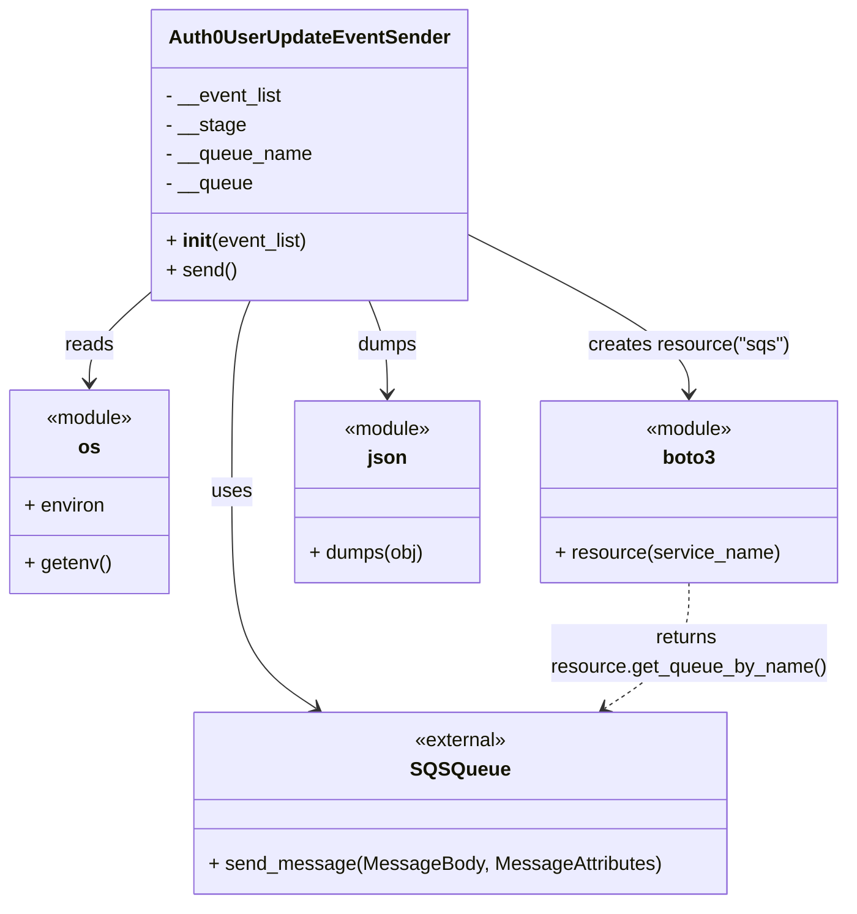

# Diagram: common/iam_service/iam_service/v1/lambdas/auth0/auth0_user_update_sender.py

> Auto-generated by Obscura crawlers

## Mermaid

```mermaid
classDiagram
    class Auth0UserUpdateEventSender {
        - __event_list
        - __stage
        - __queue_name
        - __queue
        + __init__(event_list)
        + send()
    }
    class os <<module>> {
        + environ
        + getenv()
    }
    class boto3 <<module>> {
        + resource(service_name)
    }
    class json <<module>> {
        + dumps(obj)
    }
    class SQSQueue <<external>> {
        + send_message(MessageBody, MessageAttributes)
    }
    Auth0UserUpdateEventSender --> os : reads
    Auth0UserUpdateEventSender --> boto3 : creates resource("sqs")
    Auth0UserUpdateEventSender --> json : dumps
    Auth0UserUpdateEventSender --> SQSQueue : uses
    boto3 ..> SQSQueue : returns resource.get_queue_by_name()
```

> SVG rendering failed for this diagram.
