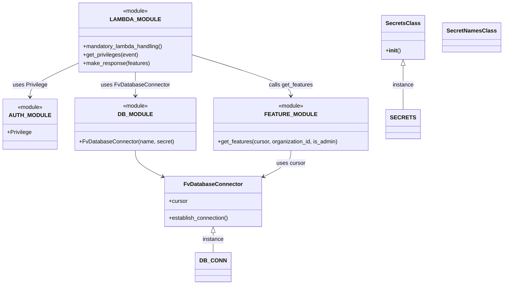

# Diagram: common/iam_service/iam_service/v1/lambdas/feature/get_features.py


> Auto-generated by Obscura crawlers

## Diagram 1

```mermaid
flowchart TD
    A[Lambda Invocation] --> B[Extract user_org from event]
    A --> C[Call get_privileges(event)]
    C --> D{Privilege.SUPER_PRIVILEGE in privs?}
    D -->|yes| E[is_admin = true]
    D -->|no| F[is_admin = false]
    B --> G[DB_CONN.establish_connection()]
    E --> G
    F --> G
    G --> H[cursor = DB_CONN.cursor]
    H --> I[features = db.get_features(cursor, user_org, is_admin)]
    I --> J[response = fv.aws.lambdas.make_response(features)]
    J --> K[Return response]
```

> SVG rendering failed for this diagram.

## Diagram 2



### SVG

<svg id="container" width="1396.1875" xmlns="http://www.w3.org/2000/svg" class="classDiagram" height="814" viewBox="0 0 1396.1875 814" role="graphics-document document" aria-roledescription="class"><style>#container{font-family:"trebuchet ms",verdana,arial,sans-serif;font-size:16px;fill:#333;}@keyframes edge-animation-frame{from{stroke-dashoffset:0;}}@keyframes dash{to{stroke-dashoffset:0;}}#container .edge-animation-slow{stroke-dasharray:9,5!important;stroke-dashoffset:900;animation:dash 50s linear infinite;stroke-linecap:round;}#container .edge-animation-fast{stroke-dasharray:9,5!important;stroke-dashoffset:900;animation:dash 20s linear infinite;stroke-linecap:round;}#container .error-icon{fill:#552222;}#container .error-text{fill:#552222;stroke:#552222;}#container .edge-thickness-normal{stroke-width:1px;}#container .edge-thickness-thick{stroke-width:3.5px;}#container .edge-pattern-solid{stroke-dasharray:0;}#container .edge-thickness-invisible{stroke-width:0;fill:none;}#container .edge-pattern-dashed{stroke-dasharray:3;}#container .edge-pattern-dotted{stroke-dasharray:2;}#container .marker{fill:#333333;stroke:#333333;}#container .marker.cross{stroke:#333333;}#container svg{font-family:"trebuchet ms",verdana,arial,sans-serif;font-size:16px;}#container p{margin:0;}#container g.classGroup text{fill:#9370DB;stroke:none;font-family:"trebuchet ms",verdana,arial,sans-serif;font-size:10px;}#container g.classGroup text .title{font-weight:bolder;}#container .nodeLabel,#container .edgeLabel{color:#131300;}#container .edgeLabel .label rect{fill:#ECECFF;}#container .label text{fill:#131300;}#container .labelBkg{background:#ECECFF;}#container .edgeLabel .label span{background:#ECECFF;}#container .classTitle{font-weight:bolder;}#container .node rect,#container .node circle,#container .node ellipse,#container .node polygon,#container .node path{fill:#ECECFF;stroke:#9370DB;stroke-width:1px;}#container .divider{stroke:#9370DB;stroke-width:1;}#container g.clickable{cursor:pointer;}#container g.classGroup rect{fill:#ECECFF;stroke:#9370DB;}#container g.classGroup line{stroke:#9370DB;stroke-width:1;}#container .classLabel .box{stroke:none;stroke-width:0;fill:#ECECFF;opacity:0.5;}#container .classLabel .label{fill:#9370DB;font-size:10px;}#container .relation{stroke:#333333;stroke-width:1;fill:none;}#container .dashed-line{stroke-dasharray:3;}#container .dotted-line{stroke-dasharray:1 2;}#container #compositionStart,#container .composition{fill:#333333!important;stroke:#333333!important;stroke-width:1;}#container #compositionEnd,#container .composition{fill:#333333!important;stroke:#333333!important;stroke-width:1;}#container #dependencyStart,#container .dependency{fill:#333333!important;stroke:#333333!important;stroke-width:1;}#container #dependencyStart,#container .dependency{fill:#333333!important;stroke:#333333!important;stroke-width:1;}#container #extensionStart,#container .extension{fill:transparent!important;stroke:#333333!important;stroke-width:1;}#container #extensionEnd,#container .extension{fill:transparent!important;stroke:#333333!important;stroke-width:1;}#container #aggregationStart,#container .aggregation{fill:transparent!important;stroke:#333333!important;stroke-width:1;}#container #aggregationEnd,#container .aggregation{fill:transparent!important;stroke:#333333!important;stroke-width:1;}#container #lollipopStart,#container .lollipop{fill:#ECECFF!important;stroke:#333333!important;stroke-width:1;}#container #lollipopEnd,#container .lollipop{fill:#ECECFF!important;stroke:#333333!important;stroke-width:1;}#container .edgeTerminals{font-size:11px;line-height:initial;}#container .classTitleText{text-anchor:middle;font-size:18px;fill:#333;}#container .label-icon{display:inline-block;height:1em;overflow:visible;vertical-align:-0.125em;}#container .node .label-icon path{fill:currentColor;stroke:revert;stroke-width:revert;}#container :root{--mermaid-font-family:"trebuchet ms",verdana,arial,sans-serif;}</style><g><defs><marker id="container_class-aggregationStart" class="marker aggregation class" refX="18" refY="7" markerWidth="190" markerHeight="240" orient="auto"><path d="M 18,7 L9,13 L1,7 L9,1 Z"></path></marker></defs><defs><marker id="container_class-aggregationEnd" class="marker aggregation class" refX="1" refY="7" markerWidth="20" markerHeight="28" orient="auto"><path d="M 18,7 L9,13 L1,7 L9,1 Z"></path></marker></defs><defs><marker id="container_class-extensionStart" class="marker extension class" refX="18" refY="7" markerWidth="190" markerHeight="240" orient="auto"><path d="M 1,7 L18,13 V 1 Z"></path></marker></defs><defs><marker id="container_class-extensionEnd" class="marker extension class" refX="1" refY="7" markerWidth="20" markerHeight="28" orient="auto"><path d="M 1,1 V 13 L18,7 Z"></path></marker></defs><defs><marker id="container_class-compositionStart" class="marker composition class" refX="18" refY="7" markerWidth="190" markerHeight="240" orient="auto"><path d="M 18,7 L9,13 L1,7 L9,1 Z"></path></marker></defs><defs><marker id="container_class-compositionEnd" class="marker composition class" refX="1" refY="7" markerWidth="20" markerHeight="28" orient="auto"><path d="M 18,7 L9,13 L1,7 L9,1 Z"></path></marker></defs><defs><marker id="container_class-dependencyStart" class="marker dependency class" refX="6" refY="7" markerWidth="190" markerHeight="240" orient="auto"><path d="M 5,7 L9,13 L1,7 L9,1 Z"></path></marker></defs><defs><marker id="container_class-dependencyEnd" class="marker dependency class" refX="13" refY="7" markerWidth="20" markerHeight="28" orient="auto"><path d="M 18,7 L9,13 L14,7 L9,1 Z"></path></marker></defs><defs><marker id="container_class-lollipopStart" class="marker lollipop class" refX="13" refY="7" markerWidth="190" markerHeight="240" orient="auto"><circle stroke="black" fill="transparent" cx="7" cy="7" r="6"></circle></marker></defs><defs><marker id="container_class-lollipopEnd" class="marker lollipop class" refX="1" refY="7" markerWidth="190" markerHeight="240" orient="auto"><circle stroke="black" fill="transparent" cx="7" cy="7" r="6"></circle></marker></defs><g class="root"><g class="clusters"></g><g class="edgePaths"><path d="M1122.477,187.25L1122.477,196.542C1122.477,205.833,1122.477,224.417,1122.477,245.375C1122.477,266.333,1122.477,289.667,1122.477,301.333L1122.477,313" id="id_SecretsClass_SECRETS_1" class="edge-thickness-normal edge-pattern-solid relation" style=";;;" data-edge="true" data-et="edge" data-id="id_SecretsClass_SECRETS_1" data-points="W3sieCI6MTEyMi40NzY1NjI1LCJ5IjoxNzB9LHsieCI6MTEyMi40NzY1NjI1LCJ5IjoyNDN9LHsieCI6MTEyMi40NzY1NjI1LCJ5IjozMTN9XQ==" marker-start="url(#container_class-extensionStart)"></path><path d="M592.572,665.25L592.572,668.542C592.572,671.833,592.572,678.417,592.572,687.875C592.572,697.333,592.572,709.667,592.572,715.833L592.572,722" id="id_FvDatabaseConnector_DB_CONN_2" class="edge-thickness-normal edge-pattern-solid relation" style=";;;" data-edge="true" data-et="edge" data-id="id_FvDatabaseConnector_DB_CONN_2" data-points="W3sieCI6NTkyLjU3MjI2NTYyNSwieSI6NjQ4fSx7IngiOjU5Mi41NzIyNjU2MjUsInkiOjY4NX0seyJ4Ijo1OTIuNTcyMjY1NjI1LCJ5Ijo3MjJ9XQ==" marker-start="url(#container_class-extensionStart)"></path><path d="M374.313,430L374.313,436.167C374.313,442.333,374.313,454.667,386.747,467.043C399.181,479.42,424.05,491.839,436.485,498.049L448.919,504.259" id="id_DB_MODULE_FvDatabaseConnector_3" class="edge-thickness-normal edge-pattern-solid relation" style=";;;" data-edge="true" data-et="edge" data-id="id_DB_MODULE_FvDatabaseConnector_3" data-points="W3sieCI6Mzc0LjMxMjUsInkiOjQzMH0seyJ4IjozNzQuMzEyNSwieSI6NDY3fSx7IngiOjQ1NC4yODcxMDkzNzUsInkiOjUwNi45Mzk3MTMxMDcwNTI0fV0=" marker-end="url(#container_class-dependencyEnd)"></path><path d="M810.832,430L810.832,436.167C810.832,442.333,810.832,454.667,798.398,467.043C785.963,479.42,761.094,491.839,748.66,498.049L736.225,504.259" id="id_FEATURE_MODULE_FvDatabaseConnector_4" class="edge-thickness-normal edge-pattern-solid relation" style=";;;" data-edge="true" data-et="edge" data-id="id_FEATURE_MODULE_FvDatabaseConnector_4" data-points="W3sieCI6ODEwLjgzMjAzMTI1LCJ5Ijo0MzB9LHsieCI6ODEwLjgzMjAzMTI1LCJ5Ijo0Njd9LHsieCI6NzMwLjg1NzQyMTg3NSwieSI6NTA2LjkzOTcxMzEwNzA1MjR9XQ==" marker-end="url(#container_class-dependencyEnd)"></path><path d="M214.012,181.617L192.033,191.847C170.055,202.078,126.098,222.539,104.119,238.436C82.141,254.333,82.141,265.667,82.141,271.333L82.141,277" id="id_LAMBDA_MODULE_AUTH_MODULE_5" class="edge-thickness-normal edge-pattern-solid relation" style=";;;" data-edge="true" data-et="edge" data-id="id_LAMBDA_MODULE_AUTH_MODULE_5" data-points="W3sieCI6MjE0LjAxMTcxODc1LCJ5IjoxODEuNjE2NzE3NDcxNTIyNTJ9LHsieCI6ODIuMTQwNjI1LCJ5IjoyNDN9LHsieCI6ODIuMTQwNjI1LCJ5IjoyODN9XQ==" marker-end="url(#container_class-dependencyEnd)"></path><path d="M374.313,206L374.313,212.167C374.313,218.333,374.313,230.667,374.313,242C374.313,253.333,374.313,263.667,374.313,268.833L374.313,274" id="id_LAMBDA_MODULE_DB_MODULE_6" class="edge-thickness-normal edge-pattern-solid relation" style=";;;" data-edge="true" data-et="edge" data-id="id_LAMBDA_MODULE_DB_MODULE_6" data-points="W3sieCI6Mzc0LjMxMjUsInkiOjIwNn0seyJ4IjozNzQuMzEyNSwieSI6MjQzfSx7IngiOjM3NC4zMTI1LCJ5IjoyODB9XQ==" marker-end="url(#container_class-dependencyEnd)"></path><path d="M534.613,156.943L580.65,171.285C626.686,185.628,718.759,214.314,764.796,233.824C810.832,253.333,810.832,263.667,810.832,268.833L810.832,274" id="id_LAMBDA_MODULE_FEATURE_MODULE_7" class="edge-thickness-normal edge-pattern-solid relation" style=";;;" data-edge="true" data-et="edge" data-id="id_LAMBDA_MODULE_FEATURE_MODULE_7" data-points="W3sieCI6NTM0LjYxMzI4MTI1LCJ5IjoxNTYuOTQyNTY3NzE4NzI2OH0seyJ4Ijo4MTAuODMyMDMxMjUsInkiOjI0M30seyJ4Ijo4MTAuODMyMDMxMjUsInkiOjI4MH1d" marker-end="url(#container_class-dependencyEnd)"></path></g><g class="edgeLabels"><g class="edgeLabel" transform="translate(1122.4765625, 243)"><g class="label" data-id="id_SecretsClass_SECRETS_1" transform="translate(-30.578125, -12)"><foreignObject width="61.15625" height="24"><div xmlns="http://www.w3.org/1999/xhtml" class="labelBkg" style="display: table-cell; white-space: nowrap; line-height: 1.5; max-width: 200px; text-align: center;"><span class="edgeLabel"><p>instance</p></span></div></foreignObject></g></g><g class="edgeLabel" transform="translate(592.572265625, 685)"><g class="label" data-id="id_FvDatabaseConnector_DB_CONN_2" transform="translate(-30.578125, -12)"><foreignObject width="61.15625" height="24"><div xmlns="http://www.w3.org/1999/xhtml" class="labelBkg" style="display: table-cell; white-space: nowrap; line-height: 1.5; max-width: 200px; text-align: center;"><span class="edgeLabel"><p>instance</p></span></div></foreignObject></g></g><g class="edgeLabel"><g class="label" data-id="id_DB_MODULE_FvDatabaseConnector_3" transform="translate(0, 0)"><foreignObject width="0" height="0"><div xmlns="http://www.w3.org/1999/xhtml" class="labelBkg" style="display: table-cell; white-space: nowrap; line-height: 1.5; max-width: 200px; text-align: center;"><span class="edgeLabel"></span></div></foreignObject></g></g><g class="edgeLabel" transform="translate(810.83203125, 467)"><g class="label" data-id="id_FEATURE_MODULE_FvDatabaseConnector_4" transform="translate(-41.4765625, -12)"><foreignObject width="82.953125" height="24"><div xmlns="http://www.w3.org/1999/xhtml" class="labelBkg" style="display: table-cell; white-space: nowrap; line-height: 1.5; max-width: 200px; text-align: center;"><span class="edgeLabel"><p>uses cursor</p></span></div></foreignObject></g></g><g class="edgeLabel" transform="translate(82.140625, 243)"><g class="label" data-id="id_LAMBDA_MODULE_AUTH_MODULE_5" transform="translate(-49.6953125, -12)"><foreignObject width="99.390625" height="24"><div xmlns="http://www.w3.org/1999/xhtml" class="labelBkg" style="display: table-cell; white-space: nowrap; line-height: 1.5; max-width: 200px; text-align: center;"><span class="edgeLabel"><p>uses Privilege</p></span></div></foreignObject></g></g><g class="edgeLabel" transform="translate(374.3125, 243)"><g class="label" data-id="id_LAMBDA_MODULE_DB_MODULE_6" transform="translate(-96.921875, -12)"><foreignObject width="193.84375" height="24"><div xmlns="http://www.w3.org/1999/xhtml" class="labelBkg" style="display: table-cell; white-space: nowrap; line-height: 1.5; max-width: 200px; text-align: center;"><span class="edgeLabel"><p>uses FvDatabaseConnector</p></span></div></foreignObject></g></g><g class="edgeLabel" transform="translate(810.83203125, 243)"><g class="label" data-id="id_LAMBDA_MODULE_FEATURE_MODULE_7" transform="translate(-63.5625, -12)"><foreignObject width="127.125" height="24"><div xmlns="http://www.w3.org/1999/xhtml" class="labelBkg" style="display: table-cell; white-space: nowrap; line-height: 1.5; max-width: 200px; text-align: center;"><span class="edgeLabel"><p>calls get_features</p></span></div></foreignObject></g></g></g><g class="nodes"><g class="node default" id="classId-LAMBDA_MODULE-0" transform="translate(374.3125, 107)"><g class="basic label-container"><path d="M-160.30078125 -99 L160.30078125 -99 L160.30078125 99 L-160.30078125 99" stroke="none" stroke-width="0" fill="#ECECFF" style=""></path><path d="M-160.30078125 -99 C-95.02881196576242 -99, -29.75684268152483 -99, 160.30078125 -99 M-160.30078125 -99 C-73.04568758639158 -99, 14.20940607721684 -99, 160.30078125 -99 M160.30078125 -99 C160.30078125 -28.952297379604445, 160.30078125 41.09540524079111, 160.30078125 99 M160.30078125 -99 C160.30078125 -54.515894761801, 160.30078125 -10.031789523602, 160.30078125 99 M160.30078125 99 C49.03413792914414 99, -62.232505391711726 99, -160.30078125 99 M160.30078125 99 C37.60615776934537 99, -85.08846571130925 99, -160.30078125 99 M-160.30078125 99 C-160.30078125 33.011574098901306, -160.30078125 -32.97685180219739, -160.30078125 -99 M-160.30078125 99 C-160.30078125 50.717724486891996, -160.30078125 2.4354489737839913, -160.30078125 -99" stroke="#9370DB" stroke-width="1.3" fill="none" stroke-dasharray="0 0" style=""></path></g><g class="annotation-group text" transform="translate(-36.6015625, -75)"><g class="label" style="" transform="translate(0,-12)"><foreignObject width="73.203125" height="24"><div xmlns="http://www.w3.org/1999/xhtml" style="display: table-cell; white-space: nowrap; line-height: 1.5; max-width: 123px; text-align: center;"><span class="nodeLabel markdown-node-label" style=""><p>«module»</p></span></div></foreignObject></g></g><g class="label-group text" transform="translate(-64.5234375, -51)"><g class="label" style="font-weight: bolder" transform="translate(0,-12)"><foreignObject width="129.046875" height="24"><div xmlns="http://www.w3.org/1999/xhtml" style="display: table-cell; white-space: nowrap; line-height: 1.5; max-width: 178px; text-align: center;"><span class="nodeLabel markdown-node-label" style=""><p>LAMBDA_MODULE</p></span></div></foreignObject></g></g><g class="members-group text" transform="translate(-148.30078125, -3)"></g><g class="methods-group text" transform="translate(-148.30078125, 27)"><g class="label" style="" transform="translate(0,-12)"><foreignObject width="232.078125" height="24"><div xmlns="http://www.w3.org/1999/xhtml" style="display: table-cell; white-space: nowrap; line-height: 1.5; max-width: 289px; text-align: center;"><span class="nodeLabel markdown-node-label" style=""><p>+mandatory_lambda_handling()</p></span></div></foreignObject></g><g class="label" style="" transform="translate(0,12)"><foreignObject width="159.734375" height="24"><div xmlns="http://www.w3.org/1999/xhtml" style="display: table-cell; white-space: nowrap; line-height: 1.5; max-width: 217px; text-align: center;"><span class="nodeLabel markdown-node-label" style=""><p>+get_privileges(event)</p></span></div></foreignObject></g><g class="label" style="" transform="translate(0,36)"><foreignObject width="191.28125" height="24"><div xmlns="http://www.w3.org/1999/xhtml" style="display: table-cell; white-space: nowrap; line-height: 1.5; max-width: 249px; text-align: center;"><span class="nodeLabel markdown-node-label" style=""><p>+make_response(features)</p></span></div></foreignObject></g></g><g class="divider" style=""><path d="M-160.30078125 -27 C-33.79457365831047 -27, 92.71163393337906 -27, 160.30078125 -27 M-160.30078125 -27 C-91.38239231321997 -27, -22.464003376439933 -27, 160.30078125 -27" stroke="#9370DB" stroke-width="1.3" fill="none" stroke-dasharray="0 0" style=""></path></g><g class="divider" style=""><path d="M-160.30078125 -3 C-53.04339796966255 -3, 54.2139853106749 -3, 160.30078125 -3 M-160.30078125 -3 C-51.52269002754289 -3, 57.255401194914214 -3, 160.30078125 -3" stroke="#9370DB" stroke-width="1.3" fill="none" stroke-dasharray="0 0" style=""></path></g></g><g class="node default" id="classId-AUTH_MODULE-1" transform="translate(82.140625, 355)"><g class="basic label-container"><path d="M-74.140625 -72 L74.140625 -72 L74.140625 72 L-74.140625 72" stroke="none" stroke-width="0" fill="#ECECFF" style=""></path><path d="M-74.140625 -72 C-26.14946126525907 -72, 21.84170246948186 -72, 74.140625 -72 M-74.140625 -72 C-21.74599673015657 -72, 30.64863153968686 -72, 74.140625 -72 M74.140625 -72 C74.140625 -14.726920301232347, 74.140625 42.546159397535305, 74.140625 72 M74.140625 -72 C74.140625 -18.161688756340304, 74.140625 35.67662248731939, 74.140625 72 M74.140625 72 C26.32890302442705 72, -21.4828189511459 72, -74.140625 72 M74.140625 72 C30.41534303315602 72, -13.30993893368796 72, -74.140625 72 M-74.140625 72 C-74.140625 21.80933191858201, -74.140625 -28.38133616283598, -74.140625 -72 M-74.140625 72 C-74.140625 38.55861726752407, -74.140625 5.117234535048141, -74.140625 -72" stroke="#9370DB" stroke-width="1.3" fill="none" stroke-dasharray="0 0" style=""></path></g><g class="annotation-group text" transform="translate(-36.6015625, -48)"><g class="label" style="" transform="translate(0,-12)"><foreignObject width="73.203125" height="24"><div xmlns="http://www.w3.org/1999/xhtml" style="display: table-cell; white-space: nowrap; line-height: 1.5; max-width: 123px; text-align: center;"><span class="nodeLabel markdown-node-label" style=""><p>«module»</p></span></div></foreignObject></g></g><g class="label-group text" transform="translate(-54.125, -24)"><g class="label" style="font-weight: bolder" transform="translate(0,-12)"><foreignObject width="108.25" height="24"><div xmlns="http://www.w3.org/1999/xhtml" style="display: table-cell; white-space: nowrap; line-height: 1.5; max-width: 158px; text-align: center;"><span class="nodeLabel markdown-node-label" style=""><p>AUTH_MODULE</p></span></div></foreignObject></g></g><g class="members-group text" transform="translate(-62.140625, 24)"><g class="label" style="" transform="translate(0,-12)"><foreignObject width="70.15625" height="24"><div xmlns="http://www.w3.org/1999/xhtml" style="display: table-cell; white-space: nowrap; line-height: 1.5; max-width: 128px; text-align: center;"><span class="nodeLabel markdown-node-label" style=""><p>+Privilege</p></span></div></foreignObject></g></g><g class="methods-group text" transform="translate(-62.140625, 72)"></g><g class="divider" style=""><path d="M-74.140625 0 C-15.8834972221889 0, 42.3736305556222 0, 74.140625 0 M-74.140625 0 C-34.496671732041754 0, 5.147281535916491 0, 74.140625 0" stroke="#9370DB" stroke-width="1.3" fill="none" stroke-dasharray="0 0" style=""></path></g><g class="divider" style=""><path d="M-74.140625 48 C-40.098025895899426 48, -6.055426791798851 48, 74.140625 48 M-74.140625 48 C-33.66527025299136 48, 6.810084494017275 48, 74.140625 48" stroke="#9370DB" stroke-width="1.3" fill="none" stroke-dasharray="0 0" style=""></path></g></g><g class="node default" id="classId-DB_MODULE-2" transform="translate(374.3125, 355)"><g class="basic label-container"><path d="M-168.03125 -75 L168.03125 -75 L168.03125 75 L-168.03125 75" stroke="none" stroke-width="0" fill="#ECECFF" style=""></path><path d="M-168.03125 -75 C-40.66782743896725 -75, 86.6955951220655 -75, 168.03125 -75 M-168.03125 -75 C-43.23043590528437 -75, 81.57037818943127 -75, 168.03125 -75 M168.03125 -75 C168.03125 -33.49089084534472, 168.03125 8.018218309310555, 168.03125 75 M168.03125 -75 C168.03125 -34.99106269588004, 168.03125 5.0178746082399215, 168.03125 75 M168.03125 75 C74.4597604799682 75, -19.111729040063608 75, -168.03125 75 M168.03125 75 C84.07237712011857 75, 0.11350424023714822 75, -168.03125 75 M-168.03125 75 C-168.03125 20.054258617698714, -168.03125 -34.89148276460257, -168.03125 -75 M-168.03125 75 C-168.03125 32.158061998779935, -168.03125 -10.68387600244013, -168.03125 -75" stroke="#9370DB" stroke-width="1.3" fill="none" stroke-dasharray="0 0" style=""></path></g><g class="annotation-group text" transform="translate(-36.6015625, -51)"><g class="label" style="" transform="translate(0,-12)"><foreignObject width="73.203125" height="24"><div xmlns="http://www.w3.org/1999/xhtml" style="display: table-cell; white-space: nowrap; line-height: 1.5; max-width: 123px; text-align: center;"><span class="nodeLabel markdown-node-label" style=""><p>«module»</p></span></div></foreignObject></g></g><g class="label-group text" transform="translate(-44.609375, -27)"><g class="label" style="font-weight: bolder" transform="translate(0,-12)"><foreignObject width="89.21875" height="24"><div xmlns="http://www.w3.org/1999/xhtml" style="display: table-cell; white-space: nowrap; line-height: 1.5; max-width: 139px; text-align: center;"><span class="nodeLabel markdown-node-label" style=""><p>DB_MODULE</p></span></div></foreignObject></g></g><g class="members-group text" transform="translate(-156.03125, 21)"></g><g class="methods-group text" transform="translate(-156.03125, 51)"><g class="label" style="" transform="translate(0,-12)"><foreignObject width="267.453125" height="24"><div xmlns="http://www.w3.org/1999/xhtml" style="display: table-cell; white-space: nowrap; line-height: 1.5; max-width: 325px; text-align: center;"><span class="nodeLabel markdown-node-label" style=""><p>+FvDatabaseConnector(name, secret)</p></span></div></foreignObject></g></g><g class="divider" style=""><path d="M-168.03125 -3 C-67.55779168488709 -3, 32.915666630225815 -3, 168.03125 -3 M-168.03125 -3 C-71.52364809298977 -3, 24.983953814020452 -3, 168.03125 -3" stroke="#9370DB" stroke-width="1.3" fill="none" stroke-dasharray="0 0" style=""></path></g><g class="divider" style=""><path d="M-168.03125 21 C-88.55958415192558 21, -9.087918303851154 21, 168.03125 21 M-168.03125 21 C-41.18330550130757 21, 85.66463899738486 21, 168.03125 21" stroke="#9370DB" stroke-width="1.3" fill="none" stroke-dasharray="0 0" style=""></path></g></g><g class="node default" id="classId-FEATURE_MODULE-3" transform="translate(810.83203125, 355)"><g class="basic label-container"><path d="M-218.48828125 -75 L218.48828125 -75 L218.48828125 75 L-218.48828125 75" stroke="none" stroke-width="0" fill="#ECECFF" style=""></path><path d="M-218.48828125 -75 C-94.42798433430056 -75, 29.632312581398878 -75, 218.48828125 -75 M-218.48828125 -75 C-124.50880244619178 -75, -30.52932364238356 -75, 218.48828125 -75 M218.48828125 -75 C218.48828125 -32.06475323749856, 218.48828125 10.870493525002885, 218.48828125 75 M218.48828125 -75 C218.48828125 -19.524560800699277, 218.48828125 35.950878398601446, 218.48828125 75 M218.48828125 75 C57.10558887429511 75, -104.27710350140978 75, -218.48828125 75 M218.48828125 75 C104.48994059211358 75, -9.508400065772832 75, -218.48828125 75 M-218.48828125 75 C-218.48828125 28.15481636825691, -218.48828125 -18.69036726348618, -218.48828125 -75 M-218.48828125 75 C-218.48828125 21.483915240509063, -218.48828125 -32.032169518981874, -218.48828125 -75" stroke="#9370DB" stroke-width="1.3" fill="none" stroke-dasharray="0 0" style=""></path></g><g class="annotation-group text" transform="translate(-36.6015625, -51)"><g class="label" style="" transform="translate(0,-12)"><foreignObject width="73.203125" height="24"><div xmlns="http://www.w3.org/1999/xhtml" style="display: table-cell; white-space: nowrap; line-height: 1.5; max-width: 123px; text-align: center;"><span class="nodeLabel markdown-node-label" style=""><p>«module»</p></span></div></foreignObject></g></g><g class="label-group text" transform="translate(-65.7265625, -27)"><g class="label" style="font-weight: bolder" transform="translate(0,-12)"><foreignObject width="131.453125" height="24"><div xmlns="http://www.w3.org/1999/xhtml" style="display: table-cell; white-space: nowrap; line-height: 1.5; max-width: 181px; text-align: center;"><span class="nodeLabel markdown-node-label" style=""><p>FEATURE_MODULE</p></span></div></foreignObject></g></g><g class="members-group text" transform="translate(-206.48828125, 21)"></g><g class="methods-group text" transform="translate(-206.48828125, 51)"><g class="label" style="" transform="translate(0,-12)"><foreignObject width="347.25" height="24"><div xmlns="http://www.w3.org/1999/xhtml" style="display: table-cell; white-space: nowrap; line-height: 1.5; max-width: 405px; text-align: center;"><span class="nodeLabel markdown-node-label" style=""><p>+get_features(cursor, organization_id, is_admin)</p></span></div></foreignObject></g></g><g class="divider" style=""><path d="M-218.48828125 -3 C-108.04265925776679 -3, 2.4029627344664277 -3, 218.48828125 -3 M-218.48828125 -3 C-109.98150179874169 -3, -1.4747223474833788 -3, 218.48828125 -3" stroke="#9370DB" stroke-width="1.3" fill="none" stroke-dasharray="0 0" style=""></path></g><g class="divider" style=""><path d="M-218.48828125 21 C-95.63565473370703 21, 27.216971782585944 21, 218.48828125 21 M-218.48828125 21 C-97.74387700098598 21, 23.00052724802805 21, 218.48828125 21" stroke="#9370DB" stroke-width="1.3" fill="none" stroke-dasharray="0 0" style=""></path></g></g><g class="node default" id="classId-SecretsClass-4" transform="translate(1122.4765625, 107)"><g class="basic label-container"><path d="M-57.9921875 -63 L57.9921875 -63 L57.9921875 63 L-57.9921875 63" stroke="none" stroke-width="0" fill="#ECECFF" style=""></path><path d="M-57.9921875 -63 C-16.25622129360528 -63, 25.479744912789442 -63, 57.9921875 -63 M-57.9921875 -63 C-14.795896188633613 -63, 28.400395122732775 -63, 57.9921875 -63 M57.9921875 -63 C57.9921875 -26.73254476289923, 57.9921875 9.534910474201538, 57.9921875 63 M57.9921875 -63 C57.9921875 -31.09133059154279, 57.9921875 0.8173388169144218, 57.9921875 63 M57.9921875 63 C32.05516197824157 63, 6.11813645648315 63, -57.9921875 63 M57.9921875 63 C18.26602086366347 63, -21.46014577267306 63, -57.9921875 63 M-57.9921875 63 C-57.9921875 29.253718621595752, -57.9921875 -4.492562756808496, -57.9921875 -63 M-57.9921875 63 C-57.9921875 17.065568530848886, -57.9921875 -28.86886293830223, -57.9921875 -63" stroke="#9370DB" stroke-width="1.3" fill="none" stroke-dasharray="0 0" style=""></path></g><g class="annotation-group text" transform="translate(0, -39)"></g><g class="label-group text" transform="translate(-45.9921875, -39)"><g class="label" style="font-weight: bolder" transform="translate(0,-12)"><foreignObject width="91.984375" height="24"><div xmlns="http://www.w3.org/1999/xhtml" style="display: table-cell; white-space: nowrap; line-height: 1.5; max-width: 140px; text-align: center;"><span class="nodeLabel markdown-node-label" style=""><p>SecretsClass</p></span></div></foreignObject></g></g><g class="members-group text" transform="translate(-45.9921875, 9)"></g><g class="methods-group text" transform="translate(-45.9921875, 39)"><g class="label" style="" transform="translate(0,-12)"><foreignObject width="42.796875" height="24"><div xmlns="http://www.w3.org/1999/xhtml" style="display: table-cell; white-space: nowrap; line-height: 1.5; max-width: 132px; text-align: center;"><span class="nodeLabel markdown-node-label" style=""><p>+<strong>init</strong>()</p></span></div></foreignObject></g></g><g class="divider" style=""><path d="M-57.9921875 -15 C-24.909364514766757 -15, 8.173458470466485 -15, 57.9921875 -15 M-57.9921875 -15 C-22.220673244402825 -15, 13.55084101119435 -15, 57.9921875 -15" stroke="#9370DB" stroke-width="1.3" fill="none" stroke-dasharray="0 0" style=""></path></g><g class="divider" style=""><path d="M-57.9921875 9 C-22.790081435454617 9, 12.412024629090766 9, 57.9921875 9 M-57.9921875 9 C-13.599591661101734 9, 30.793004177796533 9, 57.9921875 9" stroke="#9370DB" stroke-width="1.3" fill="none" stroke-dasharray="0 0" style=""></path></g></g><g class="node default" id="classId-SecretNamesClass-5" transform="translate(1309.328125, 107)"><g class="basic label-container"><path d="M-78.859375 -42 L78.859375 -42 L78.859375 42 L-78.859375 42" stroke="none" stroke-width="0" fill="#ECECFF" style=""></path><path d="M-78.859375 -42 C-23.3885158241046 -42, 32.0823433517908 -42, 78.859375 -42 M-78.859375 -42 C-16.914574854171413 -42, 45.030225291657175 -42, 78.859375 -42 M78.859375 -42 C78.859375 -23.907054600211158, 78.859375 -5.814109200422315, 78.859375 42 M78.859375 -42 C78.859375 -21.605203477089656, 78.859375 -1.2104069541793123, 78.859375 42 M78.859375 42 C32.742744951283704 42, -13.373885097432591 42, -78.859375 42 M78.859375 42 C19.213104222000133 42, -40.43316655599973 42, -78.859375 42 M-78.859375 42 C-78.859375 12.504243811221933, -78.859375 -16.991512377556134, -78.859375 -42 M-78.859375 42 C-78.859375 18.55449895072296, -78.859375 -4.8910020985540825, -78.859375 -42" stroke="#9370DB" stroke-width="1.3" fill="none" stroke-dasharray="0 0" style=""></path></g><g class="annotation-group text" transform="translate(0, -18)"></g><g class="label-group text" transform="translate(-66.859375, -18)"><g class="label" style="font-weight: bolder" transform="translate(0,-12)"><foreignObject width="133.71875" height="24"><div xmlns="http://www.w3.org/1999/xhtml" style="display: table-cell; white-space: nowrap; line-height: 1.5; max-width: 182px; text-align: center;"><span class="nodeLabel markdown-node-label" style=""><p>SecretNamesClass</p></span></div></foreignObject></g></g><g class="members-group text" transform="translate(-66.859375, 30)"></g><g class="methods-group text" transform="translate(-66.859375, 60)"></g><g class="divider" style=""><path d="M-78.859375 6 C-19.31009793692899 6, 40.23917912614202 6, 78.859375 6 M-78.859375 6 C-18.04008643549662 6, 42.77920212900676 6, 78.859375 6" stroke="#9370DB" stroke-width="1.3" fill="none" stroke-dasharray="0 0" style=""></path></g><g class="divider" style=""><path d="M-78.859375 24 C-31.344168274264845 24, 16.17103845147031 24, 78.859375 24 M-78.859375 24 C-18.149883752959262 24, 42.559607494081476 24, 78.859375 24" stroke="#9370DB" stroke-width="1.3" fill="none" stroke-dasharray="0 0" style=""></path></g></g><g class="node default" id="classId-FvDatabaseConnector-6" transform="translate(592.572265625, 576)"><g class="basic label-container"><path d="M-138.28515625 -72 L138.28515625 -72 L138.28515625 72 L-138.28515625 72" stroke="none" stroke-width="0" fill="#ECECFF" style=""></path><path d="M-138.28515625 -72 C-63.409668792756335 -72, 11.46581866448733 -72, 138.28515625 -72 M-138.28515625 -72 C-51.30399520467867 -72, 35.67716584064266 -72, 138.28515625 -72 M138.28515625 -72 C138.28515625 -16.523756315430916, 138.28515625 38.95248736913817, 138.28515625 72 M138.28515625 -72 C138.28515625 -31.651764964974006, 138.28515625 8.696470070051987, 138.28515625 72 M138.28515625 72 C46.13773682346182 72, -46.00968260307636 72, -138.28515625 72 M138.28515625 72 C31.06362046526506 72, -76.15791531946988 72, -138.28515625 72 M-138.28515625 72 C-138.28515625 22.097833038738436, -138.28515625 -27.804333922523128, -138.28515625 -72 M-138.28515625 72 C-138.28515625 41.88293881156735, -138.28515625 11.765877623134699, -138.28515625 -72" stroke="#9370DB" stroke-width="1.3" fill="none" stroke-dasharray="0 0" style=""></path></g><g class="annotation-group text" transform="translate(0, -48)"></g><g class="label-group text" transform="translate(-79.3046875, -48)"><g class="label" style="font-weight: bolder" transform="translate(0,-12)"><foreignObject width="158.609375" height="24"><div xmlns="http://www.w3.org/1999/xhtml" style="display: table-cell; white-space: nowrap; line-height: 1.5; max-width: 207px; text-align: center;"><span class="nodeLabel markdown-node-label" style=""><p>FvDatabaseConnector</p></span></div></foreignObject></g></g><g class="members-group text" transform="translate(-126.28515625, 0)"><g class="label" style="" transform="translate(0,-12)"><foreignObject width="53.71875" height="24"><div xmlns="http://www.w3.org/1999/xhtml" style="display: table-cell; white-space: nowrap; line-height: 1.5; max-width: 112px; text-align: center;"><span class="nodeLabel markdown-node-label" style=""><p>+cursor</p></span></div></foreignObject></g></g><g class="methods-group text" transform="translate(-126.28515625, 48)"><g class="label" style="" transform="translate(0,-12)"><foreignObject width="173.265625" height="24"><div xmlns="http://www.w3.org/1999/xhtml" style="display: table-cell; white-space: nowrap; line-height: 1.5; max-width: 231px; text-align: center;"><span class="nodeLabel markdown-node-label" style=""><p>+establish_connection()</p></span></div></foreignObject></g></g><g class="divider" style=""><path d="M-138.28515625 -24 C-65.03146119207057 -24, 8.222233865858868 -24, 138.28515625 -24 M-138.28515625 -24 C-52.97471488094506 -24, 32.335726488109884 -24, 138.28515625 -24" stroke="#9370DB" stroke-width="1.3" fill="none" stroke-dasharray="0 0" style=""></path></g><g class="divider" style=""><path d="M-138.28515625 24 C-30.894966582631625 24, 76.49522308473675 24, 138.28515625 24 M-138.28515625 24 C-70.14744124283469 24, -2.009726235669376 24, 138.28515625 24" stroke="#9370DB" stroke-width="1.3" fill="none" stroke-dasharray="0 0" style=""></path></g></g><g class="node default" id="classId-SECRETS-7" transform="translate(1122.4765625, 355)"><g class="basic label-container"><path d="M-43.15625 -42 L43.15625 -42 L43.15625 42 L-43.15625 42" stroke="none" stroke-width="0" fill="#ECECFF" style=""></path><path d="M-43.15625 -42 C-21.55456372258753 -42, 0.04712255482493788 -42, 43.15625 -42 M-43.15625 -42 C-25.109780227385663 -42, -7.063310454771326 -42, 43.15625 -42 M43.15625 -42 C43.15625 -20.79721046610496, 43.15625 0.4055790677900788, 43.15625 42 M43.15625 -42 C43.15625 -18.226052880922833, 43.15625 5.547894238154335, 43.15625 42 M43.15625 42 C17.74861288567398 42, -7.6590242286520365 42, -43.15625 42 M43.15625 42 C23.94312535667277 42, 4.7300007133455395 42, -43.15625 42 M-43.15625 42 C-43.15625 13.111809601089291, -43.15625 -15.776380797821417, -43.15625 -42 M-43.15625 42 C-43.15625 12.007774811127614, -43.15625 -17.98445037774477, -43.15625 -42" stroke="#9370DB" stroke-width="1.3" fill="none" stroke-dasharray="0 0" style=""></path></g><g class="annotation-group text" transform="translate(0, -18)"></g><g class="label-group text" transform="translate(-31.15625, -18)"><g class="label" style="font-weight: bolder" transform="translate(0,-12)"><foreignObject width="62.3125" height="24"><div xmlns="http://www.w3.org/1999/xhtml" style="display: table-cell; white-space: nowrap; line-height: 1.5; max-width: 111px; text-align: center;"><span class="nodeLabel markdown-node-label" style=""><p>SECRETS</p></span></div></foreignObject></g></g><g class="members-group text" transform="translate(-31.15625, 30)"></g><g class="methods-group text" transform="translate(-31.15625, 60)"></g><g class="divider" style=""><path d="M-43.15625 6 C-22.879134401632292 6, -2.602018803264585 6, 43.15625 6 M-43.15625 6 C-17.447943639905663 6, 8.260362720188674 6, 43.15625 6" stroke="#9370DB" stroke-width="1.3" fill="none" stroke-dasharray="0 0" style=""></path></g><g class="divider" style=""><path d="M-43.15625 24 C-16.967796486950977 24, 9.220657026098046 24, 43.15625 24 M-43.15625 24 C-24.4340027169827 24, -5.711755433965401 24, 43.15625 24" stroke="#9370DB" stroke-width="1.3" fill="none" stroke-dasharray="0 0" style=""></path></g></g><g class="node default" id="classId-DB_CONN-8" transform="translate(592.572265625, 764)"><g class="basic label-container"><path d="M-46.40625 -42 L46.40625 -42 L46.40625 42 L-46.40625 42" stroke="none" stroke-width="0" fill="#ECECFF" style=""></path><path d="M-46.40625 -42 C-22.564011653150846 -42, 1.2782266936983078 -42, 46.40625 -42 M-46.40625 -42 C-9.845988600242592 -42, 26.714272799514816 -42, 46.40625 -42 M46.40625 -42 C46.40625 -12.281538516727256, 46.40625 17.436922966545488, 46.40625 42 M46.40625 -42 C46.40625 -21.815348686846654, 46.40625 -1.6306973736933088, 46.40625 42 M46.40625 42 C19.077237700786434 42, -8.251774598427133 42, -46.40625 42 M46.40625 42 C24.292200135530578 42, 2.178150271061156 42, -46.40625 42 M-46.40625 42 C-46.40625 23.85031914049106, -46.40625 5.700638280982119, -46.40625 -42 M-46.40625 42 C-46.40625 23.107639439698524, -46.40625 4.215278879397047, -46.40625 -42" stroke="#9370DB" stroke-width="1.3" fill="none" stroke-dasharray="0 0" style=""></path></g><g class="annotation-group text" transform="translate(0, -18)"></g><g class="label-group text" transform="translate(-34.40625, -18)"><g class="label" style="font-weight: bolder" transform="translate(0,-12)"><foreignObject width="68.8125" height="24"><div xmlns="http://www.w3.org/1999/xhtml" style="display: table-cell; white-space: nowrap; line-height: 1.5; max-width: 119px; text-align: center;"><span class="nodeLabel markdown-node-label" style=""><p>DB_CONN</p></span></div></foreignObject></g></g><g class="members-group text" transform="translate(-34.40625, 30)"></g><g class="methods-group text" transform="translate(-34.40625, 60)"></g><g class="divider" style=""><path d="M-46.40625 6 C-13.89611601804748 6, 18.61401796390504 6, 46.40625 6 M-46.40625 6 C-20.841114638948717 6, 4.724020722102566 6, 46.40625 6" stroke="#9370DB" stroke-width="1.3" fill="none" stroke-dasharray="0 0" style=""></path></g><g class="divider" style=""><path d="M-46.40625 24 C-21.240833986391856 24, 3.924582027216289 24, 46.40625 24 M-46.40625 24 C-25.58268272054579 24, -4.759115441091581 24, 46.40625 24" stroke="#9370DB" stroke-width="1.3" fill="none" stroke-dasharray="0 0" style=""></path></g></g></g></g></g></svg>
