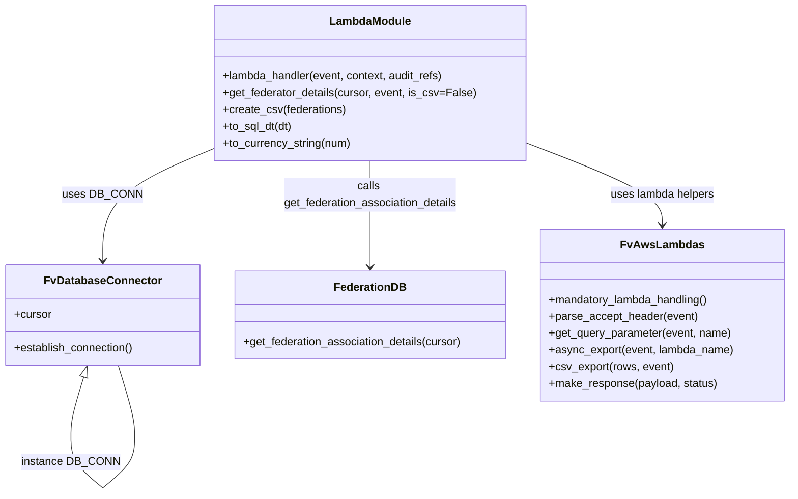

# Diagram: common/iam_service/iam_service/v1/lambdas/federations/get_federator_details.py


> Auto-generated by Obscura crawlers

## Diagram 1



### SVG

<svg id="container" width="1129.203125" xmlns="http://www.w3.org/2000/svg" class="classDiagram" height="706.25" viewBox="0 0 1129.203125 706.25" role="graphics-document document" aria-roledescription="class"><style>#container{font-family:"trebuchet ms",verdana,arial,sans-serif;font-size:16px;fill:#333;}@keyframes edge-animation-frame{from{stroke-dashoffset:0;}}@keyframes dash{to{stroke-dashoffset:0;}}#container .edge-animation-slow{stroke-dasharray:9,5!important;stroke-dashoffset:900;animation:dash 50s linear infinite;stroke-linecap:round;}#container .edge-animation-fast{stroke-dasharray:9,5!important;stroke-dashoffset:900;animation:dash 20s linear infinite;stroke-linecap:round;}#container .error-icon{fill:#552222;}#container .error-text{fill:#552222;stroke:#552222;}#container .edge-thickness-normal{stroke-width:1px;}#container .edge-thickness-thick{stroke-width:3.5px;}#container .edge-pattern-solid{stroke-dasharray:0;}#container .edge-thickness-invisible{stroke-width:0;fill:none;}#container .edge-pattern-dashed{stroke-dasharray:3;}#container .edge-pattern-dotted{stroke-dasharray:2;}#container .marker{fill:#333333;stroke:#333333;}#container .marker.cross{stroke:#333333;}#container svg{font-family:"trebuchet ms",verdana,arial,sans-serif;font-size:16px;}#container p{margin:0;}#container g.classGroup text{fill:#9370DB;stroke:none;font-family:"trebuchet ms",verdana,arial,sans-serif;font-size:10px;}#container g.classGroup text .title{font-weight:bolder;}#container .nodeLabel,#container .edgeLabel{color:#131300;}#container .edgeLabel .label rect{fill:#ECECFF;}#container .label text{fill:#131300;}#container .labelBkg{background:#ECECFF;}#container .edgeLabel .label span{background:#ECECFF;}#container .classTitle{font-weight:bolder;}#container .node rect,#container .node circle,#container .node ellipse,#container .node polygon,#container .node path{fill:#ECECFF;stroke:#9370DB;stroke-width:1px;}#container .divider{stroke:#9370DB;stroke-width:1;}#container g.clickable{cursor:pointer;}#container g.classGroup rect{fill:#ECECFF;stroke:#9370DB;}#container g.classGroup line{stroke:#9370DB;stroke-width:1;}#container .classLabel .box{stroke:none;stroke-width:0;fill:#ECECFF;opacity:0.5;}#container .classLabel .label{fill:#9370DB;font-size:10px;}#container .relation{stroke:#333333;stroke-width:1;fill:none;}#container .dashed-line{stroke-dasharray:3;}#container .dotted-line{stroke-dasharray:1 2;}#container #compositionStart,#container .composition{fill:#333333!important;stroke:#333333!important;stroke-width:1;}#container #compositionEnd,#container .composition{fill:#333333!important;stroke:#333333!important;stroke-width:1;}#container #dependencyStart,#container .dependency{fill:#333333!important;stroke:#333333!important;stroke-width:1;}#container #dependencyStart,#container .dependency{fill:#333333!important;stroke:#333333!important;stroke-width:1;}#container #extensionStart,#container .extension{fill:transparent!important;stroke:#333333!important;stroke-width:1;}#container #extensionEnd,#container .extension{fill:transparent!important;stroke:#333333!important;stroke-width:1;}#container #aggregationStart,#container .aggregation{fill:transparent!important;stroke:#333333!important;stroke-width:1;}#container #aggregationEnd,#container .aggregation{fill:transparent!important;stroke:#333333!important;stroke-width:1;}#container #lollipopStart,#container .lollipop{fill:#ECECFF!important;stroke:#333333!important;stroke-width:1;}#container #lollipopEnd,#container .lollipop{fill:#ECECFF!important;stroke:#333333!important;stroke-width:1;}#container .edgeTerminals{font-size:11px;line-height:initial;}#container .classTitleText{text-anchor:middle;font-size:18px;fill:#333;}#container .label-icon{display:inline-block;height:1em;overflow:visible;vertical-align:-0.125em;}#container .node .label-icon path{fill:currentColor;stroke:revert;stroke-width:revert;}#container :root{--mermaid-font-family:"trebuchet ms",verdana,arial,sans-serif;}</style><g><defs><marker id="container_class-aggregationStart" class="marker aggregation class" refX="18" refY="7" markerWidth="190" markerHeight="240" orient="auto"><path d="M 18,7 L9,13 L1,7 L9,1 Z"></path></marker></defs><defs><marker id="container_class-aggregationEnd" class="marker aggregation class" refX="1" refY="7" markerWidth="20" markerHeight="28" orient="auto"><path d="M 18,7 L9,13 L1,7 L9,1 Z"></path></marker></defs><defs><marker id="container_class-extensionStart" class="marker extension class" refX="18" refY="7" markerWidth="190" markerHeight="240" orient="auto"><path d="M 1,7 L18,13 V 1 Z"></path></marker></defs><defs><marker id="container_class-extensionEnd" class="marker extension class" refX="1" refY="7" markerWidth="20" markerHeight="28" orient="auto"><path d="M 1,1 V 13 L18,7 Z"></path></marker></defs><defs><marker id="container_class-compositionStart" class="marker composition class" refX="18" refY="7" markerWidth="190" markerHeight="240" orient="auto"><path d="M 18,7 L9,13 L1,7 L9,1 Z"></path></marker></defs><defs><marker id="container_class-compositionEnd" class="marker composition class" refX="1" refY="7" markerWidth="20" markerHeight="28" orient="auto"><path d="M 18,7 L9,13 L1,7 L9,1 Z"></path></marker></defs><defs><marker id="container_class-dependencyStart" class="marker dependency class" refX="6" refY="7" markerWidth="190" markerHeight="240" orient="auto"><path d="M 5,7 L9,13 L1,7 L9,1 Z"></path></marker></defs><defs><marker id="container_class-dependencyEnd" class="marker dependency class" refX="13" refY="7" markerWidth="20" markerHeight="28" orient="auto"><path d="M 18,7 L9,13 L14,7 L9,1 Z"></path></marker></defs><defs><marker id="container_class-lollipopStart" class="marker lollipop class" refX="13" refY="7" markerWidth="190" markerHeight="240" orient="auto"><circle stroke="black" fill="transparent" cx="7" cy="7" r="6"></circle></marker></defs><defs><marker id="container_class-lollipopEnd" class="marker lollipop class" refX="1" refY="7" markerWidth="190" markerHeight="240" orient="auto"><circle stroke="black" fill="transparent" cx="7" cy="7" r="6"></circle></marker></defs><g class="root"><g class="clusters"></g><g class="edgePaths"><path d="M310.031,210.77L282.74,222.142C255.449,233.514,200.867,256.257,173.576,283.295C146.285,310.333,146.285,341.667,146.285,357.333L146.285,373" id="id_LambdaModule_FvDatabaseConnector_1" class="edge-thickness-normal edge-pattern-solid relation" style=";;;" data-edge="true" data-et="edge" data-id="id_LambdaModule_FvDatabaseConnector_1" data-points="W3sieCI6MzEwLjAzMTI1LCJ5IjoyMTAuNzcwMzc4NzM0NzAyNn0seyJ4IjoxNDYuMjg1MTU2MjUsInkiOjI3OX0seyJ4IjoxNDYuMjg1MTU2MjUsInkiOjM3OX1d" marker-end="url(#container_class-dependencyEnd)"></path><path d="M530.273,230L530.273,238.167C530.273,246.333,530.273,262.667,530.273,288C530.273,313.333,530.273,347.667,530.273,364.833L530.273,382" id="id_LambdaModule_FederationDB_2" class="edge-thickness-normal edge-pattern-solid relation" style=";;;" data-edge="true" data-et="edge" data-id="id_LambdaModule_FederationDB_2" data-points="W3sieCI6NTMwLjI3MzQzNzUsInkiOjIzMH0seyJ4Ijo1MzAuMjczNDM3NSwieSI6Mjc5fSx7IngiOjUzMC4yNzM0Mzc1LCJ5IjozODh9XQ==" marker-end="url(#container_class-dependencyEnd)"></path><path d="M750.516,203.239L783.528,215.866C816.54,228.493,882.565,253.746,915.577,273.54C948.59,293.333,948.59,307.667,948.59,314.833L948.59,322" id="id_LambdaModule_FvAwsLambdas_3" class="edge-thickness-normal edge-pattern-solid relation" style=";;;" data-edge="true" data-et="edge" data-id="id_LambdaModule_FvAwsLambdas_3" data-points="W3sieCI6NzUwLjUxNTYyNSwieSI6MjAzLjIzOTQ2NDM3MDc1NzA1fSx7IngiOjk0OC41ODk4NDM3NSwieSI6Mjc5fSx7IngiOjk0OC41ODk4NDM3NSwieSI6MzI4fV0=" marker-end="url(#container_class-dependencyEnd)"></path><path d="M120.206,539.547L117.287,549.456C114.369,559.365,108.532,579.182,105.614,593.258C102.695,607.333,102.695,615.667,102.695,619.833L102.695,624" id="FvDatabaseConnector-cyclic-special-1" class="edge-thickness-normal edge-pattern-solid relation" style=";;;" data-edge="true" data-et="edge" data-id="FvDatabaseConnector-cyclic-special-1" data-points="W3sieCI6MTI1LjA3OTI4NjMxNzU2NzU2LCJ5Ijo1MjN9LHsieCI6MTAyLjY5NTMxMjUsInkiOjU5OX0seyJ4IjoxMDIuNjk1MzEyNSwieSI6NjI0fV0=" marker-start="url(#container_class-extensionStart)"></path><path d="M102.695,624.1L102.695,630.267C102.695,636.433,102.695,648.767,109.952,661.101C117.209,673.436,131.722,685.772,138.979,691.94L146.235,698.108" id="FvDatabaseConnector-cyclic-special-mid" class="edge-thickness-normal edge-pattern-solid relation" style=";;;" data-edge="true" data-et="edge" data-id="FvDatabaseConnector-cyclic-special-mid" data-points="W3sieCI6MTAyLjY5NTMxMjUsInkiOjYyNC4xMDAwMDAwMDE0OTAxfSx7IngiOjEwMi42OTUzMTI1LCJ5Ijo2NjEuMTAwMDAwMDAxNDkwMX0seyJ4IjoxNDYuMjM1MTU2MjQ5MjU0OTQsInkiOjY5OC4xMDc1MDE1Njk4NDE5fV0="></path><path d="M146.335,698.108L153.592,691.94C160.848,685.772,175.362,673.436,182.618,661.093C189.875,648.75,189.875,636.4,189.875,626.05C189.875,615.7,189.875,607.35,186.144,590.508C182.414,573.667,174.952,548.333,171.222,535.667L167.491,523" id="FvDatabaseConnector-cyclic-special-2" class="edge-thickness-normal edge-pattern-solid relation" style=";;;" data-edge="true" data-et="edge" data-id="FvDatabaseConnector-cyclic-special-2" data-points="W3sieCI6MTQ2LjMzNTE1NjI1MDc0NTA2LCJ5Ijo2OTguMTA3NTAxNTY5ODQxOX0seyJ4IjoxODkuODc1LCJ5Ijo2NjEuMTAwMDAwMDAxNDkwMX0seyJ4IjoxODkuODc1LCJ5Ijo2MjQuMDUwMDAwMDAwNzQ1MX0seyJ4IjoxODkuODc1LCJ5Ijo1OTl9LHsieCI6MTY3LjQ5MTAyNjE4MjQzMjQyLCJ5Ijo1MjN9XQ=="></path></g><g class="edgeLabels"><g class="edgeLabel" transform="translate(146.28515625, 279)"><g class="label" data-id="id_LambdaModule_FvDatabaseConnector_1" transform="translate(-53.09375, -12)"><foreignObject width="106.1875" height="24"><div xmlns="http://www.w3.org/1999/xhtml" class="labelBkg" style="display: table-cell; white-space: nowrap; line-height: 1.5; max-width: 200px; text-align: center;"><span class="edgeLabel"><p>uses DB_CONN</p></span></div></foreignObject></g></g><g class="edgeLabel" transform="translate(530.2734375, 279)"><g class="label" data-id="id_LambdaModule_FederationDB_2" transform="translate(-126.984375, -24)"><foreignObject width="253.96875" height="48"><div xmlns="http://www.w3.org/1999/xhtml" class="labelBkg" style="display: table; white-space: break-spaces; line-height: 1.5; max-width: 200px; text-align: center; width: 200px;"><span class="edgeLabel"><p>calls get_federation_association_details</p></span></div></foreignObject></g></g><g class="edgeLabel" transform="translate(948.58984375, 279)"><g class="label" data-id="id_LambdaModule_FvAwsLambdas_3" transform="translate(-75.34375, -12)"><foreignObject width="150.6875" height="24"><div xmlns="http://www.w3.org/1999/xhtml" class="labelBkg" style="display: table-cell; white-space: nowrap; line-height: 1.5; max-width: 200px; text-align: center;"><span class="edgeLabel"><p>uses lambda helpers</p></span></div></foreignObject></g></g><g class="edgeLabel"><g class="label" data-id="FvDatabaseConnector-cyclic-special-1" transform="translate(0, 0)"><foreignObject width="0" height="0"><div xmlns="http://www.w3.org/1999/xhtml" class="labelBkg" style="display: table-cell; white-space: nowrap; line-height: 1.5; max-width: 200px; text-align: center;"><span class="edgeLabel"></span></div></foreignObject></g></g><g class="edgeLabel" transform="translate(102.6953125, 661.1000000014901)"><g class="label" data-id="FvDatabaseConnector-cyclic-special-mid" transform="translate(-67.1796875, -12)"><foreignObject width="134.359375" height="24"><div xmlns="http://www.w3.org/1999/xhtml" class="labelBkg" style="display: table-cell; white-space: nowrap; line-height: 1.5; max-width: 200px; text-align: center;"><span class="edgeLabel"><p>instance DB_CONN</p></span></div></foreignObject></g></g><g class="edgeLabel"><g class="label" data-id="FvDatabaseConnector-cyclic-special-2" transform="translate(0, 0)"><foreignObject width="0" height="0"><div xmlns="http://www.w3.org/1999/xhtml" class="labelBkg" style="display: table-cell; white-space: nowrap; line-height: 1.5; max-width: 200px; text-align: center;"><span class="edgeLabel"></span></div></foreignObject></g></g></g><g class="nodes"><g class="node default" id="classId-LambdaModule-0" transform="translate(530.2734375, 119)"><g class="basic label-container"><path d="M-220.2421875 -111 L220.2421875 -111 L220.2421875 111 L-220.2421875 111" stroke="none" stroke-width="0" fill="#ECECFF" style=""></path><path d="M-220.2421875 -111 C-114.56717563818358 -111, -8.89216377636717 -111, 220.2421875 -111 M-220.2421875 -111 C-87.60456882612624 -111, 45.03304984774752 -111, 220.2421875 -111 M220.2421875 -111 C220.2421875 -55.35574418175348, 220.2421875 0.2885116364930411, 220.2421875 111 M220.2421875 -111 C220.2421875 -36.13037933082498, 220.2421875 38.73924133835004, 220.2421875 111 M220.2421875 111 C95.06856205979325 111, -30.105063380413497 111, -220.2421875 111 M220.2421875 111 C72.52703836627092 111, -75.18811076745817 111, -220.2421875 111 M-220.2421875 111 C-220.2421875 30.47397161530573, -220.2421875 -50.05205676938854, -220.2421875 -111 M-220.2421875 111 C-220.2421875 33.21836901813194, -220.2421875 -44.563261963736124, -220.2421875 -111" stroke="#9370DB" stroke-width="1.3" fill="none" stroke-dasharray="0 0" style=""></path></g><g class="annotation-group text" transform="translate(0, -87)"></g><g class="label-group text" transform="translate(-56.21875, -87)"><g class="label" style="font-weight: bolder" transform="translate(0,-12)"><foreignObject width="112.4375" height="24"><div xmlns="http://www.w3.org/1999/xhtml" style="display: table-cell; white-space: nowrap; line-height: 1.5; max-width: 162px; text-align: center;"><span class="nodeLabel markdown-node-label" style=""><p>LambdaModule</p></span></div></foreignObject></g></g><g class="members-group text" transform="translate(-208.2421875, -39)"></g><g class="methods-group text" transform="translate(-208.2421875, -9)"><g class="label" style="" transform="translate(0,-12)"><foreignObject width="321.6875" height="24"><div xmlns="http://www.w3.org/1999/xhtml" style="display: table-cell; white-space: nowrap; line-height: 1.5; max-width: 379px; text-align: center;"><span class="nodeLabel markdown-node-label" style=""><p>+lambda_handler(event, context, audit_refs)</p></span></div></foreignObject></g><g class="label" style="" transform="translate(0,12)"><foreignObject width="360.265625" height="24"><div xmlns="http://www.w3.org/1999/xhtml" style="display: table-cell; white-space: nowrap; line-height: 1.5; max-width: 418px; text-align: center;"><span class="nodeLabel markdown-node-label" style=""><p>+get_federator_details(cursor, event, is_csv=False)</p></span></div></foreignObject></g><g class="label" style="" transform="translate(0,36)"><foreignObject width="176.625" height="24"><div xmlns="http://www.w3.org/1999/xhtml" style="display: table-cell; white-space: nowrap; line-height: 1.5; max-width: 234px; text-align: center;"><span class="nodeLabel markdown-node-label" style=""><p>+create_csv(federations)</p></span></div></foreignObject></g><g class="label" style="" transform="translate(0,60)"><foreignObject width="101.578125" height="24"><div xmlns="http://www.w3.org/1999/xhtml" style="display: table-cell; white-space: nowrap; line-height: 1.5; max-width: 159px; text-align: center;"><span class="nodeLabel markdown-node-label" style=""><p>+to_sql_dt(dt)</p></span></div></foreignObject></g><g class="label" style="" transform="translate(0,84)"><foreignObject width="185" height="24"><div xmlns="http://www.w3.org/1999/xhtml" style="display: table-cell; white-space: nowrap; line-height: 1.5; max-width: 242px; text-align: center;"><span class="nodeLabel markdown-node-label" style=""><p>+to_currency_string(num)</p></span></div></foreignObject></g></g><g class="divider" style=""><path d="M-220.2421875 -63 C-86.44757968216715 -63, 47.34702813566571 -63, 220.2421875 -63 M-220.2421875 -63 C-109.15059722837422 -63, 1.9409930432515523 -63, 220.2421875 -63" stroke="#9370DB" stroke-width="1.3" fill="none" stroke-dasharray="0 0" style=""></path></g><g class="divider" style=""><path d="M-220.2421875 -39 C-84.94360172208727 -39, 50.35498405582547 -39, 220.2421875 -39 M-220.2421875 -39 C-58.28222974848396 -39, 103.67772800303209 -39, 220.2421875 -39" stroke="#9370DB" stroke-width="1.3" fill="none" stroke-dasharray="0 0" style=""></path></g></g><g class="node default" id="classId-FvDatabaseConnector-1" transform="translate(146.28515625, 451)"><g class="basic label-container"><path d="M-138.28515625 -72 L138.28515625 -72 L138.28515625 72 L-138.28515625 72" stroke="none" stroke-width="0" fill="#ECECFF" style=""></path><path d="M-138.28515625 -72 C-60.855984106173906 -72, 16.573188037652187 -72, 138.28515625 -72 M-138.28515625 -72 C-62.04253478010713 -72, 14.200086689785735 -72, 138.28515625 -72 M138.28515625 -72 C138.28515625 -29.710741791286026, 138.28515625 12.578516417427949, 138.28515625 72 M138.28515625 -72 C138.28515625 -39.601977682448585, 138.28515625 -7.203955364897169, 138.28515625 72 M138.28515625 72 C34.16173039273333 72, -69.96169546453334 72, -138.28515625 72 M138.28515625 72 C64.21981958667696 72, -9.845517076646075 72, -138.28515625 72 M-138.28515625 72 C-138.28515625 40.12257416292661, -138.28515625 8.245148325853222, -138.28515625 -72 M-138.28515625 72 C-138.28515625 42.98064312786708, -138.28515625 13.961286255734166, -138.28515625 -72" stroke="#9370DB" stroke-width="1.3" fill="none" stroke-dasharray="0 0" style=""></path></g><g class="annotation-group text" transform="translate(0, -48)"></g><g class="label-group text" transform="translate(-79.3046875, -48)"><g class="label" style="font-weight: bolder" transform="translate(0,-12)"><foreignObject width="158.609375" height="24"><div xmlns="http://www.w3.org/1999/xhtml" style="display: table-cell; white-space: nowrap; line-height: 1.5; max-width: 207px; text-align: center;"><span class="nodeLabel markdown-node-label" style=""><p>FvDatabaseConnector</p></span></div></foreignObject></g></g><g class="members-group text" transform="translate(-126.28515625, 0)"><g class="label" style="" transform="translate(0,-12)"><foreignObject width="53.71875" height="24"><div xmlns="http://www.w3.org/1999/xhtml" style="display: table-cell; white-space: nowrap; line-height: 1.5; max-width: 112px; text-align: center;"><span class="nodeLabel markdown-node-label" style=""><p>+cursor</p></span></div></foreignObject></g></g><g class="methods-group text" transform="translate(-126.28515625, 48)"><g class="label" style="" transform="translate(0,-12)"><foreignObject width="173.265625" height="24"><div xmlns="http://www.w3.org/1999/xhtml" style="display: table-cell; white-space: nowrap; line-height: 1.5; max-width: 231px; text-align: center;"><span class="nodeLabel markdown-node-label" style=""><p>+establish_connection()</p></span></div></foreignObject></g></g><g class="divider" style=""><path d="M-138.28515625 -24 C-77.32876228517473 -24, -16.372368320349466 -24, 138.28515625 -24 M-138.28515625 -24 C-33.049799087732964 -24, 72.18555807453407 -24, 138.28515625 -24" stroke="#9370DB" stroke-width="1.3" fill="none" stroke-dasharray="0 0" style=""></path></g><g class="divider" style=""><path d="M-138.28515625 24 C-62.68687428313811 24, 12.91140768372378 24, 138.28515625 24 M-138.28515625 24 C-71.7730644765631 24, -5.260972703126214 24, 138.28515625 24" stroke="#9370DB" stroke-width="1.3" fill="none" stroke-dasharray="0 0" style=""></path></g></g><g class="node default" id="classId-FederationDB-2" transform="translate(530.2734375, 451)"><g class="basic label-container"><path d="M-195.703125 -63 L195.703125 -63 L195.703125 63 L-195.703125 63" stroke="none" stroke-width="0" fill="#ECECFF" style=""></path><path d="M-195.703125 -63 C-93.70101598604754 -63, 8.301093027904926 -63, 195.703125 -63 M-195.703125 -63 C-104.02853606232867 -63, -12.353947124657338 -63, 195.703125 -63 M195.703125 -63 C195.703125 -20.3445527613803, 195.703125 22.3108944772394, 195.703125 63 M195.703125 -63 C195.703125 -36.42703745966503, 195.703125 -9.85407491933006, 195.703125 63 M195.703125 63 C85.85080109927654 63, -24.001522801446924 63, -195.703125 63 M195.703125 63 C53.82341443592338 63, -88.05629612815324 63, -195.703125 63 M-195.703125 63 C-195.703125 25.75492979364015, -195.703125 -11.490140412719697, -195.703125 -63 M-195.703125 63 C-195.703125 26.151685776142912, -195.703125 -10.696628447714176, -195.703125 -63" stroke="#9370DB" stroke-width="1.3" fill="none" stroke-dasharray="0 0" style=""></path></g><g class="annotation-group text" transform="translate(0, -39)"></g><g class="label-group text" transform="translate(-49.34375, -39)"><g class="label" style="font-weight: bolder" transform="translate(0,-12)"><foreignObject width="98.6875" height="24"><div xmlns="http://www.w3.org/1999/xhtml" style="display: table-cell; white-space: nowrap; line-height: 1.5; max-width: 148px; text-align: center;"><span class="nodeLabel markdown-node-label" style=""><p>FederationDB</p></span></div></foreignObject></g></g><g class="members-group text" transform="translate(-183.703125, 9)"></g><g class="methods-group text" transform="translate(-183.703125, 39)"><g class="label" style="" transform="translate(0,-12)"><foreignObject width="318.0625" height="24"><div xmlns="http://www.w3.org/1999/xhtml" style="display: table-cell; white-space: nowrap; line-height: 1.5; max-width: 375px; text-align: center;"><span class="nodeLabel markdown-node-label" style=""><p>+get_federation_association_details(cursor)</p></span></div></foreignObject></g></g><g class="divider" style=""><path d="M-195.703125 -15 C-114.55909529996238 -15, -33.41506559992476 -15, 195.703125 -15 M-195.703125 -15 C-81.34303918285052 -15, 33.017046634298964 -15, 195.703125 -15" stroke="#9370DB" stroke-width="1.3" fill="none" stroke-dasharray="0 0" style=""></path></g><g class="divider" style=""><path d="M-195.703125 9 C-75.58563165820713 9, 44.53186168358573 9, 195.703125 9 M-195.703125 9 C-64.22106168724747 9, 67.26100162550506 9, 195.703125 9" stroke="#9370DB" stroke-width="1.3" fill="none" stroke-dasharray="0 0" style=""></path></g></g><g class="node default" id="classId-FvAwsLambdas-3" transform="translate(948.58984375, 451)"><g class="basic label-container"><path d="M-172.61328125 -123 L172.61328125 -123 L172.61328125 123 L-172.61328125 123" stroke="none" stroke-width="0" fill="#ECECFF" style=""></path><path d="M-172.61328125 -123 C-97.24410059674689 -123, -21.87491994349378 -123, 172.61328125 -123 M-172.61328125 -123 C-79.5659328542972 -123, 13.481415541405596 -123, 172.61328125 -123 M172.61328125 -123 C172.61328125 -72.64129824010953, 172.61328125 -22.282596480219055, 172.61328125 123 M172.61328125 -123 C172.61328125 -50.41126938835092, 172.61328125 22.177461223298167, 172.61328125 123 M172.61328125 123 C47.81317427896688 123, -76.98693269206623 123, -172.61328125 123 M172.61328125 123 C64.7030735407289 123, -43.20713416854221 123, -172.61328125 123 M-172.61328125 123 C-172.61328125 35.47435933841858, -172.61328125 -52.05128132316284, -172.61328125 -123 M-172.61328125 123 C-172.61328125 65.78698501894246, -172.61328125 8.573970037884905, -172.61328125 -123" stroke="#9370DB" stroke-width="1.3" fill="none" stroke-dasharray="0 0" style=""></path></g><g class="annotation-group text" transform="translate(0, -99)"></g><g class="label-group text" transform="translate(-55.2109375, -99)"><g class="label" style="font-weight: bolder" transform="translate(0,-12)"><foreignObject width="110.421875" height="24"><div xmlns="http://www.w3.org/1999/xhtml" style="display: table-cell; white-space: nowrap; line-height: 1.5; max-width: 159px; text-align: center;"><span class="nodeLabel markdown-node-label" style=""><p>FvAwsLambdas</p></span></div></foreignObject></g></g><g class="members-group text" transform="translate(-160.61328125, -51)"></g><g class="methods-group text" transform="translate(-160.61328125, -21)"><g class="label" style="" transform="translate(0,-12)"><foreignObject width="232.078125" height="24"><div xmlns="http://www.w3.org/1999/xhtml" style="display: table-cell; white-space: nowrap; line-height: 1.5; max-width: 289px; text-align: center;"><span class="nodeLabel markdown-node-label" style=""><p>+mandatory_lambda_handling()</p></span></div></foreignObject></g><g class="label" style="" transform="translate(0,12)"><foreignObject width="213.34375" height="24"><div xmlns="http://www.w3.org/1999/xhtml" style="display: table-cell; white-space: nowrap; line-height: 1.5; max-width: 271px; text-align: center;"><span class="nodeLabel markdown-node-label" style=""><p>+parse_accept_header(event)</p></span></div></foreignObject></g><g class="label" style="" transform="translate(0,36)"><foreignObject width="262.625" height="24"><div xmlns="http://www.w3.org/1999/xhtml" style="display: table-cell; white-space: nowrap; line-height: 1.5; max-width: 320px; text-align: center;"><span class="nodeLabel markdown-node-label" style=""><p>+get_query_parameter(event, name)</p></span></div></foreignObject></g><g class="label" style="" transform="translate(0,60)"><foreignObject width="266.015625" height="24"><div xmlns="http://www.w3.org/1999/xhtml" style="display: table-cell; white-space: nowrap; line-height: 1.5; max-width: 323px; text-align: center;"><span class="nodeLabel markdown-node-label" style=""><p>+async_export(event, lambda_name)</p></span></div></foreignObject></g><g class="label" style="" transform="translate(0,84)"><foreignObject width="178.140625" height="24"><div xmlns="http://www.w3.org/1999/xhtml" style="display: table-cell; white-space: nowrap; line-height: 1.5; max-width: 236px; text-align: center;"><span class="nodeLabel markdown-node-label" style=""><p>+csv_export(rows, event)</p></span></div></foreignObject></g><g class="label" style="" transform="translate(0,108)"><foreignObject width="242.078125" height="24"><div xmlns="http://www.w3.org/1999/xhtml" style="display: table-cell; white-space: nowrap; line-height: 1.5; max-width: 299px; text-align: center;"><span class="nodeLabel markdown-node-label" style=""><p>+make_response(payload, status)</p></span></div></foreignObject></g></g><g class="divider" style=""><path d="M-172.61328125 -75 C-98.4141428178722 -75, -24.215004385744408 -75, 172.61328125 -75 M-172.61328125 -75 C-35.417735516903946 -75, 101.77781021619211 -75, 172.61328125 -75" stroke="#9370DB" stroke-width="1.3" fill="none" stroke-dasharray="0 0" style=""></path></g><g class="divider" style=""><path d="M-172.61328125 -51 C-52.3608513713185 -51, 67.891578507363 -51, 172.61328125 -51 M-172.61328125 -51 C-100.74481693583935 -51, -28.876352621678706 -51, 172.61328125 -51" stroke="#9370DB" stroke-width="1.3" fill="none" stroke-dasharray="0 0" style=""></path></g></g><g class="label edgeLabel" id="FvDatabaseConnector---FvDatabaseConnector---1" transform="translate(102.6953125, 624.0500000007451)"><rect width="0.1" height="0.1"></rect><g class="label" style="" transform="translate(0, 0)"><rect></rect><foreignObject width="0" height="0"><div xmlns="http://www.w3.org/1999/xhtml" style="display: table-cell; white-space: nowrap; line-height: 1.5; max-width: 10px; text-align: center;"><span class="nodeLabel"></span></div></foreignObject></g></g><g class="label edgeLabel" id="FvDatabaseConnector---FvDatabaseConnector---2" transform="translate(146.28515625, 698.1500000022352)"><rect width="0.1" height="0.1"></rect><g class="label" style="" transform="translate(0, 0)"><rect></rect><foreignObject width="0" height="0"><div xmlns="http://www.w3.org/1999/xhtml" style="display: table-cell; white-space: nowrap; line-height: 1.5; max-width: 10px; text-align: center;"><span class="nodeLabel"></span></div></foreignObject></g></g></g></g></g></svg>

## Diagram 2

```mermaid
flowchart TD
    A[Incoming event] --> B[lambda_handler]
    B --> C{Accept header contains text/csv?}
    C -->|No| D[establish DB_CONN connection\ncursor = DB_CONN.cursor]
    C -->|Yes| E{asyncExport query param?}
    E -->|Yes| F[async_export(CSV_LAMBDAS.GET_FEDERATOR_DETAILS)\nreturn UUID]
    E -->|No| D
    D --> G[get_federator_details(cursor, event, is_csv)]
    G --> H[federation_db.get_federation_association_details(cursor)]
    H --> I[create_csv(federations)]
    I --> J{is_csv?}
    J -->|Yes| K[csv_export(csv_rows, event)\nreturn CSV response]
    J -->|No| L[make_response({"response": csv_rows}, 200)\nreturn JSON response]
```

> SVG rendering failed for this diagram.
