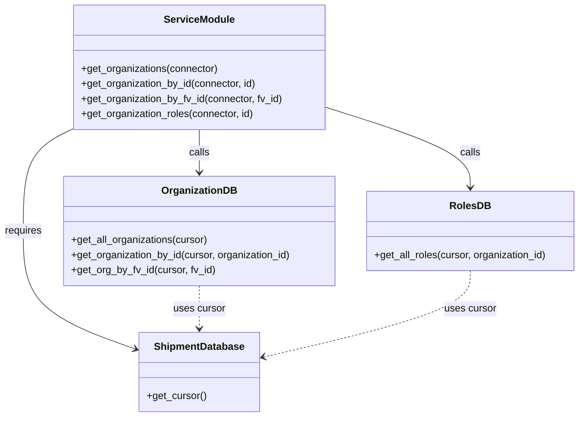

# Diagram: common/iam_service/iam_service/v1/lambdas/organizations/__init__.py

> Auto-generated by Obscura crawlers

## Mermaid

### SVG

<svg id="container" width="924.1796875" xmlns="http://www.w3.org/2000/svg" class="classDiagram" height="662" viewBox="0 0 924.1796875 662" role="graphics-document document" aria-roledescription="class"><g><defs><marker id="container_class-aggregationStart" class="marker aggregation class" refX="18" refY="7" markerWidth="190" markerHeight="240" orient="auto"><path d="M 18,7 L9,13 L1,7 L9,1 Z"></path></marker></defs><defs><marker id="container_class-aggregationEnd" class="marker aggregation class" refX="1" refY="7" markerWidth="20" markerHeight="28" orient="auto"><path d="M 18,7 L9,13 L1,7 L9,1 Z"></path></marker></defs><defs><marker id="container_class-extensionStart" class="marker extension class" refX="18" refY="7" markerWidth="190" markerHeight="240" orient="auto"><path d="M 1,7 L18,13 V 1 Z"></path></marker></defs><defs><marker id="container_class-extensionEnd" class="marker extension class" refX="1" refY="7" markerWidth="20" markerHeight="28" orient="auto"><path d="M 1,1 V 13 L18,7 Z"></path></marker></defs><defs><marker id="container_class-compositionStart" class="marker composition class" refX="18" refY="7" markerWidth="190" markerHeight="240" orient="auto"><path d="M 18,7 L9,13 L1,7 L9,1 Z"></path></marker></defs><defs><marker id="container_class-compositionEnd" class="marker composition class" refX="1" refY="7" markerWidth="20" markerHeight="28" orient="auto"><path d="M 18,7 L9,13 L1,7 L9,1 Z"></path></marker></defs><defs><marker id="container_class-dependencyStart" class="marker dependency class" refX="6" refY="7" markerWidth="190" markerHeight="240" orient="auto"><path d="M 5,7 L9,13 L1,7 L9,1 Z"></path></marker></defs><defs><marker id="container_class-dependencyEnd" class="marker dependency class" refX="13" refY="7" markerWidth="20" markerHeight="28" orient="auto"><path d="M 18,7 L9,13 L14,7 L9,1 Z"></path></marker></defs><defs><marker id="container_class-lollipopStart" class="marker lollipop class" refX="13" refY="7" markerWidth="190" markerHeight="240" orient="auto"><circle stroke="black" fill="transparent" cx="7" cy="7" r="6"></circle></marker></defs><defs><marker id="container_class-lollipopEnd" class="marker lollipop class" refX="1" refY="7" markerWidth="190" markerHeight="240" orient="auto"><circle stroke="black" fill="transparent" cx="7" cy="7" r="6"></circle></marker></defs><g class="root"><g class="clusters"></g><g class="edgePaths"><path d="M319.176,206L319.176,212.167C319.176,218.333,319.176,230.667,319.176,242C319.176,253.333,319.176,263.667,319.176,268.833L319.176,274" id="id_ServiceModule_OrganizationDB_1" class="edge-thickness-normal edge-pattern-solid relation" style=";;;" data-edge="true" data-et="edge" data-id="id_ServiceModule_OrganizationDB_1" data-points="W3sieCI6MzE5LjE3NTc4MTI1LCJ5IjoyMDZ9LHsieCI6MzE5LjE3NTc4MTI1LCJ5IjoyNDN9LHsieCI6MzE5LjE3NTc4MTI1LCJ5IjoyODB9XQ==" marker-end="url(#container_class-dependencyEnd)"></path><path d="M519.234,170.02L557.848,182.183C596.461,194.346,673.688,218.673,712.301,240.003C750.914,261.333,750.914,279.667,750.914,288.833L750.914,298" id="id_ServiceModule_RolesDB_2" class="edge-thickness-normal edge-pattern-solid relation" style=";;;" data-edge="true" data-et="edge" data-id="id_ServiceModule_RolesDB_2" data-points="W3sieCI6NTE5LjIzNDM3NSwieSI6MTcwLjAxOTU4ODMyODQzMjV9LHsieCI6NzUwLjkxNDA2MjUsInkiOjI0M30seyJ4Ijo3NTAuOTE0MDYyNSwieSI6MzA0fV0=" marker-end="url(#container_class-dependencyEnd)"></path><path d="M119.117,203.714L105.573,210.262C92.029,216.809,64.94,229.905,51.396,257.119C37.852,284.333,37.852,325.667,37.852,367C37.852,408.333,37.852,449.667,68.137,481.099C98.423,512.531,158.994,534.062,189.28,544.827L219.565,555.592" id="id_ServiceModule_ShipmentDatabase_3" class="edge-thickness-normal edge-pattern-solid relation" style=";;;" data-edge="true" data-et="edge" data-id="id_ServiceModule_ShipmentDatabase_3" data-points="W3sieCI6MTE5LjExNzE4NzUsInkiOjIwMy43MTM5MjI3MTQ4MzkxNn0seyJ4IjozNy44NTE1NjI1LCJ5IjoyNDN9LHsieCI6MzcuODUxNTYyNSwieSI6MzY3fSx7IngiOjM3Ljg1MTU2MjUsInkiOjQ5MX0seyJ4IjoyMjUuMjE4NzUsInkiOjU1Ny42MDE4Njg5NTEyNDl9XQ==" marker-end="url(#container_class-dependencyEnd)"></path><path d="M319.176,454L319.176,460.167C319.176,466.333,319.176,478.667,319.176,490C319.176,501.333,319.176,511.667,319.176,516.833L319.176,522" id="id_OrganizationDB_ShipmentDatabase_4" class="edge-thickness-normal edge-pattern-dashed relation" style=";;;" data-edge="true" data-et="edge" data-id="id_OrganizationDB_ShipmentDatabase_4" data-points="W3sieCI6MzE5LjE3NTc4MTI1LCJ5Ijo0NTR9LHsieCI6MzE5LjE3NTc4MTI1LCJ5Ijo0OTF9LHsieCI6MzE5LjE3NTc4MTI1LCJ5Ijo1Mjh9XQ==" marker-end="url(#container_class-dependencyEnd)"></path><path d="M750.914,430L750.914,440.167C750.914,450.333,750.914,470.667,695.591,493.647C640.269,516.628,529.623,542.256,474.301,555.07L418.978,567.884" id="id_RolesDB_ShipmentDatabase_5" class="edge-thickness-normal edge-pattern-dashed relation" style=";;;" data-edge="true" data-et="edge" data-id="id_RolesDB_ShipmentDatabase_5" data-points="W3sieCI6NzUwLjkxNDA2MjUsInkiOjQzMH0seyJ4Ijo3NTAuOTE0MDYyNSwieSI6NDkxfSx7IngiOjQxMy4xMzI4MTI1LCJ5Ijo1NjkuMjM3NTAyODI3NDE0Nn1d" marker-end="url(#container_class-dependencyEnd)"></path></g><g class="edgeLabels"><g class="edgeLabel" transform="translate(319.17578125, 243)"><g class="label" data-id="id_ServiceModule_OrganizationDB_1" transform="translate(-16.4453125, -12)"><foreignObject width="32.890625" height="24">

calls

</foreignObject></g></g><g class="edgeLabel" transform="translate(750.9140625, 243)"><g class="label" data-id="id_ServiceModule_RolesDB_2" transform="translate(-16.4453125, -12)"><foreignObject width="32.890625" height="24">

calls

</foreignObject></g></g><g class="edgeLabel" transform="translate(37.8515625, 367)"><g class="label" data-id="id_ServiceModule_ShipmentDatabase_3" transform="translate(-29.8515625, -12)"><foreignObject width="59.703125" height="24">

requires

</foreignObject></g></g><g class="edgeLabel" transform="translate(319.17578125, 491)"><g class="label" data-id="id_OrganizationDB_ShipmentDatabase_4" transform="translate(-41.4765625, -12)"><foreignObject width="82.953125" height="24">

uses cursor

</foreignObject></g></g><g class="edgeLabel" transform="translate(750.9140625, 491)"><g class="label" data-id="id_RolesDB_ShipmentDatabase_5" transform="translate(-41.4765625, -12)"><foreignObject width="82.953125" height="24">

uses cursor

</foreignObject></g></g></g><g class="nodes"><g class="node default" id="classId-ServiceModule-0" transform="translate(319.17578125, 107)"><g class="basic label-container"><path d="M-200.05859375 -99 L200.05859375 -99 L200.05859375 99 L-200.05859375 99" stroke="none" stroke-width="0" fill="#ECECFF" style=""></path><path d="M-200.05859375 -99 C-58.46547178166625 -99, 83.1276501866675 -99, 200.05859375 -99 M-200.05859375 -99 C-46.78248246176577 -99, 106.49362882646847 -99, 200.05859375 -99 M200.05859375 -99 C200.05859375 -52.74872421069504, 200.05859375 -6.497448421390075, 200.05859375 99 M200.05859375 -99 C200.05859375 -23.314748020068166, 200.05859375 52.37050395986367, 200.05859375 99 M200.05859375 99 C44.34711365125281 99, -111.36436644749438 99, -200.05859375 99 M200.05859375 99 C58.95783825467822 99, -82.14291724064356 99, -200.05859375 99 M-200.05859375 99 C-200.05859375 49.05990934813137, -200.05859375 -0.8801813037372597, -200.05859375 -99 M-200.05859375 99 C-200.05859375 32.28055619334825, -200.05859375 -34.43888761330351, -200.05859375 -99" stroke="#9370DB" stroke-width="1.3" fill="none" stroke-dasharray="0 0" style=""></path></g><g class="annotation-group text" transform="translate(0, -75)"></g><g class="label-group text" transform="translate(-53.7421875, -75)"><g class="label" style="font-weight: bolder" transform="translate(0,-12)"><foreignObject width="107.484375" height="24">

ServiceModule

</foreignObject></g></g><g class="members-group text" transform="translate(-188.05859375, -27)"></g><g class="methods-group text" transform="translate(-188.05859375, 3)"><g class="label" style="" transform="translate(0,-12)"><foreignObject width="219.59375" height="24">

+get_organizations(connector)

</foreignObject></g><g class="label" style="" transform="translate(0,12)"><foreignObject width="280.546875" height="24">

+get_organization_by_id(connector, id)

</foreignObject></g><g class="label" style="" transform="translate(0,36)"><foreignObject width="322.375" height="24">

+get_organization_by_fv_id(connector, fv_id)

</foreignObject></g><g class="label" style="" transform="translate(0,60)"><foreignObject width="277.15625" height="24">

+get_organization_roles(connector, id)

</foreignObject></g></g><g class="divider" style=""><path d="M-200.05859375 -51 C-105.78542884737396 -51, -11.512263944747929 -51, 200.05859375 -51 M-200.05859375 -51 C-40.521647160309584 -51, 119.01529942938083 -51, 200.05859375 -51" stroke="#9370DB" stroke-width="1.3" fill="none" stroke-dasharray="0 0" style=""></path></g><g class="divider" style=""><path d="M-200.05859375 -27 C-65.63473674611356 -27, 68.78912025777288 -27, 200.05859375 -27 M-200.05859375 -27 C-55.04207734266157 -27, 89.97443906467686 -27, 200.05859375 -27" stroke="#9370DB" stroke-width="1.3" fill="none" stroke-dasharray="0 0" style=""></path></g></g><g class="node default" id="classId-OrganizationDB-1" transform="translate(319.17578125, 367)"><g class="basic label-container"><path d="M-216.47265625 -87 L216.47265625 -87 L216.47265625 87 L-216.47265625 87" stroke="none" stroke-width="0" fill="#ECECFF" style=""></path><path d="M-216.47265625 -87 C-75.57360072096344 -87, 65.32545480807312 -87, 216.47265625 -87 M-216.47265625 -87 C-99.30567081693407 -87, 17.861314616131864 -87, 216.47265625 -87 M216.47265625 -87 C216.47265625 -22.667866629455418, 216.47265625 41.664266741089165, 216.47265625 87 M216.47265625 -87 C216.47265625 -47.27143299697336, 216.47265625 -7.5428659939467195, 216.47265625 87 M216.47265625 87 C98.60545041001326 87, -19.261755429973476 87, -216.47265625 87 M216.47265625 87 C96.71281530131228 87, -23.04702564737545 87, -216.47265625 87 M-216.47265625 87 C-216.47265625 31.89921724085775, -216.47265625 -23.201565518284497, -216.47265625 -87 M-216.47265625 87 C-216.47265625 25.222603481448722, -216.47265625 -36.554793037102556, -216.47265625 -87" stroke="#9370DB" stroke-width="1.3" fill="none" stroke-dasharray="0 0" style=""></path></g><g class="annotation-group text" transform="translate(0, -63)"></g><g class="label-group text" transform="translate(-56.8359375, -63)"><g class="label" style="font-weight: bolder" transform="translate(0,-12)"><foreignObject width="113.671875" height="24">

OrganizationDB

</foreignObject></g></g><g class="members-group text" transform="translate(-204.47265625, -15)"></g><g class="methods-group text" transform="translate(-204.47265625, 15)"><g class="label" style="" transform="translate(0,-12)"><foreignObject width="218.390625" height="24">

+get_all_organizations(cursor)

</foreignObject></g><g class="label" style="" transform="translate(0,12)"><foreignObject width="352.109375" height="24">

+get_organization_by_id(cursor, organization_id)

</foreignObject></g><g class="label" style="" transform="translate(0,36)"><foreignObject width="228.5625" height="24">

+get_org_by_fv_id(cursor, fv_id)

</foreignObject></g></g><g class="divider" style=""><path d="M-216.47265625 -39 C-52.96999068973349 -39, 110.53267487053301 -39, 216.47265625 -39 M-216.47265625 -39 C-108.00454740571409 -39, 0.46356143857181564 -39, 216.47265625 -39" stroke="#9370DB" stroke-width="1.3" fill="none" stroke-dasharray="0 0" style=""></path></g><g class="divider" style=""><path d="M-216.47265625 -15 C-117.72247163745678 -15, -18.972287024913555 -15, 216.47265625 -15 M-216.47265625 -15 C-118.97477766337057 -15, -21.476899076741148 -15, 216.47265625 -15" stroke="#9370DB" stroke-width="1.3" fill="none" stroke-dasharray="0 0" style=""></path></g></g><g class="node default" id="classId-RolesDB-2" transform="translate(750.9140625, 367)"><g class="basic label-container"><path d="M-165.265625 -63 L165.265625 -63 L165.265625 63 L-165.265625 63" stroke="none" stroke-width="0" fill="#ECECFF" style=""></path><path d="M-165.265625 -63 C-49.76794473400774 -63, 65.72973553198452 -63, 165.265625 -63 M-165.265625 -63 C-42.57213964526984 -63, 80.12134570946031 -63, 165.265625 -63 M165.265625 -63 C165.265625 -37.75559664636414, 165.265625 -12.51119329272828, 165.265625 63 M165.265625 -63 C165.265625 -19.052167717740907, 165.265625 24.895664564518185, 165.265625 63 M165.265625 63 C94.25885628494204 63, 23.252087569884083 63, -165.265625 63 M165.265625 63 C94.20789755883136 63, 23.150170117662725 63, -165.265625 63 M-165.265625 63 C-165.265625 16.165795544816817, -165.265625 -30.668408910366367, -165.265625 -63 M-165.265625 63 C-165.265625 15.67582216212692, -165.265625 -31.64835567574616, -165.265625 -63" stroke="#9370DB" stroke-width="1.3" fill="none" stroke-dasharray="0 0" style=""></path></g><g class="annotation-group text" transform="translate(0, -39)"></g><g class="label-group text" transform="translate(-30.25, -39)"><g class="label" style="font-weight: bolder" transform="translate(0,-12)"><foreignObject width="60.5" height="24">

RolesDB

</foreignObject></g></g><g class="members-group text" transform="translate(-153.265625, 9)"></g><g class="methods-group text" transform="translate(-153.265625, 39)"><g class="label" style="" transform="translate(0,-12)"><foreignObject width="276.28125" height="24">

+get_all_roles(cursor, organization_id)

</foreignObject></g></g><g class="divider" style=""><path d="M-165.265625 -15 C-57.08461995805435 -15, 51.096385083891306 -15, 165.265625 -15 M-165.265625 -15 C-34.066807493579404 -15, 97.13201001284119 -15, 165.265625 -15" stroke="#9370DB" stroke-width="1.3" fill="none" stroke-dasharray="0 0" style=""></path></g><g class="divider" style=""><path d="M-165.265625 9 C-83.71410233361564 9, -2.1625796672312845 9, 165.265625 9 M-165.265625 9 C-53.61721079051813 9, 58.03120341896374 9, 165.265625 9" stroke="#9370DB" stroke-width="1.3" fill="none" stroke-dasharray="0 0" style=""></path></g></g><g class="node default" id="classId-ShipmentDatabase-3" transform="translate(319.17578125, 591)"><g class="basic label-container"><path d="M-93.95703125 -63 L93.95703125 -63 L93.95703125 63 L-93.95703125 63" stroke="none" stroke-width="0" fill="#ECECFF" style=""></path><path d="M-93.95703125 -63 C-26.440819980018034 -63, 41.07539128996393 -63, 93.95703125 -63 M-93.95703125 -63 C-43.53708049020602 -63, 6.882870269587954 -63, 93.95703125 -63 M93.95703125 -63 C93.95703125 -13.573080328435452, 93.95703125 35.853839343129096, 93.95703125 63 M93.95703125 -63 C93.95703125 -36.230781687724885, 93.95703125 -9.46156337544977, 93.95703125 63 M93.95703125 63 C45.79845567540956 63, -2.360119899180873 63, -93.95703125 63 M93.95703125 63 C23.613892294538132 63, -46.729246660923735 63, -93.95703125 63 M-93.95703125 63 C-93.95703125 16.15582343724226, -93.95703125 -30.688353125515476, -93.95703125 -63 M-93.95703125 63 C-93.95703125 23.009675573724174, -93.95703125 -16.980648852551653, -93.95703125 -63" stroke="#9370DB" stroke-width="1.3" fill="none" stroke-dasharray="0 0" style=""></path></g><g class="annotation-group text" transform="translate(0, -39)"></g><g class="label-group text" transform="translate(-69.2734375, -39)"><g class="label" style="font-weight: bolder" transform="translate(0,-12)"><foreignObject width="138.546875" height="24">

ShipmentDatabase

</foreignObject></g></g><g class="members-group text" transform="translate(-81.95703125, 9)"></g><g class="methods-group text" transform="translate(-81.95703125, 39)"><g class="label" style="" transform="translate(0,-12)"><foreignObject width="94.640625" height="24">

+get_cursor()

</foreignObject></g></g><g class="divider" style=""><path d="M-93.95703125 -15 C-49.548755455237526 -15, -5.140479660475052 -15, 93.95703125 -15 M-93.95703125 -15 C-48.39208162623728 -15, -2.8271320024745563 -15, 93.95703125 -15" stroke="#9370DB" stroke-width="1.3" fill="none" stroke-dasharray="0 0" style=""></path></g><g class="divider" style=""><path d="M-93.95703125 9 C-23.455868911722263 9, 47.045293426555475 9, 93.95703125 9 M-93.95703125 9 C-33.011113446358316 9, 27.93480435728337 9, 93.95703125 9" stroke="#9370DB" stroke-width="1.3" fill="none" stroke-dasharray="0 0" style=""></path></g></g></g></g></g></svg>
