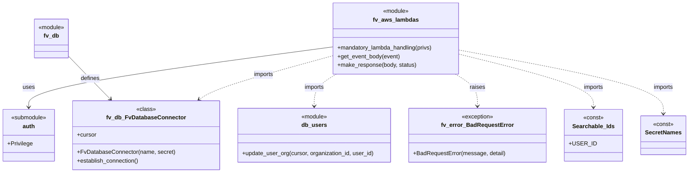

# Diagram: common/iam_service/iam_service/v1/lambdas/organizations/add_organizations_member.py


> Auto-generated by Obscura crawlers

## Diagram 1

```mermaid
flowchart LR
    Start([start]) --> GetBody[/"get_event_body(event)"/]
    GetBody --> CheckJSON{Is JSON dict with\nonly key "user_id"?}
    CheckJSON -- no --> BadRequest1[/"BadRequestError(\"Invalid or missing user id\")"/]
    BadRequest1 --> End1([end])
    CheckJSON -- yes --> UpdateAudit["audit_refs.update({Searchable_Ids.USER_ID: user_id})"]
    UpdateAudit --> GetOrg["organization_id = event.pathParameters.organization_id"]
    GetOrg --> CheckOrg{organization_id present?}
    CheckOrg -- no --> BadRequest2[/"BadRequestError(\"Invalid or missing organization id\")"/]
    BadRequest2 --> End2([end])
    CheckOrg -- yes --> PrepareUser["user = [user_id]"]
    PrepareUser --> DBConnect["DB_CONN.establish_connection()"]
    DBConnect --> Cursor["cursor = DB_CONN.cursor"]
    Cursor --> UpdateDB["db_users.update_user_org(cursor, organization_id, user_id)"]
    UpdateDB --> Response["response = f\"Updated user org for {user_id} to organization_id {organization_id}\""]
    Response --> MakeResp["fv.aws.lambdas.make_response({response}, 200)"]
    MakeResp --> End([end])
```

> SVG rendering failed for this diagram.

## Diagram 2



### SVG

<svg id="container" width="1871.890625" xmlns="http://www.w3.org/2000/svg" class="classDiagram" height="480" viewBox="0 0 1871.890625 480" role="graphics-document document" aria-roledescription="class"><style>#container{font-family:"trebuchet ms",verdana,arial,sans-serif;font-size:16px;fill:#333;}@keyframes edge-animation-frame{from{stroke-dashoffset:0;}}@keyframes dash{to{stroke-dashoffset:0;}}#container .edge-animation-slow{stroke-dasharray:9,5!important;stroke-dashoffset:900;animation:dash 50s linear infinite;stroke-linecap:round;}#container .edge-animation-fast{stroke-dasharray:9,5!important;stroke-dashoffset:900;animation:dash 20s linear infinite;stroke-linecap:round;}#container .error-icon{fill:#552222;}#container .error-text{fill:#552222;stroke:#552222;}#container .edge-thickness-normal{stroke-width:1px;}#container .edge-thickness-thick{stroke-width:3.5px;}#container .edge-pattern-solid{stroke-dasharray:0;}#container .edge-thickness-invisible{stroke-width:0;fill:none;}#container .edge-pattern-dashed{stroke-dasharray:3;}#container .edge-pattern-dotted{stroke-dasharray:2;}#container .marker{fill:#333333;stroke:#333333;}#container .marker.cross{stroke:#333333;}#container svg{font-family:"trebuchet ms",verdana,arial,sans-serif;font-size:16px;}#container p{margin:0;}#container g.classGroup text{fill:#9370DB;stroke:none;font-family:"trebuchet ms",verdana,arial,sans-serif;font-size:10px;}#container g.classGroup text .title{font-weight:bolder;}#container .nodeLabel,#container .edgeLabel{color:#131300;}#container .edgeLabel .label rect{fill:#ECECFF;}#container .label text{fill:#131300;}#container .labelBkg{background:#ECECFF;}#container .edgeLabel .label span{background:#ECECFF;}#container .classTitle{font-weight:bolder;}#container .node rect,#container .node circle,#container .node ellipse,#container .node polygon,#container .node path{fill:#ECECFF;stroke:#9370DB;stroke-width:1px;}#container .divider{stroke:#9370DB;stroke-width:1;}#container g.clickable{cursor:pointer;}#container g.classGroup rect{fill:#ECECFF;stroke:#9370DB;}#container g.classGroup line{stroke:#9370DB;stroke-width:1;}#container .classLabel .box{stroke:none;stroke-width:0;fill:#ECECFF;opacity:0.5;}#container .classLabel .label{fill:#9370DB;font-size:10px;}#container .relation{stroke:#333333;stroke-width:1;fill:none;}#container .dashed-line{stroke-dasharray:3;}#container .dotted-line{stroke-dasharray:1 2;}#container #compositionStart,#container .composition{fill:#333333!important;stroke:#333333!important;stroke-width:1;}#container #compositionEnd,#container .composition{fill:#333333!important;stroke:#333333!important;stroke-width:1;}#container #dependencyStart,#container .dependency{fill:#333333!important;stroke:#333333!important;stroke-width:1;}#container #dependencyStart,#container .dependency{fill:#333333!important;stroke:#333333!important;stroke-width:1;}#container #extensionStart,#container .extension{fill:transparent!important;stroke:#333333!important;stroke-width:1;}#container #extensionEnd,#container .extension{fill:transparent!important;stroke:#333333!important;stroke-width:1;}#container #aggregationStart,#container .aggregation{fill:transparent!important;stroke:#333333!important;stroke-width:1;}#container #aggregationEnd,#container .aggregation{fill:transparent!important;stroke:#333333!important;stroke-width:1;}#container #lollipopStart,#container .lollipop{fill:#ECECFF!important;stroke:#333333!important;stroke-width:1;}#container #lollipopEnd,#container .lollipop{fill:#ECECFF!important;stroke:#333333!important;stroke-width:1;}#container .edgeTerminals{font-size:11px;line-height:initial;}#container .classTitleText{text-anchor:middle;font-size:18px;fill:#333;}#container .label-icon{display:inline-block;height:1em;overflow:visible;vertical-align:-0.125em;}#container .node .label-icon path{fill:currentColor;stroke:revert;stroke-width:revert;}#container :root{--mermaid-font-family:"trebuchet ms",verdana,arial,sans-serif;}</style><g><defs><marker id="container_class-aggregationStart" class="marker aggregation class" refX="18" refY="7" markerWidth="190" markerHeight="240" orient="auto"><path d="M 18,7 L9,13 L1,7 L9,1 Z"></path></marker></defs><defs><marker id="container_class-aggregationEnd" class="marker aggregation class" refX="1" refY="7" markerWidth="20" markerHeight="28" orient="auto"><path d="M 18,7 L9,13 L1,7 L9,1 Z"></path></marker></defs><defs><marker id="container_class-extensionStart" class="marker extension class" refX="18" refY="7" markerWidth="190" markerHeight="240" orient="auto"><path d="M 1,7 L18,13 V 1 Z"></path></marker></defs><defs><marker id="container_class-extensionEnd" class="marker extension class" refX="1" refY="7" markerWidth="20" markerHeight="28" orient="auto"><path d="M 1,1 V 13 L18,7 Z"></path></marker></defs><defs><marker id="container_class-compositionStart" class="marker composition class" refX="18" refY="7" markerWidth="190" markerHeight="240" orient="auto"><path d="M 18,7 L9,13 L1,7 L9,1 Z"></path></marker></defs><defs><marker id="container_class-compositionEnd" class="marker composition class" refX="1" refY="7" markerWidth="20" markerHeight="28" orient="auto"><path d="M 18,7 L9,13 L1,7 L9,1 Z"></path></marker></defs><defs><marker id="container_class-dependencyStart" class="marker dependency class" refX="6" refY="7" markerWidth="190" markerHeight="240" orient="auto"><path d="M 5,7 L9,13 L1,7 L9,1 Z"></path></marker></defs><defs><marker id="container_class-dependencyEnd" class="marker dependency class" refX="13" refY="7" markerWidth="20" markerHeight="28" orient="auto"><path d="M 18,7 L9,13 L14,7 L9,1 Z"></path></marker></defs><defs><marker id="container_class-lollipopStart" class="marker lollipop class" refX="13" refY="7" markerWidth="190" markerHeight="240" orient="auto"><circle stroke="black" fill="transparent" cx="7" cy="7" r="6"></circle></marker></defs><defs><marker id="container_class-lollipopEnd" class="marker lollipop class" refX="1" refY="7" markerWidth="190" markerHeight="240" orient="auto"><circle stroke="black" fill="transparent" cx="7" cy="7" r="6"></circle></marker></defs><g class="root"><g class="clusters"></g><g class="edgePaths"><path d="M908.861,130.795L770.71,149.496C632.559,168.196,356.256,205.598,218.104,233.466C79.953,261.333,79.953,279.667,79.953,288.833L79.953,298" id="id_fv_aws_lambdas_auth_1" class="edge-thickness-normal edge-pattern-solid relation" style=";;;" data-edge="true" data-et="edge" data-id="id_fv_aws_lambdas_auth_1" data-points="W3sieCI6OTA4Ljg2MTMyODEyNSwieSI6MTMwLjc5NDY2NjAyOTAzMTgyfSx7IngiOjc5Ljk1MzEyNSwieSI6MjQzfSx7IngiOjc5Ljk1MzEyNSwieSI6MzA0fV0=" marker-end="url(#container_class-dependencyEnd)"></path><path d="M191.578,158.548L204.849,172.623C218.12,186.699,244.661,214.849,263.184,234.371C281.706,253.894,292.208,264.787,297.459,270.234L302.711,275.681" id="id_fv_db_fv_db_FvDatabaseConnector_2" class="edge-thickness-normal edge-pattern-solid relation" style=";;;" data-edge="true" data-et="edge" data-id="id_fv_db_fv_db_FvDatabaseConnector_2" data-points="W3sieCI6MTkxLjU3ODEyNSwieSI6MTU4LjU0NzkxOTMzMjIzNjYzfSx7IngiOjI3MS4yMDMxMjUsInkiOjI0M30seyJ4IjozMDYuODc1MTc2MjIxODA0NSwieSI6MjgwfV0=" marker-end="url(#container_class-dependencyEnd)"></path><path d="M908.861,155.475L855.964,170.063C803.067,184.65,697.273,213.825,636.293,234.01C575.314,254.195,559.149,265.389,551.066,270.987L542.984,276.584" id="id_fv_aws_lambdas_fv_db_FvDatabaseConnector_3" class="edge-thickness-normal edge-pattern-dashed relation" style=";;;" data-edge="true" data-et="edge" data-id="id_fv_aws_lambdas_fv_db_FvDatabaseConnector_3" data-points="W3sieCI6OTA4Ljg2MTMyODEyNSwieSI6MTU1LjQ3NTI0NzUyNDc1MjV9LHsieCI6NTkxLjQ3ODUxNTYyNSwieSI6MjQzfSx7IngiOjUzOC4wNTEzOTgwMjYzMTU4LCJ5IjoyODB9XQ==" marker-end="url(#container_class-dependencyEnd)"></path><path d="M921.136,206L910.951,212.167C900.766,218.333,880.397,230.667,870.212,245.5C860.027,260.333,860.027,277.667,860.027,286.333L860.027,295" id="id_fv_aws_lambdas_db_users_4" class="edge-thickness-normal edge-pattern-dashed relation" style=";;;" data-edge="true" data-et="edge" data-id="id_fv_aws_lambdas_db_users_4" data-points="W3sieCI6OTIxLjEzNTkwMDE2MDg0NTYsInkiOjIwNn0seyJ4Ijo4NjAuMDI3MzQzNzUsInkiOjI0M30seyJ4Ijo4NjAuMDI3MzQzNzUsInkiOjMwMX1d" marker-end="url(#container_class-dependencyEnd)"></path><path d="M1248.149,206L1258.334,212.167C1268.519,218.333,1288.888,230.667,1299.073,245.5C1309.258,260.333,1309.258,277.667,1309.258,286.333L1309.258,295" id="id_fv_aws_lambdas_fv_error_BadRequestError_5" class="edge-thickness-normal edge-pattern-dashed relation" style=";;;" data-edge="true" data-et="edge" data-id="id_fv_aws_lambdas_fv_error_BadRequestError_5" data-points="W3sieCI6MTI0OC4xNDkyNTYwODkxNTQ1LCJ5IjoyMDZ9LHsieCI6MTMwOS4yNTc4MTI1LCJ5IjoyNDN9LHsieCI6MTMwOS4yNTc4MTI1LCJ5IjozMDF9XQ==" marker-end="url(#container_class-dependencyEnd)"></path><path d="M1260.424,151.686L1320.29,166.905C1380.156,182.124,1499.889,212.562,1559.755,236.948C1619.621,261.333,1619.621,279.667,1619.621,288.833L1619.621,298" id="id_fv_aws_lambdas_Searchable_Ids_6" class="edge-thickness-normal edge-pattern-dashed relation" style=";;;" data-edge="true" data-et="edge" data-id="id_fv_aws_lambdas_Searchable_Ids_6" data-points="W3sieCI6MTI2MC40MjM4MjgxMjUsInkiOjE1MS42ODYzNzM5NDE3MTA1N30seyJ4IjoxNjE5LjYyMTA5Mzc1LCJ5IjoyNDN9LHsieCI6MTYxOS42MjEwOTM3NSwieSI6MzA0fV0=" marker-end="url(#container_class-dependencyEnd)"></path><path d="M1260.424,140.239L1350.996,157.366C1441.569,174.493,1622.714,208.746,1713.287,238.04C1803.859,267.333,1803.859,291.667,1803.859,303.833L1803.859,316" id="id_fv_aws_lambdas_SecretNames_7" class="edge-thickness-normal edge-pattern-dashed relation" style=";;;" data-edge="true" data-et="edge" data-id="id_fv_aws_lambdas_SecretNames_7" data-points="W3sieCI6MTI2MC40MjM4MjgxMjUsInkiOjE0MC4yMzkyODIwOTY2ODE4fSx7IngiOjE4MDMuODU5Mzc1LCJ5IjoyNDN9LHsieCI6MTgwMy44NTkzNzUsInkiOjMyMn1d" marker-end="url(#container_class-dependencyEnd)"></path></g><g class="edgeLabels"><g class="edgeLabel" transform="translate(79.953125, 243)"><g class="label" data-id="id_fv_aws_lambdas_auth_1" transform="translate(-16.4921875, -12)"><foreignObject width="32.984375" height="24"><div xmlns="http://www.w3.org/1999/xhtml" class="labelBkg" style="display: table-cell; white-space: nowrap; line-height: 1.5; max-width: 200px; text-align: center;"><span class="edgeLabel"><p>uses</p></span></div></foreignObject></g></g><g class="edgeLabel" transform="translate(249.01946, 219.4715)"><g class="label" data-id="id_fv_db_fv_db_FvDatabaseConnector_2" transform="translate(-26.53125, -12)"><foreignObject width="53.0625" height="24"><div xmlns="http://www.w3.org/1999/xhtml" class="labelBkg" style="display: table-cell; white-space: nowrap; line-height: 1.5; max-width: 200px; text-align: center;"><span class="edgeLabel"><p>defines</p></span></div></foreignObject></g></g><g class="edgeLabel" transform="translate(718.84515, 207.87607)"><g class="label" data-id="id_fv_aws_lambdas_fv_db_FvDatabaseConnector_3" transform="translate(-28.25, -12)"><foreignObject width="56.5" height="24"><div xmlns="http://www.w3.org/1999/xhtml" class="labelBkg" style="display: table-cell; white-space: nowrap; line-height: 1.5; max-width: 200px; text-align: center;"><span class="edgeLabel"><p>imports</p></span></div></foreignObject></g></g><g class="edgeLabel" transform="translate(860.02734375, 243)"><g class="label" data-id="id_fv_aws_lambdas_db_users_4" transform="translate(-28.25, -12)"><foreignObject width="56.5" height="24"><div xmlns="http://www.w3.org/1999/xhtml" class="labelBkg" style="display: table-cell; white-space: nowrap; line-height: 1.5; max-width: 200px; text-align: center;"><span class="edgeLabel"><p>imports</p></span></div></foreignObject></g></g><g class="edgeLabel" transform="translate(1309.2578125, 243)"><g class="label" data-id="id_fv_aws_lambdas_fv_error_BadRequestError_5" transform="translate(-21.25, -12)"><foreignObject width="42.5" height="24"><div xmlns="http://www.w3.org/1999/xhtml" class="labelBkg" style="display: table-cell; white-space: nowrap; line-height: 1.5; max-width: 200px; text-align: center;"><span class="edgeLabel"><p>raises</p></span></div></foreignObject></g></g><g class="edgeLabel" transform="translate(1619.62109375, 243)"><g class="label" data-id="id_fv_aws_lambdas_Searchable_Ids_6" transform="translate(-28.25, -12)"><foreignObject width="56.5" height="24"><div xmlns="http://www.w3.org/1999/xhtml" class="labelBkg" style="display: table-cell; white-space: nowrap; line-height: 1.5; max-width: 200px; text-align: center;"><span class="edgeLabel"><p>imports</p></span></div></foreignObject></g></g><g class="edgeLabel" transform="translate(1803.859375, 243)"><g class="label" data-id="id_fv_aws_lambdas_SecretNames_7" transform="translate(-28.25, -12)"><foreignObject width="56.5" height="24"><div xmlns="http://www.w3.org/1999/xhtml" class="labelBkg" style="display: table-cell; white-space: nowrap; line-height: 1.5; max-width: 200px; text-align: center;"><span class="edgeLabel"><p>imports</p></span></div></foreignObject></g></g></g><g class="nodes"><g class="node default" id="classId-fv_aws_lambdas-0" transform="translate(1084.642578125, 107)"><g class="basic label-container"><path d="M-175.78125 -99 L175.78125 -99 L175.78125 99 L-175.78125 99" stroke="none" stroke-width="0" fill="#ECECFF" style=""></path><path d="M-175.78125 -99 C-103.25845034089303 -99, -30.73565068178607 -99, 175.78125 -99 M-175.78125 -99 C-53.05756268372626 -99, 69.66612463254748 -99, 175.78125 -99 M175.78125 -99 C175.78125 -31.447815291677443, 175.78125 36.10436941664511, 175.78125 99 M175.78125 -99 C175.78125 -23.382025784525155, 175.78125 52.23594843094969, 175.78125 99 M175.78125 99 C38.064531550777815 99, -99.65218689844437 99, -175.78125 99 M175.78125 99 C76.64711040585837 99, -22.48702918828326 99, -175.78125 99 M-175.78125 99 C-175.78125 44.56179099312688, -175.78125 -9.876418013746246, -175.78125 -99 M-175.78125 99 C-175.78125 41.32533099455454, -175.78125 -16.349338010890918, -175.78125 -99" stroke="#9370DB" stroke-width="1.3" fill="none" stroke-dasharray="0 0" style=""></path></g><g class="annotation-group text" transform="translate(-36.6015625, -75)"><g class="label" style="" transform="translate(0,-12)"><foreignObject width="73.203125" height="24"><div xmlns="http://www.w3.org/1999/xhtml" style="display: table-cell; white-space: nowrap; line-height: 1.5; max-width: 123px; text-align: center;"><span class="nodeLabel markdown-node-label" style=""><p>«module»</p></span></div></foreignObject></g></g><g class="label-group text" transform="translate(-60.0625, -51)"><g class="label" style="font-weight: bolder" transform="translate(0,-12)"><foreignObject width="120.125" height="24"><div xmlns="http://www.w3.org/1999/xhtml" style="display: table-cell; white-space: nowrap; line-height: 1.5; max-width: 168px; text-align: center;"><span class="nodeLabel markdown-node-label" style=""><p>fv_aws_lambdas</p></span></div></foreignObject></g></g><g class="members-group text" transform="translate(-163.78125, -3)"></g><g class="methods-group text" transform="translate(-163.78125, 27)"><g class="label" style="" transform="translate(0,-12)"><foreignObject width="267.5" height="24"><div xmlns="http://www.w3.org/1999/xhtml" style="display: table-cell; white-space: nowrap; line-height: 1.5; max-width: 325px; text-align: center;"><span class="nodeLabel markdown-node-label" style=""><p>+mandatory_lambda_handling(privs)</p></span></div></foreignObject></g><g class="label" style="" transform="translate(0,12)"><foreignObject width="174.203125" height="24"><div xmlns="http://www.w3.org/1999/xhtml" style="display: table-cell; white-space: nowrap; line-height: 1.5; max-width: 232px; text-align: center;"><span class="nodeLabel markdown-node-label" style=""><p>+get_event_body(event)</p></span></div></foreignObject></g><g class="label" style="" transform="translate(0,36)"><foreignObject width="219.96875" height="24"><div xmlns="http://www.w3.org/1999/xhtml" style="display: table-cell; white-space: nowrap; line-height: 1.5; max-width: 277px; text-align: center;"><span class="nodeLabel markdown-node-label" style=""><p>+make_response(body, status)</p></span></div></foreignObject></g></g><g class="divider" style=""><path d="M-175.78125 -27 C-51.41601848040435 -27, 72.9492130391913 -27, 175.78125 -27 M-175.78125 -27 C-104.77970095562004 -27, -33.77815191124009 -27, 175.78125 -27" stroke="#9370DB" stroke-width="1.3" fill="none" stroke-dasharray="0 0" style=""></path></g><g class="divider" style=""><path d="M-175.78125 -3 C-83.60003170863949 -3, 8.581186582721017 -3, 175.78125 -3 M-175.78125 -3 C-37.876160684075984 -3, 100.02892863184803 -3, 175.78125 -3" stroke="#9370DB" stroke-width="1.3" fill="none" stroke-dasharray="0 0" style=""></path></g></g><g class="node default" id="classId-auth-1" transform="translate(79.953125, 376)"><g class="basic label-container"><path d="M-71.953125 -72 L71.953125 -72 L71.953125 72 L-71.953125 72" stroke="none" stroke-width="0" fill="#ECECFF" style=""></path><path d="M-71.953125 -72 C-27.645671409675963 -72, 16.661782180648075 -72, 71.953125 -72 M-71.953125 -72 C-26.875859924877027 -72, 18.201405150245947 -72, 71.953125 -72 M71.953125 -72 C71.953125 -21.260680030282415, 71.953125 29.47863993943517, 71.953125 72 M71.953125 -72 C71.953125 -29.045268022164322, 71.953125 13.909463955671356, 71.953125 72 M71.953125 72 C32.238059709511 72, -7.477005580978002 72, -71.953125 72 M71.953125 72 C27.14401646300623 72, -17.665092073987537 72, -71.953125 72 M-71.953125 72 C-71.953125 36.64519214701111, -71.953125 1.2903842940222177, -71.953125 -72 M-71.953125 72 C-71.953125 26.493634431324928, -71.953125 -19.012731137350144, -71.953125 -72" stroke="#9370DB" stroke-width="1.3" fill="none" stroke-dasharray="0 0" style=""></path></g><g class="annotation-group text" transform="translate(-49.75, -48)"><g class="label" style="" transform="translate(0,-12)"><foreignObject width="99.5" height="24"><div xmlns="http://www.w3.org/1999/xhtml" style="display: table-cell; white-space: nowrap; line-height: 1.5; max-width: 150px; text-align: center;"><span class="nodeLabel markdown-node-label" style=""><p>«submodule»</p></span></div></foreignObject></g></g><g class="label-group text" transform="translate(-16.6640625, -24)"><g class="label" style="font-weight: bolder" transform="translate(0,-12)"><foreignObject width="33.328125" height="24"><div xmlns="http://www.w3.org/1999/xhtml" style="display: table-cell; white-space: nowrap; line-height: 1.5; max-width: 83px; text-align: center;"><span class="nodeLabel markdown-node-label" style=""><p>auth</p></span></div></foreignObject></g></g><g class="members-group text" transform="translate(-59.953125, 24)"><g class="label" style="" transform="translate(0,-12)"><foreignObject width="70.15625" height="24"><div xmlns="http://www.w3.org/1999/xhtml" style="display: table-cell; white-space: nowrap; line-height: 1.5; max-width: 128px; text-align: center;"><span class="nodeLabel markdown-node-label" style=""><p>+Privilege</p></span></div></foreignObject></g></g><g class="methods-group text" transform="translate(-59.953125, 72)"></g><g class="divider" style=""><path d="M-71.953125 0 C-31.637611127303572 0, 8.677902745392856 0, 71.953125 0 M-71.953125 0 C-17.92948769853843 0, 36.09414960292314 0, 71.953125 0" stroke="#9370DB" stroke-width="1.3" fill="none" stroke-dasharray="0 0" style=""></path></g><g class="divider" style=""><path d="M-71.953125 48 C-35.13566319202866 48, 1.6817986159426823 48, 71.953125 48 M-71.953125 48 C-39.12252103126935 48, -6.291917062538701 48, 71.953125 48" stroke="#9370DB" stroke-width="1.3" fill="none" stroke-dasharray="0 0" style=""></path></g></g><g class="node default" id="classId-fv_db_FvDatabaseConnector-2" transform="translate(399.4296875, 376)"><g class="basic label-container"><path d="M-197.5234375 -96 L197.5234375 -96 L197.5234375 96 L-197.5234375 96" stroke="none" stroke-width="0" fill="#ECECFF" style=""></path><path d="M-197.5234375 -96 C-84.10117000056015 -96, 29.32109749887971 -96, 197.5234375 -96 M-197.5234375 -96 C-51.563629959279666 -96, 94.39617758144067 -96, 197.5234375 -96 M197.5234375 -96 C197.5234375 -23.484579958401483, 197.5234375 49.030840083197035, 197.5234375 96 M197.5234375 -96 C197.5234375 -40.29800050289489, 197.5234375 15.403998994210227, 197.5234375 96 M197.5234375 96 C74.60432520958486 96, -48.314787080830286 96, -197.5234375 96 M197.5234375 96 C39.58721256692289 96, -118.34901236615423 96, -197.5234375 96 M-197.5234375 96 C-197.5234375 43.65033568706757, -197.5234375 -8.699328625864865, -197.5234375 -96 M-197.5234375 96 C-197.5234375 28.201279495543076, -197.5234375 -39.59744100891385, -197.5234375 -96" stroke="#9370DB" stroke-width="1.3" fill="none" stroke-dasharray="0 0" style=""></path></g><g class="annotation-group text" transform="translate(-26.765625, -72)"><g class="label" style="" transform="translate(0,-12)"><foreignObject width="53.53125" height="24"><div xmlns="http://www.w3.org/1999/xhtml" style="display: table-cell; white-space: nowrap; line-height: 1.5; max-width: 104px; text-align: center;"><span class="nodeLabel markdown-node-label" style=""><p>«class»</p></span></div></foreignObject></g></g><g class="label-group text" transform="translate(-103.59375, -48)"><g class="label" style="font-weight: bolder" transform="translate(0,-12)"><foreignObject width="207.1875" height="24"><div xmlns="http://www.w3.org/1999/xhtml" style="display: table-cell; white-space: nowrap; line-height: 1.5; max-width: 255px; text-align: center;"><span class="nodeLabel markdown-node-label" style=""><p>fv_db_FvDatabaseConnector</p></span></div></foreignObject></g></g><g class="members-group text" transform="translate(-185.5234375, 0)"><g class="label" style="" transform="translate(0,-12)"><foreignObject width="53.71875" height="24"><div xmlns="http://www.w3.org/1999/xhtml" style="display: table-cell; white-space: nowrap; line-height: 1.5; max-width: 112px; text-align: center;"><span class="nodeLabel markdown-node-label" style=""><p>+cursor</p></span></div></foreignObject></g></g><g class="methods-group text" transform="translate(-185.5234375, 48)"><g class="label" style="" transform="translate(0,-12)"><foreignObject width="267.453125" height="24"><div xmlns="http://www.w3.org/1999/xhtml" style="display: table-cell; white-space: nowrap; line-height: 1.5; max-width: 325px; text-align: center;"><span class="nodeLabel markdown-node-label" style=""><p>+FvDatabaseConnector(name, secret)</p></span></div></foreignObject></g><g class="label" style="" transform="translate(0,12)"><foreignObject width="173.265625" height="24"><div xmlns="http://www.w3.org/1999/xhtml" style="display: table-cell; white-space: nowrap; line-height: 1.5; max-width: 231px; text-align: center;"><span class="nodeLabel markdown-node-label" style=""><p>+establish_connection()</p></span></div></foreignObject></g></g><g class="divider" style=""><path d="M-197.5234375 -24 C-67.55308556536028 -24, 62.417266369279446 -24, 197.5234375 -24 M-197.5234375 -24 C-47.685085554907715 -24, 102.15326639018457 -24, 197.5234375 -24" stroke="#9370DB" stroke-width="1.3" fill="none" stroke-dasharray="0 0" style=""></path></g><g class="divider" style=""><path d="M-197.5234375 24 C-89.14165821322378 24, 19.240121073552444 24, 197.5234375 24 M-197.5234375 24 C-116.16179930613765 24, -34.800161112275305 24, 197.5234375 24" stroke="#9370DB" stroke-width="1.3" fill="none" stroke-dasharray="0 0" style=""></path></g></g><g class="node default" id="classId-fv_db-3" transform="translate(142.9765625, 107)"><g class="basic label-container"><path d="M-48.6015625 -54 L48.6015625 -54 L48.6015625 54 L-48.6015625 54" stroke="none" stroke-width="0" fill="#ECECFF" style=""></path><path d="M-48.6015625 -54 C-13.96724986415316 -54, 20.66706277169368 -54, 48.6015625 -54 M-48.6015625 -54 C-12.056134467394386 -54, 24.489293565211227 -54, 48.6015625 -54 M48.6015625 -54 C48.6015625 -27.65226376431274, 48.6015625 -1.3045275286254778, 48.6015625 54 M48.6015625 -54 C48.6015625 -27.342150455298672, 48.6015625 -0.6843009105973437, 48.6015625 54 M48.6015625 54 C22.243381095358334 54, -4.114800309283332 54, -48.6015625 54 M48.6015625 54 C29.065957976573028 54, 9.530353453146056 54, -48.6015625 54 M-48.6015625 54 C-48.6015625 29.77093809084409, -48.6015625 5.541876181688181, -48.6015625 -54 M-48.6015625 54 C-48.6015625 19.672752879287657, -48.6015625 -14.654494241424686, -48.6015625 -54" stroke="#9370DB" stroke-width="1.3" fill="none" stroke-dasharray="0 0" style=""></path></g><g class="annotation-group text" transform="translate(-36.6015625, -30)"><g class="label" style="" transform="translate(0,-12)"><foreignObject width="73.203125" height="24"><div xmlns="http://www.w3.org/1999/xhtml" style="display: table-cell; white-space: nowrap; line-height: 1.5; max-width: 123px; text-align: center;"><span class="nodeLabel markdown-node-label" style=""><p>«module»</p></span></div></foreignObject></g></g><g class="label-group text" transform="translate(-20.2890625, -6)"><g class="label" style="font-weight: bolder" transform="translate(0,-12)"><foreignObject width="40.578125" height="24"><div xmlns="http://www.w3.org/1999/xhtml" style="display: table-cell; white-space: nowrap; line-height: 1.5; max-width: 90px; text-align: center;"><span class="nodeLabel markdown-node-label" style=""><p>fv_db</p></span></div></foreignObject></g></g><g class="members-group text" transform="translate(-36.6015625, 42)"></g><g class="methods-group text" transform="translate(-36.6015625, 72)"></g><g class="divider" style=""><path d="M-48.6015625 18 C-17.114433369399187 18, 14.372695761201626 18, 48.6015625 18 M-48.6015625 18 C-23.020170674974757 18, 2.5612211500504856 18, 48.6015625 18" stroke="#9370DB" stroke-width="1.3" fill="none" stroke-dasharray="0 0" style=""></path></g><g class="divider" style=""><path d="M-48.6015625 36 C-9.82997637895295 36, 28.9416097420941 36, 48.6015625 36 M-48.6015625 36 C-28.347796628746977 36, -8.094030757493954 36, 48.6015625 36" stroke="#9370DB" stroke-width="1.3" fill="none" stroke-dasharray="0 0" style=""></path></g></g><g class="node default" id="classId-db_users-4" transform="translate(860.02734375, 376)"><g class="basic label-container"><path d="M-213.07421875 -75 L213.07421875 -75 L213.07421875 75 L-213.07421875 75" stroke="none" stroke-width="0" fill="#ECECFF" style=""></path><path d="M-213.07421875 -75 C-126.74121157826383 -75, -40.40820440652766 -75, 213.07421875 -75 M-213.07421875 -75 C-119.98873951635242 -75, -26.90326028270485 -75, 213.07421875 -75 M213.07421875 -75 C213.07421875 -20.0847531301467, 213.07421875 34.8304937397066, 213.07421875 75 M213.07421875 -75 C213.07421875 -17.667021701404416, 213.07421875 39.66595659719117, 213.07421875 75 M213.07421875 75 C125.5341663370907 75, 37.99411392418139 75, -213.07421875 75 M213.07421875 75 C126.76016924067082 75, 40.44611973134164 75, -213.07421875 75 M-213.07421875 75 C-213.07421875 16.32219077033333, -213.07421875 -42.35561845933334, -213.07421875 -75 M-213.07421875 75 C-213.07421875 44.986321592209734, -213.07421875 14.972643184419468, -213.07421875 -75" stroke="#9370DB" stroke-width="1.3" fill="none" stroke-dasharray="0 0" style=""></path></g><g class="annotation-group text" transform="translate(-36.6015625, -51)"><g class="label" style="" transform="translate(0,-12)"><foreignObject width="73.203125" height="24"><div xmlns="http://www.w3.org/1999/xhtml" style="display: table-cell; white-space: nowrap; line-height: 1.5; max-width: 123px; text-align: center;"><span class="nodeLabel markdown-node-label" style=""><p>«module»</p></span></div></foreignObject></g></g><g class="label-group text" transform="translate(-33.25, -27)"><g class="label" style="font-weight: bolder" transform="translate(0,-12)"><foreignObject width="66.5" height="24"><div xmlns="http://www.w3.org/1999/xhtml" style="display: table-cell; white-space: nowrap; line-height: 1.5; max-width: 116px; text-align: center;"><span class="nodeLabel markdown-node-label" style=""><p>db_users</p></span></div></foreignObject></g></g><g class="members-group text" transform="translate(-201.07421875, 21)"></g><g class="methods-group text" transform="translate(-201.07421875, 51)"><g class="label" style="" transform="translate(0,-12)"><foreignObject width="365.546875" height="24"><div xmlns="http://www.w3.org/1999/xhtml" style="display: table-cell; white-space: nowrap; line-height: 1.5; max-width: 423px; text-align: center;"><span class="nodeLabel markdown-node-label" style=""><p>+update_user_org(cursor, organization_id, user_id)</p></span></div></foreignObject></g></g><g class="divider" style=""><path d="M-213.07421875 -3 C-125.98271124084513 -3, -38.89120373169027 -3, 213.07421875 -3 M-213.07421875 -3 C-112.50479337307645 -3, -11.935367996152905 -3, 213.07421875 -3" stroke="#9370DB" stroke-width="1.3" fill="none" stroke-dasharray="0 0" style=""></path></g><g class="divider" style=""><path d="M-213.07421875 21 C-94.00778662868422 21, 25.05864549263157 21, 213.07421875 21 M-213.07421875 21 C-126.28468117325886 21, -39.49514359651772 21, 213.07421875 21" stroke="#9370DB" stroke-width="1.3" fill="none" stroke-dasharray="0 0" style=""></path></g></g><g class="node default" id="classId-fv_error_BadRequestError-5" transform="translate(1309.2578125, 376)"><g class="basic label-container"><path d="M-186.15625 -75 L186.15625 -75 L186.15625 75 L-186.15625 75" stroke="none" stroke-width="0" fill="#ECECFF" style=""></path><path d="M-186.15625 -75 C-108.51558700050215 -75, -30.874924001004302 -75, 186.15625 -75 M-186.15625 -75 C-107.55616214466295 -75, -28.956074289325898 -75, 186.15625 -75 M186.15625 -75 C186.15625 -18.76632012280843, 186.15625 37.46735975438314, 186.15625 75 M186.15625 -75 C186.15625 -34.69640706723212, 186.15625 5.6071858655357545, 186.15625 75 M186.15625 75 C91.93885576972187 75, -2.2785384605562626 75, -186.15625 75 M186.15625 75 C66.58228018019989 75, -52.991689639600224 75, -186.15625 75 M-186.15625 75 C-186.15625 24.780129625585083, -186.15625 -25.439740748829834, -186.15625 -75 M-186.15625 75 C-186.15625 17.12770636099171, -186.15625 -40.74458727801658, -186.15625 -75" stroke="#9370DB" stroke-width="1.3" fill="none" stroke-dasharray="0 0" style=""></path></g><g class="annotation-group text" transform="translate(-44.3515625, -51)"><g class="label" style="" transform="translate(0,-12)"><foreignObject width="88.703125" height="24"><div xmlns="http://www.w3.org/1999/xhtml" style="display: table-cell; white-space: nowrap; line-height: 1.5; max-width: 139px; text-align: center;"><span class="nodeLabel markdown-node-label" style=""><p>«exception»</p></span></div></foreignObject></g></g><g class="label-group text" transform="translate(-94.984375, -27)"><g class="label" style="font-weight: bolder" transform="translate(0,-12)"><foreignObject width="189.96875" height="24"><div xmlns="http://www.w3.org/1999/xhtml" style="display: table-cell; white-space: nowrap; line-height: 1.5; max-width: 238px; text-align: center;"><span class="nodeLabel markdown-node-label" style=""><p>fv_error_BadRequestError</p></span></div></foreignObject></g></g><g class="members-group text" transform="translate(-174.15625, 21)"></g><g class="methods-group text" transform="translate(-174.15625, 51)"><g class="label" style="" transform="translate(0,-12)"><foreignObject width="253.328125" height="24"><div xmlns="http://www.w3.org/1999/xhtml" style="display: table-cell; white-space: nowrap; line-height: 1.5; max-width: 311px; text-align: center;"><span class="nodeLabel markdown-node-label" style=""><p>+BadRequestError(message, detail)</p></span></div></foreignObject></g></g><g class="divider" style=""><path d="M-186.15625 -3 C-95.58763216646902 -3, -5.019014332938042 -3, 186.15625 -3 M-186.15625 -3 C-79.86187127083598 -3, 26.432507458328047 -3, 186.15625 -3" stroke="#9370DB" stroke-width="1.3" fill="none" stroke-dasharray="0 0" style=""></path></g><g class="divider" style=""><path d="M-186.15625 21 C-55.68095031209313 21, 74.79434937581374 21, 186.15625 21 M-186.15625 21 C-97.72043477689665 21, -9.284619553793306 21, 186.15625 21" stroke="#9370DB" stroke-width="1.3" fill="none" stroke-dasharray="0 0" style=""></path></g></g><g class="node default" id="classId-Searchable_Ids-6" transform="translate(1619.62109375, 376)"><g class="basic label-container"><path d="M-74.20703125 -72 L74.20703125 -72 L74.20703125 72 L-74.20703125 72" stroke="none" stroke-width="0" fill="#ECECFF" style=""></path><path d="M-74.20703125 -72 C-25.771132171336376 -72, 22.664766907327248 -72, 74.20703125 -72 M-74.20703125 -72 C-15.565253392051254 -72, 43.07652446589749 -72, 74.20703125 -72 M74.20703125 -72 C74.20703125 -25.20233065413889, 74.20703125 21.59533869172222, 74.20703125 72 M74.20703125 -72 C74.20703125 -40.07860739830326, 74.20703125 -8.157214796606517, 74.20703125 72 M74.20703125 72 C27.727120011226276 72, -18.752791227547448 72, -74.20703125 72 M74.20703125 72 C34.680049700618376 72, -4.846931848763248 72, -74.20703125 72 M-74.20703125 72 C-74.20703125 40.37076831270283, -74.20703125 8.741536625405658, -74.20703125 -72 M-74.20703125 72 C-74.20703125 19.365444728846583, -74.20703125 -33.269110542306834, -74.20703125 -72" stroke="#9370DB" stroke-width="1.3" fill="none" stroke-dasharray="0 0" style=""></path></g><g class="annotation-group text" transform="translate(-28.6171875, -48)"><g class="label" style="" transform="translate(0,-12)"><foreignObject width="57.234375" height="24"><div xmlns="http://www.w3.org/1999/xhtml" style="display: table-cell; white-space: nowrap; line-height: 1.5; max-width: 107px; text-align: center;"><span class="nodeLabel markdown-node-label" style=""><p>«const»</p></span></div></foreignObject></g></g><g class="label-group text" transform="translate(-55.6328125, -24)"><g class="label" style="font-weight: bolder" transform="translate(0,-12)"><foreignObject width="111.265625" height="24"><div xmlns="http://www.w3.org/1999/xhtml" style="display: table-cell; white-space: nowrap; line-height: 1.5; max-width: 160px; text-align: center;"><span class="nodeLabel markdown-node-label" style=""><p>Searchable_Ids</p></span></div></foreignObject></g></g><g class="members-group text" transform="translate(-62.20703125, 24)"><g class="label" style="" transform="translate(0,-12)"><foreignObject width="68.78125" height="24"><div xmlns="http://www.w3.org/1999/xhtml" style="display: table-cell; white-space: nowrap; line-height: 1.5; max-width: 126px; text-align: center;"><span class="nodeLabel markdown-node-label" style=""><p>+USER_ID</p></span></div></foreignObject></g></g><g class="methods-group text" transform="translate(-62.20703125, 72)"></g><g class="divider" style=""><path d="M-74.20703125 0 C-29.731829819255275 0, 14.74337161148945 0, 74.20703125 0 M-74.20703125 0 C-27.636064285947292 0, 18.934902678105416 0, 74.20703125 0" stroke="#9370DB" stroke-width="1.3" fill="none" stroke-dasharray="0 0" style=""></path></g><g class="divider" style=""><path d="M-74.20703125 48 C-44.126732500140676 48, -14.04643375028136 48, 74.20703125 48 M-74.20703125 48 C-40.281002027963844 48, -6.354972805927687 48, 74.20703125 48" stroke="#9370DB" stroke-width="1.3" fill="none" stroke-dasharray="0 0" style=""></path></g></g><g class="node default" id="classId-SecretNames-7" transform="translate(1803.859375, 376)"><g class="basic label-container"><path d="M-60.03125 -54 L60.03125 -54 L60.03125 54 L-60.03125 54" stroke="none" stroke-width="0" fill="#ECECFF" style=""></path><path d="M-60.03125 -54 C-24.20690059900282 -54, 11.617448801994357 -54, 60.03125 -54 M-60.03125 -54 C-18.972211496065576 -54, 22.08682700786885 -54, 60.03125 -54 M60.03125 -54 C60.03125 -30.090326054054852, 60.03125 -6.180652108109705, 60.03125 54 M60.03125 -54 C60.03125 -21.636158801589296, 60.03125 10.727682396821407, 60.03125 54 M60.03125 54 C18.380947888564457 54, -23.269354222871087 54, -60.03125 54 M60.03125 54 C30.464751325505492 54, 0.898252651010985 54, -60.03125 54 M-60.03125 54 C-60.03125 12.247175043052387, -60.03125 -29.505649913895226, -60.03125 -54 M-60.03125 54 C-60.03125 26.683892732829456, -60.03125 -0.6322145343410881, -60.03125 -54" stroke="#9370DB" stroke-width="1.3" fill="none" stroke-dasharray="0 0" style=""></path></g><g class="annotation-group text" transform="translate(-28.6171875, -30)"><g class="label" style="" transform="translate(0,-12)"><foreignObject width="57.234375" height="24"><div xmlns="http://www.w3.org/1999/xhtml" style="display: table-cell; white-space: nowrap; line-height: 1.5; max-width: 107px; text-align: center;"><span class="nodeLabel markdown-node-label" style=""><p>«const»</p></span></div></foreignObject></g></g><g class="label-group text" transform="translate(-48.03125, -6)"><g class="label" style="font-weight: bolder" transform="translate(0,-12)"><foreignObject width="96.0625" height="24"><div xmlns="http://www.w3.org/1999/xhtml" style="display: table-cell; white-space: nowrap; line-height: 1.5; max-width: 145px; text-align: center;"><span class="nodeLabel markdown-node-label" style=""><p>SecretNames</p></span></div></foreignObject></g></g><g class="members-group text" transform="translate(-48.03125, 42)"></g><g class="methods-group text" transform="translate(-48.03125, 72)"></g><g class="divider" style=""><path d="M-60.03125 18 C-19.235518541536955 18, 21.56021291692609 18, 60.03125 18 M-60.03125 18 C-30.186729786642584 18, -0.3422095732851673 18, 60.03125 18" stroke="#9370DB" stroke-width="1.3" fill="none" stroke-dasharray="0 0" style=""></path></g><g class="divider" style=""><path d="M-60.03125 36 C-16.85305651361916 36, 26.325136972761683 36, 60.03125 36 M-60.03125 36 C-23.706848239980083 36, 12.617553520039834 36, 60.03125 36" stroke="#9370DB" stroke-width="1.3" fill="none" stroke-dasharray="0 0" style=""></path></g></g></g></g></g></svg>
