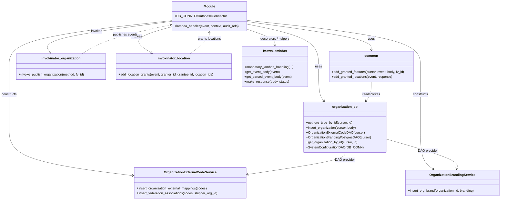

# Diagram: common/iam_service/iam_service/v1/lambdas/organizations/create_organizations.py


> Auto-generated by Obscura crawlers

## Diagram 1



### SVG

<svg id="container" width="2460.681640625" xmlns="http://www.w3.org/2000/svg" class="classDiagram" height="976" viewBox="0 0 2460.681640625 976" role="graphics-document document" aria-roledescription="class"><style>#container{font-family:"trebuchet ms",verdana,arial,sans-serif;font-size:16px;fill:#333;}@keyframes edge-animation-frame{from{stroke-dashoffset:0;}}@keyframes dash{to{stroke-dashoffset:0;}}#container .edge-animation-slow{stroke-dasharray:9,5!important;stroke-dashoffset:900;animation:dash 50s linear infinite;stroke-linecap:round;}#container .edge-animation-fast{stroke-dasharray:9,5!important;stroke-dashoffset:900;animation:dash 20s linear infinite;stroke-linecap:round;}#container .error-icon{fill:#552222;}#container .error-text{fill:#552222;stroke:#552222;}#container .edge-thickness-normal{stroke-width:1px;}#container .edge-thickness-thick{stroke-width:3.5px;}#container .edge-pattern-solid{stroke-dasharray:0;}#container .edge-thickness-invisible{stroke-width:0;fill:none;}#container .edge-pattern-dashed{stroke-dasharray:3;}#container .edge-pattern-dotted{stroke-dasharray:2;}#container .marker{fill:#333333;stroke:#333333;}#container .marker.cross{stroke:#333333;}#container svg{font-family:"trebuchet ms",verdana,arial,sans-serif;font-size:16px;}#container p{margin:0;}#container g.classGroup text{fill:#9370DB;stroke:none;font-family:"trebuchet ms",verdana,arial,sans-serif;font-size:10px;}#container g.classGroup text .title{font-weight:bolder;}#container .nodeLabel,#container .edgeLabel{color:#131300;}#container .edgeLabel .label rect{fill:#ECECFF;}#container .label text{fill:#131300;}#container .labelBkg{background:#ECECFF;}#container .edgeLabel .label span{background:#ECECFF;}#container .classTitle{font-weight:bolder;}#container .node rect,#container .node circle,#container .node ellipse,#container .node polygon,#container .node path{fill:#ECECFF;stroke:#9370DB;stroke-width:1px;}#container .divider{stroke:#9370DB;stroke-width:1;}#container g.clickable{cursor:pointer;}#container g.classGroup rect{fill:#ECECFF;stroke:#9370DB;}#container g.classGroup line{stroke:#9370DB;stroke-width:1;}#container .classLabel .box{stroke:none;stroke-width:0;fill:#ECECFF;opacity:0.5;}#container .classLabel .label{fill:#9370DB;font-size:10px;}#container .relation{stroke:#333333;stroke-width:1;fill:none;}#container .dashed-line{stroke-dasharray:3;}#container .dotted-line{stroke-dasharray:1 2;}#container #compositionStart,#container .composition{fill:#333333!important;stroke:#333333!important;stroke-width:1;}#container #compositionEnd,#container .composition{fill:#333333!important;stroke:#333333!important;stroke-width:1;}#container #dependencyStart,#container .dependency{fill:#333333!important;stroke:#333333!important;stroke-width:1;}#container #dependencyStart,#container .dependency{fill:#333333!important;stroke:#333333!important;stroke-width:1;}#container #extensionStart,#container .extension{fill:transparent!important;stroke:#333333!important;stroke-width:1;}#container #extensionEnd,#container .extension{fill:transparent!important;stroke:#333333!important;stroke-width:1;}#container #aggregationStart,#container .aggregation{fill:transparent!important;stroke:#333333!important;stroke-width:1;}#container #aggregationEnd,#container .aggregation{fill:transparent!important;stroke:#333333!important;stroke-width:1;}#container #lollipopStart,#container .lollipop{fill:#ECECFF!important;stroke:#333333!important;stroke-width:1;}#container #lollipopEnd,#container .lollipop{fill:#ECECFF!important;stroke:#333333!important;stroke-width:1;}#container .edgeTerminals{font-size:11px;line-height:initial;}#container .classTitleText{text-anchor:middle;font-size:18px;fill:#333;}#container .label-icon{display:inline-block;height:1em;overflow:visible;vertical-align:-0.125em;}#container .node .label-icon path{fill:currentColor;stroke:revert;stroke-width:revert;}#container :root{--mermaid-font-family:"trebuchet ms",verdana,arial,sans-serif;}</style><g><defs><marker id="container_class-aggregationStart" class="marker aggregation class" refX="18" refY="7" markerWidth="190" markerHeight="240" orient="auto"><path d="M 18,7 L9,13 L1,7 L9,1 Z"></path></marker></defs><defs><marker id="container_class-aggregationEnd" class="marker aggregation class" refX="1" refY="7" markerWidth="20" markerHeight="28" orient="auto"><path d="M 18,7 L9,13 L1,7 L9,1 Z"></path></marker></defs><defs><marker id="container_class-extensionStart" class="marker extension class" refX="18" refY="7" markerWidth="190" markerHeight="240" orient="auto"><path d="M 1,7 L18,13 V 1 Z"></path></marker></defs><defs><marker id="container_class-extensionEnd" class="marker extension class" refX="1" refY="7" markerWidth="20" markerHeight="28" orient="auto"><path d="M 1,1 V 13 L18,7 Z"></path></marker></defs><defs><marker id="container_class-compositionStart" class="marker composition class" refX="18" refY="7" markerWidth="190" markerHeight="240" orient="auto"><path d="M 18,7 L9,13 L1,7 L9,1 Z"></path></marker></defs><defs><marker id="container_class-compositionEnd" class="marker composition class" refX="1" refY="7" markerWidth="20" markerHeight="28" orient="auto"><path d="M 18,7 L9,13 L1,7 L9,1 Z"></path></marker></defs><defs><marker id="container_class-dependencyStart" class="marker dependency class" refX="6" refY="7" markerWidth="190" markerHeight="240" orient="auto"><path d="M 5,7 L9,13 L1,7 L9,1 Z"></path></marker></defs><defs><marker id="container_class-dependencyEnd" class="marker dependency class" refX="13" refY="7" markerWidth="20" markerHeight="28" orient="auto"><path d="M 18,7 L9,13 L14,7 L9,1 Z"></path></marker></defs><defs><marker id="container_class-lollipopStart" class="marker lollipop class" refX="13" refY="7" markerWidth="190" markerHeight="240" orient="auto"><circle stroke="black" fill="transparent" cx="7" cy="7" r="6"></circle></marker></defs><defs><marker id="container_class-lollipopEnd" class="marker lollipop class" refX="1" refY="7" markerWidth="190" markerHeight="240" orient="auto"><circle stroke="black" fill="transparent" cx="7" cy="7" r="6"></circle></marker></defs><g class="root"><g class="clusters"></g><g class="edgePaths"><path d="M1216.521,117.764L1275.121,129.637C1333.72,141.509,1450.919,165.255,1509.518,199.794C1568.117,234.333,1568.117,279.667,1568.117,325C1568.117,370.333,1568.117,415.667,1572.459,443.721C1576.801,471.776,1585.485,482.552,1589.826,487.94L1594.168,493.328" id="id_Module_organization_db_1" class="edge-thickness-normal edge-pattern-solid relation" style=";;;" data-edge="true" data-et="edge" data-id="id_Module_organization_db_1" data-points="W3sieCI6MTIxNi41MjE0ODQzNzUsInkiOjExNy43NjQxMTYwNDMyNjAyOX0seyJ4IjoxNTY4LjExNzE4NzUsInkiOjE4OX0seyJ4IjoxNTY4LjExNzE4NzUsInkiOjMyNX0seyJ4IjoxNTY4LjExNzE4NzUsInkiOjQ2MX0seyJ4IjoxNTk3LjkzMzA4MTA1NDY4NzYsInkiOjQ5OH1d" marker-end="url(#container_class-dependencyEnd)"></path><path d="M843.74,100.641L710.757,115.367C577.775,130.094,311.809,159.547,178.826,196.94C45.844,234.333,45.844,279.667,45.844,325C45.844,370.333,45.844,415.667,45.844,465C45.844,514.333,45.844,567.667,45.844,621C45.844,674.333,45.844,727.667,147.669,767.146C249.494,806.626,453.143,832.252,554.968,845.065L656.793,857.877" id="id_Module_OrganizationExternalCodeService_2" class="edge-thickness-normal edge-pattern-solid relation" style=";;;" data-edge="true" data-et="edge" data-id="id_Module_OrganizationExternalCodeService_2" data-points="W3sieCI6ODQzLjc0MDIzNDM3NSwieSI6MTAwLjY0MDkwNjQzMDEzNzYyfSx7IngiOjQ1Ljg0Mzc1LCJ5IjoxODl9LHsieCI6NDUuODQzNzUsInkiOjMyNX0seyJ4Ijo0NS44NDM3NSwieSI6NDYxfSx7IngiOjQ1Ljg0Mzc1LCJ5Ijo2MjF9LHsieCI6NDUuODQzNzUsInkiOjc4MX0seyJ4Ijo2NjIuNzQ2MDkzNzUsInkiOjg1OC42MjY1MjE3ODExMDkzfV0=" marker-end="url(#container_class-dependencyEnd)"></path><path d="M1216.521,99.587L1358.328,114.489C1500.134,129.392,1783.747,159.196,1925.553,196.765C2067.359,234.333,2067.359,279.667,2067.359,325C2067.359,370.333,2067.359,415.667,2067.359,465C2067.359,514.333,2067.359,567.667,2067.359,621C2067.359,674.333,2067.359,727.667,2077.901,761.916C2088.443,796.165,2109.526,811.331,2120.068,818.914L2130.61,826.496" id="id_Module_OrganizationBrandingService_3" class="edge-thickness-normal edge-pattern-solid relation" style=";;;" data-edge="true" data-et="edge" data-id="id_Module_OrganizationBrandingService_3" data-points="W3sieCI6MTIxNi41MjE0ODQzNzUsInkiOjk5LjU4NzM2OTQzNTkwMjg0fSx7IngiOjIwNjcuMzU5Mzc1LCJ5IjoxODl9LHsieCI6MjA2Ny4zNTkzNzUsInkiOjMyNX0seyJ4IjoyMDY3LjM1OTM3NSwieSI6NDYxfSx7IngiOjIwNjcuMzU5Mzc1LCJ5Ijo2MjF9LHsieCI6MjA2Ny4zNTkzNzUsInkiOjc4MX0seyJ4IjoyMTM1LjQ4MDM0NjY3OTY4NzUsInkiOjgzMH1d" marker-end="url(#container_class-dependencyEnd)"></path><path d="M1216.521,105.528L1318.099,119.44C1419.676,133.352,1622.83,161.176,1724.407,184.255C1825.984,207.333,1825.984,225.667,1825.984,234.833L1825.984,244" id="id_Module_common_4" class="edge-thickness-normal edge-pattern-solid relation" style=";;;" data-edge="true" data-et="edge" data-id="id_Module_common_4" data-points="W3sieCI6MTIxNi41MjE0ODQzNzUsInkiOjEwNS41MjgwMzcxNjUyODc4Nn0seyJ4IjoxODI1Ljk4NDM3NSwieSI6MTg5fSx7IngiOjE4MjUuOTg0Mzc1LCJ5IjoyNTB9XQ==" marker-end="url(#container_class-dependencyEnd)"></path><path d="M843.74,104.402L736.045,118.502C628.35,132.602,412.959,160.801,313.972,186.273C214.985,211.745,232.402,234.491,241.11,245.863L249.819,257.236" id="id_Module_invokinator_organization_5" class="edge-thickness-normal edge-pattern-solid relation" style=";;;" data-edge="true" data-et="edge" data-id="id_Module_invokinator_organization_5" data-points="W3sieCI6ODQzLjc0MDIzNDM3NSwieSI6MTA0LjQwMjQ2NjAzMTA3ODc1fSx7IngiOjE5Ny41NjgzNTkzNzUsInkiOjE4OX0seyJ4IjoyNTMuNDY2MzIyOTU0OTYzMjMsInkiOjI2Mn1d" marker-end="url(#container_class-dependencyEnd)"></path><path d="M843.74,131.317L808.821,140.931C773.902,150.544,704.063,169.772,688.295,191.033C672.527,212.294,710.83,235.588,729.982,247.235L749.133,258.882" id="id_Module_invokinator_location_6" class="edge-thickness-normal edge-pattern-solid relation" style=";;;" data-edge="true" data-et="edge" data-id="id_Module_invokinator_location_6" data-points="W3sieCI6ODQzLjc0MDIzNDM3NSwieSI6MTMxLjMxNjYzOTA0MDE3NjgyfSx7IngiOjYzNC4yMjQ2MDkzNzUsInkiOjE4OX0seyJ4Ijo3NTQuMjU5NjY1MDk2NTA3MywieSI6MjYyfV0=" marker-end="url(#container_class-dependencyEnd)"></path><path d="M1216.521,142.561L1239.581,150.301C1262.641,158.041,1308.76,173.52,1331.819,186.427C1354.879,199.333,1354.879,209.667,1354.879,214.833L1354.879,220" id="id_Module_fv.aws.lambdas_7" class="edge-thickness-normal edge-pattern-solid relation" style=";;;" data-edge="true" data-et="edge" data-id="id_Module_fv.aws.lambdas_7" data-points="W3sieCI6MTIxNi41MjE0ODQzNzUsInkiOjE0Mi41NjEwNDc5Mjc3ODA1NX0seyJ4IjoxMzU0Ljg3ODkwNjI1LCJ5IjoxODl9LHsieCI6MTM1NC44Nzg5MDYyNSwieSI6MjI2fV0=" marker-end="url(#container_class-dependencyEnd)"></path><path d="M1697.051,744L1697.051,750.167C1697.051,756.333,1697.051,768.667,1616.712,786.655C1536.373,804.643,1375.696,828.287,1295.357,840.109L1215.018,851.93" id="id_organization_db_OrganizationExternalCodeService_8" class="edge-thickness-normal edge-pattern-solid relation" style=";;;" data-edge="true" data-et="edge" data-id="id_organization_db_OrganizationExternalCodeService_8" data-points="W3sieCI6MTY5Ny4wNTA3ODEyNSwieSI6NzQ0fSx7IngiOjE2OTcuMDUwNzgxMjUsInkiOjc4MX0seyJ4IjoxMjA5LjA4MjAzMTI1LCJ5Ijo4NTIuODAzNzg4NTM1ODU1Nn1d" marker-end="url(#container_class-dependencyEnd)"></path><path d="M1895.242,677.63L1955.537,694.858C2015.833,712.087,2136.423,746.543,2194.533,770.981C2252.643,795.419,2248.272,809.839,2246.087,817.048L2243.901,824.258" id="id_organization_db_OrganizationBrandingService_9" class="edge-thickness-normal edge-pattern-solid relation" style=";;;" data-edge="true" data-et="edge" data-id="id_organization_db_OrganizationBrandingService_9" data-points="W3sieCI6MTg5NS4yNDIxODc1LCJ5Ijo2NzcuNjI5ODY4NzQ4Mjc3OH0seyJ4IjoyMjU3LjAxMzY3MTg3NSwieSI6NzgxfSx7IngiOjIyNDIuMTYwODg4NjcxODc1LCJ5Ijo4MzB9XQ==" marker-end="url(#container_class-dependencyEnd)"></path><path d="M1825.984,400L1825.984,410.167C1825.984,420.333,1825.984,440.667,1821.643,456.221C1817.301,471.776,1808.617,482.552,1804.275,487.94L1799.933,493.328" id="id_common_organization_db_10" class="edge-thickness-normal edge-pattern-solid relation" style=";;;" data-edge="true" data-et="edge" data-id="id_common_organization_db_10" data-points="W3sieCI6MTgyNS45ODQzNzUsInkiOjQwMH0seyJ4IjoxODI1Ljk4NDM3NSwieSI6NDYxfSx7IngiOjE3OTYuMTY4NDgxNDQ1MzEyNCwieSI6NDk4fV0=" marker-end="url(#container_class-dependencyEnd)"></path><path d="M405.299,262L425.305,249.833C445.311,237.667,485.322,213.333,557.418,189.919C629.514,166.504,733.695,144.009,785.785,132.761L837.875,121.513" id="id_invokinator_organization_Module_11" class="edge-thickness-normal edge-pattern-dashed relation" style=";;;" data-edge="true" data-et="edge" data-id="id_invokinator_organization_Module_11" data-points="W3sieCI6NDA1LjI5ODkyODY1MzQ5MjcsInkiOjI2Mn0seyJ4Ijo1MjUuMzMzOTg0Mzc1LCJ5IjoxODl9LHsieCI6ODQzLjc0MDIzNDM3NSwieSI6MTIwLjI0NzAzNjI0NjAxNDh9XQ==" marker-end="url(#container_class-dependencyEnd)"></path><path d="M937.657,262L953.07,249.833C968.482,237.667,999.306,213.333,1014.719,196C1030.131,178.667,1030.131,168.333,1030.131,163.167L1030.131,158" id="id_invokinator_location_Module_12" class="edge-thickness-normal edge-pattern-dashed relation" style=";;;" data-edge="true" data-et="edge" data-id="id_invokinator_location_Module_12" data-points="W3sieCI6OTM3LjY1NzQxMzI1ODI3MjEsInkiOjI2Mn0seyJ4IjoxMDMwLjEzMDg1OTM3NSwieSI6MTg5fSx7IngiOjEwMzAuMTMwODU5Mzc1LCJ5IjoxNTJ9XQ==" marker-end="url(#container_class-dependencyEnd)"></path></g><g class="edgeLabels"><g class="edgeLabel" transform="translate(1568.1171875, 325)"><g class="label" data-id="id_Module_organization_db_1" transform="translate(-16.4921875, -12)"><foreignObject width="32.984375" height="24"><div xmlns="http://www.w3.org/1999/xhtml" class="labelBkg" style="display: table-cell; white-space: nowrap; line-height: 1.5; max-width: 200px; text-align: center;"><span class="edgeLabel"><p>uses</p></span></div></foreignObject></g></g><g class="edgeLabel" transform="translate(45.84375, 461)"><g class="label" data-id="id_Module_OrganizationExternalCodeService_2" transform="translate(-37.84375, -12)"><foreignObject width="75.6875" height="24"><div xmlns="http://www.w3.org/1999/xhtml" class="labelBkg" style="display: table-cell; white-space: nowrap; line-height: 1.5; max-width: 200px; text-align: center;"><span class="edgeLabel"><p>constructs</p></span></div></foreignObject></g></g><g class="edgeLabel" transform="translate(2067.359375, 461)"><g class="label" data-id="id_Module_OrganizationBrandingService_3" transform="translate(-37.84375, -12)"><foreignObject width="75.6875" height="24"><div xmlns="http://www.w3.org/1999/xhtml" class="labelBkg" style="display: table-cell; white-space: nowrap; line-height: 1.5; max-width: 200px; text-align: center;"><span class="edgeLabel"><p>constructs</p></span></div></foreignObject></g></g><g class="edgeLabel" transform="translate(1825.984375, 189)"><g class="label" data-id="id_Module_common_4" transform="translate(-16.4921875, -12)"><foreignObject width="32.984375" height="24"><div xmlns="http://www.w3.org/1999/xhtml" class="labelBkg" style="display: table-cell; white-space: nowrap; line-height: 1.5; max-width: 200px; text-align: center;"><span class="edgeLabel"><p>uses</p></span></div></foreignObject></g></g><g class="edgeLabel" transform="translate(475.07161, 152.66897)"><g class="label" data-id="id_Module_invokinator_organization_5" transform="translate(-27.5859375, -12)"><foreignObject width="55.171875" height="24"><div xmlns="http://www.w3.org/1999/xhtml" class="labelBkg" style="display: table-cell; white-space: nowrap; line-height: 1.5; max-width: 200px; text-align: center;"><span class="edgeLabel"><p>invokes</p></span></div></foreignObject></g></g><g class="edgeLabel" transform="translate(671.25736, 178.80423)"><g class="label" data-id="id_Module_invokinator_location_6" transform="translate(-27.5859375, -12)"><foreignObject width="55.171875" height="24"><div xmlns="http://www.w3.org/1999/xhtml" class="labelBkg" style="display: table-cell; white-space: nowrap; line-height: 1.5; max-width: 200px; text-align: center;"><span class="edgeLabel"><p>invokes</p></span></div></foreignObject></g></g><g class="edgeLabel" transform="translate(1354.87890625, 189)"><g class="label" data-id="id_Module_fv.aws.lambdas_7" transform="translate(-74.3984375, -12)"><foreignObject width="148.796875" height="24"><div xmlns="http://www.w3.org/1999/xhtml" class="labelBkg" style="display: table-cell; white-space: nowrap; line-height: 1.5; max-width: 200px; text-align: center;"><span class="edgeLabel"><p>decorators / helpers</p></span></div></foreignObject></g></g><g class="edgeLabel" transform="translate(1697.05078125, 781)"><g class="label" data-id="id_organization_db_OrganizationExternalCodeService_8" transform="translate(-47.8984375, -12)"><foreignObject width="95.796875" height="24"><div xmlns="http://www.w3.org/1999/xhtml" class="labelBkg" style="display: table-cell; white-space: nowrap; line-height: 1.5; max-width: 200px; text-align: center;"><span class="edgeLabel"><p>DAO provider</p></span></div></foreignObject></g></g><g class="edgeLabel" transform="translate(2100.7436, 736.34845)"><g class="label" data-id="id_organization_db_OrganizationBrandingService_9" transform="translate(-47.8984375, -12)"><foreignObject width="95.796875" height="24"><div xmlns="http://www.w3.org/1999/xhtml" class="labelBkg" style="display: table-cell; white-space: nowrap; line-height: 1.5; max-width: 200px; text-align: center;"><span class="edgeLabel"><p>DAO provider</p></span></div></foreignObject></g></g><g class="edgeLabel" transform="translate(1825.984375, 461)"><g class="label" data-id="id_common_organization_db_10" transform="translate(-45.9453125, -12)"><foreignObject width="91.890625" height="24"><div xmlns="http://www.w3.org/1999/xhtml" class="labelBkg" style="display: table-cell; white-space: nowrap; line-height: 1.5; max-width: 200px; text-align: center;"><span class="edgeLabel"><p>reads/writes</p></span></div></foreignObject></g></g><g class="edgeLabel" transform="translate(615.87462, 169.4497)"><g class="label" data-id="id_invokinator_organization_Module_11" transform="translate(-61.3046875, -12)"><foreignObject width="122.609375" height="24"><div xmlns="http://www.w3.org/1999/xhtml" class="labelBkg" style="display: table-cell; white-space: nowrap; line-height: 1.5; max-width: 200px; text-align: center;"><span class="edgeLabel"><p>publishes events</p></span></div></foreignObject></g></g><g class="edgeLabel" transform="translate(1030.130859375, 189)"><g class="label" data-id="id_invokinator_location_Module_12" transform="translate(-58.0703125, -12)"><foreignObject width="116.140625" height="24"><div xmlns="http://www.w3.org/1999/xhtml" class="labelBkg" style="display: table-cell; white-space: nowrap; line-height: 1.5; max-width: 200px; text-align: center;"><span class="edgeLabel"><p>grants locations</p></span></div></foreignObject></g></g></g><g class="nodes"><g class="node default" id="classId-Module-0" transform="translate(1030.130859375, 80)"><g class="basic label-container"><path d="M-186.390625 -72 L186.390625 -72 L186.390625 72 L-186.390625 72" stroke="none" stroke-width="0" fill="#ECECFF" style=""></path><path d="M-186.390625 -72 C-62.251305726166876 -72, 61.88801354766625 -72, 186.390625 -72 M-186.390625 -72 C-47.88466857772215 -72, 90.6212878445557 -72, 186.390625 -72 M186.390625 -72 C186.390625 -39.815624572376606, 186.390625 -7.6312491447532125, 186.390625 72 M186.390625 -72 C186.390625 -15.172645790135995, 186.390625 41.65470841972801, 186.390625 72 M186.390625 72 C82.12255313086692 72, -22.145518738266162 72, -186.390625 72 M186.390625 72 C53.15881465428751 72, -80.07299569142498 72, -186.390625 72 M-186.390625 72 C-186.390625 38.75603669032833, -186.390625 5.512073380656659, -186.390625 -72 M-186.390625 72 C-186.390625 25.236191939970652, -186.390625 -21.527616120058696, -186.390625 -72" stroke="#9370DB" stroke-width="1.3" fill="none" stroke-dasharray="0 0" style=""></path></g><g class="annotation-group text" transform="translate(0, -48)"></g><g class="label-group text" transform="translate(-27.09375, -48)"><g class="label" style="font-weight: bolder" transform="translate(0,-12)"><foreignObject width="54.1875" height="24"><div xmlns="http://www.w3.org/1999/xhtml" style="display: table-cell; white-space: nowrap; line-height: 1.5; max-width: 104px; text-align: center;"><span class="nodeLabel markdown-node-label" style=""><p>Module</p></span></div></foreignObject></g></g><g class="members-group text" transform="translate(-174.390625, 0)"><g class="label" style="" transform="translate(0,-12)"><foreignObject width="241.65625" height="24"><div xmlns="http://www.w3.org/1999/xhtml" style="display: table-cell; white-space: nowrap; line-height: 1.5; max-width: 300px; text-align: center;"><span class="nodeLabel markdown-node-label" style=""><p>+DB_CONN: FvDatabaseConnector</p></span></div></foreignObject></g></g><g class="methods-group text" transform="translate(-174.390625, 48)"><g class="label" style="" transform="translate(0,-12)"><foreignObject width="321.6875" height="24"><div xmlns="http://www.w3.org/1999/xhtml" style="display: table-cell; white-space: nowrap; line-height: 1.5; max-width: 379px; text-align: center;"><span class="nodeLabel markdown-node-label" style=""><p>+lambda_handler(event, context, audit_refs)</p></span></div></foreignObject></g></g><g class="divider" style=""><path d="M-186.390625 -24 C-94.15589505454838 -24, -1.921165109096762 -24, 186.390625 -24 M-186.390625 -24 C-77.42367275116233 -24, 31.543279497675343 -24, 186.390625 -24" stroke="#9370DB" stroke-width="1.3" fill="none" stroke-dasharray="0 0" style=""></path></g><g class="divider" style=""><path d="M-186.390625 24 C-80.48434696391888 24, 25.421931072162238 24, 186.390625 24 M-186.390625 24 C-84.54546380200104 24, 17.299697395997924 24, 186.390625 24" stroke="#9370DB" stroke-width="1.3" fill="none" stroke-dasharray="0 0" style=""></path></g></g><g class="node default" id="classId-organization_db-1" transform="translate(1697.05078125, 621)"><g class="basic label-container"><path d="M-198.19140625 -123 L198.19140625 -123 L198.19140625 123 L-198.19140625 123" stroke="none" stroke-width="0" fill="#ECECFF" style=""></path><path d="M-198.19140625 -123 C-83.8568855033197 -123, 30.477635243360595 -123, 198.19140625 -123 M-198.19140625 -123 C-116.23577141828272 -123, -34.28013658656545 -123, 198.19140625 -123 M198.19140625 -123 C198.19140625 -56.22302235347864, 198.19140625 10.55395529304272, 198.19140625 123 M198.19140625 -123 C198.19140625 -70.67867246819841, 198.19140625 -18.357344936396814, 198.19140625 123 M198.19140625 123 C87.20439349940229 123, -23.782619251195428 123, -198.19140625 123 M198.19140625 123 C43.35497907515918 123, -111.48144809968164 123, -198.19140625 123 M-198.19140625 123 C-198.19140625 55.6654734519319, -198.19140625 -11.669053096136196, -198.19140625 -123 M-198.19140625 123 C-198.19140625 49.69808544119448, -198.19140625 -23.603829117611042, -198.19140625 -123" stroke="#9370DB" stroke-width="1.3" fill="none" stroke-dasharray="0 0" style=""></path></g><g class="annotation-group text" transform="translate(0, -99)"></g><g class="label-group text" transform="translate(-59.4140625, -99)"><g class="label" style="font-weight: bolder" transform="translate(0,-12)"><foreignObject width="118.828125" height="24"><div xmlns="http://www.w3.org/1999/xhtml" style="display: table-cell; white-space: nowrap; line-height: 1.5; max-width: 167px; text-align: center;"><span class="nodeLabel markdown-node-label" style=""><p>organization_db</p></span></div></foreignObject></g></g><g class="members-group text" transform="translate(-186.19140625, -51)"></g><g class="methods-group text" transform="translate(-186.19140625, -21)"><g class="label" style="" transform="translate(0,-12)"><foreignObject width="226.21875" height="24"><div xmlns="http://www.w3.org/1999/xhtml" style="display: table-cell; white-space: nowrap; line-height: 1.5; max-width: 284px; text-align: center;"><span class="nodeLabel markdown-node-label" style=""><p>+get_org_type_by_id(cursor, id)</p></span></div></foreignObject></g><g class="label" style="" transform="translate(0,12)"><foreignObject width="247.5625" height="24"><div xmlns="http://www.w3.org/1999/xhtml" style="display: table-cell; white-space: nowrap; line-height: 1.5; max-width: 305px; text-align: center;"><span class="nodeLabel markdown-node-label" style=""><p>+insert_organization(cursor, body)</p></span></div></foreignObject></g><g class="label" style="" transform="translate(0,36)"><foreignObject width="282.03125" height="24"><div xmlns="http://www.w3.org/1999/xhtml" style="display: table-cell; white-space: nowrap; line-height: 1.5; max-width: 339px; text-align: center;"><span class="nodeLabel markdown-node-label" style=""><p>+OrganizationExternalCodeDAO(cursor)</p></span></div></foreignObject></g><g class="label" style="" transform="translate(0,60)"><foreignObject width="312.96875" height="24"><div xmlns="http://www.w3.org/1999/xhtml" style="display: table-cell; white-space: nowrap; line-height: 1.5; max-width: 370px; text-align: center;"><span class="nodeLabel markdown-node-label" style=""><p>+OrganizationBrandingPostgresDAO(cursor)</p></span></div></foreignObject></g><g class="label" style="" transform="translate(0,84)"><foreignObject width="253.4375" height="24"><div xmlns="http://www.w3.org/1999/xhtml" style="display: table-cell; white-space: nowrap; line-height: 1.5; max-width: 311px; text-align: center;"><span class="nodeLabel markdown-node-label" style=""><p>+get_organization_by_id(cursor, id)</p></span></div></foreignObject></g><g class="label" style="" transform="translate(0,108)"><foreignObject width="266.03125" height="24"><div xmlns="http://www.w3.org/1999/xhtml" style="display: table-cell; white-space: nowrap; line-height: 1.5; max-width: 323px; text-align: center;"><span class="nodeLabel markdown-node-label" style=""><p>+SystemConfigurationDAO(DB_CONN)</p></span></div></foreignObject></g></g><g class="divider" style=""><path d="M-198.19140625 -75 C-42.8567608143004 -75, 112.4778846213992 -75, 198.19140625 -75 M-198.19140625 -75 C-77.3178420027337 -75, 43.5557222445326 -75, 198.19140625 -75" stroke="#9370DB" stroke-width="1.3" fill="none" stroke-dasharray="0 0" style=""></path></g><g class="divider" style=""><path d="M-198.19140625 -51 C-65.12094152598846 -51, 67.94952319802309 -51, 198.19140625 -51 M-198.19140625 -51 C-45.22981443189428 -51, 107.73177738621143 -51, 198.19140625 -51" stroke="#9370DB" stroke-width="1.3" fill="none" stroke-dasharray="0 0" style=""></path></g></g><g class="node default" id="classId-OrganizationExternalCodeService-2" transform="translate(935.9140625, 893)"><g class="basic label-container"><path d="M-273.16796875 -75 L273.16796875 -75 L273.16796875 75 L-273.16796875 75" stroke="none" stroke-width="0" fill="#ECECFF" style=""></path><path d="M-273.16796875 -75 C-119.53329056750857 -75, 34.101387614982855 -75, 273.16796875 -75 M-273.16796875 -75 C-82.60743862111838 -75, 107.95309150776325 -75, 273.16796875 -75 M273.16796875 -75 C273.16796875 -44.37852164489081, 273.16796875 -13.75704328978162, 273.16796875 75 M273.16796875 -75 C273.16796875 -22.65660343762672, 273.16796875 29.686793124746558, 273.16796875 75 M273.16796875 75 C64.97866169976379 75, -143.21064535047242 75, -273.16796875 75 M273.16796875 75 C138.41113514406783 75, 3.6543015381356554 75, -273.16796875 75 M-273.16796875 75 C-273.16796875 18.76067382025296, -273.16796875 -37.47865235949408, -273.16796875 -75 M-273.16796875 75 C-273.16796875 33.697998702362995, -273.16796875 -7.604002595274011, -273.16796875 -75" stroke="#9370DB" stroke-width="1.3" fill="none" stroke-dasharray="0 0" style=""></path></g><g class="annotation-group text" transform="translate(0, -51)"></g><g class="label-group text" transform="translate(-121.8359375, -51)"><g class="label" style="font-weight: bolder" transform="translate(0,-12)"><foreignObject width="243.671875" height="24"><div xmlns="http://www.w3.org/1999/xhtml" style="display: table-cell; white-space: nowrap; line-height: 1.5; max-width: 290px; text-align: center;"><span class="nodeLabel markdown-node-label" style=""><p>OrganizationExternalCodeService</p></span></div></foreignObject></g></g><g class="members-group text" transform="translate(-261.16796875, -3)"></g><g class="methods-group text" transform="translate(-261.16796875, 27)"><g class="label" style="" transform="translate(0,-12)"><foreignObject width="347.859375" height="24"><div xmlns="http://www.w3.org/1999/xhtml" style="display: table-cell; white-space: nowrap; line-height: 1.5; max-width: 405px; text-align: center;"><span class="nodeLabel markdown-node-label" style=""><p>+insert_organization_external_mappings(codes)</p></span></div></foreignObject></g><g class="label" style="" transform="translate(0,12)"><foreignObject width="400.5" height="24"><div xmlns="http://www.w3.org/1999/xhtml" style="display: table-cell; white-space: nowrap; line-height: 1.5; max-width: 458px; text-align: center;"><span class="nodeLabel markdown-node-label" style=""><p>+insert_federation_associations(codes, shipper_org_id)</p></span></div></foreignObject></g></g><g class="divider" style=""><path d="M-273.16796875 -27 C-86.1010474285558 -27, 100.9658738928884 -27, 273.16796875 -27 M-273.16796875 -27 C-115.0272895514992 -27, 43.11338964700161 -27, 273.16796875 -27" stroke="#9370DB" stroke-width="1.3" fill="none" stroke-dasharray="0 0" style=""></path></g><g class="divider" style=""><path d="M-273.16796875 -3 C-116.95073649182649 -3, 39.26649576634702 -3, 273.16796875 -3 M-273.16796875 -3 C-126.1870066085614 -3, 20.79395553287719 -3, 273.16796875 -3" stroke="#9370DB" stroke-width="1.3" fill="none" stroke-dasharray="0 0" style=""></path></g></g><g class="node default" id="classId-OrganizationBrandingService-3" transform="translate(2223.064453125, 893)"><g class="basic label-container"><path d="M-229.6171875 -63 L229.6171875 -63 L229.6171875 63 L-229.6171875 63" stroke="none" stroke-width="0" fill="#ECECFF" style=""></path><path d="M-229.6171875 -63 C-68.36371368360565 -63, 92.8897601327887 -63, 229.6171875 -63 M-229.6171875 -63 C-110.09044842684875 -63, 9.436290646302496 -63, 229.6171875 -63 M229.6171875 -63 C229.6171875 -24.573897542737186, 229.6171875 13.852204914525629, 229.6171875 63 M229.6171875 -63 C229.6171875 -32.21943640339522, 229.6171875 -1.4388728067904353, 229.6171875 63 M229.6171875 63 C46.85645436092395 63, -135.9042787781521 63, -229.6171875 63 M229.6171875 63 C109.17057232081373 63, -11.276042858372534 63, -229.6171875 63 M-229.6171875 63 C-229.6171875 34.75183541104893, -229.6171875 6.503670822097867, -229.6171875 -63 M-229.6171875 63 C-229.6171875 23.74364049007898, -229.6171875 -15.512719019842038, -229.6171875 -63" stroke="#9370DB" stroke-width="1.3" fill="none" stroke-dasharray="0 0" style=""></path></g><g class="annotation-group text" transform="translate(0, -39)"></g><g class="label-group text" transform="translate(-106.28125, -39)"><g class="label" style="font-weight: bolder" transform="translate(0,-12)"><foreignObject width="212.5625" height="24"><div xmlns="http://www.w3.org/1999/xhtml" style="display: table-cell; white-space: nowrap; line-height: 1.5; max-width: 259px; text-align: center;"><span class="nodeLabel markdown-node-label" style=""><p>OrganizationBrandingService</p></span></div></foreignObject></g></g><g class="members-group text" transform="translate(-217.6171875, 9)"></g><g class="methods-group text" transform="translate(-217.6171875, 39)"><g class="label" style="" transform="translate(0,-12)"><foreignObject width="328.953125" height="24"><div xmlns="http://www.w3.org/1999/xhtml" style="display: table-cell; white-space: nowrap; line-height: 1.5; max-width: 386px; text-align: center;"><span class="nodeLabel markdown-node-label" style=""><p>+insert_org_brand(organization_id, branding)</p></span></div></foreignObject></g></g><g class="divider" style=""><path d="M-229.6171875 -15 C-70.9986903800961 -15, 87.61980673980781 -15, 229.6171875 -15 M-229.6171875 -15 C-113.77078726826346 -15, 2.075612963473077 -15, 229.6171875 -15" stroke="#9370DB" stroke-width="1.3" fill="none" stroke-dasharray="0 0" style=""></path></g><g class="divider" style=""><path d="M-229.6171875 9 C-50.503357125371 9, 128.610473249258 9, 229.6171875 9 M-229.6171875 9 C-128.27300567263768 9, -26.92882384527536 9, 229.6171875 9" stroke="#9370DB" stroke-width="1.3" fill="none" stroke-dasharray="0 0" style=""></path></g></g><g class="node default" id="classId-common-4" transform="translate(1825.984375, 325)"><g class="basic label-container"><path d="M-206.375 -75 L206.375 -75 L206.375 75 L-206.375 75" stroke="none" stroke-width="0" fill="#ECECFF" style=""></path><path d="M-206.375 -75 C-113.24205751008962 -75, -20.109115020179246 -75, 206.375 -75 M-206.375 -75 C-73.25511798121329 -75, 59.86476403757342 -75, 206.375 -75 M206.375 -75 C206.375 -25.88028219521091, 206.375 23.23943560957818, 206.375 75 M206.375 -75 C206.375 -39.2494746516298, 206.375 -3.498949303259593, 206.375 75 M206.375 75 C47.00637041734973 75, -112.36225916530054 75, -206.375 75 M206.375 75 C48.67449996688191 75, -109.02600006623618 75, -206.375 75 M-206.375 75 C-206.375 37.04411698965468, -206.375 -0.9117660206906351, -206.375 -75 M-206.375 75 C-206.375 44.716401904755045, -206.375 14.432803809510084, -206.375 -75" stroke="#9370DB" stroke-width="1.3" fill="none" stroke-dasharray="0 0" style=""></path></g><g class="annotation-group text" transform="translate(0, -51)"></g><g class="label-group text" transform="translate(-31.15625, -51)"><g class="label" style="font-weight: bolder" transform="translate(0,-12)"><foreignObject width="62.3125" height="24"><div xmlns="http://www.w3.org/1999/xhtml" style="display: table-cell; white-space: nowrap; line-height: 1.5; max-width: 113px; text-align: center;"><span class="nodeLabel markdown-node-label" style=""><p>common</p></span></div></foreignObject></g></g><g class="members-group text" transform="translate(-194.375, -3)"></g><g class="methods-group text" transform="translate(-194.375, 27)"><g class="label" style="" transform="translate(0,-12)"><foreignObject width="357.59375" height="24"><div xmlns="http://www.w3.org/1999/xhtml" style="display: table-cell; white-space: nowrap; line-height: 1.5; max-width: 415px; text-align: center;"><span class="nodeLabel markdown-node-label" style=""><p>+add_granted_features(cursor, event, body, fv_id)</p></span></div></foreignObject></g><g class="label" style="" transform="translate(0,12)"><foreignObject width="299.828125" height="24"><div xmlns="http://www.w3.org/1999/xhtml" style="display: table-cell; white-space: nowrap; line-height: 1.5; max-width: 357px; text-align: center;"><span class="nodeLabel markdown-node-label" style=""><p>+add_granted_locations(event, response)</p></span></div></foreignObject></g></g><g class="divider" style=""><path d="M-206.375 -27 C-102.99216514546147 -27, 0.3906697090770592 -27, 206.375 -27 M-206.375 -27 C-79.61500451655306 -27, 47.144990966893886 -27, 206.375 -27" stroke="#9370DB" stroke-width="1.3" fill="none" stroke-dasharray="0 0" style=""></path></g><g class="divider" style=""><path d="M-206.375 -3 C-60.0956519365464 -3, 86.1836961269072 -3, 206.375 -3 M-206.375 -3 C-83.23417235460442 -3, 39.90665529079115 -3, 206.375 -3" stroke="#9370DB" stroke-width="1.3" fill="none" stroke-dasharray="0 0" style=""></path></g></g><g class="node default" id="classId-invokinator_organization-5" transform="translate(301.70703125, 325)"><g class="basic label-container"><path d="M-220.86328125 -63 L220.86328125 -63 L220.86328125 63 L-220.86328125 63" stroke="none" stroke-width="0" fill="#ECECFF" style=""></path><path d="M-220.86328125 -63 C-45.27598447190178 -63, 130.31131230619644 -63, 220.86328125 -63 M-220.86328125 -63 C-130.89940461424675 -63, -40.935527978493525 -63, 220.86328125 -63 M220.86328125 -63 C220.86328125 -28.044861403011105, 220.86328125 6.910277193977791, 220.86328125 63 M220.86328125 -63 C220.86328125 -15.01002956883837, 220.86328125 32.97994086232326, 220.86328125 63 M220.86328125 63 C56.20232139138977 63, -108.45863846722045 63, -220.86328125 63 M220.86328125 63 C44.899727093072755 63, -131.0638270638545 63, -220.86328125 63 M-220.86328125 63 C-220.86328125 35.39958791725944, -220.86328125 7.79917583451887, -220.86328125 -63 M-220.86328125 63 C-220.86328125 31.078488549803527, -220.86328125 -0.8430229003929455, -220.86328125 -63" stroke="#9370DB" stroke-width="1.3" fill="none" stroke-dasharray="0 0" style=""></path></g><g class="annotation-group text" transform="translate(0, -39)"></g><g class="label-group text" transform="translate(-91.2265625, -39)"><g class="label" style="font-weight: bolder" transform="translate(0,-12)"><foreignObject width="182.453125" height="24"><div xmlns="http://www.w3.org/1999/xhtml" style="display: table-cell; white-space: nowrap; line-height: 1.5; max-width: 230px; text-align: center;"><span class="nodeLabel markdown-node-label" style=""><p>invokinator_organization</p></span></div></foreignObject></g></g><g class="members-group text" transform="translate(-208.86328125, 9)"></g><g class="methods-group text" transform="translate(-208.86328125, 39)"><g class="label" style="" transform="translate(0,-12)"><foreignObject width="326.5" height="24"><div xmlns="http://www.w3.org/1999/xhtml" style="display: table-cell; white-space: nowrap; line-height: 1.5; max-width: 384px; text-align: center;"><span class="nodeLabel markdown-node-label" style=""><p>+invoke_publish_organization(method, fv_id)</p></span></div></foreignObject></g></g><g class="divider" style=""><path d="M-220.86328125 -15 C-55.8386423982991 -15, 109.1859964534018 -15, 220.86328125 -15 M-220.86328125 -15 C-59.070262197269585 -15, 102.72275685546083 -15, 220.86328125 -15" stroke="#9370DB" stroke-width="1.3" fill="none" stroke-dasharray="0 0" style=""></path></g><g class="divider" style=""><path d="M-220.86328125 9 C-83.59880778421262 9, 53.66566568157475 9, 220.86328125 9 M-220.86328125 9 C-106.95762684725005 9, 6.948027555499891 9, 220.86328125 9" stroke="#9370DB" stroke-width="1.3" fill="none" stroke-dasharray="0 0" style=""></path></g></g><g class="node default" id="classId-invokinator_location-6" transform="translate(857.8515625, 325)"><g class="basic label-container"><path d="M-285.28125 -63 L285.28125 -63 L285.28125 63 L-285.28125 63" stroke="none" stroke-width="0" fill="#ECECFF" style=""></path><path d="M-285.28125 -63 C-163.08627247386377 -63, -40.891294947727545 -63, 285.28125 -63 M-285.28125 -63 C-119.42499422971278 -63, 46.43126154057444 -63, 285.28125 -63 M285.28125 -63 C285.28125 -14.236347519504108, 285.28125 34.527304960991785, 285.28125 63 M285.28125 -63 C285.28125 -19.576415794718947, 285.28125 23.847168410562105, 285.28125 63 M285.28125 63 C77.8255335720161 63, -129.6301828559678 63, -285.28125 63 M285.28125 63 C78.29429645407535 63, -128.6926570918493 63, -285.28125 63 M-285.28125 63 C-285.28125 19.80806218492932, -285.28125 -23.38387563014136, -285.28125 -63 M-285.28125 63 C-285.28125 28.57665681612727, -285.28125 -5.846686367745463, -285.28125 -63" stroke="#9370DB" stroke-width="1.3" fill="none" stroke-dasharray="0 0" style=""></path></g><g class="annotation-group text" transform="translate(0, -39)"></g><g class="label-group text" transform="translate(-75.25, -39)"><g class="label" style="font-weight: bolder" transform="translate(0,-12)"><foreignObject width="150.5" height="24"><div xmlns="http://www.w3.org/1999/xhtml" style="display: table-cell; white-space: nowrap; line-height: 1.5; max-width: 199px; text-align: center;"><span class="nodeLabel markdown-node-label" style=""><p>invokinator_location</p></span></div></foreignObject></g></g><g class="members-group text" transform="translate(-273.28125, 9)"></g><g class="methods-group text" transform="translate(-273.28125, 39)"><g class="label" style="" transform="translate(0,-12)"><foreignObject width="471.3125" height="24"><div xmlns="http://www.w3.org/1999/xhtml" style="display: table-cell; white-space: nowrap; line-height: 1.5; max-width: 529px; text-align: center;"><span class="nodeLabel markdown-node-label" style=""><p>+add_location_grants(event, granter_id, grantee_id, location_ids)</p></span></div></foreignObject></g></g><g class="divider" style=""><path d="M-285.28125 -15 C-83.99643252391527 -15, 117.28838495216945 -15, 285.28125 -15 M-285.28125 -15 C-135.34253838991685 -15, 14.596173220166293 -15, 285.28125 -15" stroke="#9370DB" stroke-width="1.3" fill="none" stroke-dasharray="0 0" style=""></path></g><g class="divider" style=""><path d="M-285.28125 9 C-154.03854059530224 9, -22.795831190604474 9, 285.28125 9 M-285.28125 9 C-139.3329430211416 9, 6.615363957716795 9, 285.28125 9" stroke="#9370DB" stroke-width="1.3" fill="none" stroke-dasharray="0 0" style=""></path></g></g><g class="node default" id="classId-fv.aws.lambdas-7" transform="translate(1354.87890625, 325)"><g class="basic label-container"><path d="M-161.74609375 -99 L161.74609375 -99 L161.74609375 99 L-161.74609375 99" stroke="none" stroke-width="0" fill="#ECECFF" style=""></path><path d="M-161.74609375 -99 C-66.57830070456951 -99, 28.58949234086097 -99, 161.74609375 -99 M-161.74609375 -99 C-46.28201346238498 -99, 69.18206682523004 -99, 161.74609375 -99 M161.74609375 -99 C161.74609375 -52.48524060041931, 161.74609375 -5.97048120083862, 161.74609375 99 M161.74609375 -99 C161.74609375 -53.546189893788146, 161.74609375 -8.092379787576292, 161.74609375 99 M161.74609375 99 C85.11040222692407 99, 8.474710703848132 99, -161.74609375 99 M161.74609375 99 C81.38248264325333 99, 1.0188715365066514 99, -161.74609375 99 M-161.74609375 99 C-161.74609375 33.34223014578974, -161.74609375 -32.315539708420516, -161.74609375 -99 M-161.74609375 99 C-161.74609375 52.1199385217951, -161.74609375 5.239877043590198, -161.74609375 -99" stroke="#9370DB" stroke-width="1.3" fill="none" stroke-dasharray="0 0" style=""></path></g><g class="annotation-group text" transform="translate(0, -75)"></g><g class="label-group text" transform="translate(-55.8984375, -75)"><g class="label" style="font-weight: bolder" transform="translate(0,-12)"><foreignObject width="111.796875" height="24"><div xmlns="http://www.w3.org/1999/xhtml" style="display: table-cell; white-space: nowrap; line-height: 1.5; max-width: 160px; text-align: center;"><span class="nodeLabel markdown-node-label" style=""><p>fv.aws.lambdas</p></span></div></foreignObject></g></g><g class="members-group text" transform="translate(-149.74609375, -27)"></g><g class="methods-group text" transform="translate(-149.74609375, 3)"><g class="label" style="" transform="translate(0,-12)"><foreignObject width="243.59375" height="24"><div xmlns="http://www.w3.org/1999/xhtml" style="display: table-cell; white-space: nowrap; line-height: 1.5; max-width: 301px; text-align: center;"><span class="nodeLabel markdown-node-label" style=""><p>+mandatory_lambda_handling(...)</p></span></div></foreignObject></g><g class="label" style="" transform="translate(0,12)"><foreignObject width="174.203125" height="24"><div xmlns="http://www.w3.org/1999/xhtml" style="display: table-cell; white-space: nowrap; line-height: 1.5; max-width: 232px; text-align: center;"><span class="nodeLabel markdown-node-label" style=""><p>+get_event_body(event)</p></span></div></foreignObject></g><g class="label" style="" transform="translate(0,36)"><foreignObject width="232.265625" height="24"><div xmlns="http://www.w3.org/1999/xhtml" style="display: table-cell; white-space: nowrap; line-height: 1.5; max-width: 290px; text-align: center;"><span class="nodeLabel markdown-node-label" style=""><p>+get_parsed_event_body(event)</p></span></div></foreignObject></g><g class="label" style="" transform="translate(0,60)"><foreignObject width="219.96875" height="24"><div xmlns="http://www.w3.org/1999/xhtml" style="display: table-cell; white-space: nowrap; line-height: 1.5; max-width: 277px; text-align: center;"><span class="nodeLabel markdown-node-label" style=""><p>+make_response(body, status)</p></span></div></foreignObject></g></g><g class="divider" style=""><path d="M-161.74609375 -51 C-79.89623416075003 -51, 1.9536254284999472 -51, 161.74609375 -51 M-161.74609375 -51 C-81.48221120376236 -51, -1.2183286575247223 -51, 161.74609375 -51" stroke="#9370DB" stroke-width="1.3" fill="none" stroke-dasharray="0 0" style=""></path></g><g class="divider" style=""><path d="M-161.74609375 -27 C-49.85722650170787 -27, 62.03164074658426 -27, 161.74609375 -27 M-161.74609375 -27 C-38.92444646238836 -27, 83.89720082522328 -27, 161.74609375 -27" stroke="#9370DB" stroke-width="1.3" fill="none" stroke-dasharray="0 0" style=""></path></g></g></g></g></g></svg>

## Diagram 2

```mermaid
flowchart TD
    A[Incoming Lambda Event] --> B[Parse JSON body]
    B --> C{Validate required fields}
    C -->|missing name or profile id| ErrBadRequest1[Raise BadRequestError]
    C -->|valid| D[DB_CONN.establish_connection()]
    D --> E[Lookup org_type by profile id]
    E --> F{org_type == Carrier && scac is None}
    F -->|true| ErrBadRequest2[Raise BadRequestError]
    F -->|false| G[Insert organization into DB]
    G --> H[New org id obtained]
    H --> I{org_type == Dealer}
    I -->|true| J[Process granted_locations -> call invokinator_location.add_location_grants]
    H --> K[Process external_codes?]
    K -->|yes| L[Create OrganizationExternalCodeService and insert mappings & associations]
    H --> M[Retrieve organization record and response dict]
    M --> N[Process branding?]
    N -->|yes| O[Create Branding DAO and insert brand -> add branding to response]
    M --> P[Add default features from system config if any]
    P --> Q[Call common.add_granted_features and add_granted_locations]
    Q --> R[invokinator_organization.invoke_publish_organization("POST", fv_id)]
    R --> S[Return HTTP 201 response with response body]
    ErrBadRequest1 -.-> End[Lambda exits with error]
    ErrBadRequest2 -.-> End
    S --> End
```

> SVG rendering failed for this diagram.
