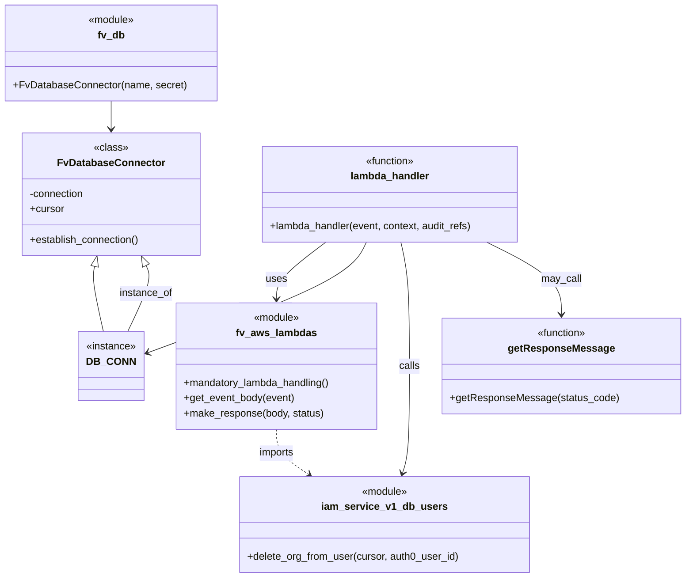

# Diagram: common/iam_service/iam_service/v1/lambdas/organizations/delete_organizations_member.py

> Auto-generated by Obscura crawlers

## Mermaid

```mermaid
classDiagram
class fv_aws_lambdas {
  <<module>>
  +mandatory_lambda_handling()
  +get_event_body(event)
  +make_response(body, status)
}
class fv_db {
  <<module>>
  +FvDatabaseConnector(name, secret)
}
class FvDatabaseConnector {
  <<class>>
  -connection
  +establish_connection()
  +cursor
}
class DB_CONN {
  <<instance>>
}
class iam_service_v1_db_users {
  <<module>>
  +delete_org_from_user(cursor, auth0_user_id)
}
class lambda_handler {
  <<function>>
  +lambda_handler(event, context, audit_refs)
}
class getResponseMessage {
  <<function>>
  +getResponseMessage(status_code)
}
fv_db --> FvDatabaseConnector
FvDatabaseConnector <|-- DB_CONN
lambda_handler --> fv_aws_lambdas : uses
lambda_handler --> DB_CONN : uses.cursor
lambda_handler --> iam_service_v1_db_users : calls
lambda_handler --> getResponseMessage : may_call
fv_aws_lambdas ..> iam_service_v1_db_users : imports
DB_CONN --|> FvDatabaseConnector : instance_of
```

> SVG rendering failed for this diagram.
