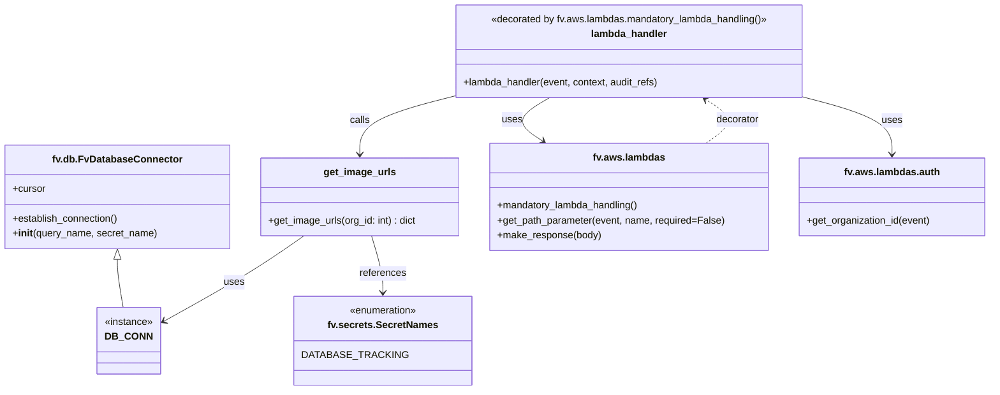
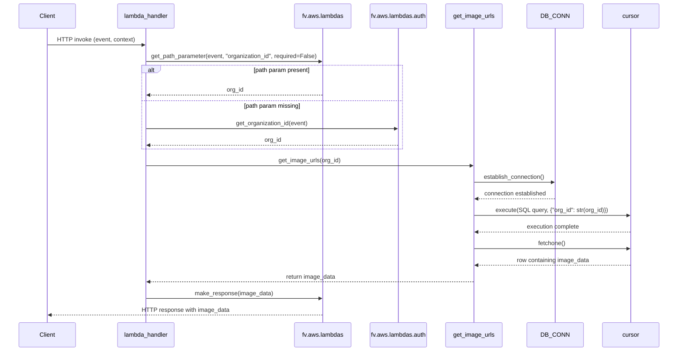

# Diagram: common/iam_service/iam_service/v1/lambdas/organizations/get_organization_images.py

> Auto-generated by Obscura crawlers

## Diagram 1

### SVG

<svg id="container" width="1593.671875" xmlns="http://www.w3.org/2000/svg" class="classDiagram" height="632" viewBox="0 0 1593.671875 632" role="graphics-document document" aria-roledescription="class"><g><defs><marker id="container_class-aggregationStart" class="marker aggregation class" refX="18" refY="7" markerWidth="190" markerHeight="240" orient="auto"><path d="M 18,7 L9,13 L1,7 L9,1 Z"></path></marker></defs><defs><marker id="container_class-aggregationEnd" class="marker aggregation class" refX="1" refY="7" markerWidth="20" markerHeight="28" orient="auto"><path d="M 18,7 L9,13 L1,7 L9,1 Z"></path></marker></defs><defs><marker id="container_class-extensionStart" class="marker extension class" refX="18" refY="7" markerWidth="190" markerHeight="240" orient="auto"><path d="M 1,7 L18,13 V 1 Z"></path></marker></defs><defs><marker id="container_class-extensionEnd" class="marker extension class" refX="1" refY="7" markerWidth="20" markerHeight="28" orient="auto"><path d="M 1,1 V 13 L18,7 Z"></path></marker></defs><defs><marker id="container_class-compositionStart" class="marker composition class" refX="18" refY="7" markerWidth="190" markerHeight="240" orient="auto"><path d="M 18,7 L9,13 L1,7 L9,1 Z"></path></marker></defs><defs><marker id="container_class-compositionEnd" class="marker composition class" refX="1" refY="7" markerWidth="20" markerHeight="28" orient="auto"><path d="M 18,7 L9,13 L1,7 L9,1 Z"></path></marker></defs><defs><marker id="container_class-dependencyStart" class="marker dependency class" refX="6" refY="7" markerWidth="190" markerHeight="240" orient="auto"><path d="M 5,7 L9,13 L1,7 L9,1 Z"></path></marker></defs><defs><marker id="container_class-dependencyEnd" class="marker dependency class" refX="13" refY="7" markerWidth="20" markerHeight="28" orient="auto"><path d="M 18,7 L9,13 L14,7 L9,1 Z"></path></marker></defs><defs><marker id="container_class-lollipopStart" class="marker lollipop class" refX="13" refY="7" markerWidth="190" markerHeight="240" orient="auto"><circle stroke="black" fill="transparent" cx="7" cy="7" r="6"></circle></marker></defs><defs><marker id="container_class-lollipopEnd" class="marker lollipop class" refX="1" refY="7" markerWidth="190" markerHeight="240" orient="auto"><circle stroke="black" fill="transparent" cx="7" cy="7" r="6"></circle></marker></defs><g class="root"><g class="clusters"></g><g class="edgePaths"><path d="M186.387,420.25L186.387,424.042C186.387,427.833,186.387,435.417,187.921,448.375C189.456,461.333,192.525,479.667,194.059,488.833L195.593,498" id="id_fv.db.FvDatabaseConnector_DB_CONN_1" class="edge-thickness-normal edge-pattern-solid relation" style=";;;" data-edge="true" data-et="edge" data-id="id_fv.db.FvDatabaseConnector_DB_CONN_1" data-points="W3sieCI6MTg2LjM4NjcxODc1LCJ5Ijo0MDN9LHsieCI6MTg2LjM4NjcxODc1LCJ5Ijo0NDN9LHsieCI6MTk1LjU5MzQ2MzMwMjc1MjMsInkiOjQ5OH1d" marker-start="url(#container_class-extensionStart)"></path><path d="M485.935,382L471.478,392.167C457.022,402.333,428.11,422.667,390.69,445.698C353.27,468.73,307.342,494.46,284.378,507.325L261.414,520.19" id="id_get_image_urls_DB_CONN_2" class="edge-thickness-normal edge-pattern-solid relation" style=";;;" data-edge="true" data-et="edge" data-id="id_get_image_urls_DB_CONN_2" data-points="W3sieCI6NDg1LjkzNDUyMzA1OTQ3NTgsInkiOjM4Mn0seyJ4IjozOTkuMTk3MjY1NjI1LCJ5Ijo0NDN9LHsieCI6MjU2LjE3OTY4NzUsInkiOjUyMy4xMjIxMTc3MTA4MzI1fV0=" marker-end="url(#container_class-dependencyEnd)"></path><path d="M594.395,382L597.442,392.167C600.489,402.333,606.582,422.667,609.629,438C612.676,453.333,612.676,463.667,612.676,468.833L612.676,474" id="id_get_image_urls_fv.secrets.SecretNames_3" class="edge-thickness-normal edge-pattern-solid relation" style=";;;" data-edge="true" data-et="edge" data-id="id_get_image_urls_fv.secrets.SecretNames_3" data-points="W3sieCI6NTk0LjM5NTM4MTgwNDQzNTUsInkiOjM4Mn0seyJ4Ijo2MTIuNjc1NzgxMjUsInkiOjQ0M30seyJ4Ijo2MTIuNjc1NzgxMjUsInkiOjQ4MH1d" marker-end="url(#container_class-dependencyEnd)"></path><path d="M882.725,158L872.202,164.167C861.678,170.333,840.631,182.667,838.774,194.456C836.916,206.245,854.249,217.49,862.915,223.112L871.581,228.734" id="id_lambda_handler_fv.aws.lambdas_4" class="edge-thickness-normal edge-pattern-solid relation" style=";;;" data-edge="true" data-et="edge" data-id="id_lambda_handler_fv.aws.lambdas_4" data-points="W3sieCI6ODgyLjcyNTQyODk4OTk1NTQsInkiOjE1OH0seyJ4Ijo4MTkuNTgzOTg0Mzc1LCJ5IjoxOTV9LHsieCI6ODc2LjYxNDk2NjYwNzg2MjksInkiOjIzMn1d" marker-end="url(#container_class-dependencyEnd)"></path><path d="M1295.117,158L1318.501,164.167C1341.885,170.333,1388.654,182.667,1412.038,198C1435.422,213.333,1435.422,231.667,1435.422,240.833L1435.422,250" id="id_lambda_handler_fv.aws.lambdas.auth_5" class="edge-thickness-normal edge-pattern-solid relation" style=";;;" data-edge="true" data-et="edge" data-id="id_lambda_handler_fv.aws.lambdas.auth_5" data-points="W3sieCI6MTI5NS4xMTY4NzM2MDQ5MTA4LCJ5IjoxNTh9LHsieCI6MTQzNS40MjE4NzUsInkiOjE5NX0seyJ4IjoxNDM1LjQyMTg3NSwieSI6MjU2fV0=" marker-end="url(#container_class-dependencyEnd)"></path><path d="M724.191,156.738L699.412,163.115C674.633,169.492,625.074,182.246,600.295,197.79C575.516,213.333,575.516,231.667,575.516,240.833L575.516,250" id="id_lambda_handler_get_image_urls_6" class="edge-thickness-normal edge-pattern-solid relation" style=";;;" data-edge="true" data-et="edge" data-id="id_lambda_handler_get_image_urls_6" data-points="W3sieCI6NzI0LjE5MTQwNjI1LCJ5IjoxNTYuNzM3NzgxNzI3MTE4NX0seyJ4Ijo1NzUuNTE1NjI1LCJ5IjoxOTV9LHsieCI6NTc1LjUxNTYyNSwieSI6MjU2fV0=" marker-end="url(#container_class-dependencyEnd)"></path><path d="M1134.565,232L1143.343,225.833C1152.122,219.667,1169.679,207.333,1169.583,195.536C1169.487,183.738,1151.737,172.476,1142.862,166.845L1133.987,161.214" id="id_fv.aws.lambdas_lambda_handler_7" class="edge-thickness-normal edge-pattern-dashed relation" style=";;;" data-edge="true" data-et="edge" data-id="id_fv.aws.lambdas_lambda_handler_7" data-points="W3sieCI6MTEzNC41NjQ1OTQ4ODQwNzI3LCJ5IjoyMzJ9LHsieCI6MTE4Ny4yMzYzMjgxMjUsInkiOjE5NX0seyJ4IjoxMTI4LjkyMTE5NDg5Mzk3MzMsInkiOjE1OH1d" marker-end="url(#container_class-dependencyEnd)"></path></g><g class="edgeLabels"><g class="edgeLabel"><g class="label" data-id="id_fv.db.FvDatabaseConnector_DB_CONN_1" transform="translate(0, 0)"><foreignObject width="0" height="0">

</foreignObject></g></g><g class="edgeLabel" transform="translate(373.94403, 457.14751)"><g class="label" data-id="id_get_image_urls_DB_CONN_2" transform="translate(-16.4921875, -12)"><foreignObject width="32.984375" height="24">

uses

</foreignObject></g></g><g class="edgeLabel" transform="translate(612.67578125, 443)"><g class="label" data-id="id_get_image_urls_fv.secrets.SecretNames_3" transform="translate(-37.828125, -12)"><foreignObject width="75.65625" height="24">

references

</foreignObject></g></g><g class="edgeLabel" transform="translate(821.82798, 193.68505)"><g class="label" data-id="id_lambda_handler_fv.aws.lambdas_4" transform="translate(-16.4921875, -12)"><foreignObject width="32.984375" height="24">

uses

</foreignObject></g></g><g class="edgeLabel" transform="translate(1435.421875, 195)"><g class="label" data-id="id_lambda_handler_fv.aws.lambdas.auth_5" transform="translate(-16.4921875, -12)"><foreignObject width="32.984375" height="24">

uses

</foreignObject></g></g><g class="edgeLabel" transform="translate(575.515625, 195)"><g class="label" data-id="id_lambda_handler_get_image_urls_6" transform="translate(-16.4453125, -12)"><foreignObject width="32.890625" height="24">

calls

</foreignObject></g></g><g class="edgeLabel" transform="translate(1185.25452, 193.74257)"><g class="label" data-id="id_fv.aws.lambdas_lambda_handler_7" transform="translate(-35.171875, -12)"><foreignObject width="70.34375" height="24">

decorator

</foreignObject></g></g></g><g class="nodes"><g class="node default" id="classId-fv.db.FvDatabaseConnector-0" transform="translate(186.38671875, 319)"><g class="basic label-container"><path d="M-178.38671875 -84 L178.38671875 -84 L178.38671875 84 L-178.38671875 84" stroke="none" stroke-width="0" fill="#ECECFF" style=""></path><path d="M-178.38671875 -84 C-62.036968855747574 -84, 54.31278103850485 -84, 178.38671875 -84 M-178.38671875 -84 C-93.202600695968 -84, -8.018482641936004 -84, 178.38671875 -84 M178.38671875 -84 C178.38671875 -24.952328106636017, 178.38671875 34.095343786727966, 178.38671875 84 M178.38671875 -84 C178.38671875 -27.78606337104005, 178.38671875 28.4278732579199, 178.38671875 84 M178.38671875 84 C68.89909940768196 84, -40.58851993463608 84, -178.38671875 84 M178.38671875 84 C100.91446639784995 84, 23.4422140456999 84, -178.38671875 84 M-178.38671875 84 C-178.38671875 19.825061856210837, -178.38671875 -44.349876287578326, -178.38671875 -84 M-178.38671875 84 C-178.38671875 26.539317535986896, -178.38671875 -30.921364928026208, -178.38671875 -84" stroke="#9370DB" stroke-width="1.3" fill="none" stroke-dasharray="0 0" style=""></path></g><g class="annotation-group text" transform="translate(0, -60)"></g><g class="label-group text" transform="translate(-99.1953125, -60)"><g class="label" style="font-weight: bolder" transform="translate(0,-12)"><foreignObject width="198.390625" height="24">

fv.db.FvDatabaseConnector

</foreignObject></g></g><g class="members-group text" transform="translate(-166.38671875, -12)"><g class="label" style="" transform="translate(0,-12)"><foreignObject width="53.71875" height="24">

+cursor

</foreignObject></g></g><g class="methods-group text" transform="translate(-166.38671875, 36)"><g class="label" style="" transform="translate(0,-12)"><foreignObject width="173.265625" height="24">

+establish_connection()

</foreignObject></g><g class="label" style="" transform="translate(0,12)"><foreignObject width="233.578125" height="24">

+<strong>init</strong>(query_name, secret_name)

</foreignObject></g></g><g class="divider" style=""><path d="M-178.38671875 -36 C-55.68292282869048 -36, 67.02087309261904 -36, 178.38671875 -36 M-178.38671875 -36 C-75.12819902837923 -36, 28.130320693241543 -36, 178.38671875 -36" stroke="#9370DB" stroke-width="1.3" fill="none" stroke-dasharray="0 0" style=""></path></g><g class="divider" style=""><path d="M-178.38671875 12 C-82.21936099987919 12, 13.947996750241629 12, 178.38671875 12 M-178.38671875 12 C-75.78380050463628 12, 26.81911774072745 12, 178.38671875 12" stroke="#9370DB" stroke-width="1.3" fill="none" stroke-dasharray="0 0" style=""></path></g></g><g class="node default" id="classId-fv.secrets.SecretNames-1" transform="translate(612.67578125, 552)"><g class="basic label-container"><path d="M-129.4375 -72 L129.4375 -72 L129.4375 72 L-129.4375 72" stroke="none" stroke-width="0" fill="#ECECFF" style=""></path><path d="M-129.4375 -72 C-61.152482850549575 -72, 7.1325342989008504 -72, 129.4375 -72 M-129.4375 -72 C-56.12196345149046 -72, 17.193573097019083 -72, 129.4375 -72 M129.4375 -72 C129.4375 -35.13882971562538, 129.4375 1.722340568749246, 129.4375 72 M129.4375 -72 C129.4375 -16.56358924110169, 129.4375 38.87282151779662, 129.4375 72 M129.4375 72 C27.89934487039278 72, -73.63881025921444 72, -129.4375 72 M129.4375 72 C57.10257124406667 72, -15.232357511866667 72, -129.4375 72 M-129.4375 72 C-129.4375 27.525512025030217, -129.4375 -16.948975949939566, -129.4375 -72 M-129.4375 72 C-129.4375 41.20090892288749, -129.4375 10.401817845774993, -129.4375 -72" stroke="#9370DB" stroke-width="1.3" fill="none" stroke-dasharray="0 0" style=""></path></g><g class="annotation-group text" transform="translate(-55.5546875, -48)"><g class="label" style="" transform="translate(0,-12)"><foreignObject width="111.109375" height="24">

«enumeration»

</foreignObject></g></g><g class="label-group text" transform="translate(-85.015625, -24)"><g class="label" style="font-weight: bolder" transform="translate(0,-12)"><foreignObject width="170.03125" height="24">

fv.secrets.SecretNames

</foreignObject></g></g><g class="members-group text" transform="translate(-117.4375, 24)"><g class="label" style="" transform="translate(0,-12)"><foreignObject width="149.859375" height="24">

DATABASE_TRACKING

</foreignObject></g></g><g class="methods-group text" transform="translate(-117.4375, 72)"></g><g class="divider" style=""><path d="M-129.4375 0 C-37.87090277076328 0, 53.69569445847344 0, 129.4375 0 M-129.4375 0 C-57.5654768237052 0, 14.306546352589606 0, 129.4375 0" stroke="#9370DB" stroke-width="1.3" fill="none" stroke-dasharray="0 0" style=""></path></g><g class="divider" style=""><path d="M-129.4375 48 C-38.11133999049453 48, 53.21482001901094 48, 129.4375 48 M-129.4375 48 C-61.11694039685018 48, 7.203619206299635 48, 129.4375 48" stroke="#9370DB" stroke-width="1.3" fill="none" stroke-dasharray="0 0" style=""></path></g></g><g class="node default" id="classId-DB_CONN-2" transform="translate(204.6328125, 552)"><g class="basic label-container"><path d="M-51.546875 -54 L51.546875 -54 L51.546875 54 L-51.546875 54" stroke="none" stroke-width="0" fill="#ECECFF" style=""></path><path d="M-51.546875 -54 C-21.243938943291315 -54, 9.05899711341737 -54, 51.546875 -54 M-51.546875 -54 C-27.441663852513575 -54, -3.336452705027149 -54, 51.546875 -54 M51.546875 -54 C51.546875 -17.253974464308115, 51.546875 19.49205107138377, 51.546875 54 M51.546875 -54 C51.546875 -18.78169865566224, 51.546875 16.43660268867552, 51.546875 54 M51.546875 54 C25.079480533252134 54, -1.3879139334957316 54, -51.546875 54 M51.546875 54 C22.98166001903411 54, -5.583554961931782 54, -51.546875 54 M-51.546875 54 C-51.546875 25.22165868432468, -51.546875 -3.5566826313506397, -51.546875 -54 M-51.546875 54 C-51.546875 22.287290872251646, -51.546875 -9.425418255496709, -51.546875 -54" stroke="#9370DB" stroke-width="1.3" fill="none" stroke-dasharray="0 0" style=""></path></g><g class="annotation-group text" transform="translate(-39.546875, -30)"><g class="label" style="" transform="translate(0,-12)"><foreignObject width="79.09375" height="24">

«instance»

</foreignObject></g></g><g class="label-group text" transform="translate(-34.40625, -6)"><g class="label" style="font-weight: bolder" transform="translate(0,-12)"><foreignObject width="68.8125" height="24">

DB_CONN

</foreignObject></g></g><g class="members-group text" transform="translate(-39.546875, 42)"></g><g class="methods-group text" transform="translate(-39.546875, 72)"></g><g class="divider" style=""><path d="M-51.546875 18 C-21.64628121419217 18, 8.254312571615657 18, 51.546875 18 M-51.546875 18 C-14.342851844842755 18, 22.86117131031449 18, 51.546875 18" stroke="#9370DB" stroke-width="1.3" fill="none" stroke-dasharray="0 0" style=""></path></g><g class="divider" style=""><path d="M-51.546875 36 C-28.415578299330218 36, -5.284281598660435 36, 51.546875 36 M-51.546875 36 C-28.349599167241752 36, -5.152323334483505 36, 51.546875 36" stroke="#9370DB" stroke-width="1.3" fill="none" stroke-dasharray="0 0" style=""></path></g></g><g class="node default" id="classId-get_image_urls-3" transform="translate(575.515625, 319)"><g class="basic label-container"><path d="M-160.7421875 -63 L160.7421875 -63 L160.7421875 63 L-160.7421875 63" stroke="none" stroke-width="0" fill="#ECECFF" style=""></path><path d="M-160.7421875 -63 C-54.33034157176043 -63, 52.081504356479144 -63, 160.7421875 -63 M-160.7421875 -63 C-42.955070214352105 -63, 74.83204707129579 -63, 160.7421875 -63 M160.7421875 -63 C160.7421875 -33.1558600304172, 160.7421875 -3.3117200608343964, 160.7421875 63 M160.7421875 -63 C160.7421875 -15.883402184286737, 160.7421875 31.233195631426526, 160.7421875 63 M160.7421875 63 C45.49609832969587 63, -69.74999084060826 63, -160.7421875 63 M160.7421875 63 C52.283906716647266 63, -56.17437406670547 63, -160.7421875 63 M-160.7421875 63 C-160.7421875 12.779977595221922, -160.7421875 -37.440044809556156, -160.7421875 -63 M-160.7421875 63 C-160.7421875 16.144861501052553, -160.7421875 -30.710276997894894, -160.7421875 -63" stroke="#9370DB" stroke-width="1.3" fill="none" stroke-dasharray="0 0" style=""></path></g><g class="annotation-group text" transform="translate(0, -39)"></g><g class="label-group text" transform="translate(-55.734375, -39)"><g class="label" style="font-weight: bolder" transform="translate(0,-12)"><foreignObject width="111.46875" height="24">

get_image_urls

</foreignObject></g></g><g class="members-group text" transform="translate(-148.7421875, 9)"></g><g class="methods-group text" transform="translate(-148.7421875, 39)"><g class="label" style="" transform="translate(0,-12)"><foreignObject width="241.75" height="24">

+get_image_urls(org_id: int) : dict

</foreignObject></g></g><g class="divider" style=""><path d="M-160.7421875 -15 C-54.2467588701431 -15, 52.248669759713806 -15, 160.7421875 -15 M-160.7421875 -15 C-40.99068592609704 -15, 78.76081564780591 -15, 160.7421875 -15" stroke="#9370DB" stroke-width="1.3" fill="none" stroke-dasharray="0 0" style=""></path></g><g class="divider" style=""><path d="M-160.7421875 9 C-63.03538289113291 9, 34.67142171773418 9, 160.7421875 9 M-160.7421875 9 C-55.05448727671097 9, 50.633212946578055 9, 160.7421875 9" stroke="#9370DB" stroke-width="1.3" fill="none" stroke-dasharray="0 0" style=""></path></g></g><g class="node default" id="classId-lambda_handler-4" transform="translate(1010.71484375, 83)"><g class="basic label-container"><path d="M-286.5234375 -75 L286.5234375 -75 L286.5234375 75 L-286.5234375 75" stroke="none" stroke-width="0" fill="#ECECFF" style=""></path><path d="M-286.5234375 -75 C-171.3093822694846 -75, -56.095327038969174 -75, 286.5234375 -75 M-286.5234375 -75 C-154.16078997275707 -75, -21.798142445514145 -75, 286.5234375 -75 M286.5234375 -75 C286.5234375 -43.13935580910643, 286.5234375 -11.278711618212867, 286.5234375 75 M286.5234375 -75 C286.5234375 -21.175263514319454, 286.5234375 32.64947297136109, 286.5234375 75 M286.5234375 75 C62.12043216661877 75, -162.28257316676246 75, -286.5234375 75 M286.5234375 75 C80.9645610105623 75, -124.59431547887539 75, -286.5234375 75 M-286.5234375 75 C-286.5234375 39.709851668960056, -286.5234375 4.419703337920112, -286.5234375 -75 M-286.5234375 75 C-286.5234375 31.713786327295836, -286.5234375 -11.572427345408329, -286.5234375 -75" stroke="#9370DB" stroke-width="1.3" fill="none" stroke-dasharray="0 0" style=""></path></g><g class="annotation-group text" transform="translate(-227.359375, -51)"><g class="label" style="" transform="translate(0,-12)"><foreignObject width="454.71875" height="24">

«decorated by fv.aws.lambdas.mandatory_lambda_handling()»

</foreignObject></g></g><g class="label-group text" transform="translate(-59.9765625, -27)"><g class="label" style="font-weight: bolder" transform="translate(0,-12)"><foreignObject width="119.953125" height="24">

lambda_handler

</foreignObject></g></g><g class="members-group text" transform="translate(-274.5234375, 21)"></g><g class="methods-group text" transform="translate(-274.5234375, 51)"><g class="label" style="" transform="translate(0,-12)"><foreignObject width="321.6875" height="24">

+lambda_handler(event, context, audit_refs)

</foreignObject></g></g><g class="divider" style=""><path d="M-286.5234375 -3 C-145.50609056969478 -3, -4.488743639389554 -3, 286.5234375 -3 M-286.5234375 -3 C-113.79974031806088 -3, 58.92395686387823 -3, 286.5234375 -3" stroke="#9370DB" stroke-width="1.3" fill="none" stroke-dasharray="0 0" style=""></path></g><g class="divider" style=""><path d="M-286.5234375 21 C-138.14126100235174 21, 10.24091549529652 21, 286.5234375 21 M-286.5234375 21 C-81.9086681240669 21, 122.70610125186619 21, 286.5234375 21" stroke="#9370DB" stroke-width="1.3" fill="none" stroke-dasharray="0 0" style=""></path></g></g><g class="node default" id="classId-fv.aws.lambdas-5" transform="translate(1010.71484375, 319)"><g class="basic label-container"><path d="M-224.45703125 -87 L224.45703125 -87 L224.45703125 87 L-224.45703125 87" stroke="none" stroke-width="0" fill="#ECECFF" style=""></path><path d="M-224.45703125 -87 C-60.20365699821838 -87, 104.04971725356324 -87, 224.45703125 -87 M-224.45703125 -87 C-88.76511556590162 -87, 46.92680011819675 -87, 224.45703125 -87 M224.45703125 -87 C224.45703125 -42.08249135200558, 224.45703125 2.835017295988834, 224.45703125 87 M224.45703125 -87 C224.45703125 -35.875445968507016, 224.45703125 15.249108062985968, 224.45703125 87 M224.45703125 87 C84.60043639154893 87, -55.25615846690215 87, -224.45703125 87 M224.45703125 87 C112.36915938639721 87, 0.2812875227944289 87, -224.45703125 87 M-224.45703125 87 C-224.45703125 43.350515421730705, -224.45703125 -0.2989691565385897, -224.45703125 -87 M-224.45703125 87 C-224.45703125 47.48459099793574, -224.45703125 7.96918199587148, -224.45703125 -87" stroke="#9370DB" stroke-width="1.3" fill="none" stroke-dasharray="0 0" style=""></path></g><g class="annotation-group text" transform="translate(0, -63)"></g><g class="label-group text" transform="translate(-55.8984375, -63)"><g class="label" style="font-weight: bolder" transform="translate(0,-12)"><foreignObject width="111.796875" height="24">

fv.aws.lambdas

</foreignObject></g></g><g class="members-group text" transform="translate(-212.45703125, -15)"></g><g class="methods-group text" transform="translate(-212.45703125, 15)"><g class="label" style="" transform="translate(0,-12)"><foreignObject width="232.078125" height="24">

+mandatory_lambda_handling()

</foreignObject></g><g class="label" style="" transform="translate(0,12)"><foreignObject width="369.015625" height="24">

+get_path_parameter(event, name, required=False)

</foreignObject></g><g class="label" style="" transform="translate(0,36)"><foreignObject width="168.140625" height="24">

+make_response(body)

</foreignObject></g></g><g class="divider" style=""><path d="M-224.45703125 -39 C-106.67748875657715 -39, 11.102053736845704 -39, 224.45703125 -39 M-224.45703125 -39 C-76.76400775685246 -39, 70.92901573629507 -39, 224.45703125 -39" stroke="#9370DB" stroke-width="1.3" fill="none" stroke-dasharray="0 0" style=""></path></g><g class="divider" style=""><path d="M-224.45703125 -15 C-58.584360047304045 -15, 107.28831115539191 -15, 224.45703125 -15 M-224.45703125 -15 C-80.89235895836032 -15, 62.67231333327936 -15, 224.45703125 -15" stroke="#9370DB" stroke-width="1.3" fill="none" stroke-dasharray="0 0" style=""></path></g></g><g class="node default" id="classId-fv.aws.lambdas.auth-6" transform="translate(1435.421875, 319)"><g class="basic label-container"><path d="M-150.25 -63 L150.25 -63 L150.25 63 L-150.25 63" stroke="none" stroke-width="0" fill="#ECECFF" style=""></path><path d="M-150.25 -63 C-67.44119535908688 -63, 15.367609281826248 -63, 150.25 -63 M-150.25 -63 C-63.353691295218695 -63, 23.54261740956261 -63, 150.25 -63 M150.25 -63 C150.25 -32.893252674223056, 150.25 -2.786505348446113, 150.25 63 M150.25 -63 C150.25 -12.714393092131708, 150.25 37.571213815736584, 150.25 63 M150.25 63 C86.92664354939592 63, 23.603287098791853 63, -150.25 63 M150.25 63 C36.487046903553264 63, -77.27590619289347 63, -150.25 63 M-150.25 63 C-150.25 26.253240066065594, -150.25 -10.493519867868812, -150.25 -63 M-150.25 63 C-150.25 25.472432648071432, -150.25 -12.055134703857135, -150.25 -63" stroke="#9370DB" stroke-width="1.3" fill="none" stroke-dasharray="0 0" style=""></path></g><g class="annotation-group text" transform="translate(0, -39)"></g><g class="label-group text" transform="translate(-74.484375, -39)"><g class="label" style="font-weight: bolder" transform="translate(0,-12)"><foreignObject width="148.96875" height="24">

fv.aws.lambdas.auth

</foreignObject></g></g><g class="members-group text" transform="translate(-138.25, 9)"></g><g class="methods-group text" transform="translate(-138.25, 39)"><g class="label" style="" transform="translate(0,-12)"><foreignObject width="202.015625" height="24">

+get_organization_id(event)

</foreignObject></g></g><g class="divider" style=""><path d="M-150.25 -15 C-30.90367371225439 -15, 88.44265257549122 -15, 150.25 -15 M-150.25 -15 C-64.4670826298647 -15, 21.31583474027059 -15, 150.25 -15" stroke="#9370DB" stroke-width="1.3" fill="none" stroke-dasharray="0 0" style=""></path></g><g class="divider" style=""><path d="M-150.25 9 C-53.026437582756756 9, 44.19712483448649 9, 150.25 9 M-150.25 9 C-61.31265192548955 9, 27.624696149020906 9, 150.25 9" stroke="#9370DB" stroke-width="1.3" fill="none" stroke-dasharray="0 0" style=""></path></g></g></g></g></g></svg>

## Diagram 2

### SVG

<svg id="container" width="1895" xmlns="http://www.w3.org/2000/svg" height="991" viewBox="-50 -10 1895 991" role="graphics-document document" aria-roledescription="sequence"><g><rect x="1645" y="905" fill="#eaeaea" stroke="#666" width="150" height="65" name="Cursor" rx="3" ry="3" class="actor actor-bottom"></rect><text x="1720" y="937.5" dominant-baseline="central" alignment-baseline="central" class="actor actor-box" style="text-anchor: middle; font-size: 16px; font-weight: 400;"><tspan x="1720" dy="0">cursor</tspan></text></g><g><rect x="1445" y="905" fill="#eaeaea" stroke="#666" width="150" height="65" name="DBConn" rx="3" ry="3" class="actor actor-bottom"></rect><text x="1520" y="937.5" dominant-baseline="central" alignment-baseline="central" class="actor actor-box" style="text-anchor: middle; font-size: 16px; font-weight: 400;"><tspan x="1520" dy="0">DB_CONN</tspan></text></g><g><rect x="1206" y="905" fill="#eaeaea" stroke="#666" width="150" height="65" name="App" rx="3" ry="3" class="actor actor-bottom"></rect><text x="1281" y="937.5" dominant-baseline="central" alignment-baseline="central" class="actor actor-box" style="text-anchor: middle; font-size: 16px; font-weight: 400;"><tspan x="1281" dy="0">get_image_urls</tspan></text></g><g><rect x="989" y="905" fill="#eaeaea" stroke="#666" width="167" height="65" name="Auth" rx="3" ry="3" class="actor actor-bottom"></rect><text x="1072.5" y="937.5" dominant-baseline="central" alignment-baseline="central" class="actor actor-box" style="text-anchor: middle; font-size: 16px; font-weight: 400;"><tspan x="1072.5" dy="0">fv.aws.lambdas.auth</tspan></text></g><g><rect x="789" y="905" fill="#eaeaea" stroke="#666" width="150" height="65" name="AWS" rx="3" ry="3" class="actor actor-bottom"></rect><text x="864" y="937.5" dominant-baseline="central" alignment-baseline="central" class="actor actor-box" style="text-anchor: middle; font-size: 16px; font-weight: 400;"><tspan x="864" dy="0">fv.aws.lambdas</tspan></text></g><g><rect x="275" y="905" fill="#eaeaea" stroke="#666" width="150" height="65" name="Lambda" rx="3" ry="3" class="actor actor-bottom"></rect><text x="350" y="937.5" dominant-baseline="central" alignment-baseline="central" class="actor actor-box" style="text-anchor: middle; font-size: 16px; font-weight: 400;"><tspan x="350" dy="0">lambda_handler</tspan></text></g><g><rect x="0" y="905" fill="#eaeaea" stroke="#666" width="150" height="65" name="Client" rx="3" ry="3" class="actor actor-bottom"></rect><text x="75" y="937.5" dominant-baseline="central" alignment-baseline="central" class="actor actor-box" style="text-anchor: middle; font-size: 16px; font-weight: 400;"><tspan x="75" dy="0">Client</tspan></text></g><g><line id="actor6" x1="1720" y1="65" x2="1720" y2="905" class="actor-line 200" stroke-width="0.5px" stroke="#999" name="Cursor"></line><g id="root-6"><rect x="1645" y="0" fill="#eaeaea" stroke="#666" width="150" height="65" name="Cursor" rx="3" ry="3" class="actor actor-top"></rect><text x="1720" y="32.5" dominant-baseline="central" alignment-baseline="central" class="actor actor-box" style="text-anchor: middle; font-size: 16px; font-weight: 400;"><tspan x="1720" dy="0">cursor</tspan></text></g></g><g><line id="actor5" x1="1520" y1="65" x2="1520" y2="905" class="actor-line 200" stroke-width="0.5px" stroke="#999" name="DBConn"></line><g id="root-5"><rect x="1445" y="0" fill="#eaeaea" stroke="#666" width="150" height="65" name="DBConn" rx="3" ry="3" class="actor actor-top"></rect><text x="1520" y="32.5" dominant-baseline="central" alignment-baseline="central" class="actor actor-box" style="text-anchor: middle; font-size: 16px; font-weight: 400;"><tspan x="1520" dy="0">DB_CONN</tspan></text></g></g><g><line id="actor4" x1="1281" y1="65" x2="1281" y2="905" class="actor-line 200" stroke-width="0.5px" stroke="#999" name="App"></line><g id="root-4"><rect x="1206" y="0" fill="#eaeaea" stroke="#666" width="150" height="65" name="App" rx="3" ry="3" class="actor actor-top"></rect><text x="1281" y="32.5" dominant-baseline="central" alignment-baseline="central" class="actor actor-box" style="text-anchor: middle; font-size: 16px; font-weight: 400;"><tspan x="1281" dy="0">get_image_urls</tspan></text></g></g><g><line id="actor3" x1="1072.5" y1="65" x2="1072.5" y2="905" class="actor-line 200" stroke-width="0.5px" stroke="#999" name="Auth"></line><g id="root-3"><rect x="989" y="0" fill="#eaeaea" stroke="#666" width="167" height="65" name="Auth" rx="3" ry="3" class="actor actor-top"></rect><text x="1072.5" y="32.5" dominant-baseline="central" alignment-baseline="central" class="actor actor-box" style="text-anchor: middle; font-size: 16px; font-weight: 400;"><tspan x="1072.5" dy="0">fv.aws.lambdas.auth</tspan></text></g></g><g><line id="actor2" x1="864" y1="65" x2="864" y2="905" class="actor-line 200" stroke-width="0.5px" stroke="#999" name="AWS"></line><g id="root-2"><rect x="789" y="0" fill="#eaeaea" stroke="#666" width="150" height="65" name="AWS" rx="3" ry="3" class="actor actor-top"></rect><text x="864" y="32.5" dominant-baseline="central" alignment-baseline="central" class="actor actor-box" style="text-anchor: middle; font-size: 16px; font-weight: 400;"><tspan x="864" dy="0">fv.aws.lambdas</tspan></text></g></g><g><line id="actor1" x1="350" y1="65" x2="350" y2="905" class="actor-line 200" stroke-width="0.5px" stroke="#999" name="Lambda"></line><g id="root-1"><rect x="275" y="0" fill="#eaeaea" stroke="#666" width="150" height="65" name="Lambda" rx="3" ry="3" class="actor actor-top"></rect><text x="350" y="32.5" dominant-baseline="central" alignment-baseline="central" class="actor actor-box" style="text-anchor: middle; font-size: 16px; font-weight: 400;"><tspan x="350" dy="0">lambda_handler</tspan></text></g></g><g><line id="actor0" x1="75" y1="65" x2="75" y2="905" class="actor-line 200" stroke-width="0.5px" stroke="#999" name="Client"></line><g id="root-0"><rect x="0" y="0" fill="#eaeaea" stroke="#666" width="150" height="65" name="Client" rx="3" ry="3" class="actor actor-top"></rect><text x="75" y="32.5" dominant-baseline="central" alignment-baseline="central" class="actor actor-box" style="text-anchor: middle; font-size: 16px; font-weight: 400;"><tspan x="75" dy="0">Client</tspan></text></g></g><g></g><defs><symbol id="computer" width="24" height="24"><path transform="scale(.5)" d="M2 2v13h20v-13h-20zm18 11h-16v-9h16v9zm-10.228 6l.466-1h3.524l.467 1h-4.457zm14.228 3h-24l2-6h2.104l-1.33 4h18.45l-1.297-4h2.073l2 6zm-5-10h-14v-7h14v7z"></path></symbol></defs><defs><symbol id="database" fill-rule="evenodd" clip-rule="evenodd"><path transform="scale(.5)" d="M12.258.001l.256.004.255.005.253.008.251.01.249.012.247.015.246.016.242.019.241.02.239.023.236.024.233.027.231.028.229.031.225.032.223.034.22.036.217.038.214.04.211.041.208.043.205.045.201.046.198.048.194.05.191.051.187.053.183.054.18.056.175.057.172.059.168.06.163.061.16.063.155.064.15.066.074.033.073.033.071.034.07.034.069.035.068.035.067.035.066.035.064.036.064.036.062.036.06.036.06.037.058.037.058.037.055.038.055.038.053.038.052.038.051.039.05.039.048.039.047.039.045.04.044.04.043.04.041.04.04.041.039.041.037.041.036.041.034.041.033.042.032.042.03.042.029.042.027.042.026.043.024.043.023.043.021.043.02.043.018.044.017.043.015.044.013.044.012.044.011.045.009.044.007.045.006.045.004.045.002.045.001.045v17l-.001.045-.002.045-.004.045-.006.045-.007.045-.009.044-.011.045-.012.044-.013.044-.015.044-.017.043-.018.044-.02.043-.021.043-.023.043-.024.043-.026.043-.027.042-.029.042-.03.042-.032.042-.033.042-.034.041-.036.041-.037.041-.039.041-.04.041-.041.04-.043.04-.044.04-.045.04-.047.039-.048.039-.05.039-.051.039-.052.038-.053.038-.055.038-.055.038-.058.037-.058.037-.06.037-.06.036-.062.036-.064.036-.064.036-.066.035-.067.035-.068.035-.069.035-.07.034-.071.034-.073.033-.074.033-.15.066-.155.064-.16.063-.163.061-.168.06-.172.059-.175.057-.18.056-.183.054-.187.053-.191.051-.194.05-.198.048-.201.046-.205.045-.208.043-.211.041-.214.04-.217.038-.22.036-.223.034-.225.032-.229.031-.231.028-.233.027-.236.024-.239.023-.241.02-.242.019-.246.016-.247.015-.249.012-.251.01-.253.008-.255.005-.256.004-.258.001-.258-.001-.256-.004-.255-.005-.253-.008-.251-.01-.249-.012-.247-.015-.245-.016-.243-.019-.241-.02-.238-.023-.236-.024-.234-.027-.231-.028-.228-.031-.226-.032-.223-.034-.22-.036-.217-.038-.214-.04-.211-.041-.208-.043-.204-.045-.201-.046-.198-.048-.195-.05-.19-.051-.187-.053-.184-.054-.179-.056-.176-.057-.172-.059-.167-.06-.164-.061-.159-.063-.155-.064-.151-.066-.074-.033-.072-.033-.072-.034-.07-.034-.069-.035-.068-.035-.067-.035-.066-.035-.064-.036-.063-.036-.062-.036-.061-.036-.06-.037-.058-.037-.057-.037-.056-.038-.055-.038-.053-.038-.052-.038-.051-.039-.049-.039-.049-.039-.046-.039-.046-.04-.044-.04-.043-.04-.041-.04-.04-.041-.039-.041-.037-.041-.036-.041-.034-.041-.033-.042-.032-.042-.03-.042-.029-.042-.027-.042-.026-.043-.024-.043-.023-.043-.021-.043-.02-.043-.018-.044-.017-.043-.015-.044-.013-.044-.012-.044-.011-.045-.009-.044-.007-.045-.006-.045-.004-.045-.002-.045-.001-.045v-17l.001-.045.002-.045.004-.045.006-.045.007-.045.009-.044.011-.045.012-.044.013-.044.015-.044.017-.043.018-.044.02-.043.021-.043.023-.043.024-.043.026-.043.027-.042.029-.042.03-.042.032-.042.033-.042.034-.041.036-.041.037-.041.039-.041.04-.041.041-.04.043-.04.044-.04.046-.04.046-.039.049-.039.049-.039.051-.039.052-.038.053-.038.055-.038.056-.038.057-.037.058-.037.06-.037.061-.036.062-.036.063-.036.064-.036.066-.035.067-.035.068-.035.069-.035.07-.034.072-.034.072-.033.074-.033.151-.066.155-.064.159-.063.164-.061.167-.06.172-.059.176-.057.179-.056.184-.054.187-.053.19-.051.195-.05.198-.048.201-.046.204-.045.208-.043.211-.041.214-.04.217-.038.22-.036.223-.034.226-.032.228-.031.231-.028.234-.027.236-.024.238-.023.241-.02.243-.019.245-.016.247-.015.249-.012.251-.01.253-.008.255-.005.256-.004.258-.001.258.001zm-9.258 20.499v.01l.001.021.003.021.004.022.005.021.006.022.007.022.009.023.01.022.011.023.012.023.013.023.015.023.016.024.017.023.018.024.019.024.021.024.022.025.023.024.024.025.052.049.056.05.061.051.066.051.07.051.075.051.079.052.084.052.088.052.092.052.097.052.102.051.105.052.11.052.114.051.119.051.123.051.127.05.131.05.135.05.139.048.144.049.147.047.152.047.155.047.16.045.163.045.167.043.171.043.176.041.178.041.183.039.187.039.19.037.194.035.197.035.202.033.204.031.209.03.212.029.216.027.219.025.222.024.226.021.23.02.233.018.236.016.24.015.243.012.246.01.249.008.253.005.256.004.259.001.26-.001.257-.004.254-.005.25-.008.247-.011.244-.012.241-.014.237-.016.233-.018.231-.021.226-.021.224-.024.22-.026.216-.027.212-.028.21-.031.205-.031.202-.034.198-.034.194-.036.191-.037.187-.039.183-.04.179-.04.175-.042.172-.043.168-.044.163-.045.16-.046.155-.046.152-.047.148-.048.143-.049.139-.049.136-.05.131-.05.126-.05.123-.051.118-.052.114-.051.11-.052.106-.052.101-.052.096-.052.092-.052.088-.053.083-.051.079-.052.074-.052.07-.051.065-.051.06-.051.056-.05.051-.05.023-.024.023-.025.021-.024.02-.024.019-.024.018-.024.017-.024.015-.023.014-.024.013-.023.012-.023.01-.023.01-.022.008-.022.006-.022.006-.022.004-.022.004-.021.001-.021.001-.021v-4.127l-.077.055-.08.053-.083.054-.085.053-.087.052-.09.052-.093.051-.095.05-.097.05-.1.049-.102.049-.105.048-.106.047-.109.047-.111.046-.114.045-.115.045-.118.044-.12.043-.122.042-.124.042-.126.041-.128.04-.13.04-.132.038-.134.038-.135.037-.138.037-.139.035-.142.035-.143.034-.144.033-.147.032-.148.031-.15.03-.151.03-.153.029-.154.027-.156.027-.158.026-.159.025-.161.024-.162.023-.163.022-.165.021-.166.02-.167.019-.169.018-.169.017-.171.016-.173.015-.173.014-.175.013-.175.012-.177.011-.178.01-.179.008-.179.008-.181.006-.182.005-.182.004-.184.003-.184.002h-.37l-.184-.002-.184-.003-.182-.004-.182-.005-.181-.006-.179-.008-.179-.008-.178-.01-.176-.011-.176-.012-.175-.013-.173-.014-.172-.015-.171-.016-.17-.017-.169-.018-.167-.019-.166-.02-.165-.021-.163-.022-.162-.023-.161-.024-.159-.025-.157-.026-.156-.027-.155-.027-.153-.029-.151-.03-.15-.03-.148-.031-.146-.032-.145-.033-.143-.034-.141-.035-.14-.035-.137-.037-.136-.037-.134-.038-.132-.038-.13-.04-.128-.04-.126-.041-.124-.042-.122-.042-.12-.044-.117-.043-.116-.045-.113-.045-.112-.046-.109-.047-.106-.047-.105-.048-.102-.049-.1-.049-.097-.05-.095-.05-.093-.052-.09-.051-.087-.052-.085-.053-.083-.054-.08-.054-.077-.054v4.127zm0-5.654v.011l.001.021.003.021.004.021.005.022.006.022.007.022.009.022.01.022.011.023.012.023.013.023.015.024.016.023.017.024.018.024.019.024.021.024.022.024.023.025.024.024.052.05.056.05.061.05.066.051.07.051.075.052.079.051.084.052.088.052.092.052.097.052.102.052.105.052.11.051.114.051.119.052.123.05.127.051.131.05.135.049.139.049.144.048.147.048.152.047.155.046.16.045.163.045.167.044.171.042.176.042.178.04.183.04.187.038.19.037.194.036.197.034.202.033.204.032.209.03.212.028.216.027.219.025.222.024.226.022.23.02.233.018.236.016.24.014.243.012.246.01.249.008.253.006.256.003.259.001.26-.001.257-.003.254-.006.25-.008.247-.01.244-.012.241-.015.237-.016.233-.018.231-.02.226-.022.224-.024.22-.025.216-.027.212-.029.21-.03.205-.032.202-.033.198-.035.194-.036.191-.037.187-.039.183-.039.179-.041.175-.042.172-.043.168-.044.163-.045.16-.045.155-.047.152-.047.148-.048.143-.048.139-.05.136-.049.131-.05.126-.051.123-.051.118-.051.114-.052.11-.052.106-.052.101-.052.096-.052.092-.052.088-.052.083-.052.079-.052.074-.051.07-.052.065-.051.06-.05.056-.051.051-.049.023-.025.023-.024.021-.025.02-.024.019-.024.018-.024.017-.024.015-.023.014-.023.013-.024.012-.022.01-.023.01-.023.008-.022.006-.022.006-.022.004-.021.004-.022.001-.021.001-.021v-4.139l-.077.054-.08.054-.083.054-.085.052-.087.053-.09.051-.093.051-.095.051-.097.05-.1.049-.102.049-.105.048-.106.047-.109.047-.111.046-.114.045-.115.044-.118.044-.12.044-.122.042-.124.042-.126.041-.128.04-.13.039-.132.039-.134.038-.135.037-.138.036-.139.036-.142.035-.143.033-.144.033-.147.033-.148.031-.15.03-.151.03-.153.028-.154.028-.156.027-.158.026-.159.025-.161.024-.162.023-.163.022-.165.021-.166.02-.167.019-.169.018-.169.017-.171.016-.173.015-.173.014-.175.013-.175.012-.177.011-.178.009-.179.009-.179.007-.181.007-.182.005-.182.004-.184.003-.184.002h-.37l-.184-.002-.184-.003-.182-.004-.182-.005-.181-.007-.179-.007-.179-.009-.178-.009-.176-.011-.176-.012-.175-.013-.173-.014-.172-.015-.171-.016-.17-.017-.169-.018-.167-.019-.166-.02-.165-.021-.163-.022-.162-.023-.161-.024-.159-.025-.157-.026-.156-.027-.155-.028-.153-.028-.151-.03-.15-.03-.148-.031-.146-.033-.145-.033-.143-.033-.141-.035-.14-.036-.137-.036-.136-.037-.134-.038-.132-.039-.13-.039-.128-.04-.126-.041-.124-.042-.122-.043-.12-.043-.117-.044-.116-.044-.113-.046-.112-.046-.109-.046-.106-.047-.105-.048-.102-.049-.1-.049-.097-.05-.095-.051-.093-.051-.09-.051-.087-.053-.085-.052-.083-.054-.08-.054-.077-.054v4.139zm0-5.666v.011l.001.02.003.022.004.021.005.022.006.021.007.022.009.023.01.022.011.023.012.023.013.023.015.023.016.024.017.024.018.023.019.024.021.025.022.024.023.024.024.025.052.05.056.05.061.05.066.051.07.051.075.052.079.051.084.052.088.052.092.052.097.052.102.052.105.051.11.052.114.051.119.051.123.051.127.05.131.05.135.05.139.049.144.048.147.048.152.047.155.046.16.045.163.045.167.043.171.043.176.042.178.04.183.04.187.038.19.037.194.036.197.034.202.033.204.032.209.03.212.028.216.027.219.025.222.024.226.021.23.02.233.018.236.017.24.014.243.012.246.01.249.008.253.006.256.003.259.001.26-.001.257-.003.254-.006.25-.008.247-.01.244-.013.241-.014.237-.016.233-.018.231-.02.226-.022.224-.024.22-.025.216-.027.212-.029.21-.03.205-.032.202-.033.198-.035.194-.036.191-.037.187-.039.183-.039.179-.041.175-.042.172-.043.168-.044.163-.045.16-.045.155-.047.152-.047.148-.048.143-.049.139-.049.136-.049.131-.051.126-.05.123-.051.118-.052.114-.051.11-.052.106-.052.101-.052.096-.052.092-.052.088-.052.083-.052.079-.052.074-.052.07-.051.065-.051.06-.051.056-.05.051-.049.023-.025.023-.025.021-.024.02-.024.019-.024.018-.024.017-.024.015-.023.014-.024.013-.023.012-.023.01-.022.01-.023.008-.022.006-.022.006-.022.004-.022.004-.021.001-.021.001-.021v-4.153l-.077.054-.08.054-.083.053-.085.053-.087.053-.09.051-.093.051-.095.051-.097.05-.1.049-.102.048-.105.048-.106.048-.109.046-.111.046-.114.046-.115.044-.118.044-.12.043-.122.043-.124.042-.126.041-.128.04-.13.039-.132.039-.134.038-.135.037-.138.036-.139.036-.142.034-.143.034-.144.033-.147.032-.148.032-.15.03-.151.03-.153.028-.154.028-.156.027-.158.026-.159.024-.161.024-.162.023-.163.023-.165.021-.166.02-.167.019-.169.018-.169.017-.171.016-.173.015-.173.014-.175.013-.175.012-.177.01-.178.01-.179.009-.179.007-.181.006-.182.006-.182.004-.184.003-.184.001-.185.001-.185-.001-.184-.001-.184-.003-.182-.004-.182-.006-.181-.006-.179-.007-.179-.009-.178-.01-.176-.01-.176-.012-.175-.013-.173-.014-.172-.015-.171-.016-.17-.017-.169-.018-.167-.019-.166-.02-.165-.021-.163-.023-.162-.023-.161-.024-.159-.024-.157-.026-.156-.027-.155-.028-.153-.028-.151-.03-.15-.03-.148-.032-.146-.032-.145-.033-.143-.034-.141-.034-.14-.036-.137-.036-.136-.037-.134-.038-.132-.039-.13-.039-.128-.041-.126-.041-.124-.041-.122-.043-.12-.043-.117-.044-.116-.044-.113-.046-.112-.046-.109-.046-.106-.048-.105-.048-.102-.048-.1-.05-.097-.049-.095-.051-.093-.051-.09-.052-.087-.052-.085-.053-.083-.053-.08-.054-.077-.054v4.153zm8.74-8.179l-.257.004-.254.005-.25.008-.247.011-.244.012-.241.014-.237.016-.233.018-.231.021-.226.022-.224.023-.22.026-.216.027-.212.028-.21.031-.205.032-.202.033-.198.034-.194.036-.191.038-.187.038-.183.04-.179.041-.175.042-.172.043-.168.043-.163.045-.16.046-.155.046-.152.048-.148.048-.143.048-.139.049-.136.05-.131.05-.126.051-.123.051-.118.051-.114.052-.11.052-.106.052-.101.052-.096.052-.092.052-.088.052-.083.052-.079.052-.074.051-.07.052-.065.051-.06.05-.056.05-.051.05-.023.025-.023.024-.021.024-.02.025-.019.024-.018.024-.017.023-.015.024-.014.023-.013.023-.012.023-.01.023-.01.022-.008.022-.006.023-.006.021-.004.022-.004.021-.001.021-.001.021.001.021.001.021.004.021.004.022.006.021.006.023.008.022.01.022.01.023.012.023.013.023.014.023.015.024.017.023.018.024.019.024.02.025.021.024.023.024.023.025.051.05.056.05.06.05.065.051.07.052.074.051.079.052.083.052.088.052.092.052.096.052.101.052.106.052.11.052.114.052.118.051.123.051.126.051.131.05.136.05.139.049.143.048.148.048.152.048.155.046.16.046.163.045.168.043.172.043.175.042.179.041.183.04.187.038.191.038.194.036.198.034.202.033.205.032.21.031.212.028.216.027.22.026.224.023.226.022.231.021.233.018.237.016.241.014.244.012.247.011.25.008.254.005.257.004.26.001.26-.001.257-.004.254-.005.25-.008.247-.011.244-.012.241-.014.237-.016.233-.018.231-.021.226-.022.224-.023.22-.026.216-.027.212-.028.21-.031.205-.032.202-.033.198-.034.194-.036.191-.038.187-.038.183-.04.179-.041.175-.042.172-.043.168-.043.163-.045.16-.046.155-.046.152-.048.148-.048.143-.048.139-.049.136-.05.131-.05.126-.051.123-.051.118-.051.114-.052.11-.052.106-.052.101-.052.096-.052.092-.052.088-.052.083-.052.079-.052.074-.051.07-.052.065-.051.06-.05.056-.05.051-.05.023-.025.023-.024.021-.024.02-.025.019-.024.018-.024.017-.023.015-.024.014-.023.013-.023.012-.023.01-.023.01-.022.008-.022.006-.023.006-.021.004-.022.004-.021.001-.021.001-.021-.001-.021-.001-.021-.004-.021-.004-.022-.006-.021-.006-.023-.008-.022-.01-.022-.01-.023-.012-.023-.013-.023-.014-.023-.015-.024-.017-.023-.018-.024-.019-.024-.02-.025-.021-.024-.023-.024-.023-.025-.051-.05-.056-.05-.06-.05-.065-.051-.07-.052-.074-.051-.079-.052-.083-.052-.088-.052-.092-.052-.096-.052-.101-.052-.106-.052-.11-.052-.114-.052-.118-.051-.123-.051-.126-.051-.131-.05-.136-.05-.139-.049-.143-.048-.148-.048-.152-.048-.155-.046-.16-.046-.163-.045-.168-.043-.172-.043-.175-.042-.179-.041-.183-.04-.187-.038-.191-.038-.194-.036-.198-.034-.202-.033-.205-.032-.21-.031-.212-.028-.216-.027-.22-.026-.224-.023-.226-.022-.231-.021-.233-.018-.237-.016-.241-.014-.244-.012-.247-.011-.25-.008-.254-.005-.257-.004-.26-.001-.26.001z"></path></symbol></defs><defs><symbol id="clock" width="24" height="24"><path transform="scale(.5)" d="M12 2c5.514 0 10 4.486 10 10s-4.486 10-10 10-10-4.486-10-10 4.486-10 10-10zm0-2c-6.627 0-12 5.373-12 12s5.373 12 12 12 12-5.373 12-12-5.373-12-12-12zm5.848 12.459c.202.038.202.333.001.372-1.907.361-6.045 1.111-6.547 1.111-.719 0-1.301-.582-1.301-1.301 0-.512.77-5.447 1.125-7.445.034-.192.312-.181.343.014l.985 6.238 5.394 1.011z"></path></symbol></defs><defs><marker id="arrowhead" refX="7.9" refY="5" markerUnits="userSpaceOnUse" markerWidth="12" markerHeight="12" orient="auto-start-reverse"><path d="M -1 0 L 10 5 L 0 10 z"></path></marker></defs><defs><marker id="crosshead" markerWidth="15" markerHeight="8" orient="auto" refX="4" refY="4.5"><path fill="none" stroke="#000000" stroke-width="1pt" d="M 1,2 L 6,7 M 6,2 L 1,7" style="stroke-dasharray: 0, 0;"></path></marker></defs><defs><marker id="filled-head" refX="15.5" refY="7" markerWidth="20" markerHeight="28" orient="auto"><path d="M 18,7 L9,13 L14,7 L9,1 Z"></path></marker></defs><defs><marker id="sequencenumber" refX="15" refY="15" markerWidth="60" markerHeight="40" orient="auto"><circle cx="15" cy="15" r="6"></circle></marker></defs><g><line x1="339" y1="171" x2="1083.5" y2="171" class="loopLine"></line><line x1="1083.5" y1="171" x2="1083.5" y2="405" class="loopLine"></line><line x1="339" y1="405" x2="1083.5" y2="405" class="loopLine"></line><line x1="339" y1="171" x2="339" y2="405" class="loopLine"></line><line x1="339" y1="269" x2="1083.5" y2="269" class="loopLine" style="stroke-dasharray: 3, 3;"></line><polygon points="339,171 389,171 389,184 380.6,191 339,191" class="labelBox"></polygon><text x="364" y="184" text-anchor="middle" dominant-baseline="middle" alignment-baseline="middle" class="labelText" style="font-size: 16px; font-weight: 400;">alt</text><text x="736.25" y="189" text-anchor="middle" class="loopText" style="font-size: 16px; font-weight: 400;"><tspan x="736.25">[path param present]</tspan></text><text x="711.25" y="287" text-anchor="middle" class="loopText" style="font-size: 16px; font-weight: 400;">[path param missing]</text></g><text x="211" y="80" text-anchor="middle" dominant-baseline="middle" alignment-baseline="middle" class="messageText" dy="1em" style="font-size: 16px; font-weight: 400;">HTTP invoke (event, context)</text><line x1="76" y1="113" x2="346" y2="113" class="messageLine0" stroke-width="2" stroke="none" marker-end="url(#arrowhead)" style="fill: none;"></line><text x="606" y="128" text-anchor="middle" dominant-baseline="middle" alignment-baseline="middle" class="messageText" dy="1em" style="font-size: 16px; font-weight: 400;">get_path_parameter(event, "organization_id", required=False)</text><line x1="351" y1="161" x2="860" y2="161" class="messageLine0" stroke-width="2" stroke="none" marker-end="url(#arrowhead)" style="fill: none;"></line><text x="609" y="221" text-anchor="middle" dominant-baseline="middle" alignment-baseline="middle" class="messageText" dy="1em" style="font-size: 16px; font-weight: 400;">org_id</text><line x1="863" y1="254" x2="354" y2="254" class="messageLine1" stroke-width="2" stroke="none" marker-end="url(#arrowhead)" style="stroke-dasharray: 3, 3; fill: none;"></line><text x="710" y="314" text-anchor="middle" dominant-baseline="middle" alignment-baseline="middle" class="messageText" dy="1em" style="font-size: 16px; font-weight: 400;">get_organization_id(event)</text><line x1="351" y1="347" x2="1068.5" y2="347" class="messageLine0" stroke-width="2" stroke="none" marker-end="url(#arrowhead)" style="fill: none;"></line><text x="713" y="362" text-anchor="middle" dominant-baseline="middle" alignment-baseline="middle" class="messageText" dy="1em" style="font-size: 16px; font-weight: 400;">org_id</text><line x1="1071.5" y1="395" x2="354" y2="395" class="messageLine1" stroke-width="2" stroke="none" marker-end="url(#arrowhead)" style="stroke-dasharray: 3, 3; fill: none;"></line><text x="814" y="420" text-anchor="middle" dominant-baseline="middle" alignment-baseline="middle" class="messageText" dy="1em" style="font-size: 16px; font-weight: 400;">get_image_urls(org_id)</text><line x1="351" y1="453" x2="1277" y2="453" class="messageLine0" stroke-width="2" stroke="none" marker-end="url(#arrowhead)" style="fill: none;"></line><text x="1399" y="468" text-anchor="middle" dominant-baseline="middle" alignment-baseline="middle" class="messageText" dy="1em" style="font-size: 16px; font-weight: 400;">establish_connection()</text><line x1="1282" y1="501" x2="1516" y2="501" class="messageLine0" stroke-width="2" stroke="none" marker-end="url(#arrowhead)" style="fill: none;"></line><text x="1402" y="516" text-anchor="middle" dominant-baseline="middle" alignment-baseline="middle" class="messageText" dy="1em" style="font-size: 16px; font-weight: 400;">connection established</text><line x1="1519" y1="549" x2="1285" y2="549" class="messageLine1" stroke-width="2" stroke="none" marker-end="url(#arrowhead)" style="stroke-dasharray: 3, 3; fill: none;"></line><text x="1499" y="564" text-anchor="middle" dominant-baseline="middle" alignment-baseline="middle" class="messageText" dy="1em" style="font-size: 16px; font-weight: 400;">execute(SQL query, {"org_id": str(org_id)})</text><line x1="1282" y1="597" x2="1716" y2="597" class="messageLine0" stroke-width="2" stroke="none" marker-end="url(#arrowhead)" style="fill: none;"></line><text x="1502" y="612" text-anchor="middle" dominant-baseline="middle" alignment-baseline="middle" class="messageText" dy="1em" style="font-size: 16px; font-weight: 400;">execution complete</text><line x1="1719" y1="645" x2="1285" y2="645" class="messageLine1" stroke-width="2" stroke="none" marker-end="url(#arrowhead)" style="stroke-dasharray: 3, 3; fill: none;"></line><text x="1499" y="660" text-anchor="middle" dominant-baseline="middle" alignment-baseline="middle" class="messageText" dy="1em" style="font-size: 16px; font-weight: 400;">fetchone()</text><line x1="1282" y1="693" x2="1716" y2="693" class="messageLine0" stroke-width="2" stroke="none" marker-end="url(#arrowhead)" style="fill: none;"></line><text x="1502" y="708" text-anchor="middle" dominant-baseline="middle" alignment-baseline="middle" class="messageText" dy="1em" style="font-size: 16px; font-weight: 400;">row containing image_data</text><line x1="1719" y1="741" x2="1285" y2="741" class="messageLine1" stroke-width="2" stroke="none" marker-end="url(#arrowhead)" style="stroke-dasharray: 3, 3; fill: none;"></line><text x="817" y="756" text-anchor="middle" dominant-baseline="middle" alignment-baseline="middle" class="messageText" dy="1em" style="font-size: 16px; font-weight: 400;">return image_data</text><line x1="1280" y1="789" x2="354" y2="789" class="messageLine1" stroke-width="2" stroke="none" marker-end="url(#arrowhead)" style="stroke-dasharray: 3, 3; fill: none;"></line><text x="606" y="804" text-anchor="middle" dominant-baseline="middle" alignment-baseline="middle" class="messageText" dy="1em" style="font-size: 16px; font-weight: 400;">make_response(image_data)</text><line x1="351" y1="837" x2="860" y2="837" class="messageLine0" stroke-width="2" stroke="none" marker-end="url(#arrowhead)" style="fill: none;"></line><text x="471" y="852" text-anchor="middle" dominant-baseline="middle" alignment-baseline="middle" class="messageText" dy="1em" style="font-size: 16px; font-weight: 400;">HTTP response with image_data</text><line x1="863" y1="885" x2="79" y2="885" class="messageLine1" stroke-width="2" stroke="none" marker-end="url(#arrowhead)" style="stroke-dasharray: 3, 3; fill: none;"></line></svg>
