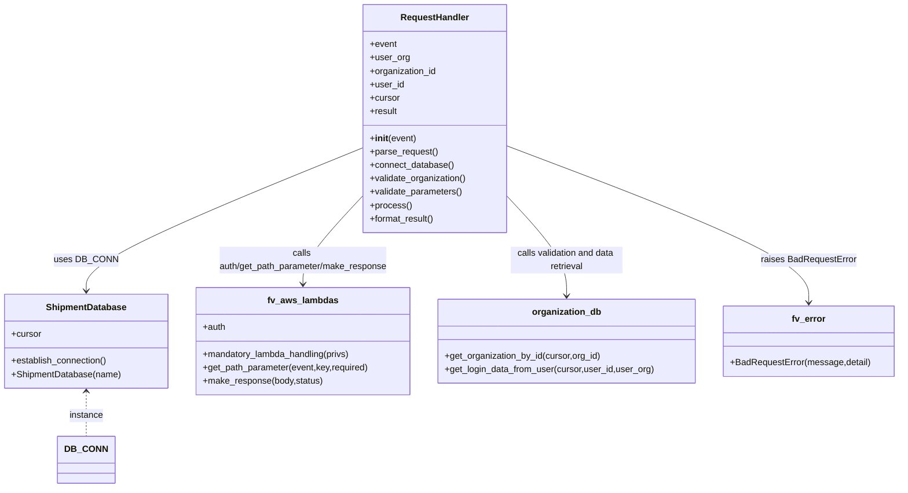

# Diagram: common/iam_service/iam_service/v1/lambdas/organizations/get_organization_member_info.py


> Auto-generated by Obscura crawlers

## Diagram 1



### SVG

<svg id="container" width="1598.15625" xmlns="http://www.w3.org/2000/svg" class="classDiagram" height="872" viewBox="0 0 1598.15625 872" role="graphics-document document" aria-roledescription="class"><style>#container{font-family:"trebuchet ms",verdana,arial,sans-serif;font-size:16px;fill:#333;}@keyframes edge-animation-frame{from{stroke-dashoffset:0;}}@keyframes dash{to{stroke-dashoffset:0;}}#container .edge-animation-slow{stroke-dasharray:9,5!important;stroke-dashoffset:900;animation:dash 50s linear infinite;stroke-linecap:round;}#container .edge-animation-fast{stroke-dasharray:9,5!important;stroke-dashoffset:900;animation:dash 20s linear infinite;stroke-linecap:round;}#container .error-icon{fill:#552222;}#container .error-text{fill:#552222;stroke:#552222;}#container .edge-thickness-normal{stroke-width:1px;}#container .edge-thickness-thick{stroke-width:3.5px;}#container .edge-pattern-solid{stroke-dasharray:0;}#container .edge-thickness-invisible{stroke-width:0;fill:none;}#container .edge-pattern-dashed{stroke-dasharray:3;}#container .edge-pattern-dotted{stroke-dasharray:2;}#container .marker{fill:#333333;stroke:#333333;}#container .marker.cross{stroke:#333333;}#container svg{font-family:"trebuchet ms",verdana,arial,sans-serif;font-size:16px;}#container p{margin:0;}#container g.classGroup text{fill:#9370DB;stroke:none;font-family:"trebuchet ms",verdana,arial,sans-serif;font-size:10px;}#container g.classGroup text .title{font-weight:bolder;}#container .nodeLabel,#container .edgeLabel{color:#131300;}#container .edgeLabel .label rect{fill:#ECECFF;}#container .label text{fill:#131300;}#container .labelBkg{background:#ECECFF;}#container .edgeLabel .label span{background:#ECECFF;}#container .classTitle{font-weight:bolder;}#container .node rect,#container .node circle,#container .node ellipse,#container .node polygon,#container .node path{fill:#ECECFF;stroke:#9370DB;stroke-width:1px;}#container .divider{stroke:#9370DB;stroke-width:1;}#container g.clickable{cursor:pointer;}#container g.classGroup rect{fill:#ECECFF;stroke:#9370DB;}#container g.classGroup line{stroke:#9370DB;stroke-width:1;}#container .classLabel .box{stroke:none;stroke-width:0;fill:#ECECFF;opacity:0.5;}#container .classLabel .label{fill:#9370DB;font-size:10px;}#container .relation{stroke:#333333;stroke-width:1;fill:none;}#container .dashed-line{stroke-dasharray:3;}#container .dotted-line{stroke-dasharray:1 2;}#container #compositionStart,#container .composition{fill:#333333!important;stroke:#333333!important;stroke-width:1;}#container #compositionEnd,#container .composition{fill:#333333!important;stroke:#333333!important;stroke-width:1;}#container #dependencyStart,#container .dependency{fill:#333333!important;stroke:#333333!important;stroke-width:1;}#container #dependencyStart,#container .dependency{fill:#333333!important;stroke:#333333!important;stroke-width:1;}#container #extensionStart,#container .extension{fill:transparent!important;stroke:#333333!important;stroke-width:1;}#container #extensionEnd,#container .extension{fill:transparent!important;stroke:#333333!important;stroke-width:1;}#container #aggregationStart,#container .aggregation{fill:transparent!important;stroke:#333333!important;stroke-width:1;}#container #aggregationEnd,#container .aggregation{fill:transparent!important;stroke:#333333!important;stroke-width:1;}#container #lollipopStart,#container .lollipop{fill:#ECECFF!important;stroke:#333333!important;stroke-width:1;}#container #lollipopEnd,#container .lollipop{fill:#ECECFF!important;stroke:#333333!important;stroke-width:1;}#container .edgeTerminals{font-size:11px;line-height:initial;}#container .classTitleText{text-anchor:middle;font-size:18px;fill:#333;}#container .label-icon{display:inline-block;height:1em;overflow:visible;vertical-align:-0.125em;}#container .node .label-icon path{fill:currentColor;stroke:revert;stroke-width:revert;}#container :root{--mermaid-font-family:"trebuchet ms",verdana,arial,sans-serif;}</style><g><defs><marker id="container_class-aggregationStart" class="marker aggregation class" refX="18" refY="7" markerWidth="190" markerHeight="240" orient="auto"><path d="M 18,7 L9,13 L1,7 L9,1 Z"></path></marker></defs><defs><marker id="container_class-aggregationEnd" class="marker aggregation class" refX="1" refY="7" markerWidth="20" markerHeight="28" orient="auto"><path d="M 18,7 L9,13 L1,7 L9,1 Z"></path></marker></defs><defs><marker id="container_class-extensionStart" class="marker extension class" refX="18" refY="7" markerWidth="190" markerHeight="240" orient="auto"><path d="M 1,7 L18,13 V 1 Z"></path></marker></defs><defs><marker id="container_class-extensionEnd" class="marker extension class" refX="1" refY="7" markerWidth="20" markerHeight="28" orient="auto"><path d="M 1,1 V 13 L18,7 Z"></path></marker></defs><defs><marker id="container_class-compositionStart" class="marker composition class" refX="18" refY="7" markerWidth="190" markerHeight="240" orient="auto"><path d="M 18,7 L9,13 L1,7 L9,1 Z"></path></marker></defs><defs><marker id="container_class-compositionEnd" class="marker composition class" refX="1" refY="7" markerWidth="20" markerHeight="28" orient="auto"><path d="M 18,7 L9,13 L1,7 L9,1 Z"></path></marker></defs><defs><marker id="container_class-dependencyStart" class="marker dependency class" refX="6" refY="7" markerWidth="190" markerHeight="240" orient="auto"><path d="M 5,7 L9,13 L1,7 L9,1 Z"></path></marker></defs><defs><marker id="container_class-dependencyEnd" class="marker dependency class" refX="13" refY="7" markerWidth="20" markerHeight="28" orient="auto"><path d="M 18,7 L9,13 L14,7 L9,1 Z"></path></marker></defs><defs><marker id="container_class-lollipopStart" class="marker lollipop class" refX="13" refY="7" markerWidth="190" markerHeight="240" orient="auto"><circle stroke="black" fill="transparent" cx="7" cy="7" r="6"></circle></marker></defs><defs><marker id="container_class-lollipopEnd" class="marker lollipop class" refX="1" refY="7" markerWidth="190" markerHeight="240" orient="auto"><circle stroke="black" fill="transparent" cx="7" cy="7" r="6"></circle></marker></defs><g class="root"><g class="clusters"></g><g class="edgePaths"><path d="M645.213,264.344L563.052,297.787C480.891,331.229,316.568,398.115,234.407,440.724C152.246,483.333,152.246,501.667,152.246,510.833L152.246,520" id="id_RequestHandler_ShipmentDatabase_1" class="edge-thickness-normal edge-pattern-solid relation" style=";;;" data-edge="true" data-et="edge" data-id="id_RequestHandler_ShipmentDatabase_1" data-points="W3sieCI6NjQ1LjIxMjg5MDYyNSwieSI6MjY0LjM0NDA2MDAwNDgzOTF9LHsieCI6MTUyLjI0NjA5Mzc1LCJ5Ijo0NjV9LHsieCI6MTUyLjI0NjA5Mzc1LCJ5Ijo1MjZ9XQ==" marker-end="url(#container_class-dependencyEnd)"></path><path d="M645.213,350.219L627.414,369.349C609.616,388.479,574.019,426.74,556.22,453.037C538.422,479.333,538.422,493.667,538.422,500.833L538.422,508" id="id_RequestHandler_fv_aws_lambdas_2" class="edge-thickness-normal edge-pattern-solid relation" style=";;;" data-edge="true" data-et="edge" data-id="id_RequestHandler_fv_aws_lambdas_2" data-points="W3sieCI6NjQ1LjIxMjg5MDYyNSwieSI6MzUwLjIxOTA4NTc4NzMwMzI0fSx7IngiOjUzOC40MjE4NzUsInkiOjQ2NX0seyJ4Ijo1MzguNDIxODc1LCJ5Ijo1MTR9XQ==" marker-end="url(#container_class-dependencyEnd)"></path><path d="M902.408,350.219L920.207,369.349C938.005,388.479,973.602,426.74,991.401,456.537C1009.199,486.333,1009.199,507.667,1009.199,518.333L1009.199,529" id="id_RequestHandler_organization_db_3" class="edge-thickness-normal edge-pattern-solid relation" style=";;;" data-edge="true" data-et="edge" data-id="id_RequestHandler_organization_db_3" data-points="W3sieCI6OTAyLjQwODIwMzEyNSwieSI6MzUwLjIxOTA4NTc4NzMwMzI0fSx7IngiOjEwMDkuMTk5MjE4NzUsInkiOjQ2NX0seyJ4IjoxMDA5LjE5OTIxODc1LCJ5Ijo1MzV9XQ==" marker-end="url(#container_class-dependencyEnd)"></path><path d="M902.408,260.904L991.857,294.92C1081.306,328.936,1260.204,396.968,1349.653,443.651C1439.102,490.333,1439.102,515.667,1439.102,528.333L1439.102,541" id="id_RequestHandler_fv_error_4" class="edge-thickness-normal edge-pattern-solid relation" style=";;;" data-edge="true" data-et="edge" data-id="id_RequestHandler_fv_error_4" data-points="W3sieCI6OTAyLjQwODIwMzEyNSwieSI6MjYwLjkwMzcyMjIzMTUxODc3fSx7IngiOjE0MzkuMTAxNTYyNSwieSI6NDY1fSx7IngiOjE0MzkuMTAxNTYyNSwieSI6NTQ3fV0=" marker-end="url(#container_class-dependencyEnd)"></path><path d="M152.246,700L152.246,707.167C152.246,714.333,152.246,728.667,152.246,742C152.246,755.333,152.246,767.667,152.246,773.833L152.246,780" id="id_ShipmentDatabase_DB_CONN_5" class="edge-thickness-normal edge-pattern-dashed relation" style=";;;" data-edge="true" data-et="edge" data-id="id_ShipmentDatabase_DB_CONN_5" data-points="W3sieCI6MTUyLjI0NjA5Mzc1LCJ5Ijo2OTR9LHsieCI6MTUyLjI0NjA5Mzc1LCJ5Ijo3NDN9LHsieCI6MTUyLjI0NjA5Mzc1LCJ5Ijo3ODB9XQ==" marker-start="url(#container_class-dependencyStart)"></path></g><g class="edgeLabels"><g class="edgeLabel" transform="translate(152.24609375, 465)"><g class="label" data-id="id_RequestHandler_ShipmentDatabase_1" transform="translate(-53.09375, -12)"><foreignObject width="106.1875" height="24"><div xmlns="http://www.w3.org/1999/xhtml" class="labelBkg" style="display: table-cell; white-space: nowrap; line-height: 1.5; max-width: 200px; text-align: center;"><span class="edgeLabel"><p>uses DB_CONN</p></span></div></foreignObject></g></g><g class="edgeLabel" transform="translate(538.421875, 465)"><g class="label" data-id="id_RequestHandler_fv_aws_lambdas_2" transform="translate(-154.5078125, -24)"><foreignObject width="309.015625" height="48"><div xmlns="http://www.w3.org/1999/xhtml" class="labelBkg" style="display: table; white-space: break-spaces; line-height: 1.5; max-width: 200px; text-align: center; width: 200px;"><span class="edgeLabel"><p>calls auth/get_path_parameter/make_response</p></span></div></foreignObject></g></g><g class="edgeLabel" transform="translate(1009.19921875, 465)"><g class="label" data-id="id_RequestHandler_organization_db_3" transform="translate(-100, -24)"><foreignObject width="200" height="48"><div xmlns="http://www.w3.org/1999/xhtml" class="labelBkg" style="display: table; white-space: break-spaces; line-height: 1.5; max-width: 200px; text-align: center; width: 200px;"><span class="edgeLabel"><p>calls validation and data retrieval</p></span></div></foreignObject></g></g><g class="edgeLabel" transform="translate(1439.1015625, 465)"><g class="label" data-id="id_RequestHandler_fv_error_4" transform="translate(-84.7734375, -12)"><foreignObject width="169.546875" height="24"><div xmlns="http://www.w3.org/1999/xhtml" class="labelBkg" style="display: table-cell; white-space: nowrap; line-height: 1.5; max-width: 200px; text-align: center;"><span class="edgeLabel"><p>raises BadRequestError</p></span></div></foreignObject></g></g><g class="edgeLabel" transform="translate(152.24609375, 743)"><g class="label" data-id="id_ShipmentDatabase_DB_CONN_5" transform="translate(-30.578125, -12)"><foreignObject width="61.15625" height="24"><div xmlns="http://www.w3.org/1999/xhtml" class="labelBkg" style="display: table-cell; white-space: nowrap; line-height: 1.5; max-width: 200px; text-align: center;"><span class="edgeLabel"><p>instance</p></span></div></foreignObject></g></g></g><g class="nodes"><g class="node default" id="classId-RequestHandler-0" transform="translate(773.810546875, 212)"><g class="basic label-container"><path d="M-128.59765625 -204 L128.59765625 -204 L128.59765625 204 L-128.59765625 204" stroke="none" stroke-width="0" fill="#ECECFF" style=""></path><path d="M-128.59765625 -204 C-56.43096360228843 -204, 15.735729045423142 -204, 128.59765625 -204 M-128.59765625 -204 C-63.608260464581406 -204, 1.3811353208371884 -204, 128.59765625 -204 M128.59765625 -204 C128.59765625 -81.23932901210044, 128.59765625 41.52134197579912, 128.59765625 204 M128.59765625 -204 C128.59765625 -58.30059576510379, 128.59765625 87.39880846979241, 128.59765625 204 M128.59765625 204 C36.555361146512396 204, -55.48693395697521 204, -128.59765625 204 M128.59765625 204 C52.97549821644256 204, -22.64665981711488 204, -128.59765625 204 M-128.59765625 204 C-128.59765625 115.05204822563354, -128.59765625 26.104096451267083, -128.59765625 -204 M-128.59765625 204 C-128.59765625 84.11600403861664, -128.59765625 -35.767991922766726, -128.59765625 -204" stroke="#9370DB" stroke-width="1.3" fill="none" stroke-dasharray="0 0" style=""></path></g><g class="annotation-group text" transform="translate(0, -180)"></g><g class="label-group text" transform="translate(-59.0703125, -180)"><g class="label" style="font-weight: bolder" transform="translate(0,-12)"><foreignObject width="118.140625" height="24"><div xmlns="http://www.w3.org/1999/xhtml" style="display: table-cell; white-space: nowrap; line-height: 1.5; max-width: 168px; text-align: center;"><span class="nodeLabel markdown-node-label" style=""><p>RequestHandler</p></span></div></foreignObject></g></g><g class="members-group text" transform="translate(-116.59765625, -132)"><g class="label" style="" transform="translate(0,-12)"><foreignObject width="48.328125" height="24"><div xmlns="http://www.w3.org/1999/xhtml" style="display: table-cell; white-space: nowrap; line-height: 1.5; max-width: 106px; text-align: center;"><span class="nodeLabel markdown-node-label" style=""><p>+event</p></span></div></foreignObject></g><g class="label" style="" transform="translate(0,12)"><foreignObject width="69.984375" height="24"><div xmlns="http://www.w3.org/1999/xhtml" style="display: table-cell; white-space: nowrap; line-height: 1.5; max-width: 128px; text-align: center;"><span class="nodeLabel markdown-node-label" style=""><p>+user_org</p></span></div></foreignObject></g><g class="label" style="" transform="translate(0,36)"><foreignObject width="120.75" height="24"><div xmlns="http://www.w3.org/1999/xhtml" style="display: table-cell; white-space: nowrap; line-height: 1.5; max-width: 178px; text-align: center;"><span class="nodeLabel markdown-node-label" style=""><p>+organization_id</p></span></div></foreignObject></g><g class="label" style="" transform="translate(0,60)"><foreignObject width="60.796875" height="24"><div xmlns="http://www.w3.org/1999/xhtml" style="display: table-cell; white-space: nowrap; line-height: 1.5; max-width: 118px; text-align: center;"><span class="nodeLabel markdown-node-label" style=""><p>+user_id</p></span></div></foreignObject></g><g class="label" style="" transform="translate(0,84)"><foreignObject width="53.71875" height="24"><div xmlns="http://www.w3.org/1999/xhtml" style="display: table-cell; white-space: nowrap; line-height: 1.5; max-width: 112px; text-align: center;"><span class="nodeLabel markdown-node-label" style=""><p>+cursor</p></span></div></foreignObject></g><g class="label" style="" transform="translate(0,108)"><foreignObject width="49.65625" height="24"><div xmlns="http://www.w3.org/1999/xhtml" style="display: table-cell; white-space: nowrap; line-height: 1.5; max-width: 107px; text-align: center;"><span class="nodeLabel markdown-node-label" style=""><p>+result</p></span></div></foreignObject></g></g><g class="methods-group text" transform="translate(-116.59765625, 36)"><g class="label" style="" transform="translate(0,-12)"><foreignObject width="83.140625" height="24"><div xmlns="http://www.w3.org/1999/xhtml" style="display: table-cell; white-space: nowrap; line-height: 1.5; max-width: 172px; text-align: center;"><span class="nodeLabel markdown-node-label" style=""><p>+<strong>init</strong>(event)</p></span></div></foreignObject></g><g class="label" style="" transform="translate(0,12)"><foreignObject width="121.796875" height="24"><div xmlns="http://www.w3.org/1999/xhtml" style="display: table-cell; white-space: nowrap; line-height: 1.5; max-width: 179px; text-align: center;"><span class="nodeLabel markdown-node-label" style=""><p>+parse_request()</p></span></div></foreignObject></g><g class="label" style="" transform="translate(0,36)"><foreignObject width="150.640625" height="24"><div xmlns="http://www.w3.org/1999/xhtml" style="display: table-cell; white-space: nowrap; line-height: 1.5; max-width: 208px; text-align: center;"><span class="nodeLabel markdown-node-label" style=""><p>+connect_database()</p></span></div></foreignObject></g><g class="label" style="" transform="translate(0,60)"><foreignObject width="174.125" height="24"><div xmlns="http://www.w3.org/1999/xhtml" style="display: table-cell; white-space: nowrap; line-height: 1.5; max-width: 231px; text-align: center;"><span class="nodeLabel markdown-node-label" style=""><p>+validate_organization()</p></span></div></foreignObject></g><g class="label" style="" transform="translate(0,84)"><foreignObject width="166.546875" height="24"><div xmlns="http://www.w3.org/1999/xhtml" style="display: table-cell; white-space: nowrap; line-height: 1.5; max-width: 224px; text-align: center;"><span class="nodeLabel markdown-node-label" style=""><p>+validate_parameters()</p></span></div></foreignObject></g><g class="label" style="" transform="translate(0,108)"><foreignObject width="73.734375" height="24"><div xmlns="http://www.w3.org/1999/xhtml" style="display: table-cell; white-space: nowrap; line-height: 1.5; max-width: 131px; text-align: center;"><span class="nodeLabel markdown-node-label" style=""><p>+process()</p></span></div></foreignObject></g><g class="label" style="" transform="translate(0,132)"><foreignObject width="117.015625" height="24"><div xmlns="http://www.w3.org/1999/xhtml" style="display: table-cell; white-space: nowrap; line-height: 1.5; max-width: 174px; text-align: center;"><span class="nodeLabel markdown-node-label" style=""><p>+format_result()</p></span></div></foreignObject></g></g><g class="divider" style=""><path d="M-128.59765625 -156 C-35.33011969990524 -156, 57.93741685018952 -156, 128.59765625 -156 M-128.59765625 -156 C-58.833373021114966 -156, 10.930910207770069 -156, 128.59765625 -156" stroke="#9370DB" stroke-width="1.3" fill="none" stroke-dasharray="0 0" style=""></path></g><g class="divider" style=""><path d="M-128.59765625 12 C-62.63145627579996 12, 3.334743698400075 12, 128.59765625 12 M-128.59765625 12 C-34.09199040239422 12, 60.41367544521157 12, 128.59765625 12" stroke="#9370DB" stroke-width="1.3" fill="none" stroke-dasharray="0 0" style=""></path></g></g><g class="node default" id="classId-ShipmentDatabase-1" transform="translate(152.24609375, 610)"><g class="basic label-container"><path d="M-144.24609375 -84 L144.24609375 -84 L144.24609375 84 L-144.24609375 84" stroke="none" stroke-width="0" fill="#ECECFF" style=""></path><path d="M-144.24609375 -84 C-32.94201110577016 -84, 78.36207153845967 -84, 144.24609375 -84 M-144.24609375 -84 C-76.2419590953894 -84, -8.237824440778809 -84, 144.24609375 -84 M144.24609375 -84 C144.24609375 -44.73379106990873, 144.24609375 -5.467582139817466, 144.24609375 84 M144.24609375 -84 C144.24609375 -32.28092344839723, 144.24609375 19.438153103205536, 144.24609375 84 M144.24609375 84 C55.195242674449176 84, -33.85560840110165 84, -144.24609375 84 M144.24609375 84 C36.963313905498325 84, -70.31946593900335 84, -144.24609375 84 M-144.24609375 84 C-144.24609375 49.50557503269142, -144.24609375 15.011150065382836, -144.24609375 -84 M-144.24609375 84 C-144.24609375 26.76898142580187, -144.24609375 -30.462037148396263, -144.24609375 -84" stroke="#9370DB" stroke-width="1.3" fill="none" stroke-dasharray="0 0" style=""></path></g><g class="annotation-group text" transform="translate(0, -60)"></g><g class="label-group text" transform="translate(-69.2734375, -60)"><g class="label" style="font-weight: bolder" transform="translate(0,-12)"><foreignObject width="138.546875" height="24"><div xmlns="http://www.w3.org/1999/xhtml" style="display: table-cell; white-space: nowrap; line-height: 1.5; max-width: 187px; text-align: center;"><span class="nodeLabel markdown-node-label" style=""><p>ShipmentDatabase</p></span></div></foreignObject></g></g><g class="members-group text" transform="translate(-132.24609375, -12)"><g class="label" style="" transform="translate(0,-12)"><foreignObject width="53.71875" height="24"><div xmlns="http://www.w3.org/1999/xhtml" style="display: table-cell; white-space: nowrap; line-height: 1.5; max-width: 112px; text-align: center;"><span class="nodeLabel markdown-node-label" style=""><p>+cursor</p></span></div></foreignObject></g></g><g class="methods-group text" transform="translate(-132.24609375, 36)"><g class="label" style="" transform="translate(0,-12)"><foreignObject width="173.265625" height="24"><div xmlns="http://www.w3.org/1999/xhtml" style="display: table-cell; white-space: nowrap; line-height: 1.5; max-width: 231px; text-align: center;"><span class="nodeLabel markdown-node-label" style=""><p>+establish_connection()</p></span></div></foreignObject></g><g class="label" style="" transform="translate(0,12)"><foreignObject width="195.21875" height="24"><div xmlns="http://www.w3.org/1999/xhtml" style="display: table-cell; white-space: nowrap; line-height: 1.5; max-width: 253px; text-align: center;"><span class="nodeLabel markdown-node-label" style=""><p>+ShipmentDatabase(name)</p></span></div></foreignObject></g></g><g class="divider" style=""><path d="M-144.24609375 -36 C-36.12078898807043 -36, 72.00451577385914 -36, 144.24609375 -36 M-144.24609375 -36 C-33.36775963508461 -36, 77.51057447983078 -36, 144.24609375 -36" stroke="#9370DB" stroke-width="1.3" fill="none" stroke-dasharray="0 0" style=""></path></g><g class="divider" style=""><path d="M-144.24609375 12 C-72.52611225609986 12, -0.8061307621997287 12, 144.24609375 12 M-144.24609375 12 C-64.29416286542381 12, 15.657768019152371 12, 144.24609375 12" stroke="#9370DB" stroke-width="1.3" fill="none" stroke-dasharray="0 0" style=""></path></g></g><g class="node default" id="classId-fv_aws_lambdas-2" transform="translate(538.421875, 610)"><g class="basic label-container"><path d="M-191.9296875 -96 L191.9296875 -96 L191.9296875 96 L-191.9296875 96" stroke="none" stroke-width="0" fill="#ECECFF" style=""></path><path d="M-191.9296875 -96 C-73.79419953123472 -96, 44.34128843753055 -96, 191.9296875 -96 M-191.9296875 -96 C-59.30360398296469 -96, 73.32247953407062 -96, 191.9296875 -96 M191.9296875 -96 C191.9296875 -42.793101379286966, 191.9296875 10.413797241426067, 191.9296875 96 M191.9296875 -96 C191.9296875 -38.528183339077806, 191.9296875 18.943633321844388, 191.9296875 96 M191.9296875 96 C44.160541619859316 96, -103.60860426028137 96, -191.9296875 96 M191.9296875 96 C64.85610091206881 96, -62.21748567586238 96, -191.9296875 96 M-191.9296875 96 C-191.9296875 36.340592982084445, -191.9296875 -23.31881403583111, -191.9296875 -96 M-191.9296875 96 C-191.9296875 47.17092781049523, -191.9296875 -1.658144379009542, -191.9296875 -96" stroke="#9370DB" stroke-width="1.3" fill="none" stroke-dasharray="0 0" style=""></path></g><g class="annotation-group text" transform="translate(0, -72)"></g><g class="label-group text" transform="translate(-60.0625, -72)"><g class="label" style="font-weight: bolder" transform="translate(0,-12)"><foreignObject width="120.125" height="24"><div xmlns="http://www.w3.org/1999/xhtml" style="display: table-cell; white-space: nowrap; line-height: 1.5; max-width: 168px; text-align: center;"><span class="nodeLabel markdown-node-label" style=""><p>fv_aws_lambdas</p></span></div></foreignObject></g></g><g class="members-group text" transform="translate(-179.9296875, -24)"><g class="label" style="" transform="translate(0,-12)"><foreignObject width="40.921875" height="24"><div xmlns="http://www.w3.org/1999/xhtml" style="display: table-cell; white-space: nowrap; line-height: 1.5; max-width: 98px; text-align: center;"><span class="nodeLabel markdown-node-label" style=""><p>+auth</p></span></div></foreignObject></g></g><g class="methods-group text" transform="translate(-179.9296875, 24)"><g class="label" style="" transform="translate(0,-12)"><foreignObject width="267.5" height="24"><div xmlns="http://www.w3.org/1999/xhtml" style="display: table-cell; white-space: nowrap; line-height: 1.5; max-width: 325px; text-align: center;"><span class="nodeLabel markdown-node-label" style=""><p>+mandatory_lambda_handling(privs)</p></span></div></foreignObject></g><g class="label" style="" transform="translate(0,12)"><foreignObject width="299.796875" height="24"><div xmlns="http://www.w3.org/1999/xhtml" style="display: table-cell; white-space: nowrap; line-height: 1.5; max-width: 357px; text-align: center;"><span class="nodeLabel markdown-node-label" style=""><p>+get_path_parameter(event,key,required)</p></span></div></foreignObject></g><g class="label" style="" transform="translate(0,36)"><foreignObject width="215.796875" height="24"><div xmlns="http://www.w3.org/1999/xhtml" style="display: table-cell; white-space: nowrap; line-height: 1.5; max-width: 273px; text-align: center;"><span class="nodeLabel markdown-node-label" style=""><p>+make_response(body,status)</p></span></div></foreignObject></g></g><g class="divider" style=""><path d="M-191.9296875 -48 C-53.221332862960935 -48, 85.48702177407813 -48, 191.9296875 -48 M-191.9296875 -48 C-65.49087440931824 -48, 60.947938681363524 -48, 191.9296875 -48" stroke="#9370DB" stroke-width="1.3" fill="none" stroke-dasharray="0 0" style=""></path></g><g class="divider" style=""><path d="M-191.9296875 0 C-112.30421606222365 0, -32.67874462444729 0, 191.9296875 0 M-191.9296875 0 C-96.89688638932128 0, -1.8640852786425626 0, 191.9296875 0" stroke="#9370DB" stroke-width="1.3" fill="none" stroke-dasharray="0 0" style=""></path></g></g><g class="node default" id="classId-organization_db-3" transform="translate(1009.19921875, 610)"><g class="basic label-container"><path d="M-228.84765625 -75 L228.84765625 -75 L228.84765625 75 L-228.84765625 75" stroke="none" stroke-width="0" fill="#ECECFF" style=""></path><path d="M-228.84765625 -75 C-71.53538862396931 -75, 85.77687900206138 -75, 228.84765625 -75 M-228.84765625 -75 C-112.97100812926502 -75, 2.905639991469968 -75, 228.84765625 -75 M228.84765625 -75 C228.84765625 -31.865119944912365, 228.84765625 11.26976011017527, 228.84765625 75 M228.84765625 -75 C228.84765625 -41.366867215107426, 228.84765625 -7.733734430214852, 228.84765625 75 M228.84765625 75 C58.701374772206634 75, -111.44490670558673 75, -228.84765625 75 M228.84765625 75 C122.66746416148763 75, 16.48727207297526 75, -228.84765625 75 M-228.84765625 75 C-228.84765625 28.300294406782456, -228.84765625 -18.39941118643509, -228.84765625 -75 M-228.84765625 75 C-228.84765625 26.418463565719783, -228.84765625 -22.163072868560434, -228.84765625 -75" stroke="#9370DB" stroke-width="1.3" fill="none" stroke-dasharray="0 0" style=""></path></g><g class="annotation-group text" transform="translate(0, -51)"></g><g class="label-group text" transform="translate(-59.4140625, -51)"><g class="label" style="font-weight: bolder" transform="translate(0,-12)"><foreignObject width="118.828125" height="24"><div xmlns="http://www.w3.org/1999/xhtml" style="display: table-cell; white-space: nowrap; line-height: 1.5; max-width: 167px; text-align: center;"><span class="nodeLabel markdown-node-label" style=""><p>organization_db</p></span></div></foreignObject></g></g><g class="members-group text" transform="translate(-216.84765625, -3)"></g><g class="methods-group text" transform="translate(-216.84765625, 27)"><g class="label" style="" transform="translate(0,-12)"><foreignObject width="281.015625" height="24"><div xmlns="http://www.w3.org/1999/xhtml" style="display: table-cell; white-space: nowrap; line-height: 1.5; max-width: 338px; text-align: center;"><span class="nodeLabel markdown-node-label" style=""><p>+get_organization_by_id(cursor,org_id)</p></span></div></foreignObject></g><g class="label" style="" transform="translate(0,12)"><foreignObject width="374.28125" height="24"><div xmlns="http://www.w3.org/1999/xhtml" style="display: table-cell; white-space: nowrap; line-height: 1.5; max-width: 432px; text-align: center;"><span class="nodeLabel markdown-node-label" style=""><p>+get_login_data_from_user(cursor,user_id,user_org)</p></span></div></foreignObject></g></g><g class="divider" style=""><path d="M-228.84765625 -27 C-81.98675818264411 -27, 64.87413988471178 -27, 228.84765625 -27 M-228.84765625 -27 C-63.737740577391264 -27, 101.37217509521747 -27, 228.84765625 -27" stroke="#9370DB" stroke-width="1.3" fill="none" stroke-dasharray="0 0" style=""></path></g><g class="divider" style=""><path d="M-228.84765625 -3 C-112.41908287246872 -3, 4.009490505062558 -3, 228.84765625 -3 M-228.84765625 -3 C-118.39338474727374 -3, -7.939113244547485 -3, 228.84765625 -3" stroke="#9370DB" stroke-width="1.3" fill="none" stroke-dasharray="0 0" style=""></path></g></g><g class="node default" id="classId-fv_error-4" transform="translate(1439.1015625, 610)"><g class="basic label-container"><path d="M-151.0546875 -63 L151.0546875 -63 L151.0546875 63 L-151.0546875 63" stroke="none" stroke-width="0" fill="#ECECFF" style=""></path><path d="M-151.0546875 -63 C-78.67941674186903 -63, -6.304145983738067 -63, 151.0546875 -63 M-151.0546875 -63 C-31.20507948767417 -63, 88.64452852465166 -63, 151.0546875 -63 M151.0546875 -63 C151.0546875 -22.12449798125229, 151.0546875 18.75100403749542, 151.0546875 63 M151.0546875 -63 C151.0546875 -22.719210247218875, 151.0546875 17.56157950556225, 151.0546875 63 M151.0546875 63 C72.38593264163104 63, -6.282822216737912 63, -151.0546875 63 M151.0546875 63 C80.72605640816376 63, 10.397425316327514 63, -151.0546875 63 M-151.0546875 63 C-151.0546875 27.991403930240388, -151.0546875 -7.017192139519224, -151.0546875 -63 M-151.0546875 63 C-151.0546875 14.39382207967455, -151.0546875 -34.2123558406509, -151.0546875 -63" stroke="#9370DB" stroke-width="1.3" fill="none" stroke-dasharray="0 0" style=""></path></g><g class="annotation-group text" transform="translate(0, -39)"></g><g class="label-group text" transform="translate(-29.1875, -39)"><g class="label" style="font-weight: bolder" transform="translate(0,-12)"><foreignObject width="58.375" height="24"><div xmlns="http://www.w3.org/1999/xhtml" style="display: table-cell; white-space: nowrap; line-height: 1.5; max-width: 108px; text-align: center;"><span class="nodeLabel markdown-node-label" style=""><p>fv_error</p></span></div></foreignObject></g></g><g class="members-group text" transform="translate(-139.0546875, 9)"></g><g class="methods-group text" transform="translate(-139.0546875, 39)"><g class="label" style="" transform="translate(0,-12)"><foreignObject width="248.921875" height="24"><div xmlns="http://www.w3.org/1999/xhtml" style="display: table-cell; white-space: nowrap; line-height: 1.5; max-width: 306px; text-align: center;"><span class="nodeLabel markdown-node-label" style=""><p>+BadRequestError(message,detail)</p></span></div></foreignObject></g></g><g class="divider" style=""><path d="M-151.0546875 -15 C-33.833580606806635 -15, 83.38752628638673 -15, 151.0546875 -15 M-151.0546875 -15 C-30.386539141176797 -15, 90.2816092176464 -15, 151.0546875 -15" stroke="#9370DB" stroke-width="1.3" fill="none" stroke-dasharray="0 0" style=""></path></g><g class="divider" style=""><path d="M-151.0546875 9 C-39.019931679567875 9, 73.01482414086425 9, 151.0546875 9 M-151.0546875 9 C-87.94334780273564 9, -24.832008105471303 9, 151.0546875 9" stroke="#9370DB" stroke-width="1.3" fill="none" stroke-dasharray="0 0" style=""></path></g></g><g class="node default" id="classId-DB_CONN-5" transform="translate(152.24609375, 822)"><g class="basic label-container"><path d="M-46.40625 -42 L46.40625 -42 L46.40625 42 L-46.40625 42" stroke="none" stroke-width="0" fill="#ECECFF" style=""></path><path d="M-46.40625 -42 C-13.734713029644183 -42, 18.936823940711633 -42, 46.40625 -42 M-46.40625 -42 C-21.999873810783377 -42, 2.4065023784332453 -42, 46.40625 -42 M46.40625 -42 C46.40625 -17.8366607226178, 46.40625 6.326678554764399, 46.40625 42 M46.40625 -42 C46.40625 -11.095860790286327, 46.40625 19.808278419427346, 46.40625 42 M46.40625 42 C10.87881573118134 42, -24.64861853763732 42, -46.40625 42 M46.40625 42 C23.694849330027726 42, 0.9834486600554513 42, -46.40625 42 M-46.40625 42 C-46.40625 21.606671860936206, -46.40625 1.2133437218724126, -46.40625 -42 M-46.40625 42 C-46.40625 12.335262153041878, -46.40625 -17.329475693916244, -46.40625 -42" stroke="#9370DB" stroke-width="1.3" fill="none" stroke-dasharray="0 0" style=""></path></g><g class="annotation-group text" transform="translate(0, -18)"></g><g class="label-group text" transform="translate(-34.40625, -18)"><g class="label" style="font-weight: bolder" transform="translate(0,-12)"><foreignObject width="68.8125" height="24"><div xmlns="http://www.w3.org/1999/xhtml" style="display: table-cell; white-space: nowrap; line-height: 1.5; max-width: 119px; text-align: center;"><span class="nodeLabel markdown-node-label" style=""><p>DB_CONN</p></span></div></foreignObject></g></g><g class="members-group text" transform="translate(-34.40625, 30)"></g><g class="methods-group text" transform="translate(-34.40625, 60)"></g><g class="divider" style=""><path d="M-46.40625 6 C-14.050448752762186 6, 18.305352494475628 6, 46.40625 6 M-46.40625 6 C-14.38392746746672 6, 17.63839506506656 6, 46.40625 6" stroke="#9370DB" stroke-width="1.3" fill="none" stroke-dasharray="0 0" style=""></path></g><g class="divider" style=""><path d="M-46.40625 24 C-13.539083357214992 24, 19.328083285570017 24, 46.40625 24 M-46.40625 24 C-19.63922910976197 24, 7.127791780476059 24, 46.40625 24" stroke="#9370DB" stroke-width="1.3" fill="none" stroke-dasharray="0 0" style=""></path></g></g></g></g></g></svg>

## Diagram 2

```mermaid
sequenceDiagram
participant Event as event
participant Lambda as lambda_handler
participant RH as RequestHandler
participant AWS as fv.aws.lambdas
participant DB as ShipmentDatabase
participant OrgDB as organization_db
participant RESP as make_response

Event->>Lambda: invoke(event, context, audit_refs)
Lambda->>RH: create RequestHandler(event)
RH->>RH: parse_request()
RH->>AWS: fv.aws.lambdas.auth.get_organization_id(event)
RH->>AWS: fv.aws.lambdas.get_path_parameter(event,"organization_id")
RH->>AWS: fv.aws.lambdas.get_path_parameter(event,"user_id")
RH->>RH: validate_parameters()
RH->>DB: DB_CONN.establish_connection()
DB-->>RH: cursor set
RH->>OrgDB: get_organization_by_id(cursor,user_org)
OrgDB-->>RH: organization or None
alt organization not found
  RH->>fv_error: raise BadRequestError
  fv_error-->>Lambda: exception
else organization found
  RH->>OrgDB: get_login_data_from_user(cursor,user_id,user_org)
  OrgDB-->>RH: user login data
  RH->>RH: format_result()
  RH-->>Lambda: user_auth0_data
  Lambda->>RESP: fv.aws.lambdas.make_response(user_auth0_data,200)
  RESP-->>Lambda: http response
  Lambda-->>Event: return response
```

> SVG rendering failed for this diagram.
