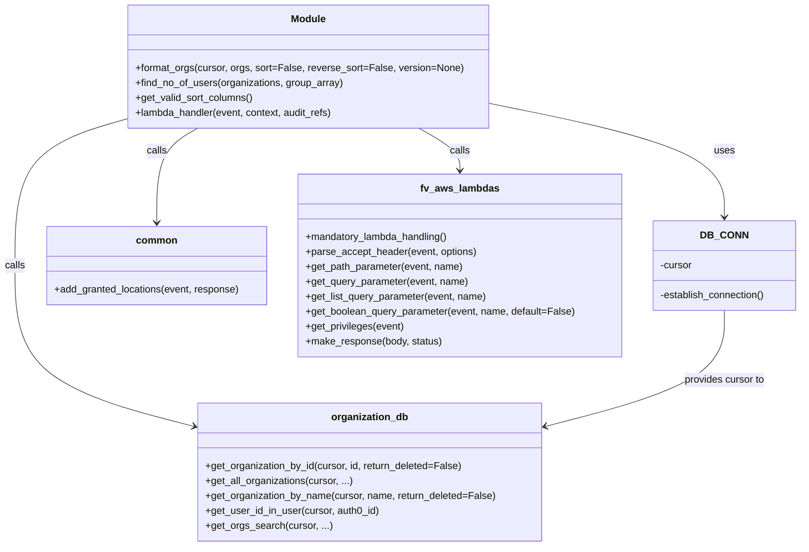

# Diagram: common/iam_service/iam_service/v1/lambdas/organizations/get_organizations.py


> Auto-generated by Obscura crawlers

## Diagram 1



### SVG

<svg id="container" width="1287.484375" xmlns="http://www.w3.org/2000/svg" class="classDiagram" height="878" viewBox="0 0 1287.484375 878" role="graphics-document document" aria-roledescription="class"><style>#container{font-family:"trebuchet ms",verdana,arial,sans-serif;font-size:16px;fill:#333;}@keyframes edge-animation-frame{from{stroke-dashoffset:0;}}@keyframes dash{to{stroke-dashoffset:0;}}#container .edge-animation-slow{stroke-dasharray:9,5!important;stroke-dashoffset:900;animation:dash 50s linear infinite;stroke-linecap:round;}#container .edge-animation-fast{stroke-dasharray:9,5!important;stroke-dashoffset:900;animation:dash 20s linear infinite;stroke-linecap:round;}#container .error-icon{fill:#552222;}#container .error-text{fill:#552222;stroke:#552222;}#container .edge-thickness-normal{stroke-width:1px;}#container .edge-thickness-thick{stroke-width:3.5px;}#container .edge-pattern-solid{stroke-dasharray:0;}#container .edge-thickness-invisible{stroke-width:0;fill:none;}#container .edge-pattern-dashed{stroke-dasharray:3;}#container .edge-pattern-dotted{stroke-dasharray:2;}#container .marker{fill:#333333;stroke:#333333;}#container .marker.cross{stroke:#333333;}#container svg{font-family:"trebuchet ms",verdana,arial,sans-serif;font-size:16px;}#container p{margin:0;}#container g.classGroup text{fill:#9370DB;stroke:none;font-family:"trebuchet ms",verdana,arial,sans-serif;font-size:10px;}#container g.classGroup text .title{font-weight:bolder;}#container .nodeLabel,#container .edgeLabel{color:#131300;}#container .edgeLabel .label rect{fill:#ECECFF;}#container .label text{fill:#131300;}#container .labelBkg{background:#ECECFF;}#container .edgeLabel .label span{background:#ECECFF;}#container .classTitle{font-weight:bolder;}#container .node rect,#container .node circle,#container .node ellipse,#container .node polygon,#container .node path{fill:#ECECFF;stroke:#9370DB;stroke-width:1px;}#container .divider{stroke:#9370DB;stroke-width:1;}#container g.clickable{cursor:pointer;}#container g.classGroup rect{fill:#ECECFF;stroke:#9370DB;}#container g.classGroup line{stroke:#9370DB;stroke-width:1;}#container .classLabel .box{stroke:none;stroke-width:0;fill:#ECECFF;opacity:0.5;}#container .classLabel .label{fill:#9370DB;font-size:10px;}#container .relation{stroke:#333333;stroke-width:1;fill:none;}#container .dashed-line{stroke-dasharray:3;}#container .dotted-line{stroke-dasharray:1 2;}#container #compositionStart,#container .composition{fill:#333333!important;stroke:#333333!important;stroke-width:1;}#container #compositionEnd,#container .composition{fill:#333333!important;stroke:#333333!important;stroke-width:1;}#container #dependencyStart,#container .dependency{fill:#333333!important;stroke:#333333!important;stroke-width:1;}#container #dependencyStart,#container .dependency{fill:#333333!important;stroke:#333333!important;stroke-width:1;}#container #extensionStart,#container .extension{fill:transparent!important;stroke:#333333!important;stroke-width:1;}#container #extensionEnd,#container .extension{fill:transparent!important;stroke:#333333!important;stroke-width:1;}#container #aggregationStart,#container .aggregation{fill:transparent!important;stroke:#333333!important;stroke-width:1;}#container #aggregationEnd,#container .aggregation{fill:transparent!important;stroke:#333333!important;stroke-width:1;}#container #lollipopStart,#container .lollipop{fill:#ECECFF!important;stroke:#333333!important;stroke-width:1;}#container #lollipopEnd,#container .lollipop{fill:#ECECFF!important;stroke:#333333!important;stroke-width:1;}#container .edgeTerminals{font-size:11px;line-height:initial;}#container .classTitleText{text-anchor:middle;font-size:18px;fill:#333;}#container .label-icon{display:inline-block;height:1em;overflow:visible;vertical-align:-0.125em;}#container .node .label-icon path{fill:currentColor;stroke:revert;stroke-width:revert;}#container :root{--mermaid-font-family:"trebuchet ms",verdana,arial,sans-serif;}</style><g><defs><marker id="container_class-aggregationStart" class="marker aggregation class" refX="18" refY="7" markerWidth="190" markerHeight="240" orient="auto"><path d="M 18,7 L9,13 L1,7 L9,1 Z"></path></marker></defs><defs><marker id="container_class-aggregationEnd" class="marker aggregation class" refX="1" refY="7" markerWidth="20" markerHeight="28" orient="auto"><path d="M 18,7 L9,13 L1,7 L9,1 Z"></path></marker></defs><defs><marker id="container_class-extensionStart" class="marker extension class" refX="18" refY="7" markerWidth="190" markerHeight="240" orient="auto"><path d="M 1,7 L18,13 V 1 Z"></path></marker></defs><defs><marker id="container_class-extensionEnd" class="marker extension class" refX="1" refY="7" markerWidth="20" markerHeight="28" orient="auto"><path d="M 1,1 V 13 L18,7 Z"></path></marker></defs><defs><marker id="container_class-compositionStart" class="marker composition class" refX="18" refY="7" markerWidth="190" markerHeight="240" orient="auto"><path d="M 18,7 L9,13 L1,7 L9,1 Z"></path></marker></defs><defs><marker id="container_class-compositionEnd" class="marker composition class" refX="1" refY="7" markerWidth="20" markerHeight="28" orient="auto"><path d="M 18,7 L9,13 L1,7 L9,1 Z"></path></marker></defs><defs><marker id="container_class-dependencyStart" class="marker dependency class" refX="6" refY="7" markerWidth="190" markerHeight="240" orient="auto"><path d="M 5,7 L9,13 L1,7 L9,1 Z"></path></marker></defs><defs><marker id="container_class-dependencyEnd" class="marker dependency class" refX="13" refY="7" markerWidth="20" markerHeight="28" orient="auto"><path d="M 18,7 L9,13 L14,7 L9,1 Z"></path></marker></defs><defs><marker id="container_class-lollipopStart" class="marker lollipop class" refX="13" refY="7" markerWidth="190" markerHeight="240" orient="auto"><circle stroke="black" fill="transparent" cx="7" cy="7" r="6"></circle></marker></defs><defs><marker id="container_class-lollipopEnd" class="marker lollipop class" refX="1" refY="7" markerWidth="190" markerHeight="240" orient="auto"><circle stroke="black" fill="transparent" cx="7" cy="7" r="6"></circle></marker></defs><g class="root"><g class="clusters"></g><g class="edgePaths"><path d="M782.355,165.177L846.032,178.147C909.708,191.118,1037.061,217.059,1100.738,247.696C1164.414,278.333,1164.414,313.667,1164.414,331.333L1164.414,349" id="id_Module_DB_CONN_1" class="edge-thickness-normal edge-pattern-solid relation" style=";;;" data-edge="true" data-et="edge" data-id="id_Module_DB_CONN_1" data-points="W3sieCI6NzgyLjM1NTQ2ODc1LCJ5IjoxNjUuMTc2OTMzNDcyOTY3MzZ9LHsieCI6MTE2NC40MTQwNjI1LCJ5IjoyNDN9LHsieCI6MTE2NC40MTQwNjI1LCJ5IjozNTV9XQ==" marker-end="url(#container_class-dependencyEnd)"></path><path d="M211.137,189.242L180.021,198.202C148.906,207.161,86.676,225.081,55.561,264.707C24.445,304.333,24.445,365.667,24.445,427C24.445,488.333,24.445,549.667,72.604,592.838C120.763,636.01,217.082,661.019,265.241,673.524L313.4,686.029" id="id_Module_organization_db_2" class="edge-thickness-normal edge-pattern-solid relation" style=";;;" data-edge="true" data-et="edge" data-id="id_Module_organization_db_2" data-points="W3sieCI6MjExLjEzNjcxODc1LCJ5IjoxODkuMjQxODE4MjI2OTMxfSx7IngiOjI0LjQ0NTMxMjUsInkiOjI0M30seyJ4IjoyNC40NDUzMTI1LCJ5Ijo0Mjd9LHsieCI6MjQuNDQ1MzEyNSwieSI6NjExfSx7IngiOjMxOS4yMDcwMzEyNSwieSI6Njg3LjUzNjcxOTc1NjU3MjJ9XQ==" marker-end="url(#container_class-dependencyEnd)"></path><path d="M319.592,206L308.557,212.167C297.522,218.333,275.453,230.667,264.418,256C253.383,281.333,253.383,319.667,253.383,338.833L253.383,358" id="id_Module_common_3" class="edge-thickness-normal edge-pattern-solid relation" style=";;;" data-edge="true" data-et="edge" data-id="id_Module_common_3" data-points="W3sieCI6MzE5LjU5MTk0MDQ4NzEzMjMsInkiOjIwNn0seyJ4IjoyNTMuMzgyODEyNSwieSI6MjQzfSx7IngiOjI1My4zODI4MTI1LCJ5IjozNjR9XQ==" marker-end="url(#container_class-dependencyEnd)"></path><path d="M673.9,206L684.935,212.167C695.97,218.333,718.04,230.667,729.075,242C740.109,253.333,740.109,263.667,740.109,268.833L740.109,274" id="id_Module_fv_aws_lambdas_4" class="edge-thickness-normal edge-pattern-solid relation" style=";;;" data-edge="true" data-et="edge" data-id="id_Module_fv_aws_lambdas_4" data-points="W3sieCI6NjczLjkwMDI0NzAxMjg2NzcsInkiOjIwNn0seyJ4Ijo3NDAuMTA5Mzc1LCJ5IjoyNDN9LHsieCI6NzQwLjEwOTM3NSwieSI6MjgwfV0=" marker-end="url(#container_class-dependencyEnd)"></path><path d="M1164.414,499L1164.414,517.667C1164.414,536.333,1164.414,573.667,1116.255,604.838C1068.096,636.01,971.778,661.019,923.619,673.524L875.46,686.029" id="id_DB_CONN_organization_db_5" class="edge-thickness-normal edge-pattern-solid relation" style=";;;" data-edge="true" data-et="edge" data-id="id_DB_CONN_organization_db_5" data-points="W3sieCI6MTE2NC40MTQwNjI1LCJ5Ijo0OTl9LHsieCI6MTE2NC40MTQwNjI1LCJ5Ijo2MTF9LHsieCI6ODY5LjY1MjM0Mzc1LCJ5Ijo2ODcuNTM2NzE5NzU2NTcyMn1d" marker-end="url(#container_class-dependencyEnd)"></path></g><g class="edgeLabels"><g class="edgeLabel" transform="translate(1164.4140625, 243)"><g class="label" data-id="id_Module_DB_CONN_1" transform="translate(-16.4921875, -12)"><foreignObject width="32.984375" height="24"><div xmlns="http://www.w3.org/1999/xhtml" class="labelBkg" style="display: table-cell; white-space: nowrap; line-height: 1.5; max-width: 200px; text-align: center;"><span class="edgeLabel"><p>uses</p></span></div></foreignObject></g></g><g class="edgeLabel" transform="translate(24.4453125, 427)"><g class="label" data-id="id_Module_organization_db_2" transform="translate(-16.4453125, -12)"><foreignObject width="32.890625" height="24"><div xmlns="http://www.w3.org/1999/xhtml" class="labelBkg" style="display: table-cell; white-space: nowrap; line-height: 1.5; max-width: 200px; text-align: center;"><span class="edgeLabel"><p>calls</p></span></div></foreignObject></g></g><g class="edgeLabel" transform="translate(253.3828125, 243)"><g class="label" data-id="id_Module_common_3" transform="translate(-16.4453125, -12)"><foreignObject width="32.890625" height="24"><div xmlns="http://www.w3.org/1999/xhtml" class="labelBkg" style="display: table-cell; white-space: nowrap; line-height: 1.5; max-width: 200px; text-align: center;"><span class="edgeLabel"><p>calls</p></span></div></foreignObject></g></g><g class="edgeLabel" transform="translate(740.109375, 243)"><g class="label" data-id="id_Module_fv_aws_lambdas_4" transform="translate(-16.4453125, -12)"><foreignObject width="32.890625" height="24"><div xmlns="http://www.w3.org/1999/xhtml" class="labelBkg" style="display: table-cell; white-space: nowrap; line-height: 1.5; max-width: 200px; text-align: center;"><span class="edgeLabel"><p>calls</p></span></div></foreignObject></g></g><g class="edgeLabel" transform="translate(1164.4140625, 611)"><g class="label" data-id="id_DB_CONN_organization_db_5" transform="translate(-65.859375, -12)"><foreignObject width="131.71875" height="24"><div xmlns="http://www.w3.org/1999/xhtml" class="labelBkg" style="display: table-cell; white-space: nowrap; line-height: 1.5; max-width: 200px; text-align: center;"><span class="edgeLabel"><p>provides cursor to</p></span></div></foreignObject></g></g></g><g class="nodes"><g class="node default" id="classId-Module-0" transform="translate(496.74609375, 107)"><g class="basic label-container"><path d="M-285.609375 -99 L285.609375 -99 L285.609375 99 L-285.609375 99" stroke="none" stroke-width="0" fill="#ECECFF" style=""></path><path d="M-285.609375 -99 C-144.11938052147238 -99, -2.629386042944759 -99, 285.609375 -99 M-285.609375 -99 C-133.15411188451512 -99, 19.301151230969765 -99, 285.609375 -99 M285.609375 -99 C285.609375 -32.04658446302162, 285.609375 34.906831073956766, 285.609375 99 M285.609375 -99 C285.609375 -49.34949808984814, 285.609375 0.30100382030371975, 285.609375 99 M285.609375 99 C167.39886504864103 99, 49.188355097282056 99, -285.609375 99 M285.609375 99 C166.43556317943418 99, 47.261751358868366 99, -285.609375 99 M-285.609375 99 C-285.609375 57.10623373452307, -285.609375 15.212467469046146, -285.609375 -99 M-285.609375 99 C-285.609375 20.965975513957872, -285.609375 -57.068048972084256, -285.609375 -99" stroke="#9370DB" stroke-width="1.3" fill="none" stroke-dasharray="0 0" style=""></path></g><g class="annotation-group text" transform="translate(0, -75)"></g><g class="label-group text" transform="translate(-27.09375, -75)"><g class="label" style="font-weight: bolder" transform="translate(0,-12)"><foreignObject width="54.1875" height="24"><div xmlns="http://www.w3.org/1999/xhtml" style="display: table-cell; white-space: nowrap; line-height: 1.5; max-width: 104px; text-align: center;"><span class="nodeLabel markdown-node-label" style=""><p>Module</p></span></div></foreignObject></g></g><g class="members-group text" transform="translate(-273.609375, -27)"></g><g class="methods-group text" transform="translate(-273.609375, 3)"><g class="label" style="" transform="translate(0,-12)"><foreignObject width="520.125" height="24"><div xmlns="http://www.w3.org/1999/xhtml" style="display: table-cell; white-space: nowrap; line-height: 1.5; max-width: 577px; text-align: center;"><span class="nodeLabel markdown-node-label" style=""><p>+format_orgs(cursor, orgs, sort=False, reverse_sort=False, version=None)</p></span></div></foreignObject></g><g class="label" style="" transform="translate(0,12)"><foreignObject width="334.71875" height="24"><div xmlns="http://www.w3.org/1999/xhtml" style="display: table-cell; white-space: nowrap; line-height: 1.5; max-width: 392px; text-align: center;"><span class="nodeLabel markdown-node-label" style=""><p>+find_no_of_users(organizations, group_array)</p></span></div></foreignObject></g><g class="label" style="" transform="translate(0,36)"><foreignObject width="190.015625" height="24"><div xmlns="http://www.w3.org/1999/xhtml" style="display: table-cell; white-space: nowrap; line-height: 1.5; max-width: 247px; text-align: center;"><span class="nodeLabel markdown-node-label" style=""><p>+get_valid_sort_columns()</p></span></div></foreignObject></g><g class="label" style="" transform="translate(0,60)"><foreignObject width="321.6875" height="24"><div xmlns="http://www.w3.org/1999/xhtml" style="display: table-cell; white-space: nowrap; line-height: 1.5; max-width: 379px; text-align: center;"><span class="nodeLabel markdown-node-label" style=""><p>+lambda_handler(event, context, audit_refs)</p></span></div></foreignObject></g></g><g class="divider" style=""><path d="M-285.609375 -51 C-90.6785762034014 -51, 104.25222259319719 -51, 285.609375 -51 M-285.609375 -51 C-72.90886699476144 -51, 139.79164101047712 -51, 285.609375 -51" stroke="#9370DB" stroke-width="1.3" fill="none" stroke-dasharray="0 0" style=""></path></g><g class="divider" style=""><path d="M-285.609375 -27 C-96.92616280498382 -27, 91.75704939003236 -27, 285.609375 -27 M-285.609375 -27 C-59.97274757345107 -27, 165.66387985309785 -27, 285.609375 -27" stroke="#9370DB" stroke-width="1.3" fill="none" stroke-dasharray="0 0" style=""></path></g></g><g class="node default" id="classId-DB_CONN-1" transform="translate(1164.4140625, 427)"><g class="basic label-container"><path d="M-115.0703125 -72 L115.0703125 -72 L115.0703125 72 L-115.0703125 72" stroke="none" stroke-width="0" fill="#ECECFF" style=""></path><path d="M-115.0703125 -72 C-29.019946168494286 -72, 57.03042016301143 -72, 115.0703125 -72 M-115.0703125 -72 C-66.3999488454977 -72, -17.729585190995394 -72, 115.0703125 -72 M115.0703125 -72 C115.0703125 -16.795197106944528, 115.0703125 38.409605786110944, 115.0703125 72 M115.0703125 -72 C115.0703125 -16.644981723879816, 115.0703125 38.71003655224037, 115.0703125 72 M115.0703125 72 C62.83117219590945 72, 10.592031891818905 72, -115.0703125 72 M115.0703125 72 C51.112186148135606 72, -12.845940203728787 72, -115.0703125 72 M-115.0703125 72 C-115.0703125 32.141770723122605, -115.0703125 -7.716458553754791, -115.0703125 -72 M-115.0703125 72 C-115.0703125 33.51214030052533, -115.0703125 -4.975719398949337, -115.0703125 -72" stroke="#9370DB" stroke-width="1.3" fill="none" stroke-dasharray="0 0" style=""></path></g><g class="annotation-group text" transform="translate(0, -48)"></g><g class="label-group text" transform="translate(-34.40625, -48)"><g class="label" style="font-weight: bolder" transform="translate(0,-12)"><foreignObject width="68.8125" height="24"><div xmlns="http://www.w3.org/1999/xhtml" style="display: table-cell; white-space: nowrap; line-height: 1.5; max-width: 119px; text-align: center;"><span class="nodeLabel markdown-node-label" style=""><p>DB_CONN</p></span></div></foreignObject></g></g><g class="members-group text" transform="translate(-103.0703125, 0)"><g class="label" style="" transform="translate(0,-12)"><foreignObject width="52.1875" height="24"><div xmlns="http://www.w3.org/1999/xhtml" style="display: table-cell; white-space: nowrap; line-height: 1.5; max-width: 110px; text-align: center;"><span class="nodeLabel markdown-node-label" style=""><p>-cursor</p></span></div></foreignObject></g></g><g class="methods-group text" transform="translate(-103.0703125, 48)"><g class="label" style="" transform="translate(0,-12)"><foreignObject width="171.734375" height="24"><div xmlns="http://www.w3.org/1999/xhtml" style="display: table-cell; white-space: nowrap; line-height: 1.5; max-width: 229px; text-align: center;"><span class="nodeLabel markdown-node-label" style=""><p>-establish_connection()</p></span></div></foreignObject></g></g><g class="divider" style=""><path d="M-115.0703125 -24 C-32.48820156569239 -24, 50.093909368615215 -24, 115.0703125 -24 M-115.0703125 -24 C-49.47786073721049 -24, 16.114591025579017 -24, 115.0703125 -24" stroke="#9370DB" stroke-width="1.3" fill="none" stroke-dasharray="0 0" style=""></path></g><g class="divider" style=""><path d="M-115.0703125 24 C-53.607140844231566 24, 7.856030811536868 24, 115.0703125 24 M-115.0703125 24 C-68.19265399563143 24, -21.314995491262863 24, 115.0703125 24" stroke="#9370DB" stroke-width="1.3" fill="none" stroke-dasharray="0 0" style=""></path></g></g><g class="node default" id="classId-organization_db-2" transform="translate(594.4296875, 759)"><g class="basic label-container"><path d="M-275.22265625 -111 L275.22265625 -111 L275.22265625 111 L-275.22265625 111" stroke="none" stroke-width="0" fill="#ECECFF" style=""></path><path d="M-275.22265625 -111 C-76.73258455428066 -111, 121.75748714143867 -111, 275.22265625 -111 M-275.22265625 -111 C-72.56013317300261 -111, 130.10238990399478 -111, 275.22265625 -111 M275.22265625 -111 C275.22265625 -60.23071357611315, 275.22265625 -9.461427152226307, 275.22265625 111 M275.22265625 -111 C275.22265625 -26.242847462529014, 275.22265625 58.51430507494197, 275.22265625 111 M275.22265625 111 C116.99207404000302 111, -41.23850816999396 111, -275.22265625 111 M275.22265625 111 C113.72074465765778 111, -47.78116693468445 111, -275.22265625 111 M-275.22265625 111 C-275.22265625 46.10631101142006, -275.22265625 -18.787377977159878, -275.22265625 -111 M-275.22265625 111 C-275.22265625 42.021346851466205, -275.22265625 -26.95730629706759, -275.22265625 -111" stroke="#9370DB" stroke-width="1.3" fill="none" stroke-dasharray="0 0" style=""></path></g><g class="annotation-group text" transform="translate(0, -87)"></g><g class="label-group text" transform="translate(-59.4140625, -87)"><g class="label" style="font-weight: bolder" transform="translate(0,-12)"><foreignObject width="118.828125" height="24"><div xmlns="http://www.w3.org/1999/xhtml" style="display: table-cell; white-space: nowrap; line-height: 1.5; max-width: 167px; text-align: center;"><span class="nodeLabel markdown-node-label" style=""><p>organization_db</p></span></div></foreignObject></g></g><g class="members-group text" transform="translate(-263.22265625, -39)"></g><g class="methods-group text" transform="translate(-263.22265625, -9)"><g class="label" style="" transform="translate(0,-12)"><foreignObject width="414.328125" height="24"><div xmlns="http://www.w3.org/1999/xhtml" style="display: table-cell; white-space: nowrap; line-height: 1.5; max-width: 472px; text-align: center;"><span class="nodeLabel markdown-node-label" style=""><p>+get_organization_by_id(cursor, id, return_deleted=False)</p></span></div></foreignObject></g><g class="label" style="" transform="translate(0,12)"><foreignObject width="236.71875" height="24"><div xmlns="http://www.w3.org/1999/xhtml" style="display: table-cell; white-space: nowrap; line-height: 1.5; max-width: 294px; text-align: center;"><span class="nodeLabel markdown-node-label" style=""><p>+get_all_organizations(cursor, ...)</p></span></div></foreignObject></g><g class="label" style="" transform="translate(0,36)"><foreignObject width="467.03125" height="24"><div xmlns="http://www.w3.org/1999/xhtml" style="display: table-cell; white-space: nowrap; line-height: 1.5; max-width: 524px; text-align: center;"><span class="nodeLabel markdown-node-label" style=""><p>+get_organization_by_name(cursor, name, return_deleted=False)</p></span></div></foreignObject></g><g class="label" style="" transform="translate(0,60)"><foreignObject width="280.15625" height="24"><div xmlns="http://www.w3.org/1999/xhtml" style="display: table-cell; white-space: nowrap; line-height: 1.5; max-width: 338px; text-align: center;"><span class="nodeLabel markdown-node-label" style=""><p>+get_user_id_in_user(cursor, auth0_id)</p></span></div></foreignObject></g><g class="label" style="" transform="translate(0,84)"><foreignObject width="199.390625" height="24"><div xmlns="http://www.w3.org/1999/xhtml" style="display: table-cell; white-space: nowrap; line-height: 1.5; max-width: 257px; text-align: center;"><span class="nodeLabel markdown-node-label" style=""><p>+get_orgs_search(cursor, ...)</p></span></div></foreignObject></g></g><g class="divider" style=""><path d="M-275.22265625 -63 C-130.71951814583568 -63, 13.783619958328643 -63, 275.22265625 -63 M-275.22265625 -63 C-133.74627665302202 -63, 7.730102943955956 -63, 275.22265625 -63" stroke="#9370DB" stroke-width="1.3" fill="none" stroke-dasharray="0 0" style=""></path></g><g class="divider" style=""><path d="M-275.22265625 -39 C-142.1151340577358 -39, -9.007611865471574 -39, 275.22265625 -39 M-275.22265625 -39 C-71.24768220852013 -39, 132.72729183295974 -39, 275.22265625 -39" stroke="#9370DB" stroke-width="1.3" fill="none" stroke-dasharray="0 0" style=""></path></g></g><g class="node default" id="classId-common-3" transform="translate(253.3828125, 427)"><g class="basic label-container"><path d="M-177.4921875 -63 L177.4921875 -63 L177.4921875 63 L-177.4921875 63" stroke="none" stroke-width="0" fill="#ECECFF" style=""></path><path d="M-177.4921875 -63 C-64.69725503755627 -63, 48.09767742488745 -63, 177.4921875 -63 M-177.4921875 -63 C-74.52216596809195 -63, 28.44785556381609 -63, 177.4921875 -63 M177.4921875 -63 C177.4921875 -14.969271763952747, 177.4921875 33.061456472094505, 177.4921875 63 M177.4921875 -63 C177.4921875 -26.671636395468028, 177.4921875 9.656727209063945, 177.4921875 63 M177.4921875 63 C53.517634380170236 63, -70.45691873965953 63, -177.4921875 63 M177.4921875 63 C67.14340371582168 63, -43.20538006835665 63, -177.4921875 63 M-177.4921875 63 C-177.4921875 27.90718911866243, -177.4921875 -7.18562176267514, -177.4921875 -63 M-177.4921875 63 C-177.4921875 26.90996203843156, -177.4921875 -9.180075923136883, -177.4921875 -63" stroke="#9370DB" stroke-width="1.3" fill="none" stroke-dasharray="0 0" style=""></path></g><g class="annotation-group text" transform="translate(0, -39)"></g><g class="label-group text" transform="translate(-31.15625, -39)"><g class="label" style="font-weight: bolder" transform="translate(0,-12)"><foreignObject width="62.3125" height="24"><div xmlns="http://www.w3.org/1999/xhtml" style="display: table-cell; white-space: nowrap; line-height: 1.5; max-width: 113px; text-align: center;"><span class="nodeLabel markdown-node-label" style=""><p>common</p></span></div></foreignObject></g></g><g class="members-group text" transform="translate(-165.4921875, 9)"></g><g class="methods-group text" transform="translate(-165.4921875, 39)"><g class="label" style="" transform="translate(0,-12)"><foreignObject width="299.828125" height="24"><div xmlns="http://www.w3.org/1999/xhtml" style="display: table-cell; white-space: nowrap; line-height: 1.5; max-width: 357px; text-align: center;"><span class="nodeLabel markdown-node-label" style=""><p>+add_granted_locations(event, response)</p></span></div></foreignObject></g></g><g class="divider" style=""><path d="M-177.4921875 -15 C-64.10867155092852 -15, 49.27484439814296 -15, 177.4921875 -15 M-177.4921875 -15 C-103.20570799873967 -15, -28.919228497479338 -15, 177.4921875 -15" stroke="#9370DB" stroke-width="1.3" fill="none" stroke-dasharray="0 0" style=""></path></g><g class="divider" style=""><path d="M-177.4921875 9 C-75.88916997786153 9, 25.713847544276945 9, 177.4921875 9 M-177.4921875 9 C-50.94358844524571 9, 75.60501060950858 9, 177.4921875 9" stroke="#9370DB" stroke-width="1.3" fill="none" stroke-dasharray="0 0" style=""></path></g></g><g class="node default" id="classId-fv_aws_lambdas-4" transform="translate(740.109375, 427)"><g class="basic label-container"><path d="M-259.234375 -147 L259.234375 -147 L259.234375 147 L-259.234375 147" stroke="none" stroke-width="0" fill="#ECECFF" style=""></path><path d="M-259.234375 -147 C-86.97461001141085 -147, 85.28515497717831 -147, 259.234375 -147 M-259.234375 -147 C-117.89535541561929 -147, 23.443664168761416 -147, 259.234375 -147 M259.234375 -147 C259.234375 -48.48636654720214, 259.234375 50.027266905595724, 259.234375 147 M259.234375 -147 C259.234375 -36.03754749186838, 259.234375 74.92490501626324, 259.234375 147 M259.234375 147 C57.22333163638177 147, -144.78771172723646 147, -259.234375 147 M259.234375 147 C94.101842022657 147, -71.03069095468601 147, -259.234375 147 M-259.234375 147 C-259.234375 73.97734404235261, -259.234375 0.954688084705225, -259.234375 -147 M-259.234375 147 C-259.234375 75.42680288966525, -259.234375 3.8536057793305076, -259.234375 -147" stroke="#9370DB" stroke-width="1.3" fill="none" stroke-dasharray="0 0" style=""></path></g><g class="annotation-group text" transform="translate(0, -123)"></g><g class="label-group text" transform="translate(-60.0625, -123)"><g class="label" style="font-weight: bolder" transform="translate(0,-12)"><foreignObject width="120.125" height="24"><div xmlns="http://www.w3.org/1999/xhtml" style="display: table-cell; white-space: nowrap; line-height: 1.5; max-width: 168px; text-align: center;"><span class="nodeLabel markdown-node-label" style=""><p>fv_aws_lambdas</p></span></div></foreignObject></g></g><g class="members-group text" transform="translate(-247.234375, -75)"></g><g class="methods-group text" transform="translate(-247.234375, -45)"><g class="label" style="" transform="translate(0,-12)"><foreignObject width="232.078125" height="24"><div xmlns="http://www.w3.org/1999/xhtml" style="display: table-cell; white-space: nowrap; line-height: 1.5; max-width: 289px; text-align: center;"><span class="nodeLabel markdown-node-label" style=""><p>+mandatory_lambda_handling()</p></span></div></foreignObject></g><g class="label" style="" transform="translate(0,12)"><foreignObject width="276.8125" height="24"><div xmlns="http://www.w3.org/1999/xhtml" style="display: table-cell; white-space: nowrap; line-height: 1.5; max-width: 334px; text-align: center;"><span class="nodeLabel markdown-node-label" style=""><p>+parse_accept_header(event, options)</p></span></div></foreignObject></g><g class="label" style="" transform="translate(0,36)"><foreignObject width="254.984375" height="24"><div xmlns="http://www.w3.org/1999/xhtml" style="display: table-cell; white-space: nowrap; line-height: 1.5; max-width: 312px; text-align: center;"><span class="nodeLabel markdown-node-label" style=""><p>+get_path_parameter(event, name)</p></span></div></foreignObject></g><g class="label" style="" transform="translate(0,60)"><foreignObject width="262.625" height="24"><div xmlns="http://www.w3.org/1999/xhtml" style="display: table-cell; white-space: nowrap; line-height: 1.5; max-width: 320px; text-align: center;"><span class="nodeLabel markdown-node-label" style=""><p>+get_query_parameter(event, name)</p></span></div></foreignObject></g><g class="label" style="" transform="translate(0,84)"><foreignObject width="293.234375" height="24"><div xmlns="http://www.w3.org/1999/xhtml" style="display: table-cell; white-space: nowrap; line-height: 1.5; max-width: 351px; text-align: center;"><span class="nodeLabel markdown-node-label" style=""><p>+get_list_query_parameter(event, name)</p></span></div></foreignObject></g><g class="label" style="" transform="translate(0,108)"><foreignObject width="434.40625" height="24"><div xmlns="http://www.w3.org/1999/xhtml" style="display: table-cell; white-space: nowrap; line-height: 1.5; max-width: 492px; text-align: center;"><span class="nodeLabel markdown-node-label" style=""><p>+get_boolean_query_parameter(event, name, default=False)</p></span></div></foreignObject></g><g class="label" style="" transform="translate(0,132)"><foreignObject width="159.734375" height="24"><div xmlns="http://www.w3.org/1999/xhtml" style="display: table-cell; white-space: nowrap; line-height: 1.5; max-width: 217px; text-align: center;"><span class="nodeLabel markdown-node-label" style=""><p>+get_privileges(event)</p></span></div></foreignObject></g><g class="label" style="" transform="translate(0,156)"><foreignObject width="219.96875" height="24"><div xmlns="http://www.w3.org/1999/xhtml" style="display: table-cell; white-space: nowrap; line-height: 1.5; max-width: 277px; text-align: center;"><span class="nodeLabel markdown-node-label" style=""><p>+make_response(body, status)</p></span></div></foreignObject></g></g><g class="divider" style=""><path d="M-259.234375 -99 C-129.7782397386406 -99, -0.3221044772811865 -99, 259.234375 -99 M-259.234375 -99 C-136.62555668469648 -99, -14.016738369392954 -99, 259.234375 -99" stroke="#9370DB" stroke-width="1.3" fill="none" stroke-dasharray="0 0" style=""></path></g><g class="divider" style=""><path d="M-259.234375 -75 C-75.26898820619505 -75, 108.6963985876099 -75, 259.234375 -75 M-259.234375 -75 C-122.40403147761413 -75, 14.426312044771748 -75, 259.234375 -75" stroke="#9370DB" stroke-width="1.3" fill="none" stroke-dasharray="0 0" style=""></path></g></g></g></g></g></svg>

## Diagram 2

```mermaid
flowchart TD
    A[Event Received] --> B{requestContext?}
    B -->|yes| C{authorizer?}
    C -->|yes| D[Extract request_organization_id, auth0_id, privileges]
    C -->|no| E[No authorizer info]
    B -->|no| E
    D --> F[Parse Accept header -> version]
    F --> G[Read path/query parameters and flags]
    G --> H[Validate sort_column]
    H --> I[Handle pagination]
    I --> J[DB_CONN.establish_connection()]
    J --> K[Obtain cursor]
    K --> L{organization_id or fv_id?}
    L -->|id| M[get_organization_by_id -> single org -> add_granted_locations]
    L -->|ids list| N[get_all_organizations -> format_orgs]
    L -->|name| O[get_organization_by_name]
    L -->|search criteria| P[get_orgs_search -> format_orgs -> meta]
    L -->|none| Q[get_all_organizations -> format_orgs]
    M --> R[response prepared]
    N --> R
    O --> R
    P --> R
    Q --> R
    R --> S{response empty and not search?}
    S -->|yes| T[Raise NotFoundError]
    S -->|no| U[retval = {"response": response}]
    U --> V{meta and paginate?}
    V -->|yes| U2[retval.update({"meta": meta})]
    V -->|no| W[skip meta]
    U2 --> X[fv.aws.lambdas.make_response(retval, 200)]
    W --> X
    T --> X
```

> SVG rendering failed for this diagram.
