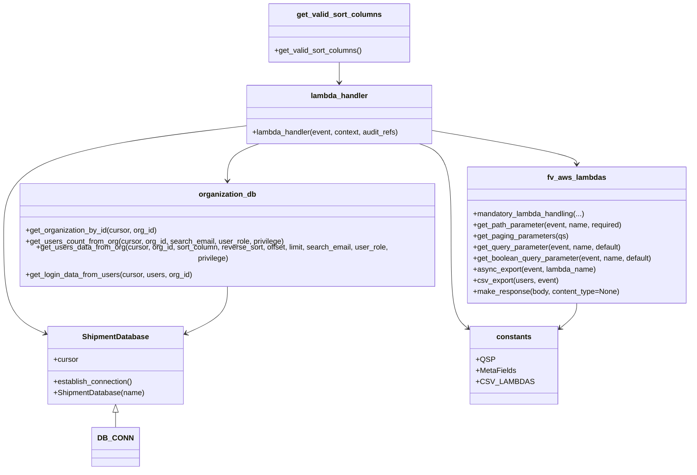

# Diagram: common/iam_service/iam_service/v1/lambdas/organizations/get_organizations_members.py


> Auto-generated by Obscura crawlers

## Diagram 1

```mermaid
flowchart LR
    Start([Start: lambda_handler]) --> GetUserOrg{get_organization_id(event)}
    GetUserOrg --> GetPathParam[get_path_parameter(event, "organization_id")]
    GetPathParam --> LogRecv[logging.info Received request]
    LogRecv --> Paging[get_paging_parameters(queryStringParameters)]
    Paging --> ComputeOffset[offset = page_size * page_number]
    ComputeOffset --> GetSort[sort_column = get_query_parameter(SORT_COLUMN)]
    GetSort --> GetFlags[reverse_sort, include_login_data, is_async_export]
    GetFlags --> CheckAsync{is_async_export?}
    CheckAsync -- yes --> SetIncludeLogin[event.queryStringParameters.INCLUDE_LOGIN_DATA = True]
    SetIncludeLogin --> LogAsync[logging.info is async export]
    LogAsync --> AsyncExport[fv.aws.lambdas.async_export(...)]
    AsyncExport --> EndAsync([Return presigned export initiation])
    CheckAsync -- no --> ValidateSort{sort_column in valid columns?}
    ValidateSort -- no --> BadSort[raise BadRequestError Invalid sort column]
    BadSort --> EndError([Error response])
    ValidateSort -- yes --> MapSort[sort_column = get_valid_sort_columns()[sort_column]]
    MapSort --> DBConnect[DB_CONN.establish_connection()]
    DBConnect --> Cursor[cursor = DB_CONN.cursor]
    Cursor --> GetOrg[organization_db.get_organization_by_id(cursor, user_org)]
    GetOrg --> OrgExists{organization is None?}
    OrgExists -- yes --> OrgMissing[raise BadRequestError organization does not exist]
    OrgMissing --> EndError
    OrgExists -- no --> GetCount[count = get_users_count_from_org(...)]
    GetCount --> BuildMeta[meta = {TOTAL_PAGES, CURRENT_PAGE, TOTAL_COUNT}]
    BuildMeta --> CheckInclude{include_login_data?}
    CheckInclude -- yes --> GetUsersAll[get_users_data_from_org(..., 0, None)]
    GetUsersAll --> AddLogin[get_login_data_from_users(cursor, users, user_org)]
    AddLogin --> CSV[fv.aws.lambdas.csv_export(users, event)]
    CSV --> ReturnCSV[fv.aws.lambdas.make_response(presigned_url, content_type="text/csv")]
    ReturnCSV --> End([Return CSV response])
    CheckInclude -- no --> GetUsersPaged[get_users_data_from_org(..., offset, page_size)]
    GetUsersPaged --> ReturnJSON[fv.aws.lambdas.make_response({"response": users, "meta": meta}, 200)]
    ReturnJSON --> End
```

> SVG rendering failed for this diagram.

## Diagram 2



### SVG

<svg id="container" width="1516.7109375" xmlns="http://www.w3.org/2000/svg" class="classDiagram" height="1014" viewBox="-35 0 1516.7109375 1014" role="graphics-document document" aria-roledescription="class"><style>#container{font-family:"trebuchet ms",verdana,arial,sans-serif;font-size:16px;fill:#333;}@keyframes edge-animation-frame{from{stroke-dashoffset:0;}}@keyframes dash{to{stroke-dashoffset:0;}}#container .edge-animation-slow{stroke-dasharray:9,5!important;stroke-dashoffset:900;animation:dash 50s linear infinite;stroke-linecap:round;}#container .edge-animation-fast{stroke-dasharray:9,5!important;stroke-dashoffset:900;animation:dash 20s linear infinite;stroke-linecap:round;}#container .error-icon{fill:#552222;}#container .error-text{fill:#552222;stroke:#552222;}#container .edge-thickness-normal{stroke-width:1px;}#container .edge-thickness-thick{stroke-width:3.5px;}#container .edge-pattern-solid{stroke-dasharray:0;}#container .edge-thickness-invisible{stroke-width:0;fill:none;}#container .edge-pattern-dashed{stroke-dasharray:3;}#container .edge-pattern-dotted{stroke-dasharray:2;}#container .marker{fill:#333333;stroke:#333333;}#container .marker.cross{stroke:#333333;}#container svg{font-family:"trebuchet ms",verdana,arial,sans-serif;font-size:16px;}#container p{margin:0;}#container g.classGroup text{fill:#9370DB;stroke:none;font-family:"trebuchet ms",verdana,arial,sans-serif;font-size:10px;}#container g.classGroup text .title{font-weight:bolder;}#container .nodeLabel,#container .edgeLabel{color:#131300;}#container .edgeLabel .label rect{fill:#ECECFF;}#container .label text{fill:#131300;}#container .labelBkg{background:#ECECFF;}#container .edgeLabel .label span{background:#ECECFF;}#container .classTitle{font-weight:bolder;}#container .node rect,#container .node circle,#container .node ellipse,#container .node polygon,#container .node path{fill:#ECECFF;stroke:#9370DB;stroke-width:1px;}#container .divider{stroke:#9370DB;stroke-width:1;}#container g.clickable{cursor:pointer;}#container g.classGroup rect{fill:#ECECFF;stroke:#9370DB;}#container g.classGroup line{stroke:#9370DB;stroke-width:1;}#container .classLabel .box{stroke:none;stroke-width:0;fill:#ECECFF;opacity:0.5;}#container .classLabel .label{fill:#9370DB;font-size:10px;}#container .relation{stroke:#333333;stroke-width:1;fill:none;}#container .dashed-line{stroke-dasharray:3;}#container .dotted-line{stroke-dasharray:1 2;}#container #compositionStart,#container .composition{fill:#333333!important;stroke:#333333!important;stroke-width:1;}#container #compositionEnd,#container .composition{fill:#333333!important;stroke:#333333!important;stroke-width:1;}#container #dependencyStart,#container .dependency{fill:#333333!important;stroke:#333333!important;stroke-width:1;}#container #dependencyStart,#container .dependency{fill:#333333!important;stroke:#333333!important;stroke-width:1;}#container #extensionStart,#container .extension{fill:transparent!important;stroke:#333333!important;stroke-width:1;}#container #extensionEnd,#container .extension{fill:transparent!important;stroke:#333333!important;stroke-width:1;}#container #aggregationStart,#container .aggregation{fill:transparent!important;stroke:#333333!important;stroke-width:1;}#container #aggregationEnd,#container .aggregation{fill:transparent!important;stroke:#333333!important;stroke-width:1;}#container #lollipopStart,#container .lollipop{fill:#ECECFF!important;stroke:#333333!important;stroke-width:1;}#container #lollipopEnd,#container .lollipop{fill:#ECECFF!important;stroke:#333333!important;stroke-width:1;}#container .edgeTerminals{font-size:11px;line-height:initial;}#container .classTitleText{text-anchor:middle;font-size:18px;fill:#333;}#container .label-icon{display:inline-block;height:1em;overflow:visible;vertical-align:-0.125em;}#container .node .label-icon path{fill:currentColor;stroke:revert;stroke-width:revert;}#container :root{--mermaid-font-family:"trebuchet ms",verdana,arial,sans-serif;}</style><g><defs><marker id="container_class-aggregationStart" class="marker aggregation class" refX="18" refY="7" markerWidth="190" markerHeight="240" orient="auto"><path d="M 18,7 L9,13 L1,7 L9,1 Z"></path></marker></defs><defs><marker id="container_class-aggregationEnd" class="marker aggregation class" refX="1" refY="7" markerWidth="20" markerHeight="28" orient="auto"><path d="M 18,7 L9,13 L1,7 L9,1 Z"></path></marker></defs><defs><marker id="container_class-extensionStart" class="marker extension class" refX="18" refY="7" markerWidth="190" markerHeight="240" orient="auto"><path d="M 1,7 L18,13 V 1 Z"></path></marker></defs><defs><marker id="container_class-extensionEnd" class="marker extension class" refX="1" refY="7" markerWidth="20" markerHeight="28" orient="auto"><path d="M 1,1 V 13 L18,7 Z"></path></marker></defs><defs><marker id="container_class-compositionStart" class="marker composition class" refX="18" refY="7" markerWidth="190" markerHeight="240" orient="auto"><path d="M 18,7 L9,13 L1,7 L9,1 Z"></path></marker></defs><defs><marker id="container_class-compositionEnd" class="marker composition class" refX="1" refY="7" markerWidth="20" markerHeight="28" orient="auto"><path d="M 18,7 L9,13 L1,7 L9,1 Z"></path></marker></defs><defs><marker id="container_class-dependencyStart" class="marker dependency class" refX="6" refY="7" markerWidth="190" markerHeight="240" orient="auto"><path d="M 5,7 L9,13 L1,7 L9,1 Z"></path></marker></defs><defs><marker id="container_class-dependencyEnd" class="marker dependency class" refX="13" refY="7" markerWidth="20" markerHeight="28" orient="auto"><path d="M 18,7 L9,13 L14,7 L9,1 Z"></path></marker></defs><defs><marker id="container_class-lollipopStart" class="marker lollipop class" refX="13" refY="7" markerWidth="190" markerHeight="240" orient="auto"><circle stroke="black" fill="transparent" cx="7" cy="7" r="6"></circle></marker></defs><defs><marker id="container_class-lollipopEnd" class="marker lollipop class" refX="1" refY="7" markerWidth="190" markerHeight="240" orient="auto"><circle stroke="black" fill="transparent" cx="7" cy="7" r="6"></circle></marker></defs><g class="root"><g class="clusters"></g><g class="edgePaths"><path d="M220.889,889.25L220.889,890.542C220.889,891.833,220.889,894.417,220.889,899.875C220.889,905.333,220.889,913.667,220.889,917.833L220.889,922" id="id_ShipmentDatabase_DB_CONN_1" class="edge-thickness-normal edge-pattern-solid relation" style=";;;" data-edge="true" data-et="edge" data-id="id_ShipmentDatabase_DB_CONN_1" data-points="W3sieCI6MjIwLjg4ODY3MTg3NSwieSI6ODcyfSx7IngiOjIyMC44ODg2NzE4NzUsInkiOjg5N30seyJ4IjoyMjAuODg4NjcxODc1LCJ5Ijo5MjJ9XQ==" marker-start="url(#container_class-extensionStart)"></path><path d="M919.498,281.328L972.354,290.273C1025.21,299.218,1130.921,317.109,1183.777,329.221C1236.633,341.333,1236.633,347.667,1236.633,350.833L1236.633,354" id="id_lambda_handler_fv_aws_lambdas_2" class="edge-thickness-normal edge-pattern-solid relation" style=";;;" data-edge="true" data-et="edge" data-id="id_lambda_handler_fv_aws_lambdas_2" data-points="W3sieCI6OTE5LjQ5ODA0Njg3NSwieSI6MjgxLjMyNzYxMjU2NTQwNTd9LHsieCI6MTIzNi42MzI4MTI1LCJ5IjozMzV9LHsieCI6MTIzNi42MzI4MTI1LCJ5IjozNjB9XQ==" marker-end="url(#container_class-dependencyEnd)"></path><path d="M539.2,310L527.463,314.167C515.726,318.333,492.252,326.667,480.514,342C468.777,357.333,468.777,379.667,468.777,390.833L468.777,402" id="id_lambda_handler_organization_db_3" class="edge-thickness-normal edge-pattern-solid relation" style=";;;" data-edge="true" data-et="edge" data-id="id_lambda_handler_organization_db_3" data-points="W3sieCI6NTM5LjIwMDI2MTg5NjMwNjgsInkiOjMxMH0seyJ4Ijo0NjguNzc3MzQzNzUsInkiOjMzNX0seyJ4Ijo0NjguNzc3MzQzNzUsInkiOjQwOH1d" marker-end="url(#container_class-dependencyEnd)"></path><path d="M513.834,271.002L423.695,281.668C333.556,292.334,153.278,313.667,63.139,353C-27,392.333,-27,449.667,-27,507C-27,564.333,-27,621.667,-10.642,657.526C5.717,693.386,38.433,707.772,54.792,714.965L71.15,722.158" id="id_lambda_handler_ShipmentDatabase_4" class="edge-thickness-normal edge-pattern-solid relation" style=";;;" data-edge="true" data-et="edge" data-id="id_lambda_handler_ShipmentDatabase_4" data-points="W3sieCI6NTEzLjgzMzk4NDM3NSwieSI6MjcxLjAwMTY1OTg1MTI5NjJ9LHsieCI6LTI3LCJ5IjozMzV9LHsieCI6LTI3LCJ5Ijo1MDd9LHsieCI6LTI3LCJ5Ijo2Nzl9LHsieCI6NzYuNjQyNTc4MTI1LCJ5Ijo3MjQuNTczMDQyNjQ5MjQ4N31d" marker-end="url(#container_class-dependencyEnd)"></path><path d="M894.132,310L905.869,314.167C917.606,318.333,941.08,326.667,952.818,359.5C964.555,392.333,964.555,449.667,964.555,507C964.555,564.333,964.555,621.667,972.387,656.609C980.219,691.551,995.884,704.102,1003.716,710.378L1011.548,716.653" id="id_lambda_handler_constants_5" class="edge-thickness-normal edge-pattern-solid relation" style=";;;" data-edge="true" data-et="edge" data-id="id_lambda_handler_constants_5" data-points="W3sieCI6ODk0LjEzMTc2OTM1MzY5MzIsInkiOjMxMH0seyJ4Ijo5NjQuNTU0Njg3NSwieSI6MzM1fSx7IngiOjk2NC41NTQ2ODc1LCJ5Ijo1MDd9LHsieCI6OTY0LjU1NDY4NzUsInkiOjY3OX0seyJ4IjoxMDE2LjIzMDQ2ODc1LCJ5Ijo3MjAuNDA0NzI2MzUzODczNn1d" marker-end="url(#container_class-dependencyEnd)"></path><path d="M716.666,134L716.666,138.167C716.666,142.333,716.666,150.667,716.666,158C716.666,165.333,716.666,171.667,716.666,174.833L716.666,178" id="id_get_valid_sort_columns_lambda_handler_6" class="edge-thickness-normal edge-pattern-solid relation" style=";;;" data-edge="true" data-et="edge" data-id="id_get_valid_sort_columns_lambda_handler_6" data-points="W3sieCI6NzE2LjY2NjAxNTYyNSwieSI6MTM0fSx7IngiOjcxNi42NjYwMTU2MjUsInkiOjE1OX0seyJ4Ijo3MTYuNjY2MDE1NjI1LCJ5IjoxODR9XQ==" marker-end="url(#container_class-dependencyEnd)"></path><path d="M468.777,606L468.777,618.167C468.777,630.333,468.777,654.667,452.419,674.026C436.061,693.386,403.344,707.772,386.986,714.965L370.627,722.158" id="id_organization_db_ShipmentDatabase_7" class="edge-thickness-normal edge-pattern-solid relation" style=";;;" data-edge="true" data-et="edge" data-id="id_organization_db_ShipmentDatabase_7" data-points="W3sieCI6NDY4Ljc3NzM0Mzc1LCJ5Ijo2MDZ9LHsieCI6NDY4Ljc3NzM0Mzc1LCJ5Ijo2Nzl9LHsieCI6MzY1LjEzNDc2NTYyNSwieSI6NzI0LjU3MzA0MjY0OTI0ODd9XQ==" marker-end="url(#container_class-dependencyEnd)"></path><path d="M1236.633,654L1236.633,658.167C1236.633,662.333,1236.633,670.667,1228.801,681.109C1220.968,691.551,1205.304,704.102,1197.472,710.378L1189.639,716.653" id="id_fv_aws_lambdas_constants_8" class="edge-thickness-normal edge-pattern-solid relation" style=";;;" data-edge="true" data-et="edge" data-id="id_fv_aws_lambdas_constants_8" data-points="W3sieCI6MTIzNi42MzI4MTI1LCJ5Ijo2NTR9LHsieCI6MTIzNi42MzI4MTI1LCJ5Ijo2Nzl9LHsieCI6MTE4NC45NTcwMzEyNSwieSI6NzIwLjQwNDcyNjM1Mzg3MzZ9XQ==" marker-end="url(#container_class-dependencyEnd)"></path></g><g class="edgeLabels"><g class="edgeLabel"><g class="label" data-id="id_ShipmentDatabase_DB_CONN_1" transform="translate(0, 0)"><foreignObject width="0" height="0"><div xmlns="http://www.w3.org/1999/xhtml" class="labelBkg" style="display: table-cell; white-space: nowrap; line-height: 1.5; max-width: 200px; text-align: center;"><span class="edgeLabel"></span></div></foreignObject></g></g><g class="edgeLabel"><g class="label" data-id="id_lambda_handler_fv_aws_lambdas_2" transform="translate(0, 0)"><foreignObject width="0" height="0"><div xmlns="http://www.w3.org/1999/xhtml" class="labelBkg" style="display: table-cell; white-space: nowrap; line-height: 1.5; max-width: 200px; text-align: center;"><span class="edgeLabel"></span></div></foreignObject></g></g><g class="edgeLabel"><g class="label" data-id="id_lambda_handler_organization_db_3" transform="translate(0, 0)"><foreignObject width="0" height="0"><div xmlns="http://www.w3.org/1999/xhtml" class="labelBkg" style="display: table-cell; white-space: nowrap; line-height: 1.5; max-width: 200px; text-align: center;"><span class="edgeLabel"></span></div></foreignObject></g></g><g class="edgeLabel"><g class="label" data-id="id_lambda_handler_ShipmentDatabase_4" transform="translate(0, 0)"><foreignObject width="0" height="0"><div xmlns="http://www.w3.org/1999/xhtml" class="labelBkg" style="display: table-cell; white-space: nowrap; line-height: 1.5; max-width: 200px; text-align: center;"><span class="edgeLabel"></span></div></foreignObject></g></g><g class="edgeLabel"><g class="label" data-id="id_lambda_handler_constants_5" transform="translate(0, 0)"><foreignObject width="0" height="0"><div xmlns="http://www.w3.org/1999/xhtml" class="labelBkg" style="display: table-cell; white-space: nowrap; line-height: 1.5; max-width: 200px; text-align: center;"><span class="edgeLabel"></span></div></foreignObject></g></g><g class="edgeLabel"><g class="label" data-id="id_get_valid_sort_columns_lambda_handler_6" transform="translate(0, 0)"><foreignObject width="0" height="0"><div xmlns="http://www.w3.org/1999/xhtml" class="labelBkg" style="display: table-cell; white-space: nowrap; line-height: 1.5; max-width: 200px; text-align: center;"><span class="edgeLabel"></span></div></foreignObject></g></g><g class="edgeLabel"><g class="label" data-id="id_organization_db_ShipmentDatabase_7" transform="translate(0, 0)"><foreignObject width="0" height="0"><div xmlns="http://www.w3.org/1999/xhtml" class="labelBkg" style="display: table-cell; white-space: nowrap; line-height: 1.5; max-width: 200px; text-align: center;"><span class="edgeLabel"></span></div></foreignObject></g></g><g class="edgeLabel"><g class="label" data-id="id_fv_aws_lambdas_constants_8" transform="translate(0, 0)"><foreignObject width="0" height="0"><div xmlns="http://www.w3.org/1999/xhtml" class="labelBkg" style="display: table-cell; white-space: nowrap; line-height: 1.5; max-width: 200px; text-align: center;"><span class="edgeLabel"></span></div></foreignObject></g></g></g><g class="nodes"><g class="node default" id="classId-lambda_handler-0" transform="translate(716.666015625, 247)"><g class="basic label-container"><path d="M-202.83203125 -63 L202.83203125 -63 L202.83203125 63 L-202.83203125 63" stroke="none" stroke-width="0" fill="#ECECFF" style=""></path><path d="M-202.83203125 -63 C-79.64307459239666 -63, 43.54588206520668 -63, 202.83203125 -63 M-202.83203125 -63 C-49.961404736822516 -63, 102.90922177635497 -63, 202.83203125 -63 M202.83203125 -63 C202.83203125 -18.52832836547796, 202.83203125 25.943343269044078, 202.83203125 63 M202.83203125 -63 C202.83203125 -20.90045810430511, 202.83203125 21.199083791389782, 202.83203125 63 M202.83203125 63 C66.14336896982923 63, -70.54529331034155 63, -202.83203125 63 M202.83203125 63 C95.44127608396626 63, -11.949479082067484 63, -202.83203125 63 M-202.83203125 63 C-202.83203125 26.18257589701369, -202.83203125 -10.634848205972617, -202.83203125 -63 M-202.83203125 63 C-202.83203125 29.722863882718997, -202.83203125 -3.5542722345620064, -202.83203125 -63" stroke="#9370DB" stroke-width="1.3" fill="none" stroke-dasharray="0 0" style=""></path></g><g class="annotation-group text" transform="translate(0, -39)"></g><g class="label-group text" transform="translate(-59.9765625, -39)"><g class="label" style="font-weight: bolder" transform="translate(0,-12)"><foreignObject width="119.953125" height="24"><div xmlns="http://www.w3.org/1999/xhtml" style="display: table-cell; white-space: nowrap; line-height: 1.5; max-width: 170px; text-align: center;"><span class="nodeLabel markdown-node-label" style=""><p>lambda_handler</p></span></div></foreignObject></g></g><g class="members-group text" transform="translate(-190.83203125, 9)"></g><g class="methods-group text" transform="translate(-190.83203125, 39)"><g class="label" style="" transform="translate(0,-12)"><foreignObject width="321.6875" height="24"><div xmlns="http://www.w3.org/1999/xhtml" style="display: table-cell; white-space: nowrap; line-height: 1.5; max-width: 379px; text-align: center;"><span class="nodeLabel markdown-node-label" style=""><p>+lambda_handler(event, context, audit_refs)</p></span></div></foreignObject></g></g><g class="divider" style=""><path d="M-202.83203125 -15 C-104.56769447461693 -15, -6.303357699233857 -15, 202.83203125 -15 M-202.83203125 -15 C-85.20634074525907 -15, 32.41934975948186 -15, 202.83203125 -15" stroke="#9370DB" stroke-width="1.3" fill="none" stroke-dasharray="0 0" style=""></path></g><g class="divider" style=""><path d="M-202.83203125 9 C-96.614644799825 9, 9.602741650349998 9, 202.83203125 9 M-202.83203125 9 C-47.921426262651664 9, 106.98917872469667 9, 202.83203125 9" stroke="#9370DB" stroke-width="1.3" fill="none" stroke-dasharray="0 0" style=""></path></g></g><g class="node default" id="classId-get_valid_sort_columns-1" transform="translate(716.666015625, 71)"><g class="basic label-container"><path d="M-150.43359375 -63 L150.43359375 -63 L150.43359375 63 L-150.43359375 63" stroke="none" stroke-width="0" fill="#ECECFF" style=""></path><path d="M-150.43359375 -63 C-81.33020011915744 -63, -12.226806488314878 -63, 150.43359375 -63 M-150.43359375 -63 C-53.62859843318073 -63, 43.176396883638546 -63, 150.43359375 -63 M150.43359375 -63 C150.43359375 -19.639381547216793, 150.43359375 23.721236905566414, 150.43359375 63 M150.43359375 -63 C150.43359375 -32.34669860244817, 150.43359375 -1.6933972048963355, 150.43359375 63 M150.43359375 63 C52.43628515377324 63, -45.56102344245352 63, -150.43359375 63 M150.43359375 63 C31.322176456879262 63, -87.78924083624148 63, -150.43359375 63 M-150.43359375 63 C-150.43359375 23.456493235991374, -150.43359375 -16.087013528017252, -150.43359375 -63 M-150.43359375 63 C-150.43359375 27.182873512297625, -150.43359375 -8.634252975404749, -150.43359375 -63" stroke="#9370DB" stroke-width="1.3" fill="none" stroke-dasharray="0 0" style=""></path></g><g class="annotation-group text" transform="translate(0, -39)"></g><g class="label-group text" transform="translate(-86.8515625, -39)"><g class="label" style="font-weight: bolder" transform="translate(0,-12)"><foreignObject width="173.703125" height="24"><div xmlns="http://www.w3.org/1999/xhtml" style="display: table-cell; white-space: nowrap; line-height: 1.5; max-width: 222px; text-align: center;"><span class="nodeLabel markdown-node-label" style=""><p>get_valid_sort_columns</p></span></div></foreignObject></g></g><g class="members-group text" transform="translate(-138.43359375, 9)"></g><g class="methods-group text" transform="translate(-138.43359375, 39)"><g class="label" style="" transform="translate(0,-12)"><foreignObject width="190.015625" height="24"><div xmlns="http://www.w3.org/1999/xhtml" style="display: table-cell; white-space: nowrap; line-height: 1.5; max-width: 247px; text-align: center;"><span class="nodeLabel markdown-node-label" style=""><p>+get_valid_sort_columns()</p></span></div></foreignObject></g></g><g class="divider" style=""><path d="M-150.43359375 -15 C-48.51346341268338 -15, 53.40666692463324 -15, 150.43359375 -15 M-150.43359375 -15 C-81.22429850789074 -15, -12.015003265781473 -15, 150.43359375 -15" stroke="#9370DB" stroke-width="1.3" fill="none" stroke-dasharray="0 0" style=""></path></g><g class="divider" style=""><path d="M-150.43359375 9 C-82.11035499164913 9, -13.787116233298264 9, 150.43359375 9 M-150.43359375 9 C-87.52894717618815 9, -24.624300602376323 9, 150.43359375 9" stroke="#9370DB" stroke-width="1.3" fill="none" stroke-dasharray="0 0" style=""></path></g></g><g class="node default" id="classId-ShipmentDatabase-2" transform="translate(220.888671875, 788)"><g class="basic label-container"><path d="M-144.24609375 -84 L144.24609375 -84 L144.24609375 84 L-144.24609375 84" stroke="none" stroke-width="0" fill="#ECECFF" style=""></path><path d="M-144.24609375 -84 C-55.49663811265725 -84, 33.2528175246855 -84, 144.24609375 -84 M-144.24609375 -84 C-70.72797039383175 -84, 2.7901529623364922 -84, 144.24609375 -84 M144.24609375 -84 C144.24609375 -21.029405929768316, 144.24609375 41.94118814046337, 144.24609375 84 M144.24609375 -84 C144.24609375 -37.0600555492535, 144.24609375 9.879888901493004, 144.24609375 84 M144.24609375 84 C83.64544521229251 84, 23.044796674585015 84, -144.24609375 84 M144.24609375 84 C58.838749880393806 84, -26.56859398921239 84, -144.24609375 84 M-144.24609375 84 C-144.24609375 27.10035487751192, -144.24609375 -29.799290244976163, -144.24609375 -84 M-144.24609375 84 C-144.24609375 23.013721213332246, -144.24609375 -37.97255757333551, -144.24609375 -84" stroke="#9370DB" stroke-width="1.3" fill="none" stroke-dasharray="0 0" style=""></path></g><g class="annotation-group text" transform="translate(0, -60)"></g><g class="label-group text" transform="translate(-69.2734375, -60)"><g class="label" style="font-weight: bolder" transform="translate(0,-12)"><foreignObject width="138.546875" height="24"><div xmlns="http://www.w3.org/1999/xhtml" style="display: table-cell; white-space: nowrap; line-height: 1.5; max-width: 187px; text-align: center;"><span class="nodeLabel markdown-node-label" style=""><p>ShipmentDatabase</p></span></div></foreignObject></g></g><g class="members-group text" transform="translate(-132.24609375, -12)"><g class="label" style="" transform="translate(0,-12)"><foreignObject width="53.71875" height="24"><div xmlns="http://www.w3.org/1999/xhtml" style="display: table-cell; white-space: nowrap; line-height: 1.5; max-width: 112px; text-align: center;"><span class="nodeLabel markdown-node-label" style=""><p>+cursor</p></span></div></foreignObject></g></g><g class="methods-group text" transform="translate(-132.24609375, 36)"><g class="label" style="" transform="translate(0,-12)"><foreignObject width="173.265625" height="24"><div xmlns="http://www.w3.org/1999/xhtml" style="display: table-cell; white-space: nowrap; line-height: 1.5; max-width: 231px; text-align: center;"><span class="nodeLabel markdown-node-label" style=""><p>+establish_connection()</p></span></div></foreignObject></g><g class="label" style="" transform="translate(0,12)"><foreignObject width="195.21875" height="24"><div xmlns="http://www.w3.org/1999/xhtml" style="display: table-cell; white-space: nowrap; line-height: 1.5; max-width: 253px; text-align: center;"><span class="nodeLabel markdown-node-label" style=""><p>+ShipmentDatabase(name)</p></span></div></foreignObject></g></g><g class="divider" style=""><path d="M-144.24609375 -36 C-79.86182675691065 -36, -15.47755976382129 -36, 144.24609375 -36 M-144.24609375 -36 C-62.83611376347913 -36, 18.573866223041733 -36, 144.24609375 -36" stroke="#9370DB" stroke-width="1.3" fill="none" stroke-dasharray="0 0" style=""></path></g><g class="divider" style=""><path d="M-144.24609375 12 C-49.96884368940256 12, 44.30840637119488 12, 144.24609375 12 M-144.24609375 12 C-82.95110746360675 12, -21.656121177213493 12, 144.24609375 12" stroke="#9370DB" stroke-width="1.3" fill="none" stroke-dasharray="0 0" style=""></path></g></g><g class="node default" id="classId-organization_db-3" transform="translate(468.77734375, 507)"><g class="basic label-container"><path d="M-460.77734375 -99 L460.77734375 -99 L460.77734375 99 L-460.77734375 99" stroke="none" stroke-width="0" fill="#ECECFF" style=""></path><path d="M-460.77734375 -99 C-199.71526435292589 -99, 61.34681504414823 -99, 460.77734375 -99 M-460.77734375 -99 C-261.0521003569192 -99, -61.326856963838395 -99, 460.77734375 -99 M460.77734375 -99 C460.77734375 -44.793067091806634, 460.77734375 9.413865816386732, 460.77734375 99 M460.77734375 -99 C460.77734375 -30.421324557210795, 460.77734375 38.15735088557841, 460.77734375 99 M460.77734375 99 C124.62252017378762 99, -211.53230340242476 99, -460.77734375 99 M460.77734375 99 C232.0074017695189 99, 3.237459789037814 99, -460.77734375 99 M-460.77734375 99 C-460.77734375 34.69313921643044, -460.77734375 -29.613721567139123, -460.77734375 -99 M-460.77734375 99 C-460.77734375 42.179847177636034, -460.77734375 -14.640305644727931, -460.77734375 -99" stroke="#9370DB" stroke-width="1.3" fill="none" stroke-dasharray="0 0" style=""></path></g><g class="annotation-group text" transform="translate(0, -75)"></g><g class="label-group text" transform="translate(-59.4140625, -75)"><g class="label" style="font-weight: bolder" transform="translate(0,-12)"><foreignObject width="118.828125" height="24"><div xmlns="http://www.w3.org/1999/xhtml" style="display: table-cell; white-space: nowrap; line-height: 1.5; max-width: 167px; text-align: center;"><span class="nodeLabel markdown-node-label" style=""><p>organization_db</p></span></div></foreignObject></g></g><g class="members-group text" transform="translate(-448.77734375, -27)"></g><g class="methods-group text" transform="translate(-448.77734375, 3)"><g class="label" style="" transform="translate(0,-12)"><foreignObject width="285.421875" height="24"><div xmlns="http://www.w3.org/1999/xhtml" style="display: table-cell; white-space: nowrap; line-height: 1.5; max-width: 343px; text-align: center;"><span class="nodeLabel markdown-node-label" style=""><p>+get_organization_by_id(cursor, org_id)</p></span></div></foreignObject></g><g class="label" style="" transform="translate(0,12)"><foreignObject width="558.671875" height="24"><div xmlns="http://www.w3.org/1999/xhtml" style="display: table-cell; white-space: nowrap; line-height: 1.5; max-width: 616px; text-align: center;"><span class="nodeLabel markdown-node-label" style=""><p>+get_users_count_from_org(cursor, org_id, search_email, user_role, privilege)</p></span></div></foreignObject></g><g class="label" style="" transform="translate(0,36)"><foreignObject width="838.140625" height="24"><div xmlns="http://www.w3.org/1999/xhtml" style="display: table-cell; white-space: nowrap; line-height: 1.5; max-width: 896px; text-align: center;"><span class="nodeLabel markdown-node-label" style=""><p>+get_users_data_from_org(cursor, org_id, sort_column, reverse_sort, offset, limit, search_email, user_role, privilege)</p></span></div></foreignObject></g><g class="label" style="" transform="translate(0,60)"><foreignObject width="360.484375" height="24"><div xmlns="http://www.w3.org/1999/xhtml" style="display: table-cell; white-space: nowrap; line-height: 1.5; max-width: 418px; text-align: center;"><span class="nodeLabel markdown-node-label" style=""><p>+get_login_data_from_users(cursor, users, org_id)</p></span></div></foreignObject></g></g><g class="divider" style=""><path d="M-460.77734375 -51 C-256.968194645876 -51, -53.15904554175205 -51, 460.77734375 -51 M-460.77734375 -51 C-120.7919334175059 -51, 219.1934769149882 -51, 460.77734375 -51" stroke="#9370DB" stroke-width="1.3" fill="none" stroke-dasharray="0 0" style=""></path></g><g class="divider" style=""><path d="M-460.77734375 -27 C-195.21829925291678 -27, 70.34074524416644 -27, 460.77734375 -27 M-460.77734375 -27 C-132.0488327444309 -27, 196.67967826113818 -27, 460.77734375 -27" stroke="#9370DB" stroke-width="1.3" fill="none" stroke-dasharray="0 0" style=""></path></g></g><g class="node default" id="classId-fv_aws_lambdas-4" transform="translate(1236.6328125, 507)"><g class="basic label-container"><path d="M-237.078125 -147 L237.078125 -147 L237.078125 147 L-237.078125 147" stroke="none" stroke-width="0" fill="#ECECFF" style=""></path><path d="M-237.078125 -147 C-69.82973412232707 -147, 97.41865675534586 -147, 237.078125 -147 M-237.078125 -147 C-101.10330842989234 -147, 34.871508140215326 -147, 237.078125 -147 M237.078125 -147 C237.078125 -65.94361509330624, 237.078125 15.11276981338753, 237.078125 147 M237.078125 -147 C237.078125 -80.1734775923983, 237.078125 -13.346955184796599, 237.078125 147 M237.078125 147 C65.55380351071847 147, -105.97051797856307 147, -237.078125 147 M237.078125 147 C63.95151651205444 147, -109.17509197589112 147, -237.078125 147 M-237.078125 147 C-237.078125 84.26336546822853, -237.078125 21.52673093645707, -237.078125 -147 M-237.078125 147 C-237.078125 37.51633942553194, -237.078125 -71.96732114893612, -237.078125 -147" stroke="#9370DB" stroke-width="1.3" fill="none" stroke-dasharray="0 0" style=""></path></g><g class="annotation-group text" transform="translate(0, -123)"></g><g class="label-group text" transform="translate(-60.0625, -123)"><g class="label" style="font-weight: bolder" transform="translate(0,-12)"><foreignObject width="120.125" height="24"><div xmlns="http://www.w3.org/1999/xhtml" style="display: table-cell; white-space: nowrap; line-height: 1.5; max-width: 168px; text-align: center;"><span class="nodeLabel markdown-node-label" style=""><p>fv_aws_lambdas</p></span></div></foreignObject></g></g><g class="members-group text" transform="translate(-225.078125, -75)"></g><g class="methods-group text" transform="translate(-225.078125, -45)"><g class="label" style="" transform="translate(0,-12)"><foreignObject width="243.59375" height="24"><div xmlns="http://www.w3.org/1999/xhtml" style="display: table-cell; white-space: nowrap; line-height: 1.5; max-width: 301px; text-align: center;"><span class="nodeLabel markdown-node-label" style=""><p>+mandatory_lambda_handling(...)</p></span></div></foreignObject></g><g class="label" style="" transform="translate(0,12)"><foreignObject width="324.703125" height="24"><div xmlns="http://www.w3.org/1999/xhtml" style="display: table-cell; white-space: nowrap; line-height: 1.5; max-width: 382px; text-align: center;"><span class="nodeLabel markdown-node-label" style=""><p>+get_path_parameter(event, name, required)</p></span></div></foreignObject></g><g class="label" style="" transform="translate(0,36)"><foreignObject width="205.546875" height="24"><div xmlns="http://www.w3.org/1999/xhtml" style="display: table-cell; white-space: nowrap; line-height: 1.5; max-width: 263px; text-align: center;"><span class="nodeLabel markdown-node-label" style=""><p>+get_paging_parameters(qs)</p></span></div></foreignObject></g><g class="label" style="" transform="translate(0,60)"><foreignObject width="322.328125" height="24"><div xmlns="http://www.w3.org/1999/xhtml" style="display: table-cell; white-space: nowrap; line-height: 1.5; max-width: 380px; text-align: center;"><span class="nodeLabel markdown-node-label" style=""><p>+get_query_parameter(event, name, default)</p></span></div></foreignObject></g><g class="label" style="" transform="translate(0,84)"><foreignObject width="390.09375" height="24"><div xmlns="http://www.w3.org/1999/xhtml" style="display: table-cell; white-space: nowrap; line-height: 1.5; max-width: 447px; text-align: center;"><span class="nodeLabel markdown-node-label" style=""><p>+get_boolean_query_parameter(event, name, default)</p></span></div></foreignObject></g><g class="label" style="" transform="translate(0,108)"><foreignObject width="266.015625" height="24"><div xmlns="http://www.w3.org/1999/xhtml" style="display: table-cell; white-space: nowrap; line-height: 1.5; max-width: 323px; text-align: center;"><span class="nodeLabel markdown-node-label" style=""><p>+async_export(event, lambda_name)</p></span></div></foreignObject></g><g class="label" style="" transform="translate(0,132)"><foreignObject width="183.0625" height="24"><div xmlns="http://www.w3.org/1999/xhtml" style="display: table-cell; white-space: nowrap; line-height: 1.5; max-width: 240px; text-align: center;"><span class="nodeLabel markdown-node-label" style=""><p>+csv_export(users, event)</p></span></div></foreignObject></g><g class="label" style="" transform="translate(0,156)"><foreignObject width="317.1875" height="24"><div xmlns="http://www.w3.org/1999/xhtml" style="display: table-cell; white-space: nowrap; line-height: 1.5; max-width: 375px; text-align: center;"><span class="nodeLabel markdown-node-label" style=""><p>+make_response(body, content_type=None)</p></span></div></foreignObject></g></g><g class="divider" style=""><path d="M-237.078125 -99 C-105.30707378441133 -99, 26.46397743117734 -99, 237.078125 -99 M-237.078125 -99 C-121.4829428610002 -99, -5.887760722000394 -99, 237.078125 -99" stroke="#9370DB" stroke-width="1.3" fill="none" stroke-dasharray="0 0" style=""></path></g><g class="divider" style=""><path d="M-237.078125 -75 C-82.97455229861754 -75, 71.12902040276492 -75, 237.078125 -75 M-237.078125 -75 C-80.42238254820833 -75, 76.23335990358333 -75, 237.078125 -75" stroke="#9370DB" stroke-width="1.3" fill="none" stroke-dasharray="0 0" style=""></path></g></g><g class="node default" id="classId-constants-5" transform="translate(1100.59375, 788)"><g class="basic label-container"><path d="M-84.36328125 -84 L84.36328125 -84 L84.36328125 84 L-84.36328125 84" stroke="none" stroke-width="0" fill="#ECECFF" style=""></path><path d="M-84.36328125 -84 C-49.0863345913073 -84, -13.809387932614598 -84, 84.36328125 -84 M-84.36328125 -84 C-48.4445250257872 -84, -12.5257688015744 -84, 84.36328125 -84 M84.36328125 -84 C84.36328125 -19.978864245753257, 84.36328125 44.042271508493485, 84.36328125 84 M84.36328125 -84 C84.36328125 -20.745356418578403, 84.36328125 42.509287162843194, 84.36328125 84 M84.36328125 84 C25.02479148656804 84, -34.31369827686392 84, -84.36328125 84 M84.36328125 84 C43.92205788499978 84, 3.4808345199995614 84, -84.36328125 84 M-84.36328125 84 C-84.36328125 44.940281881875315, -84.36328125 5.880563763750629, -84.36328125 -84 M-84.36328125 84 C-84.36328125 38.469217654356896, -84.36328125 -7.061564691286208, -84.36328125 -84" stroke="#9370DB" stroke-width="1.3" fill="none" stroke-dasharray="0 0" style=""></path></g><g class="annotation-group text" transform="translate(0, -60)"></g><g class="label-group text" transform="translate(-35.7734375, -60)"><g class="label" style="font-weight: bolder" transform="translate(0,-12)"><foreignObject width="71.546875" height="24"><div xmlns="http://www.w3.org/1999/xhtml" style="display: table-cell; white-space: nowrap; line-height: 1.5; max-width: 121px; text-align: center;"><span class="nodeLabel markdown-node-label" style=""><p>constants</p></span></div></foreignObject></g></g><g class="members-group text" transform="translate(-72.36328125, -12)"><g class="label" style="" transform="translate(0,-12)"><foreignObject width="37.0625" height="24"><div xmlns="http://www.w3.org/1999/xhtml" style="display: table-cell; white-space: nowrap; line-height: 1.5; max-width: 94px; text-align: center;"><span class="nodeLabel markdown-node-label" style=""><p>+QSP</p></span></div></foreignObject></g><g class="label" style="" transform="translate(0,12)"><foreignObject width="85.703125" height="24"><div xmlns="http://www.w3.org/1999/xhtml" style="display: table-cell; white-space: nowrap; line-height: 1.5; max-width: 143px; text-align: center;"><span class="nodeLabel markdown-node-label" style=""><p>+MetaFields</p></span></div></foreignObject></g><g class="label" style="" transform="translate(0,36)"><foreignObject width="108.953125" height="24"><div xmlns="http://www.w3.org/1999/xhtml" style="display: table-cell; white-space: nowrap; line-height: 1.5; max-width: 167px; text-align: center;"><span class="nodeLabel markdown-node-label" style=""><p>+CSV_LAMBDAS</p></span></div></foreignObject></g></g><g class="methods-group text" transform="translate(-72.36328125, 84)"></g><g class="divider" style=""><path d="M-84.36328125 -36 C-34.8887958291559 -36, 14.585689591688194 -36, 84.36328125 -36 M-84.36328125 -36 C-32.04643294757785 -36, 20.270415354844303 -36, 84.36328125 -36" stroke="#9370DB" stroke-width="1.3" fill="none" stroke-dasharray="0 0" style=""></path></g><g class="divider" style=""><path d="M-84.36328125 60 C-46.75891314475417 60, -9.154545039508335 60, 84.36328125 60 M-84.36328125 60 C-33.32633366713428 60, 17.710613915731443 60, 84.36328125 60" stroke="#9370DB" stroke-width="1.3" fill="none" stroke-dasharray="0 0" style=""></path></g></g><g class="node default" id="classId-DB_CONN-6" transform="translate(220.888671875, 964)"><g class="basic label-container"><path d="M-46.40625 -42 L46.40625 -42 L46.40625 42 L-46.40625 42" stroke="none" stroke-width="0" fill="#ECECFF" style=""></path><path d="M-46.40625 -42 C-9.784398050411333 -42, 26.837453899177333 -42, 46.40625 -42 M-46.40625 -42 C-24.214863651635998 -42, -2.0234773032719957 -42, 46.40625 -42 M46.40625 -42 C46.40625 -13.888057074937926, 46.40625 14.223885850124148, 46.40625 42 M46.40625 -42 C46.40625 -21.43961629149737, 46.40625 -0.8792325829947387, 46.40625 42 M46.40625 42 C19.136649647614526 42, -8.132950704770948 42, -46.40625 42 M46.40625 42 C27.221474692175292 42, 8.036699384350584 42, -46.40625 42 M-46.40625 42 C-46.40625 17.521922478494208, -46.40625 -6.956155043011584, -46.40625 -42 M-46.40625 42 C-46.40625 15.535216306511714, -46.40625 -10.929567386976572, -46.40625 -42" stroke="#9370DB" stroke-width="1.3" fill="none" stroke-dasharray="0 0" style=""></path></g><g class="annotation-group text" transform="translate(0, -18)"></g><g class="label-group text" transform="translate(-34.40625, -18)"><g class="label" style="font-weight: bolder" transform="translate(0,-12)"><foreignObject width="68.8125" height="24"><div xmlns="http://www.w3.org/1999/xhtml" style="display: table-cell; white-space: nowrap; line-height: 1.5; max-width: 119px; text-align: center;"><span class="nodeLabel markdown-node-label" style=""><p>DB_CONN</p></span></div></foreignObject></g></g><g class="members-group text" transform="translate(-34.40625, 30)"></g><g class="methods-group text" transform="translate(-34.40625, 60)"></g><g class="divider" style=""><path d="M-46.40625 6 C-19.489672350183568 6, 7.426905299632864 6, 46.40625 6 M-46.40625 6 C-21.190003344219157 6, 4.026243311561686 6, 46.40625 6" stroke="#9370DB" stroke-width="1.3" fill="none" stroke-dasharray="0 0" style=""></path></g><g class="divider" style=""><path d="M-46.40625 24 C-13.658094806194327 24, 19.090060387611345 24, 46.40625 24 M-46.40625 24 C-19.052433887554983 24, 8.301382224890034 24, 46.40625 24" stroke="#9370DB" stroke-width="1.3" fill="none" stroke-dasharray="0 0" style=""></path></g></g></g></g></g></svg>
