# Diagram: common/iam_service/iam_service/v1/lambdas/organizations/organization_external_mapping/api.py

> Auto-generated by Obscura crawlers

## Mermaid

```mermaid
flowchart LR
  LambdaHandler["lambda_handler(event, context, audit_refs)"]
  FV_DB["fv.db.FvDatabaseConnector\n(DB_CONN_SHIPMENTS_TRACKING)"]
  Establish["establish_connection()"]
  Cursor["cursor"]
  Factory["OrganizationExternalMappingFactory"]
  CreateRequest["create_request(event)"]
  CreateRepo["create_repository(cursor)"]
  CreateHandler["create_handler(request, repository)"]
  Request["request"]
  Repository["repository"]
  Handler["handler"]
  Execute["handler.execute()"]
  Response["response"]
  MakeResponse["fv.aws.lambdas.make_response(response, 200)"]
  Return["return HTTP 200"]

  LambdaHandler --> FV_DB
  FV_DB --> Establish
  Establish --> Cursor
  Cursor --> CreateRepo
  LambdaHandler --> Factory
  Factory --> CreateRequest
  Factory --> CreateRepo
  Factory --> CreateHandler
  CreateRequest --> Request
  CreateRepo --> Repository
  CreateHandler --> Handler
  Request --> CreateHandler
  Repository --> CreateHandler
  Handler --> Execute
  Execute --> Response
  Response --> MakeResponse
  MakeResponse --> Return
```

### SVG

<svg id="container" width="3505.21875" xmlns="http://www.w3.org/2000/svg" class="flowchart" height="217" viewBox="0 0 3505.21875 217" role="graphics-document document" aria-roledescription="flowchart-v2"><g><marker id="container_flowchart-v2-pointEnd" class="marker flowchart-v2" viewBox="0 0 10 10" refX="5" refY="5" markerUnits="userSpaceOnUse" markerWidth="8" markerHeight="8" orient="auto"><path d="M 0 0 L 10 5 L 0 10 z" class="arrowMarkerPath" style="stroke-width: 1; stroke-dasharray: 1, 0;"></path></marker><marker id="container_flowchart-v2-pointStart" class="marker flowchart-v2" viewBox="0 0 10 10" refX="4.5" refY="5" markerUnits="userSpaceOnUse" markerWidth="8" markerHeight="8" orient="auto"><path d="M 0 5 L 10 10 L 10 0 z" class="arrowMarkerPath" style="stroke-width: 1; stroke-dasharray: 1, 0;"></path></marker><marker id="container_flowchart-v2-circleEnd" class="marker flowchart-v2" viewBox="0 0 10 10" refX="11" refY="5" markerUnits="userSpaceOnUse" markerWidth="11" markerHeight="11" orient="auto"><circle cx="5" cy="5" r="5" class="arrowMarkerPath" style="stroke-width: 1; stroke-dasharray: 1, 0;"></circle></marker><marker id="container_flowchart-v2-circleStart" class="marker flowchart-v2" viewBox="0 0 10 10" refX="-1" refY="5" markerUnits="userSpaceOnUse" markerWidth="11" markerHeight="11" orient="auto"><circle cx="5" cy="5" r="5" class="arrowMarkerPath" style="stroke-width: 1; stroke-dasharray: 1, 0;"></circle></marker><marker id="container_flowchart-v2-crossEnd" class="marker cross flowchart-v2" viewBox="0 0 11 11" refX="12" refY="5.2" markerUnits="userSpaceOnUse" markerWidth="11" markerHeight="11" orient="auto"><path d="M 1,1 l 9,9 M 10,1 l -9,9" class="arrowMarkerPath" style="stroke-width: 2; stroke-dasharray: 1, 0;"></path></marker><marker id="container_flowchart-v2-crossStart" class="marker cross flowchart-v2" viewBox="0 0 11 11" refX="-1" refY="5.2" markerUnits="userSpaceOnUse" markerWidth="11" markerHeight="11" orient="auto"><path d="M 1,1 l 9,9 M 10,1 l -9,9" class="arrowMarkerPath" style="stroke-width: 2; stroke-dasharray: 1, 0;"></path></marker><g class="root"><g class="clusters"></g><g class="edgePaths"><path d="M254.25,169L260.708,171.167C267.167,173.333,280.083,177.667,290.042,179.833C300,182,307,182,310.5,182L314,182" id="L_LambdaHandler_FV_DB_0" class="edge-thickness-normal edge-pattern-solid edge-thickness-normal edge-pattern-solid flowchart-link" style=";" data-edge="true" data-et="edge" data-id="L_LambdaHandler_FV_DB_0" data-points="W3sieCI6MjU0LjI1LCJ5IjoxNjl9LHsieCI6MjkzLCJ5IjoxODJ9LHsieCI6MzE4LCJ5IjoxODJ9XQ==" marker-end="url(#container_flowchart-v2-pointEnd)"></path><path d="M837.75,182L841.917,182C846.083,182,854.417,182,862.083,182C869.75,182,876.75,182,880.25,182L883.75,182" id="L_FV_DB_Establish_0" class="edge-thickness-normal edge-pattern-solid edge-thickness-normal edge-pattern-solid flowchart-link" style=";" data-edge="true" data-et="edge" data-id="L_FV_DB_Establish_0" data-points="W3sieCI6ODM3Ljc1LCJ5IjoxODJ9LHsieCI6ODYyLjc1LCJ5IjoxODJ9LHsieCI6ODg3Ljc1LCJ5IjoxODJ9XQ==" marker-end="url(#container_flowchart-v2-pointEnd)"></path><path d="M1113.031,182L1117.198,182C1121.365,182,1129.698,182,1155.72,182C1181.742,182,1225.453,182,1247.309,182L1269.164,182" id="L_Establish_Cursor_0" class="edge-thickness-normal edge-pattern-solid edge-thickness-normal edge-pattern-solid flowchart-link" style=";" data-edge="true" data-et="edge" data-id="L_Establish_Cursor_0" data-points="W3sieCI6MTExMy4wMzEyNSwieSI6MTgyfSx7IngiOjExMzguMDMxMjUsInkiOjE4Mn0seyJ4IjoxMjczLjE2NDA2MjUsInkiOjE4Mn1d" marker-end="url(#container_flowchart-v2-pointEnd)"></path><path d="M1378.898,182L1401.421,182C1423.943,182,1468.987,182,1495.009,182C1521.031,182,1528.031,182,1531.531,182L1535.031,182" id="L_Cursor_CreateRepo_0" class="edge-thickness-normal edge-pattern-solid edge-thickness-normal edge-pattern-solid flowchart-link" style=";" data-edge="true" data-et="edge" data-id="L_Cursor_CreateRepo_0" data-points="W3sieCI6MTM3OC44OTg0Mzc1LCJ5IjoxODJ9LHsieCI6MTUxNC4wMzEyNSwieSI6MTgyfSx7IngiOjE1MzkuMDMxMjUsInkiOjE4Mn1d" marker-end="url(#container_flowchart-v2-pointEnd)"></path><path d="M254.25,91L260.708,88.833C267.167,86.667,280.083,82.333,334.021,80.167C387.958,78,482.917,78,577.875,78C672.833,78,767.792,78,838.211,78C908.63,78,954.51,78,1000.391,78C1046.271,78,1092.151,78,1118.591,78C1145.031,78,1152.031,78,1155.531,78L1159.031,78" id="L_LambdaHandler_Factory_0" class="edge-thickness-normal edge-pattern-solid edge-thickness-normal edge-pattern-solid flowchart-link" style=";" data-edge="true" data-et="edge" data-id="L_LambdaHandler_Factory_0" data-points="W3sieCI6MjU0LjI1LCJ5Ijo5MX0seyJ4IjoyOTMsInkiOjc4fSx7IngiOjU3Ny44NzUsInkiOjc4fSx7IngiOjg2Mi43NSwieSI6Nzh9LHsieCI6MTAwMC4zOTA2MjUsInkiOjc4fSx7IngiOjExMzguMDMxMjUsInkiOjc4fSx7IngiOjExNjMuMDMxMjUsInkiOjc4fV0=" marker-end="url(#container_flowchart-v2-pointEnd)"></path><path d="M1489.031,78L1493.198,78C1497.365,78,1505.698,78,1515.389,78C1525.081,78,1536.13,78,1541.655,78L1547.18,78" id="L_Factory_CreateRequest_0" class="edge-thickness-normal edge-pattern-solid edge-thickness-normal edge-pattern-solid flowchart-link" style=";" data-edge="true" data-et="edge" data-id="L_Factory_CreateRequest_0" data-points="W3sieCI6MTQ4OS4wMzEyNSwieSI6Nzh9LHsieCI6MTUxNC4wMzEyNSwieSI6Nzh9LHsieCI6MTU1MS4xNzk2ODc1LCJ5Ijo3OH1d" marker-end="url(#container_flowchart-v2-pointEnd)"></path><path d="M1366.967,105L1391.477,121.167C1415.988,137.333,1465.01,169.667,1493.027,185.355C1521.043,201.043,1528.056,200.086,1531.562,199.608L1535.068,199.129" id="L_Factory_CreateRepo_0" class="edge-thickness-normal edge-pattern-solid edge-thickness-normal edge-pattern-solid flowchart-link" style=";" data-edge="true" data-et="edge" data-id="L_Factory_CreateRepo_0" data-points="W3sieCI6MTM2Ni45NjY3MzM4NzA5Njc4LCJ5IjoxMDV9LHsieCI6MTUxNC4wMzEyNSwieSI6MjAyfSx7IngiOjE1MzkuMDMxMjUsInkiOjE5OC41ODg2Njc5ODE0NTA5fV0=" marker-end="url(#container_flowchart-v2-pointEnd)"></path><path d="M1407.902,51L1425.59,45.167C1443.279,39.333,1478.655,27.667,1520.771,21.833C1562.888,16,1611.745,16,1660.602,16C1709.458,16,1758.315,16,1798.092,16C1837.87,16,1868.568,16,1899.266,16C1929.964,16,1960.661,16,1979.523,16.703C1998.385,17.405,2005.411,18.81,2008.924,19.513L2012.437,20.216" id="L_Factory_CreateHandler_0" class="edge-thickness-normal edge-pattern-solid edge-thickness-normal edge-pattern-solid flowchart-link" style=";" data-edge="true" data-et="edge" data-id="L_Factory_CreateHandler_0" data-points="W3sieCI6MTQwNy45MDIyMTc3NDE5MzU2LCJ5Ijo1MX0seyJ4IjoxNTE0LjAzMTI1LCJ5IjoxNn0seyJ4IjoxNjYwLjYwMTU2MjUsInkiOjE2fSx7IngiOjE4MDcuMTcxODc1LCJ5IjoxNn0seyJ4IjoxODk5LjI2NTYyNSwieSI6MTZ9LHsieCI6MTk5MS4zNTkzNzUsInkiOjE2fSx7IngiOjIwMTYuMzU5Mzc1LCJ5IjoyMX1d" marker-end="url(#container_flowchart-v2-pointEnd)"></path><path d="M1770.023,78L1776.215,78C1782.406,78,1794.789,78,1806.057,78C1817.326,78,1827.479,78,1832.556,78L1837.633,78" id="L_CreateRequest_Request_0" class="edge-thickness-normal edge-pattern-solid edge-thickness-normal edge-pattern-solid flowchart-link" style=";" data-edge="true" data-et="edge" data-id="L_CreateRequest_Request_0" data-points="W3sieCI6MTc3MC4wMjM0Mzc1LCJ5Ijo3OH0seyJ4IjoxODA3LjE3MTg3NSwieSI6Nzh9LHsieCI6MTg0MS42MzI4MTI1LCJ5Ijo3OH1d" marker-end="url(#container_flowchart-v2-pointEnd)"></path><path d="M1782.172,182L1786.339,182C1790.505,182,1798.839,182,1806.505,182C1814.172,182,1821.172,182,1824.672,182L1828.172,182" id="L_CreateRepo_Repository_0" class="edge-thickness-normal edge-pattern-solid edge-thickness-normal edge-pattern-solid flowchart-link" style=";" data-edge="true" data-et="edge" data-id="L_CreateRepo_Repository_0" data-points="W3sieCI6MTc4Mi4xNzE4NzUsInkiOjE4Mn0seyJ4IjoxODA3LjE3MTg3NSwieSI6MTgyfSx7IngiOjE4MzIuMTcxODc1LCJ5IjoxODJ9XQ==" marker-end="url(#container_flowchart-v2-pointEnd)"></path><path d="M2276.359,47L2280.526,47C2284.693,47,2293.026,47,2300.693,47C2308.359,47,2315.359,47,2318.859,47L2322.359,47" id="L_CreateHandler_Handler_0" class="edge-thickness-normal edge-pattern-solid edge-thickness-normal edge-pattern-solid flowchart-link" style=";" data-edge="true" data-et="edge" data-id="L_CreateHandler_Handler_0" data-points="W3sieCI6MjI3Ni4zNTkzNzUsInkiOjQ3fSx7IngiOjIzMDEuMzU5Mzc1LCJ5Ijo0N30seyJ4IjoyMzI2LjM1OTM3NSwieSI6NDd9XQ==" marker-end="url(#container_flowchart-v2-pointEnd)"></path><path d="M1956.898,78L1962.642,78C1968.385,78,1979.872,78,1989.129,77.297C1998.385,76.595,2005.411,75.19,2008.924,74.487L2012.437,73.784" id="L_Request_CreateHandler_0" class="edge-thickness-normal edge-pattern-solid edge-thickness-normal edge-pattern-solid flowchart-link" style=";" data-edge="true" data-et="edge" data-id="L_Request_CreateHandler_0" data-points="W3sieCI6MTk1Ni44OTg0Mzc1LCJ5Ijo3OH0seyJ4IjoxOTkxLjM1OTM3NSwieSI6Nzh9LHsieCI6MjAxNi4zNTkzNzUsInkiOjczfV0=" marker-end="url(#container_flowchart-v2-pointEnd)"></path><path d="M1966.359,182L1970.526,182C1974.693,182,1983.026,182,2005.06,166.438C2027.095,150.876,2062.83,119.751,2080.698,104.189L2098.565,88.627" id="L_Repository_CreateHandler_0" class="edge-thickness-normal edge-pattern-solid edge-thickness-normal edge-pattern-solid flowchart-link" style=";" data-edge="true" data-et="edge" data-id="L_Repository_CreateHandler_0" data-points="W3sieCI6MTk2Ni4zNTkzNzUsInkiOjE4Mn0seyJ4IjoxOTkxLjM1OTM3NSwieSI6MTgyfSx7IngiOjIxMDEuNTgxNTk3MjIyMjIyLCJ5Ijo4Nn1d" marker-end="url(#container_flowchart-v2-pointEnd)"></path><path d="M2442.891,47L2447.057,47C2451.224,47,2459.557,47,2467.224,47C2474.891,47,2481.891,47,2485.391,47L2488.891,47" id="L_Handler_Execute_0" class="edge-thickness-normal edge-pattern-solid edge-thickness-normal edge-pattern-solid flowchart-link" style=";" data-edge="true" data-et="edge" data-id="L_Handler_Execute_0" data-points="W3sieCI6MjQ0Mi44OTA2MjUsInkiOjQ3fSx7IngiOjI0NjcuODkwNjI1LCJ5Ijo0N30seyJ4IjoyNDkyLjg5MDYyNSwieSI6NDd9XQ==" marker-end="url(#container_flowchart-v2-pointEnd)"></path><path d="M2678.156,47L2682.323,47C2686.49,47,2694.823,47,2702.49,47C2710.156,47,2717.156,47,2720.656,47L2724.156,47" id="L_Execute_Response_0" class="edge-thickness-normal edge-pattern-solid edge-thickness-normal edge-pattern-solid flowchart-link" style=";" data-edge="true" data-et="edge" data-id="L_Execute_Response_0" data-points="W3sieCI6MjY3OC4xNTYyNSwieSI6NDd9LHsieCI6MjcwMy4xNTYyNSwieSI6NDd9LHsieCI6MjcyOC4xNTYyNSwieSI6NDd9XQ==" marker-end="url(#container_flowchart-v2-pointEnd)"></path><path d="M2854.469,47L2858.635,47C2862.802,47,2871.135,47,2878.802,47C2886.469,47,2893.469,47,2896.969,47L2900.469,47" id="L_Response_MakeResponse_0" class="edge-thickness-normal edge-pattern-solid edge-thickness-normal edge-pattern-solid flowchart-link" style=";" data-edge="true" data-et="edge" data-id="L_Response_MakeResponse_0" data-points="W3sieCI6Mjg1NC40Njg3NSwieSI6NDd9LHsieCI6Mjg3OS40Njg3NSwieSI6NDd9LHsieCI6MjkwNC40Njg3NSwieSI6NDd9XQ==" marker-end="url(#container_flowchart-v2-pointEnd)"></path><path d="M3271.172,47L3275.339,47C3279.505,47,3287.839,47,3295.505,47C3303.172,47,3310.172,47,3313.672,47L3317.172,47" id="L_MakeResponse_Return_0" class="edge-thickness-normal edge-pattern-solid edge-thickness-normal edge-pattern-solid flowchart-link" style=";" data-edge="true" data-et="edge" data-id="L_MakeResponse_Return_0" data-points="W3sieCI6MzI3MS4xNzE4NzUsInkiOjQ3fSx7IngiOjMyOTYuMTcxODc1LCJ5Ijo0N30seyJ4IjozMzIxLjE3MTg3NSwieSI6NDd9XQ==" marker-end="url(#container_flowchart-v2-pointEnd)"></path></g><g class="edgeLabels"><g class="edgeLabel"><g class="label" data-id="L_LambdaHandler_FV_DB_0" transform="translate(0, 0)"><foreignObject width="0" height="0">

</foreignObject></g></g><g class="edgeLabel"><g class="label" data-id="L_FV_DB_Establish_0" transform="translate(0, 0)"><foreignObject width="0" height="0">

</foreignObject></g></g><g class="edgeLabel"><g class="label" data-id="L_Establish_Cursor_0" transform="translate(0, 0)"><foreignObject width="0" height="0">

</foreignObject></g></g><g class="edgeLabel"><g class="label" data-id="L_Cursor_CreateRepo_0" transform="translate(0, 0)"><foreignObject width="0" height="0">

</foreignObject></g></g><g class="edgeLabel"><g class="label" data-id="L_LambdaHandler_Factory_0" transform="translate(0, 0)"><foreignObject width="0" height="0">

</foreignObject></g></g><g class="edgeLabel"><g class="label" data-id="L_Factory_CreateRequest_0" transform="translate(0, 0)"><foreignObject width="0" height="0">

</foreignObject></g></g><g class="edgeLabel"><g class="label" data-id="L_Factory_CreateRepo_0" transform="translate(0, 0)"><foreignObject width="0" height="0">

</foreignObject></g></g><g class="edgeLabel"><g class="label" data-id="L_Factory_CreateHandler_0" transform="translate(0, 0)"><foreignObject width="0" height="0">

</foreignObject></g></g><g class="edgeLabel"><g class="label" data-id="L_CreateRequest_Request_0" transform="translate(0, 0)"><foreignObject width="0" height="0">

</foreignObject></g></g><g class="edgeLabel"><g class="label" data-id="L_CreateRepo_Repository_0" transform="translate(0, 0)"><foreignObject width="0" height="0">

</foreignObject></g></g><g class="edgeLabel"><g class="label" data-id="L_CreateHandler_Handler_0" transform="translate(0, 0)"><foreignObject width="0" height="0">

</foreignObject></g></g><g class="edgeLabel"><g class="label" data-id="L_Request_CreateHandler_0" transform="translate(0, 0)"><foreignObject width="0" height="0">

</foreignObject></g></g><g class="edgeLabel"><g class="label" data-id="L_Repository_CreateHandler_0" transform="translate(0, 0)"><foreignObject width="0" height="0">

</foreignObject></g></g><g class="edgeLabel"><g class="label" data-id="L_Handler_Execute_0" transform="translate(0, 0)"><foreignObject width="0" height="0">

</foreignObject></g></g><g class="edgeLabel"><g class="label" data-id="L_Execute_Response_0" transform="translate(0, 0)"><foreignObject width="0" height="0">

</foreignObject></g></g><g class="edgeLabel"><g class="label" data-id="L_Response_MakeResponse_0" transform="translate(0, 0)"><foreignObject width="0" height="0">

</foreignObject></g></g><g class="edgeLabel"><g class="label" data-id="L_MakeResponse_Return_0" transform="translate(0, 0)"><foreignObject width="0" height="0">

</foreignObject></g></g></g><g class="nodes"><g class="node default" id="flowchart-LambdaHandler-0" transform="translate(138, 130)"><rect class="basic label-container" style="" x="-130" y="-39" width="260" height="78"></rect><g class="label" style="" transform="translate(-100, -24)"><rect></rect><foreignObject width="200" height="48">

lambda_handler(event, context, audit_refs)

</foreignObject></g></g><g class="node default" id="flowchart-FV_DB-1" transform="translate(577.875, 182)"><rect class="basic label-container" style="" x="-259.875" y="-27" width="519.75" height="54"></rect><g class="label" style="" transform="translate(-229.875, -12)"><rect></rect><foreignObject width="459.75" height="24">

fv.db.FvDatabaseConnector\n(DB_CONN_SHIPMENTS_TRACKING)

</foreignObject></g></g><g class="node default" id="flowchart-Establish-2" transform="translate(1000.390625, 182)"><rect class="basic label-container" style="" x="-112.640625" y="-27" width="225.28125" height="54"></rect><g class="label" style="" transform="translate(-82.640625, -12)"><rect></rect><foreignObject width="165.28125" height="24">

establish_connection()

</foreignObject></g></g><g class="node default" id="flowchart-Cursor-3" transform="translate(1326.03125, 182)"><rect class="basic label-container" style="" x="-52.8671875" y="-27" width="105.734375" height="54"></rect><g class="label" style="" transform="translate(-22.8671875, -12)"><rect></rect><foreignObject width="45.734375" height="24">

cursor

</foreignObject></g></g><g class="node default" id="flowchart-Factory-4" transform="translate(1326.03125, 78)"><rect class="basic label-container" style="" x="-163" y="-27" width="326" height="54"></rect><g class="label" style="" transform="translate(-133, -12)"><rect></rect><foreignObject width="266" height="24">

OrganizationExternalMappingFactory

</foreignObject></g></g><g class="node default" id="flowchart-CreateRequest-5" transform="translate(1660.6015625, 78)"><rect class="basic label-container" style="" x="-109.421875" y="-27" width="218.84375" height="54"></rect><g class="label" style="" transform="translate(-79.421875, -12)"><rect></rect><foreignObject width="158.84375" height="24">

create_request(event)

</foreignObject></g></g><g class="node default" id="flowchart-CreateRepo-6" transform="translate(1660.6015625, 182)"><rect class="basic label-container" style="" x="-121.5703125" y="-27" width="243.140625" height="54"></rect><g class="label" style="" transform="translate(-91.5703125, -12)"><rect></rect><foreignObject width="183.140625" height="24">

create_repository(cursor)

</foreignObject></g></g><g class="node default" id="flowchart-CreateHandler-7" transform="translate(2146.359375, 47)"><rect class="basic label-container" style="" x="-130" y="-39" width="260" height="78"></rect><g class="label" style="" transform="translate(-100, -24)"><rect></rect><foreignObject width="200" height="48">

create_handler(request, repository)

</foreignObject></g></g><g class="node default" id="flowchart-Request-8" transform="translate(1899.265625, 78)"><rect class="basic label-container" style="" x="-57.6328125" y="-27" width="115.265625" height="54"></rect><g class="label" style="" transform="translate(-27.6328125, -12)"><rect></rect><foreignObject width="55.265625" height="24">

request

</foreignObject></g></g><g class="node default" id="flowchart-Repository-9" transform="translate(1899.265625, 182)"><rect class="basic label-container" style="" x="-67.09375" y="-27" width="134.1875" height="54"></rect><g class="label" style="" transform="translate(-37.09375, -12)"><rect></rect><foreignObject width="74.1875" height="24">

repository

</foreignObject></g></g><g class="node default" id="flowchart-Handler-10" transform="translate(2384.625, 47)"><rect class="basic label-container" style="" x="-58.265625" y="-27" width="116.53125" height="54"></rect><g class="label" style="" transform="translate(-28.265625, -12)"><rect></rect><foreignObject width="56.53125" height="24">

handler

</foreignObject></g></g><g class="node default" id="flowchart-Execute-11" transform="translate(2585.5234375, 47)"><rect class="basic label-container" style="" x="-92.6328125" y="-27" width="185.265625" height="54"></rect><g class="label" style="" transform="translate(-62.6328125, -12)"><rect></rect><foreignObject width="125.265625" height="24">

handler.execute()

</foreignObject></g></g><g class="node default" id="flowchart-Response-12" transform="translate(2791.3125, 47)"><rect class="basic label-container" style="" x="-63.15625" y="-27" width="126.3125" height="54"></rect><g class="label" style="" transform="translate(-33.15625, -12)"><rect></rect><foreignObject width="66.3125" height="24">

response

</foreignObject></g></g><g class="node default" id="flowchart-MakeResponse-13" transform="translate(3087.8203125, 47)"><rect class="basic label-container" style="" x="-183.3515625" y="-39" width="366.703125" height="78"></rect><g class="label" style="" transform="translate(-153.3515625, -24)"><rect></rect><foreignObject width="306.703125" height="48">

fv.aws.lambdas.make_response(response, 200)

</foreignObject></g></g><g class="node default" id="flowchart-Return-14" transform="translate(3409.1953125, 47)"><rect class="basic label-container" style="" x="-88.0234375" y="-27" width="176.046875" height="54"></rect><g class="label" style="" transform="translate(-58.0234375, -12)"><rect></rect><foreignObject width="116.046875" height="24">

return HTTP 200

</foreignObject></g></g></g></g></g></svg>
