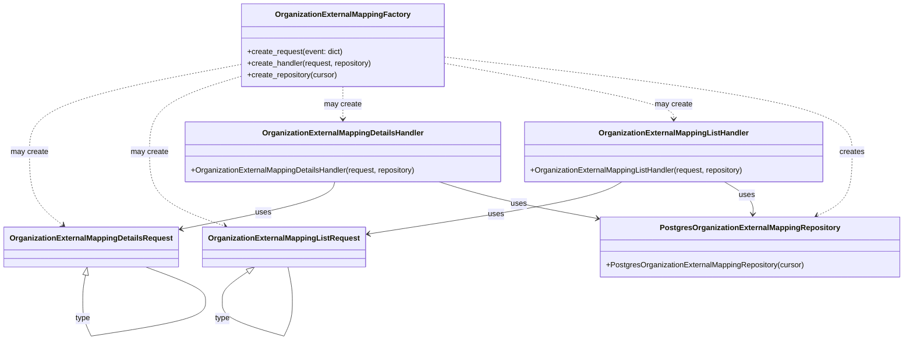

# Diagram: common/iam_service/iam_service/v1/lambdas/organizations/organization_external_mapping/factory.py

> Auto-generated by Obscura crawlers

## Mermaid

### SVG

<svg id="container" width="1875.08984375" xmlns="http://www.w3.org/2000/svg" class="classDiagram" height="714.25" viewBox="0 0 1875.08984375 714.25" role="graphics-document document" aria-roledescription="class"><g><defs><marker id="container_class-aggregationStart" class="marker aggregation class" refX="18" refY="7" markerWidth="190" markerHeight="240" orient="auto"><path d="M 18,7 L9,13 L1,7 L9,1 Z"></path></marker></defs><defs><marker id="container_class-aggregationEnd" class="marker aggregation class" refX="1" refY="7" markerWidth="20" markerHeight="28" orient="auto"><path d="M 18,7 L9,13 L1,7 L9,1 Z"></path></marker></defs><defs><marker id="container_class-extensionStart" class="marker extension class" refX="18" refY="7" markerWidth="190" markerHeight="240" orient="auto"><path d="M 1,7 L18,13 V 1 Z"></path></marker></defs><defs><marker id="container_class-extensionEnd" class="marker extension class" refX="1" refY="7" markerWidth="20" markerHeight="28" orient="auto"><path d="M 1,1 V 13 L18,7 Z"></path></marker></defs><defs><marker id="container_class-compositionStart" class="marker composition class" refX="18" refY="7" markerWidth="190" markerHeight="240" orient="auto"><path d="M 18,7 L9,13 L1,7 L9,1 Z"></path></marker></defs><defs><marker id="container_class-compositionEnd" class="marker composition class" refX="1" refY="7" markerWidth="20" markerHeight="28" orient="auto"><path d="M 18,7 L9,13 L1,7 L9,1 Z"></path></marker></defs><defs><marker id="container_class-dependencyStart" class="marker dependency class" refX="6" refY="7" markerWidth="190" markerHeight="240" orient="auto"><path d="M 5,7 L9,13 L1,7 L9,1 Z"></path></marker></defs><defs><marker id="container_class-dependencyEnd" class="marker dependency class" refX="13" refY="7" markerWidth="20" markerHeight="28" orient="auto"><path d="M 18,7 L9,13 L14,7 L9,1 Z"></path></marker></defs><defs><marker id="container_class-lollipopStart" class="marker lollipop class" refX="13" refY="7" markerWidth="190" markerHeight="240" orient="auto"><circle stroke="black" fill="transparent" cx="7" cy="7" r="6"></circle></marker></defs><defs><marker id="container_class-lollipopEnd" class="marker lollipop class" refX="1" refY="7" markerWidth="190" markerHeight="240" orient="auto"><circle stroke="black" fill="transparent" cx="7" cy="7" r="6"></circle></marker></defs><g class="root"><g class="clusters"></g><g class="edgePaths"><path d="M486.719,135.392L413.529,149.326C340.339,163.261,193.958,191.131,120.768,221.732C47.578,252.333,47.578,285.667,47.578,319C47.578,352.333,47.578,385.667,60.725,411.431C73.871,437.195,100.165,455.39,113.311,464.488L126.458,473.586" id="id_OrganizationExternalMappingFactory_OrganizationExternalMappingDetailsRequest_1" class="edge-thickness-normal edge-pattern-dashed relation" style=";;;" data-edge="true" data-et="edge" data-id="id_OrganizationExternalMappingFactory_OrganizationExternalMappingDetailsRequest_1" data-points="W3sieCI6NDg2LjcxODc1LCJ5IjoxMzUuMzkxNzkyNzY3OTkxNTV9LHsieCI6NDcuNTc4MTI1LCJ5IjoyMTl9LHsieCI6NDcuNTc4MTI1LCJ5IjozMTl9LHsieCI6NDcuNTc4MTI1LCJ5Ijo0MTl9LHsieCI6MTMxLjM5MTUyMzQzNzQ5OTk4LCJ5Ijo0Nzd9XQ==" marker-end="url(#container_class-dependencyEnd)"></path><path d="M486.719,159.64L454.249,169.534C421.779,179.427,356.839,199.213,324.368,225.773C291.898,252.333,291.898,285.667,291.898,319C291.898,352.333,291.898,385.667,318.955,411.674C346.011,437.681,400.123,456.361,427.179,465.702L454.235,475.042" id="id_OrganizationExternalMappingFactory_OrganizationExternalMappingListRequest_2" class="edge-thickness-normal edge-pattern-dashed relation" style=";;;" data-edge="true" data-et="edge" data-id="id_OrganizationExternalMappingFactory_OrganizationExternalMappingListRequest_2" data-points="W3sieCI6NDg2LjcxODc1LCJ5IjoxNTkuNjQwNDM3NjgyOTY3OH0seyJ4IjoyOTEuODk4NDM3NSwieSI6MjE5fSx7IngiOjI5MS44OTg0Mzc1LCJ5IjozMTl9LHsieCI6MjkxLjg5ODQzNzUsInkiOjQxOX0seyJ4Ijo0NTkuOTA2OTkyMTg3NSwieSI6NDc3fV0=" marker-end="url(#container_class-dependencyEnd)"></path><path d="M698.871,182L698.871,188.167C698.871,194.333,698.871,206.667,698.871,218C698.871,229.333,698.871,239.667,698.871,244.833L698.871,250" id="id_OrganizationExternalMappingFactory_OrganizationExternalMappingDetailsHandler_3" class="edge-thickness-normal edge-pattern-dashed relation" style=";;;" data-edge="true" data-et="edge" data-id="id_OrganizationExternalMappingFactory_OrganizationExternalMappingDetailsHandler_3" data-points="W3sieCI6Njk4Ljg3MTA5Mzc1LCJ5IjoxODJ9LHsieCI6Njk4Ljg3MTA5Mzc1LCJ5IjoyMTl9LHsieCI6Njk4Ljg3MTA5Mzc1LCJ5IjoyNTZ9XQ==" marker-end="url(#container_class-dependencyEnd)"></path><path d="M911.023,132.768L991.754,147.14C1072.484,161.512,1233.945,190.256,1314.676,209.795C1395.406,229.333,1395.406,239.667,1395.406,244.833L1395.406,250" id="id_OrganizationExternalMappingFactory_OrganizationExternalMappingListHandler_4" class="edge-thickness-normal edge-pattern-dashed relation" style=";;;" data-edge="true" data-et="edge" data-id="id_OrganizationExternalMappingFactory_OrganizationExternalMappingListHandler_4" data-points="W3sieCI6OTExLjAyMzQzNzUsInkiOjEzMi43NjgyMTY1NjMwMX0seyJ4IjoxMzk1LjQwNjI1LCJ5IjoyMTl9LHsieCI6MTM5NS40MDYyNSwieSI6MjU2fV0=" marker-end="url(#container_class-dependencyEnd)"></path><path d="M911.023,119.543L1054.306,136.12C1197.589,152.696,1484.154,185.848,1627.436,219.091C1770.719,252.333,1770.719,285.667,1770.719,319C1770.719,352.333,1770.719,385.667,1758.419,408.077C1746.119,430.487,1721.52,441.974,1709.22,447.718L1696.92,453.461" id="id_OrganizationExternalMappingFactory_PostgresOrganizationExternalMappingRepository_5" class="edge-thickness-normal edge-pattern-dashed relation" style=";;;" data-edge="true" data-et="edge" data-id="id_OrganizationExternalMappingFactory_PostgresOrganizationExternalMappingRepository_5" data-points="W3sieCI6OTExLjAyMzQzNzUsInkiOjExOS41NDM0OTc4Mjk3NTUxM30seyJ4IjoxNzcwLjcxODc1LCJ5IjoyMTl9LHsieCI6MTc3MC43MTg3NSwieSI6MzE5fSx7IngiOjE3NzAuNzE4NzUsInkiOjQxOX0seyJ4IjoxNjkxLjQ4MzgyODEyNSwieSI6NDU2fV0=" marker-end="url(#container_class-dependencyEnd)"></path><path d="M682.181,382L680.547,388.167C678.914,394.333,675.646,406.667,624.248,423.195C572.851,439.722,473.322,460.445,423.558,470.806L373.794,481.167" id="id_OrganizationExternalMappingDetailsHandler_OrganizationExternalMappingDetailsRequest_6" class="edge-thickness-normal edge-pattern-solid relation" style=";;;" data-edge="true" data-et="edge" data-id="id_OrganizationExternalMappingDetailsHandler_OrganizationExternalMappingDetailsRequest_6" data-points="W3sieCI6NjgyLjE4MTAxNTYyNSwieSI6MzgyfSx7IngiOjY3Mi4zNzg5MDYyNSwieSI6NDE5fSx7IngiOjM2Ny45MTk5MjE4NzUsInkiOjQ4Mi4zOTAwMDY5NTM3MzUzfV0=" marker-end="url(#container_class-dependencyEnd)"></path><path d="M1281.995,382L1270.894,388.167C1259.793,394.333,1237.591,406.667,1149.116,425.041C1060.64,443.415,905.892,467.83,828.518,480.038L751.143,492.246" id="id_OrganizationExternalMappingListHandler_OrganizationExternalMappingListRequest_7" class="edge-thickness-normal edge-pattern-solid relation" style=";;;" data-edge="true" data-et="edge" data-id="id_OrganizationExternalMappingListHandler_OrganizationExternalMappingListRequest_7" data-points="W3sieCI6MTI4MS45OTUxNzU3ODEyNSwieSI6MzgyfSx7IngiOjEyMTUuMzg4NjcxODc1LCJ5Ijo0MTl9LHsieCI6NzQ1LjIxNjc5Njg3NSwieSI6NDkzLjE4MDYyNTkxNjc0OTl9XQ==" marker-end="url(#container_class-dependencyEnd)"></path><path d="M901.59,382L921.432,388.167C941.275,394.333,980.961,406.667,1037.388,419.66C1093.815,432.653,1166.984,446.306,1203.568,453.132L1240.153,459.958" id="id_OrganizationExternalMappingDetailsHandler_PostgresOrganizationExternalMappingRepository_8" class="edge-thickness-normal edge-pattern-solid relation" style=";;;" data-edge="true" data-et="edge" data-id="id_OrganizationExternalMappingDetailsHandler_PostgresOrganizationExternalMappingRepository_8" data-points="W3sieCI6OTAxLjU4OTU4OTg0Mzc1LCJ5IjozODJ9LHsieCI6MTAyMC42NDY0ODQzNzUsInkiOjQxOX0seyJ4IjoxMjQ2LjA1MDc4MTI1LCJ5Ijo0NjEuMDU5MDE3NTQwNTM0OX1d" marker-end="url(#container_class-dependencyEnd)"></path><path d="M1502.135,382L1512.582,388.167C1523.029,394.333,1543.922,406.667,1553.943,418.003C1563.964,429.34,1563.111,439.68,1562.685,444.85L1562.258,450.02" id="id_OrganizationExternalMappingListHandler_PostgresOrganizationExternalMappingRepository_9" class="edge-thickness-normal edge-pattern-solid relation" style=";;;" data-edge="true" data-et="edge" data-id="id_OrganizationExternalMappingListHandler_PostgresOrganizationExternalMappingRepository_9" data-points="W3sieCI6MTUwMi4xMzQ2NDg0Mzc1LCJ5IjozODJ9LHsieCI6MTU2NC44MTY0MDYyNSwieSI6NDE5fSx7IngiOjE1NjEuNzY1MzUxNTYyNSwieSI6NDU2fV0=" marker-end="url(#container_class-dependencyEnd)"></path><path d="M180.07,577.902L179.081,582.752C178.091,587.601,176.113,597.301,175.124,606.317C174.135,615.333,174.135,623.667,174.135,627.833L174.135,632" id="OrganizationExternalMappingDetailsRequest-cyclic-special-1" class="edge-thickness-normal edge-pattern-solid relation" style=";;;" data-edge="true" data-et="edge" data-id="OrganizationExternalMappingDetailsRequest-cyclic-special-1" data-points="W3sieCI6MTgzLjUxNzMxMTc4OTc3MjcyLCJ5Ijo1NjF9LHsieCI6MTc0LjEzNDc2NTYyNSwieSI6NjA3fSx7IngiOjE3NC4xMzQ3NjU2MjUsInkiOjYzMn1d" marker-start="url(#container_class-extensionStart)"></path><path d="M174.135,632.1L174.135,638.267C174.135,644.433,174.135,656.767,177.122,669.1C180.11,681.433,186.085,693.767,189.072,699.933L192.06,706.1" id="OrganizationExternalMappingDetailsRequest-cyclic-special-mid" class="edge-thickness-normal edge-pattern-solid relation" style=";;;" data-edge="true" data-et="edge" data-id="OrganizationExternalMappingDetailsRequest-cyclic-special-mid" data-points="W3sieCI6MTc0LjEzNDc2NTYyNSwieSI6NjMyLjEwMDAwMDAwMTQ5MDF9LHsieCI6MTc0LjEzNDc2NTYyNSwieSI6NjY5LjEwMDAwMDAwMTQ5MDF9LHsieCI6MTkyLjA1OTc2MTQwNzM2NTU4LCJ5Ijo3MDYuMTAwMDAwMDAxNDkwMX1d"></path><path d="M192.134,706.141L226.972,699.968C261.811,693.794,331.487,681.447,366.326,669.099C401.164,656.75,401.164,644.4,401.164,634.05C401.164,623.7,401.164,615.35,382.949,603.508C364.733,591.667,328.303,576.333,310.088,568.667L291.872,561" id="OrganizationExternalMappingDetailsRequest-cyclic-special-2" class="edge-thickness-normal edge-pattern-solid relation" style=";;;" data-edge="true" data-et="edge" data-id="OrganizationExternalMappingDetailsRequest-cyclic-special-2" data-points="W3sieCI6MTkyLjEzMzk4NDM3NTc0NTA2LCJ5Ijo3MDYuMTQxMTM5NzYwNTMxNH0seyJ4Ijo0MDEuMTY0MDYyNSwieSI6NjY5LjEwMDAwMDAwMTQ5MDF9LHsieCI6NDAxLjE2NDA2MjUsInkiOjYzMi4wNTAwMDAwMDA3NDUxfSx7IngiOjQwMS4xNjQwNjI1LCJ5Ijo2MDd9LHsieCI6MjkxLjg3MjIwMzQ4MDExMzYsInkiOjU2MX1d"></path><path d="M497.867,569.972L487.733,576.143C477.599,582.315,457.331,594.657,447.197,604.995C437.063,615.333,437.063,623.667,437.063,627.833L437.063,632" id="OrganizationExternalMappingListRequest-cyclic-special-1" class="edge-thickness-normal edge-pattern-solid relation" style=";;;" data-edge="true" data-et="edge" data-id="OrganizationExternalMappingListRequest-cyclic-special-1" data-points="W3sieCI6NTEyLjU5OTY1Mzc2NDIwNDUsInkiOjU2MX0seyJ4Ijo0MzcuMDYyNSwieSI6NjA3fSx7IngiOjQzNy4wNjI1LCJ5Ijo2MzJ9XQ==" marker-start="url(#container_class-extensionStart)"></path><path d="M437.063,632.1L437.063,638.267C437.063,644.433,437.063,656.767,461.138,669.106C485.214,681.446,533.366,693.791,557.442,699.964L581.518,706.137" id="OrganizationExternalMappingListRequest-cyclic-special-mid" class="edge-thickness-normal edge-pattern-solid relation" style=";;;" data-edge="true" data-et="edge" data-id="OrganizationExternalMappingListRequest-cyclic-special-mid" data-points="W3sieCI6NDM3LjA2MjUsInkiOjYzMi4xMDAwMDAwMDE0OTAxfSx7IngiOjQzNy4wNjI1LCJ5Ijo2NjkuMTAwMDAwMDAxNDkwMX0seyJ4Ijo1ODEuNTE4MzU5Mzc0MjU0OSwieSI6NzA2LjEzNzE4MDQ1MjY2MzZ9XQ=="></path><path d="M581.593,706.1L584.58,699.933C587.568,693.767,593.543,681.433,596.53,669.092C599.518,656.75,599.518,644.4,599.518,634.05C599.518,623.7,599.518,615.35,597.954,603.508C596.39,591.667,593.263,576.333,591.699,568.667L590.135,561" id="OrganizationExternalMappingListRequest-cyclic-special-2" class="edge-thickness-normal edge-pattern-solid relation" style=";;;" data-edge="true" data-et="edge" data-id="OrganizationExternalMappingListRequest-cyclic-special-2" data-points="W3sieCI6NTgxLjU5MjU4MjM0MjYzNDQsInkiOjcwNi4xMDAwMDAwMDE0OTAxfSx7IngiOjU5OS41MTc1NzgxMjUsInkiOjY2OS4xMDAwMDAwMDE0OTAxfSx7IngiOjU5OS41MTc1NzgxMjUsInkiOjYzMi4wNTAwMDAwMDA3NDUxfSx7IngiOjU5OS41MTc1NzgxMjUsInkiOjYwN30seyJ4Ijo1OTAuMTM1MDMxOTYwMjI3MywieSI6NTYxfV0="></path></g><g class="edgeLabels"><g class="edgeLabel" transform="translate(47.578125, 319)"><g class="label" data-id="id_OrganizationExternalMappingFactory_OrganizationExternalMappingDetailsRequest_1" transform="translate(-39.578125, -12)"><foreignObject width="79.15625" height="24">

may create

</foreignObject></g></g><g class="edgeLabel" transform="translate(291.8984375, 319)"><g class="label" data-id="id_OrganizationExternalMappingFactory_OrganizationExternalMappingListRequest_2" transform="translate(-39.578125, -12)"><foreignObject width="79.15625" height="24">

may create

</foreignObject></g></g><g class="edgeLabel" transform="translate(698.87109375, 219)"><g class="label" data-id="id_OrganizationExternalMappingFactory_OrganizationExternalMappingDetailsHandler_3" transform="translate(-39.578125, -12)"><foreignObject width="79.15625" height="24">

may create

</foreignObject></g></g><g class="edgeLabel" transform="translate(1395.40625, 219)"><g class="label" data-id="id_OrganizationExternalMappingFactory_OrganizationExternalMappingListHandler_4" transform="translate(-39.578125, -12)"><foreignObject width="79.15625" height="24">

may create

</foreignObject></g></g><g class="edgeLabel" transform="translate(1770.71875, 319)"><g class="label" data-id="id_OrganizationExternalMappingFactory_PostgresOrganizationExternalMappingRepository_5" transform="translate(-26.171875, -12)"><foreignObject width="52.34375" height="24">

creates

</foreignObject></g></g><g class="edgeLabel" transform="translate(538.88581, 446.79399)"><g class="label" data-id="id_OrganizationExternalMappingDetailsHandler_OrganizationExternalMappingDetailsRequest_6" transform="translate(-16.4921875, -12)"><foreignObject width="32.984375" height="24">

uses

</foreignObject></g></g><g class="edgeLabel" transform="translate(1017.93392, 450.15311)"><g class="label" data-id="id_OrganizationExternalMappingListHandler_OrganizationExternalMappingListRequest_7" transform="translate(-16.4921875, -12)"><foreignObject width="32.984375" height="24">

uses

</foreignObject></g></g><g class="edgeLabel" transform="translate(1072.06942, 428.59519)"><g class="label" data-id="id_OrganizationExternalMappingDetailsHandler_PostgresOrganizationExternalMappingRepository_8" transform="translate(-16.4921875, -12)"><foreignObject width="32.984375" height="24">

uses

</foreignObject></g></g><g class="edgeLabel" transform="translate(1549.46111, 409.93602)"><g class="label" data-id="id_OrganizationExternalMappingListHandler_PostgresOrganizationExternalMappingRepository_9" transform="translate(-16.4921875, -12)"><foreignObject width="32.984375" height="24">

uses

</foreignObject></g></g><g class="edgeLabel"><g class="label" data-id="OrganizationExternalMappingDetailsRequest-cyclic-special-1" transform="translate(0, 0)"><foreignObject width="0" height="0">

</foreignObject></g></g><g class="edgeLabel" transform="translate(174.134765625, 669.1000000014901)"><g class="label" data-id="OrganizationExternalMappingDetailsRequest-cyclic-special-mid" transform="translate(-15.8984375, -12)"><foreignObject width="31.796875" height="24">

type

</foreignObject></g></g><g class="edgeLabel"><g class="label" data-id="OrganizationExternalMappingDetailsRequest-cyclic-special-2" transform="translate(0, 0)"><foreignObject width="0" height="0">

</foreignObject></g></g><g class="edgeLabel"><g class="label" data-id="OrganizationExternalMappingListRequest-cyclic-special-1" transform="translate(0, 0)"><foreignObject width="0" height="0">

</foreignObject></g></g><g class="edgeLabel" transform="translate(437.0625, 669.1000000014901)"><g class="label" data-id="OrganizationExternalMappingListRequest-cyclic-special-mid" transform="translate(-15.8984375, -12)"><foreignObject width="31.796875" height="24">

type

</foreignObject></g></g><g class="edgeLabel"><g class="label" data-id="OrganizationExternalMappingListRequest-cyclic-special-2" transform="translate(0, 0)"><foreignObject width="0" height="0">

</foreignObject></g></g></g><g class="nodes"><g class="node default" id="classId-OrganizationExternalMappingFactory-0" transform="translate(698.87109375, 95)"><g class="basic label-container"><path d="M-212.15234375 -87 L212.15234375 -87 L212.15234375 87 L-212.15234375 87" stroke="none" stroke-width="0" fill="#ECECFF" style=""></path><path d="M-212.15234375 -87 C-102.67917253341632 -87, 6.793998683167359 -87, 212.15234375 -87 M-212.15234375 -87 C-88.97808843421844 -87, 34.19616688156313 -87, 212.15234375 -87 M212.15234375 -87 C212.15234375 -21.274111365658868, 212.15234375 44.451777268682264, 212.15234375 87 M212.15234375 -87 C212.15234375 -44.1654481084778, 212.15234375 -1.330896216955594, 212.15234375 87 M212.15234375 87 C100.6781050662759 87, -10.796133617448191 87, -212.15234375 87 M212.15234375 87 C103.919921039357 87, -4.312501671285986 87, -212.15234375 87 M-212.15234375 87 C-212.15234375 33.78471182626198, -212.15234375 -19.430576347476034, -212.15234375 -87 M-212.15234375 87 C-212.15234375 37.181492376344, -212.15234375 -12.637015247311993, -212.15234375 -87" stroke="#9370DB" stroke-width="1.3" fill="none" stroke-dasharray="0 0" style=""></path></g><g class="annotation-group text" transform="translate(0, -63)"></g><g class="label-group text" transform="translate(-134.9609375, -63)"><g class="label" style="font-weight: bolder" transform="translate(0,-12)"><foreignObject width="269.921875" height="24">

OrganizationExternalMappingFactory

</foreignObject></g></g><g class="members-group text" transform="translate(-200.15234375, -15)"></g><g class="methods-group text" transform="translate(-200.15234375, 15)"><g class="label" style="" transform="translate(0,-12)"><foreignObject width="202.46875" height="24">

+create_request(event: dict)

</foreignObject></g><g class="label" style="" transform="translate(0,12)"><foreignObject width="265.34375" height="24">

+create_handler(request, repository)

</foreignObject></g><g class="label" style="" transform="translate(0,36)"><foreignObject width="191.125" height="24">

+create_repository(cursor)

</foreignObject></g></g><g class="divider" style=""><path d="M-212.15234375 -39 C-97.7936776248017 -39, 16.564988500396595 -39, 212.15234375 -39 M-212.15234375 -39 C-96.51944698857154 -39, 19.11344977285691 -39, 212.15234375 -39" stroke="#9370DB" stroke-width="1.3" fill="none" stroke-dasharray="0 0" style=""></path></g><g class="divider" style=""><path d="M-212.15234375 -15 C-69.09796568073739 -15, 73.95641238852522 -15, 212.15234375 -15 M-212.15234375 -15 C-127.0252868108359 -15, -41.89822987167179 -15, 212.15234375 -15" stroke="#9370DB" stroke-width="1.3" fill="none" stroke-dasharray="0 0" style=""></path></g></g><g class="node default" id="classId-OrganizationExternalMappingDetailsRequest-1" transform="translate(192.083984375, 519)"><g class="basic label-container"><path d="M-175.8359375 -42 L175.8359375 -42 L175.8359375 42 L-175.8359375 42" stroke="none" stroke-width="0" fill="#ECECFF" style=""></path><path d="M-175.8359375 -42 C-50.87365161761832 -42, 74.08863426476336 -42, 175.8359375 -42 M-175.8359375 -42 C-75.4690153942185 -42, 24.897906711562996 -42, 175.8359375 -42 M175.8359375 -42 C175.8359375 -21.970469603124215, 175.8359375 -1.94093920624843, 175.8359375 42 M175.8359375 -42 C175.8359375 -21.43494568470178, 175.8359375 -0.869891369403561, 175.8359375 42 M175.8359375 42 C63.95123969631521 42, -47.933458107369574 42, -175.8359375 42 M175.8359375 42 C41.282272856637036 42, -93.27139178672593 42, -175.8359375 42 M-175.8359375 42 C-175.8359375 12.732360759587323, -175.8359375 -16.535278480825355, -175.8359375 -42 M-175.8359375 42 C-175.8359375 19.619169913138894, -175.8359375 -2.7616601737222126, -175.8359375 -42" stroke="#9370DB" stroke-width="1.3" fill="none" stroke-dasharray="0 0" style=""></path></g><g class="annotation-group text" transform="translate(0, -18)"></g><g class="label-group text" transform="translate(-163.8359375, -18)"><g class="label" style="font-weight: bolder" transform="translate(0,-12)"><foreignObject width="327.671875" height="24">

OrganizationExternalMappingDetailsRequest

</foreignObject></g></g><g class="members-group text" transform="translate(-163.8359375, 30)"></g><g class="methods-group text" transform="translate(-163.8359375, 60)"></g><g class="divider" style=""><path d="M-175.8359375 6 C-101.63658512028721 6, -27.437232740574416 6, 175.8359375 6 M-175.8359375 6 C-81.57774097779851 6, 12.680455544402975 6, 175.8359375 6" stroke="#9370DB" stroke-width="1.3" fill="none" stroke-dasharray="0 0" style=""></path></g><g class="divider" style=""><path d="M-175.8359375 24 C-58.57602308686148 24, 58.683891326277035 24, 175.8359375 24 M-175.8359375 24 C-100.03718998744658 24, -24.238442474893162 24, 175.8359375 24" stroke="#9370DB" stroke-width="1.3" fill="none" stroke-dasharray="0 0" style=""></path></g></g><g class="node default" id="classId-OrganizationExternalMappingListRequest-2" transform="translate(581.568359375, 519)"><g class="basic label-container"><path d="M-163.6484375 -42 L163.6484375 -42 L163.6484375 42 L-163.6484375 42" stroke="none" stroke-width="0" fill="#ECECFF" style=""></path><path d="M-163.6484375 -42 C-66.74102455049086 -42, 30.166388399018274 -42, 163.6484375 -42 M-163.6484375 -42 C-35.15888348821784 -42, 93.33067052356432 -42, 163.6484375 -42 M163.6484375 -42 C163.6484375 -19.441642909014426, 163.6484375 3.1167141819711475, 163.6484375 42 M163.6484375 -42 C163.6484375 -20.782367665390716, 163.6484375 0.43526466921856866, 163.6484375 42 M163.6484375 42 C88.85204306505862 42, 14.055648630117247 42, -163.6484375 42 M163.6484375 42 C37.66197557742326 42, -88.32448634515347 42, -163.6484375 42 M-163.6484375 42 C-163.6484375 16.264684811738608, -163.6484375 -9.470630376522784, -163.6484375 -42 M-163.6484375 42 C-163.6484375 15.404249992045848, -163.6484375 -11.191500015908304, -163.6484375 -42" stroke="#9370DB" stroke-width="1.3" fill="none" stroke-dasharray="0 0" style=""></path></g><g class="annotation-group text" transform="translate(0, -18)"></g><g class="label-group text" transform="translate(-151.6484375, -18)"><g class="label" style="font-weight: bolder" transform="translate(0,-12)"><foreignObject width="303.296875" height="24">

OrganizationExternalMappingListRequest

</foreignObject></g></g><g class="members-group text" transform="translate(-151.6484375, 30)"></g><g class="methods-group text" transform="translate(-151.6484375, 60)"></g><g class="divider" style=""><path d="M-163.6484375 6 C-64.93738921620802 6, 33.773659067583964 6, 163.6484375 6 M-163.6484375 6 C-35.59797811220625 6, 92.4524812755875 6, 163.6484375 6" stroke="#9370DB" stroke-width="1.3" fill="none" stroke-dasharray="0 0" style=""></path></g><g class="divider" style=""><path d="M-163.6484375 24 C-83.71140892135858 24, -3.7743803427171656 24, 163.6484375 24 M-163.6484375 24 C-73.16688551036093 24, 17.314666479278145 24, 163.6484375 24" stroke="#9370DB" stroke-width="1.3" fill="none" stroke-dasharray="0 0" style=""></path></g></g><g class="node default" id="classId-OrganizationExternalMappingDetailsHandler-3" transform="translate(698.87109375, 319)"><g class="basic label-container"><path d="M-332.39453125 -63 L332.39453125 -63 L332.39453125 63 L-332.39453125 63" stroke="none" stroke-width="0" fill="#ECECFF" style=""></path><path d="M-332.39453125 -63 C-73.24643307437572 -63, 185.90166510124857 -63, 332.39453125 -63 M-332.39453125 -63 C-187.59809301950352 -63, -42.801654789007046 -63, 332.39453125 -63 M332.39453125 -63 C332.39453125 -33.26425906866713, 332.39453125 -3.5285181373342596, 332.39453125 63 M332.39453125 -63 C332.39453125 -26.81030049223859, 332.39453125 9.379399015522822, 332.39453125 63 M332.39453125 63 C86.47047889649565 63, -159.4535734570087 63, -332.39453125 63 M332.39453125 63 C91.43792625824821 63, -149.51867873350358 63, -332.39453125 63 M-332.39453125 63 C-332.39453125 18.240079943682773, -332.39453125 -26.519840112634455, -332.39453125 -63 M-332.39453125 63 C-332.39453125 13.30282844298332, -332.39453125 -36.39434311403336, -332.39453125 -63" stroke="#9370DB" stroke-width="1.3" fill="none" stroke-dasharray="0 0" style=""></path></g><g class="annotation-group text" transform="translate(0, -39)"></g><g class="label-group text" transform="translate(-162.9453125, -39)"><g class="label" style="font-weight: bolder" transform="translate(0,-12)"><foreignObject width="325.890625" height="24">

OrganizationExternalMappingDetailsHandler

</foreignObject></g></g><g class="members-group text" transform="translate(-320.39453125, 9)"></g><g class="methods-group text" transform="translate(-320.39453125, 39)"><g class="label" style="" transform="translate(0,-12)"><foreignObject width="477.84375" height="24">

+OrganizationExternalMappingDetailsHandler(request, repository)

</foreignObject></g></g><g class="divider" style=""><path d="M-332.39453125 -15 C-143.38474795561714 -15, 45.62503533876571 -15, 332.39453125 -15 M-332.39453125 -15 C-141.67357096107978 -15, 49.04738932784045 -15, 332.39453125 -15" stroke="#9370DB" stroke-width="1.3" fill="none" stroke-dasharray="0 0" style=""></path></g><g class="divider" style=""><path d="M-332.39453125 9 C-197.0548886278578 9, -61.715246005715585 9, 332.39453125 9 M-332.39453125 9 C-122.16357556169953 9, 88.06738012660094 9, 332.39453125 9" stroke="#9370DB" stroke-width="1.3" fill="none" stroke-dasharray="0 0" style=""></path></g></g><g class="node default" id="classId-OrganizationExternalMappingListHandler-4" transform="translate(1395.40625, 319)"><g class="basic label-container"><path d="M-314.140625 -63 L314.140625 -63 L314.140625 63 L-314.140625 63" stroke="none" stroke-width="0" fill="#ECECFF" style=""></path><path d="M-314.140625 -63 C-97.93723704083206 -63, 118.26615091833588 -63, 314.140625 -63 M-314.140625 -63 C-72.16064382383777 -63, 169.81933735232445 -63, 314.140625 -63 M314.140625 -63 C314.140625 -34.107003978916715, 314.140625 -5.214007957833431, 314.140625 63 M314.140625 -63 C314.140625 -14.583324210355805, 314.140625 33.83335157928839, 314.140625 63 M314.140625 63 C183.08057495054186 63, 52.02052490108372 63, -314.140625 63 M314.140625 63 C77.69823954284794 63, -158.7441459143041 63, -314.140625 63 M-314.140625 63 C-314.140625 36.35719099710136, -314.140625 9.714381994202725, -314.140625 -63 M-314.140625 63 C-314.140625 16.173343121267152, -314.140625 -30.653313757465696, -314.140625 -63" stroke="#9370DB" stroke-width="1.3" fill="none" stroke-dasharray="0 0" style=""></path></g><g class="annotation-group text" transform="translate(0, -39)"></g><g class="label-group text" transform="translate(-150.765625, -39)"><g class="label" style="font-weight: bolder" transform="translate(0,-12)"><foreignObject width="301.53125" height="24">

OrganizationExternalMappingListHandler

</foreignObject></g></g><g class="members-group text" transform="translate(-302.140625, 9)"></g><g class="methods-group text" transform="translate(-302.140625, 39)"><g class="label" style="" transform="translate(0,-12)"><foreignObject width="453.515625" height="24">

+OrganizationExternalMappingListHandler(request, repository)

</foreignObject></g></g><g class="divider" style=""><path d="M-314.140625 -15 C-106.46109163385228 -15, 101.21844173229545 -15, 314.140625 -15 M-314.140625 -15 C-156.77862841784693 -15, 0.5833681643061368 -15, 314.140625 -15" stroke="#9370DB" stroke-width="1.3" fill="none" stroke-dasharray="0 0" style=""></path></g><g class="divider" style=""><path d="M-314.140625 9 C-179.7312827821985 9, -45.32194056439698 9, 314.140625 9 M-314.140625 9 C-95.8942150283608 9, 122.35219494327839 9, 314.140625 9" stroke="#9370DB" stroke-width="1.3" fill="none" stroke-dasharray="0 0" style=""></path></g></g><g class="node default" id="classId-PostgresOrganizationExternalMappingRepository-5" transform="translate(1556.5703125, 519)"><g class="basic label-container"><path d="M-310.51953125 -63 L310.51953125 -63 L310.51953125 63 L-310.51953125 63" stroke="none" stroke-width="0" fill="#ECECFF" style=""></path><path d="M-310.51953125 -63 C-113.4112434309184 -63, 83.69704438816319 -63, 310.51953125 -63 M-310.51953125 -63 C-79.99441414828505 -63, 150.5307029534299 -63, 310.51953125 -63 M310.51953125 -63 C310.51953125 -21.037532497150735, 310.51953125 20.92493500569853, 310.51953125 63 M310.51953125 -63 C310.51953125 -14.578405474310188, 310.51953125 33.843189051379625, 310.51953125 63 M310.51953125 63 C65.03744527462177 63, -180.44464070075645 63, -310.51953125 63 M310.51953125 63 C66.50359525587231 63, -177.51234073825538 63, -310.51953125 63 M-310.51953125 63 C-310.51953125 31.85114724698105, -310.51953125 0.7022944939620999, -310.51953125 -63 M-310.51953125 63 C-310.51953125 19.399942301324756, -310.51953125 -24.200115397350487, -310.51953125 -63" stroke="#9370DB" stroke-width="1.3" fill="none" stroke-dasharray="0 0" style=""></path></g><g class="annotation-group text" transform="translate(0, -39)"></g><g class="label-group text" transform="translate(-179.8515625, -39)"><g class="label" style="font-weight: bolder" transform="translate(0,-12)"><foreignObject width="359.703125" height="24">

PostgresOrganizationExternalMappingRepository

</foreignObject></g></g><g class="members-group text" transform="translate(-298.51953125, 9)"></g><g class="methods-group text" transform="translate(-298.51953125, 39)"><g class="label" style="" transform="translate(0,-12)"><foreignObject width="417.1875" height="24">

+PostgresOrganizationExternalMappingRepository(cursor)

</foreignObject></g></g><g class="divider" style=""><path d="M-310.51953125 -15 C-139.4316827382574 -15, 31.656165773485213 -15, 310.51953125 -15 M-310.51953125 -15 C-99.89211587642717 -15, 110.73529949714566 -15, 310.51953125 -15" stroke="#9370DB" stroke-width="1.3" fill="none" stroke-dasharray="0 0" style=""></path></g><g class="divider" style=""><path d="M-310.51953125 9 C-88.26504808039434 9, 133.98943508921133 9, 310.51953125 9 M-310.51953125 9 C-89.10321335895398 9, 132.31310453209204 9, 310.51953125 9" stroke="#9370DB" stroke-width="1.3" fill="none" stroke-dasharray="0 0" style=""></path></g></g><g class="label edgeLabel" id="OrganizationExternalMappingDetailsRequest---OrganizationExternalMappingDetailsRequest---1" transform="translate(174.134765625, 632.0500000007451)"><rect width="0.1" height="0.1"></rect><g class="label" style="" transform="translate(0, 0)"><rect></rect><foreignObject width="0" height="0">

</foreignObject></g></g><g class="label edgeLabel" id="OrganizationExternalMappingDetailsRequest---OrganizationExternalMappingDetailsRequest---2" transform="translate(192.083984375, 706.1500000022352)"><rect width="0.1" height="0.1"></rect><g class="label" style="" transform="translate(0, 0)"><rect></rect><foreignObject width="0" height="0">

</foreignObject></g></g><g class="label edgeLabel" id="OrganizationExternalMappingListRequest---OrganizationExternalMappingListRequest---1" transform="translate(437.0625, 632.0500000007451)"><rect width="0.1" height="0.1"></rect><g class="label" style="" transform="translate(0, 0)"><rect></rect><foreignObject width="0" height="0">

</foreignObject></g></g><g class="label edgeLabel" id="OrganizationExternalMappingListRequest---OrganizationExternalMappingListRequest---2" transform="translate(581.568359375, 706.1500000022352)"><rect width="0.1" height="0.1"></rect><g class="label" style="" transform="translate(0, 0)"><rect></rect><foreignObject width="0" height="0">

</foreignObject></g></g></g></g></g></svg>
