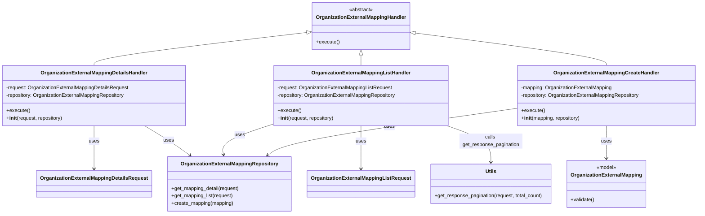

# Diagram: common/iam_service/iam_service/v1/lambdas/organizations/organization_external_mapping/handler.py

> Auto-generated by Obscura crawlers

## Mermaid

### SVG

<svg id="container" width="2190.765625" xmlns="http://www.w3.org/2000/svg" class="classDiagram" height="680" viewBox="0 0 2190.765625 680" role="graphics-document document" aria-roledescription="class"><g><defs><marker id="container_class-aggregationStart" class="marker aggregation class" refX="18" refY="7" markerWidth="190" markerHeight="240" orient="auto"><path d="M 18,7 L9,13 L1,7 L9,1 Z"></path></marker></defs><defs><marker id="container_class-aggregationEnd" class="marker aggregation class" refX="1" refY="7" markerWidth="20" markerHeight="28" orient="auto"><path d="M 18,7 L9,13 L1,7 L9,1 Z"></path></marker></defs><defs><marker id="container_class-extensionStart" class="marker extension class" refX="18" refY="7" markerWidth="190" markerHeight="240" orient="auto"><path d="M 1,7 L18,13 V 1 Z"></path></marker></defs><defs><marker id="container_class-extensionEnd" class="marker extension class" refX="1" refY="7" markerWidth="20" markerHeight="28" orient="auto"><path d="M 1,1 V 13 L18,7 Z"></path></marker></defs><defs><marker id="container_class-compositionStart" class="marker composition class" refX="18" refY="7" markerWidth="190" markerHeight="240" orient="auto"><path d="M 18,7 L9,13 L1,7 L9,1 Z"></path></marker></defs><defs><marker id="container_class-compositionEnd" class="marker composition class" refX="1" refY="7" markerWidth="20" markerHeight="28" orient="auto"><path d="M 18,7 L9,13 L1,7 L9,1 Z"></path></marker></defs><defs><marker id="container_class-dependencyStart" class="marker dependency class" refX="6" refY="7" markerWidth="190" markerHeight="240" orient="auto"><path d="M 5,7 L9,13 L1,7 L9,1 Z"></path></marker></defs><defs><marker id="container_class-dependencyEnd" class="marker dependency class" refX="13" refY="7" markerWidth="20" markerHeight="28" orient="auto"><path d="M 18,7 L9,13 L14,7 L9,1 Z"></path></marker></defs><defs><marker id="container_class-lollipopStart" class="marker lollipop class" refX="13" refY="7" markerWidth="190" markerHeight="240" orient="auto"><circle stroke="black" fill="transparent" cx="7" cy="7" r="6"></circle></marker></defs><defs><marker id="container_class-lollipopEnd" class="marker lollipop class" refX="1" refY="7" markerWidth="190" markerHeight="240" orient="auto"><circle stroke="black" fill="transparent" cx="7" cy="7" r="6"></circle></marker></defs><g class="root"><g class="clusters"></g><g class="edgePaths"><path d="M960.948,103.078L850.431,116.398C739.915,129.718,518.881,156.359,408.364,173.846C297.848,191.333,297.848,199.667,297.848,203.833L297.848,208" id="id_OrganizationExternalMappingHandler_OrganizationExternalMappingDetailsHandler_1" class="edge-thickness-normal edge-pattern-solid relation" style=";;;" data-edge="true" data-et="edge" data-id="id_OrganizationExternalMappingHandler_OrganizationExternalMappingDetailsHandler_1" data-points="W3sieCI6OTc4LjA3NDIxODc1LCJ5IjoxMDEuMDEzMzUyMjkxNDUyODN9LHsieCI6Mjk3Ljg0NzY1NjI1LCJ5IjoxODN9LHsieCI6Mjk3Ljg0NzY1NjI1LCJ5IjoyMDh9XQ==" marker-start="url(#container_class-extensionStart)"></path><path d="M1127.527,175.25L1127.527,176.542C1127.527,177.833,1127.527,180.417,1127.527,185.875C1127.527,191.333,1127.527,199.667,1127.527,203.833L1127.527,208" id="id_OrganizationExternalMappingHandler_OrganizationExternalMappingListHandler_2" class="edge-thickness-normal edge-pattern-solid relation" style=";;;" data-edge="true" data-et="edge" data-id="id_OrganizationExternalMappingHandler_OrganizationExternalMappingListHandler_2" data-points="W3sieCI6MTEyNy41MjczNDM3NSwieSI6MTU4fSx7IngiOjExMjcuNTI3MzQzNzUsInkiOjE4M30seyJ4IjoxMTI3LjUyNzM0Mzc1LCJ5IjoyMDh9XQ==" marker-start="url(#container_class-extensionStart)"></path><path d="M1294.088,104.562L1395.075,117.635C1496.062,130.708,1698.037,156.854,1799.024,174.094C1900.012,191.333,1900.012,199.667,1900.012,203.833L1900.012,208" id="id_OrganizationExternalMappingHandler_OrganizationExternalMappingCreateHandler_3" class="edge-thickness-normal edge-pattern-solid relation" style=";;;" data-edge="true" data-et="edge" data-id="id_OrganizationExternalMappingHandler_OrganizationExternalMappingCreateHandler_3" data-points="W3sieCI6MTI3Ni45ODA0Njg3NSwieSI6MTAyLjM0NzA3NDE3MjIxMjIyfSx7IngiOjE5MDAuMDExNzE4NzUsInkiOjE4M30seyJ4IjoxOTAwLjAxMTcxODc1LCJ5IjoyMDh9XQ==" marker-start="url(#container_class-extensionStart)"></path><path d="M297.848,400L297.848,408.167C297.848,416.333,297.848,432.667,297.848,455.5C297.848,478.333,297.848,507.667,297.848,522.333L297.848,537" id="id_OrganizationExternalMappingDetailsHandler_OrganizationExternalMappingDetailsRequest_4" class="edge-thickness-normal edge-pattern-solid relation" style=";;;" data-edge="true" data-et="edge" data-id="id_OrganizationExternalMappingDetailsHandler_OrganizationExternalMappingDetailsRequest_4" data-points="W3sieCI6Mjk3Ljg0NzY1NjI1LCJ5Ijo0MDB9LHsieCI6Mjk3Ljg0NzY1NjI1LCJ5Ijo0NDl9LHsieCI6Mjk3Ljg0NzY1NjI1LCJ5Ijo1NDN9XQ==" marker-end="url(#container_class-dependencyEnd)"></path><path d="M454.731,400L468.077,408.167C481.423,416.333,508.115,432.667,531.704,448.406C555.293,464.144,575.78,479.289,586.023,486.861L596.267,494.433" id="id_OrganizationExternalMappingDetailsHandler_OrganizationExternalMappingRepository_5" class="edge-thickness-normal edge-pattern-solid relation" style=";;;" data-edge="true" data-et="edge" data-id="id_OrganizationExternalMappingDetailsHandler_OrganizationExternalMappingRepository_5" data-points="W3sieCI6NDU0LjczMDg0NTkwNTE3MjQsInkiOjQwMH0seyJ4Ijo1MzQuODA2NjQwNjI1LCJ5Ijo0NDl9LHsieCI6NjAxLjA5MTYxMDE3OTIyNzksInkiOjQ5OH1d" marker-end="url(#container_class-dependencyEnd)"></path><path d="M1127.527,400L1127.527,408.167C1127.527,416.333,1127.527,432.667,1127.527,455.5C1127.527,478.333,1127.527,507.667,1127.527,522.333L1127.527,537" id="id_OrganizationExternalMappingListHandler_OrganizationExternalMappingListRequest_6" class="edge-thickness-normal edge-pattern-solid relation" style=";;;" data-edge="true" data-et="edge" data-id="id_OrganizationExternalMappingListHandler_OrganizationExternalMappingListRequest_6" data-points="W3sieCI6MTEyNy41MjczNDM3NSwieSI6NDAwfSx7IngiOjExMjcuNTI3MzQzNzUsInkiOjQ0OX0seyJ4IjoxMTI3LjUyNzM0Mzc1LCJ5Ijo1NDN9XQ==" marker-end="url(#container_class-dependencyEnd)"></path><path d="M849.895,396.893L823.939,405.578C797.984,414.262,746.073,431.631,721.418,447.498C696.763,463.365,699.363,477.731,700.663,484.913L701.963,492.096" id="id_OrganizationExternalMappingListHandler_OrganizationExternalMappingRepository_7" class="edge-thickness-normal edge-pattern-solid relation" style=";;;" data-edge="true" data-et="edge" data-id="id_OrganizationExternalMappingListHandler_OrganizationExternalMappingRepository_7" data-points="W3sieCI6ODQ5Ljg5NDUzMTI1LCJ5IjozOTYuODkzMzcxNzMxOTQ4ODN9LHsieCI6Njk0LjE2MjEwOTM3NSwieSI6NDQ5fSx7IngiOjcwMy4wMzIyNDA5MjM3MTMzLCJ5Ijo0OTh9XQ==" marker-end="url(#container_class-dependencyEnd)"></path><path d="M1397.574,400L1420.547,408.167C1443.519,416.333,1489.465,432.667,1512.437,452C1535.41,471.333,1535.41,493.667,1535.41,504.833L1535.41,516" id="id_OrganizationExternalMappingListHandler_Utils_8" class="edge-thickness-normal edge-pattern-solid relation" style=";;;" data-edge="true" data-et="edge" data-id="id_OrganizationExternalMappingListHandler_Utils_8" data-points="W3sieCI6MTM5Ny41NzM4OTU0NzQxMzgsInkiOjQwMH0seyJ4IjoxNTM1LjQxMDE1NjI1LCJ5Ijo0NDl9LHsieCI6MTUzNS40MTAxNTYyNSwieSI6NTIyfV0=" marker-end="url(#container_class-dependencyEnd)"></path><path d="M1900.012,400L1900.012,408.167C1900.012,416.333,1900.012,432.667,1900.012,450C1900.012,467.333,1900.012,485.667,1900.012,494.833L1900.012,504" id="id_OrganizationExternalMappingCreateHandler_OrganizationExternalMapping_9" class="edge-thickness-normal edge-pattern-solid relation" style=";;;" data-edge="true" data-et="edge" data-id="id_OrganizationExternalMappingCreateHandler_OrganizationExternalMapping_9" data-points="W3sieCI6MTkwMC4wMTE3MTg3NSwieSI6NDAwfSx7IngiOjE5MDAuMDExNzE4NzUsInkiOjQ0OX0seyJ4IjoxOTAwLjAxMTcxODc1LCJ5Ijo1MTB9XQ==" marker-end="url(#container_class-dependencyEnd)"></path><path d="M1617.258,344.862L1497.159,362.219C1377.059,379.575,1136.861,414.287,1006.874,439.203C876.888,464.119,857.113,479.237,847.226,486.796L837.339,494.356" id="id_OrganizationExternalMappingCreateHandler_OrganizationExternalMappingRepository_10" class="edge-thickness-normal edge-pattern-solid relation" style=";;;" data-edge="true" data-et="edge" data-id="id_OrganizationExternalMappingCreateHandler_OrganizationExternalMappingRepository_10" data-points="W3sieCI6MTYxNy4yNTc4MTI1LCJ5IjozNDQuODYyNDQzMTgzNDc3MjR9LHsieCI6ODk2LjY2MjEwOTM3NSwieSI6NDQ5fSx7IngiOjgzMi41NzI2ODIxMDAxODM4LCJ5Ijo0OTh9XQ==" marker-end="url(#container_class-dependencyEnd)"></path></g><g class="edgeLabels"><g class="edgeLabel"><g class="label" data-id="id_OrganizationExternalMappingHandler_OrganizationExternalMappingDetailsHandler_1" transform="translate(0, 0)"><foreignObject width="0" height="0">

</foreignObject></g></g><g class="edgeLabel"><g class="label" data-id="id_OrganizationExternalMappingHandler_OrganizationExternalMappingListHandler_2" transform="translate(0, 0)"><foreignObject width="0" height="0">

</foreignObject></g></g><g class="edgeLabel"><g class="label" data-id="id_OrganizationExternalMappingHandler_OrganizationExternalMappingCreateHandler_3" transform="translate(0, 0)"><foreignObject width="0" height="0">

</foreignObject></g></g><g class="edgeLabel" transform="translate(297.84765625, 449)"><g class="label" data-id="id_OrganizationExternalMappingDetailsHandler_OrganizationExternalMappingDetailsRequest_4" transform="translate(-16.4921875, -12)"><foreignObject width="32.984375" height="24">

uses

</foreignObject></g></g><g class="edgeLabel" transform="translate(529.92407, 446.01226)"><g class="label" data-id="id_OrganizationExternalMappingDetailsHandler_OrganizationExternalMappingRepository_5" transform="translate(-16.4921875, -12)"><foreignObject width="32.984375" height="24">

uses

</foreignObject></g></g><g class="edgeLabel" transform="translate(1127.52734375, 449)"><g class="label" data-id="id_OrganizationExternalMappingListHandler_OrganizationExternalMappingListRequest_6" transform="translate(-16.4921875, -12)"><foreignObject width="32.984375" height="24">

uses

</foreignObject></g></g><g class="edgeLabel" transform="translate(748.41675, 430.8469)"><g class="label" data-id="id_OrganizationExternalMappingListHandler_OrganizationExternalMappingRepository_7" transform="translate(-16.4921875, -12)"><foreignObject width="32.984375" height="24">

uses

</foreignObject></g></g><g class="edgeLabel" transform="translate(1535.41015625, 449)"><g class="label" data-id="id_OrganizationExternalMappingListHandler_Utils_8" transform="translate(-100, -24)"><foreignObject width="200" height="48">

calls get_response_pagination

</foreignObject></g></g><g class="edgeLabel" transform="translate(1900.01171875, 449)"><g class="label" data-id="id_OrganizationExternalMappingCreateHandler_OrganizationExternalMapping_9" transform="translate(-16.4921875, -12)"><foreignObject width="32.984375" height="24">

uses

</foreignObject></g></g><g class="edgeLabel" transform="translate(1217.0372, 402.7007)"><g class="label" data-id="id_OrganizationExternalMappingCreateHandler_OrganizationExternalMappingRepository_10" transform="translate(-16.4921875, -12)"><foreignObject width="32.984375" height="24">

uses

</foreignObject></g></g></g><g class="nodes"><g class="node default" id="classId-OrganizationExternalMappingHandler-0" transform="translate(1127.52734375, 83)"><g class="basic label-container"><path d="M-149.453125 -75 L149.453125 -75 L149.453125 75 L-149.453125 75" stroke="none" stroke-width="0" fill="#ECECFF" style=""></path><path d="M-149.453125 -75 C-61.23780563129846 -75, 26.977513737403086 -75, 149.453125 -75 M-149.453125 -75 C-49.269782324702064 -75, 50.91356035059587 -75, 149.453125 -75 M149.453125 -75 C149.453125 -43.876951603557856, 149.453125 -12.753903207115712, 149.453125 75 M149.453125 -75 C149.453125 -43.30019735181689, 149.453125 -11.600394703633782, 149.453125 75 M149.453125 75 C49.15535987727229 75, -51.14240524545542 75, -149.453125 75 M149.453125 75 C31.76261362811593 75, -85.92789774376814 75, -149.453125 75 M-149.453125 75 C-149.453125 20.85010024152023, -149.453125 -33.29979951695954, -149.453125 -75 M-149.453125 75 C-149.453125 33.313563787025615, -149.453125 -8.37287242594877, -149.453125 -75" stroke="#9370DB" stroke-width="1.3" fill="none" stroke-dasharray="0 0" style=""></path></g><g class="annotation-group text" transform="translate(-38.609375, -51)"><g class="label" style="" transform="translate(0,-12)"><foreignObject width="77.21875" height="24">

«abstract»

</foreignObject></g></g><g class="label-group text" transform="translate(-137.453125, -27)"><g class="label" style="font-weight: bolder" transform="translate(0,-12)"><foreignObject width="274.90625" height="24">

OrganizationExternalMappingHandler

</foreignObject></g></g><g class="members-group text" transform="translate(-137.453125, 21)"></g><g class="methods-group text" transform="translate(-137.453125, 51)"><g class="label" style="" transform="translate(0,-12)"><foreignObject width="74.328125" height="24">

+execute()

</foreignObject></g></g><g class="divider" style=""><path d="M-149.453125 -3 C-50.463632427424756 -3, 48.52586014515049 -3, 149.453125 -3 M-149.453125 -3 C-53.11879541191571 -3, 43.215534176168575 -3, 149.453125 -3" stroke="#9370DB" stroke-width="1.3" fill="none" stroke-dasharray="0 0" style=""></path></g><g class="divider" style=""><path d="M-149.453125 21 C-81.59179937082058 21, -13.730473741641163 21, 149.453125 21 M-149.453125 21 C-86.62066776003748 21, -23.788210520074955 21, 149.453125 21" stroke="#9370DB" stroke-width="1.3" fill="none" stroke-dasharray="0 0" style=""></path></g></g><g class="node default" id="classId-OrganizationExternalMappingDetailsHandler-1" transform="translate(297.84765625, 304)"><g class="basic label-container"><path d="M-289.84765625 -96 L289.84765625 -96 L289.84765625 96 L-289.84765625 96" stroke="none" stroke-width="0" fill="#ECECFF" style=""></path><path d="M-289.84765625 -96 C-86.14889090622381 -96, 117.54987443755238 -96, 289.84765625 -96 M-289.84765625 -96 C-169.0936983246993 -96, -48.33974039939858 -96, 289.84765625 -96 M289.84765625 -96 C289.84765625 -35.938387417869606, 289.84765625 24.123225164260788, 289.84765625 96 M289.84765625 -96 C289.84765625 -40.71728425568425, 289.84765625 14.565431488631503, 289.84765625 96 M289.84765625 96 C84.13823538482197 96, -121.57118548035606 96, -289.84765625 96 M289.84765625 96 C120.38449588114321 96, -49.07866448771358 96, -289.84765625 96 M-289.84765625 96 C-289.84765625 21.861538699409735, -289.84765625 -52.27692260118053, -289.84765625 -96 M-289.84765625 96 C-289.84765625 26.079869141330818, -289.84765625 -43.840261717338365, -289.84765625 -96" stroke="#9370DB" stroke-width="1.3" fill="none" stroke-dasharray="0 0" style=""></path></g><g class="annotation-group text" transform="translate(0, -72)"></g><g class="label-group text" transform="translate(-162.9453125, -72)"><g class="label" style="font-weight: bolder" transform="translate(0,-12)"><foreignObject width="325.890625" height="24">

OrganizationExternalMappingDetailsHandler

</foreignObject></g></g><g class="members-group text" transform="translate(-277.84765625, -24)"><g class="label" style="" transform="translate(0,-12)"><foreignObject width="392.75" height="24">

-request: OrganizationExternalMappingDetailsRequest

</foreignObject></g><g class="label" style="" transform="translate(0,12)"><foreignObject width="380.5" height="24">

-repository: OrganizationExternalMappingRepository

</foreignObject></g></g><g class="methods-group text" transform="translate(-277.84765625, 48)"><g class="label" style="" transform="translate(0,-12)"><foreignObject width="74.328125" height="24">

+execute()

</foreignObject></g><g class="label" style="" transform="translate(0,12)"><foreignObject width="180.375" height="24">

+<strong>init</strong>(request, repository)

</foreignObject></g></g><g class="divider" style=""><path d="M-289.84765625 -48 C-119.40222529643066 -48, 51.043205657138685 -48, 289.84765625 -48 M-289.84765625 -48 C-105.2643244107148 -48, 79.31900742857039 -48, 289.84765625 -48" stroke="#9370DB" stroke-width="1.3" fill="none" stroke-dasharray="0 0" style=""></path></g><g class="divider" style=""><path d="M-289.84765625 24 C-165.41646357410278 24, -40.985270898205556 24, 289.84765625 24 M-289.84765625 24 C-152.81403813816954 24, -15.780420026339073 24, 289.84765625 24" stroke="#9370DB" stroke-width="1.3" fill="none" stroke-dasharray="0 0" style=""></path></g></g><g class="node default" id="classId-OrganizationExternalMappingListHandler-2" transform="translate(1127.52734375, 304)"><g class="basic label-container"><path d="M-277.6328125 -96 L277.6328125 -96 L277.6328125 96 L-277.6328125 96" stroke="none" stroke-width="0" fill="#ECECFF" style=""></path><path d="M-277.6328125 -96 C-94.67863229825176 -96, 88.27554790349649 -96, 277.6328125 -96 M-277.6328125 -96 C-127.04427851940491 -96, 23.544255461190176 -96, 277.6328125 -96 M277.6328125 -96 C277.6328125 -38.9948917825402, 277.6328125 18.0102164349196, 277.6328125 96 M277.6328125 -96 C277.6328125 -48.26624866563298, 277.6328125 -0.532497331265958, 277.6328125 96 M277.6328125 96 C132.99962994834328 96, -11.633552603313433 96, -277.6328125 96 M277.6328125 96 C91.08602736376886 96, -95.46075777246227 96, -277.6328125 96 M-277.6328125 96 C-277.6328125 19.639681348966207, -277.6328125 -56.72063730206759, -277.6328125 -96 M-277.6328125 96 C-277.6328125 21.55053736928471, -277.6328125 -52.89892526143058, -277.6328125 -96" stroke="#9370DB" stroke-width="1.3" fill="none" stroke-dasharray="0 0" style=""></path></g><g class="annotation-group text" transform="translate(0, -72)"></g><g class="label-group text" transform="translate(-150.765625, -72)"><g class="label" style="font-weight: bolder" transform="translate(0,-12)"><foreignObject width="301.53125" height="24">

OrganizationExternalMappingListHandler

</foreignObject></g></g><g class="members-group text" transform="translate(-265.6328125, -24)"><g class="label" style="" transform="translate(0,-12)"><foreignObject width="368.40625" height="24">

-request: OrganizationExternalMappingListRequest

</foreignObject></g><g class="label" style="" transform="translate(0,12)"><foreignObject width="380.5" height="24">

-repository: OrganizationExternalMappingRepository

</foreignObject></g></g><g class="methods-group text" transform="translate(-265.6328125, 48)"><g class="label" style="" transform="translate(0,-12)"><foreignObject width="74.328125" height="24">

+execute()

</foreignObject></g><g class="label" style="" transform="translate(0,12)"><foreignObject width="180.375" height="24">

+<strong>init</strong>(request, repository)

</foreignObject></g></g><g class="divider" style=""><path d="M-277.6328125 -48 C-80.81525934368457 -48, 116.00229381263085 -48, 277.6328125 -48 M-277.6328125 -48 C-56.747622906646285 -48, 164.13756668670743 -48, 277.6328125 -48" stroke="#9370DB" stroke-width="1.3" fill="none" stroke-dasharray="0 0" style=""></path></g><g class="divider" style=""><path d="M-277.6328125 24 C-156.76957406765524 24, -35.90633563531051 24, 277.6328125 24 M-277.6328125 24 C-79.68013032087572 24, 118.27255185824856 24, 277.6328125 24" stroke="#9370DB" stroke-width="1.3" fill="none" stroke-dasharray="0 0" style=""></path></g></g><g class="node default" id="classId-OrganizationExternalMappingCreateHandler-3" transform="translate(1900.01171875, 304)"><g class="basic label-container"><path d="M-282.75390625 -96 L282.75390625 -96 L282.75390625 96 L-282.75390625 96" stroke="none" stroke-width="0" fill="#ECECFF" style=""></path><path d="M-282.75390625 -96 C-162.76808065339318 -96, -42.78225505678637 -96, 282.75390625 -96 M-282.75390625 -96 C-114.96120114679925 -96, 52.83150395640149 -96, 282.75390625 -96 M282.75390625 -96 C282.75390625 -40.757344335838624, 282.75390625 14.485311328322751, 282.75390625 96 M282.75390625 -96 C282.75390625 -51.53821749930583, 282.75390625 -7.07643499861166, 282.75390625 96 M282.75390625 96 C71.8640323429147 96, -139.0258415641706 96, -282.75390625 96 M282.75390625 96 C58.27887410472562 96, -166.19615804054877 96, -282.75390625 96 M-282.75390625 96 C-282.75390625 54.36905131464981, -282.75390625 12.738102629299618, -282.75390625 -96 M-282.75390625 96 C-282.75390625 30.25944663575993, -282.75390625 -35.48110672848014, -282.75390625 -96" stroke="#9370DB" stroke-width="1.3" fill="none" stroke-dasharray="0 0" style=""></path></g><g class="annotation-group text" transform="translate(0, -72)"></g><g class="label-group text" transform="translate(-161.0078125, -72)"><g class="label" style="font-weight: bolder" transform="translate(0,-12)"><foreignObject width="322.015625" height="24">

OrganizationExternalMappingCreateHandler

</foreignObject></g></g><g class="members-group text" transform="translate(-270.75390625, -24)"><g class="label" style="" transform="translate(0,-12)"><foreignObject width="291.96875" height="24">

-mapping: OrganizationExternalMapping

</foreignObject></g><g class="label" style="" transform="translate(0,12)"><foreignObject width="380.5" height="24">

-repository: OrganizationExternalMappingRepository

</foreignObject></g></g><g class="methods-group text" transform="translate(-270.75390625, 48)"><g class="label" style="" transform="translate(0,-12)"><foreignObject width="74.328125" height="24">

+execute()

</foreignObject></g><g class="label" style="" transform="translate(0,12)"><foreignObject width="188.6875" height="24">

+<strong>init</strong>(mapping, repository)

</foreignObject></g></g><g class="divider" style=""><path d="M-282.75390625 -48 C-111.60492237049229 -48, 59.54406150901542 -48, 282.75390625 -48 M-282.75390625 -48 C-75.78840202375918 -48, 131.17710220248165 -48, 282.75390625 -48" stroke="#9370DB" stroke-width="1.3" fill="none" stroke-dasharray="0 0" style=""></path></g><g class="divider" style=""><path d="M-282.75390625 24 C-130.7713652087594 24, 21.211175832481217 24, 282.75390625 24 M-282.75390625 24 C-138.5308540838321 24, 5.6921980823357785 24, 282.75390625 24" stroke="#9370DB" stroke-width="1.3" fill="none" stroke-dasharray="0 0" style=""></path></g></g><g class="node default" id="classId-OrganizationExternalMappingRepository-4" transform="translate(718.78125, 585)"><g class="basic label-container"><path d="M-195.09765625 -87 L195.09765625 -87 L195.09765625 87 L-195.09765625 87" stroke="none" stroke-width="0" fill="#ECECFF" style=""></path><path d="M-195.09765625 -87 C-113.41936105315972 -87, -31.741065856319437 -87, 195.09765625 -87 M-195.09765625 -87 C-61.584659391120454 -87, 71.92833746775909 -87, 195.09765625 -87 M195.09765625 -87 C195.09765625 -49.07703750929196, 195.09765625 -11.154075018583924, 195.09765625 87 M195.09765625 -87 C195.09765625 -18.147464655389243, 195.09765625 50.705070689221515, 195.09765625 87 M195.09765625 87 C96.61918164631936 87, -1.8592929573612764 87, -195.09765625 87 M195.09765625 87 C107.8721670843694 87, 20.64667791873879 87, -195.09765625 87 M-195.09765625 87 C-195.09765625 45.52074351230234, -195.09765625 4.0414870246046775, -195.09765625 -87 M-195.09765625 87 C-195.09765625 45.97452181061591, -195.09765625 4.949043621231823, -195.09765625 -87" stroke="#9370DB" stroke-width="1.3" fill="none" stroke-dasharray="0 0" style=""></path></g><g class="annotation-group text" transform="translate(0, -63)"></g><g class="label-group text" transform="translate(-148.1328125, -63)"><g class="label" style="font-weight: bolder" transform="translate(0,-12)"><foreignObject width="296.265625" height="24">

OrganizationExternalMappingRepository

</foreignObject></g></g><g class="members-group text" transform="translate(-183.09765625, -15)"></g><g class="methods-group text" transform="translate(-183.09765625, 15)"><g class="label" style="" transform="translate(0,-12)"><foreignObject width="218.0625" height="24">

+get_mapping_detail(request)

</foreignObject></g><g class="label" style="" transform="translate(0,12)"><foreignObject width="198.8125" height="24">

+get_mapping_list(request)

</foreignObject></g><g class="label" style="" transform="translate(0,36)"><foreignObject width="198.484375" height="24">

+create_mapping(mapping)

</foreignObject></g></g><g class="divider" style=""><path d="M-195.09765625 -39 C-60.7800806129095 -39, 73.537495024181 -39, 195.09765625 -39 M-195.09765625 -39 C-93.55909667377084 -39, 7.979462902458323 -39, 195.09765625 -39" stroke="#9370DB" stroke-width="1.3" fill="none" stroke-dasharray="0 0" style=""></path></g><g class="divider" style=""><path d="M-195.09765625 -15 C-85.53474492727827 -15, 24.028166395443463 -15, 195.09765625 -15 M-195.09765625 -15 C-74.53066529841796 -15, 46.036325653164084 -15, 195.09765625 -15" stroke="#9370DB" stroke-width="1.3" fill="none" stroke-dasharray="0 0" style=""></path></g></g><g class="node default" id="classId-OrganizationExternalMapping-5" transform="translate(1900.01171875, 585)"><g class="basic label-container"><path d="M-120.3671875 -75 L120.3671875 -75 L120.3671875 75 L-120.3671875 75" stroke="none" stroke-width="0" fill="#ECECFF" style=""></path><path d="M-120.3671875 -75 C-57.68615714919247 -75, 4.994873201615064 -75, 120.3671875 -75 M-120.3671875 -75 C-60.7527866406145 -75, -1.1383857812290046 -75, 120.3671875 -75 M120.3671875 -75 C120.3671875 -25.234691310666342, 120.3671875 24.530617378667316, 120.3671875 75 M120.3671875 -75 C120.3671875 -24.09566261848341, 120.3671875 26.80867476303318, 120.3671875 75 M120.3671875 75 C38.24162033310641 75, -43.88394683378718 75, -120.3671875 75 M120.3671875 75 C55.20751269168197 75, -9.95216211663606 75, -120.3671875 75 M-120.3671875 75 C-120.3671875 31.310696230162407, -120.3671875 -12.378607539675187, -120.3671875 -75 M-120.3671875 75 C-120.3671875 43.027322140203815, -120.3671875 11.05464428040763, -120.3671875 -75" stroke="#9370DB" stroke-width="1.3" fill="none" stroke-dasharray="0 0" style=""></path></g><g class="annotation-group text" transform="translate(-32.1484375, -51)"><g class="label" style="" transform="translate(0,-12)"><foreignObject width="64.296875" height="24">

«model»

</foreignObject></g></g><g class="label-group text" transform="translate(-108.3671875, -27)"><g class="label" style="font-weight: bolder" transform="translate(0,-12)"><foreignObject width="216.734375" height="24">

OrganizationExternalMapping

</foreignObject></g></g><g class="members-group text" transform="translate(-108.3671875, 21)"></g><g class="methods-group text" transform="translate(-108.3671875, 51)"><g class="label" style="" transform="translate(0,-12)"><foreignObject width="76.09375" height="24">

+validate()

</foreignObject></g></g><g class="divider" style=""><path d="M-120.3671875 -3 C-49.498757100707266 -3, 21.369673298585468 -3, 120.3671875 -3 M-120.3671875 -3 C-31.03878303583562 -3, 58.28962142832876 -3, 120.3671875 -3" stroke="#9370DB" stroke-width="1.3" fill="none" stroke-dasharray="0 0" style=""></path></g><g class="divider" style=""><path d="M-120.3671875 21 C-53.83519042297817 21, 12.696806654043655 21, 120.3671875 21 M-120.3671875 21 C-25.89663088573286 21, 68.57392572853428 21, 120.3671875 21" stroke="#9370DB" stroke-width="1.3" fill="none" stroke-dasharray="0 0" style=""></path></g></g><g class="node default" id="classId-OrganizationExternalMappingDetailsRequest-6" transform="translate(297.84765625, 585)"><g class="basic label-container"><path d="M-175.8359375 -42 L175.8359375 -42 L175.8359375 42 L-175.8359375 42" stroke="none" stroke-width="0" fill="#ECECFF" style=""></path><path d="M-175.8359375 -42 C-51.27436471616353 -42, 73.28720806767294 -42, 175.8359375 -42 M-175.8359375 -42 C-36.16833619406802 -42, 103.49926511186396 -42, 175.8359375 -42 M175.8359375 -42 C175.8359375 -17.367180719115872, 175.8359375 7.265638561768256, 175.8359375 42 M175.8359375 -42 C175.8359375 -18.351149812119193, 175.8359375 5.297700375761615, 175.8359375 42 M175.8359375 42 C49.429577558811914 42, -76.97678238237617 42, -175.8359375 42 M175.8359375 42 C38.51555833903879 42, -98.80482082192242 42, -175.8359375 42 M-175.8359375 42 C-175.8359375 11.816601867477981, -175.8359375 -18.366796265044037, -175.8359375 -42 M-175.8359375 42 C-175.8359375 15.97868540409215, -175.8359375 -10.0426291918157, -175.8359375 -42" stroke="#9370DB" stroke-width="1.3" fill="none" stroke-dasharray="0 0" style=""></path></g><g class="annotation-group text" transform="translate(0, -18)"></g><g class="label-group text" transform="translate(-163.8359375, -18)"><g class="label" style="font-weight: bolder" transform="translate(0,-12)"><foreignObject width="327.671875" height="24">

OrganizationExternalMappingDetailsRequest

</foreignObject></g></g><g class="members-group text" transform="translate(-163.8359375, 30)"></g><g class="methods-group text" transform="translate(-163.8359375, 60)"></g><g class="divider" style=""><path d="M-175.8359375 6 C-96.81574374907811 6, -17.79554999815622 6, 175.8359375 6 M-175.8359375 6 C-99.42121662924608 6, -23.00649575849215 6, 175.8359375 6" stroke="#9370DB" stroke-width="1.3" fill="none" stroke-dasharray="0 0" style=""></path></g><g class="divider" style=""><path d="M-175.8359375 24 C-71.76282431693875 24, 32.310288866122505 24, 175.8359375 24 M-175.8359375 24 C-43.251610235179584 24, 89.33271702964083 24, 175.8359375 24" stroke="#9370DB" stroke-width="1.3" fill="none" stroke-dasharray="0 0" style=""></path></g></g><g class="node default" id="classId-OrganizationExternalMappingListRequest-7" transform="translate(1127.52734375, 585)"><g class="basic label-container"><path d="M-163.6484375 -42 L163.6484375 -42 L163.6484375 42 L-163.6484375 42" stroke="none" stroke-width="0" fill="#ECECFF" style=""></path><path d="M-163.6484375 -42 C-37.61597356401202 -42, 88.41649037197595 -42, 163.6484375 -42 M-163.6484375 -42 C-58.30685716430861 -42, 47.03472317138278 -42, 163.6484375 -42 M163.6484375 -42 C163.6484375 -16.20573680711488, 163.6484375 9.588526385770237, 163.6484375 42 M163.6484375 -42 C163.6484375 -21.418635176883708, 163.6484375 -0.8372703537674155, 163.6484375 42 M163.6484375 42 C73.81184488335468 42, -16.02474773329064 42, -163.6484375 42 M163.6484375 42 C58.05989230614976 42, -47.528652887700474 42, -163.6484375 42 M-163.6484375 42 C-163.6484375 9.053833050079334, -163.6484375 -23.892333899841333, -163.6484375 -42 M-163.6484375 42 C-163.6484375 19.946669922390047, -163.6484375 -2.106660155219906, -163.6484375 -42" stroke="#9370DB" stroke-width="1.3" fill="none" stroke-dasharray="0 0" style=""></path></g><g class="annotation-group text" transform="translate(0, -18)"></g><g class="label-group text" transform="translate(-151.6484375, -18)"><g class="label" style="font-weight: bolder" transform="translate(0,-12)"><foreignObject width="303.296875" height="24">

OrganizationExternalMappingListRequest

</foreignObject></g></g><g class="members-group text" transform="translate(-151.6484375, 30)"></g><g class="methods-group text" transform="translate(-151.6484375, 60)"></g><g class="divider" style=""><path d="M-163.6484375 6 C-64.0029211877465 6, 35.64259512450701 6, 163.6484375 6 M-163.6484375 6 C-33.88489801743043 6, 95.87864146513914 6, 163.6484375 6" stroke="#9370DB" stroke-width="1.3" fill="none" stroke-dasharray="0 0" style=""></path></g><g class="divider" style=""><path d="M-163.6484375 24 C-33.54105694876395 24, 96.5663236024721 24, 163.6484375 24 M-163.6484375 24 C-41.051813409962094 24, 81.54481068007581 24, 163.6484375 24" stroke="#9370DB" stroke-width="1.3" fill="none" stroke-dasharray="0 0" style=""></path></g></g><g class="node default" id="classId-Utils-8" transform="translate(1535.41015625, 585)"><g class="basic label-container"><path d="M-194.234375 -63 L194.234375 -63 L194.234375 63 L-194.234375 63" stroke="none" stroke-width="0" fill="#ECECFF" style=""></path><path d="M-194.234375 -63 C-54.69556644174432 -63, 84.84324211651136 -63, 194.234375 -63 M-194.234375 -63 C-102.47633722535498 -63, -10.718299450709964 -63, 194.234375 -63 M194.234375 -63 C194.234375 -13.661133578364087, 194.234375 35.677732843271826, 194.234375 63 M194.234375 -63 C194.234375 -30.909158282933433, 194.234375 1.1816834341331344, 194.234375 63 M194.234375 63 C108.7444919077126 63, 23.2546088154252 63, -194.234375 63 M194.234375 63 C58.14074954366228 63, -77.95287591267544 63, -194.234375 63 M-194.234375 63 C-194.234375 27.96818328451338, -194.234375 -7.0636334309732405, -194.234375 -63 M-194.234375 63 C-194.234375 36.92680141728486, -194.234375 10.853602834569713, -194.234375 -63" stroke="#9370DB" stroke-width="1.3" fill="none" stroke-dasharray="0 0" style=""></path></g><g class="annotation-group text" transform="translate(0, -39)"></g><g class="label-group text" transform="translate(-16.796875, -39)"><g class="label" style="font-weight: bolder" transform="translate(0,-12)"><foreignObject width="33.59375" height="24">

Utils

</foreignObject></g></g><g class="members-group text" transform="translate(-182.234375, 9)"></g><g class="methods-group text" transform="translate(-182.234375, 39)"><g class="label" style="" transform="translate(0,-12)"><foreignObject width="347.671875" height="24">

+get_response_pagination(request, total_count)

</foreignObject></g></g><g class="divider" style=""><path d="M-194.234375 -15 C-44.88351703676551 -15, 104.46734092646898 -15, 194.234375 -15 M-194.234375 -15 C-103.80236157881717 -15, -13.37034815763434 -15, 194.234375 -15" stroke="#9370DB" stroke-width="1.3" fill="none" stroke-dasharray="0 0" style=""></path></g><g class="divider" style=""><path d="M-194.234375 9 C-48.408240631085704 9, 97.41789373782859 9, 194.234375 9 M-194.234375 9 C-61.84974119759329 9, 70.53489260481342 9, 194.234375 9" stroke="#9370DB" stroke-width="1.3" fill="none" stroke-dasharray="0 0" style=""></path></g></g></g></g></g></svg>
