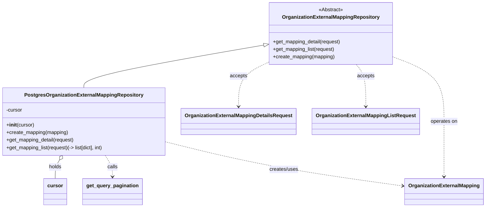

# Diagram: common/iam_service/iam_service/v1/lambdas/organizations/organization_external_mapping/repository.py

> Auto-generated by Obscura crawlers

## Mermaid

### SVG

<svg id="container" width="1513.5078125" xmlns="http://www.w3.org/2000/svg" class="classDiagram" height="662" viewBox="0 0 1513.5078125 662" role="graphics-document document" aria-roledescription="class"><g><defs><marker id="container_class-aggregationStart" class="marker aggregation class" refX="18" refY="7" markerWidth="190" markerHeight="240" orient="auto"><path d="M 18,7 L9,13 L1,7 L9,1 Z"></path></marker></defs><defs><marker id="container_class-aggregationEnd" class="marker aggregation class" refX="1" refY="7" markerWidth="20" markerHeight="28" orient="auto"><path d="M 18,7 L9,13 L1,7 L9,1 Z"></path></marker></defs><defs><marker id="container_class-extensionStart" class="marker extension class" refX="18" refY="7" markerWidth="190" markerHeight="240" orient="auto"><path d="M 1,7 L18,13 V 1 Z"></path></marker></defs><defs><marker id="container_class-extensionEnd" class="marker extension class" refX="1" refY="7" markerWidth="20" markerHeight="28" orient="auto"><path d="M 1,1 V 13 L18,7 Z"></path></marker></defs><defs><marker id="container_class-compositionStart" class="marker composition class" refX="18" refY="7" markerWidth="190" markerHeight="240" orient="auto"><path d="M 18,7 L9,13 L1,7 L9,1 Z"></path></marker></defs><defs><marker id="container_class-compositionEnd" class="marker composition class" refX="1" refY="7" markerWidth="20" markerHeight="28" orient="auto"><path d="M 18,7 L9,13 L1,7 L9,1 Z"></path></marker></defs><defs><marker id="container_class-dependencyStart" class="marker dependency class" refX="6" refY="7" markerWidth="190" markerHeight="240" orient="auto"><path d="M 5,7 L9,13 L1,7 L9,1 Z"></path></marker></defs><defs><marker id="container_class-dependencyEnd" class="marker dependency class" refX="13" refY="7" markerWidth="20" markerHeight="28" orient="auto"><path d="M 18,7 L9,13 L14,7 L9,1 Z"></path></marker></defs><defs><marker id="container_class-lollipopStart" class="marker lollipop class" refX="13" refY="7" markerWidth="190" markerHeight="240" orient="auto"><circle stroke="black" fill="transparent" cx="7" cy="7" r="6"></circle></marker></defs><defs><marker id="container_class-lollipopEnd" class="marker lollipop class" refX="1" refY="7" markerWidth="190" markerHeight="240" orient="auto"><circle stroke="black" fill="transparent" cx="7" cy="7" r="6"></circle></marker></defs><g class="root"><g class="clusters"></g><g class="edgePaths"><path d="M825.021,144.5L732.175,160.916C639.328,177.333,453.635,210.167,360.788,232.75C267.941,255.333,267.941,267.667,267.941,273.833L267.941,280" id="id_OrganizationExternalMappingRepository_PostgresOrganizationExternalMappingRepository_1" class="edge-thickness-normal edge-pattern-solid relation" style=";;;" data-edge="true" data-et="edge" data-id="id_OrganizationExternalMappingRepository_PostgresOrganizationExternalMappingRepository_1" data-points="W3sieCI6ODQyLjAwNzgxMjUsInkiOjE0MS40OTYyNTcwOTcyOTUxNH0seyJ4IjoyNjcuOTQxNDA2MjUsInkiOjI0M30seyJ4IjoyNjcuOTQxNDA2MjUsInkiOjI4MH1d" marker-start="url(#container_class-extensionStart)"></path><path d="M192.919,510.718L190.649,514.431C188.378,518.145,183.838,525.573,181.567,535.453C179.297,545.333,179.297,557.667,179.297,563.833L179.297,570" id="id_PostgresOrganizationExternalMappingRepository_cursor_2" class="edge-thickness-normal edge-pattern-solid relation" style=";;;" data-edge="true" data-et="edge" data-id="id_PostgresOrganizationExternalMappingRepository_cursor_2" data-points="W3sieCI6MjAxLjkxNjUxNDAwODYyMDcsInkiOjQ5Nn0seyJ4IjoxNzkuMjk2ODc1LCJ5Ijo1MzN9LHsieCI6MTc5LjI5Njg3NSwieSI6NTcwfV0=" marker-start="url(#container_class-aggregationStart)"></path><path d="M842.008,200.629L827.293,207.691C812.578,214.753,783.148,228.876,768.434,252.105C753.719,275.333,753.719,307.667,753.719,323.833L753.719,340" id="id_OrganizationExternalMappingRepository_OrganizationExternalMappingDetailsRequest_3" class="edge-thickness-normal edge-pattern-dashed relation" style=";;;" data-edge="true" data-et="edge" data-id="id_OrganizationExternalMappingRepository_OrganizationExternalMappingDetailsRequest_3" data-points="W3sieCI6ODQyLjAwNzgxMjUsInkiOjIwMC42MjkyMzM0NjI0NDUwM30seyJ4Ijo3NTMuNzE4NzUsInkiOjI0M30seyJ4Ijo3NTMuNzE4NzUsInkiOjM0Nn1d" marker-end="url(#container_class-dependencyEnd)"></path><path d="M1114.338,206L1119.149,212.167C1123.96,218.333,1133.582,230.667,1138.392,253C1143.203,275.333,1143.203,307.667,1143.203,323.833L1143.203,340" id="id_OrganizationExternalMappingRepository_OrganizationExternalMappingListRequest_4" class="edge-thickness-normal edge-pattern-dashed relation" style=";;;" data-edge="true" data-et="edge" data-id="id_OrganizationExternalMappingRepository_OrganizationExternalMappingListRequest_4" data-points="W3sieCI6MTExNC4zMzgzMjE0NjEzOTcsInkiOjIwNn0seyJ4IjoxMTQzLjIwMzEyNSwieSI6MjQzfSx7IngiOjExNDMuMjAzMTI1LCJ5IjozNDZ9XQ==" marker-end="url(#container_class-dependencyEnd)"></path><path d="M1232.203,183.237L1257.693,193.198C1283.182,203.158,1334.161,223.079,1359.651,257.206C1385.141,291.333,1385.141,339.667,1385.141,388C1385.141,436.333,1385.141,484.667,1385.141,514C1385.141,543.333,1385.141,553.667,1385.141,558.833L1385.141,564" id="id_OrganizationExternalMappingRepository_OrganizationExternalMapping_5" class="edge-thickness-normal edge-pattern-dashed relation" style=";;;" data-edge="true" data-et="edge" data-id="id_OrganizationExternalMappingRepository_OrganizationExternalMapping_5" data-points="W3sieCI6MTIzMi4yMDMxMjUsInkiOjE4My4yMzczNTkyODI1Nzk2Nn0seyJ4IjoxMzg1LjE0MDYyNSwieSI6MjQzfSx7IngiOjEzODUuMTQwNjI1LCJ5IjozODh9LHsieCI6MTM4NS4xNDA2MjUsInkiOjUzM30seyJ4IjoxMzg1LjE0MDYyNSwieSI6NTcwfV0=" marker-end="url(#container_class-dependencyEnd)"></path><path d="M333.966,496L337.736,502.167C341.506,508.333,349.046,520.667,352.816,532C356.586,543.333,356.586,553.667,356.586,558.833L356.586,564" id="id_PostgresOrganizationExternalMappingRepository_get_query_pagination_6" class="edge-thickness-normal edge-pattern-dashed relation" style=";;;" data-edge="true" data-et="edge" data-id="id_PostgresOrganizationExternalMappingRepository_get_query_pagination_6" data-points="W3sieCI6MzMzLjk2NjI5ODQ5MTM3OTMsInkiOjQ5Nn0seyJ4IjozNTYuNTg1OTM3NSwieSI6NTMzfSx7IngiOjM1Ni41ODU5Mzc1LCJ5Ijo1NzB9XQ==" marker-end="url(#container_class-dependencyEnd)"></path><path d="M527.883,454.496L579.03,467.58C630.176,480.664,732.47,506.832,854.295,530.061C976.121,553.29,1117.477,573.58,1188.156,583.725L1258.834,593.87" id="id_PostgresOrganizationExternalMappingRepository_OrganizationExternalMapping_7" class="edge-thickness-normal edge-pattern-dashed relation" style=";;;" data-edge="true" data-et="edge" data-id="id_PostgresOrganizationExternalMappingRepository_OrganizationExternalMapping_7" data-points="W3sieCI6NTI3Ljg4MjgxMjUsInkiOjQ1NC40OTYxNTk3MTcxNzMyfSx7IngiOjgzNC43NjM2NzE4NzUsInkiOjUzM30seyJ4IjoxMjY0Ljc3MzQzNzUsInkiOjU5NC43MjI3MzYxOTI4NzkyfV0=" marker-end="url(#container_class-dependencyEnd)"></path></g><g class="edgeLabels"><g class="edgeLabel"><g class="label" data-id="id_OrganizationExternalMappingRepository_PostgresOrganizationExternalMappingRepository_1" transform="translate(0, 0)"><foreignObject width="0" height="0">

</foreignObject></g></g><g class="edgeLabel" transform="translate(179.296875, 533)"><g class="label" data-id="id_PostgresOrganizationExternalMappingRepository_cursor_2" transform="translate(-20.1875, -12)"><foreignObject width="40.375" height="24">

holds

</foreignObject></g></g><g class="edgeLabel" transform="translate(753.71875, 243)"><g class="label" data-id="id_OrganizationExternalMappingRepository_OrganizationExternalMappingDetailsRequest_3" transform="translate(-27.421875, -12)"><foreignObject width="54.84375" height="24">

accepts

</foreignObject></g></g><g class="edgeLabel" transform="translate(1143.203125, 243)"><g class="label" data-id="id_OrganizationExternalMappingRepository_OrganizationExternalMappingListRequest_4" transform="translate(-27.421875, -12)"><foreignObject width="54.84375" height="24">

accepts

</foreignObject></g></g><g class="edgeLabel" transform="translate(1385.140625, 388)"><g class="label" data-id="id_OrganizationExternalMappingRepository_OrganizationExternalMapping_5" transform="translate(-43.2890625, -12)"><foreignObject width="86.578125" height="24">

operates on

</foreignObject></g></g><g class="edgeLabel" transform="translate(356.5859375, 533)"><g class="label" data-id="id_PostgresOrganizationExternalMappingRepository_get_query_pagination_6" transform="translate(-16.4453125, -12)"><foreignObject width="32.890625" height="24">

calls

</foreignObject></g></g><g class="edgeLabel" transform="translate(892.99391, 541.35825)"><g class="label" data-id="id_PostgresOrganizationExternalMappingRepository_OrganizationExternalMapping_7" transform="translate(-46.578125, -12)"><foreignObject width="93.15625" height="24">

creates/uses

</foreignObject></g></g></g><g class="nodes"><g class="node default" id="classId-OrganizationExternalMappingRepository-0" transform="translate(1037.10546875, 107)"><g class="basic label-container"><path d="M-195.09765625 -99 L195.09765625 -99 L195.09765625 99 L-195.09765625 99" stroke="none" stroke-width="0" fill="#ECECFF" style=""></path><path d="M-195.09765625 -99 C-82.28516045460105 -99, 30.52733534079789 -99, 195.09765625 -99 M-195.09765625 -99 C-88.13482620759736 -99, 18.828003834805287 -99, 195.09765625 -99 M195.09765625 -99 C195.09765625 -36.51609199931141, 195.09765625 25.967816001377173, 195.09765625 99 M195.09765625 -99 C195.09765625 -35.02746413036057, 195.09765625 28.94507173927886, 195.09765625 99 M195.09765625 99 C45.64303682263176 99, -103.81158260473649 99, -195.09765625 99 M195.09765625 99 C92.09498829748769 99, -10.907679655024623 99, -195.09765625 99 M-195.09765625 99 C-195.09765625 48.78295053578934, -195.09765625 -1.4340989284213208, -195.09765625 -99 M-195.09765625 99 C-195.09765625 30.05580102627205, -195.09765625 -38.8883979474559, -195.09765625 -99" stroke="#9370DB" stroke-width="1.3" fill="none" stroke-dasharray="0 0" style=""></path></g><g class="annotation-group text" transform="translate(-38.9609375, -75)"><g class="label" style="" transform="translate(0,-12)"><foreignObject width="77.921875" height="24">

«Abstract»

</foreignObject></g></g><g class="label-group text" transform="translate(-148.1328125, -51)"><g class="label" style="font-weight: bolder" transform="translate(0,-12)"><foreignObject width="296.265625" height="24">

OrganizationExternalMappingRepository

</foreignObject></g></g><g class="members-group text" transform="translate(-183.09765625, -3)"></g><g class="methods-group text" transform="translate(-183.09765625, 27)"><g class="label" style="" transform="translate(0,-12)"><foreignObject width="218.0625" height="24">

+get_mapping_detail(request)

</foreignObject></g><g class="label" style="" transform="translate(0,12)"><foreignObject width="198.8125" height="24">

+get_mapping_list(request)

</foreignObject></g><g class="label" style="" transform="translate(0,36)"><foreignObject width="198.484375" height="24">

+create_mapping(mapping)

</foreignObject></g></g><g class="divider" style=""><path d="M-195.09765625 -27 C-114.8362763552639 -27, -34.57489646052781 -27, 195.09765625 -27 M-195.09765625 -27 C-82.05626910400395 -27, 30.98511804199211 -27, 195.09765625 -27" stroke="#9370DB" stroke-width="1.3" fill="none" stroke-dasharray="0 0" style=""></path></g><g class="divider" style=""><path d="M-195.09765625 -3 C-69.71193305367024 -3, 55.67379014265953 -3, 195.09765625 -3 M-195.09765625 -3 C-84.40615550412294 -3, 26.28534524175413 -3, 195.09765625 -3" stroke="#9370DB" stroke-width="1.3" fill="none" stroke-dasharray="0 0" style=""></path></g></g><g class="node default" id="classId-PostgresOrganizationExternalMappingRepository-1" transform="translate(267.94140625, 388)"><g class="basic label-container"><path d="M-259.94140625 -108 L259.94140625 -108 L259.94140625 108 L-259.94140625 108" stroke="none" stroke-width="0" fill="#ECECFF" style=""></path><path d="M-259.94140625 -108 C-59.95843214414501 -108, 140.02454196170999 -108, 259.94140625 -108 M-259.94140625 -108 C-131.41413575946368 -108, -2.8868652689273517 -108, 259.94140625 -108 M259.94140625 -108 C259.94140625 -38.34579261285708, 259.94140625 31.308414774285836, 259.94140625 108 M259.94140625 -108 C259.94140625 -42.88028619040652, 259.94140625 22.239427619186955, 259.94140625 108 M259.94140625 108 C142.08271575031245 108, 24.22402525062489 108, -259.94140625 108 M259.94140625 108 C82.82176221524176 108, -94.29788181951648 108, -259.94140625 108 M-259.94140625 108 C-259.94140625 44.273529822596686, -259.94140625 -19.45294035480663, -259.94140625 -108 M-259.94140625 108 C-259.94140625 36.61544506709235, -259.94140625 -34.769109865815295, -259.94140625 -108" stroke="#9370DB" stroke-width="1.3" fill="none" stroke-dasharray="0 0" style=""></path></g><g class="annotation-group text" transform="translate(0, -84)"></g><g class="label-group text" transform="translate(-179.8515625, -84)"><g class="label" style="font-weight: bolder" transform="translate(0,-12)"><foreignObject width="359.703125" height="24">

PostgresOrganizationExternalMappingRepository

</foreignObject></g></g><g class="members-group text" transform="translate(-247.94140625, -36)"><g class="label" style="" transform="translate(0,-12)"><foreignObject width="52.1875" height="24">

-cursor

</foreignObject></g></g><g class="methods-group text" transform="translate(-247.94140625, 12)"><g class="label" style="" transform="translate(0,-12)"><foreignObject width="88.53125" height="24">

+<strong>init</strong>(cursor)

</foreignObject></g><g class="label" style="" transform="translate(0,12)"><foreignObject width="198.484375" height="24">

+create_mapping(mapping)

</foreignObject></g><g class="label" style="" transform="translate(0,36)"><foreignObject width="218.0625" height="24">

+get_mapping_detail(request)

</foreignObject></g><g class="label" style="" transform="translate(0,60)"><foreignObject width="316.03125" height="24">

+get_mapping_list(request)(-&gt; list[dict], int)

</foreignObject></g></g><g class="divider" style=""><path d="M-259.94140625 -60 C-85.86273479861828 -60, 88.21593665276345 -60, 259.94140625 -60 M-259.94140625 -60 C-96.05397029916838 -60, 67.83346565166323 -60, 259.94140625 -60" stroke="#9370DB" stroke-width="1.3" fill="none" stroke-dasharray="0 0" style=""></path></g><g class="divider" style=""><path d="M-259.94140625 -12 C-74.28446736069202 -12, 111.37247152861596 -12, 259.94140625 -12 M-259.94140625 -12 C-54.74782262476148 -12, 150.44576100047703 -12, 259.94140625 -12" stroke="#9370DB" stroke-width="1.3" fill="none" stroke-dasharray="0 0" style=""></path></g></g><g class="node default" id="classId-OrganizationExternalMappingDetailsRequest-2" transform="translate(753.71875, 388)"><g class="basic label-container"><path d="M-175.8359375 -42 L175.8359375 -42 L175.8359375 42 L-175.8359375 42" stroke="none" stroke-width="0" fill="#ECECFF" style=""></path><path d="M-175.8359375 -42 C-69.44500211954389 -42, 36.94593326091223 -42, 175.8359375 -42 M-175.8359375 -42 C-80.21001991716855 -42, 15.415897665662897 -42, 175.8359375 -42 M175.8359375 -42 C175.8359375 -8.835659890873735, 175.8359375 24.32868021825253, 175.8359375 42 M175.8359375 -42 C175.8359375 -16.164419099015152, 175.8359375 9.671161801969696, 175.8359375 42 M175.8359375 42 C40.953974586970446 42, -93.92798832605911 42, -175.8359375 42 M175.8359375 42 C72.5289979591038 42, -30.77794158179239 42, -175.8359375 42 M-175.8359375 42 C-175.8359375 18.22404880431409, -175.8359375 -5.551902391371819, -175.8359375 -42 M-175.8359375 42 C-175.8359375 19.049668431072345, -175.8359375 -3.900663137855311, -175.8359375 -42" stroke="#9370DB" stroke-width="1.3" fill="none" stroke-dasharray="0 0" style=""></path></g><g class="annotation-group text" transform="translate(0, -18)"></g><g class="label-group text" transform="translate(-163.8359375, -18)"><g class="label" style="font-weight: bolder" transform="translate(0,-12)"><foreignObject width="327.671875" height="24">

OrganizationExternalMappingDetailsRequest

</foreignObject></g></g><g class="members-group text" transform="translate(-163.8359375, 30)"></g><g class="methods-group text" transform="translate(-163.8359375, 60)"></g><g class="divider" style=""><path d="M-175.8359375 6 C-99.27633599586474 6, -22.716734491729483 6, 175.8359375 6 M-175.8359375 6 C-44.92193652986671 6, 85.99206444026657 6, 175.8359375 6" stroke="#9370DB" stroke-width="1.3" fill="none" stroke-dasharray="0 0" style=""></path></g><g class="divider" style=""><path d="M-175.8359375 24 C-96.64677157471012 24, -17.45760564942023 24, 175.8359375 24 M-175.8359375 24 C-92.2995080982453 24, -8.763078696490595 24, 175.8359375 24" stroke="#9370DB" stroke-width="1.3" fill="none" stroke-dasharray="0 0" style=""></path></g></g><g class="node default" id="classId-OrganizationExternalMappingListRequest-3" transform="translate(1143.203125, 388)"><g class="basic label-container"><path d="M-163.6484375 -42 L163.6484375 -42 L163.6484375 42 L-163.6484375 42" stroke="none" stroke-width="0" fill="#ECECFF" style=""></path><path d="M-163.6484375 -42 C-86.4724801938952 -42, -9.296522887790388 -42, 163.6484375 -42 M-163.6484375 -42 C-82.92140854821469 -42, -2.1943795964293713 -42, 163.6484375 -42 M163.6484375 -42 C163.6484375 -22.897405344198127, 163.6484375 -3.794810688396254, 163.6484375 42 M163.6484375 -42 C163.6484375 -16.80945397115753, 163.6484375 8.381092057684938, 163.6484375 42 M163.6484375 42 C55.62171776232425 42, -52.405001975351496 42, -163.6484375 42 M163.6484375 42 C84.3971505323348 42, 5.145863564669611 42, -163.6484375 42 M-163.6484375 42 C-163.6484375 13.923118145212186, -163.6484375 -14.153763709575628, -163.6484375 -42 M-163.6484375 42 C-163.6484375 22.153669167258055, -163.6484375 2.3073383345161105, -163.6484375 -42" stroke="#9370DB" stroke-width="1.3" fill="none" stroke-dasharray="0 0" style=""></path></g><g class="annotation-group text" transform="translate(0, -18)"></g><g class="label-group text" transform="translate(-151.6484375, -18)"><g class="label" style="font-weight: bolder" transform="translate(0,-12)"><foreignObject width="303.296875" height="24">

OrganizationExternalMappingListRequest

</foreignObject></g></g><g class="members-group text" transform="translate(-151.6484375, 30)"></g><g class="methods-group text" transform="translate(-151.6484375, 60)"></g><g class="divider" style=""><path d="M-163.6484375 6 C-61.44824842007175 6, 40.7519406598565 6, 163.6484375 6 M-163.6484375 6 C-80.31134342661984 6, 3.025750646760315 6, 163.6484375 6" stroke="#9370DB" stroke-width="1.3" fill="none" stroke-dasharray="0 0" style=""></path></g><g class="divider" style=""><path d="M-163.6484375 24 C-77.45000690836433 24, 8.74842368327134 24, 163.6484375 24 M-163.6484375 24 C-55.189636622317195 24, 53.26916425536561 24, 163.6484375 24" stroke="#9370DB" stroke-width="1.3" fill="none" stroke-dasharray="0 0" style=""></path></g></g><g class="node default" id="classId-OrganizationExternalMapping-4" transform="translate(1385.140625, 612)"><g class="basic label-container"><path d="M-120.3671875 -42 L120.3671875 -42 L120.3671875 42 L-120.3671875 42" stroke="none" stroke-width="0" fill="#ECECFF" style=""></path><path d="M-120.3671875 -42 C-33.56224181086945 -42, 53.242703878261096 -42, 120.3671875 -42 M-120.3671875 -42 C-64.54016748391766 -42, -8.713147467835299 -42, 120.3671875 -42 M120.3671875 -42 C120.3671875 -24.87010379677808, 120.3671875 -7.740207593556157, 120.3671875 42 M120.3671875 -42 C120.3671875 -11.294113963353862, 120.3671875 19.411772073292276, 120.3671875 42 M120.3671875 42 C46.68893914877056 42, -26.989309202458884 42, -120.3671875 42 M120.3671875 42 C56.49825504446503 42, -7.370677411069934 42, -120.3671875 42 M-120.3671875 42 C-120.3671875 16.528978194126015, -120.3671875 -8.94204361174797, -120.3671875 -42 M-120.3671875 42 C-120.3671875 20.105036265694437, -120.3671875 -1.7899274686111255, -120.3671875 -42" stroke="#9370DB" stroke-width="1.3" fill="none" stroke-dasharray="0 0" style=""></path></g><g class="annotation-group text" transform="translate(0, -18)"></g><g class="label-group text" transform="translate(-108.3671875, -18)"><g class="label" style="font-weight: bolder" transform="translate(0,-12)"><foreignObject width="216.734375" height="24">

OrganizationExternalMapping

</foreignObject></g></g><g class="members-group text" transform="translate(-108.3671875, 30)"></g><g class="methods-group text" transform="translate(-108.3671875, 60)"></g><g class="divider" style=""><path d="M-120.3671875 6 C-63.62146599474871 6, -6.875744489497421 6, 120.3671875 6 M-120.3671875 6 C-50.07409992429491 6, 20.218987651410174 6, 120.3671875 6" stroke="#9370DB" stroke-width="1.3" fill="none" stroke-dasharray="0 0" style=""></path></g><g class="divider" style=""><path d="M-120.3671875 24 C-46.554867933673336 24, 27.25745163265333 24, 120.3671875 24 M-120.3671875 24 C-28.55992072317403 24, 63.24734605365194 24, 120.3671875 24" stroke="#9370DB" stroke-width="1.3" fill="none" stroke-dasharray="0 0" style=""></path></g></g><g class="node default" id="classId-get_query_pagination-5" transform="translate(356.5859375, 612)"><g class="basic label-container"><path d="M-92.1015625 -42 L92.1015625 -42 L92.1015625 42 L-92.1015625 42" stroke="none" stroke-width="0" fill="#ECECFF" style=""></path><path d="M-92.1015625 -42 C-50.39139337937343 -42, -8.681224258746866 -42, 92.1015625 -42 M-92.1015625 -42 C-19.28765094844252 -42, 53.52626060311496 -42, 92.1015625 -42 M92.1015625 -42 C92.1015625 -14.464244382244456, 92.1015625 13.071511235511089, 92.1015625 42 M92.1015625 -42 C92.1015625 -17.332920746778637, 92.1015625 7.334158506442726, 92.1015625 42 M92.1015625 42 C27.51069050126246 42, -37.08018149747508 42, -92.1015625 42 M92.1015625 42 C40.9585792832633 42, -10.184403933473405 42, -92.1015625 42 M-92.1015625 42 C-92.1015625 11.486203249324454, -92.1015625 -19.02759350135109, -92.1015625 -42 M-92.1015625 42 C-92.1015625 18.84220731860981, -92.1015625 -4.315585362780382, -92.1015625 -42" stroke="#9370DB" stroke-width="1.3" fill="none" stroke-dasharray="0 0" style=""></path></g><g class="annotation-group text" transform="translate(0, -18)"></g><g class="label-group text" transform="translate(-80.1015625, -18)"><g class="label" style="font-weight: bolder" transform="translate(0,-12)"><foreignObject width="160.203125" height="24">

get_query_pagination

</foreignObject></g></g><g class="members-group text" transform="translate(-80.1015625, 30)"></g><g class="methods-group text" transform="translate(-80.1015625, 60)"></g><g class="divider" style=""><path d="M-92.1015625 6 C-40.17282841985944 6, 11.755905660281115 6, 92.1015625 6 M-92.1015625 6 C-40.78871231578863 6, 10.524137868422741 6, 92.1015625 6" stroke="#9370DB" stroke-width="1.3" fill="none" stroke-dasharray="0 0" style=""></path></g><g class="divider" style=""><path d="M-92.1015625 24 C-23.597453278572047 24, 44.906655942855906 24, 92.1015625 24 M-92.1015625 24 C-51.03855182719212 24, -9.975541154384246 24, 92.1015625 24" stroke="#9370DB" stroke-width="1.3" fill="none" stroke-dasharray="0 0" style=""></path></g></g><g class="node default" id="classId-cursor-6" transform="translate(179.296875, 612)"><g class="basic label-container"><path d="M-35.1875 -42 L35.1875 -42 L35.1875 42 L-35.1875 42" stroke="none" stroke-width="0" fill="#ECECFF" style=""></path><path d="M-35.1875 -42 C-14.478008047928181 -42, 6.231483904143637 -42, 35.1875 -42 M-35.1875 -42 C-14.926793100717365 -42, 5.33391379856527 -42, 35.1875 -42 M35.1875 -42 C35.1875 -19.290500409590532, 35.1875 3.418999180818936, 35.1875 42 M35.1875 -42 C35.1875 -12.895576331026966, 35.1875 16.208847337946068, 35.1875 42 M35.1875 42 C7.520232311391997 42, -20.147035377216007 42, -35.1875 42 M35.1875 42 C16.587324059750916 42, -2.012851880498168 42, -35.1875 42 M-35.1875 42 C-35.1875 17.49424924129763, -35.1875 -7.011501517404739, -35.1875 -42 M-35.1875 42 C-35.1875 10.136365491632965, -35.1875 -21.72726901673407, -35.1875 -42" stroke="#9370DB" stroke-width="1.3" fill="none" stroke-dasharray="0 0" style=""></path></g><g class="annotation-group text" transform="translate(0, -18)"></g><g class="label-group text" transform="translate(-23.1875, -18)"><g class="label" style="font-weight: bolder" transform="translate(0,-12)"><foreignObject width="46.375" height="24">

cursor

</foreignObject></g></g><g class="members-group text" transform="translate(-23.1875, 30)"></g><g class="methods-group text" transform="translate(-23.1875, 60)"></g><g class="divider" style=""><path d="M-35.1875 6 C-19.4607991096737 6, -3.7340982193473984 6, 35.1875 6 M-35.1875 6 C-15.120763583413531 6, 4.945972833172938 6, 35.1875 6" stroke="#9370DB" stroke-width="1.3" fill="none" stroke-dasharray="0 0" style=""></path></g><g class="divider" style=""><path d="M-35.1875 24 C-16.80028714073804 24, 1.586925718523922 24, 35.1875 24 M-35.1875 24 C-16.760631154283256 24, 1.666237691433487 24, 35.1875 24" stroke="#9370DB" stroke-width="1.3" fill="none" stroke-dasharray="0 0" style=""></path></g></g></g></g></g></svg>
