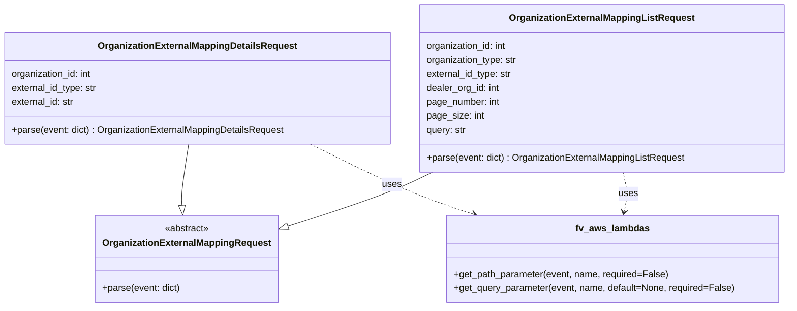

# Diagram: common/iam_service/iam_service/v1/lambdas/organizations/organization_external_mapping/request.py

> Auto-generated by Obscura crawlers

## Mermaid

### SVG

<svg id="container" width="1344.59375" xmlns="http://www.w3.org/2000/svg" class="classDiagram" height="528" viewBox="0 0 1344.59375 528" role="graphics-document document" aria-roledescription="class"><g><defs><marker id="container_class-aggregationStart" class="marker aggregation class" refX="18" refY="7" markerWidth="190" markerHeight="240" orient="auto"><path d="M 18,7 L9,13 L1,7 L9,1 Z"></path></marker></defs><defs><marker id="container_class-aggregationEnd" class="marker aggregation class" refX="1" refY="7" markerWidth="20" markerHeight="28" orient="auto"><path d="M 18,7 L9,13 L1,7 L9,1 Z"></path></marker></defs><defs><marker id="container_class-extensionStart" class="marker extension class" refX="18" refY="7" markerWidth="190" markerHeight="240" orient="auto"><path d="M 1,7 L18,13 V 1 Z"></path></marker></defs><defs><marker id="container_class-extensionEnd" class="marker extension class" refX="1" refY="7" markerWidth="20" markerHeight="28" orient="auto"><path d="M 1,1 V 13 L18,7 Z"></path></marker></defs><defs><marker id="container_class-compositionStart" class="marker composition class" refX="18" refY="7" markerWidth="190" markerHeight="240" orient="auto"><path d="M 18,7 L9,13 L1,7 L9,1 Z"></path></marker></defs><defs><marker id="container_class-compositionEnd" class="marker composition class" refX="1" refY="7" markerWidth="20" markerHeight="28" orient="auto"><path d="M 18,7 L9,13 L1,7 L9,1 Z"></path></marker></defs><defs><marker id="container_class-dependencyStart" class="marker dependency class" refX="6" refY="7" markerWidth="190" markerHeight="240" orient="auto"><path d="M 5,7 L9,13 L1,7 L9,1 Z"></path></marker></defs><defs><marker id="container_class-dependencyEnd" class="marker dependency class" refX="13" refY="7" markerWidth="20" markerHeight="28" orient="auto"><path d="M 18,7 L9,13 L14,7 L9,1 Z"></path></marker></defs><defs><marker id="container_class-lollipopStart" class="marker lollipop class" refX="13" refY="7" markerWidth="190" markerHeight="240" orient="auto"><circle stroke="black" fill="transparent" cx="7" cy="7" r="6"></circle></marker></defs><defs><marker id="container_class-lollipopEnd" class="marker lollipop class" refX="1" refY="7" markerWidth="190" markerHeight="240" orient="auto"><circle stroke="black" fill="transparent" cx="7" cy="7" r="6"></circle></marker></defs><g class="root"><g class="clusters"></g><g class="edgePaths"><path d="M321.796,248L319.585,262.167C317.374,276.333,312.953,304.667,311.037,322.136C309.121,339.606,309.711,346.212,310.006,349.515L310.301,352.818" id="id_OrganizationExternalMappingDetailsRequest_OrganizationExternalMappingRequest_1" class="edge-thickness-normal edge-pattern-solid relation" style=";;;" data-edge="true" data-et="edge" data-id="id_OrganizationExternalMappingDetailsRequest_OrganizationExternalMappingRequest_1" data-points="W3sieCI6MzIxLjc5NTk5MDE1ODgzOTgsInkiOjI0OH0seyJ4IjozMDguNTMxMjUsInkiOjMzM30seyJ4IjozMTEuODM0ODIxNDI4NTcxNDQsInkiOjM3MH1d" marker-end="url(#container_class-extensionEnd)"></path><path d="M737.363,296L724.999,302.167C712.635,308.333,687.907,320.667,645.894,336.469C603.88,352.271,544.58,371.541,514.93,381.176L485.28,390.812" id="id_OrganizationExternalMappingListRequest_OrganizationExternalMappingRequest_2" class="edge-thickness-normal edge-pattern-solid relation" style=";;;" data-edge="true" data-et="edge" data-id="id_OrganizationExternalMappingListRequest_OrganizationExternalMappingRequest_2" data-points="W3sieCI6NzM3LjM2MjU0NzQ3OTI4MTgsInkiOjI5Nn0seyJ4Ijo2NjMuMTc5Njg3NSwieSI6MzMzfSx7IngiOjQ2OC44NzUsInkiOjM5Ni4xNDI5NjcyNDQ3MDEzN31d" marker-end="url(#container_class-extensionEnd)"></path><path d="M529.252,248L557.655,262.167C586.058,276.333,642.865,304.667,689.294,324.691C735.722,344.715,771.772,356.43,789.798,362.288L807.823,368.146" id="id_OrganizationExternalMappingDetailsRequest_fv_aws_lambdas_3" class="edge-thickness-normal edge-pattern-dashed relation" style=";;;" data-edge="true" data-et="edge" data-id="id_OrganizationExternalMappingDetailsRequest_fv_aws_lambdas_3" data-points="W3sieCI6NTI5LjI1MTc5MTI2MzgxMjIsInkiOjI0OH0seyJ4Ijo2OTkuNjcxODc1LCJ5IjozMzN9LHsieCI6ODEzLjUyODk0ODEwMjY3ODYsInkiOjM3MH1d" marker-end="url(#container_class-dependencyEnd)"></path><path d="M1061.667,296L1063.191,302.167C1064.716,308.333,1067.764,320.667,1068.06,332.027C1068.356,343.387,1065.899,353.774,1064.67,358.968L1063.442,364.161" id="id_OrganizationExternalMappingListRequest_fv_aws_lambdas_4" class="edge-thickness-normal edge-pattern-dashed relation" style=";;;" data-edge="true" data-et="edge" data-id="id_OrganizationExternalMappingListRequest_fv_aws_lambdas_4" data-points="W3sieCI6MTA2MS42NjcxMDU0OTAzMzE2LCJ5IjoyOTZ9LHsieCI6MTA3MC44MTI1LCJ5IjozMzN9LHsieCI6MTA2Mi4wNjA2MTY2Mjk0NjQyLCJ5IjozNzB9XQ==" marker-end="url(#container_class-dependencyEnd)"></path></g><g class="edgeLabels"><g class="edgeLabel"><g class="label" data-id="id_OrganizationExternalMappingDetailsRequest_OrganizationExternalMappingRequest_1" transform="translate(0, 0)"><foreignObject width="0" height="0">

</foreignObject></g></g><g class="edgeLabel"><g class="label" data-id="id_OrganizationExternalMappingListRequest_OrganizationExternalMappingRequest_2" transform="translate(0, 0)"><foreignObject width="0" height="0">

</foreignObject></g></g><g class="edgeLabel" transform="translate(668.02779, 317.21696)"><g class="label" data-id="id_OrganizationExternalMappingDetailsRequest_fv_aws_lambdas_3" transform="translate(-16.4921875, -12)"><foreignObject width="32.984375" height="24">

uses

</foreignObject></g></g><g class="edgeLabel" transform="translate(1070.8014, 332.9551)"><g class="label" data-id="id_OrganizationExternalMappingListRequest_fv_aws_lambdas_4" transform="translate(-16.4921875, -12)"><foreignObject width="32.984375" height="24">

uses

</foreignObject></g></g></g><g class="nodes"><g class="node default" id="classId-OrganizationExternalMappingRequest-0" transform="translate(318.53125, 445)"><g class="basic label-container"><path d="M-150.34375 -75 L150.34375 -75 L150.34375 75 L-150.34375 75" stroke="none" stroke-width="0" fill="#ECECFF" style=""></path><path d="M-150.34375 -75 C-79.95137043559235 -75, -9.558990871184704 -75, 150.34375 -75 M-150.34375 -75 C-67.05995992305982 -75, 16.223830153880357 -75, 150.34375 -75 M150.34375 -75 C150.34375 -23.499272607485224, 150.34375 28.00145478502955, 150.34375 75 M150.34375 -75 C150.34375 -26.460968172045817, 150.34375 22.078063655908366, 150.34375 75 M150.34375 75 C52.44835655488953 75, -45.44703689022094 75, -150.34375 75 M150.34375 75 C78.32567964052198 75, 6.307609281043966 75, -150.34375 75 M-150.34375 75 C-150.34375 39.4214541437603, -150.34375 3.8429082875206007, -150.34375 -75 M-150.34375 75 C-150.34375 39.33603928937585, -150.34375 3.6720785787516945, -150.34375 -75" stroke="#9370DB" stroke-width="1.3" fill="none" stroke-dasharray="0 0" style=""></path></g><g class="annotation-group text" transform="translate(-38.609375, -51)"><g class="label" style="" transform="translate(0,-12)"><foreignObject width="77.21875" height="24">

«abstract»

</foreignObject></g></g><g class="label-group text" transform="translate(-138.34375, -27)"><g class="label" style="font-weight: bolder" transform="translate(0,-12)"><foreignObject width="276.6875" height="24">

OrganizationExternalMappingRequest

</foreignObject></g></g><g class="members-group text" transform="translate(-138.34375, 21)"></g><g class="methods-group text" transform="translate(-138.34375, 51)"><g class="label" style="" transform="translate(0,-12)"><foreignObject width="134.515625" height="24">

+parse(event: dict)

</foreignObject></g></g><g class="divider" style=""><path d="M-150.34375 -3 C-61.01172520394128 -3, 28.320299592117436 -3, 150.34375 -3 M-150.34375 -3 C-68.7051546012636 -3, 12.933440797472798 -3, 150.34375 -3" stroke="#9370DB" stroke-width="1.3" fill="none" stroke-dasharray="0 0" style=""></path></g><g class="divider" style=""><path d="M-150.34375 21 C-65.10642525555166 21, 20.130899488896688 21, 150.34375 21 M-150.34375 21 C-63.94870063143824 21, 22.446348737123515 21, 150.34375 21" stroke="#9370DB" stroke-width="1.3" fill="none" stroke-dasharray="0 0" style=""></path></g></g><g class="node default" id="classId-OrganizationExternalMappingDetailsRequest-1" transform="translate(336.77734375, 152)"><g class="basic label-container"><path d="M-328.77734375 -96 L328.77734375 -96 L328.77734375 96 L-328.77734375 96" stroke="none" stroke-width="0" fill="#ECECFF" style=""></path><path d="M-328.77734375 -96 C-152.69401532555554 -96, 23.38931309888892 -96, 328.77734375 -96 M-328.77734375 -96 C-78.3172201202027 -96, 172.1429035095946 -96, 328.77734375 -96 M328.77734375 -96 C328.77734375 -54.87392073489296, 328.77734375 -13.747841469785925, 328.77734375 96 M328.77734375 -96 C328.77734375 -41.61534984038843, 328.77734375 12.769300319223134, 328.77734375 96 M328.77734375 96 C98.05551231567597 96, -132.66631911864806 96, -328.77734375 96 M328.77734375 96 C127.72861261267491 96, -73.32011852465018 96, -328.77734375 96 M-328.77734375 96 C-328.77734375 23.35820687326003, -328.77734375 -49.28358625347994, -328.77734375 -96 M-328.77734375 96 C-328.77734375 44.48234952121207, -328.77734375 -7.035300957575856, -328.77734375 -96" stroke="#9370DB" stroke-width="1.3" fill="none" stroke-dasharray="0 0" style=""></path></g><g class="annotation-group text" transform="translate(0, -72)"></g><g class="label-group text" transform="translate(-163.8359375, -72)"><g class="label" style="font-weight: bolder" transform="translate(0,-12)"><foreignObject width="327.671875" height="24">

OrganizationExternalMappingDetailsRequest

</foreignObject></g></g><g class="members-group text" transform="translate(-316.77734375, -24)"><g class="label" style="" transform="translate(0,-12)"><foreignObject width="140.5" height="24">

organization_id: int

</foreignObject></g><g class="label" style="" transform="translate(0,12)"><foreignObject width="149.078125" height="24">

external_id_type: str

</foreignObject></g><g class="label" style="" transform="translate(0,36)"><foreignObject width="109.28125" height="24">

external_id: str

</foreignObject></g></g><g class="methods-group text" transform="translate(-316.77734375, 72)"><g class="label" style="" transform="translate(0,-12)"><foreignObject width="469.71875" height="24">

+parse(event: dict) : OrganizationExternalMappingDetailsRequest

</foreignObject></g></g><g class="divider" style=""><path d="M-328.77734375 -48 C-158.19428313012023 -48, 12.388777489759548 -48, 328.77734375 -48 M-328.77734375 -48 C-182.24987711375854 -48, -35.72241047751709 -48, 328.77734375 -48" stroke="#9370DB" stroke-width="1.3" fill="none" stroke-dasharray="0 0" style=""></path></g><g class="divider" style=""><path d="M-328.77734375 48 C-132.1978080771882 48, 64.3817275956236 48, 328.77734375 48 M-328.77734375 48 C-179.1341752378089 48, -29.491006725617808 48, 328.77734375 48" stroke="#9370DB" stroke-width="1.3" fill="none" stroke-dasharray="0 0" style=""></path></g></g><g class="node default" id="classId-OrganizationExternalMappingListRequest-2" transform="translate(1026.07421875, 152)"><g class="basic label-container"><path d="M-310.51953125 -144 L310.51953125 -144 L310.51953125 144 L-310.51953125 144" stroke="none" stroke-width="0" fill="#ECECFF" style=""></path><path d="M-310.51953125 -144 C-120.41708147822598 -144, 69.68536829354804 -144, 310.51953125 -144 M-310.51953125 -144 C-85.88907236199648 -144, 138.74138652600703 -144, 310.51953125 -144 M310.51953125 -144 C310.51953125 -49.78065449204732, 310.51953125 44.43869101590536, 310.51953125 144 M310.51953125 -144 C310.51953125 -38.961925360193305, 310.51953125 66.07614927961339, 310.51953125 144 M310.51953125 144 C113.33466511306298 144, -83.85020102387404 144, -310.51953125 144 M310.51953125 144 C168.93818273367475 144, 27.3568342173495 144, -310.51953125 144 M-310.51953125 144 C-310.51953125 83.86810514844434, -310.51953125 23.736210296888686, -310.51953125 -144 M-310.51953125 144 C-310.51953125 79.52792327971818, -310.51953125 15.055846559436361, -310.51953125 -144" stroke="#9370DB" stroke-width="1.3" fill="none" stroke-dasharray="0 0" style=""></path></g><g class="annotation-group text" transform="translate(0, -120)"></g><g class="label-group text" transform="translate(-151.6484375, -120)"><g class="label" style="font-weight: bolder" transform="translate(0,-12)"><foreignObject width="303.296875" height="24">

OrganizationExternalMappingListRequest

</foreignObject></g></g><g class="members-group text" transform="translate(-298.51953125, -72)"><g class="label" style="" transform="translate(0,-12)"><foreignObject width="140.5" height="24">

organization_id: int

</foreignObject></g><g class="label" style="" transform="translate(0,12)"><foreignObject width="157.65625" height="24">

organization_type: str

</foreignObject></g><g class="label" style="" transform="translate(0,36)"><foreignObject width="149.078125" height="24">

external_id_type: str

</foreignObject></g><g class="label" style="" transform="translate(0,60)"><foreignObject width="126.71875" height="24">

dealer_org_id: int

</foreignObject></g><g class="label" style="" transform="translate(0,84)"><foreignObject width="127.390625" height="24">

page_number: int

</foreignObject></g><g class="label" style="" transform="translate(0,108)"><foreignObject width="98.015625" height="24">

page_size: int

</foreignObject></g><g class="label" style="" transform="translate(0,132)"><foreignObject width="69.21875" height="24">

query: str

</foreignObject></g></g><g class="methods-group text" transform="translate(-298.51953125, 120)"><g class="label" style="" transform="translate(0,-12)"><foreignObject width="445.390625" height="24">

+parse(event: dict) : OrganizationExternalMappingListRequest

</foreignObject></g></g><g class="divider" style=""><path d="M-310.51953125 -96 C-159.65605393887128 -96, -8.792576627742562 -96, 310.51953125 -96 M-310.51953125 -96 C-161.08161359524712 -96, -11.64369594049424 -96, 310.51953125 -96" stroke="#9370DB" stroke-width="1.3" fill="none" stroke-dasharray="0 0" style=""></path></g><g class="divider" style=""><path d="M-310.51953125 96 C-144.88088823716845 96, 20.757754775663102 96, 310.51953125 96 M-310.51953125 96 C-102.0903159659739 96, 106.3388993180522 96, 310.51953125 96" stroke="#9370DB" stroke-width="1.3" fill="none" stroke-dasharray="0 0" style=""></path></g></g><g class="node default" id="classId-fv_aws_lambdas-3" transform="translate(1044.3203125, 445)"><g class="basic label-container"><path d="M-283.3984375 -75 L283.3984375 -75 L283.3984375 75 L-283.3984375 75" stroke="none" stroke-width="0" fill="#ECECFF" style=""></path><path d="M-283.3984375 -75 C-79.27874258406138 -75, 124.84095233187725 -75, 283.3984375 -75 M-283.3984375 -75 C-156.87715257859662 -75, -30.355867657193215 -75, 283.3984375 -75 M283.3984375 -75 C283.3984375 -34.063212962531765, 283.3984375 6.873574074936471, 283.3984375 75 M283.3984375 -75 C283.3984375 -31.01417650161101, 283.3984375 12.971646996777977, 283.3984375 75 M283.3984375 75 C140.52913997970896 75, -2.3401575405820836 75, -283.3984375 75 M283.3984375 75 C87.77167253000508 75, -107.85509243998985 75, -283.3984375 75 M-283.3984375 75 C-283.3984375 34.72819404882421, -283.3984375 -5.543611902351586, -283.3984375 -75 M-283.3984375 75 C-283.3984375 21.7883882121872, -283.3984375 -31.4232235756256, -283.3984375 -75" stroke="#9370DB" stroke-width="1.3" fill="none" stroke-dasharray="0 0" style=""></path></g><g class="annotation-group text" transform="translate(0, -51)"></g><g class="label-group text" transform="translate(-60.0625, -51)"><g class="label" style="font-weight: bolder" transform="translate(0,-12)"><foreignObject width="120.125" height="24">

fv_aws_lambdas

</foreignObject></g></g><g class="members-group text" transform="translate(-271.3984375, -3)"></g><g class="methods-group text" transform="translate(-271.3984375, 27)"><g class="label" style="" transform="translate(0,-12)"><foreignObject width="369.015625" height="24">

+get_path_parameter(event, name, required=False)

</foreignObject></g><g class="label" style="" transform="translate(0,12)"><foreignObject width="482.734375" height="24">

+get_query_parameter(event, name, default=None, required=False)

</foreignObject></g></g><g class="divider" style=""><path d="M-283.3984375 -27 C-75.61980186994 -27, 132.15883376012 -27, 283.3984375 -27 M-283.3984375 -27 C-140.32832803998676 -27, 2.7417814200264843 -27, 283.3984375 -27" stroke="#9370DB" stroke-width="1.3" fill="none" stroke-dasharray="0 0" style=""></path></g><g class="divider" style=""><path d="M-283.3984375 -3 C-78.20365280405619 -3, 126.99113189188762 -3, 283.3984375 -3 M-283.3984375 -3 C-161.05769342971246 -3, -38.716949359424916 -3, 283.3984375 -3" stroke="#9370DB" stroke-width="1.3" fill="none" stroke-dasharray="0 0" style=""></path></g></g></g></g></g></svg>
