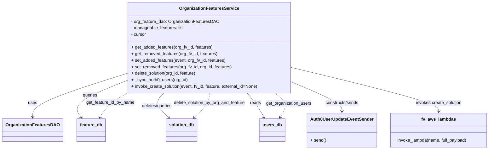

# Diagram: common/iam_service/iam_service/v1/lambdas/organizations/organization_features.py

> Auto-generated by Obscura crawlers

## Mermaid

### SVG

<svg id="container" width="1792.74609375" xmlns="http://www.w3.org/2000/svg" class="classDiagram" height="552" viewBox="0 0 1792.74609375 552" role="graphics-document document" aria-roledescription="class"><g><defs><marker id="container_class-aggregationStart" class="marker aggregation class" refX="18" refY="7" markerWidth="190" markerHeight="240" orient="auto"><path d="M 18,7 L9,13 L1,7 L9,1 Z"></path></marker></defs><defs><marker id="container_class-aggregationEnd" class="marker aggregation class" refX="1" refY="7" markerWidth="20" markerHeight="28" orient="auto"><path d="M 18,7 L9,13 L1,7 L9,1 Z"></path></marker></defs><defs><marker id="container_class-extensionStart" class="marker extension class" refX="18" refY="7" markerWidth="190" markerHeight="240" orient="auto"><path d="M 1,7 L18,13 V 1 Z"></path></marker></defs><defs><marker id="container_class-extensionEnd" class="marker extension class" refX="1" refY="7" markerWidth="20" markerHeight="28" orient="auto"><path d="M 1,1 V 13 L18,7 Z"></path></marker></defs><defs><marker id="container_class-compositionStart" class="marker composition class" refX="18" refY="7" markerWidth="190" markerHeight="240" orient="auto"><path d="M 18,7 L9,13 L1,7 L9,1 Z"></path></marker></defs><defs><marker id="container_class-compositionEnd" class="marker composition class" refX="1" refY="7" markerWidth="20" markerHeight="28" orient="auto"><path d="M 18,7 L9,13 L1,7 L9,1 Z"></path></marker></defs><defs><marker id="container_class-dependencyStart" class="marker dependency class" refX="6" refY="7" markerWidth="190" markerHeight="240" orient="auto"><path d="M 5,7 L9,13 L1,7 L9,1 Z"></path></marker></defs><defs><marker id="container_class-dependencyEnd" class="marker dependency class" refX="13" refY="7" markerWidth="20" markerHeight="28" orient="auto"><path d="M 18,7 L9,13 L14,7 L9,1 Z"></path></marker></defs><defs><marker id="container_class-lollipopStart" class="marker lollipop class" refX="13" refY="7" markerWidth="190" markerHeight="240" orient="auto"><circle stroke="black" fill="transparent" cx="7" cy="7" r="6"></circle></marker></defs><defs><marker id="container_class-lollipopEnd" class="marker lollipop class" refX="1" refY="7" markerWidth="190" markerHeight="240" orient="auto"><circle stroke="black" fill="transparent" cx="7" cy="7" r="6"></circle></marker></defs><g class="root"><g class="clusters"></g><g class="edgePaths"><path d="M466.922,269.996L407.974,288.497C349.026,306.997,231.13,343.999,172.182,371.166C113.234,398.333,113.234,415.667,113.234,424.333L113.234,433" id="id_OrganizationFeaturesService_OrganizationFeaturesDAO_1" class="edge-thickness-normal edge-pattern-solid relation" style=";;;" data-edge="true" data-et="edge" data-id="id_OrganizationFeaturesService_OrganizationFeaturesDAO_1" data-points="W3sieCI6NDY2LjkyMTg3NSwieSI6MjY5Ljk5NjA4Mjg4NzMwMDc2fSx7IngiOjExMy4yMzQzNzUsInkiOjM4MX0seyJ4IjoxMTMuMjM0Mzc1LCJ5Ijo0Mzl9XQ==" marker-end="url(#container_class-dependencyEnd)"></path><path d="M466.922,294.59L430.551,308.992C394.18,323.393,321.438,352.197,291.417,375.452C261.397,398.708,274.098,416.416,280.449,425.27L286.8,434.124" id="id_OrganizationFeaturesService_feature_db_2" class="edge-thickness-normal edge-pattern-solid relation" style=";;;" data-edge="true" data-et="edge" data-id="id_OrganizationFeaturesService_feature_db_2" data-points="W3sieCI6NDY2LjkyMTg3NSwieSI6Mjk0LjU4OTk0MDkyMjE1NzU1fSx7IngiOjI0OC42OTUzMTI1LCJ5IjozODF9LHsieCI6MjkwLjI5NjcxODc1LCJ5Ijo0Mzl9XQ==" marker-end="url(#container_class-dependencyEnd)"></path><path d="M593.706,344L587.366,350.167C581.027,356.333,568.347,368.667,571.468,383.812C574.59,398.957,593.512,416.913,602.972,425.892L612.433,434.87" id="id_OrganizationFeaturesService_solution_db_3" class="edge-thickness-normal edge-pattern-solid relation" style=";;;" data-edge="true" data-et="edge" data-id="id_OrganizationFeaturesService_solution_db_3" data-points="W3sieCI6NTkzLjcwNTc3MzYyODA0ODcsInkiOjM0NH0seyJ4Ijo1NTUuNjY3OTY4NzUsInkiOjM4MX0seyJ4Ijo2MTYuNzg1NDY4NzUsInkiOjQzOX1d" marker-end="url(#container_class-dependencyEnd)"></path><path d="M908.258,344L913.464,350.167C918.67,356.333,929.083,368.667,939.753,383.65C950.422,398.633,961.348,416.266,966.81,425.083L972.273,433.9" id="id_OrganizationFeaturesService_users_db_4" class="edge-thickness-normal edge-pattern-solid relation" style=";;;" data-edge="true" data-et="edge" data-id="id_OrganizationFeaturesService_users_db_4" data-points="W3sieCI6OTA4LjI1NzYwMjg5NjM0MTUsInkiOjM0NH0seyJ4Ijo5MzkuNDk2MDkzNzUsInkiOjM4MX0seyJ4Ijo5NzUuNDMzNDM3NSwieSI6NDM5fV0=" marker-end="url(#container_class-dependencyEnd)"></path><path d="M1065.914,301.383L1097.61,314.653C1129.306,327.922,1192.698,354.461,1224.394,372.897C1256.09,391.333,1256.09,401.667,1256.09,406.833L1256.09,412" id="id_OrganizationFeaturesService_Auth0UserUpdateEventSender_5" class="edge-thickness-normal edge-pattern-solid relation" style=";;;" data-edge="true" data-et="edge" data-id="id_OrganizationFeaturesService_Auth0UserUpdateEventSender_5" data-points="W3sieCI6MTA2NS45MTQwNjI1LCJ5IjozMDEuMzgzMzQ4MjI0MjU3M30seyJ4IjoxMjU2LjA4OTg0Mzc1LCJ5IjozODF9LHsieCI6MTI1Ni4wODk4NDM3NSwieSI6NDE4fV0=" marker-end="url(#container_class-dependencyEnd)"></path><path d="M1065.914,249.043L1156.09,271.036C1246.267,293.029,1426.62,337.014,1516.796,364.174C1606.973,391.333,1606.973,401.667,1606.973,406.833L1606.973,412" id="id_OrganizationFeaturesService_fv_aws_lambdas_6" class="edge-thickness-normal edge-pattern-solid relation" style=";;;" data-edge="true" data-et="edge" data-id="id_OrganizationFeaturesService_fv_aws_lambdas_6" data-points="W3sieCI6MTA2NS45MTQwNjI1LCJ5IjoyNDkuMDQzMDc1MTY0Mjc5NTR9LHsieCI6MTYwNi45NzI2NTYyNSwieSI6MzgxfSx7IngiOjE2MDYuOTcyNjU2MjUsInkiOjQxOH1d" marker-end="url(#container_class-dependencyEnd)"></path><path d="M352.478,434.045L358.514,425.204C364.549,416.363,376.62,398.682,395.694,382.765C414.768,366.848,440.845,352.695,453.883,345.619L466.922,338.543" id="id_feature_db_OrganizationFeaturesService_7" class="edge-thickness-normal edge-pattern-dashed relation" style=";;;" data-edge="true" data-et="edge" data-id="id_feature_db_OrganizationFeaturesService_7" data-points="W3sieCI6MzQ5LjA5NTA3ODEyNSwieSI6NDM5fSx7IngiOjM4OC42OTE0MDYyNSwieSI6MzgxfSx7IngiOjQ2Ni45MjE4NzUsInkiOjMzOC41NDI3MTAyOTM5MDQ3NX1d" marker-start="url(#container_class-dependencyStart)"></path><path d="M709.653,434.87L719.114,425.892C728.574,416.913,747.496,398.957,756.957,383.812C766.418,368.667,766.418,356.333,766.418,350.167L766.418,344" id="id_solution_db_OrganizationFeaturesService_8" class="edge-thickness-normal edge-pattern-dashed relation" style=";;;" data-edge="true" data-et="edge" data-id="id_solution_db_OrganizationFeaturesService_8" data-points="W3sieCI6NzA1LjMwMDQ2ODc1LCJ5Ijo0Mzl9LHsieCI6NzY2LjQxNzk2ODc1LCJ5IjozODF9LHsieCI6NzY2LjQxNzk2ODc1LCJ5IjozNDR9XQ==" marker-start="url(#container_class-dependencyStart)"></path><path d="M1030.641,433.9L1036.104,425.083C1041.567,416.266,1052.492,398.633,1049.021,383.65C1045.55,368.667,1027.681,356.333,1018.747,350.167L1009.813,344" id="id_users_db_OrganizationFeaturesService_9" class="edge-thickness-normal edge-pattern-dashed relation" style=";;;" data-edge="true" data-et="edge" data-id="id_users_db_OrganizationFeaturesService_9" data-points="W3sieCI6MTAyNy40ODA2MjUsInkiOjQzOX0seyJ4IjoxMDYzLjQxNzk2ODc1LCJ5IjozODF9LHsieCI6MTAwOS44MTMwOTA3MDEyMTk1LCJ5IjozNDR9XQ==" marker-start="url(#container_class-dependencyStart)"></path></g><g class="edgeLabels"><g class="edgeLabel" transform="translate(113.234375, 381)"><g class="label" data-id="id_OrganizationFeaturesService_OrganizationFeaturesDAO_1" transform="translate(-16.4921875, -12)"><foreignObject width="32.984375" height="24">

uses

</foreignObject></g></g><g class="edgeLabel" transform="translate(324.62668, 350.93384)"><g class="label" data-id="id_OrganizationFeaturesService_feature_db_2" transform="translate(-27.2421875, -12)"><foreignObject width="54.484375" height="24">

queries

</foreignObject></g></g><g class="edgeLabel" transform="translate(566.98105, 391.73602)"><g class="label" data-id="id_OrganizationFeaturesService_solution_db_3" transform="translate(-57.6796875, -12)"><foreignObject width="115.359375" height="24">

deletes/queries

</foreignObject></g></g><g class="edgeLabel" transform="translate(944.71242, 389.41873)"><g class="label" data-id="id_OrganizationFeaturesService_users_db_4" transform="translate(-20.0078125, -12)"><foreignObject width="40.015625" height="24">

reads

</foreignObject></g></g><g class="edgeLabel" transform="translate(1256.08984375, 381)"><g class="label" data-id="id_OrganizationFeaturesService_Auth0UserUpdateEventSender_5" transform="translate(-63.0703125, -12)"><foreignObject width="126.140625" height="24">

constructs/sends

</foreignObject></g></g><g class="edgeLabel" transform="translate(1606.97265625, 381)"><g class="label" data-id="id_OrganizationFeaturesService_fv_aws_lambdas_6" transform="translate(-86.0546875, -12)"><foreignObject width="172.109375" height="24">

invokes create_solution

</foreignObject></g></g><g class="edgeLabel" transform="translate(396.94514, 376.52053)"><g class="label" data-id="id_feature_db_OrganizationFeaturesService_7" transform="translate(-89.296875, -12)"><foreignObject width="178.59375" height="24">

get_feature_id_by_name

</foreignObject></g></g><g class="edgeLabel" transform="translate(766.41796875, 381)"><g class="label" data-id="id_solution_db_OrganizationFeaturesService_8" transform="translate(-133.0703125, -12)"><foreignObject width="266.140625" height="24">

delete_solution_by_org_and_feature

</foreignObject></g></g><g class="edgeLabel" transform="translate(1062.60242, 382.31623)"><g class="label" data-id="id_users_db_OrganizationFeaturesService_9" transform="translate(-83.9140625, -12)"><foreignObject width="167.828125" height="24">

get_organization_users

</foreignObject></g></g></g><g class="nodes"><g class="node default" id="classId-OrganizationFeaturesService-0" transform="translate(766.41796875, 176)"><g class="basic label-container"><path d="M-299.49609375 -168 L299.49609375 -168 L299.49609375 168 L-299.49609375 168" stroke="none" stroke-width="0" fill="#ECECFF" style=""></path><path d="M-299.49609375 -168 C-117.63238605740219 -168, 64.23132163519563 -168, 299.49609375 -168 M-299.49609375 -168 C-79.92053432077199 -168, 139.65502510845602 -168, 299.49609375 -168 M299.49609375 -168 C299.49609375 -48.43910495349017, 299.49609375 71.12179009301965, 299.49609375 168 M299.49609375 -168 C299.49609375 -67.92847812855608, 299.49609375 32.14304374288784, 299.49609375 168 M299.49609375 168 C74.15109386876762 168, -151.19390601246477 168, -299.49609375 168 M299.49609375 168 C138.26648872400813 168, -22.963116301983746 168, -299.49609375 168 M-299.49609375 168 C-299.49609375 39.98678527674048, -299.49609375 -88.02642944651905, -299.49609375 -168 M-299.49609375 168 C-299.49609375 51.75302038104587, -299.49609375 -64.49395923790826, -299.49609375 -168" stroke="#9370DB" stroke-width="1.3" fill="none" stroke-dasharray="0 0" style=""></path></g><g class="annotation-group text" transform="translate(0, -144)"></g><g class="label-group text" transform="translate(-104.5859375, -144)"><g class="label" style="font-weight: bolder" transform="translate(0,-12)"><foreignObject width="209.171875" height="24">

OrganizationFeaturesService

</foreignObject></g></g><g class="members-group text" transform="translate(-287.49609375, -96)"><g class="label" style="" transform="translate(0,-12)"><foreignObject width="321.546875" height="24">

- org_feature_dao: OrganizationFeaturesDAO

</foreignObject></g><g class="label" style="" transform="translate(0,12)"><foreignObject width="196.84375" height="24">

- manageable_features: list

</foreignObject></g><g class="label" style="" transform="translate(0,36)"><foreignObject width="56.421875" height="24">

- cursor

</foreignObject></g></g><g class="methods-group text" transform="translate(-287.49609375, 0)"><g class="label" style="" transform="translate(0,-12)"><foreignObject width="301.0625" height="24">

+ get_added_features(org_fv_id, features)

</foreignObject></g><g class="label" style="" transform="translate(0,12)"><foreignObject width="318.765625" height="24">

+ get_removed_features(org_fv_id, features)

</foreignObject></g><g class="label" style="" transform="translate(0,36)"><foreignObject width="348.953125" height="24">

+ set_added_features(event, org_fv_id, features)

</foreignObject></g><g class="label" style="" transform="translate(0,60)"><foreignObject width="372.3125" height="24">

+ set_removed_features(org_fv_id, org_id, features)

</foreignObject></g><g class="label" style="" transform="translate(0,84)"><foreignObject width="242.40625" height="24">

+ delete_solution(org_id, feature)

</foreignObject></g><g class="label" style="" transform="translate(0,108)"><foreignObject width="205.609375" height="24">

+ _sync_auth0_users(org_id)

</foreignObject></g><g class="label" style="" transform="translate(0,132)"><foreignObject width="470.40625" height="24">

+ invoke_create_solution(event, fv_id, feature, external_id=None)

</foreignObject></g></g><g class="divider" style=""><path d="M-299.49609375 -120 C-159.96831728740187 -120, -20.440540824803747 -120, 299.49609375 -120 M-299.49609375 -120 C-132.50789195862305 -120, 34.4803098327539 -120, 299.49609375 -120" stroke="#9370DB" stroke-width="1.3" fill="none" stroke-dasharray="0 0" style=""></path></g><g class="divider" style=""><path d="M-299.49609375 -24 C-153.48431996943935 -24, -7.4725461888787095 -24, 299.49609375 -24 M-299.49609375 -24 C-119.0275032983042 -24, 61.44108715339161 -24, 299.49609375 -24" stroke="#9370DB" stroke-width="1.3" fill="none" stroke-dasharray="0 0" style=""></path></g></g><g class="node default" id="classId-OrganizationFeaturesDAO-1" transform="translate(113.234375, 481)"><g class="basic label-container"><path d="M-105.234375 -42 L105.234375 -42 L105.234375 42 L-105.234375 42" stroke="none" stroke-width="0" fill="#ECECFF" style=""></path><path d="M-105.234375 -42 C-41.44293996725748 -42, 22.34849506548504 -42, 105.234375 -42 M-105.234375 -42 C-54.8000267970982 -42, -4.365678594196396 -42, 105.234375 -42 M105.234375 -42 C105.234375 -16.685104714032825, 105.234375 8.62979057193435, 105.234375 42 M105.234375 -42 C105.234375 -8.411889754647078, 105.234375 25.176220490705845, 105.234375 42 M105.234375 42 C39.77675806403633 42, -25.68085887192734 42, -105.234375 42 M105.234375 42 C57.416242098824654 42, 9.598109197649308 42, -105.234375 42 M-105.234375 42 C-105.234375 24.24193554857302, -105.234375 6.483871097146043, -105.234375 -42 M-105.234375 42 C-105.234375 11.433522841732081, -105.234375 -19.132954316535837, -105.234375 -42" stroke="#9370DB" stroke-width="1.3" fill="none" stroke-dasharray="0 0" style=""></path></g><g class="annotation-group text" transform="translate(0, -18)"></g><g class="label-group text" transform="translate(-93.234375, -18)"><g class="label" style="font-weight: bolder" transform="translate(0,-12)"><foreignObject width="186.46875" height="24">

OrganizationFeaturesDAO

</foreignObject></g></g><g class="members-group text" transform="translate(-93.234375, 30)"></g><g class="methods-group text" transform="translate(-93.234375, 60)"></g><g class="divider" style=""><path d="M-105.234375 6 C-31.62209793017132 6, 41.99017913965736 6, 105.234375 6 M-105.234375 6 C-29.45796661141891 6, 46.31844177716218 6, 105.234375 6" stroke="#9370DB" stroke-width="1.3" fill="none" stroke-dasharray="0 0" style=""></path></g><g class="divider" style=""><path d="M-105.234375 24 C-22.8131733556139 24, 59.6080282887722 24, 105.234375 24 M-105.234375 24 C-51.79963036709823 24, 1.6351142658035371 24, 105.234375 24" stroke="#9370DB" stroke-width="1.3" fill="none" stroke-dasharray="0 0" style=""></path></g></g><g class="node default" id="classId-feature_db-2" transform="translate(320.421875, 481)"><g class="basic label-container"><path d="M-51.953125 -42 L51.953125 -42 L51.953125 42 L-51.953125 42" stroke="none" stroke-width="0" fill="#ECECFF" style=""></path><path d="M-51.953125 -42 C-17.831268465357603 -42, 16.290588069284794 -42, 51.953125 -42 M-51.953125 -42 C-29.791274945821673 -42, -7.629424891643346 -42, 51.953125 -42 M51.953125 -42 C51.953125 -23.512253177617936, 51.953125 -5.0245063552358715, 51.953125 42 M51.953125 -42 C51.953125 -15.582661308537514, 51.953125 10.834677382924973, 51.953125 42 M51.953125 42 C28.05600618808712 42, 4.158887376174242 42, -51.953125 42 M51.953125 42 C13.338915142700444 42, -25.275294714599113 42, -51.953125 42 M-51.953125 42 C-51.953125 12.410318370133563, -51.953125 -17.179363259732874, -51.953125 -42 M-51.953125 42 C-51.953125 12.55379082028518, -51.953125 -16.89241835942964, -51.953125 -42" stroke="#9370DB" stroke-width="1.3" fill="none" stroke-dasharray="0 0" style=""></path></g><g class="annotation-group text" transform="translate(0, -18)"></g><g class="label-group text" transform="translate(-39.953125, -18)"><g class="label" style="font-weight: bolder" transform="translate(0,-12)"><foreignObject width="79.90625" height="24">

feature_db

</foreignObject></g></g><g class="members-group text" transform="translate(-39.953125, 30)"></g><g class="methods-group text" transform="translate(-39.953125, 60)"></g><g class="divider" style=""><path d="M-51.953125 6 C-27.983032908328777 6, -4.012940816657554 6, 51.953125 6 M-51.953125 6 C-30.35809299249523 6, -8.76306098499046 6, 51.953125 6" stroke="#9370DB" stroke-width="1.3" fill="none" stroke-dasharray="0 0" style=""></path></g><g class="divider" style=""><path d="M-51.953125 24 C-27.619532736320696 24, -3.2859404726413928 24, 51.953125 24 M-51.953125 24 C-30.893510251635206 24, -9.833895503270412 24, 51.953125 24" stroke="#9370DB" stroke-width="1.3" fill="none" stroke-dasharray="0 0" style=""></path></g></g><g class="node default" id="classId-solution_db-3" transform="translate(661.04296875, 481)"><g class="basic label-container"><path d="M-55.703125 -42 L55.703125 -42 L55.703125 42 L-55.703125 42" stroke="none" stroke-width="0" fill="#ECECFF" style=""></path><path d="M-55.703125 -42 C-31.46152544822342 -42, -7.2199258964468385 -42, 55.703125 -42 M-55.703125 -42 C-16.902136969692982 -42, 21.898851060614035 -42, 55.703125 -42 M55.703125 -42 C55.703125 -9.886027685883164, 55.703125 22.227944628233672, 55.703125 42 M55.703125 -42 C55.703125 -19.908744508780252, 55.703125 2.1825109824394957, 55.703125 42 M55.703125 42 C28.14434666681768 42, 0.5855683336353579 42, -55.703125 42 M55.703125 42 C11.784746906725836 42, -32.13363118654833 42, -55.703125 42 M-55.703125 42 C-55.703125 23.210451652846956, -55.703125 4.420903305693912, -55.703125 -42 M-55.703125 42 C-55.703125 14.313374386851521, -55.703125 -13.373251226296958, -55.703125 -42" stroke="#9370DB" stroke-width="1.3" fill="none" stroke-dasharray="0 0" style=""></path></g><g class="annotation-group text" transform="translate(0, -18)"></g><g class="label-group text" transform="translate(-43.703125, -18)"><g class="label" style="font-weight: bolder" transform="translate(0,-12)"><foreignObject width="87.40625" height="24">

solution_db

</foreignObject></g></g><g class="members-group text" transform="translate(-43.703125, 30)"></g><g class="methods-group text" transform="translate(-43.703125, 60)"></g><g class="divider" style=""><path d="M-55.703125 6 C-29.887171298902555 6, -4.071217597805109 6, 55.703125 6 M-55.703125 6 C-31.870343417383 6, -8.037561834766002 6, 55.703125 6" stroke="#9370DB" stroke-width="1.3" fill="none" stroke-dasharray="0 0" style=""></path></g><g class="divider" style=""><path d="M-55.703125 24 C-26.296742800729277 24, 3.1096393985414466 24, 55.703125 24 M-55.703125 24 C-11.513961241619363 24, 32.675202516761274 24, 55.703125 24" stroke="#9370DB" stroke-width="1.3" fill="none" stroke-dasharray="0 0" style=""></path></g></g><g class="node default" id="classId-users_db-4" transform="translate(1001.45703125, 481)"><g class="basic label-container"><path d="M-45.25 -42 L45.25 -42 L45.25 42 L-45.25 42" stroke="none" stroke-width="0" fill="#ECECFF" style=""></path><path d="M-45.25 -42 C-25.41633174829726 -42, -5.58266349659452 -42, 45.25 -42 M-45.25 -42 C-20.849390691575923 -42, 3.5512186168481534 -42, 45.25 -42 M45.25 -42 C45.25 -16.556479721263372, 45.25 8.887040557473256, 45.25 42 M45.25 -42 C45.25 -9.332725642663775, 45.25 23.33454871467245, 45.25 42 M45.25 42 C14.61364154335526 42, -16.02271691328948 42, -45.25 42 M45.25 42 C20.11650406653115 42, -5.016991866937701 42, -45.25 42 M-45.25 42 C-45.25 17.182574300916993, -45.25 -7.634851398166013, -45.25 -42 M-45.25 42 C-45.25 10.265140703866322, -45.25 -21.469718592267355, -45.25 -42" stroke="#9370DB" stroke-width="1.3" fill="none" stroke-dasharray="0 0" style=""></path></g><g class="annotation-group text" transform="translate(0, -18)"></g><g class="label-group text" transform="translate(-33.25, -18)"><g class="label" style="font-weight: bolder" transform="translate(0,-12)"><foreignObject width="66.5" height="24">

users_db

</foreignObject></g></g><g class="members-group text" transform="translate(-33.25, 30)"></g><g class="methods-group text" transform="translate(-33.25, 60)"></g><g class="divider" style=""><path d="M-45.25 6 C-17.14944568003232 6, 10.951108639935363 6, 45.25 6 M-45.25 6 C-25.044671227531907 6, -4.839342455063814 6, 45.25 6" stroke="#9370DB" stroke-width="1.3" fill="none" stroke-dasharray="0 0" style=""></path></g><g class="divider" style=""><path d="M-45.25 24 C-17.5283126913304 24, 10.193374617339202 24, 45.25 24 M-45.25 24 C-27.09602501618864 24, -8.942050032377281 24, 45.25 24" stroke="#9370DB" stroke-width="1.3" fill="none" stroke-dasharray="0 0" style=""></path></g></g><g class="node default" id="classId-Auth0UserUpdateEventSender-5" transform="translate(1256.08984375, 481)"><g class="basic label-container"><path d="M-123.109375 -63 L123.109375 -63 L123.109375 63 L-123.109375 63" stroke="none" stroke-width="0" fill="#ECECFF" style=""></path><path d="M-123.109375 -63 C-46.95426860317605 -63, 29.200837793647906 -63, 123.109375 -63 M-123.109375 -63 C-51.10091977210615 -63, 20.907535455787695 -63, 123.109375 -63 M123.109375 -63 C123.109375 -13.121695972774823, 123.109375 36.75660805445035, 123.109375 63 M123.109375 -63 C123.109375 -25.470101066251196, 123.109375 12.059797867497608, 123.109375 63 M123.109375 63 C47.03126991945395 63, -29.046835161092105 63, -123.109375 63 M123.109375 63 C47.919578103935024 63, -27.270218792129953 63, -123.109375 63 M-123.109375 63 C-123.109375 35.13573030471966, -123.109375 7.271460609439316, -123.109375 -63 M-123.109375 63 C-123.109375 22.268146121290535, -123.109375 -18.46370775741893, -123.109375 -63" stroke="#9370DB" stroke-width="1.3" fill="none" stroke-dasharray="0 0" style=""></path></g><g class="annotation-group text" transform="translate(0, -39)"></g><g class="label-group text" transform="translate(-111.109375, -39)"><g class="label" style="font-weight: bolder" transform="translate(0,-12)"><foreignObject width="222.21875" height="24">

Auth0UserUpdateEventSender

</foreignObject></g></g><g class="members-group text" transform="translate(-111.109375, 9)"></g><g class="methods-group text" transform="translate(-111.109375, 39)"><g class="label" style="" transform="translate(0,-12)"><foreignObject width="57.734375" height="24">

+ send()

</foreignObject></g></g><g class="divider" style=""><path d="M-123.109375 -15 C-63.03510389685401 -15, -2.960832793708022 -15, 123.109375 -15 M-123.109375 -15 C-54.99647273698959 -15, 13.116429526020823 -15, 123.109375 -15" stroke="#9370DB" stroke-width="1.3" fill="none" stroke-dasharray="0 0" style=""></path></g><g class="divider" style=""><path d="M-123.109375 9 C-44.007195105887575 9, 35.09498478822485 9, 123.109375 9 M-123.109375 9 C-53.88214015595523 9, 15.345094688089546 9, 123.109375 9" stroke="#9370DB" stroke-width="1.3" fill="none" stroke-dasharray="0 0" style=""></path></g></g><g class="node default" id="classId-fv_aws_lambdas-6" transform="translate(1606.97265625, 481)"><g class="basic label-container"><path d="M-177.7734375 -63 L177.7734375 -63 L177.7734375 63 L-177.7734375 63" stroke="none" stroke-width="0" fill="#ECECFF" style=""></path><path d="M-177.7734375 -63 C-60.74339946322448 -63, 56.286638573551045 -63, 177.7734375 -63 M-177.7734375 -63 C-68.38465958119295 -63, 41.0041183376141 -63, 177.7734375 -63 M177.7734375 -63 C177.7734375 -13.207915132622091, 177.7734375 36.58416973475582, 177.7734375 63 M177.7734375 -63 C177.7734375 -18.136717884910205, 177.7734375 26.72656423017959, 177.7734375 63 M177.7734375 63 C59.08512491624177 63, -59.603187667516465 63, -177.7734375 63 M177.7734375 63 C47.62957750156173 63, -82.51428249687655 63, -177.7734375 63 M-177.7734375 63 C-177.7734375 13.038370737870807, -177.7734375 -36.92325852425839, -177.7734375 -63 M-177.7734375 63 C-177.7734375 21.670619526887407, -177.7734375 -19.658760946225186, -177.7734375 -63" stroke="#9370DB" stroke-width="1.3" fill="none" stroke-dasharray="0 0" style=""></path></g><g class="annotation-group text" transform="translate(0, -39)"></g><g class="label-group text" transform="translate(-60.0625, -39)"><g class="label" style="font-weight: bolder" transform="translate(0,-12)"><foreignObject width="120.125" height="24">

fv_aws_lambdas

</foreignObject></g></g><g class="members-group text" transform="translate(-165.7734375, 9)"></g><g class="methods-group text" transform="translate(-165.7734375, 39)"><g class="label" style="" transform="translate(0,-12)"><foreignObject width="271.484375" height="24">

+ invoke_lambda(name, full_payload)

</foreignObject></g></g><g class="divider" style=""><path d="M-177.7734375 -15 C-93.46386743086612 -15, -9.154297361732233 -15, 177.7734375 -15 M-177.7734375 -15 C-83.66831757367426 -15, 10.436802352651483 -15, 177.7734375 -15" stroke="#9370DB" stroke-width="1.3" fill="none" stroke-dasharray="0 0" style=""></path></g><g class="divider" style=""><path d="M-177.7734375 9 C-85.86960176786701 9, 6.0342339642659795 9, 177.7734375 9 M-177.7734375 9 C-71.12533482132054 9, 35.52276785735893 9, 177.7734375 9" stroke="#9370DB" stroke-width="1.3" fill="none" stroke-dasharray="0 0" style=""></path></g></g></g></g></g></svg>
