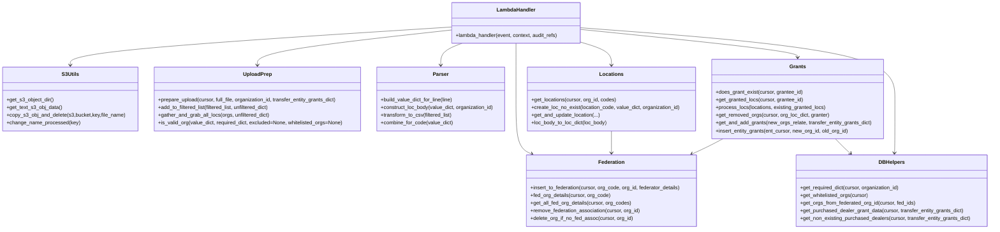

# Diagram: common/iam_service/iam_service/v1/lambdas/organizations/update_federated_org_old_delete_after_IN-1253.py


> Auto-generated by Obscura crawlers

## Diagram 1

```mermaid
flowchart LR
  A[get_s3_object_dir] -->|keys| B[get_last_uploaded_file_key]
  B -->|latest file| C[get_text_s3_obj_data]
  C --> D[prepare_upload]
  D --> E[gather_and_grab_all_locs]
  E --> F[get_locations]
  D --> G[gather_data]
  G --> H[get_and_add_grants]
  G --> I[process_locs]
  I --> J[invokinator_location.add_location_grants]
  I --> K[invokinator_location.delete_location_grants]
  J --> L[invokinator_organization.invoke_publish_organization]
  K --> L
  G --> M[insert_to_federation]
  M --> N[insert_solution_for_dda]
  G --> O[add_or_update_org]
  O --> P[create_or_update_organization_lambda]
  G --> Q[get_and_update_location]
  Q --> R[locations-get -> locations-put]
  subgraph DB
    S[get_all_fed_org_details]
    T[get_locations (DB)]
    U[get_required_dict]
    V[get_whitelisted_orgs]
    W[get_granted_locs]
  end
  D --> V
  G --> W
  L --> copy_s3_obj_and_delete
  copy_s3_obj_and_delete --> make_response[make_response]
```

> SVG rendering failed for this diagram.

## Diagram 2



### SVG

<svg id="container" width="3083.4375" xmlns="http://www.w3.org/2000/svg" class="classDiagram" height="710" viewBox="0 0 3083.4375 710" role="graphics-document document" aria-roledescription="class"><style>#container{font-family:"trebuchet ms",verdana,arial,sans-serif;font-size:16px;fill:#333;}@keyframes edge-animation-frame{from{stroke-dashoffset:0;}}@keyframes dash{to{stroke-dashoffset:0;}}#container .edge-animation-slow{stroke-dasharray:9,5!important;stroke-dashoffset:900;animation:dash 50s linear infinite;stroke-linecap:round;}#container .edge-animation-fast{stroke-dasharray:9,5!important;stroke-dashoffset:900;animation:dash 20s linear infinite;stroke-linecap:round;}#container .error-icon{fill:#552222;}#container .error-text{fill:#552222;stroke:#552222;}#container .edge-thickness-normal{stroke-width:1px;}#container .edge-thickness-thick{stroke-width:3.5px;}#container .edge-pattern-solid{stroke-dasharray:0;}#container .edge-thickness-invisible{stroke-width:0;fill:none;}#container .edge-pattern-dashed{stroke-dasharray:3;}#container .edge-pattern-dotted{stroke-dasharray:2;}#container .marker{fill:#333333;stroke:#333333;}#container .marker.cross{stroke:#333333;}#container svg{font-family:"trebuchet ms",verdana,arial,sans-serif;font-size:16px;}#container p{margin:0;}#container g.classGroup text{fill:#9370DB;stroke:none;font-family:"trebuchet ms",verdana,arial,sans-serif;font-size:10px;}#container g.classGroup text .title{font-weight:bolder;}#container .nodeLabel,#container .edgeLabel{color:#131300;}#container .edgeLabel .label rect{fill:#ECECFF;}#container .label text{fill:#131300;}#container .labelBkg{background:#ECECFF;}#container .edgeLabel .label span{background:#ECECFF;}#container .classTitle{font-weight:bolder;}#container .node rect,#container .node circle,#container .node ellipse,#container .node polygon,#container .node path{fill:#ECECFF;stroke:#9370DB;stroke-width:1px;}#container .divider{stroke:#9370DB;stroke-width:1;}#container g.clickable{cursor:pointer;}#container g.classGroup rect{fill:#ECECFF;stroke:#9370DB;}#container g.classGroup line{stroke:#9370DB;stroke-width:1;}#container .classLabel .box{stroke:none;stroke-width:0;fill:#ECECFF;opacity:0.5;}#container .classLabel .label{fill:#9370DB;font-size:10px;}#container .relation{stroke:#333333;stroke-width:1;fill:none;}#container .dashed-line{stroke-dasharray:3;}#container .dotted-line{stroke-dasharray:1 2;}#container #compositionStart,#container .composition{fill:#333333!important;stroke:#333333!important;stroke-width:1;}#container #compositionEnd,#container .composition{fill:#333333!important;stroke:#333333!important;stroke-width:1;}#container #dependencyStart,#container .dependency{fill:#333333!important;stroke:#333333!important;stroke-width:1;}#container #dependencyStart,#container .dependency{fill:#333333!important;stroke:#333333!important;stroke-width:1;}#container #extensionStart,#container .extension{fill:transparent!important;stroke:#333333!important;stroke-width:1;}#container #extensionEnd,#container .extension{fill:transparent!important;stroke:#333333!important;stroke-width:1;}#container #aggregationStart,#container .aggregation{fill:transparent!important;stroke:#333333!important;stroke-width:1;}#container #aggregationEnd,#container .aggregation{fill:transparent!important;stroke:#333333!important;stroke-width:1;}#container #lollipopStart,#container .lollipop{fill:#ECECFF!important;stroke:#333333!important;stroke-width:1;}#container #lollipopEnd,#container .lollipop{fill:#ECECFF!important;stroke:#333333!important;stroke-width:1;}#container .edgeTerminals{font-size:11px;line-height:initial;}#container .classTitleText{text-anchor:middle;font-size:18px;fill:#333;}#container .label-icon{display:inline-block;height:1em;overflow:visible;vertical-align:-0.125em;}#container .node .label-icon path{fill:currentColor;stroke:revert;stroke-width:revert;}#container :root{--mermaid-font-family:"trebuchet ms",verdana,arial,sans-serif;}</style><g><defs><marker id="container_class-aggregationStart" class="marker aggregation class" refX="18" refY="7" markerWidth="190" markerHeight="240" orient="auto"><path d="M 18,7 L9,13 L1,7 L9,1 Z"></path></marker></defs><defs><marker id="container_class-aggregationEnd" class="marker aggregation class" refX="1" refY="7" markerWidth="20" markerHeight="28" orient="auto"><path d="M 18,7 L9,13 L1,7 L9,1 Z"></path></marker></defs><defs><marker id="container_class-extensionStart" class="marker extension class" refX="18" refY="7" markerWidth="190" markerHeight="240" orient="auto"><path d="M 1,7 L18,13 V 1 Z"></path></marker></defs><defs><marker id="container_class-extensionEnd" class="marker extension class" refX="1" refY="7" markerWidth="20" markerHeight="28" orient="auto"><path d="M 1,1 V 13 L18,7 Z"></path></marker></defs><defs><marker id="container_class-compositionStart" class="marker composition class" refX="18" refY="7" markerWidth="190" markerHeight="240" orient="auto"><path d="M 18,7 L9,13 L1,7 L9,1 Z"></path></marker></defs><defs><marker id="container_class-compositionEnd" class="marker composition class" refX="1" refY="7" markerWidth="20" markerHeight="28" orient="auto"><path d="M 18,7 L9,13 L1,7 L9,1 Z"></path></marker></defs><defs><marker id="container_class-dependencyStart" class="marker dependency class" refX="6" refY="7" markerWidth="190" markerHeight="240" orient="auto"><path d="M 5,7 L9,13 L1,7 L9,1 Z"></path></marker></defs><defs><marker id="container_class-dependencyEnd" class="marker dependency class" refX="13" refY="7" markerWidth="20" markerHeight="28" orient="auto"><path d="M 18,7 L9,13 L14,7 L9,1 Z"></path></marker></defs><defs><marker id="container_class-lollipopStart" class="marker lollipop class" refX="13" refY="7" markerWidth="190" markerHeight="240" orient="auto"><circle stroke="black" fill="transparent" cx="7" cy="7" r="6"></circle></marker></defs><defs><marker id="container_class-lollipopEnd" class="marker lollipop class" refX="1" refY="7" markerWidth="190" markerHeight="240" orient="auto"><circle stroke="black" fill="transparent" cx="7" cy="7" r="6"></circle></marker></defs><g class="root"><g class="clusters"></g><g class="edgePaths"><path d="M1405.18,83.777L1207.025,96.315C1008.87,108.852,612.56,133.926,414.405,153.63C216.25,173.333,216.25,187.667,216.25,194.833L216.25,202" id="id_LambdaHandler_S3Utils_1" class="edge-thickness-normal edge-pattern-solid relation" style=";;;" data-edge="true" data-et="edge" data-id="id_LambdaHandler_S3Utils_1" data-points="W3sieCI6MTQwNS4xNzk2ODc1LCJ5Ijo4My43Nzc0MDY0MzU4ODU0OH0seyJ4IjoyMTYuMjUsInkiOjE1OX0seyJ4IjoyMTYuMjUsInkiOjIwOH1d" marker-end="url(#container_class-dependencyEnd)"></path><path d="M1405.18,92.928L1303.764,103.94C1202.348,114.952,999.516,136.976,898.1,155.155C796.684,173.333,796.684,187.667,796.684,194.833L796.684,202" id="id_LambdaHandler_UploadPrep_2" class="edge-thickness-normal edge-pattern-solid relation" style=";;;" data-edge="true" data-et="edge" data-id="id_LambdaHandler_UploadPrep_2" data-points="W3sieCI6MTQwNS4xNzk2ODc1LCJ5Ijo5Mi45Mjg0MjUxMTE0NTkyfSx7IngiOjc5Ni42ODM1OTM3NSwieSI6MTU5fSx7IngiOjc5Ni42ODM1OTM3NSwieSI6MjA4fV0=" marker-end="url(#container_class-dependencyEnd)"></path><path d="M1437.725,134L1426.521,138.167C1415.317,142.333,1392.908,150.667,1381.704,162C1370.5,173.333,1370.5,187.667,1370.5,194.833L1370.5,202" id="id_LambdaHandler_Parser_3" class="edge-thickness-normal edge-pattern-solid relation" style=";;;" data-edge="true" data-et="edge" data-id="id_LambdaHandler_Parser_3" data-points="W3sieCI6MTQzNy43MjUyMzA4MjM4NjM1LCJ5IjoxMzR9LHsieCI6MTM3MC41LCJ5IjoxNTl9LHsieCI6MTM3MC41LCJ5IjoyMDh9XQ==" marker-end="url(#container_class-dependencyEnd)"></path><path d="M1607.133,134L1607.133,138.167C1607.133,142.333,1607.133,150.667,1607.133,179.5C1607.133,208.333,1607.133,257.667,1607.133,307C1607.133,356.333,1607.133,405.667,1615.348,434.085C1623.563,462.503,1639.994,470.005,1648.21,473.756L1656.425,477.508" id="id_LambdaHandler_Federation_4" class="edge-thickness-normal edge-pattern-solid relation" style=";;;" data-edge="true" data-et="edge" data-id="id_LambdaHandler_Federation_4" data-points="W3sieCI6MTYwNy4xMzI4MTI1LCJ5IjoxMzR9LHsieCI6MTYwNy4xMzI4MTI1LCJ5IjoxNTl9LHsieCI6MTYwNy4xMzI4MTI1LCJ5IjozMDd9LHsieCI6MTYwNy4xMzI4MTI1LCJ5Ijo0NTV9LHsieCI6MTY2MS44ODI3ODM3Nzc1NzM0LCJ5Ijo0ODB9XQ==" marker-end="url(#container_class-dependencyEnd)"></path><path d="M1809.086,130.669L1825.067,135.391C1841.048,140.113,1873.01,149.556,1888.992,161.445C1904.973,173.333,1904.973,187.667,1904.973,194.833L1904.973,202" id="id_LambdaHandler_Locations_5" class="edge-thickness-normal edge-pattern-solid relation" style=";;;" data-edge="true" data-et="edge" data-id="id_LambdaHandler_Locations_5" data-points="W3sieCI6MTgwOS4wODU5Mzc1LCJ5IjoxMzAuNjY5MjMyODg3ODUxM30seyJ4IjoxOTA0Ljk3MjY1NjI1LCJ5IjoxNTl9LHsieCI6MTkwNC45NzI2NTYyNSwieSI6MjA4fV0=" marker-end="url(#container_class-dependencyEnd)"></path><path d="M1809.086,91.244L1921.743,102.536C2034.401,113.829,2259.716,136.415,2372.374,150.874C2485.031,165.333,2485.031,171.667,2485.031,174.833L2485.031,178" id="id_LambdaHandler_Grants_6" class="edge-thickness-normal edge-pattern-solid relation" style=";;;" data-edge="true" data-et="edge" data-id="id_LambdaHandler_Grants_6" data-points="W3sieCI6MTgwOS4wODU5Mzc1LCJ5Ijo5MS4yNDM2NTcxNzEzMzQyM30seyJ4IjoyNDg1LjAzMTI1LCJ5IjoxNTl9LHsieCI6MjQ4NS4wMzEyNSwieSI6MTg0fV0=" marker-end="url(#container_class-dependencyEnd)"></path><path d="M1809.086,86.059L1972.113,98.216C2135.141,110.373,2461.195,134.686,2624.223,171.51C2787.25,208.333,2787.25,257.667,2787.25,307C2787.25,356.333,2787.25,405.667,2787.017,433.503C2786.784,461.339,2786.318,467.677,2786.085,470.847L2785.852,474.016" id="id_LambdaHandler_DBHelpers_7" class="edge-thickness-normal edge-pattern-solid relation" style=";;;" data-edge="true" data-et="edge" data-id="id_LambdaHandler_DBHelpers_7" data-points="W3sieCI6MTgwOS4wODU5Mzc1LCJ5Ijo4Ni4wNTk0MTU0NDQ3MDU1Nn0seyJ4IjoyNzg3LjI1LCJ5IjoxNTl9LHsieCI6Mjc4Ny4yNSwieSI6MzA3fSx7IngiOjI3ODcuMjUsInkiOjQ1NX0seyJ4IjoyNzg1LjQxMTc2NDcwNTg4MjQsInkiOjQ4MH1d" marker-end="url(#container_class-dependencyEnd)"></path><path d="M1904.973,406L1904.973,414.167C1904.973,422.333,1904.973,438.667,1904.973,450C1904.973,461.333,1904.973,467.667,1904.973,470.833L1904.973,474" id="id_Locations_Federation_8" class="edge-thickness-normal edge-pattern-solid relation" style=";;;" data-edge="true" data-et="edge" data-id="id_Locations_Federation_8" data-points="W3sieCI6MTkwNC45NzI2NTYyNSwieSI6NDA2fSx7IngiOjE5MDQuOTcyNjU2MjUsInkiOjQ1NX0seyJ4IjoxOTA0Ljk3MjY1NjI1LCJ5Ijo0ODB9XQ==" marker-end="url(#container_class-dependencyEnd)"></path><path d="M2252.304,430L2244.42,434.167C2236.537,438.333,2220.769,446.667,2204.604,454.587C2188.439,462.508,2171.877,470.015,2163.596,473.769L2155.314,477.523" id="id_Grants_Federation_9" class="edge-thickness-normal edge-pattern-solid relation" style=";;;" data-edge="true" data-et="edge" data-id="id_Grants_Federation_9" data-points="W3sieCI6MjI1Mi4zMDQxOTkyMTg3NSwieSI6NDMwfSx7IngiOjIyMDUuMDAxOTUzMTI1LCJ5Ijo0NTV9LHsieCI6MjE0OS44NDk1MDg4NDY1MDc0LCJ5Ijo0ODB9XQ==" marker-end="url(#container_class-dependencyEnd)"></path><path d="M2602.305,430L2606.277,434.167C2610.25,438.333,2618.195,446.667,2626.054,454.331C2633.913,461.995,2641.686,468.991,2645.572,472.488L2649.458,475.986" id="id_Grants_DBHelpers_10" class="edge-thickness-normal edge-pattern-solid relation" style=";;;" data-edge="true" data-et="edge" data-id="id_Grants_DBHelpers_10" data-points="W3sieCI6MjYwMi4zMDQ1ODE5MjU2NzYsInkiOjQzMH0seyJ4IjoyNjI2LjE0MDYyNSwieSI6NDU1fSx7IngiOjI2NTMuOTE4MDgzNjM5NzA2LCJ5Ijo0ODB9XQ==" marker-end="url(#container_class-dependencyEnd)"></path></g><g class="edgeLabels"><g class="edgeLabel"><g class="label" data-id="id_LambdaHandler_S3Utils_1" transform="translate(0, 0)"><foreignObject width="0" height="0"><div xmlns="http://www.w3.org/1999/xhtml" class="labelBkg" style="display: table-cell; white-space: nowrap; line-height: 1.5; max-width: 200px; text-align: center;"><span class="edgeLabel"></span></div></foreignObject></g></g><g class="edgeLabel"><g class="label" data-id="id_LambdaHandler_UploadPrep_2" transform="translate(0, 0)"><foreignObject width="0" height="0"><div xmlns="http://www.w3.org/1999/xhtml" class="labelBkg" style="display: table-cell; white-space: nowrap; line-height: 1.5; max-width: 200px; text-align: center;"><span class="edgeLabel"></span></div></foreignObject></g></g><g class="edgeLabel"><g class="label" data-id="id_LambdaHandler_Parser_3" transform="translate(0, 0)"><foreignObject width="0" height="0"><div xmlns="http://www.w3.org/1999/xhtml" class="labelBkg" style="display: table-cell; white-space: nowrap; line-height: 1.5; max-width: 200px; text-align: center;"><span class="edgeLabel"></span></div></foreignObject></g></g><g class="edgeLabel"><g class="label" data-id="id_LambdaHandler_Federation_4" transform="translate(0, 0)"><foreignObject width="0" height="0"><div xmlns="http://www.w3.org/1999/xhtml" class="labelBkg" style="display: table-cell; white-space: nowrap; line-height: 1.5; max-width: 200px; text-align: center;"><span class="edgeLabel"></span></div></foreignObject></g></g><g class="edgeLabel"><g class="label" data-id="id_LambdaHandler_Locations_5" transform="translate(0, 0)"><foreignObject width="0" height="0"><div xmlns="http://www.w3.org/1999/xhtml" class="labelBkg" style="display: table-cell; white-space: nowrap; line-height: 1.5; max-width: 200px; text-align: center;"><span class="edgeLabel"></span></div></foreignObject></g></g><g class="edgeLabel"><g class="label" data-id="id_LambdaHandler_Grants_6" transform="translate(0, 0)"><foreignObject width="0" height="0"><div xmlns="http://www.w3.org/1999/xhtml" class="labelBkg" style="display: table-cell; white-space: nowrap; line-height: 1.5; max-width: 200px; text-align: center;"><span class="edgeLabel"></span></div></foreignObject></g></g><g class="edgeLabel"><g class="label" data-id="id_LambdaHandler_DBHelpers_7" transform="translate(0, 0)"><foreignObject width="0" height="0"><div xmlns="http://www.w3.org/1999/xhtml" class="labelBkg" style="display: table-cell; white-space: nowrap; line-height: 1.5; max-width: 200px; text-align: center;"><span class="edgeLabel"></span></div></foreignObject></g></g><g class="edgeLabel"><g class="label" data-id="id_Locations_Federation_8" transform="translate(0, 0)"><foreignObject width="0" height="0"><div xmlns="http://www.w3.org/1999/xhtml" class="labelBkg" style="display: table-cell; white-space: nowrap; line-height: 1.5; max-width: 200px; text-align: center;"><span class="edgeLabel"></span></div></foreignObject></g></g><g class="edgeLabel"><g class="label" data-id="id_Grants_Federation_9" transform="translate(0, 0)"><foreignObject width="0" height="0"><div xmlns="http://www.w3.org/1999/xhtml" class="labelBkg" style="display: table-cell; white-space: nowrap; line-height: 1.5; max-width: 200px; text-align: center;"><span class="edgeLabel"></span></div></foreignObject></g></g><g class="edgeLabel"><g class="label" data-id="id_Grants_DBHelpers_10" transform="translate(0, 0)"><foreignObject width="0" height="0"><div xmlns="http://www.w3.org/1999/xhtml" class="labelBkg" style="display: table-cell; white-space: nowrap; line-height: 1.5; max-width: 200px; text-align: center;"><span class="edgeLabel"></span></div></foreignObject></g></g></g><g class="nodes"><g class="node default" id="classId-LambdaHandler-0" transform="translate(1607.1328125, 71)"><g class="basic label-container"><path d="M-201.953125 -63 L201.953125 -63 L201.953125 63 L-201.953125 63" stroke="none" stroke-width="0" fill="#ECECFF" style=""></path><path d="M-201.953125 -63 C-78.05035680651721 -63, 45.85241138696557 -63, 201.953125 -63 M-201.953125 -63 C-119.4643370856209 -63, -36.975549171241795 -63, 201.953125 -63 M201.953125 -63 C201.953125 -22.075941403359735, 201.953125 18.84811719328053, 201.953125 63 M201.953125 -63 C201.953125 -13.291542106532596, 201.953125 36.41691578693481, 201.953125 63 M201.953125 63 C120.23442727010645 63, 38.5157295402129 63, -201.953125 63 M201.953125 63 C82.13825274128736 63, -37.67661951742528 63, -201.953125 63 M-201.953125 63 C-201.953125 36.25477958090842, -201.953125 9.509559161816838, -201.953125 -63 M-201.953125 63 C-201.953125 14.209605364643437, -201.953125 -34.580789270713126, -201.953125 -63" stroke="#9370DB" stroke-width="1.3" fill="none" stroke-dasharray="0 0" style=""></path></g><g class="annotation-group text" transform="translate(0, -39)"></g><g class="label-group text" transform="translate(-58.21875, -39)"><g class="label" style="font-weight: bolder" transform="translate(0,-12)"><foreignObject width="116.4375" height="24"><div xmlns="http://www.w3.org/1999/xhtml" style="display: table-cell; white-space: nowrap; line-height: 1.5; max-width: 167px; text-align: center;"><span class="nodeLabel markdown-node-label" style=""><p>LambdaHandler</p></span></div></foreignObject></g></g><g class="members-group text" transform="translate(-189.953125, 9)"></g><g class="methods-group text" transform="translate(-189.953125, 39)"><g class="label" style="" transform="translate(0,-12)"><foreignObject width="321.6875" height="24"><div xmlns="http://www.w3.org/1999/xhtml" style="display: table-cell; white-space: nowrap; line-height: 1.5; max-width: 379px; text-align: center;"><span class="nodeLabel markdown-node-label" style=""><p>+lambda_handler(event, context, audit_refs)</p></span></div></foreignObject></g></g><g class="divider" style=""><path d="M-201.953125 -15 C-64.38066924884413 -15, 73.19178650231174 -15, 201.953125 -15 M-201.953125 -15 C-41.63086774821173 -15, 118.69138950357654 -15, 201.953125 -15" stroke="#9370DB" stroke-width="1.3" fill="none" stroke-dasharray="0 0" style=""></path></g><g class="divider" style=""><path d="M-201.953125 9 C-120.13570792906094 9, -38.318290858121884 9, 201.953125 9 M-201.953125 9 C-81.46408134405551 9, 39.02496231188897 9, 201.953125 9" stroke="#9370DB" stroke-width="1.3" fill="none" stroke-dasharray="0 0" style=""></path></g></g><g class="node default" id="classId-S3Utils-1" transform="translate(216.25, 307)"><g class="basic label-container"><path d="M-208.25 -99 L208.25 -99 L208.25 99 L-208.25 99" stroke="none" stroke-width="0" fill="#ECECFF" style=""></path><path d="M-208.25 -99 C-101.11822681903877 -99, 6.013546361922465 -99, 208.25 -99 M-208.25 -99 C-81.90198144464817 -99, 44.44603711070366 -99, 208.25 -99 M208.25 -99 C208.25 -47.874133514468554, 208.25 3.251732971062893, 208.25 99 M208.25 -99 C208.25 -25.10781652612394, 208.25 48.78436694775212, 208.25 99 M208.25 99 C76.48126325206744 99, -55.28747349586513 99, -208.25 99 M208.25 99 C76.49723380544211 99, -55.255532389115785 99, -208.25 99 M-208.25 99 C-208.25 57.05579913088569, -208.25 15.111598261771377, -208.25 -99 M-208.25 99 C-208.25 30.62063886896925, -208.25 -37.7587222620615, -208.25 -99" stroke="#9370DB" stroke-width="1.3" fill="none" stroke-dasharray="0 0" style=""></path></g><g class="annotation-group text" transform="translate(0, -75)"></g><g class="label-group text" transform="translate(-25.53125, -75)"><g class="label" style="font-weight: bolder" transform="translate(0,-12)"><foreignObject width="51.0625" height="24"><div xmlns="http://www.w3.org/1999/xhtml" style="display: table-cell; white-space: nowrap; line-height: 1.5; max-width: 100px; text-align: center;"><span class="nodeLabel markdown-node-label" style=""><p>S3Utils</p></span></div></foreignObject></g></g><g class="members-group text" transform="translate(-196.25, -27)"></g><g class="methods-group text" transform="translate(-196.25, 3)"><g class="label" style="" transform="translate(0,-12)"><foreignObject width="146.109375" height="24"><div xmlns="http://www.w3.org/1999/xhtml" style="display: table-cell; white-space: nowrap; line-height: 1.5; max-width: 203px; text-align: center;"><span class="nodeLabel markdown-node-label" style=""><p>+get_s3_object_dir()</p></span></div></foreignObject></g><g class="label" style="" transform="translate(0,12)"><foreignObject width="171.984375" height="24"><div xmlns="http://www.w3.org/1999/xhtml" style="display: table-cell; white-space: nowrap; line-height: 1.5; max-width: 229px; text-align: center;"><span class="nodeLabel markdown-node-label" style=""><p>+get_text_s3_obj_data()</p></span></div></foreignObject></g><g class="label" style="" transform="translate(0,36)"><foreignObject width="366.96875" height="24"><div xmlns="http://www.w3.org/1999/xhtml" style="display: table-cell; white-space: nowrap; line-height: 1.5; max-width: 424px; text-align: center;"><span class="nodeLabel markdown-node-label" style=""><p>+copy_s3_obj_and_delete(s3,bucket,key,file_name)</p></span></div></foreignObject></g><g class="label" style="" transform="translate(0,60)"><foreignObject width="225" height="24"><div xmlns="http://www.w3.org/1999/xhtml" style="display: table-cell; white-space: nowrap; line-height: 1.5; max-width: 282px; text-align: center;"><span class="nodeLabel markdown-node-label" style=""><p>+change_name_processed(key)</p></span></div></foreignObject></g></g><g class="divider" style=""><path d="M-208.25 -51 C-91.7346172811737 -51, 24.780765437652605 -51, 208.25 -51 M-208.25 -51 C-113.1358690505312 -51, -18.021738101062397 -51, 208.25 -51" stroke="#9370DB" stroke-width="1.3" fill="none" stroke-dasharray="0 0" style=""></path></g><g class="divider" style=""><path d="M-208.25 -27 C-65.53380899141791 -27, 77.18238201716417 -27, 208.25 -27 M-208.25 -27 C-75.85571656567765 -27, 56.53856686864469 -27, 208.25 -27" stroke="#9370DB" stroke-width="1.3" fill="none" stroke-dasharray="0 0" style=""></path></g></g><g class="node default" id="classId-Parser-2" transform="translate(1370.5, 307)"><g class="basic label-container"><path d="M-201.6328125 -99 L201.6328125 -99 L201.6328125 99 L-201.6328125 99" stroke="none" stroke-width="0" fill="#ECECFF" style=""></path><path d="M-201.6328125 -99 C-64.66789692355093 -99, 72.29701865289815 -99, 201.6328125 -99 M-201.6328125 -99 C-51.22836275886897 -99, 99.17608698226206 -99, 201.6328125 -99 M201.6328125 -99 C201.6328125 -49.88461404922857, 201.6328125 -0.769228098457134, 201.6328125 99 M201.6328125 -99 C201.6328125 -32.2127296337094, 201.6328125 34.5745407325812, 201.6328125 99 M201.6328125 99 C71.02832331552335 99, -59.5761658689533 99, -201.6328125 99 M201.6328125 99 C78.83732734554938 99, -43.958157808901234 99, -201.6328125 99 M-201.6328125 99 C-201.6328125 31.35833842058588, -201.6328125 -36.28332315882824, -201.6328125 -99 M-201.6328125 99 C-201.6328125 37.25894488912057, -201.6328125 -24.48211022175886, -201.6328125 -99" stroke="#9370DB" stroke-width="1.3" fill="none" stroke-dasharray="0 0" style=""></path></g><g class="annotation-group text" transform="translate(0, -75)"></g><g class="label-group text" transform="translate(-23.375, -75)"><g class="label" style="font-weight: bolder" transform="translate(0,-12)"><foreignObject width="46.75" height="24"><div xmlns="http://www.w3.org/1999/xhtml" style="display: table-cell; white-space: nowrap; line-height: 1.5; max-width: 96px; text-align: center;"><span class="nodeLabel markdown-node-label" style=""><p>Parser</p></span></div></foreignObject></g></g><g class="members-group text" transform="translate(-189.6328125, -27)"></g><g class="methods-group text" transform="translate(-189.6328125, 3)"><g class="label" style="" transform="translate(0,-12)"><foreignObject width="227.953125" height="24"><div xmlns="http://www.w3.org/1999/xhtml" style="display: table-cell; white-space: nowrap; line-height: 1.5; max-width: 285px; text-align: center;"><span class="nodeLabel markdown-node-label" style=""><p>+build_value_dict_for_line(line)</p></span></div></foreignObject></g><g class="label" style="" transform="translate(0,12)"><foreignObject width="355.890625" height="24"><div xmlns="http://www.w3.org/1999/xhtml" style="display: table-cell; white-space: nowrap; line-height: 1.5; max-width: 413px; text-align: center;"><span class="nodeLabel markdown-node-label" style=""><p>+construct_loc_body(value_dict, organization_id)</p></span></div></foreignObject></g><g class="label" style="" transform="translate(0,36)"><foreignObject width="225.671875" height="24"><div xmlns="http://www.w3.org/1999/xhtml" style="display: table-cell; white-space: nowrap; line-height: 1.5; max-width: 283px; text-align: center;"><span class="nodeLabel markdown-node-label" style=""><p>+transform_to_csv(filtered_list)</p></span></div></foreignObject></g><g class="label" style="" transform="translate(0,60)"><foreignObject width="225" height="24"><div xmlns="http://www.w3.org/1999/xhtml" style="display: table-cell; white-space: nowrap; line-height: 1.5; max-width: 282px; text-align: center;"><span class="nodeLabel markdown-node-label" style=""><p>+combine_for_code(value_dict)</p></span></div></foreignObject></g></g><g class="divider" style=""><path d="M-201.6328125 -51 C-56.40079739574415 -51, 88.8312177085117 -51, 201.6328125 -51 M-201.6328125 -51 C-73.2725191241588 -51, 55.08777425168239 -51, 201.6328125 -51" stroke="#9370DB" stroke-width="1.3" fill="none" stroke-dasharray="0 0" style=""></path></g><g class="divider" style=""><path d="M-201.6328125 -27 C-95.37309755924119 -27, 10.886617381517624 -27, 201.6328125 -27 M-201.6328125 -27 C-100.25349537569535 -27, 1.1258217486092974 -27, 201.6328125 -27" stroke="#9370DB" stroke-width="1.3" fill="none" stroke-dasharray="0 0" style=""></path></g></g><g class="node default" id="classId-UploadPrep-3" transform="translate(796.68359375, 307)"><g class="basic label-container"><path d="M-322.18359375 -99 L322.18359375 -99 L322.18359375 99 L-322.18359375 99" stroke="none" stroke-width="0" fill="#ECECFF" style=""></path><path d="M-322.18359375 -99 C-140.73560231202882 -99, 40.712389125942366 -99, 322.18359375 -99 M-322.18359375 -99 C-68.40578195959839 -99, 185.37202983080323 -99, 322.18359375 -99 M322.18359375 -99 C322.18359375 -31.920847166592168, 322.18359375 35.158305666815664, 322.18359375 99 M322.18359375 -99 C322.18359375 -54.817212509670824, 322.18359375 -10.634425019341649, 322.18359375 99 M322.18359375 99 C186.26847098946357 99, 50.35334822892713 99, -322.18359375 99 M322.18359375 99 C137.91243005164515 99, -46.35873364670971 99, -322.18359375 99 M-322.18359375 99 C-322.18359375 36.65789600303589, -322.18359375 -25.684207993928226, -322.18359375 -99 M-322.18359375 99 C-322.18359375 43.740592335907124, -322.18359375 -11.518815328185752, -322.18359375 -99" stroke="#9370DB" stroke-width="1.3" fill="none" stroke-dasharray="0 0" style=""></path></g><g class="annotation-group text" transform="translate(0, -75)"></g><g class="label-group text" transform="translate(-42.8984375, -75)"><g class="label" style="font-weight: bolder" transform="translate(0,-12)"><foreignObject width="85.796875" height="24"><div xmlns="http://www.w3.org/1999/xhtml" style="display: table-cell; white-space: nowrap; line-height: 1.5; max-width: 135px; text-align: center;"><span class="nodeLabel markdown-node-label" style=""><p>UploadPrep</p></span></div></foreignObject></g></g><g class="members-group text" transform="translate(-310.18359375, -27)"></g><g class="methods-group text" transform="translate(-310.18359375, 3)"><g class="label" style="" transform="translate(0,-12)"><foreignObject width="563.3125" height="24"><div xmlns="http://www.w3.org/1999/xhtml" style="display: table-cell; white-space: nowrap; line-height: 1.5; max-width: 621px; text-align: center;"><span class="nodeLabel markdown-node-label" style=""><p>+prepare_upload(cursor, full_file, organization_id, transfer_entity_grants_dict)</p></span></div></foreignObject></g><g class="label" style="" transform="translate(0,12)"><foreignObject width="356.453125" height="24"><div xmlns="http://www.w3.org/1999/xhtml" style="display: table-cell; white-space: nowrap; line-height: 1.5; max-width: 414px; text-align: center;"><span class="nodeLabel markdown-node-label" style=""><p>+add_to_filtered_list(filtered_list, unfiltered_dict)</p></span></div></foreignObject></g><g class="label" style="" transform="translate(0,36)"><foreignObject width="348.296875" height="24"><div xmlns="http://www.w3.org/1999/xhtml" style="display: table-cell; white-space: nowrap; line-height: 1.5; max-width: 406px; text-align: center;"><span class="nodeLabel markdown-node-label" style=""><p>+gather_and_grab_all_locs(orgs, unfiltered_dict)</p></span></div></foreignObject></g><g class="label" style="" transform="translate(0,60)"><foreignObject width="577.46875" height="24"><div xmlns="http://www.w3.org/1999/xhtml" style="display: table-cell; white-space: nowrap; line-height: 1.5; max-width: 635px; text-align: center;"><span class="nodeLabel markdown-node-label" style=""><p>+is_valid_org(value_dict, required_dict, excluded=None, whitelisted_orgs=None)</p></span></div></foreignObject></g></g><g class="divider" style=""><path d="M-322.18359375 -51 C-131.4397083865829 -51, 59.304176976834185 -51, 322.18359375 -51 M-322.18359375 -51 C-109.54683151909174 -51, 103.08993071181652 -51, 322.18359375 -51" stroke="#9370DB" stroke-width="1.3" fill="none" stroke-dasharray="0 0" style=""></path></g><g class="divider" style=""><path d="M-322.18359375 -27 C-84.88957419323225 -27, 152.4044453635355 -27, 322.18359375 -27 M-322.18359375 -27 C-91.44154795933719 -27, 139.30049783132563 -27, 322.18359375 -27" stroke="#9370DB" stroke-width="1.3" fill="none" stroke-dasharray="0 0" style=""></path></g></g><g class="node default" id="classId-Federation-4" transform="translate(1904.97265625, 591)"><g class="basic label-container"><path d="M-267.26953125 -111 L267.26953125 -111 L267.26953125 111 L-267.26953125 111" stroke="none" stroke-width="0" fill="#ECECFF" style=""></path><path d="M-267.26953125 -111 C-153.9470260209726 -111, -40.62452079194523 -111, 267.26953125 -111 M-267.26953125 -111 C-79.39230259768908 -111, 108.48492605462184 -111, 267.26953125 -111 M267.26953125 -111 C267.26953125 -41.30790357510311, 267.26953125 28.384192849793777, 267.26953125 111 M267.26953125 -111 C267.26953125 -42.08820465587529, 267.26953125 26.823590688249425, 267.26953125 111 M267.26953125 111 C152.78657037736528 111, 38.30360950473056 111, -267.26953125 111 M267.26953125 111 C99.22548012144875 111, -68.81857100710249 111, -267.26953125 111 M-267.26953125 111 C-267.26953125 32.91149349058985, -267.26953125 -45.177013018820304, -267.26953125 -111 M-267.26953125 111 C-267.26953125 66.51577322417171, -267.26953125 22.03154644834342, -267.26953125 -111" stroke="#9370DB" stroke-width="1.3" fill="none" stroke-dasharray="0 0" style=""></path></g><g class="annotation-group text" transform="translate(0, -87)"></g><g class="label-group text" transform="translate(-39.1953125, -87)"><g class="label" style="font-weight: bolder" transform="translate(0,-12)"><foreignObject width="78.390625" height="24"><div xmlns="http://www.w3.org/1999/xhtml" style="display: table-cell; white-space: nowrap; line-height: 1.5; max-width: 128px; text-align: center;"><span class="nodeLabel markdown-node-label" style=""><p>Federation</p></span></div></foreignObject></g></g><g class="members-group text" transform="translate(-255.26953125, -39)"></g><g class="methods-group text" transform="translate(-255.26953125, -9)"><g class="label" style="" transform="translate(0,-12)"><foreignObject width="471.34375" height="24"><div xmlns="http://www.w3.org/1999/xhtml" style="display: table-cell; white-space: nowrap; line-height: 1.5; max-width: 529px; text-align: center;"><span class="nodeLabel markdown-node-label" style=""><p>+insert_to_federation(cursor, org_code, org_id, federator_details)</p></span></div></foreignObject></g><g class="label" style="" transform="translate(0,12)"><foreignObject width="249.75" height="24"><div xmlns="http://www.w3.org/1999/xhtml" style="display: table-cell; white-space: nowrap; line-height: 1.5; max-width: 307px; text-align: center;"><span class="nodeLabel markdown-node-label" style=""><p>+fed_org_details(cursor, org_code)</p></span></div></foreignObject></g><g class="label" style="" transform="translate(0,36)"><foreignObject width="313.9375" height="24"><div xmlns="http://www.w3.org/1999/xhtml" style="display: table-cell; white-space: nowrap; line-height: 1.5; max-width: 371px; text-align: center;"><span class="nodeLabel markdown-node-label" style=""><p>+get_all_fed_org_details(cursor, org_codes)</p></span></div></foreignObject></g><g class="label" style="" transform="translate(0,60)"><foreignObject width="344.65625" height="24"><div xmlns="http://www.w3.org/1999/xhtml" style="display: table-cell; white-space: nowrap; line-height: 1.5; max-width: 402px; text-align: center;"><span class="nodeLabel markdown-node-label" style=""><p>+remove_federation_association(cursor, org_id)</p></span></div></foreignObject></g><g class="label" style="" transform="translate(0,84)"><foreignObject width="318.40625" height="24"><div xmlns="http://www.w3.org/1999/xhtml" style="display: table-cell; white-space: nowrap; line-height: 1.5; max-width: 376px; text-align: center;"><span class="nodeLabel markdown-node-label" style=""><p>+delete_org_if_no_fed_assoc(cursor, org_id)</p></span></div></foreignObject></g></g><g class="divider" style=""><path d="M-267.26953125 -63 C-156.65293894460535 -63, -46.036346639210734 -63, 267.26953125 -63 M-267.26953125 -63 C-125.27622194329084 -63, 16.71708736341833 -63, 267.26953125 -63" stroke="#9370DB" stroke-width="1.3" fill="none" stroke-dasharray="0 0" style=""></path></g><g class="divider" style=""><path d="M-267.26953125 -39 C-124.1174975411254 -39, 19.034536167749195 -39, 267.26953125 -39 M-267.26953125 -39 C-110.25288685144324 -39, 46.76375754711353 -39, 267.26953125 -39" stroke="#9370DB" stroke-width="1.3" fill="none" stroke-dasharray="0 0" style=""></path></g></g><g class="node default" id="classId-Locations-5" transform="translate(1904.97265625, 307)"><g class="basic label-container"><path d="M-262.83984375 -99 L262.83984375 -99 L262.83984375 99 L-262.83984375 99" stroke="none" stroke-width="0" fill="#ECECFF" style=""></path><path d="M-262.83984375 -99 C-88.01178998577473 -99, 86.81626377845055 -99, 262.83984375 -99 M-262.83984375 -99 C-96.61678682290204 -99, 69.60627010419591 -99, 262.83984375 -99 M262.83984375 -99 C262.83984375 -35.58873613208896, 262.83984375 27.822527735822078, 262.83984375 99 M262.83984375 -99 C262.83984375 -28.116831194394805, 262.83984375 42.76633761121039, 262.83984375 99 M262.83984375 99 C110.02061920925681 99, -42.798605331486385 99, -262.83984375 99 M262.83984375 99 C84.79348045666981 99, -93.25288283666038 99, -262.83984375 99 M-262.83984375 99 C-262.83984375 23.353055914044873, -262.83984375 -52.293888171910254, -262.83984375 -99 M-262.83984375 99 C-262.83984375 28.498299384316127, -262.83984375 -42.00340123136775, -262.83984375 -99" stroke="#9370DB" stroke-width="1.3" fill="none" stroke-dasharray="0 0" style=""></path></g><g class="annotation-group text" transform="translate(0, -75)"></g><g class="label-group text" transform="translate(-35.2109375, -75)"><g class="label" style="font-weight: bolder" transform="translate(0,-12)"><foreignObject width="70.421875" height="24"><div xmlns="http://www.w3.org/1999/xhtml" style="display: table-cell; white-space: nowrap; line-height: 1.5; max-width: 120px; text-align: center;"><span class="nodeLabel markdown-node-label" style=""><p>Locations</p></span></div></foreignObject></g></g><g class="members-group text" transform="translate(-250.83984375, -27)"></g><g class="methods-group text" transform="translate(-250.83984375, 3)"><g class="label" style="" transform="translate(0,-12)"><foreignObject width="264.8125" height="24"><div xmlns="http://www.w3.org/1999/xhtml" style="display: table-cell; white-space: nowrap; line-height: 1.5; max-width: 322px; text-align: center;"><span class="nodeLabel markdown-node-label" style=""><p>+get_locations(cursor, org_id, codes)</p></span></div></foreignObject></g><g class="label" style="" transform="translate(0,12)"><foreignObject width="466.46875" height="24"><div xmlns="http://www.w3.org/1999/xhtml" style="display: table-cell; white-space: nowrap; line-height: 1.5; max-width: 524px; text-align: center;"><span class="nodeLabel markdown-node-label" style=""><p>+create_loc_no_exist(location_code, value_dict, organization_id)</p></span></div></foreignObject></g><g class="label" style="" transform="translate(0,36)"><foreignObject width="214.421875" height="24"><div xmlns="http://www.w3.org/1999/xhtml" style="display: table-cell; white-space: nowrap; line-height: 1.5; max-width: 272px; text-align: center;"><span class="nodeLabel markdown-node-label" style=""><p>+get_and_update_location(...)</p></span></div></foreignObject></g><g class="label" style="" transform="translate(0,60)"><foreignObject width="238.125" height="24"><div xmlns="http://www.w3.org/1999/xhtml" style="display: table-cell; white-space: nowrap; line-height: 1.5; max-width: 295px; text-align: center;"><span class="nodeLabel markdown-node-label" style=""><p>+loc_body_to_loc_dict(loc_body)</p></span></div></foreignObject></g></g><g class="divider" style=""><path d="M-262.83984375 -51 C-136.49869626357122 -51, -10.157548777142438 -51, 262.83984375 -51 M-262.83984375 -51 C-147.0859644994784 -51, -31.332085248956787 -51, 262.83984375 -51" stroke="#9370DB" stroke-width="1.3" fill="none" stroke-dasharray="0 0" style=""></path></g><g class="divider" style=""><path d="M-262.83984375 -27 C-71.63754789006217 -27, 119.56474796987567 -27, 262.83984375 -27 M-262.83984375 -27 C-58.497225324547 -27, 145.845393100906 -27, 262.83984375 -27" stroke="#9370DB" stroke-width="1.3" fill="none" stroke-dasharray="0 0" style=""></path></g></g><g class="node default" id="classId-Grants-6" transform="translate(2485.03125, 307)"><g class="basic label-container"><path d="M-267.21875 -123 L267.21875 -123 L267.21875 123 L-267.21875 123" stroke="none" stroke-width="0" fill="#ECECFF" style=""></path><path d="M-267.21875 -123 C-126.74208040649503 -123, 13.73458918700993 -123, 267.21875 -123 M-267.21875 -123 C-146.4042374086692 -123, -25.58972481733835 -123, 267.21875 -123 M267.21875 -123 C267.21875 -32.63933825570298, 267.21875 57.72132348859404, 267.21875 123 M267.21875 -123 C267.21875 -60.198701209164696, 267.21875 2.602597581670608, 267.21875 123 M267.21875 123 C111.11239055627152 123, -44.99396888745696 123, -267.21875 123 M267.21875 123 C125.78263961668029 123, -15.65347076663943 123, -267.21875 123 M-267.21875 123 C-267.21875 48.7830575601206, -267.21875 -25.433884879758807, -267.21875 -123 M-267.21875 123 C-267.21875 70.40728473286694, -267.21875 17.814569465733868, -267.21875 -123" stroke="#9370DB" stroke-width="1.3" fill="none" stroke-dasharray="0 0" style=""></path></g><g class="annotation-group text" transform="translate(0, -99)"></g><g class="label-group text" transform="translate(-24.046875, -99)"><g class="label" style="font-weight: bolder" transform="translate(0,-12)"><foreignObject width="48.09375" height="24"><div xmlns="http://www.w3.org/1999/xhtml" style="display: table-cell; white-space: nowrap; line-height: 1.5; max-width: 97px; text-align: center;"><span class="nodeLabel markdown-node-label" style=""><p>Grants</p></span></div></foreignObject></g></g><g class="members-group text" transform="translate(-255.21875, -51)"></g><g class="methods-group text" transform="translate(-255.21875, -21)"><g class="label" style="" transform="translate(0,-12)"><foreignObject width="271.09375" height="24"><div xmlns="http://www.w3.org/1999/xhtml" style="display: table-cell; white-space: nowrap; line-height: 1.5; max-width: 328px; text-align: center;"><span class="nodeLabel markdown-node-label" style=""><p>+does_grant_exist(cursor, grantee_id)</p></span></div></foreignObject></g><g class="label" style="" transform="translate(0,12)"><foreignObject width="272.0625" height="24"><div xmlns="http://www.w3.org/1999/xhtml" style="display: table-cell; white-space: nowrap; line-height: 1.5; max-width: 329px; text-align: center;"><span class="nodeLabel markdown-node-label" style=""><p>+get_granted_locs(cursor, grantee_id)</p></span></div></foreignObject></g><g class="label" style="" transform="translate(0,36)"><foreignObject width="343.25" height="24"><div xmlns="http://www.w3.org/1999/xhtml" style="display: table-cell; white-space: nowrap; line-height: 1.5; max-width: 401px; text-align: center;"><span class="nodeLabel markdown-node-label" style=""><p>+process_locs(locations, existing_granted_locs)</p></span></div></foreignObject></g><g class="label" style="" transform="translate(0,60)"><foreignObject width="353.75" height="24"><div xmlns="http://www.w3.org/1999/xhtml" style="display: table-cell; white-space: nowrap; line-height: 1.5; max-width: 411px; text-align: center;"><span class="nodeLabel markdown-node-label" style=""><p>+get_removed_orgs(cursor, org_loc_dict, granter)</p></span></div></foreignObject></g><g class="label" style="" transform="translate(0,84)"><foreignObject width="486.390625" height="24"><div xmlns="http://www.w3.org/1999/xhtml" style="display: table-cell; white-space: nowrap; line-height: 1.5; max-width: 544px; text-align: center;"><span class="nodeLabel markdown-node-label" style=""><p>+get_and_add_grants(new_orgs_relate, transfer_entity_grants_dict)</p></span></div></foreignObject></g><g class="label" style="" transform="translate(0,108)"><foreignObject width="416.96875" height="24"><div xmlns="http://www.w3.org/1999/xhtml" style="display: table-cell; white-space: nowrap; line-height: 1.5; max-width: 474px; text-align: center;"><span class="nodeLabel markdown-node-label" style=""><p>+insert_entity_grants(ent_cursor, new_org_id, old_org_id)</p></span></div></foreignObject></g></g><g class="divider" style=""><path d="M-267.21875 -75 C-82.14365575956927 -75, 102.93143848086146 -75, 267.21875 -75 M-267.21875 -75 C-73.57827934468062 -75, 120.06219131063875 -75, 267.21875 -75" stroke="#9370DB" stroke-width="1.3" fill="none" stroke-dasharray="0 0" style=""></path></g><g class="divider" style=""><path d="M-267.21875 -51 C-133.82888273777846 -51, -0.4390154755569142 -51, 267.21875 -51 M-267.21875 -51 C-131.4330379479559 -51, 4.35267410408818 -51, 267.21875 -51" stroke="#9370DB" stroke-width="1.3" fill="none" stroke-dasharray="0 0" style=""></path></g></g><g class="node default" id="classId-DBHelpers-7" transform="translate(2777.25, 591)"><g class="basic label-container"><path d="M-298.1875 -111 L298.1875 -111 L298.1875 111 L-298.1875 111" stroke="none" stroke-width="0" fill="#ECECFF" style=""></path><path d="M-298.1875 -111 C-119.60637963686125 -111, 58.9747407262775 -111, 298.1875 -111 M-298.1875 -111 C-155.91457288833342 -111, -13.641645776666849 -111, 298.1875 -111 M298.1875 -111 C298.1875 -34.82680894040918, 298.1875 41.34638211918164, 298.1875 111 M298.1875 -111 C298.1875 -48.19261136226404, 298.1875 14.614777275471923, 298.1875 111 M298.1875 111 C83.6159633203768 111, -130.9555733592464 111, -298.1875 111 M298.1875 111 C177.47647292128164 111, 56.76544584256325 111, -298.1875 111 M-298.1875 111 C-298.1875 43.27981105326286, -298.1875 -24.440377893474277, -298.1875 -111 M-298.1875 111 C-298.1875 57.50935684368679, -298.1875 4.018713687373577, -298.1875 -111" stroke="#9370DB" stroke-width="1.3" fill="none" stroke-dasharray="0 0" style=""></path></g><g class="annotation-group text" transform="translate(0, -87)"></g><g class="label-group text" transform="translate(-38.4375, -87)"><g class="label" style="font-weight: bolder" transform="translate(0,-12)"><foreignObject width="76.875" height="24"><div xmlns="http://www.w3.org/1999/xhtml" style="display: table-cell; white-space: nowrap; line-height: 1.5; max-width: 126px; text-align: center;"><span class="nodeLabel markdown-node-label" style=""><p>DBHelpers</p></span></div></foreignObject></g></g><g class="members-group text" transform="translate(-286.1875, -39)"></g><g class="methods-group text" transform="translate(-286.1875, -9)"><g class="label" style="" transform="translate(0,-12)"><foreignObject width="311.8125" height="24"><div xmlns="http://www.w3.org/1999/xhtml" style="display: table-cell; white-space: nowrap; line-height: 1.5; max-width: 369px; text-align: center;"><span class="nodeLabel markdown-node-label" style=""><p>+get_required_dict(cursor, organization_id)</p></span></div></foreignObject></g><g class="label" style="" transform="translate(0,12)"><foreignObject width="213.71875" height="24"><div xmlns="http://www.w3.org/1999/xhtml" style="display: table-cell; white-space: nowrap; line-height: 1.5; max-width: 271px; text-align: center;"><span class="nodeLabel markdown-node-label" style=""><p>+get_whitelisted_orgs(cursor)</p></span></div></foreignObject></g><g class="label" style="" transform="translate(0,36)"><foreignObject width="359.96875" height="24"><div xmlns="http://www.w3.org/1999/xhtml" style="display: table-cell; white-space: nowrap; line-height: 1.5; max-width: 417px; text-align: center;"><span class="nodeLabel markdown-node-label" style=""><p>+get_orgs_from_federated_org_id(cursor, fed_ids)</p></span></div></foreignObject></g><g class="label" style="" transform="translate(0,60)"><foreignObject width="511.546875" height="24"><div xmlns="http://www.w3.org/1999/xhtml" style="display: table-cell; white-space: nowrap; line-height: 1.5; max-width: 569px; text-align: center;"><span class="nodeLabel markdown-node-label" style=""><p>+get_purchased_dealer_grant_data(cursor, transfer_entity_grants_dict)</p></span></div></foreignObject></g><g class="label" style="" transform="translate(0,84)"><foreignObject width="533.9375" height="24"><div xmlns="http://www.w3.org/1999/xhtml" style="display: table-cell; white-space: nowrap; line-height: 1.5; max-width: 591px; text-align: center;"><span class="nodeLabel markdown-node-label" style=""><p>+get_non_existing_purchased_dealers(cursor, transfer_entity_grants_dict)</p></span></div></foreignObject></g></g><g class="divider" style=""><path d="M-298.1875 -63 C-156.58826755847593 -63, -14.989035116951868 -63, 298.1875 -63 M-298.1875 -63 C-112.22468387366061 -63, 73.73813225267878 -63, 298.1875 -63" stroke="#9370DB" stroke-width="1.3" fill="none" stroke-dasharray="0 0" style=""></path></g><g class="divider" style=""><path d="M-298.1875 -39 C-128.29809726704596 -39, 41.59130546590808 -39, 298.1875 -39 M-298.1875 -39 C-105.4587776201372 -39, 87.2699447597256 -39, 298.1875 -39" stroke="#9370DB" stroke-width="1.3" fill="none" stroke-dasharray="0 0" style=""></path></g></g></g></g></g></svg>
