# Diagram: common/iam_service/iam_service/v1/lambdas/organizations/update_organizations.py


> Auto-generated by Obscura crawlers

## Diagram 1

```mermaid
flowchart TD
  Start([Lambda invoked]) --> Validate{organization_id present?}
  Validate -- No --> BadRequest[Raise BadRequestError]
  Validate -- Yes --> DBConn[DB_CONN.establish_connection()]
  DBConn --> Cursor[cursor = DB_CONN.cursor]
  Cursor --> Parse[event_body = get_parsed_event_body(event)]
  Parse --> User[user_id from requestContext]
  Cursor --> DAO[dao = OrganizationExternalCodeDAO(cursor)]
  DAO --> GetDB[external_codes_from_db = dao.get_external_codes_for_org(organization_id)]
  Parse --> ExternalAPI{external_codes_from_api?}
  ExternalAPI -- Yes --> CreateService[external_code_service = OrganizationExternalCodeService(...)]
  CreateService --> Delta[codes_to_create, codes_to_delete = get_external_codes_delta(...)]
  Delta --> HasDelete{codes_to_delete?}
  HasDelete -- Yes --> RemoveDB[dao.remove_external_codes(...)] --> SoftDelete[soft_delete_federation_association_by_federated_org_id(...)]
  Delta --> HasCreate{codes_to_create?}
  HasCreate -- Yes --> InsertMappings[insert_organization_external_mappings(codes_to_create)] --> InsertFederation[insert_federation_associations(codes_to_create,...)]
  ExternalAPI -- No --> RemoveAll[dao.remove_all_external_codes(organization_id)] --> SoftDeleteAll[dao.soft_delete_all_federation_associations_for_org(organization_id)]
  RemoveAll --> Update[update_organization = organization_db.update_organization(cursor, organization_id, event_body)]
  InsertFederation --> Update
  SoftDelete --> Update
  Update --> Response[response = update_organization._asdict()]
  Parse --> Granted[granted_locations = event_body.get("granted_locations")]
  Parse --> Branding{branding?}
  Branding -- Yes --> BrandingDAO[OrganizationBrandingPostgresDAO(cursor)] --> BrandingService[OrganizationBrandingService(dao)] --> UpdateBrand[result = update_org_brand(organization_id, branding)] --> ResponseBrand[response["branding"]=result.get("organization_brand_code")]
  Response --> IfGrants{update_organization and granted_locations?}
  IfGrants -- Yes --> DeleteGrants[invokinator_location.delete_location_grants(...)] --> AddGrants[invokinator_location.add_location_grants(...)]
  Response --> FeaturesRemove{featuresToRemove?}
  FeaturesRemove -- Yes --> DeleteFeatures[common.delete_granted_features(...)] --> FilterResp[response["features"] filtered]
  Update --> AddFeatures[added_features = common.add_granted_features(...)]
  AddFeatures --> MergeFeatures[response["features"] = (response.get("features") or []) + added_features]
  MergeFeatures --> AddLocations[response = common.add_granted_locations(event, response)]
  AddLocations --> Publish[invokinator_organization.invoke_publish_organization("PUT", fv_id)]
  Publish --> Return[make_response({"response": response}, 200)]
  Return --> End([Done])
```

> SVG rendering failed for this diagram.

## Diagram 2

```mermaid
classDiagram
  class LambdaHandler {
    +lambda_handler(event, context, audit_refs)
  }
  class FvDatabaseConnector {
    +establish_connection()
    +cursor
  }
  class OrganizationExternalCodeDAO {
    +get_external_codes_for_org(org_id)
    +remove_external_codes(codes, shipper_org_id, org_id)
    +remove_all_external_codes(org_id)
    +soft_delete_all_federation_associations_for_org(org_id)
  }
  class OrganizationBrandingPostgresDAO {
    +(branding DAO methods)
  }
  class OrganizationExternalCodeService {
    +get_external_codes_delta(api_codes, db_codes)
    +soft_delete_federation_association_by_federated_org_id(codes, org_id, shipper_org_id)
    +insert_organization_external_mappings(codes)
    +insert_federation_associations(codes, shipper_org_id)
  }
  class OrganizationBrandingService {
    +update_org_brand(org_id, branding)
  }
  class OrganizationDBModule {
    +update_organization(cursor, org_id, body)
  }
  class CommonModule {
    +delete_granted_features(cursor, features, fv_id, org_id)
    +add_granted_features(cursor, event, body, fv_id)
    +add_granted_locations(event, response)
  }
  class InvokinatorLocation {
    +delete_location_grants(event, grantee_id, location_ids)
    +add_location_grants(event, granter_id, grantee_id, location_ids)
  }
  class InvokinatorOrganization {
    +invoke_publish_organization(method, fv_id)
  }
  LambdaHandler --> FvDatabaseConnector : uses DB_CONN
  LambdaHandler --> OrganizationExternalCodeDAO : instantiates dao
  LambdaHandler --> OrganizationExternalCodeService : uses for delta, inserts, deletes
  LambdaHandler --> OrganizationBrandingPostgresDAO : instantiates when branding
  LambdaHandler --> OrganizationBrandingService : uses for branding updates
  LambdaHandler --> OrganizationDBModule : calls update_organization
  LambdaHandler --> CommonModule : calls feature/location helpers
  LambdaHandler --> InvokinatorLocation : updates grants
  LambdaHandler --> InvokinatorOrganization : publishes organization
  OrganizationExternalCodeService --> OrganizationExternalCodeDAO : operates on
  OrganizationBrandingService --> OrganizationBrandingPostgresDAO : operates on
```



### SVG

<svg id="container" width="4054.8125" xmlns="http://www.w3.org/2000/svg" class="classDiagram" height="710" viewBox="0 0 4054.8125 710" role="graphics-document document" aria-roledescription="class"><style>#container{font-family:"trebuchet ms",verdana,arial,sans-serif;font-size:16px;fill:#333;}@keyframes edge-animation-frame{from{stroke-dashoffset:0;}}@keyframes dash{to{stroke-dashoffset:0;}}#container .edge-animation-slow{stroke-dasharray:9,5!important;stroke-dashoffset:900;animation:dash 50s linear infinite;stroke-linecap:round;}#container .edge-animation-fast{stroke-dasharray:9,5!important;stroke-dashoffset:900;animation:dash 20s linear infinite;stroke-linecap:round;}#container .error-icon{fill:#552222;}#container .error-text{fill:#552222;stroke:#552222;}#container .edge-thickness-normal{stroke-width:1px;}#container .edge-thickness-thick{stroke-width:3.5px;}#container .edge-pattern-solid{stroke-dasharray:0;}#container .edge-thickness-invisible{stroke-width:0;fill:none;}#container .edge-pattern-dashed{stroke-dasharray:3;}#container .edge-pattern-dotted{stroke-dasharray:2;}#container .marker{fill:#333333;stroke:#333333;}#container .marker.cross{stroke:#333333;}#container svg{font-family:"trebuchet ms",verdana,arial,sans-serif;font-size:16px;}#container p{margin:0;}#container g.classGroup text{fill:#9370DB;stroke:none;font-family:"trebuchet ms",verdana,arial,sans-serif;font-size:10px;}#container g.classGroup text .title{font-weight:bolder;}#container .nodeLabel,#container .edgeLabel{color:#131300;}#container .edgeLabel .label rect{fill:#ECECFF;}#container .label text{fill:#131300;}#container .labelBkg{background:#ECECFF;}#container .edgeLabel .label span{background:#ECECFF;}#container .classTitle{font-weight:bolder;}#container .node rect,#container .node circle,#container .node ellipse,#container .node polygon,#container .node path{fill:#ECECFF;stroke:#9370DB;stroke-width:1px;}#container .divider{stroke:#9370DB;stroke-width:1;}#container g.clickable{cursor:pointer;}#container g.classGroup rect{fill:#ECECFF;stroke:#9370DB;}#container g.classGroup line{stroke:#9370DB;stroke-width:1;}#container .classLabel .box{stroke:none;stroke-width:0;fill:#ECECFF;opacity:0.5;}#container .classLabel .label{fill:#9370DB;font-size:10px;}#container .relation{stroke:#333333;stroke-width:1;fill:none;}#container .dashed-line{stroke-dasharray:3;}#container .dotted-line{stroke-dasharray:1 2;}#container #compositionStart,#container .composition{fill:#333333!important;stroke:#333333!important;stroke-width:1;}#container #compositionEnd,#container .composition{fill:#333333!important;stroke:#333333!important;stroke-width:1;}#container #dependencyStart,#container .dependency{fill:#333333!important;stroke:#333333!important;stroke-width:1;}#container #dependencyStart,#container .dependency{fill:#333333!important;stroke:#333333!important;stroke-width:1;}#container #extensionStart,#container .extension{fill:transparent!important;stroke:#333333!important;stroke-width:1;}#container #extensionEnd,#container .extension{fill:transparent!important;stroke:#333333!important;stroke-width:1;}#container #aggregationStart,#container .aggregation{fill:transparent!important;stroke:#333333!important;stroke-width:1;}#container #aggregationEnd,#container .aggregation{fill:transparent!important;stroke:#333333!important;stroke-width:1;}#container #lollipopStart,#container .lollipop{fill:#ECECFF!important;stroke:#333333!important;stroke-width:1;}#container #lollipopEnd,#container .lollipop{fill:#ECECFF!important;stroke:#333333!important;stroke-width:1;}#container .edgeTerminals{font-size:11px;line-height:initial;}#container .classTitleText{text-anchor:middle;font-size:18px;fill:#333;}#container .label-icon{display:inline-block;height:1em;overflow:visible;vertical-align:-0.125em;}#container .node .label-icon path{fill:currentColor;stroke:revert;stroke-width:revert;}#container :root{--mermaid-font-family:"trebuchet ms",verdana,arial,sans-serif;}</style><g><defs><marker id="container_class-aggregationStart" class="marker aggregation class" refX="18" refY="7" markerWidth="190" markerHeight="240" orient="auto"><path d="M 18,7 L9,13 L1,7 L9,1 Z"></path></marker></defs><defs><marker id="container_class-aggregationEnd" class="marker aggregation class" refX="1" refY="7" markerWidth="20" markerHeight="28" orient="auto"><path d="M 18,7 L9,13 L1,7 L9,1 Z"></path></marker></defs><defs><marker id="container_class-extensionStart" class="marker extension class" refX="18" refY="7" markerWidth="190" markerHeight="240" orient="auto"><path d="M 1,7 L18,13 V 1 Z"></path></marker></defs><defs><marker id="container_class-extensionEnd" class="marker extension class" refX="1" refY="7" markerWidth="20" markerHeight="28" orient="auto"><path d="M 1,1 V 13 L18,7 Z"></path></marker></defs><defs><marker id="container_class-compositionStart" class="marker composition class" refX="18" refY="7" markerWidth="190" markerHeight="240" orient="auto"><path d="M 18,7 L9,13 L1,7 L9,1 Z"></path></marker></defs><defs><marker id="container_class-compositionEnd" class="marker composition class" refX="1" refY="7" markerWidth="20" markerHeight="28" orient="auto"><path d="M 18,7 L9,13 L1,7 L9,1 Z"></path></marker></defs><defs><marker id="container_class-dependencyStart" class="marker dependency class" refX="6" refY="7" markerWidth="190" markerHeight="240" orient="auto"><path d="M 5,7 L9,13 L1,7 L9,1 Z"></path></marker></defs><defs><marker id="container_class-dependencyEnd" class="marker dependency class" refX="13" refY="7" markerWidth="20" markerHeight="28" orient="auto"><path d="M 18,7 L9,13 L14,7 L9,1 Z"></path></marker></defs><defs><marker id="container_class-lollipopStart" class="marker lollipop class" refX="13" refY="7" markerWidth="190" markerHeight="240" orient="auto"><circle stroke="black" fill="transparent" cx="7" cy="7" r="6"></circle></marker></defs><defs><marker id="container_class-lollipopEnd" class="marker lollipop class" refX="1" refY="7" markerWidth="190" markerHeight="240" orient="auto"><circle stroke="black" fill="transparent" cx="7" cy="7" r="6"></circle></marker></defs><g class="root"><g class="clusters"></g><g class="edgePaths"><path d="M1822.992,83.04L1543.541,99.7C1264.09,116.36,705.188,149.68,425.736,178.007C146.285,206.333,146.285,229.667,146.285,241.333L146.285,253" id="id_LambdaHandler_FvDatabaseConnector_1" class="edge-thickness-normal edge-pattern-solid relation" style=";;;" data-edge="true" data-et="edge" data-id="id_LambdaHandler_FvDatabaseConnector_1" data-points="W3sieCI6MTgyMi45OTIxODc1LCJ5Ijo4My4wMzk4MzA1ODA3MjA1NX0seyJ4IjoxNDYuMjg1MTU2MjUsInkiOjE4M30seyJ4IjoxNDYuMjg1MTU2MjUsInkiOjI1OX1d" marker-end="url(#container_class-dependencyEnd)"></path><path d="M1822.992,84.737L1582.229,101.114C1341.466,117.491,859.94,150.246,619.177,191.29C378.414,232.333,378.414,281.667,378.414,329C378.414,376.333,378.414,421.667,388.624,450.014C398.833,478.361,419.253,489.722,429.462,495.402L439.672,501.083" id="id_LambdaHandler_OrganizationExternalCodeDAO_2" class="edge-thickness-normal edge-pattern-solid relation" style=";;;" data-edge="true" data-et="edge" data-id="id_LambdaHandler_OrganizationExternalCodeDAO_2" data-points="W3sieCI6MTgyMi45OTIxODc1LCJ5Ijo4NC43MzcyMTI3MDA5NDMyN30seyJ4IjozNzguNDE0MDYyNSwieSI6MTgzfSx7IngiOjM3OC40MTQwNjI1LCJ5IjozMzF9LHsieCI6Mzc4LjQxNDA2MjUsInkiOjQ2N30seyJ4Ijo0NDQuOTE0OTA5ODExNTgwODYsInkiOjUwNH1d" marker-end="url(#container_class-dependencyEnd)"></path><path d="M1822.992,90.538L1663.708,105.949C1504.423,121.359,1185.854,152.179,1026.57,174.756C867.285,197.333,867.285,211.667,867.285,218.833L867.285,226" id="id_LambdaHandler_OrganizationExternalCodeService_3" class="edge-thickness-normal edge-pattern-solid relation" style=";;;" data-edge="true" data-et="edge" data-id="id_LambdaHandler_OrganizationExternalCodeService_3" data-points="W3sieCI6MTgyMi45OTIxODc1LCJ5Ijo5MC41MzgzMzMzMTY0NjIwMn0seyJ4Ijo4NjcuMjg1MTU2MjUsInkiOjE4M30seyJ4Ijo4NjcuMjg1MTU2MjUsInkiOjIzMn1d" marker-end="url(#container_class-dependencyEnd)"></path><path d="M2226.898,86.219L2440.943,102.349C2654.987,118.479,3083.076,150.74,3297.12,191.536C3511.164,232.333,3511.164,281.667,3511.164,329C3511.164,376.333,3511.164,421.667,3525.367,455.87C3539.571,490.072,3567.977,513.145,3582.18,524.681L3596.383,536.217" id="id_LambdaHandler_OrganizationBrandingPostgresDAO_4" class="edge-thickness-normal edge-pattern-solid relation" style=";;;" data-edge="true" data-et="edge" data-id="id_LambdaHandler_OrganizationBrandingPostgresDAO_4" data-points="W3sieCI6MjIyNi44OTg0Mzc1LCJ5Ijo4Ni4yMTg5OTExNDc4Mzc0M30seyJ4IjozNTExLjE2NDA2MjUsInkiOjE4M30seyJ4IjozNTExLjE2NDA2MjUsInkiOjMzMX0seyJ4IjozNTExLjE2NDA2MjUsInkiOjQ2N30seyJ4IjozNjAxLjA0MDY5OTY3ODMwOSwieSI6NTQwfV0=" marker-end="url(#container_class-dependencyEnd)"></path><path d="M2226.898,83.42L2496.757,100.017C2766.615,116.614,3306.331,149.807,3576.189,179.57C3846.047,209.333,3846.047,235.667,3846.047,248.833L3846.047,262" id="id_LambdaHandler_OrganizationBrandingService_5" class="edge-thickness-normal edge-pattern-solid relation" style=";;;" data-edge="true" data-et="edge" data-id="id_LambdaHandler_OrganizationBrandingService_5" data-points="W3sieCI6MjIyNi44OTg0Mzc1LCJ5Ijo4My40MjAzNjcxMzY5OTIxM30seyJ4IjozODQ2LjA0Njg3NSwieSI6MTgzfSx7IngiOjM4NDYuMDQ2ODc1LCJ5IjoyNjh9XQ==" marker-end="url(#container_class-dependencyEnd)"></path><path d="M1822.992,115.939L1772.764,127.116C1722.536,138.293,1622.081,160.646,1571.853,184.99C1521.625,209.333,1521.625,235.667,1521.625,248.833L1521.625,262" id="id_LambdaHandler_OrganizationDBModule_6" class="edge-thickness-normal edge-pattern-solid relation" style=";;;" data-edge="true" data-et="edge" data-id="id_LambdaHandler_OrganizationDBModule_6" data-points="W3sieCI6MTgyMi45OTIxODc1LCJ5IjoxMTUuOTM5MDc2NDQ1NDc5MjN9LHsieCI6MTUyMS42MjUsInkiOjE4M30seyJ4IjoxNTIxLjYyNSwieSI6MjY4fV0=" marker-end="url(#container_class-dependencyEnd)"></path><path d="M2024.945,134L2024.945,142.167C2024.945,150.333,2024.945,166.667,2024.945,184C2024.945,201.333,2024.945,219.667,2024.945,228.833L2024.945,238" id="id_LambdaHandler_CommonModule_7" class="edge-thickness-normal edge-pattern-solid relation" style=";;;" data-edge="true" data-et="edge" data-id="id_LambdaHandler_CommonModule_7" data-points="W3sieCI6MjAyNC45NDUzMTI1LCJ5IjoxMzR9LHsieCI6MjAyNC45NDUzMTI1LCJ5IjoxODN9LHsieCI6MjAyNC45NDUzMTI1LCJ5IjoyNDR9XQ==" marker-end="url(#container_class-dependencyEnd)"></path><path d="M2226.898,110.106L2289.639,122.255C2352.38,134.404,2477.862,158.702,2540.603,182.018C2603.344,205.333,2603.344,227.667,2603.344,238.833L2603.344,250" id="id_LambdaHandler_InvokinatorLocation_8" class="edge-thickness-normal edge-pattern-solid relation" style=";;;" data-edge="true" data-et="edge" data-id="id_LambdaHandler_InvokinatorLocation_8" data-points="W3sieCI6MjIyNi44OTg0Mzc1LCJ5IjoxMTAuMTA1ODI4MzI0NDQxMTV9LHsieCI6MjYwMy4zNDM3NSwieSI6MTgzfSx7IngiOjI2MDMuMzQzNzUsInkiOjI1Nn1d" marker-end="url(#container_class-dependencyEnd)"></path><path d="M2226.898,90.973L2381.98,106.311C2537.063,121.649,2847.227,152.324,3002.309,180.829C3157.391,209.333,3157.391,235.667,3157.391,248.833L3157.391,262" id="id_LambdaHandler_InvokinatorOrganization_9" class="edge-thickness-normal edge-pattern-solid relation" style=";;;" data-edge="true" data-et="edge" data-id="id_LambdaHandler_InvokinatorOrganization_9" data-points="W3sieCI6MjIyNi44OTg0Mzc1LCJ5Ijo5MC45NzMzNzA2Nzg3NzE3NH0seyJ4IjozMTU3LjM5MDYyNSwieSI6MTgzfSx7IngiOjMxNTcuMzkwNjI1LCJ5IjoyNjh9XQ==" marker-end="url(#container_class-dependencyEnd)"></path><path d="M867.285,430L867.285,436.167C867.285,442.333,867.285,454.667,857.076,466.514C846.866,478.361,826.447,489.722,816.237,495.402L806.027,501.083" id="id_OrganizationExternalCodeService_OrganizationExternalCodeDAO_10" class="edge-thickness-normal edge-pattern-solid relation" style=";;;" data-edge="true" data-et="edge" data-id="id_OrganizationExternalCodeService_OrganizationExternalCodeDAO_10" data-points="W3sieCI6ODY3LjI4NTE1NjI1LCJ5Ijo0MzB9LHsieCI6ODY3LjI4NTE1NjI1LCJ5Ijo0Njd9LHsieCI6ODAwLjc4NDMwODkzODQxOTEsInkiOjUwNH1d" marker-end="url(#container_class-dependencyEnd)"></path><path d="M3846.047,394L3846.047,406.167C3846.047,418.333,3846.047,442.667,3831.844,466.37C3817.64,490.072,3789.234,513.145,3775.031,524.681L3760.828,536.217" id="id_OrganizationBrandingService_OrganizationBrandingPostgresDAO_11" class="edge-thickness-normal edge-pattern-solid relation" style=";;;" data-edge="true" data-et="edge" data-id="id_OrganizationBrandingService_OrganizationBrandingPostgresDAO_11" data-points="W3sieCI6Mzg0Ni4wNDY4NzUsInkiOjM5NH0seyJ4IjozODQ2LjA0Njg3NSwieSI6NDY3fSx7IngiOjM3NTYuMTcwMjM3ODIxNjkxLCJ5Ijo1NDB9XQ==" marker-end="url(#container_class-dependencyEnd)"></path></g><g class="edgeLabels"><g class="edgeLabel" transform="translate(146.28515625, 183)"><g class="label" data-id="id_LambdaHandler_FvDatabaseConnector_1" transform="translate(-53.09375, -12)"><foreignObject width="106.1875" height="24"><div xmlns="http://www.w3.org/1999/xhtml" class="labelBkg" style="display: table-cell; white-space: nowrap; line-height: 1.5; max-width: 200px; text-align: center;"><span class="edgeLabel"><p>uses DB_CONN</p></span></div></foreignObject></g></g><g class="edgeLabel" transform="translate(378.4140625, 331)"><g class="label" data-id="id_LambdaHandler_OrganizationExternalCodeDAO_2" transform="translate(-58.84375, -12)"><foreignObject width="117.6875" height="24"><div xmlns="http://www.w3.org/1999/xhtml" class="labelBkg" style="display: table-cell; white-space: nowrap; line-height: 1.5; max-width: 200px; text-align: center;"><span class="edgeLabel"><p>instantiates dao</p></span></div></foreignObject></g></g><g class="edgeLabel" transform="translate(867.28515625, 183)"><g class="label" data-id="id_LambdaHandler_OrganizationExternalCodeService_3" transform="translate(-100, -24)"><foreignObject width="200" height="48"><div xmlns="http://www.w3.org/1999/xhtml" class="labelBkg" style="display: table; white-space: break-spaces; line-height: 1.5; max-width: 200px; text-align: center; width: 200px;"><span class="edgeLabel"><p>uses for delta, inserts, deletes</p></span></div></foreignObject></g></g><g class="edgeLabel" transform="translate(3511.1640625, 331)"><g class="label" data-id="id_LambdaHandler_OrganizationBrandingPostgresDAO_4" transform="translate(-99.1171875, -12)"><foreignObject width="198.234375" height="24"><div xmlns="http://www.w3.org/1999/xhtml" class="labelBkg" style="display: table-cell; white-space: nowrap; line-height: 1.5; max-width: 200px; text-align: center;"><span class="edgeLabel"><p>instantiates when branding</p></span></div></foreignObject></g></g><g class="edgeLabel" transform="translate(3846.046875, 183)"><g class="label" data-id="id_LambdaHandler_OrganizationBrandingService_5" transform="translate(-95.109375, -12)"><foreignObject width="190.21875" height="24"><div xmlns="http://www.w3.org/1999/xhtml" class="labelBkg" style="display: table-cell; white-space: nowrap; line-height: 1.5; max-width: 200px; text-align: center;"><span class="edgeLabel"><p>uses for branding updates</p></span></div></foreignObject></g></g><g class="edgeLabel" transform="translate(1521.625, 183)"><g class="label" data-id="id_LambdaHandler_OrganizationDBModule_6" transform="translate(-93.25, -12)"><foreignObject width="186.5" height="24"><div xmlns="http://www.w3.org/1999/xhtml" class="labelBkg" style="display: table-cell; white-space: nowrap; line-height: 1.5; max-width: 200px; text-align: center;"><span class="edgeLabel"><p>calls update_organization</p></span></div></foreignObject></g></g><g class="edgeLabel" transform="translate(2024.9453125, 183)"><g class="label" data-id="id_LambdaHandler_CommonModule_7" transform="translate(-100, -24)"><foreignObject width="200" height="48"><div xmlns="http://www.w3.org/1999/xhtml" class="labelBkg" style="display: table; white-space: break-spaces; line-height: 1.5; max-width: 200px; text-align: center; width: 200px;"><span class="edgeLabel"><p>calls feature/location helpers</p></span></div></foreignObject></g></g><g class="edgeLabel" transform="translate(2603.34375, 183)"><g class="label" data-id="id_LambdaHandler_InvokinatorLocation_8" transform="translate(-54.1640625, -12)"><foreignObject width="108.328125" height="24"><div xmlns="http://www.w3.org/1999/xhtml" class="labelBkg" style="display: table-cell; white-space: nowrap; line-height: 1.5; max-width: 200px; text-align: center;"><span class="edgeLabel"><p>updates grants</p></span></div></foreignObject></g></g><g class="edgeLabel" transform="translate(3157.390625, 183)"><g class="label" data-id="id_LambdaHandler_InvokinatorOrganization_9" transform="translate(-82.578125, -12)"><foreignObject width="165.15625" height="24"><div xmlns="http://www.w3.org/1999/xhtml" class="labelBkg" style="display: table-cell; white-space: nowrap; line-height: 1.5; max-width: 200px; text-align: center;"><span class="edgeLabel"><p>publishes organization</p></span></div></foreignObject></g></g><g class="edgeLabel" transform="translate(867.28515625, 467)"><g class="label" data-id="id_OrganizationExternalCodeService_OrganizationExternalCodeDAO_10" transform="translate(-43.2890625, -12)"><foreignObject width="86.578125" height="24"><div xmlns="http://www.w3.org/1999/xhtml" class="labelBkg" style="display: table-cell; white-space: nowrap; line-height: 1.5; max-width: 200px; text-align: center;"><span class="edgeLabel"><p>operates on</p></span></div></foreignObject></g></g><g class="edgeLabel" transform="translate(3846.046875, 467)"><g class="label" data-id="id_OrganizationBrandingService_OrganizationBrandingPostgresDAO_11" transform="translate(-43.2890625, -12)"><foreignObject width="86.578125" height="24"><div xmlns="http://www.w3.org/1999/xhtml" class="labelBkg" style="display: table-cell; white-space: nowrap; line-height: 1.5; max-width: 200px; text-align: center;"><span class="edgeLabel"><p>operates on</p></span></div></foreignObject></g></g></g><g class="nodes"><g class="node default" id="classId-LambdaHandler-0" transform="translate(2024.9453125, 71)"><g class="basic label-container"><path d="M-201.953125 -63 L201.953125 -63 L201.953125 63 L-201.953125 63" stroke="none" stroke-width="0" fill="#ECECFF" style=""></path><path d="M-201.953125 -63 C-83.92811636925272 -63, 34.09689226149456 -63, 201.953125 -63 M-201.953125 -63 C-65.92814896466606 -63, 70.09682707066787 -63, 201.953125 -63 M201.953125 -63 C201.953125 -33.852158106828035, 201.953125 -4.704316213656071, 201.953125 63 M201.953125 -63 C201.953125 -24.24908372904217, 201.953125 14.501832541915661, 201.953125 63 M201.953125 63 C60.220688582242104 63, -81.51174783551579 63, -201.953125 63 M201.953125 63 C41.67775734316933 63, -118.59761031366133 63, -201.953125 63 M-201.953125 63 C-201.953125 21.33948809906026, -201.953125 -20.321023801879477, -201.953125 -63 M-201.953125 63 C-201.953125 19.296487420849324, -201.953125 -24.40702515830135, -201.953125 -63" stroke="#9370DB" stroke-width="1.3" fill="none" stroke-dasharray="0 0" style=""></path></g><g class="annotation-group text" transform="translate(0, -39)"></g><g class="label-group text" transform="translate(-58.21875, -39)"><g class="label" style="font-weight: bolder" transform="translate(0,-12)"><foreignObject width="116.4375" height="24"><div xmlns="http://www.w3.org/1999/xhtml" style="display: table-cell; white-space: nowrap; line-height: 1.5; max-width: 167px; text-align: center;"><span class="nodeLabel markdown-node-label" style=""><p>LambdaHandler</p></span></div></foreignObject></g></g><g class="members-group text" transform="translate(-189.953125, 9)"></g><g class="methods-group text" transform="translate(-189.953125, 39)"><g class="label" style="" transform="translate(0,-12)"><foreignObject width="321.6875" height="24"><div xmlns="http://www.w3.org/1999/xhtml" style="display: table-cell; white-space: nowrap; line-height: 1.5; max-width: 379px; text-align: center;"><span class="nodeLabel markdown-node-label" style=""><p>+lambda_handler(event, context, audit_refs)</p></span></div></foreignObject></g></g><g class="divider" style=""><path d="M-201.953125 -15 C-75.00653647433403 -15, 51.940052051331946 -15, 201.953125 -15 M-201.953125 -15 C-112.36371351152239 -15, -22.774302023044783 -15, 201.953125 -15" stroke="#9370DB" stroke-width="1.3" fill="none" stroke-dasharray="0 0" style=""></path></g><g class="divider" style=""><path d="M-201.953125 9 C-48.16691973895604 9, 105.61928552208792 9, 201.953125 9 M-201.953125 9 C-82.86919557554434 9, 36.21473384891132 9, 201.953125 9" stroke="#9370DB" stroke-width="1.3" fill="none" stroke-dasharray="0 0" style=""></path></g></g><g class="node default" id="classId-FvDatabaseConnector-1" transform="translate(146.28515625, 331)"><g class="basic label-container"><path d="M-138.28515625 -72 L138.28515625 -72 L138.28515625 72 L-138.28515625 72" stroke="none" stroke-width="0" fill="#ECECFF" style=""></path><path d="M-138.28515625 -72 C-29.74463934698737 -72, 78.79587755602526 -72, 138.28515625 -72 M-138.28515625 -72 C-68.55002200038442 -72, 1.1851122492311674 -72, 138.28515625 -72 M138.28515625 -72 C138.28515625 -37.964497280779284, 138.28515625 -3.928994561558568, 138.28515625 72 M138.28515625 -72 C138.28515625 -32.31953926829216, 138.28515625 7.3609214634156785, 138.28515625 72 M138.28515625 72 C64.53444433788161 72, -9.216267574236781 72, -138.28515625 72 M138.28515625 72 C30.90694898220842 72, -76.47125828558316 72, -138.28515625 72 M-138.28515625 72 C-138.28515625 35.704602030688754, -138.28515625 -0.5907959386224917, -138.28515625 -72 M-138.28515625 72 C-138.28515625 21.926883091561585, -138.28515625 -28.14623381687683, -138.28515625 -72" stroke="#9370DB" stroke-width="1.3" fill="none" stroke-dasharray="0 0" style=""></path></g><g class="annotation-group text" transform="translate(0, -48)"></g><g class="label-group text" transform="translate(-79.3046875, -48)"><g class="label" style="font-weight: bolder" transform="translate(0,-12)"><foreignObject width="158.609375" height="24"><div xmlns="http://www.w3.org/1999/xhtml" style="display: table-cell; white-space: nowrap; line-height: 1.5; max-width: 207px; text-align: center;"><span class="nodeLabel markdown-node-label" style=""><p>FvDatabaseConnector</p></span></div></foreignObject></g></g><g class="members-group text" transform="translate(-126.28515625, 0)"><g class="label" style="" transform="translate(0,-12)"><foreignObject width="53.71875" height="24"><div xmlns="http://www.w3.org/1999/xhtml" style="display: table-cell; white-space: nowrap; line-height: 1.5; max-width: 112px; text-align: center;"><span class="nodeLabel markdown-node-label" style=""><p>+cursor</p></span></div></foreignObject></g></g><g class="methods-group text" transform="translate(-126.28515625, 48)"><g class="label" style="" transform="translate(0,-12)"><foreignObject width="173.265625" height="24"><div xmlns="http://www.w3.org/1999/xhtml" style="display: table-cell; white-space: nowrap; line-height: 1.5; max-width: 231px; text-align: center;"><span class="nodeLabel markdown-node-label" style=""><p>+establish_connection()</p></span></div></foreignObject></g></g><g class="divider" style=""><path d="M-138.28515625 -24 C-31.66388353242499 -24, 74.95738918515002 -24, 138.28515625 -24 M-138.28515625 -24 C-37.21645294726318 -24, 63.85225035547364 -24, 138.28515625 -24" stroke="#9370DB" stroke-width="1.3" fill="none" stroke-dasharray="0 0" style=""></path></g><g class="divider" style=""><path d="M-138.28515625 24 C-34.25266796756625 24, 69.7798203148675 24, 138.28515625 24 M-138.28515625 24 C-68.27685236485097 24, 1.7314515202980658 24, 138.28515625 24" stroke="#9370DB" stroke-width="1.3" fill="none" stroke-dasharray="0 0" style=""></path></g></g><g class="node default" id="classId-OrganizationExternalCodeDAO-2" transform="translate(622.849609375, 603)"><g class="basic label-container"><path d="M-273.3046875 -99 L273.3046875 -99 L273.3046875 99 L-273.3046875 99" stroke="none" stroke-width="0" fill="#ECECFF" style=""></path><path d="M-273.3046875 -99 C-69.18626003105234 -99, 134.93216743789532 -99, 273.3046875 -99 M-273.3046875 -99 C-163.03961342515328 -99, -52.77453935030658 -99, 273.3046875 -99 M273.3046875 -99 C273.3046875 -32.827528519480296, 273.3046875 33.34494296103941, 273.3046875 99 M273.3046875 -99 C273.3046875 -37.17596490499773, 273.3046875 24.648070190004546, 273.3046875 99 M273.3046875 99 C93.71036552596146 99, -85.88395644807707 99, -273.3046875 99 M273.3046875 99 C158.2408750649995 99, 43.17706262999903 99, -273.3046875 99 M-273.3046875 99 C-273.3046875 29.981652916410866, -273.3046875 -39.03669416717827, -273.3046875 -99 M-273.3046875 99 C-273.3046875 34.65312374637121, -273.3046875 -29.693752507257585, -273.3046875 -99" stroke="#9370DB" stroke-width="1.3" fill="none" stroke-dasharray="0 0" style=""></path></g><g class="annotation-group text" transform="translate(0, -75)"></g><g class="label-group text" transform="translate(-110.484375, -75)"><g class="label" style="font-weight: bolder" transform="translate(0,-12)"><foreignObject width="220.96875" height="24"><div xmlns="http://www.w3.org/1999/xhtml" style="display: table-cell; white-space: nowrap; line-height: 1.5; max-width: 268px; text-align: center;"><span class="nodeLabel markdown-node-label" style=""><p>OrganizationExternalCodeDAO</p></span></div></foreignObject></g></g><g class="members-group text" transform="translate(-261.3046875, -27)"></g><g class="methods-group text" transform="translate(-261.3046875, 3)"><g class="label" style="" transform="translate(0,-12)"><foreignObject width="263.515625" height="24"><div xmlns="http://www.w3.org/1999/xhtml" style="display: table-cell; white-space: nowrap; line-height: 1.5; max-width: 321px; text-align: center;"><span class="nodeLabel markdown-node-label" style=""><p>+get_external_codes_for_org(org_id)</p></span></div></foreignObject></g><g class="label" style="" transform="translate(0,12)"><foreignObject width="402.484375" height="24"><div xmlns="http://www.w3.org/1999/xhtml" style="display: table-cell; white-space: nowrap; line-height: 1.5; max-width: 460px; text-align: center;"><span class="nodeLabel markdown-node-label" style=""><p>+remove_external_codes(codes, shipper_org_id, org_id)</p></span></div></foreignObject></g><g class="label" style="" transform="translate(0,36)"><foreignObject width="261.765625" height="24"><div xmlns="http://www.w3.org/1999/xhtml" style="display: table-cell; white-space: nowrap; line-height: 1.5; max-width: 319px; text-align: center;"><span class="nodeLabel markdown-node-label" style=""><p>+remove_all_external_codes(org_id)</p></span></div></foreignObject></g><g class="label" style="" transform="translate(0,60)"><foreignObject width="412.125" height="24"><div xmlns="http://www.w3.org/1999/xhtml" style="display: table-cell; white-space: nowrap; line-height: 1.5; max-width: 469px; text-align: center;"><span class="nodeLabel markdown-node-label" style=""><p>+soft_delete_all_federation_associations_for_org(org_id)</p></span></div></foreignObject></g></g><g class="divider" style=""><path d="M-273.3046875 -51 C-118.91683814888916 -51, 35.47101120222169 -51, 273.3046875 -51 M-273.3046875 -51 C-99.87066546787983 -51, 73.56335656424034 -51, 273.3046875 -51" stroke="#9370DB" stroke-width="1.3" fill="none" stroke-dasharray="0 0" style=""></path></g><g class="divider" style=""><path d="M-273.3046875 -27 C-97.91340386700543 -27, 77.47787976598914 -27, 273.3046875 -27 M-273.3046875 -27 C-58.309944775906786 -27, 156.68479794818643 -27, 273.3046875 -27" stroke="#9370DB" stroke-width="1.3" fill="none" stroke-dasharray="0 0" style=""></path></g></g><g class="node default" id="classId-OrganizationBrandingPostgresDAO-3" transform="translate(3678.60546875, 603)"><g class="basic label-container"><path d="M-168.33203125 -63 L168.33203125 -63 L168.33203125 63 L-168.33203125 63" stroke="none" stroke-width="0" fill="#ECECFF" style=""></path><path d="M-168.33203125 -63 C-99.1140450443072 -63, -29.896058838614408 -63, 168.33203125 -63 M-168.33203125 -63 C-100.52468080832992 -63, -32.71733036665984 -63, 168.33203125 -63 M168.33203125 -63 C168.33203125 -31.63232412172517, 168.33203125 -0.2646482434503383, 168.33203125 63 M168.33203125 -63 C168.33203125 -25.411599851595142, 168.33203125 12.176800296809716, 168.33203125 63 M168.33203125 63 C48.778354395843664 63, -70.77532245831267 63, -168.33203125 63 M168.33203125 63 C73.09565613460101 63, -22.14071898079797 63, -168.33203125 63 M-168.33203125 63 C-168.33203125 24.125083876977264, -168.33203125 -14.749832246045472, -168.33203125 -63 M-168.33203125 63 C-168.33203125 26.140509601191162, -168.33203125 -10.718980797617675, -168.33203125 -63" stroke="#9370DB" stroke-width="1.3" fill="none" stroke-dasharray="0 0" style=""></path></g><g class="annotation-group text" transform="translate(0, -39)"></g><g class="label-group text" transform="translate(-126.6484375, -39)"><g class="label" style="font-weight: bolder" transform="translate(0,-12)"><foreignObject width="253.296875" height="24"><div xmlns="http://www.w3.org/1999/xhtml" style="display: table-cell; white-space: nowrap; line-height: 1.5; max-width: 299px; text-align: center;"><span class="nodeLabel markdown-node-label" style=""><p>OrganizationBrandingPostgresDAO</p></span></div></foreignObject></g></g><g class="members-group text" transform="translate(-156.33203125, 9)"></g><g class="methods-group text" transform="translate(-156.33203125, 39)"><g class="label" style="" transform="translate(0,-12)"><foreignObject width="186.015625" height="24"><div xmlns="http://www.w3.org/1999/xhtml" style="display: table-cell; white-space: nowrap; line-height: 1.5; max-width: 236px; text-align: center;"><span class="nodeLabel markdown-node-label" style=""><p>+(branding DAO methods)</p></span></div></foreignObject></g></g><g class="divider" style=""><path d="M-168.33203125 -15 C-71.48230111190382 -15, 25.367429026192355 -15, 168.33203125 -15 M-168.33203125 -15 C-78.9491097393744 -15, 10.433811771251186 -15, 168.33203125 -15" stroke="#9370DB" stroke-width="1.3" fill="none" stroke-dasharray="0 0" style=""></path></g><g class="divider" style=""><path d="M-168.33203125 9 C-78.67501133333066 9, 10.982008583338683 9, 168.33203125 9 M-168.33203125 9 C-86.31488636602052 9, -4.297741482041033 9, 168.33203125 9" stroke="#9370DB" stroke-width="1.3" fill="none" stroke-dasharray="0 0" style=""></path></g></g><g class="node default" id="classId-OrganizationExternalCodeService-4" transform="translate(867.28515625, 331)"><g class="basic label-container"><path d="M-395.02734375 -99 L395.02734375 -99 L395.02734375 99 L-395.02734375 99" stroke="none" stroke-width="0" fill="#ECECFF" style=""></path><path d="M-395.02734375 -99 C-175.44009433418944 -99, 44.14715508162112 -99, 395.02734375 -99 M-395.02734375 -99 C-125.95224036395086 -99, 143.12286302209827 -99, 395.02734375 -99 M395.02734375 -99 C395.02734375 -45.076545727194755, 395.02734375 8.84690854561049, 395.02734375 99 M395.02734375 -99 C395.02734375 -48.685655652226394, 395.02734375 1.6286886955472113, 395.02734375 99 M395.02734375 99 C88.3667470235718 99, -218.2938497028564 99, -395.02734375 99 M395.02734375 99 C109.46359797303597 99, -176.10014780392805 99, -395.02734375 99 M-395.02734375 99 C-395.02734375 21.367345769583153, -395.02734375 -56.265308460833694, -395.02734375 -99 M-395.02734375 99 C-395.02734375 30.403661814571166, -395.02734375 -38.19267637085767, -395.02734375 -99" stroke="#9370DB" stroke-width="1.3" fill="none" stroke-dasharray="0 0" style=""></path></g><g class="annotation-group text" transform="translate(0, -75)"></g><g class="label-group text" transform="translate(-121.8359375, -75)"><g class="label" style="font-weight: bolder" transform="translate(0,-12)"><foreignObject width="243.671875" height="24"><div xmlns="http://www.w3.org/1999/xhtml" style="display: table-cell; white-space: nowrap; line-height: 1.5; max-width: 290px; text-align: center;"><span class="nodeLabel markdown-node-label" style=""><p>OrganizationExternalCodeService</p></span></div></foreignObject></g></g><g class="members-group text" transform="translate(-383.02734375, -27)"></g><g class="methods-group text" transform="translate(-383.02734375, 3)"><g class="label" style="" transform="translate(0,-12)"><foreignObject width="354.171875" height="24"><div xmlns="http://www.w3.org/1999/xhtml" style="display: table-cell; white-space: nowrap; line-height: 1.5; max-width: 412px; text-align: center;"><span class="nodeLabel markdown-node-label" style=""><p>+get_external_codes_delta(api_codes, db_codes)</p></span></div></foreignObject></g><g class="label" style="" transform="translate(0,12)"><foreignObject width="644.21875" height="24"><div xmlns="http://www.w3.org/1999/xhtml" style="display: table-cell; white-space: nowrap; line-height: 1.5; max-width: 702px; text-align: center;"><span class="nodeLabel markdown-node-label" style=""><p>+soft_delete_federation_association_by_federated_org_id(codes, org_id, shipper_org_id)</p></span></div></foreignObject></g><g class="label" style="" transform="translate(0,36)"><foreignObject width="347.859375" height="24"><div xmlns="http://www.w3.org/1999/xhtml" style="display: table-cell; white-space: nowrap; line-height: 1.5; max-width: 405px; text-align: center;"><span class="nodeLabel markdown-node-label" style=""><p>+insert_organization_external_mappings(codes)</p></span></div></foreignObject></g><g class="label" style="" transform="translate(0,60)"><foreignObject width="400.5" height="24"><div xmlns="http://www.w3.org/1999/xhtml" style="display: table-cell; white-space: nowrap; line-height: 1.5; max-width: 458px; text-align: center;"><span class="nodeLabel markdown-node-label" style=""><p>+insert_federation_associations(codes, shipper_org_id)</p></span></div></foreignObject></g></g><g class="divider" style=""><path d="M-395.02734375 -51 C-141.98938613984396 -51, 111.04857147031208 -51, 395.02734375 -51 M-395.02734375 -51 C-213.72067258634158 -51, -32.41400142268316 -51, 395.02734375 -51" stroke="#9370DB" stroke-width="1.3" fill="none" stroke-dasharray="0 0" style=""></path></g><g class="divider" style=""><path d="M-395.02734375 -27 C-203.74324646868976 -27, -12.459149187379523 -27, 395.02734375 -27 M-395.02734375 -27 C-98.59632955161715 -27, 197.8346846467657 -27, 395.02734375 -27" stroke="#9370DB" stroke-width="1.3" fill="none" stroke-dasharray="0 0" style=""></path></g></g><g class="node default" id="classId-OrganizationBrandingService-5" transform="translate(3846.046875, 331)"><g class="basic label-container"><path d="M-200.765625 -63 L200.765625 -63 L200.765625 63 L-200.765625 63" stroke="none" stroke-width="0" fill="#ECECFF" style=""></path><path d="M-200.765625 -63 C-65.72616443220801 -63, 69.31329613558398 -63, 200.765625 -63 M-200.765625 -63 C-59.87708029734563 -63, 81.01146440530874 -63, 200.765625 -63 M200.765625 -63 C200.765625 -18.859244820616603, 200.765625 25.281510358766795, 200.765625 63 M200.765625 -63 C200.765625 -29.280177773181848, 200.765625 4.439644453636305, 200.765625 63 M200.765625 63 C100.45770485196397 63, 0.14978470392793497 63, -200.765625 63 M200.765625 63 C56.37931306079258 63, -88.00699887841483 63, -200.765625 63 M-200.765625 63 C-200.765625 34.47266709275614, -200.765625 5.945334185512273, -200.765625 -63 M-200.765625 63 C-200.765625 16.844001427255293, -200.765625 -29.311997145489414, -200.765625 -63" stroke="#9370DB" stroke-width="1.3" fill="none" stroke-dasharray="0 0" style=""></path></g><g class="annotation-group text" transform="translate(0, -39)"></g><g class="label-group text" transform="translate(-106.28125, -39)"><g class="label" style="font-weight: bolder" transform="translate(0,-12)"><foreignObject width="212.5625" height="24"><div xmlns="http://www.w3.org/1999/xhtml" style="display: table-cell; white-space: nowrap; line-height: 1.5; max-width: 259px; text-align: center;"><span class="nodeLabel markdown-node-label" style=""><p>OrganizationBrandingService</p></span></div></foreignObject></g></g><g class="members-group text" transform="translate(-188.765625, 9)"></g><g class="methods-group text" transform="translate(-188.765625, 39)"><g class="label" style="" transform="translate(0,-12)"><foreignObject width="271.25" height="24"><div xmlns="http://www.w3.org/1999/xhtml" style="display: table-cell; white-space: nowrap; line-height: 1.5; max-width: 329px; text-align: center;"><span class="nodeLabel markdown-node-label" style=""><p>+update_org_brand(org_id, branding)</p></span></div></foreignObject></g></g><g class="divider" style=""><path d="M-200.765625 -15 C-100.16166196084937 -15, 0.44230107830125576 -15, 200.765625 -15 M-200.765625 -15 C-44.52414311774663 -15, 111.71733876450674 -15, 200.765625 -15" stroke="#9370DB" stroke-width="1.3" fill="none" stroke-dasharray="0 0" style=""></path></g><g class="divider" style=""><path d="M-200.765625 9 C-119.01916285108311 9, -37.27270070216622 9, 200.765625 9 M-200.765625 9 C-67.91669722408207 9, 64.93223055183586 9, 200.765625 9" stroke="#9370DB" stroke-width="1.3" fill="none" stroke-dasharray="0 0" style=""></path></g></g><g class="node default" id="classId-OrganizationDBModule-6" transform="translate(1521.625, 331)"><g class="basic label-container"><path d="M-209.3125 -63 L209.3125 -63 L209.3125 63 L-209.3125 63" stroke="none" stroke-width="0" fill="#ECECFF" style=""></path><path d="M-209.3125 -63 C-66.79318920675883 -63, 75.72612158648235 -63, 209.3125 -63 M-209.3125 -63 C-60.917416123364006 -63, 87.47766775327199 -63, 209.3125 -63 M209.3125 -63 C209.3125 -23.063804947191002, 209.3125 16.872390105617995, 209.3125 63 M209.3125 -63 C209.3125 -13.592378131530687, 209.3125 35.815243736938626, 209.3125 63 M209.3125 63 C59.41967322554146 63, -90.47315354891708 63, -209.3125 63 M209.3125 63 C125.51443167173578 63, 41.716363343471556 63, -209.3125 63 M-209.3125 63 C-209.3125 21.611385933171434, -209.3125 -19.777228133657133, -209.3125 -63 M-209.3125 63 C-209.3125 34.00685108721996, -209.3125 5.013702174439921, -209.3125 -63" stroke="#9370DB" stroke-width="1.3" fill="none" stroke-dasharray="0 0" style=""></path></g><g class="annotation-group text" transform="translate(0, -39)"></g><g class="label-group text" transform="translate(-83.921875, -39)"><g class="label" style="font-weight: bolder" transform="translate(0,-12)"><foreignObject width="167.84375" height="24"><div xmlns="http://www.w3.org/1999/xhtml" style="display: table-cell; white-space: nowrap; line-height: 1.5; max-width: 216px; text-align: center;"><span class="nodeLabel markdown-node-label" style=""><p>OrganizationDBModule</p></span></div></foreignObject></g></g><g class="members-group text" transform="translate(-197.3125, 9)"></g><g class="methods-group text" transform="translate(-197.3125, 39)"><g class="label" style="" transform="translate(0,-12)"><foreignObject width="310.703125" height="24"><div xmlns="http://www.w3.org/1999/xhtml" style="display: table-cell; white-space: nowrap; line-height: 1.5; max-width: 368px; text-align: center;"><span class="nodeLabel markdown-node-label" style=""><p>+update_organization(cursor, org_id, body)</p></span></div></foreignObject></g></g><g class="divider" style=""><path d="M-209.3125 -15 C-62.20623503940678 -15, 84.90002992118644 -15, 209.3125 -15 M-209.3125 -15 C-118.52739858573412 -15, -27.742297171468238 -15, 209.3125 -15" stroke="#9370DB" stroke-width="1.3" fill="none" stroke-dasharray="0 0" style=""></path></g><g class="divider" style=""><path d="M-209.3125 9 C-120.49098032918629 9, -31.66946065837257 9, 209.3125 9 M-209.3125 9 C-107.93083118633122 9, -6.549162372662437 9, 209.3125 9" stroke="#9370DB" stroke-width="1.3" fill="none" stroke-dasharray="0 0" style=""></path></g></g><g class="node default" id="classId-CommonModule-7" transform="translate(2024.9453125, 331)"><g class="basic label-container"><path d="M-244.0078125 -87 L244.0078125 -87 L244.0078125 87 L-244.0078125 87" stroke="none" stroke-width="0" fill="#ECECFF" style=""></path><path d="M-244.0078125 -87 C-83.52881081680579 -87, 76.95019086638843 -87, 244.0078125 -87 M-244.0078125 -87 C-130.369924945899 -87, -16.732037391797974 -87, 244.0078125 -87 M244.0078125 -87 C244.0078125 -36.55622251341043, 244.0078125 13.887554973179135, 244.0078125 87 M244.0078125 -87 C244.0078125 -18.285612496567012, 244.0078125 50.428775006865976, 244.0078125 87 M244.0078125 87 C93.11775436322401 87, -57.77230377355198 87, -244.0078125 87 M244.0078125 87 C129.08914539111498 87, 14.170478282229965 87, -244.0078125 87 M-244.0078125 87 C-244.0078125 51.108885904369366, -244.0078125 15.217771808738732, -244.0078125 -87 M-244.0078125 87 C-244.0078125 28.018880796092184, -244.0078125 -30.962238407815633, -244.0078125 -87" stroke="#9370DB" stroke-width="1.3" fill="none" stroke-dasharray="0 0" style=""></path></g><g class="annotation-group text" transform="translate(0, -63)"></g><g class="label-group text" transform="translate(-59.015625, -63)"><g class="label" style="font-weight: bolder" transform="translate(0,-12)"><foreignObject width="118.03125" height="24"><div xmlns="http://www.w3.org/1999/xhtml" style="display: table-cell; white-space: nowrap; line-height: 1.5; max-width: 168px; text-align: center;"><span class="nodeLabel markdown-node-label" style=""><p>CommonModule</p></span></div></foreignObject></g></g><g class="members-group text" transform="translate(-232.0078125, -15)"></g><g class="methods-group text" transform="translate(-232.0078125, 15)"><g class="label" style="" transform="translate(0,-12)"><foreignObject width="405" height="24"><div xmlns="http://www.w3.org/1999/xhtml" style="display: table-cell; white-space: nowrap; line-height: 1.5; max-width: 462px; text-align: center;"><span class="nodeLabel markdown-node-label" style=""><p>+delete_granted_features(cursor, features, fv_id, org_id)</p></span></div></foreignObject></g><g class="label" style="" transform="translate(0,12)"><foreignObject width="357.59375" height="24"><div xmlns="http://www.w3.org/1999/xhtml" style="display: table-cell; white-space: nowrap; line-height: 1.5; max-width: 415px; text-align: center;"><span class="nodeLabel markdown-node-label" style=""><p>+add_granted_features(cursor, event, body, fv_id)</p></span></div></foreignObject></g><g class="label" style="" transform="translate(0,36)"><foreignObject width="299.828125" height="24"><div xmlns="http://www.w3.org/1999/xhtml" style="display: table-cell; white-space: nowrap; line-height: 1.5; max-width: 357px; text-align: center;"><span class="nodeLabel markdown-node-label" style=""><p>+add_granted_locations(event, response)</p></span></div></foreignObject></g></g><g class="divider" style=""><path d="M-244.0078125 -39 C-125.54925266326218 -39, -7.090692826524361 -39, 244.0078125 -39 M-244.0078125 -39 C-80.89655980490446 -39, 82.21469289019109 -39, 244.0078125 -39" stroke="#9370DB" stroke-width="1.3" fill="none" stroke-dasharray="0 0" style=""></path></g><g class="divider" style=""><path d="M-244.0078125 -15 C-107.31294927631512 -15, 29.381913947369753 -15, 244.0078125 -15 M-244.0078125 -15 C-138.4461620694748 -15, -32.88451163894962 -15, 244.0078125 -15" stroke="#9370DB" stroke-width="1.3" fill="none" stroke-dasharray="0 0" style=""></path></g></g><g class="node default" id="classId-InvokinatorLocation-8" transform="translate(2603.34375, 331)"><g class="basic label-container"><path d="M-284.390625 -75 L284.390625 -75 L284.390625 75 L-284.390625 75" stroke="none" stroke-width="0" fill="#ECECFF" style=""></path><path d="M-284.390625 -75 C-82.3170873188372 -75, 119.75645036232561 -75, 284.390625 -75 M-284.390625 -75 C-116.13045867788676 -75, 52.12970764422647 -75, 284.390625 -75 M284.390625 -75 C284.390625 -36.45961936603425, 284.390625 2.080761267931507, 284.390625 75 M284.390625 -75 C284.390625 -29.658297138963526, 284.390625 15.683405722072948, 284.390625 75 M284.390625 75 C160.87651202204682 75, 37.36239904409368 75, -284.390625 75 M284.390625 75 C151.22053787365078 75, 18.050450747301568 75, -284.390625 75 M-284.390625 75 C-284.390625 21.458453554470317, -284.390625 -32.083092891059366, -284.390625 -75 M-284.390625 75 C-284.390625 18.535242997676207, -284.390625 -37.92951400464759, -284.390625 -75" stroke="#9370DB" stroke-width="1.3" fill="none" stroke-dasharray="0 0" style=""></path></g><g class="annotation-group text" transform="translate(0, -51)"></g><g class="label-group text" transform="translate(-73.46875, -51)"><g class="label" style="font-weight: bolder" transform="translate(0,-12)"><foreignObject width="146.9375" height="24"><div xmlns="http://www.w3.org/1999/xhtml" style="display: table-cell; white-space: nowrap; line-height: 1.5; max-width: 195px; text-align: center;"><span class="nodeLabel markdown-node-label" style=""><p>InvokinatorLocation</p></span></div></foreignObject></g></g><g class="members-group text" transform="translate(-272.390625, -3)"></g><g class="methods-group text" transform="translate(-272.390625, 27)"><g class="label" style="" transform="translate(0,-12)"><foreignObject width="407.609375" height="24"><div xmlns="http://www.w3.org/1999/xhtml" style="display: table-cell; white-space: nowrap; line-height: 1.5; max-width: 465px; text-align: center;"><span class="nodeLabel markdown-node-label" style=""><p>+delete_location_grants(event, grantee_id, location_ids)</p></span></div></foreignObject></g><g class="label" style="" transform="translate(0,12)"><foreignObject width="471.3125" height="24"><div xmlns="http://www.w3.org/1999/xhtml" style="display: table-cell; white-space: nowrap; line-height: 1.5; max-width: 529px; text-align: center;"><span class="nodeLabel markdown-node-label" style=""><p>+add_location_grants(event, granter_id, grantee_id, location_ids)</p></span></div></foreignObject></g></g><g class="divider" style=""><path d="M-284.390625 -27 C-72.38066103225239 -27, 139.62930293549522 -27, 284.390625 -27 M-284.390625 -27 C-154.98390416865908 -27, -25.57718333731816 -27, 284.390625 -27" stroke="#9370DB" stroke-width="1.3" fill="none" stroke-dasharray="0 0" style=""></path></g><g class="divider" style=""><path d="M-284.390625 -3 C-104.20085566120014 -3, 75.98891367759973 -3, 284.390625 -3 M-284.390625 -3 C-109.09430401855201 -3, 66.20201696289598 -3, 284.390625 -3" stroke="#9370DB" stroke-width="1.3" fill="none" stroke-dasharray="0 0" style=""></path></g></g><g class="node default" id="classId-InvokinatorOrganization-9" transform="translate(3157.390625, 331)"><g class="basic label-container"><path d="M-219.65625 -63 L219.65625 -63 L219.65625 63 L-219.65625 63" stroke="none" stroke-width="0" fill="#ECECFF" style=""></path><path d="M-219.65625 -63 C-75.4007835602977 -63, 68.8546828794046 -63, 219.65625 -63 M-219.65625 -63 C-122.3542156158499 -63, -25.05218123169979 -63, 219.65625 -63 M219.65625 -63 C219.65625 -24.61733045759204, 219.65625 13.76533908481592, 219.65625 63 M219.65625 -63 C219.65625 -17.627079833016516, 219.65625 27.745840333966967, 219.65625 63 M219.65625 63 C48.51778570861575 63, -122.6206785827685 63, -219.65625 63 M219.65625 63 C109.52745646999892 63, -0.6013370600021517 63, -219.65625 63 M-219.65625 63 C-219.65625 24.874034034070753, -219.65625 -13.251931931858493, -219.65625 -63 M-219.65625 63 C-219.65625 34.67053118141351, -219.65625 6.34106236282701, -219.65625 -63" stroke="#9370DB" stroke-width="1.3" fill="none" stroke-dasharray="0 0" style=""></path></g><g class="annotation-group text" transform="translate(0, -39)"></g><g class="label-group text" transform="translate(-88.8125, -39)"><g class="label" style="font-weight: bolder" transform="translate(0,-12)"><foreignObject width="177.625" height="24"><div xmlns="http://www.w3.org/1999/xhtml" style="display: table-cell; white-space: nowrap; line-height: 1.5; max-width: 225px; text-align: center;"><span class="nodeLabel markdown-node-label" style=""><p>InvokinatorOrganization</p></span></div></foreignObject></g></g><g class="members-group text" transform="translate(-207.65625, 9)"></g><g class="methods-group text" transform="translate(-207.65625, 39)"><g class="label" style="" transform="translate(0,-12)"><foreignObject width="326.5" height="24"><div xmlns="http://www.w3.org/1999/xhtml" style="display: table-cell; white-space: nowrap; line-height: 1.5; max-width: 384px; text-align: center;"><span class="nodeLabel markdown-node-label" style=""><p>+invoke_publish_organization(method, fv_id)</p></span></div></foreignObject></g></g><g class="divider" style=""><path d="M-219.65625 -15 C-113.70449004721398 -15, -7.75273009442796 -15, 219.65625 -15 M-219.65625 -15 C-78.73466233448977 -15, 62.18692533102046 -15, 219.65625 -15" stroke="#9370DB" stroke-width="1.3" fill="none" stroke-dasharray="0 0" style=""></path></g><g class="divider" style=""><path d="M-219.65625 9 C-107.19571617385408 9, 5.264817652291839 9, 219.65625 9 M-219.65625 9 C-96.27324166738309 9, 27.10976666523382 9, 219.65625 9" stroke="#9370DB" stroke-width="1.3" fill="none" stroke-dasharray="0 0" style=""></path></g></g></g></g></g></svg>
