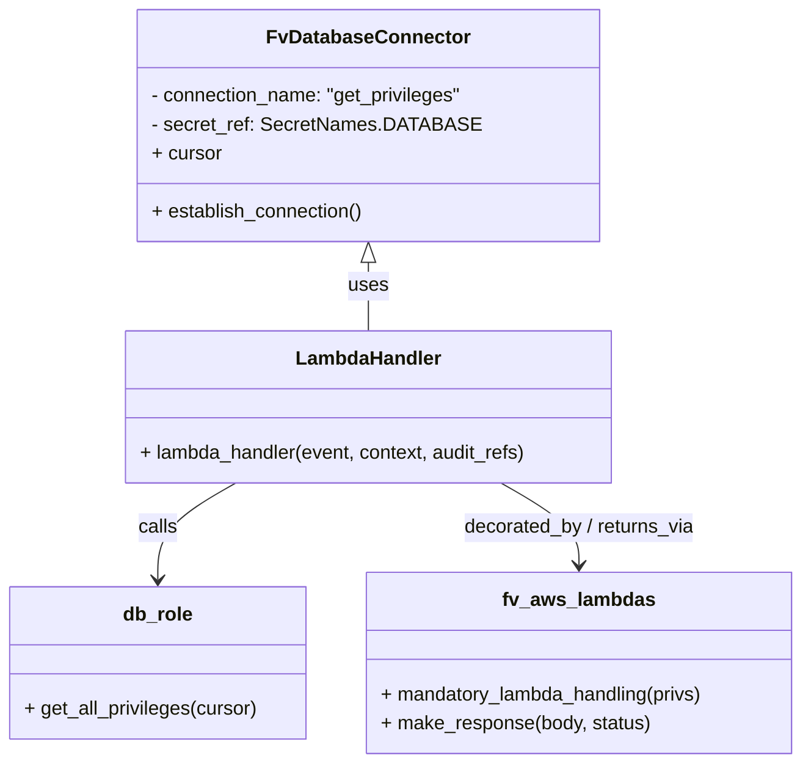

# Diagram: common/iam_service/iam_service/v1/lambdas/privileges/get_privileges.py


> Auto-generated by Obscura crawlers

## Diagram 1



### SVG

<svg id="container" width="669.046875" xmlns="http://www.w3.org/2000/svg" class="classDiagram" height="632" viewBox="0 0 669.046875 632" role="graphics-document document" aria-roledescription="class"><style>#container{font-family:"trebuchet ms",verdana,arial,sans-serif;font-size:16px;fill:#333;}@keyframes edge-animation-frame{from{stroke-dashoffset:0;}}@keyframes dash{to{stroke-dashoffset:0;}}#container .edge-animation-slow{stroke-dasharray:9,5!important;stroke-dashoffset:900;animation:dash 50s linear infinite;stroke-linecap:round;}#container .edge-animation-fast{stroke-dasharray:9,5!important;stroke-dashoffset:900;animation:dash 20s linear infinite;stroke-linecap:round;}#container .error-icon{fill:#552222;}#container .error-text{fill:#552222;stroke:#552222;}#container .edge-thickness-normal{stroke-width:1px;}#container .edge-thickness-thick{stroke-width:3.5px;}#container .edge-pattern-solid{stroke-dasharray:0;}#container .edge-thickness-invisible{stroke-width:0;fill:none;}#container .edge-pattern-dashed{stroke-dasharray:3;}#container .edge-pattern-dotted{stroke-dasharray:2;}#container .marker{fill:#333333;stroke:#333333;}#container .marker.cross{stroke:#333333;}#container svg{font-family:"trebuchet ms",verdana,arial,sans-serif;font-size:16px;}#container p{margin:0;}#container g.classGroup text{fill:#9370DB;stroke:none;font-family:"trebuchet ms",verdana,arial,sans-serif;font-size:10px;}#container g.classGroup text .title{font-weight:bolder;}#container .nodeLabel,#container .edgeLabel{color:#131300;}#container .edgeLabel .label rect{fill:#ECECFF;}#container .label text{fill:#131300;}#container .labelBkg{background:#ECECFF;}#container .edgeLabel .label span{background:#ECECFF;}#container .classTitle{font-weight:bolder;}#container .node rect,#container .node circle,#container .node ellipse,#container .node polygon,#container .node path{fill:#ECECFF;stroke:#9370DB;stroke-width:1px;}#container .divider{stroke:#9370DB;stroke-width:1;}#container g.clickable{cursor:pointer;}#container g.classGroup rect{fill:#ECECFF;stroke:#9370DB;}#container g.classGroup line{stroke:#9370DB;stroke-width:1;}#container .classLabel .box{stroke:none;stroke-width:0;fill:#ECECFF;opacity:0.5;}#container .classLabel .label{fill:#9370DB;font-size:10px;}#container .relation{stroke:#333333;stroke-width:1;fill:none;}#container .dashed-line{stroke-dasharray:3;}#container .dotted-line{stroke-dasharray:1 2;}#container #compositionStart,#container .composition{fill:#333333!important;stroke:#333333!important;stroke-width:1;}#container #compositionEnd,#container .composition{fill:#333333!important;stroke:#333333!important;stroke-width:1;}#container #dependencyStart,#container .dependency{fill:#333333!important;stroke:#333333!important;stroke-width:1;}#container #dependencyStart,#container .dependency{fill:#333333!important;stroke:#333333!important;stroke-width:1;}#container #extensionStart,#container .extension{fill:transparent!important;stroke:#333333!important;stroke-width:1;}#container #extensionEnd,#container .extension{fill:transparent!important;stroke:#333333!important;stroke-width:1;}#container #aggregationStart,#container .aggregation{fill:transparent!important;stroke:#333333!important;stroke-width:1;}#container #aggregationEnd,#container .aggregation{fill:transparent!important;stroke:#333333!important;stroke-width:1;}#container #lollipopStart,#container .lollipop{fill:#ECECFF!important;stroke:#333333!important;stroke-width:1;}#container #lollipopEnd,#container .lollipop{fill:#ECECFF!important;stroke:#333333!important;stroke-width:1;}#container .edgeTerminals{font-size:11px;line-height:initial;}#container .classTitleText{text-anchor:middle;font-size:18px;fill:#333;}#container .label-icon{display:inline-block;height:1em;overflow:visible;vertical-align:-0.125em;}#container .node .label-icon path{fill:currentColor;stroke:revert;stroke-width:revert;}#container :root{--mermaid-font-family:"trebuchet ms",verdana,arial,sans-serif;}</style><g><defs><marker id="container_class-aggregationStart" class="marker aggregation class" refX="18" refY="7" markerWidth="190" markerHeight="240" orient="auto"><path d="M 18,7 L9,13 L1,7 L9,1 Z"></path></marker></defs><defs><marker id="container_class-aggregationEnd" class="marker aggregation class" refX="1" refY="7" markerWidth="20" markerHeight="28" orient="auto"><path d="M 18,7 L9,13 L1,7 L9,1 Z"></path></marker></defs><defs><marker id="container_class-extensionStart" class="marker extension class" refX="18" refY="7" markerWidth="190" markerHeight="240" orient="auto"><path d="M 1,7 L18,13 V 1 Z"></path></marker></defs><defs><marker id="container_class-extensionEnd" class="marker extension class" refX="1" refY="7" markerWidth="20" markerHeight="28" orient="auto"><path d="M 1,1 V 13 L18,7 Z"></path></marker></defs><defs><marker id="container_class-compositionStart" class="marker composition class" refX="18" refY="7" markerWidth="190" markerHeight="240" orient="auto"><path d="M 18,7 L9,13 L1,7 L9,1 Z"></path></marker></defs><defs><marker id="container_class-compositionEnd" class="marker composition class" refX="1" refY="7" markerWidth="20" markerHeight="28" orient="auto"><path d="M 18,7 L9,13 L1,7 L9,1 Z"></path></marker></defs><defs><marker id="container_class-dependencyStart" class="marker dependency class" refX="6" refY="7" markerWidth="190" markerHeight="240" orient="auto"><path d="M 5,7 L9,13 L1,7 L9,1 Z"></path></marker></defs><defs><marker id="container_class-dependencyEnd" class="marker dependency class" refX="13" refY="7" markerWidth="20" markerHeight="28" orient="auto"><path d="M 18,7 L9,13 L14,7 L9,1 Z"></path></marker></defs><defs><marker id="container_class-lollipopStart" class="marker lollipop class" refX="13" refY="7" markerWidth="190" markerHeight="240" orient="auto"><circle stroke="black" fill="transparent" cx="7" cy="7" r="6"></circle></marker></defs><defs><marker id="container_class-lollipopEnd" class="marker lollipop class" refX="1" refY="7" markerWidth="190" markerHeight="240" orient="auto"><circle stroke="black" fill="transparent" cx="7" cy="7" r="6"></circle></marker></defs><g class="root"><g class="clusters"></g><g class="edgePaths"><path d="M307.387,217.25L307.387,220.542C307.387,223.833,307.387,230.417,307.387,239.875C307.387,249.333,307.387,261.667,307.387,267.833L307.387,274" id="id_FvDatabaseConnector_LambdaHandler_1" class="edge-thickness-normal edge-pattern-solid relation" style=";;;" data-edge="true" data-et="edge" data-id="id_FvDatabaseConnector_LambdaHandler_1" data-points="W3sieCI6MzA3LjM4NjcxODc1LCJ5IjoyMDB9LHsieCI6MzA3LjM4NjcxODc1LCJ5IjoyMzd9LHsieCI6MzA3LjM4NjcxODc1LCJ5IjoyNzR9XQ==" marker-start="url(#container_class-extensionStart)"></path><path d="M196.657,400L185.818,406.167C174.98,412.333,153.302,424.667,142.464,438C131.625,451.333,131.625,465.667,131.625,472.833L131.625,480" id="id_LambdaHandler_db_role_2" class="edge-thickness-normal edge-pattern-solid relation" style=";;;" data-edge="true" data-et="edge" data-id="id_LambdaHandler_db_role_2" data-points="W3sieCI6MTk2LjY1NjgzNTkzNzUsInkiOjQwMH0seyJ4IjoxMzEuNjI1LCJ5Ijo0Mzd9LHsieCI6MTMxLjYyNSwieSI6NDg2fV0=" marker-end="url(#container_class-dependencyEnd)"></path><path d="M418.117,400L428.955,406.167C439.794,412.333,461.471,424.667,472.31,436C483.148,447.333,483.148,457.667,483.148,462.833L483.148,468" id="id_LambdaHandler_fv_aws_lambdas_3" class="edge-thickness-normal edge-pattern-solid relation" style=";;;" data-edge="true" data-et="edge" data-id="id_LambdaHandler_fv_aws_lambdas_3" data-points="W3sieCI6NDE4LjExNjYwMTU2MjUsInkiOjQwMH0seyJ4Ijo0ODMuMTQ4NDM3NSwieSI6NDM3fSx7IngiOjQ4My4xNDg0Mzc1LCJ5Ijo0NzR9XQ==" marker-end="url(#container_class-dependencyEnd)"></path></g><g class="edgeLabels"><g class="edgeLabel" transform="translate(307.38671875, 237)"><g class="label" data-id="id_FvDatabaseConnector_LambdaHandler_1" transform="translate(-16.4921875, -12)"><foreignObject width="32.984375" height="24"><div xmlns="http://www.w3.org/1999/xhtml" class="labelBkg" style="display: table-cell; white-space: nowrap; line-height: 1.5; max-width: 200px; text-align: center;"><span class="edgeLabel"><p>uses</p></span></div></foreignObject></g></g><g class="edgeLabel" transform="translate(131.625, 437)"><g class="label" data-id="id_LambdaHandler_db_role_2" transform="translate(-16.4453125, -12)"><foreignObject width="32.890625" height="24"><div xmlns="http://www.w3.org/1999/xhtml" class="labelBkg" style="display: table-cell; white-space: nowrap; line-height: 1.5; max-width: 200px; text-align: center;"><span class="edgeLabel"><p>calls</p></span></div></foreignObject></g></g><g class="edgeLabel" transform="translate(483.1484375, 437)"><g class="label" data-id="id_LambdaHandler_fv_aws_lambdas_3" transform="translate(-98.34375, -12)"><foreignObject width="196.6875" height="24"><div xmlns="http://www.w3.org/1999/xhtml" class="labelBkg" style="display: table-cell; white-space: nowrap; line-height: 1.5; max-width: 200px; text-align: center;"><span class="edgeLabel"><p>decorated_by / returns_via</p></span></div></foreignObject></g></g></g><g class="nodes"><g class="node default" id="classId-FvDatabaseConnector-0" transform="translate(307.38671875, 104)"><g class="basic label-container"><path d="M-182.63671875 -96 L182.63671875 -96 L182.63671875 96 L-182.63671875 96" stroke="none" stroke-width="0" fill="#ECECFF" style=""></path><path d="M-182.63671875 -96 C-104.27316175844462 -96, -25.90960476688923 -96, 182.63671875 -96 M-182.63671875 -96 C-59.534765018819314 -96, 63.56718871236137 -96, 182.63671875 -96 M182.63671875 -96 C182.63671875 -36.75645930117828, 182.63671875 22.487081397643436, 182.63671875 96 M182.63671875 -96 C182.63671875 -35.80475880706676, 182.63671875 24.390482385866477, 182.63671875 96 M182.63671875 96 C107.13668992030222 96, 31.636661090604434 96, -182.63671875 96 M182.63671875 96 C54.981630196819026 96, -72.67345835636195 96, -182.63671875 96 M-182.63671875 96 C-182.63671875 50.695022209253494, -182.63671875 5.390044418506989, -182.63671875 -96 M-182.63671875 96 C-182.63671875 56.987030064955555, -182.63671875 17.97406012991111, -182.63671875 -96" stroke="#9370DB" stroke-width="1.3" fill="none" stroke-dasharray="0 0" style=""></path></g><g class="annotation-group text" transform="translate(0, -72)"></g><g class="label-group text" transform="translate(-79.3046875, -72)"><g class="label" style="font-weight: bolder" transform="translate(0,-12)"><foreignObject width="158.609375" height="24"><div xmlns="http://www.w3.org/1999/xhtml" style="display: table-cell; white-space: nowrap; line-height: 1.5; max-width: 207px; text-align: center;"><span class="nodeLabel markdown-node-label" style=""><p>FvDatabaseConnector</p></span></div></foreignObject></g></g><g class="members-group text" transform="translate(-170.63671875, -24)"><g class="label" style="" transform="translate(0,-12)"><foreignObject width="261.96875" height="24"><div xmlns="http://www.w3.org/1999/xhtml" style="display: table-cell; white-space: nowrap; line-height: 1.5; max-width: 319px; text-align: center;"><span class="nodeLabel markdown-node-label" style=""><p>- connection_name: "get_privileges"</p></span></div></foreignObject></g><g class="label" style="" transform="translate(0,12)"><foreignObject width="260.90625" height="24"><div xmlns="http://www.w3.org/1999/xhtml" style="display: table-cell; white-space: nowrap; line-height: 1.5; max-width: 318px; text-align: center;"><span class="nodeLabel markdown-node-label" style=""><p>- secret_ref: SecretNames.DATABASE</p></span></div></foreignObject></g><g class="label" style="" transform="translate(0,36)"><foreignObject width="57.953125" height="24"><div xmlns="http://www.w3.org/1999/xhtml" style="display: table-cell; white-space: nowrap; line-height: 1.5; max-width: 116px; text-align: center;"><span class="nodeLabel markdown-node-label" style=""><p>+ cursor</p></span></div></foreignObject></g></g><g class="methods-group text" transform="translate(-170.63671875, 72)"><g class="label" style="" transform="translate(0,-12)"><foreignObject width="177.515625" height="24"><div xmlns="http://www.w3.org/1999/xhtml" style="display: table-cell; white-space: nowrap; line-height: 1.5; max-width: 235px; text-align: center;"><span class="nodeLabel markdown-node-label" style=""><p>+ establish_connection()</p></span></div></foreignObject></g></g><g class="divider" style=""><path d="M-182.63671875 -48 C-45.44294368414816 -48, 91.75083138170368 -48, 182.63671875 -48 M-182.63671875 -48 C-102.00212698863504 -48, -21.367535227270082 -48, 182.63671875 -48" stroke="#9370DB" stroke-width="1.3" fill="none" stroke-dasharray="0 0" style=""></path></g><g class="divider" style=""><path d="M-182.63671875 48 C-56.31042440083259 48, 70.01586994833482 48, 182.63671875 48 M-182.63671875 48 C-53.850646133119284 48, 74.93542648376143 48, 182.63671875 48" stroke="#9370DB" stroke-width="1.3" fill="none" stroke-dasharray="0 0" style=""></path></g></g><g class="node default" id="classId-LambdaHandler-1" transform="translate(307.38671875, 337)"><g class="basic label-container"><path d="M-204.0703125 -63 L204.0703125 -63 L204.0703125 63 L-204.0703125 63" stroke="none" stroke-width="0" fill="#ECECFF" style=""></path><path d="M-204.0703125 -63 C-101.98900979249383 -63, 0.09229291501233661 -63, 204.0703125 -63 M-204.0703125 -63 C-91.51797571856495 -63, 21.03436106287009 -63, 204.0703125 -63 M204.0703125 -63 C204.0703125 -32.69321675554642, 204.0703125 -2.3864335110928465, 204.0703125 63 M204.0703125 -63 C204.0703125 -21.907564837102477, 204.0703125 19.184870325795046, 204.0703125 63 M204.0703125 63 C53.06902523293209 63, -97.93226203413582 63, -204.0703125 63 M204.0703125 63 C58.256060726702856 63, -87.55819104659429 63, -204.0703125 63 M-204.0703125 63 C-204.0703125 35.9019517841079, -204.0703125 8.803903568215802, -204.0703125 -63 M-204.0703125 63 C-204.0703125 18.391982483343448, -204.0703125 -26.216035033313105, -204.0703125 -63" stroke="#9370DB" stroke-width="1.3" fill="none" stroke-dasharray="0 0" style=""></path></g><g class="annotation-group text" transform="translate(0, -39)"></g><g class="label-group text" transform="translate(-58.21875, -39)"><g class="label" style="font-weight: bolder" transform="translate(0,-12)"><foreignObject width="116.4375" height="24"><div xmlns="http://www.w3.org/1999/xhtml" style="display: table-cell; white-space: nowrap; line-height: 1.5; max-width: 167px; text-align: center;"><span class="nodeLabel markdown-node-label" style=""><p>LambdaHandler</p></span></div></foreignObject></g></g><g class="members-group text" transform="translate(-192.0703125, 9)"></g><g class="methods-group text" transform="translate(-192.0703125, 39)"><g class="label" style="" transform="translate(0,-12)"><foreignObject width="325.921875" height="24"><div xmlns="http://www.w3.org/1999/xhtml" style="display: table-cell; white-space: nowrap; line-height: 1.5; max-width: 383px; text-align: center;"><span class="nodeLabel markdown-node-label" style=""><p>+ lambda_handler(event, context, audit_refs)</p></span></div></foreignObject></g></g><g class="divider" style=""><path d="M-204.0703125 -15 C-89.31514929159505 -15, 25.440013916809903 -15, 204.0703125 -15 M-204.0703125 -15 C-69.59242913742776 -15, 64.88545422514449 -15, 204.0703125 -15" stroke="#9370DB" stroke-width="1.3" fill="none" stroke-dasharray="0 0" style=""></path></g><g class="divider" style=""><path d="M-204.0703125 9 C-99.53572752546874 9, 4.998857449062513 9, 204.0703125 9 M-204.0703125 9 C-77.49839662602626 9, 49.07351924794747 9, 204.0703125 9" stroke="#9370DB" stroke-width="1.3" fill="none" stroke-dasharray="0 0" style=""></path></g></g><g class="node default" id="classId-db_role-2" transform="translate(131.625, 549)"><g class="basic label-container"><path d="M-123.625 -63 L123.625 -63 L123.625 63 L-123.625 63" stroke="none" stroke-width="0" fill="#ECECFF" style=""></path><path d="M-123.625 -63 C-44.26660956138038 -63, 35.091780877239245 -63, 123.625 -63 M-123.625 -63 C-59.9118990125597 -63, 3.8012019748805983 -63, 123.625 -63 M123.625 -63 C123.625 -17.55222879312032, 123.625 27.895542413759358, 123.625 63 M123.625 -63 C123.625 -23.441039991430856, 123.625 16.11792001713829, 123.625 63 M123.625 63 C34.48669115024188 63, -54.65161769951624 63, -123.625 63 M123.625 63 C38.069629837853554 63, -47.48574032429289 63, -123.625 63 M-123.625 63 C-123.625 26.766367330048283, -123.625 -9.467265339903435, -123.625 -63 M-123.625 63 C-123.625 25.64416017139517, -123.625 -11.711679657209658, -123.625 -63" stroke="#9370DB" stroke-width="1.3" fill="none" stroke-dasharray="0 0" style=""></path></g><g class="annotation-group text" transform="translate(0, -39)"></g><g class="label-group text" transform="translate(-27.96875, -39)"><g class="label" style="font-weight: bolder" transform="translate(0,-12)"><foreignObject width="55.9375" height="24"><div xmlns="http://www.w3.org/1999/xhtml" style="display: table-cell; white-space: nowrap; line-height: 1.5; max-width: 105px; text-align: center;"><span class="nodeLabel markdown-node-label" style=""><p>db_role</p></span></div></foreignObject></g></g><g class="members-group text" transform="translate(-111.625, 9)"></g><g class="methods-group text" transform="translate(-111.625, 39)"><g class="label" style="" transform="translate(0,-12)"><foreignObject width="195.28125" height="24"><div xmlns="http://www.w3.org/1999/xhtml" style="display: table-cell; white-space: nowrap; line-height: 1.5; max-width: 253px; text-align: center;"><span class="nodeLabel markdown-node-label" style=""><p>+ get_all_privileges(cursor)</p></span></div></foreignObject></g></g><g class="divider" style=""><path d="M-123.625 -15 C-27.394308244518484 -15, 68.83638351096303 -15, 123.625 -15 M-123.625 -15 C-68.076291981065 -15, -12.52758396213001 -15, 123.625 -15" stroke="#9370DB" stroke-width="1.3" fill="none" stroke-dasharray="0 0" style=""></path></g><g class="divider" style=""><path d="M-123.625 9 C-60.47158165767326 9, 2.681836684653476 9, 123.625 9 M-123.625 9 C-24.76188330488003 9, 74.10123339023994 9, 123.625 9" stroke="#9370DB" stroke-width="1.3" fill="none" stroke-dasharray="0 0" style=""></path></g></g><g class="node default" id="classId-fv_aws_lambdas-3" transform="translate(483.1484375, 549)"><g class="basic label-container"><path d="M-177.8984375 -75 L177.8984375 -75 L177.8984375 75 L-177.8984375 75" stroke="none" stroke-width="0" fill="#ECECFF" style=""></path><path d="M-177.8984375 -75 C-98.04834521564563 -75, -18.19825293129125 -75, 177.8984375 -75 M-177.8984375 -75 C-90.57080861118871 -75, -3.2431797223774197 -75, 177.8984375 -75 M177.8984375 -75 C177.8984375 -26.402966614868845, 177.8984375 22.19406677026231, 177.8984375 75 M177.8984375 -75 C177.8984375 -32.11191303371408, 177.8984375 10.776173932571837, 177.8984375 75 M177.8984375 75 C92.47224355135712 75, 7.046049602714248 75, -177.8984375 75 M177.8984375 75 C78.68184934966156 75, -20.534738800676877 75, -177.8984375 75 M-177.8984375 75 C-177.8984375 16.59726551340981, -177.8984375 -41.80546897318038, -177.8984375 -75 M-177.8984375 75 C-177.8984375 20.57904719975511, -177.8984375 -33.84190560048978, -177.8984375 -75" stroke="#9370DB" stroke-width="1.3" fill="none" stroke-dasharray="0 0" style=""></path></g><g class="annotation-group text" transform="translate(0, -51)"></g><g class="label-group text" transform="translate(-60.0625, -51)"><g class="label" style="font-weight: bolder" transform="translate(0,-12)"><foreignObject width="120.125" height="24"><div xmlns="http://www.w3.org/1999/xhtml" style="display: table-cell; white-space: nowrap; line-height: 1.5; max-width: 168px; text-align: center;"><span class="nodeLabel markdown-node-label" style=""><p>fv_aws_lambdas</p></span></div></foreignObject></g></g><g class="members-group text" transform="translate(-165.8984375, -3)"></g><g class="methods-group text" transform="translate(-165.8984375, 27)"><g class="label" style="" transform="translate(0,-12)"><foreignObject width="271.734375" height="24"><div xmlns="http://www.w3.org/1999/xhtml" style="display: table-cell; white-space: nowrap; line-height: 1.5; max-width: 329px; text-align: center;"><span class="nodeLabel markdown-node-label" style=""><p>+ mandatory_lambda_handling(privs)</p></span></div></foreignObject></g><g class="label" style="" transform="translate(0,12)"><foreignObject width="224.21875" height="24"><div xmlns="http://www.w3.org/1999/xhtml" style="display: table-cell; white-space: nowrap; line-height: 1.5; max-width: 282px; text-align: center;"><span class="nodeLabel markdown-node-label" style=""><p>+ make_response(body, status)</p></span></div></foreignObject></g></g><g class="divider" style=""><path d="M-177.8984375 -27 C-74.10818232199684 -27, 29.68207285600633 -27, 177.8984375 -27 M-177.8984375 -27 C-52.214732117110174 -27, 73.46897326577965 -27, 177.8984375 -27" stroke="#9370DB" stroke-width="1.3" fill="none" stroke-dasharray="0 0" style=""></path></g><g class="divider" style=""><path d="M-177.8984375 -3 C-96.3244632850838 -3, -14.750489070167589 -3, 177.8984375 -3 M-177.8984375 -3 C-51.71083962330046 -3, 74.47675825339908 -3, 177.8984375 -3" stroke="#9370DB" stroke-width="1.3" fill="none" stroke-dasharray="0 0" style=""></path></g></g></g></g></g></svg>

## Diagram 2

```mermaid
flowchart TD
    Event[Incoming event] --> Decorator[mandatory_lambda_handling(privs=MANAGE_USERS)]
    Decorator --> Handler[lambda_handler(event, context, audit_refs)]
    Handler --> Establish[DB_CONN.establish_connection()]
    Establish --> Cursor[DB_CONN.cursor]
    Cursor --> GetPrivs[db_role.get_all_privileges(cursor)]
    GetPrivs --> MakeResp[fv.aws.lambdas.make_response({"response": response}, 200)]
    MakeResp --> Return[Return HTTP 200]
```

> SVG rendering failed for this diagram.
