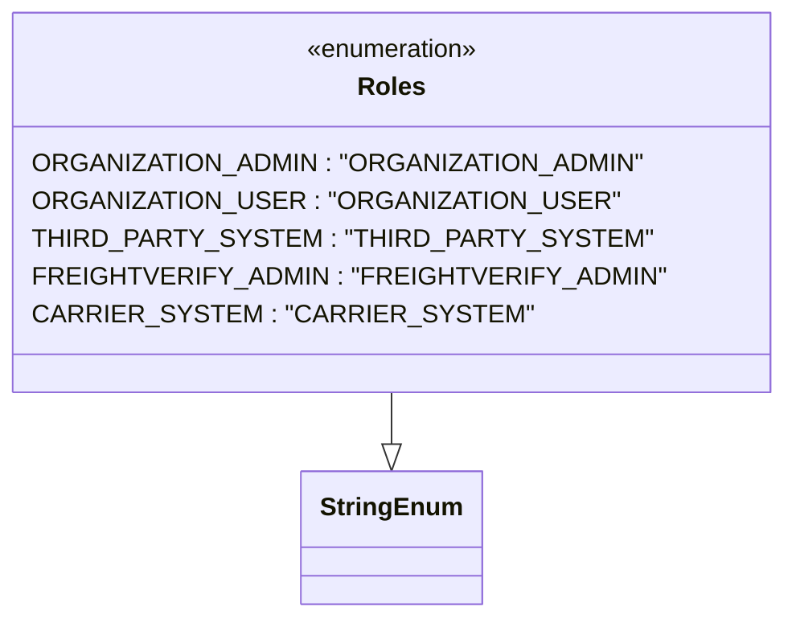

# Diagram: common/iam_service/iam_service/v1/lambdas/roles/__init__.py

> Auto-generated by Obscura crawlers

## Mermaid

### SVG

<svg id="container" width="446.6640625" xmlns="http://www.w3.org/2000/svg" class="classDiagram" height="390" viewBox="0 0 446.6640625 390" role="graphics-document document" aria-roledescription="class"><g><defs><marker id="container_class-aggregationStart" class="marker aggregation class" refX="18" refY="7" markerWidth="190" markerHeight="240" orient="auto"><path d="M 18,7 L9,13 L1,7 L9,1 Z"></path></marker></defs><defs><marker id="container_class-aggregationEnd" class="marker aggregation class" refX="1" refY="7" markerWidth="20" markerHeight="28" orient="auto"><path d="M 18,7 L9,13 L1,7 L9,1 Z"></path></marker></defs><defs><marker id="container_class-extensionStart" class="marker extension class" refX="18" refY="7" markerWidth="190" markerHeight="240" orient="auto"><path d="M 1,7 L18,13 V 1 Z"></path></marker></defs><defs><marker id="container_class-extensionEnd" class="marker extension class" refX="1" refY="7" markerWidth="20" markerHeight="28" orient="auto"><path d="M 1,1 V 13 L18,7 Z"></path></marker></defs><defs><marker id="container_class-compositionStart" class="marker composition class" refX="18" refY="7" markerWidth="190" markerHeight="240" orient="auto"><path d="M 18,7 L9,13 L1,7 L9,1 Z"></path></marker></defs><defs><marker id="container_class-compositionEnd" class="marker composition class" refX="1" refY="7" markerWidth="20" markerHeight="28" orient="auto"><path d="M 18,7 L9,13 L1,7 L9,1 Z"></path></marker></defs><defs><marker id="container_class-dependencyStart" class="marker dependency class" refX="6" refY="7" markerWidth="190" markerHeight="240" orient="auto"><path d="M 5,7 L9,13 L1,7 L9,1 Z"></path></marker></defs><defs><marker id="container_class-dependencyEnd" class="marker dependency class" refX="13" refY="7" markerWidth="20" markerHeight="28" orient="auto"><path d="M 18,7 L9,13 L14,7 L9,1 Z"></path></marker></defs><defs><marker id="container_class-lollipopStart" class="marker lollipop class" refX="13" refY="7" markerWidth="190" markerHeight="240" orient="auto"><circle stroke="black" fill="transparent" cx="7" cy="7" r="6"></circle></marker></defs><defs><marker id="container_class-lollipopEnd" class="marker lollipop class" refX="1" refY="7" markerWidth="190" markerHeight="240" orient="auto"><circle stroke="black" fill="transparent" cx="7" cy="7" r="6"></circle></marker></defs><g class="root"><g class="clusters"></g><g class="edgePaths"><path d="M223.332,248L223.332,252.167C223.332,256.333,223.332,264.667,223.332,270.125C223.332,275.583,223.332,278.167,223.332,279.458L223.332,280.75" id="id_Roles_StringEnum_1" class="edge-thickness-normal edge-pattern-solid relation" style=";;;" data-edge="true" data-et="edge" data-id="id_Roles_StringEnum_1" data-points="W3sieCI6MjIzLjMzMjAzMTI1LCJ5IjoyNDh9LHsieCI6MjIzLjMzMjAzMTI1LCJ5IjoyNzN9LHsieCI6MjIzLjMzMjAzMTI1LCJ5IjoyOTh9XQ==" marker-end="url(#container_class-extensionEnd)"></path></g><g class="edgeLabels"><g class="edgeLabel"><g class="label" data-id="id_Roles_StringEnum_1" transform="translate(0, 0)"><foreignObject width="0" height="0">

</foreignObject></g></g></g><g class="nodes"><g class="node default" id="classId-StringEnum-0" transform="translate(223.33203125, 340)"><g class="basic label-container"><path d="M-54.234375 -42 L54.234375 -42 L54.234375 42 L-54.234375 42" stroke="none" stroke-width="0" fill="#ECECFF" style=""></path><path d="M-54.234375 -42 C-20.852688121155552 -42, 12.528998757688896 -42, 54.234375 -42 M-54.234375 -42 C-29.186833865672117 -42, -4.139292731344234 -42, 54.234375 -42 M54.234375 -42 C54.234375 -16.150107103244174, 54.234375 9.699785793511651, 54.234375 42 M54.234375 -42 C54.234375 -17.080469363470492, 54.234375 7.839061273059016, 54.234375 42 M54.234375 42 C16.803145068876837 42, -20.628084862246325 42, -54.234375 42 M54.234375 42 C32.280361789900724 42, 10.32634857980144 42, -54.234375 42 M-54.234375 42 C-54.234375 23.454782532273377, -54.234375 4.909565064546754, -54.234375 -42 M-54.234375 42 C-54.234375 12.719133861105245, -54.234375 -16.56173227778951, -54.234375 -42" stroke="#9370DB" stroke-width="1.3" fill="none" stroke-dasharray="0 0" style=""></path></g><g class="annotation-group text" transform="translate(0, -18)"></g><g class="label-group text" transform="translate(-42.234375, -18)"><g class="label" style="font-weight: bolder" transform="translate(0,-12)"><foreignObject width="84.46875" height="24">

StringEnum

</foreignObject></g></g><g class="members-group text" transform="translate(-42.234375, 30)"></g><g class="methods-group text" transform="translate(-42.234375, 60)"></g><g class="divider" style=""><path d="M-54.234375 6 C-20.87640874156866 6, 12.48155751686268 6, 54.234375 6 M-54.234375 6 C-26.46908816712572 6, 1.2961986657485625 6, 54.234375 6" stroke="#9370DB" stroke-width="1.3" fill="none" stroke-dasharray="0 0" style=""></path></g><g class="divider" style=""><path d="M-54.234375 24 C-16.262559408698614 24, 21.709256182602772 24, 54.234375 24 M-54.234375 24 C-27.645057321328476 24, -1.0557396426569525 24, 54.234375 24" stroke="#9370DB" stroke-width="1.3" fill="none" stroke-dasharray="0 0" style=""></path></g></g><g class="node default" id="classId-Roles-1" transform="translate(223.33203125, 128)"><g class="basic label-container"><path d="M-215.33203125 -120 L215.33203125 -120 L215.33203125 120 L-215.33203125 120" stroke="none" stroke-width="0" fill="#ECECFF" style=""></path><path d="M-215.33203125 -120 C-60.181926101144825 -120, 94.96817904771035 -120, 215.33203125 -120 M-215.33203125 -120 C-127.95522278947219 -120, -40.578414328944376 -120, 215.33203125 -120 M215.33203125 -120 C215.33203125 -66.79973060008282, 215.33203125 -13.59946120016565, 215.33203125 120 M215.33203125 -120 C215.33203125 -33.64700346158715, 215.33203125 52.705993076825706, 215.33203125 120 M215.33203125 120 C125.90865925479442 120, 36.48528725958883 120, -215.33203125 120 M215.33203125 120 C68.46193307405616 120, -78.40816510188768 120, -215.33203125 120 M-215.33203125 120 C-215.33203125 71.7511319584459, -215.33203125 23.502263916891792, -215.33203125 -120 M-215.33203125 120 C-215.33203125 58.90576096918095, -215.33203125 -2.1884780616380937, -215.33203125 -120" stroke="#9370DB" stroke-width="1.3" fill="none" stroke-dasharray="0 0" style=""></path></g><g class="annotation-group text" transform="translate(-55.5546875, -96)"><g class="label" style="" transform="translate(0,-12)"><foreignObject width="111.109375" height="24">

«enumeration»

</foreignObject></g></g><g class="label-group text" transform="translate(-20.109375, -72)"><g class="label" style="font-weight: bolder" transform="translate(0,-12)"><foreignObject width="40.21875" height="24">

Roles

</foreignObject></g></g><g class="members-group text" transform="translate(-203.33203125, -24)"><g class="label" style="" transform="translate(0,-12)"><foreignObject width="351.109375" height="24">

ORGANIZATION_ADMIN : "ORGANIZATION_ADMIN"

</foreignObject></g><g class="label" style="" transform="translate(0,12)"><foreignObject width="330.125" height="24">

ORGANIZATION_USER : "ORGANIZATION_USER"

</foreignObject></g><g class="label" style="" transform="translate(0,36)"><foreignObject width="338.703125" height="24">

THIRD_PARTY_SYSTEM : "THIRD_PARTY_SYSTEM"

</foreignObject></g><g class="label" style="" transform="translate(0,60)"><foreignObject width="351.078125" height="24">

FREIGHTVERIFY_ADMIN : "FREIGHTVERIFY_ADMIN"

</foreignObject></g><g class="label" style="" transform="translate(0,84)"><foreignObject width="271.046875" height="24">

CARRIER_SYSTEM : "CARRIER_SYSTEM"

</foreignObject></g></g><g class="methods-group text" transform="translate(-203.33203125, 120)"></g><g class="divider" style=""><path d="M-215.33203125 -48 C-55.51537704190201 -48, 104.30127716619597 -48, 215.33203125 -48 M-215.33203125 -48 C-53.2548348173718 -48, 108.8223616152564 -48, 215.33203125 -48" stroke="#9370DB" stroke-width="1.3" fill="none" stroke-dasharray="0 0" style=""></path></g><g class="divider" style=""><path d="M-215.33203125 96 C-122.76133769122639 96, -30.190644132452775 96, 215.33203125 96 M-215.33203125 96 C-66.69161294209414 96, 81.94880536581172 96, 215.33203125 96" stroke="#9370DB" stroke-width="1.3" fill="none" stroke-dasharray="0 0" style=""></path></g></g></g></g></g></svg>
