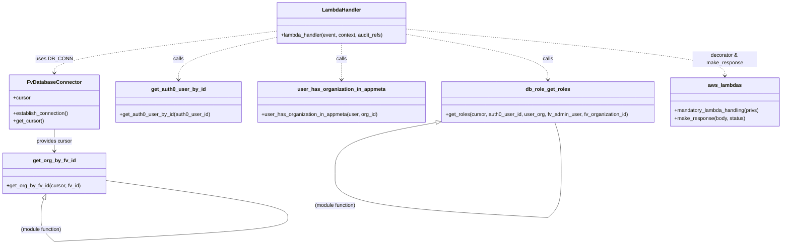
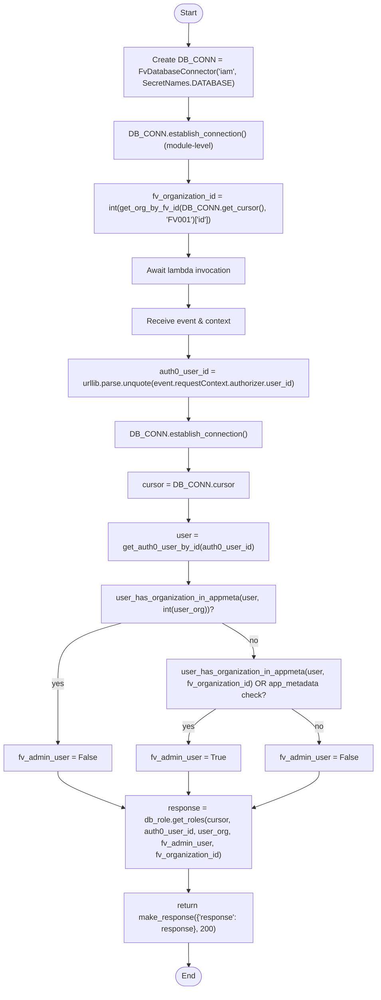

# Diagram: common/iam_service/iam_service/v1/lambdas/roles/get_roles.py

> Auto-generated by Obscura crawlers

## Diagram 1

### SVG

<svg id="container" width="2404.30859375" xmlns="http://www.w3.org/2000/svg" class="classDiagram" height="756.25" viewBox="0 0 2404.30859375 756.25" role="graphics-document document" aria-roledescription="class"><g><defs><marker id="container_class-aggregationStart" class="marker aggregation class" refX="18" refY="7" markerWidth="190" markerHeight="240" orient="auto"><path d="M 18,7 L9,13 L1,7 L9,1 Z"></path></marker></defs><defs><marker id="container_class-aggregationEnd" class="marker aggregation class" refX="1" refY="7" markerWidth="20" markerHeight="28" orient="auto"><path d="M 18,7 L9,13 L1,7 L9,1 Z"></path></marker></defs><defs><marker id="container_class-extensionStart" class="marker extension class" refX="18" refY="7" markerWidth="190" markerHeight="240" orient="auto"><path d="M 1,7 L18,13 V 1 Z"></path></marker></defs><defs><marker id="container_class-extensionEnd" class="marker extension class" refX="1" refY="7" markerWidth="20" markerHeight="28" orient="auto"><path d="M 1,1 V 13 L18,7 Z"></path></marker></defs><defs><marker id="container_class-compositionStart" class="marker composition class" refX="18" refY="7" markerWidth="190" markerHeight="240" orient="auto"><path d="M 18,7 L9,13 L1,7 L9,1 Z"></path></marker></defs><defs><marker id="container_class-compositionEnd" class="marker composition class" refX="1" refY="7" markerWidth="20" markerHeight="28" orient="auto"><path d="M 18,7 L9,13 L1,7 L9,1 Z"></path></marker></defs><defs><marker id="container_class-dependencyStart" class="marker dependency class" refX="6" refY="7" markerWidth="190" markerHeight="240" orient="auto"><path d="M 5,7 L9,13 L1,7 L9,1 Z"></path></marker></defs><defs><marker id="container_class-dependencyEnd" class="marker dependency class" refX="13" refY="7" markerWidth="20" markerHeight="28" orient="auto"><path d="M 18,7 L9,13 L14,7 L9,1 Z"></path></marker></defs><defs><marker id="container_class-lollipopStart" class="marker lollipop class" refX="13" refY="7" markerWidth="190" markerHeight="240" orient="auto"><circle stroke="black" fill="transparent" cx="7" cy="7" r="6"></circle></marker></defs><defs><marker id="container_class-lollipopEnd" class="marker lollipop class" refX="1" refY="7" markerWidth="190" markerHeight="240" orient="auto"><circle stroke="black" fill="transparent" cx="7" cy="7" r="6"></circle></marker></defs><g class="root"><g class="clusters"></g><g class="edgePaths"><path d="M165.633,400L165.633,406.167C165.633,412.333,165.633,424.667,165.633,436C165.633,447.333,165.633,457.667,165.633,462.833L165.633,468" id="id_FvDatabaseConnector_get_org_by_fv_id_1" class="edge-thickness-normal edge-pattern-solid relation" style=";;;" data-edge="true" data-et="edge" data-id="id_FvDatabaseConnector_get_org_by_fv_id_1" data-points="W3sieCI6MTY1LjYzMjgxMjUsInkiOjQwMH0seyJ4IjoxNjUuNjMyODEyNSwieSI6NDM3fSx7IngiOjE2NS42MzI4MTI1LCJ5Ijo0NzR9XQ==" marker-end="url(#container_class-dependencyEnd)"></path><path d="M841.793,96.758L729.1,111.132C616.406,125.506,391.02,154.253,278.326,175.793C165.633,197.333,165.633,211.667,165.633,218.833L165.633,226" id="id_LambdaHandler_FvDatabaseConnector_2" class="edge-thickness-normal edge-pattern-dashed relation" style=";;;" data-edge="true" data-et="edge" data-id="id_LambdaHandler_FvDatabaseConnector_2" data-points="W3sieCI6ODQxLjc5Mjk2ODc1LCJ5Ijo5Ni43NTgzNTA4Njc2NzE3Mn0seyJ4IjoxNjUuNjMyODEyNSwieSI6MTgzfSx7IngiOjE2NS42MzI4MTI1LCJ5IjoyMzJ9XQ==" marker-end="url(#container_class-dependencyEnd)"></path><path d="M841.793,116.397L792.411,127.497C743.029,138.598,644.264,160.799,594.882,182.566C545.5,204.333,545.5,225.667,545.5,236.333L545.5,247" id="id_LambdaHandler_get_auth0_user_by_id_3" class="edge-thickness-normal edge-pattern-dashed relation" style=";;;" data-edge="true" data-et="edge" data-id="id_LambdaHandler_get_auth0_user_by_id_3" data-points="W3sieCI6ODQxLjc5Mjk2ODc1LCJ5IjoxMTYuMzk2NzQzMjYzNDc4OTJ9LHsieCI6NTQ1LjUsInkiOjE4M30seyJ4Ijo1NDUuNSwieSI6MjUzfV0=" marker-end="url(#container_class-dependencyEnd)"></path><path d="M1043.746,134L1043.746,142.167C1043.746,150.333,1043.746,166.667,1043.746,185.5C1043.746,204.333,1043.746,225.667,1043.746,236.333L1043.746,247" id="id_LambdaHandler_user_has_organization_in_appmeta_4" class="edge-thickness-normal edge-pattern-dashed relation" style=";;;" data-edge="true" data-et="edge" data-id="id_LambdaHandler_user_has_organization_in_appmeta_4" data-points="W3sieCI6MTA0My43NDYwOTM3NSwieSI6MTM0fSx7IngiOjEwNDMuNzQ2MDkzNzUsInkiOjE4M30seyJ4IjoxMDQzLjc0NjA5Mzc1LCJ5IjoyNTN9XQ==" marker-end="url(#container_class-dependencyEnd)"></path><path d="M1245.699,106.666L1317.738,119.388C1389.777,132.11,1533.855,157.555,1605.895,180.944C1677.934,204.333,1677.934,225.667,1677.934,236.333L1677.934,247" id="id_LambdaHandler_db_role_get_roles_5" class="edge-thickness-normal edge-pattern-dashed relation" style=";;;" data-edge="true" data-et="edge" data-id="id_LambdaHandler_db_role_get_roles_5" data-points="W3sieCI6MTI0NS42OTkyMTg3NSwieSI6MTA2LjY2NTcxNDAwNDEzOTE1fSx7IngiOjE2NzcuOTMzNTkzNzUsInkiOjE4M30seyJ4IjoxNjc3LjkzMzU5Mzc1LCJ5IjoyNTN9XQ==" marker-end="url(#container_class-dependencyEnd)"></path><path d="M1245.699,90.134L1409.063,105.611C1572.427,121.089,1899.155,152.045,2062.519,176.189C2225.883,200.333,2225.883,217.667,2225.883,226.333L2225.883,235" id="id_LambdaHandler_aws_lambdas_6" class="edge-thickness-normal edge-pattern-dashed relation" style=";;;" data-edge="true" data-et="edge" data-id="id_LambdaHandler_aws_lambdas_6" data-points="W3sieCI6MTI0NS42OTkyMTg3NSwieSI6OTAuMTMzNzg1MTU0NjYyMzV9LHsieCI6MjIyNS44ODI4MTI1LCJ5IjoxODN9LHsieCI6MjIyNS44ODI4MTI1LCJ5IjoyNDF9XQ==" marker-end="url(#container_class-dependencyEnd)"></path><path d="M132,615.867L130.498,619.39C128.996,622.912,125.992,629.956,124.49,639.645C122.988,649.333,122.988,661.667,122.988,667.833L122.988,674" id="get_org_by_fv_id-cyclic-special-1" class="edge-thickness-normal edge-pattern-solid relation" style=";;;" data-edge="true" data-et="edge" data-id="get_org_by_fv_id-cyclic-special-1" data-points="W3sieCI6MTM4Ljc2Njc1NzgxMjUsInkiOjYwMH0seyJ4IjoxMjIuOTg4MjgxMjUsInkiOjYzN30seyJ4IjoxMjIuOTg4MjgxMjUsInkiOjY3NH1d" marker-start="url(#container_class-extensionStart)"></path><path d="M122.988,674.1L122.988,680.267C122.988,686.433,122.988,698.767,130.087,711.101C137.186,723.436,151.385,735.771,158.484,741.939L165.583,748.107" id="get_org_by_fv_id-cyclic-special-mid" class="edge-thickness-normal edge-pattern-solid relation" style=";;;" data-edge="true" data-et="edge" data-id="get_org_by_fv_id-cyclic-special-mid" data-points="W3sieCI6MTIyLjk4ODI4MTI1LCJ5Ijo2NzQuMTAwMDAwMDAxNDkwMX0seyJ4IjoxMjIuOTg4MjgxMjUsInkiOjcxMS4xMDAwMDAwMDE0OTAxfSx7IngiOjE2NS41ODI4MTI0OTkyNTQ5NCwieSI6NzQ4LjEwNjU1OTQ5NTk1MzV9XQ=="></path><path d="M165.683,748.147L284.592,741.973C403.501,735.798,641.32,723.449,760.229,711.1C879.139,698.75,879.139,686.4,879.139,674.05C879.139,661.7,879.139,649.35,786.493,630.19C693.848,611.031,508.557,585.062,415.911,572.077L323.266,559.093" id="get_org_by_fv_id-cyclic-special-2" class="edge-thickness-normal edge-pattern-solid relation" style=";;;" data-edge="true" data-et="edge" data-id="get_org_by_fv_id-cyclic-special-2" data-points="W3sieCI6MTY1LjY4MjgxMjUwMDc0NTA2LCJ5Ijo3NDguMTQ3NDAzNjY3NTI2M30seyJ4Ijo4NzkuMTM4NjcxODc1LCJ5Ijo3MTEuMTAwMDAwMDAxNDkwMX0seyJ4Ijo4NzkuMTM4NjcxODc1LCJ5Ijo2NzQuMDUwMDAwMDAwNzQ1MX0seyJ4Ijo4NzkuMTM4NjcxODc1LCJ5Ijo2Mzd9LHsieCI6MzIzLjI2NTYyNSwieSI6NTU5LjA5MjcxNDUwNjY1ODd9XQ=="></path><path d="M1333.449,379.9L1282.145,389.417C1230.841,398.933,1128.233,417.967,1076.929,444.142C1025.625,470.317,1025.625,503.633,1025.625,520.292L1025.625,536.95" id="db_role_get_roles-cyclic-special-1" class="edge-thickness-normal edge-pattern-solid relation" style=";;;" data-edge="true" data-et="edge" data-id="db_role_get_roles-cyclic-special-1" data-points="W3sieCI6MTM1MC40MTAxNTYyNSwieSI6Mzc2Ljc1MzkzMjM5NTIzNDJ9LHsieCI6MTAyNS42MjQ2MDkzNzUzNzI1LCJ5Ijo0Mzd9LHsieCI6MTAyNS42MjQ2MDkzNzUzNzI1LCJ5Ijo1MzYuOTQ5OTk5OTk5MjU0OX1d" marker-start="url(#container_class-extensionStart)"></path><path d="M1025.625,537.05L1025.625,553.708C1025.625,570.367,1025.625,603.683,1134.334,626.516C1243.044,649.349,1460.464,661.698,1569.174,667.873L1677.884,674.047" id="db_role_get_roles-cyclic-special-mid" class="edge-thickness-normal edge-pattern-solid relation" style=";;;" data-edge="true" data-et="edge" data-id="db_role_get_roles-cyclic-special-mid" data-points="W3sieCI6MTAyNS42MjQ2MDkzNzUzNzI1LCJ5Ijo1MzcuMDUwMDAwMDAwNzQ1MX0seyJ4IjoxMDI1LjYyNDYwOTM3NTM3MjUsInkiOjYzN30seyJ4IjoxNjc3Ljg4MzU5Mzc0OTI1NSwieSI6Njc0LjA0NzE2MDA4ODg3NX1d"></path><path d="M1677.984,674.007L1685.083,667.839C1692.182,661.671,1706.38,649.336,1713.479,626.501C1720.578,603.667,1720.578,570.333,1720.578,537C1720.578,503.667,1720.578,470.333,1717.171,444C1713.764,417.667,1706.951,398.333,1703.544,388.667L1700.137,379" id="db_role_get_roles-cyclic-special-2" class="edge-thickness-normal edge-pattern-solid relation" style=";;;" data-edge="true" data-et="edge" data-id="db_role_get_roles-cyclic-special-2" data-points="W3sieCI6MTY3Ny45ODM1OTM3NTA3NDUsInkiOjY3NC4wMDY1NTk0OTQ0NjM0fSx7IngiOjE3MjAuNTc4MTI1LCJ5Ijo2Mzd9LHsieCI6MTcyMC41NzgxMjUsInkiOjUzN30seyJ4IjoxNzIwLjU3ODEyNSwieSI6NDM3fSx7IngiOjE3MDAuMTM2OTQ0NzMxNDA1LCJ5IjozNzl9XQ=="></path></g><g class="edgeLabels"><g class="edgeLabel" transform="translate(165.6328125, 437)"><g class="label" data-id="id_FvDatabaseConnector_get_org_by_fv_id_1" transform="translate(-56.296875, -12)"><foreignObject width="112.59375" height="24">

provides cursor

</foreignObject></g></g><g class="edgeLabel" transform="translate(165.6328125, 183)"><g class="label" data-id="id_LambdaHandler_FvDatabaseConnector_2" transform="translate(-53.09375, -12)"><foreignObject width="106.1875" height="24">

uses DB_CONN

</foreignObject></g></g><g class="edgeLabel" transform="translate(545.5, 183)"><g class="label" data-id="id_LambdaHandler_get_auth0_user_by_id_3" transform="translate(-16.4453125, -12)"><foreignObject width="32.890625" height="24">

calls

</foreignObject></g></g><g class="edgeLabel" transform="translate(1043.74609375, 183)"><g class="label" data-id="id_LambdaHandler_user_has_organization_in_appmeta_4" transform="translate(-16.4453125, -12)"><foreignObject width="32.890625" height="24">

calls

</foreignObject></g></g><g class="edgeLabel" transform="translate(1677.93359375, 183)"><g class="label" data-id="id_LambdaHandler_db_role_get_roles_5" transform="translate(-16.4453125, -12)"><foreignObject width="32.890625" height="24">

calls

</foreignObject></g></g><g class="edgeLabel" transform="translate(2225.8828125, 183)"><g class="label" data-id="id_LambdaHandler_aws_lambdas_6" transform="translate(-100, -24)"><foreignObject width="200" height="48">

decorator &amp; make_response

</foreignObject></g></g><g class="edgeLabel"><g class="label" data-id="get_org_by_fv_id-cyclic-special-1" transform="translate(0, 0)"><foreignObject width="0" height="0">

</foreignObject></g></g><g class="edgeLabel" transform="translate(122.98828125, 711.1000000014901)"><g class="label" data-id="get_org_by_fv_id-cyclic-special-mid" transform="translate(-65.2890625, -12)"><foreignObject width="130.578125" height="24">

(module function)

</foreignObject></g></g><g class="edgeLabel"><g class="label" data-id="get_org_by_fv_id-cyclic-special-2" transform="translate(0, 0)"><foreignObject width="0" height="0">

</foreignObject></g></g><g class="edgeLabel"><g class="label" data-id="db_role_get_roles-cyclic-special-1" transform="translate(0, 0)"><foreignObject width="0" height="0">

</foreignObject></g></g><g class="edgeLabel" transform="translate(1025.6246093753725, 637)"><g class="label" data-id="db_role_get_roles-cyclic-special-mid" transform="translate(-65.2890625, -12)"><foreignObject width="130.578125" height="24">

(module function)

</foreignObject></g></g><g class="edgeLabel"><g class="label" data-id="db_role_get_roles-cyclic-special-2" transform="translate(0, 0)"><foreignObject width="0" height="0">

</foreignObject></g></g></g><g class="nodes"><g class="node default" id="classId-FvDatabaseConnector-0" transform="translate(165.6328125, 316)"><g class="basic label-container"><path d="M-138.28515625 -84 L138.28515625 -84 L138.28515625 84 L-138.28515625 84" stroke="none" stroke-width="0" fill="#ECECFF" style=""></path><path d="M-138.28515625 -84 C-33.01657343260132 -84, 72.25200938479736 -84, 138.28515625 -84 M-138.28515625 -84 C-81.84605115740435 -84, -25.406946064808693 -84, 138.28515625 -84 M138.28515625 -84 C138.28515625 -40.78815647675268, 138.28515625 2.423687046494635, 138.28515625 84 M138.28515625 -84 C138.28515625 -38.581952188425205, 138.28515625 6.836095623149589, 138.28515625 84 M138.28515625 84 C82.86338113200762 84, 27.441606014015235 84, -138.28515625 84 M138.28515625 84 C64.37305120620994 84, -9.539053837580127 84, -138.28515625 84 M-138.28515625 84 C-138.28515625 41.667378922283724, -138.28515625 -0.6652421554325514, -138.28515625 -84 M-138.28515625 84 C-138.28515625 18.058840450301872, -138.28515625 -47.882319099396256, -138.28515625 -84" stroke="#9370DB" stroke-width="1.3" fill="none" stroke-dasharray="0 0" style=""></path></g><g class="annotation-group text" transform="translate(0, -60)"></g><g class="label-group text" transform="translate(-79.3046875, -60)"><g class="label" style="font-weight: bolder" transform="translate(0,-12)"><foreignObject width="158.609375" height="24">

FvDatabaseConnector

</foreignObject></g></g><g class="members-group text" transform="translate(-126.28515625, -12)"><g class="label" style="" transform="translate(0,-12)"><foreignObject width="53.71875" height="24">

+cursor

</foreignObject></g></g><g class="methods-group text" transform="translate(-126.28515625, 36)"><g class="label" style="" transform="translate(0,-12)"><foreignObject width="173.265625" height="24">

+establish_connection()

</foreignObject></g><g class="label" style="" transform="translate(0,12)"><foreignObject width="94.640625" height="24">

+get_cursor()

</foreignObject></g></g><g class="divider" style=""><path d="M-138.28515625 -36 C-63.37467421712816 -36, 11.53580781574368 -36, 138.28515625 -36 M-138.28515625 -36 C-50.166321151895076 -36, 37.95251394620985 -36, 138.28515625 -36" stroke="#9370DB" stroke-width="1.3" fill="none" stroke-dasharray="0 0" style=""></path></g><g class="divider" style=""><path d="M-138.28515625 12 C-55.554604899339225 12, 27.17594645132155 12, 138.28515625 12 M-138.28515625 12 C-51.954363107215656 12, 34.37643003556869 12, 138.28515625 12" stroke="#9370DB" stroke-width="1.3" fill="none" stroke-dasharray="0 0" style=""></path></g></g><g class="node default" id="classId-LambdaHandler-1" transform="translate(1043.74609375, 71)"><g class="basic label-container"><path d="M-201.953125 -63 L201.953125 -63 L201.953125 63 L-201.953125 63" stroke="none" stroke-width="0" fill="#ECECFF" style=""></path><path d="M-201.953125 -63 C-98.7013245233818 -63, 4.5504759532364005 -63, 201.953125 -63 M-201.953125 -63 C-89.1784182287579 -63, 23.59628854248419 -63, 201.953125 -63 M201.953125 -63 C201.953125 -36.893404410494405, 201.953125 -10.78680882098881, 201.953125 63 M201.953125 -63 C201.953125 -26.14473804240596, 201.953125 10.710523915188077, 201.953125 63 M201.953125 63 C109.33137104489202 63, 16.709617089784047 63, -201.953125 63 M201.953125 63 C99.1973341307744 63, -3.5584567384512127 63, -201.953125 63 M-201.953125 63 C-201.953125 36.98252991357145, -201.953125 10.965059827142895, -201.953125 -63 M-201.953125 63 C-201.953125 16.072073006991083, -201.953125 -30.855853986017834, -201.953125 -63" stroke="#9370DB" stroke-width="1.3" fill="none" stroke-dasharray="0 0" style=""></path></g><g class="annotation-group text" transform="translate(0, -39)"></g><g class="label-group text" transform="translate(-58.21875, -39)"><g class="label" style="font-weight: bolder" transform="translate(0,-12)"><foreignObject width="116.4375" height="24">

LambdaHandler

</foreignObject></g></g><g class="members-group text" transform="translate(-189.953125, 9)"></g><g class="methods-group text" transform="translate(-189.953125, 39)"><g class="label" style="" transform="translate(0,-12)"><foreignObject width="321.6875" height="24">

+lambda_handler(event, context, audit_refs)

</foreignObject></g></g><g class="divider" style=""><path d="M-201.953125 -15 C-55.3506679879296 -15, 91.2517890241408 -15, 201.953125 -15 M-201.953125 -15 C-84.7839811262904 -15, 32.3851627474192 -15, 201.953125 -15" stroke="#9370DB" stroke-width="1.3" fill="none" stroke-dasharray="0 0" style=""></path></g><g class="divider" style=""><path d="M-201.953125 9 C-67.88653851827999 9, 66.18004796344002 9, 201.953125 9 M-201.953125 9 C-119.19485209603862 9, -36.43657919207723 9, 201.953125 9" stroke="#9370DB" stroke-width="1.3" fill="none" stroke-dasharray="0 0" style=""></path></g></g><g class="node default" id="classId-get_org_by_fv_id-2" transform="translate(165.6328125, 537)"><g class="basic label-container"><path d="M-157.6328125 -63 L157.6328125 -63 L157.6328125 63 L-157.6328125 63" stroke="none" stroke-width="0" fill="#ECECFF" style=""></path><path d="M-157.6328125 -63 C-63.22269982477451 -63, 31.187412850450983 -63, 157.6328125 -63 M-157.6328125 -63 C-34.42491672425693 -63, 88.78297905148614 -63, 157.6328125 -63 M157.6328125 -63 C157.6328125 -22.68947977245613, 157.6328125 17.621040455087737, 157.6328125 63 M157.6328125 -63 C157.6328125 -30.245415089407366, 157.6328125 2.5091698211852673, 157.6328125 63 M157.6328125 63 C36.62470803456078 63, -84.38339643087843 63, -157.6328125 63 M157.6328125 63 C60.58018305216589 63, -36.472446395668214 63, -157.6328125 63 M-157.6328125 63 C-157.6328125 24.602747511355496, -157.6328125 -13.794504977289009, -157.6328125 -63 M-157.6328125 63 C-157.6328125 16.994280000610487, -157.6328125 -29.011439998779025, -157.6328125 -63" stroke="#9370DB" stroke-width="1.3" fill="none" stroke-dasharray="0 0" style=""></path></g><g class="annotation-group text" transform="translate(0, -39)"></g><g class="label-group text" transform="translate(-62.703125, -39)"><g class="label" style="font-weight: bolder" transform="translate(0,-12)"><foreignObject width="125.40625" height="24">

get_org_by_fv_id

</foreignObject></g></g><g class="members-group text" transform="translate(-145.6328125, 9)"></g><g class="methods-group text" transform="translate(-145.6328125, 39)"><g class="label" style="" transform="translate(0,-12)"><foreignObject width="228.5625" height="24">

+get_org_by_fv_id(cursor, fv_id)

</foreignObject></g></g><g class="divider" style=""><path d="M-157.6328125 -15 C-86.26900694611547 -15, -14.905201392230936 -15, 157.6328125 -15 M-157.6328125 -15 C-79.61190100492941 -15, -1.5909895098588152 -15, 157.6328125 -15" stroke="#9370DB" stroke-width="1.3" fill="none" stroke-dasharray="0 0" style=""></path></g><g class="divider" style=""><path d="M-157.6328125 9 C-93.31866307780602 9, -29.004513655612044 9, 157.6328125 9 M-157.6328125 9 C-50.38250562905972 9, 56.86780124188056 9, 157.6328125 9" stroke="#9370DB" stroke-width="1.3" fill="none" stroke-dasharray="0 0" style=""></path></g></g><g class="node default" id="classId-get_auth0_user_by_id-3" transform="translate(545.5, 316)"><g class="basic label-container"><path d="M-191.58203125 -63 L191.58203125 -63 L191.58203125 63 L-191.58203125 63" stroke="none" stroke-width="0" fill="#ECECFF" style=""></path><path d="M-191.58203125 -63 C-57.16202859537776 -63, 77.25797405924448 -63, 191.58203125 -63 M-191.58203125 -63 C-38.991928442577176 -63, 113.59817436484565 -63, 191.58203125 -63 M191.58203125 -63 C191.58203125 -24.69290353717077, 191.58203125 13.614192925658458, 191.58203125 63 M191.58203125 -63 C191.58203125 -27.811637193009624, 191.58203125 7.376725613980753, 191.58203125 63 M191.58203125 63 C94.33174586307949 63, -2.9185395238410194 63, -191.58203125 63 M191.58203125 63 C91.24803459350251 63, -9.08596206299498 63, -191.58203125 63 M-191.58203125 63 C-191.58203125 35.209630248567, -191.58203125 7.419260497134005, -191.58203125 -63 M-191.58203125 63 C-191.58203125 26.688231241602587, -191.58203125 -9.623537516794826, -191.58203125 -63" stroke="#9370DB" stroke-width="1.3" fill="none" stroke-dasharray="0 0" style=""></path></g><g class="annotation-group text" transform="translate(0, -39)"></g><g class="label-group text" transform="translate(-80.2578125, -39)"><g class="label" style="font-weight: bolder" transform="translate(0,-12)"><foreignObject width="160.515625" height="24">

get_auth0_user_by_id

</foreignObject></g></g><g class="members-group text" transform="translate(-179.58203125, 9)"></g><g class="methods-group text" transform="translate(-179.58203125, 39)"><g class="label" style="" transform="translate(0,-12)"><foreignObject width="278.90625" height="24">

+get_auth0_user_by_id(auth0_user_id)

</foreignObject></g></g><g class="divider" style=""><path d="M-191.58203125 -15 C-111.49965340552664 -15, -31.417275561053287 -15, 191.58203125 -15 M-191.58203125 -15 C-55.4303891753506 -15, 80.7212528992988 -15, 191.58203125 -15" stroke="#9370DB" stroke-width="1.3" fill="none" stroke-dasharray="0 0" style=""></path></g><g class="divider" style=""><path d="M-191.58203125 9 C-87.18288798367436 9, 17.216255282651275 9, 191.58203125 9 M-191.58203125 9 C-114.02991177016759 9, -36.477792290335174 9, 191.58203125 9" stroke="#9370DB" stroke-width="1.3" fill="none" stroke-dasharray="0 0" style=""></path></g></g><g class="node default" id="classId-user_has_organization_in_appmeta-4" transform="translate(1043.74609375, 316)"><g class="basic label-container"><path d="M-256.6640625 -63 L256.6640625 -63 L256.6640625 63 L-256.6640625 63" stroke="none" stroke-width="0" fill="#ECECFF" style=""></path><path d="M-256.6640625 -63 C-115.54370600894333 -63, 25.576650482113337 -63, 256.6640625 -63 M-256.6640625 -63 C-136.04121700191916 -63, -15.418371503838358 -63, 256.6640625 -63 M256.6640625 -63 C256.6640625 -33.56814380089337, 256.6640625 -4.136287601786734, 256.6640625 63 M256.6640625 -63 C256.6640625 -21.550511507258456, 256.6640625 19.89897698548309, 256.6640625 63 M256.6640625 63 C104.32115373444557 63, -48.02175503110885 63, -256.6640625 63 M256.6640625 63 C124.22575273066019 63, -8.21255703867962 63, -256.6640625 63 M-256.6640625 63 C-256.6640625 27.496329230088676, -256.6640625 -8.007341539822647, -256.6640625 -63 M-256.6640625 63 C-256.6640625 17.316817828205856, -256.6640625 -28.366364343588288, -256.6640625 -63" stroke="#9370DB" stroke-width="1.3" fill="none" stroke-dasharray="0 0" style=""></path></g><g class="annotation-group text" transform="translate(0, -39)"></g><g class="label-group text" transform="translate(-129.5625, -39)"><g class="label" style="font-weight: bolder" transform="translate(0,-12)"><foreignObject width="259.125" height="24">

user_has_organization_in_appmeta

</foreignObject></g></g><g class="members-group text" transform="translate(-244.6640625, 9)"></g><g class="methods-group text" transform="translate(-244.6640625, 39)"><g class="label" style="" transform="translate(0,-12)"><foreignObject width="359.765625" height="24">

+user_has_organization_in_appmeta(user, org_id)

</foreignObject></g></g><g class="divider" style=""><path d="M-256.6640625 -15 C-82.13803070601301 -15, 92.38800108797398 -15, 256.6640625 -15 M-256.6640625 -15 C-115.12565133983611 -15, 26.41275982032778 -15, 256.6640625 -15" stroke="#9370DB" stroke-width="1.3" fill="none" stroke-dasharray="0 0" style=""></path></g><g class="divider" style=""><path d="M-256.6640625 9 C-96.39296579829494 9, 63.878130903410124 9, 256.6640625 9 M-256.6640625 9 C-60.12613421585897 9, 136.41179406828206 9, 256.6640625 9" stroke="#9370DB" stroke-width="1.3" fill="none" stroke-dasharray="0 0" style=""></path></g></g><g class="node default" id="classId-db_role_get_roles-5" transform="translate(1677.93359375, 316)"><g class="basic label-container"><path d="M-327.5234375 -63 L327.5234375 -63 L327.5234375 63 L-327.5234375 63" stroke="none" stroke-width="0" fill="#ECECFF" style=""></path><path d="M-327.5234375 -63 C-183.5374210107195 -63, -39.551404521439 -63, 327.5234375 -63 M-327.5234375 -63 C-94.26199923590386 -63, 138.99943902819228 -63, 327.5234375 -63 M327.5234375 -63 C327.5234375 -29.015834680367348, 327.5234375 4.968330639265304, 327.5234375 63 M327.5234375 -63 C327.5234375 -20.758446305402394, 327.5234375 21.48310738919521, 327.5234375 63 M327.5234375 63 C70.52743662385188 63, -186.46856425229623 63, -327.5234375 63 M327.5234375 63 C146.21244643532657 63, -35.09854462934686 63, -327.5234375 63 M-327.5234375 63 C-327.5234375 18.21026135876609, -327.5234375 -26.57947728246782, -327.5234375 -63 M-327.5234375 63 C-327.5234375 24.556726921466932, -327.5234375 -13.886546157066135, -327.5234375 -63" stroke="#9370DB" stroke-width="1.3" fill="none" stroke-dasharray="0 0" style=""></path></g><g class="annotation-group text" transform="translate(0, -39)"></g><g class="label-group text" transform="translate(-66.25, -39)"><g class="label" style="font-weight: bolder" transform="translate(0,-12)"><foreignObject width="132.5" height="24">

db_role_get_roles

</foreignObject></g></g><g class="members-group text" transform="translate(-315.5234375, 9)"></g><g class="methods-group text" transform="translate(-315.5234375, 39)"><g class="label" style="" transform="translate(0,-12)"><foreignObject width="564.796875" height="24">

+get_roles(cursor, auth0_user_id, user_org, fv_admin_user, fv_organization_id)

</foreignObject></g></g><g class="divider" style=""><path d="M-327.5234375 -15 C-187.16698305119127 -15, -46.81052860238253 -15, 327.5234375 -15 M-327.5234375 -15 C-171.83029453442794 -15, -16.13715156885587 -15, 327.5234375 -15" stroke="#9370DB" stroke-width="1.3" fill="none" stroke-dasharray="0 0" style=""></path></g><g class="divider" style=""><path d="M-327.5234375 9 C-131.86510943455346 9, 63.79321863089308 9, 327.5234375 9 M-327.5234375 9 C-160.92742098328154 9, 5.668595533436928 9, 327.5234375 9" stroke="#9370DB" stroke-width="1.3" fill="none" stroke-dasharray="0 0" style=""></path></g></g><g class="node default" id="classId-aws_lambdas-6" transform="translate(2225.8828125, 316)"><g class="basic label-container"><path d="M-170.42578125 -75 L170.42578125 -75 L170.42578125 75 L-170.42578125 75" stroke="none" stroke-width="0" fill="#ECECFF" style=""></path><path d="M-170.42578125 -75 C-78.06907638384396 -75, 14.287628482312073 -75, 170.42578125 -75 M-170.42578125 -75 C-94.92965926936972 -75, -19.433537288739444 -75, 170.42578125 -75 M170.42578125 -75 C170.42578125 -16.648229174866742, 170.42578125 41.703541650266516, 170.42578125 75 M170.42578125 -75 C170.42578125 -37.88605773750003, 170.42578125 -0.7721154750000636, 170.42578125 75 M170.42578125 75 C99.56335865471661 75, 28.700936059433218 75, -170.42578125 75 M170.42578125 75 C38.56819006990162 75, -93.28940111019676 75, -170.42578125 75 M-170.42578125 75 C-170.42578125 18.087198397161067, -170.42578125 -38.825603205677865, -170.42578125 -75 M-170.42578125 75 C-170.42578125 29.49083395859632, -170.42578125 -16.018332082807362, -170.42578125 -75" stroke="#9370DB" stroke-width="1.3" fill="none" stroke-dasharray="0 0" style=""></path></g><g class="annotation-group text" transform="translate(0, -51)"></g><g class="label-group text" transform="translate(-49.3515625, -51)"><g class="label" style="font-weight: bolder" transform="translate(0,-12)"><foreignObject width="98.703125" height="24">

aws_lambdas

</foreignObject></g></g><g class="members-group text" transform="translate(-158.42578125, -3)"></g><g class="methods-group text" transform="translate(-158.42578125, 27)"><g class="label" style="" transform="translate(0,-12)"><foreignObject width="267.5" height="24">

+mandatory_lambda_handling(privs)

</foreignObject></g><g class="label" style="" transform="translate(0,12)"><foreignObject width="219.96875" height="24">

+make_response(body, status)

</foreignObject></g></g><g class="divider" style=""><path d="M-170.42578125 -27 C-88.11303253248217 -27, -5.800283814964331 -27, 170.42578125 -27 M-170.42578125 -27 C-82.74796853405711 -27, 4.929844181885784 -27, 170.42578125 -27" stroke="#9370DB" stroke-width="1.3" fill="none" stroke-dasharray="0 0" style=""></path></g><g class="divider" style=""><path d="M-170.42578125 -3 C-68.94421933206615 -3, 32.53734258586769 -3, 170.42578125 -3 M-170.42578125 -3 C-75.34698713379184 -3, 19.731806982416316 -3, 170.42578125 -3" stroke="#9370DB" stroke-width="1.3" fill="none" stroke-dasharray="0 0" style=""></path></g></g><g class="label edgeLabel" id="get_org_by_fv_id---get_org_by_fv_id---1" transform="translate(122.98828125, 674.0500000007451)"><rect width="0.1" height="0.1"></rect><g class="label" style="" transform="translate(0, 0)"><rect></rect><foreignObject width="0" height="0">

</foreignObject></g></g><g class="label edgeLabel" id="get_org_by_fv_id---get_org_by_fv_id---2" transform="translate(165.6328125, 748.1500000022352)"><rect width="0.1" height="0.1"></rect><g class="label" style="" transform="translate(0, 0)"><rect></rect><foreignObject width="0" height="0">

</foreignObject></g></g><g class="label edgeLabel" id="db_role_get_roles---db_role_get_roles---1" transform="translate(1025.6246093753725, 537)"><rect width="0.1" height="0.1"></rect><g class="label" style="" transform="translate(0, 0)"><rect></rect><foreignObject width="0" height="0">

</foreignObject></g></g><g class="label edgeLabel" id="db_role_get_roles---db_role_get_roles---2" transform="translate(1677.93359375, 674.0500000007451)"><rect width="0.1" height="0.1"></rect><g class="label" style="" transform="translate(0, 0)"><rect></rect><foreignObject width="0" height="0">

</foreignObject></g></g></g></g></g></svg>

## Diagram 2

### SVG

<svg id="container" width="769.015625" xmlns="http://www.w3.org/2000/svg" class="flowchart" height="2032" viewBox="0 0 769.015625 2032" role="graphics-document document" aria-roledescription="flowchart-v2"><g><marker id="container_flowchart-v2-pointEnd" class="marker flowchart-v2" viewBox="0 0 10 10" refX="5" refY="5" markerUnits="userSpaceOnUse" markerWidth="8" markerHeight="8" orient="auto"><path d="M 0 0 L 10 5 L 0 10 z" class="arrowMarkerPath" style="stroke-width: 1; stroke-dasharray: 1, 0;"></path></marker><marker id="container_flowchart-v2-pointStart" class="marker flowchart-v2" viewBox="0 0 10 10" refX="4.5" refY="5" markerUnits="userSpaceOnUse" markerWidth="8" markerHeight="8" orient="auto"><path d="M 0 5 L 10 10 L 10 0 z" class="arrowMarkerPath" style="stroke-width: 1; stroke-dasharray: 1, 0;"></path></marker><marker id="container_flowchart-v2-circleEnd" class="marker flowchart-v2" viewBox="0 0 10 10" refX="11" refY="5" markerUnits="userSpaceOnUse" markerWidth="11" markerHeight="11" orient="auto"><circle cx="5" cy="5" r="5" class="arrowMarkerPath" style="stroke-width: 1; stroke-dasharray: 1, 0;"></circle></marker><marker id="container_flowchart-v2-circleStart" class="marker flowchart-v2" viewBox="0 0 10 10" refX="-1" refY="5" markerUnits="userSpaceOnUse" markerWidth="11" markerHeight="11" orient="auto"><circle cx="5" cy="5" r="5" class="arrowMarkerPath" style="stroke-width: 1; stroke-dasharray: 1, 0;"></circle></marker><marker id="container_flowchart-v2-crossEnd" class="marker cross flowchart-v2" viewBox="0 0 11 11" refX="12" refY="5.2" markerUnits="userSpaceOnUse" markerWidth="11" markerHeight="11" orient="auto"><path d="M 1,1 l 9,9 M 10,1 l -9,9" class="arrowMarkerPath" style="stroke-width: 2; stroke-dasharray: 1, 0;"></path></marker><marker id="container_flowchart-v2-crossStart" class="marker cross flowchart-v2" viewBox="0 0 11 11" refX="-1" refY="5.2" markerUnits="userSpaceOnUse" markerWidth="11" markerHeight="11" orient="auto"><path d="M 1,1 l 9,9 M 10,1 l -9,9" class="arrowMarkerPath" style="stroke-width: 2; stroke-dasharray: 1, 0;"></path></marker><g class="root"><g class="clusters"></g><g class="edgePaths"><path d="M385.008,47.5L384.924,51.583C384.841,55.667,384.674,63.833,384.591,71.417C384.508,79,384.508,86,384.508,89.5L384.508,93" id="L_Start_InitDB_0" class="edge-thickness-normal edge-pattern-solid edge-thickness-normal edge-pattern-solid flowchart-link" style=";" data-edge="true" data-et="edge" data-id="L_Start_InitDB_0" data-points="W3sieCI6Mzg1LjAwNzgxMjUsInkiOjQ3LjV9LHsieCI6Mzg0LjUwNzgxMjUsInkiOjcyfSx7IngiOjM4NC41MDc4MTI1LCJ5Ijo5N31d" marker-end="url(#container_flowchart-v2-pointEnd)"></path><path d="M384.508,199L384.508,203.167C384.508,207.333,384.508,215.667,384.508,223.333C384.508,231,384.508,238,384.508,241.5L384.508,245" id="L_InitDB_EstablishOnce_0" class="edge-thickness-normal edge-pattern-solid edge-thickness-normal edge-pattern-solid flowchart-link" style=";" data-edge="true" data-et="edge" data-id="L_InitDB_EstablishOnce_0" data-points="W3sieCI6Mzg0LjUwNzgxMjUsInkiOjE5OX0seyJ4IjozODQuNTA3ODEyNSwieSI6MjI0fSx7IngiOjM4NC41MDc4MTI1LCJ5IjoyNDl9XQ==" marker-end="url(#container_flowchart-v2-pointEnd)"></path><path d="M384.508,327L384.508,331.167C384.508,335.333,384.508,343.667,384.508,351.333C384.508,359,384.508,366,384.508,369.5L384.508,373" id="L_EstablishOnce_FetchOrg_0" class="edge-thickness-normal edge-pattern-solid edge-thickness-normal edge-pattern-solid flowchart-link" style=";" data-edge="true" data-et="edge" data-id="L_EstablishOnce_FetchOrg_0" data-points="W3sieCI6Mzg0LjUwNzgxMjUsInkiOjMyN30seyJ4IjozODQuNTA3ODEyNSwieSI6MzUyfSx7IngiOjM4NC41MDc4MTI1LCJ5IjozNzd9XQ==" marker-end="url(#container_flowchart-v2-pointEnd)"></path><path d="M384.508,479L384.508,483.167C384.508,487.333,384.508,495.667,384.508,503.333C384.508,511,384.508,518,384.508,521.5L384.508,525" id="L_FetchOrg_WaitLambda_0" class="edge-thickness-normal edge-pattern-solid edge-thickness-normal edge-pattern-solid flowchart-link" style=";" data-edge="true" data-et="edge" data-id="L_FetchOrg_WaitLambda_0" data-points="W3sieCI6Mzg0LjUwNzgxMjUsInkiOjQ3OX0seyJ4IjozODQuNTA3ODEyNSwieSI6NTA0fSx7IngiOjM4NC41MDc4MTI1LCJ5Ijo1Mjl9XQ==" marker-end="url(#container_flowchart-v2-pointEnd)"></path><path d="M384.508,583L384.508,587.167C384.508,591.333,384.508,599.667,384.508,607.333C384.508,615,384.508,622,384.508,625.5L384.508,629" id="L_WaitLambda_ReceiveEvent_0" class="edge-thickness-normal edge-pattern-solid edge-thickness-normal edge-pattern-solid flowchart-link" style=";" data-edge="true" data-et="edge" data-id="L_WaitLambda_ReceiveEvent_0" data-points="W3sieCI6Mzg0LjUwNzgxMjUsInkiOjU4M30seyJ4IjozODQuNTA3ODEyNSwieSI6NjA4fSx7IngiOjM4NC41MDc4MTI1LCJ5Ijo2MzN9XQ==" marker-end="url(#container_flowchart-v2-pointEnd)"></path><path d="M384.508,687L384.508,691.167C384.508,695.333,384.508,703.667,384.508,711.333C384.508,719,384.508,726,384.508,729.5L384.508,733" id="L_ReceiveEvent_ExtractAuth_0" class="edge-thickness-normal edge-pattern-solid edge-thickness-normal edge-pattern-solid flowchart-link" style=";" data-edge="true" data-et="edge" data-id="L_ReceiveEvent_ExtractAuth_0" data-points="W3sieCI6Mzg0LjUwNzgxMjUsInkiOjY4N30seyJ4IjozODQuNTA3ODEyNSwieSI6NzEyfSx7IngiOjM4NC41MDc4MTI1LCJ5Ijo3Mzd9XQ==" marker-end="url(#container_flowchart-v2-pointEnd)"></path><path d="M384.508,815L384.508,819.167C384.508,823.333,384.508,831.667,384.508,839.333C384.508,847,384.508,854,384.508,857.5L384.508,861" id="L_ExtractAuth_ReconnectDB_0" class="edge-thickness-normal edge-pattern-solid edge-thickness-normal edge-pattern-solid flowchart-link" style=";" data-edge="true" data-et="edge" data-id="L_ExtractAuth_ReconnectDB_0" data-points="W3sieCI6Mzg0LjUwNzgxMjUsInkiOjgxNX0seyJ4IjozODQuNTA3ODEyNSwieSI6ODQwfSx7IngiOjM4NC41MDc4MTI1LCJ5Ijo4NjV9XQ==" marker-end="url(#container_flowchart-v2-pointEnd)"></path><path d="M384.508,919L384.508,923.167C384.508,927.333,384.508,935.667,384.508,943.333C384.508,951,384.508,958,384.508,961.5L384.508,965" id="L_ReconnectDB_GetCursor_0" class="edge-thickness-normal edge-pattern-solid edge-thickness-normal edge-pattern-solid flowchart-link" style=";" data-edge="true" data-et="edge" data-id="L_ReconnectDB_GetCursor_0" data-points="W3sieCI6Mzg0LjUwNzgxMjUsInkiOjkxOX0seyJ4IjozODQuNTA3ODEyNSwieSI6OTQ0fSx7IngiOjM4NC41MDc4MTI1LCJ5Ijo5Njl9XQ==" marker-end="url(#container_flowchart-v2-pointEnd)"></path><path d="M384.508,1023L384.508,1027.167C384.508,1031.333,384.508,1039.667,384.508,1047.333C384.508,1055,384.508,1062,384.508,1065.5L384.508,1069" id="L_GetCursor_GetUser_0" class="edge-thickness-normal edge-pattern-solid edge-thickness-normal edge-pattern-solid flowchart-link" style=";" data-edge="true" data-et="edge" data-id="L_GetCursor_GetUser_0" data-points="W3sieCI6Mzg0LjUwNzgxMjUsInkiOjEwMjN9LHsieCI6Mzg0LjUwNzgxMjUsInkiOjEwNDh9LHsieCI6Mzg0LjUwNzgxMjUsInkiOjEwNzN9XQ==" marker-end="url(#container_flowchart-v2-pointEnd)"></path><path d="M384.508,1151L384.508,1155.167C384.508,1159.333,384.508,1167.667,384.508,1175.333C384.508,1183,384.508,1190,384.508,1193.5L384.508,1197" id="L_GetUser_CheckOrgA_0" class="edge-thickness-normal edge-pattern-solid edge-thickness-normal edge-pattern-solid flowchart-link" style=";" data-edge="true" data-et="edge" data-id="L_GetUser_CheckOrgA_0" data-points="W3sieCI6Mzg0LjUwNzgxMjUsInkiOjExNTF9LHsieCI6Mzg0LjUwNzgxMjUsInkiOjExNzZ9LHsieCI6Mzg0LjUwNzgxMjUsInkiOjEyMDF9XQ==" marker-end="url(#container_flowchart-v2-pointEnd)"></path><path d="M247.519,1279L225.858,1285.167C204.197,1291.333,160.876,1303.667,139.215,1324.5C117.555,1345.333,117.555,1374.667,117.555,1404C117.555,1433.333,117.555,1462.667,117.555,1482.833C117.555,1503,117.555,1514,117.555,1519.5L117.555,1525" id="L_CheckOrgA_NotFVAdmin_0" class="edge-thickness-normal edge-pattern-solid edge-thickness-normal edge-pattern-solid flowchart-link" style=";" data-edge="true" data-et="edge" data-id="L_CheckOrgA_NotFVAdmin_0" data-points="W3sieCI6MjQ3LjUxODcwODg4MTU3ODk2LCJ5IjoxMjc5fSx7IngiOjExNy41NTQ2ODc1LCJ5IjoxMzE2fSx7IngiOjExNy41NTQ2ODc1LCJ5IjoxNDA0fSx7IngiOjExNy41NTQ2ODc1LCJ5IjoxNDkyfSx7IngiOjExNy41NTQ2ODc1LCJ5IjoxNTI5fV0=" marker-end="url(#container_flowchart-v2-pointEnd)"></path><path d="M453.002,1279L463.833,1285.167C474.663,1291.333,496.324,1303.667,507.154,1315.333C517.984,1327,517.984,1338,517.984,1343.5L517.984,1349" id="L_CheckOrgA_CheckOrgB_0" class="edge-thickness-normal edge-pattern-solid edge-thickness-normal edge-pattern-solid flowchart-link" style=";" data-edge="true" data-et="edge" data-id="L_CheckOrgA_CheckOrgB_0" data-points="W3sieCI6NDUzLjAwMjM2NDMwOTIxMDUsInkiOjEyNzl9LHsieCI6NTE3Ljk4NDM3NSwieSI6MTMxNn0seyJ4Ijo1MTcuOTg0Mzc1LCJ5IjoxMzUzfV0=" marker-end="url(#container_flowchart-v2-pointEnd)"></path><path d="M440.629,1455L431.275,1461.167C421.922,1467.333,403.215,1479.667,393.861,1491.333C384.508,1503,384.508,1514,384.508,1519.5L384.508,1525" id="L_CheckOrgB_FVAdminTrue_0" class="edge-thickness-normal edge-pattern-solid edge-thickness-normal edge-pattern-solid flowchart-link" style=";" data-edge="true" data-et="edge" data-id="L_CheckOrgB_FVAdminTrue_0" data-points="W3sieCI6NDQwLjYyODYzOTkxNDc3Mjc1LCJ5IjoxNDU1fSx7IngiOjM4NC41MDc4MTI1LCJ5IjoxNDkyfSx7IngiOjM4NC41MDc4MTI1LCJ5IjoxNTI5fV0=" marker-end="url(#container_flowchart-v2-pointEnd)"></path><path d="M595.34,1455L604.694,1461.167C614.047,1467.333,632.754,1479.667,642.107,1491.333C651.461,1503,651.461,1514,651.461,1519.5L651.461,1525" id="L_CheckOrgB_FVAdminFalse_0" class="edge-thickness-normal edge-pattern-solid edge-thickness-normal edge-pattern-solid flowchart-link" style=";" data-edge="true" data-et="edge" data-id="L_CheckOrgB_FVAdminFalse_0" data-points="W3sieCI6NTk1LjM0MDExMDA4NTIyNzMsInkiOjE0NTV9LHsieCI6NjUxLjQ2MDkzNzUsInkiOjE0OTJ9LHsieCI6NjUxLjQ2MDkzNzUsInkiOjE1Mjl9XQ==" marker-end="url(#container_flowchart-v2-pointEnd)"></path><path d="M117.555,1583L117.555,1587.167C117.555,1591.333,117.555,1599.667,139.756,1612.15C161.957,1624.633,206.36,1641.266,228.561,1649.583L250.762,1657.899" id="L_NotFVAdmin_CallGetRoles_0" class="edge-thickness-normal edge-pattern-solid edge-thickness-normal edge-pattern-solid flowchart-link" style=";" data-edge="true" data-et="edge" data-id="L_NotFVAdmin_CallGetRoles_0" data-points="W3sieCI6MTE3LjU1NDY4NzUsInkiOjE1ODN9LHsieCI6MTE3LjU1NDY4NzUsInkiOjE2MDh9LHsieCI6MjU0LjUwNzgxMjUsInkiOjE2NTkuMzAyMzExOTY5NTY0fV0=" marker-end="url(#container_flowchart-v2-pointEnd)"></path><path d="M384.508,1583L384.508,1587.167C384.508,1591.333,384.508,1599.667,384.508,1607.333C384.508,1615,384.508,1622,384.508,1625.5L384.508,1629" id="L_FVAdminTrue_CallGetRoles_0" class="edge-thickness-normal edge-pattern-solid edge-thickness-normal edge-pattern-solid flowchart-link" style=";" data-edge="true" data-et="edge" data-id="L_FVAdminTrue_CallGetRoles_0" data-points="W3sieCI6Mzg0LjUwNzgxMjUsInkiOjE1ODN9LHsieCI6Mzg0LjUwNzgxMjUsInkiOjE2MDh9LHsieCI6Mzg0LjUwNzgxMjUsInkiOjE2MzN9XQ==" marker-end="url(#container_flowchart-v2-pointEnd)"></path><path d="M651.461,1583L651.461,1587.167C651.461,1591.333,651.461,1599.667,629.26,1612.15C607.058,1624.633,562.656,1641.266,540.455,1649.583L518.254,1657.899" id="L_FVAdminFalse_CallGetRoles_0" class="edge-thickness-normal edge-pattern-solid edge-thickness-normal edge-pattern-solid flowchart-link" style=";" data-edge="true" data-et="edge" data-id="L_FVAdminFalse_CallGetRoles_0" data-points="W3sieCI6NjUxLjQ2MDkzNzUsInkiOjE1ODN9LHsieCI6NjUxLjQ2MDkzNzUsInkiOjE2MDh9LHsieCI6NTE0LjUwNzgxMjUsInkiOjE2NTkuMzAyMzExOTY5NTY0fV0=" marker-end="url(#container_flowchart-v2-pointEnd)"></path><path d="M384.508,1783L384.508,1787.167C384.508,1791.333,384.508,1799.667,384.508,1807.333C384.508,1815,384.508,1822,384.508,1825.5L384.508,1829" id="L_CallGetRoles_MakeResponse_0" class="edge-thickness-normal edge-pattern-solid edge-thickness-normal edge-pattern-solid flowchart-link" style=";" data-edge="true" data-et="edge" data-id="L_CallGetRoles_MakeResponse_0" data-points="W3sieCI6Mzg0LjUwNzgxMjUsInkiOjE3ODN9LHsieCI6Mzg0LjUwNzgxMjUsInkiOjE4MDh9LHsieCI6Mzg0LjUwNzgxMjUsInkiOjE4MzN9XQ==" marker-end="url(#container_flowchart-v2-pointEnd)"></path><path d="M384.508,1935L384.508,1939.167C384.508,1943.333,384.508,1951.667,384.578,1959.417C384.648,1967.167,384.789,1974.334,384.859,1977.917L384.929,1981.501" id="L_MakeResponse_End_0" class="edge-thickness-normal edge-pattern-solid edge-thickness-normal edge-pattern-solid flowchart-link" style=";" data-edge="true" data-et="edge" data-id="L_MakeResponse_End_0" data-points="W3sieCI6Mzg0LjUwNzgxMjUsInkiOjE5MzV9LHsieCI6Mzg0LjUwNzgxMjUsInkiOjE5NjB9LHsieCI6Mzg1LjAwNzgxMjUsInkiOjE5ODUuNX1d" marker-end="url(#container_flowchart-v2-pointEnd)"></path></g><g class="edgeLabels"><g class="edgeLabel"><g class="label" data-id="L_Start_InitDB_0" transform="translate(0, 0)"><foreignObject width="0" height="0">

</foreignObject></g></g><g class="edgeLabel"><g class="label" data-id="L_InitDB_EstablishOnce_0" transform="translate(0, 0)"><foreignObject width="0" height="0">

</foreignObject></g></g><g class="edgeLabel"><g class="label" data-id="L_EstablishOnce_FetchOrg_0" transform="translate(0, 0)"><foreignObject width="0" height="0">

</foreignObject></g></g><g class="edgeLabel"><g class="label" data-id="L_FetchOrg_WaitLambda_0" transform="translate(0, 0)"><foreignObject width="0" height="0">

</foreignObject></g></g><g class="edgeLabel"><g class="label" data-id="L_WaitLambda_ReceiveEvent_0" transform="translate(0, 0)"><foreignObject width="0" height="0">

</foreignObject></g></g><g class="edgeLabel"><g class="label" data-id="L_ReceiveEvent_ExtractAuth_0" transform="translate(0, 0)"><foreignObject width="0" height="0">

</foreignObject></g></g><g class="edgeLabel"><g class="label" data-id="L_ExtractAuth_ReconnectDB_0" transform="translate(0, 0)"><foreignObject width="0" height="0">

</foreignObject></g></g><g class="edgeLabel"><g class="label" data-id="L_ReconnectDB_GetCursor_0" transform="translate(0, 0)"><foreignObject width="0" height="0">

</foreignObject></g></g><g class="edgeLabel"><g class="label" data-id="L_GetCursor_GetUser_0" transform="translate(0, 0)"><foreignObject width="0" height="0">

</foreignObject></g></g><g class="edgeLabel"><g class="label" data-id="L_GetUser_CheckOrgA_0" transform="translate(0, 0)"><foreignObject width="0" height="0">

</foreignObject></g></g><g class="edgeLabel" transform="translate(117.5546875, 1404)"><g class="label" data-id="L_CheckOrgA_NotFVAdmin_0" transform="translate(-12.0078125, -12)"><foreignObject width="24.015625" height="24">

yes

</foreignObject></g></g><g class="edgeLabel" transform="translate(517.984375, 1316)"><g class="label" data-id="L_CheckOrgA_CheckOrgB_0" transform="translate(-9.3671875, -12)"><foreignObject width="18.734375" height="24">

no

</foreignObject></g></g><g class="edgeLabel" transform="translate(384.5078125, 1492)"><g class="label" data-id="L_CheckOrgB_FVAdminTrue_0" transform="translate(-12.0078125, -12)"><foreignObject width="24.015625" height="24">

yes

</foreignObject></g></g><g class="edgeLabel" transform="translate(651.4609375, 1492)"><g class="label" data-id="L_CheckOrgB_FVAdminFalse_0" transform="translate(-9.3671875, -12)"><foreignObject width="18.734375" height="24">

no

</foreignObject></g></g><g class="edgeLabel"><g class="label" data-id="L_NotFVAdmin_CallGetRoles_0" transform="translate(0, 0)"><foreignObject width="0" height="0">

</foreignObject></g></g><g class="edgeLabel"><g class="label" data-id="L_FVAdminTrue_CallGetRoles_0" transform="translate(0, 0)"><foreignObject width="0" height="0">

</foreignObject></g></g><g class="edgeLabel"><g class="label" data-id="L_FVAdminFalse_CallGetRoles_0" transform="translate(0, 0)"><foreignObject width="0" height="0">

</foreignObject></g></g><g class="edgeLabel"><g class="label" data-id="L_CallGetRoles_MakeResponse_0" transform="translate(0, 0)"><foreignObject width="0" height="0">

</foreignObject></g></g><g class="edgeLabel"><g class="label" data-id="L_MakeResponse_End_0" transform="translate(0, 0)"><foreignObject width="0" height="0">

</foreignObject></g></g></g><g class="nodes"><g class="node default" id="flowchart-Start-0" transform="translate(384.5078125, 27.5)"><g class="basic label-container outer-path"><path d="M-10.3984375 -19.5 C-2.241510785442985 -19.5, 5.91541592911403 -19.5, 10.3984375 -19.5 C10.3984375 -19.5, 10.398437499999998 -19.5, 10.398437499999998 -19.5 C10.654786254737616 -19.491779394388146, 10.911135009475231 -19.483558788776293, 11.6478067896239 -19.45993515863156 C12.11538161094682 -19.41482877795953, 12.582956432269741 -19.369722397287507, 12.892042152847864 -19.3399052695533 C13.365449411156458 -19.263368455358087, 13.838856669465054 -19.186831641162872, 14.126030759676757 -19.140403561325776 C14.603116691435558 -19.031511810678484, 15.080202623194358 -18.922620060031193, 15.34470188623539 -18.862249829261074 C15.70489815293243 -18.75534546801418, 16.065094419629467 -18.648441106767287, 16.543047751460602 -18.50658706670804 C16.960357494288203 -18.353013223778508, 17.3776672371158 -18.199439380848975, 17.716144095147794 -18.074876768247425 C18.150092987947065 -17.882780466041726, 18.584041880746337 -17.69068416383603, 18.85917041279238 -17.568892924097174 C19.16610311134696 -17.408766331861028, 19.473035809901543 -17.248639739624878, 19.967429764076783 -16.990714730406097 C20.258568021981088 -16.814225007546195, 20.549706279885392 -16.637735284686293, 21.036368073605697 -16.342718045390892 C21.347655786731888 -16.125577212141977, 21.65894349985808 -15.908436378893063, 22.061592844578712 -15.627565626425154 C22.390179138540024 -15.365526801039517, 22.718765432501336 -15.103487975653879, 23.03889120850187 -14.848196188198123 C23.356655704142295 -14.559610880845323, 23.67442019978272 -14.27102557349252, 23.964247236767985 -14.007812326905688 C24.27014599530472 -13.691946743961363, 24.57604475384145 -13.376081161017039, 24.833858442968648 -13.10986736009568 C25.107959174753837 -12.78789304376732, 25.38205990653903 -12.465918727438963, 25.644151408126582 -12.158051136245305 C25.89820455020228 -11.817643070581243, 26.15225769227798 -11.477235004917178, 26.391796464640635 -11.156274872382312 C26.623365666495385 -10.800522393295992, 26.854934868350135 -10.444769914209674, 27.073721378604247 -10.108655082055241 C27.303463590681822 -9.700724520589883, 27.533205802759394 -9.292793959124525, 27.6871239742735 -9.019496659696287 C27.79816517163837 -8.788917237467123, 27.90920636900324 -8.558337815237957, 28.22948364880834 -7.893275190886684 C28.363033387794268 -7.563404753582893, 28.496583126780195 -7.233534316279102, 28.698571729970325 -6.734618561215508 C28.799330848707637 -6.431148149364146, 28.90008996744495 -6.127677737512785, 29.09246063421488 -5.548287939305138 C29.211587340727096 -5.0940061775328624, 29.33071404723931 -4.639724415760587, 29.40953178754556 -4.339158212148133 C29.49871817388051 -3.8812049678675953, 29.58790456021546 -3.423251723587057, 29.648482276581777 -3.1121979531509023 C29.682213236535937 -2.8505872886778865, 29.715944196490096 -2.5889766242048706, 29.808330202509367 -1.872449005199798 C29.829314697329163 -1.5455985600021012, 29.850299192148963 -1.2187481148044044, 29.888418715913414 -0.6250057626472757 C29.888418715913414 -0.1452018060569344, 29.888418715913414 0.3346021505334069, 29.888418715913414 0.625005762647271 C29.864063260250447 1.0043616439679321, 29.839707804587484 1.3837175252885934, 29.808330202509367 1.8724490051997846 C29.74717117351116 2.3467863568935807, 29.68601214451295 2.8211237085873773, 29.648482276581777 3.1121979531508885 C29.572518693963026 3.502254894989308, 29.496555111344275 3.8923118368277283, 29.40953178754556 4.339158212148129 C29.313785714325874 4.704279485945426, 29.218039641106184 5.069400759742722, 29.092460634214884 5.548287939305125 C28.940899911621056 6.004764687835942, 28.789339189027228 6.461241436366757, 28.69857172997033 6.734618561215495 C28.53475285206831 7.139254356856031, 28.370933974166284 7.543890152496568, 28.229483648808344 7.893275190886679 C28.09715478781709 8.168058902119064, 27.964825926825835 8.44284261335145, 27.687123974273504 9.019496659696284 C27.522436446120032 9.311916042353328, 27.35774891796656 9.60433542501037, 27.07372137860425 10.108655082055236 C26.90051428970194 10.374747683224939, 26.727307200799626 10.640840284394642, 26.39179646464064 11.156274872382301 C26.230569436994106 11.372304401344278, 26.06934240934757 11.588333930306256, 25.644151408126582 12.158051136245302 C25.416489917346986 12.425475277620817, 25.188828426567394 12.692899418996335, 24.83385844296866 13.10986736009567 C24.5054501020944 13.448975934874568, 24.177041761220146 13.788084509653464, 23.96424723676799 14.007812326905684 C23.665976978481538 14.278693483682861, 23.36770672019509 14.549574640460039, 23.038891208501887 14.848196188198111 C22.83604903379277 15.009957424671668, 22.63320685908365 15.171718661145226, 22.061592844578715 15.627565626425152 C21.712421647054537 15.871132338440496, 21.36325044953036 16.11469905045584, 21.036368073605708 16.34271804539089 C20.656566763021733 16.572955831827137, 20.276765452437758 16.80319361826339, 19.967429764076787 16.990714730406093 C19.55901904133859 17.203782342859057, 19.150608318600398 17.41684995531202, 18.859170412792388 17.56889292409717 C18.48996617835231 17.732328686629305, 18.120761943912232 17.89576444916144, 17.716144095147804 18.07487676824742 C17.25049368022788 18.2462404253632, 16.78484326530796 18.417604082478984, 16.543047751460616 18.506587066708033 C16.142551841748833 18.62545215046456, 15.742055932037049 18.744317234221093, 15.344701886235413 18.86224982926107 C14.991719944287613 18.942815654088218, 14.638738002339814 19.023381478915365, 14.126030759676766 19.140403561325773 C13.843956258384287 19.186007179174315, 13.561881757091808 19.231610797022853, 12.892042152847878 19.3399052695533 C12.471959018436399 19.38043018430609, 12.05187588402492 19.42095509905888, 11.6478067896239 19.45993515863156 C11.279599165854926 19.47174286045317, 10.911391542085951 19.48355056227478, 10.398437500000004 19.5 C10.398437500000002 19.5, 10.398437500000002 19.5, 10.3984375 19.5 C4.854546193175265 19.5, -0.6893451136494697 19.5, -10.398437499999996 19.5 C-10.732190273321054 19.489297198169957, -11.06594304664211 19.478594396339915, -11.647806789623893 19.45993515863156 C-12.099676979299348 19.41634378488698, -12.551547168974801 19.372752411142404, -12.892042152847871 19.3399052695533 C-13.3111531203212 19.272146658586305, -13.730264087794527 19.204388047619315, -14.126030759676759 19.140403561325773 C-14.566597099131732 19.03984716930922, -15.007163438586703 18.93929077729267, -15.344701886235388 18.862249829261074 C-15.591793938341127 18.78891420520874, -15.838885990446865 18.715578581156407, -16.54304775146059 18.506587066708043 C-16.879104175473618 18.38291519619972, -17.215160599486644 18.259243325691397, -17.716144095147797 18.074876768247425 C-18.157308203060033 17.879586504342967, -18.59847231097227 17.684296240438513, -18.85917041279238 17.568892924097174 C-19.193639267847633 17.394400736652376, -19.528108122902882 17.219908549207577, -19.96742976407678 16.990714730406097 C-20.328466286611405 16.771852268759496, -20.68950280914603 16.552989807112898, -21.036368073605686 16.3427180453909 C-21.331046554990465 16.13716309320274, -21.625725036375247 15.93160814101458, -22.061592844578712 15.627565626425156 C-22.34603119898107 15.400733608011773, -22.630469553383428 15.173901589598389, -23.03889120850187 14.848196188198125 C-23.388110887743725 14.531044115357057, -23.73733056698558 14.213892042515987, -23.964247236767974 14.007812326905697 C-24.23074486036471 13.732631650680263, -24.497242483961443 13.45745097445483, -24.833858442968655 13.109867360095677 C-25.13016202395643 12.76181231371605, -25.426465604944205 12.413757267336422, -25.64415140812658 12.158051136245307 C-25.912334379410503 11.798710386696145, -26.18051735069443 11.439369637146983, -26.391796464640635 11.156274872382316 C-26.597026924783894 10.840985773507303, -26.802257384927152 10.525696674632288, -27.073721378604244 10.108655082055249 C-27.283470574768412 9.736224144856536, -27.49321977093258 9.363793207657823, -27.6871239742735 9.019496659696289 C-27.808478722688044 8.767500928037837, -27.929833471102587 8.515505196379383, -28.22948364880834 7.893275190886686 C-28.35656027395109 7.579393469924686, -28.483636899093842 7.265511748962687, -28.698571729970325 6.73461856121551 C-28.805842419441408 6.411536335791936, -28.91311310891249 6.088454110368362, -29.09246063421488 5.5482879393051325 C-29.178643848249497 5.219633992149896, -29.264827062284116 4.89098004499466, -29.409531787545557 4.339158212148136 C-29.481497926609183 3.969627298105303, -29.553464065672806 3.6000963840624705, -29.648482276581777 3.112197953150904 C-29.696894059513202 2.7367257247226235, -29.745305842444626 2.361253496294343, -29.808330202509364 1.872449005199809 C-29.83095768917883 1.5200076357443835, -29.853585175848295 1.1675662662889579, -29.888418715913414 0.6250057626472781 C-29.888418715913414 0.32923942629834546, -29.888418715913414 0.03347308994941278, -29.888418715913414 -0.6250057626472687 C-29.857708367461505 -1.103344228732871, -29.826998019009594 -1.5816826948184732, -29.808330202509367 -1.8724490051997822 C-29.763660139290288 -2.2189011944252592, -29.718990076071204 -2.5653533836507365, -29.648482276581777 -3.112197953150895 C-29.578596468477553 -3.471046807395321, -29.508710660373325 -3.829895661639747, -29.40953178754556 -4.339158212148126 C-29.30383415865098 -4.7422290807653065, -29.198136529756397 -5.145299949382487, -29.092460634214884 -5.548287939305123 C-28.94651760801314 -5.98784508136136, -28.800574581811393 -6.427402223417598, -28.698571729970332 -6.734618561215485 C-28.602261390584605 -6.972506961531973, -28.505951051198878 -7.2103953618484615, -28.229483648808344 -7.893275190886676 C-28.11364743965588 -8.133811557689592, -27.99781123050342 -8.374347924492508, -27.687123974273504 -9.019496659696282 C-27.51836377881836 -9.319147475549725, -27.34960358336322 -9.618798291403168, -27.073721378604247 -10.108655082055243 C-26.871432039528173 -10.419425829169477, -26.669142700452095 -10.73019657628371, -26.39179646464064 -11.156274872382308 C-26.183773216948016 -11.4350070729827, -25.975749969255386 -11.71373927358309, -25.644151408126586 -12.158051136245302 C-25.44532238823342 -12.391607016703547, -25.246493368340257 -12.625162897161793, -24.833858442968662 -13.10986736009567 C-24.614039406720458 -13.336848562500453, -24.394220370472254 -13.563829764905236, -23.964247236767996 -14.007812326905677 C-23.6873177767689 -14.259312335324859, -23.410388316769808 -14.510812343744039, -23.038891208501887 -14.848196188198107 C-22.745873681844486 -15.081869868183528, -22.45285615518708 -15.315543548168947, -22.06159284457872 -15.627565626425149 C-21.823638216213464 -15.79355247428291, -21.58568358784821 -15.959539322140671, -21.03636807360571 -16.342718045390885 C-20.631018676613234 -16.58844323194519, -20.225669279620753 -16.834168418499498, -19.96742976407679 -16.99071473040609 C-19.59602362208726 -17.18447707678504, -19.22461748009773 -17.37823942316399, -18.859170412792388 -17.56889292409717 C-18.419279949447834 -17.763619383332838, -17.97938948610328 -17.958345842568505, -17.716144095147804 -18.07487676824742 C-17.335273193415272 -18.215040780817013, -16.954402291682737 -18.35520479338661, -16.54304775146062 -18.506587066708033 C-16.1767001232207 -18.6153171197717, -15.810352494980785 -18.724047172835363, -15.344701886235413 -18.862249829261067 C-14.976958814286895 -18.946184785685503, -14.609215742338378 -19.030119742109942, -14.126030759676768 -19.140403561325773 C-13.865980368635455 -19.18244649182843, -13.605929977594142 -19.224489422331086, -12.89204215284788 -19.3399052695533 C-12.589630062631514 -19.369078600192722, -12.287217972415146 -19.398251930832146, -11.647806789623903 -19.45993515863156 C-11.195681361032243 -19.474433941117734, -10.743555932440582 -19.48893272360391, -10.398437500000005 -19.5 C-10.398437500000004 -19.5, -10.398437500000002 -19.5, -10.3984375 -19.5" stroke="none" stroke-width="0" fill="#ECECFF" style=""></path><path d="M-10.3984375 -19.5 C-2.2840631849900603 -19.5, 5.830311130019879 -19.5, 10.3984375 -19.5 M-10.3984375 -19.5 C-5.678588076337458 -19.5, -0.9587386526749153 -19.5, 10.3984375 -19.5 M10.3984375 -19.5 C10.3984375 -19.5, 10.398437499999998 -19.5, 10.398437499999998 -19.5 M10.3984375 -19.5 C10.3984375 -19.5, 10.398437499999998 -19.5, 10.398437499999998 -19.5 M10.398437499999998 -19.5 C10.803820239477503 -19.487000164574592, 11.209202978955009 -19.474000329149185, 11.6478067896239 -19.45993515863156 M10.398437499999998 -19.5 C10.83584908992847 -19.485973061681005, 11.273260679856941 -19.47194612336201, 11.6478067896239 -19.45993515863156 M11.6478067896239 -19.45993515863156 C11.999521425410034 -19.426005670716005, 12.351236061196168 -19.392076182800455, 12.892042152847864 -19.3399052695533 M11.6478067896239 -19.45993515863156 C12.017946460069666 -19.42422822978174, 12.38808613051543 -19.388521300931917, 12.892042152847864 -19.3399052695533 M12.892042152847864 -19.3399052695533 C13.212246812116524 -19.288137063466962, 13.532451471385185 -19.236368857380626, 14.126030759676757 -19.140403561325776 M12.892042152847864 -19.3399052695533 C13.250993272797707 -19.28187283618732, 13.60994439274755 -19.223840402821338, 14.126030759676757 -19.140403561325776 M14.126030759676757 -19.140403561325776 C14.469722378541533 -19.061958192117302, 14.81341399740631 -18.983512822908832, 15.34470188623539 -18.862249829261074 M14.126030759676757 -19.140403561325776 C14.533168533570379 -19.047477021256825, 14.940306307463999 -18.954550481187873, 15.34470188623539 -18.862249829261074 M15.34470188623539 -18.862249829261074 C15.608416804692501 -18.78398062573086, 15.872131723149613 -18.705711422200643, 16.543047751460602 -18.50658706670804 M15.34470188623539 -18.862249829261074 C15.70938690857958 -18.754013228900064, 16.07407193092377 -18.645776628539053, 16.543047751460602 -18.50658706670804 M16.543047751460602 -18.50658706670804 C16.876709385866356 -18.383796500912386, 17.21037102027211 -18.261005935116728, 17.716144095147794 -18.074876768247425 M16.543047751460602 -18.50658706670804 C16.782086846885743 -18.418618469938412, 17.021125942310885 -18.330649873168785, 17.716144095147794 -18.074876768247425 M17.716144095147794 -18.074876768247425 C18.07742588479751 -17.91494803701301, 18.438707674447226 -17.755019305778593, 18.85917041279238 -17.568892924097174 M17.716144095147794 -18.074876768247425 C18.141028920566708 -17.886792859795005, 18.565913745985625 -17.698708951342585, 18.85917041279238 -17.568892924097174 M18.85917041279238 -17.568892924097174 C19.128536279634233 -17.42836492390285, 19.39790214647608 -17.287836923708532, 19.967429764076783 -16.990714730406097 M18.85917041279238 -17.568892924097174 C19.24784775784571 -17.36612020214257, 19.636525102899043 -17.163347480187973, 19.967429764076783 -16.990714730406097 M19.967429764076783 -16.990714730406097 C20.265323042528088 -16.810130074393697, 20.563216320979393 -16.629545418381294, 21.036368073605697 -16.342718045390892 M19.967429764076783 -16.990714730406097 C20.359846965831554 -16.752829116602904, 20.752264167586326 -16.51494350279971, 21.036368073605697 -16.342718045390892 M21.036368073605697 -16.342718045390892 C21.379582450915308 -16.10330655329064, 21.72279682822492 -15.86389506119039, 22.061592844578712 -15.627565626425154 M21.036368073605697 -16.342718045390892 C21.41219872943479 -16.080554849331392, 21.788029385263883 -15.81839165327189, 22.061592844578712 -15.627565626425154 M22.061592844578712 -15.627565626425154 C22.37671751774141 -15.376262085397634, 22.691842190904115 -15.124958544370115, 23.03889120850187 -14.848196188198123 M22.061592844578712 -15.627565626425154 C22.339374759276513 -15.406041941540854, 22.617156673974314 -15.184518256656556, 23.03889120850187 -14.848196188198123 M23.03889120850187 -14.848196188198123 C23.36600539793239 -14.5511197363245, 23.693119587362908 -14.254043284450878, 23.964247236767985 -14.007812326905688 M23.03889120850187 -14.848196188198123 C23.37710418057968 -14.541040115581929, 23.71531715265749 -14.233884042965734, 23.964247236767985 -14.007812326905688 M23.964247236767985 -14.007812326905688 C24.297411494917682 -13.663792877071831, 24.630575753067376 -13.319773427237973, 24.833858442968648 -13.10986736009568 M23.964247236767985 -14.007812326905688 C24.29360778682618 -13.667720517966547, 24.622968336884373 -13.327628709027408, 24.833858442968648 -13.10986736009568 M24.833858442968648 -13.10986736009568 C25.045658613216613 -12.861074828351324, 25.25745878346458 -12.612282296606965, 25.644151408126582 -12.158051136245305 M24.833858442968648 -13.10986736009568 C25.117169111497933 -12.777074528007462, 25.40047978002722 -12.444281695919242, 25.644151408126582 -12.158051136245305 M25.644151408126582 -12.158051136245305 C25.88129995290675 -11.840293690916758, 26.11844849768692 -11.52253624558821, 26.391796464640635 -11.156274872382312 M25.644151408126582 -12.158051136245305 C25.89605224386045 -11.820526965000157, 26.147953079594313 -11.483002793755007, 26.391796464640635 -11.156274872382312 M26.391796464640635 -11.156274872382312 C26.55649765507914 -10.903249615406565, 26.721198845517648 -10.650224358430817, 27.073721378604247 -10.108655082055241 M26.391796464640635 -11.156274872382312 C26.60697998272508 -10.82569520373936, 26.82216350080952 -10.495115535096405, 27.073721378604247 -10.108655082055241 M27.073721378604247 -10.108655082055241 C27.298026262853092 -9.71037904673894, 27.522331147101937 -9.312103011422638, 27.6871239742735 -9.019496659696287 M27.073721378604247 -10.108655082055241 C27.292581369843422 -9.72004700563281, 27.511441361082596 -9.33143892921038, 27.6871239742735 -9.019496659696287 M27.6871239742735 -9.019496659696287 C27.90376108315576 -8.569645067810704, 28.12039819203802 -8.119793475925123, 28.22948364880834 -7.893275190886684 M27.6871239742735 -9.019496659696287 C27.796620844830787 -8.792124065126368, 27.906117715388074 -8.56475147055645, 28.22948364880834 -7.893275190886684 M28.22948364880834 -7.893275190886684 C28.41245837337891 -7.441324083621739, 28.595433097949478 -6.989372976356793, 28.698571729970325 -6.734618561215508 M28.22948364880834 -7.893275190886684 C28.355167346355536 -7.582834028016125, 28.48085104390273 -7.272392865145565, 28.698571729970325 -6.734618561215508 M28.698571729970325 -6.734618561215508 C28.852288987499985 -6.271646673055142, 29.00600624502965 -5.808674784894776, 29.09246063421488 -5.548287939305138 M28.698571729970325 -6.734618561215508 C28.80921006666467 -6.401393518917197, 28.91984840335901 -6.068168476618887, 29.09246063421488 -5.548287939305138 M29.09246063421488 -5.548287939305138 C29.198630928708795 -5.1434145919031335, 29.304801223202713 -4.73854124450113, 29.40953178754556 -4.339158212148133 M29.09246063421488 -5.548287939305138 C29.16835062054436 -5.258886530502699, 29.24424060687384 -4.96948512170026, 29.40953178754556 -4.339158212148133 M29.40953178754556 -4.339158212148133 C29.46512674324571 -4.053689864625927, 29.520721698945856 -3.7682215171037194, 29.648482276581777 -3.1121979531509023 M29.40953178754556 -4.339158212148133 C29.463123576708014 -4.063975701427589, 29.516715365870468 -3.788793190707045, 29.648482276581777 -3.1121979531509023 M29.648482276581777 -3.1121979531509023 C29.698302363934086 -2.7258031937354144, 29.74812245128639 -2.339408434319926, 29.808330202509367 -1.872449005199798 M29.648482276581777 -3.1121979531509023 C29.69879939313769 -2.7219483333817656, 29.749116509693604 -2.331698713612629, 29.808330202509367 -1.872449005199798 M29.808330202509367 -1.872449005199798 C29.82716556881569 -1.579072971344746, 29.846000935122017 -1.2856969374896938, 29.888418715913414 -0.6250057626472757 M29.808330202509367 -1.872449005199798 C29.83130359672643 -1.514619846479041, 29.854276990943486 -1.156790687758284, 29.888418715913414 -0.6250057626472757 M29.888418715913414 -0.6250057626472757 C29.888418715913414 -0.20645772687072694, 29.888418715913414 0.2120903089058218, 29.888418715913414 0.625005762647271 M29.888418715913414 -0.6250057626472757 C29.888418715913414 -0.1307496396060242, 29.888418715913414 0.3635064834352273, 29.888418715913414 0.625005762647271 M29.888418715913414 0.625005762647271 C29.8670765318129 0.9574275071137153, 29.845734347712387 1.2898492515801594, 29.808330202509367 1.8724490051997846 M29.888418715913414 0.625005762647271 C29.869190403118367 0.9245022552448559, 29.84996209032332 1.2239987478424408, 29.808330202509367 1.8724490051997846 M29.808330202509367 1.8724490051997846 C29.76123763930336 2.237689625947131, 29.714145076097353 2.6029302466944775, 29.648482276581777 3.1121979531508885 M29.808330202509367 1.8724490051997846 C29.775406499525157 2.1277987440247847, 29.742482796540948 2.383148482849785, 29.648482276581777 3.1121979531508885 M29.648482276581777 3.1121979531508885 C29.562063630840775 3.5559394344436903, 29.475644985099773 3.999680915736492, 29.40953178754556 4.339158212148129 M29.648482276581777 3.1121979531508885 C29.5976599989465 3.373159607515861, 29.54683772131122 3.634121261880833, 29.40953178754556 4.339158212148129 M29.40953178754556 4.339158212148129 C29.343421761459933 4.591264393879174, 29.277311735374308 4.84337057561022, 29.092460634214884 5.548287939305125 M29.40953178754556 4.339158212148129 C29.343236694809757 4.5919701332246845, 29.276941602073958 4.844782054301241, 29.092460634214884 5.548287939305125 M29.092460634214884 5.548287939305125 C28.984327344163876 5.873968180238698, 28.876194054112865 6.199648421172271, 28.69857172997033 6.734618561215495 M29.092460634214884 5.548287939305125 C28.98832567741666 5.861925837529204, 28.884190720618435 6.175563735753281, 28.69857172997033 6.734618561215495 M28.69857172997033 6.734618561215495 C28.542712813692802 7.119593097748142, 28.38685389741527 7.504567634280789, 28.229483648808344 7.893275190886679 M28.69857172997033 6.734618561215495 C28.588049163053228 7.007611438309199, 28.47752659613613 7.280604315402904, 28.229483648808344 7.893275190886679 M28.229483648808344 7.893275190886679 C28.088156990088912 8.186743021623654, 27.946830331369483 8.480210852360628, 27.687123974273504 9.019496659696284 M28.229483648808344 7.893275190886679 C28.066867752742702 8.230950578489765, 27.904251856677064 8.568625966092853, 27.687123974273504 9.019496659696284 M27.687123974273504 9.019496659696284 C27.501968749134022 9.348258510931053, 27.316813523994536 9.677020362165822, 27.07372137860425 10.108655082055236 M27.687123974273504 9.019496659696284 C27.465254330674387 9.413448678644135, 27.243384687075274 9.807400697591989, 27.07372137860425 10.108655082055236 M27.07372137860425 10.108655082055236 C26.80881095295061 10.515628634268836, 26.543900527296966 10.922602186482434, 26.39179646464064 11.156274872382301 M27.07372137860425 10.108655082055236 C26.921109382810073 10.343108089653994, 26.768497387015895 10.577561097252751, 26.39179646464064 11.156274872382301 M26.39179646464064 11.156274872382301 C26.24037155312886 11.359170458714859, 26.088946641617078 11.562066045047414, 25.644151408126582 12.158051136245302 M26.39179646464064 11.156274872382301 C26.21988335815898 11.38662277346154, 26.047970251677317 11.616970674540777, 25.644151408126582 12.158051136245302 M25.644151408126582 12.158051136245302 C25.322954054152714 12.535347824870206, 25.00175670017884 12.91264451349511, 24.83385844296866 13.10986736009567 M25.644151408126582 12.158051136245302 C25.432883717755804 12.406218186826953, 25.221616027385025 12.654385237408604, 24.83385844296866 13.10986736009567 M24.83385844296866 13.10986736009567 C24.570563832919294 13.381740661861144, 24.307269222869927 13.653613963626618, 23.96424723676799 14.007812326905684 M24.83385844296866 13.10986736009567 C24.5356907733685 13.417749958978774, 24.237523103768343 13.725632557861879, 23.96424723676799 14.007812326905684 M23.96424723676799 14.007812326905684 C23.760798581264922 14.192579012877124, 23.557349925761855 14.377345698848561, 23.038891208501887 14.848196188198111 M23.96424723676799 14.007812326905684 C23.678233163259655 14.267562740948257, 23.392219089751322 14.527313154990829, 23.038891208501887 14.848196188198111 M23.038891208501887 14.848196188198111 C22.82667171844875 15.017435584117683, 22.61445222839561 15.186674980037255, 22.061592844578715 15.627565626425152 M23.038891208501887 14.848196188198111 C22.820689973385953 15.022205866624343, 22.602488738270015 15.196215545050574, 22.061592844578715 15.627565626425152 M22.061592844578715 15.627565626425152 C21.806144778743878 15.80575513898299, 21.550696712909044 15.98394465154083, 21.036368073605708 16.34271804539089 M22.061592844578715 15.627565626425152 C21.74935423679169 15.845369762625902, 21.43711562900466 16.06317389882665, 21.036368073605708 16.34271804539089 M21.036368073605708 16.34271804539089 C20.713334137140343 16.538543116034315, 20.390300200674982 16.734368186677745, 19.967429764076787 16.990714730406093 M21.036368073605708 16.34271804539089 C20.628437804305012 16.590007771905324, 20.220507535004316 16.837297498419762, 19.967429764076787 16.990714730406093 M19.967429764076787 16.990714730406093 C19.72393301621007 17.11774682780105, 19.48043626834335 17.244778925196005, 18.859170412792388 17.56889292409717 M19.967429764076787 16.990714730406093 C19.639598124812736 17.16174428662396, 19.311766485548684 17.33277384284183, 18.859170412792388 17.56889292409717 M18.859170412792388 17.56889292409717 C18.41325318977635 17.76628725106193, 17.96733596676031 17.96368157802669, 17.716144095147804 18.07487676824742 M18.859170412792388 17.56889292409717 C18.611342901642608 17.67859881174126, 18.36351539049283 17.78830469938535, 17.716144095147804 18.07487676824742 M17.716144095147804 18.07487676824742 C17.277871254296002 18.236165225030614, 16.8395984134442 18.397453681813804, 16.543047751460616 18.506587066708033 M17.716144095147804 18.07487676824742 C17.298040202703707 18.228742865576862, 16.879936310259605 18.382608962906303, 16.543047751460616 18.506587066708033 M16.543047751460616 18.506587066708033 C16.23716735966001 18.597370761395513, 15.931286967859405 18.688154456082994, 15.344701886235413 18.86224982926107 M16.543047751460616 18.506587066708033 C16.17134394847258 18.616906804321808, 15.799640145484538 18.727226541935583, 15.344701886235413 18.86224982926107 M15.344701886235413 18.86224982926107 C15.054270993702742 18.92853878524296, 14.763840101170072 18.99482774122485, 14.126030759676766 19.140403561325773 M15.344701886235413 18.86224982926107 C14.920451219408573 18.959082275469967, 14.496200552581731 19.05591472167886, 14.126030759676766 19.140403561325773 M14.126030759676766 19.140403561325773 C13.871823175315503 19.18150187215604, 13.617615590954243 19.222600182986312, 12.892042152847878 19.3399052695533 M14.126030759676766 19.140403561325773 C13.669332245415003 19.21423903536174, 13.212633731153238 19.28807450939771, 12.892042152847878 19.3399052695533 M12.892042152847878 19.3399052695533 C12.557009123037085 19.372225503002976, 12.221976093226292 19.404545736452654, 11.6478067896239 19.45993515863156 M12.892042152847878 19.3399052695533 C12.400389213085276 19.387334437353026, 11.908736273322674 19.434763605152757, 11.6478067896239 19.45993515863156 M11.6478067896239 19.45993515863156 C11.25508370845683 19.472529023455483, 10.86236062728976 19.485122888279406, 10.398437500000004 19.5 M11.6478067896239 19.45993515863156 C11.37925211998759 19.468547184176842, 11.11069745035128 19.477159209722124, 10.398437500000004 19.5 M10.398437500000004 19.5 C10.398437500000002 19.5, 10.398437500000002 19.5, 10.3984375 19.5 M10.398437500000004 19.5 C10.398437500000002 19.5, 10.398437500000002 19.5, 10.3984375 19.5 M10.3984375 19.5 C5.099979889862757 19.5, -0.19847772027448585 19.5, -10.398437499999996 19.5 M10.3984375 19.5 C2.964024000470461 19.5, -4.470389499059078 19.5, -10.398437499999996 19.5 M-10.398437499999996 19.5 C-10.725092384775467 19.48952481364041, -11.051747269550937 19.479049627280826, -11.647806789623893 19.45993515863156 M-10.398437499999996 19.5 C-10.770674040261456 19.488063098668288, -11.142910580522917 19.476126197336573, -11.647806789623893 19.45993515863156 M-11.647806789623893 19.45993515863156 C-11.916130090781833 19.434050332474836, -12.184453391939774 19.408165506318113, -12.892042152847871 19.3399052695533 M-11.647806789623893 19.45993515863156 C-12.02301956508778 19.42373883344194, -12.39823234055167 19.387542508252324, -12.892042152847871 19.3399052695533 M-12.892042152847871 19.3399052695533 C-13.158711460345948 19.296792243968376, -13.425380767844025 19.253679218383454, -14.126030759676759 19.140403561325773 M-12.892042152847871 19.3399052695533 C-13.311190784136404 19.27214056939275, -13.730339415424936 19.2043758692322, -14.126030759676759 19.140403561325773 M-14.126030759676759 19.140403561325773 C-14.584221700553233 19.035824469046034, -15.042412641429708 18.9312453767663, -15.344701886235388 18.862249829261074 M-14.126030759676759 19.140403561325773 C-14.444410317962644 19.0677355047678, -14.76278987624853 18.99506744820983, -15.344701886235388 18.862249829261074 M-15.344701886235388 18.862249829261074 C-15.693403913571926 18.758756897921884, -16.042105940908463 18.65526396658269, -16.54304775146059 18.506587066708043 M-15.344701886235388 18.862249829261074 C-15.760257598795153 18.738915075069784, -16.175813311354915 18.615580320878493, -16.54304775146059 18.506587066708043 M-16.54304775146059 18.506587066708043 C-16.81392133602634 18.40690308365988, -17.084794920592085 18.307219100611718, -17.716144095147797 18.074876768247425 M-16.54304775146059 18.506587066708043 C-16.866369234118434 18.387601772338936, -17.189690716776276 18.268616477969825, -17.716144095147797 18.074876768247425 M-17.716144095147797 18.074876768247425 C-17.964133792883604 17.965099085412795, -18.21212349061941 17.855321402578166, -18.85917041279238 17.568892924097174 M-17.716144095147797 18.074876768247425 C-18.068869379686483 17.918735748005954, -18.421594664225168 17.762594727764487, -18.85917041279238 17.568892924097174 M-18.85917041279238 17.568892924097174 C-19.1519709184115 17.416139087863353, -19.444771424030623 17.263385251629533, -19.96742976407678 16.990714730406097 M-18.85917041279238 17.568892924097174 C-19.29668553043778 17.340641567463376, -19.734200648083185 17.112390210829577, -19.96742976407678 16.990714730406097 M-19.96742976407678 16.990714730406097 C-20.338375643362472 16.765845158463158, -20.709321522648164 16.540975586520215, -21.036368073605686 16.3427180453909 M-19.96742976407678 16.990714730406097 C-20.341105906067558 16.764190057166527, -20.71478204805834 16.53766538392696, -21.036368073605686 16.3427180453909 M-21.036368073605686 16.3427180453909 C-21.24355219339069 16.198195372284875, -21.450736313175696 16.053672699178847, -22.061592844578712 15.627565626425156 M-21.036368073605686 16.3427180453909 C-21.261900680731145 16.185396261809387, -21.487433287856604 16.02807447822788, -22.061592844578712 15.627565626425156 M-22.061592844578712 15.627565626425156 C-22.360972056631613 15.388818671628385, -22.66035126868451 15.150071716831615, -23.03889120850187 14.848196188198125 M-22.061592844578712 15.627565626425156 C-22.262063734818398 15.467695426213442, -22.462534625058083 15.307825226001727, -23.03889120850187 14.848196188198125 M-23.03889120850187 14.848196188198125 C-23.333686371746943 14.58047102079155, -23.628481534992016 14.312745853384975, -23.964247236767974 14.007812326905697 M-23.03889120850187 14.848196188198125 C-23.398585775062216 14.521531099844733, -23.758280341622562 14.194866011491342, -23.964247236767974 14.007812326905697 M-23.964247236767974 14.007812326905697 C-24.22777832441104 13.735694842609554, -24.49130941205411 13.463577358313412, -24.833858442968655 13.109867360095677 M-23.964247236767974 14.007812326905697 C-24.284713790097022 13.676904299800114, -24.60518034342607 13.345996272694531, -24.833858442968655 13.109867360095677 M-24.833858442968655 13.109867360095677 C-25.0571478871131 12.847578873474307, -25.280437331257545 12.585290386852936, -25.64415140812658 12.158051136245307 M-24.833858442968655 13.109867360095677 C-25.118606544877547 12.775386036967493, -25.40335464678644 12.44090471383931, -25.64415140812658 12.158051136245307 M-25.64415140812658 12.158051136245307 C-25.930810272066225 11.773954373725925, -26.217469136005874 11.389857611206542, -26.391796464640635 11.156274872382316 M-25.64415140812658 12.158051136245307 C-25.832168028434427 11.906125993699272, -26.020184648742273 11.654200851153236, -26.391796464640635 11.156274872382316 M-26.391796464640635 11.156274872382316 C-26.54151720829412 10.92626360448157, -26.691237951947606 10.696252336580823, -27.073721378604244 10.108655082055249 M-26.391796464640635 11.156274872382316 C-26.57025619207578 10.882112807895243, -26.748715919510925 10.607950743408171, -27.073721378604244 10.108655082055249 M-27.073721378604244 10.108655082055249 C-27.318285888088568 9.674406030623842, -27.562850397572888 9.240156979192436, -27.6871239742735 9.019496659696289 M-27.073721378604244 10.108655082055249 C-27.227665897411317 9.835311000340392, -27.381610416218393 9.561966918625535, -27.6871239742735 9.019496659696289 M-27.6871239742735 9.019496659696289 C-27.901763121721174 8.573793877479147, -28.11640226916885 8.128091095262004, -28.22948364880834 7.893275190886686 M-27.6871239742735 9.019496659696289 C-27.879450522897542 8.620126466349557, -28.071777071521584 8.220756273002824, -28.22948364880834 7.893275190886686 M-28.22948364880834 7.893275190886686 C-28.390808724574416 7.494799134736326, -28.552133800340492 7.096323078585965, -28.698571729970325 6.73461856121551 M-28.22948364880834 7.893275190886686 C-28.40968674350306 7.448170063000907, -28.58988983819778 7.003064935115127, -28.698571729970325 6.73461856121551 M-28.698571729970325 6.73461856121551 C-28.787522175754095 6.466713990843695, -28.87647262153786 6.19880942047188, -29.09246063421488 5.5482879393051325 M-28.698571729970325 6.73461856121551 C-28.79217161839607 6.452710610394146, -28.885771506821815 6.1708026595727805, -29.09246063421488 5.5482879393051325 M-29.09246063421488 5.5482879393051325 C-29.157554806712735 5.300055647577987, -29.222648979210593 5.051823355850843, -29.409531787545557 4.339158212148136 M-29.09246063421488 5.5482879393051325 C-29.20528181296917 5.118051887706856, -29.318102991723453 4.687815836108579, -29.409531787545557 4.339158212148136 M-29.409531787545557 4.339158212148136 C-29.483057786027263 3.9616177496698555, -29.556583784508973 3.584077287191575, -29.648482276581777 3.112197953150904 M-29.409531787545557 4.339158212148136 C-29.482484483363386 3.964561537681313, -29.555437179181215 3.58996486321449, -29.648482276581777 3.112197953150904 M-29.648482276581777 3.112197953150904 C-29.70620693368216 2.6644969117031923, -29.763931590782544 2.2167958702554804, -29.808330202509364 1.872449005199809 M-29.648482276581777 3.112197953150904 C-29.705414755061483 2.6706408926518117, -29.762347233541185 2.229083832152719, -29.808330202509364 1.872449005199809 M-29.808330202509364 1.872449005199809 C-29.839494961263945 1.3870327318567284, -29.870659720018526 0.9016164585136476, -29.888418715913414 0.6250057626472781 M-29.808330202509364 1.872449005199809 C-29.83006743402156 1.5338740784198577, -29.85180466553376 1.195299151639906, -29.888418715913414 0.6250057626472781 M-29.888418715913414 0.6250057626472781 C-29.888418715913414 0.12583496976159886, -29.888418715913414 -0.3733358231240804, -29.888418715913414 -0.6250057626472687 M-29.888418715913414 0.6250057626472781 C-29.888418715913414 0.30389450704434595, -29.888418715913414 -0.017216748558586237, -29.888418715913414 -0.6250057626472687 M-29.888418715913414 -0.6250057626472687 C-29.869438534171028 -0.9206374138118624, -29.850458352428646 -1.216269064976456, -29.808330202509367 -1.8724490051997822 M-29.888418715913414 -0.6250057626472687 C-29.858204409950023 -1.0956179665759191, -29.82799010398663 -1.5662301705045696, -29.808330202509367 -1.8724490051997822 M-29.808330202509367 -1.8724490051997822 C-29.769045503954608 -2.177133369549325, -29.72976080539985 -2.481817733898868, -29.648482276581777 -3.112197953150895 M-29.808330202509367 -1.8724490051997822 C-29.770492714056 -2.165909093786873, -29.732655225602635 -2.4593691823739636, -29.648482276581777 -3.112197953150895 M-29.648482276581777 -3.112197953150895 C-29.553949088919623 -3.5976058921997667, -29.45941590125747 -4.083013831248638, -29.40953178754556 -4.339158212148126 M-29.648482276581777 -3.112197953150895 C-29.59259558760094 -3.3991642894115985, -29.536708898620102 -3.686130625672302, -29.40953178754556 -4.339158212148126 M-29.40953178754556 -4.339158212148126 C-29.29585764351114 -4.772646990037044, -29.182183499476718 -5.206135767925962, -29.092460634214884 -5.548287939305123 M-29.40953178754556 -4.339158212148126 C-29.295070050402252 -4.7756504239062485, -29.18060831325894 -5.212142635664371, -29.092460634214884 -5.548287939305123 M-29.092460634214884 -5.548287939305123 C-29.005315781164434 -5.810754352046316, -28.918170928113984 -6.073220764787508, -28.698571729970332 -6.734618561215485 M-29.092460634214884 -5.548287939305123 C-29.002222609032362 -5.820070493678068, -28.91198458384984 -6.0918530480510125, -28.698571729970332 -6.734618561215485 M-28.698571729970332 -6.734618561215485 C-28.599836275171906 -6.9784970434877565, -28.501100820373477 -7.222375525760029, -28.229483648808344 -7.893275190886676 M-28.698571729970332 -6.734618561215485 C-28.59660970670688 -6.9864667299778285, -28.494647683443425 -7.238314898740172, -28.229483648808344 -7.893275190886676 M-28.229483648808344 -7.893275190886676 C-28.030733914719494 -8.305983266285235, -27.831984180630645 -8.718691341683796, -27.687123974273504 -9.019496659696282 M-28.229483648808344 -7.893275190886676 C-28.054519306879268 -8.2565923905396, -27.87955496495019 -8.619909590192526, -27.687123974273504 -9.019496659696282 M-27.687123974273504 -9.019496659696282 C-27.52324291180217 -9.310484080871179, -27.359361849330842 -9.601471502046078, -27.073721378604247 -10.108655082055243 M-27.687123974273504 -9.019496659696282 C-27.526085975510487 -9.305435933365647, -27.365047976747473 -9.591375207035014, -27.073721378604247 -10.108655082055243 M-27.073721378604247 -10.108655082055243 C-26.80109006157564 -10.52748999677042, -26.52845874454703 -10.946324911485599, -26.39179646464064 -11.156274872382308 M-27.073721378604247 -10.108655082055243 C-26.89728157848072 -10.379713995765242, -26.720841778357194 -10.65077290947524, -26.39179646464064 -11.156274872382308 M-26.39179646464064 -11.156274872382308 C-26.1612449575845 -11.465192888163157, -25.930693450528363 -11.774110903944006, -25.644151408126586 -12.158051136245302 M-26.39179646464064 -11.156274872382308 C-26.092915034951538 -11.556748759507316, -25.794033605262435 -11.957222646632326, -25.644151408126586 -12.158051136245302 M-25.644151408126586 -12.158051136245302 C-25.452338586474337 -12.38336539101678, -25.260525764822084 -12.608679645788259, -24.833858442968662 -13.10986736009567 M-25.644151408126586 -12.158051136245302 C-25.417854248228082 -12.423872656935261, -25.19155708832958 -12.68969417762522, -24.833858442968662 -13.10986736009567 M-24.833858442968662 -13.10986736009567 C-24.54767603094457 -13.405374196523539, -24.261493618920476 -13.70088103295141, -23.964247236767996 -14.007812326905677 M-24.833858442968662 -13.10986736009567 C-24.595152463381527 -13.356350882144785, -24.356446483794397 -13.602834404193898, -23.964247236767996 -14.007812326905677 M-23.964247236767996 -14.007812326905677 C-23.683440103474545 -14.262833935613179, -23.402632970181095 -14.51785554432068, -23.038891208501887 -14.848196188198107 M-23.964247236767996 -14.007812326905677 C-23.671381531853044 -14.273785211307505, -23.37851582693809 -14.539758095709333, -23.038891208501887 -14.848196188198107 M-23.038891208501887 -14.848196188198107 C-22.831721180537034 -15.013408772474103, -22.62455115257218 -15.178621356750098, -22.06159284457872 -15.627565626425149 M-23.038891208501887 -14.848196188198107 C-22.811863698922018 -15.029244585632298, -22.58483618934215 -15.210292983066491, -22.06159284457872 -15.627565626425149 M-22.06159284457872 -15.627565626425149 C-21.768037948456254 -15.83233681417354, -21.474483052333788 -16.037108001921933, -21.03636807360571 -16.342718045390885 M-22.06159284457872 -15.627565626425149 C-21.748457300688337 -15.84599542642386, -21.435321756797954 -16.06442522642257, -21.03636807360571 -16.342718045390885 M-21.03636807360571 -16.342718045390885 C-20.705301880650453 -16.543412317121266, -20.37423568769519 -16.74410658885165, -19.96742976407679 -16.99071473040609 M-21.03636807360571 -16.342718045390885 C-20.654743644040696 -16.574061017267276, -20.273119214475685 -16.80540398914367, -19.96742976407679 -16.99071473040609 M-19.96742976407679 -16.99071473040609 C-19.636558059071536 -17.16333028697389, -19.30568635406628 -17.33594584354169, -18.859170412792388 -17.56889292409717 M-19.96742976407679 -16.99071473040609 C-19.66341274458002 -17.14932021474536, -19.359395725083253 -17.307925699084628, -18.859170412792388 -17.56889292409717 M-18.859170412792388 -17.56889292409717 C-18.583804855363425 -17.690789087941937, -18.308439297934463 -17.8126852517867, -17.716144095147804 -18.07487676824742 M-18.859170412792388 -17.56889292409717 C-18.552486071708998 -17.704652984427042, -18.24580173062561 -17.840413044756914, -17.716144095147804 -18.07487676824742 M-17.716144095147804 -18.07487676824742 C-17.415441058510595 -18.185538265398314, -17.11473802187339 -18.296199762549204, -16.54304775146062 -18.506587066708033 M-17.716144095147804 -18.07487676824742 C-17.4416179476944 -18.17590492820216, -17.167091800240996 -18.276933088156905, -16.54304775146062 -18.506587066708033 M-16.54304775146062 -18.506587066708033 C-16.101348928919126 -18.637680958713915, -15.65965010637763 -18.7687748507198, -15.344701886235413 -18.862249829261067 M-16.54304775146062 -18.506587066708033 C-16.14980796906997 -18.62329856996384, -15.756568186679317 -18.740010073219644, -15.344701886235413 -18.862249829261067 M-15.344701886235413 -18.862249829261067 C-14.946766580580443 -18.953075966006264, -14.548831274925472 -19.043902102751463, -14.126030759676768 -19.140403561325773 M-15.344701886235413 -18.862249829261067 C-14.954823328673392 -18.951237065829243, -14.56494477111137 -19.04022430239742, -14.126030759676768 -19.140403561325773 M-14.126030759676768 -19.140403561325773 C-13.75449193582563 -19.200471077039413, -13.38295311197449 -19.260538592753054, -12.89204215284788 -19.3399052695533 M-14.126030759676768 -19.140403561325773 C-13.790468815022745 -19.19465461421569, -13.454906870368724 -19.248905667105603, -12.89204215284788 -19.3399052695533 M-12.89204215284788 -19.3399052695533 C-12.541791694523925 -19.373693510030005, -12.191541236199969 -19.40748175050671, -11.647806789623903 -19.45993515863156 M-12.89204215284788 -19.3399052695533 C-12.529025293844525 -19.374925069349704, -12.16600843484117 -19.40994486914611, -11.647806789623903 -19.45993515863156 M-11.647806789623903 -19.45993515863156 C-11.365083553887926 -19.469001542514217, -11.082360318151949 -19.478067926396875, -10.398437500000005 -19.5 M-11.647806789623903 -19.45993515863156 C-11.394428216805492 -19.46806051629037, -11.141049643987081 -19.476185873949184, -10.398437500000005 -19.5 M-10.398437500000005 -19.5 C-10.398437500000004 -19.5, -10.398437500000002 -19.5, -10.3984375 -19.5 M-10.398437500000005 -19.5 C-10.398437500000004 -19.5, -10.398437500000004 -19.5, -10.3984375 -19.5" stroke="#9370DB" stroke-width="1.3" fill="none" stroke-dasharray="0 0" style=""></path></g><g class="label" style="" transform="translate(-17.5234375, -12)"><rect></rect><foreignObject width="35.046875" height="24">

Start

</foreignObject></g></g><g class="node default" id="flowchart-InitDB-1" transform="translate(384.5078125, 148)"><rect class="basic label-container" style="" x="-131.03125" y="-51" width="262.0625" height="102"></rect><g class="label" style="" transform="translate(-101.03125, -36)"><rect></rect><foreignObject width="202.0625" height="72">

Create DB_CONN = FvDatabaseConnector('iam', SecretNames.DATABASE)

</foreignObject></g></g><g class="node default" id="flowchart-EstablishOnce-3" transform="translate(384.5078125, 288)"><rect class="basic label-container" style="" x="-151.0859375" y="-39" width="302.171875" height="78"></rect><g class="label" style="" transform="translate(-121.0859375, -24)"><rect></rect><foreignObject width="242.171875" height="48">

DB_CONN.establish_connection() (module-level)

</foreignObject></g></g><g class="node default" id="flowchart-FetchOrg-5" transform="translate(384.5078125, 428)"><rect class="basic label-container" style="" x="-189.96875" y="-51" width="379.9375" height="102"></rect><g class="label" style="" transform="translate(-159.96875, -36)"><rect></rect><foreignObject width="319.9375" height="72">

fv_organization_id = int(get_org_by_fv_id(DB_CONN.get_cursor(), 'FV001')['id'])

</foreignObject></g></g><g class="node default" id="flowchart-WaitLambda-7" transform="translate(384.5078125, 556)"><rect class="basic label-container" style="" x="-119.4296875" y="-27" width="238.859375" height="54"></rect><g class="label" style="" transform="translate(-89.4296875, -12)"><rect></rect><foreignObject width="178.859375" height="24">

Await lambda invocation

</foreignObject></g></g><g class="node default" id="flowchart-ReceiveEvent-9" transform="translate(384.5078125, 660)"><rect class="basic label-container" style="" x="-116.8359375" y="-27" width="233.671875" height="54"></rect><g class="label" style="" transform="translate(-86.8359375, -12)"><rect></rect><foreignObject width="173.671875" height="24">

Receive event &amp; context

</foreignObject></g></g><g class="node default" id="flowchart-ExtractAuth-11" transform="translate(384.5078125, 776)"><rect class="basic label-container" style="" x="-253.1875" y="-39" width="506.375" height="78"></rect><g class="label" style="" transform="translate(-223.1875, -24)"><rect></rect><foreignObject width="446.375" height="48">

auth0_user_id = urllib.parse.unquote(event.requestContext.authorizer.user_id)

</foreignObject></g></g><g class="node default" id="flowchart-ReconnectDB-13" transform="translate(384.5078125, 892)"><rect class="basic label-container" style="" x="-148.9609375" y="-27" width="297.921875" height="54"></rect><g class="label" style="" transform="translate(-118.9609375, -12)"><rect></rect><foreignObject width="237.921875" height="24">

DB_CONN.establish_connection()

</foreignObject></g></g><g class="node default" id="flowchart-GetCursor-15" transform="translate(384.5078125, 996)"><rect class="basic label-container" style="" x="-120.2890625" y="-27" width="240.578125" height="54"></rect><g class="label" style="" transform="translate(-90.2890625, -12)"><rect></rect><foreignObject width="180.578125" height="24">

cursor = DB_CONN.cursor

</foreignObject></g></g><g class="node default" id="flowchart-GetUser-17" transform="translate(384.5078125, 1112)"><rect class="basic label-container" style="" x="-165.453125" y="-39" width="330.90625" height="78"></rect><g class="label" style="" transform="translate(-135.453125, -24)"><rect></rect><foreignObject width="270.90625" height="48">

user = get_auth0_user_by_id(auth0_user_id)

</foreignObject></g></g><g class="node default" id="flowchart-CheckOrgA-19" transform="translate(384.5078125, 1240)"><rect class="basic label-container" style="" x="-180.265625" y="-39" width="360.53125" height="78"></rect><g class="label" style="" transform="translate(-150.265625, -24)"><rect></rect><foreignObject width="300.53125" height="48">

user_has_organization_in_appmeta(user, int(user_org))?

</foreignObject></g></g><g class="node default" id="flowchart-NotFVAdmin-21" transform="translate(117.5546875, 1556)"><rect class="basic label-container" style="" x="-109.5546875" y="-27" width="219.109375" height="54"></rect><g class="label" style="" transform="translate(-79.5546875, -12)"><rect></rect><foreignObject width="159.109375" height="24">

fv_admin_user = False

</foreignObject></g></g><g class="node default" id="flowchart-CheckOrgB-23" transform="translate(517.984375, 1404)"><rect class="basic label-container" style="" x="-180.265625" y="-51" width="360.53125" height="102"></rect><g class="label" style="" transform="translate(-150.265625, -36)"><rect></rect><foreignObject width="300.53125" height="72">

user_has_organization_in_appmeta(user, fv_organization_id) OR app_metadata check?

</foreignObject></g></g><g class="node default" id="flowchart-FVAdminTrue-25" transform="translate(384.5078125, 1556)"><rect class="basic label-container" style="" x="-107.3984375" y="-27" width="214.796875" height="54"></rect><g class="label" style="" transform="translate(-77.3984375, -12)"><rect></rect><foreignObject width="154.796875" height="24">

fv_admin_user = True

</foreignObject></g></g><g class="node default" id="flowchart-FVAdminFalse-27" transform="translate(651.4609375, 1556)"><rect class="basic label-container" style="" x="-109.5546875" y="-27" width="219.109375" height="54"></rect><g class="label" style="" transform="translate(-79.5546875, -12)"><rect></rect><foreignObject width="159.109375" height="24">

fv_admin_user = False

</foreignObject></g></g><g class="node default" id="flowchart-CallGetRoles-29" transform="translate(384.5078125, 1708)"><rect class="basic label-container" style="" x="-130" y="-75" width="260" height="150"></rect><g class="label" style="" transform="translate(-100, -60)"><rect></rect><foreignObject width="200" height="120">

response = db_role.get_roles(cursor, auth0_user_id, user_org, fv_admin_user, fv_organization_id)

</foreignObject></g></g><g class="node default" id="flowchart-MakeResponse-35" transform="translate(384.5078125, 1884)"><rect class="basic label-container" style="" x="-132.609375" y="-51" width="265.21875" height="102"></rect><g class="label" style="" transform="translate(-102.609375, -36)"><rect></rect><foreignObject width="205.21875" height="72">

return make_response({'response': response}, 200)

</foreignObject></g></g><g class="node default" id="flowchart-End-37" transform="translate(384.5078125, 2004.5)"><g class="basic label-container outer-path"><path d="M-6.5546875 -19.5 C-1.5186654171341836 -19.5, 3.517356665731633 -19.5, 6.5546875 -19.5 C6.5546875 -19.5, 6.554687499999999 -19.5, 6.554687499999999 -19.5 C6.831253092191399 -19.49113107976069, 7.107818684382798 -19.48226215952138, 7.8040567896239 -19.45993515863156 C8.088057484767873 -19.432537953131828, 8.372058179911846 -19.405140747632096, 9.048292152847864 -19.3399052695533 C9.308910906282595 -19.29777045062659, 9.569529659717327 -19.25563563169988, 10.282280759676757 -19.140403561325776 C10.725697906863585 -19.039196491047687, 11.169115054050415 -18.937989420769593, 11.50095188623539 -18.862249829261074 C11.759255648707617 -18.785586628423435, 12.017559411179842 -18.708923427585795, 12.699297751460602 -18.50658706670804 C13.111342299725003 -18.35495086404869, 13.523386847989403 -18.20331466138934, 13.872394095147794 -18.074876768247425 C14.297973782087782 -17.88648526521196, 14.72355346902777 -17.698093762176498, 15.015420412792382 -17.568892924097174 C15.353535313938643 -17.3924985967421, 15.691650215084902 -17.216104269387028, 16.123679764076783 -16.990714730406097 C16.432705477134775 -16.803381527113675, 16.74173119019277 -16.61604832382125, 17.192618073605697 -16.342718045390892 C17.39833001367457 -16.199222301125207, 17.604041953743447 -16.05572655685952, 18.217842844578712 -15.627565626425154 C18.435751887481675 -15.453788963513206, 18.65366093038464 -15.280012300601259, 19.19514120850187 -14.848196188198123 C19.411349513129206 -14.651841526493838, 19.627557817756546 -14.455486864789554, 20.120497236767985 -14.007812326905688 C20.44913952824337 -13.668462178923424, 20.777781819718758 -13.32911203094116, 20.990108442968648 -13.10986736009568 C21.23554629795552 -12.821562089818523, 21.480984152942387 -12.533256819541363, 21.800401408126582 -12.158051136245305 C21.96334866823529 -11.939716652500419, 22.126295928343996 -11.721382168755532, 22.548046464640635 -11.156274872382312 C22.68794656834998 -10.941350744646837, 22.827846672059323 -10.72642661691136, 23.229971378604247 -10.108655082055241 C23.439392108408875 -9.736807370138717, 23.6488128382135 -9.36495965822219, 23.8433739742735 -9.019496659696287 C24.041872472603796 -8.607310280725954, 24.240370970934087 -8.195123901755622, 24.38573364880834 -7.893275190886684 C24.50769161663169 -7.592036652466115, 24.629649584455034 -7.290798114045545, 24.854821729970325 -6.734618561215508 C24.952984301826987 -6.438968534865101, 25.05114687368365 -6.143318508514693, 25.24871063421488 -5.548287939305138 C25.329573794732514 -5.239921661935941, 25.410436955250148 -4.931555384566745, 25.56578178754556 -4.339158212148133 C25.657498247195836 -3.868213576124581, 25.74921470684611 -3.397268940101029, 25.804732276581777 -3.1121979531509023 C25.861643082681127 -2.670808979354144, 25.91855388878048 -2.229420005557386, 25.964580202509367 -1.872449005199798 C25.990319404233357 -1.4715401620389614, 26.016058605957348 -1.070631318878125, 26.044668715913414 -0.6250057626472757 C26.044668715913414 -0.35223455868389913, 26.044668715913414 -0.07946335472052257, 26.044668715913414 0.625005762647271 C26.023045623250216 0.9618028847228104, 26.00142253058702 1.2986000067983499, 25.964580202509367 1.8724490051997846 C25.90186305488011 2.3588708173106783, 25.839145907250852 2.8452926294215724, 25.804732276581777 3.1121979531508885 C25.711437449475444 3.591247172473233, 25.618142622369106 4.070296391795577, 25.56578178754556 4.339158212148129 C25.48446344345758 4.649260301748867, 25.4031450993696 4.959362391349606, 25.248710634214884 5.548287939305125 C25.103762482552284 5.984848677761186, 24.958814330889684 6.421409416217248, 24.85482172997033 6.734618561215495 C24.685337650732293 7.153247513685197, 24.51585357149426 7.571876466154898, 24.385733648808344 7.893275190886679 C24.18537036007074 8.309333847037916, 23.985007071333136 8.725392503189154, 23.843373974273504 9.019496659696284 C23.633283288455864 9.392533946354318, 23.42319260263822 9.76557123301235, 23.22997137860425 10.108655082055236 C22.97577434927306 10.499169980567824, 22.721577319941872 10.889684879080413, 22.54804646464064 11.156274872382301 C22.29534871464263 11.494866836141027, 22.04265096464461 11.83345879989975, 21.800401408126582 12.158051136245302 C21.544672777282567 12.458444537406, 21.28894414643855 12.7588379385667, 20.99010844296866 13.10986736009567 C20.68904713253517 13.42073788071152, 20.38798582210168 13.731608401327371, 20.12049723676799 14.007812326905684 C19.80675425364097 14.292745402997202, 19.49301127051395 14.577678479088718, 19.195141208501887 14.848196188198111 C18.813303165969945 15.152701865980283, 18.431465123438 15.457207543762458, 18.217842844578715 15.627565626425152 C17.943274183637662 15.819092838411866, 17.66870552269661 16.01062005039858, 17.192618073605708 16.34271804539089 C16.950615280296365 16.489421560861285, 16.708612486987022 16.63612507633168, 16.123679764076787 16.990714730406093 C15.846244793580968 17.135452376808182, 15.56880982308515 17.28019002321027, 15.015420412792386 17.56889292409717 C14.759803981822735 17.68204673549542, 14.504187550853084 17.79520054689367, 13.872394095147804 18.07487676824742 C13.61986119622005 18.16781120944136, 13.367328297292298 18.260745650635304, 12.699297751460616 18.506587066708033 C12.23550181102194 18.644239267315662, 11.771705870583263 18.781891467923295, 11.500951886235413 18.86224982926107 C11.18056118913526 18.935376915129492, 10.860170492035106 19.008504000997913, 10.282280759676766 19.140403561325773 C9.869706974646983 19.2071052913319, 9.4571331896172 19.273807021338026, 9.048292152847878 19.3399052695533 C8.733851055465802 19.370239024047, 8.419409958083726 19.400572778540703, 7.804056789623901 19.45993515863156 C7.5539189578236865 19.467956592033637, 7.303781126023472 19.47597802543572, 6.5546875000000036 19.5 C6.554687500000003 19.5, 6.554687500000002 19.5, 6.5546875 19.5 C2.2006941972250553 19.5, -2.1532991055498893 19.5, -6.5546874999999964 19.5 C-6.810768064979944 19.491787994711675, -7.066848629959891 19.48357598942335, -7.8040567896238935 19.45993515863156 C-8.081244958136597 19.433195149382684, -8.3584331266493 19.40645514013381, -9.048292152847871 19.3399052695533 C-9.527177263364033 19.26248283869454, -10.006062373880194 19.18506040783579, -10.282280759676759 19.140403561325773 C-10.70550745245757 19.04380483051083, -11.128734145238383 18.947206099695883, -11.500951886235388 18.862249829261074 C-11.965891760394491 18.724258115129853, -12.430831634553595 18.586266400998635, -12.699297751460593 18.506587066708043 C-13.036005766323074 18.382675404743882, -13.372713781185555 18.258763742779717, -13.872394095147797 18.074876768247425 C-14.329461833746274 17.872546438802612, -14.786529572344753 17.6702161093578, -15.01542041279238 17.568892924097174 C-15.360865452416007 17.388674468193635, -15.706310492039634 17.2084560122901, -16.12367976407678 16.990714730406097 C-16.512220103896627 16.755179293090823, -16.900760443716475 16.519643855775552, -17.192618073605686 16.3427180453909 C-17.533619220282244 16.104850407171057, -17.874620366958798 15.866982768951218, -18.217842844578712 15.627565626425156 C-18.547354819819965 15.364788594852177, -18.876866795061222 15.102011563279198, -19.19514120850187 14.848196188198125 C-19.55003835323767 14.52588799141296, -19.904935497973472 14.203579794627794, -20.120497236767974 14.007812326905697 C-20.365164700622238 13.755173082903811, -20.6098321644765 13.502533838901924, -20.990108442968655 13.109867360095677 C-21.176118275954774 12.891369626010844, -21.362128108940894 12.672871891926013, -21.80040140812658 12.158051136245307 C-22.000108406772906 11.890461951741086, -22.199815405419233 11.622872767236863, -22.548046464640635 11.156274872382316 C-22.766116238258842 10.82126114017137, -22.98418601187705 10.486247407960422, -23.229971378604244 10.108655082055249 C-23.45600766647813 9.707304764279055, -23.682043954352018 9.305954446502863, -23.8433739742735 9.019496659696289 C-24.01283711505416 8.667602821934898, -24.18230025583482 8.315708984173506, -24.38573364880834 7.893275190886686 C-24.528043516485198 7.541767066350732, -24.670353384162055 7.190258941814778, -24.854821729970325 6.73461856121551 C-24.980445767289158 6.356258976283373, -25.10606980460799 5.977899391351237, -25.24871063421488 5.5482879393051325 C-25.338378198708078 5.206346653724289, -25.428045763201276 4.864405368143446, -25.565781787545557 4.339158212148136 C-25.634880307415717 3.9843519165922228, -25.703978827285873 3.6295456210363097, -25.804732276581777 3.112197953150904 C-25.866239863800534 2.6351572527291394, -25.92774745101929 2.1581165523073746, -25.964580202509364 1.872449005199809 C-25.992671081727675 1.4349108868250497, -26.020761960945983 0.9973727684502904, -26.044668715913414 0.6250057626472781 C-26.044668715913414 0.17833727231750962, -26.044668715913414 -0.2683312180122589, -26.044668715913414 -0.6250057626472687 C-26.014439513105696 -1.0958499969508133, -25.98421031029798 -1.5666942312543581, -25.964580202509367 -1.8724490051997822 C-25.92428525466967 -2.184968663507021, -25.883990306829972 -2.49748832181426, -25.804732276581777 -3.112197953150895 C-25.724357757322167 -3.52490412238833, -25.643983238062557 -3.937610291625765, -25.56578178754556 -4.339158212148126 C-25.502278614692482 -4.581323332686123, -25.438775441839407 -4.82348845322412, -25.248710634214884 -5.548287939305123 C-25.162295606362427 -5.808556234831821, -25.075880578509967 -6.068824530358518, -24.854821729970332 -6.734618561215485 C-24.745375735591086 -7.004952283326579, -24.635929741211836 -7.275286005437673, -24.385733648808344 -7.893275190886676 C-24.21926534105601 -8.238950193785588, -24.052797033303676 -8.584625196684497, -23.843373974273504 -9.019496659696282 C-23.630743766827536 -9.39704312415986, -23.418113559381567 -9.774589588623439, -23.229971378604247 -10.108655082055243 C-22.97195376699589 -10.505039420915551, -22.713936155387533 -10.901423759775861, -22.54804646464064 -11.156274872382308 C-22.332762736543817 -11.44473545528095, -22.117479008446995 -11.733196038179592, -21.800401408126586 -12.158051136245302 C-21.477997851984746 -12.536764698571549, -21.15559429584291 -12.915478260897794, -20.990108442968662 -13.10986736009567 C-20.72636066810839 -13.382208591733926, -20.46261289324812 -13.65454982337218, -20.120497236767996 -14.007812326905677 C-19.876335818435862 -14.229553266877796, -19.632174400103732 -14.451294206849916, -19.195141208501887 -14.848196188198107 C-18.93936256723939 -15.052172848049448, -18.683583925976894 -15.25614950790079, -18.21784284457872 -15.627565626425149 C-17.86836766418474 -15.87134438373126, -17.518892483790758 -16.115123141037373, -17.19261807360571 -16.342718045390885 C-16.84399315905535 -16.55405651733872, -16.495368244504995 -16.765394989286552, -16.12367976407679 -16.99071473040609 C-15.702654453037576 -17.210363365495667, -15.28162914199836 -17.430012000585243, -15.01542041279239 -17.56889292409717 C-14.628826999936992 -17.740026360082116, -14.242233587081596 -17.911159796067064, -13.872394095147806 -18.07487676824742 C-13.45760622241096 -18.227522539671643, -13.04281834967411 -18.38016831109587, -12.699297751460618 -18.506587066708033 C-12.274314859173568 -18.632719758358107, -11.84933196688652 -18.758852450008177, -11.500951886235413 -18.862249829261067 C-11.124349143400966 -18.948206947750464, -10.74774640056652 -19.034164066239857, -10.282280759676768 -19.140403561325773 C-9.872403852672178 -19.20666928100739, -9.46252694566759 -19.272935000689003, -9.04829215284788 -19.3399052695533 C-8.69839928484578 -19.37365901372172, -8.348506416843678 -19.407412757890143, -7.804056789623903 -19.45993515863156 C-7.528504380594156 -19.468771588058917, -7.252951971564409 -19.477608017486272, -6.554687500000006 -19.5 C-6.554687500000004 -19.5, -6.554687500000002 -19.5, -6.5546875 -19.5" stroke="none" stroke-width="0" fill="#ECECFF" style=""></path><path d="M-6.5546875 -19.5 C-1.6997388307035814 -19.5, 3.155209838592837 -19.5, 6.5546875 -19.5 M-6.5546875 -19.5 C-2.4739450353429424 -19.5, 1.6067974293141152 -19.5, 6.5546875 -19.5 M6.5546875 -19.5 C6.5546875 -19.5, 6.554687499999999 -19.5, 6.554687499999999 -19.5 M6.5546875 -19.5 C6.5546875 -19.5, 6.554687499999999 -19.5, 6.554687499999999 -19.5 M6.554687499999999 -19.5 C7.028533888714367 -19.484804668599974, 7.502380277428736 -19.469609337199948, 7.8040567896239 -19.45993515863156 M6.554687499999999 -19.5 C6.865042526488546 -19.490047518369924, 7.175397552977093 -19.48009503673985, 7.8040567896239 -19.45993515863156 M7.8040567896239 -19.45993515863156 C8.099817862832369 -19.43140344360387, 8.39557893604084 -19.40287172857618, 9.048292152847864 -19.3399052695533 M7.8040567896239 -19.45993515863156 C8.104455511629869 -19.430956055201964, 8.40485423363584 -19.40197695177237, 9.048292152847864 -19.3399052695533 M9.048292152847864 -19.3399052695533 C9.424014458107699 -19.279161401008885, 9.799736763367534 -19.218417532464468, 10.282280759676757 -19.140403561325776 M9.048292152847864 -19.3399052695533 C9.540621193519607 -19.260309328326226, 10.03295023419135 -19.180713387099154, 10.282280759676757 -19.140403561325776 M10.282280759676757 -19.140403561325776 C10.587940023003009 -19.070638829084658, 10.893599286329259 -19.000874096843543, 11.50095188623539 -18.862249829261074 M10.282280759676757 -19.140403561325776 C10.654087261562744 -19.05554115353447, 11.02589376344873 -18.970678745743164, 11.50095188623539 -18.862249829261074 M11.50095188623539 -18.862249829261074 C11.744872696891568 -18.789855413024785, 11.988793507547744 -18.717460996788493, 12.699297751460602 -18.50658706670804 M11.50095188623539 -18.862249829261074 C11.886137447244316 -18.747928776633895, 12.27132300825324 -18.633607724006716, 12.699297751460602 -18.50658706670804 M12.699297751460602 -18.50658706670804 C12.960827411762558 -18.410341734163243, 13.222357072064515 -18.314096401618443, 13.872394095147794 -18.074876768247425 M12.699297751460602 -18.50658706670804 C13.149489554918354 -18.340912321508174, 13.599681358376108 -18.17523757630831, 13.872394095147794 -18.074876768247425 M13.872394095147794 -18.074876768247425 C14.119806680938154 -17.965354555751627, 14.367219266728515 -17.855832343255827, 15.015420412792382 -17.568892924097174 M13.872394095147794 -18.074876768247425 C14.312917713479338 -17.87987003008089, 14.753441331810885 -17.68486329191436, 15.015420412792382 -17.568892924097174 M15.015420412792382 -17.568892924097174 C15.29286127546479 -17.42415220375033, 15.5703021381372 -17.279411483403493, 16.123679764076783 -16.990714730406097 M15.015420412792382 -17.568892924097174 C15.255023907006567 -17.443891934638998, 15.494627401220752 -17.31889094518082, 16.123679764076783 -16.990714730406097 M16.123679764076783 -16.990714730406097 C16.35389992969699 -16.851153913083262, 16.584120095317196 -16.711593095760428, 17.192618073605697 -16.342718045390892 M16.123679764076783 -16.990714730406097 C16.476216425742958 -16.777004934368676, 16.828753087409137 -16.563295138331256, 17.192618073605697 -16.342718045390892 M17.192618073605697 -16.342718045390892 C17.507435115043783 -16.12311530549376, 17.82225215648187 -15.903512565596628, 18.217842844578712 -15.627565626425154 M17.192618073605697 -16.342718045390892 C17.582433469615165 -16.070799699971207, 17.972248865624636 -15.79888135455152, 18.217842844578712 -15.627565626425154 M18.217842844578712 -15.627565626425154 C18.602186416354574 -15.321061855745889, 18.986529988130435 -15.014558085066625, 19.19514120850187 -14.848196188198123 M18.217842844578712 -15.627565626425154 C18.576720209490954 -15.341370478035401, 18.935597574403197 -15.055175329645648, 19.19514120850187 -14.848196188198123 M19.19514120850187 -14.848196188198123 C19.518548462171204 -14.554486277302665, 19.841955715840534 -14.260776366407207, 20.120497236767985 -14.007812326905688 M19.19514120850187 -14.848196188198123 C19.435393751505984 -14.630005185375737, 19.675646294510095 -14.411814182553352, 20.120497236767985 -14.007812326905688 M20.120497236767985 -14.007812326905688 C20.453716219137263 -13.663736369822171, 20.786935201506537 -13.319660412738655, 20.990108442968648 -13.10986736009568 M20.120497236767985 -14.007812326905688 C20.329955118386167 -13.791529867323016, 20.53941300000435 -13.575247407740344, 20.990108442968648 -13.10986736009568 M20.990108442968648 -13.10986736009568 C21.225610771078873 -12.833232925035325, 21.461113099189095 -12.55659848997497, 21.800401408126582 -12.158051136245305 M20.990108442968648 -13.10986736009568 C21.19083567744413 -12.874081728777576, 21.391562911919614 -12.638296097459468, 21.800401408126582 -12.158051136245305 M21.800401408126582 -12.158051136245305 C22.03310841852364 -11.846244942358021, 22.265815428920696 -11.534438748470736, 22.548046464640635 -11.156274872382312 M21.800401408126582 -12.158051136245305 C21.955582895856484 -11.950122080011601, 22.110764383586385 -11.742193023777896, 22.548046464640635 -11.156274872382312 M22.548046464640635 -11.156274872382312 C22.809879450032316 -10.754029094819504, 23.071712435423997 -10.351783317256697, 23.229971378604247 -10.108655082055241 M22.548046464640635 -11.156274872382312 C22.740579994776617 -10.86049166760157, 22.9331135249126 -10.564708462820828, 23.229971378604247 -10.108655082055241 M23.229971378604247 -10.108655082055241 C23.38158085666461 -9.839457101634688, 23.53319033472497 -9.570259121214134, 23.8433739742735 -9.019496659696287 M23.229971378604247 -10.108655082055241 C23.361153495293205 -9.875727950244256, 23.49233561198216 -9.64280081843327, 23.8433739742735 -9.019496659696287 M23.8433739742735 -9.019496659696287 C23.988148411054848 -8.71886944404311, 24.1329228478362 -8.41824222838993, 24.38573364880834 -7.893275190886684 M23.8433739742735 -9.019496659696287 C24.006578552914505 -8.680598860129667, 24.169783131555512 -8.341701060563047, 24.38573364880834 -7.893275190886684 M24.38573364880834 -7.893275190886684 C24.51437077923607 -7.575538991700462, 24.643007909663805 -7.25780279251424, 24.854821729970325 -6.734618561215508 M24.38573364880834 -7.893275190886684 C24.496813610426088 -7.6189055381058886, 24.607893572043835 -7.344535885325094, 24.854821729970325 -6.734618561215508 M24.854821729970325 -6.734618561215508 C24.94766417748888 -6.4549919017247825, 25.040506625007435 -6.175365242234058, 25.24871063421488 -5.548287939305138 M24.854821729970325 -6.734618561215508 C24.972560522991042 -6.380008075766234, 25.090299316011762 -6.02539759031696, 25.24871063421488 -5.548287939305138 M25.24871063421488 -5.548287939305138 C25.364200533411722 -5.1078749000286505, 25.47969043260856 -4.667461860752164, 25.56578178754556 -4.339158212148133 M25.24871063421488 -5.548287939305138 C25.35188564766954 -5.154836896668831, 25.4550606611242 -4.761385854032525, 25.56578178754556 -4.339158212148133 M25.56578178754556 -4.339158212148133 C25.63851013230402 -3.965713532954559, 25.711238477062476 -3.5922688537609853, 25.804732276581777 -3.1121979531509023 M25.56578178754556 -4.339158212148133 C25.632927996879232 -3.9943766185760996, 25.700074206212904 -3.6495950250040656, 25.804732276581777 -3.1121979531509023 M25.804732276581777 -3.1121979531509023 C25.851311891267596 -2.750935659832989, 25.897891505953417 -2.3896733665150753, 25.964580202509367 -1.872449005199798 M25.804732276581777 -3.1121979531509023 C25.856222096885322 -2.712853074691677, 25.90771191718887 -2.3135081962324517, 25.964580202509367 -1.872449005199798 M25.964580202509367 -1.872449005199798 C25.99092777870282 -1.4620642386060811, 26.017275354896267 -1.0516794720123643, 26.044668715913414 -0.6250057626472757 M25.964580202509367 -1.872449005199798 C25.988327556172408 -1.5025648033790449, 26.01207490983545 -1.1326806015582918, 26.044668715913414 -0.6250057626472757 M26.044668715913414 -0.6250057626472757 C26.044668715913414 -0.14308803142283355, 26.044668715913414 0.3388296998016086, 26.044668715913414 0.625005762647271 M26.044668715913414 -0.6250057626472757 C26.044668715913414 -0.30114623533115575, 26.044668715913414 0.02271329198496419, 26.044668715913414 0.625005762647271 M26.044668715913414 0.625005762647271 C26.026332436277556 0.9106081187542907, 26.0079961566417 1.1962104748613105, 25.964580202509367 1.8724490051997846 M26.044668715913414 0.625005762647271 C26.018615685377657 1.0308027428693987, 25.992562654841905 1.4365997230915264, 25.964580202509367 1.8724490051997846 M25.964580202509367 1.8724490051997846 C25.931297495780417 2.130583106175701, 25.898014789051462 2.3887172071516174, 25.804732276581777 3.1121979531508885 M25.964580202509367 1.8724490051997846 C25.901475144787977 2.3618793713837536, 25.838370087066586 2.8513097375677225, 25.804732276581777 3.1121979531508885 M25.804732276581777 3.1121979531508885 C25.746922911187195 3.4090368264383644, 25.689113545792615 3.7058756997258406, 25.56578178754556 4.339158212148129 M25.804732276581777 3.1121979531508885 C25.72708459568316 3.510902383722125, 25.64943691478454 3.9096068142933613, 25.56578178754556 4.339158212148129 M25.56578178754556 4.339158212148129 C25.440664137894668 4.816286036599363, 25.315546488243772 5.293413861050599, 25.248710634214884 5.548287939305125 M25.56578178754556 4.339158212148129 C25.44297968728134 4.807455843222529, 25.320177587017117 5.2757534742969305, 25.248710634214884 5.548287939305125 M25.248710634214884 5.548287939305125 C25.09683077346566 6.0057258811122445, 24.94495091271643 6.463163822919363, 24.85482172997033 6.734618561215495 M25.248710634214884 5.548287939305125 C25.12716198427097 5.914373106788803, 25.005613334327055 6.280458274272481, 24.85482172997033 6.734618561215495 M24.85482172997033 6.734618561215495 C24.701181887621672 7.1141119422409504, 24.54754204527302 7.493605323266406, 24.385733648808344 7.893275190886679 M24.85482172997033 6.734618561215495 C24.682832540508773 7.159435184370304, 24.51084335104722 7.584251807525113, 24.385733648808344 7.893275190886679 M24.385733648808344 7.893275190886679 C24.247523906693374 8.180270677603156, 24.109314164578407 8.467266164319634, 23.843373974273504 9.019496659696284 M24.385733648808344 7.893275190886679 C24.253912923854006 8.167003746766039, 24.12209219889967 8.440732302645397, 23.843373974273504 9.019496659696284 M23.843373974273504 9.019496659696284 C23.680532837999795 9.308637586603353, 23.51769170172609 9.597778513510423, 23.22997137860425 10.108655082055236 M23.843373974273504 9.019496659696284 C23.69966031245245 9.274674818845849, 23.555946650631398 9.529852977995414, 23.22997137860425 10.108655082055236 M23.22997137860425 10.108655082055236 C23.073163271650454 10.349554443208785, 22.916355164696654 10.590453804362332, 22.54804646464064 11.156274872382301 M23.22997137860425 10.108655082055236 C22.986182462938093 10.483180323008481, 22.742393547271938 10.857705563961728, 22.54804646464064 11.156274872382301 M22.54804646464064 11.156274872382301 C22.39243610290204 11.364778580716438, 22.23682574116344 11.573282289050573, 21.800401408126582 12.158051136245302 M22.54804646464064 11.156274872382301 C22.304820993032074 11.482174846041481, 22.061595521423502 11.808074819700662, 21.800401408126582 12.158051136245302 M21.800401408126582 12.158051136245302 C21.529916160795974 12.475778498806417, 21.259430913465366 12.793505861367532, 20.99010844296866 13.10986736009567 M21.800401408126582 12.158051136245302 C21.616559652462925 12.374002123340073, 21.43271789679927 12.589953110434845, 20.99010844296866 13.10986736009567 M20.99010844296866 13.10986736009567 C20.763774132482734 13.343576118064863, 20.53743982199681 13.577284876034057, 20.12049723676799 14.007812326905684 M20.99010844296866 13.10986736009567 C20.761519410832257 13.34590430328507, 20.53293037869586 13.58194124647447, 20.12049723676799 14.007812326905684 M20.12049723676799 14.007812326905684 C19.829378497187605 14.272198663612828, 19.538259757607225 14.53658500031997, 19.195141208501887 14.848196188198111 M20.12049723676799 14.007812326905684 C19.872903661223194 14.232670261248439, 19.625310085678404 14.457528195591193, 19.195141208501887 14.848196188198111 M19.195141208501887 14.848196188198111 C18.99490310737467 15.00788074528741, 18.794665006247453 15.16756530237671, 18.217842844578715 15.627565626425152 M19.195141208501887 14.848196188198111 C18.816356410665772 15.150266984585615, 18.437571612829657 15.452337780973117, 18.217842844578715 15.627565626425152 M18.217842844578715 15.627565626425152 C17.99439183775684 15.78343537574591, 17.77094083093496 15.939305125066669, 17.192618073605708 16.34271804539089 M18.217842844578715 15.627565626425152 C17.816339790605387 15.90763677608987, 17.414836736632058 16.187707925754587, 17.192618073605708 16.34271804539089 M17.192618073605708 16.34271804539089 C16.826373306358388 16.564737775589368, 16.46012853911107 16.786757505787843, 16.123679764076787 16.990714730406093 M17.192618073605708 16.34271804539089 C16.861991220592092 16.543145986666797, 16.531364367578476 16.74357392794271, 16.123679764076787 16.990714730406093 M16.123679764076787 16.990714730406093 C15.785621337968958 17.167079594769792, 15.447562911861128 17.34344445913349, 15.015420412792386 17.56889292409717 M16.123679764076787 16.990714730406093 C15.84531657538773 17.13593662764504, 15.566953386698673 17.281158524883992, 15.015420412792386 17.56889292409717 M15.015420412792386 17.56889292409717 C14.644977332365679 17.732877086998528, 14.27453425193897 17.89686124989988, 13.872394095147804 18.07487676824742 M15.015420412792386 17.56889292409717 C14.679882323940435 17.71742568264817, 14.344344235088483 17.865958441199165, 13.872394095147804 18.07487676824742 M13.872394095147804 18.07487676824742 C13.509555594713378 18.20840469044962, 13.146717094278952 18.341932612651817, 12.699297751460616 18.506587066708033 M13.872394095147804 18.07487676824742 C13.578215215363414 18.18313731536783, 13.284036335579025 18.29139786248824, 12.699297751460616 18.506587066708033 M12.699297751460616 18.506587066708033 C12.234915018964724 18.64441342411811, 11.770532286468832 18.782239781528187, 11.500951886235413 18.86224982926107 M12.699297751460616 18.506587066708033 C12.338515625293914 18.613665307970287, 11.97773349912721 18.72074354923254, 11.500951886235413 18.86224982926107 M11.500951886235413 18.86224982926107 C11.176238674090124 18.936363500981496, 10.851525461944833 19.010477172701922, 10.282280759676766 19.140403561325773 M11.500951886235413 18.86224982926107 C11.080987346072494 18.958103995028516, 10.661022805909573 19.05395816079596, 10.282280759676766 19.140403561325773 M10.282280759676766 19.140403561325773 C9.91971437388714 19.199020482835923, 9.557147988097515 19.257637404346077, 9.048292152847878 19.3399052695533 M10.282280759676766 19.140403561325773 C9.8955569817054 19.202926062660495, 9.508833203734033 19.265448563995214, 9.048292152847878 19.3399052695533 M9.048292152847878 19.3399052695533 C8.747204325411298 19.368950850155013, 8.446116497974717 19.39799643075673, 7.804056789623901 19.45993515863156 M9.048292152847878 19.3399052695533 C8.782797470709873 19.36551722223508, 8.517302788571868 19.391129174916863, 7.804056789623901 19.45993515863156 M7.804056789623901 19.45993515863156 C7.405306263016978 19.472722311899027, 7.006555736410055 19.485509465166494, 6.5546875000000036 19.5 M7.804056789623901 19.45993515863156 C7.504708891687166 19.469534663073055, 7.205360993750432 19.479134167514548, 6.5546875000000036 19.5 M6.5546875000000036 19.5 C6.554687500000003 19.5, 6.554687500000001 19.5, 6.5546875 19.5 M6.5546875000000036 19.5 C6.554687500000003 19.5, 6.554687500000001 19.5, 6.5546875 19.5 M6.5546875 19.5 C3.5817367739599866 19.5, 0.6087860479199732 19.5, -6.5546874999999964 19.5 M6.5546875 19.5 C2.335537809858411 19.5, -1.883611880283178 19.5, -6.5546874999999964 19.5 M-6.5546874999999964 19.5 C-7.017969598340695 19.485143444830115, -7.481251696681395 19.47028688966023, -7.8040567896238935 19.45993515863156 M-6.5546874999999964 19.5 C-6.844239928902728 19.490714617184704, -7.13379235780546 19.481429234369404, -7.8040567896238935 19.45993515863156 M-7.8040567896238935 19.45993515863156 C-8.094777500637285 19.431889681282907, -8.385498211650678 19.403844203934256, -9.048292152847871 19.3399052695533 M-7.8040567896238935 19.45993515863156 C-8.227221635530432 19.419112954877143, -8.65038648143697 19.378290751122723, -9.048292152847871 19.3399052695533 M-9.048292152847871 19.3399052695533 C-9.414488513677297 19.28070148182959, -9.780684874506722 19.221497694105878, -10.282280759676759 19.140403561325773 M-9.048292152847871 19.3399052695533 C-9.426660180344275 19.278733661155556, -9.805028207840678 19.217562052757813, -10.282280759676759 19.140403561325773 M-10.282280759676759 19.140403561325773 C-10.566786169573401 19.07546705808817, -10.851291579470045 19.010530554850565, -11.500951886235388 18.862249829261074 M-10.282280759676759 19.140403561325773 C-10.723947173921285 19.039596084417163, -11.165613588165812 18.938788607508553, -11.500951886235388 18.862249829261074 M-11.500951886235388 18.862249829261074 C-11.747029468602218 18.78921529450219, -11.993107050969048 18.716180759743303, -12.699297751460593 18.506587066708043 M-11.500951886235388 18.862249829261074 C-11.785402969195463 18.777826240952727, -12.069854052155538 18.69340265264438, -12.699297751460593 18.506587066708043 M-12.699297751460593 18.506587066708043 C-13.131775073446683 18.34743141444062, -13.564252395432774 18.188275762173202, -13.872394095147797 18.074876768247425 M-12.699297751460593 18.506587066708043 C-13.077465968073549 18.367417667245803, -13.455634184686506 18.22824826778356, -13.872394095147797 18.074876768247425 M-13.872394095147797 18.074876768247425 C-14.226586726179725 17.918086197240683, -14.580779357211656 17.76129562623394, -15.01542041279238 17.568892924097174 M-13.872394095147797 18.074876768247425 C-14.242927871886945 17.91085245677896, -14.613461648626094 17.7468281453105, -15.01542041279238 17.568892924097174 M-15.01542041279238 17.568892924097174 C-15.394768080243002 17.370987488971963, -15.774115747693626 17.17308205384675, -16.12367976407678 16.990714730406097 M-15.01542041279238 17.568892924097174 C-15.243504136768076 17.44990179139365, -15.471587860743771 17.33091065869013, -16.12367976407678 16.990714730406097 M-16.12367976407678 16.990714730406097 C-16.516913839924815 16.752333922727082, -16.910147915772846 16.513953115048068, -17.192618073605686 16.3427180453909 M-16.12367976407678 16.990714730406097 C-16.36823134904845 16.842466122451636, -16.61278293402012 16.694217514497176, -17.192618073605686 16.3427180453909 M-17.192618073605686 16.3427180453909 C-17.409905619388375 16.191147659679153, -17.627193165171064 16.039577273967403, -18.217842844578712 15.627565626425156 M-17.192618073605686 16.3427180453909 C-17.561563627003025 16.08535759873651, -17.930509180400364 15.827997152082121, -18.217842844578712 15.627565626425156 M-18.217842844578712 15.627565626425156 C-18.548106443250266 15.364189195168052, -18.87837004192182 15.10081276391095, -19.19514120850187 14.848196188198125 M-18.217842844578712 15.627565626425156 C-18.586950051636283 15.333212451152034, -18.956057258693857 15.038859275878911, -19.19514120850187 14.848196188198125 M-19.19514120850187 14.848196188198125 C-19.416626131772524 14.647049441053658, -19.63811105504318 14.445902693909193, -20.120497236767974 14.007812326905697 M-19.19514120850187 14.848196188198125 C-19.454329686528904 14.61280807020531, -19.713518164555936 14.377419952212492, -20.120497236767974 14.007812326905697 M-20.120497236767974 14.007812326905697 C-20.41875572581737 13.69983594948484, -20.71701421486677 13.391859572063982, -20.990108442968655 13.109867360095677 M-20.120497236767974 14.007812326905697 C-20.418479243970648 13.700121439691165, -20.716461251173317 13.392430552476634, -20.990108442968655 13.109867360095677 M-20.990108442968655 13.109867360095677 C-21.17810314301577 12.889038088218866, -21.36609784306288 12.668208816342057, -21.80040140812658 12.158051136245307 M-20.990108442968655 13.109867360095677 C-21.250270088457455 12.804266687687536, -21.510431733946255 12.498666015279396, -21.80040140812658 12.158051136245307 M-21.80040140812658 12.158051136245307 C-22.090436183481284 11.769430959981603, -22.38047095883599 11.3808107837179, -22.548046464640635 11.156274872382316 M-21.80040140812658 12.158051136245307 C-21.951768392306242 11.955233167260502, -22.103135376485902 11.752415198275697, -22.548046464640635 11.156274872382316 M-22.548046464640635 11.156274872382316 C-22.7728931907402 10.810849921293459, -22.997739916839762 10.465424970204602, -23.229971378604244 10.108655082055249 M-22.548046464640635 11.156274872382316 C-22.742297412613997 10.857853252612093, -22.936548360587363 10.559431632841871, -23.229971378604244 10.108655082055249 M-23.229971378604244 10.108655082055249 C-23.37826152855267 9.845350904815856, -23.526551678501097 9.582046727576461, -23.8433739742735 9.019496659696289 M-23.229971378604244 10.108655082055249 C-23.3705872349572 9.858977390201108, -23.511203091310154 9.609299698346968, -23.8433739742735 9.019496659696289 M-23.8433739742735 9.019496659696289 C-23.974204790446997 8.747823670581, -24.105035606620493 8.476150681465713, -24.38573364880834 7.893275190886686 M-23.8433739742735 9.019496659696289 C-23.95247797050939 8.792939877060917, -24.06158196674528 8.566383094425547, -24.38573364880834 7.893275190886686 M-24.38573364880834 7.893275190886686 C-24.561841942124413 7.458284301573766, -24.737950235440486 7.023293412260845, -24.854821729970325 6.73461856121551 M-24.38573364880834 7.893275190886686 C-24.55912351042402 7.464998880431036, -24.7325133720397 7.036722569975386, -24.854821729970325 6.73461856121551 M-24.854821729970325 6.73461856121551 C-25.005632975697175 6.280399117595106, -25.156444221424024 5.826179673974702, -25.24871063421488 5.5482879393051325 M-24.854821729970325 6.73461856121551 C-24.97040905025047 6.386487968870204, -25.08599637053062 6.038357376524898, -25.24871063421488 5.5482879393051325 M-25.24871063421488 5.5482879393051325 C-25.3649622183121 5.10497026538717, -25.48121380240932 4.661652591469207, -25.565781787545557 4.339158212148136 M-25.24871063421488 5.5482879393051325 C-25.36741004825799 5.095635628907288, -25.486109462301098 4.642983318509443, -25.565781787545557 4.339158212148136 M-25.565781787545557 4.339158212148136 C-25.65819938221282 3.864613395997292, -25.750616976880085 3.3900685798464485, -25.804732276581777 3.112197953150904 M-25.565781787545557 4.339158212148136 C-25.623704927150325 4.041735132337541, -25.681628066755096 3.7443120525269467, -25.804732276581777 3.112197953150904 M-25.804732276581777 3.112197953150904 C-25.858630519401487 2.6941738252531167, -25.9125287622212 2.2761496973553292, -25.964580202509364 1.872449005199809 M-25.804732276581777 3.112197953150904 C-25.842188696520303 2.8216933567144373, -25.879645116458825 2.531188760277971, -25.964580202509364 1.872449005199809 M-25.964580202509364 1.872449005199809 C-25.9895137042263 1.4840895899981625, -26.014447205943238 1.095730174796516, -26.044668715913414 0.6250057626472781 M-25.964580202509364 1.872449005199809 C-25.994302274949973 1.4095037357122562, -26.024024347390583 0.9465584662247033, -26.044668715913414 0.6250057626472781 M-26.044668715913414 0.6250057626472781 C-26.044668715913414 0.2641745464610097, -26.044668715913414 -0.09665666972525877, -26.044668715913414 -0.6250057626472687 M-26.044668715913414 0.6250057626472781 C-26.044668715913414 0.22498243450374422, -26.044668715913414 -0.1750408936397897, -26.044668715913414 -0.6250057626472687 M-26.044668715913414 -0.6250057626472687 C-26.014426260215668 -1.0960564214105597, -25.98418380451792 -1.567107080173851, -25.964580202509367 -1.8724490051997822 M-26.044668715913414 -0.6250057626472687 C-26.015243677605326 -1.0833244857591737, -25.98581863929724 -1.5416432088710788, -25.964580202509367 -1.8724490051997822 M-25.964580202509367 -1.8724490051997822 C-25.90169961097855 -2.3601384559355276, -25.838819019447733 -2.8478279066712733, -25.804732276581777 -3.112197953150895 M-25.964580202509367 -1.8724490051997822 C-25.903405911048864 -2.3469047295372416, -25.842231619588357 -2.821360453874701, -25.804732276581777 -3.112197953150895 M-25.804732276581777 -3.112197953150895 C-25.744425953037155 -3.4218581788065476, -25.68411962949253 -3.7315184044622, -25.56578178754556 -4.339158212148126 M-25.804732276581777 -3.112197953150895 C-25.71496267306002 -3.5731458944227033, -25.62519306953826 -4.034093835694511, -25.56578178754556 -4.339158212148126 M-25.56578178754556 -4.339158212148126 C-25.45673241358549 -4.755010737355507, -25.347683039625423 -5.1708632625628885, -25.248710634214884 -5.548287939305123 M-25.56578178754556 -4.339158212148126 C-25.496134819625038 -4.604752286015922, -25.426487851704515 -4.870346359883717, -25.248710634214884 -5.548287939305123 M-25.248710634214884 -5.548287939305123 C-25.132815508886477 -5.897345591413716, -25.01692038355807 -6.24640324352231, -24.854821729970332 -6.734618561215485 M-25.248710634214884 -5.548287939305123 C-25.137425686483393 -5.883460471023852, -25.026140738751902 -6.218633002742583, -24.854821729970332 -6.734618561215485 M-24.854821729970332 -6.734618561215485 C-24.75026521045663 -6.992875185877122, -24.64570869094292 -7.251131810538759, -24.385733648808344 -7.893275190886676 M-24.854821729970332 -6.734618561215485 C-24.684537317530598 -7.155224352166774, -24.514252905090864 -7.575830143118065, -24.385733648808344 -7.893275190886676 M-24.385733648808344 -7.893275190886676 C-24.20320083051957 -8.272308493639965, -24.020668012230797 -8.651341796393254, -23.843373974273504 -9.019496659696282 M-24.385733648808344 -7.893275190886676 C-24.244111441178696 -8.187356735259451, -24.102489233549047 -8.481438279632226, -23.843373974273504 -9.019496659696282 M-23.843373974273504 -9.019496659696282 C-23.64634276186417 -9.369345528902786, -23.449311549454837 -9.719194398109288, -23.229971378604247 -10.108655082055243 M-23.843373974273504 -9.019496659696282 C-23.710255126929095 -9.255862652901266, -23.577136279584685 -9.492228646106252, -23.229971378604247 -10.108655082055243 M-23.229971378604247 -10.108655082055243 C-23.074687549645088 -10.347212742883075, -22.919403720685928 -10.585770403710908, -22.54804646464064 -11.156274872382308 M-23.229971378604247 -10.108655082055243 C-23.09232365252111 -10.320118952908786, -22.954675926437975 -10.531582823762328, -22.54804646464064 -11.156274872382308 M-22.54804646464064 -11.156274872382308 C-22.31879183958884 -11.463455184425724, -22.08953721453704 -11.770635496469142, -21.800401408126586 -12.158051136245302 M-22.54804646464064 -11.156274872382308 C-22.342149976288884 -11.432157409217696, -22.136253487937125 -11.708039946053084, -21.800401408126586 -12.158051136245302 M-21.800401408126586 -12.158051136245302 C-21.60079021891017 -12.392525797297333, -21.401179029693758 -12.627000458349364, -20.990108442968662 -13.10986736009567 M-21.800401408126586 -12.158051136245302 C-21.590704661244512 -12.404372867215903, -21.38100791436244 -12.650694598186504, -20.990108442968662 -13.10986736009567 M-20.990108442968662 -13.10986736009567 C-20.738755616982296 -13.369409789377391, -20.48740279099593 -13.628952218659112, -20.120497236767996 -14.007812326905677 M-20.990108442968662 -13.10986736009567 C-20.719528986489355 -13.389262863897073, -20.448949530010047 -13.668658367698477, -20.120497236767996 -14.007812326905677 M-20.120497236767996 -14.007812326905677 C-19.790064811485397 -14.307902312784448, -19.4596323862028 -14.60799229866322, -19.195141208501887 -14.848196188198107 M-20.120497236767996 -14.007812326905677 C-19.87639725351387 -14.229497473165434, -19.63229727025974 -14.451182619425193, -19.195141208501887 -14.848196188198107 M-19.195141208501887 -14.848196188198107 C-18.82185517774788 -15.145881864165966, -18.448569146993876 -15.443567540133827, -18.21784284457872 -15.627565626425149 M-19.195141208501887 -14.848196188198107 C-18.958463295709656 -15.036940525386141, -18.721785382917428 -15.225684862574177, -18.21784284457872 -15.627565626425149 M-18.21784284457872 -15.627565626425149 C-17.95569814435812 -15.810426421237866, -17.693553444137518 -15.993287216050584, -17.19261807360571 -16.342718045390885 M-18.21784284457872 -15.627565626425149 C-17.852892881546563 -15.882138922207108, -17.487942918514406 -16.136712217989068, -17.19261807360571 -16.342718045390885 M-17.19261807360571 -16.342718045390885 C-16.950213141224744 -16.48966533992973, -16.707808208843776 -16.636612634468577, -16.12367976407679 -16.99071473040609 M-17.19261807360571 -16.342718045390885 C-16.95406836949107 -16.48732827789885, -16.715518665376425 -16.631938510406812, -16.12367976407679 -16.99071473040609 M-16.12367976407679 -16.99071473040609 C-15.699253948125973 -17.212137406729923, -15.274828132175156 -17.433560083053756, -15.01542041279239 -17.56889292409717 M-16.12367976407679 -16.99071473040609 C-15.687154659839248 -17.218449597679143, -15.250629555601705 -17.446184464952196, -15.01542041279239 -17.56889292409717 M-15.01542041279239 -17.56889292409717 C-14.618645763976945 -17.744533291225995, -14.2218711151615 -17.920173658354823, -13.872394095147806 -18.07487676824742 M-15.01542041279239 -17.56889292409717 C-14.665578413032117 -17.72375759969684, -14.315736413271845 -17.87862227529651, -13.872394095147806 -18.07487676824742 M-13.872394095147806 -18.07487676824742 C-13.47850056430844 -18.219833228708193, -13.084607033469075 -18.364789689168962, -12.699297751460618 -18.506587066708033 M-13.872394095147806 -18.07487676824742 C-13.558243627059197 -18.190487044479124, -13.244093158970585 -18.306097320710823, -12.699297751460618 -18.506587066708033 M-12.699297751460618 -18.506587066708033 C-12.342274740067671 -18.61254962243743, -11.985251728674724 -18.71851217816683, -11.500951886235413 -18.862249829261067 M-12.699297751460618 -18.506587066708033 C-12.402606537887362 -18.594643461532616, -12.105915324314106 -18.682699856357196, -11.500951886235413 -18.862249829261067 M-11.500951886235413 -18.862249829261067 C-11.05106060272248 -18.964934578907904, -10.601169319209546 -19.06761932855474, -10.282280759676768 -19.140403561325773 M-11.500951886235413 -18.862249829261067 C-11.139081408585442 -18.94484440435912, -10.777210930935473 -19.027438979457173, -10.282280759676768 -19.140403561325773 M-10.282280759676768 -19.140403561325773 C-9.818658543442304 -19.215358405802576, -9.355036327207841 -19.29031325027938, -9.04829215284788 -19.3399052695533 M-10.282280759676768 -19.140403561325773 C-9.819704475244935 -19.21518930766005, -9.357128190813102 -19.289975053994326, -9.04829215284788 -19.3399052695533 M-9.04829215284788 -19.3399052695533 C-8.730999720255836 -19.37051408892547, -8.413707287663792 -19.401122908297648, -7.804056789623903 -19.45993515863156 M-9.04829215284788 -19.3399052695533 C-8.71078642139658 -19.372464041556377, -8.37328068994528 -19.405022813559455, -7.804056789623903 -19.45993515863156 M-7.804056789623903 -19.45993515863156 C-7.313523268867003 -19.475665613876657, -6.822989748110103 -19.491396069121755, -6.554687500000006 -19.5 M-7.804056789623903 -19.45993515863156 C-7.342741610693466 -19.474728638524333, -6.881426431763027 -19.48952211841711, -6.554687500000006 -19.5 M-6.554687500000006 -19.5 C-6.554687500000004 -19.5, -6.554687500000003 -19.5, -6.5546875 -19.5 M-6.554687500000006 -19.5 C-6.554687500000005 -19.5, -6.5546875000000036 -19.5, -6.5546875 -19.5" stroke="#9370DB" stroke-width="1.3" fill="none" stroke-dasharray="0 0" style=""></path></g><g class="label" style="" transform="translate(-13.6796875, -12)"><rect></rect><foreignObject width="27.359375" height="24">

End

</foreignObject></g></g></g></g></g></svg>
