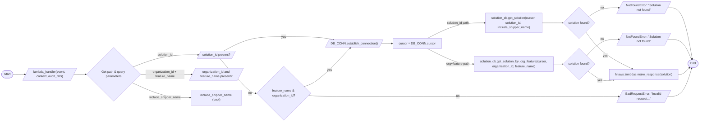

# Diagram: common/iam_service/iam_service/v1/lambdas/solution/get_solution.py

> Auto-generated by Obscura crawlers

## Mermaid

### SVG

<svg id="container" width="3601.0537109375" xmlns="http://www.w3.org/2000/svg" class="flowchart" height="635.2734375" viewBox="0.0000019073486328125 0 3601.0537109375 635.2734375" role="graphics-document document" aria-roledescription="flowchart-v2"><g><marker id="container_flowchart-v2-pointEnd" class="marker flowchart-v2" viewBox="0 0 10 10" refX="5" refY="5" markerUnits="userSpaceOnUse" markerWidth="8" markerHeight="8" orient="auto"><path d="M 0 0 L 10 5 L 0 10 z" class="arrowMarkerPath" style="stroke-width: 1; stroke-dasharray: 1, 0;"></path></marker><marker id="container_flowchart-v2-pointStart" class="marker flowchart-v2" viewBox="0 0 10 10" refX="4.5" refY="5" markerUnits="userSpaceOnUse" markerWidth="8" markerHeight="8" orient="auto"><path d="M 0 5 L 10 10 L 10 0 z" class="arrowMarkerPath" style="stroke-width: 1; stroke-dasharray: 1, 0;"></path></marker><marker id="container_flowchart-v2-circleEnd" class="marker flowchart-v2" viewBox="0 0 10 10" refX="11" refY="5" markerUnits="userSpaceOnUse" markerWidth="11" markerHeight="11" orient="auto"><circle cx="5" cy="5" r="5" class="arrowMarkerPath" style="stroke-width: 1; stroke-dasharray: 1, 0;"></circle></marker><marker id="container_flowchart-v2-circleStart" class="marker flowchart-v2" viewBox="0 0 10 10" refX="-1" refY="5" markerUnits="userSpaceOnUse" markerWidth="11" markerHeight="11" orient="auto"><circle cx="5" cy="5" r="5" class="arrowMarkerPath" style="stroke-width: 1; stroke-dasharray: 1, 0;"></circle></marker><marker id="container_flowchart-v2-crossEnd" class="marker cross flowchart-v2" viewBox="0 0 11 11" refX="12" refY="5.2" markerUnits="userSpaceOnUse" markerWidth="11" markerHeight="11" orient="auto"><path d="M 1,1 l 9,9 M 10,1 l -9,9" class="arrowMarkerPath" style="stroke-width: 2; stroke-dasharray: 1, 0;"></path></marker><marker id="container_flowchart-v2-crossStart" class="marker cross flowchart-v2" viewBox="0 0 11 11" refX="-1" refY="5.2" markerUnits="userSpaceOnUse" markerWidth="11" markerHeight="11" orient="auto"><path d="M 1,1 l 9,9 M 10,1 l -9,9" class="arrowMarkerPath" style="stroke-width: 2; stroke-dasharray: 1, 0;"></path></marker><g class="root"><g class="clusters"></g><g class="edgePaths"><path d="M68.277,388.164L72.36,388.081C76.444,387.997,84.61,387.831,94.902,387.823C105.194,387.815,117.61,387.965,123.819,388.04L130.027,388.116" id="L_Start_LambdaHandler_0" class="edge-thickness-normal edge-pattern-solid edge-thickness-normal edge-pattern-solid flowchart-link" style=";" data-edge="true" data-et="edge" data-id="L_Start_LambdaHandler_0" data-points="W3sieCI6NjguMjc2ODM3NDMxODI3MjksInkiOjM4OC4xNjQwNjI1MDAwMDAwNn0seyJ4Ijo5Mi43NzY4MzYzOTUyNjM2NywieSI6Mzg3LjY2NDA2MjV9LHsieCI6MTM0LjAyNjgzNjM5NTI2MzY3LCJ5IjozODguMTY0MDYyNX1d" marker-end="url(#container_flowchart-v2-pointEnd)"></path><path d="M380.527,388.164L387.235,388.081C393.944,387.997,407.36,387.831,417.569,387.747C427.777,387.664,434.777,387.664,438.277,387.664L441.777,387.664" id="L_LambdaHandler_GetParams_0" class="edge-thickness-normal edge-pattern-solid edge-thickness-normal edge-pattern-solid flowchart-link" style=";" data-edge="true" data-et="edge" data-id="L_LambdaHandler_GetParams_0" data-points="W3sieCI6MzgwLjUyNjgzNjM5NTI2MzcsInkiOjM4OC4xNjQwNjI1fSx7IngiOjQyMC43NzY4MzYzOTUyNjM3LCJ5IjozODcuNjY0MDYyNX0seyJ4Ijo0NDUuNzc2ODM2Mzk1MjYzNywieSI6Mzg3LjY2NDA2MjV9XQ==" marker-end="url(#container_flowchart-v2-pointEnd)"></path><path d="M685.314,349.201L712.558,338.778C739.801,328.355,794.289,307.51,849.692,297.168C905.095,286.827,961.412,286.99,989.571,287.071L1017.73,287.152" id="L_GetParams_HasSolutionId_0" class="edge-thickness-normal edge-pattern-solid edge-thickness-normal edge-pattern-solid flowchart-link" style=";" data-edge="true" data-et="edge" data-id="L_GetParams_HasSolutionId_0" data-points="W3sieCI6Njg1LjMxMzgyMjY5NjYzMzYsInkiOjM0OS4yMDEwNDg4MDEzNjk4NH0seyJ4Ijo4NDguNzc2ODM2Mzk1MjYzNywieSI6Mjg2LjY2NDA2MjV9LHsieCI6MTAyMS43Mjk5NjEzOTUyNjM3LCJ5IjoyODcuMTY0MDYyNX1d" marker-end="url(#container_flowchart-v2-pointEnd)"></path><path d="M723.777,387.664L744.61,387.664C765.444,387.664,807.11,387.664,850.819,387.745C894.527,387.826,940.277,387.988,963.152,388.069L986.027,388.15" id="L_GetParams_HasOrgFeature_0" class="edge-thickness-normal edge-pattern-solid edge-thickness-normal edge-pattern-solid flowchart-link" style=";" data-edge="true" data-et="edge" data-id="L_GetParams_HasOrgFeature_0" data-points="W3sieCI6NzIzLjc3NjgzNjM5NTI2MzcsInkiOjM4Ny42NjQwNjI1fSx7IngiOjg0OC43NzY4MzYzOTUyNjM3LCJ5IjozODcuNjY0MDYyNX0seyJ4Ijo5OTAuMDI2ODM2Mzk1MjYzNywieSI6Mzg4LjE2NDA2MjV9XQ==" marker-end="url(#container_flowchart-v2-pointEnd)"></path><path d="M680.215,431.226L708.309,444.049C736.402,456.872,792.59,482.518,842.35,495.341C892.11,508.164,935.444,508.164,957.11,508.164L978.777,508.164" id="L_GetParams_IncludeShipper_0" class="edge-thickness-normal edge-pattern-solid edge-thickness-normal edge-pattern-solid flowchart-link" style=";" data-edge="true" data-et="edge" data-id="L_GetParams_IncludeShipper_0" data-points="W3sieCI6NjgwLjIxNTA2Nzg2NDcwNDUsInkiOjQzMS4yMjU4MzEwMzA1NTkxNn0seyJ4Ijo4NDguNzc2ODM2Mzk1MjYzNywieSI6NTA4LjE2NDA2MjV9LHsieCI6OTgyLjc3NjgzNjM5NTI2MzcsInkiOjUwOC4xNjQwNjI1fV0=" marker-end="url(#container_flowchart-v2-pointEnd)"></path><path d="M1149.628,267.664L1172.381,255.331C1195.133,242.997,1240.639,218.331,1292.286,205.997C1343.933,193.664,1401.722,193.664,1459.951,193.664C1518.18,193.664,1576.85,193.664,1618.328,195.948C1659.805,198.233,1684.092,202.801,1696.235,205.086L1708.378,207.37" id="L_HasSolutionId_EstablishConn_0" class="edge-thickness-normal edge-pattern-solid edge-thickness-normal edge-pattern-solid flowchart-link" style=";" data-edge="true" data-et="edge" data-id="L_HasSolutionId_EstablishConn_0" data-points="W3sieCI6MTE0OS42MjgwMjA4NzEwNywieSI6MjY3LjY2NDA2MjV9LHsieCI6MTI4Ni4xNDQwMjM4OTUyNjM3LCJ5IjoxOTMuNjY0MDYyNX0seyJ4IjoxNDU5LjUxMTIxMTM5NTI2MzcsInkiOjE5My42NjQwNjI1fSx7IngiOjE2MzUuNTE5MDIzODk1MjYzNywieSI6MTkzLjY2NDA2MjV9LHsieCI6MTcxMi4zMDk0Mjc3MTQ0NjQ4LCJ5IjoyMDguMTA5Mzc1fV0=" marker-end="url(#container_flowchart-v2-pointEnd)"></path><path d="M1130.045,306.664L1156.062,336.932C1182.078,367.201,1234.111,427.737,1265.189,458.005C1296.266,488.273,1306.389,488.273,1311.45,488.273L1316.511,488.273" id="L_HasSolutionId_CheckOrgFeature_0" class="edge-thickness-normal edge-pattern-solid edge-thickness-normal edge-pattern-solid flowchart-link" style=";" data-edge="true" data-et="edge" data-id="L_HasSolutionId_CheckOrgFeature_0" data-points="W3sieCI6MTEzMC4wNDUyMDQyMTY3MDA1LCJ5IjozMDYuNjY0MDYyNX0seyJ4IjoxMjg2LjE0NDAyMzg5NTI2MzcsInkiOjQ4OC4yNzM0Mzc1fSx7IngiOjEzMjAuNTExMjExMzk1MjYzNywieSI6NDg4LjI3MzQzNzV9XQ==" marker-end="url(#container_flowchart-v2-pointEnd)"></path><path d="M1563.369,453.132L1575.394,449.063C1587.419,444.994,1611.469,436.856,1650.673,403.012C1689.877,369.167,1744.236,309.615,1771.415,279.84L1798.594,250.064" id="L_CheckOrgFeature_EstablishConn_0" class="edge-thickness-normal edge-pattern-solid edge-thickness-normal edge-pattern-solid flowchart-link" style=";" data-edge="true" data-et="edge" data-id="L_CheckOrgFeature_EstablishConn_0" data-points="W3sieCI6MTU2My4zNjkzNjM0MjQ5Nzk4LCJ5Ijo0NTMuMTMxNTg5NTI5NzE2MX0seyJ4IjoxNjM1LjUxOTAyMzg5NTI2MzcsInkiOjQyOC43MTg3NX0seyJ4IjoxODAxLjI5MDcyNjY5NjkzNzgsInkiOjI0Ny4xMDkzNzV9XQ==" marker-end="url(#container_flowchart-v2-pointEnd)"></path><path d="M1586.928,499.856L1595.027,500.592C1603.125,501.329,1619.322,502.801,1657.915,503.537C1696.509,504.273,1757.498,504.273,1816.486,504.273C1875.475,504.273,1932.462,504.273,1985.17,504.273C2037.878,504.273,2086.308,504.273,2144.787,504.273C2203.266,504.273,2271.795,504.273,2354.911,504.273C2438.027,504.273,2535.73,504.273,2623.384,504.273C2711.037,504.273,2788.641,504.273,2845.628,504.273C2902.615,504.273,2938.985,504.273,2977.356,504.273C3015.727,504.273,3056.1,504.273,3091.119,504.353C3126.139,504.433,3155.806,504.592,3170.639,504.672L3185.472,504.752" id="L_CheckOrgFeature_BadRequestErr_0" class="edge-thickness-normal edge-pattern-solid edge-thickness-normal edge-pattern-solid flowchart-link" style=";" data-edge="true" data-et="edge" data-id="L_CheckOrgFeature_BadRequestErr_0" data-points="W3sieCI6MTU4Ni45MjgzNDkzNjk3OTI2LCJ5Ijo0OTkuODU2Mjk5NTI1NDcwOTR9LHsieCI6MTYzNS41MTkwMjM4OTUyNjM3LCJ5Ijo1MDQuMjczNDM3NX0seyJ4IjoxODE4LjQ4Nzc3Mzg5NTI2MzcsInkiOjUwNC4yNzM0Mzc1fSx7IngiOjE5ODkuNDQ4NzExMzk1MjYzNywieSI6NTA0LjI3MzQzNzV9LHsieCI6MjEzNC43Mzc3NzM4OTUyNjM3LCJ5Ijo1MDQuMjczNDM3NX0seyJ4IjoyMzQwLjMyMzcxMTM5NTI2MzcsInkiOjUwNC4yNzM0Mzc1fSx7IngiOjI2MzMuNDMzMDg2Mzk1MjYzNywieSI6NTA0LjI3MzQzNzV9LHsieCI6Mjg2Ni4yNDU1ODYzOTUyNjM3LCJ5Ijo1MDQuMjczNDM3NX0seyJ4IjoyOTc1LjM1NDk2MTM5NTI2MzcsInkiOjUwNC4yNzM0Mzc1fSx7IngiOjMwOTYuNDcyMTQ4ODk1MjYzNywieSI6NTA0LjI3MzQzNzV9LHsieCI6MzE4OS40NzIxNDg4OTUyNjM3LCJ5Ijo1MDQuNzczNDM3NX1d" marker-end="url(#container_flowchart-v2-pointEnd)"></path><path d="M1955.199,227.609L1960.907,227.526C1966.615,227.443,1978.032,227.276,1987.24,227.193C1996.449,227.109,2003.449,227.109,2006.949,227.109L2010.449,227.109" id="L_EstablishConn_Cursor_0" class="edge-thickness-normal edge-pattern-solid edge-thickness-normal edge-pattern-solid flowchart-link" style=";" data-edge="true" data-et="edge" data-id="L_EstablishConn_Cursor_0" data-points="W3sieCI6MTk1NS4xOTg3MTEzOTUyNjM3LCJ5IjoyMjcuNjA5Mzc1fSx7IngiOjE5ODkuNDQ4NzExMzk1MjYzNywieSI6MjI3LjEwOTM3NX0seyJ4IjoyMDE0LjQ0ODcxMTM5NTI2MzcsInkiOjIyNy4xMDkzNzV9XQ==" marker-end="url(#container_flowchart-v2-pointEnd)"></path><path d="M2185.612,200.109L2211.397,186.424C2237.182,172.74,2288.753,145.37,2337.82,131.685C2386.886,118,2433.449,118,2456.73,118L2480.011,118" id="L_Cursor_GetSolution_0" class="edge-thickness-normal edge-pattern-solid edge-thickness-normal edge-pattern-solid flowchart-link" style=";" data-edge="true" data-et="edge" data-id="L_Cursor_GetSolution_0" data-points="W3sieCI6MjE4NS42MTE2ODE5NTc3MDEsInkiOjIwMC4xMDkzNzV9LHsieCI6MjM0MC4zMjM3MTEzOTUyNjM3LCJ5IjoxMTh9LHsieCI6MjQ4NC4wMTEyMTEzOTUyNjM3LCJ5IjoxMTh9XQ==" marker-end="url(#container_flowchart-v2-pointEnd)"></path><path d="M2185.612,254.109L2211.397,267.794C2237.182,281.479,2288.753,308.849,2328.088,322.534C2367.423,336.219,2394.522,336.219,2408.071,336.219L2421.621,336.219" id="L_Cursor_GetSolutionByOrg_0" class="edge-thickness-normal edge-pattern-solid edge-thickness-normal edge-pattern-solid flowchart-link" style=";" data-edge="true" data-et="edge" data-id="L_Cursor_GetSolutionByOrg_0" data-points="W3sieCI6MjE4NS42MTE2ODE5NTc3MDEsInkiOjI1NC4xMDkzNzV9LHsieCI6MjM0MC4zMjM3MTEzOTUyNjM3LCJ5IjozMzYuMjE4NzV9LHsieCI6MjQyNS42MjA1ODYzOTUyNjM3LCJ5IjozMzYuMjE4NzV9XQ==" marker-end="url(#container_flowchart-v2-pointEnd)"></path><path d="M2782.855,118L2796.753,118C2810.652,118,2838.449,118,2855.847,118C2873.246,118,2880.246,118,2883.746,118L2887.246,118" id="L_GetSolution_FoundSolution1_0" class="edge-thickness-normal edge-pattern-solid edge-thickness-normal edge-pattern-solid flowchart-link" style=";" data-edge="true" data-et="edge" data-id="L_GetSolution_FoundSolution1_0" data-points="W3sieCI6Mjc4Mi44NTQ5NjEzOTUyNjM3LCJ5IjoxMTh9LHsieCI6Mjg2Ni4yNDU1ODYzOTUyNjM3LCJ5IjoxMTh9LHsieCI6Mjg5MS4yNDU1ODYzOTUyNjM3LCJ5IjoxMTh9XQ==" marker-end="url(#container_flowchart-v2-pointEnd)"></path><path d="M2841.246,336.219L2845.412,336.219C2849.579,336.219,2857.912,336.219,2865.579,336.219C2873.246,336.219,2880.246,336.219,2883.746,336.219L2887.246,336.219" id="L_GetSolutionByOrg_FoundSolution2_0" class="edge-thickness-normal edge-pattern-solid edge-thickness-normal edge-pattern-solid flowchart-link" style=";" data-edge="true" data-et="edge" data-id="L_GetSolutionByOrg_FoundSolution2_0" data-points="W3sieCI6Mjg0MS4yNDU1ODYzOTUyNjM3LCJ5IjozMzYuMjE4NzV9LHsieCI6Mjg2Ni4yNDU1ODYzOTUyNjM3LCJ5IjozMzYuMjE4NzV9LHsieCI6Mjg5MS4yNDU1ODYzOTUyNjM3LCJ5IjozMzYuMjE4NzV9XQ==" marker-end="url(#container_flowchart-v2-pointEnd)"></path><path d="M3011.165,166.299L3025.383,185.476C3039.601,204.653,3068.036,243.006,3108.72,275.567C3149.403,308.127,3202.333,334.896,3228.798,348.28L3255.264,361.664" id="L_FoundSolution1_ReturnResp_0" class="edge-thickness-normal edge-pattern-solid edge-thickness-normal edge-pattern-solid flowchart-link" style=";" data-edge="true" data-et="edge" data-id="L_FoundSolution1_ReturnResp_0" data-points="W3sieCI6MzAxMS4xNjQ5MDk1MDc4ODgzLCJ5IjoxNjYuMjk5NDI2ODg3Mzc1Mzh9LHsieCI6MzA5Ni40NzIxNDg4OTUyNjM3LCJ5IjoyODEuMzU5Mzc1fSx7IngiOjMyNTguODMzMDYxMTEwNjQ0LCJ5IjozNjMuNDY4NzV9XQ==" marker-end="url(#container_flowchart-v2-pointEnd)"></path><path d="M3023.043,372.64L3035.282,381.986C3047.52,391.333,3071.996,410.026,3094.154,417.614C3116.311,425.202,3136.15,421.684,3146.07,419.926L3155.989,418.167" id="L_FoundSolution2_ReturnResp_0" class="edge-thickness-normal edge-pattern-solid edge-thickness-normal edge-pattern-solid flowchart-link" style=";" data-edge="true" data-et="edge" data-id="L_FoundSolution2_ReturnResp_0" data-points="W3sieCI6MzAyMy4wNDM0OTc0MjM2ODA1LCJ5IjozNzIuNjM5NTg4OTcxNTgzMjR9LHsieCI6MzA5Ni40NzIxNDg4OTUyNjM3LCJ5Ijo0MjguNzE4NzV9LHsieCI6MzE1OS45MjgwMzEyNDgyMDQ3LCJ5Ijo0MTcuNDY4NzV9XQ==" marker-end="url(#container_flowchart-v2-pointEnd)"></path><path d="M3026.388,84.924L3038.069,77.353C3049.749,69.783,3073.111,54.641,3099.625,47.15C3126.139,39.659,3155.806,39.819,3170.639,39.899L3185.472,39.978" id="L_FoundSolution1_NotFound1_0" class="edge-thickness-normal edge-pattern-solid edge-thickness-normal edge-pattern-solid flowchart-link" style=";" data-edge="true" data-et="edge" data-id="L_FoundSolution1_NotFound1_0" data-points="W3sieCI6MzAyNi4zODgwOTY3MTc3NTYsInkiOjg0LjkyMzc2MDMyMjQ5MjI3fSx7IngiOjMwOTYuNDcyMTQ4ODk1MjYzNywieSI6MzkuNX0seyJ4IjozMTg5LjQ3MjE0ODg5NTI2MzcsInkiOjQwfV0=" marker-end="url(#container_flowchart-v2-pointEnd)"></path><path d="M3015.744,292.498L3029.198,277.933C3042.653,263.368,3069.563,234.239,3097.851,219.754C3126.139,205.269,3155.806,205.428,3170.639,205.508L3185.472,205.588" id="L_FoundSolution2_NotFound2_0" class="edge-thickness-normal edge-pattern-solid edge-thickness-normal edge-pattern-solid flowchart-link" style=";" data-edge="true" data-et="edge" data-id="L_FoundSolution2_NotFound2_0" data-points="W3sieCI6MzAxNS43NDM2MTM3Mjk5MzksInkiOjI5Mi40OTgwMjczMzQ2NzU0fSx7IngiOjMwOTYuNDcyMTQ4ODk1MjYzNywieSI6MjA1LjEwOTM3NX0seyJ4IjozMTg5LjQ3MjE0ODg5NTI2MzcsInkiOjIwNS42MDkzNzV9XQ==" marker-end="url(#container_flowchart-v2-pointEnd)"></path><path d="M3435.972,40L3449.304,39.917C3462.636,39.833,3489.3,39.667,3510.545,84.838C3531.79,130.01,3547.615,220.519,3555.527,265.774L3563.44,311.029" id="L_NotFound1_End_0" class="edge-thickness-normal edge-pattern-solid edge-thickness-normal edge-pattern-solid flowchart-link" style=";" data-edge="true" data-et="edge" data-id="L_NotFound1_End_0" data-points="W3sieCI6MzQzNS45NzIxNDg4OTUyNjM3LCJ5Ijo0MH0seyJ4IjozNTE1Ljk2NDMzNjM5NTI2MzcsInkiOjM5LjV9LHsieCI6MzU2NC4xMjg3NzgyMzY2MDUzLCJ5IjozMTQuOTY4NzV9XQ==" marker-end="url(#container_flowchart-v2-pointEnd)"></path><path d="M3435.972,205.609L3449.304,205.526C3462.636,205.443,3489.3,205.276,3509.691,222.89C3530.082,240.503,3544.2,275.897,3551.258,293.594L3558.317,311.29" id="L_NotFound2_End_0" class="edge-thickness-normal edge-pattern-solid edge-thickness-normal edge-pattern-solid flowchart-link" style=";" data-edge="true" data-et="edge" data-id="L_NotFound2_End_0" data-points="W3sieCI6MzQzNS45NzIxNDg4OTUyNjM3LCJ5IjoyMDUuNjA5Mzc1fSx7IngiOjM1MTUuOTY0MzM2Mzk1MjYzNywieSI6MjA1LjEwOTM3NX0seyJ4IjozNTU5Ljc5OTIwMjk2NTc0NjYsInkiOjMxNS4wMDU3OTIyNzgzMDUxfV0=" marker-end="url(#container_flowchart-v2-pointEnd)"></path><path d="M3490.964,390.469L3495.131,390.469C3499.298,390.469,3507.631,390.469,3517.335,384.502C3527.04,378.534,3538.115,366.6,3543.652,360.633L3549.19,354.666" id="L_ReturnResp_End_0" class="edge-thickness-normal edge-pattern-solid edge-thickness-normal edge-pattern-solid flowchart-link" style=";" data-edge="true" data-et="edge" data-id="L_ReturnResp_End_0" data-points="W3sieCI6MzQ5MC45NjQzMzYzOTUyNjM3LCJ5IjozOTAuNDY4NzV9LHsieCI6MzUxNS45NjQzMzYzOTUyNjM3LCJ5IjozOTAuNDY4NzV9LHsieCI6MzU1MS45MTEwMzgwNDkyMjQzLCJ5IjozNTEuNzMzNzI4NzEwNTE0MzZ9XQ==" marker-end="url(#container_flowchart-v2-pointEnd)"></path><path d="M3435.972,504.773L3449.304,504.69C3462.636,504.607,3489.3,504.44,3510.055,479.944C3530.81,455.448,3545.655,406.622,3553.078,382.209L3560.501,357.796" id="L_BadRequestErr_End_0" class="edge-thickness-normal edge-pattern-solid edge-thickness-normal edge-pattern-solid flowchart-link" style=";" data-edge="true" data-et="edge" data-id="L_BadRequestErr_End_0" data-points="W3sieCI6MzQzNS45NzIxNDg4OTUyNjM3LCJ5Ijo1MDQuNzczNDM3NX0seyJ4IjozNTE1Ljk2NDMzNjM5NTI2MzcsInkiOjUwNC4yNzM0Mzc1fSx7IngiOjM1NjEuNjY0MzU2MTMwOTgsInkiOjM1My45Njg3NX1d" marker-end="url(#container_flowchart-v2-pointEnd)"></path></g><g class="edgeLabels"><g class="edgeLabel"><g class="label" data-id="L_Start_LambdaHandler_0" transform="translate(0, 0)"><foreignObject width="0" height="0">

</foreignObject></g></g><g class="edgeLabel"><g class="label" data-id="L_LambdaHandler_GetParams_0" transform="translate(0, 0)"><foreignObject width="0" height="0">

</foreignObject></g></g><g class="edgeLabel" transform="translate(848.7768363952637, 286.6640625)"><g class="label" data-id="L_GetParams_HasSolutionId_0" transform="translate(-41.1171875, -12)"><foreignObject width="82.234375" height="24">

solution_id

</foreignObject></g></g><g class="edgeLabel" transform="translate(848.7768363952637, 387.6640625)"><g class="label" data-id="L_GetParams_HasOrgFeature_0" transform="translate(-100, -24)"><foreignObject width="200" height="48">

organization_id + feature_name

</foreignObject></g></g><g class="edgeLabel" transform="translate(848.7768363952637, 508.1640625)"><g class="label" data-id="L_GetParams_IncludeShipper_0" transform="translate(-82.3203125, -12)"><foreignObject width="164.640625" height="24">

include_shipper_name

</foreignObject></g></g><g class="edgeLabel" transform="translate(1459.5112113952637, 193.6640625)"><g class="label" data-id="L_HasSolutionId_EstablishConn_0" transform="translate(-12.0078125, -12)"><foreignObject width="24.015625" height="24">

yes

</foreignObject></g></g><g class="edgeLabel" transform="translate(1286.1440238952637, 488.2734375)"><g class="label" data-id="L_HasSolutionId_CheckOrgFeature_0" transform="translate(-9.3671875, -12)"><foreignObject width="18.734375" height="24">

no

</foreignObject></g></g><g class="edgeLabel" transform="translate(1692.72986, 366.04205)"><g class="label" data-id="L_CheckOrgFeature_EstablishConn_0" transform="translate(-12.0078125, -12)"><foreignObject width="24.015625" height="24">

yes

</foreignObject></g></g><g class="edgeLabel" transform="translate(2340.3237113952637, 504.2734375)"><g class="label" data-id="L_CheckOrgFeature_BadRequestErr_0" transform="translate(-9.3671875, -12)"><foreignObject width="18.734375" height="24">

no

</foreignObject></g></g><g class="edgeLabel"><g class="label" data-id="L_EstablishConn_Cursor_0" transform="translate(0, 0)"><foreignObject width="0" height="0">

</foreignObject></g></g><g class="edgeLabel" transform="translate(2340.3237113952637, 118)"><g class="label" data-id="L_Cursor_GetSolution_0" transform="translate(-59.8359375, -12)"><foreignObject width="119.671875" height="24">

solution_id path

</foreignObject></g></g><g class="edgeLabel" transform="translate(2340.3237113952637, 336.21875)"><g class="label" data-id="L_Cursor_GetSolutionByOrg_0" transform="translate(-60.296875, -12)"><foreignObject width="120.59375" height="24">

org+feature path

</foreignObject></g></g><g class="edgeLabel"><g class="label" data-id="L_GetSolution_FoundSolution1_0" transform="translate(0, 0)"><foreignObject width="0" height="0">

</foreignObject></g></g><g class="edgeLabel"><g class="label" data-id="L_GetSolutionByOrg_FoundSolution2_0" transform="translate(0, 0)"><foreignObject width="0" height="0">

</foreignObject></g></g><g class="edgeLabel" transform="translate(3113.74312, 290.09368)"><g class="label" data-id="L_FoundSolution1_ReturnResp_0" transform="translate(-12.0078125, -12)"><foreignObject width="24.015625" height="24">

yes

</foreignObject></g></g><g class="edgeLabel" transform="translate(3085.36632, 420.23697)"><g class="label" data-id="L_FoundSolution2_ReturnResp_0" transform="translate(-12.0078125, -12)"><foreignObject width="24.015625" height="24">

yes

</foreignObject></g></g><g class="edgeLabel" transform="translate(3096.4721488952637, 39.5)"><g class="label" data-id="L_FoundSolution1_NotFound1_0" transform="translate(-9.3671875, -12)"><foreignObject width="18.734375" height="24">

no

</foreignObject></g></g><g class="edgeLabel" transform="translate(3096.4721488952637, 205.109375)"><g class="label" data-id="L_FoundSolution2_NotFound2_0" transform="translate(-9.3671875, -12)"><foreignObject width="18.734375" height="24">

no

</foreignObject></g></g><g class="edgeLabel"><g class="label" data-id="L_NotFound1_End_0" transform="translate(0, 0)"><foreignObject width="0" height="0">

</foreignObject></g></g><g class="edgeLabel"><g class="label" data-id="L_NotFound2_End_0" transform="translate(0, 0)"><foreignObject width="0" height="0">

</foreignObject></g></g><g class="edgeLabel"><g class="label" data-id="L_ReturnResp_End_0" transform="translate(0, 0)"><foreignObject width="0" height="0">

</foreignObject></g></g><g class="edgeLabel"><g class="label" data-id="L_BadRequestErr_End_0" transform="translate(0, 0)"><foreignObject width="0" height="0">

</foreignObject></g></g></g><g class="nodes"><g class="node default" id="flowchart-Start-0" transform="translate(37.888418197631836, 387.6640625)"><g class="basic label-container outer-path"><path d="M-10.3984375 -19.5 C-5.044066175211257 -19.5, 0.310305149577486 -19.5, 10.3984375 -19.5 C10.3984375 -19.5, 10.3984375 -19.5, 10.398437499999998 -19.5 C10.812108162531251 -19.486734387013723, 11.225778825062502 -19.47346877402744, 11.6478067896239 -19.45993515863156 C12.073451455967655 -19.418873729581982, 12.499096122311409 -19.37781230053241, 12.892042152847864 -19.3399052695533 C13.324370960342463 -19.270009700717548, 13.756699767837063 -19.200114131881797, 14.126030759676757 -19.140403561325776 C14.431537346788241 -19.070673676434374, 14.737043933899725 -19.000943791542973, 15.34470188623539 -18.862249829261074 C15.72108591033382 -18.75054102658872, 16.09746993443225 -18.638832223916364, 16.543047751460602 -18.50658706670804 C16.802972377134594 -18.410932401743107, 17.06289700280859 -18.315277736778178, 17.716144095147794 -18.074876768247425 C18.09480297014691 -17.90725571680175, 18.47346184514603 -17.739634665356075, 18.85917041279238 -17.568892924097174 C19.15021342011137 -17.4170559736008, 19.44125642743036 -17.265219023104425, 19.967429764076783 -16.990714730406097 C20.19498980715654 -16.852766494999898, 20.422549850236294 -16.7148182595937, 21.036368073605697 -16.342718045390892 C21.308420161333988 -16.152946285936704, 21.580472249062282 -15.963174526482515, 22.061592844578712 -15.627565626425154 C22.373600936820786 -15.378747475746133, 22.685609029062864 -15.12992932506711, 23.03889120850187 -14.848196188198123 C23.373551133688014 -14.54426689876047, 23.708211058874156 -14.240337609322816, 23.964247236767985 -14.007812326905688 C24.26452055876749 -13.697755469042981, 24.564793880766995 -13.387698611180273, 24.833858442968648 -13.10986736009568 C25.11178880362517 -12.783394543782997, 25.389719164281697 -12.456921727470315, 25.644151408126582 -12.158051136245305 C25.811397063283525 -11.933957194727629, 25.978642718440465 -11.709863253209953, 26.391796464640635 -11.156274872382312 C26.574802770020707 -10.87512804324471, 26.75780907540078 -10.593981214107107, 27.073721378604247 -10.108655082055241 C27.279908318035044 -9.742549292404235, 27.486095257465845 -9.376443502753228, 27.6871239742735 -9.019496659696287 C27.821515129113724 -8.740430551160498, 27.955906283953947 -8.46136444262471, 28.22948364880834 -7.893275190886684 C28.358584717169467 -7.57439305603535, 28.48768578553059 -7.255510921184017, 28.698571729970325 -6.734618561215508 C28.851114329837927 -6.2751845547769785, 29.00365692970553 -5.81575054833845, 29.09246063421488 -5.548287939305138 C29.219075107834456 -5.065452076333703, 29.345689581454035 -4.582616213362268, 29.40953178754556 -4.339158212148133 C29.457828292663837 -4.091165865835755, 29.506124797782114 -3.8431735195233783, 29.648482276581777 -3.1121979531509023 C29.683711130808955 -2.83896991648904, 29.718939985036133 -2.565741879827177, 29.808330202509367 -1.872449005199798 C29.826384325111384 -1.5912414726479327, 29.844438447713397 -1.3100339400960674, 29.888418715913414 -0.6250057626472757 C29.888418715913414 -0.37115983640954753, 29.888418715913414 -0.11731391017181936, 29.888418715913414 0.625005762647271 C29.857200233399006 1.111258826914728, 29.825981750884598 1.5975118911821853, 29.808330202509367 1.8724490051997846 C29.76780104706153 2.1867851314662214, 29.727271891613693 2.5011212577326583, 29.648482276581777 3.1121979531508885 C29.57095509549762 3.5102836426425097, 29.493427914413466 3.9083693321341304, 29.40953178754556 4.339158212148129 C29.306079798998628 4.733665480853035, 29.2026278104517 5.128172749557942, 29.092460634214884 5.548287939305125 C28.936854347902198 6.016949281184105, 28.78124806158951 6.485610623063084, 28.69857172997033 6.734618561215495 C28.594017053272832 6.99287063408547, 28.489462376575336 7.251122706955446, 28.229483648808344 7.893275190886679 C28.11476325599126 8.131494541194538, 28.000042863174176 8.369713891502398, 27.687123974273504 9.019496659696284 C27.504601466529156 9.343583854604445, 27.32207895878481 9.667671049512604, 27.07372137860425 10.108655082055236 C26.901983560774042 10.372490488303663, 26.73024574294383 10.63632589455209, 26.39179646464064 11.156274872382301 C26.134331344252605 11.501254678147278, 25.876866223864567 11.846234483912255, 25.644151408126582 12.158051136245302 C25.37629239461588 12.472693575124618, 25.108433381105176 12.787336014003934, 24.83385844296866 13.10986736009567 C24.562462205014885 13.390106257828467, 24.29106596706111 13.670345155561265, 23.96424723676799 14.007812326905684 C23.754619060363538 14.198191090258595, 23.54499088395909 14.388569853611504, 23.038891208501887 14.848196188198111 C22.728494601242584 15.095729222486787, 22.418097993983285 15.343262256775464, 22.061592844578715 15.627565626425152 C21.769209130967706 15.831519847953226, 21.476825417356697 16.0354740694813, 21.036368073605708 16.34271804539089 C20.76114484827556 16.509559981977226, 20.48592162294541 16.67640191856356, 19.967429764076787 16.990714730406093 C19.735352701093035 17.111789185512265, 19.503275638109283 17.232863640618433, 18.859170412792388 17.56889292409717 C18.43936970222847 17.754726245718192, 18.01956899166455 17.940559567339214, 17.716144095147804 18.07487676824742 C17.375010586793525 18.200417052725378, 17.033877078439243 18.325957337203338, 16.543047751460616 18.506587066708033 C16.2563053956623 18.591690692767635, 15.969563039863983 18.676794318827234, 15.344701886235413 18.86224982926107 C15.006549929551792 18.939430806726367, 14.668397972868169 19.016611784191664, 14.126030759676766 19.140403561325773 C13.723141980342103 19.205539494719453, 13.32025320100744 19.270675428113137, 12.892042152847878 19.3399052695533 C12.635441440141534 19.36465923170057, 12.378840727435191 19.389413193847844, 11.6478067896239 19.45993515863156 C11.170568743819565 19.475239253873, 10.693330698015231 19.49054334911444, 10.398437500000004 19.5 C10.398437500000002 19.5, 10.398437500000002 19.5, 10.3984375 19.5 C4.096858329377624 19.5, -2.204720841244752 19.5, -10.398437499999996 19.5 C-10.721155191508302 19.48965107176521, -11.043872883016608 19.47930214353042, -11.647806789623893 19.45993515863156 C-11.910640041712979 19.434579950905757, -12.173473293802065 19.40922474317996, -12.892042152847871 19.3399052695533 C-13.172587908826666 19.29454880739148, -13.453133664805458 19.24919234522966, -14.126030759676759 19.140403561325773 C-14.544115245075263 19.0449785057898, -14.962199730473767 18.949553450253827, -15.344701886235388 18.862249829261074 C-15.81590576296718 18.722398992046703, -16.287109639698972 18.582548154832327, -16.54304775146059 18.506587066708043 C-16.86927765601753 18.386531446194912, -17.195507560574466 18.266475825681777, -17.716144095147797 18.074876768247425 C-18.147524072775337 17.88391764858409, -18.578904050402876 17.692958528920755, -18.85917041279238 17.568892924097174 C-19.165127530395363 17.409275291818584, -19.471084647998346 17.249657659539995, -19.96742976407678 16.990714730406097 C-20.347212217777113 16.760488375123526, -20.726994671477446 16.530262019840954, -21.036368073605686 16.3427180453909 C-21.428567671232972 16.06913658413305, -21.820767268860255 15.795555122875202, -22.061592844578712 15.627565626425156 C-22.44758660214746 15.319745876489351, -22.833580359716212 15.011926126553547, -23.03889120850187 14.848196188198125 C-23.32910538215268 14.584631354334718, -23.619319555803486 14.32106652047131, -23.964247236767974 14.007812326905697 C-24.284356632733 13.677273094101633, -24.604466028698024 13.346733861297567, -24.833858442968655 13.109867360095677 C-25.03635401927954 12.872004533836206, -25.238849595590423 12.634141707576736, -25.64415140812658 12.158051136245307 C-25.811576940789916 11.933716175256238, -25.979002473453257 11.70938121426717, -26.391796464640635 11.156274872382316 C-26.530886556761516 10.942595139965283, -26.6699766488824 10.728915407548252, -27.073721378604244 10.108655082055249 C-27.25142774130625 9.793119440357332, -27.429134104008256 9.477583798659417, -27.6871239742735 9.019496659696289 C-27.811846217628247 8.760508252741657, -27.936568460982993 8.501519845787023, -28.22948364880834 7.893275190886686 C-28.373952207713057 7.536435057282467, -28.518420766617773 7.1795949236782475, -28.698571729970325 6.73461856121551 C-28.830425116059804 6.337497170298132, -28.96227850214928 5.940375779380755, -29.09246063421488 5.5482879393051325 C-29.160765553874178 5.287811677104784, -29.22907047353348 5.027335414904436, -29.409531787545557 4.339158212148136 C-29.489084033214947 3.9306742440088906, -29.56863627888434 3.5221902758696455, -29.648482276581777 3.112197953150904 C-29.68955859226746 2.793618160128747, -29.730634907953142 2.47503836710659, -29.808330202509364 1.872449005199809 C-29.839343224409696 1.389396155841453, -29.870356246310024 0.9063433064830967, -29.888418715913414 0.6250057626472781 C-29.888418715913414 0.20014792805189946, -29.888418715913414 -0.22470990654347922, -29.888418715913414 -0.6250057626472687 C-29.868529098743632 -0.9348026046766373, -29.84863948157385 -1.244599446706006, -29.808330202509367 -1.8724490051997822 C-29.77618915711518 -2.1217286063098015, -29.744048111720993 -2.371008207419821, -29.648482276581777 -3.112197953150895 C-29.58541239844351 -3.436048447567447, -29.522342520305237 -3.7598989419839994, -29.40953178754556 -4.339158212148126 C-29.291794187819185 -4.788142707703296, -29.174056588092814 -5.237127203258465, -29.092460634214884 -5.548287939305123 C-28.96142974755967 -5.9429320929739875, -28.830398860904452 -6.337576246642852, -28.698571729970332 -6.734618561215485 C-28.522682073407076 -7.1690694135219, -28.34679241684382 -7.603520265828314, -28.229483648808344 -7.893275190886676 C-28.01542196320929 -8.337778861219457, -27.801360277610232 -8.782282531552237, -27.687123974273504 -9.019496659696282 C-27.497423328699945 -9.356329365185482, -27.307722683126386 -9.693162070674683, -27.073721378604247 -10.108655082055243 C-26.839969621813 -10.467760551622083, -26.60621786502176 -10.826866021188923, -26.39179646464064 -11.156274872382308 C-26.118877569706676 -11.521961328171006, -25.84595867477271 -11.887647783959704, -25.644151408126586 -12.158051136245302 C-25.34062678872548 -12.51458842523395, -25.037102169324378 -12.871125714222599, -24.833858442968662 -13.10986736009567 C-24.594470862359508 -13.357054691160508, -24.35508328175035 -13.604242022225344, -23.964247236767996 -14.007812326905677 C-23.616516682287184 -14.323612016038847, -23.268786127806376 -14.639411705172016, -23.038891208501887 -14.848196188198107 C-22.74330267611309 -15.08392017683698, -22.44771414372429 -15.31964416547585, -22.06159284457872 -15.627565626425149 C-21.68443999475021 -15.890651127781787, -21.307287144921705 -16.153736629138425, -21.03636807360571 -16.342718045390885 C-20.780916503415053 -16.497574288440518, -20.5254649332244 -16.65243053149015, -19.96742976407679 -16.99071473040609 C-19.728668126698054 -17.115276523692447, -19.48990648931932 -17.23983831697881, -18.859170412792388 -17.56889292409717 C-18.486543444774384 -17.73384382925247, -18.113916476756376 -17.89879473440777, -17.716144095147804 -18.07487676824742 C-17.363036537968572 -18.204823613379855, -17.009928980789336 -18.334770458512292, -16.54304775146062 -18.506587066708033 C-16.166642552934384 -18.618302153839412, -15.790237354408148 -18.730017240970795, -15.344701886235413 -18.862249829261067 C-15.01794815214887 -18.936829236798935, -14.691194418062326 -19.011408644336804, -14.126030759676768 -19.140403561325773 C-13.670382932906874 -19.214069168356257, -13.21473510613698 -19.287734775386745, -12.89204215284788 -19.3399052695533 C-12.581915391705461 -19.36982282521871, -12.27178863056304 -19.39974038088412, -11.647806789623903 -19.45993515863156 C-11.328366036478142 -19.470179001831237, -11.008925283332381 -19.480422845030915, -10.398437500000005 -19.5 C-10.398437500000004 -19.5, -10.398437500000002 -19.5, -10.3984375 -19.5" stroke="none" stroke-width="0" fill="#ECECFF" style=""></path><path d="M-10.3984375 -19.5 C-5.387743781498854 -19.5, -0.37705006299770716 -19.5, 10.3984375 -19.5 M-10.3984375 -19.5 C-4.969897363829777 -19.5, 0.45864277234044515 -19.5, 10.3984375 -19.5 M10.3984375 -19.5 C10.3984375 -19.5, 10.3984375 -19.5, 10.398437499999998 -19.5 M10.3984375 -19.5 C10.3984375 -19.5, 10.398437499999998 -19.5, 10.398437499999998 -19.5 M10.398437499999998 -19.5 C10.843154324166518 -19.485738797037765, 11.28787114833304 -19.471477594075534, 11.6478067896239 -19.45993515863156 M10.398437499999998 -19.5 C10.649130519146164 -19.491960762820344, 10.899823538292328 -19.483921525640685, 11.6478067896239 -19.45993515863156 M11.6478067896239 -19.45993515863156 C11.976230329187617 -19.428252534756943, 12.304653868751334 -19.396569910882324, 12.892042152847864 -19.3399052695533 M11.6478067896239 -19.45993515863156 C12.07469176932763 -19.418754078043843, 12.501576749031361 -19.377572997456124, 12.892042152847864 -19.3399052695533 M12.892042152847864 -19.3399052695533 C13.22017684148602 -19.2868549978168, 13.548311530124177 -19.233804726080297, 14.126030759676757 -19.140403561325776 M12.892042152847864 -19.3399052695533 C13.161167694347888 -19.29639513910332, 13.430293235847913 -19.252885008653344, 14.126030759676757 -19.140403561325776 M14.126030759676757 -19.140403561325776 C14.402164363048577 -19.07737786829632, 14.678297966420399 -19.014352175266865, 15.34470188623539 -18.862249829261074 M14.126030759676757 -19.140403561325776 C14.492958539675842 -19.05665468996852, 14.859886319674926 -18.972905818611263, 15.34470188623539 -18.862249829261074 M15.34470188623539 -18.862249829261074 C15.819711464182225 -18.72126947990261, 16.29472104212906 -18.580289130544145, 16.543047751460602 -18.50658706670804 M15.34470188623539 -18.862249829261074 C15.672817850923344 -18.764866733257534, 16.000933815611297 -18.667483637253994, 16.543047751460602 -18.50658706670804 M16.543047751460602 -18.50658706670804 C16.87750229079565 -18.38350470456887, 17.211956830130696 -18.260422342429703, 17.716144095147794 -18.074876768247425 M16.543047751460602 -18.50658706670804 C16.930988098960047 -18.363821432746985, 17.318928446459488 -18.221055798785926, 17.716144095147794 -18.074876768247425 M17.716144095147794 -18.074876768247425 C18.15067641622398 -17.88252219965032, 18.585208737300167 -17.690167631053217, 18.85917041279238 -17.568892924097174 M17.716144095147794 -18.074876768247425 C18.009174939613178 -17.94516070585376, 18.30220578407856 -17.81544464346009, 18.85917041279238 -17.568892924097174 M18.85917041279238 -17.568892924097174 C19.267644470443912 -17.355792269860494, 19.67611852809544 -17.14269161562381, 19.967429764076783 -16.990714730406097 M18.85917041279238 -17.568892924097174 C19.193794795742278 -17.39431959784936, 19.52841917869218 -17.219746271601544, 19.967429764076783 -16.990714730406097 M19.967429764076783 -16.990714730406097 C20.194207104009546 -16.85324097424728, 20.420984443942306 -16.715767218088462, 21.036368073605697 -16.342718045390892 M19.967429764076783 -16.990714730406097 C20.35900339725877 -16.753340492829082, 20.75057703044076 -16.51596625525207, 21.036368073605697 -16.342718045390892 M21.036368073605697 -16.342718045390892 C21.33698933228432 -16.133017669021232, 21.63761059096294 -15.923317292651571, 22.061592844578712 -15.627565626425154 M21.036368073605697 -16.342718045390892 C21.291045083612627 -16.165066388000135, 21.54572209361956 -15.987414730609373, 22.061592844578712 -15.627565626425154 M22.061592844578712 -15.627565626425154 C22.355875581283595 -15.392882975095523, 22.65015831798848 -15.15820032376589, 23.03889120850187 -14.848196188198123 M22.061592844578712 -15.627565626425154 C22.38034534611731 -15.373368988808426, 22.699097847655906 -15.119172351191697, 23.03889120850187 -14.848196188198123 M23.03889120850187 -14.848196188198123 C23.383078108915196 -14.535614751929094, 23.727265009328523 -14.223033315660064, 23.964247236767985 -14.007812326905688 M23.03889120850187 -14.848196188198123 C23.255555255351616 -14.651427633465724, 23.472219302201363 -14.454659078733327, 23.964247236767985 -14.007812326905688 M23.964247236767985 -14.007812326905688 C24.2602566728862 -13.702158281286955, 24.55626610900441 -13.396504235668223, 24.833858442968648 -13.10986736009568 M23.964247236767985 -14.007812326905688 C24.26257016255654 -13.699769413261293, 24.560893088345097 -13.3917264996169, 24.833858442968648 -13.10986736009568 M24.833858442968648 -13.10986736009568 C25.113213956539177 -12.781720478076709, 25.392569470109706 -12.453573596057735, 25.644151408126582 -12.158051136245305 M24.833858442968648 -13.10986736009568 C25.012707521095056 -12.899781056127564, 25.19155659922146 -12.689694752159447, 25.644151408126582 -12.158051136245305 M25.644151408126582 -12.158051136245305 C25.805328620845557 -11.942088354748025, 25.966505833564533 -11.726125573250744, 26.391796464640635 -11.156274872382312 M25.644151408126582 -12.158051136245305 C25.874442635920083 -11.84948187096446, 26.104733863713587 -11.540912605683618, 26.391796464640635 -11.156274872382312 M26.391796464640635 -11.156274872382312 C26.615746505043695 -10.812227471317106, 26.83969654544676 -10.4681800702519, 27.073721378604247 -10.108655082055241 M26.391796464640635 -11.156274872382312 C26.556788216419683 -10.902803235160851, 26.721779968198728 -10.649331597939389, 27.073721378604247 -10.108655082055241 M27.073721378604247 -10.108655082055241 C27.261221598607364 -9.77572945498361, 27.448721818610483 -9.442803827911979, 27.6871239742735 -9.019496659696287 M27.073721378604247 -10.108655082055241 C27.19849472679742 -9.8871073676667, 27.323268074990597 -9.665559653278157, 27.6871239742735 -9.019496659696287 M27.6871239742735 -9.019496659696287 C27.844929174951858 -8.691810783997287, 28.002734375630215 -8.364124908298285, 28.22948364880834 -7.893275190886684 M27.6871239742735 -9.019496659696287 C27.8124907532748 -8.759169860680732, 27.9378575322761 -8.498843061665179, 28.22948364880834 -7.893275190886684 M28.22948364880834 -7.893275190886684 C28.35159530216042 -7.591657046238846, 28.473706955512494 -7.290038901591009, 28.698571729970325 -6.734618561215508 M28.22948364880834 -7.893275190886684 C28.326546328323854 -7.653528495904121, 28.423609007839367 -7.413781800921558, 28.698571729970325 -6.734618561215508 M28.698571729970325 -6.734618561215508 C28.847817366647444 -6.28511448260697, 28.997063003324563 -5.835610403998432, 29.09246063421488 -5.548287939305138 M28.698571729970325 -6.734618561215508 C28.842369294828195 -6.301523206894186, 28.986166859686065 -5.8684278525728635, 29.09246063421488 -5.548287939305138 M29.09246063421488 -5.548287939305138 C29.205235371181452 -5.118228990371425, 29.318010108148023 -4.688170041437713, 29.40953178754556 -4.339158212148133 M29.09246063421488 -5.548287939305138 C29.200172587974365 -5.137535576964169, 29.30788454173385 -4.7267832146231985, 29.40953178754556 -4.339158212148133 M29.40953178754556 -4.339158212148133 C29.496213844916056 -3.894064167809951, 29.582895902286552 -3.448970123471769, 29.648482276581777 -3.1121979531509023 M29.40953178754556 -4.339158212148133 C29.494433029193008 -3.9032082801722714, 29.579334270840455 -3.467258348196409, 29.648482276581777 -3.1121979531509023 M29.648482276581777 -3.1121979531509023 C29.683509393051683 -2.840534554696819, 29.718536509521588 -2.568871156242736, 29.808330202509367 -1.872449005199798 M29.648482276581777 -3.1121979531509023 C29.69207931521594 -2.774067930713388, 29.735676353850103 -2.435937908275874, 29.808330202509367 -1.872449005199798 M29.808330202509367 -1.872449005199798 C29.82627573948495 -1.5929327814284024, 29.844221276460527 -1.313416557657007, 29.888418715913414 -0.6250057626472757 M29.808330202509367 -1.872449005199798 C29.831967714405426 -1.5042756775624966, 29.855605226301485 -1.1361023499251952, 29.888418715913414 -0.6250057626472757 M29.888418715913414 -0.6250057626472757 C29.888418715913414 -0.37377443100906704, 29.888418715913414 -0.12254309937085839, 29.888418715913414 0.625005762647271 M29.888418715913414 -0.6250057626472757 C29.888418715913414 -0.21134551041791616, 29.888418715913414 0.20231474181144338, 29.888418715913414 0.625005762647271 M29.888418715913414 0.625005762647271 C29.86893349986867 0.9285037307274331, 29.84944828382393 1.2320016988075952, 29.808330202509367 1.8724490051997846 M29.888418715913414 0.625005762647271 C29.857510648952616 1.10642385410434, 29.826602581991814 1.5878419455614092, 29.808330202509367 1.8724490051997846 M29.808330202509367 1.8724490051997846 C29.747021838112286 2.3479445727576422, 29.685713473715204 2.8234401403155, 29.648482276581777 3.1121979531508885 M29.808330202509367 1.8724490051997846 C29.756020539431162 2.2781524223230094, 29.703710876352954 2.683855839446234, 29.648482276581777 3.1121979531508885 M29.648482276581777 3.1121979531508885 C29.562553722265193 3.5534229185601722, 29.476625167948605 3.9946478839694564, 29.40953178754556 4.339158212148129 M29.648482276581777 3.1121979531508885 C29.58384783262217 3.444082162388905, 29.519213388662564 3.7759663716269216, 29.40953178754556 4.339158212148129 M29.40953178754556 4.339158212148129 C29.294678946813047 4.777141871397253, 29.179826106080533 5.215125530646378, 29.092460634214884 5.548287939305125 M29.40953178754556 4.339158212148129 C29.343652097182748 4.59038602393995, 29.277772406819935 4.841613835731772, 29.092460634214884 5.548287939305125 M29.092460634214884 5.548287939305125 C28.956356971719075 5.958210485568794, 28.82025330922326 6.368133031832463, 28.69857172997033 6.734618561215495 M29.092460634214884 5.548287939305125 C29.00649444824414 5.8072043945973455, 28.920528262273393 6.066120849889565, 28.69857172997033 6.734618561215495 M28.69857172997033 6.734618561215495 C28.538641455451806 7.1296494313177545, 28.378711180933283 7.524680301420014, 28.229483648808344 7.893275190886679 M28.69857172997033 6.734618561215495 C28.564195652501162 7.066530070549055, 28.429819575031996 7.398441579882614, 28.229483648808344 7.893275190886679 M28.229483648808344 7.893275190886679 C28.06999936443644 8.22444771980196, 27.910515080064542 8.55562024871724, 27.687123974273504 9.019496659696284 M28.229483648808344 7.893275190886679 C28.093992604391175 8.174625243662867, 27.958501559974003 8.455975296439053, 27.687123974273504 9.019496659696284 M27.687123974273504 9.019496659696284 C27.472514174047916 9.400558091595583, 27.257904373822328 9.78161952349488, 27.07372137860425 10.108655082055236 M27.687123974273504 9.019496659696284 C27.46632864131657 9.411541131313196, 27.245533308359633 9.80358560293011, 27.07372137860425 10.108655082055236 M27.07372137860425 10.108655082055236 C26.811847610724065 10.51096351247202, 26.549973842843876 10.913271942888803, 26.39179646464064 11.156274872382301 M27.07372137860425 10.108655082055236 C26.920361214619902 10.344257476905385, 26.767001050635553 10.579859871755534, 26.39179646464064 11.156274872382301 M26.39179646464064 11.156274872382301 C26.165958611488076 11.458877021355065, 25.94012075833551 11.761479170327828, 25.644151408126582 12.158051136245302 M26.39179646464064 11.156274872382301 C26.166865742896412 11.457661547909268, 25.94193502115218 11.759048223436235, 25.644151408126582 12.158051136245302 M25.644151408126582 12.158051136245302 C25.427847435728268 12.412134090269063, 25.211543463329953 12.666217044292825, 24.83385844296866 13.10986736009567 M25.644151408126582 12.158051136245302 C25.354574417206592 12.49820474717749, 25.0649974262866 12.83835835810968, 24.83385844296866 13.10986736009567 M24.83385844296866 13.10986736009567 C24.500873337402144 13.453701820178692, 24.167888231835633 13.797536280261712, 23.96424723676799 14.007812326905684 M24.83385844296866 13.10986736009567 C24.542991980777973 13.410210862888217, 24.252125518587288 13.710554365680764, 23.96424723676799 14.007812326905684 M23.96424723676799 14.007812326905684 C23.71781598839291 14.231614666466394, 23.471384740017836 14.455417006027105, 23.038891208501887 14.848196188198111 M23.96424723676799 14.007812326905684 C23.709511462123952 14.23915661749814, 23.454775687479916 14.470500908090594, 23.038891208501887 14.848196188198111 M23.038891208501887 14.848196188198111 C22.76907805075454 15.06336500147195, 22.499264893007194 15.27853381474579, 22.061592844578715 15.627565626425152 M23.038891208501887 14.848196188198111 C22.664048259212525 15.147123465266576, 22.289205309923158 15.44605074233504, 22.061592844578715 15.627565626425152 M22.061592844578715 15.627565626425152 C21.855674634102357 15.771205255997799, 21.649756423625995 15.914844885570446, 21.036368073605708 16.34271804539089 M22.061592844578715 15.627565626425152 C21.741736931601398 15.850683264978821, 21.421881018624077 16.07380090353249, 21.036368073605708 16.34271804539089 M21.036368073605708 16.34271804539089 C20.634442600251607 16.586367629314402, 20.232517126897505 16.830017213237916, 19.967429764076787 16.990714730406093 M21.036368073605708 16.34271804539089 C20.722788038364925 16.532812105554687, 20.409208003124142 16.72290616571848, 19.967429764076787 16.990714730406093 M19.967429764076787 16.990714730406093 C19.57425683656548 17.195832794849462, 19.18108390905417 17.400950859292834, 18.859170412792388 17.56889292409717 M19.967429764076787 16.990714730406093 C19.54875684547054 17.20913612387017, 19.13008392686429 17.427557517334247, 18.859170412792388 17.56889292409717 M18.859170412792388 17.56889292409717 C18.54377677361855 17.708508332339534, 18.228383134444712 17.8481237405819, 17.716144095147804 18.07487676824742 M18.859170412792388 17.56889292409717 C18.50907919871687 17.72386791948152, 18.15898798464135 17.87884291486587, 17.716144095147804 18.07487676824742 M17.716144095147804 18.07487676824742 C17.28168781812071 18.23476069426319, 16.84723154109361 18.394644620278964, 16.543047751460616 18.506587066708033 M17.716144095147804 18.07487676824742 C17.357812068523806 18.206746266429995, 16.99948004189981 18.33861576461257, 16.543047751460616 18.506587066708033 M16.543047751460616 18.506587066708033 C16.149814074985656 18.623296757760112, 15.756580398510694 18.740006448812196, 15.344701886235413 18.86224982926107 M16.543047751460616 18.506587066708033 C16.074735089057864 18.645579806685845, 15.606422426655111 18.784572546663654, 15.344701886235413 18.86224982926107 M15.344701886235413 18.86224982926107 C14.97247253715245 18.94720874916575, 14.600243188069488 19.03216766907043, 14.126030759676766 19.140403561325773 M15.344701886235413 18.86224982926107 C15.039825703046033 18.93183582857102, 14.73494951985665 19.001421827880975, 14.126030759676766 19.140403561325773 M14.126030759676766 19.140403561325773 C13.863178287357094 19.18289951059905, 13.600325815037424 19.225395459872328, 12.892042152847878 19.3399052695533 M14.126030759676766 19.140403561325773 C13.84427137376014 19.185956233764102, 13.562511987843513 19.23150890620243, 12.892042152847878 19.3399052695533 M12.892042152847878 19.3399052695533 C12.566425530360746 19.37131711351335, 12.240808907873614 19.4027289574734, 11.6478067896239 19.45993515863156 M12.892042152847878 19.3399052695533 C12.462545587697255 19.381338286648187, 12.033049022546633 19.422771303743076, 11.6478067896239 19.45993515863156 M11.6478067896239 19.45993515863156 C11.199976708414907 19.474296197687558, 10.752146627205915 19.488657236743556, 10.398437500000004 19.5 M11.6478067896239 19.45993515863156 C11.384988653825332 19.468363224702152, 11.122170518026762 19.476791290772745, 10.398437500000004 19.5 M10.398437500000004 19.5 C10.398437500000004 19.5, 10.398437500000002 19.5, 10.3984375 19.5 M10.398437500000004 19.5 C10.398437500000002 19.5, 10.398437500000002 19.5, 10.3984375 19.5 M10.3984375 19.5 C5.581677946375071 19.5, 0.7649183927501415 19.5, -10.398437499999996 19.5 M10.3984375 19.5 C4.031859016197717 19.5, -2.3347194676045664 19.5, -10.398437499999996 19.5 M-10.398437499999996 19.5 C-10.800915882651763 19.487093301645004, -11.20339426530353 19.47418660329001, -11.647806789623893 19.45993515863156 M-10.398437499999996 19.5 C-10.696864972893653 19.49043001179814, -10.99529244578731 19.480860023596275, -11.647806789623893 19.45993515863156 M-11.647806789623893 19.45993515863156 C-11.980998181671355 19.427792585762017, -12.314189573718819 19.395650012892474, -12.892042152847871 19.3399052695533 M-11.647806789623893 19.45993515863156 C-12.13847024236743 19.412601445454527, -12.62913369511097 19.365267732277495, -12.892042152847871 19.3399052695533 M-12.892042152847871 19.3399052695533 C-13.3395211669463 19.26756033280545, -13.787000181044728 19.195215396057595, -14.126030759676759 19.140403561325773 M-12.892042152847871 19.3399052695533 C-13.34671439018759 19.266397388256074, -13.80138662752731 19.19288950695885, -14.126030759676759 19.140403561325773 M-14.126030759676759 19.140403561325773 C-14.414922644735155 19.074465873756925, -14.70381452979355 19.008528186188077, -15.344701886235388 18.862249829261074 M-14.126030759676759 19.140403561325773 C-14.487130239335418 19.057984961488007, -14.848229718994078 18.975566361650237, -15.344701886235388 18.862249829261074 M-15.344701886235388 18.862249829261074 C-15.724562301387241 18.74950925197201, -16.104422716539094 18.63676867468295, -16.54304775146059 18.506587066708043 M-15.344701886235388 18.862249829261074 C-15.648201482103042 18.772172742309444, -15.951701077970698 18.682095655357813, -16.54304775146059 18.506587066708043 M-16.54304775146059 18.506587066708043 C-16.77893185365694 18.41977953661105, -17.014815955853287 18.332972006514055, -17.716144095147797 18.074876768247425 M-16.54304775146059 18.506587066708043 C-16.871277571493327 18.3857954588128, -17.199507391526065 18.26500385091756, -17.716144095147797 18.074876768247425 M-17.716144095147797 18.074876768247425 C-18.0222397971034 17.939377280998066, -18.328335499059 17.803877793748704, -18.85917041279238 17.568892924097174 M-17.716144095147797 18.074876768247425 C-18.048168551349292 17.927899390642573, -18.38019300755079 17.780922013037724, -18.85917041279238 17.568892924097174 M-18.85917041279238 17.568892924097174 C-19.216040940020708 17.382713798628636, -19.572911467249035 17.1965346731601, -19.96742976407678 16.990714730406097 M-18.85917041279238 17.568892924097174 C-19.2244847185499 17.378308684778457, -19.58979902430742 17.18772444545974, -19.96742976407678 16.990714730406097 M-19.96742976407678 16.990714730406097 C-20.266648822363774 16.809326378866153, -20.565867880650767 16.627938027326213, -21.036368073605686 16.3427180453909 M-19.96742976407678 16.990714730406097 C-20.386213353936455 16.736845657187615, -20.80499694379613 16.482976583969133, -21.036368073605686 16.3427180453909 M-21.036368073605686 16.3427180453909 C-21.313893680315267 16.14912819604018, -21.591419287024852 15.955538346689462, -22.061592844578712 15.627565626425156 M-21.036368073605686 16.3427180453909 C-21.25412514054657 16.190820142044437, -21.471882207487457 16.038922238697975, -22.061592844578712 15.627565626425156 M-22.061592844578712 15.627565626425156 C-22.38398667951514 15.370465122323608, -22.706380514451567 15.113364618222061, -23.03889120850187 14.848196188198125 M-22.061592844578712 15.627565626425156 C-22.450836140488153 15.317154456136498, -22.840079436397595 15.00674328584784, -23.03889120850187 14.848196188198125 M-23.03889120850187 14.848196188198125 C-23.377186425636523 14.540965422797388, -23.71548164277118 14.23373465739665, -23.964247236767974 14.007812326905697 M-23.03889120850187 14.848196188198125 C-23.297961019816064 14.61291584017416, -23.55703083113026 14.377635492150196, -23.964247236767974 14.007812326905697 M-23.964247236767974 14.007812326905697 C-24.194515960810982 13.770040963917456, -24.42478468485399 13.532269600929215, -24.833858442968655 13.109867360095677 M-23.964247236767974 14.007812326905697 C-24.278824530931526 13.682985443405657, -24.593401825095082 13.358158559905617, -24.833858442968655 13.109867360095677 M-24.833858442968655 13.109867360095677 C-25.098441410774853 12.799073150913152, -25.363024378581052 12.488278941730629, -25.64415140812658 12.158051136245307 M-24.833858442968655 13.109867360095677 C-25.11000528169788 12.785489570124069, -25.386152120427106 12.46111178015246, -25.64415140812658 12.158051136245307 M-25.64415140812658 12.158051136245307 C-25.938593335361258 11.763525777962233, -26.23303526259594 11.369000419679159, -26.391796464640635 11.156274872382316 M-25.64415140812658 12.158051136245307 C-25.882174862571915 11.839121391671346, -26.120198317017252 11.520191647097384, -26.391796464640635 11.156274872382316 M-26.391796464640635 11.156274872382316 C-26.54721613763862 10.917508518631616, -26.702635810636608 10.678742164880916, -27.073721378604244 10.108655082055249 M-26.391796464640635 11.156274872382316 C-26.530760204699103 10.942789250663433, -26.66972394475757 10.729303628944548, -27.073721378604244 10.108655082055249 M-27.073721378604244 10.108655082055249 C-27.31844645004926 9.674120936603964, -27.56317152149428 9.239586791152682, -27.6871239742735 9.019496659696289 M-27.073721378604244 10.108655082055249 C-27.264245340993817 9.770360494189346, -27.454769303383394 9.432065906323443, -27.6871239742735 9.019496659696289 M-27.6871239742735 9.019496659696289 C-27.815806646306402 8.75228433785187, -27.9444893183393 8.485072016007452, -28.22948364880834 7.893275190886686 M-27.6871239742735 9.019496659696289 C-27.850284366196203 8.680690614795669, -28.013444758118904 8.34188456989505, -28.22948364880834 7.893275190886686 M-28.22948364880834 7.893275190886686 C-28.396415158544766 7.4809511344365305, -28.563346668281195 7.068627077986374, -28.698571729970325 6.73461856121551 M-28.22948364880834 7.893275190886686 C-28.399633859216816 7.473000881547225, -28.569784069625292 7.0527265722077646, -28.698571729970325 6.73461856121551 M-28.698571729970325 6.73461856121551 C-28.839790338978098 6.309290611013859, -28.981008947985874 5.883962660812209, -29.09246063421488 5.5482879393051325 M-28.698571729970325 6.73461856121551 C-28.79590187266143 6.441475678882176, -28.89323201535254 6.148332796548841, -29.09246063421488 5.5482879393051325 M-29.09246063421488 5.5482879393051325 C-29.180495777546824 5.212571783107954, -29.26853092087877 4.876855626910776, -29.409531787545557 4.339158212148136 M-29.09246063421488 5.5482879393051325 C-29.161458518754397 5.285169101683637, -29.23045640329391 5.022050264062141, -29.409531787545557 4.339158212148136 M-29.409531787545557 4.339158212148136 C-29.484378833454283 3.9548344503355803, -29.559225879363012 3.5705106885230244, -29.648482276581777 3.112197953150904 M-29.409531787545557 4.339158212148136 C-29.492860690784756 3.9112819055848016, -29.57618959402395 3.483405599021467, -29.648482276581777 3.112197953150904 M-29.648482276581777 3.112197953150904 C-29.704521017054965 2.6775725481418147, -29.760559757528156 2.2429471431327253, -29.808330202509364 1.872449005199809 M-29.648482276581777 3.112197953150904 C-29.706807718115883 2.659837346273544, -29.765133159649988 2.2074767393961836, -29.808330202509364 1.872449005199809 M-29.808330202509364 1.872449005199809 C-29.824854493052325 1.6150698418259164, -29.84137878359529 1.3576906784520237, -29.888418715913414 0.6250057626472781 M-29.808330202509364 1.872449005199809 C-29.82856946069076 1.5572062221894434, -29.848808718872153 1.2419634391790777, -29.888418715913414 0.6250057626472781 M-29.888418715913414 0.6250057626472781 C-29.888418715913414 0.13521297001385807, -29.888418715913414 -0.354579822619562, -29.888418715913414 -0.6250057626472687 M-29.888418715913414 0.6250057626472781 C-29.888418715913414 0.31694650302864363, -29.888418715913414 0.008887243410009127, -29.888418715913414 -0.6250057626472687 M-29.888418715913414 -0.6250057626472687 C-29.86625076977746 -0.970289417358831, -29.844082823641504 -1.3155730720703933, -29.808330202509367 -1.8724490051997822 M-29.888418715913414 -0.6250057626472687 C-29.857024306062872 -1.1139990371809922, -29.82562989621233 -1.602992311714716, -29.808330202509367 -1.8724490051997822 M-29.808330202509367 -1.8724490051997822 C-29.765164520054014 -2.207233514295365, -29.72199883759866 -2.5420180233909484, -29.648482276581777 -3.112197953150895 M-29.808330202509367 -1.8724490051997822 C-29.76858139049936 -2.180732941858662, -29.72883257848935 -2.4890168785175417, -29.648482276581777 -3.112197953150895 M-29.648482276581777 -3.112197953150895 C-29.586402755948736 -3.4309631710902253, -29.5243232353157 -3.749728389029555, -29.40953178754556 -4.339158212148126 M-29.648482276581777 -3.112197953150895 C-29.572930169083662 -3.50014205721015, -29.497378061585543 -3.8880861612694044, -29.40953178754556 -4.339158212148126 M-29.40953178754556 -4.339158212148126 C-29.333087874098975 -4.6306719851216265, -29.256643960652386 -4.922185758095126, -29.092460634214884 -5.548287939305123 M-29.40953178754556 -4.339158212148126 C-29.31515665379986 -4.699051499562178, -29.220781520054164 -5.058944786976231, -29.092460634214884 -5.548287939305123 M-29.092460634214884 -5.548287939305123 C-28.945128995674505 -5.992027360479988, -28.79779735713413 -6.435766781654854, -28.698571729970332 -6.734618561215485 M-29.092460634214884 -5.548287939305123 C-29.00581358294175 -5.80925505240698, -28.91916653166862 -6.070222165508839, -28.698571729970332 -6.734618561215485 M-28.698571729970332 -6.734618561215485 C-28.58179463233343 -7.023060250110223, -28.46501753469653 -7.311501939004961, -28.229483648808344 -7.893275190886676 M-28.698571729970332 -6.734618561215485 C-28.556249906275806 -7.086156217346237, -28.41392808258128 -7.437693873476989, -28.229483648808344 -7.893275190886676 M-28.229483648808344 -7.893275190886676 C-28.100307842990233 -8.161511515587458, -27.971132037172122 -8.42974784028824, -27.687123974273504 -9.019496659696282 M-28.229483648808344 -7.893275190886676 C-28.051609207022103 -8.262635275159164, -27.873734765235866 -8.63199535943165, -27.687123974273504 -9.019496659696282 M-27.687123974273504 -9.019496659696282 C-27.447250609708817 -9.445416108292944, -27.20737724514413 -9.871335556889607, -27.073721378604247 -10.108655082055243 M-27.687123974273504 -9.019496659696282 C-27.53682339686173 -9.2863705544747, -27.38652281944996 -9.55324444925312, -27.073721378604247 -10.108655082055243 M-27.073721378604247 -10.108655082055243 C-26.92238219399037 -10.341152709883401, -26.771043009376495 -10.573650337711557, -26.39179646464064 -11.156274872382308 M-27.073721378604247 -10.108655082055243 C-26.917808938548188 -10.348178458333631, -26.761896498492124 -10.58770183461202, -26.39179646464064 -11.156274872382308 M-26.39179646464064 -11.156274872382308 C-26.138393057699602 -11.495812352158014, -25.884989650758566 -11.835349831933717, -25.644151408126586 -12.158051136245302 M-26.39179646464064 -11.156274872382308 C-26.148408439510767 -11.482392652951106, -25.905020414380896 -11.808510433519903, -25.644151408126586 -12.158051136245302 M-25.644151408126586 -12.158051136245302 C-25.447348562477575 -12.389226957143785, -25.25054571682856 -12.62040277804227, -24.833858442968662 -13.10986736009567 M-25.644151408126586 -12.158051136245302 C-25.402113184984724 -12.442363005512782, -25.160074961842867 -12.726674874780262, -24.833858442968662 -13.10986736009567 M-24.833858442968662 -13.10986736009567 C-24.57802958433172 -13.374031660578227, -24.322200725694774 -13.638195961060786, -23.964247236767996 -14.007812326905677 M-24.833858442968662 -13.10986736009567 C-24.520554812872234 -13.433379080876637, -24.20725118277581 -13.756890801657605, -23.964247236767996 -14.007812326905677 M-23.964247236767996 -14.007812326905677 C-23.62270223986055 -14.317994456311599, -23.28115724295311 -14.628176585717522, -23.038891208501887 -14.848196188198107 M-23.964247236767996 -14.007812326905677 C-23.604779175255118 -14.334271709367952, -23.24531111374224 -14.660731091830227, -23.038891208501887 -14.848196188198107 M-23.038891208501887 -14.848196188198107 C-22.657398709545724 -15.152426304173897, -22.27590621058956 -15.456656420149686, -22.06159284457872 -15.627565626425149 M-23.038891208501887 -14.848196188198107 C-22.779132377318735 -15.05534694359387, -22.519373546135583 -15.26249769898963, -22.06159284457872 -15.627565626425149 M-22.06159284457872 -15.627565626425149 C-21.795739274065486 -15.8130135685996, -21.529885703552253 -15.998461510774051, -21.03636807360571 -16.342718045390885 M-22.06159284457872 -15.627565626425149 C-21.824019694763244 -15.793286371360523, -21.58644654494777 -15.959007116295899, -21.03636807360571 -16.342718045390885 M-21.03636807360571 -16.342718045390885 C-20.63820785798434 -16.584085107949704, -20.240047642362974 -16.825452170508527, -19.96742976407679 -16.99071473040609 M-21.03636807360571 -16.342718045390885 C-20.792874838896687 -16.490325075196573, -20.549381604187666 -16.63793210500226, -19.96742976407679 -16.99071473040609 M-19.96742976407679 -16.99071473040609 C-19.531681132804056 -17.218044512230758, -19.09593250153132 -17.445374294055423, -18.859170412792388 -17.56889292409717 M-19.96742976407679 -16.99071473040609 C-19.630030589685862 -17.16673566357135, -19.292631415294935 -17.342756596736614, -18.859170412792388 -17.56889292409717 M-18.859170412792388 -17.56889292409717 C-18.485938157483012 -17.734111771981148, -18.112705902173637 -17.89933061986513, -17.716144095147804 -18.07487676824742 M-18.859170412792388 -17.56889292409717 C-18.51198556951987 -17.722581355341458, -18.16480072624735 -17.876269786585745, -17.716144095147804 -18.07487676824742 M-17.716144095147804 -18.07487676824742 C-17.358813762872774 -18.206377633650014, -17.001483430597748 -18.337878499052607, -16.54304775146062 -18.506587066708033 M-17.716144095147804 -18.07487676824742 C-17.32163851155094 -18.220058469780707, -16.927132927954077 -18.36524017131399, -16.54304775146062 -18.506587066708033 M-16.54304775146062 -18.506587066708033 C-16.135281673385162 -18.627609898273008, -15.727515595309704 -18.748632729837983, -15.344701886235413 -18.862249829261067 M-16.54304775146062 -18.506587066708033 C-16.29123359736872 -18.58132418584304, -16.03941944327682 -18.65606130497805, -15.344701886235413 -18.862249829261067 M-15.344701886235413 -18.862249829261067 C-14.925352026695302 -18.957963698187523, -14.506002167155193 -19.05367756711398, -14.126030759676768 -19.140403561325773 M-15.344701886235413 -18.862249829261067 C-14.920876913431972 -18.958985113587037, -14.497051940628532 -19.055720397913003, -14.126030759676768 -19.140403561325773 M-14.126030759676768 -19.140403561325773 C-13.744845877589162 -19.202030576928788, -13.363660995501556 -19.2636575925318, -12.89204215284788 -19.3399052695533 M-14.126030759676768 -19.140403561325773 C-13.878558484439928 -19.180412959609907, -13.63108620920309 -19.220422357894044, -12.89204215284788 -19.3399052695533 M-12.89204215284788 -19.3399052695533 C-12.400742494307579 -19.387300356738393, -11.909442835767278 -19.43469544392349, -11.647806789623903 -19.45993515863156 M-12.89204215284788 -19.3399052695533 C-12.641594069444249 -19.364065694951357, -12.39114598604062 -19.38822612034942, -11.647806789623903 -19.45993515863156 M-11.647806789623903 -19.45993515863156 C-11.214613032233528 -19.473826839270572, -10.781419274843154 -19.48771851990958, -10.398437500000005 -19.5 M-11.647806789623903 -19.45993515863156 C-11.190738647245578 -19.47459244432846, -10.733670504867252 -19.489249730025367, -10.398437500000005 -19.5 M-10.398437500000005 -19.5 C-10.398437500000004 -19.5, -10.398437500000002 -19.5, -10.3984375 -19.5 M-10.398437500000005 -19.5 C-10.398437500000004 -19.5, -10.398437500000002 -19.5, -10.3984375 -19.5" stroke="#9370DB" stroke-width="1.3" fill="none" stroke-dasharray="0 0" style=""></path></g><g class="label" style="" transform="translate(-17.5234375, -12)"><rect></rect><foreignObject width="35.046875" height="24">

Start

</foreignObject></g></g><g class="node default" id="flowchart-LambdaHandler-1" transform="translate(256.7768363952637, 387.6640625)"><polygon points="-31.5,0 215,0 246.5,-63 0,-63" class="label-container" transform="translate(-107.5,31.5)"></polygon><g class="label" style="" transform="translate(-100, -24)"><rect></rect><foreignObject width="200" height="48">

lambda_handler(event, context, audit_refs)

</foreignObject></g></g><g class="node default" id="flowchart-GetParams-3" transform="translate(584.7768363952637, 387.6640625)"><polygon points="139,0 278,-139 139,-278 0,-139" class="label-container" transform="translate(-138.5, 139)"></polygon><g class="label" style="" transform="translate(-100, -24)"><rect></rect><foreignObject width="200" height="48">

Get path &amp; query parameters

</foreignObject></g></g><g class="node default" id="flowchart-HasSolutionId-5" transform="translate(1112.7768363952637, 286.6640625)"><polygon points="-19.5,0 163.59375,0 183.09375,-39 0,-39" class="label-container" transform="translate(-81.796875,19.5)"></polygon><g class="label" style="" transform="translate(-74.296875, -12)"><rect></rect><foreignObject width="148.59375" height="24">

solution_id present?

</foreignObject></g></g><g class="node default" id="flowchart-HasOrgFeature-7" transform="translate(1112.7768363952637, 387.6640625)"><polygon points="-31.5,0 215,0 246.5,-63 0,-63" class="label-container" transform="translate(-107.5,31.5)"></polygon><g class="label" style="" transform="translate(-100, -24)"><rect></rect><foreignObject width="200" height="48">

organization_id and feature_name present?

</foreignObject></g></g><g class="node default" id="flowchart-IncludeShipper-9" transform="translate(1112.7768363952637, 508.1640625)"><rect class="basic label-container" style="" x="-130" y="-39" width="260" height="78"></rect><g class="label" style="" transform="translate(-100, -24)"><rect></rect><foreignObject width="200" height="48">

include_shipper_name (bool)

</foreignObject></g></g><g class="node default" id="flowchart-EstablishConn-11" transform="translate(1818.4877738952637, 227.109375)"><polygon points="-19.5,0 252.921875,0 272.421875,-39 0,-39" class="label-container" transform="translate(-126.4609375,19.5)"></polygon><g class="label" style="" transform="translate(-118.9609375, -12)"><rect></rect><foreignObject width="237.921875" height="24">

DB_CONN.establish_connection()

</foreignObject></g></g><g class="node default" id="flowchart-CheckOrgFeature-13" transform="translate(1459.5112113952637, 488.2734375)"><polygon points="139,0 278,-139 139,-278 0,-139" class="label-container" transform="translate(-138.5, 139)"></polygon><g class="label" style="" transform="translate(-100, -24)"><rect></rect><foreignObject width="200" height="48">

feature_name &amp; organization_id?

</foreignObject></g></g><g class="node default" id="flowchart-BadRequestErr-17" transform="translate(3312.2221488952637, 504.2734375)"><polygon points="-31.5,0 215,0 246.5,-63 0,-63" class="label-container" transform="translate(-107.5,31.5)"></polygon><g class="label" style="" transform="translate(-100, -24)"><rect></rect><foreignObject width="200" height="48">

BadRequestError: "Invalid request..."

</foreignObject></g></g><g class="node default" id="flowchart-Cursor-19" transform="translate(2134.7377738952637, 227.109375)"><rect class="basic label-container" style="" x="-120.2890625" y="-27" width="240.578125" height="54"></rect><g class="label" style="" transform="translate(-90.2890625, -12)"><rect></rect><foreignObject width="180.578125" height="24">

cursor = DB_CONN.cursor

</foreignObject></g></g><g class="node default" id="flowchart-GetSolution-21" transform="translate(2633.4330863952637, 118)"><rect class="basic label-container" style="" x="-149.421875" y="-51" width="298.84375" height="102"></rect><g class="label" style="" transform="translate(-119.421875, -36)"><rect></rect><foreignObject width="238.84375" height="72">

solution_db.get_solution(cursor, solution_id, include_shipper_name)

</foreignObject></g></g><g class="node default" id="flowchart-GetSolutionByOrg-23" transform="translate(2633.4330863952637, 336.21875)"><rect class="basic label-container" style="" x="-207.8125" y="-39" width="415.625" height="78"></rect><g class="label" style="" transform="translate(-177.8125, -24)"><rect></rect><foreignObject width="355.625" height="48">

solution_db.get_solution_by_org_feature(cursor, organization_id, feature_name)

</foreignObject></g></g><g class="node default" id="flowchart-FoundSolution1-25" transform="translate(2975.3549613952637, 118)"><polygon points="84.109375,0 168.21875,-84.109375 84.109375,-168.21875 0,-84.109375" class="label-container" transform="translate(-83.609375, 84.109375)"></polygon><g class="label" style="" transform="translate(-57.109375, -12)"><rect></rect><foreignObject width="114.21875" height="24">

solution found?

</foreignObject></g></g><g class="node default" id="flowchart-FoundSolution2-27" transform="translate(2975.3549613952637, 336.21875)"><polygon points="84.109375,0 168.21875,-84.109375 84.109375,-168.21875 0,-84.109375" class="label-container" transform="translate(-83.609375, 84.109375)"></polygon><g class="label" style="" transform="translate(-57.109375, -12)"><rect></rect><foreignObject width="114.21875" height="24">

solution found?

</foreignObject></g></g><g class="node default" id="flowchart-ReturnResp-29" transform="translate(3312.2221488952637, 390.46875)"><rect class="basic label-container" style="" x="-178.7421875" y="-27" width="357.484375" height="54"></rect><g class="label" style="" transform="translate(-148.7421875, -12)"><rect></rect><foreignObject width="297.484375" height="24">

fv.aws.lambdas.make_response(solution)

</foreignObject></g></g><g class="node default" id="flowchart-NotFound1-33" transform="translate(3312.2221488952637, 39.5)"><polygon points="-31.5,0 215,0 246.5,-63 0,-63" class="label-container" transform="translate(-107.5,31.5)"></polygon><g class="label" style="" transform="translate(-100, -24)"><rect></rect><foreignObject width="200" height="48">

NotFoundError: "Solution not found"

</foreignObject></g></g><g class="node default" id="flowchart-NotFound2-35" transform="translate(3312.2221488952637, 205.109375)"><polygon points="-31.5,0 215,0 246.5,-63 0,-63" class="label-container" transform="translate(-107.5,31.5)"></polygon><g class="label" style="" transform="translate(-100, -24)"><rect></rect><foreignObject width="200" height="48">

NotFoundError: "Solution not found"

</foreignObject></g></g><g class="node default" id="flowchart-End-37" transform="translate(3567.0090045928955, 333.96875)"><g class="basic label-container outer-path"><path d="M-6.5546875 -19.5 C-2.729735694220808 -19.5, 1.0952161115583836 -19.5, 6.5546875 -19.5 C6.5546875 -19.5, 6.554687499999999 -19.5, 6.554687499999999 -19.5 C6.864358181365451 -19.490069463986025, 7.1740288627309035 -19.48013892797205, 7.8040567896239 -19.45993515863156 C8.211662701560982 -19.420613906524817, 8.619268613498065 -19.38129265441808, 9.048292152847864 -19.3399052695533 C9.359354383447684 -19.289615140433547, 9.670416614047506 -19.239325011313795, 10.282280759676757 -19.140403561325776 C10.761823413575337 -19.030951079881692, 11.241366067473916 -18.921498598437605, 11.50095188623539 -18.862249829261074 C11.819769770884573 -18.767626354606424, 12.138587655533755 -18.673002879951774, 12.699297751460602 -18.50658706670804 C13.16708017812996 -18.334438809560364, 13.634862604799316 -18.162290552412692, 13.872394095147794 -18.074876768247425 C14.232732302631879 -17.915365732847363, 14.593070510115965 -17.7558546974473, 15.015420412792382 -17.568892924097174 C15.37574867274434 -17.380909901681502, 15.736076932696298 -17.192926879265833, 16.123679764076783 -16.990714730406097 C16.384348057864692 -16.832696078854937, 16.645016351652604 -16.674677427303777, 17.192618073605697 -16.342718045390892 C17.406658560898812 -16.193412667118572, 17.620699048191927 -16.044107288846256, 18.217842844578712 -15.627565626425154 C18.571176654589234 -15.34579131554933, 18.92451046459976 -15.064017004673508, 19.19514120850187 -14.848196188198123 C19.451489149672053 -14.615387770622213, 19.707837090842233 -14.382579353046303, 20.120497236767985 -14.007812326905688 C20.313735446221997 -13.808278010492373, 20.50697365567601 -13.608743694079058, 20.990108442968648 -13.10986736009568 C21.263184660249266 -12.789096496800918, 21.536260877529887 -12.468325633506156, 21.800401408126582 -12.158051136245305 C21.99924346050833 -11.891620900937397, 22.19808551289007 -11.62519066562949, 22.548046464640635 -11.156274872382312 C22.727583970778134 -10.880457050384317, 22.907121476915638 -10.60463922838632, 23.229971378604247 -10.108655082055241 C23.464264103717763 -9.692644623905158, 23.698556828831276 -9.276634165755077, 23.8433739742735 -9.019496659696287 C24.0006704588113 -8.692867143947936, 24.157966943349102 -8.366237628199583, 24.38573364880834 -7.893275190886684 C24.560526740268855 -7.461532875584686, 24.735319831729374 -7.029790560282688, 24.854821729970325 -6.734618561215508 C24.979650594263006 -6.358653910744531, 25.104479458555687 -5.982689260273553, 25.24871063421488 -5.548287939305138 C25.32433643933358 -5.259893967956255, 25.399962244452286 -4.9714999966073705, 25.56578178754556 -4.339158212148133 C25.64441064493032 -3.935415647692281, 25.723039502315082 -3.531673083236429, 25.804732276581777 -3.1121979531509023 C25.841145256304618 -2.8297860729767037, 25.877558236027458 -2.5473741928025047, 25.964580202509367 -1.872449005199798 C25.983942604876553 -1.570863959281, 26.003305007243736 -1.2692789133622022, 26.044668715913414 -0.6250057626472757 C26.044668715913414 -0.25997804741188585, 26.044668715913414 0.105049667823504, 26.044668715913414 0.625005762647271 C26.02388012684142 0.9488048176906474, 26.00309153776943 1.2726038727340236, 25.964580202509367 1.8724490051997846 C25.90620738004636 2.3251770892052783, 25.847834557583354 2.7779051732107725, 25.804732276581777 3.1121979531508885 C25.731453423555568 3.4884693759494025, 25.658174570529358 3.864740798747917, 25.56578178754556 4.339158212148129 C25.49232966448763 4.619262991719521, 25.4188775414297 4.899367771290913, 25.248710634214884 5.548287939305125 C25.16301954109682 5.806375858755163, 25.077328447978754 6.064463778205201, 24.85482172997033 6.734618561215495 C24.750459307628244 6.992395762110622, 24.646096885286155 7.250172963005749, 24.385733648808344 7.893275190886679 C24.265856386254036 8.142202891543219, 24.14597912369973 8.391130592199758, 23.843373974273504 9.019496659696284 C23.702097817597103 9.270346781637357, 23.560821660920706 9.521196903578433, 23.22997137860425 10.108655082055236 C23.037618402774275 10.404160906936331, 22.845265426944298 10.699666731817427, 22.54804646464064 11.156274872382301 C22.375992493628118 11.386811519099872, 22.20393852261559 11.617348165817445, 21.800401408126582 12.158051136245302 C21.488724751081325 12.524164272514856, 21.177048094036067 12.890277408784408, 20.99010844296866 13.10986736009567 C20.695904553152005 13.413657030919934, 20.40170066333535 13.717446701744198, 20.12049723676799 14.007812326905684 C19.812922945372456 14.287143160381305, 19.505348653976924 14.566473993856924, 19.195141208501887 14.848196188198111 C18.868099359349003 15.10900335994843, 18.541057510196122 15.369810531698747, 18.217842844578715 15.627565626425152 C17.964415137173624 15.804345824402308, 17.710987429768533 15.981126022379463, 17.192618073605708 16.34271804539089 C16.934477893458983 16.499204139595918, 16.676337713312257 16.655690233800946, 16.123679764076787 16.990714730406093 C15.787381198485424 17.166161476665597, 15.45108263289406 17.341608222925096, 15.015420412792386 17.56889292409717 C14.716677603392792 17.701137503927793, 14.417934793993199 17.833382083758416, 13.872394095147804 18.07487676824742 C13.514714002761178 18.20650634860423, 13.15703391037455 18.338135928961037, 12.699297751460616 18.506587066708033 C12.270792075927801 18.633765301933984, 11.842286400394986 18.760943537159935, 11.500951886235413 18.86224982926107 C11.044182043398644 18.966504565186778, 10.587412200561877 19.07075930111248, 10.282280759676766 19.140403561325773 C9.933702985075858 19.196758912662233, 9.585125210474947 19.253114263998693, 9.048292152847878 19.3399052695533 C8.571850258330462 19.385867046112182, 8.095408363813046 19.431828822671065, 7.804056789623901 19.45993515863156 C7.447127467068221 19.47138118728514, 7.090198144512541 19.48282721593872, 6.5546875000000036 19.5 C6.554687500000003 19.5, 6.554687500000001 19.5, 6.5546875 19.5 C3.6559480066267143 19.5, 0.7572085132534285 19.5, -6.5546874999999964 19.5 C-6.8240522604866705 19.491361996417893, -7.0934170209733445 19.482723992835783, -7.8040567896238935 19.45993515863156 C-8.128584017441188 19.42862840726512, -8.453111245258484 19.39732165589868, -9.048292152847871 19.3399052695533 C-9.325644512391417 19.29506509096197, -9.602996871934963 19.25022491237064, -10.282280759676759 19.140403561325773 C-10.723033013180117 19.039804735640878, -11.163785266683476 18.939205909955984, -11.500951886235388 18.862249829261074 C-11.944998930988096 18.730458997228972, -12.389045975740805 18.598668165196873, -12.699297751460593 18.506587066708043 C-13.01162986764885 18.39164596078433, -13.323961983837108 18.276704854860622, -13.872394095147797 18.074876768247425 C-14.113667208269964 17.968072318180848, -14.354940321392132 17.861267868114275, -15.01542041279238 17.568892924097174 C-15.41907073033973 17.35830881198309, -15.822721047887079 17.147724699869006, -16.12367976407678 16.990714730406097 C-16.53966455666515 16.73854230454104, -16.95564934925352 16.48636987867598, -17.192618073605686 16.3427180453909 C-17.542060501058874 16.098962135118434, -17.891502928512065 15.855206224845968, -18.217842844578712 15.627565626425156 C-18.542759691386696 15.368453087496208, -18.86767653819468 15.109340548567259, -19.19514120850187 14.848196188198125 C-19.435933703931934 14.62951481486885, -19.676726199361994 14.410833441539575, -20.120497236767974 14.007812326905697 C-20.468039271787333 13.64894664201648, -20.815581306806695 13.29008095712726, -20.990108442968655 13.109867360095677 C-21.258506623626676 12.794591584805643, -21.526904804284694 12.479315809515606, -21.80040140812658 12.158051136245307 C-22.08053288699237 11.782700475067879, -22.36066436585816 11.40734981389045, -22.548046464640635 11.156274872382316 C-22.81357521873023 10.74835140164666, -23.079103972819823 10.340427930911007, -23.229971378604244 10.108655082055249 C-23.43307341998025 9.748026841280327, -23.636175461356256 9.387398600505405, -23.8433739742735 9.019496659696289 C-23.968748326977682 8.759154133724651, -24.09412267968186 8.498811607753016, -24.38573364880834 7.893275190886686 C-24.485854167962707 7.645975572876847, -24.585974687117073 7.3986759548670085, -24.854821729970325 6.73461856121551 C-24.96798373452617 6.3937926334102135, -25.081145739082018 6.052966705604918, -25.24871063421488 5.5482879393051325 C-25.359526315199968 5.125699719889047, -25.470341996185056 4.7031115004729624, -25.565781787545557 4.339158212148136 C-25.649363040818994 3.909986141493185, -25.732944294092427 3.4808140708382345, -25.804732276581777 3.112197953150904 C-25.86357235277278 2.655845941500758, -25.92241242896378 2.199493929850612, -25.964580202509364 1.872449005199809 C-25.993821714509757 1.41698885247006, -26.023063226510146 0.9615286997403111, -26.044668715913414 0.6250057626472781 C-26.044668715913414 0.2643281379147562, -26.044668715913414 -0.09634948681776578, -26.044668715913414 -0.6250057626472687 C-26.027395580211948 -0.8940487938217615, -26.010122444510486 -1.1630918249962543, -25.964580202509367 -1.8724490051997822 C-25.918223568425045 -2.231981905004976, -25.871866934340723 -2.59151480481017, -25.804732276581777 -3.112197953150895 C-25.74918530155133 -3.3974199300749257, -25.693638326520876 -3.682641906998956, -25.56578178754556 -4.339158212148126 C-25.485697344980757 -4.644554900464681, -25.405612902415957 -4.949951588781237, -25.248710634214884 -5.548287939305123 C-25.169445763848376 -5.787021099707021, -25.09018089348187 -6.0257542601089185, -24.854821729970332 -6.734618561215485 C-24.71355777007687 -7.083543273305202, -24.57229381018341 -7.432467985394919, -24.385733648808344 -7.893275190886676 C-24.21732644396239 -8.242976355086245, -24.048919239116433 -8.592677519285814, -23.843373974273504 -9.019496659696282 C-23.603190400694086 -9.44596691581067, -23.363006827114663 -9.872437171925057, -23.229971378604247 -10.108655082055243 C-22.961931953198764 -10.520435618141754, -22.693892527793277 -10.932216154228263, -22.54804646464064 -11.156274872382308 C-22.383977880425782 -11.376111828274711, -22.219909296210922 -11.595948784167113, -21.800401408126586 -12.158051136245302 C-21.557961635706388 -12.442834688143918, -21.31552186328619 -12.727618240042535, -20.990108442968662 -13.10986736009567 C-20.799403862757007 -13.306785496301421, -20.608699282545356 -13.503703632507172, -20.120497236767996 -14.007812326905677 C-19.82720647917824 -14.274171232900484, -19.533915721588485 -14.540530138895292, -19.195141208501887 -14.848196188198107 C-18.87105837296778 -15.106643625330111, -18.546975537433674 -15.365091062462113, -18.21784284457872 -15.627565626425149 C-17.89900275591654 -15.8499746699109, -17.580162667254367 -16.07238371339665, -17.19261807360571 -16.342718045390885 C-16.788725887057392 -16.587559862410423, -16.38483370050907 -16.83240167942996, -16.12367976407679 -16.99071473040609 C-15.840779754553155 -17.138303484168468, -15.55787974502952 -17.285892237930845, -15.01542041279239 -17.56889292409717 C-14.716243060617188 -17.7013298631243, -14.417065708441989 -17.83376680215143, -13.872394095147806 -18.07487676824742 C-13.49706657331155 -18.21300076577274, -13.121739051475295 -18.351124763298063, -12.699297751460618 -18.506587066708033 C-12.275914929271618 -18.632244865951943, -11.85253210708262 -18.757902665195854, -11.500951886235413 -18.862249829261067 C-11.110677281693015 -18.951327460968066, -10.720402677150616 -19.040405092675066, -10.282280759676768 -19.140403561325773 C-10.030902740204688 -19.18104441004836, -9.779524720732608 -19.221685258770954, -9.04829215284788 -19.3399052695533 C-8.765998422847899 -19.367137806178516, -8.483704692847917 -19.394370342803732, -7.804056789623903 -19.45993515863156 C-7.43076563420739 -19.47190587941861, -7.057474478790876 -19.48387660020566, -6.554687500000006 -19.5 C-6.554687500000004 -19.5, -6.554687500000003 -19.5, -6.5546875 -19.5" stroke="none" stroke-width="0" fill="#ECECFF" style=""></path><path d="M-6.5546875 -19.5 C-3.28424112528235 -19.5, -0.013794750564700031 -19.5, 6.5546875 -19.5 M-6.5546875 -19.5 C-2.8047096580555797 -19.5, 0.9452681838888406 -19.5, 6.5546875 -19.5 M6.5546875 -19.5 C6.5546875 -19.5, 6.5546875 -19.5, 6.554687499999999 -19.5 M6.5546875 -19.5 C6.5546875 -19.5, 6.554687499999999 -19.5, 6.554687499999999 -19.5 M6.554687499999999 -19.5 C6.8084085456972225 -19.491863659902545, 7.062129591394445 -19.48372731980509, 7.8040567896239 -19.45993515863156 M6.554687499999999 -19.5 C6.820676329258613 -19.491470255961524, 7.086665158517227 -19.48294051192305, 7.8040567896239 -19.45993515863156 M7.8040567896239 -19.45993515863156 C8.065245151797399 -19.434738631457645, 8.326433513970896 -19.40954210428373, 9.048292152847864 -19.3399052695533 M7.8040567896239 -19.45993515863156 C8.18418533362071 -19.423264615163646, 8.564313877617524 -19.386594071695736, 9.048292152847864 -19.3399052695533 M9.048292152847864 -19.3399052695533 C9.500732297835624 -19.266758255637406, 9.953172442823385 -19.193611241721513, 10.282280759676757 -19.140403561325776 M9.048292152847864 -19.3399052695533 C9.334127268657218 -19.293693664713672, 9.61996238446657 -19.247482059874045, 10.282280759676757 -19.140403561325776 M10.282280759676757 -19.140403561325776 C10.549693872413737 -19.0793682633772, 10.817106985150717 -19.01833296542863, 11.50095188623539 -18.862249829261074 M10.282280759676757 -19.140403561325776 C10.578836032365126 -19.072716755538664, 10.875391305053496 -19.005029949751552, 11.50095188623539 -18.862249829261074 M11.50095188623539 -18.862249829261074 C11.76805771360849 -18.782974221763837, 12.03516354098159 -18.7036986142666, 12.699297751460602 -18.50658706670804 M11.50095188623539 -18.862249829261074 C11.97473327895878 -18.72163399883005, 12.448514671682169 -18.58101816839903, 12.699297751460602 -18.50658706670804 M12.699297751460602 -18.50658706670804 C12.96066356348513 -18.410402031843933, 13.222029375509658 -18.314216996979823, 13.872394095147794 -18.074876768247425 M12.699297751460602 -18.50658706670804 C13.126104029103098 -18.34951841118162, 13.552910306745597 -18.1924497556552, 13.872394095147794 -18.074876768247425 M13.872394095147794 -18.074876768247425 C14.105339705367614 -17.971758656689122, 14.338285315587434 -17.86864054513082, 15.015420412792382 -17.568892924097174 M13.872394095147794 -18.074876768247425 C14.141444623168738 -17.955776080592898, 14.410495151189682 -17.83667539293837, 15.015420412792382 -17.568892924097174 M15.015420412792382 -17.568892924097174 C15.3390131955783 -17.40007477658883, 15.662605978364219 -17.231256629080487, 16.123679764076783 -16.990714730406097 M15.015420412792382 -17.568892924097174 C15.262859292547281 -17.43980421902121, 15.51029817230218 -17.310715513945247, 16.123679764076783 -16.990714730406097 M16.123679764076783 -16.990714730406097 C16.494734281647382 -16.765779301296416, 16.86578879921798 -16.540843872186734, 17.192618073605697 -16.342718045390892 M16.123679764076783 -16.990714730406097 C16.467619117769793 -16.7822166729854, 16.811558471462806 -16.5737186155647, 17.192618073605697 -16.342718045390892 M17.192618073605697 -16.342718045390892 C17.418679203871488 -16.185027586946084, 17.64474033413728 -16.027337128501273, 18.217842844578712 -15.627565626425154 M17.192618073605697 -16.342718045390892 C17.45659171442828 -16.158581460787797, 17.720565355250862 -15.974444876184698, 18.217842844578712 -15.627565626425154 M18.217842844578712 -15.627565626425154 C18.60737836803065 -15.316921412447858, 18.996913891482585 -15.00627719847056, 19.19514120850187 -14.848196188198123 M18.217842844578712 -15.627565626425154 C18.519250086214655 -15.387201372004041, 18.820657327850597 -15.146837117582928, 19.19514120850187 -14.848196188198123 M19.19514120850187 -14.848196188198123 C19.51942134549481 -14.553693547763393, 19.84370148248775 -14.259190907328662, 20.120497236767985 -14.007812326905688 M19.19514120850187 -14.848196188198123 C19.515979296962357 -14.556819525168953, 19.836817385422844 -14.265442862139782, 20.120497236767985 -14.007812326905688 M20.120497236767985 -14.007812326905688 C20.449717195308338 -13.667865690251496, 20.77893715384869 -13.327919053597306, 20.990108442968648 -13.10986736009568 M20.120497236767985 -14.007812326905688 C20.439379876594778 -13.6785398205329, 20.75826251642157 -13.34926731416011, 20.990108442968648 -13.10986736009568 M20.990108442968648 -13.10986736009568 C21.272196914891754 -12.778510189686038, 21.554285386814858 -12.447153019276396, 21.800401408126582 -12.158051136245305 M20.990108442968648 -13.10986736009568 C21.216151295545206 -12.844344563256575, 21.442194148121764 -12.578821766417468, 21.800401408126582 -12.158051136245305 M21.800401408126582 -12.158051136245305 C22.040474719688692 -11.83637476988069, 22.280548031250802 -11.514698403516077, 22.548046464640635 -11.156274872382312 M21.800401408126582 -12.158051136245305 C22.06641196718225 -11.801621221171176, 22.332422526237924 -11.445191306097048, 22.548046464640635 -11.156274872382312 M22.548046464640635 -11.156274872382312 C22.804866526401604 -10.761730291674755, 23.06168658816257 -10.367185710967197, 23.229971378604247 -10.108655082055241 M22.548046464640635 -11.156274872382312 C22.702478519331372 -10.919025765564196, 22.856910574022105 -10.681776658746081, 23.229971378604247 -10.108655082055241 M23.229971378604247 -10.108655082055241 C23.36453312576129 -9.869727074123471, 23.499094872918338 -9.6307990661917, 23.8433739742735 -9.019496659696287 M23.229971378604247 -10.108655082055241 C23.433600786398475 -9.747090448803124, 23.637230194192703 -9.385525815551008, 23.8433739742735 -9.019496659696287 M23.8433739742735 -9.019496659696287 C24.004355105526326 -8.685215896205378, 24.16533623677915 -8.350935132714469, 24.38573364880834 -7.893275190886684 M23.8433739742735 -9.019496659696287 C23.99425857620668 -8.70618155536874, 24.14514317813986 -8.392866451041193, 24.38573364880834 -7.893275190886684 M24.38573364880834 -7.893275190886684 C24.490209731242768 -7.635217247366008, 24.594685813677195 -7.37715930384533, 24.854821729970325 -6.734618561215508 M24.38573364880834 -7.893275190886684 C24.518310468910155 -7.565807882036759, 24.65088728901197 -7.238340573186833, 24.854821729970325 -6.734618561215508 M24.854821729970325 -6.734618561215508 C24.961272761451355 -6.414005015063212, 25.067723792932384 -6.093391468910916, 25.24871063421488 -5.548287939305138 M24.854821729970325 -6.734618561215508 C24.960563349175057 -6.416141651809916, 25.066304968379793 -6.097664742404323, 25.24871063421488 -5.548287939305138 M25.24871063421488 -5.548287939305138 C25.344952872446513 -5.18127457327802, 25.441195110678144 -4.814261207250902, 25.56578178754556 -4.339158212148133 M25.24871063421488 -5.548287939305138 C25.31744464393599 -5.2861753707303, 25.386178653657097 -5.024062802155462, 25.56578178754556 -4.339158212148133 M25.56578178754556 -4.339158212148133 C25.635445741761885 -3.9814485307292444, 25.70510969597821 -3.623738849310356, 25.804732276581777 -3.1121979531509023 M25.56578178754556 -4.339158212148133 C25.620846379125048 -4.05641317229301, 25.67591097070454 -3.773668132437887, 25.804732276581777 -3.1121979531509023 M25.804732276581777 -3.1121979531509023 C25.848316275753476 -2.7741690622093125, 25.891900274925177 -2.436140171267722, 25.964580202509367 -1.872449005199798 M25.804732276581777 -3.1121979531509023 C25.84062420914259 -2.833827211872994, 25.8765161417034 -2.5554564705950864, 25.964580202509367 -1.872449005199798 M25.964580202509367 -1.872449005199798 C25.98104504587467 -1.6159957796028768, 25.997509889239968 -1.3595425540059556, 26.044668715913414 -0.6250057626472757 M25.964580202509367 -1.872449005199798 C25.99628251939778 -1.3786598300131423, 26.027984836286194 -0.8848706548264867, 26.044668715913414 -0.6250057626472757 M26.044668715913414 -0.6250057626472757 C26.044668715913414 -0.2831120108233181, 26.044668715913414 0.05878174100063949, 26.044668715913414 0.625005762647271 M26.044668715913414 -0.6250057626472757 C26.044668715913414 -0.16056168588685915, 26.044668715913414 0.3038823908735574, 26.044668715913414 0.625005762647271 M26.044668715913414 0.625005762647271 C26.016528743517515 1.0633085468902657, 25.98838877112162 1.50161133113326, 25.964580202509367 1.8724490051997846 M26.044668715913414 0.625005762647271 C26.01611290898883 1.0697855053301402, 25.987557102064248 1.5145652480130092, 25.964580202509367 1.8724490051997846 M25.964580202509367 1.8724490051997846 C25.926030362012636 2.1714339555653934, 25.887480521515904 2.470418905931002, 25.804732276581777 3.1121979531508885 M25.964580202509367 1.8724490051997846 C25.921024062826334 2.210261823448748, 25.877467923143303 2.548074641697711, 25.804732276581777 3.1121979531508885 M25.804732276581777 3.1121979531508885 C25.738821155115676 3.4506376315588696, 25.672910033649572 3.78907730996685, 25.56578178754556 4.339158212148129 M25.804732276581777 3.1121979531508885 C25.730062202812555 3.495613000430177, 25.655392129043328 3.879028047709465, 25.56578178754556 4.339158212148129 M25.56578178754556 4.339158212148129 C25.470815432193522 4.701306083784214, 25.375849076841487 5.0634539554203, 25.248710634214884 5.548287939305125 M25.56578178754556 4.339158212148129 C25.500303776944353 4.588854244919846, 25.434825766343142 4.838550277691563, 25.248710634214884 5.548287939305125 M25.248710634214884 5.548287939305125 C25.154922450398963 5.830763005840899, 25.061134266583046 6.113238072376672, 24.85482172997033 6.734618561215495 M25.248710634214884 5.548287939305125 C25.095899184816883 6.008531677693859, 24.94308773541888 6.468775416082593, 24.85482172997033 6.734618561215495 M24.85482172997033 6.734618561215495 C24.676089084632363 7.17609165076089, 24.497356439294396 7.617564740306286, 24.385733648808344 7.893275190886679 M24.85482172997033 6.734618561215495 C24.730295018185863 7.042201946883317, 24.605768306401394 7.349785332551138, 24.385733648808344 7.893275190886679 M24.385733648808344 7.893275190886679 C24.2238534694856 8.22942284693132, 24.06197329016286 8.56557050297596, 23.843373974273504 9.019496659696284 M24.385733648808344 7.893275190886679 C24.250061341199526 8.17500164055873, 24.11438903359071 8.456728090230781, 23.843373974273504 9.019496659696284 M23.843373974273504 9.019496659696284 C23.60319947834974 9.445950797513841, 23.363024982425976 9.8724049353314, 23.22997137860425 10.108655082055236 M23.843373974273504 9.019496659696284 C23.638379310057577 9.383485443972331, 23.43338464584165 9.747474228248377, 23.22997137860425 10.108655082055236 M23.22997137860425 10.108655082055236 C22.977001971852918 10.497284022622342, 22.724032565101588 10.885912963189448, 22.54804646464064 11.156274872382301 M23.22997137860425 10.108655082055236 C22.99669452090665 10.467030979085974, 22.76341766320905 10.82540687611671, 22.54804646464064 11.156274872382301 M22.54804646464064 11.156274872382301 C22.365545733593542 11.400809225826784, 22.183045002546443 11.645343579271266, 21.800401408126582 12.158051136245302 M22.54804646464064 11.156274872382301 C22.32791482144508 11.451231219859102, 22.10778317824952 11.746187567335902, 21.800401408126582 12.158051136245302 M21.800401408126582 12.158051136245302 C21.619549998318337 12.370489492942808, 21.438698588510093 12.582927849640313, 20.99010844296866 13.10986736009567 M21.800401408126582 12.158051136245302 C21.479994163547282 12.534419717416844, 21.159586918967985 12.910788298588386, 20.99010844296866 13.10986736009567 M20.99010844296866 13.10986736009567 C20.775243910970264 13.331732630090162, 20.56037937897187 13.553597900084654, 20.12049723676799 14.007812326905684 M20.99010844296866 13.10986736009567 C20.813694262269813 13.292029485540827, 20.637280081570967 13.474191610985983, 20.12049723676799 14.007812326905684 M20.12049723676799 14.007812326905684 C19.765015853826682 14.330651113370996, 19.409534470885372 14.653489899836305, 19.195141208501887 14.848196188198111 M20.12049723676799 14.007812326905684 C19.795196596083873 14.303241761791696, 19.469895955399757 14.598671196677707, 19.195141208501887 14.848196188198111 M19.195141208501887 14.848196188198111 C18.90277392033292 15.081351320292576, 18.61040663216395 15.314506452387043, 18.217842844578715 15.627565626425152 M19.195141208501887 14.848196188198111 C18.90450083152814 15.079974154569426, 18.613860454554388 15.311752120940742, 18.217842844578715 15.627565626425152 M18.217842844578715 15.627565626425152 C17.844131920879143 15.888250189112828, 17.470420997179566 16.148934751800503, 17.192618073605708 16.34271804539089 M18.217842844578715 15.627565626425152 C17.89717755535253 15.851247850812696, 17.576512266126347 16.07493007520024, 17.192618073605708 16.34271804539089 M17.192618073605708 16.34271804539089 C16.89308966891941 16.52429392453601, 16.59356126423311 16.705869803681132, 16.123679764076787 16.990714730406093 M17.192618073605708 16.34271804539089 C16.846662595598644 16.552438289218827, 16.50070711759158 16.76215853304676, 16.123679764076787 16.990714730406093 M16.123679764076787 16.990714730406093 C15.75545968779161 17.182814908347854, 15.387239611506434 17.374915086289615, 15.015420412792386 17.56889292409717 M16.123679764076787 16.990714730406093 C15.690688003993081 17.216606254297304, 15.257696243909377 17.442497778188514, 15.015420412792386 17.56889292409717 M15.015420412792386 17.56889292409717 C14.702376792872062 17.70746804852685, 14.389333172951739 17.846043172956527, 13.872394095147804 18.07487676824742 M15.015420412792386 17.56889292409717 C14.62704065098787 17.740817123771734, 14.238660889183356 17.912741323446294, 13.872394095147804 18.07487676824742 M13.872394095147804 18.07487676824742 C13.424784882917544 18.239601096002357, 12.977175670687286 18.404325423757292, 12.699297751460616 18.506587066708033 M13.872394095147804 18.07487676824742 C13.4398125325587 18.23407078202034, 13.007230969969596 18.39326479579326, 12.699297751460616 18.506587066708033 M12.699297751460616 18.506587066708033 C12.302605896901046 18.624323126863278, 11.905914042341477 18.742059187018523, 11.500951886235413 18.86224982926107 M12.699297751460616 18.506587066708033 C12.240520702235393 18.642749686748207, 11.78174365301017 18.77891230678838, 11.500951886235413 18.86224982926107 M11.500951886235413 18.86224982926107 C11.13701077223535 18.945317013593865, 10.773069658235285 19.028384197926663, 10.282280759676766 19.140403561325773 M11.500951886235413 18.86224982926107 C11.230928777187048 18.9238808418359, 10.960905668138683 18.985511854410728, 10.282280759676766 19.140403561325773 M10.282280759676766 19.140403561325773 C9.831909767040173 19.213216050736047, 9.38153877440358 19.28602854014632, 9.048292152847878 19.3399052695533 M10.282280759676766 19.140403561325773 C9.929274807832572 19.1974748260179, 9.57626885598838 19.254546090710026, 9.048292152847878 19.3399052695533 M9.048292152847878 19.3399052695533 C8.676193603299225 19.37580116911428, 8.30409505375057 19.411697068675256, 7.804056789623901 19.45993515863156 M9.048292152847878 19.3399052695533 C8.74400406114652 19.369259575799756, 8.43971596944516 19.398613882046217, 7.804056789623901 19.45993515863156 M7.804056789623901 19.45993515863156 C7.476235519991855 19.470447748683267, 7.14841425035981 19.480960338734974, 6.5546875000000036 19.5 M7.804056789623901 19.45993515863156 C7.334345516034922 19.474997884938027, 6.864634242445944 19.490060611244495, 6.5546875000000036 19.5 M6.5546875000000036 19.5 C6.554687500000003 19.5, 6.554687500000001 19.5, 6.5546875 19.5 M6.5546875000000036 19.5 C6.554687500000003 19.5, 6.554687500000002 19.5, 6.5546875 19.5 M6.5546875 19.5 C3.58133384130811 19.5, 0.6079801826162203 19.5, -6.5546874999999964 19.5 M6.5546875 19.5 C2.3081389933845857 19.5, -1.9384095132308286 19.5, -6.5546874999999964 19.5 M-6.5546874999999964 19.5 C-7.030188059044471 19.484751622577136, -7.5056886180889455 19.46950324515427, -7.8040567896238935 19.45993515863156 M-6.5546874999999964 19.5 C-7.0343079948988745 19.484619504253253, -7.513928489797752 19.469239008506506, -7.8040567896238935 19.45993515863156 M-7.8040567896238935 19.45993515863156 C-8.260920779755226 19.415862038962928, -8.71778476988656 19.371788919294293, -9.048292152847871 19.3399052695533 M-7.8040567896238935 19.45993515863156 C-8.24735329384597 19.4171708780113, -8.690649798068046 19.374406597391047, -9.048292152847871 19.3399052695533 M-9.048292152847871 19.3399052695533 C-9.29680609133524 19.299727463233037, -9.545320029822607 19.259549656912775, -10.282280759676759 19.140403561325773 M-9.048292152847871 19.3399052695533 C-9.48620995040474 19.269106116147544, -9.924127747961611 19.19830696274179, -10.282280759676759 19.140403561325773 M-10.282280759676759 19.140403561325773 C-10.633411361803267 19.060260292731712, -10.984541963929777 18.980117024137655, -11.500951886235388 18.862249829261074 M-10.282280759676759 19.140403561325773 C-10.544268318277425 19.080606610703764, -10.806255876878089 19.020809660081756, -11.500951886235388 18.862249829261074 M-11.500951886235388 18.862249829261074 C-11.76041047808343 18.785243881126515, -12.019869069931474 18.70823793299196, -12.699297751460593 18.506587066708043 M-11.500951886235388 18.862249829261074 C-11.7905566623112 18.776296651888263, -12.080161438387012 18.690343474515455, -12.699297751460593 18.506587066708043 M-12.699297751460593 18.506587066708043 C-13.164406142176464 18.33542287950977, -13.629514532892333 18.164258692311495, -13.872394095147797 18.074876768247425 M-12.699297751460593 18.506587066708043 C-12.94256311686346 18.4170631635194, -13.185828482266325 18.32753926033076, -13.872394095147797 18.074876768247425 M-13.872394095147797 18.074876768247425 C-14.315896040614653 17.878551613007026, -14.759397986081508 17.682226457766625, -15.01542041279238 17.568892924097174 M-13.872394095147797 18.074876768247425 C-14.284873891922794 17.89228419799357, -14.697353688697792 17.70969162773971, -15.01542041279238 17.568892924097174 M-15.01542041279238 17.568892924097174 C-15.30028627637303 17.420278585532444, -15.58515213995368 17.271664246967713, -16.12367976407678 16.990714730406097 M-15.01542041279238 17.568892924097174 C-15.33814393432372 17.400528269628555, -15.660867455855058 17.232163615159937, -16.12367976407678 16.990714730406097 M-16.12367976407678 16.990714730406097 C-16.434373592402384 16.802370305835513, -16.745067420727988 16.614025881264933, -17.192618073605686 16.3427180453909 M-16.12367976407678 16.990714730406097 C-16.374260162685385 16.838811420195686, -16.62484056129399 16.686908109985275, -17.192618073605686 16.3427180453909 M-17.192618073605686 16.3427180453909 C-17.59595839528896 16.061365297305763, -17.999298716972234 15.780012549220627, -18.217842844578712 15.627565626425156 M-17.192618073605686 16.3427180453909 C-17.44187900099545 16.16884441277544, -17.691139928385216 15.994970780159976, -18.217842844578712 15.627565626425156 M-18.217842844578712 15.627565626425156 C-18.419245803390023 15.466952126330957, -18.62064876220133 15.306338626236759, -19.19514120850187 14.848196188198125 M-18.217842844578712 15.627565626425156 C-18.480990482193928 15.41771238807975, -18.744138119809143 15.207859149734345, -19.19514120850187 14.848196188198125 M-19.19514120850187 14.848196188198125 C-19.54788601305756 14.527842689816735, -19.90063081761325 14.207489191435345, -20.120497236767974 14.007812326905697 M-19.19514120850187 14.848196188198125 C-19.40178758650614 14.660525415258196, -19.60843396451041 14.472854642318266, -20.120497236767974 14.007812326905697 M-20.120497236767974 14.007812326905697 C-20.355674067503255 13.764972940794632, -20.590850898238532 13.522133554683567, -20.990108442968655 13.109867360095677 M-20.120497236767974 14.007812326905697 C-20.304663357980537 13.817645686433975, -20.4888294791931 13.627479045962254, -20.990108442968655 13.109867360095677 M-20.990108442968655 13.109867360095677 C-21.176017304508683 12.891488232816863, -21.361926166048708 12.67310910553805, -21.80040140812658 12.158051136245307 M-20.990108442968655 13.109867360095677 C-21.19009855533608 12.874947594349132, -21.390088667703502 12.640027828602587, -21.80040140812658 12.158051136245307 M-21.80040140812658 12.158051136245307 C-21.950602325502587 11.956795590546527, -22.100803242878598 11.755540044847745, -22.548046464640635 11.156274872382316 M-21.80040140812658 12.158051136245307 C-22.060070208654075 11.810118599852848, -22.31973900918157 11.462186063460388, -22.548046464640635 11.156274872382316 M-22.548046464640635 11.156274872382316 C-22.73703245843002 10.86594163607684, -22.926018452219402 10.575608399771365, -23.229971378604244 10.108655082055249 M-22.548046464640635 11.156274872382316 C-22.779407329852724 10.800842454325347, -23.01076819506481 10.44541003626838, -23.229971378604244 10.108655082055249 M-23.229971378604244 10.108655082055249 C-23.380362457483567 9.841620492756924, -23.530753536362894 9.574585903458598, -23.8433739742735 9.019496659696289 M-23.229971378604244 10.108655082055249 C-23.412237955710417 9.785022317910956, -23.594504532816586 9.461389553766663, -23.8433739742735 9.019496659696289 M-23.8433739742735 9.019496659696289 C-24.04516779190125 8.600467479696256, -24.246961609528995 8.181438299696223, -24.38573364880834 7.893275190886686 M-23.8433739742735 9.019496659696289 C-24.02782260626221 8.63648512880324, -24.212271238250917 8.25347359791019, -24.38573364880834 7.893275190886686 M-24.38573364880834 7.893275190886686 C-24.52412382971609 7.551448768452418, -24.662514010623838 7.20962234601815, -24.854821729970325 6.73461856121551 M-24.38573364880834 7.893275190886686 C-24.497893488389977 7.616238218657066, -24.610053327971613 7.339201246427445, -24.854821729970325 6.73461856121551 M-24.854821729970325 6.73461856121551 C-24.95736271119684 6.425781463447905, -25.059903692423354 6.1169443656803, -25.24871063421488 5.5482879393051325 M-24.854821729970325 6.73461856121551 C-25.00384235666564 6.285792176821695, -25.15286298336095 5.836965792427881, -25.24871063421488 5.5482879393051325 M-25.24871063421488 5.5482879393051325 C-25.352762030438857 5.1514948693427245, -25.456813426662833 4.7547017993803165, -25.565781787545557 4.339158212148136 M-25.24871063421488 5.5482879393051325 C-25.34009321468476 5.199806554512578, -25.431475795154636 4.851325169720024, -25.565781787545557 4.339158212148136 M-25.565781787545557 4.339158212148136 C-25.653533605112056 3.8885711752973777, -25.741285422678555 3.43798413844662, -25.804732276581777 3.112197953150904 M-25.565781787545557 4.339158212148136 C-25.637604869589083 3.9703618656684, -25.70942795163261 3.6015655191886644, -25.804732276581777 3.112197953150904 M-25.804732276581777 3.112197953150904 C-25.862631980784858 2.6631392809416137, -25.920531684987942 2.2140806087323233, -25.964580202509364 1.872449005199809 M-25.804732276581777 3.112197953150904 C-25.839477965806378 2.8427172488373156, -25.874223655030974 2.573236544523727, -25.964580202509364 1.872449005199809 M-25.964580202509364 1.872449005199809 C-25.98818940121904 1.5047166782944505, -26.01179859992871 1.136984351389092, -26.044668715913414 0.6250057626472781 M-25.964580202509364 1.872449005199809 C-25.988223812478154 1.504180695157419, -26.011867422446947 1.135912385115029, -26.044668715913414 0.6250057626472781 M-26.044668715913414 0.6250057626472781 C-26.044668715913414 0.31616999329026046, -26.044668715913414 0.007334223933242789, -26.044668715913414 -0.6250057626472687 M-26.044668715913414 0.6250057626472781 C-26.044668715913414 0.35874385012807897, -26.044668715913414 0.0924819376088798, -26.044668715913414 -0.6250057626472687 M-26.044668715913414 -0.6250057626472687 C-26.01822215179442 -1.036932346082934, -25.991775587675427 -1.4488589295185994, -25.964580202509367 -1.8724490051997822 M-26.044668715913414 -0.6250057626472687 C-26.023131192289757 -0.960470077861884, -26.0015936686661 -1.2959343930764993, -25.964580202509367 -1.8724490051997822 M-25.964580202509367 -1.8724490051997822 C-25.916624370473937 -2.2443849685164174, -25.86866853843851 -2.6163209318330525, -25.804732276581777 -3.112197953150895 M-25.964580202509367 -1.8724490051997822 C-25.922215537558728 -2.2010209807076184, -25.879850872608085 -2.529592956215455, -25.804732276581777 -3.112197953150895 M-25.804732276581777 -3.112197953150895 C-25.73408989975908 -3.474931627863818, -25.663447522936384 -3.8376653025767413, -25.56578178754556 -4.339158212148126 M-25.804732276581777 -3.112197953150895 C-25.75442211666544 -3.370529991265225, -25.704111956749102 -3.628862029379554, -25.56578178754556 -4.339158212148126 M-25.56578178754556 -4.339158212148126 C-25.48648490714276 -4.641551584609377, -25.407188026739956 -4.943944957070626, -25.248710634214884 -5.548287939305123 M-25.56578178754556 -4.339158212148126 C-25.47838903439616 -4.672424656165604, -25.390996281246757 -5.005691100183082, -25.248710634214884 -5.548287939305123 M-25.248710634214884 -5.548287939305123 C-25.111359116072993 -5.961968827955993, -24.9740075979311 -6.375649716606864, -24.854821729970332 -6.734618561215485 M-25.248710634214884 -5.548287939305123 C-25.09267324923468 -6.018247681684422, -24.936635864254473 -6.488207424063722, -24.854821729970332 -6.734618561215485 M-24.854821729970332 -6.734618561215485 C-24.672740696091925 -7.184362235192463, -24.490659662213513 -7.634105909169441, -24.385733648808344 -7.893275190886676 M-24.854821729970332 -6.734618561215485 C-24.734187394835253 -7.0325877013053395, -24.61355305970017 -7.330556841395194, -24.385733648808344 -7.893275190886676 M-24.385733648808344 -7.893275190886676 C-24.264480482502865 -8.14505998512215, -24.143227316197382 -8.396844779357624, -23.843373974273504 -9.019496659696282 M-24.385733648808344 -7.893275190886676 C-24.18260758779043 -8.315070802791839, -23.97948152677251 -8.736866414697, -23.843373974273504 -9.019496659696282 M-23.843373974273504 -9.019496659696282 C-23.65331993317173 -9.356956854731004, -23.463265892069955 -9.694417049765729, -23.229971378604247 -10.108655082055243 M-23.843373974273504 -9.019496659696282 C-23.720459640846926 -9.237743505121074, -23.597545307420347 -9.455990350545868, -23.229971378604247 -10.108655082055243 M-23.229971378604247 -10.108655082055243 C-22.996432120603664 -10.46743409641571, -22.76289286260308 -10.826213110776179, -22.54804646464064 -11.156274872382308 M-23.229971378604247 -10.108655082055243 C-23.028197260654412 -10.418634311163325, -22.82642314270458 -10.728613540271407, -22.54804646464064 -11.156274872382308 M-22.54804646464064 -11.156274872382308 C-22.396848930772794 -11.358865793386522, -22.24565139690495 -11.561456714390735, -21.800401408126586 -12.158051136245302 M-22.54804646464064 -11.156274872382308 C-22.3346031154732 -11.442269515177546, -22.12115976630576 -11.728264157972784, -21.800401408126586 -12.158051136245302 M-21.800401408126586 -12.158051136245302 C-21.479517454440177 -12.53497968705957, -21.158633500753773 -12.911908237873837, -20.990108442968662 -13.10986736009567 M-21.800401408126586 -12.158051136245302 C-21.552731154232806 -12.448978709305615, -21.305060900339026 -12.739906282365927, -20.990108442968662 -13.10986736009567 M-20.990108442968662 -13.10986736009567 C-20.8087948588091 -13.29708852186252, -20.62748127464954 -13.484309683629368, -20.120497236767996 -14.007812326905677 M-20.990108442968662 -13.10986736009567 C-20.701184624454736 -13.40820492379795, -20.41226080594081 -13.70654248750023, -20.120497236767996 -14.007812326905677 M-20.120497236767996 -14.007812326905677 C-19.79313663546159 -14.305112563525277, -19.465776034155187 -14.60241280014488, -19.195141208501887 -14.848196188198107 M-20.120497236767996 -14.007812326905677 C-19.916700047103106 -14.192895542381173, -19.712902857438216 -14.37797875785667, -19.195141208501887 -14.848196188198107 M-19.195141208501887 -14.848196188198107 C-18.917923855740852 -15.06926964996146, -18.64070650297982 -15.290343111724809, -18.21784284457872 -15.627565626425149 M-19.195141208501887 -14.848196188198107 C-18.997873586865655 -15.005511866941127, -18.800605965229423 -15.162827545684145, -18.21784284457872 -15.627565626425149 M-18.21784284457872 -15.627565626425149 C-17.958045775371097 -15.808788815470521, -17.698248706163476 -15.990012004515894, -17.19261807360571 -16.342718045390885 M-18.21784284457872 -15.627565626425149 C-17.832096980747764 -15.896645242364313, -17.44635111691681 -16.165724858303477, -17.19261807360571 -16.342718045390885 M-17.19261807360571 -16.342718045390885 C-16.84389879363288 -16.55411372221237, -16.495179513660055 -16.76550939903386, -16.12367976407679 -16.99071473040609 M-17.19261807360571 -16.342718045390885 C-16.94023986186752 -16.495711200485573, -16.687861650129335 -16.64870435558026, -16.12367976407679 -16.99071473040609 M-16.12367976407679 -16.99071473040609 C-15.84015257787611 -17.138630681839157, -15.556625391675427 -17.286546633272224, -15.01542041279239 -17.56889292409717 M-16.12367976407679 -16.99071473040609 C-15.803577145197696 -17.157712061639803, -15.4834745263186 -17.324709392873512, -15.01542041279239 -17.56889292409717 M-15.01542041279239 -17.56889292409717 C-14.75283006740235 -17.685133880535506, -14.49023972201231 -17.80137483697384, -13.872394095147806 -18.07487676824742 M-15.01542041279239 -17.56889292409717 C-14.731357006251566 -17.69463936773123, -14.447293599710743 -17.820385811365288, -13.872394095147806 -18.07487676824742 M-13.872394095147806 -18.07487676824742 C-13.463606930835692 -18.225314223501403, -13.054819766523575 -18.375751678755382, -12.699297751460618 -18.506587066708033 M-13.872394095147806 -18.07487676824742 C-13.589340035600188 -18.179043278683988, -13.306285976052568 -18.283209789120555, -12.699297751460618 -18.506587066708033 M-12.699297751460618 -18.506587066708033 C-12.338730093655368 -18.613601654886374, -11.978162435850116 -18.720616243064715, -11.500951886235413 -18.862249829261067 M-12.699297751460618 -18.506587066708033 C-12.339974942000845 -18.613232190431777, -11.980652132541072 -18.71987731415552, -11.500951886235413 -18.862249829261067 M-11.500951886235413 -18.862249829261067 C-11.059959977683842 -18.962903354646823, -10.618968069132274 -19.063556880032575, -10.282280759676768 -19.140403561325773 M-11.500951886235413 -18.862249829261067 C-11.041306162339607 -18.96716096627162, -10.581660438443802 -19.072072103282178, -10.282280759676768 -19.140403561325773 M-10.282280759676768 -19.140403561325773 C-9.833130021810025 -19.213018769408073, -9.38397928394328 -19.285633977490377, -9.04829215284788 -19.3399052695533 M-10.282280759676768 -19.140403561325773 C-9.938141248314645 -19.19604136868103, -9.594001736952523 -19.25167917603629, -9.04829215284788 -19.3399052695533 M-9.04829215284788 -19.3399052695533 C-8.776634955697059 -19.36611171264686, -8.50497775854624 -19.39231815574042, -7.804056789623903 -19.45993515863156 M-9.04829215284788 -19.3399052695533 C-8.72648970429447 -19.370949164741177, -8.404687255741063 -19.401993059929058, -7.804056789623903 -19.45993515863156 M-7.804056789623903 -19.45993515863156 C-7.335321575657758 -19.474966584605706, -6.866586361691613 -19.489998010579857, -6.554687500000006 -19.5 M-7.804056789623903 -19.45993515863156 C-7.45783748027563 -19.471037738007354, -7.1116181709273585 -19.48214031738315, -6.554687500000006 -19.5 M-6.554687500000006 -19.5 C-6.554687500000004 -19.5, -6.554687500000002 -19.5, -6.5546875 -19.5 M-6.554687500000006 -19.5 C-6.554687500000004 -19.5, -6.5546875000000036 -19.5, -6.5546875 -19.5" stroke="#9370DB" stroke-width="1.3" fill="none" stroke-dasharray="0 0" style=""></path></g><g class="label" style="" transform="translate(-13.6796875, -12)"><rect></rect><foreignObject width="27.359375" height="24">

End

</foreignObject></g></g></g></g></g></svg>
